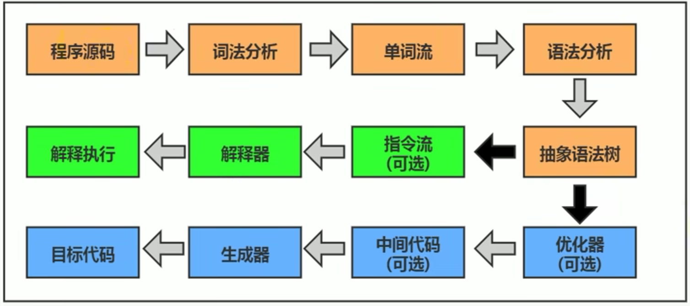
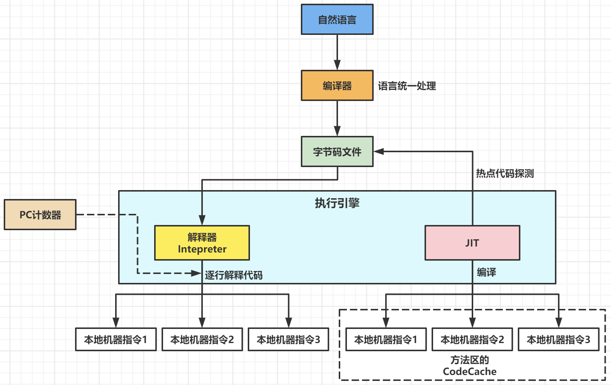

# 执行引擎概述

  

- 执行引擎：将字节码指令解释/编译为对应平台上的本地机器指令（高级语言->机器语言）。
  - 物理机的执行引擎：直接建立在处理器、缓存、指令集、操作系统层面。
  - 虚拟机的执行引擎：由软件自行实现，不受物理条件制约地定制指令集和执行引擎地结构体系，能够执行不被硬件直接支持的指令集格式。

> JVM的主要任务是负责装载字节码到其内部，但字节码（高级语言）并不能直接运行在操作系统（机器语言），因此需要执行引擎。

  

- 从外观上看，所有JVM的执行引擎输入、输出都是一致的：
  - 输入：字节码二进制流。
  - 处理过程：字节码解析执行的等效过程。
  - 输出：执行结果。

# 编译和执行

- Java：半编译半解释型语言。

  

  

> 字节码：中间状态的二进制代码（中间码），需要直译器转译为机器语言。
>
> - 与硬件环境无关：实现特定的软件运行和软件环境。
>
> - 编译器将源码编译成字节码，特定平台的虚拟机器将字节码转译为可直接执行的指令。

- HotSpot采用解释器和JIT编译器并存的架构：解释执行在编译器进行激进优化不成立时，作为编译器的逃生门。
- JVM启动时，解释器首先发挥作用，而不必等待JIT编译器全部编译完成后再执行，省去许多不必要的编译时间。随着时间的推移，JIT编译器发挥作用，根据热点探测功能，将有价值的字节码编译为本地机器指令，获得更高的执行效率。

> - 当程序启动后，解释器立即执行，省去编译的时间。而编译器需要把代码编译成本地代码，需要一定执行时间，但编译之后执行效率更高。
>
> - 服务端应用不关注启动时间，而注重启动速度的场景则需要解释器和编译器并存架构的相互平衡。

## 解释器 解释执行

- 解释器（Interpreter）：运行时，根据预定义的规范对字节码采用逐行解释的方式执行，将每条字节码文件中的内容“翻译”为对应的本地机器指令执行。

| 解释器       | 说明                                                         |
| ------------ | ------------------------------------------------------------ |
| 字节码解释器 | 执行时通过纯软件代码模拟字节码的执行，效率低下。             |
| 模板解释器   | 每一条字节码和一个模板函数相关联，模板函数直接产生这条字节码执行时的机器码。 |

- HotSpot VM解释器构成：
  - Interpreter模块：解释器的核心功能。
  - Code模块：管理HotSpot VM运行时生成的本地机器指令。
- 解释执行：基于解释器执行，比编译执行低效。

## 编译器 编译执行

- Java的编译期是不确定的：

| 编译器                                             | 作用                            | 具体                                                |
| -------------------------------------------------- | ------------------------------- | --------------------------------------------------- |
| 前端编译器                                         | .java文件转化为.class文件       | Javac<br />增量式编译器ECJ                          |
| 后端编译器 <br />JIT（Just In Time Compiler）      | 字节码转化为机器码              | C1、C2编译器                                        |
| 静态提前编译器 <br />AOT（Ahead Of Time Compiler） | .java文件直接转化为本地机器代码 | GCJ（GNU Compiler for the Java）<br />Excelsior JET |

- JIT编译器（Just In Time Compiler）：将整个函数体编译为机器码，每次函数执行时，只执行编译后的机器码。

# 热点代码探测

## 热点代码

- 热点代码：需要被编译为本地代码的字节码，由代码被调用执行的频率而定。一个被多次调用的方法、一个方法体内部循环次数较多的循环体。
  - 发生在方法执行过程：栈上替换 OSR（On Stack Replacement）。
  - JIT编译器运行时会针对热点代码进行深度优化，将其直接编译为对应平台的本地机器指令。

## 热点探测

- 热点探测：触发JIT编译的阈值。（确认为热点代码的阈值）
  - HotSpot：基于计数器的热点探测，为每个方法都创建2个不同类型的计数器：

| 计数器                                 | 说明                     |
| -------------------------------------- | ------------------------ |
| 方法调用计数器<br />Invocation Counter | 统计方法的调用次数       |
| 回边计数器<br />Back Edge Counter      | 统计循环体执行的循环次数 |

### 方法调用计数器

#### 计数器阈值

```shell
# 方法调用计数器阈值设置，默认Client模式1500次、Server模式10000次。
-XX:CompileThreshold
```

- 当一个方法被调用时，先检查该方法是否存在被JIT编译过的版本。如果存在，则优先使用编译后的本地代码执行；如果不存在，则将此方法的调用计数器值+1，然后判断方法调用器与回边计数器之和是否超过方法调用计数器的阈值。如果超过阈值，则向JIT提交该方法的代码编译请求。

 

#### 热度衰减

- 热度衰减（Count Decay）：如果不做任何设置，方法调用计数器统计的不是方法被调用的绝对次数，而是一个相对的执行频率（一段时间内方法被调用的次数）。当超过一定的时间限度，如果方法的调用次数不足以让方法提交给JIT编译，则该方法的调用计数器就会被减少一半（方法统计的半衰周期，Count Half Life Time）。
- 热度衰减是在JVM进行垃圾收集时顺便进行的。

```shell
# 关闭热度衰减，让方法计数器统计方法调用的绝对次数，只要时间够长，绝大多数的方法都会被编译成本地代码。
-XX:-UseCounterDecay

# 设置半衰周期时间（秒）
-XX:CounterHalfLifeTime
```

### 回边计数器

- 回边计数器：统计循环体代码执行的次数，为触发OSR编译。
  - 回边（Back Edge）：字节码中遇到控制流向后跳转的指令。

 

# HotSpot设置执行方式

## 解释器、JIT

- HotSpot VM：默认采用解释器和即时编译器并存的架构，可通过指令设置。

```shell
# 完全采用解释器模式
-Xint

# 完全采用JIT模型，如果JIT出现问题，解释器介入执行
-Xcomp

# 默认，二者并存的混合模式
-Xmixed
```

## C1、C2

- HotSpot内嵌两个JIT编译器：

| JIT            | C1：Client Compiler                            | C2：Server Compiler                            |
| -------------- | ---------------------------------------------- | ---------------------------------------------- |
| 模式           | -client：指定JVM运行在Client模式，使用C1编译器 | -server：指定JVM运行在Server模式，使用C2编译器 |
| 特点           | 对字节码简单、可靠的优化，耗时短，编译更快     | 耗时长的优化、激进优化，优化的代码执行效率高   |
| 优化<br />策略 | 方法内联、去虚拟化、冗余消除                   | 标量替换、栈上分配、同步消除+laj               |

- 分层编译策略（Tiered Compilation）：Server模式默认开启，由C1、C2协作编译。
  - 不开启性能监控：可触发C1编译（简单优化）。
  - 开启性能监控：C2编译根据性能监控信息进行激进优化。

## Graal

```shell
# Graal开关参数
-XX:+UnlockExperimentalVMOptions
-XX:+UseJVMC1Compiler
```

## AOT

- AOT（Ahead Of Time Compiler）静态提前编译器：在程序运行之前，将字节码转化为机器码。

> JIT：程序运行时，将字节码转化为机器码。

- jaotc：借助Graal编译器，.java-->.class-->机器码，并放至生成的动态共享库中。
- 在JVM加载前编译成二进制库，可直接执行，而不必等待JIT的预热。

1. 不符合java“一次编译，到处执行”：必须为每个不同的硬件、OS编译对应的发行包。
2. 降低了Java链接过程的动态性，加载的代码在编译期就必须全部已知。

