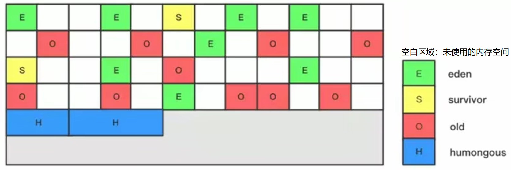
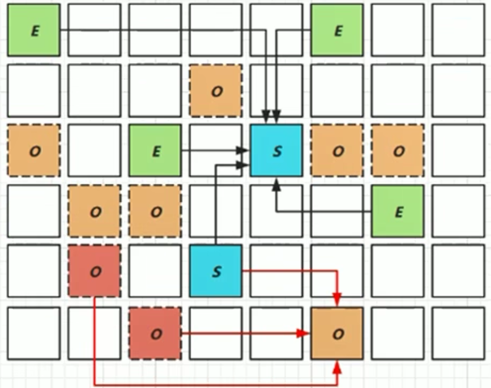

# G1 GC概述

- G1 GC（垃圾优先 Garbage First）：全功能的并行收集器。在延迟可控的情况下，获取尽可能高的吞吐量。
  - Jdk9之后的默认GC。

> 服务器端应用：多核CPU、大容量内存的机器。

| G1特点                                               | 说明                                                         |
| ---------------------------------------------------- | ------------------------------------------------------------ |
| 并行与并发                                           |                                                              |
| 分代收集                                             | 将堆空间分为年轻代、老年代，但不要求空间连续，不固定大小。<br />分为若干个Region，包含逻辑上的老年代、年轻代。 |
| 空间整合                                             | 回收以Region为单位，Region之间使用复制算法，整体使用Mark-Compact。 |
| 可预测的停顿时间模型<br />（软实时：soft real-time） | 可指定在一个长度为M ms的时间片段内，消耗在垃圾收集的时间不得超过N ms。 |

- HotSpot：GC线程处理速度慢时，G1 GC可以采用应用线程承担后台运行的GC工作，帮助加速垃圾回收过程。

| 参数                               | 说明                                                         |
| ---------------------------------- | ------------------------------------------------------------ |
| -XX:+UseG1GC                       | 指定使用G1 GC                                                |
| -XX:G1HeapRegionSize               | 设置Region大小。值为2的n次方，范围：1 MB `~` 32 MB。<br />根据最小的Java堆大小划分出约2048个Region。<br />默认是堆内存的1/2000。 |
| -XX:MaxGCPauseMillis               | 设置期望达到的最大GC停顿时间（JVM尽量达到）。<br />默认200ms。 |
| -XX:ParallelGCThread               | 设置并行垃圾回收工作线程数（STW），最多8。                   |
| -XX:ConcGCThreads                  | 设置并发标记的线程数。<br />通常设置为并行垃圾回收线程数的1/4。 |
| -XX:InitiatingHeapOccupancyPercent | 设置触发并发GC周期的Java堆占用率阈值。<br />默认45（%）。    |

# Region 分区

- 分区（Region）：将Java堆分割为约2048个独立区域（Region）（物理不连续），有计划地避免对整个Java堆全区域的垃圾收集。所有的Region大小相同，且在JVM生命周期内不会被改变。
- G1 GC每次根据允许的收集时间，优先回收价值最大的Region：G1跟踪各个Region里垃圾堆积的价值大小（回收所获得的空间大小、回收所需空间的经验值），在后台维护一个优先列表（指针碰撞、TLAB）。
- 老年代和新生代不再是物理隔离的，而是一部分Region的集合（可以物理不连续），通过Region的动态分配方式实现逻辑连续。



- 一个Region可能属于Eden、Survivor、Old/Tenured内存区域，但同一时刻一个Region只能属于一个角色。

> 如果一个Region在GC之前属于Eden区域，在GC之后可能属于Survivor区域。不能既是Eden、也是Survivor。

- Humongous内存区域：存储大对象，如果超过1.5个Region大小，则放到该内存区域。
  - 对于堆中的大对象，默认直接分配到老年代，但如果是短期存在的大对象，则不太合适。因此，G1划分Humongous区存放大对象，如果一个H区装不下一个大对象，则进行一次Full GC，再寻找连续的H区存放。

# 回收过程

 

1. 应用程序分配内存，年轻代的Eden区用尽时，开始Young GC（并行的独占式收集器），从年轻代区间移动存活对象到Survivor区间、老年区间。

2. Java堆内存使用率达到阈值时（-XX:InitiatingHeapOccupancyPercent），开始老年代并发标记过程（Concurrent Marking）。

3. 标记完成后，开始Mixed GC：G1 GC从老年区间移动存活对象到空闲区间，不需要整个老年代都被回收，一次只需要扫描/回收一小部分老年代的Region（和年轻代一起被回收）。

## Remembered Set 记忆集

- 一个Region中的对象有可能被其他任意Region中的对象引用，判断对象存活时，使用Remembered Set来避免全局扫描。

> 在没有Remmber Set的情况下：如果一个Eden区Region的对象被一个Old区Region的对象引用，在判断对象存活时，需要对整个Java堆扫描才能保证判断准确。

  

- 每个Region都有一个对应的Remember Set。

1. 每次Reference类型数据写操作时，都会产生一个Write Barrier暂时中断操作，检查将要写入的引用指向的对象是否和该Reference类型数据在不同的Region。
   - 其他收集器：检查老年代对象是否引用类新生代对象。
2. 如果不同，通过CardTable把相关引用信息记录到引用指向对象的所在Region对应的Remember Set中。
3. 垃圾收集时，在GC根节点的枚举范围加入Remember Set，保证不进行全局扫描、也不会有遗漏。

## Young GC

1. 扫描GC Roots：根引用连同Remembered Set记录的外部引用作为扫描存活对象的入口。

2. 更新Remebered Set：处理Dirty Card Queue中的Card，更新Remembered Set。完成后，Remembered Set可以准确反映老年代对所在Region中对象的引用。

   > Dirty Card Queue：对于引用赋值语句obj.filed=obj，JVM在之前和之后执行特殊操作以在Dirty Card Queue中入队一个保存对象引用信息的Card。Young GC时，G1 GC对Dirty Card Queue中所有的Card进行处理，以更新Remember Set，保证Remember Set准确反映老年代的对象引用。
   >
   > - 如果直接在引用赋值语句处更新Remember Set，则需要线程同步，开销大。

3. 处理RememberSet：识别被老年代指向的Eden中的对象，认为是存活的对象。

4. 复制对象：对象树被遍历，Eden区Region中存活的对象会被复制到Survivor区中空的Region；Survivor区Region中存活的对象如果年龄未达到阈值，则年龄+1，达到阈值则被复制到Old区中空的Region。如果Survivor区空间不足，Eden区的部分数据会直接晋升到老年代空间。

5. 处理引用：最终Eden区空间的数据为空，GC停止工作，目标内存中的对象都是连续存储的，没有碎片。

## Concurrent Marking

1. 初始标记阶段：标记从根结点直接可达的对象。STW、触发一次Young GC。
2. 根区域扫描（Root Region Scanning）：G1 GC扫描Survivor区直接可达的老年代Region对象，并标记被引用的对象。必须在Young GC之前完成。
3. 并发标记（Concurrent Marking）：在整个Java堆中进行并发标记（与应用程序并发执行），可能被Young GC中断。在该阶段，若发现Region中的所有对象都是垃圾，则该Region被立即回收。同时，计算每个Region中的对象活性。
4. 再次标记（Remark）：由于应用程序持续执行，需要修正上次的标记结果，STW。初始快照算法（snapshot-at-the-beginnig SATB）。
5. 独占清理（cleanup、STW）：计算各个Region的存活对象和GC回收比例，并进行排序，识别可以混合回收的Region。并不进行垃圾收集。
6. 并发清理阶段：识别并清理完全空闲的Region。

## Mixed GC

- Mixed GC：回收整个Young Region、部分Old Region。

 

- Concurrent Marking之后，老年代中完全为垃圾的Region被回收，部分为垃圾的Region被计算出来，这些Old Region会分8次（默认8次）被回收，复制算法。

```
-XX:G1MixedGCCountTarget
```

- Mixed GC不一定要进行8次：如果发现可以回收的垃圾占堆内存的比例低于10%（阈值默认10%），则不再进行Mixed GC。

```
-XX:G1HeapWastePercent
```

- 混合回收的回收集（Collection Set）包括：1/8的Old Region、Eden Region、Survivor Region。

- G1优先收集垃圾多的Region：垃圾占比越高（阈值默认为65%），越先被回收。垃圾占Region比例达到65%时才会被回收，如果垃圾占比太低、存活的对象占比高，则复制时需要花费更多的时间。

```
-XX:G1MixedGCLiveThresholdPercent
```

## Full GC（可选后备）

1. 回收（Evacuation）时没有足够的to-space存放晋升的对象。
2. 并发处理过程完成之前空间耗尽。

# 相关建议

- 年轻代大小：避免使用-Xmn、-XX:NewRatio等参数显示设置年轻代大小。固定年轻代的大小会覆盖暂停时间目标（Young GC可能来不及完成，从而延长时间）。
- 暂停时间目标不要过于苛刻：G1 GC的吞吐量目标是90%的应用程序时间和10%的垃圾回收时间。目标过于苛刻意味着更多的垃圾回收开销、直接影响吞吐量。

