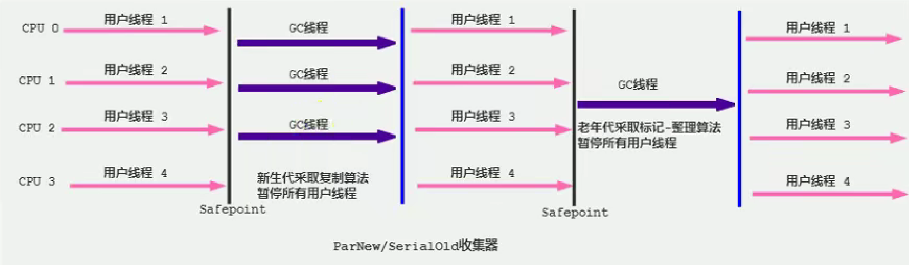
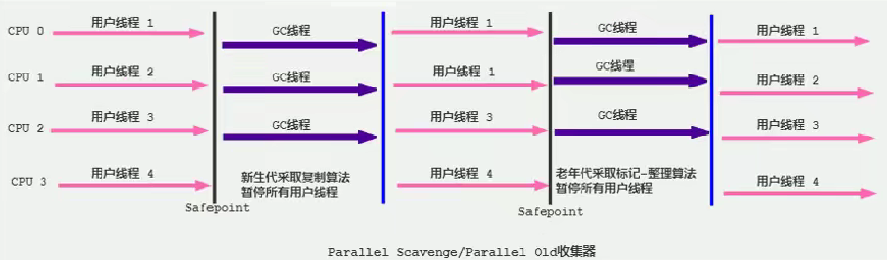
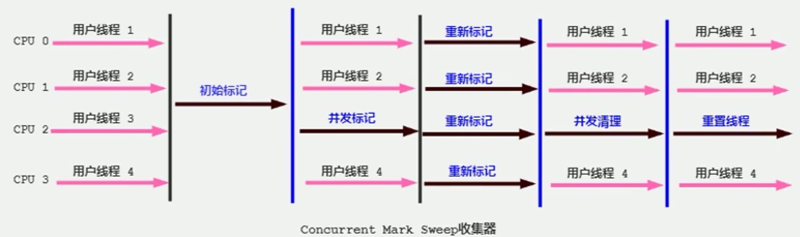

# GC概述

> - 哪些内存需要回收？
>
> - 什么时候回收？
>
> - 如何回收？

- 垃圾：运行程序中没有任何指针指向的对象。如果不对这些垃圾进行回收，所占用的空间会一直保留到程序结束而无法被其他对象使用，甚至内存溢出。
- 早期的垃圾回收：内存泄漏问题。

> 内存泄漏：一处内存区间由于程序员编码的问题而忘记被回收，就会产生内存泄漏，垃圾对象永远无法被清除，随着系统运行时间的不断增长，垃圾对象所耗内存可能持续上升，直到内存溢出并造成应用程序崩溃。 

- Java自动内存管理：黑匣子问题，实施必要的监控和调节。

- GC工作的区域：Java堆、方法区。  

  - 频繁收集Young区。
  - 较少收集Old区。
  - 基本不动Perm区/Metaspase。

# GC算法

## 标记阶段

- 垃圾标记阶段：对象存活判断。
- 死亡对象：一个对象不再被任何的存活对象引用。

### 引用计数算法

> Java未采用引用计数算法。
>
> Python采用引用计数算法，解决：
>
> - 手动解除。
> - 弱引用（weakref）。

- 引用计数算法（Reference Counting）：对对象保存一个整型的引用计数器属性，记录对象被引用的情况。
- 对一个对象，只要有任何一个对象引用了该对象，则该对象的引用计数器+1；当引用失效，引用计数器-1。当该对象的引用计数器=0，表示该对象不可能再被使用，可进行回收。

| 分析 | 说明                                                         |
| ---- | ------------------------------------------------------------ |
| 优点 | 1. 实现简单，垃圾对象便于辨识。<br />2. 判定效率高，回收没有延迟性。 |
| 缺点 | 1. 存储空间开销：单独的字段存储计数器。<br />2. 时间开销：每次赋值都需要更新计数器。<br />3. 无法处理循环引用。 |

- 循环引用问题：相互引用，导致内存泄漏。

 

### 可达性分析算法-GC Roots

- 可达性分析算法（根搜索算法、追踪性垃圾收集）（Tracing Garbage Collection ）。
- 可达性分析必须在一个能保障一致性的快照中进行：导致GC进行时必须“Stop The World”。

> 即使是CMS收集器也必须在枚举根节点时停顿。

- 根对象集合（GC Roots）：一组必须活跃的引用。

1. 以根对象集合为起始点，从上到下搜索被根对象集合所连接的目标对象是否可达。
2. 引用链：搜索所经过的路径，可达性分析之后，内存中的存活对象都被根对象集合直接/间接连接。
3. 如果对象没有任何的引用链（不可达），则对象死亡，标记为垃圾对象。

 

- 固定的GC Roots集合包括：
  - 虚拟机栈中引用的对象。
  - 本地方法栈内JNI引用的对象。
  - 方法区中类属性引用的对象。
  - 方法区中常量引用的对象。
  - 所有被同步锁sychronized持有的对象。
  - JVM内部的引用：基本数据类型对应的Class对象、一些常驻的异常对象、系统类加载器。
  - 反映JVM内部情况的JMXBean、JVMTI中注册的回调、本地代码缓存等。
- 临时性加入的GC Roots：根据用户所选用的垃圾收集器以及当前回收的内存区域的不同，可以有其他对象临时性的加入GC Roots集合。（分代收集、局部回收Partial GC）
  - 如果只针对Java堆中的某一块区域进行垃圾回收，必须考虑到内存区域是JVM自身的实现细节，更不是独立封闭的，该区域的对象完全有可能被其他区域的对象所引用（如：新生代的对象被老年代的对象引用），此时，需要一并将关联的区域对象也加入到GC Roots中考虑。

### 对象终止机制 finalization

- 对象终止机制（finalization）：对象被销毁之前的自定义处理逻辑。
- Object#finalize()：垃圾回收时由垃圾回收器在对象上调用，只会被调用一次。
  - 可能导致对象的复活。
  - 执行时间没有保障：完全由GC线程决定，低优先级的Finalizer线程。

```java
protected void finalize() throws Throwable { }
```

- JVM中的对象一般处于3种可能的状态：只有在不可触及状态下才可以被回收。

| 状态     | 说明                                                       |
| -------- | ---------------------------------------------------------- |
| 可触及   | 从根节点开始，可以到达该对象。                             |
| 可复活   | 对象的所有引用都被释放，但该对象可能在finalize()复活。     |
| 不可触及 | 对象的finalize()被调用，且该对象没有复活。（不可能被复活） |

- 判断一个对象是否可回收，至少经过两次标记过程：

1. 如果该对象到GC Roots没有引用链，则进行第一次标记。
2. 筛选，判断该对象是否有必要执行finalize()：
   1. 如果该对象没有重写finalize()、finalize()已经被JVM调用过：没有必要执行，该对象被判断为不可触及。
   2. 如果该对象重写了finalize()、且还未被JVM调用过：将该对象插入到F-Queue队列，由一个JVM自动创建的、低优先级的Finalizer线程触发执行。
   3. finalize()是对象逃脱死亡的最后机会，之后GC会对F-Queue中的对象进行第二次标记。如果该对象在finalize()中与引用链上的任何一个对象建立了联系，则第二次标记时，该对象被移出“即将回收”集合。否则被判断为不可触及。
   4. 之后，如果该对象再次出现没有引用存在的情况，finalize()不会被调用，直接判断为不可触及。

 

### GC Roots溯源

#### HeapDump文件

##### jmap

```
jmap -dump:format=b,live,file=输出文件名.bin 进程号
```

##### visulvm


##### MAT

- MemoryAnalyzer.ini：如果当前Jdk版本不适合，添加代码，参考以下：

```ini
-vm
D:/Java/jdk-18.0.1.1/bin
```


##### JProfiler

#### OOM

- 设置出现OOM时生成HeapDump文件：

```
-XX:+HeapDumpOnOutOfMemoryError
```

## 清除阶段

### 标记-清除算法 Mark-Sweep

- 标记-清除算法：当堆中的有效内存空间（available memory）被耗尽，Stop The World，然后进行以下：

1. 标记：Collector从引用根节点开始遍历，标记所有被引用的对象（对象Header中记录为可达对象的）。
2. 清除：Collector对堆内存从头到尾进行线性遍历，如果发现某个对象的Header没有标记为可达对象，则将其回收。
   - 并非置空，而是将需要清除的对象地址保存在空闲列表中，当有新对象需要加载时，判断垃圾的位置空间是否足够，如果足够，则覆盖。

- 缺陷：

1. 效率不算高。
2. STW。
3. 清理的空间内存是不连续的，产生内存碎片，需要维护一个空闲列表。

### 复制算法

- 复制算法：将活着的内存空间分为两块，每次只使用其中一块。在垃圾回收时，将正在使用的内存中的存活对象复制到未被使用的内存块中，之后清除正在使用的内存块中的所有对象，交换两个内存的角色，最后完成垃圾回收。

> Survivor0、Survivor1使用的是复制算法。
>
>  

- 优点：

1. 没有标记-清除，运行高效。

2. 空间连续性，避免碎片问题。

- 缺点：

1. 2倍的内存空间。

2. 对于G1（分拆为大量region的GC），复制-移动的过程地址改变，GC需要维护region之间的对象引用关系，开销大。

- 复制算法理想情况：垃圾对象多，而复制的存活对象应尽量少。

### 标记-压缩（整理）算法  Mark-Compact

- Mark-Compact（ Mark-Sweep-Compact）：

1. 标记：从引用根节点开始遍历，标记所有被引用的对象。
2. 压缩：将所有的存活对象压缩到内存的一端，按顺序存放，之后清除边界外的所有空间。

- 优点：对标记-清除算法、复制算法的优化。

1. 标记清除算法：内存区域分散的缺点。标记-压缩算法分配新对象时，JVM只需持有一个内存的起始地址。
2. 复制算法中：内存减半的代价。

- 缺陷：

1. 效率低于复制算法。
2. 移动对象的同时，如果对象被其他对象引用，则需要调整引用的地址。
3. STW。

| 比较     | 标记-清除        | 标记-压缩          | 复制算法                              |
| -------- | ---------------- | ------------------ | ------------------------------------- |
| 速度     | 中               | 慢                 | 快                                    |
| 移动对象 | 否               | 是                 | 是                                    |
| 空间开销 | 少<br />堆积碎片 | 少<br />不堆积碎片 | 需要存活对象的2倍空间<br />不堆积碎片 |

### 分代收集算法

- 分代收集算法：不同生命周期的对象采取不同的收集方式。
  - 年轻代（Young Gen）：区域较小、对象生命周期短、存活率低、回收频繁。
    - 复制算法：survivor1、survivor2。
  - 老年代（Tenured Gen）：区域较大、对象生命周期长、存活率高、回收不如年轻代频繁。
    - 标记-清除、标记-整理的混合实现：
      - Mark：开销和存活对象数量成正比。
      - Sweep：开销和所管理区域大小成正比。
      - Compact：开销和存活对象数量成正比。

> Hotspot的CMS回收器：CMS基于Mark-Sweep实现，对象的回收率高。
>
> - 碎片问题：CMS采用基于Mark-Compact算法的Serial Old回收器作为补偿。当内存回收不佳时（碎片导致的Concurrent Mode Failure），采用Serial Old执行Full GC以达到对老年代内存的整理。

### 增量收集算法

- 增量收集算法：每次垃圾收集线程只收集一小片的内存空间，垃圾收集线程和应用程序线程交替执行、直到垃圾收集完成。
  - 对线程间冲突的处理：允许垃圾收集线程以分阶段的方式完成工作。
  - 切割STW的停顿时间。
- 缺陷：线程切换、上下文转换的消耗导致垃圾回收的总体成本上升，造成系统吞吐量下降。

### 分区算法

- 分区算法：将整个堆空间划分成连续的不同小区间。
  - 根据目标停顿时间，每次合理地回收若干个小区间。

> 一般情况下，在相同条件下，堆空间越大，一次GC所需要的时间就越长，有关GC产生的停顿也越长。

> 分代算法：按对象生命周期划分。

# GC相关

## System.gc()

- gc()：触发Full GC。
  - System.gc()：附带免责声明，无法保证对垃圾收集的调用。

```java
public static void gc() {
    Runtime.getRuntime().gc();
}
```

- System#runFinalization()：  强制调用失去引用对象的finalize()。

```java
public static void runFinalization() {
    Runtime.getRuntime().runFinalization();
}
```

> buffer不会被回收：虽然超过了作用域，但此时buffer仍然在局部变量表中保存引用，占据一个Slot。
>
> ```java
> public void localvarGC1() {
>  {
>      byte[] buffer = new byte[10 * 1024 * 1024];
>  }
>  System.gc();
> }
> ```
>
> buffer被回收：value重用了buffer的Slot，buffer失去引用。
>
> ```java
> public void localvarGC2() {
>  {
>      byte[] buffer = new byte[10 * 1024 * 1024];
>  }
>  int value = 10;
>  System.gc();
> }
> ```
>
> ​    localvarGC1()中的buffer在localvarGC3()中被回收：localvarGC1()栈帧被弹出，buffer失去引用。
>
> ```java
> public void localvarGC3() {
>  localvarGC1();
>  System.gc();
> }
> ```

## 内存溢出、内存泄漏

- 内存溢出（OOM）：没有空闲内存、且垃圾收集器无法提供更多内存。

1. 没有空闲内存：

   1. JVM堆空间设置不够：-Xms、-Xmx。
   2. 创建大量大对象，且长时间（存在引用）不能被垃圾收集器回收。
      - Java.lang.OutOfMemoryError: PermGen space：永久代，内存大小有限。
      - Java.lang.OutOfMemoryError:  Matespace：元数据区，直接内存不足。

2. 抛出OOM前，通常会触发GC。如果分配一个超大对象，JVM判断GC不能解决，则直接抛出OOM。

- 内存泄漏（存储渗漏）Memory Leak：对象不再被程序使用，但GC无法回收该对象。逐步蚕食内存空间（虚拟内存），直至OOM。
  - 宽泛意义：对象生命周期过长，甚至导致OOM。

 

> 内存泄漏举例：
>
> 1. 单例模式：单例的生命周期和应用程序一样长。在单例程序中，如果持有对外部对象的引用，则该外部对象不能被回收，导致内存泄漏。
> 2. 一些需要close()的资源未被释放，导致内存泄漏：数据库连接（dataSource.getConnection()）、网络连接（socket）、I/O等。

## STW

- Stop The World：GC事件发生过程中，产生程序的停顿，停顿时整个应用程序线程被暂停。完成GC后恢复被STW中断的应用程序线程。

> 可达性分析算法中枚举GC Roots时，STW：保证一致性。

- STW是所有GC不可避免的事件，由JVM在后台自动发起和完成。

## 垃圾回收的并行、并发

> | 方式 | 说明                                                         |
> | ---- | ------------------------------------------------------------ |
> | 并发 | 操作系统中，一个时间段内有多个程序都处于启动运行到运行完毕之间，且这几个程序都是在同一个处理器上运行。<br />CPU将一个时间段划分为几个时间片段，在这几个时间区间之间切换。 |
> | 并行 | 系统中有一个以上CPU时，当一个CPU执行一个进程时，另一个CPU执行另一个进程，两个进程互不抢占CPU资源，同时进行。<br />决定因素：CPU的核心数量。 |
>
> 

| 线程数        | 说明                                               |
| ------------- | -------------------------------------------------- |
| 并行 Parallel | 多条垃圾收集线程并行工作，此时用户仍处于等待状态。 |
| 串行 Serial   | 单线程执行。<br />Client模式默认应用。             |

| 工作模式        | 说明                                                         |
| --------------- | ------------------------------------------------------------ |
| 并发 Concurrent | 用户线程、垃圾收集线程同时执行（并行/交替执行），垃圾收集线程执行时不会停顿用户线程。 |
| 独占            | STW                                                          |

 

## 安全点、安全区域

- 安全点（Safe Point）：程序只有特定的位置才能停顿下来开始GC，并非所有地方都行。
- 是否具有让程序长时间执行的特征：安全点太少可能导致GC等待时间过长，过多可能导致运行时的性能问题。
- 如何在GC发生时，检查所有线程是否处于最近的安全点停顿：

| 方式                           | 说明                                                         |
| ------------------------------ | ------------------------------------------------------------ |
| 抢先式中断<br />（已都不采用） | 首先中断所有线程，如果还有线程不在安全点，则恢复该线程，使其前往安全点。 |
| 主动式中断                     | 设置一个中断标志，各个线程运行到Safe Point时，主动轮询该标志。如果标志为真，则将自身中断挂起。 |

- 安全区域（Safe Region）：在一段代码片段中，对象的引用关系不会发生变化，在该区域的任何位置开始GC都是安全的。

> 安全区域解决的问题：如果线程处于Sleep、Blocked状态，无法响应JVM的中断请求，JVM也不大可能等待线程被唤醒。

1. 线程运行到Safe Region的代码区时，标识已经进入Safe Region。如果这段时间内发生GC，JVM会忽略标识为Safe Region状态的线程。
2. 当线程离开Safe Region时，会检查JVM是否已经完成GC。如果GC完成了，则继续运行；否则线程必须等待，直到收到可以安全离开Safe Region的信号为止。

## 引用

- 引用强度：强引用 > 软引用 > 弱引用 > 虚引用。
- 除强引用外，其他引用都处于java.lang.ref：

 

- 只有终结器引用 FianlReference的权限修饰符是缺省的（包内可见），其余都是public。

| 引用                         | 说明                                                         |
| ---------------------------- | ------------------------------------------------------------ |
| 强引用<br />StrongReference  | 普遍存在的、默认的引用。<br />只要存在强引用关系，垃圾收集器就不会回收掉引用的对象。 |
| 软引用<br />SoftReference    | 将要发生内存溢出时，会把这些对象列入回收范围内进行第二次回收。 |
| 弱引用<br />WeakReference    | 被软引用关联的对象只能存活到下一次垃圾收集之前，当垃圾收集器工作时，无论内存空间是否足够，都会回收掉被弱引用关联的对象。 |
| 虚引用<br />PhantomReference | 虚引用不会对对象的生存时间构成影响，也无法通过虚引用来获得一个对象的实例。<br />虚引用关联的目的：在该对象被垃圾收集器回收时，收到一个系统通知。 |

### 强引用

- 强引用的对象是可触及的，垃圾回收器不会回收该类对象。
- 强引用：new创建对象。

1. 强引用可直接访问目标对象。
2. 强引用指向的对象任何时候都不会被系统回收，即使抛出OOM。
3. 强引用可能导致内存泄漏。

### 软引用 SoftReference

- 软引用：非必需的对象（内存敏感的缓存）。将要发生OOM、内存空间不足时，会把这些对象列入回收范围内进行第二次回收。
- 垃圾回收器在某个时刻决定回收可达的对象时，会清理软引用，并可选地将引用存放到一个引用队列（Reference Queue）。

```java
SoftReference<Person> userSoftRef = new SoftReference<Person>(new Person("Tom",12));
```

### 弱引用 WeakReference

- 弱引用：非必需的对象（可有可无的缓存数据）。只被软引用关联的对象只能存活到下一次垃圾收集之前。在GC时，只要发现弱引用，就会回收只被弱引用关联的对象。
- 由于垃圾回收器的线程通常优先级很低，并不一定很快就发现持有弱引用的对象，此时，弱引用对象可以存活较长时间。
- 在构造弱引用时，可指定一个引用队列，当弱引用对象被回收时，就会加入到指定的引用队列中，通过该队列可以跟踪对象的回收情况。

```java
WeakReference<Person> userSoftRef = new WeakReference<Person>(new Person("Tom",12));
```

- WeakHashMap：`Entry<K,V>[] table;`

```java
private static class Entry<K,V> 
    extends WeakReference<Object> 
    implements Map.Entry<K,V> {

    ...
}
```

### 虚引用 PhatomReference

- 虚引用（幽灵引用、幻影引用）：虚引用不会对对象的生存时间构成影响，也无法通过虚引用来获得一个对象的实例（get()获取的是null）。如果一个对象仅持有虚引用，则该对象几乎等同于没有引用。
- 虚引用必须和引用队列一起使用：虚引用在创建时必须提供一个引用队列作为参数，当垃圾回收器准备回收一个对象时，如果发现其存在虚引用，则在回收该对象之后，将该虚引用加入引用队列，以通知应用程序对象的回收情况。
  - 跟踪对象的回收时间：可将一些资源释放操作置于虚引用中执行和记录。

```java
ReferenceQueue<Person> phantomQueue = new ReferenceQueue<Person>();
PhantomReference<Person> phantomRef = new PhantomReference<Person>(new Person(), phantomQueue);

System.out.println(phantomRef.get()); //null
```

### 终结器引用 FianlReference

- 终结器引用：用以实现对象的fianlize()，无需手动编码，其内部配合引用队列使用。GC时，终结器引用入队，由Finalizer线程通过终结器引用找到被引用对象，并调用其finalize()，如果复活，则第二次GC时才能回收被引用对象。

# 垃圾回收器概述

## GC分类

- 按线程数：串行回收、并行回收。
- 按工作模式：并发式、独占式。
- 按碎片处理方式：压缩式、非压缩式。
- 按工作内存区间：年轻代、老年代。

## GC性能指标

| 性能指标     | 说明                                                         |
| ------------ | ------------------------------------------------------------ |
| **吞吐量**   | 运行用户代码时间占总运行时间的比例。<br />总运行时间 = 程序的运行时间 - 内存回收的时间。 |
| 垃圾收集开销 | 吞吐量的补数<br />垃圾收集所用时间与总运行时间的比例。       |
| **暂停时间** | 执行垃圾收集时，程序的工作线程被暂停的时间。                 |
| 收集频率     | 相对于应用程序的执行，收集操作发生的频率。                   |
| **内存占用** | Java堆区所占的内存大小。                                     |
| 快速         | 一个对象从诞生到被回收所经历的时间。                         |

> 不可能铁三角：吞吐量、暂停时间、内存占用。
>
> - 随着硬件性能的提升：
>
> 1. 对内存占用的容忍越大。
> 2. 有助于降低收集器运行时对应用程序的影响，提高了吞吐量。
> 3. 而内存的扩大，对延迟带来负面效果。

- 吞吐量（throughout）：CPU用于运行用户代码的时间与CPU总消耗时间的比值。

$$
吞吐量 = \frac{运行用户代码时间}{运行用户代码时间+垃圾收集时间}
$$

- 高吞吐量的应用程序能忍受较高的暂停时间。
  - 高吞吐量：降低内存回收的执行频率、GC需要更长的暂停时间来执行内存回收。
  - 吞吐量优先：在最大吞吐量优先的情况下，降低停顿时间。

 

## GC迭代史

| JDK   | 说明                                                         |
| ----- | ------------------------------------------------------------ |
| 1.3.1 | 串行 Serial GC                                               |
| 1.4.2 | Parallel GC<br />Concurrent Mark Sweep GC （CMS GC）         |
| 1.6   | Parallel GC 作为Hotspot默认GC                                |
| 1.7u4 | G1可用                                                       |
| 9     | G1作为默认的垃圾收集器，替代CMS                              |
| 10    | G1垃圾回收器的并行完整垃圾回收，实现并行性来改善最坏情况下的延迟 |
| 11    | Epsilon垃圾回收器（No-Op）<br />ZGC：可伸缩的低延迟垃圾回收器（实验Experimental） |
| 12    | 增强G1：自动返回未用堆内存给操作系统<br />引入Shenandoah GC：低停顿时间的GC（Experimental） |
| 13    | 增强ZGC：自动返回未用堆内内存给操作系统                      |
| 14    | 删除CMS垃圾回收器<br />扩展ZGC在maxOS、Window的应用          |

# 经典垃圾收集器

| 分类       | 经典垃圾收集器                                  |
| ---------- | ----------------------------------------------- |
| 串行回收器 | Serial<br />Serial Old                          |
| 并行回收器 | ParNew<br />Parallel Scavenge<br />Parallel Old |
| 并发回收器 | CMS<br />G1                                     |

- 组合关系：

 

- 查看默认的垃圾收集器：（查看相应的参数）

```
-XX:+PrintCommandLineFlags
```

```shell
jinfo -flag 相关垃圾回收器参数 进程ID
```

> -XX:+UseParallelGC 

| GC                | 分类           | 作用位置       | 算法                   | 特点（优先） | 适用场景                   |
| ----------------- | -------------- | -------------- | ---------------------- | ------------ | -------------------------- |
| Serial            | 串行           | Young          | 复制                   | 低延迟       | 单CPU的Client模式          |
| ParNew            | 并行           | Young          | 复制                   | 低延迟       | 多CPU的Server模式与CMS搭配 |
| Parallel Scavenge | 并行           | Young          | 复制                   | 吞吐量       | 后台运算，交互少           |
| Serial Old        | 串行           | Old            | Mark-Compact           | 低延迟       | 单CPU的Client模式          |
| Parallel Old      | 并行           | Old            | Mark-Compact           | 吞吐量       | 后台运算，交互少           |
| CMS               | 并发           | Old            | Mark-Sweap             | 低延迟       | 互联网、B/S业务            |
| G1                | 并发<br />并行 | Young<br />Old | Mark-Compact<br />复制 | 低延迟       | 服务端应用                 |

## Serial、Serial Old GC

- Serial GC：复制算法、串行回收、STW。

  - Client模式：默认的新生代垃圾收集器。

- Serial Old GC：Mark-Compact、串行回收、STW。

  - Client模式：默认的老年代垃圾收集器。
  - Server模式：
    1. 与新生代的Parallel Scavenge配合。
    2. 作为老年代CMS GC的后备垃圾收集方案。

 

- 简单高效（单线程）：对于限定单核CPU的环境，Serial GC没有线程交互的开销，有最高的单线程收集效率。

> 可用内存不大时（几十MB`~`一两百MB），可以较短时间内完成GC（几十ms`~`一百多ms），只要不频繁发生，使用串行回收器是可以接收的。

- 指定新生代、老年代都使用串行回收器：

```
-XX:+UseSerialGC
```

## ParNew GC

- ParNew GC：年轻代的多线程垃圾收集器。并行回收、复制算法、STW。



```
-XX:+UseParNewGC 指定年轻代使用ParNewGC，不影响老年代
-XX:ParallelGCThreads 限制线程数量，默认开启和CPU数据相同的线程数
```

## Parallel Scavenge GC、Parallel Old GC

> JDK8默认的GC：Pallele Scavenge GC、Pallel Old GC。

- Parallel Scavenge GC：年轻代的多线程垃圾收集器。复制算法、并行回收、STW。
- Parallel Scavenge GC与ParNew GC区别：
  - Parallel Scavenge GC目标是达到一个可控制的吞吐量（吞吐量优先）。
  - Parallel Scavenge GC的自适应调节策略。

> 高吞吐量：适合后台运算而不需要太多交互的任务。（服务器环境）
>
> - 执行批量处理、订单处理、工资支付、科学计算等。

- Parallel Old GC：老年代的多线程垃圾收集器。Mark-Sweap、并行回收、STW。



- 开启Parallel GC：默认开启。相互激活：以下参数开启一个，另一个也会被开启

```
-XX:+UseParallelGC 年轻代使用Parallel Scavenge GC
-XX:+UseParallelOldGC 老年代使用Parallel Old GC
```

- 设置年轻代Parallel Scavenge GC的线程数，一般最好与CPU数相等。
  - 当CPU数量小于8，PrallelGCThreads值 = CPU_COUNT。
  - 当CPU数量大于8，PrallelGCThreads值 = 3 + [5 * CPU_COUNT / 8]。

```
-XX:ParallelGCThreads
```

- 最大STW时间（ms）：垃圾收集器工作时会调整Java堆大小、其他参数，谨慎使用。

```
-XX:MaxGCPauseMillis
```

- GC时间占总时间的比例： 1 / (N + 1)。
  - 取值范围：（0，100）。默认99，即GC时间不超过1%。
  - -XX:MaxGCPauseMillis值越大，-XX:GCTimeRatio越容易超过设定的比例。

```
-XX:GCTimeRatio
```

- 设置Parallel的自适应调节机制。
  - JVM自动调整年轻代大小、Eden和Survivor的比例、晋升老年代的对象年龄阈值等参数，从而达到在堆大小、吞吐量、停顿时间的平衡点。

```
-XX:+UseAdaptiveSizePolicy
```

## CMS GC

- CMS GC（Concurrent-Mark-Sweap GC）：并发收集器，垃圾收集线程和用户线程同时工作。Mark-Sweep，STW。关注低延迟。



1. 初始标记阶段（Initial-Mark）：短暂的STW、仅仅只是标记GC Roots的直接关联对象。
2. 并发标记阶段（Concurrent-Mark）：从GC Roots的直接关联对象开始遍历整个对象图的过程，耗时长、但不需要停顿用户线程。
3. 重新标记阶段（Remark）：修正并发标记阶段，因用户线程继续运行而导致标记产生变动的那一部分对象的标记记录。
4. 并发清除阶段（Cocurrent-Sweep）：清理标记阶段判断已经死亡的对象。
   - 由于并发：CMS不能移动存活的对象，只能清除已经死亡的对象。故不能使用Mark-Compact。

- 由于部分阶段并发而没有STW，CMS回收过程中需要确保用户线程有足够的可用内存：CMS不能等到老年代几乎被填满时才回收，而是当堆内存使用率达到某一阈值时，便开始回收。
  - 如果CMS运行期间预留的内存无法满足需要，则“Concurrent Mode Failure”，启动后备方案：临时启用Serial Old GC来重新进行老年代的垃圾收集。

1. 内存碎片。
2. 对CPU资源敏感：占用一部分线程，吞吐量降低。
3. 无法处理浮动垃圾：“Concurrent Mode Failure”失败而导致另一次Full GC。并发标记阶段如果产生新的垃圾对象，CMS将无法对这些垃圾对象进行标记，最终导致这些新产生的垃圾对象没有被及时回收。

| 参数                               | 说明                                                         |
| ---------------------------------- | ------------------------------------------------------------ |
| -XX:+UseConcMarkSweepGC            | 指定使用CMS收集器，开启该参数后，自动打开-XX:+UseParNewGC。  |
| -XX:CMSInitiatingOccupanyFraction  | 设置堆内存使用率的阈值，一旦达到该阈值，则开始回收。<br />如果内存增长缓慢，则设置较大的阈值，降低Full GC的执行次数。反之，则设置较小的，避免触发Serial Old GC。 |
| -XX:+UseCMSCompactAtFullCollection | 指定执行Full GC之后对内存空间进行压缩整理                    |
| -XX:CMSFullGCsBeforeCompaction     | 设置执行多少次Full GC之后对内存空间进行整理                  |
| -XX:ParallelCMSThreads             | 设置CMS的线程数量，默认启动的线程数：(ParallelGCThreads + 3 ) /4。<br />ParallelGCThreads：年轻代并行收集器的线程数。-XX:ParallelGCThreads |

> 阈值：老年代的空间使用率（%）
>
> - JDK5及之前：68
> - JDK6及之后：92

## G1 GC

### 概述

- G1 GC（垃圾优先 Garbage First）：全功能的并行收集器。在延迟可控的情况下，获取尽可能高的吞吐量。
  - Jdk9之后的默认GC。

> 服务器端应用：多核CPU、大容量内存的机器。

| G1特点                                               | 说明                                                         |
| ---------------------------------------------------- | ------------------------------------------------------------ |
| 并行与并发                                           |                                                              |
| 分代收集                                             | 将堆空间分为年轻代、老年代，但不要求空间连续，不固定大小。<br />分为若干个Region，包含逻辑上的老年代、年轻代。 |
| 空间整合                                             | 回收以Region为单位，Region之间使用复制算法，整体使用Mark-Compact。 |
| 可预测的停顿时间模型<br />（软实时：soft real-time） | 可指定在一个长度为M ms的时间片段内，消耗在垃圾收集的时间不得超过N ms。 |

- HotSpot：GC线程处理速度慢时，G1 GC可以采用应用线程承担后台运行的GC工作，帮助加速垃圾回收过程。

| 参数                               | 说明                                                         |
| ---------------------------------- | ------------------------------------------------------------ |
| -XX:+UseG1GC                       | 指定使用G1 GC                                                |
| -XX:G1HeapRegionSize               | 设置Region大小。值为2的n次方，范围：1 MB `~` 32 MB。<br />根据最小的Java堆大小划分出约2048个Region。<br />默认是堆内存的1/2000。 |
| -XX:MaxGCPauseMillis               | 设置期望达到的最大GC停顿时间（JVM尽量达到）。<br />默认200ms。 |
| -XX:ParallelGCThread               | 设置并行垃圾回收工作线程数（STW），最多8。                   |
| -XX:ConcGCThreads                  | 设置并发标记的线程数。<br />通常设置为并行垃圾回收线程数的1/4。 |
| -XX:InitiatingHeapOccupancyPercent | 设置触发并发GC周期的Java堆占用率阈值。<br />默认45（%）。    |

### Region 分区

- 分区（Region）：将Java堆分割为约2048个独立区域（Region）（物理不连续），有计划地避免对整个Java堆全区域的垃圾收集。所有的Region大小相同，且在JVM生命周期内不会被改变。
- G1 GC每次根据允许的收集时间，优先回收价值最大的Region：G1跟踪各个Region里垃圾堆积的价值大小（回收所获得的空间大小、回收所需空间的经验值），在后台维护一个优先列表（指针碰撞、TLAB）。
- 老年代和新生代不再是物理隔离的，而是一部分Region的集合（可以物理不连续），通过Region的动态分配方式实现逻辑连续。


- 一个Region可能属于Eden、Survivor、Old/Tenured内存区域，但同一时刻一个Region只能属于一个角色。

> 如果一个Region在GC之前属于Eden区域，在GC之后可能属于Survivor区域。不能既是Eden、也是Survivor。

- Humongous内存区域：存储大对象，如果超过1.5个Region大小，则放到该内存区域。
  - 对于堆中的大对象，默认直接分配到老年代，但如果是短期存在的大对象，则不太合适。因此，G1划分Humongous区存放大对象，如果一个H区装不下一个大对象，则进行一次Full GC，再寻找连续的H区存放。

### 回收过程

#### 概述

 

1. 应用程序分配内存，年轻代的Eden区用尽时，开始Young GC（并行的独占式收集器），从年轻代区间移动存活对象到Survivor区间、老年区间。

2. Java堆内存使用率达到阈值时（-XX:InitiatingHeapOccupancyPercent），开始老年代并发标记过程（Concurrent Marking）。

3. 标记完成后，开始Mixed GC：G1 GC从老年区间移动存活对象到空闲区间，不需要整个老年代都被回收，一次只需要扫描/回收一小部分老年代的Region（和年轻代一起被回收）。

#### Remembered Set 记忆集

- 一个Region中的对象有可能被其他任意Region中的对象引用，判断对象存活时，使用Remembered Set来避免全局扫描。

> 在没有Remmber Set的情况下：如果一个Eden区Region的对象被一个Old区Region的对象引用，在判断对象存活时，需要对整个Java堆扫描才能保证判断准确。

  

- 每个Region都有一个对应的Remember Set。

1. 每次Reference类型数据写操作时，都会产生一个Write Barrier暂时中断操作，检查将要写入的引用指向的对象是否和该Reference类型数据在不同的Region。
   - 其他收集器：检查老年代对象是否引用类新生代对象。
2. 如果不同，通过CardTable把相关引用信息记录到引用指向对象的所在Region对应的Remember Set中。
3. 垃圾收集时，在GC根节点的枚举范围加入Remember Set，保证不进行全局扫描、也不会有遗漏。

#### Young GC

1. 扫描GC Roots：根引用连同Remembered Set记录的外部引用作为扫描存活对象的入口。

2. 更新Remebered Set：处理Dirty Card Queue中的Card，更新Remembered Set。完成后，Remembered Set可以准确反映老年代对所在Region中对象的引用。

   > Dirty Card Queue：对于引用赋值语句obj.filed=obj，JVM在之前和之后执行特殊操作以在Dirty Card Queue中入队一个保存对象引用信息的Card。Young GC时，G1 GC对Dirty Card Queue中所有的Card进行处理，以更新Remember Set，保证Remember Set准确反映老年代的对象引用。
   >
   > - 如果直接在引用赋值语句处更新Remember Set，则需要线程同步，开销大。

3. 处理RememberSet：识别被老年代指向的Eden中的对象，认为是存活的对象。

4. 复制对象：对象树被遍历，Eden区Region中存活的对象会被复制到Survivor区中空的Region；Survivor区Region中存活的对象如果年龄未达到阈值，则年龄+1，达到阈值则被复制到Old区中空的Region。如果Survivor区空间不足，Eden区的部分数据会直接晋升到老年代空间。

5. 处理引用：最终Eden区空间的数据为空，GC停止工作，目标内存中的对象都是连续存储的，没有碎片。

#### Concurrent Marking

1. 初始标记阶段：标记从根结点直接可达的对象。STW、触发一次Young GC。
2. 根区域扫描（Root Region Scanning）：G1 GC扫描Survivor区直接可达的老年代Region对象，并标记被引用的对象。必须在Young GC之前完成。
3. 并发标记（Concurrent Marking）：在整个Java堆中进行并发标记（与应用程序并发执行），可能被Young GC中断。在该阶段，若发现Region中的所有对象都是垃圾，则该Region被立即回收。同时，计算每个Region中的对象活性。
4. 再次标记（Remark）：由于应用程序持续执行，需要修正上次的标记结果，STW。初始快照算法（snapshot-at-the-beginnig SATB）。
5. 独占清理（cleanup、STW）：计算各个Region的存活对象和GC回收比例，并进行排序，识别可以混合回收的Region。并不进行垃圾收集。
6. 并发清理阶段：识别并清理完全空闲的Region。

#### Mixed GC

- Mixed GC：回收整个Young Region、部分Old Region。

 

- Concurrent Marking之后，老年代中完全为垃圾的Region被回收，部分为垃圾的Region被计算出来，这些Old Region会分8次（默认8次）被回收，复制算法。

```
-XX:G1MixedGCCountTarget
```

- Mixed GC不一定要进行8次：如果发现可以回收的垃圾占堆内存的比例低于10%（阈值默认10%），则不再进行Mixed GC。

```
-XX:G1HeapWastePercent
```

- 混合回收的回收集（Collection Set）包括：1/8的Old Region、Eden Region、Survivor Region。

- G1优先收集垃圾多的Region：垃圾占比越高（阈值默认为65%），越先被回收。垃圾占Region比例达到65%时才会被回收，如果垃圾占比太低、存活的对象占比高，则复制时需要花费更多的时间。

```
-XX:G1MixedGCLiveThresholdPercent
```

#### Full GC（可选后备）

1. 回收（Evacuation）时没有足够的to-space存放晋升的对象。
2. 并发处理过程完成之前空间耗尽。

### 相关建议

- 年轻代大小：避免使用-Xmn、-XX:NewRatio等参数显示设置年轻代大小。固定年轻代的大小会覆盖暂停时间目标（Young GC可能来不及完成，从而延长时间）。
- 暂停时间目标不要过于苛刻：G1 GC的吞吐量目标是90%的应用程序时间和10%的垃圾回收时间。目标过于苛刻意味着更多的垃圾回收开销、直接影响吞吐量。

# 垃圾收集器

## Epsilon GC

- Epsilon GC：No-Op（无操作）

## Shenandoah GC

- Shenandoah GC：低延迟。其暂停时间与堆大小无关。高运行负担下的吞吐量下降。

## ZGC

- ZGC目标：在尽可能对吞吐量影响不大的前提下，实现在任意堆大小下都可以把垃圾收集的停顿时间限制在10ms以内的低延迟。
- ZGC：可并发的Mark-Compact。

1. 并发标记：仅初始标记时STW。
2. 并发预备重分配。
3. 并发重分配。
4. 并发重映射。

```
-XX:+UseZGC
```

# GC日志

| 参数                   | 说明                                                         |
| ---------------------- | ------------------------------------------------------------ |
| -XX:+PrintGC           | 输出GC日志<br />-verbose:gc                                  |
| -XX:+PrintGCDetails    | 输出GC详细日志                                               |
| -XX+PrintGCTimeStamps  | 输出GC时间戳（基准时间）                                     |
| -XX:+PrintGCDateStamps | 输出GC时间戳（日期：2013-05-04T21:53:59.234+0800）           |
| -XX:+PrintheapAtGC     | 输出GC前后的堆信息                                           |
| -Xloggc:路径           | 日志文件的输出路径<br />GCeasy、GCviewer等工具对导出的日志文件分析 |

| 名词                                                 | 说明                                                         |
| ---------------------------------------------------- | ------------------------------------------------------------ |
| [GC]<br />[Full GC]                                  | GC停顿类型：Full GC说明发生STW                               |
| [DefNew]                                             | Serial GC对应新生代名称：Default New Generation              |
| [ParNew]                                             | ParNew GC对应新生代名称：Parallele New Generation            |
| [PSYoungGen]                                         | Parallel Scavenge GC对应新生代名称                           |
| [garbage-first heap]                                 | G1 GC                                                        |
| Allocation Failure                                   | 引起GC的原因：年轻代中没有足够的空间存储新的数据             |
| Ergonomics                                           |                                                              |
| [PSYoungGen:  5986K->696K(870K)]  5986K->704K(9216K) | [PSYoungGen:  5986K->696K(870K)]  ：GC回收前年轻代大小->回收后大小<br />5986K->704K(9216K)：GC回收前年轻代、老年代总大小->回收后大小 |
| [Times: user=0.00 sys=0.00, real=0.00 secs]          | user：用户态回收耗时<br />sys：内核态回收耗时<br />real：实际耗时，user+sys可能会大于real。 |


# 
