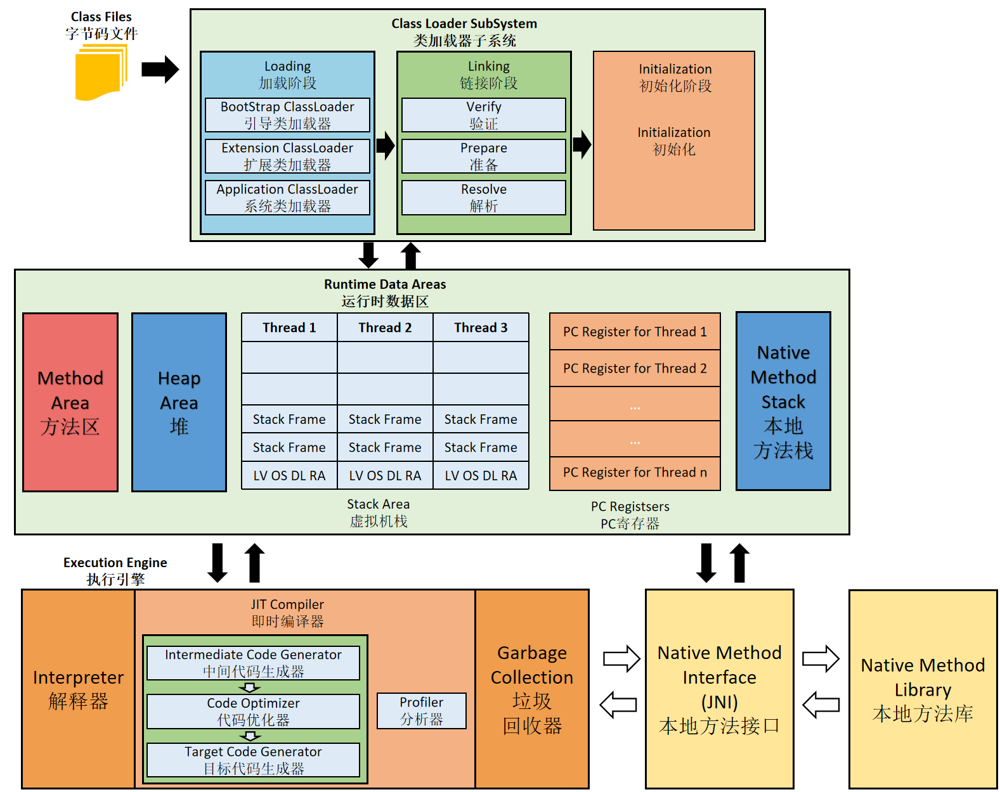

# JVM概述

 

| 指令集架构 | 架构模型说明                                                 |
| ---------- | ------------------------------------------------------------ |
| 基于栈     | 1. 设计、实现更简单：适用资源受限的系统。 2. 跨平台性：不需要硬件支持，可移植性好。 3. 指令集小：零地址指令方式分配：大部分指令是零地址指令，执行过程依赖于操作栈。 |
| 基于寄存器 | 1. 性能优秀，执行高效。 2. 完全依赖硬件，可移植性差。 3. 操作需要的指令少：通常以一地址指令、二地址指令、三地址指令为主。 |

| 生命周期 | 虚拟机阶段说明                                               |
| -------- | ------------------------------------------------------------ |
| 启动     | 引导类加载器（Bootstrap calss loader）创建（由虚拟机具体实现指定的）初始类（initial class）。 |
| 执行     | 执行Java程序：执行的是Java虚拟机的进程。                     |
| 退出     | 1.程序正常执行结束。 2.程序在执行过程中异常、错误。 3.操作系统出错。 4.线程调用Runtime类、System类：exit()、halt()；且Java安全管理器也允许本次调用。 5.JNI加载、卸载JVM。 |

# JVM类型

| JVM                       | 说明                                                         |
| ------------------------- | ------------------------------------------------------------ |
| Classic VM                | 只提供解释器：如果使用JIT编译器，需要进行外挂。 解释器和编译器不能配合工作。 |
| Exact VM                  | Exact Memory Management（准确式内存管理）：虚拟机明确内存中某个位置的数据的具体类型。 热点探测。  编译器和解释器混合工作模式。 |
| HotSpot VM                | 热点代码探测：通过计数器找到最具编译价值的代码，触发即时编译或栈上替换。通过编译器与解释器协同工作，在最优化的程序响应时间与最佳执行性能中取得平衡。 |
| JRockit                   | 专注于服务器端应用：内部不包含解释器实现，全部代码依赖JIT编译运行。最快的JVM之一。 MissionControl服务套件：监控、管理、分析生产环境中的应用程序。 JRockit Real Time：提供以毫秒或微秒级的JVM响应时间。 |
| J9                        |                                                              |
| KVM CDC/CLDC Hotspot | Java ME的VM：CDC/CLDC Hotspot Implementation VM。 KVM：CLDC-HI早期产品。 KVM：简单、轻量、高度可移植。 |
| Azul VM                   | Azul VM、BEA Liquid VM：与特定硬件平台绑定、软硬件配合的专有虚拟机。 Azul VM：每个Azul VM实例可以管理至少数十个CPU和数百GB内存的硬件资源，并提供在巨大内存范围内实现可控的GC时间的垃圾收集器、专有硬件优化的线程调度等特性。 |
| Liquid VM                 | Liquid VM（JRockit VE）：不需要操作系统的支持，或其本身实现了一个专用的操作系统。  Liquid VM随JRockit VM的停止而停止。 |
| Apache Harmony            |                                                              |
| Microsoft JVM             |                                                              |
| TaobaoJVM                 | 基于OpenJDK的优化、深度定制且开源的高性能服务器版JVM。  GCIH（GC invisible heap）：off-heap，将生命周期较长的Java对象移到heao之外，并且GC不能管理GCIH内部的Java对象，降低GC的回收频率、提高GC的回收效率。  GCIH中的对象可以在多个JVM进程中实现共享。  crc32指令实现JVM intrinsic，降低JNI的调用开销。  严重依赖Intel的CPU。 |
| Dalvik VM                 | 应用于Android系统的虚拟机，不是JVM：不遵循JVM规范。  基于寄存器架构。  不能直接执行Class文件，执行编译后的dex文件，执行效率高。  dex文件：通过Class文件转化而来，使用Java语法。  Android5.0 使用 提前编译（AOT）的ART VM替换Dalvik VM。 |
| Graal VM                  | 跨语言全栈虚拟机。                                           |

# 
