# 运行时数据区 Runtime Data Areas 概述

## 内部结构

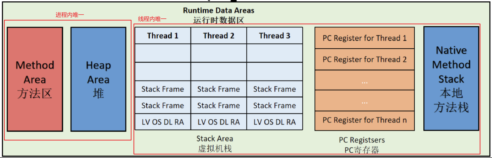  

- JVM内存布局规定了Java在运行过程中内存申请、分配、管理的策略，不同的JVM对于内存的划分方式和管理机制存在部分差异。

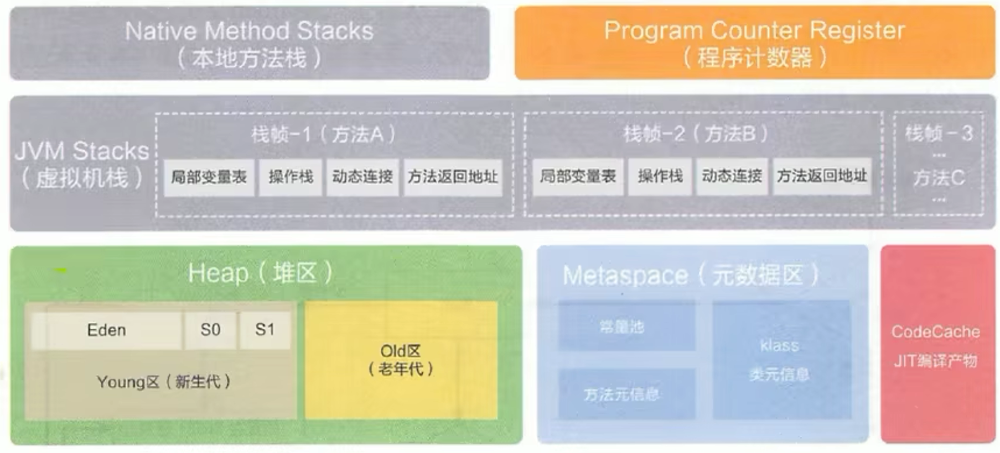 

- JVM定义了若干程序运行期间会使用到的运行时数据区：一些是随着JVM启动而创建、随JVM退出而销毁；一些与线程一一对应，随着线程的开始和结束而创建和销毁。
- 每个线程独立地拥有程序计数器、栈、本地栈，线程间共享堆、堆外内存（元空间、代码缓存）。

   

## 线程

- Hotspot VM：每个线程都与操作系统的本地线程直接映射。
- 操作系统负责所有线程的安排调度到任何一个可用的CPU上，一旦本地线程初始化完成，就调用Java线程中的run()。

| 后台系统线程 | 说明                                                         |
| ------------ | ------------------------------------------------------------ |
| 虚拟机线程   | JVM到达安全点时才出现，堆才不会变化。<br />执行类型："stop-the-world"的垃圾收集、线程栈收集、线程挂起、偏向锁撤销。 |
| 周期任务线程 | 时间周期事件的体现。<br />一般用于周期性操作的调度执行。     |
| GC线程       | 对JVM中不同种类的垃圾收集行为提供支持。                      |
| 编译线程     | 在运行时将字节码编译成到本地代码。                           |
| 信号调度线程 | 接收信号并发送给JVM，在JVM内部调用适当的方法进行处理。       |

# 程序计数器（PC寄存器）

- JVM中的PC寄存器（程序钩子）：
  - 对物理PC寄存器的一种抽象模拟。
  - 存储指向下一条指令的地址，由执行引擎读取下一条指令。
  - 一块很小的内存空间，运行速度最快的存储区域。
- JVM规范中，每个线程都具有自身的PC寄存器。PC寄存器是线程私有的，其生命周期和线程的生命周期一致。
- 任何时间一个线程都只有一个方法在执行（当前方法）：PC寄存器存储当前线程正在执行的JVM指令地址。如果执行的是native方法，则是未指定值（undefined）。
- PC寄存器是程序控制流的指示器，分支、循环、跳转、异常处理、线程恢复等基础功能需要依赖该计数器来完成。字节码解释器工作时通过改变该计数器的值来选取下一条需要执行的字节码指令。
- PC寄存器是唯一一个在JVM规范中没有规定任何OutOfMemoryError（OOM）的区域，也没有GC。

    

# 虚拟机栈

- Java基于栈的指令集架构。

- 内存中的堆和栈：栈是运行时的单位，堆是存储的单位。

- Java虚拟机栈：

  - 每个线程在创建时都会创建一个虚拟机栈，其内部保存一个个的栈帧（Stack Frame），对应一次次的Java方法调用。
  - 线程私有的，生命周期和线程一致。
  - 栈是快速有效的分配存储方式，访问速度仅次于程序计数器。
  - 不存在GC。

- Java虚拟机栈主管Java程序的运行，保存方法的局部变量（基本数据类型、对象的引用地址）、部分结果，并参与方法的调用、返回。 

## -Xss 栈内存大小

- 栈中可能出现的异常：JVM规范运行Java栈的大小是动态的、或固定不变的。

| 虚拟机栈 | 说明                                                         |
| -------- | ------------------------------------------------------------ |
| 固定大小 | 每一个线程的Java虚拟机栈容量可以在线程创建时独立选定。<br />如果线程请求分配的栈容量超过Java虚拟机栈允许的最大容量，JVM抛出StackOverflowError。 |
| 动态扩展 | 在尝试扩展时无法申请到足够的内存、或在创建新的线程时没有足够的内存去创建对应的虚拟机栈，则JVM抛出OOM。 |

- 栈内存大小设置：VM options-Xss。直接决定函数调用的最大可达深度。

```shell
-Xss{n}{(b)|k|m|g}
-Xss256k
```

## 栈帧

### 栈的存储单元、运行原理

- 每个线程都有自己的栈，栈中的数据都是以栈帧（Stack Frame）的格式存在。在这个线程上正在执行的每个方法都各自对应一个栈帧（Stack Frame）。

- 栈帧：一个内存区块、一个数据集，维系着方法执行过程中的各种数据信息。

- JVM直接对Java栈的操作：

  - 每个方法执行，伴随着进栈。
  - 执行结束后的出栈。

- 当前栈帧（栈顶栈帧）：在一个活动线程中，一个时间点上，只会有一个活动的栈帧。只有当前正在执行的方法的栈帧是有效的。执行引擎运行的所有字节码指令只针对当前栈帧进行操作。

  - 当前方法：与当前栈帧对应的方法。
  - 当前类：定义当前方法的类。

- 如果在当前方法中调用了其他方法，对应的新的栈帧会被创建并放在栈顶，作为新的当前栈帧。

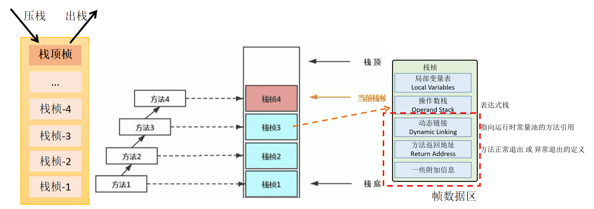   

- 不同线程中所包含的栈帧是不允许存在相互引用的：不可能在一个栈帧中引用另一个线程的栈帧。
- 如果当前方法调用了其他方法，方法返回时，当前栈帧会传回此方法的执行结果给前一个栈帧，然后JVM会丢弃当前栈帧，使得前一个栈帧重新成为当前栈帧。
- Java方法返回函数的方式（导致栈帧被弹出）：return（正常的函数返回）、抛出异常。

### 局部变量表

- 局部变量表（局部变量数组）（本地变量表）：定义一个数字数组，主要用于存储方法参数和定义在方法体内的局部变量（基本数据类型、对象引用reference、returnAddress类型）。参数的存放总是在局部变量的index0开始，到数组长度-1的索引结束。
- 局部变量表建立在线程的栈上，是线程的私有数据，不存在数据安全问题。
- 局部变量表所需的容量大小是在编译期确定的，并保存在方法的Code属性的`maximum local variables`数据项中。在方法运行期间是不会改变局部变量表的大小的。
- 方法嵌套调用的次数由栈的大小决定：一般，栈越大，方法嵌套调用次数越多。对一个函数而言，其参数和局部变量越多，使得局部变量表膨胀，其栈帧就越大，从而满足方法调用所需的信息增大的需求；进而函数调用就会占用更多的栈空间，导致其嵌套调用次数减少。
- 局部变量表中的变量只在当前方法调用中有效：在方法执行时，虚拟机通过使用局部变量表完成参数值到参数变量列表的传递过程。当方法调用结束后，随着方法栈帧的销毁，局部变量表也随着销毁。
- 局部变量表中的变量是垃圾回收根节点：只要是被局部变量表直接/间接引用的对象都不会被回收。

#### 变量槽 Slot

- 变量槽（Slot）：局部变量表最基本的存储单元。
  - 32位以内的类型只占用1个slot：包括 returnAddress类型。
    - byte、short、char、boolean（0-false）在存储前被转换为int。
  - 64位的类型占用2个slot：long、double。
- JVM为每个局部变量表的Slot都分配一个访问索引，通过该索引即可成功访问到局部变量表中指定的局部变量值。
- 当一个实例方法被调用时，其方法参数和方法体内部定义的局部变量将会按照顺序被复制到局部变量表中的每一个Slot上。
- 如果需要访问局部变量表中一个64bit的局部变量值，只要使用前一个索引即可。
- 如果当前帧是由构造方法或实例方法创建的，那么该对象的引用（this）将会存放在index0的Slot处，其余参数按照参数表顺序继续排列。
  - 静态方法：this变量不存在于当前方法的局部变量表。
  - 没有被赋值的变量值（未使用的匿名对象）也不存在于当前方法的局部变量表。

#### Slot重复利用

- 栈帧中的局部变量表的槽位是可重用的：如果一个局部变量超过了其作用域，那么在其作用域之后声明的新局部变量很可能复用过期局部变量的槽位，从而节省资源。

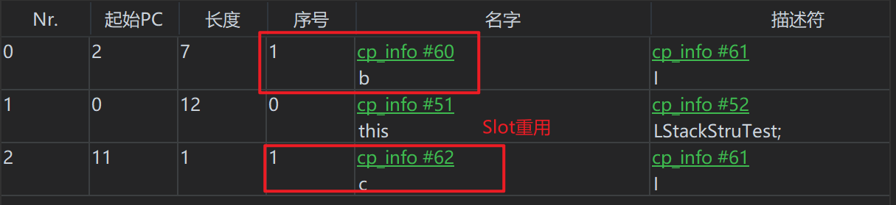  

```java
public void method3(){
    {
        int b = 1;
        System.out.println(b); //变量b被使用，占用了一个槽位
    }
    //变量b离开了其作用域，过期失效
    int c = 2; //变量c重用了变量b的槽位
}
```

### 操作数栈

- 操作数栈（表达式栈）：在方法执行过程中，根据字节码指令往栈中写入数据或提取数据（push/pop）。
  - 某些字节码指令将值压入操作数栈，其余的字节码指令将操作数取出栈，这些字节码指令完成之后将结果压入栈。
  - 主要用来保存计算过程的中间结果，同时作为计算过程中变量临时的存储空间。
- 操作数栈是JVM执行引擎的一个工作区：当一个方法刚开始执行时，一个新的栈帧也随之被创建，此时该方法的操作数栈是空的。
- JVM的解释引擎是基于栈（操作数栈）的执行引擎。
- 每一个操作数栈都有一个明确的栈深度用于存储数值，其所需的最大深度在编译器就定义了，保存在方法的Code属性中（max\_stack）。
- 栈中的任何一个元素可以是任意的Java数据类型。
  - 32bit的类型占用1个栈单位深度。
  - 64bit的类型占用2个栈单位深度。
- 操作数栈并非采用访问索引的方式进行数据访问，只能通过标准的push、pop操作来完成一次数据访问。
- 如果被调用方法带有返回值，其返回值会被压入当前栈帧的操作数栈中，并更新PC寄存器中下一条需要执行的字节码指令。
- 操作数栈中元素的数据类型必须与字节码指令的序列严格匹配，由编译器在编译期间进行验证，同时在类加载过程中的类检验阶段的数据流分析阶段要再次验证。

```java
public void testAddOperation() {
    byte a = 15;
    int b = 8;
    int k = a + b;
}
```

```
public void testAddOperation();
  descriptor: ()V
    flags: (0x0001) ACC_PUBLIC
    Code:
      stack=2, locals=4, args_size=1
         0: bipush        15
         2: istore_1 
         3: bipush        8
         5: istore_2
         6: iload_1
         7: iload_2
         8: iadd
         9: istore_3
        10: return
```

  

### 帧数据区

#### 动态链接（指向运行时常量池的方法引用）

- 动态链接（Dynamic Linking）：将符号引用转换为调用方法的直接引用。
  - 每个栈帧内部都包含一个指向运行时常量池中该栈帧所属方法的引用，为了支持当前方法的代码实现动态链接。
  - 在Java源文件被编译到字节码文件中时，所有的变量和方法引用都作为符号引用（Symbolic Reference）保存在class文件的常量池（Constant pool）中。`#1 = Methodref`

  

#### 方法返回地址

- 方法返回地址：存放调用该方法的PC寄存器的值。无论方法以哪种方式退出，都返回到该方法被调用的位置。
  - 正常退出：调用者的PC计数器的值作为返回地址，即调用该方法的指令的下一条指令的地址。
  - 异常退出：返回地址通过异常表来确定，栈帧中一般不保存该部分信息。

**方法的退出**

- 方法的退出：当前栈帧出栈的过程。需要恢复上层方法的局部变量表、操作数栈、将返回值压入调用栈帧的操作数栈、设置PC寄存器的值等，让调用者方法继续执行。

- 正常完成出口：执行引擎遇到任意一个方法返回的字节码指令（return），会有返回值传递给上层的方法调用者。

  - 一个方法在正常调用完成之后使用哪个返回指令，根据方法返回值的实际数据类型而定。

  - 在字节码指令中，返回指令如下：

| 返回指令 | 类型                                       |
| -------- | ------------------------------------------ |
| ireturn  | boolean、byte、char、short、int            |
| lreturn  | long                                       |
| freturn  | float                                      |
| dreturn  | double                                     |
| areturn  | 引用类型                                   |
| return   | void、实例初始化方法、类和接口的初始化方法 |

- 异常完成出口：在方法执行过程中遇到异常，并且该异常没有在方法内进行处理，即 在本方法的异常表中没有搜索到匹配的异常处理器，导致方法退出。
  - 方法执行过程中抛出异常的异常处理存储在一个异常表（Exception table）。
- 正常完成出口和异常完成出口的区别：通过异常完成出口退出的不会给它的上层调用者产生任何的返回值。

#### 附加信息

## 栈顶缓存 ToS

- 栈顶缓存（ToS）：将栈顶元素全部缓存在物理CPU的寄存器中，减少对内存的I/O次数，提升执行引擎的执行效率。

## 方法的调用

### 概述

#### 静态链接、动态链接

- 静态链接：当一个字节码文件被转载进JVM内部时，被调用的目标方法在编译期可知，且运行期保持不变时，将调用方法的符号引用转换为直接引用。
- 动态链接：被调用的方法在编译期无法确定下来，即只能够在程序运行期将调用方法的符号引用转换为直接引用。该引用转换过程具备动态性。

#### 方法绑定机制

- 方法绑定机制：一个字段、方法或类在符号引用被替换为直接引用的过程，仅发生一次。

| 绑定方式 | 说明                                                         |
| -------- | ------------------------------------------------------------ |
| 早期绑定 | 被调用的目标方法在编译期可知，且运行期保持不变时，可将该方法与所属的类型进行绑定。<br />如此，由于明确了被调用的目标方法，可使用静态链接的方式。 |
| 晚期绑定 | 被调用的方法在编译期无法确定下来（多态），只能够在程序运行期根据实际的类型绑定相关的方法。 |

#### 虚方法、非虚方法

| 方法类型 | 说明                                                         |
| -------- | ------------------------------------------------------------ |
| 非虚方法 | 在编译期就确定具体调用版本的方法，在运行时不可变。<br />静态方法、私有方法、final方法、实例构造器、父类方法。 |
| 虚方法   | 多态性（重写），Java中任何一个普通的方法都具备虚函数的特征（virtual）。 |

### 方法调用指令

| 普通调用指令    | 固定虚拟机内部，方法的调用不可人为干预。                     |
| --------------- | ------------------------------------------------------------ |
| invokestatic    | 静态方法，解析阶段确定唯一方法版本<br />非虚方法             |
| invokespecial   | `<init>`、私有（private）、父类方法（super），解析阶段确定唯一方法版本<br />非虚方法 |
| invokevirtual   | 所有虚方法<br />final修饰的（非虚方法）                      |
| invokeinterface | 接口方法                                                     |

| 多态调用指令  | 动态类型语言，支持用户确定方法版本。 |
| ------------- | ------------------------------------ |
| invokedynamic | 动态解析出需要调用的方法，然后执行。 |

| 语言类型 | 类型信息判断             | 语言       |
| -------- | ------------------------ | ---------- |
| 静态语言 | 判断变量自身的类型信息。 | Java       |
| 动态语言 | 判断变量值的类型信息。   | JS、Lambda |

### 方法重写


> java.lang.IllegalAccessError：程序试图修改一个属性或调用一个方法，该属性/方法没有权限访问。一般会引起编译器异常，如果发生在运行时，说明一个类发生了不兼容的改变。

### 虚方法表

- 虚方法表：JVM在类的方法区建立一个虚方法表（非虚方法不出现在该表），存放各个方法的实际入口。
  - 提高性能：面向对象的编程中，频繁使用到动态分派，如果在每次动态分派的过程中都要重新在类的方法元数据中搜索合适的目标会影响执行效率。
- 虚方法表的创建：虚方法表在类加载的链接（Linking）阶段被创建并开始初始化，类的变量初始值准备完成之后，JVM把该类的方法表也初始化完成。

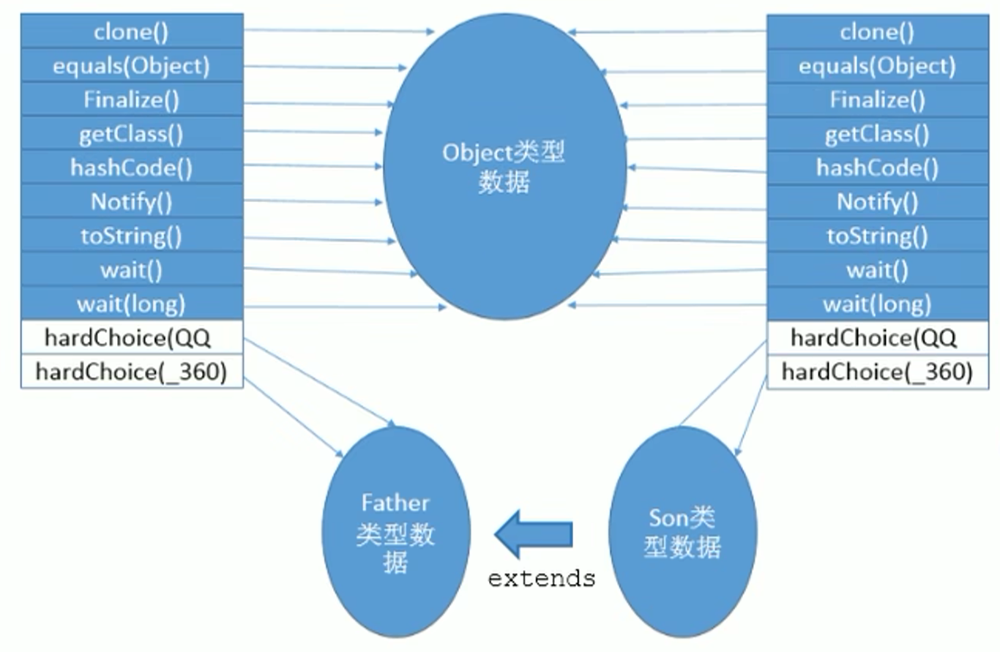  

# 本地方法栈

- Java虚拟机栈用于管理Java方法的调用，而本地方法栈用于管理本地方法（native）的调用。
- 本地方法栈：
  - 线程私有的。
  - 允许被实现成固定 或 可动态扩展的内存大小（内存溢出方面相同）。
    - StackOverflowError
    - OOM
  - 本地方法使用C语言实现。
- 在Native Method Stack中登记native方法，在Execution Engine执行时加载到本地方法库。
- 当某个线程调用一个本地方法时，它就进入了一个全新的并且不受虚拟机限制的世界，和虚拟机拥有同样的权限。
  - 本地方法可用通过本地方法接口来访问虚拟机内部的运行时数据区。
  - 可以直接使用本地处理器中的寄存器。
  - 直接从本地内存的堆中分配任意数量的内存。
- 并非所有的JVM都支持本地方 法：JVM规范并没有明确要求本地方法栈的使用语言、具体实现方式、数据结构等。如果JVM产品不打算支持native方法，可以不实现本地方法栈。
- Hotspot JVM：直接将本地方法栈和虚拟机栈合并。

# 堆 Heap

## 堆简述

### 核心概述

- 堆在一个进程内是唯一的，一个JVM实例只存在一个堆内存。
- Java堆区在JVM启动时即被创建，其空间大小也就确定，是JVM管理的最大一块内存空间。
  - 堆内存的大小是可以调节的。
  - 所有的线程共享Java堆。
- JVM规范：堆可以处于物理上不连续的内存空间中，但在逻辑上被视为连续的。
- 堆可以划分线程私有的缓冲区（TLAB）。
- 堆：所有的对象实例和数组都应当在运行时分配在堆上。（可能存在部分不遵守的：逃逸分析）
  - 对象和数组可能永远不会存储在栈上：栈帧中保存引用，指向对象和数组在堆中的位置。
  - 在方法结束后，堆中的对象不会马上被移除，仅在垃圾收集（GC）时才会被移除。

### 内存结构

- Java7及之前，堆内存逻辑上分为三部分：新生区+养老区+永久区。
  - Young Generation Space 新生区 Young/New
    - Eden 伊甸园区
    - Survivor 幸存者区
  - Tenure Generation Space 养老区 Tenure/Old
  - Permanent Space 永久区 Perm

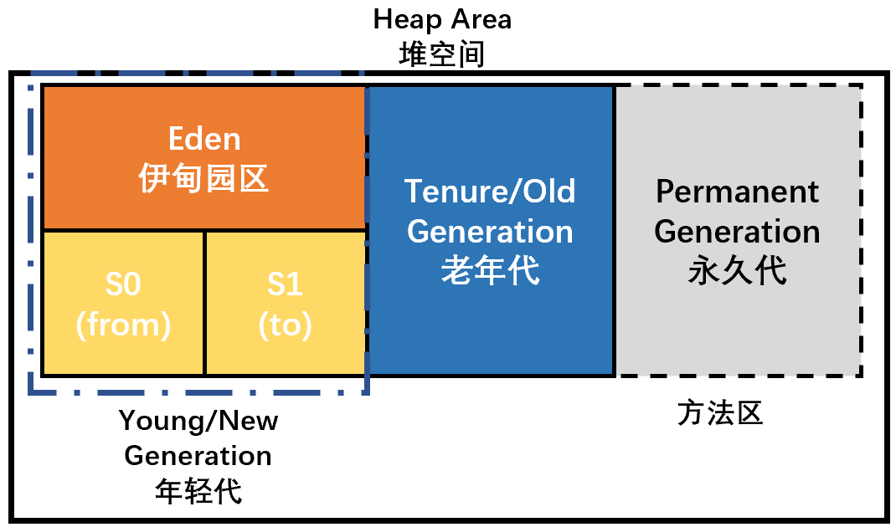  

- Java8及之后，堆内存逻辑上分为三部分：新生区+养老区+元空间。
  - Young Generation Space 新生区 Young/New
    - Eden 伊甸园区
    - Survivor 幸存者区
  - Tenure Generation Space 养老区 Tenure/Old
  - Meta Space 元空间 Meta

> 新生区 <=> 新生代 <=> 年轻代
>
> 养老区 <=> 老年区 <=> 老年代
>
> 永久区 <=> 永久代

### OOM

- java.lang.OutOfMemoryError。

## 年轻代、老年代

- 可以分为两类：
- 

| 存储在JVM中的Java对象          | 生命周期                                      |
| ------------------------------ | --------------------------------------------- |
| （年轻代）瞬时对象             | 生命周期短，该类对象的创建和消亡非常迅速。    |
| （老年代）生命周期非常长的对象 | 在某些极端情况下，能够和JVM生命周期保持一致。 |

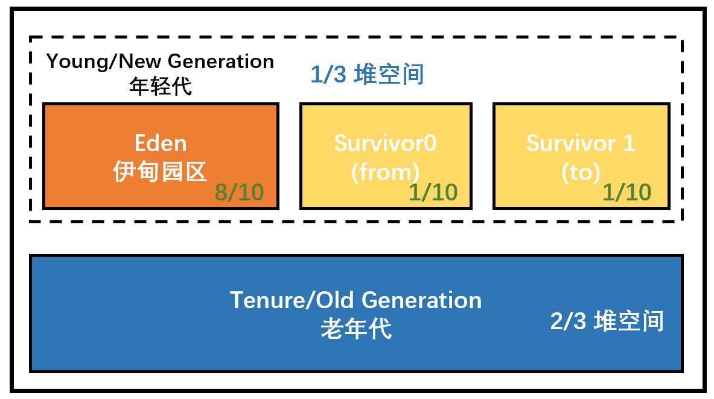  

### NewRatio

- 配置新生代和老年代在堆结构中的占比：
  - 默认：`-XX:NewRatio=2` 表示新生代占1，老年代占2。（即：新生代占整个堆的1/3）
  - 修改：`-XX:NewRatio=4` 表示新生代占1，老年代占4。（即：新生代占整个堆的1/5）

  

> 查看-XX:NewRatio参数设置：
>
> jinfo -flag NewRatio PID

### SurvivorRatio

- Eden区和另外两个Survivor区的默认空间占比：`8:1:1`。（有时需要显式指定）

```
-XX:SurvivorRatio=8
```

> -XX:-UserAdaptiveSizePolicy 自适应的内存分配策略

- 几乎所有Java对象都是在Eden区被new出来的。
- 绝大多数的Java对象在新生代就被销毁。

```
-Xmn 设置新生代空间大小
一般不设置，优先级高于-XX:newRatio=<value> 
```

## 分配策略

### 对象分配

#### 一般过程

1. new的对象先存放在伊甸园区，此区有大小限制。

2. 当伊甸园区空间填满，且程序需要创建对象时，JVM的垃圾回收器将对伊甸园区和幸存者区一起进行垃圾回收（YGC/Minor GC），将伊甸园区中的不再被其他对象所引用的对象进行销毁。（幸存者区填满时不会触发垃圾回收）

3. 再加载新的对象存放到伊甸园区，然后将伊甸园区的剩余对象移到幸存者0区。

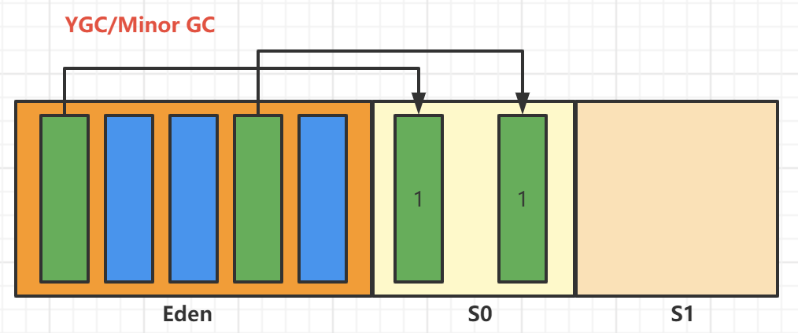  

4. 如果再次触发垃圾回收，此时上次幸存下来的已经存放在幸存者0区的，如果没有被回收，就存放到幸存者1区。

5. 如果再次经历垃圾回收，此时会重新放回到幸存者0区，以此类推。

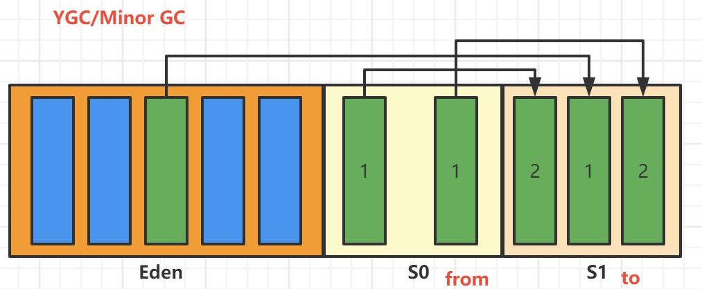  

6. 直到达到一定次数后，默认15次，存放到养老区。

```
-XX:MaxTenuringThreshold=<value>
```

  

- 对于幸存者s0、s1区：复制之后有交换，谁空谁是to。
- 垃圾回收：频繁在新生区收集，很少在养老区收集，几乎不在永久区/元空间收集。

#### 特殊情况

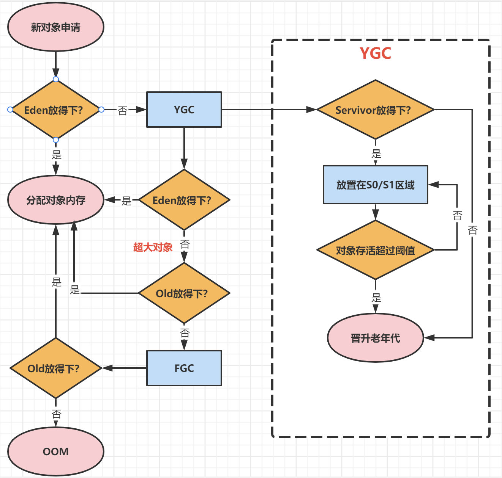  

 

### 内存分配策略（对象提升Promotion规则）

#### 阈值设置

- 如果对象在Eden出生并经过第一次Minor GC后仍然存活，并且能被Survivor容纳，将被移到Survivor空间中，并将对象年龄设为1。对象在Survivor区中每经过一次MinorGC，年龄就增加1岁，当其年龄增加到一个阈值（一般默认15）时，就会晋升到老年代中。

```java
-XX:MaxTenuringThreshold=<value>
```

#### 对于不同年龄段的对象分配原则

- 优先分配到Eden。
- 大对象直接分配到老年代：尽量避免程序中出现过多的大对象。
- 长期存活的对象分配到老年代。
- 动态对象年龄判断：如果Survivor区中相同年龄的所有对象大小的总和大于Survivor空间的一半，年龄大于或等于该年龄的对象可以直接进入老年代，无须等待到MaxTenuringThreshold中的阈值。
- 空间分配担保：`-XX:HandlePromotionFailure`

### TLAB 私有缓存区域

- TLAB：从内存模型（不是垃圾收集的角度）对Eden区进行划分，JVM为每个线程分配了一个私有缓存区域。
- 快速分配策略：多线程同时分配内存时，使用TLAB可以避免一系列的线程安全问题，同时提升内存分配的吞吐量。
- JVM将TLAB作为内存分配的首选。设置是否开启TLAB空间：`-XX:UseTLAB`。
- 默认情况下，TLAB空间的内存非常小，仅只有整个Eden空间的1%（不是所有的对象实例都能够在TLAB中成功分配内存）。设置TLAB空间所占用Eden空间的百分比：`-XX:TLABWasteTargetPercent`。
- 一旦对象在TLAB空间分配内存失败时，JVM就会尝试通过使用加锁机制确保数据操作的原子性，从而直接在Eden空间中分配内存。

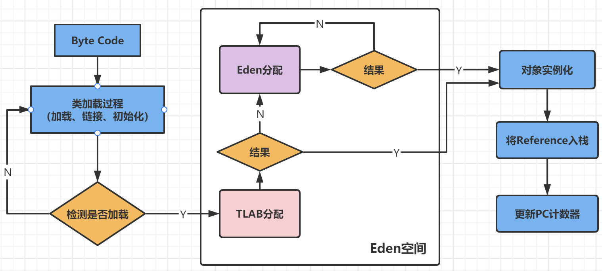 

1. 堆区是线程共享区域，任何线程都可以访问到堆区中的共享数据。
2. 由于对象实例的创建在JVM中非常频繁，因此在并发环境下，从堆区中划分内存空间是线程不安全的。
3. 为避免多个线程操作同一个地址，需要使用加锁等机制，影响分配速度。 

## Minor GC、Major GC、FullGC

- JVM在进行GC时，并非每次都对新生代、老年代、方法区（永久代/元空间）一起回收，大部分回收都是新生代。

### 按回收区域划分GC

- 部分收集：不是完整收集整个Java堆的垃圾收集。

  - 新生代收集（Minor GC / Young GC）：只收集新生代的。

  - 老年代收集（Major GC / Old GC）：只收集老年代的。

    - 目前只有CMS GC会单独收集老年代。

  - 混合收集（Mixed GC）：收集整个新生代以及部分老年代的垃圾收集。

    - 目前只有G1 GC有这种行为。

- 整堆收集（Full GC）：完整收集整个Java堆的垃圾收集。

### 分代式GC策略的触发机制

#### 年轻代GC（Minor GC） 触发机制

- 当年轻代空间不足时，触发Minor GC：即Eden区满触发，而Survivor区满不触发。每次Minor GC会清理年轻代的内存。
- Java对象大多朝生夕死：Minor GC非常频繁，一般回收速度也较快。
- Minor GC会引发STW，暂停其他用户的线程，等垃圾回收结束，用户线程才恢复运行。

#### 老年代GC（Major GC / Full GC）触发机制

- Major GC、Full GC：对象从老年代消失。
- 在Major GC出现时，经常会伴随着至少一次的Minor GC：老年代空间不足时，先尝试触发Minor GC，如果空间还是不足，则触发Major GC。
- Major GC的速度一般会比Minor GC慢10倍以上，STW的时间更长。
- 如果Major GC后，内存仍然不足，就OOM。

#### Full GC触发机制

- 触发Full GC执行的情况：在开发中尽量避免，减少暂停时间。

1. 调用`System.gc()`，系统建议执行Full GC，但不必然执行。
2. 老年代空间不足。
3. 方法区空间不足。
4. 通过Minor GC 之后，进入老年代的平均大小大于老年代的可用内存。
5. 由Eden区、Survivor space0（From Space）区向Survivor space1（To Space）区复制时，对象大小大于To Space可用内存，则把该对象转存到老年代，且老年代的可用内存小于该对象大小。

### 分代思想

- 不同对象的生命周期不同：70%-99%的对象是临时对象。
- 优化GC性能：GC对堆的所有区域进行扫描，而分代将新创建的对象存放到某区域，当GC时先将存储临时对象的区域进行回收。

## 堆相关参数设置

| 参数                          | 说明                                 |
| ----------------------------- | ------------------------------------ |
| -XX:+PrintFlagsInitial        | 查看所有参数的默认初始值             |
| -XX:+PrintFlagsIFinal         | 查看所有参数的最终值                 |
| -Xms                          | 初始堆空间内存（默认物理内存的1/64） |
| -Xmx                          | 最大堆空间内存（默认物理内存的1/4）  |
| -Xmn                          | 设置新生代的大小                     |
| -XX:newRatio                  | 配置新生代和老年代在堆结构中的占比   |
| -XX:SuvivorRatio              | 设置新生代中Eden和s0、s1空间的比例   |
| -XX:MaxTenuringThreshold      | 设置新生代垃圾的最大年龄             |
| -XX:+PrintGCDetails           | 输出详细的GC处理日志                 |
| -XX:+PringGC<br />-verbose:gc | 输出GC简要信息                       |
| -XX:HandlePromotionFailure    | 是否设置空间分配担保                 |

> jps 查看进程PID
>
> jinfo -flag 参数 PID

### -Xms、-Xmx

| 参数 | 说明                                |
| ---- | ----------------------------------- |
| -Xms | 堆空间（年轻代+老年代）初始内存大小 |
| -Xmx | 堆空间（年轻代+老年代）最大内存大小 |

- 建议将初始堆内存和最大堆内存设置成相同的值：避免频繁的扩容、GC。

> -X：JVM运行参数
>
> ms：memory start

```java
Runtime.getRuntime() //获取Runtime实例：当前进程
```

> jps
>
> jstat -gc PID
>
> -XX:+PrintGCDetails

### -XX:HandlePromotionFailure

#### JDK6 Update24之前有效

- 在发生Minor GC之前，JVM会检查老年代最大可用的连续空间是否大于新生代所有对象的总空间：
  - 如果大于：则此次Minor GC是安全的。
  - 如果小于：则JVM会查看-XX:HandlePromotionFailure设置值是否允许担保失败。
    - 如果-XX:HandlePromotionFailure=true，则继续检查老年代最大可用连续空间是否大于历次晋升到老年代的对象的平均大小。
      - 如果大于：则尝试进行一次Minor GC，但此次Minor GC仍然是有风险的。
      - 如果小于：则进行一次Fulll GC。
    - 如果-XX:HandlePromotionFailure=false，则改为进行一次Full GC。

#### JDK6 Update24之后该参数失效

- 只要老年代的连续空间大于新生代对象总大小 或 历次晋升的平均大小 就会进行Minor GC，否则进行Full GC。

## 逃逸分析

### 逃逸分析简述

> 栈上分配、标量替换优化技术、TaoBaoVM的GCIH技术实现off-heap。

- 逃逸分析：将堆上的对象分配到栈，减少Java程序中同步负载和内存堆分配压力的跨函数全局数据流分析算法。通过逃逸分析，Java Hotspot编译器能够分析出一个新的对象的引用的范围从而决定是否要将该对象分配到堆。（在方法尽量使用局部变量，减少逃逸）
- 逃逸分析的性能消耗不一定高于逃逸分析自身的消耗。
- 逃逸分析的基本行为：分析对象动态作用域。（new的实例）

| 逃逸判断 | 说明                                                         |
| -------- | ------------------------------------------------------------ |
| 没有发生 | 当一个对象在方法中被定义后，对象只在方法内部使用，则认为没有发生逃逸。<br />没有逃逸的对象可以被分配到栈上，随着方法的执行结束，栈帧被移除。 |
| 发生逃逸 | 当一个对象在方法中被定义后，其被外部方法所引用，则认为发生逃逸。<br />逃逸类型：方法返回值、给成员变量赋值、实例引用传递。 |

```java
public class EscapeAnalysis {

    public EscapeAnalysis obj;

    /*
    方法返回EscapeAnalysis对象，发生逃逸
     */
    public EscapeAnalysis getInstance() {
        return obj == null ? new EscapeAnalysis() : obj;
    }

    /*
    为成员属性赋值，发生逃逸
     */
    public void setObj() {
        this.obj = new EscapeAnalysis();
    }
    //思考：如果当前的obj引用声明为static的？仍然会发生逃逸。

    /*
    对象的作用域仅在当前方法中有效，没有发生逃逸
     */
    public void useEscapeAnalysis() {
        EscapeAnalysis e = new EscapeAnalysis();
    }

    /*
    引用成员变量的值，发生逃逸
     */
    public void useEscapeAnalysis1() {
        EscapeAnalysis e = getInstance();
        //getInstance().xxx()同样会发生逃逸
    }
}
```

### 参数设置

| 参数                      | 说明                                                   |
| ------------------------- | ------------------------------------------------------ |
| -server                   | 启动Server模式<br />在Server模式下，才可以启用逃逸分析 |
| -XX:+DoEscapeAnalysis     | 启用逃逸分析（默认）                                   |
| -XX:+EliminateAllocations | 开启标量替换（默认）                                   |

- JDK 6u23之前：

  - `-XX:+DoEscapeAnalysis` 显式开启逃逸分析。
  - `-XX:+PrintEscaprAnalysis` 查看逃逸分析的筛选结果。

- JDK 6u23之后：HotSpot默认开启逃逸分析。

### 代码优化

| 优化                   | 说明                                                         |
| ---------------------- | ------------------------------------------------------------ |
| 栈上分配               | 将堆分配转化为栈分配。如果一个对象在子程序中被分配，要使指向该对象的指针永远不会逃逸，则对象可能是栈分配的候选，而不是堆分配。 |
| 同步省略               | 如果一个对象被发现只能从一个线程被访问到，则对于这个对象的操作可以不考虑同步。 |
| 分离对象<br />标量替换 | 有的对象可能不需要作为一个连续的内存结构存在也可以被访问到，那么对象的部分（或全部）可以不存储在内存，而是存储在CPU寄存器中。 |

#### 栈上分配

- 栈上分配：JIT编译器在编译期间根据逃逸分析的结果，发现如果一个对象并没有逃逸出方法，则优化成栈上分配。分配完成后，继续在调用栈内执行，最后线程结束，栈空间被回收，局部变量对象也被回收，无须进行垃圾回收。

#### 同步省略（锁消除）

- 同步省略：在动态编译同步块时，JIT编译器可以借助逃逸分析来判断同步块所使用的锁对象是否只能被一个线程访问而没有被发布到其他线程。如果没有，那么JIT编译器在编译该同步块时，就会取消对这部分代码的同步。
  - 线程同步的代价相当高，降低并发性和性能。
- 在字节码文件中仍然存在同步的字节码，在运行时才被消除。

#### 标量替换

- 标量替换：在JIT阶段，如果经过逃逸分析，发现一个对象不会被外界访问，则经过JIT优化，把该对象拆解成若干个标量（其所包含的若干个成员变量）来替换，就不需要创建该对象，不需要分配堆内存，不需要进行GC。
  - 标量（Scalar）：原子性，Java中的原始数据类型。
  - 聚合量。

```shell
-XX:+EliminateAllocations # 开启标量替换（默认），允许将对象打散在栈上
```

# 方法区 Method Area

## 简述

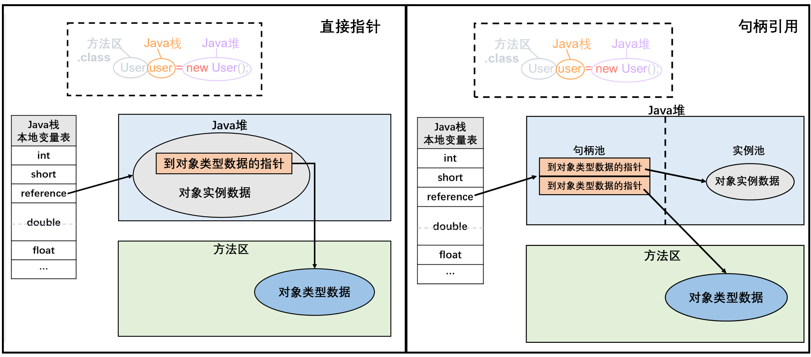  

- 方法区（Method Area）：逻辑上属于堆的一部分，但实际是独立于Java堆的内存空间，是线程共享的内存空间，关闭JVM时释放该区域的内存。
- 方法区在JVM启动时被创建，并且其实际的物理内存空间中和Java堆区一样是可以不连续的。
- 方法区的大小：固定大小 或 可扩展。方法区的大小决定了系统可以保存多少个类，如果系统定义了太多的类，导致方法区溢出，则抛出java.lang.OutOfMemoryError:PermGen space（JDK7）、java.lang.OutOfMemoryError:Metaspace（JDK8）。

> 加载大量的第三方jar包；大量动态生成反射类；Tomcat部署工程过多（30~50）。

- 元空间不在虚拟机设置的内存中，而是使用本地内存。

## 方法区大小

### JDK7及之前

| 参数            | 说明                                                         |
| --------------- | ------------------------------------------------------------ |
| -XX:PermSize    | 永久代初始分配空间，默认20.75M                               |
| -XX:MaxPermSize | 永久代最大可分配空间，<br />32位机器默认64M<br />64位机器默认82M |

- 当JVM加载的类信息容量超过该值：抛出OutOfMemoryError:PermGen space。

### JDK8及之后

#### -XX:MetaspaceSize 元空间初始大小

- 默认值依赖平台，Windows：默认21M。
- 高水位线：对于一个64位的服务器端JVM，其默认的-XX:MetaspaceSize为21M，即 初始的高水位线，一旦触及该水位线，Full GC会被触发并卸载没用的类（即 对应的类加载器不再存活的类），之后重置该高水位线，新的高水位线取决于GC后释放了多少元空间，如果释放的空间过多，则适当降低该值。
- 如果初始化的高水位线设置过低，上述高水位线调整的情况会频繁发生，Full GC多次调用：应该将-XX:MetaspaceSize设置为较高的值。

#### -XX:MaxMetaspaceSize  元空间最大可分配空间

- 默认值依赖平台，Windows：默认-1（没有限制）。

- 与永久代不同：如果不指定大小，默认情况下，虚拟机会耗尽所有可用系统内存。如果元数据区发生溢出，抛出OutOfMemoryError:Metaspace。

### OOM

- 内存泄露（Memory Leak）、内存溢出（Memory Overflow）

1. 分析确定是内存泄露还是内存溢出。
2. 如果是内存泄露：查看泄露对象到GC Roots的引用链、泄露对象的类型信息，定位泄露代码的位置。
3. 如果不存在内存泄露：检查JVM的堆参数（-Xmx、-Xms），与物理内存对比。从代码检查生命周期和过长的对象。

## 内部结构

  

### 类型信息

- 类型信息：对每个加载的类型（class、interface、enum、annotation），JVM必须在方法区中存储以下类型信息
  1. 全限定名。
  2. 直接父类的全限定名（interface、java.lang.Object没有直接父类）。
  3. 修饰符：\{public、abstract、final\} 的子集。
  4. 直接接口的有序列表。
  5. 对应的类加载器（ClassLoader）。

### 域信息

- JVM必须在方法区中保存类型的所有域的相关信息以及域的声明顺序。
- 域的相关信息包括：域名称、域类型、域修饰符（\{public、private、protected、static、final、volatile、transient\} 的子集）。

### 方法信息

- JVM必须保存所有方法的以下信息，包括声明顺序：
  - 方法名称。
  - 方法的返回值类型、void。
  - 方法参数的数量、类型（按顺序）。
  - 方法的修饰符：\{public、private、protected、static、final、synchronized、native、abstract\} 子集。
  - 方法的字节码（bytecodes）、操作数栈、局部变量表、大小。（native、abstract的方法除外）
  - 异常表 （native、abstract的方法除外）：每个异常处理的开始位置、结束位置、代码处理在PC计数器中的偏移地址、被捕获的异常类的常量池索引。

### 静态变量

| 静态变量              | 说明                                                         |
| --------------------- | ------------------------------------------------------------ |
| non-final的类变量     | 类变量随着类的加载而加载，是类数据的一部分，被类的所有实例共享，与类的实例无关。 |
| static final 全局常量 | 全局常量在编译时就被分配。                                   |

### 运行时常量池

- 方法区内部：运行时常量池；字节码文件：常量池。

> **常量池**
>
> - 一个有效的字节码文件包含类的版本信息、字段、方法、接口等描述信息，以及常量池表。
> - 常量池表（Constant Pool Table）：各种字面量、对类型、域、方法的符号引用。该部分内容在类加载之后存放到方法区的运行时常量池中。
>
>   
>
> - 一个java源文件中的类、接口，编译后产生一个字节码文件。而Java中的字节码需要数据支持，通常这种数据会很大以至于不能直接存到字节码，因此存到常量池中，该字节码包含了指向常量池的引用（符号引用）。
> - 常量池内存储的数据类型：数量值、字符常量、类引用、字段引用、方法引用。

- 运行时常量池：在加载类和接口之后，就会创建对应的运行时常量池。JVM为每个已加载的类型（类、接口）都维护一个常量池，池中的数据项通过索引访问。
- 运行时常量池具备动态性：运行时常量池中包含多种不同的常量，包括编译期就明确的数值字面量、运行期解析后才能获得的方法/字段引用（不是常量池中的符号引用，而是真实地址）。
- 当创建类/接口的运行时常量池时，如果构造运行时常量池所需的内存空间超过了方法区所能提供的最大值，则JVM抛出OOM。

## 方法区使用

  

```java
public class MethodAreaDemo {
    public static void main(String[] args) {
        int x = 500;
        int y = 100;
        int a = x / y;
        int b = 50;
        System.out.println(a + b);
    }
}
```

## 演进

### 细节说明

- 只有HotSpot才有永久代，原则上如何实现方法区属于虚拟机实现细节，不受《Java虚拟机规范》管束。

| Hotspot中方法区变化 | 说明                                                         |
| ------------------- | ------------------------------------------------------------ |
| JDK1.6              | 有永久代，静态变量存放在永久代。                             |
| JDK1.7              | 逐步去永久代，字符串常量池、静态变量被移除，保存在堆中。     |
| JDK1.8              | 无永久代，类型信息、字段、方法、常量保存在本地内存的元空间，但字符常量池、静态变量仍在堆。 |

  

- 类的元数据信息被移到与堆不相连的本地内存区域（元空间Metaspace）：此时系统可用内存空间就是元空间的最大可分配空间。

1. 为永久代设置空间大小是很难确定的，容易OOM（PermGen space）；而元空间大小仅受本地内存影响。
2. 对永久代很难调优。

### StringTable的调整

- JDK7将StringTable存放到堆空间：永久代的回收效率低，在Full GC时才触发，而Full GC在老年代的空间不足、永久代不足时才触发，导致StringTable的回收效率低。而开发中有大量的字符串被创建，放在堆中能及时回收内存。

### 静态变量的位置

- 对象实例始终在Java堆中分配，变化的是静态变量的引用所处位置。
- JDK7及之后的HotSpot虚拟机将静态变量和类型在Java语言一端的映射Class对象存放在一起，存储于Java堆中。

## 垃圾收集-废弃常量

- 方法区的垃圾收集主要回收：常量池中废弃的常量、不再使用的类型。

> 方法区内常量池中主要存放的两大类常量：字面量、符号引用。
>
> 1. 类和接口的全限定名。
> 2. 字段的名称和描述符。
> 3. 方法的名称和描述符。

- Hotspot对常量池的回收策略：只要常量池中的常量没有被任何地方引用，就可被回收。

- 判断一个类型不再被使用的条件：（仅是被允许回收，并非废弃就一定被回收）

1. 该类的所有实例都已经被回收：Java堆中不存在该类及其任何派生子类的实例。

2. 加载该类的类加载器已经被回收。

3. 该类的java.lang.Class对象没有在任何地方被引用，无法在任何地方通过反射访问该类的方法。

- 在大量使用反射、动态代理、CGLib等字节码框架，动态生成JSP、OSGi等频繁自定义类加载器的场景中，通常需要JVM具备类型卸载的能力，以保证不会堆方法区造成过大的内存压力。

> 控制
>
> -Xnoclassgc
>
> 查看类加载和卸载信息
>
> -verbose:class
>
> -XX:+TraceClass-Loading
>
> -XX:+TraceClassUnLoading

