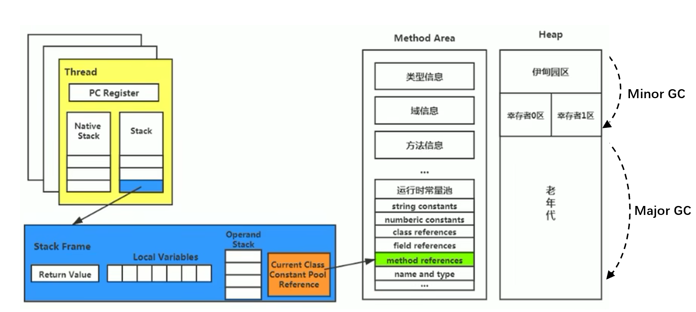

# Class文件概述

- JVM只与Class文件相关联，而不和任何语言绑定。（包括Java）

# 前端编译器

- 前端编译器（javac）：将java代码转换为符合JVM规范的字节码文件。不涉及代码编译优化。
  1. 词法解析。
  2. 语法解析。
  3. 语义解析。
  4. 生成字节码。

 

| 前端编译器                       | 说明           |
| -------------------------------- | -------------- |
| javac                            | 默认，全量编译 |
| ECJ（Eclipse Compiler for Java） | 增量编译       |

# Class文件解读

- 字节码文件（.class）：二进制的类文件，内容为JVM指令。

- 字节码指令（byte code）：JVM的指令由一个字节长度的、代表某种特定操作含义的操作码（opcode）以及跟随其后的零至多个代表此操作所需参数的操作数（operand）所构成。

  ```java
  javap -v Test.class > E:/test.txt
  ```

```java
Fathor f = new Son();
System.out.println(f.x);
//Son:0 默认初始化值
//Son:30
//20 多态性：属性没有多态
```


```java
class Fathor{

    private int x = 10;

    public Fathor(){
        this.print();
        x = 20;
    }

    public void print(){
        System.out.println("Fathor:" + x);
    }
}

class Son extends Fathor{

    private int x = 30;

    public Son(){
        //隐藏 super();
        this.print();
        x = 40;
    }

    public void print(){
        System.out.println("Son:" + x);
    }
}
```

# Class文件结构

- Class文件：对应唯一一个类/接口的定义信息，是一组8字节的二进制流，不一定以磁盘文件格式存在。
- Class文件只有两种数据类型：无符号数、表。

| 数据类型 | 说明                                                         |
| -------- | ------------------------------------------------------------ |
| 无符号数 | 基本数据类型：u1、u2、u4、u8分布代表1B、2B、4B、8B的无符号数。<br />无符号数可以描述数字、索引引用、数量值、字符串值（UTF-8）。 |
| 表       | 复合数据类型：多个无符号数、其他表构成。<br />表无固定长度：需要标识位说明表的长度<br />习惯：以“\_info”结尾。<br />描述有层次关系的复合结构的数据：Class文件相当于一个表。 |


## magic 魔数

- magic：Class文件的标识符（而不是文件扩展名识别），固定为0xCAFEBABE。

## major_version minor_version 版本号

- Java版本号：major\_version.minor\_version，从45开始，JDK1.1之后每个JDK版本发布，其对应的主版本号+1.（46-1.2）
- 不同版本的Java编译器编译的Class文件对应的版本不同（向下兼容），高版本JVM可以执行低版本编译器生成的Class文件；但低版本JVM不能执行高版本编译器生成的Class文件：JDK1.k的JVM对应的class文件版本号范围：45.0\~44+k.0。

## 常量池

- 常量池集合：一个前置的容量计数器（constant\_pool\_count）和若干个连续的数据项（constant\_pool）。
- constant\_pool\_count 常量池计数器：常量池中常量的数量是不固定的，需要在常量池的入口放置一项u2类型的无符号数，代表常量池容量计数值（从1开始计数）。
  - constant\_pool\_count=1对应常量池中有0个常量项。从1开始计数，将第0项常量空置，以满足后续某些指向常量池的索引值的数据在特定情况下需要表达“不引用任何一个常量池项目”的含义（索引0）。
- constant\_pool：常量池表项主要存放编译器生成的各种字面量（Literal）、符号引用（Symbolic References），在类加载后进入方法区的运行时常量池中存放。
  - 标记字节（tag byte）：常量池中的每一项的第一个字节都为类型标记，用于确定该项的格式。

| 主要存储常量 | 具体类型                                                     |
| ------------ | ------------------------------------------------------------ |
| 字面量       | 文本字符串<br />声明为final的常量值                          |
| 符号引用     | 类/接口的全限定名<br />字段的名称和描述符<br />方法的名称和描述符 |

```java
package com.atguigu.java1;

public class Demo {
    private int num = 1;

    public int add(){
        num = num + 2;
        return num;

    }
}
```

> Hexviewer查看十六进制文件：.class。

[详细常量类型和结构、Demo字节码的解析.xlsx](../../attach/JVM/常量类型和结构.xlsx)

### 符号引用、描述符

| 符号引用 | 说明                                                         |
| -------- | ------------------------------------------------------------ |
| 全限定名 | 全类名：com.zjk.demo1<br />全限定名：com/zjk/demo1;（分号结尾） |
| 简单名称 | 没有类型、参数修饰的方法/字段名称：public void add() --> add |
| 描述符   | 描述字段的数据类型、方法的参数列表（数量、类型、顺序）、返回值。 |

| 描述符 | 说明                                                         |
| ------ | ------------------------------------------------------------ |
| B      | byte                                                         |
| C      | char                                                         |
| D      | double                                                       |
| F      | float                                                        |
| I      | int                                                          |
| **J**  | **long**                                                     |
| S      | short                                                        |
| **Z**  | **boolean**                                                  |
| V      | void                                                         |
| **L**  | **对象类型，如：Ljava/lang/Object;**                         |
| `[`    | 数组类型：<br />一维数组：`int[] --> [I`<br />二维数组：`int[][] --> [[I`，以此类推 |

```java
Object[] arr = new Object[10];
System.out.println(arr);//[Ljava.lang.Object;@1540e19d

String[] arr1 = new String[10];
System.out.println(arr1);//[Ljava.lang.String;@677327b6

long[][] arr2 = new long[10][];
System.out.println(arr2);//[[J@14ae5a5
```

- JVM在加载Class文件时才会进行动态链接：Class文件中不会保存各个方法和字段的最终内存布局信息，这些方法和字段的符号引用需要经过转换才能被JVM直接使用。当JVM运行时，需要从常量池中获得对应的符号引用，再在类加载过程中的解析阶段将其替换为直接引用，并翻译到具体的内存地址中。

| 类型     | 说明                                                         |
| -------- | ------------------------------------------------------------ |
| 符号引用 | 以一组符号来描述所引用的目标，符号可以是任何形式的字面量，只要使用时能无歧义地定位到目标即可。<br />符号引用与JVM实现的内存布局无关，引用的目标不一定已经加载到内存中。 |
| 直接引用 | 可以是直接指向目标的指针、相对偏移量，或是能间接定位到目标的句柄。<br />直接引用与JVM实现的内存布局相关，同一个符号引用在不同JVM实例上翻译出来的直接引用一般不相同。<br />如果存在直接引用，则引用的目标必定已经存在于内存中。 |



### 存放类型

| tag（u1） | 常量池存放的类型                                             | 结构                                                         |
| --------- | ------------------------------------------------------------ | ------------------------------------------------------------ |
| 01        | CONSTANT\_utf8\_info<br />UTF-8编码的字符串                  | lenth（u2）：UTF-8编码字符串占用的字符数<br />bytes（u lenth）:长度为length的UTF-8编码的字符串 |
| 03        | CONSTANT\_Integer\_info<br />整型字面量                      | bytes（u4）：按照高位在前存储的int值                         |
| 04        | CONSTANT\_Float\_info<br />浮点型字面量                      | bytes（u4）：按照高位在前存储的float值                       |
| 05        | CONSTANT\_Long\_info<br />长整型字面量                       | bytes（u8）：按照高位在前存储的long值                        |
| 06        | CONSTANT\_Double\_info<br />双精度浮点型字面量               | bytes（u8）：按照高位在前存储的double值                      |
| 07        | CONSTANT\_Class\_info<br />类/接口的符号引用                 | index（u2）：指向全限定名常量项的索引                        |
| 08        | CONSTANT\_String\_info<br />字符串类型字面量                 | index（u2）：指向字符串字面量的索引                          |
| 09        | CONSTANT\_Fieldref\_info<br />字段的符号引用                 | index（u2）：指向CONSTANT\_Class\_info的索引项<br />index（u2）：指向CONSTANT\_NameAndType的索引项 |
| 10（0a）  | CONSTANT\_Method\_info<br />类中方法的符号引用               | index（u2）：指向CONSTANT\_Class\_Info的索引项<br />index（u2）：指向CONSTANT\_NameAndType的索引项 |
| 11（0b）  | CONSTANT\_InterfaceMethodref\_info<br />接口中方法的符号引用 | index（u2）：指向CONSTANT\_Class\_Info的索引项<br />index（u2）：指向CONSTANT\_NameAndType的索引项 |
| 12（0c）  | CONSTANT\_NameAndType\_info<br />字段/方法的符号引用         | index（u2）：指向该字段或方法名称常量项的索引<br />index（u2）：指向该字段或方法描述符常量项的索引 |
| 15（0f）  | CONSTANT\_MethodHandle\_info<br />方法句柄                   | reference\_kind（u1）：值必须在1-9之间，决定了方法句柄的类型，表示方法句柄的字节码行为<br />reference\_index（u2）：对常量池的有效索引 |
| 16（10）  | CONSTANT\_MethodType\_info<br />标识方法类型                 | descriptor\_index（u2）：对常量池的有效索引，该索引项必须是CONSTANT\_Utf8\_info |
| 18（12）  | CONSTANT\_InvokeDynamic\_info<br />一个动态方法调用点        | bootstrap\_method\_attr（u2）：对当前Class文件中引导方法表的bootstrap\_methods\[\]数组的有效索引<br />name\_and\_type\_index（u2）：对当前常量池的有效索引，该索引项必须是CONSTANT\_NameAndType\_Info |

## 访问标识

| Flag Name       | Value  | Interpretation                                               |
| --------------- | ------ | ------------------------------------------------------------ |
| ACC\_PUBLIC     | 0x0001 | 标识为public类型                                             |
| ACC\_FINAL      | 0x0010 | 标识声明为final，只有类可以设置<br />与 ACC\_ABSTRACT冲突    |
| ACC\_SUPER      | 0x0020 | 标识允许使用invokespecial字节码指令的新语义<br />Jdk1.0.2之后默认为true，由于向后兼容 |
| ACC\_INTERFACE  | 0x0200 | 标识为接口。没有该标识的则是类：可具有除ACC\_ANNOTAION外所有标识<br />必须伴随ACC_ABSTRACT标识，<br />与ACC\_FINAL、ACC\_SUPER、ACC\_ENUM冲突 |
| ACC\_ABSTRACT   | 0x0400 | 是否为abstract类型对于接口/抽象类，此标识为true；其他类型为false |
| ACC\_SYNTHETIC  | 0x1000 | 标识此类并非用户代码产生，而是由编译器产生的类，没有对应源码 |
| ACC\_ANNOTATION | 0x2000 | 标识为注解<br />必须伴随ACC\_INTERFACE                       |
| ACC\_ENUM       | 0x4000 | 标识该类/其父类为枚举                                        |

## 类索引、父类索引、接口索引集合

- 访问标识后，会指定该类的类别、父类类别、实现的接口

| 长度 | 含义                            | 说明                                                         |
| ---- | ------------------------------- | ------------------------------------------------------------ |
| u2   | this\_class                     | 该类的全限定名                                               |
| u2   | super\_class                    | 该类的父类的全限定名，只有java.lang.Object的父类索引为0<br />指向的不能是final类 |
| u2   | interfaces\_count               | 接口计数器，该类/接口的直接超接口数量                        |
| u2   | interfaces\[interfaces\_count\] | 该类实现的接口索引数组，每一项都是CONSTANT\_CLass\_info<br />0 `<=` i `<` interfaces\_count<br />interface各成员表示的接口顺序和对应源代码中给定的接口顺序相同（从左到右）：interface\[0\]对应最左边的接口 |

## 字段表集合

- 字段（field）：类变量、实例变量，不包括局部变量。通过引用常量池中的常量描述，指向常量池索引集合，描述每个字段的完整信息。

  - Java中的字段不可重载，不能重名；而字节码中允许重名字段，只要描述符不一致即可。
  - 字段的信息（布尔值修饰符）：
    - 作用域（public、private、protected）
    - 实例变量/类变量（static）
    - 可变性（final）
    - 并发可见性（volatitle）
    - 可否序列化（transient）
    - 字段数据类型（基本数据类型、对象、数组）
    - 字段名称

- 字段表计数器（fileds\_count）u2：当前Class文件fields表的成员个数。

- 字段表集合（fields）：描述接口/类中声明的变量。

  - fields中的各个成员都是field\_info，只表示该类/接口所声明的所有类字段、实例字段。不包括局部变量、父类/接口中继承而来的字段。
  - fields有可能会列出原本Java代码中不存在的字段（内部类为保持对外部类的访问性，会自动添加指向外部类实例的字段）。

| 类型            | 名称              | 含义       | 数量              |
| --------------- | ----------------- | ---------- | ----------------- |
| u2              | acess\_flags      | 访问标识   | 1                 |
| u2              | name\_index       | 字段名索引 | 1                 |
| u2              | descripto\_index  | 描述符索引 | 1                 |
| u2              | attributes\_count | 属性计数器 | 1                 |
| attribute\_info | attributes        | 属性集合   | attributes\_count |

| acess_flags 字段表访问标识 | 标识值 | 含义           |
| -------------------------- | ------ | -------------- |
| ACC\_PUBLIC                | 0x0001 | public         |
| ACC\_PRIVATE               | 0x0002 | private        |
| ACC\_PROTECTED             | 0x0004 | protected      |
| ACC\_STATIC                | 0x0008 | static         |
| ACC\_FINAL                 | 0x0010 | final          |
| ACC\_VOLATILE              | 0x0040 | volatile       |
| ACC\_TRANSIENT             | 0x0080 | transient      |
| ACC\_SYNCHETIC             | 0x1000 | 编译器自动产生 |
| ACC\_ENUM                  | 0x4000 | enum           |

## 方法表集合

- methods：指向常量池索引集合，完整描述每个方法的签名。字节码文件中，一个method对应一个类/接口中的方法信息。每个成员都是method\_info。
  - 只描述当前类/接口中声明的方法，不包括从父类/父接口继承的方法。
  - 有可能会出现由编译器自动添加的方法（类/接口初始化方法`<clinit>()`、实例初始化方法`<init>()`）。

| 类型         | 名称             | 含义       | 数量           |
| ------------ | ---------------- | ---------- | -------------- |
| u2           | acess\_flags     | 访问标识   | 1              |
| u2           | name\_index      | 方法名索引 | 1              |
| u2           | descripto\_index | 描述符索引 | 1              |
| u2           | methods\_count   | 方法计数器 | 1              |
| method\_info | attributes       | 方法集合   | methods\_count |

| acess_flags 字段表访问标识 | 标识值 | 含义         |
| -------------------------- | ------ | ------------ |
| ACC\_PUBLIC                | 0x0001 | public       |
| ACC\_PRIVATE               | 0x0002 | private      |
| ACC\_PROTECTED             | 0x0004 | protected    |
| ACC\_STATIC                | 0x0008 | static       |
| ACC\_FINAL                 | 0x0010 | final        |
| ACC\_SYNCHRONIZED          | 0x0020 | synchronized |
| ACC\_BRIDGE                | 0x0040 | bridge       |

- 方法计数器（methods\_count）u2：当前class文件中methods表的成员个数。

- 方法重载(Overload)：

  - Java语言中，除了要与原方法具有相同的简单名称之外，还要求必须拥有一个与原方法不同的特征签名（方法中各个参数在常量池中的字段符号引用的集合），而返回值不会包含在特征签名之中，Java语义无法仅仅依靠返回值的不同来对一个已有方法进行重载。
  - c1ass文件格式中，特征签名的范围更大一些，只要描述符不是完全一致的两个方法就可以共存。允许存放多个方法签名相同的方法，但这些方法之间的返回值不能相同。

## 属性表集合

- 属性表集合（attributes）：class文件所携带的辅助信息、任何带有RetentionPolicy\.CLASS/RetentionPolicy\.RUNTIME的注解（用于JVM的验证和运行、Java程序的调试）。
  - 字段表、方法表中也有自己的属性表集合。
  - 属性表集合不要求具有严格的顺序，只要不与已有的属性名重复即可。任何实现的编译器都可以向属性表中写入自定义的属性信息，但JVM运行时会忽略其不认识的属性。

```java
ConstantValue_attribute{
    u2 attribute_name_index;
    u4 attribute_length; //常量该值恒为2
    u2 constantvalue_index;
}
```

- 属性表计数器（attributes\_count）：当前class文件属性表的成员个数。每项都是attribute\_info。

### Code

| 类型                | 名称                     | 含义                     | 数量                  |
| ------------------- | ------------------------ | ------------------------ | --------------------- |
| u2                  | attribute\_name\_index   | 属性名索引               | 1                     |
| u4                  | attribute\_length        | 属性长度                 | 1                     |
| u2                  | max\_stack               | 操作数栈深度最大值       | 1                     |
| u2                  | max\_local               | 局部变量表所需的存续空间 | 1                     |
| u4                  | code\_length             | 字节码指令长度           | 1                     |
| u1                  | code                     | 存储字节码指令           | code\_length          |
| u2                  | exception\_table\_length | 异常表长度               | 1                     |
| exception_info      | exception\_table         | 异常表                   | exception\_length     |
| **u2**              | **attributes\_count**    | **属性表计数器**         | **1**                 |
| **attribute\_info** | **attributes**           | **属性表**               | **attributes\_count** |

- LineNumberTable\_attribute、LocalVariableTable\_attribute：

- LineNumberTable：可选变长属性，位于Code结构的属性表。用来描述Java源码行号与字节码之间的对应关系，在调试时定位代码执行的行数。

```java
LineNumberTable_attribute {
    u2 attribute_name_index;
    u4 attribute_length;
    u2 line_number_table_length;
    {   u2 start_pc; //字节码行号
        u2 line_number;     //Java源代码行号
    } line_number_table[line_number_table_length];
}
```

```java
LocalVariableTable_attribute {
    u2 attribute_name_index;
    u4 attribute_length;
    u2 local_variable_table_length;
    {   u2 start_pc;
        u2 length;
        u2 name_index;
        u2 descriptor_index;
        u2 index;
    } local_variable_table[local_variable_table_length];
}
```

### SourceFile

- 附加属性（SourceFile）：

```java
SourceFile_attribute {
    u2 attribute_name_index;
    u4 attribute_length;
    u2 sourcefile_index;
}
```

# javap

> javac -g Xxx.java 
>
> （IDE默认）生成所有相关信息：局部变量表信息等。

```
javap <options> <classes>
```

| javap参数                                              | 说明                                                         |
| ------------------------------------------------------ | ------------------------------------------------------------ |
| `--help -help -h -?`                                   | 输出此帮助消息                                               |
| `-version`                                             | 版本信息                                                     |
| `-v  -verbose`                                         | 输出附加信息（不显示私有信息）                               |
| `-l`                                                   | 输出行号和本地变量表                                         |
| -public<br />-protected<br />-package<br />-p -private | 仅显示公共类和成员<br />显示保护、公共的类和成员<br />（默认）显示程序包/受保护的/公共类和成员<br />显示所有类和成员 |
| -sysinfo                                               | 显示正在处理的类的系统信息（路径、大小、日期、SHA-256 散列） |
| -constants                                             | 显示最终常量                                                 |
| `--module <模块>, -m <模块>`                           | 指定包含要反汇编的类的模块                                   |
| `-J <vm-option>`                                       | 指定 VM 选项                                                 |
| `--module-path <路径>`                                 | 指定查找应用程序模块的位置                                   |
| `--system <jdk> `                                      | 指定查找系统模块的位置                                       |
| `--class-path <路径> `                                 | 指定查找用户类文件的位置                                     |
| ` -classpath <路径>   `                                | 指定查找用户类文件的位置                                     |
| `-cp <路径>  `                                         | 指定查找用户类文件的位置                                     |
| `-bootclasspath <路径> `                               | 覆盖引导类文件的位置                                         |
| `--multi-release <version>`                            | 指定要在多发行版 JAR 文件中使用的版本                        |
| -s                                                     | 输出内部类型签名                                             |
| -c                                                     | 对代码进行反编译                                             |


 


