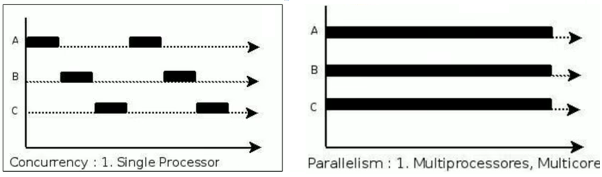
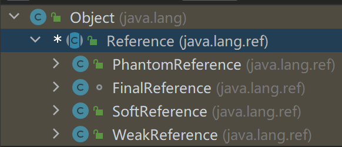

# 垃圾回收器概述

- 按线程数：串行回收、并行回收。
- 按工作模式：并发式、独占式。
- 按碎片处理方式：压缩式、非压缩式。
- 按工作内存区间：年轻代、老年代。

| 分类       | 经典垃圾收集器                                  |
| ---------- | ----------------------------------------------- |
| 串行回收器 | Serial<br />Serial Old                          |
| 并行回收器 | ParNew<br />Parallel Scavenge<br />Parallel Old |
| 并发回收器 | CMS<br />G1                                     |

 

- 查看默认的垃圾收集器：（查看相应的参数）

```
-XX:+PrintCommandLineFlags
```

```shell
jinfo -flag 相关垃圾回收器参数 进程ID
```

> -XX:+UseParallelGC 

| GC                | 分类           | 作用位置       | 算法                   | 特点（优先） | 适用场景                   |
| ----------------- | -------------- | -------------- | ---------------------- | ------------ | -------------------------- |
| Serial            | 串行           | Young          | 复制                   | 低延迟       | 单CPU的Client模式          |
| ParNew            | 并行           | Young          | 复制                   | 低延迟       | 多CPU的Server模式与CMS搭配 |
| Parallel Scavenge | 并行           | Young          | 复制                   | 吞吐量       | 后台运算，交互少           |
| Serial Old        | 串行           | Old            | Mark-Compact           | 低延迟       | 单CPU的Client模式          |
| Parallel Old      | 并行           | Old            | Mark-Compact           | 吞吐量       | 后台运算，交互少           |
| CMS               | 并发           | Old            | Mark-Sweap             | 低延迟       | 互联网、B/S业务            |
| G1                | 并发<br />并行 | Young<br />Old | Mark-Compact<br />复制 | 低延迟       | 服务端应用                 |

# GC相关概念

## System.gc()

- gc()：触发Full GC。
  - System.gc()：附带免责声明，无法保证对垃圾收集的调用。

```java
public static void gc() {
    Runtime.getRuntime().gc();
}
```

- System#runFinalization()：  强制调用失去引用对象的finalize()。

```java
public static void runFinalization() {
    Runtime.getRuntime().runFinalization();
}
```

> buffer不会被回收：虽然超过了作用域，但此时buffer仍然在局部变量表中保存引用，占据一个Slot。
>
> ```java
> public void localvarGC1() {
> {
>   byte[] buffer = new byte[10 * 1024 * 1024];
> }
> System.gc();
> }
> ```
>
> buffer被回收：value重用了buffer的Slot，buffer失去引用。
>
> ```java
> public void localvarGC2() {
> {
>   byte[] buffer = new byte[10 * 1024 * 1024];
> }
> int value = 10;
> System.gc();
> }
> ```
>
> ​    localvarGC1()中的buffer在localvarGC3()中被回收：localvarGC1()栈帧被弹出，buffer失去引用。
>
> ```java
> public void localvarGC3() {
>     localvarGC1();
>     System.gc();
> }
> ```

## 内存溢出、内存泄漏

- 内存溢出（OOM）：没有空闲内存、且垃圾收集器无法提供更多内存。

1. 没有空闲内存：

   1. JVM堆空间设置不够：-Xms、-Xmx。
   2. 创建大量大对象，且长时间（存在引用）不能被垃圾收集器回收。
      - Java.lang.OutOfMemoryError: PermGen space：永久代，内存大小有限。
      - Java.lang.OutOfMemoryError:  Matespace：元数据区，直接内存不足。

2. 抛出OOM前，通常会触发GC。如果分配一个超大对象，JVM判断GC不能解决，则直接抛出OOM。

- 内存泄漏（存储渗漏）Memory Leak：对象不再被程序使用，但GC无法回收该对象。逐步蚕食内存空间（虚拟内存），直至OOM。
  - 宽泛意义：对象生命周期过长，甚至导致OOM。

 

> 内存泄漏举例：
>
> 1. 单例模式：单例的生命周期和应用程序一样长。在单例程序中，如果持有对外部对象的引用，则该外部对象不能被回收，导致内存泄漏。
> 2. 一些需要close()的资源未被释放，导致内存泄漏：数据库连接（dataSource.getConnection()）、网络连接（socket）、I/O等。

## STW

- Stop The World：GC事件发生过程中，产生程序的停顿，停顿时整个应用程序线程被暂停。完成GC后恢复被STW中断的应用程序线程。

> 可达性分析算法中枚举GC Roots时，STW：保证一致性。

- STW是所有GC不可避免的事件，由JVM在后台自动发起和完成。

## 垃圾回收的并行、并发

> | 方式 | 说明                                                         |
> | ---- | ------------------------------------------------------------ |
> | 并发 | 操作系统中，一个时间段内有多个程序都处于启动运行到运行完毕之间，且这几个程序都是在同一个处理器上运行。<br />CPU将一个时间段划分为几个时间片段，在这几个时间区间之间切换。 |
> | 并行 | 系统中有一个以上CPU时，当一个CPU执行一个进程时，另一个CPU执行另一个进程，两个进程互不抢占CPU资源，同时进行。<br />决定因素：CPU的核心数量。 |
>
> 

| 线程数        | 说明                                               |
| ------------- | -------------------------------------------------- |
| 并行 Parallel | 多条垃圾收集线程并行工作，此时用户仍处于等待状态。 |
| 串行 Serial   | 单线程执行。<br />Client模式默认应用。             |

| 工作模式        | 说明                                                         |
| --------------- | ------------------------------------------------------------ |
| 并发 Concurrent | 用户线程、垃圾收集线程同时执行（并行/交替执行），垃圾收集线程执行时不会停顿用户线程。 |
| 独占            | STW                                                          |

 

## 安全点、安全区域

- 安全点（Safe Point）：程序只有特定的位置才能停顿下来开始GC，并非所有地方都行。
- 是否具有让程序长时间执行的特征：安全点太少可能导致GC等待时间过长，过多可能导致运行时的性能问题。
- 如何在GC发生时，检查所有线程是否处于最近的安全点停顿：

| 方式                           | 说明                                                         |
| ------------------------------ | ------------------------------------------------------------ |
| 抢先式中断<br />（已都不采用） | 首先中断所有线程，如果还有线程不在安全点，则恢复该线程，使其前往安全点。 |
| 主动式中断                     | 设置一个中断标志，各个线程运行到Safe Point时，主动轮询该标志。如果标志为真，则将自身中断挂起。 |

- 安全区域（Safe Region）：在一段代码片段中，对象的引用关系不会发生变化，在该区域的任何位置开始GC都是安全的。

> 安全区域解决的问题：如果线程处于Sleep、Blocked状态，无法响应JVM的中断请求，JVM也不大可能等待线程被唤醒。

1. 线程运行到Safe Region的代码区时，标识已经进入Safe Region。如果这段时间内发生GC，JVM会忽略标识为Safe Region状态的线程。
2. 当线程离开Safe Region时，会检查JVM是否已经完成GC。如果GC完成了，则继续运行；否则线程必须等待，直到收到可以安全离开Safe Region的信号为止。

## 引用

- 引用强度：强引用 \> 软引用 \> 弱引用 \> 虚引用。
- 除强引用外，其他引用都处于java.lang.ref：

 

- 只有终结器引用 FianlReference的权限修饰符是缺省的（包内可见），其余都是public。

| 引用                         | 说明                                                         |
| ---------------------------- | ------------------------------------------------------------ |
| 强引用<br />StrongReference  | 普遍存在的、默认的引用。<br />只要存在强引用关系，垃圾收集器就不会回收掉引用的对象。 |
| 软引用<br />SoftReference    | 将要发生内存溢出时，会把这些对象列入回收范围内进行第二次回收。 |
| 弱引用<br />WeakReference    | 被软引用关联的对象只能存活到下一次垃圾收集之前，当垃圾收集器工作时，无论内存空间是否足够，都会回收掉被弱引用关联的对象。 |
| 虚引用<br />PhantomReference | 虚引用不会对对象的生存时间构成影响，也无法通过虚引用来获得一个对象的实例。<br />虚引用关联的目的：在该对象被垃圾收集器回收时，收到一个系统通知。 |

### 强引用

- 强引用的对象是可触及的，垃圾回收器不会回收该类对象。
- 强引用：new创建对象。

1. 强引用可直接访问目标对象。
2. 强引用指向的对象任何时候都不会被系统回收，即使抛出OOM。
3. 强引用可能导致内存泄漏。

### 软引用 SoftReference

- 软引用：非必需的对象（内存敏感的缓存）。将要发生OOM、内存空间不足时，会把这些对象列入回收范围内进行第二次回收。
- 垃圾回收器在某个时刻决定回收可达的对象时，会清理软引用，并可选地将引用存放到一个引用队列（Reference Queue）。

```java
SoftReference<Person> userSoftRef = new SoftReference<Person>(new Person("Tom",12));
```

### 弱引用 WeakReference

- 弱引用：非必需的对象（可有可无的缓存数据）。只被软引用关联的对象只能存活到下一次垃圾收集之前。在GC时，只要发现弱引用，就会回收只被弱引用关联的对象。
- 由于垃圾回收器的线程通常优先级很低，并不一定很快就发现持有弱引用的对象，此时，弱引用对象可以存活较长时间。
- 在构造弱引用时，可指定一个引用队列，当弱引用对象被回收时，就会加入到指定的引用队列中，通过该队列可以跟踪对象的回收情况。

```java
WeakReference<Person> userSoftRef = new WeakReference<Person>(new Person("Tom",12));
```

- WeakHashMap：`Entry<K,V>[] table;`

```java
private static class Entry<K,V> 
    extends WeakReference<Object> 
    implements Map.Entry<K,V> {

    ...
}
```

### 虚引用 PhatomReference

- 虚引用（幽灵引用、幻影引用）：虚引用不会对对象的生存时间构成影响，也无法通过虚引用来获得一个对象的实例（get()获取的是null）。如果一个对象仅持有虚引用，则该对象几乎等同于没有引用。
- 虚引用必须和引用队列一起使用：虚引用在创建时必须提供一个引用队列作为参数，当垃圾回收器准备回收一个对象时，如果发现其存在虚引用，则在回收该对象之后，将该虚引用加入引用队列，以通知应用程序对象的回收情况。
  - 跟踪对象的回收时间：可将一些资源释放操作置于虚引用中执行和记录。

```java
ReferenceQueue<Person> phantomQueue = new ReferenceQueue<Person>();
PhantomReference<Person> phantomRef = new PhantomReference<Person>(new Person(), phantomQueue);

System.out.println(phantomRef.get()); //null
```

### 终结器引用 FianlReference

- 终结器引用：用以实现对象的fianlize()，无需手动编码，其内部配合引用队列使用。GC时，终结器引用入队，由Finalizer线程通过终结器引用找到被引用对象，并调用其finalize()，如果复活，则第二次GC时才能回收被引用对象。

# GC性能指标

| 性能指标     | 说明                                                         |
| ------------ | ------------------------------------------------------------ |
| **吞吐量**   | 运行用户代码时间占总运行时间的比例。<br />总运行时间 = 程序的运行时间 - 内存回收的时间。 |
| 垃圾收集开销 | 吞吐量的补数<br />垃圾收集所用时间与总运行时间的比例。       |
| **暂停时间** | 执行垃圾收集时，程序的工作线程被暂停的时间。                 |
| 收集频率     | 相对于应用程序的执行，收集操作发生的频率。                   |
| **内存占用** | Java堆区所占的内存大小。                                     |
| 快速         | 一个对象从诞生到被回收所经历的时间。                         |

> 不可能铁三角：吞吐量、暂停时间、内存占用。
>
> - 随着硬件性能的提升：
>
> 1. 对内存占用的容忍越大。
> 2. 有助于降低收集器运行时对应用程序的影响，提高了吞吐量。
> 3. 而内存的扩大，对延迟带来负面效果。

- 吞吐量（throughout）：CPU用于运行用户代码的时间与CPU总消耗时间的比值。

$$
吞吐量 = \frac{运行用户代码时间}{运行用户代码时间+垃圾收集时间}
$$

- 高吞吐量的应用程序能忍受较高的暂停时间。
  - 高吞吐量：降低内存回收的执行频率、GC需要更长的暂停时间来执行内存回收。
  - 吞吐量优先：在最大吞吐量优先的情况下，降低停顿时间。

 

# GC迭代史

| JDK   | 说明                                                         |
| ----- | ------------------------------------------------------------ |
| 1.3.1 | 串行 Serial GC                                               |
| 1.4.2 | Parallel GC<br />Concurrent Mark Sweep GC （CMS GC）         |
| 1.6   | Parallel GC 作为Hotspot默认GC                                |
| 1.7u4 | G1可用                                                       |
| 9     | G1作为默认的垃圾收集器，替代CMS                              |
| 10    | G1垃圾回收器的并行完整垃圾回收，实现并行性来改善最坏情况下的延迟 |
| 11    | Epsilon垃圾回收器（No-Op）<br />ZGC：可伸缩的低延迟垃圾回收器（实验Experimental） |
| 12    | 增强G1：自动返回未用堆内存给操作系统<br />引入Shenandoah GC：低停顿时间的GC（Experimental） |
| 13    | 增强ZGC：自动返回未用堆内内存给操作系统                      |
| 14    | 删除CMS垃圾回收器<br />扩展ZGC在maxOS、Window的应用          |