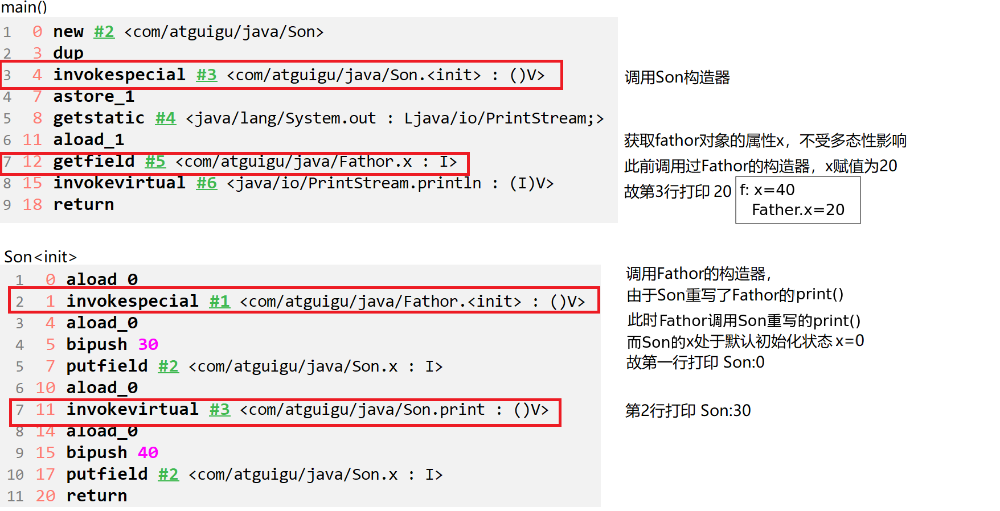
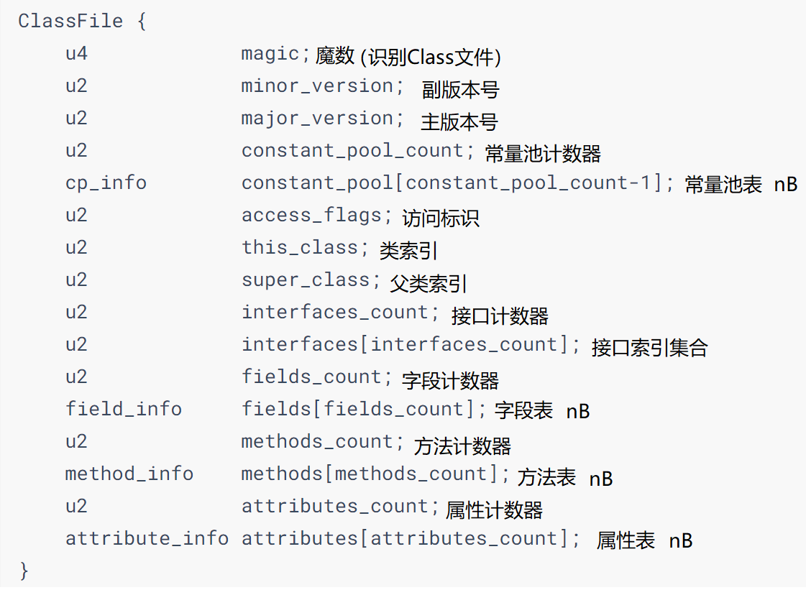
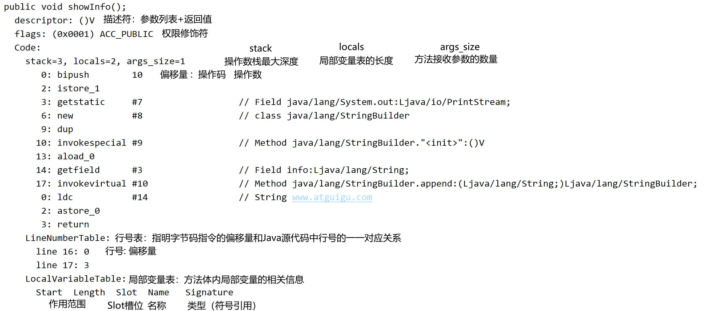
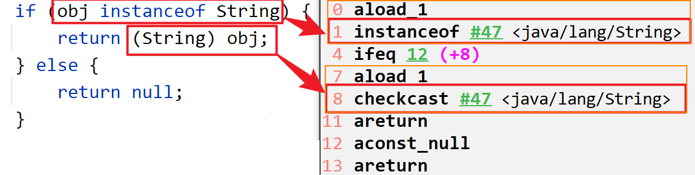
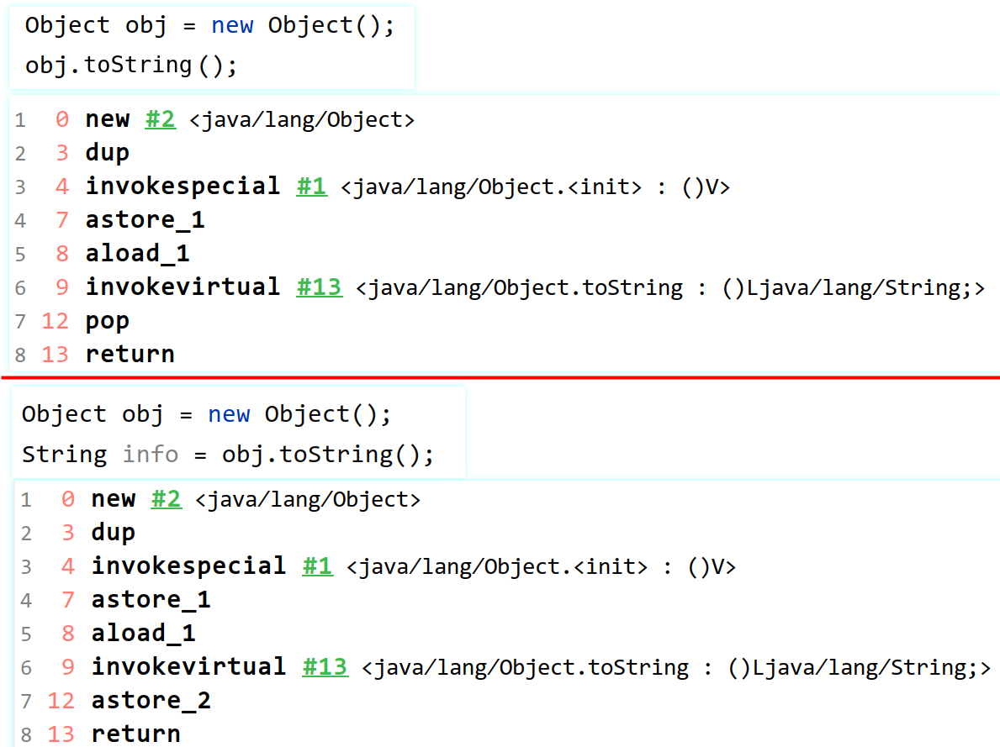
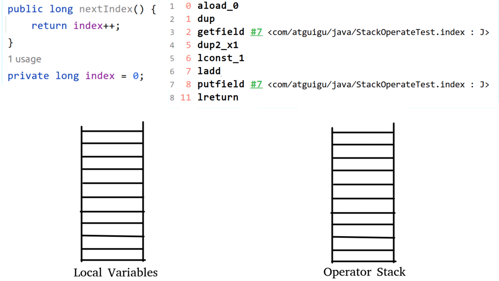
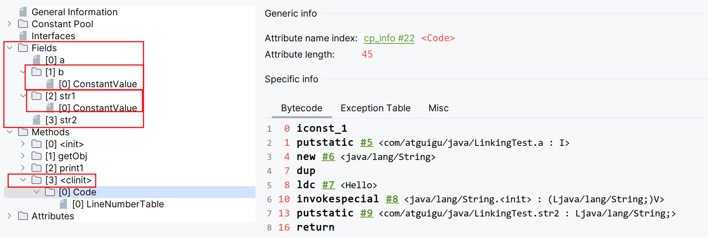

# Class文件

- JVM只与Class文件相关联，而不和任何语言绑定。（包括Java）

## 前端编译器

- 前端编译器（javac）：将java代码转换为符合JVM规范的字节码文件。不涉及代码编译优化。
  1. 词法解析。
  2. 语法解析。
  3. 语义解析。
  4. 生成字节码。

 

| 前端编译器                       | 说明           |
| -------------------------------- | -------------- |
| javac                            | 默认，全量编译 |
| ECJ（Eclipse Compiler for Java） | 增量编译       |

## Class文件解读

- 字节码文件（.class）：二进制的类文件，内容为JVM指令。

- 字节码指令（byte code）：JVM的指令由一个字节长度的、代表某种特定操作含义的操作码（opcode）以及跟随其后的零至多个代表此操作所需参数的操作数（operand）所构成。

  ```java
  javap -v Test.class > E:/test.txt
  ```

```java
Fathor f = new Son();
System.out.println(f.x);
//Son:0 默认初始化值
//Son:30
//20 多态性：属性没有多态
```



```java
class Fathor{

    private int x = 10;

    public Fathor(){
        this.print();
        x = 20;
    }

    public void print(){
        System.out.println("Fathor:" + x);
    }
}

class Son extends Fathor{

    private int x = 30;

    public Son(){
        //隐藏 super();
        this.print();
        x = 40;
    }

    public void print(){
        System.out.println("Son:" + x);
    }
}
```

## Class文件结构

- Class文件：对应唯一一个类/接口的定义信息，是一组8字节的二进制流，不一定以磁盘文件格式存在。
- Class文件只有两种数据类型：无符号数、表。

| 数据类型 | 说明                                                         |
| -------- | ------------------------------------------------------------ |
| 无符号数 | 基本数据类型：u1、u2、u4、u8分布代表1B、2B、4B、8B的无符号数。<br />无符号数可以描述数字、索引引用、数量值、字符串值（UTF-8）。 |
| 表       | 复合数据类型：多个无符号数、其他表构成。<br />表无固定长度：需要标识位说明表的长度<br />习惯：以“\_info”结尾。<br />描述有层次关系的复合结构的数据：Class文件相当于一个表。 |



### magic 魔数

- magic：Class文件的标识符（而不是文件扩展名识别），固定为0xCAFEBABE。

### major_version minor_version 版本号

- Java版本号：major\_version.minor\_version，从45开始，JDK1.1之后每个JDK版本发布，其对应的主版本号+1.（46-1.2）
- 不同版本的Java编译器编译的Class文件对应的版本不同（向下兼容），高版本JVM可以执行低版本编译器生成的Class文件；但低版本JVM不能执行高版本编译器生成的Class文件：JDK1.k的JVM对应的class文件版本号范围：45.0\~44+k.0。

### 常量池

- 常量池集合：一个前置的容量计数器（constant\_pool\_count）和若干个连续的数据项（constant\_pool）。
- constant\_pool\_count 常量池计数器：常量池中常量的数量是不固定的，需要在常量池的入口放置一项u2类型的无符号数，代表常量池容量计数值（从1开始计数）。
  - constant\_pool\_count=1对应常量池中有0个常量项。从1开始计数，将第0项常量空置，以满足后续某些指向常量池的索引值的数据在特定情况下需要表达“不引用任何一个常量池项目”的含义（索引0）。
- constant\_pool：常量池表项主要存放编译器生成的各种字面量（Literal）、符号引用（Symbolic References），在类加载后进入方法区的运行时常量池中存放。
  - 标记字节（tag byte）：常量池中的每一项的第一个字节都为类型标记，用于确定该项的格式。

| 主要存储常量 | 具体类型                                                     |
| ------------ | ------------------------------------------------------------ |
| 字面量       | 文本字符串<br />声明为final的常量值                          |
| 符号引用     | 类/接口的全限定名<br />字段的名称和描述符<br />方法的名称和描述符 |

```java
package com.atguigu.java1;

public class Demo {
    private int num = 1;

    public int add(){
        num = num + 2;
        return num;

    }
}
```

> Hexviewer查看十六进制文件：.class。

[详细常量类型和结构、Demo字节码的解析.xlsx](../../attach/JVM/常量类型和结构.xlsx)

#### 符号引用、描述符

| 符号引用 | 说明                                                         |
| -------- | ------------------------------------------------------------ |
| 全限定名 | 全类名：com.zjk.demo1<br />全限定名：com/zjk/demo1;（分号结尾） |
| 简单名称 | 没有类型、参数修饰的方法/字段名称：public void add() --> add |
| 描述符   | 描述字段的数据类型、方法的参数列表（数量、类型、顺序）、返回值。 |

| 描述符 | 说明                                                         |
| ------ | ------------------------------------------------------------ |
| B      | byte                                                         |
| C      | char                                                         |
| D      | double                                                       |
| F      | float                                                        |
| I      | int                                                          |
| **J**  | **long**                                                     |
| S      | short                                                        |
| **Z**  | **boolean**                                                  |
| V      | void                                                         |
| **L**  | **对象类型，如：Ljava/lang/Object;**                         |
| `[`    | 数组类型：<br />一维数组：`int[] --> [I`<br />二维数组：`int[][] --> [[I`，以此类推 |

```java
Object[] arr = new Object[10];
System.out.println(arr);//[Ljava.lang.Object;@1540e19d

String[] arr1 = new String[10];
System.out.println(arr1);//[Ljava.lang.String;@677327b6

long[][] arr2 = new long[10][];
System.out.println(arr2);//[[J@14ae5a5
```

- JVM在加载Class文件时才会进行动态链接：Class文件中不会保存各个方法和字段的最终内存布局信息，这些方法和字段的符号引用需要经过转换才能被JVM直接使用。当JVM运行时，需要从常量池中获得对应的符号引用，再在类加载过程中的解析阶段将其替换为直接引用，并翻译到具体的内存地址中。

| 类型     | 说明                                                         |
| -------- | ------------------------------------------------------------ |
| 符号引用 | 以一组符号来描述所引用的目标，符号可以是任何形式的字面量，只要使用时能无歧义地定位到目标即可。<br />符号引用与JVM实现的内存布局无关，引用的目标不一定已经加载到内存中。 |
| 直接引用 | 可以是直接指向目标的指针、相对偏移量，或是能间接定位到目标的句柄。<br />直接引用与JVM实现的内存布局相关，同一个符号引用在不同JVM实例上翻译出来的直接引用一般不相同。<br />如果存在直接引用，则引用的目标必定已经存在于内存中。 |


#### 存放类型

| tag（u1） | 常量池存放的类型                                             | 结构                                                         |
| --------- | ------------------------------------------------------------ | ------------------------------------------------------------ |
| 01        | CONSTANT\_utf8\_info<br />UTF-8编码的字符串                  | lenth（u2）：UTF-8编码字符串占用的字符数<br />bytes（u lenth）:长度为length的UTF-8编码的字符串 |
| 03        | CONSTANT\_Integer\_info<br />整型字面量                      | bytes（u4）：按照高位在前存储的int值                         |
| 04        | CONSTANT\_Float\_info<br />浮点型字面量                      | bytes（u4）：按照高位在前存储的float值                       |
| 05        | CONSTANT\_Long\_info<br />长整型字面量                       | bytes（u8）：按照高位在前存储的long值                        |
| 06        | CONSTANT\_Double\_info<br />双精度浮点型字面量               | bytes（u8）：按照高位在前存储的double值                      |
| 07        | CONSTANT\_Class\_info<br />类/接口的符号引用                 | index（u2）：指向全限定名常量项的索引                        |
| 08        | CONSTANT\_String\_info<br />字符串类型字面量                 | index（u2）：指向字符串字面量的索引                          |
| 09        | CONSTANT\_Fieldref\_info<br />字段的符号引用                 | index（u2）：指向CONSTANT\_Class\_info的索引项<br />index（u2）：指向CONSTANT\_NameAndType的索引项 |
| 10（0a）  | CONSTANT\_Method\_info<br />类中方法的符号引用               | index（u2）：指向CONSTANT\_Class\_Info的索引项<br />index（u2）：指向CONSTANT\_NameAndType的索引项 |
| 11（0b）  | CONSTANT\_InterfaceMethodref\_info<br />接口中方法的符号引用 | index（u2）：指向CONSTANT\_Class\_Info的索引项<br />index（u2）：指向CONSTANT\_NameAndType的索引项 |
| 12（0c）  | CONSTANT\_NameAndType\_info<br />字段/方法的符号引用         | index（u2）：指向该字段或方法名称常量项的索引<br />index（u2）：指向该字段或方法描述符常量项的索引 |
| 15（0f）  | CONSTANT\_MethodHandle\_info<br />方法句柄                   | reference\_kind（u1）：值必须在1-9之间，决定了方法句柄的类型，表示方法句柄的字节码行为<br />reference\_index（u2）：对常量池的有效索引 |
| 16（10）  | CONSTANT\_MethodType\_info<br />标识方法类型                 | descriptor\_index（u2）：对常量池的有效索引，该索引项必须是CONSTANT\_Utf8\_info |
| 18（12）  | CONSTANT\_InvokeDynamic\_info<br />一个动态方法调用点        | bootstrap\_method\_attr（u2）：对当前Class文件中引导方法表的bootstrap\_methods\[\]数组的有效索引<br />name\_and\_type\_index（u2）：对当前常量池的有效索引，该索引项必须是CONSTANT\_NameAndType\_Info |

### 访问标识

| Flag Name       | Value  | Interpretation                                               |
| --------------- | ------ | ------------------------------------------------------------ |
| ACC\_PUBLIC     | 0x0001 | 标识为public类型                                             |
| ACC\_FINAL      | 0x0010 | 标识声明为final，只有类可以设置<br />与 ACC\_ABSTRACT冲突    |
| ACC\_SUPER      | 0x0020 | 标识允许使用invokespecial字节码指令的新语义<br />Jdk1.0.2之后默认为true，由于向后兼容 |
| ACC\_INTERFACE  | 0x0200 | 标识为接口。没有该标识的则是类：可具有除ACC\_ANNOTAION外所有标识<br />必须伴随ACC_ABSTRACT标识，<br />与ACC\_FINAL、ACC\_SUPER、ACC\_ENUM冲突 |
| ACC\_ABSTRACT   | 0x0400 | 是否为abstract类型对于接口/抽象类，此标识为true；其他类型为false |
| ACC\_SYNTHETIC  | 0x1000 | 标识此类并非用户代码产生，而是由编译器产生的类，没有对应源码 |
| ACC\_ANNOTATION | 0x2000 | 标识为注解<br />必须伴随ACC\_INTERFACE                       |
| ACC\_ENUM       | 0x4000 | 标识该类/其父类为枚举                                        |

### 类索引、父类索引、接口索引集合

- 访问标识后，会指定该类的类别、父类类别、实现的接口

| 长度 | 含义                            | 说明                                                         |
| ---- | ------------------------------- | ------------------------------------------------------------ |
| u2   | this\_class                     | 该类的全限定名                                               |
| u2   | super\_class                    | 该类的父类的全限定名，只有java.lang.Object的父类索引为0<br />指向的不能是final类 |
| u2   | interfaces\_count               | 接口计数器，该类/接口的直接超接口数量                        |
| u2   | interfaces\[interfaces\_count\] | 该类实现的接口索引数组，每一项都是CONSTANT\_CLass\_info<br />0 `<=` i `<` interfaces\_count<br />interface各成员表示的接口顺序和对应源代码中给定的接口顺序相同（从左到右）：interface\[0\]对应最左边的接口 |

### 字段表集合

- 字段（field）：类变量、实例变量，不包括局部变量。通过引用常量池中的常量描述，指向常量池索引集合，描述每个字段的完整信息。

  - Java中的字段不可重载，不能重名；而字节码中允许重名字段，只要描述符不一致即可。
  - 字段的信息（布尔值修饰符）：
    - 作用域（public、private、protected）
    - 实例变量/类变量（static）
    - 可变性（final）
    - 并发可见性（volatitle）
    - 可否序列化（transient）
    - 字段数据类型（基本数据类型、对象、数组）
    - 字段名称

- 字段表计数器（fileds\_count）u2：当前Class文件fields表的成员个数。

- 字段表集合（fields）：描述接口/类中声明的变量。

  - fields中的各个成员都是field\_info，只表示该类/接口所声明的所有类字段、实例字段。不包括局部变量、父类/接口中继承而来的字段。
  - fields有可能会列出原本Java代码中不存在的字段（内部类为保持对外部类的访问性，会自动添加指向外部类实例的字段）。

| 类型            | 名称              | 含义       | 数量              |
| --------------- | ----------------- | ---------- | ----------------- |
| u2              | acess\_flags      | 访问标识   | 1                 |
| u2              | name\_index       | 字段名索引 | 1                 |
| u2              | descripto\_index  | 描述符索引 | 1                 |
| u2              | attributes\_count | 属性计数器 | 1                 |
| attribute\_info | attributes        | 属性集合   | attributes\_count |

| acess_flags 字段表访问标识 | 标识值 | 含义           |
| -------------------------- | ------ | -------------- |
| ACC\_PUBLIC                | 0x0001 | public         |
| ACC\_PRIVATE               | 0x0002 | private        |
| ACC\_PROTECTED             | 0x0004 | protected      |
| ACC\_STATIC                | 0x0008 | static         |
| ACC\_FINAL                 | 0x0010 | final          |
| ACC\_VOLATILE              | 0x0040 | volatile       |
| ACC\_TRANSIENT             | 0x0080 | transient      |
| ACC\_SYNCHETIC             | 0x1000 | 编译器自动产生 |
| ACC\_ENUM                  | 0x4000 | enum           |

### 方法表集合

- methods：指向常量池索引集合，完整描述每个方法的签名。字节码文件中，一个method对应一个类/接口中的方法信息。每个成员都是method\_info。
  - 只描述当前类/接口中声明的方法，不包括从父类/父接口继承的方法。
  - 有可能会出现由编译器自动添加的方法（类/接口初始化方法`<clinit>()`、实例初始化方法`<init>()`）。

| 类型         | 名称             | 含义       | 数量           |
| ------------ | ---------------- | ---------- | -------------- |
| u2           | acess\_flags     | 访问标识   | 1              |
| u2           | name\_index      | 方法名索引 | 1              |
| u2           | descripto\_index | 描述符索引 | 1              |
| u2           | methods\_count   | 方法计数器 | 1              |
| method\_info | attributes       | 方法集合   | methods\_count |

| acess_flags 字段表访问标识 | 标识值 | 含义         |
| -------------------------- | ------ | ------------ |
| ACC\_PUBLIC                | 0x0001 | public       |
| ACC\_PRIVATE               | 0x0002 | private      |
| ACC\_PROTECTED             | 0x0004 | protected    |
| ACC\_STATIC                | 0x0008 | static       |
| ACC\_FINAL                 | 0x0010 | final        |
| ACC\_SYNCHRONIZED          | 0x0020 | synchronized |
| ACC\_BRIDGE                | 0x0040 | bridge       |

- 方法计数器（methods\_count）u2：当前class文件中methods表的成员个数。

- 方法重载(Overload)：

  - Java语言中，除了要与原方法具有相同的简单名称之外，还要求必须拥有一个与原方法不同的特征签名（方法中各个参数在常量池中的字段符号引用的集合），而返回值不会包含在特征签名之中，Java语义无法仅仅依靠返回值的不同来对一个已有方法进行重载。
  - c1ass文件格式中，特征签名的范围更大一些，只要描述符不是完全一致的两个方法就可以共存。允许存放多个方法签名相同的方法，但这些方法之间的返回值不能相同。

### 属性表集合

- 属性表集合（attributes）：class文件所携带的辅助信息、任何带有RetentionPolicy\.CLASS/RetentionPolicy\.RUNTIME的注解（用于JVM的验证和运行、Java程序的调试）。
  - 字段表、方法表中也有自己的属性表集合。
  - 属性表集合不要求具有严格的顺序，只要不与已有的属性名重复即可。任何实现的编译器都可以向属性表中写入自定义的属性信息，但JVM运行时会忽略其不认识的属性。

```java
ConstantValue_attribute{
    u2 attribute_name_index;
    u4 attribute_length; //常量该值恒为2
    u2 constantvalue_index;
}
```

- 属性表计数器（attributes\_count）：当前class文件属性表的成员个数。每项都是attribute\_info。

#### Code

| 类型                | 名称                     | 含义                     | 数量                  |
| ------------------- | ------------------------ | ------------------------ | --------------------- |
| u2                  | attribute\_name\_index   | 属性名索引               | 1                     |
| u4                  | attribute\_length        | 属性长度                 | 1                     |
| u2                  | max\_stack               | 操作数栈深度最大值       | 1                     |
| u2                  | max\_local               | 局部变量表所需的存续空间 | 1                     |
| u4                  | code\_length             | 字节码指令长度           | 1                     |
| u1                  | code                     | 存储字节码指令           | code\_length          |
| u2                  | exception\_table\_length | 异常表长度               | 1                     |
| exception_info      | exception\_table         | 异常表                   | exception\_length     |
| **u2**              | **attributes\_count**    | **属性表计数器**         | **1**                 |
| **attribute\_info** | **attributes**           | **属性表**               | **attributes\_count** |

- LineNumberTable\_attribute、LocalVariableTable\_attribute：

- LineNumberTable：可选变长属性，位于Code结构的属性表。用来描述Java源码行号与字节码之间的对应关系，在调试时定位代码执行的行数。

```java
LineNumberTable_attribute {
    u2 attribute_name_index;
    u4 attribute_length;
    u2 line_number_table_length;
    {   u2 start_pc; //字节码行号
        u2 line_number;     //Java源代码行号
    } line_number_table[line_number_table_length];
}
```

```java
LocalVariableTable_attribute {
    u2 attribute_name_index;
    u4 attribute_length;
    u2 local_variable_table_length;
    {   u2 start_pc;
        u2 length;
        u2 name_index;
        u2 descriptor_index;
        u2 index;
    } local_variable_table[local_variable_table_length];
}
```

#### SourceFile

- 附加属性（SourceFile）：

```java
SourceFile_attribute {
    u2 attribute_name_index;
    u4 attribute_length;
    u2 sourcefile_index;
}
```

## javap

> javac -g Xxx.java 
>
> （IDE默认）生成所有相关信息：局部变量表信息等。

```
javap <options> <classes>
```

| javap参数                                              | 说明                                                         |
| ------------------------------------------------------ | ------------------------------------------------------------ |
| `--help -help -h -?`                                   | 输出此帮助消息                                               |
| `-version`                                             | 版本信息                                                     |
| `-v  -verbose`                                         | 输出附加信息（不显示私有信息）                               |
| `-l`                                                   | 输出行号和本地变量表                                         |
| -public<br />-protected<br />-package<br />-p -private | 仅显示公共类和成员<br />显示保护、公共的类和成员<br />（默认）显示程序包/受保护的/公共类和成员<br />显示所有类和成员 |
| -sysinfo                                               | 显示正在处理的类的系统信息（路径、大小、日期、SHA-256 散列） |
| -constants                                             | 显示最终常量                                                 |
| `--module <模块>, -m <模块>`                           | 指定包含要反汇编的类的模块                                   |
| `-J <vm-option>`                                       | 指定 VM 选项                                                 |
| `--module-path <路径>`                                 | 指定查找应用程序模块的位置                                   |
| `--system <jdk> `                                      | 指定查找系统模块的位置                                       |
| `--class-path <路径> `                                 | 指定查找用户类文件的位置                                     |
| ` -classpath <路径>   `                                | 指定查找用户类文件的位置                                     |
| `-cp <路径>  `                                         | 指定查找用户类文件的位置                                     |
| `-bootclasspath <路径> `                               | 覆盖引导类文件的位置                                         |
| `--multi-release <version>`                            | 指定要在多发行版 JAR 文件中使用的版本                        |
| -s                                                     | 输出内部类型签名                                             |
| -c                                                     | 对代码进行反编译                                             |


 



# 字节码指令集与解析

- 字节码指令（byte code）：JVM的指令由一个字节长度的、代表某种特定操作含义的操作码（opcode）以及跟随其后的零至多个代表次操作所需参数的操作数（operand）所构成。
  - JVM基于栈（操作数栈）：大多数指令不包含操作数。
  - 操作码的长度为1Byte（0\~255），指令集的操作码总数不得超过256 。
- 执行模型：

```java
do{
    自动计算PC寄存器的值+1;
    根据PC寄存器的指示位置，从字节码流中取出操作码;
    if(字节码存在操作数) 从字节码流中取出操作数;
    执行操作码所定义的操作;
}while(字节码长度 > 0)
```

- 操作码分类：

1. 与数据类型相关。
2. 没有明确指明操作类型的字母。
3. 与数据类型无关的。

| 操作码助记符<br />（数据类型相关） | 数据类型 |
| ---------------------------------- | -------- |
| i                                  | int      |
| l                                  | long     |
| s                                  | short    |
| b                                  | byte     |
| c                                  | char     |
| f                                  | float    |
| d                                  | double   |

- 大多数对于boolean、byte、short、char类型数据的操作使用相应的int类型作为运算类型：大部分的指令不支持整数类型 byte、char、short，甚至没有指令支持boolean类型。编译器在编译期/运行期将byte、short类型的数据带符号扩展为相应的int类型（Sign-Extend），将boolean、char零位扩展为相应的int类型（Zero-Extend）。

- 字节码指令按用途分类：

1. 加载与存储指令。
2. 算术指令。
3. 类型转换指令。
4. 对象的创建与访问指令。
5. 方法调用与返回指令。
6. 操作数栈管理指令。
7. 比较控制指令。
8. 异常处理指令。
9. 同步控制指令。

## 加载和存储指令

- 加载和存储指令：将数据从栈帧的局部变量表和操作数栈之间来回传递。

 

| 常用指令                       | 说明                                                         |
| ------------------------------ | ------------------------------------------------------------ |
| 局部变量压栈指令               | `xload`<br />`xload_<n>`：x（i、l、f、d、a），n（0\~3）      |
| 常量入栈指令                   | bipush<br />sipush<br />ldc<br />ldc_w<br />ldc2_w<br />aconst_null<br />iconst_m1<br />`iconst_<i>`<br />`lconst_<l>`<br />`fconst_<f>`<br />`dconst_<d>` |
| 出栈装入局部变量表指令         | xstore<br />`xstore_<n>`：x（i、l、f、d、a），n（0\~3）<br />xastore：x（i、l、f、d、a、b、c、s） |
| 扩充局部变量表的访问索引的指令 | wide                                                         |

- 对于表面上没有出操作数的指令，不需要进行取操作数的动作，其操作数隐含在指令中。

> 将局部变量表中索引为0位置上的数据压入操作数栈：
>
> iload\_0：只有操作码，只要1B空间。
> iload 0：操作码+操作数，需要2B空间。

- 操作数栈（Operand Stacks）：执行每一条指令之前，JVM要求该指令的操作数已经被压入操作数栈中。在执行指令时，JVM会将该指令所需的操作数弹出，并且将该指令的结果重新压入栈中。

 

- 局部变量表（Local Variables）：字节码程序将计算的结果缓存在局部变量表中。JVM实际上将局部变量表当作数组，依次存放this指针（非静态方法）、所传入的参数、字节码中的局部变量。
  - long、double占用2个Slot，1个Slot占4Byte。

 

### 局部变量压栈指令

| 指令        | 说明                                                         |
| ----------- | ------------------------------------------------------------ |
| `xload_<n>` | 向操作数栈压入局部变量表中第n个索引位置的操作数<br />n一般预定义为0\~3 |
| `xload`     | 向操作数栈压入局部变量表中第n个索引位置的操作数              |

 

### 常量入栈指令

- 常量入栈指令：将常数压入操作数栈。根据数据类型、入栈内容不同，分为const系列、push系列、ldc系列指令。

| const指令     | 范围          | 对特定常量入栈，入栈的常量隐含在指令本身                     |
| ------------- | ------------- | ------------------------------------------------------------ |
| iconst\_\<n\> | \-1\~5        | iconst\_m1：将-1压入操作数栈。<br />iconst\_1：将1压入操作数栈。 |
| lcons\_\<n\>  | 0\~1          | lconst\_0：将长整数0压入操作数栈。<br />lconst\_1：将长整数1压入操作数栈。 |
| fconst\_\<n\> | 0\~2          | fconst\_0 ：将浮点数0压入操作数栈。<br />fconst\_1 ：将浮点数1压入操作数栈。<br />fconst\_2 ：将浮点数2压入操作数栈。 |
| dconst\_\<n\> | 0\~1          | fconst\_0 ：将双精度数0压入操作数栈。<br />fconst\_1 ：将双精度数1压入操作数栈。 |
| aconst\_null  | null          | 将null压入操作数栈                                           |
| **push指令**  | **范围**      | **将参数压入栈，接收数据类型：int、short、byte**             |
| bipush        | -128\~127     | 8位整数                                                      |
| sipush        | -32768\~32767 | 16位整数                                                     |
| **ldc指令**   | **范围**      | **将指定的内容压入堆栈。**                                   |
| ldc           |               | 接收一个8位参数（int、float、String）。<br />该参数指向常量池中的int、float、String的索引 |
| ldc\_w        |               | 接收两个8位参数（int、float、String）。                      |
| ldc2\_w       | -             | 接收两个8位参数（long、double）。                            |

> iconst 6：错误（超过范围），应该为：bipush 6

### 出栈装入局部变量表指令

| store指令     | 将操作数栈中栈顶元素弹出后，装入局部变量表的指定位置，用于给局部变量表赋值。 |
| ------------- | ------------------------------------------------------------ |
| xstore        | 没有隐含参数信息，需要提供一个byte类型参数指定目标局部变量表中的位置。 |
| xstore\_\<n\> | x：i、l、f、d、a<br />n：0\~3<br />istore\_n：从操作数栈中弹出一个整数，并将其赋值给局部变量表中索引n位置。 |
| xastore       | x：i、l、f、d、a、b、c、s                                    |

 

## 算术指令

### 算术指令

- 算术指令：对操作数栈上的两个值进行某种特定运算，并将结果重新压入操作数栈。

| 实际类型      | 运算类型      |
| ------------- | ------------- |
| boolean、char | int           |
| short、byte   | int           |
| int           | int           |
| float         | float         |
| reference     | reference     |
| returnAddress | returnAddress |
| long          | long          |
| double        | double        |

- 运算时的溢出：AirthmeticException（除数为0）。

| 运算模式          | 说明                                                         |
| ----------------- | ------------------------------------------------------------ |
| 向最接近数舍入    | 浮点数运算时，所有的运算结果必须舍入到适当的精度，非精度结果必须舍入为可被表示的最接近的精确值。如果有两种可表示的形式与该值一样接近，将优先选择最低有效位为0的。 |
| 向零舍入（floor） | 将浮点数转换为整数时，将在目标数值类型中选择一个最接近，且不大于原值的数字作为最精确的舍入结果。 |

- NaN：没有明确的数学定义的操作结果。

```java
double x = 10 / 0; //AirthmeticException
double y = 10 / 0.0; //Infinity
double z = 0.0 / 0.0; //NaN
```

| 类型     | 算术指令                            |
| -------- | ----------------------------------- |
| 加法指令 | iadd、ladd、fadd、dadd              |
| 减法指令 | isub、lsub、fsub、dsub              |
| 乘法指令 | imul、lmul、fmul、dmul              |
| 除法指令 | idiv、ldiv、fdiv、ddiv              |
| 求余指令 | irem、lrem、frem、drem              |
| 取反指令 | ineg、lneg、fneg、dneg              |
| 自增指令 | iinc（`iinc 局部变量表索引 by 值`） |

> short、byte等类型，short以int类型在进行自增时，最后需要将结果转回short（i2s），故没有使用iinc，而是iadd。
>
> ```java
> short i = 0;
> while(i < 100){
>  i++;
> }
> ```


### 位运算指令

| 类型       | 位运算指令                               |
| ---------- | ---------------------------------------- |
| 位移指令   | ishl、ishr、iushr<br />lshl、lshr、lushr |
| 位或指令   | ior、lor                                 |
| 位与指令   | iand、land                               |
| 位异或指令 | ixor、lxor                               |

 

### 比较指令

| 比较指令         | 从栈中弹出两个操作数用于比较，将比较结果入栈（int）          |
| ---------------- | ------------------------------------------------------------ |
| fcmpg<br />fcmpl | 若a==b，则压入0；若a&gt;b，则压入1；若a&lt;b，则压入-1。（a先压入，b在栈顶）<br />遇到NaN时，fcmpg指令压入1，而fcmpl指令压入-1。 |
| dcmpg<br />dcmpl | dcmpg指令和dcmpl指令同理fcmpl指令、fcmpg指令。               |
| lcmp             | long类型整数没有NaN，故只需要lcmp指令。                      |

> 只有数值类型才能用于比较指令比较大小，boolean、引用数据类型不能用于比较指令比较大小。

## 类型转换指令

- 类型转换指令：将两种不同的数值类型进行相互转换。

1. 显示类型转换。
2. 处理字节码指令集中数据类型相关指令无法与数据类型一一对应问题。

### 宽化类型转换

- 宽化类型转换（widening numeric conversion）：小范围类型至大范围类型的安全转换（不需要指令执行）。

| 转换类型         | 目标类型                    | 指令                  |
| ---------------- | --------------------------- | --------------------- |
| int、short、byte | long<br />float<br />double | i2l<br />i2f<br />i2d |
| long             | float<br />double           | l2f<br />l2d          |
| float            | double                      | f2d                   |

- int --> long --> float --> double。

- 精度损失问题：（JVM不抛出异常）

  - 宽化类型转换不会因为超过目标类型最大值而丢失信息。
  - int/long-->float、long-->double，可能会发生精度丢失（丢失几位最低位的数值），转换后的浮点数构建IEEE754最接近舍入模式所得到的正确整数值。

```java
float f = 123123123; //1.2312312E8：即123123120
double d = 123123123123123123L; //1.2312312312312312E17：即123123123123123120
```

- byte、char、short不存在到int的宽化类型转换：byte、short被JVM看作int处理。

 

### 窄化类型转换

| 转换类型 | 目标类型                  | 指令                  |
| -------- | ------------------------- | --------------------- |
| int      | byte<br />short<br />char | i2b<br />i2s<br />i2c |
| long     | int                       | l2i                   |
| float    | int<br />long             | f2i<br />f2l          |
| double   | int<br />long<br />float  | d2i<br />d2l<br />d2f |


- 精度损失问题：（JVM不抛出异常）可能导致转换结果具备不同的正负号、不同的数量级。
  - 上限溢出、下限溢出、精度丢失。

```java
short s = 128;
byte b = (byte)s;
System.out.println(b); //-128
```

- 浮点数（float/double）转换为整数（int/long）：

1. 如果浮点值为NaN：转换结果为int/long的0。
2. 如果浮点值不是无穷大：使用IEEE754的向零舍入模式取整，获得整数值。如果该整数值在目标类型（int/long）表示范围内，则转换结果为该整数值；否则，根据该整数值的符号，转换为目标类型（int/long）所能表示的最大/最小正数。
3. 如果是double/float的最大值/最小值则转换为int/long中的最大值/最小值。

- double窄化转换为float：向最接近舍入模式舍入一个可使用float表示的数字。

1. 如果转换结果的绝对值太小而无法用float表示：返回float的正负0。

2. 如果转换结果的绝对值太大而无法用float表示：返回float的正负无穷大。

3. double类型的NaN值：按规定转换为float类型的NaN值。

## 对象的创建与访问指令

### 创建指令

- 创建指令：JVM对类实例、数组的创建与操作使用不同的字节码指令。

| 类型   | 创建指令                                    | 说明                                                         |
| ------ | ------------------------------------------- | ------------------------------------------------------------ |
| 类实例 | new                                         | 接收一个指向常量池索引的操作数，表示要创建的类型。<br />执行完毕后，将对象的引用压入栈。 |
| 数组   | newarray<br />anewarray<br />multianewarray | 基本类型数组<br />引用类型数组<br />多维数组                 |

 

### 字段访问指令

| 字段类型         | 指令                     |
| ---------------- | ------------------------ |
| 类字段（static） | getstatic<br />putstatic |
| 类实例字段       | getfield<br />putfield   |


### 数组操作指令

| 数组操作指令                        | 说明                                                         |
| ----------------------------------- | ------------------------------------------------------------ |
| xaload<br />（数组的加载指令）      | 将一个数组元素加载到操作数栈。<br />执行时，要求操作数中栈顶元素为数组索引i、栈顶顺位第2个元素为数组引用a，该指令会弹出栈顶的这两个元素，并将a\[i\]重新压入堆栈中。 |
| xastore<br />（数组的存储指令）     | 将一个操作数栈的值存储到数组元素中，给一个指定类型的数组的给定索引赋值。<br />在执行前，操作数栈需要准备3个元素：值、索引、数组引用，之后该指令会弹出这3个元素，并将值赋给数组中指定索引的位置。 |
| arraylength<br />（取数组长度指令） | 弹出栈顶的数组元素，获取数组的长度，将长度压入栈。（`aload_<n>，arraylength`） |

| 数组类型          | 加载指令 | 存储指令 |
| ----------------- | -------- | -------- |
| byte<br />boolean | baload   | bastore  |
| char              | caload   | castore  |
| short             | saload   | sastore  |
| int               | iaload   | iastore  |
| long              | laload   | lastore  |
| float             | faload   | fastore  |
| double            | daload   | dastore  |
| reference         | aaload   | aastore  |


### 类型检查指令

| 指令       | 说明                                                         |
| ---------- | ------------------------------------------------------------ |
| instanceof | 判断给定的对象是否为某一个类的实例，将判断结果压入操作数栈。 |
| checkcast  | 检查类型强转是否可以进行。<br />如果可以，该指令不会改变操作数栈，否则抛出ClassCastException。 |

 

## 方法调用与返回指令

### 方法调用指令

| 方法调用指令    | 调用               | 说明                                                         |
| --------------- | ------------------ | ------------------------------------------------------------ |
| invokevirtual   | 对象的实例方法     | 根据对象的实际类型反派（虚方法分派）<br/>支持多态（可重写）。 |
| invokeinterface | 接口方法           | 运行时搜索实现的接口方法，找出合适的方法进行调用。<br />接口的default方法也算是invokeinterface。 |
| invokespecial   | 特殊处理的实例方法 | 静态类型绑定（非重写），不会在调用时进行动态派发。<br/>构造器（\<init\>）、私有方法（private）、父类方法（super）。 |
| invokestatic    | 类方法             | 静态绑定（非重写）。<br />通过类调用的方法，也算是invokestatic（即使满足invoke(special/interface)）。 |
| invokedynamic   | 动态绑定的方法     | 运行时动态解析出调用点限定符所引用的方法，并执行。<br/>该指令的分派逻辑由用户设定的引导方法决定。 |

 

### 方法返回指令

- 方法返回指令：根据返回值的类型区分。

| 方法返回指令 | 以方法声明中的返回值类型为准      |
| ------------ | --------------------------------- |
| ireturn      | boolean、byte、char、short、int。 |
| lreturn      | long                              |
| freturn      | float                             |
| dreturn      | double                            |
| areturn      | reference                         |
| return       | void、\<init\>、\<clinit\>        |

1. 返回指令：将当前方法操作数栈的栈顶元素弹出，压入调用者方法的操作数栈；当前方法操作数栈的其他元素都被丢弃。

2. 如果当前返回的是synchronized方法，则执行一个隐含的monitorexit指令，退出临界区。

3. 最终，丢弃当前方法的整个帧，恢复调用者的帧，将控制权交给调用者。

## 操作数栈管理指令

| 操作数栈管理指令                                      | 通用型指令：对栈的压入、弹出无需指明数据类型。               |
| ----------------------------------------------------- | ------------------------------------------------------------ |
| pop<br/>pop2                                          | 将1、2个元素从栈顶弹出，并直接废弃。                         |
| dup、dup2<br/>dup\_x1、dup2\_x1<br/>dup\_x2、dup2\_x2 | 复制栈顶的1、2个数值，将复制值重新压入栈顶。<br/>\_x1、\_x2：插入栈的位置（dup和\_x的系数相加）。 |
| swap                                                  | 将栈顶的两个Slot数值位置交换。<br/>JVM不提供double、long的交换。 |
| nop                                                   | 字节码：0x00。<br/>无作用：调试、占位。                      |

> 插入位置：
>
> - dup_x1：1+1，栈顶2个Slot下方。
>
> - dup_x2：1+2，栈顶3个Slot下方。
>
> - dup2_x1：2+1，栈顶3个Slot下方。
>
> - dup2_x2：2+2，栈顶4个Slot下方。

 

 

## 控制转移指令

1. 条件跳转指令
2. 比较条件跳转指令
3. 多条件分支指令
4. 无条件指令

> 比较指令属于算术指令。

### 条件跳转指令

- 条件跳转指令：弹出栈顶元素，测试是否满足条件，若满足，则跳转到指定位置。通常结合比较指令（准备栈顶元素）使用，接受2字节的操作数，用于计算跳转的位置（16位带符号整数作为当前位置的offset）。

> 若只是两个int、short、byte、ref类型的数据入栈，则不需要比较指令和条件跳转指令，而是直接通过比较条件跳转指令来计算跳转的位置。

| 条件跳转指令 | 满足条件：栈顶int类型数值 |
| ------------ | ------------------------- |
| ifeq         | =0                        |
| ifne         | &ne;0                     |
| iflt         | &lt;0                     |
| ifle         | &le;0                     |
| ifgt         | &gt;0                     |
| ifge         | &ge;0                     |
| ifnull       | null                      |
| ifnonull     | 不为null                  |

 

### 比较条件跳转指令

- 比较条件跳转指令：将比较和跳转两个步骤结合。接收2字节的操作数作为参数，用于计算跳转的位置。在执行指令时，栈顶需要准备两个元素进行比较。指令执行完成后，栈顶的这两个元素被消耗，且没有数据入栈。若预设条件成立，则执行跳转。

| 比较条件跳转指令                  | int、byte、short、ref |
| --------------------------------- | --------------------- |
| **比较栈顶两个int类型数值的大小** | **跳转条件**          |
| if\_icmpeq                        | 前者=后者             |
| if\_icmpne                        | 前者&ne;后者          |
| if\_icmplt                        | 前者&lt;后者          |
| if\_icmple                        | 前者&le;后者          |
| if\_icmpgt                        | 前者&gt;后者          |
| if\_icmpge                        | 前者&ge;后者          |
| **比较栈顶两个引用类型数值**      | **跳转条件**          |
| if\_acmpeq                        | 前者=后者             |
| if\_acmpne                        | 前者&ne;后者          |

### 多条件分支跳转指令

| 多条件分支跳转指令 | 用于switch的条件跳转的区别                                   |
| ------------------ | ------------------------------------------------------------ |
| tableswitch        | case值连续，内部只存放起始值、终值、若干个偏移量，由指定的操作数index，可立即定位到跳转偏移量位置，效率高。 |
| lookupswitch       | case值不连续，内部存放各个离散的case-offset对，每次执行都要搜索全部的case-offset对，找到匹配的case值，并根据对应的offset计算跳转位置，效率低。<br />将case-offset对按照case值的大小进行排序。 |

 

 

### 无条件跳转指令

- 无条件跳转指令：goto指令接收2字节的操作数共同组成一个带符号整数，用于指定指令的偏移量，指令执行的目的是跳转到偏移量指定的位置。若偏移量过大（超过2字节带符号整数的范围），则使用指令goto\_w（接收4字节的操作数）。

> jsr、jsr\_w、ret也是无条件跳转，主要用于try-catch-finally语句，已经被JVM逐渐废弃。

## 异常处理指令

| 异常机制                                | 指令和处理 |
| --------------------------------------- | ---------- |
| 异常对象的生成：throw（手动、自动）     | athrow     |
| 异常处理：抓抛模型（try-catch-finally） | 异常表     |

### 抛出异常指令 athrow

- 抛出异常指令（athrow）：Java中显式抛出异常（throw）都是由athrow指令实现的。JVM规范规定，大部分的运行时异常会在其他JVM指令检测到异常状况时自动抛出（而不会在字节码中写出）。在抛出异常时，JVM会清除操作数栈上的所有内容，之后将异常实例压入调用者操作数栈。

 

### 异常处理与异常表

- 异常表：若一个方法定义了一个try-catch-fianally的异常处理，则创建一个异常表，包含每个异常处理、finally块的信息（起始位置、结束位置、程序计数器记录的代码处理的偏移位置、被捕获的异常类在常量池中的索引）。
- 当一个异常被抛出时，JVM会在当前方法中寻找匹配的处理。若没有找到，则强制结束该方法、弹出当前栈帧，并且异常重新抛给上层调用者（的栈帧）。若在所有栈帧弹出前仍然没有找到合适的异常处理，则该线程将终止。若该异常在最后一个非守护线程（比如main线程）抛出，则导致JVM自己终止。不管什么时候抛出异常，若异常最终匹配了所有异常类型，则代码继续执行，此时，若方法结束后没有再次抛出异常，在return之前，直接跳转到finally块继续执行。


 

## 同步控制指令

- JVM支持两种同步结构：方法级的同步、方法内部一段指令序列的同步，都是使用monitor支持的。

### 方法级的同步

- 方法级的同步：隐式的，无须通过字节码指令控制，实现在方法调用和返回操作之间。JVM可以从常量池的方法表结构中的ACC\_SYNCHRONIZED访问标志得知一个方法是否声明为同步方法，若是，则JVM自动在方法调用前进行加锁。

> 调用方法时，调用指令会检查方法的ACC\_SYNCHRONIZED访问标志是否设置。若设置，则执行线程先持有同步锁，再执行方法，最后在方法完成（正常、非正常）时释放同步锁。在方法执行期间，执行线程拥有同步锁，而其他线程都无法再获得同一个锁。若一个同步方法在执行期间抛出异常，且方法内部无法处理此异常，则该同步方法所持有的锁将在异常抛出到同步方法之外时自动释放。

### 方法内指定指令序列的同步

- 当线程进入同步代码块时，使用monitorenter指令请求进入。若当前对象的监视器计数器为0，则其被允许进入；若为1，则判断持有当前监视器的线程是否为该线程，若是，则进入，否则进行等待，直到对象的监视器计数器为0时，才被允许进入。
- 当线程退出同步代码块时，使用monitorexit声明退出。JVM中的任何对象都有一个监视器与之相关联，用于判断对象是否被锁定，当监视器被持有后，对象处于锁定状态。
- 指令monitorenter、指令monitorexit在执行时，都需要再操作数栈顶压入对象，之后指令monitorenter和指令monitorexit的锁定与释放都是针对该对象的监视器进行的。

 

# 类的加载过程

 

 

## 加载阶段 Loading

- Loading（加载）：将字节码文件加载到机器内存，并在内存中构建出类模板对象（Java类的原型、内存中的快照）。JVM把从字节码文件中解析出的常量池、类字段、类方法等信息存储到类模板中，以便JVM在运行期（反射）通过类模板获取Java类中的任意信息、对成员变量进行遍历、方法调用。

1. 由类的全名获取该类的二进制数据流。

> 加载.class文件的方式：从本地系统中获取、通过网络获取（Web Applet）、从zip压缩包中读取（jar、war格式）、动态代理技术、其他文件生成（JSP）、从专有数据库提取、从加密文件中获取（防止.class文件被反编译的保护措施）。

2. 解析类的二进制数据为方法区（JDK1.8之前是永久代，JDK1.8之后是元空间）内的数据结构（类模板）。

> 若输入数据不是JVM规范的class文件，则抛出ClassFormatError。

3. 在堆中创建java.lang.Class实例封装该类位于方法内的数据结构。

> java.lang.Class的构造方法是私有的，只有JVM能够构造。
>
> java.lang.Class的实例是访问类型元数据的入口、实现反射的关键数据，通过该类提供的接口来获得目标类所关联的class文件中具体的信息。

 

- 数组类：由JVM在运行时根据需要直接创建，没有对应的class文件、二进制数据流，无法通过类加载器创建数组类。（数组的元素类型仍然是依靠类加载器创建的）

| 数组的元素类型 | 说明                                                         |
| -------------- | ------------------------------------------------------------ |
| 引用类型       | 遵循定义的加载过程递归加载和创建数组的元素类型，JVM使用指定的元素类型和数组维度来创建新的数组类。<br />可访问性由元素类型的可访问性决定。 |
| 基本数据类型   | 基本数据类型由JVM预先定义（不需要类加载），只需要关注数组维度。<br />可访问性被缺省定义为public。 |

## 链接阶段 Linking

### 验证 Verification

- 验证：确保class文件的字节流中包含信息符合当前虚拟机要求，保证被加载类的正确性，不会危害虚拟机自身安全。

> 文件格式验证、元数据验证、字节码验证、符号引用验证。

 

### 准备 Preparation

- 准备（Preparation）：为类变量分配内存并设置默认初始值（零值）。

> 与初始化阶段不同，没有涉及初始化代码的执行。

1. 不包含 static final 修饰的：final在编译时就分配，准备阶段会显式初始化。

2. 不会为实例变量分配初始化：类变量会分配在方法区中，而实例变量随着对象分配到Java堆中。

| 数据类型  | 默认初始化值 |
| --------- | ------------ |
| byte      | (byte)0      |
| short     | (short)0     |
| int       | 0            |
| long      | 0L           |
| float     | 0\.0f        |
| double    | 0\.0         |
| char      | \\u0000      |
| boolean   | false        |
| reference | null         |

> java并不直接支持boolean类型，其boolean类型的内部实现是int。

```java
private static int a = 1; //准备环节，默认初始化为0。
private static final int b = 1; //准备环节，显式初始化为1。ConstantValue
//private fianl int b = 1; 也是显式初始化为1。ConstantValue

private static final String str1 = "Hello"; //准备环节，String以字面量的方式显式初始化。ConstantValue
private static final String str2 = new String("Hellp"); //在<clinit>中进行初始化。
```

 

> ConstantValue：显式初始化（常量）。

### 解析 Resolution

- 解析：将常量池中的符号引用转化为直接引用。

> JVM规范中并没有要求解析阶段一定要按顺序执行，但解析往往伴随着JVM在执行完初始化之后再执行。

> 只要存在直接引用，则一定存在该类、方法、字段；而若只存在符号引用，则不确定。

| 引用类型 | 说明                                                         |
| -------- | ------------------------------------------------------------ |
| 符号引用 | 一组符号描述所引用的目标，与JVM的内部数据结构和内存布局无关。 |
| 直接引用 | 目标方法在类中方法表的位置，直接执行目标的指针、相对偏移量、一个间接定位到目标的句柄。 |

> 解析主要针对：类、接口、字段、类方法、接口方法、方法类型等。
>
> 对应常量池：CONSTANT\_Class\_info、CONSTANT\_Fieldref\_info、CONSTANT\_Methodref\_info等。

## 初始化阶段 Initialization

- 初始化（Initialization）：JVM真正执行类中定义的Java代码，执行类构造器方法\<clinit\>\(\)。

> \<clinit\>\(\)不同于类的构造器：构造器是虚拟机视角下的\<init\>\(\)。

- \<clinit\>\(\)方法只能由Java编译器自动收集类中的所有类变量的赋值动作和静态代码块中的语句生成（指令按语句在源文件中出现的顺序执行）。（无法自定义该同名方法，也不能由我们调用）
- 在加载一个类之前，JVM总会试图加载该类的父类，JVM保证父类的\<clinit\>\(\)方法先于子类的\<clinit\>\(\)方法执行。（父类的static块优先于子类）
- Java编译器并不会为所有的类都产生\<clinit\>()方法，在以下情况中，class文件将不包含\<clinit\>()方法：

1. 该类没有声明任何类变量，没有静态代码块。
2. 该类声明了类变量，但没有显式赋值（使用类变量的初始化语句和静态代码块来执行初始化操作）。
3. 该类中static final修饰的基本数据类型的字段（包括字面量赋值的String），也不会加入到\<clinit\>\(\)方法。

> 引用数据类型（以及new的String），则在\<clinit\>()中进行初始化。

```java
private static final String str1 = "Hello"; //准备环节，String以字面量的方式显式初始化。ConstantValue
private static final String str2 = new String("Hellp"); //在<clinit>()中进行初始化。

private static final Integer INTERGE_CONS1 = Integer.valueOf(100); //在<clinit>()中进行初始化。
```


- JVM保证一个类的\<clinit\>\(\)方法在多线程下被同步加锁（隐式）。

> 若多个线程同时准备初始化一个类，则只有一个线程能够进入，其他线程只能等待，等该类初始化完成后，JVM会直接将准备好的信息返回给处于等待队列的线程。

### 类的初始化时机：主动/被动使用

| 类的使用方式 | 说明                                                         |
| ------------ | ------------------------------------------------------------ |
| 主动使用     | 触发类的初始化\<clinit\>\(\)（只有第一次使用时会触发初始化） |
| 被动使用     | 不触发类的初始化\<clinit\>\(\)                               |

> 初始化&ne;加载，只要有使用就一定被加载，只有主动使用才会初始化。

**主动使用**

1. 创建类的实例：new关键字、反射、克隆、反序列化。
2. 调用类的静态方法时。
3. 访问类/接口的静态变量、或对该静态变量赋值。（除了final）

>final修饰的基本数据类型、String字面量都是准备环节就显式赋值。
>
>而fianl修饰的引用类型仍然会触发主动使用，在\<clinit\>()中进行初始化。

4. 初始化子类时，若其父类还未初始化，则先触发父类的初始化。但是，一个父接口（没有定义default方法时）不会因为其子接口或实现类的初始化而初始化，只有程序首次使用特定接口的静态字段时，才会导致该接口的初始化。

> JVM初始化一个类时，要求其所有的父类都已经被初始化，但不适用于接口。

```shell
# 跟踪类的加载信息并打印
-XX:+TraceClassLoading
```

5. 若接口定义了default方法，则直接实现、或间接实现该接口的类的初始化之前，要先初始化该接口。

6. JVM会先初始化启动时被标明为启动类（main()方法）的类。
7. java.lang.reflect包中的方法反射类的方法时（Class.forName()等）。
8. 动态语言支持：首次调用java\.lang\.invoke\.MethodHandle实例时，若MethodHandle指向的方法所在的类（解析结果REF\_getStatic、REF\_putStatic、REF\_invokeStatic句柄对应的类）没有初始化，则初始化。

**被动使用**：除了主动使用外的其他使用类的方式，不会导致类的初始化。

1. 访问静态字段时，只有声明了该字段的类才会被初始化。子类引用父类的静态变量时，不会导致子类被初始化。
2. 对象数组定义类引用时，不会触发该类的初始化。

```java
Order[] orders = new Order[10]; //不会触发Order类的初始化
orders[0] = new Order(); //触发Order类的初始化
```

3. 引用常量（final）不会触发该类/接口的初始化。（准备环节就已经显式赋值）

4. ClassLoader\#loadClass()方法**加载**类时，并不是对类的主动使用，不会导致类的初始化。

## 类的使用 Using

## 类的卸载 Unloading

- 类的生命周期取决于其对应的Class对象的生命周期。当对应的Class对象不再被引用时，该Class对象结束生命周期，对应的该类在方法区中的数据也被卸载，从而结束该类的生命周期。

 

1. 启动类加载器加载的类型在整个运行期间是不可能被卸载的。（JVM规范、JLS规范）
2. 系统类加载器或拓展类加载器加载的类在运行期间极小可能被卸载，系统类加载器和拓展类加载器的实例在整个运行期间总能被直接/间接地访问，一般不会变为无法触及。
3. 自定义的类加载器实例加载的类在运行期间也不太可能被卸载，只有在简单的上下文环境中才能被卸载，且通常需要借助于强制调用JVM的GC才能完成卸载。

# 类加载器 Class Loader

- ClassLoader（类加载器）是JVM执行类加载机制的前提，所有的Class都是ClassLoader加载的。ClassLoader以各种方式将Class信息的二进制数据读入JVM内部，转换为一个与目标类对应的java.lang.Class实例，之后由JVM进行链接、初始化等操作。
- ClassLoader只负责class文件的加载（Loading：`.class文件 --> JVM --> DNA元数据模板`），由Execution Engine决定是否可以运行。

> 类的唯一性：任何类都需要由加载其的类加载器和该类共同确认其在JVM中的唯一性。

- 每个类加载器都有一个独立的命名空间，由该类加载器和所有的父类加载器所加载的类组成。当两个类由同一个类加载器加载时，命名空间用于比较这两个类是否相同。在同一个命名空间中，不允许出现全类名相同的两个类。而即使这两个类来自同一个class文件且被同一个JVM加载，只要加载这两个类的类加载器不同，就一定不相等（不处于同一个命名空间）。

- 类加载机制的三个基本特征：

1. 双亲委派模型，并非所有类加载都遵守。
2. 可见性，子类加载器可以访问父类加载器加载的类型，而父类加载器则无法访问子类加载器加载的类型。
3. 单一性，父类加载器加载过的类型不会在子类加载器中重复加载。但是，由于同一级的类加载器之间不可见，同一个类型可以被同一级的类加载器加载多次。

- 自定义的类（Class.forName()）默认使用系统加载器。
- 数组类型的类加载器与数组中元素类型的类加载器相同，若元素为基本数据类型，则数组没有类加载器。基本数据类型由JVM预定义，不需要类加载器。

## 类加载器分类

 

-  上下层的类加载器之间是包含关系，而不是继承关系。抽象类ClassLoader内部定义了一个对上层类加载器的引用（parent），而自定义类加载器都派生于该类，因此，下层的类加载器包含上层类加载器的引用。

```java
//系统类加载器
ClassLoader systemClassLoader = ClassLoader.getSystemClassLoader();
System.out.println(systemClassLoader); //jdk.internal.loader.ClassLoaders$AppClassLoader@78308db1
//扩展类加载器
ClassLoader extClassLoader = systemClassLoader.getParent();
System.out.println(extClassLoader); //jdk.internal.loader.ClassLoaders$PlatformClassLoader@16b98e56
//引导类加载器：获取不到 null
ClassLoader bootstrapClassLoader = extClassLoader.getParent();
System.out.println(bootstrapClassLoader); //null

//用户自定义类：默认使用 系统类加载器 加载
ClassLoader classLoader = StackStruTest.class.getClassLoader();
System.out.println(classLoader); //jdk.internal.loader.ClassLoaders$AppClassLoader@78308db1

//String类等Java核心类库：使用引导类加载器加载。
ClassLoader stringClassLoader = String.class.getClassLoader();
System.out.println(stringClassLoader); //null
```

### 启动类加载器（引导类加载器） Bootstrap ClassLoader

- 启动类加载器：使用C/C++语言实现，嵌套于JVM内部，并不继承java.lang.ClassLoader，没有父加载器。
- 加载Java的核心库（JAVA\_HOME/jre/lib/rt\.jar、resources\.jar、sun\.boot\.class\.path），用于提供JVM自身需要的类。
- 加载扩展类、应用程序类加载器，并指定为他们的父加载器。
- 出于安全，Bootstrap启动类加载器只加载包名为java、javax、sun等开头的类。

### 自定义类加载器

- 自定义类加载器：所有派生自抽象类ClassLoader的类加载器。

#### 扩展类加载器 Extension ClassLoader （平台类加载器 Platform ClassLoader）

- Java语言编写，、派生于ClassLoader类，父类加载器为启动类加载器。

> JDK8中：扩展类加载器由sun\.misc\.Launch\$ExtClassLoader实现。
>
> JDK9中的/lib/tool.jar和/lib/rt.jar已经删除，因此不再是sun\.misc\.Launch\$ExtClassLoader实现，而是PlatformClassLoader。

- 从java\.ext\.dirs系统属性所指定的目录中加载类库、或从JDK的安装目录的jre/lib/ext扩展目录中加载类库。（如果用户创建的JAR放在此目录中，也会自动由扩展类加载器加载）

```java
//获取平台类加载器
ClassLoader.getPlatformClassLoader();
```

#### 应用程序加载器（系统类加载器） AppClassLoader

- Java语言编写：sun\.misc\.Launch\$AppClassLoader实现、派生于ClassLoader类，父类加载器为扩展类加载器。
- 负责加载环境变量classpath、或系统属性java.class.path 指定路径下的类库。
- 程序中默认的类加载器：一般的Java应用的类都是由系统类加载器完成加载。

```java
//获取系统类加载器
ClassLoader.getSystemClassLoader();
```

#### 用户自定义类加载器

- 隔离加载类、修改类加载的方式、扩展加载源、防止源码泄露。

1. 继承java\.lang\.ClassLoader。
2. 不建议重写loadClass\(\)，而是将自定义的类加载逻辑重写findClass\(\)。

> 系统类加载器等（非用户自定义加载器）的findClass()方法默认的根目录（寻找class文件的起点）一般是out目录，用户自定义类加载器的根目录可以由用户指定（修改findClass()方法）。

3. 对于简单的需求：直接继承URLClassLoader类。

```java
public class CustomClassLoader extends ClassLoader {
    @Override
    protected Class<?> findClass(String name) throws ClassNotFoundException {

        try {
            byte[] result = getClassFromCustomPath(name);
            if(result == null){
                throw new FileNotFoundException();
            }else{
                return defineClass(name,result,0,result.length);
            }
        } catch (FileNotFoundException e) {
            e.printStackTrace();
        }

        throw new ClassNotFoundException(name);
    }

    private byte[] getClassFromCustomPath(String name){
        //从自定义路径中加载指定类:细节略
        //如果指定路径的字节码文件进行了加密，则需要在此方法中进行解密操作。
        return null;
    }

    public static void main(String[] args) {
        CustomClassLoader customClassLoader = new CustomClassLoader();
        try {
            Class<?> clazz = Class.forName("One",true,customClassLoader);
            Object obj = clazz.newInstance();
            System.out.println(obj.getClass().getClassLoader());
        } catch (Exception e) {
            e.printStackTrace();
        }
    }
}
```

## ClassLoader

- ClassLoader：抽象类，其后所有的类加载器都继承自ClassLoader（除了启动类加载器 Bootstrap ClassLoader）。

| 方法                                                   | 说明                                                         |
| ------------------------------------------------------ | ------------------------------------------------------------ |
| getParent()                                            | 返回该类加载器的父类加载器                                   |
| loaderClass(String name)                               | 加载名称为name的类<br />返回java.lang.Class实例              |
| findClass(String name)                                 | 查找名称为name的类<br />返回java.lang.Class实例              |
| findLoadedClass(String name)                           | 查找名称为name的已经被加载过的类<br />返回java.lang.Class实例 |
| defineClass(String name, byte\[\] b, int off, int len) | 把字节数组b中的内容转化为一个Java类<br />返回java.lang.Class实例 |
| resolveClass(Class\<?\> c)                             | 连接指定的一个Java类                                         |

| 获取ClassLoader                                | 说明                        |
| ---------------------------------------------- | --------------------------- |
| clazz.getClassLoader()                         | 当前类的ClassLoader         |
| Thread.currentThread().getContextClassLoader() | 当前线程上下文的ClassLoader |
| ClassLoader.getSystemClassLoader()             | 系统ClassLoader             |
| DriverManager                                  | 调用者的ClassLoader         |

## 双亲委派机制

- 双亲委派机制：如果一个类加载器收到类加载的请求，则将这个请求委托给父类的加载器执行，如果父类加载器存在其父类加载器，则依次向上委托，请求最终到达顶层的启动类加载器。如果父类加载器可以完成类加载器，就成功返回；否则由子加载器尝试加载。

1. 避免类的重复加载。

2. 保护程序安全，防止核心API被篡改。 

  

## 沙箱安全机制

- 沙箱安全机制：引导类加载器在加载的过程会先加载jdk自带的文件（rt.jar包java.lang）。
