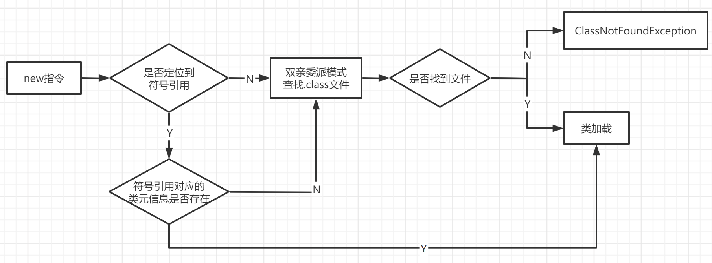
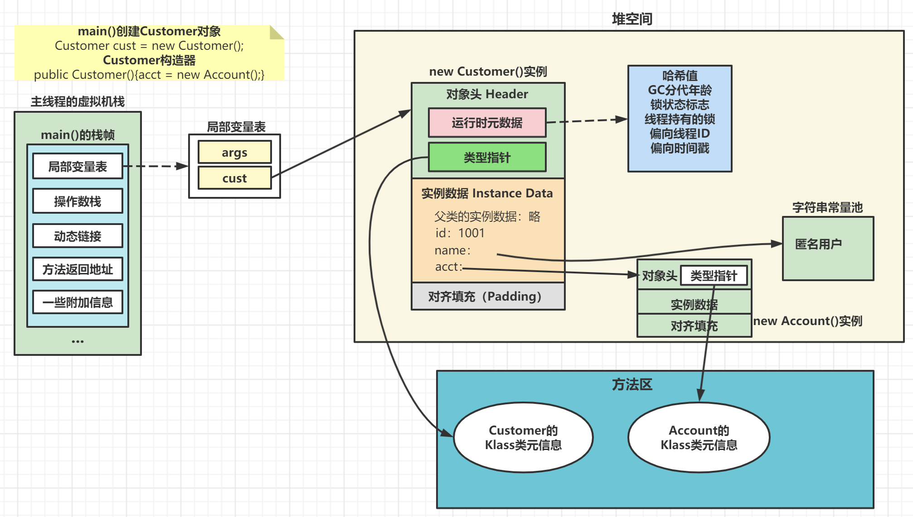

# 实例化

## 加载类元信息

- 虚拟机遇到一条new指令，首先去检查该指令的参数能否在Metaspace的常量池中定位到一个类的符号引用，并且检查该符号引用代表的类是否以及被加载、解析、初始化。（即判断类元信息是否存在）。如果没有，那么在双亲委派模式下，使用当前类加载器以 ClassLoader+全限定名 为Key进行查找对应的.class文件。如果没有找到文件，则抛出ClassNotFoundException，如果找到，则进行类加载，并生成对应的类对象。

 

## 为对象分配内存

1. 计算对象占用空间大小，在堆中划分一块内存给新对象。如果实例成员是引用变量，仅分配引用变量空间（4B）即可。
2. 如果内存规整：JVM采用指针碰撞法（Bump The Pointer）为对象分配内存。
   - 指针碰撞：所有用过的内存和空闲的内存区分，使用一个指针作为分界点的指示器。分配内存时，将指针向空闲内存区移动一段与对象大小相等的距离。
   - 如果GC选择Serial、ParNew等基于标记压缩算法，虚拟机采用该方法。一般使用带有compact（整理）过程的垃圾收集器时，使用指针碰撞。
3. 如果内存不是规整的（已使用的内存和未使用的内存相互交错）：JVM采用空闲列表（Free Table）为对象分配内存。
   - 空闲列表：虚拟机维护了一个列表，记录哪些内存块是可用的，在分配时从列表中找到一块足够大的空间划分给对象实例，并更新列表上的内容。

## 处理并发安全问题

## 零值初始化

## 设置对象头信息

- 设置对象头：将对象的所属类（类的元数据信息）、对象的HashCode、对象的GC信息、锁信息等数据存储在对象的对象头中。该过程的具体设置取决于JVM实现。

## init方法初始化

- init方法：初始化成员变量、执行实例化代码块、调用类的构造方法，并把堆内对象的首地址赋值给引用变量。
- 一般（由字节码中是否跟随有invokespacial指令决定），new指令之后就是执行init方法，此时，一个真正可用的对象才被完全创建。

  

# 对象的内存布局

   

  

# 对象的访问定位

  

  

  

- 句柄访问：reference中存储稳定句柄地址，对象被移动时只改变句柄中实例数据指针即可，reference本身不变。

