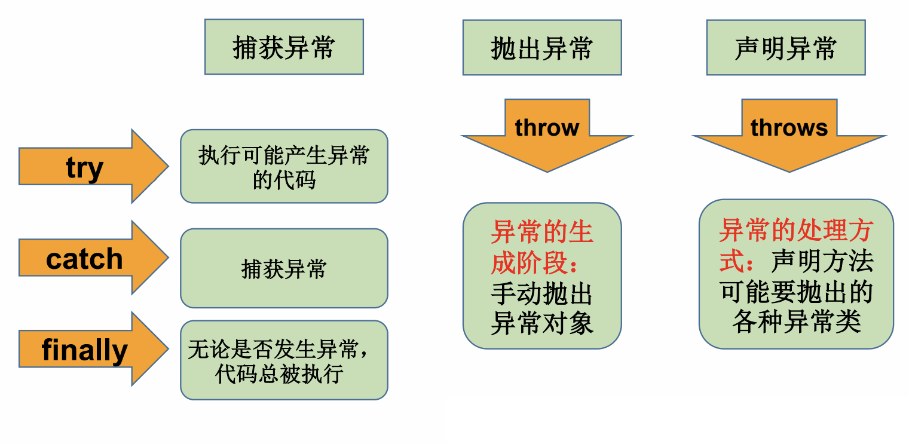
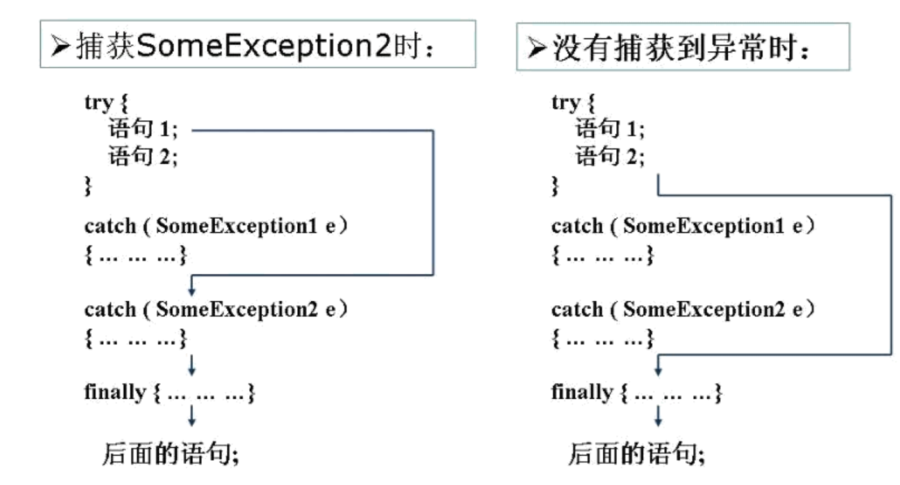

# Java异常概述

- 异常又称为例外（Exception），是一个在程序执行期间发生的事件，中断正在执行程序的正常指令流。

## 异常分类

- 异常产生主要有如下三种原因：

1. Java 内部错误发生异常，Java 虚拟机产生的异常。
2. 编写的程序代码中的错误所产生的异常，例如空指针异常、数组越界异常等。
3. 通过 throw 语句手动生成的异常，一般用来告知该方法的调用者一些必要信息。

- Java程序在执行过程中所发生的异常事件可分为两 Error：定义了在通常环境下不希望被程序捕获的异常。Java虚拟机无法解决的严重问题。Error 错误是任何处理技术都无法恢复的情况，肯定会导致程序非正常终止。并且 Error 错误属于未检查类型，大多数发生在运行时。如：JVM系统内部错误、资源耗尽等严重情况。比如：栈溢出: java.lang.StackOverflowError和堆溢出: java.lang.OutOfMemoryError。
2. Exception: 其它因编程错误或偶然的外在因素导致的一般性问题，可以使用针对性的代码进行处理。Exception 又分为可检查（checked）异常和不检查（unchecked）异常。
  - 可检查异常在源码里必须显示的进行捕获处理，这里是编译期检查的一部分
  - 不检查异常就是所谓的运行时异常，通常是可以编码避免的逻辑错误，具体根据需要来判断是否需要捕获，并不会在编译器强制要求。

- 程序员通常只能处理Exception，而**对Error无能为力**。

## 异常体系结构


- 所有异常类型都是内置类 **java.lang.Throwable** 类的子类，即 Throwable 位于异常类层次结构的顶层。Error（错误）和 Exception（异常）都是 java.lang.Throwable 类的子类，在 Java 代码中只有继承了 Throwable 类的实例才能被 throw 或者catch。

| Exception                                          | 说明                                                         |
| -------------------------------------------------- | ------------------------------------------------------------ |
| 运行时异常<br />（不检查异常 Unchecked Exception） | 编译器不要求强制处置的异常。一般是指编程时的逻辑错误，是程序员应该积极避免其出现的异常。对于这类异常，可以不作处理，因为这类异常很普遍，若全处理可能会对程序的可读性和运行效率产生影响。<br />java.lang.RuntimeException类及它的子类都是运行时异常。 |
| 编译时异常<br />（检查异常 Checked Exception）     | 编译器要求必须处置的异常。即程序在运行时由于外界因素造成的一般性异常。编译器要求Java程序必须捕获或声明所有编译时异常。如果程序不处理，可能会带来意想不到的结果。<br />java.io.IOExeption、java.lang.ClassNotFoundException、java.lang.InterruptedException、java.io.FileNotFoundException、java.sql.SQLException... |

## 常见异常

1. 运行时异常（RuntimeException）：

 

2. 编译时异常：

 

3. 错误（Error）：

- NoClassDefFoundError：找不到 class 定义异常
- StackOverflowError：深递归导致栈被耗尽而抛出的异常
- OutOfMemoryError：内存溢出异常

## Java异常处理机制

> Java采用的异常处理机制是将异常处理的程序代码集中在一起，与正常的程序代码分开。

### 异常处理的抓抛模型

- Java通过面向对象的方法来处理异常。在一个方法的运行过程中，如果发生了异常，则这个方法会产生代表该异常的一个对象，并把它交给运行时的系统，运行时系统寻找相应的代码来处理这一异常。
- 拋出异常：生成异常对象并把它提交给运行时系统的过程。程序在正常执行的过程中，一旦出现异常，就会在异常代码处生成一个对应异常类的对象，并将此对象抛出。一旦抛出异常对象，其他的代码就不执行。
- 捕获异常：运行时系统在方法的调用栈中查找，直到找到能够处理该类型异常的对象。如果一个方法内抛出异常，该异常对象会被抛给调用者方法中处理。如果异常没有在调用者方法中处理，它继续被抛给这个调用方法的上层方法，这个过程将一直继续下去，直到异常被处理。如果一个异常回到main()方法，并且main()也不处理，则程序运行终止。

 

### 异常对象的生成

- 虚拟机自动生成：程序运行过程中，虚拟机检测到程序发生了问题，如果在当前代码中没有找到相应的处理程序，就会在后台自动创建一个对应的异常对象并抛出。

- 手动创建：Exception exception。

# try-catch-finally  

```java
try{
    //可能出现异常的代码
}catch(异常类型1 变量名1){
    //处理异常的方式1
}catch(异常类型2 变量名2){
    //处理异常的方式2
}finally{
    //一定会执行的代码
}
```

- catch 块和 finally 块都是可选的，但 catch 块和 finally 块至少出现其中之一，也可以同时出现。多个 catch 块必须位于 try 块之后，finally 块必须位于所有的 catch 块之后。 

1. try将可能出现异常的代码块包装起来，一旦出现异常，就会生成一个对应异常类的对象，根据此对象的类型去catch中进行匹配。
2. 当try中的异常对象匹配到某一个catch时，就进入catch中进行异常处理。一旦处理完成，就跳出当前的try-catch结构（在没有finally的情况下），继续执行try-catch-finally 代码块之后的代码（跳出try包围的代码块，执行之外的代码）。
3. 如果 try 代码块中拋出的异常没有被任何 catch 子句捕捉到、或所有匹配的catch处理完成，那么将执行 finally 代码块中的语句，并把该异常传递给该方法的调用者。**finally不管有没有捕获异常都会执行。**

- catch中的异常类型如果满足子父类关系，则要求子类一定声明在父类的上面，否则报错。catch中的异常类型如果没有子父类关系，则谁先声明无所谓。
- try结构中声明定义的对象在出了try结构后，不能被调用（超过作用域），可以在try结构外面先对改变量进行声明初始化 。
- try-catch-finally结构可以相互嵌套。

| 异常对象处理方式  | 说明                                                 |
| ----------------- | ---------------------------------------------------- |
| getMessage()      | 获取异常信息，返回字符串。                           |
| printStackTrace() | 打印异常类名和异常信息，以及异常出现在程序中的位置。 |

```java
String str = "abc";
int num = 0;

try {
    //抛出异常,一旦处理完成，就跳出当前的try-catch结构，没有执行下面的语句。
    num = Integer.parseInt(str); //异常：NumberFormatException

    System.out.println("1");
    //异常类型如果满足子父类关系，则要求子类一定声明在父类的上面
} catch (NumberFormatException e) {
    System.out.println(e.getMessage());
    e.printStackTrace();
} catch (NullPointerException e) {
    System.out.println("出现空指针异常");
} catch (Exception e) {
    System.out.println("出现异常");
}
```

## finally

- finally代码块（可选的）为异常处理提供一个统一的出口，使得在控制流转到程序的其它部分前，能够对程序的状态作统一的管理。通常在finally代码块中编写资源释放语句。
- finally中的代码一定会被执行。即使catch中又出现异常了、try/catch中有return语句等情况也执行。

> 除非在 try 块、catch 块中调用了退出虚拟机的方法`System.exit(int status)`，否则不管在 try 块或者 catch 块中执行怎样的代码，出现怎样的情况，异常处理的 finally 块总会执行。

   

```java
File file;
FileInputStream fis;

try {
    file = new File("hello.txt");
    fis = new FileInputStream(file);

    int data = fis.read();
    while (data != -1) {
        System.out.println((char) data);
        data = fis.read();
    }
} catch (FileNotFoundException e) {
    e.printStackTrace();
} catch (IOException e) {
    e.printStackTrace();
}finally{
    try{
        //资源释放
        fis.close();
    }catch (IOException e) {
        e.printStackTrace();
    }
}
```

## 带资源的 try 语句

- 自动资源管理（Automatic Resource Management）（带资源的 try 语句）：Java7之后，当 try 代码块结束时，自动释放资源，不再需要显式的调用 close() 方法。

```java
try (声明或初始化资源语句) {
    // 可能会生成异常语句
} catch(Throwable e1){
    // 处理异常e1
} catch(Throwable e2){
    // 处理异常e1
} catch(Throwable eN){
    // 处理异常eN
}
```

- try 语句中声明的资源被隐式声明为 final，资源的作用局限于带资源的 try 语句。可以在一条 try 语句中声明或初始化多个资源，每个资源以分号隔开即可。需要关闭的资源必须实现了AutoCloseable或Closeable接口。
- 带资源的try语句相当于自带finally代码块，因此可以不使用catch。

> Closeable 是 AutoCloseable 的子接口，Closeable 接口里的 close() 方法声明抛出了 IOException，因此它的实现类在实现 close() 方法时只能声明抛出 IOException 或其子类；AutoCloseable 接口里的 close() 方法声明抛出了 Exception，因此它的实现类在实现 close() 方法时可以声明抛出任何异常。
>
> Java 7 几乎把所有的“资源类”（包括文件 IO 的各种类、JDBC 编程的 Connection 和 Statement 等接口）进行了改写，改写后的资源类都实现了 AutoCloseable 或 Closeable 接口。

```java
try (
    BufferedReader br = new BufferedReader(new FileReader("AutoCloseTest.java"));
    PrintStream ps = new PrintStream(new FileOutputStream("a.txt"))
) {
    System.out.println(br.readLine());
    ps.println("C语言中文网");
}//带资源的try语句相当于自带finally代码块。
```

- Java 9 不要求在 try 后的圆括号内声明并创建资源，只需要自动关闭的资源有 final 修饰或者是有效的 final (effectively final)，允许将资源变量放在 try 后的圆括号内。

```java
//有final修饰的资源
final BufferedReader br = new BufferedReader(new FileReader("AutoCloseTest.java"));
// 没有显式使用final修饰，但只要不对该变量重新赋值，该变量就是有效的
PrintStream ps = new PrintStream(new FileOutputStream("a. txt"));
try (br; ps) { // 只要将两个资源放在try后的圆括号内即可
    System.out.println(br.readLine());
    ps.println("C语言中文网");
}
```

## catch多异常捕获

> Java 7之后：catch可以多异常捕获。

- 捕获多种类型的异常时，多种异常类型之间用竖线`|`隔开，捕获的异常变量有隐式的 final 修饰，不能对异常变量重新赋值。（捕获一种类型的异常时，异常变量没有final修饰）

```java
try {
    int a = Integer.parseInt(args[0]);
    int b = Integer.parseInt(args[1]);
    int c = a / b;
    System.out.println("您输入的两个数相除的结果是：" + c);
} catch (IndexOutOfBoundsException | NumberFormatException | ArithmeticException e) {
    System.out.println("程序发生了数组越界、数字格式异常、算术异常之一");
    
    e = new ArithmeticException("test"); //错误 捕获多异常时，异常变量默认有final修饰
} catch (Exception e) {
    System.out.println("未知异常");

    e = new RuntimeException("test"); //正确 捕获一种类型的异常时，异常变量没有final修饰
}
```

# throws 声明抛出异常

- `throws 异常类型`（声明抛出异常）写在方法的声明处，声明一个方法可能抛出的所有异常信息，表示出现异常的一种可能性，但并不一定会发生这些异常。当方法体执行出现异常时，仍然会在异常代码处生成一个异常类的对象，若符合throws声明异常类型，则抛出，异常代码后续的代码就不再执行。
- throws并没有处理异常，而是将异常交给上一级的调用者处理。

   

```java
//满足throws后异常类型时，就会被抛出。异常代码后续的代码就不再执行。
public static void method1() throws FileNotFoundException, IOException {}
```

- 子类重写父类的方法，throws声明抛出的异常不能大于父类抛出的异常。如果父类没有抛出异常，子类也不能抛出。

# throw 抛出异常 

- throw语句执行时，抛出一个指定的异常对象（Throwable或其子类对象）。它后面的语句将不执行，此时程序转向调用者程序，寻找与之相匹配的 catch 语句，执行相应的异常处理程序。如果没有找到相匹配的 catch 语句，则再转向上一层的调用程序。这样逐层向上，直到最外层的异常处理程序终止程序并打印出调用栈情况。

```java
public void regist(int id) throws Exception {
    if (id > 0) {
        this.id = id;
    } else {
        throw new Exception("输入数据非法");
    }
}
```

# assert 断言

- java中提供了专门的assert语句，为java程序提供了一种错误检查机制。
- 断言语句运行时，默认不执行，需要手动打开。

```shell
# 如果在-ea或-da选项后面无参数，则将对程序中除了系统类之外的所有其他类都打开/关闭断言检查。

#打开断言检查
java -ea 类/包
java -enableassertions 类/包

# 关闭断言检查
java -da 类/包
java -disableassertions 类/包
```

- 每个断言都包含了一个boolean表达式。如果程序没有错误，则运行assert语句时，该表达式的值应该为true；如果该表达式的值为false，则系统将抛出一个错误。

> 断言是发现程序错误最快最有效的方法之一，相当于程序内部处理的文档，增强了程序的可维护性。

```java
assert boolean表达式;
```

- 当系统运行时，将求出该boolean表达式的值。如果是false，说明系统处于不正确的状态，将抛出一个没有任何详细信息的AssertionError类型的错误，并且退出；如果是true，进行执行。

```java
assert boolean表达式1 : 表达式2;
```

- 表达式2可以是：boolean、char、double、float、int、long类型的值 或 引用类型对象（如：描述错误的字符串）。
- 当系统运行时，且boolean表达式1的值为false时，则系统计算出表达式2的值，然后以表达式2的值为参数调用AssertionError类的构造方法，创建一个包含详细描述信息的AssetError对象抛出并退出。

```java
public class AssertDemo {
    public static void main(String[] args) {
        AssertDemo assertDemo = new AssertDemo();
        assert (assertDemo.printX() >= 0) : "不能小于0";
    }

    public int printX() {
        Scanner scan = new Scanner(System.in);
        int x = scan.nextInt();

        return x;
    }
}
```

# 用户自定义异常类

- 自定义异常类需要继承 Exception 类或其子类，如果自定义运行时异常类需继承 RuntimeException 类或其子类
- 自定义异常类通常需要编写几个重载的构造器、提供serialVersionUID、通过throw抛出、应当可以根据名字判断异常类型。一般将自定义异常类的类名命名为XXXException，其中 XXX 用来代表该异常的作用。

- 自定义异常类一般包含两个构造方法：无参的构造方法、以字符串的形式接收一个定制的异常消息并将该消息传递给超类的构造方法。

```java
public class MyException extends Exception {
    static final long serialVersionUID = 1L; 

    public IntegerRangeException() {
        super();
    }
    public IntegerRangeException(String message) {
        super(message);
    }
}
```

| 抛出异常的常见位置 | 诱因                                                 |
| ------------------ | ---------------------------------------------------- |
| 框架内部           | 使用不合规                                           |
| 数据层             | 外部服务器故障（服务器访问超时）                     |
| 业务层             | 业务逻辑书写错误（遍历业务书写操作，导致索引异常）   |
| 表现层             | 数据收集、校验等规则（不匹配的数据类型间导致异常）   |
| 工具类             | 工具类书写不严谨不够健壮（必要释放的连接长期未释放） |

- 所有的异常均抛出到表现层进行处理。
- AOP思想进行处理异常。

| 项目异常分类                  | 说明                                                       | 处理方案                                                     |
| ----------------------------- | ---------------------------------------------------------- | ------------------------------------------------------------ |
| 业务异常（BusinessException） | 规范的用户行为产生的异常<br>不规范的用户行为操作产生的异常 | 发送对应消息传递给用户，提醒规范操作                         |
| 系统异常（SytemException）    | 项目运行过程中可预计且无法避免的异常                       | 发送固定消息给用户，安抚用户<br>发送特点消息给运维人员，提醒维护<br>记录日志 |
| 其他异常（Exception）         | 编程人员未预期到的异常                                     | 发送固定消息传递给用户，安抚用户<br>发送特定消息给编程人员，提醒维护（纳入预期范围内）<br>记录日志 |

```java
public class SystemException extends RuntimeException {
    private Integer code;

    public void setCode(Integer code) {
        this.code = code;
    }

    public Integer getCode() {
        return code;
    }

    public SystemException(Integer code, String message) {
        super(message);
        this.code = code;
    }

    public SystemException(Integer code, String message, Throwable cause) {
        super(message, cause);
        this.code = code;
    }

}
```

```java
if(id == 1){
    throw new BusinessException(Code.BUSINESS_ERR,"业务异常");
}
//将可能出现的异常进行包装，转换成自定义异常
try {
    int i = 1 / 0;
} catch (ArithmeticException e) {
    throw new SystemException(Code.SYSTEM_TIMEOUT_ERR, "服务器访问超时。。。", e);
}
```
