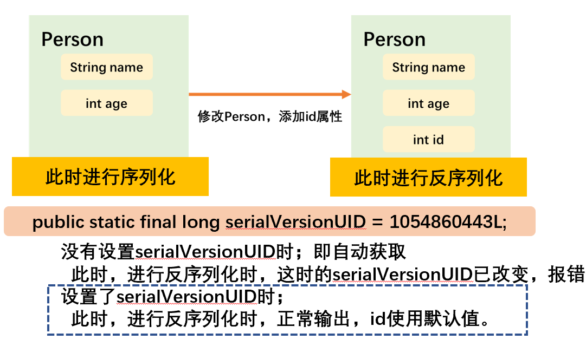

# java.io概述

- java.io：流式IO是一种顺序存取方式，流中的字节依据先进先出的规则。


> Java中输入输出的相对路径为用户工作目录起始：`System.getProperty("user.dir");`。

# (In/Out)putStream 输入/输出流


| 流类型   | 字节流                        | 字符流              |
| -------- | ----------------------------- | ------------------- |
| 读写单位 | 8位字节                       | 16位字符（Unicode） |
| 流接口   | InputStream<br />OutputStream | Reader<br />Writer  |

| 输入流          | InputStream                                                  | Reader         |
| --------------- | ------------------------------------------------------------ | -------------- |
| **读**          | **说明**                                                     | **字节改字符** |
| read()          | 返回所读的字节，若返回-1，文件结束。<br />空参：每次调用读取一个字节。<br />`byte[] b`：读取的数据存入并返回该字节数组。<br />off、len：指明读取的数据在数组中的存放位置。 | `char[] cbuf`  |
| available()     | 返回当前可读取的总字节数。                                   | -              |
| skip()          | 跳过指定字节数（n）。                                        | -              |
| **标记**        | **说明**                                                     | -              |
| mark()          | 标记当前流。<br />readlimit指定reset()方法能够重复读取的字节数（缓冲区大小）。<br />若已读取的字节数多于readlimit，则允许忽略该标记。 | -              |
| markSupported() | 判断该流是否支持标记。                                       | -              |
| reset()         | 若当前流被标记，则返回到最后一个标记位置，之后的read()操作从该位置开始。 | -              |

| 输出流  | OutputStream                                                 | Writer                          |
| ------- | ------------------------------------------------------------ | ------------------------------- |
| **写**  | **说明**                                                     | **字节改字符**                  |
| write() | `int c`：写一个字节<br />`byte[] b`：写一个字节数组。<br />off、len：写出的字节数组内数据的位置。 | `char cbuf[]`<br />`String str` |

```java
File readFile = new File("Hello.txt");
File writeFile = new File("HelloWriteFile.txt");

try (FileReader fileReader = new FileReader(readFile);
     FileWriter fileWriter = new FileWriter(writeFile)) {
    char[] cbuf = new char[5];
    int len;
    while ((len = fileReader.read(cbuf)) != -1) {
        fileWriter.write(cbuf, 0, len);
    }
} catch (IOException e) {
    throw new RuntimeException(e);
}
```

## File 文件

- File：外存文件和目录的抽象表示，用来操作文件和获得文件的信息，由文件流提供对文件数据读取的方法。

| 文件字节流                            | 文件字符流                 |
| ------------------------------------- | -------------------------- |
| FileInputStream<br />FileOutputStream | FileReader<br />FileWriter |

## Filter(In/Out)putStream 组合过滤器

- 套接流（流链）：过滤流将多个流套接在一起，利用各种流的特性共同处理数据。 在关闭外层流的同时，内层流也会自动进行关闭。

| FilterInputStream过滤器      | 说明                                                         |
| ---------------------------- | ------------------------------------------------------------ |
| PushbackInputStream          | （预览）回推缓冲区（size指定大小）。<br />unread()：回推一个字节。 |
| BufferedInputStream          | 缓冲区空时才读入一个数据块。                                 |
| **FilterOutputStream过滤器** | **说明**                                                     |
| BufferedOutputStream         | 缓冲区满、被冲刷时，写出。                                   |

##  Piped(In/Out)putStream 管道流

- 管道流：实现线程间数据的直接传输，一个管道由管道输出端（管道输出流）与管道输入端（管道输入流）连接而成。线程A可以通过它的输出管道发送数据，线程B把它的输人管道接到A的输出管道上即可接收A发送的数据。

1. 管道的连接实际上是使管道的输入流指向管道的输出流，或管道的输出流也指向管道输入流，这样从管道的输入流可以读取写入管道输出流的数据。
2. 管道流有时会使依赖于管道通信的程序造成**死锁** ： Java使用管道进行线程连接时不用考虑线程的同步问题。

| 管道         | 类                                 |
| ------------ | ---------------------------------- |
| 管道的输入流 | PipedReader<br />PipedInputStream  |
| 管道的输出流 | PipedWriter<br />PipedOutputStream |

```java
PipedInputStream pin = new PipedInputStream();
//在管道输出流创建时挂接
PipedOutputStream pout = new PipedOutputStream(pin);
```

```java
PipedInputStream pin = new PipedInputstream();
PipedOutputStream pout = new PipedOutputStrea();
//在管道输出流和输入流创建后挂接
pin.connect(out); //或者 pout.connect(in);
```

# 文本输入/输出

| System标准输入/输出重定向 | 说明           |
| ------------------------- | -------------- |
| setIn(InpuStream in)      | 重新指定输入流 |
| setOut(PrintStream out)   | 重新指定输出流 |

## PrintWriter、PrintStream

| PrintWriter文本输出                                          | 说明                                                         |
| ------------------------------------------------------------ | ------------------------------------------------------------ |
| PrintWriter(Writer w)<br />PrintWriter(Writer w, boolean autoFlush) | 指定编码向写出器写出。<br />autoFlush：是否打开自动冲刷。    |
| PrintWriter(String filename, String encoding)<br />PrintWriter(File file, String encoding) | 指定编码向文件写出。                                         |
| print()                                                      | 打印， 不抛出异常。                                          |
| println()                                                    | 打印字符串，带有行终止符。<br />若打开自动冲刷，则冲刷该流。 |
| printf()                                                     | 格式打印。                                                   |
| checkError()                                                 | 返回true，则受到污染、输出错误、格式化错误。                 |

```java
try (PrintWriter pw = new PrintWriter(System.out,true)) {
    pw.println(System.getProperty("user.dir"));
    //System.out.println()
} catch (Exception ex) {
    ex.printStackTrace();
}
```

## InputStreamReader、OutputStreamWriter 转换流

| 转换流             | 参数                              | 返回         |
| ------------------ | --------------------------------- | ------------ |
| InputStreamReader  | InputStream<br />encoding：编码集 | Reader       |
| OutputStreamWriter | Writer<br />encoding：编码集      | OutputStream |

## CharSet 编码集

| 方式                       | 返回的编码集         |
| -------------------------- | -------------------- |
| `Charset.defaultCharset()` | 当前平台的编码方式。 |
| `Standard.UTF_8`           | utf-8编码方式。      |

# 二进制输入/输出

## Data(In/Out)putStream 数据流

- 数据流：基本数据类型、String（底层存储）的串行化，读取或写出基本数据类型的变量/字符串。

> Java中的所有数据都是高位在前（MSB）的模式写出。

| 二进制流 | DataInputStream                                              | DataOutputStream                                             |
| -------- | ------------------------------------------------------------ | ------------------------------------------------------------ |
| 方法     | readInt()<br />readShort()<br />readLong()<br />readFloat()<br />readDouble()<br />readChar()<br />readBoolean()<br />readUTF() | writeChars()<br />writeByte()<br />writeInt()<br />writeShort()<br />writeLong()<br />writeFloat()<br />writeDouble()<br />writeChar()<br />writeBoolean()<br />writeUTF() |
| 说明     | 以固定的字节读取                                             | 以固定的字节写出                                             |

- 读取不同类型数据的顺序需要与保存不同类型的数据的顺序相同，否则可能报错、数据顺序出错。

```java
File file = new File(System.getProperty("user.dir") + "/test.txt");
try (DataInputStream din = new DataInputStream(new FileInputStream(file));
     DataOutputStream dout = new DataOutputStream(new FileOutputStream(file))) {
    dout.writeInt(10086);
    while (din.available() != 0) {
        System.out.println(din.readInt());
    }
} catch (Exception ex) {
}
```

## RandomAccessFile 随机访问

| RandomAccessFile          | 随机访问                                                     |
| ------------------------- | ------------------------------------------------------------ |
| 实现DataOutput、DataInput | 可以在文件的任意位置读/写数据。                              |
| 文件指针                  | 下一个将被读/写的字节所处位置。                              |
| **方法**                  | **说明**                                                     |
| RandomAccessFile()        | filename：文件。<br />"r"（只读）、"rw"（读写）<br />"rws"（每次更新，对数据和元数据的写进行同步的读/写模式）<br />"rws"（每次更新，对数据的写进行同步的读/写模式）。 |
| seek()                    | 设置文件指针距离文件开头（0）的位置（`0~n`）。               |
| getFilePointer()          | 返回文件指针当前位置。                                       |
| length()                  | 返回文件总字节长度。                                         |

## Zip(In/Out)putStream、ZipEntry

| 流                 | ZipInputStream                                               | ZipOutputStream                                              |
| ------------------ | ------------------------------------------------------------ | ------------------------------------------------------------ |
| 构造器             | ZipInputStream(InputStream in)                               | ZipOutputStream(OutputStream out)                            |
| 输入输出<br />定位 | getNextEntry()<br />返回并定位输入流到下一项的ZipEntry。     | putNextEntry(ZipEntry ze)<br />写出并定位输出流到下一项的ZipEntry。 |
| 结束当前项         | closeEntry()<br />先关闭当前打开的ZipEntry，getNextEntry()才能获取下一项 | closeEntry()<br />先关闭当前打开的ZipEntry，putNextEntry()才能设置下一项。 |

- Zip(In/Out)putStream可以在外部嵌套流，并通过定位来对Zip中的每一项操作，不需要对每个项都设置一个输入/出流。

| ZipEntry                  | 对应Zip文件的一项                                |
| ------------------------- | ------------------------------------------------ |
| ZipEntry(String filename) | 指定文件名创建。                                 |
| getCrc()                  | 返回该ZipEntry的CRC232校验和的值。               |
| getName()                 | 返回该项的名字。                                 |
| getSize()                 | 返回一项未压缩的尺寸。<br />若不可知，则返回-1。 |
| isDirectory()             | 判断是否为目录。                                 |
| setMethod(int method)     | 指定压缩方法（DEFALTED、STORED）。               |
| setSize(long size)        | 设置该项的尺寸（STORED必须）。                   |
| setSrc(long crc)          | 设置该项的CRC32校验和（CRC32类）（STORED必须）。 |

| ZipFile                                      | 压缩文件                                               |
| -------------------------------------------- | ------------------------------------------------------ |
| ZipFile(String name)<br />ZipFile(File file) | 从指定的字符串、File对象读取数据。                     |
| entries()                                    | 返回Enumeration对象，枚举该ZipFile中各个项的ZipEntry。 |
| getEntry(String name)                        | 返回指定文件名的项。<br />若该项不存在，则返回null。   |
| getInputStream(ZipEntry ze)                  | 返回用于指定项的InputStream。                          |
| getName()                                    | 返回该Zip文件的路径。                                  |

```java
try (ZipOutputStream zout = new ZipOutputStream(new FileOutputStream("test.zip"));
     DataOutputStream dout = new DataOutputStream(zout)) {
    zout.putNextEntry(new ZipEntry("t1.txt"));
    dout.writeInt(100);
    zout.closeEntry();

    zout.putNextEntry(new ZipEntry("t2.txt"));
    dout.writeBoolean(true);
    zout.closeEntry();
} catch (Exception ex) {
}

try (ZipInputStream zin = new ZipInputStream(new FileInputStream("test.zip"));
     DataInputStream din = new DataInputStream(zin)) {
    zin.getNextEntry();
    System.out.println(din.readInt());
    zin.closeEntry();

    zin.getNextEntry();
    System.out.println(din.readBoolean());
    zin.closeEntry();
} catch (Exception ex) {
}
```

## Serializable 对象序列化

- 对象序列化机制：允许把内存中的对象转换成平台无关的二进制流，持久地保存在磁盘或网络。任何实现Serializable接口的对象都可被转化为字节数据，在保存和传输时可被还原。

> 序列化是 RMI过程（Remote Method Invoke 远程方法调用）的参数和返回值都必须实现的机制，而 RMI 是 JavaEE 的基础。

| 操作     | 对象流             | 基本流           |
| -------- | ------------------ | ---------------- |
| 序列化   | ObjectOutputStream | DataInputStream  |
| 反序列化 | ObjectInputStream  | DataOutputStream |

> 对象流都实现了DataInput、DataOutput接口。

### transient 瞬态

| 关键字    | 不能序列化static、transient修饰的成员变量 |
| --------- | ----------------------------------------- |
| static    | 类成员，反序列化时会被变成默认值          |
| transient | 瞬态，不允许序列化                        |

1. 变量被transient修饰，变量将不会被序列化
2. transient关键字只能修饰变量，而不能修饰方法和类。
3. 被static关键字修饰的变量不参与序列化，一个静态static变量不管是否被transient修饰，均不能被序列化。
4. final变量值参与序列化。如果final transient同时修饰变量，final不会影响transient，一样不会参与序列化。

### 对象流 （Serializable 标识接口）

| 对象流               | ObjectInputStream                 | ObjectOutputStream                   |
| -------------------- | --------------------------------- | ------------------------------------ |
| 构造器               | ObjectInputStream(InputStream in) | ObjectOutputStream(OutputStream out) |
| 序列化<br />反序列化 | readObject()                      | writeObject(Object obj)              |

- 可序列化：如果需要让某个对象支持序列化机制（Serializable、Externalizable接口），则必须让对象所属的类及其内部的成员属性是可序列化的（若某个类实现了 Serializable 接口，该类的对象就是可序列化的），否则NotSerializableException。

```java
//实现Serializable接口
public class Person implements Serializable {
    public static final long serialVersionUID = 1054860443L;
}
```

- serialVersionUID（序列化版本标识符）：表明类的不同版本间的兼容性、代替内存地址。对序列化对象进行版本控制，有关各版本反序列化时是否兼容。如果没有显示定义serialVersionUID ，则其值是Java运行时环境根据类的内部细节自动生成的，此时若类的实例变量做了修改，serialVersionUID 可能发生变化，在反序列化时很可能出错。

- 版本一致性：运行时判断类的serialVersionUID来验证版本一致性。在进行反序列化时，JVM会把传来的字节流中的serialVersionUID与本地相应实体类的serialVersionUID进行比较，如果相同就认为是一致的，可以进行反序列化，否则就会出现序列化版本不一致的异常(InvalidCastException)。

   

```java
try(ObjectOutputStream oos = new ObjectOutputStream(new FileOutputStream("Person01.person"))){
    oos.writeObject(new Person("Jac", 20));
    oos.flush();
} catch (IOException e) {
}

try (ObjectInputStream ois = new ObjectInputStream(new FileInputStream("Person01.person")){
    Person p1 = (Person) ois.readObject();
} catch (IOException e) {
} catch (ClassNotFoundException e) {
}
```

#### 序列化的方法签名

- 方法签名：可序列化的类（实现Serializable接口）中定义如下的方法后，数据域就不会被自动序列化，而是调用如下方法。

```java
private void readObject(ObjectInputStream in) throws IOException,ClassNotFoundException;
private void writeObject(ObjectOutputStream out) throws IOException,ClassNotFoundException;
```

| 方法                 | 说明                                                         |
| -------------------- | ------------------------------------------------------------ |
| defaultWriteObject() | 获取对象描述符、String域label。<br />属于ObjectWriteOutputStream，只能在可序列化的writeObject()中调用。 |
| defaultReadObject()  | 获取对象描述符、String域label。<br />属于ObjectReadOutputStream，只能在可序列化的readObject()中调用。 |

```java
public class Ingredient implements Serializable {
    
    private final long serialVersionUID = 10086;

    private void readObject(ObjectInputStream in) throws IOException,ClassNotFoundException{
        in.defaultReadObject();
        System.out.println("readObject");
    }

    private void writeObject(ObjectOutputStream out) throws IOException,ClassNotFoundException{
        out.defaultWriteObject();
        System.out.println("outObject");
    }
    
}
```

#### 序列化单例（深拷贝）readResolve()

- 即使构造器是私有的，序列化机制也能创建新的对象（这对单例模式不合适）。将对象序列化到输出流之后，读回的新对象就是对现有对象的一次深拷贝（使用enum结构则无需担心这点）。
- readResolve()：对象被序列化后调用，返回一个对象，该对象之后会成为readObject()的返回值。（避免产生新的对象影响单例模式的类）

```java
//该类实现了Serializable
protected Object readResolve() throws ObjectStreamException {
    if (value == 1) return Type.SAUCE;
    throw new ObjectStreamException(){};
}
```

### Externalizable 保存和恢复对象数据

- 实现Externalizable接口，接口方法对包括超类数据在内的整个对象的存储和恢复负全责。对象重建时，使用公共无参构造器创建实例，然后调用readExternal()方法，从ObjectInputStream读取数据来还原对象。

> 当一个类同时实现Serializable和Externalizable时，只能通过Externalizable的方法来完成对对象数据的操作，而不会自动调用readObject()和writeObject()。

| 机制           | 方法                                | 说明                               |
| -------------- | ----------------------------------- | ---------------------------------- |
| Serializable   | readObject()<br />writeObject()     | 私有，只能被序列化机制调用。       |
| Externalizable | readExternal()<br />writeExternal() | 公有，潜在允许修改现有对象的状态。 |

```java
public class Ingredient implements Externalizable{

    @Override
    public void writeExternal(ObjectOutput out) throws IOException {
        out.writeUTF(id);
        out.writeUTF(name);
        out.writeObject(type);
    }

    @Override
    public void readExternal(ObjectInput in) throws IOException, ClassNotFoundException {
        id = in.readUTF();
        name = in.readUTF();
        type = (Ingredient.Type)in.readObject();
    }
    
    public Ingredient(){};
}
```

### 对象序列化文件

