# JVM概述

 

| 指令集架构 | 架构模型说明                                                 |
| ---------- | ------------------------------------------------------------ |
| 基于栈     | 1. 设计、实现更简单：适用资源受限的系统。<br/>2. 跨平台性：不需要硬件支持，可移植性好。<br/>3. 指令集小：零地址指令方式分配：大部分指令是零地址指令，执行过程依赖于操作栈。 |
| 基于寄存器 | 1. 性能优秀，执行高效。<br/>2. 完全依赖硬件，可移植性差。<br/>3. 操作需要的指令少：通常以一地址指令、二地址指令、三地址指令为主。 |

| 生命周期 | 虚拟机阶段说明                                               |
| -------- | ------------------------------------------------------------ |
| 启动     | 引导类加载器（Bootstrap calss loader）创建（由虚拟机具体实现指定的）初始类（initial class）。 |
| 执行     | 执行Java程序：执行的是Java虚拟机的进程。                     |
| 退出     | 1.程序正常执行结束。<br />2.程序在执行过程中异常、错误。<br />3.操作系统出错。<br />4.线程调用Runtime类、System类：exit()、halt()；且Java安全管理器也允许本次调用。<br />5.JNI加载、卸载JVM。 |

## JVM类型

| JVM                       | 说明                                                         |
| ------------------------- | ------------------------------------------------------------ |
| Classic VM                | 只提供解释器：如果使用JIT编译器，需要进行外挂。<br />解释器和编译器不能配合工作。 |
| Exact VM                  | Exact Memory Management（准确式内存管理）：虚拟机明确内存中某个位置的数据的具体类型。<br />热点探测。 <br />编译器和解释器混合工作模式。 |
| HotSpot VM                | 热点代码探测：通过计数器找到最具编译价值的代码，触发即时编译或栈上替换。通过编译器与解释器协同工作，在最优化的程序响应时间与最佳执行性能中取得平衡。 |
| JRockit                   | 专注于服务器端应用：内部不包含解释器实现，全部代码依赖JIT编译运行。最快的JVM之一。<br />MissionControl服务套件：监控、管理、分析生产环境中的应用程序。<br />JRockit Real Time：提供以毫秒或微秒级的JVM响应时间。 |
| J9                        |                                                              |
| KVM<br />CDC/CLDC Hotspot | Java ME的VM：CDC/CLDC Hotspot Implementation VM。<br />KVM：CLDC-HI早期产品。<br />KVM：简单、轻量、高度可移植。 |
| Azul VM                   | Azul VM、BEA Liquid VM：与特定硬件平台绑定、软硬件配合的专有虚拟机。<br />Azul VM：每个Azul VM实例可以管理至少数十个CPU和数百GB内存的硬件资源，并提供在巨大内存范围内实现可控的GC时间的垃圾收集器、专有硬件优化的线程调度等特性。 |
| Liquid VM                 | Liquid VM（JRockit VE）：不需要操作系统的支持，或其本身实现了一个专用的操作系统。 <br />Liquid VM随JRockit VM的停止而停止。 |
| Apache Harmony            |                                                              |
| Microsoft JVM             |                                                              |
| TaobaoJVM                 | 基于OpenJDK的优化、深度定制且开源的高性能服务器版JVM。 <br />GCIH（GC invisible heap）：off-heap，将生命周期较长的Java对象移到heao之外，并且GC不能管理GCIH内部的Java对象，降低GC的回收频率、提高GC的回收效率。 <br />GCIH中的对象可以在多个JVM进程中实现共享。 <br />crc32指令实现JVM intrinsic，降低JNI的调用开销。 <br />严重依赖Intel的CPU。 |
| Dalvik VM                 | 应用于Android系统的虚拟机，不是JVM：不遵循JVM规范。 <br />基于寄存器架构。 <br />不能直接执行Class文件，执行编译后的dex文件，执行效率高。 <br />dex文件：通过Class文件转化而来，使用Java语法。<br /> Android5.0 使用 提前编译（AOT）的ART VM替换Dalvik VM。 |
| Graal VM                  | 跨语言全栈虚拟机。                                           |

# 内存

## 类加载子系统 Class Loader Subsystem

- Class Loader Subsystem：负责从文件系统、网络中加载class文件。

> 方法区存放加载的类信息、运行时常量池信息等。

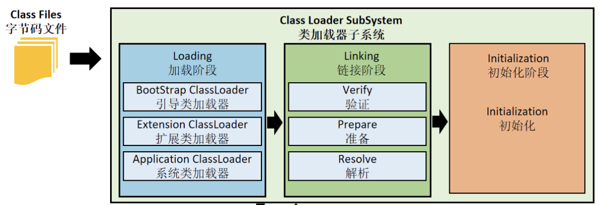  

## 运行时数据区 Runtime Data Areas

### 概述

#### 内部结构

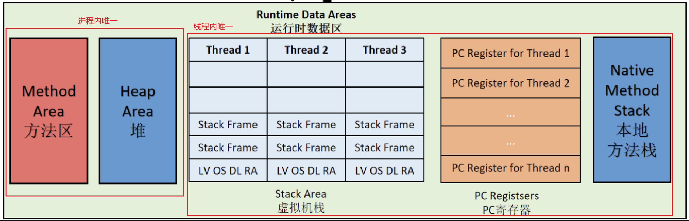  

- JVM内存布局规定了Java在运行过程中内存申请、分配、管理的策略，不同的JVM对于内存的划分方式和管理机制存在部分差异。

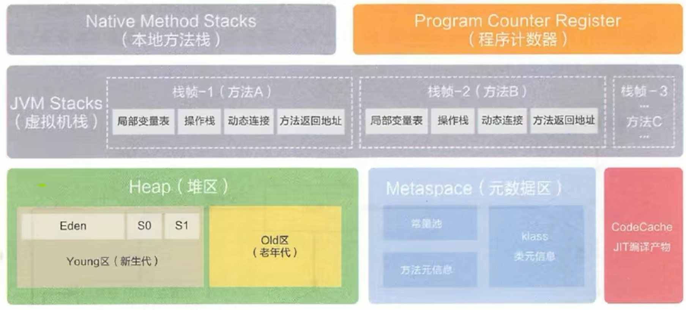 

- JVM定义了若干程序运行期间会使用到的运行时数据区：一些是随着JVM启动而创建、随JVM退出而销毁；一些与线程一一对应，随着线程的开始和结束而创建和销毁。
- 每个线程独立地拥有程序计数器、栈、本地栈，线程间共享堆、堆外内存（元空间、代码缓存）。

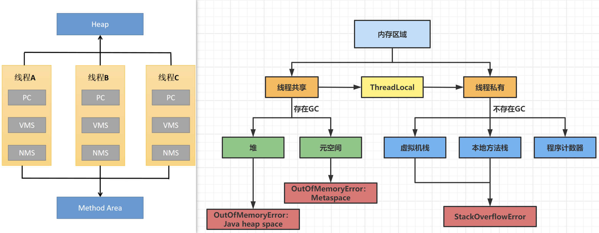   

#### 线程

- Hotspot VM：每个线程都与操作系统的本地线程直接映射。
- 操作系统负责所有线程的安排调度到任何一个可用的CPU上，一旦本地线程初始化完成，就调用Java线程中的run()。

| 后台系统线程 | 说明                                                                     |
| ------ | ---------------------------------------------------------------------- |
| 虚拟机线程  | JVM到达安全点时才出现，堆才不会变化。<br />执行类型："stop-the-world"的垃圾收集、线程栈收集、线程挂起、偏向锁撤销。 |
| 周期任务线程 | 时间周期事件的体现。<br />一般用于周期性操作的调度执行。                                        |
| GC线程   | 对JVM中不同种类的垃圾收集行为提供支持。                                                  |
| 编译线程   | 在运行时将字节码编译成到本地代码。                                                      |
| 信号调度线程 | 接收信号并发送给JVM，在JVM内部调用适当的方法进行处理。                                         |

> CPU时间片：CPU分配给各个程序的时间，每个线程被分配一个时间段。
>
> - 宏观：可用同时打开多个应用程序，每个程序并行不悖，同时运行。
> - 微观：只有一个CPU，一次只能处理程序要求的一部分，引入时间片，每个程序轮流执行。
>
> 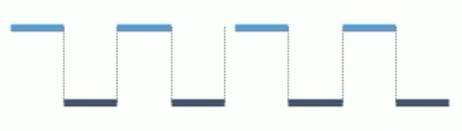  

### 程序计数器（PC寄存器）

- JVM中的PC寄存器（程序钩子）：
  - 对物理PC寄存器的一种抽象模拟。
  - 存储指向下一条指令的地址，由执行引擎读取下一条指令。
  - 一块很小的内存空间，运行速度最快的存储区域。
- JVM规范中，每个线程都具有自身的PC寄存器。PC寄存器是线程私有的，其生命周期和线程的生命周期一致。
- 任何时间一个线程都只有一个方法在执行（当前方法）：PC寄存器存储当前线程正在执行的JVM指令地址。如果执行的是native方法，则是未指定值（undefined）。
- PC寄存器是程序控制流的指示器，分支、循环、跳转、异常处理、线程恢复等基础功能需要依赖该计数器来完成。字节码解释器工作时通过改变该计数器的值来选取下一条需要执行的字节码指令。
- PC寄存器是唯一一个在JVM规范中没有规定任何OutOfMemoryError（OOM）的区域，也没有GC。

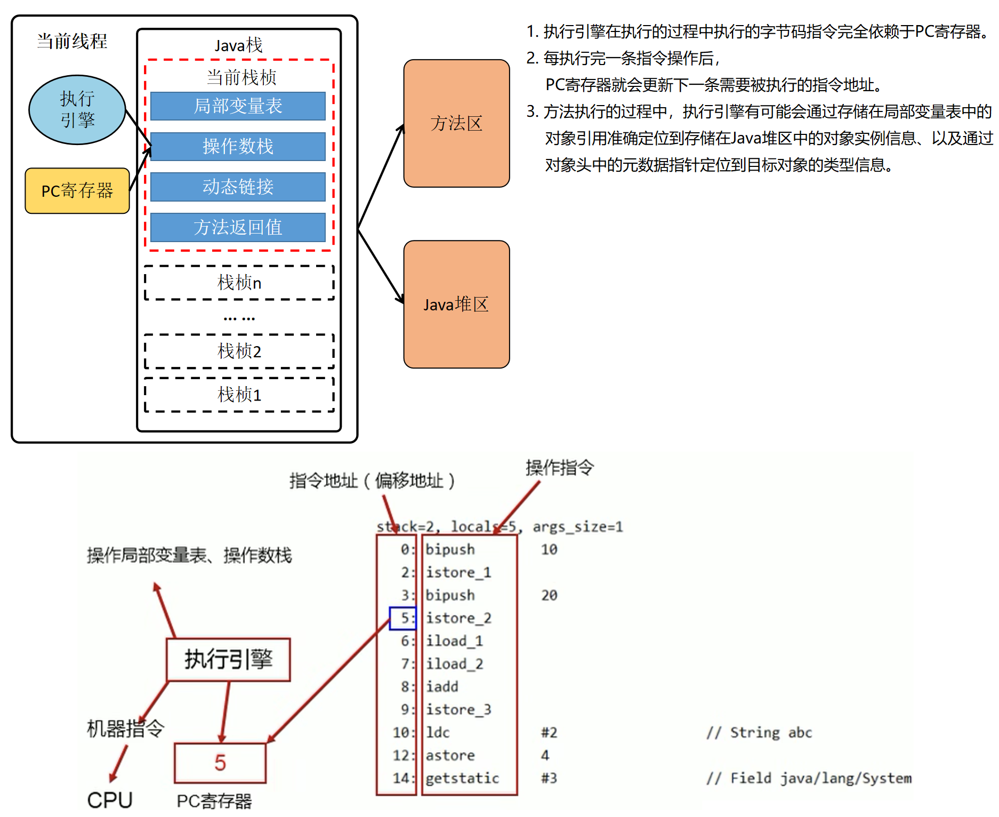    

### 虚拟机栈

- Java基于栈的指令集架构。

- 内存中的堆和栈：栈是运行时的单位，堆是存储的单位。

- Java虚拟机栈：
  
  - 每个线程在创建时都会创建一个虚拟机栈，其内部保存一个个的栈帧（Stack Frame），对应一次次的Java方法调用。
  - 线程私有的，生命周期和线程一致。
  - 栈是快速有效的分配存储方式，访问速度仅次于程序计数器。
  - 不存在GC。

- Java虚拟机栈主管Java程序的运行，保存方法的局部变量（基本数据类型、对象的引用地址）、部分结果，并参与方法的调用、返回。 

#### -Xss 栈内存大小

- 栈中可能出现的异常：JVM规范运行Java栈的大小是动态的、或固定不变的。

| 虚拟机栈 | 说明                                                         |
| -------- | ------------------------------------------------------------ |
| 固定大小 | 每一个线程的Java虚拟机栈容量可以在线程创建时独立选定。<br />如果线程请求分配的栈容量超过Java虚拟机栈允许的最大容量，JVM抛出StackOverflowError。 |
| 动态扩展 | 在尝试扩展时无法申请到足够的内存、或在创建新的线程时没有足够的内存去创建对应的虚拟机栈，则JVM抛出OOM。 |

- 栈内存大小设置：VM options-Xss。直接决定函数调用的最大可达深度。

```shell
-Xss{n}{(b)|k|m|g}
-Xss256k
```

#### 栈帧

##### 栈的存储单元、运行原理

- 每个线程都有自己的栈，栈中的数据都是以栈帧（Stack Frame）的格式存在。在这个线程上正在执行的每个方法都各自对应一个栈帧（Stack Frame）。

- 栈帧：一个内存区块、一个数据集，维系着方法执行过程中的各种数据信息。

- JVM直接对Java栈的操作：
  
  - 每个方法执行，伴随着进栈。
  - 执行结束后的出栈。

- 当前栈帧（栈顶栈帧）：在一个活动线程中，一个时间点上，只会有一个活动的栈帧。只有当前正在执行的方法的栈帧是有效的。执行引擎运行的所有字节码指令只针对当前栈帧进行操作。
  
  - 当前方法：与当前栈帧对应的方法。
  - 当前类：定义当前方法的类。

- 如果在当前方法中调用了其他方法，对应的新的栈帧会被创建并放在栈顶，作为新的当前栈帧。

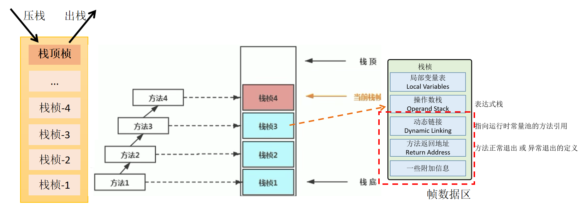   

- 不同线程中所包含的栈帧是不允许存在相互引用的：不可能在一个栈帧中引用另一个线程的栈帧。
- 如果当前方法调用了其他方法，方法返回时，当前栈帧会传回此方法的执行结果给前一个栈帧，然后JVM会丢弃当前栈帧，使得前一个栈帧重新成为当前栈帧。
- Java方法返回函数的方式（导致栈帧被弹出）：return（正常的函数返回）、抛出异常。

##### 局部变量表

- 局部变量表（局部变量数组）（本地变量表）：定义一个数字数组，主要用于存储方法参数和定义在方法体内的局部变量（基本数据类型、对象引用reference、returnAddress类型）。参数的存放总是在局部变量的index0开始，到数组长度-1的索引结束。
- 局部变量表建立在线程的栈上，是线程的私有数据，不存在数据安全问题。
- 局部变量表所需的容量大小是在编译期确定的，并保存在方法的Code属性的`maximum local variables`数据项中。在方法运行期间是不会改变局部变量表的大小的。
- 方法嵌套调用的次数由栈的大小决定：一般，栈越大，方法嵌套调用次数越多。对一个函数而言，其参数和局部变量越多，使得局部变量表膨胀，其栈帧就越大，从而满足方法调用所需的信息增大的需求；进而函数调用就会占用更多的栈空间，导致其嵌套调用次数减少。
- 局部变量表中的变量只在当前方法调用中有效：在方法执行时，虚拟机通过使用局部变量表完成参数值到参数变量列表的传递过程。当方法调用结束后，随着方法栈帧的销毁，局部变量表也随着销毁。
- 局部变量表中的变量是垃圾回收根节点：只要是被局部变量表直接/间接引用的对象都不会被回收。

###### 变量槽 Slot

- 变量槽（Slot）：局部变量表最基本的存储单元。
  - 32位以内的类型只占用1个slot：包括 returnAddress类型。
    - byte、short、char、boolean（0-false）在存储前被转换为int。
  - 64位的类型占用2个slot：long、double。
- JVM为每个局部变量表的Slot都分配一个访问索引，通过该索引即可成功访问到局部变量表中指定的局部变量值。
- 当一个实例方法被调用时，其方法参数和方法体内部定义的局部变量将会按照顺序被复制到局部变量表中的每一个Slot上。
- 如果需要访问局部变量表中一个64bit的局部变量值，只要使用前一个索引即可。
- 如果当前帧是由构造方法或实例方法创建的，那么该对象的引用（this）将会存放在index0的Slot处，其余参数按照参数表顺序继续排列。
  - 静态方法：this变量不存在于当前方法的局部变量表。
  - 没有被赋值的变量值（未使用的匿名对象）也不存在于当前方法的局部变量表。

###### Slot重复利用

- 栈帧中的局部变量表的槽位是可重用的：如果一个局部变量超过了其作用域，那么在其作用域之后声明的新局部变量很可能复用过期局部变量的槽位，从而节省资源。

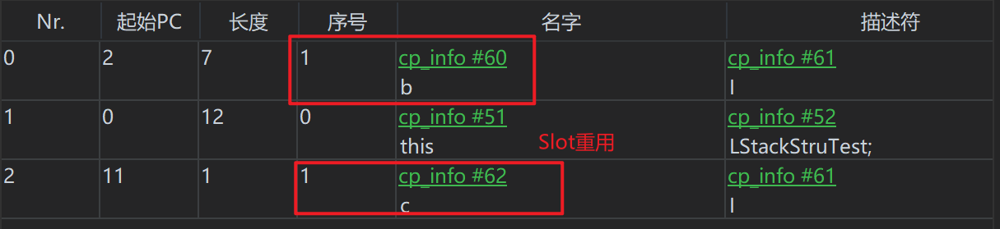  

```java
public void method3(){
    {
        int b = 1;
        System.out.println(b); //变量b被使用，占用了一个槽位
    }
    //变量b离开了其作用域，过期失效
    int c = 2; //变量c重用了变量b的槽位
}
```

##### 操作数栈

- 操作数栈（表达式栈）：在方法执行过程中，根据字节码指令往栈中写入数据或提取数据（push/pop）。
  - 某些字节码指令将值压入操作数栈，其余的字节码指令将操作数取出栈，这些字节码指令完成之后将结果压入栈。
  - 主要用来保存计算过程的中间结果，同时作为计算过程中变量临时的存储空间。
- 操作数栈是JVM执行引擎的一个工作区：当一个方法刚开始执行时，一个新的栈帧也随之被创建，此时该方法的操作数栈是空的。
- JVM的解释引擎是基于栈（操作数栈）的执行引擎。
- 每一个操作数栈都有一个明确的栈深度用于存储数值，其所需的最大深度在编译器就定义了，保存在方法的Code属性中（max\_stack）。
- 栈中的任何一个元素可以是任意的Java数据类型。
  - 32bit的类型占用1个栈单位深度。
  - 64bit的类型占用2个栈单位深度。
- 操作数栈并非采用访问索引的方式进行数据访问，只能通过标准的push、pop操作来完成一次数据访问。
- 如果被调用方法带有返回值，其返回值会被压入当前栈帧的操作数栈中，并更新PC寄存器中下一条需要执行的字节码指令。
- 操作数栈中元素的数据类型必须与字节码指令的序列严格匹配，由编译器在编译期间进行验证，同时在类加载过程中的类检验阶段的数据流分析阶段要再次验证。

```java
public void testAddOperation() {
    byte a = 15;
    int b = 8;
    int k = a + b;
}
```

```
public void testAddOperation();
  descriptor: ()V
    flags: (0x0001) ACC_PUBLIC
    Code:
      stack=2, locals=4, args_size=1
         0: bipush        15
         2: istore_1 
         3: bipush        8
         5: istore_2
         6: iload_1
         7: iload_2
         8: iadd
         9: istore_3
        10: return
```

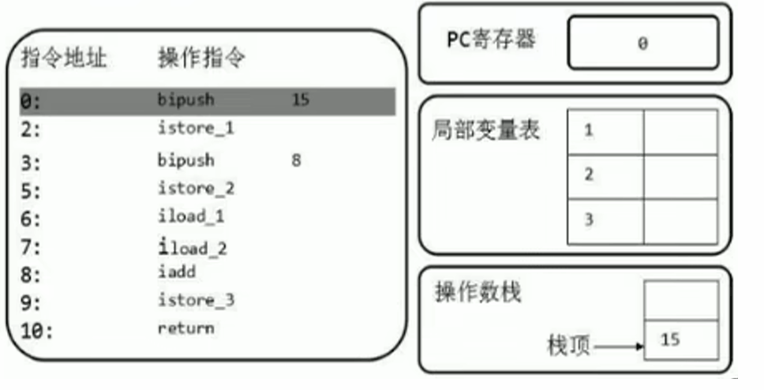  

##### 帧数据区

###### 动态链接（指向运行时常量池的方法引用）

- 动态链接（Dynamic Linking）：将符号引用转换为调用方法的直接引用。
  - 每个栈帧内部都包含一个指向运行时常量池中该栈帧所属方法的引用，为了支持当前方法的代码实现动态链接。
  - 在Java源文件被编译到字节码文件中时，所有的变量和方法引用都作为符号引用（Symbolic Reference）保存在class文件的常量池（Constant pool）中。`#1 = Methodref`

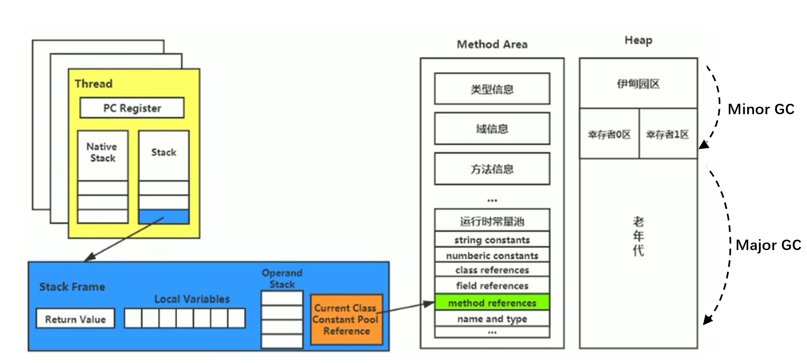  

###### 方法返回地址

- 方法返回地址：存放调用该方法的PC寄存器的值。无论方法以哪种方式退出，都返回到该方法被调用的位置。
  - 正常退出：调用者的PC计数器的值作为返回地址，即调用该方法的指令的下一条指令的地址。
  - 异常退出：返回地址通过异常表来确定，栈帧中一般不保存该部分信息。

**方法的退出**

- 方法的退出：当前栈帧出栈的过程。需要恢复上层方法的局部变量表、操作数栈、将返回值压入调用栈帧的操作数栈、设置PC寄存器的值等，让调用者方法继续执行。

- 正常完成出口：执行引擎遇到任意一个方法返回的字节码指令（return），会有返回值传递给上层的方法调用者。
  
  - 一个方法在正常调用完成之后使用哪个返回指令，根据方法返回值的实际数据类型而定。
  
  - 在字节码指令中，返回指令如下：

| 返回指令    | 类型                          |
| ------- | --------------------------- |
| ireturn | boolean、byte、char、short、int |
| lreturn | long                        |
| freturn | float                       |
| dreturn | double                      |
| areturn | 引用类型                        |
| return  | void、实例初始化方法、类和接口的初始化方法     |

- 异常完成出口：在方法执行过程中遇到异常，并且该异常没有在方法内进行处理，即 在本方法的异常表中没有搜索到匹配的异常处理器，导致方法退出。
  - 方法执行过程中抛出异常的异常处理存储在一个异常表（Exception table）。
- 正常完成出口和异常完成出口的区别：通过异常完成出口退出的不会给它的上层调用者产生任何的返回值。

###### 附加信息

#### 栈顶缓存 ToS

- 栈顶缓存（ToS）：将栈顶元素全部缓存在物理CPU的寄存器中，减少对内存的I/O次数，提升执行引擎的执行效率。

#### 方法的调用

##### 概述

###### 静态链接、动态链接

- 静态链接：当一个字节码文件被转载进JVM内部时，被调用的目标方法在编译期可知，且运行期保持不变时，将调用方法的符号引用转换为直接引用。
- 动态链接：被调用的方法在编译期无法确定下来，即只能够在程序运行期将调用方法的符号引用转换为直接引用。该引用转换过程具备动态性。

###### 方法绑定机制

- 方法绑定机制：一个字段、方法或类在符号引用被替换为直接引用的过程，仅发生一次。

| 绑定方式 | 说明                                                         |
| -------- | ------------------------------------------------------------ |
| 早期绑定 | 被调用的目标方法在编译期可知，且运行期保持不变时，可将该方法与所属的类型进行绑定。<br />如此，由于明确了被调用的目标方法，可使用静态链接的方式。 |
| 晚期绑定 | 被调用的方法在编译期无法确定下来（多态），只能够在程序运行期根据实际的类型绑定相关的方法。 |

###### 虚方法、非虚方法

| 方法类型 | 说明                                                         |
| -------- | ------------------------------------------------------------ |
| 非虚方法 | 在编译期就确定具体调用版本的方法，在运行时不可变。<br />静态方法、私有方法、final方法、实例构造器、父类方法。 |
| 虚方法   | 多态性（重写），Java中任何一个普通的方法都具备虚函数的特征（virtual）。 |

##### 方法调用指令

| 普通调用指令    | 固定虚拟机内部，方法的调用不可人为干预。                     |
| --------------- | ------------------------------------------------------------ |
| invokestatic    | 静态方法，解析阶段确定唯一方法版本<br />非虚方法             |
| invokespecial   | `<init>`、私有（private）、父类方法（super），解析阶段确定唯一方法版本<br />非虚方法 |
| invokevirtual   | 所有虚方法<br />final修饰的（非虚方法）                      |
| invokeinterface | 接口方法                                                     |

| 多态调用指令  | 动态类型语言，支持用户确定方法版本。 |
| ------------- | ------------------------------------ |
| invokedynamic | 动态解析出需要调用的方法，然后执行。 |

| 语言类型 | 类型信息判断             | 语言       |
| -------- | ------------------------ | ---------- |
| 静态语言 | 判断变量自身的类型信息。 | Java       |
| 动态语言 | 判断变量值的类型信息。   | JS、Lambda |

##### 方法重写


> java.lang.IllegalAccessError：程序试图修改一个属性或调用一个方法，该属性/方法没有权限访问。一般会引起编译器异常，如果发生在运行时，说明一个类发生了不兼容的改变。

##### 虚方法表

- 虚方法表：JVM在类的方法区建立一个虚方法表（非虚方法不出现在该表），存放各个方法的实际入口。
  - 提高性能：面向对象的编程中，频繁使用到动态分派，如果在每次动态分派的过程中都要重新在类的方法元数据中搜索合适的目标会影响执行效率。
- 虚方法表的创建：虚方法表在类加载的链接（Linking）阶段被创建并开始初始化，类的变量初始值准备完成之后，JVM把该类的方法表也初始化完成。

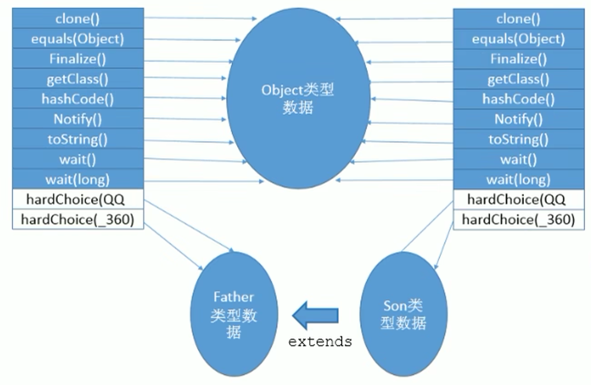  

### 本地方法栈

- Java虚拟机栈用于管理Java方法的调用，而本地方法栈用于管理本地方法（native）的调用。
- 本地方法栈：
  - 线程私有的。
  - 允许被实现成固定 或 可动态扩展的内存大小（内存溢出方面相同）。
    - StackOverflowError
    - OOM
  - 本地方法使用C语言实现。
- 在Native Method Stack中登记native方法，在Execution Engine执行时加载到本地方法库。
- 当某个线程调用一个本地方法时，它就进入了一个全新的并且不受虚拟机限制的世界，和虚拟机拥有同样的权限。
  - 本地方法可用通过本地方法接口来访问虚拟机内部的运行时数据区。
  - 可以直接使用本地处理器中的寄存器。
  - 直接从本地内存的堆中分配任意数量的内存。
- 并非所有的JVM都支持本地方 法：JVM规范并没有明确要求本地方法栈的使用语言、具体实现方式、数据结构等。如果JVM产品不打算支持native方法，可以不实现本地方法栈。
- Hotspot JVM：直接将本地方法栈和虚拟机栈合并。

### 堆 Heap

#### 堆简述

##### 核心概述

- 堆在一个进程内是唯一的，一个JVM实例只存在一个堆内存。
- Java堆区在JVM启动时即被创建，其空间大小也就确定，是JVM管理的最大一块内存空间。
  - 堆内存的大小是可以调节的。
  - 所有的线程共享Java堆。
- JVM规范：堆可以处于物理上不连续的内存空间中，但在逻辑上被视为连续的。
- 堆可以划分线程私有的缓冲区（TLAB）。
- 堆：所有的对象实例和数组都应当在运行时分配在堆上。（可能存在部分不遵守的：逃逸分析）
  - 对象和数组可能永远不会存储在栈上：栈帧中保存引用，指向对象和数组在堆中的位置。
  - 在方法结束后，堆中的对象不会马上被移除，仅在垃圾收集（GC）时才会被移除。

##### 内存结构

- Java7及之前，堆内存逻辑上分为三部分：新生区+养老区+永久区。
  - Young Generation Space 新生区 Young/New
    - Eden 伊甸园区
    - Survivor 幸存者区
  - Tenure Generation Space 养老区 Tenure/Old
  - Permanent Space 永久区 Perm

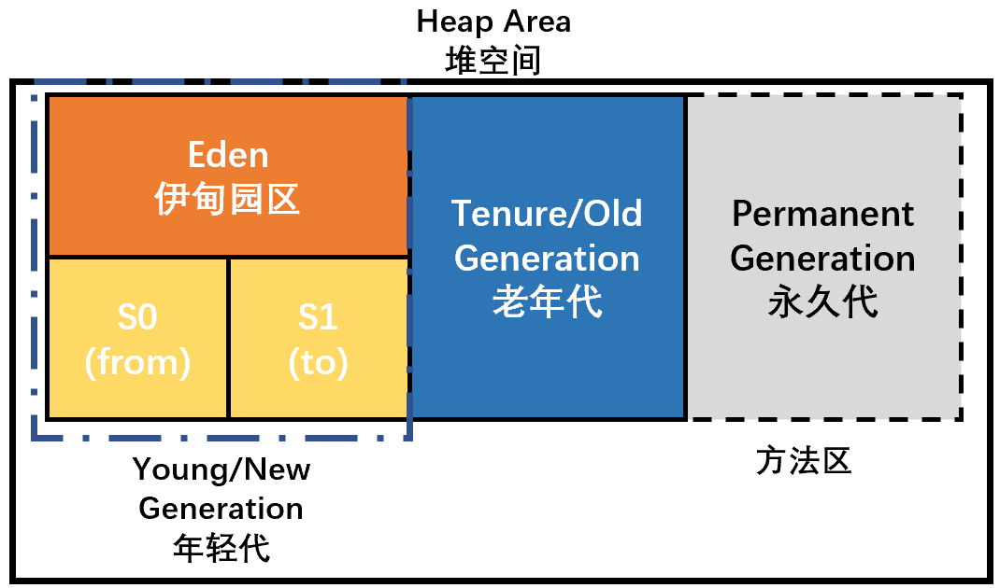  

- Java8及之后，堆内存逻辑上分为三部分：新生区+养老区+元空间。
  - Young Generation Space 新生区 Young/New
    - Eden 伊甸园区
    - Survivor 幸存者区
  - Tenure Generation Space 养老区 Tenure/Old
  - Meta Space 元空间 Meta

> 新生区 <=> 新生代 <=> 年轻代
> 
> 养老区 <=> 老年区 <=> 老年代
> 
> 永久区 <=> 永久代

##### OOM

- java.lang.OutOfMemoryError。

#### 年轻代、老年代

- 可以分为两类：
- 

| 存储在JVM中的Java对象          | 生命周期                                      |
| ------------------------------ | --------------------------------------------- |
| （年轻代）瞬时对象             | 生命周期短，该类对象的创建和消亡非常迅速。    |
| （老年代）生命周期非常长的对象 | 在某些极端情况下，能够和JVM生命周期保持一致。 |

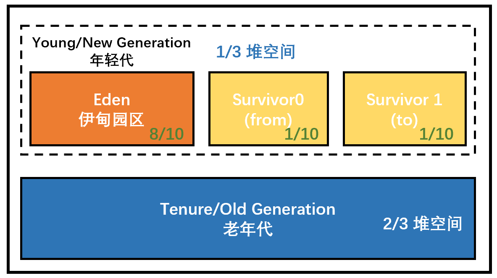  

##### NewRatio

- 配置新生代和老年代在堆结构中的占比：
  - 默认：`-XX:NewRatio=2` 表示新生代占1，老年代占2。（即：新生代占整个堆的1/3）
  - 修改：`-XX:NewRatio=4` 表示新生代占1，老年代占4。（即：新生代占整个堆的1/5）

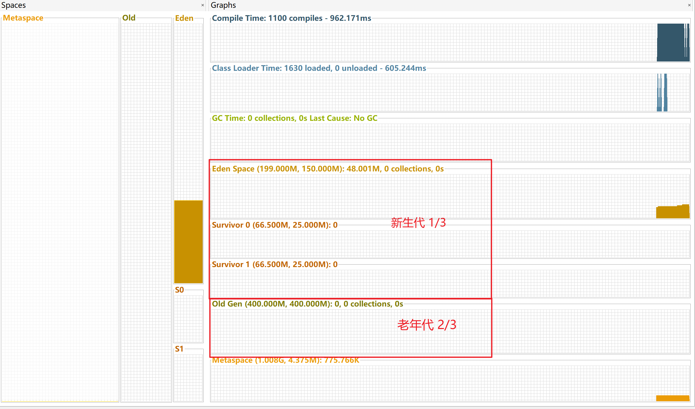  

> 查看-XX:NewRatio参数设置：
> 
> jinfo -flag NewRatio PID

##### SurvivorRatio

- Eden区和另外两个Survivor区的默认空间占比：`8:1:1`。（有时需要显式指定）

```
-XX:SurvivorRatio=8
```

> -XX:-UserAdaptiveSizePolicy 自适应的内存分配策略

- 几乎所有Java对象都是在Eden区被new出来的。
- 绝大多数的Java对象在新生代就被销毁。

```
-Xmn 设置新生代空间大小
一般不设置，优先级高于-XX:newRatio=<value> 
```

#### 分配策略

##### 对象分配

###### 一般过程

1. new的对象先存放在伊甸园区，此区有大小限制。

2. 当伊甸园区空间填满，且程序需要创建对象时，JVM的垃圾回收器将对伊甸园区和幸存者区一起进行垃圾回收（YGC/Minor GC），将伊甸园区中的不再被其他对象所引用的对象进行销毁。（幸存者区填满时不会触发垃圾回收）

3. 再加载新的对象存放到伊甸园区，然后将伊甸园区的剩余对象移到幸存者0区。

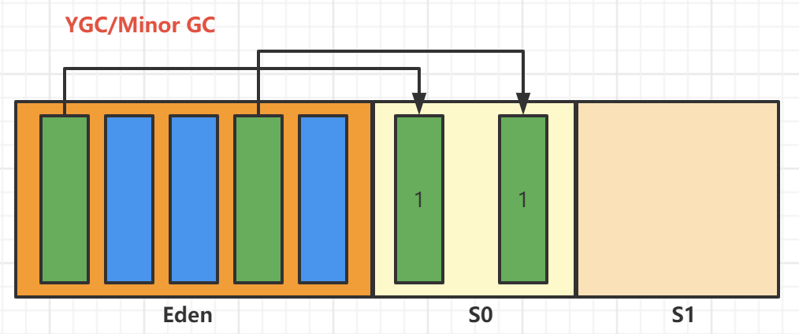  

4. 如果再次触发垃圾回收，此时上次幸存下来的已经存放在幸存者0区的，如果没有被回收，就存放到幸存者1区。

5. 如果再次经历垃圾回收，此时会重新放回到幸存者0区，以此类推。

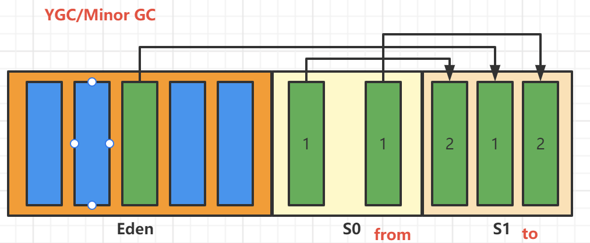  

6. 直到达到一定次数后，默认15次，存放到养老区。

```
-XX:MaxTenuringThreshold=<value>
```

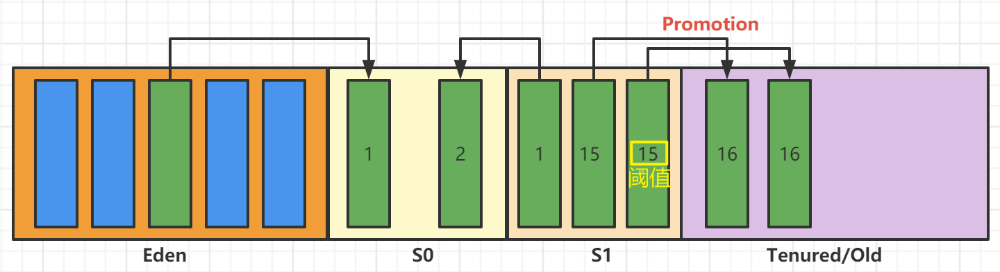  

- 对于幸存者s0、s1区：复制之后有交换，谁空谁是to。
- 垃圾回收：频繁在新生区收集，很少在养老区收集，几乎不在永久区/元空间收集。

###### 特殊情况

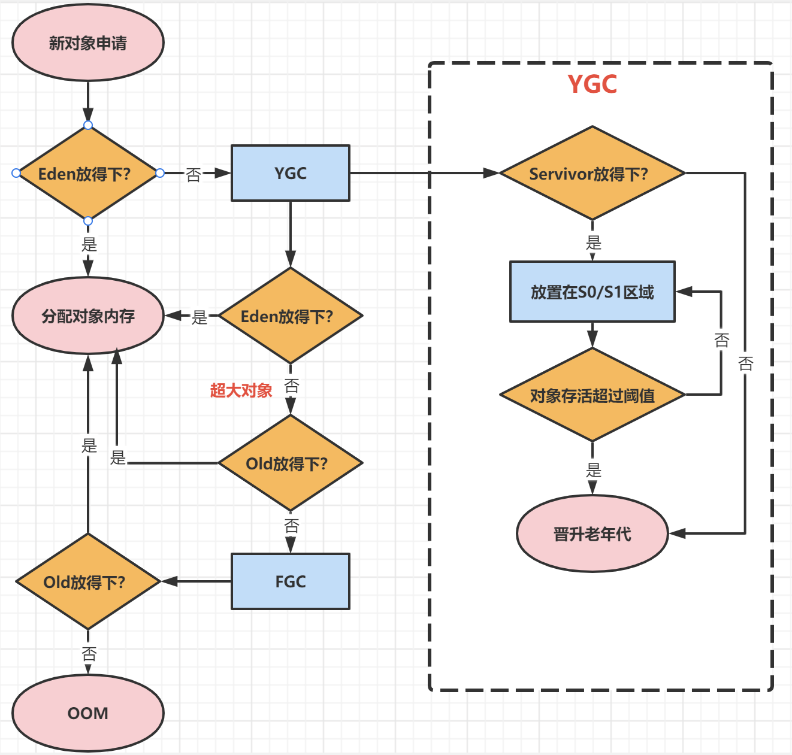  

 

##### 内存分配策略（对象提升Promotion规则）

###### 阈值设置

- 如果对象在Eden出生并经过第一次Minor GC后仍然存活，并且能被Survivor容纳，将被移到Survivor空间中，并将对象年龄设为1。对象在Survivor区中每经过一次MinorGC，年龄就增加1岁，当其年龄增加到一个阈值（一般默认15）时，就会晋升到老年代中。

```java
-XX:MaxTenuringThreshold=<value>
```

###### 对于不同年龄段的对象分配原则

- 优先分配到Eden。
- 大对象直接分配到老年代：尽量避免程序中出现过多的大对象。
- 长期存活的对象分配到老年代。
- 动态对象年龄判断：如果Survivor区中相同年龄的所有对象大小的总和大于Survivor空间的一半，年龄大于或等于该年龄的对象可以直接进入老年代，无须等待到MaxTenuringThreshold中的阈值。
- 空间分配担保：`-XX:HandlePromotionFailure`

##### TLAB 私有缓存区域

- TLAB：从内存模型（不是垃圾收集的角度）对Eden区进行划分，JVM为每个线程分配了一个私有缓存区域。
- 快速分配策略：多线程同时分配内存时，使用TLAB可以避免一系列的线程安全问题，同时提升内存分配的吞吐量。
- JVM将TLAB作为内存分配的首选。设置是否开启TLAB空间：`-XX:UseTLAB`。
- 默认情况下，TLAB空间的内存非常小，仅只有整个Eden空间的1%（不是所有的对象实例都能够在TLAB中成功分配内存）。设置TLAB空间所占用Eden空间的百分比：`-XX:TLABWasteTargetPercent`。
- 一旦对象在TLAB空间分配内存失败时，JVM就会尝试通过使用加锁机制确保数据操作的原子性，从而直接在Eden空间中分配内存。

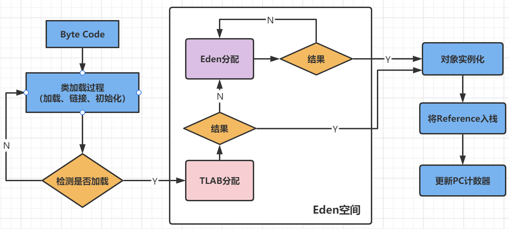 

1. 堆区是线程共享区域，任何线程都可以访问到堆区中的共享数据。
2. 由于对象实例的创建在JVM中非常频繁，因此在并发环境下，从堆区中划分内存空间是线程不安全的。
3. 为避免多个线程操作同一个地址，需要使用加锁等机制，影响分配速度。 

#### Minor GC、Major GC、FullGC

- JVM在进行GC时，并非每次都对新生代、老年代、方法区（永久代/元空间）一起回收，大部分回收都是新生代。

##### 按回收区域划分GC

- 部分收集：不是完整收集整个Java堆的垃圾收集。
  
  - 新生代收集（Minor GC / Young GC）：只收集新生代的。
  
  - 老年代收集（Major GC / Old GC）：只收集老年代的。
    
    - 目前只有CMS GC会单独收集老年代。
  
  - 混合收集（Mixed GC）：收集整个新生代以及部分老年代的垃圾收集。
    
    - 目前只有G1 GC有这种行为。

- 整堆收集（Full GC）：完整收集整个Java堆的垃圾收集。

##### 分代式GC策略的触发机制

###### 年轻代GC（Minor GC） 触发机制

- 当年轻代空间不足时，触发Minor GC：即Eden区满触发，而Survivor区满不触发。每次Minor GC会清理年轻代的内存。
- Java对象大多朝生夕死：Minor GC非常频繁，一般回收速度也较快。
- Minor GC会引发STW，暂停其他用户的线程，等垃圾回收结束，用户线程才恢复运行。

###### 老年代GC（Major GC / Full GC）触发机制

- Major GC、Full GC：对象从老年代消失。
- 在Major GC出现时，经常会伴随着至少一次的Minor GC：老年代空间不足时，先尝试触发Minor GC，如果空间还是不足，则触发Major GC。
- Major GC的速度一般会比Minor GC慢10倍以上，STW的时间更长。
- 如果Major GC后，内存仍然不足，就OOM。

###### Full GC触发机制

- 触发Full GC执行的情况：在开发中尽量避免，减少暂停时间。
1. 调用`System.gc()`，系统建议执行Full GC，但不必然执行。
2. 老年代空间不足。
3. 方法区空间不足。
4. 通过Minor GC 之后，进入老年代的平均大小大于老年代的可用内存。
5. 由Eden区、Survivor space0（From Space）区向Survivor space1（To Space）区复制时，对象大小大于To Space可用内存，则把该对象转存到老年代，且老年代的可用内存小于该对象大小。

##### 分代思想

- 不同对象的生命周期不同：70%-99%的对象是临时对象。
- 优化GC性能：GC对堆的所有区域进行扫描，而分代将新创建的对象存放到某区域，当GC时先将存储临时对象的区域进行回收。

#### 堆相关参数设置

| 参数                            | 说明                    |
| ----------------------------- | --------------------- |
| -XX:+PrintFlagsInitial        | 查看所有参数的默认初始值          |
| -XX:+PrintFlagsIFinal         | 查看所有参数的最终值            |
| -Xms                          | 初始堆空间内存（默认物理内存的1/64）  |
| -Xmx                          | 最大堆空间内存（默认物理内存的1/4）   |
| -Xmn                          | 设置新生代的大小              |
| -XX:newRatio                  | 配置新生代和老年代在堆结构中的占比     |
| -XX:SuvivorRatio              | 设置新生代中Eden和s0、s1空间的比例 |
| -XX:MaxTenuringThreshold      | 设置新生代垃圾的最大年龄          |
| -XX:+PrintGCDetails           | 输出详细的GC处理日志           |
| -XX:+PringGC<br />-verbose:gc | 输出GC简要信息              |
| -XX:HandlePromotionFailure    | 是否设置空间分配担保            |

> jps 查看进程PID
> 
> jinfo -flag 参数 PID

##### -Xms、-Xmx

| 参数   | 说明                 |
| ---- | ------------------ |
| -Xms | 堆空间（年轻代+老年代）初始内存大小 |
| -Xmx | 堆空间（年轻代+老年代）最大内存大小 |

- 建议将初始堆内存和最大堆内存设置成相同的值：避免频繁的扩容、GC。

> -X：JVM运行参数
> 
> ms：memory start

```java
Runtime.getRuntime() //获取Runtime实例：当前进程
```

> jps
> 
> jstat -gc PID
> 
> -XX:+PrintGCDetails

##### -XX:HandlePromotionFailure

###### JDK6 Update24之前有效

- 在发生Minor GC之前，JVM会检查老年代最大可用的连续空间是否大于新生代所有对象的总空间：
  - 如果大于：则此次Minor GC是安全的。
  - 如果小于：则JVM会查看-XX:HandlePromotionFailure设置值是否允许担保失败。
    - 如果-XX:HandlePromotionFailure=true，则继续检查老年代最大可用连续空间是否大于历次晋升到老年代的对象的平均大小。
      - 如果大于：则尝试进行一次Minor GC，但此次Minor GC仍然是有风险的。
      - 如果小于：则进行一次Fulll GC。
    - 如果-XX:HandlePromotionFailure=false，则改为进行一次Full GC。

###### JDK6 Update24之后该参数失效

- 只要老年代的连续空间大于新生代对象总大小 或 历次晋升的平均大小 就会进行Minor GC，否则进行Full GC。

#### 逃逸分析

##### 逃逸分析简述

> 栈上分配、标量替换优化技术、TaoBaoVM的GCIH技术实现off-heap。

- 逃逸分析：将堆上的对象分配到栈，减少Java程序中同步负载和内存堆分配压力的跨函数全局数据流分析算法。通过逃逸分析，Java Hotspot编译器能够分析出一个新的对象的引用的范围从而决定是否要将该对象分配到堆。（在方法尽量使用局部变量，减少逃逸）
- 逃逸分析的性能消耗不一定高于逃逸分析自身的消耗。
- 逃逸分析的基本行为：分析对象动态作用域。（new的实例）

| 逃逸判断 | 说明                                                         |
| -------- | ------------------------------------------------------------ |
| 没有发生 | 当一个对象在方法中被定义后，对象只在方法内部使用，则认为没有发生逃逸。<br />没有逃逸的对象可以被分配到栈上，随着方法的执行结束，栈帧被移除。 |
| 发生逃逸 | 当一个对象在方法中被定义后，其被外部方法所引用，则认为发生逃逸。<br />逃逸类型：方法返回值、给成员变量赋值、实例引用传递。 |

```java
public class EscapeAnalysis {

    public EscapeAnalysis obj;

    /*
    方法返回EscapeAnalysis对象，发生逃逸
     */
    public EscapeAnalysis getInstance() {
        return obj == null ? new EscapeAnalysis() : obj;
    }

    /*
    为成员属性赋值，发生逃逸
     */
    public void setObj() {
        this.obj = new EscapeAnalysis();
    }
    //思考：如果当前的obj引用声明为static的？仍然会发生逃逸。

    /*
    对象的作用域仅在当前方法中有效，没有发生逃逸
     */
    public void useEscapeAnalysis() {
        EscapeAnalysis e = new EscapeAnalysis();
    }

    /*
    引用成员变量的值，发生逃逸
     */
    public void useEscapeAnalysis1() {
        EscapeAnalysis e = getInstance();
        //getInstance().xxx()同样会发生逃逸
    }
}
```

##### 参数设置

| 参数                        | 说明                                   |
| ------------------------- | ------------------------------------ |
| -server                   | 启动Server模式<br />在Server模式下，才可以启用逃逸分析 |
| -XX:+DoEscapeAnalysis     | 启用逃逸分析（默认）                           |
| -XX:+EliminateAllocations | 开启标量替换（默认）                           |

- JDK 6u23之前：
  
  - `-XX:+DoEscapeAnalysis` 显式开启逃逸分析。
  - `-XX:+PrintEscaprAnalysis` 查看逃逸分析的筛选结果。

- JDK 6u23之后：HotSpot默认开启逃逸分析。

##### 代码优化

| 优化                   | 说明                                                         |
| ---------------------- | ------------------------------------------------------------ |
| 栈上分配               | 将堆分配转化为栈分配。如果一个对象在子程序中被分配，要使指向该对象的指针永远不会逃逸，则对象可能是栈分配的候选，而不是堆分配。 |
| 同步省略               | 如果一个对象被发现只能从一个线程被访问到，则对于这个对象的操作可以不考虑同步。 |
| 分离对象<br />标量替换 | 有的对象可能不需要作为一个连续的内存结构存在也可以被访问到，那么对象的部分（或全部）可以不存储在内存，而是存储在CPU寄存器中。 |

###### 栈上分配

- 栈上分配：JIT编译器在编译期间根据逃逸分析的结果，发现如果一个对象并没有逃逸出方法，则优化成栈上分配。分配完成后，继续在调用栈内执行，最后线程结束，栈空间被回收，局部变量对象也被回收，无须进行垃圾回收。

###### 同步省略（锁消除）

- 同步省略：在动态编译同步块时，JIT编译器可以借助逃逸分析来判断同步块所使用的锁对象是否只能被一个线程访问而没有被发布到其他线程。如果没有，那么JIT编译器在编译该同步块时，就会取消对这部分代码的同步。
  - 线程同步的代价相当高，降低并发性和性能。
- 在字节码文件中仍然存在同步的字节码，在运行时才被消除。

###### 标量替换

- 标量替换：在JIT阶段，如果经过逃逸分析，发现一个对象不会被外界访问，则经过JIT优化，把该对象拆解成若干个标量（其所包含的若干个成员变量）来替换，就不需要创建该对象，不需要分配堆内存，不需要进行GC。
  - 标量（Scalar）：原子性，Java中的原始数据类型。
  - 聚合量。

```shell
-XX:+EliminateAllocations # 开启标量替换（默认），允许将对象打散在栈上
```

### 方法区 Method Area

#### 简述

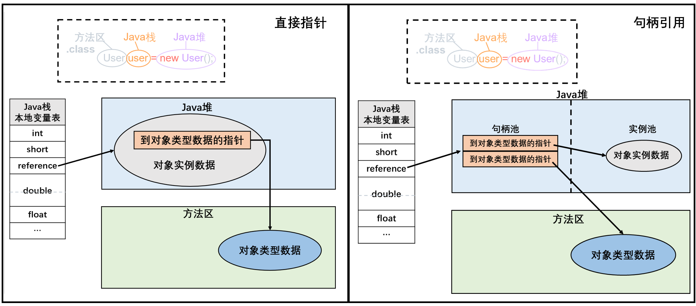  

- 方法区（Method Area）：逻辑上属于堆的一部分，但实际是独立于Java堆的内存空间，是线程共享的内存空间，关闭JVM时释放该区域的内存。
- 方法区在JVM启动时被创建，并且其实际的物理内存空间中和Java堆区一样是可以不连续的。
- 方法区的大小：固定大小 或 可扩展。方法区的大小决定了系统可以保存多少个类，如果系统定义了太多的类，导致方法区溢出，则抛出java.lang.OutOfMemoryError:PermGen space（JDK7）、java.lang.OutOfMemoryError:Metaspace（JDK8）。

> 加载大量的第三方jar包；大量动态生成反射类；Tomcat部署工程过多（30~50）。

- 元空间不在虚拟机设置的内存中，而是使用本地内存。

#### 方法区大小

##### JDK7及之前

| 参数              | 说明                                          |
| --------------- | ------------------------------------------- |
| -XX:PermSize    | 永久代初始分配空间，默认20.75M                          |
| -XX:MaxPermSize | 永久代最大可分配空间，<br />32位机器默认64M<br />64位机器默认82M |

- 当JVM加载的类信息容量超过该值：抛出OutOfMemoryError:PermGen space。

##### JDK8及之后

###### -XX:MetaspaceSize 元空间初始大小

- 默认值依赖平台，Windows：默认21M。
- 高水位线：对于一个64位的服务器端JVM，其默认的-XX:MetaspaceSize为21M，即 初始的高水位线，一旦触及该水位线，Full GC会被触发并卸载没用的类（即 对应的类加载器不再存活的类），之后重置该高水位线，新的高水位线取决于GC后释放了多少元空间，如果释放的空间过多，则适当降低该值。
- 如果初始化的高水位线设置过低，上述高水位线调整的情况会频繁发生，Full GC多次调用：应该将-XX:MetaspaceSize设置为较高的值。

###### -XX:MaxMetaspaceSize  元空间最大可分配空间

- 默认值依赖平台，Windows：默认-1（没有限制）。

- 与永久代不同：如果不指定大小，默认情况下，虚拟机会耗尽所有可用系统内存。如果元数据区发生溢出，抛出OutOfMemoryError:Metaspace。

##### OOM

- 内存泄露（Memory Leak）、内存溢出（Memory Overflow）
1. 分析确定是内存泄露还是内存溢出。
2. 如果是内存泄露：查看泄露对象到GC Roots的引用链、泄露对象的类型信息，定位泄露代码的位置。
3. 如果不存在内存泄露：检查JVM的堆参数（-Xmx、-Xms），与物理内存对比。从代码检查生命周期和过长的对象。

#### 内部结构

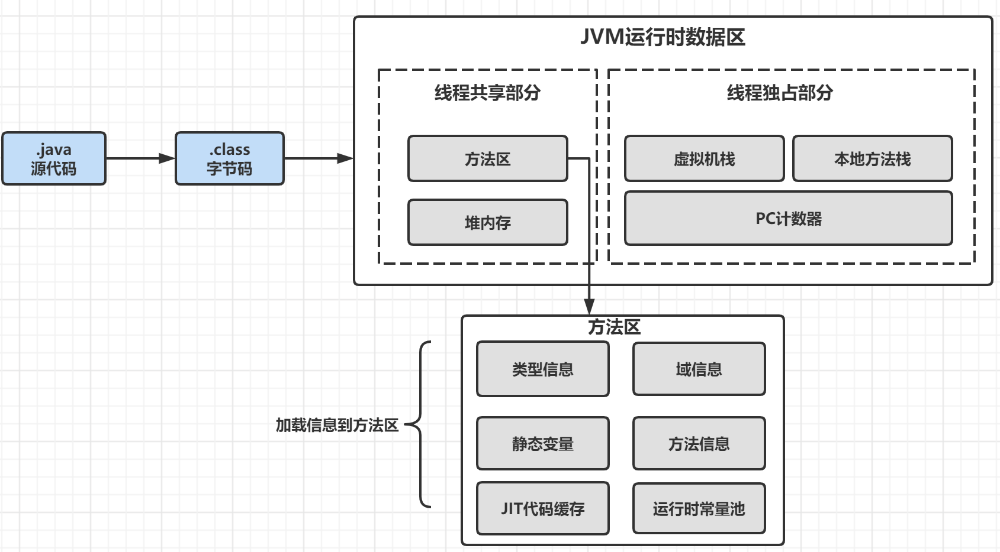  

##### 类型信息

- 类型信息：对每个加载的类型（class、interface、enum、annotation），JVM必须在方法区中存储以下类型信息
  1. 全限定名。
  2. 直接父类的全限定名（interface、java.lang.Object没有直接父类）。
  3. 修饰符：\{public、abstract、final\} 的子集。
  4. 直接接口的有序列表。
  5. 对应的类加载器（ClassLoader）。

##### 域信息

- JVM必须在方法区中保存类型的所有域的相关信息以及域的声明顺序。
- 域的相关信息包括：域名称、域类型、域修饰符（\{public、private、protected、static、final、volatile、transient\} 的子集）。

##### 方法信息

- JVM必须保存所有方法的以下信息，包括声明顺序：
  - 方法名称。
  - 方法的返回值类型、void。
  - 方法参数的数量、类型（按顺序）。
  - 方法的修饰符：\{public、private、protected、static、final、synchronized、native、abstract\} 子集。
  - 方法的字节码（bytecodes）、操作数栈、局部变量表、大小。（native、abstract的方法除外）
  - 异常表 （native、abstract的方法除外）：每个异常处理的开始位置、结束位置、代码处理在PC计数器中的偏移地址、被捕获的异常类的常量池索引。

##### 静态变量

| 静态变量              | 说明                                                         |
| --------------------- | ------------------------------------------------------------ |
| non-final的类变量     | 类变量随着类的加载而加载，是类数据的一部分，被类的所有实例共享，与类的实例无关。 |
| static final 全局常量 | 全局常量在编译时就被分配。                                   |

##### 运行时常量池

- 方法区内部：运行时常量池；字节码文件：常量池。

> **常量池**
>
> - 一个有效的字节码文件包含类的版本信息、字段、方法、接口等描述信息，以及常量池表。
> - 常量池表（Constant Pool Table）：各种字面量、对类型、域、方法的符号引用。该部分内容在类加载之后存放到方法区的运行时常量池中。
>
> 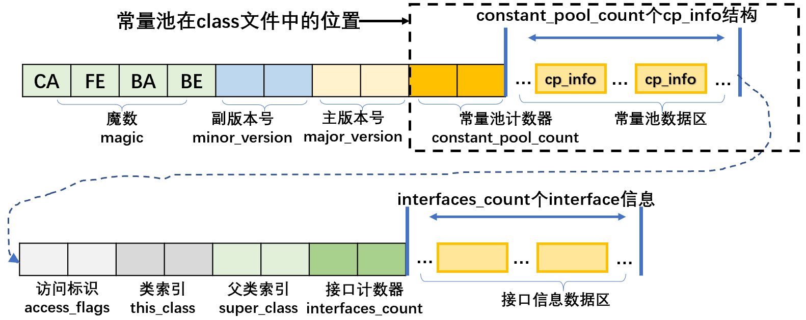  
>
> - 一个java源文件中的类、接口，编译后产生一个字节码文件。而Java中的字节码需要数据支持，通常这种数据会很大以至于不能直接存到字节码，因此存到常量池中，该字节码包含了指向常量池的引用（符号引用）。
> - 常量池内存储的数据类型：数量值、字符常量、类引用、字段引用、方法引用。

- 运行时常量池：在加载类和接口之后，就会创建对应的运行时常量池。JVM为每个已加载的类型（类、接口）都维护一个常量池，池中的数据项通过索引访问。
- 运行时常量池具备动态性：运行时常量池中包含多种不同的常量，包括编译期就明确的数值字面量、运行期解析后才能获得的方法/字段引用（不是常量池中的符号引用，而是真实地址）。
- 当创建类/接口的运行时常量池时，如果构造运行时常量池所需的内存空间超过了方法区所能提供的最大值，则JVM抛出OOM。

#### 方法区使用

  

```java
public class MethodAreaDemo {
    public static void main(String[] args) {
        int x = 500;
        int y = 100;
        int a = x / y;
        int b = 50;
        System.out.println(a + b);
    }
}
```

#### 演进

##### 细节说明

- 只有HotSpot才有永久代，原则上如何实现方法区属于虚拟机实现细节，不受《Java虚拟机规范》管束。

| Hotspot中方法区变化 | 说明                                            |
| ------------- | --------------------------------------------- |
| JDK1.6        | 有永久代，静态变量存放在永久代。                              |
| JDK1.7        | 逐步去永久代，字符串常量池、静态变量被移除，保存在堆中。                  |
| JDK1.8        | 无永久代，类型信息、字段、方法、常量保存在本地内存的元空间，但字符常量池、静态变量仍在堆。 |

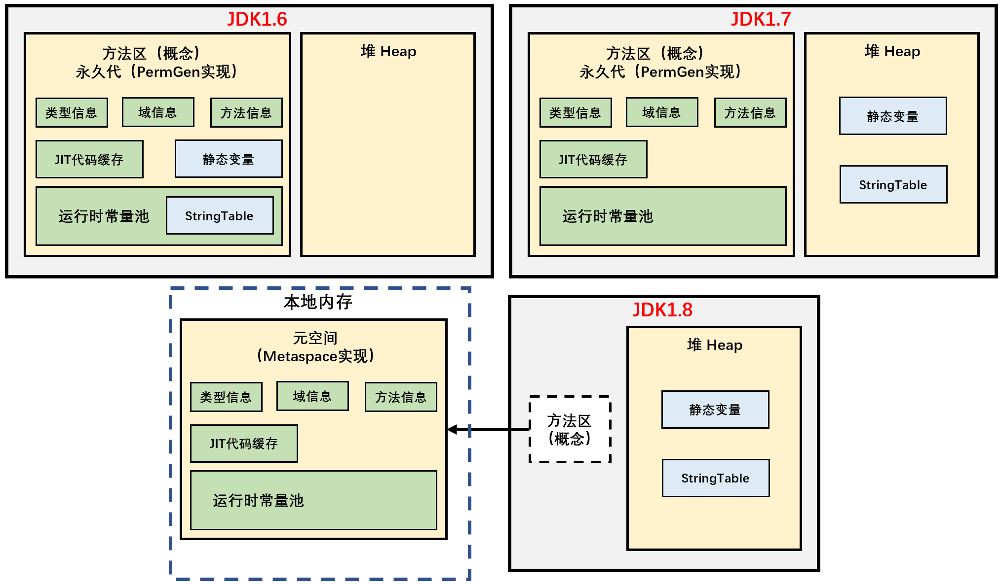  

- 类的元数据信息被移到与堆不相连的本地内存区域（元空间Metaspace）：此时系统可用内存空间就是元空间的最大可分配空间。
1. 为永久代设置空间大小是很难确定的，容易OOM（PermGen space）；而元空间大小仅受本地内存影响。
2. 对永久代很难调优。

##### StringTable的调整

- JDK7将StringTable存放到堆空间：永久代的回收效率低，在Full GC时才触发，而Full GC在老年代的空间不足、永久代不足时才触发，导致StringTable的回收效率低。而开发中有大量的字符串被创建，放在堆中能及时回收内存。

##### 静态变量的位置

- 对象实例始终在Java堆中分配，变化的是静态变量的引用所处位置。
- JDK7及之后的HotSpot虚拟机将静态变量和类型在Java语言一端的映射Class对象存放在一起，存储于Java堆中。

#### 垃圾收集-废弃常量

- 方法区的垃圾收集主要回收：常量池中废弃的常量、不再使用的类型。

> 方法区内常量池中主要存放的两大类常量：字面量、符号引用。
> 
> 1. 类和接口的全限定名。
> 2. 字段的名称和描述符。
> 3. 方法的名称和描述符。

- Hotspot对常量池的回收策略：只要常量池中的常量没有被任何地方引用，就可被回收。

- 判断一个类型不再被使用的条件：（仅是被允许回收，并非废弃就一定被回收）
1. 该类的所有实例都已经被回收：Java堆中不存在该类及其任何派生子类的实例。

2. 加载该类的类加载器已经被回收。

3. 该类的java.lang.Class对象没有在任何地方被引用，无法在任何地方通过反射访问该类的方法。
- 在大量使用反射、动态代理、CGLib等字节码框架，动态生成JSP、OSGi等频繁自定义类加载器的场景中，通常需要JVM具备类型卸载的能力，以保证不会堆方法区造成过大的内存压力。

> 控制
> 
> -Xnoclassgc
> 
> 查看类加载和卸载信息
> 
> -verbose:class
> 
> -XX:+TraceClass-Loading
> 
> -XX:+TraceClassUnLoading

## 本地方法接口 native

- 本地方法（Native Method）（native关键字）：Java调用非Java代码的接口，方法体通过非Java代码实现。
  - 除非与硬件有关，否则较少使用。

```java
private native void suspend0();
public static native void yield();
public static native void sleep(long millis) throws InterruptedException;
//native不能和abstract一起使用
```

- 与Java环境外交互：Java与一些底层系统的交互。
- 与操作系统交互：实现JRE和底层系统的交互，JVM的部分由C语言编写。
- Sun's Java：Sun的解释器使用C实现，使得其能像普通的C一样与外部交互。

## 对象实例化

### 实例化


#### 加载类元信息

- 虚拟机遇到一条new指令，首先去检查该指令的参数能否在Metaspace的常量池中定位到一个类的符号引用，并且检查该符号引用代表的类是否以及被加载、解析、初始化。（即判断类元信息是否存在）。如果没有，那么在双亲委派模式下，使用当前类加载器以 ClassLoader+全限定名 为Key进行查找对应的.class文件。如果没有找到文件，则抛出ClassNotFoundException，如果找到，则进行类加载，并生成对应的类对象。

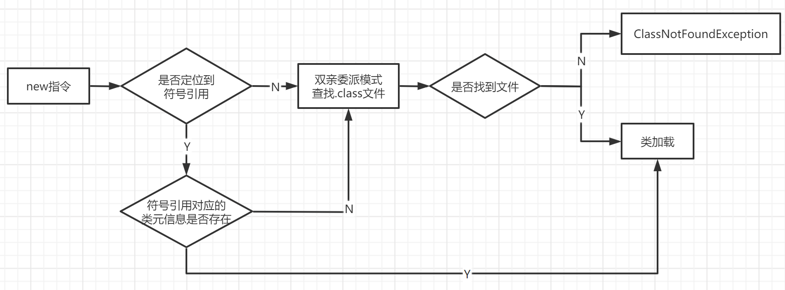 

#### 为对象分配内存

1. 计算对象占用空间大小，在堆中划分一块内存给新对象。如果实例成员是引用变量，仅分配引用变量空间（4B）即可。
2. 如果内存规整：JVM采用指针碰撞法（Bump The Pointer）为对象分配内存。
   - 指针碰撞：所有用过的内存和空闲的内存区分，使用一个指针作为分界点的指示器。分配内存时，将指针向空闲内存区移动一段与对象大小相等的距离。
   - 如果GC选择Serial、ParNew等基于标记压缩算法，虚拟机采用该方法。一般使用带有compact（整理）过程的垃圾收集器时，使用指针碰撞。
3. 如果内存不是规整的（已使用的内存和未使用的内存相互交错）：JVM采用空闲列表（Free Table）为对象分配内存。
   - 空闲列表：虚拟机维护了一个列表，记录哪些内存块是可用的，在分配时从列表中找到一块足够大的空间划分给对象实例，并更新列表上的内容。

#### 处理并发安全问题

#### 零值初始化

#### 设置对象头信息

- 设置对象头：将对象的所属类（类的元数据信息）、对象的HashCode、对象的GC信息、锁信息等数据存储在对象的对象头中。该过程的具体设置取决于JVM实现。

#### init方法初始化

- init方法：初始化成员变量、执行实例化代码块、调用类的构造方法，并把堆内对象的首地址赋值给引用变量。
- 一般（由字节码中是否跟随有invokespacial指令决定），new指令之后就是执行init方法，此时，一个真正可用的对象才被完全创建。

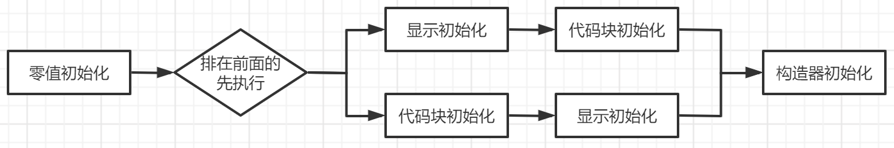  

### 对象的内存布局

   

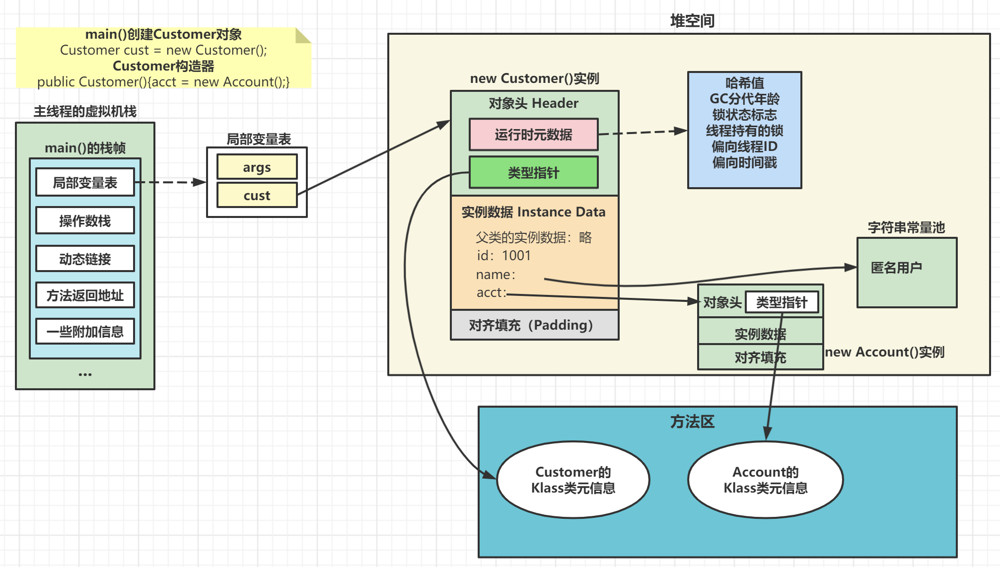  

### 对象的访问定位

  

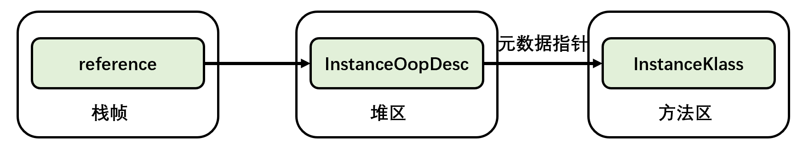  

  

- 句柄访问：reference中存储稳定句柄地址，对象被移动时只改变句柄中实例数据指针即可，reference本身不变。

## 直接内存

- 直接内存：在Java堆外的、直接向系统申请的内存空间。来源于NIO，通过存在堆中的DirectByteBuffer操作Native内存。

>  直接内存不是运行时数据区的一部分、不是《JVM规范》中定义的内存区域。

- 通常，访问直接内存的速度会优于Java堆，读写性能高：
  - 读写频繁的场景。
  - Java的NIO库允许Java程序使用直接内存，用于数据缓冲区。
- 直接内存也存在OOM（Direct buffer memory）：直接内存在Java堆外，其大小不会直接受限于-Xmx指定的最大堆大小，但由于系统的内存是有限的，Java堆和直接内存的总和仍然受限于系统的最大可用内存。
- 直接内存缺点：
  1. 分配回收成本高。
  2. 不受JVM内存回收管理。
- 直接内存大小设置：`-XX:MaxDirectMemorySize=<value>`，默认与堆的-Xmx参数值一致。

 
$$
Java Process Memory = Java Heap + Native Memory
$$
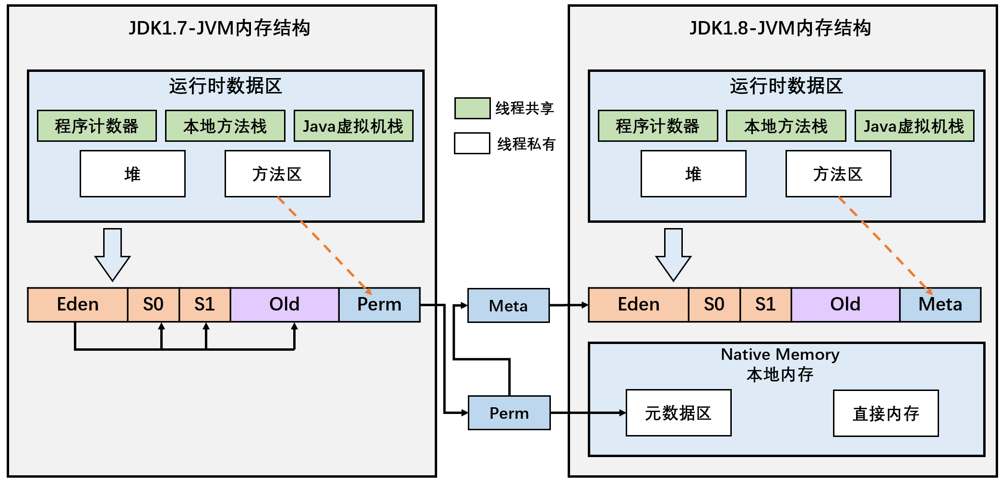  

## 执行引擎

### 执行引擎概述

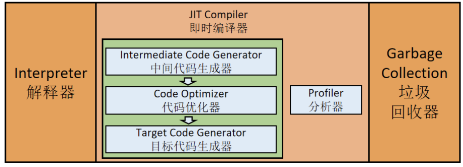  

- 执行引擎：将字节码指令解释/编译为对应平台上的本地机器指令（高级语言->机器语言）。
  - 物理机的执行引擎：直接建立在处理器、缓存、指令集、操作系统层面。
  - 虚拟机的执行引擎：由软件自行实现，不受物理条件制约地定制指令集和执行引擎地结构体系，能够执行不被硬件直接支持的指令集格式。

> JVM的主要任务是负责装载字节码到其内部，但字节码（高级语言）并不能直接运行在操作系统（机器语言），因此需要执行引擎。

  

- 从外观上看，所有JVM的执行引擎输入、输出都是一致的：
  - 输入：字节码二进制流。
  - 处理过程：字节码解析执行的等效过程。
  - 输出：执行结果。

### 编译和执行

#### 概述

- Java：半编译半解释型语言。

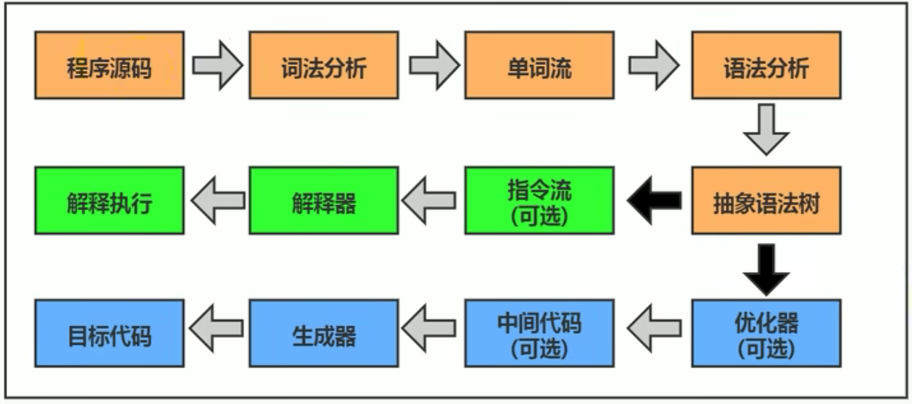  

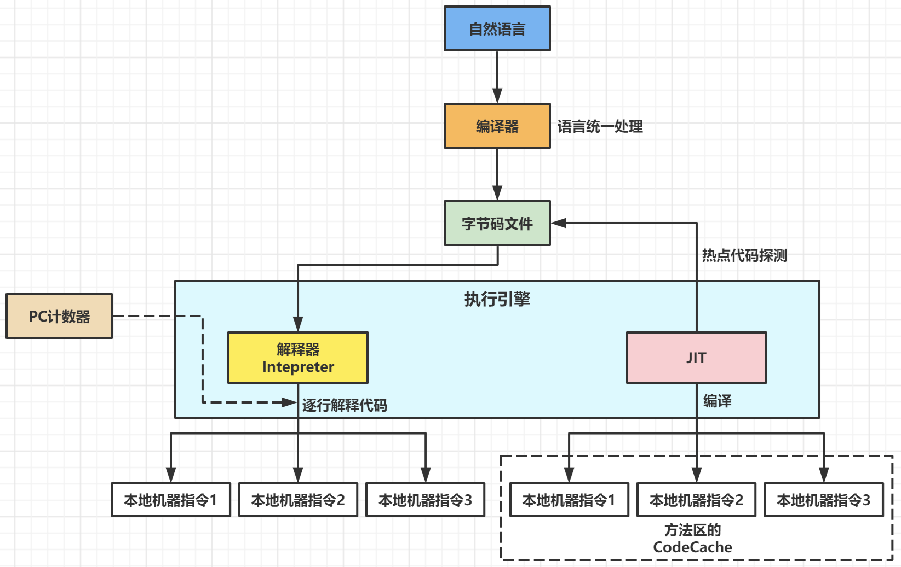  

> 字节码：中间状态的二进制代码（中间码），需要直译器转译为机器语言。
> 
> - 与硬件环境无关：实现特定的软件运行和软件环境。
> 
> - 编译器将源码编译成字节码，特定平台的虚拟机器将字节码转译为可直接执行的指令。

- HotSpot采用解释器和JIT编译器并存的架构：解释执行在编译器进行激进优化不成立时，作为编译器的逃生门。
- JVM启动时，解释器首先发挥作用，而不必等待JIT编译器全部编译完成后再执行，省去许多不必要的编译时间。随着时间的推移，JIT编译器发挥作用，根据热点探测功能，将有价值的字节码编译为本地机器指令，获得更高的执行效率。

> - 当程序启动后，解释器立即执行，省去编译的时间。而编译器需要把代码编译成本地代码，需要一定执行时间，但编译之后执行效率更高。
> 
> - 服务端应用不关注启动时间，而注重启动速度的场景则需要解释器和编译器并存架构的相互平衡。

#### 解释器 解释执行

- 解释器（Interpreter）：运行时，根据预定义的规范对字节码采用逐行解释的方式执行，将每条字节码文件中的内容“翻译”为对应的本地机器指令执行。

| 解释器    | 说明                                     |
| ------ | -------------------------------------- |
| 字节码解释器 | 执行时通过纯软件代码模拟字节码的执行，效率低下。               |
| 模板解释器  | 每一条字节码和一个模板函数相关联，模板函数直接产生这条字节码执行时的机器码。 |

- HotSpot VM解释器构成：
  - Interpreter模块：解释器的核心功能。
  - Code模块：管理HotSpot VM运行时生成的本地机器指令。
- 解释执行：基于解释器执行，比编译执行低效。

#### 编译器 编译执行

- Java的编译期是不确定的：

| 编译器                                       | 作用                 | 具体                                                |
| ----------------------------------------- | ------------------ | ------------------------------------------------- |
| 前端编译器                                     | .java文件转化为.class文件 | Javac<br />增量式编译器ECJ                              |
| 后端编译器 <br />JIT（Just In Time Compiler）    | 字节码转化为机器码          | C1、C2编译器                                          |
| 静态提前编译器 <br />AOT（Ahead Of Time Compiler） | .java文件直接转化为本地机器代码 | GCJ（GNU Compiler for the Java）<br />Excelsior JET |

- JIT编译器（Just In Time Compiler）：将整个函数体编译为机器码，每次函数执行时，只执行编译后的机器码。

### 热点代码探测

#### 热点代码

- 热点代码：需要被编译为本地代码的字节码，由代码被调用执行的频率而定。一个被多次调用的方法、一个方法体内部循环次数较多的循环体。
  - 发生在方法执行过程：栈上替换 OSR（On Stack Replacement）。
  - JIT编译器运行时会针对热点代码进行深度优化，将其直接编译为对应平台的本地机器指令。

#### 热点探测

- 热点探测：触发JIT编译的阈值。（确认为热点代码的阈值）
  - HotSpot：基于计数器的热点探测，为每个方法都创建2个不同类型的计数器：

| 计数器                             | 说明           |
| ------------------------------- | ------------ |
| 方法调用计数器<br />Invocation Counter | 统计方法的调用次数    |
| 回边计数器<br />Back Edge Counter    | 统计循环体执行的循环次数 |

##### 方法调用计数器

###### 计数器阈值

- 方法调用计数器：阈值：-XX:CompileThreshold，默认：
  - Client模式：1500次。
  - Server模式：10000次。
- 当一个方法被调用时，先检查该方法是否存在被JIT编译过的版本。如果存在，则优先使用编译后的本地代码执行；如果不存在，则将此方法的调用计数器值+1，然后判断方法调用器与回边计数器之和是否超过方法调用计数器的阈值。如果超过阈值，则向JIT提交该方法的代码编译请求。

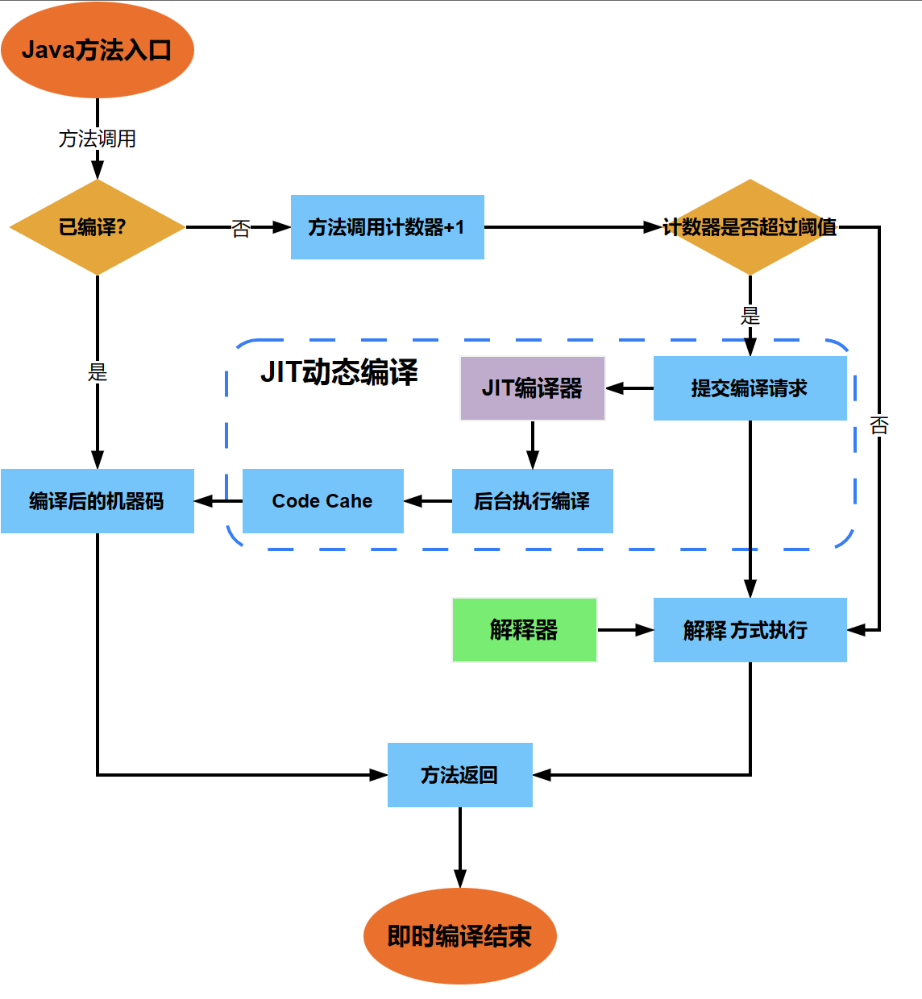 

###### 热度衰减

- 热度衰减（Count Decay）：如果不做任何设置，方法调用计数器统计的不是方法被调用的绝对次数，而是一个相对的执行频率（一段时间内方法被调用的次数）。当超过一定的时间限度，如果方法的调用次数不足以让方法提交给JIT编译，则该方法的调用计数器就会被减少一半。
  - 方法统计的半衰周期（Count Half Life Time）。
- 热度衰减是在JVM进行垃圾收集时顺便进行的。

| 参数                      | 说明                                                 |
| ----------------------- | -------------------------------------------------- |
| -XX:-UseCounterDecay    | 关闭热度衰减。让方法计数器统计方法调用的绝对次数：只要时间够长，绝大多数的方法都会被编译成本地代码。 |
| -XX:CounterHalfLifeTime | 设置半衰周期时间（秒）。                                       |

##### 回边计数器

- 回边计数器：统计循环体代码执行的次数，为触发OSR编译。
  - 回边（Back Edge）：字节码中遇到控制流向后跳转的指令。

 

### HotSpot设置执行方式

#### 解释器、JIT

- HotSpot VM：默认采用解释器和即时编译器并存的架构，可通过指令设置：

| 指令      | 说明                                 |
| ------- | ---------------------------------- |
| -Xint   | 完全采用解释器模式。                         |
| -Xcomp  | 完全采用JIT模型。<br />如果JIT出现问题，解释器介入执行。 |
| -Xmixed | 默认，二者并存的混合模式。                      |

#### C1、C2

- HotSpot内嵌两个JIT编译器：

| C1：Client Compiler               | C2：Server Compiler               |
| -------------------------------- | -------------------------------- |
| -client：指定JVM运行在Client模式，使用C1编译器 | -server：指定JVM运行在Server模式，使用C2编译器 |
| 对字节码简单、可靠的优化，耗时短，编译更快            | 耗时长的优化、激进优化，优化的代码执行效率高           |

| JIT | 优化策略                         |
| --- | ---------------------------- |
| C1  | 方法内联<br />去虚拟化<br />冗余消除     |
| C2  | 标量替换<br />栈上分配<br />同步消除+laj |

- 分层编译策略（Tiered Compilation）：Server模式默认开启，由C1、C2协作编译。
  - 不开启性能监控：可触发C1编译（简单优化）。
  - 开启性能监控：C2编译根据性能监控信息进行激进优化。

#### Graal

- 开关参数：

```
-XX:+UnlockExperimentalVMOptions
-XX:+UseJVMC1Compiler
```

#### AOT

- AOT（Ahead Of Time Compiler）静态提前编译器：在程序运行之前，将字节码转化为机器码。

> JIT：程序运行时，将字节码转化为机器码。

- jaotc：借助Graal编译器，.java-->.class-->机器码，并放至生成的动态共享库中。
- 在JVM加载前编译成二进制库，可直接执行，而不必等待JIT的预热。
1. 不符合java“一次编译，到处执行”：必须为每个不同的硬件、OS编译对应的发行包。
2. 降低了Java链接过程的动态性，加载的代码在编译期就必须全部已知。

## StringTable

### String

#### 底层存储

- JDK8及之前：

```java
private final char[] value;
```

- JDK9及之后：

```java
@Stable
private final byte[] value;
private final byte coder; //编码集的识别
```

#### 不可变性

### StringTableSize

- String Pool（StringTable）：固定大小的HashTable。

- 放进String Pool的String过多时，会造成Hash冲突严重，导致链表过长，调用String.intern()时性能大幅下降。

- 设置StringTable长度：-XX:StringTableSize。

> StringTableSize默认长度：
> 
> - Jdk6及之前：1009
> 
> - Jdk7及之后：60013
> 
> StringTableSize可设置的最小值：
> 
> - Jdk8之后：1009

### 常量池

- 常量池中不会存放相同内容的常量：相同的字符串字面量（包括相同的Unicode字符序列：码点序列），必须指向同一个String对象。

> 常量池：基本数据类型的常量池由系统协调，String常量池比较特殊。
> 
> 字符串池：最初为空，由String类私有地维护。

1. 字面量：声明的String对象直接存储在常量池中。
2. String#intern()。

> 字符串常量池位置的演变：
> 
> - Jdk6及之前：字符串常量池存放在永久代。
> - Jdk7及之后：字符串常量池存放在Java堆内。
>   - permSize默认值较小。
>   - 永久代垃圾收集频率低。

### 字符串拼接

#### 字面量拼接

- 常量拼接：参与拼接的都是常量、常量引用，结果在常量池（编译期优化），调用String#intern()。
  - 常量：字面量、final。

> final在编译时就分配，准备阶段会显式初始化

```java
// .java
String str = "a" + "b" + "c";
// .class 经过编译期优化：相当于调用intern()
String str = "abc";
```

#### 变量拼接

- 变量拼接：拼接的一方是变量，结果在堆，new String()。

```java
String s1 = "javaEE";
String s2 = "hadoop";

String s3 = "javaEEhadoop";
String s4 = "javaEE" + "hadoop"; //编译期优化："javaEEhadoop"
//如果拼接符号的前后出现了变量，则相当于在堆空间中new String()，具体的内容为拼接的结果：javaEEhadoop
String s5 = s1 + "hadoop";
String s6 = "javaEE" + s2;
String s7 = s1 + s2;

System.out.println(s3 == s4);//true
System.out.println(s3 == s5);//false
System.out.println(s3 == s6);//false
System.out.println(s3 == s7);//false
System.out.println(s5 == s6);//false
System.out.println(s5 == s7);//false
System.out.println(s6 == s7);//false

String s8 = s6.intern();
System.out.println(s3 == s8);//true
```

- 变量间拼接的原理：`s7=s1+s2`。创建了新的StringBuilder、String对象。
1. String  s7 = new StringBuiler()：`new #9 <java/lang/StringBuilder>`
2. StringBuilder#append()：s7.append("javaEE");、s7.append("hadoop");
3. StringBuilder#toString()：s7.toString();

> JDK5及之前：StringBuffer。

- StringBuilder#toString()：没有在字符串常量池存放字符串。

> new String("ab")存放到字符串常量池：`ldc #5 <ab>`。

```
 0 new #80 <java/lang/String>
 3 dup
 4 aload_0
 5 getfield #234 <java/lang/StringBuilder.value : [C>
 8 iconst_0
 9 aload_0
10 getfield #233 <java/lang/StringBuilder.count : I>
13 invokespecial #291 <java/lang/String.<init> : ([CII)V>
16 areturn
```

### intern()

- intern()：当调用intern方法时，如果池中已经包含一个由equals(object)方法确定的与此String对象相等的字符串，则返回池中的字符串。否则，将此String对象添加到池中，并返回对该String对象的引用。

> intern()的空间使用效率：对于大量重复存在的字符串（返回引用，而不是new），可节省空间。

- new String()：共创建2个对象（字节码）：赋值的变量的引用是new的地址。
  - new堆空间创建的：new。
  - 字符串常量池中的对象：ldc。

```java
public native String intern();
```

```java
String s = new String("1"); //s指向的是new堆空间创建的，而不是字符串常量池中的
String s1 = s.intern(); //常量池中已经存在，返回池中的字符串，s1和s2相同
String s2 = "1"; //获取字符串常量池中的
System.out.println(s == s2);//jdk6：false   jdk7/8：false
```

```java
String s3 = new String("1") + new String("1"); //字符串常量池中不存在"11"
s3.intern(); //s3-"11"在字符串常量池中不存在，则将此String对象添加到池中，并返回对该String对象的引用。
//Jdk6：创建新的对象"11"，放入字符串常量池。
//Jdk7/8：字符串常量池中创建指向堆空间s3中的引用。
String s4 = "11"; //s4指向和上一行相同的字符串常量池中的地址
System.out.println(s3 == s4);//jdk6：false  jdk7/8：true
```

- 对于s3.intern();
- Jdk6及之前：串池新创建一个字符串"11"。
  - 如果字符串常量池中没有，将此对象复制一份，放入常量池中，并返回对该String对象的引用。
- Jdk7及之后：串池中没有创建字符串"11"，而是创建一个引用，指向当前堆中的字符串"11"。
  - 如果字符串常量池中没有，将此对象的引用地址复制一份，放入常量池中，并返回对该String对象的引用。

```java
String s3 = new String("1") + new String("1");//字符串常量池中不存在"11"
String s4 = "11"; //字符串常量池中创建"11"对象，且堆中也创建一个相应的new String() 
String s5 = s3.intern(); //s5地址和s4地址相同
System.out.println(s3 == s4);//jdk6：false  jdk7/8：false
```

### StringTable的垃圾回收

> -XX:+PrintStringTableStatistics

- StringTable中存在垃圾回收机制。
- G1的String去重操作（针对堆空间中new的String）：equals()的结果为true的String对象。
1. 当垃圾收集器工作时，会访问堆上存活的对象。对每个访问的对象都会检查是否是候选的要去重的String对象。
2. 如果是，将该对象的一个引用插入到队列中等待后续的处理。一个去重的线程在后台运行，处理这个队列。处理队列的一个元素，从队列中删除该元素，并尝试去重其引用的String对象。
3. 使用一个HashTable来记录所有的被String对象使用的不重复的char数组。当去重时，会查找该HashTable，查看堆中是否已经存在一个一模一样的char数组。
4. 如果存在，String对象会被调整引用那个数组，释放对原来数组的引用，最终会被垃圾收集器回收。
5. 如果查找失败，char数组会被插入到HashTable中，之后就可共享该数组。

```
UseStringDeduplication 开启String去重，默认不开启
PrintStringDeduplicationStatistics 打印详细的去重统计信息
StringDeduplicationAgeThreshold 设置去重的String对象的年龄阈值，作为去重的候选对象。
```

 

# GC

> - 哪些内存需要回收？
> 
> - 什么时候回收？
> 
> - 如何回收？

- 垃圾：运行程序中没有任何指针指向的对象。如果不对这些垃圾进行回收，所占用的空间会一直保留到程序结束而无法被其他对象使用，甚至内存溢出。
- 早期的垃圾回收：内存泄漏问题。

> 内存泄漏：一处内存区间由于程序员编码的问题而忘记被回收，就会产生内存泄漏，垃圾对象永远无法被清除，随着系统运行时间的不断增长，垃圾对象所耗内存可能持续上升，直到内存溢出并造成应用程序崩溃。 

- Java自动内存管理：黑匣子问题，实施必要的监控和调节。

- GC工作的区域：Java堆、方法区。  
  
  - 频繁收集Young区。
  - 较少收集Old区。
  - 基本不动Perm区/Metaspase。

## GC算法

### 标记阶段

- 垃圾标记阶段：对象存活判断。
- 死亡对象：一个对象不再被任何的存活对象引用。

#### 引用计数算法

> Java未采用引用计数算法。
> 
> Python采用引用计数算法，解决：
> 
> - 手动解除。
> - 弱引用（weakref）。

- 引用计数算法（Reference Counting）：对对象保存一个整型的引用计数器属性，记录对象被引用的情况。
- 对一个对象，只要有任何一个对象引用了该对象，则该对象的引用计数器+1；当引用失效，引用计数器-1。当该对象的引用计数器=0，表示该对象不可能再被使用，可进行回收。

| 分析  | 说明                                                                 |
| --- | ------------------------------------------------------------------ |
| 优点  | 1. 实现简单，垃圾对象便于辨识。<br />2. 判定效率高，回收没有延迟性。                           |
| 缺点  | 1. 存储空间开销：单独的字段存储计数器。<br />2. 时间开销：每次赋值都需要更新计数器。<br />3. 无法处理循环引用。 |

- 循环引用问题：相互引用，导致内存泄漏。

 

#### 可达性分析算法-GC Roots

- 可达性分析算法（根搜索算法、追踪性垃圾收集）（Tracing Garbage Collection ）。
- 可达性分析必须在一个能保障一致性的快照中进行：导致GC进行时必须“Stop The World”。

> 即使是CMS收集器也必须在枚举根节点时停顿。

- 根对象集合（GC Roots）：一组必须活跃的引用。
1. 以根对象集合为起始点，从上到下搜索被根对象集合所连接的目标对象是否可达。
2. 引用链：搜索所经过的路径，可达性分析之后，内存中的存活对象都被根对象集合直接/间接连接。
3. 如果对象没有任何的引用链（不可达），则对象死亡，标记为垃圾对象。

 

- 固定的GC Roots集合包括：
  - 虚拟机栈中引用的对象。
  - 本地方法栈内JNI引用的对象。
  - 方法区中类属性引用的对象。
  - 方法区中常量引用的对象。
  - 所有被同步锁sychronized持有的对象。
  - JVM内部的引用：基本数据类型对应的Class对象、一些常驻的异常对象、系统类加载器。
  - 反映JVM内部情况的JMXBean、JVMTI中注册的回调、本地代码缓存等。
- 临时性加入的GC Roots：根据用户所选用的垃圾收集器以及当前回收的内存区域的不同，可以有其他对象临时性的加入GC Roots集合。（分代收集、局部回收Partial GC）
  - 如果只针对Java堆中的某一块区域进行垃圾回收，必须考虑到内存区域是JVM自身的实现细节，更不是独立封闭的，该区域的对象完全有可能被其他区域的对象所引用（如：新生代的对象被老年代的对象引用），此时，需要一并将关联的区域对象也加入到GC Roots中考虑。

#### 对象终止机制 finalization

- 对象终止机制（finalization）：对象被销毁之前的自定义处理逻辑。
- Object#finalize()：垃圾回收时由垃圾回收器在对象上调用，只会被调用一次。
  - 可能导致对象的复活。
  - 执行时间没有保障：完全由GC线程决定，低优先级的Finalizer线程。

```java
protected void finalize() throws Throwable { }
```

- JVM中的对象一般处于3种可能的状态：只有在不可触及状态下才可以被回收。

| 状态   | 说明                                 |
| ---- | ---------------------------------- |
| 可触及  | 从根节点开始，可以到达该对象。                    |
| 可复活  | 对象的所有引用都被释放，但该对象可能在finalize()复活。   |
| 不可触及 | 对象的finalize()被调用，且该对象没有复活。（不可能被复活） |

- 判断一个对象是否可回收，至少经过两次标记过程：
1. 如果该对象到GC Roots没有引用链，则进行第一次标记。
2. 筛选，判断该对象是否有必要执行finalize()：
   1. 如果该对象没有重写finalize()、finalize()已经被JVM调用过：没有必要执行，该对象被判断为不可触及。
   2. 如果该对象重写了finalize()、且还未被JVM调用过：将该对象插入到F-Queue队列，由一个JVM自动创建的、低优先级的Finalizer线程触发执行。
   3. finalize()是对象逃脱死亡的最后机会，之后GC会对F-Queue中的对象进行第二次标记。如果该对象在finalize()中与引用链上的任何一个对象建立了联系，则第二次标记时，该对象被移出“即将回收”集合。否则被判断为不可触及。
   4. 之后，如果该对象再次出现没有引用存在的情况，finalize()不会被调用，直接判断为不可触及。

 

#### GC Roots溯源

##### HeapDump文件

###### jmap

```
jmap -dump:format=b,live,file=输出文件名.bin 进程号
```

###### visulvm

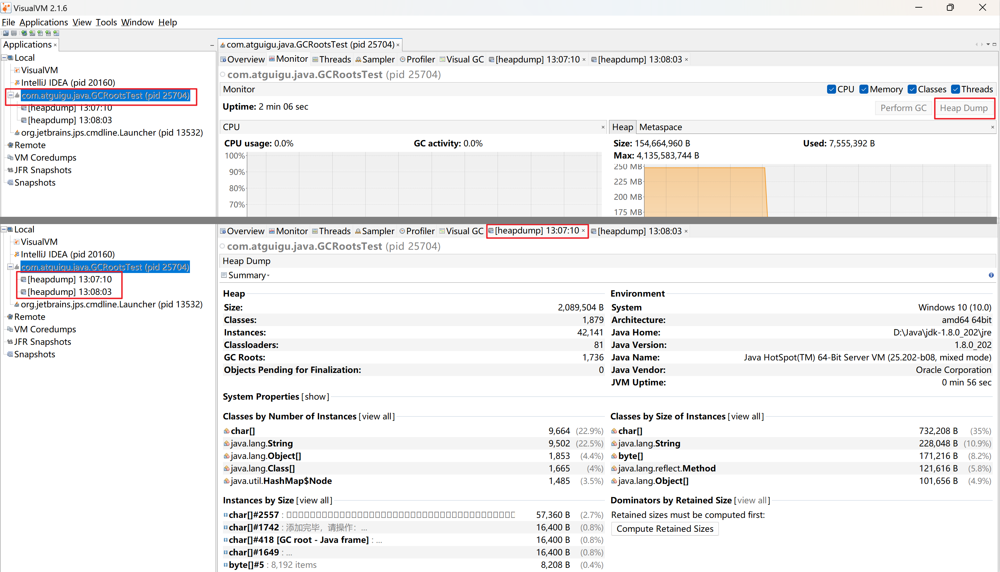

###### MAT

- MemoryAnalyzer.ini：如果当前Jdk版本不适合，添加代码，参考以下：

```ini
-vm
D:/Java/jdk-18.0.1.1/bin
```

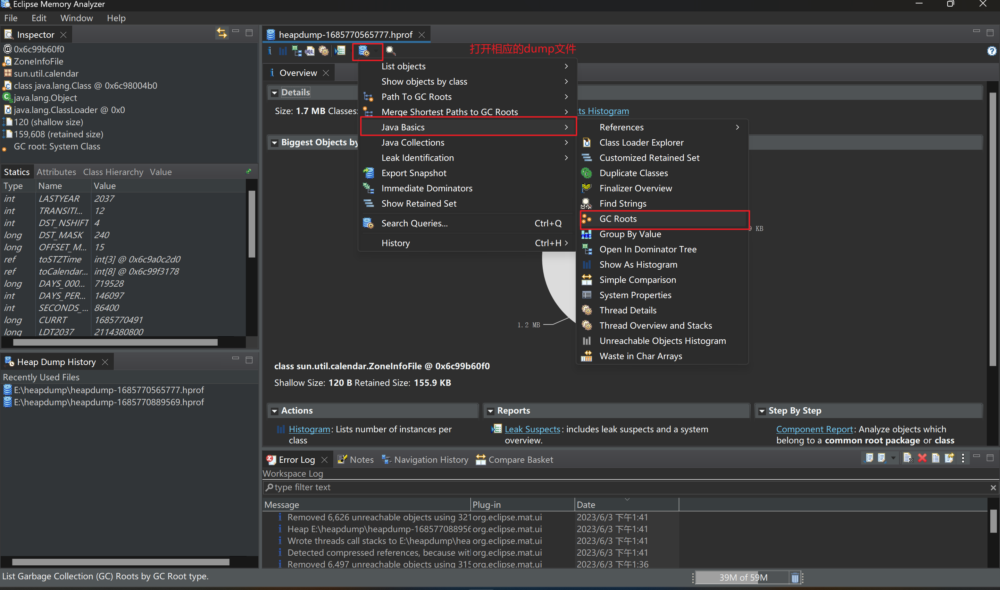

###### JProfiler

##### OOM

- 设置出现OOM时生成HeapDump文件：

```
-XX:+HeapDumpOnOutOfMemoryError
```

### 清除阶段

#### 标记-清除算法 Mark-Sweep

- 标记-清除算法：当堆中的有效内存空间（available memory）被耗尽，Stop The World，然后进行以下：
1. 标记：Collector从引用根节点开始遍历，标记所有被引用的对象（对象Header中记录为可达对象的）。
2. 清除：Collector对堆内存从头到尾进行线性遍历，如果发现某个对象的Header没有标记为可达对象，则将其回收。
   - 并非置空，而是将需要清除的对象地址保存在空闲列表中，当有新对象需要加载时，判断垃圾的位置空间是否足够，如果足够，则覆盖。
- 缺陷：
1. 效率不算高。
2. STW。
3. 清理的空间内存是不连续的，产生内存碎片，需要维护一个空闲列表。

#### 复制算法

- 复制算法：将活着的内存空间分为两块，每次只使用其中一块。在垃圾回收时，将正在使用的内存中的存活对象复制到未被使用的内存块中，之后清除正在使用的内存块中的所有对象，交换两个内存的角色，最后完成垃圾回收。

> Survivor0、Survivor1使用的是复制算法。
> 
>  

- 优点：
1. 没有标记-清除，运行高效。

2. 空间连续性，避免碎片问题。
- 缺点：
1. 2倍的内存空间。

2. 对于G1（分拆为大量region的GC），复制-移动的过程地址改变，GC需要维护region之间的对象引用关系，开销大。
- 复制算法理想情况：垃圾对象多，而复制的存活对象应尽量少。

#### 标记-压缩（整理）算法  Mark-Compact

- Mark-Compact（ Mark-Sweep-Compact）：
1. 标记：从引用根节点开始遍历，标记所有被引用的对象。
2. 压缩：将所有的存活对象压缩到内存的一端，按顺序存放，之后清除边界外的所有空间。
- 优点：对标记-清除算法、复制算法的优化。
1. 标记清除算法：内存区域分散的缺点。标记-压缩算法分配新对象时，JVM只需持有一个内存的起始地址。
2. 复制算法中：内存减半的代价。
- 缺陷：
1. 效率低于复制算法。
2. 移动对象的同时，如果对象被其他对象引用，则需要调整引用的地址。
3. STW。

| 比较   | 标记-清除       | 标记-压缩        | 复制算法                   |
| ---- | ----------- | ------------ | ---------------------- |
| 速度   | 中           | 慢            | 快                      |
| 移动对象 | 否           | 是            | 是                      |
| 空间开销 | 少<br />堆积碎片 | 少<br />不堆积碎片 | 需要存活对象的2倍空间<br />不堆积碎片 |

#### 分代收集算法

- 分代收集算法：不同生命周期的对象采取不同的收集方式。
  - 年轻代（Young Gen）：区域较小、对象生命周期短、存活率低、回收频繁。
    - 复制算法：survivor1、survivor2。
  - 老年代（Tenured Gen）：区域较大、对象生命周期长、存活率高、回收不如年轻代频繁。
    - 标记-清除、标记-整理的混合实现：
      - Mark：开销和存活对象数量成正比。
      - Sweep：开销和所管理区域大小成正比。
      - Compact：开销和存活对象数量成正比。

> Hotspot的CMS回收器：CMS基于Mark-Sweep实现，对象的回收率高。
> 
> - 碎片问题：CMS采用基于Mark-Compact算法的Serial Old回收器作为补偿。当内存回收不佳时（碎片导致的Concurrent Mode Failure），采用Serial Old执行Full GC以达到对老年代内存的整理。

#### 增量收集算法

- 增量收集算法：每次垃圾收集线程只收集一小片的内存空间，垃圾收集线程和应用程序线程交替执行、直到垃圾收集完成。
  - 对线程间冲突的处理：允许垃圾收集线程以分阶段的方式完成工作。
  - 切割STW的停顿时间。
- 缺陷：线程切换、上下文转换的消耗导致垃圾回收的总体成本上升，造成系统吞吐量下降。

#### 分区算法

- 分区算法：将整个堆空间划分成连续的不同小区间。
  - 根据目标停顿时间，每次合理地回收若干个小区间。

> 一般情况下，在相同条件下，堆空间越大，一次GC所需要的时间就越长，有关GC产生的停顿也越长。

> 分代算法：按对象生命周期划分。

## GC相关

### System.gc()

- gc()：触发Full GC。
  - System.gc()：附带免责声明，无法保证对垃圾收集的调用。

```java
public static void gc() {
    Runtime.getRuntime().gc();
}
```

- System#runFinalization()：  强制调用失去引用对象的finalize()。

```java
public static void runFinalization() {
    Runtime.getRuntime().runFinalization();
}
```

> buffer不会被回收：虽然超过了作用域，但此时buffer仍然在局部变量表中保存引用，占据一个Slot。
> 
> ```java
> public void localvarGC1() {
>     {
>         byte[] buffer = new byte[10 * 1024 * 1024];
>     }
>     System.gc();
> }
> ```
> 
> buffer被回收：value重用了buffer的Slot，buffer失去引用。
> 
> ```java
> public void localvarGC2() {
>     {
>         byte[] buffer = new byte[10 * 1024 * 1024];
>     }
>     int value = 10;
>     System.gc();
> }
> ```
> 
> ​    localvarGC1()中的buffer在localvarGC3()中被回收：localvarGC1()栈帧被弹出，buffer失去引用。
> 
> ```java
> public void localvarGC3() {
>     localvarGC1();
>     System.gc();
> }
> ```

### 内存溢出、内存泄漏

- 内存溢出（OOM）：没有空闲内存、且垃圾收集器无法提供更多内存。
1. 没有空闲内存：
   
   1. JVM堆空间设置不够：-Xms、-Xmx。
   2. 创建大量大对象，且长时间（存在引用）不能被垃圾收集器回收。
      - Java.lang.OutOfMemoryError: PermGen space：永久代，内存大小有限。
      - Java.lang.OutOfMemoryError:  Matespace：元数据区，直接内存不足。

2. 抛出OOM前，通常会触发GC。如果分配一个超大对象，JVM判断GC不能解决，则直接抛出OOM。
- 内存泄漏（存储渗漏）Memory Leak：对象不再被程序使用，但GC无法回收该对象。逐步蚕食内存空间（虚拟内存），直至OOM。
  - 宽泛意义：对象生命周期过长，甚至导致OOM。

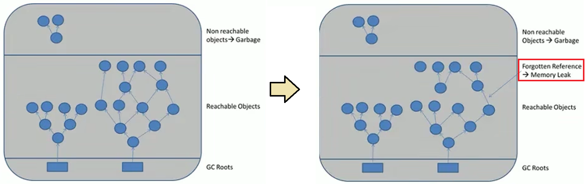 

> 内存泄漏举例：
> 
> 1. 单例模式：单例的生命周期和应用程序一样长。在单例程序中，如果持有对外部对象的引用，则该外部对象不能被回收，导致内存泄漏。
> 2. 一些需要close()的资源未被释放，导致内存泄漏：数据库连接（dataSource.getConnection()）、网络连接（socket）、I/O等。

### STW

- Stop The World：GC事件发生过程中，产生程序的停顿，停顿时整个应用程序线程被暂停。完成GC后恢复被STW中断的应用程序线程。

> 可达性分析算法中枚举GC Roots时，STW：保证一致性。

- STW是所有GC不可避免的事件，由JVM在后台自动发起和完成。

### 垃圾回收的并行、并发

> | 方式  | 说明                                                                                        |
> | --- | ----------------------------------------------------------------------------------------- |
> | 并发  | 操作系统中，一个时间段内有多个程序都处于启动运行到运行完毕之间，且这几个程序都是在同一个处理器上运行。<br />CPU将一个时间段划分为几个时间片段，在这几个时间区间之间切换。 |
> | 并行  | 系统中有一个以上CPU时，当一个CPU执行一个进程时，另一个CPU执行另一个进程，两个进程互不抢占CPU资源，同时进行。<br />决定因素：CPU的核心数量。          |
> 
> 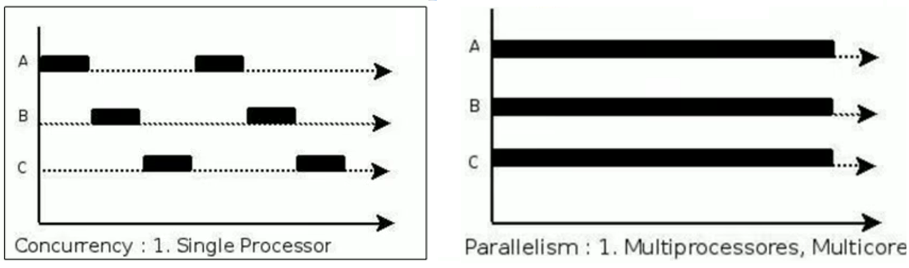

| 线程数         | 说明                        |
| ----------- | ------------------------- |
| 并行 Parallel | 多条垃圾收集线程并行工作，此时用户仍处于等待状态。 |
| 串行 Serial   | 单线程执行。<br />Client模式默认应用。 |

| 工作模式          | 说明                                          |
| ------------- | ------------------------------------------- |
| 并发 Concurrent | 用户线程、垃圾收集线程同时执行（并行/交替执行），垃圾收集线程执行时不会停顿用户线程。 |
| 独占            | STW                                         |

 

### 安全点、安全区域

- 安全点（Safe Point）：程序只有特定的位置才能停顿下来开始GC，并非所有地方都行。
- 是否具有让程序长时间执行的特征：安全点太少可能导致GC等待时间过长，过多可能导致运行时的性能问题。
- 如何在GC发生时，检查所有线程是否处于最近的安全点停顿：

| 方式                 | 说明                                                   |
| ------------------ | ---------------------------------------------------- |
| 抢先式中断<br />（已都不采用） | 首先中断所有线程，如果还有线程不在安全点，则恢复该线程，使其前往安全点。                 |
| 主动式中断              | 设置一个中断标志，各个线程运行到Safe Point时，主动轮询该标志。如果标志为真，则将自身中断挂起。 |

- 安全区域（Safe Region）：在一段代码片段中，对象的引用关系不会发生变化，在该区域的任何位置开始GC都是安全的。

> 安全区域解决的问题：如果线程处于Sleep、Blocked状态，无法响应JVM的中断请求，JVM也不大可能等待线程被唤醒。

1. 线程运行到Safe Region的代码区时，标识已经进入Safe Region。如果这段时间内发生GC，JVM会忽略标识为Safe Region状态的线程。
2. 当线程离开Safe Region时，会检查JVM是否已经完成GC。如果GC完成了，则继续运行；否则线程必须等待，直到收到可以安全离开Safe Region的信号为止。

### 引用

- 引用强度：强引用 > 软引用 > 弱引用 > 虚引用。
- 除强引用外，其他引用都处于java.lang.ref：

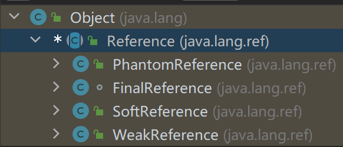 

- 只有终结器引用 FianlReference的权限修饰符是缺省的（包内可见），其余都是public。

| 引用                        | 说明                                                                          |
| ------------------------- | --------------------------------------------------------------------------- |
| 强引用<br />StrongReference  | 普遍存在的、默认的引用。<br />只要存在强引用关系，垃圾收集器就不会回收掉引用的对象。                               |
| 软引用<br />SoftReference    | 将要发生内存溢出时，会把这些对象列入回收范围内进行第二次回收。                                             |
| 弱引用<br />WeakReference    | 被软引用关联的对象只能存活到下一次垃圾收集之前，当垃圾收集器工作时，无论内存空间是否足够，都会回收掉被弱引用关联的对象。                |
| 虚引用<br />PhantomReference | 虚引用不会对对象的生存时间构成影响，也无法通过虚引用来获得一个对象的实例。<br />虚引用关联的目的：在该对象被垃圾收集器回收时，收到一个系统通知。 |

#### 强引用

- 强引用的对象是可触及的，垃圾回收器不会回收该类对象。
- 强引用：new创建对象。
1. 强引用可直接访问目标对象。
2. 强引用指向的对象任何时候都不会被系统回收，即使抛出OOM。
3. 强引用可能导致内存泄漏。

#### 软引用 SoftReference

- 软引用：非必需的对象（内存敏感的缓存）。将要发生OOM、内存空间不足时，会把这些对象列入回收范围内进行第二次回收。
- 垃圾回收器在某个时刻决定回收可达的对象时，会清理软引用，并可选地将引用存放到一个引用队列（Reference Queue）。

```java
SoftReference<Person> userSoftRef = new SoftReference<Person>(new Person("Tom",12));
```

#### 弱引用 WeakReference

- 弱引用：非必需的对象（可有可无的缓存数据）。只被软引用关联的对象只能存活到下一次垃圾收集之前。在GC时，只要发现弱引用，就会回收只被弱引用关联的对象。
- 由于垃圾回收器的线程通常优先级很低，并不一定很快就发现持有弱引用的对象，此时，弱引用对象可以存活较长时间。
- 在构造弱引用时，可指定一个引用队列，当弱引用对象被回收时，就会加入到指定的引用队列中，通过该队列可以跟踪对象的回收情况。

```java
WeakReference<Person> userSoftRef = new WeakReference<Person>(new Person("Tom",12));
```

- WeakHashMap：`Entry<K,V>[] table;`

```java
private static class Entry<K,V> 
    extends WeakReference<Object> 
    implements Map.Entry<K,V> {

    ...
}
```

#### 虚引用 PhatomReference

- 虚引用（幽灵引用、幻影引用）：虚引用不会对对象的生存时间构成影响，也无法通过虚引用来获得一个对象的实例（get()获取的是null）。如果一个对象仅持有虚引用，则该对象几乎等同于没有引用。
- 虚引用必须和引用队列一起使用：虚引用在创建时必须提供一个引用队列作为参数，当垃圾回收器准备回收一个对象时，如果发现其存在虚引用，则在回收该对象之后，将该虚引用加入引用队列，以通知应用程序对象的回收情况。
  - 跟踪对象的回收时间：可将一些资源释放操作置于虚引用中执行和记录。

```java
ReferenceQueue<Person> phantomQueue = new ReferenceQueue<Person>();
PhantomReference<Person> phantomRef = new PhantomReference<Person>(new Person(), phantomQueue);

System.out.println(phantomRef.get()); //null
```

#### 终结器引用 FianlReference

- 终结器引用：用以实现对象的fianlize()，无需手动编码，其内部配合引用队列使用。GC时，终结器引用入队，由Finalizer线程通过终结器引用找到被引用对象，并调用其finalize()，如果复活，则第二次GC时才能回收被引用对象。

## 垃圾回收器概述

### GC分类

- 按线程数：串行回收、并行回收。
- 按工作模式：并发式、独占式。
- 按碎片处理方式：压缩式、非压缩式。
- 按工作内存区间：年轻代、老年代。

### GC性能指标

| 性能指标     | 说明                                                 |
| -------- | -------------------------------------------------- |
| **吞吐量**  | 运行用户代码时间占总运行时间的比例。<br />总运行时间 = 程序的运行时间 - 内存回收的时间。 |
| 垃圾收集开销   | 吞吐量的补数<br />垃圾收集所用时间与总运行时间的比例。                     |
| **暂停时间** | 执行垃圾收集时，程序的工作线程被暂停的时间。                             |
| 收集频率     | 相对于应用程序的执行，收集操作发生的频率。                              |
| **内存占用** | Java堆区所占的内存大小。                                     |
| 快速       | 一个对象从诞生到被回收所经历的时间。                                 |

> 不可能铁三角：吞吐量、暂停时间、内存占用。
> 
> - 随着硬件性能的提升：
> 1. 对内存占用的容忍越大。
> 2. 有助于降低收集器运行时对应用程序的影响，提高了吞吐量。
> 3. 而内存的扩大，对延迟带来负面效果。

- 吞吐量（throughout）：CPU用于运行用户代码的时间与CPU总消耗时间的比值。

$$
吞吐量 = \frac{运行用户代码时间}{运行用户代码时间+垃圾收集时间}
$$

- 高吞吐量的应用程序能忍受较高的暂停时间。
  - 高吞吐量：降低内存回收的执行频率、GC需要更长的暂停时间来执行内存回收。
  - 吞吐量优先：在最大吞吐量优先的情况下，降低停顿时间。

 

### GC迭代史

| JDK   | 说明                                                              |
| ----- | --------------------------------------------------------------- |
| 1.3.1 | 串行 Serial GC                                                    |
| 1.4.2 | Parallel GC<br />Concurrent Mark Sweep GC （CMS GC）              |
| 1.6   | Parallel GC 作为Hotspot默认GC                                       |
| 1.7u4 | G1可用                                                            |
| 9     | G1作为默认的垃圾收集器，替代CMS                                              |
| 10    | G1垃圾回收器的并行完整垃圾回收，实现并行性来改善最坏情况下的延迟                               |
| 11    | Epsilon垃圾回收器（No-Op）<br />ZGC：可伸缩的低延迟垃圾回收器（实验Experimental）       |
| 12    | 增强G1：自动返回未用堆内存给操作系统<br />引入Shenandoah GC：低停顿时间的GC（Experimental） |
| 13    | 增强ZGC：自动返回未用堆内内存给操作系统                                           |
| 14    | 删除CMS垃圾回收器<br />扩展ZGC在maxOS、Window的应用                           |

## 经典垃圾收集器

| 分类    | 经典垃圾收集器                                         |
| ----- | ----------------------------------------------- |
| 串行回收器 | Serial<br />Serial Old                          |
| 并行回收器 | ParNew<br />Parallel Scavenge<br />Parallel Old |
| 并发回收器 | CMS<br />G1                                     |

- 组合关系：

 

- 查看默认的垃圾收集器：（查看相应的参数）

```
-XX:+PrintCommandLineFlags
```

```shell
jinfo -flag 相关垃圾回收器参数 进程ID
```

> -XX:+UseParallelGC 

| GC                | 分类         | 作用位置           | 算法                   | 特点（优先） | 适用场景                |
| ----------------- | ---------- | -------------- | -------------------- | ------ | ------------------- |
| Serial            | 串行         | Young          | 复制                   | 低延迟    | 单CPU的Client模式       |
| ParNew            | 并行         | Young          | 复制                   | 低延迟    | 多CPU的Server模式与CMS搭配 |
| Parallel Scavenge | 并行         | Young          | 复制                   | 吞吐量    | 后台运算，交互少            |
| Serial Old        | 串行         | Old            | Mark-Compact         | 低延迟    | 单CPU的Client模式       |
| Parallel Old      | 并行         | Old            | Mark-Compact         | 吞吐量    | 后台运算，交互少            |
| CMS               | 并发         | Old            | Mark-Sweap           | 低延迟    | 互联网、B/S业务           |
| G1                | 并发<br />并行 | Young<br />Old | Mark-Compact<br />复制 | 低延迟    | 服务端应用               |

### Serial、Serial Old GC

- Serial GC：复制算法、串行回收、STW。
  
  - Client模式：默认的新生代垃圾收集器。

- Serial Old GC：Mark-Compact、串行回收、STW。
  
  - Client模式：默认的老年代垃圾收集器。
  - Server模式：
    1. 与新生代的Parallel Scavenge配合。
    2. 作为老年代CMS GC的后备垃圾收集方案。

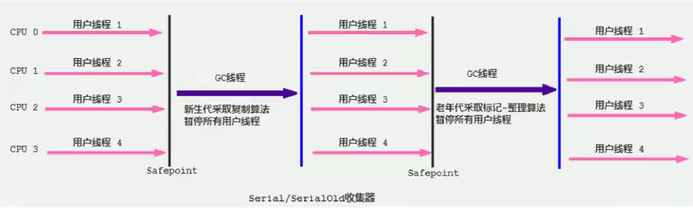 

- 简单高效（单线程）：对于限定单核CPU的环境，Serial GC没有线程交互的开销，有最高的单线程收集效率。

> 可用内存不大时（几十MB`~`一两百MB），可以较短时间内完成GC（几十ms`~`一百多ms），只要不频繁发生，使用串行回收器是可以接收的。

- 指定新生代、老年代都使用串行回收器：

```
-XX:+UseSerialGC
```

### ParNew GC

- ParNew GC：年轻代的多线程垃圾收集器。并行回收、复制算法、STW。

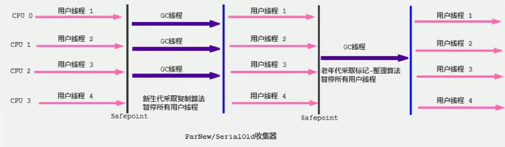

```
-XX:+UseParNewGC 指定年轻代使用ParNewGC，不影响老年代
-XX:ParallelGCThreads 限制线程数量，默认开启和CPU数据相同的线程数
```

### Parallel Scavenge GC、Parallel Old GC

> JDK8默认的GC：Pallele Scavenge GC、Pallel Old GC。

- Parallel Scavenge GC：年轻代的多线程垃圾收集器。复制算法、并行回收、STW。
- Parallel Scavenge GC与ParNew GC区别：
  - Parallel Scavenge GC目标是达到一个可控制的吞吐量（吞吐量优先）。
  - Parallel Scavenge GC的自适应调节策略。

> 高吞吐量：适合后台运算而不需要太多交互的任务。（服务器环境）
> 
> - 执行批量处理、订单处理、工资支付、科学计算等。

- Parallel Old GC：老年代的多线程垃圾收集器。Mark-Sweap、并行回收、STW。

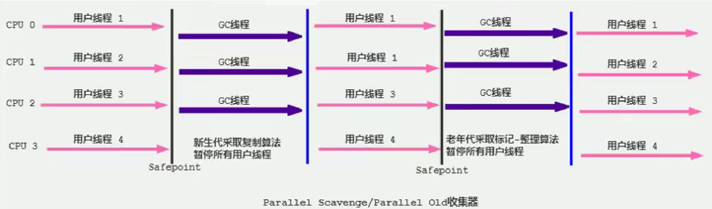

- 开启Parallel GC：默认开启。相互激活：以下参数开启一个，另一个也会被开启

```
-XX:+UseParallelGC 年轻代使用Parallel Scavenge GC
-XX:+UseParallelOldGC 老年代使用Parallel Old GC
```

- 设置年轻代Parallel Scavenge GC的线程数，一般最好与CPU数相等。
  - 当CPU数量小于8，PrallelGCThreads值 = CPU_COUNT。
  - 当CPU数量大于8，PrallelGCThreads值 = 3 + [5 * CPU_COUNT / 8]。

```
-XX:ParallelGCThreads
```

- 最大STW时间（ms）：垃圾收集器工作时会调整Java堆大小、其他参数，谨慎使用。

```
-XX:MaxGCPauseMillis
```

- GC时间占总时间的比例： 1 / (N + 1)。
  - 取值范围：（0，100）。默认99，即GC时间不超过1%。
  - -XX:MaxGCPauseMillis值越大，-XX:GCTimeRatio越容易超过设定的比例。

```
-XX:GCTimeRatio
```

- 设置Parallel的自适应调节机制。
  - JVM自动调整年轻代大小、Eden和Survivor的比例、晋升老年代的对象年龄阈值等参数，从而达到在堆大小、吞吐量、停顿时间的平衡点。

```
-XX:+UseAdaptiveSizePolicy
```

### CMS GC

- CMS GC（Concurrent-Mark-Sweap GC）：并发收集器，垃圾收集线程和用户线程同时工作。Mark-Sweep，STW。关注低延迟。

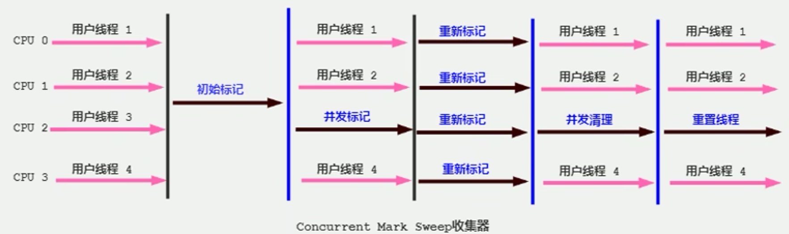

1. 初始标记阶段（Initial-Mark）：短暂的STW、仅仅只是标记GC Roots的直接关联对象。
2. 并发标记阶段（Concurrent-Mark）：从GC Roots的直接关联对象开始遍历整个对象图的过程，耗时长、但不需要停顿用户线程。
3. 重新标记阶段（Remark）：修正并发标记阶段，因用户线程继续运行而导致标记产生变动的那一部分对象的标记记录。
4. 并发清除阶段（Cocurrent-Sweep）：清理标记阶段判断已经死亡的对象。
   - 由于并发：CMS不能移动存活的对象，只能清除已经死亡的对象。故不能使用Mark-Compact。
- 由于部分阶段并发而没有STW，CMS回收过程中需要确保用户线程有足够的可用内存：CMS不能等到老年代几乎被填满时才回收，而是当堆内存使用率达到某一阈值时，便开始回收。
  - 如果CMS运行期间预留的内存无法满足需要，则“Concurrent Mode Failure”，启动后备方案：临时启用Serial Old GC来重新进行老年代的垃圾收集。
1. 内存碎片。
2. 对CPU资源敏感：占用一部分线程，吞吐量降低。
3. 无法处理浮动垃圾：“Concurrent Mode Failure”失败而导致另一次Full GC。并发标记阶段如果产生新的垃圾对象，CMS将无法对这些垃圾对象进行标记，最终导致这些新产生的垃圾对象没有被及时回收。

| 参数                                 | 说明                                                                                                         |
| ---------------------------------- | ---------------------------------------------------------------------------------------------------------- |
| -XX:+UseConcMarkSweepGC            | 指定使用CMS收集器，开启该参数后，自动打开-XX:+UseParNewGC。                                                                    |
| -XX:CMSInitiatingOccupanyFraction  | 设置堆内存使用率的阈值，一旦达到该阈值，则开始回收。<br />如果内存增长缓慢，则设置较大的阈值，降低Full GC的执行次数。反之，则设置较小的，避免触发Serial Old GC。              |
| -XX:+UseCMSCompactAtFullCollection | 指定执行Full GC之后对内存空间进行压缩整理                                                                                   |
| -XX:CMSFullGCsBeforeCompaction     | 设置执行多少次Full GC之后对内存空间进行整理                                                                                  |
| -XX:ParallelCMSThreads             | 设置CMS的线程数量，默认启动的线程数：(ParallelGCThreads + 3 ) /4。<br />ParallelGCThreads：年轻代并行收集器的线程数。-XX:ParallelGCThreads |

> 阈值：老年代的空间使用率（%）
> 
> - JDK5及之前：68
> - JDK6及之后：92

### G1 GC

#### 概述

- G1 GC（垃圾优先 Garbage First）：全功能的并行收集器。在延迟可控的情况下，获取尽可能高的吞吐量。
  - Jdk9之后的默认GC。

> 服务器端应用：多核CPU、大容量内存的机器。

| G1特点                                 | 说明                                                            |
| ------------------------------------ | ------------------------------------------------------------- |
| 并行与并发                                |                                                               |
| 分代收集                                 | 将堆空间分为年轻代、老年代，但不要求空间连续，不固定大小。<br />分为若干个Region，包含逻辑上的老年代、年轻代。 |
| 空间整合                                 | 回收以Region为单位，Region之间使用复制算法，整体使用Mark-Compact。                 |
| 可预测的停顿时间模型<br />（软实时：soft real-time） | 可指定在一个长度为M ms的时间片段内，消耗在垃圾收集的时间不得超过N ms。                       |

- HotSpot：GC线程处理速度慢时，G1 GC可以采用应用线程承担后台运行的GC工作，帮助加速垃圾回收过程。

| 参数                                 | 说明                                                                                          |
| ---------------------------------- | ------------------------------------------------------------------------------------------- |
| -XX:+UseG1GC                       | 指定使用G1 GC                                                                                   |
| -XX:G1HeapRegionSize               | 设置Region大小。值为2的n次方，范围：1 MB `~` 32 MB。<br />根据最小的Java堆大小划分出约2048个Region。<br />默认是堆内存的1/2000。 |
| -XX:MaxGCPauseMillis               | 设置期望达到的最大GC停顿时间（JVM尽量达到）。<br />默认200ms。                                                     |
| -XX:ParallelGCThread               | 设置并行垃圾回收工作线程数（STW），最多8。                                                                     |
| -XX:ConcGCThreads                  | 设置并发标记的线程数。<br />通常设置为并行垃圾回收线程数的1/4。                                                        |
| -XX:InitiatingHeapOccupancyPercent | 设置触发并发GC周期的Java堆占用率阈值。<br />默认45（%）。                                                        |

#### Region 分区

- 分区（Region）：将Java堆分割为约2048个独立区域（Region）（物理不连续），有计划地避免对整个Java堆全区域的垃圾收集。所有的Region大小相同，且在JVM生命周期内不会被改变。
- G1 GC每次根据允许的收集时间，优先回收价值最大的Region：G1跟踪各个Region里垃圾堆积的价值大小（回收所获得的空间大小、回收所需空间的经验值），在后台维护一个优先列表（指针碰撞、TLAB）。
- 老年代和新生代不再是物理隔离的，而是一部分Region的集合（可以物理不连续），通过Region的动态分配方式实现逻辑连续。

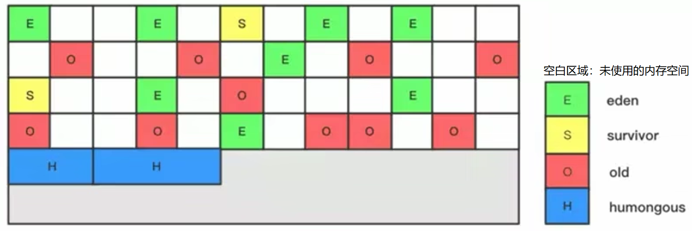

- 一个Region可能属于Eden、Survivor、Old/Tenured内存区域，但同一时刻一个Region只能属于一个角色。

> 如果一个Region在GC之前属于Eden区域，在GC之后可能属于Survivor区域。不能既是Eden、也是Survivor。

- Humongous内存区域：存储大对象，如果超过1.5个Region大小，则放到该内存区域。
  - 对于堆中的大对象，默认直接分配到老年代，但如果是短期存在的大对象，则不太合适。因此，G1划分Humongous区存放大对象，如果一个H区装不下一个大对象，则进行一次Full GC，再寻找连续的H区存放。

#### 回收过程

##### 概述

 

1. 应用程序分配内存，年轻代的Eden区用尽时，开始Young GC（并行的独占式收集器），从年轻代区间移动存活对象到Survivor区间、老年区间。

2. Java堆内存使用率达到阈值时（-XX:InitiatingHeapOccupancyPercent），开始老年代并发标记过程（Concurrent Marking）。

3. 标记完成后，开始Mixed GC：G1 GC从老年区间移动存活对象到空闲区间，不需要整个老年代都被回收，一次只需要扫描/回收一小部分老年代的Region（和年轻代一起被回收）。

##### Remembered Set 记忆集

- 一个Region中的对象有可能被其他任意Region中的对象引用，判断对象存活时，使用Remembered Set来避免全局扫描。

> 在没有Remmber Set的情况下：如果一个Eden区Region的对象被一个Old区Region的对象引用，在判断对象存活时，需要对整个Java堆扫描才能保证判断准确。

  

- 每个Region都有一个对应的Remember Set。
1. 每次Reference类型数据写操作时，都会产生一个Write Barrier暂时中断操作，检查将要写入的引用指向的对象是否和该Reference类型数据在不同的Region。
   - 其他收集器：检查老年代对象是否引用类新生代对象。
2. 如果不同，通过CardTable把相关引用信息记录到引用指向对象的所在Region对应的Remember Set中。
3. 垃圾收集时，在GC根节点的枚举范围加入Remember Set，保证不进行全局扫描、也不会有遗漏。

##### Young GC

1. 扫描GC Roots：根引用连同Remembered Set记录的外部引用作为扫描存活对象的入口。

2. 更新Remebered Set：处理Dirty Card Queue中的Card，更新Remembered Set。完成后，Remembered Set可以准确反映老年代对所在Region中对象的引用。
   
   > Dirty Card Queue：对于引用赋值语句obj.filed=obj，JVM在之前和之后执行特殊操作以在Dirty Card Queue中入队一个保存对象引用信息的Card。Young GC时，G1 GC对Dirty Card Queue中所有的Card进行处理，以更新Remember Set，保证Remember Set准确反映老年代的对象引用。
   > 
   > - 如果直接在引用赋值语句处更新Remember Set，则需要线程同步，开销大。

3. 处理RememberSet：识别被老年代指向的Eden中的对象，认为是存活的对象。

4. 复制对象：对象树被遍历，Eden区Region中存活的对象会被复制到Survivor区中空的Region；Survivor区Region中存活的对象如果年龄未达到阈值，则年龄+1，达到阈值则被复制到Old区中空的Region。如果Survivor区空间不足，Eden区的部分数据会直接晋升到老年代空间。

5. 处理引用：最终Eden区空间的数据为空，GC停止工作，目标内存中的对象都是连续存储的，没有碎片。

##### Concurrent Marking

1. 初始标记阶段：标记从根结点直接可达的对象。STW、触发一次Young GC。
2. 根区域扫描（Root Region Scanning）：G1 GC扫描Survivor区直接可达的老年代Region对象，并标记被引用的对象。必须在Young GC之前完成。
3. 并发标记（Concurrent Marking）：在整个Java堆中进行并发标记（与应用程序并发执行），可能被Young GC中断。在该阶段，若发现Region中的所有对象都是垃圾，则该Region被立即回收。同时，计算每个Region中的对象活性。
4. 再次标记（Remark）：由于应用程序持续执行，需要修正上次的标记结果，STW。初始快照算法（snapshot-at-the-beginnig SATB）。
5. 独占清理（cleanup、STW）：计算各个Region的存活对象和GC回收比例，并进行排序，识别可以混合回收的Region。并不进行垃圾收集。
6. 并发清理阶段：识别并清理完全空闲的Region。

##### Mixed GC

- Mixed GC：回收整个Young Region、部分Old Region。

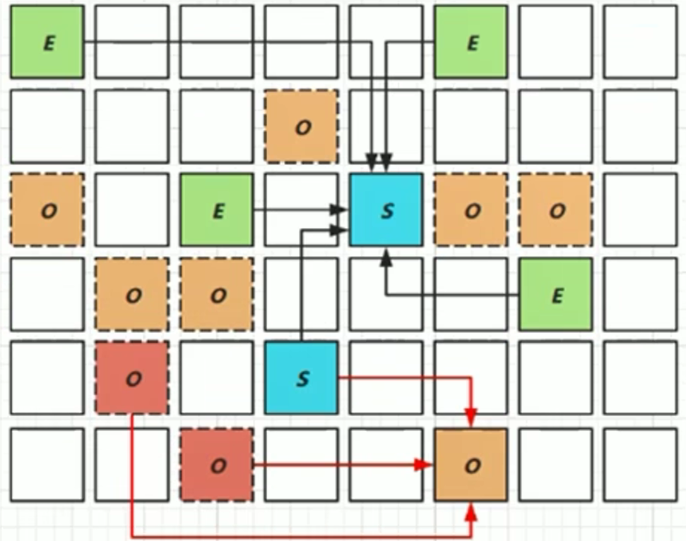 

- Concurrent Marking之后，老年代中完全为垃圾的Region被回收，部分为垃圾的Region被计算出来，这些Old Region会分8次（默认8次）被回收，复制算法。

```
-XX:G1MixedGCCountTarget
```

- Mixed GC不一定要进行8次：如果发现可以回收的垃圾占堆内存的比例低于10%（阈值默认10%），则不再进行Mixed GC。

```
-XX:G1HeapWastePercent
```

- 混合回收的回收集（Collection Set）包括：1/8的Old Region、Eden Region、Survivor Region。

- G1优先收集垃圾多的Region：垃圾占比越高（阈值默认为65%），越先被回收。垃圾占Region比例达到65%时才会被回收，如果垃圾占比太低、存活的对象占比高，则复制时需要花费更多的时间。

```
-XX:G1MixedGCLiveThresholdPercent
```

##### Full GC（可选后备）

1. 回收（Evacuation）时没有足够的to-space存放晋升的对象。
2. 并发处理过程完成之前空间耗尽。

#### 相关建议

- 年轻代大小：避免使用-Xmn、-XX:NewRatio等参数显示设置年轻代大小。固定年轻代的大小会覆盖暂停时间目标（Young GC可能来不及完成，从而延长时间）。
- 暂停时间目标不要过于苛刻：G1 GC的吞吐量目标是90%的应用程序时间和10%的垃圾回收时间。目标过于苛刻意味着更多的垃圾回收开销、直接影响吞吐量。

## 垃圾收集器

### Epsilon GC

- Epsilon GC：No-Op（无操作）

### Shenandoah GC

- Shenandoah GC：低延迟。其暂停时间与堆大小无关。高运行负担下的吞吐量下降。

### ZGC

- ZGC目标：在尽可能对吞吐量影响不大的前提下，实现在任意堆大小下都可以把垃圾收集的停顿时间限制在10ms以内的低延迟。
- ZGC：可并发的Mark-Compact。
1. 并发标记：仅初始标记时STW。
2. 并发预备重分配。
3. 并发重分配。
4. 并发重映射。

```
-XX:+UseZGC
```

## GC日志

| 参数                     | 说明                                          |
| ---------------------- | ------------------------------------------- |
| -XX:+PrintGC           | 输出GC日志<br />-verbose:gc                     |
| -XX:+PrintGCDetails    | 输出GC详细日志                                    |
| -XX+PrintGCTimeStamps  | 输出GC时间戳（基准时间）                               |
| -XX:+PrintGCDateStamps | 输出GC时间戳（日期：2013-05-04T21:53:59.234+0800）    |
| -XX:+PrintheapAtGC     | 输出GC前后的堆信息                                  |
| -Xloggc:路径             | 日志文件的输出路径<br />GCeasy、GCviewer等工具对导出的日志文件分析 |

| 名词                                                   | 说明                                                                                                  |
| ---------------------------------------------------- | --------------------------------------------------------------------------------------------------- |
| [GC]<br />[Full GC]                                  | GC停顿类型：Full GC说明发生STW                                                                               |
| [DefNew]                                             | Serial GC对应新生代名称：Default New Generation                                                             |
| [ParNew]                                             | ParNew GC对应新生代名称：Parallele New Generation                                                           |
| [PSYoungGen]                                         | Parallel Scavenge GC对应新生代名称                                                                         |
| [garbage-first heap]                                 | G1 GC                                                                                               |
| Allocation Failure                                   | 引起GC的原因：年轻代中没有足够的空间存储新的数据                                                                           |
| Ergonomics                                           |                                                                                                     |
| [PSYoungGen:  5986K->696K(870K)]  5986K->704K(9216K) | [PSYoungGen:  5986K->696K(870K)]  ：GC回收前年轻代大小->回收后大小<br />5986K->704K(9216K)：GC回收前年轻代、老年代总大小->回收后大小 |
| [Times: user=0.00 sys=0.00, real=0.00 secs]          | user：用户态回收耗时<br />sys：内核态回收耗时<br />real：实际耗时，user+sys可能会大于real。                                     |

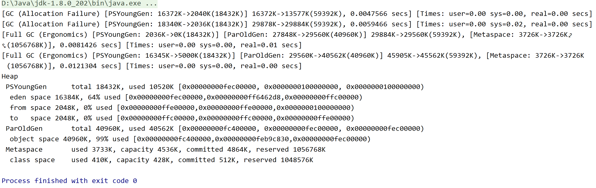


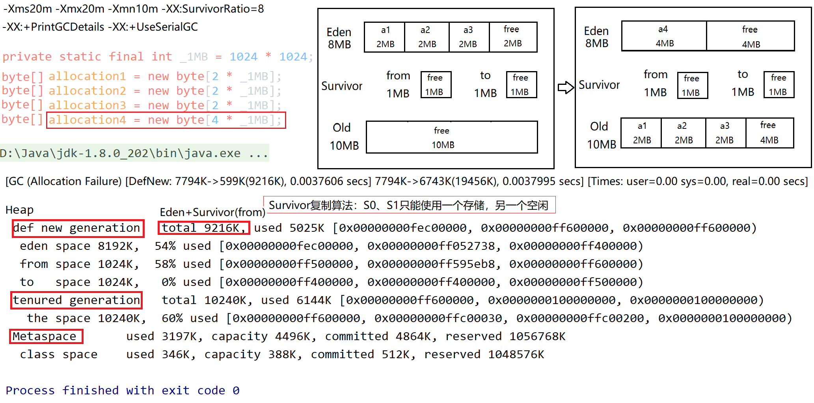

# 字节码和类的加载

## Class文件

- JVM只与Class文件相关联，而不和任何语言绑定。（包括Java）

### 前端编译器

- 前端编译器（javac）：将java代码转换为符合JVM规范的字节码文件。不涉及代码编译优化。
  1. 词法解析。
  2. 语法解析。
  3. 语义解析。
  4. 生成字节码。

 

| 前端编译器                          | 说明      |
| ------------------------------ | ------- |
| javac                          | 默认，全量编译 |
| ECJ（Eclipse Compiler for Java） | 增量编译    |

### Class文件解读

- 字节码文件（.class）：二进制的类文件，内容为JVM指令。

- 字节码指令（byte code）：JVM的指令由一个字节长度的、代表某种特定操作含义的操作码（opcode）以及跟随其后的零至多个代表此操作所需参数的操作数（operand）所构成。
  
  ```java
  javap -v Test.class > E:/test.txt
  ```

```java
Fathor f = new Son();
System.out.println(f.x);
//Son:0 默认初始化值
//Son:30
//20 多态性：属性没有多态
```

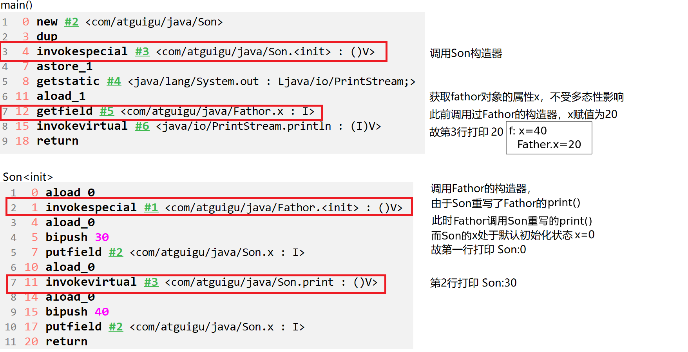

```java
class Fathor{

    private int x = 10;

    public Fathor(){
        this.print();
        x = 20;
    }

    public void print(){
        System.out.println("Fathor:" + x);
    }
}

class Son extends Fathor{

    private int x = 30;

    public Son(){
        //隐藏 super();
        this.print();
        x = 40;
    }

    public void print(){
        System.out.println("Son:" + x);
    }
}
```

### Class文件结构

- Class文件：对应唯一一个类/接口的定义信息，是一组8字节的二进制流，不一定以磁盘文件格式存在。
- Class文件只有两种数据类型：无符号数、表。

| 数据类型 | 说明                                                         |
| -------- | ------------------------------------------------------------ |
| 无符号数 | 基本数据类型：u1、u2、u4、u8分布代表1B、2B、4B、8B的无符号数。<br />无符号数可以描述数字、索引引用、数量值、字符串值（UTF-8）。 |
| 表       | 复合数据类型：多个无符号数、其他表构成。<br />表无固定长度：需要标识位说明表的长度<br />习惯：以“\_info”结尾。<br />描述有层次关系的复合结构的数据：Class文件相当于一个表。 |

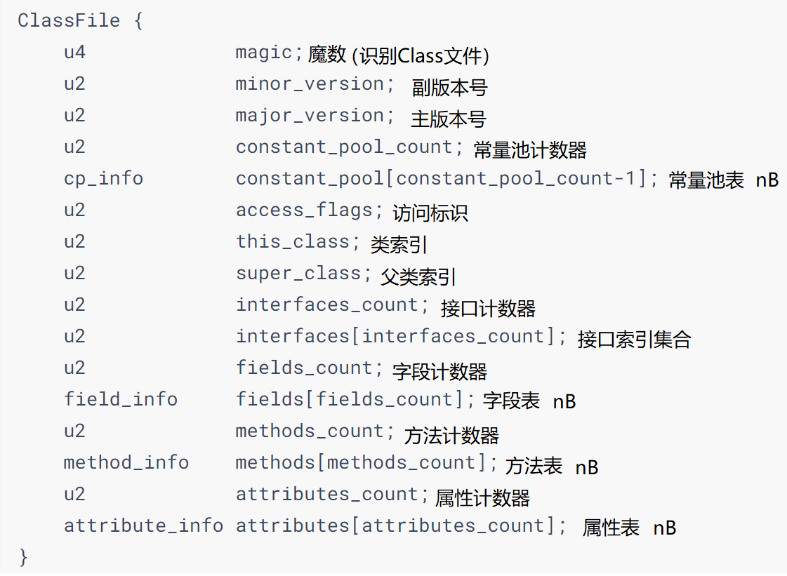

#### magic 魔数

- magic：Class文件的标识符（而不是文件扩展名识别），固定为0xCAFEBABE。

#### major_version minor_version 版本号

- Java版本号：major\_version.minor\_version，从45开始，JDK1.1之后每个JDK版本发布，其对应的主版本号+1.（46-1.2）
- 不同版本的Java编译器编译的Class文件对应的版本不同（向下兼容），高版本JVM可以执行低版本编译器生成的Class文件；但低版本JVM不能执行高版本编译器生成的Class文件：JDK1.k的JVM对应的class文件版本号范围：45.0\~44+k.0。

#### 常量池

- 常量池集合：一个前置的容量计数器（constant\_pool\_count）和若干个连续的数据项（constant\_pool）。
- constant\_pool\_count 常量池计数器：常量池中常量的数量是不固定的，需要在常量池的入口放置一项u2类型的无符号数，代表常量池容量计数值（从1开始计数）。
  - constant\_pool\_count=1对应常量池中有0个常量项。从1开始计数，将第0项常量空置，以满足后续某些指向常量池的索引值的数据在特定情况下需要表达“不引用任何一个常量池项目”的含义（索引0）。
- constant\_pool：常量池表项主要存放编译器生成的各种字面量（Literal）、符号引用（Symbolic References），在类加载后进入方法区的运行时常量池中存放。
  - 标记字节（tag byte）：常量池中的每一项的第一个字节都为类型标记，用于确定该项的格式。

| 主要存储常量 | 具体类型                                    |
| ------ | --------------------------------------- |
| 字面量    | 文本字符串<br />声明为final的常量值                 |
| 符号引用   | 类/接口的全限定名<br />字段的名称和描述符<br />方法的名称和描述符 |

```java
package com.atguigu.java1;

public class Demo {
    private int num = 1;

    public int add(){
        num = num + 2;
        return num;

    }
}
```

> Hexviewer查看十六进制文件：.class。

[详细常量类型和结构、Demo字节码的解析.xlsx](../../attach/JVM/常量类型和结构.xlsx)

##### 符号引用、描述符

| 符号引用 | 说明                                               |
| ---- | ------------------------------------------------ |
| 全限定名 | 全类名：com.zjk.demo1<br />全限定名：com/zjk/demo1;（分号结尾） |
| 简单名称 | 没有类型、参数修饰的方法/字段名称：public void add() --> add      |
| 描述符  | 描述字段的数据类型、方法的参数列表（数量、类型、顺序）、返回值。                 |

| 描述符   | 说明                                                              |
| ----- | --------------------------------------------------------------- |
| B     | byte                                                            |
| C     | char                                                            |
| D     | double                                                          |
| F     | float                                                           |
| I     | int                                                             |
| **J** | **long**                                                        |
| S     | short                                                           |
| **Z** | **boolean**                                                     |
| V     | void                                                            |
| **L** | **对象类型，如：Ljava/lang/Object;**                                   |
| `[`   | 数组类型：<br />一维数组：`int[] --> [I`<br />二维数组：`int[][] --> [[I`，以此类推 |

```java
Object[] arr = new Object[10];
System.out.println(arr);//[Ljava.lang.Object;@1540e19d

String[] arr1 = new String[10];
System.out.println(arr1);//[Ljava.lang.String;@677327b6

long[][] arr2 = new long[10][];
System.out.println(arr2);//[[J@14ae5a5
```

- JVM在加载Class文件时才会进行动态链接：Class文件中不会保存各个方法和字段的最终内存布局信息，这些方法和字段的符号引用需要经过转换才能被JVM直接使用。当JVM运行时，需要从常量池中获得对应的符号引用，再在类加载过程中的解析阶段将其替换为直接引用，并翻译到具体的内存地址中。

| 类型   | 说明                                                                                                                       |
| ---- | ------------------------------------------------------------------------------------------------------------------------ |
| 符号引用 | 以一组符号来描述所引用的目标，符号可以是任何形式的字面量，只要使用时能无歧义地定位到目标即可。<br />符号引用与JVM实现的内存布局无关，引用的目标不一定已经加载到内存中。                                 |
| 直接引用 | 可以是直接指向目标的指针、相对偏移量，或是能间接定位到目标的句柄。<br />直接引用与JVM实现的内存布局相关，同一个符号引用在不同JVM实例上翻译出来的直接引用一般不相同。<br />如果存在直接引用，则引用的目标必定已经存在于内存中。 |


##### 存放类型

| tag（u1） | 常量池存放的类型                                             | 结构                                                         |
| --------- | ------------------------------------------------------------ | ------------------------------------------------------------ |
| 01        | CONSTANT\_utf8\_info<br />UTF-8编码的字符串                  | lenth（u2）：UTF-8编码字符串占用的字符数<br />bytes（u lenth）:长度为length的UTF-8编码的字符串 |
| 03        | CONSTANT\_Integer\_info<br />整型字面量                      | bytes（u4）：按照高位在前存储的int值                         |
| 04        | CONSTANT\_Float\_info<br />浮点型字面量                      | bytes（u4）：按照高位在前存储的float值                       |
| 05        | CONSTANT\_Long\_info<br />长整型字面量                       | bytes（u8）：按照高位在前存储的long值                        |
| 06        | CONSTANT\_Double\_info<br />双精度浮点型字面量               | bytes（u8）：按照高位在前存储的double值                      |
| 07        | CONSTANT\_Class\_info<br />类/接口的符号引用                 | index（u2）：指向全限定名常量项的索引                        |
| 08        | CONSTANT\_String\_info<br />字符串类型字面量                 | index（u2）：指向字符串字面量的索引                          |
| 09        | CONSTANT\_Fieldref\_info<br />字段的符号引用                 | index（u2）：指向CONSTANT\_Class\_info的索引项<br />index（u2）：指向CONSTANT\_NameAndType的索引项 |
| 10（0a）  | CONSTANT\_Method\_info<br />类中方法的符号引用               | index（u2）：指向CONSTANT\_Class\_Info的索引项<br />index（u2）：指向CONSTANT\_NameAndType的索引项 |
| 11（0b）  | CONSTANT\_InterfaceMethodref\_info<br />接口中方法的符号引用 | index（u2）：指向CONSTANT\_Class\_Info的索引项<br />index（u2）：指向CONSTANT\_NameAndType的索引项 |
| 12（0c）  | CONSTANT\_NameAndType\_info<br />字段/方法的符号引用         | index（u2）：指向该字段或方法名称常量项的索引<br />index（u2）：指向该字段或方法描述符常量项的索引 |
| 15（0f）  | CONSTANT\_MethodHandle\_info<br />方法句柄                   | reference\_kind（u1）：值必须在1-9之间，决定了方法句柄的类型，表示方法句柄的字节码行为<br />reference\_index（u2）：对常量池的有效索引 |
| 16（10）  | CONSTANT\_MethodType\_info<br />标识方法类型                 | descriptor\_index（u2）：对常量池的有效索引，该索引项必须是CONSTANT\_Utf8\_info |
| 18（12）  | CONSTANT\_InvokeDynamic\_info<br />一个动态方法调用点        | bootstrap\_method\_attr（u2）：对当前Class文件中引导方法表的bootstrap\_methods\[\]数组的有效索引<br />name\_and\_type\_index（u2）：对当前常量池的有效索引，该索引项必须是CONSTANT\_NameAndType\_Info |

#### 访问标识

| Flag Name       | Value  | Interpretation                                               |
| --------------- | ------ | ------------------------------------------------------------ |
| ACC\_PUBLIC     | 0x0001 | 标识为public类型                                             |
| ACC\_FINAL      | 0x0010 | 标识声明为final，只有类可以设置<br />与 ACC\_ABSTRACT冲突    |
| ACC\_SUPER      | 0x0020 | 标识允许使用invokespecial字节码指令的新语义<br />Jdk1.0.2之后默认为true，由于向后兼容 |
| ACC\_INTERFACE  | 0x0200 | 标识为接口。没有该标识的则是类：可具有除ACC\_ANNOTAION外所有标识<br />必须伴随ACC_ABSTRACT标识，<br />与ACC\_FINAL、ACC\_SUPER、ACC\_ENUM冲突 |
| ACC\_ABSTRACT   | 0x0400 | 是否为abstract类型对于接口/抽象类，此标识为true；其他类型为false |
| ACC\_SYNTHETIC  | 0x1000 | 标识此类并非用户代码产生，而是由编译器产生的类，没有对应源码 |
| ACC\_ANNOTATION | 0x2000 | 标识为注解<br />必须伴随ACC\_INTERFACE                       |
| ACC\_ENUM       | 0x4000 | 标识该类/其父类为枚举                                        |

#### 类索引、父类索引、接口索引集合

- 访问标识后，会指定该类的类别、父类类别、实现的接口

| 长度 | 含义                            | 说明                                                         |
| ---- | ------------------------------- | ------------------------------------------------------------ |
| u2   | this\_class                     | 该类的全限定名                                               |
| u2   | super\_class                    | 该类的父类的全限定名，只有java.lang.Object的父类索引为0<br />指向的不能是final类 |
| u2   | interfaces\_count               | 接口计数器，该类/接口的直接超接口数量                        |
| u2   | interfaces\[interfaces\_count\] | 该类实现的接口索引数组，每一项都是CONSTANT\_CLass\_info<br />0 `<=` i `<` interfaces\_count<br />interface各成员表示的接口顺序和对应源代码中给定的接口顺序相同（从左到右）：interface\[0\]对应最左边的接口 |

#### 字段表集合

- 字段（field）：类变量、实例变量，不包括局部变量。通过引用常量池中的常量描述，指向常量池索引集合，描述每个字段的完整信息。
  
  - Java中的字段不可重载，不能重名；而字节码中允许重名字段，只要描述符不一致即可。
  - 字段的信息（布尔值修饰符）：
    - 作用域（public、private、protected）
    - 实例变量/类变量（static）
    - 可变性（final）
    - 并发可见性（volatitle）
    - 可否序列化（transient）
    - 字段数据类型（基本数据类型、对象、数组）
    - 字段名称

- 字段表计数器（fileds\_count）u2：当前Class文件fields表的成员个数。

- 字段表集合（fields）：描述接口/类中声明的变量。
  
  - fields中的各个成员都是field\_info，只表示该类/接口所声明的所有类字段、实例字段。不包括局部变量、父类/接口中继承而来的字段。
  - fields有可能会列出原本Java代码中不存在的字段（内部类为保持对外部类的访问性，会自动添加指向外部类实例的字段）。

| 类型            | 名称              | 含义       | 数量              |
| --------------- | ----------------- | ---------- | ----------------- |
| u2              | acess\_flags      | 访问标识   | 1                 |
| u2              | name\_index       | 字段名索引 | 1                 |
| u2              | descripto\_index  | 描述符索引 | 1                 |
| u2              | attributes\_count | 属性计数器 | 1                 |
| attribute\_info | attributes        | 属性集合   | attributes\_count |

| acess_flags 字段表访问标识 | 标识值 | 含义           |
| -------------------------- | ------ | -------------- |
| ACC\_PUBLIC                | 0x0001 | public         |
| ACC\_PRIVATE               | 0x0002 | private        |
| ACC\_PROTECTED             | 0x0004 | protected      |
| ACC\_STATIC                | 0x0008 | static         |
| ACC\_FINAL                 | 0x0010 | final          |
| ACC\_VOLATILE              | 0x0040 | volatile       |
| ACC\_TRANSIENT             | 0x0080 | transient      |
| ACC\_SYNCHETIC             | 0x1000 | 编译器自动产生 |
| ACC\_ENUM                  | 0x4000 | enum           |

#### 方法表集合

- methods：指向常量池索引集合，完整描述每个方法的签名。字节码文件中，一个method对应一个类/接口中的方法信息。每个成员都是method\_info。
  - 只描述当前类/接口中声明的方法，不包括从父类/父接口继承的方法。
  - 有可能会出现由编译器自动添加的方法（类/接口初始化方法`<clinit>()`、实例初始化方法`<init>()`）。

| 类型         | 名称             | 含义       | 数量           |
| ------------ | ---------------- | ---------- | -------------- |
| u2           | acess\_flags     | 访问标识   | 1              |
| u2           | name\_index      | 方法名索引 | 1              |
| u2           | descripto\_index | 描述符索引 | 1              |
| u2           | methods\_count   | 方法计数器 | 1              |
| method\_info | attributes       | 方法集合   | methods\_count |

| acess_flags 字段表访问标识 | 标识值 | 含义         |
| -------------------------- | ------ | ------------ |
| ACC\_PUBLIC                | 0x0001 | public       |
| ACC\_PRIVATE               | 0x0002 | private      |
| ACC\_PROTECTED             | 0x0004 | protected    |
| ACC\_STATIC                | 0x0008 | static       |
| ACC\_FINAL                 | 0x0010 | final        |
| ACC\_SYNCHRONIZED          | 0x0020 | synchronized |
| ACC\_BRIDGE                | 0x0040 | bridge       |

- 方法计数器（methods\_count）u2：当前class文件中methods表的成员个数。

- 方法重载(Overload)：
  
  - Java语言中，除了要与原方法具有相同的简单名称之外，还要求必须拥有一个与原方法不同的特征签名（方法中各个参数在常量池中的字段符号引用的集合），而返回值不会包含在特征签名之中，Java语义无法仅仅依靠返回值的不同来对一个已有方法进行重载。
  - c1ass文件格式中，特征签名的范围更大一些，只要描述符不是完全一致的两个方法就可以共存。允许存放多个方法签名相同的方法，但这些方法之间的返回值不能相同。

#### 属性表集合

- 属性表集合（attributes）：class文件所携带的辅助信息、任何带有RetentionPolicy\.CLASS/RetentionPolicy\.RUNTIME的注解（用于JVM的验证和运行、Java程序的调试）。
  - 字段表、方法表中也有自己的属性表集合。
  - 属性表集合不要求具有严格的顺序，只要不与已有的属性名重复即可。任何实现的编译器都可以向属性表中写入自定义的属性信息，但JVM运行时会忽略其不认识的属性。

```java
ConstantValue_attribute{
    u2 attribute_name_index;
    u4 attribute_length; //常量该值恒为2
    u2 constantvalue_index;
}
```

- 属性表计数器（attributes\_count）：当前class文件属性表的成员个数。每项都是attribute\_info。

##### Code

| 类型                | 名称                     | 含义                     | 数量                  |
| ------------------- | ------------------------ | ------------------------ | --------------------- |
| u2                  | attribute\_name\_index   | 属性名索引               | 1                     |
| u4                  | attribute\_length        | 属性长度                 | 1                     |
| u2                  | max\_stack               | 操作数栈深度最大值       | 1                     |
| u2                  | max\_local               | 局部变量表所需的存续空间 | 1                     |
| u4                  | code\_length             | 字节码指令长度           | 1                     |
| u1                  | code                     | 存储字节码指令           | code\_length          |
| u2                  | exception\_table\_length | 异常表长度               | 1                     |
| exception_info      | exception\_table         | 异常表                   | exception\_length     |
| **u2**              | **attributes\_count**    | **属性表计数器**         | **1**                 |
| **attribute\_info** | **attributes**           | **属性表**               | **attributes\_count** |

- LineNumberTable\_attribute、LocalVariableTable\_attribute：

- LineNumberTable：可选变长属性，位于Code结构的属性表。用来描述Java源码行号与字节码之间的对应关系，在调试时定位代码执行的行数。

```java
LineNumberTable_attribute {
    u2 attribute_name_index;
    u4 attribute_length;
    u2 line_number_table_length;
    {   u2 start_pc; //字节码行号
        u2 line_number;     //Java源代码行号
    } line_number_table[line_number_table_length];
}
```

```java
LocalVariableTable_attribute {
    u2 attribute_name_index;
    u4 attribute_length;
    u2 local_variable_table_length;
    {   u2 start_pc;
        u2 length;
        u2 name_index;
        u2 descriptor_index;
        u2 index;
    } local_variable_table[local_variable_table_length];
}
```

##### SourceFile

- 附加属性（SourceFile）：

```java
SourceFile_attribute {
    u2 attribute_name_index;
    u4 attribute_length;
    u2 sourcefile_index;
}
```

### javap

> javac -g Xxx.java 
> 
> （IDE默认）生成所有相关信息：局部变量表信息等。

```
javap <options> <classes>
```

| javap参数                                              | 说明                                                         |
| ------------------------------------------------------ | ------------------------------------------------------------ |
| `--help -help -h -?`                                   | 输出此帮助消息                                               |
| `-version`                                             | 版本信息                                                     |
| `-v  -verbose`                                         | 输出附加信息（不显示私有信息）                               |
| `-l`                                                   | 输出行号和本地变量表                                         |
| -public<br />-protected<br />-package<br />-p -private | 仅显示公共类和成员<br />显示保护、公共的类和成员<br />（默认）显示程序包/受保护的/公共类和成员<br />显示所有类和成员 |
| -sysinfo                                               | 显示正在处理的类的系统信息（路径、大小、日期、SHA-256 散列） |
| -constants                                             | 显示最终常量                                                 |
| `--module <模块>, -m <模块>`                           | 指定包含要反汇编的类的模块                                   |
| `-J <vm-option>`                                       | 指定 VM 选项                                                 |
| `--module-path <路径>`                                 | 指定查找应用程序模块的位置                                   |
| `--system <jdk> `                                      | 指定查找系统模块的位置                                       |
| `--class-path <路径> `                                 | 指定查找用户类文件的位置                                     |
| ` -classpath <路径>   `                                | 指定查找用户类文件的位置                                     |
| `-cp <路径>  `                                         | 指定查找用户类文件的位置                                     |
| `-bootclasspath <路径> `                               | 覆盖引导类文件的位置                                         |
| `--multi-release <version>`                            | 指定要在多发行版 JAR 文件中使用的版本                        |
| -s                                                     | 输出内部类型签名                                             |
| -c                                                     | 对代码进行反编译                                             |

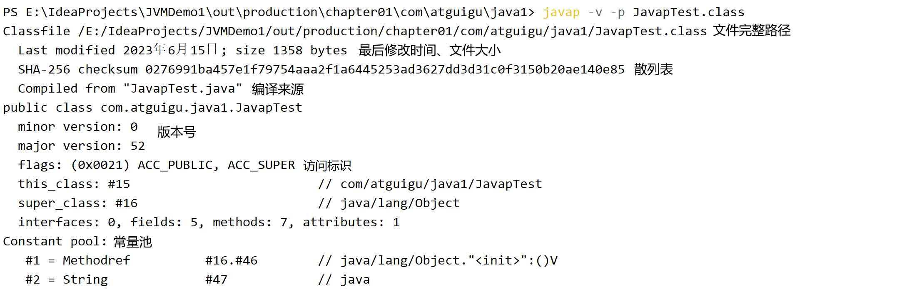

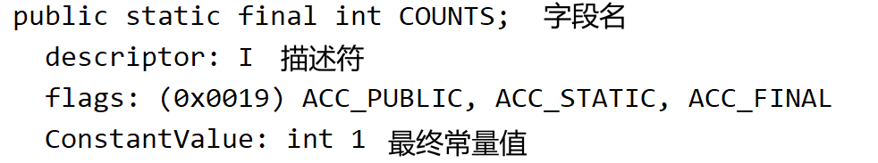 

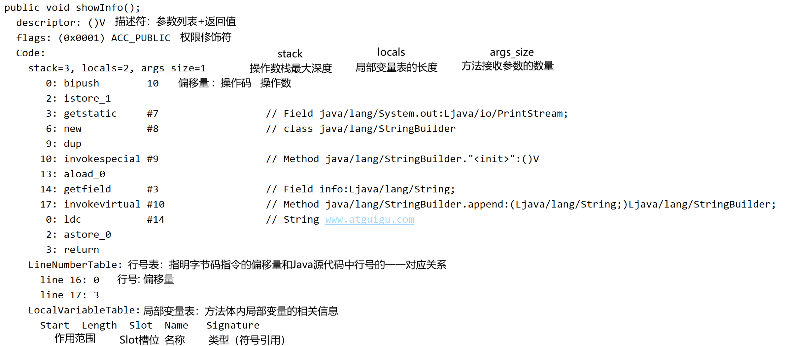

## 字节码指令集与解析

- 字节码指令（byte code）：JVM的指令由一个字节长度的、代表某种特定操作含义的操作码（opcode）以及跟随其后的零至多个代表次操作所需参数的操作数（operand）所构成。
  - JVM基于栈（操作数栈）：大多数指令不包含操作数。
  - 操作码的长度为1Byte（0\~255），指令集的操作码总数不得超过256 。
- 执行模型：

```java
do{
    自动计算PC寄存器的值+1;
    根据PC寄存器的指示位置，从字节码流中取出操作码;
    if(字节码存在操作数) 从字节码流中取出操作数;
    执行操作码所定义的操作;
}while(字节码长度 > 0)
```

- 操作码分类：
1. 与数据类型相关。
2. 没有明确指明操作类型的字母。
3. 与数据类型无关的。

| 操作码助记符<br />（数据类型相关） | 数据类型   |
| -------------------- | ------ |
| i                    | int    |
| l                    | long   |
| s                    | short  |
| b                    | byte   |
| c                    | char   |
| f                    | float  |
| d                    | double |

- 大多数对于boolean、byte、short、char类型数据的操作使用相应的int类型作为运算类型：大部分的指令不支持整数类型 byte、char、short，甚至没有指令支持boolean类型。编译器在编译期/运行期将byte、short类型的数据带符号扩展为相应的int类型（Sign-Extend），将boolean、char零位扩展为相应的int类型（Zero-Extend）。

- 字节码指令按用途分类：
1. 加载与存储指令。
2. 算术指令。
3. 类型转换指令。
4. 对象的创建与访问指令。
5. 方法调用与返回指令。
6. 操作数栈管理指令。
7. 比较控制指令。
8. 异常处理指令。
9. 同步控制指令。

### 加载和存储指令

- 加载和存储指令：将数据从栈帧的局部变量表和操作数栈之间来回传递。

 

| 常用指令                       | 说明                                                         |
| ------------------------------ | ------------------------------------------------------------ |
| 局部变量压栈指令               | `xload`<br />`xload_<n>`：x（i、l、f、d、a），n（0\~3）      |
| 常量入栈指令                   | bipush<br />sipush<br />ldc<br />ldc_w<br />ldc2_w<br />aconst_null<br />iconst_m1<br />`iconst_<i>`<br />`lconst_<l>`<br />`fconst_<f>`<br />`dconst_<d>` |
| 出栈装入局部变量表指令         | xstore<br />`xstore_<n>`：x（i、l、f、d、a），n（0\~3）<br />xastore：x（i、l、f、d、a、b、c、s） |
| 扩充局部变量表的访问索引的指令 | wide                                                         |

- 对于表面上没有出操作数的指令，不需要进行取操作数的动作，其操作数隐含在指令中。

> 将局部变量表中索引为0位置上的数据压入操作数栈：
> 
> iload\_0：只有操作码，只要1B空间。
> iload 0：操作码+操作数，需要2B空间。

- 操作数栈（Operand Stacks）：执行每一条指令之前，JVM要求该指令的操作数已经被压入操作数栈中。在执行指令时，JVM会将该指令所需的操作数弹出，并且将该指令的结果重新压入栈中。

 

- 局部变量表（Local Variables）：字节码程序将计算的结果缓存在局部变量表中。JVM实际上将局部变量表当作数组，依次存放this指针（非静态方法）、所传入的参数、字节码中的局部变量。
  - long、double占用2个Slot，1个Slot占4Byte。

 

#### 局部变量压栈指令

| 指令        | 说明                                                         |
| ----------- | ------------------------------------------------------------ |
| `xload_<n>` | 向操作数栈压入局部变量表中第n个索引位置的操作数<br />n一般预定义为0\~3 |
| `xload`     | 向操作数栈压入局部变量表中第n个索引位置的操作数              |

 

#### 常量入栈指令

- 常量入栈指令：将常数压入操作数栈。根据数据类型、入栈内容不同，分为const系列、push系列、ldc系列指令。

| const指令     | 范围          | 对特定常量入栈，入栈的常量隐含在指令本身                     |
| ------------- | ------------- | ------------------------------------------------------------ |
| iconst\_\<n\> | \-1\~5        | iconst\_m1：将-1压入操作数栈。<br />iconst\_1：将1压入操作数栈。 |
| lcons\_\<n\>  | 0\~1          | lconst\_0：将长整数0压入操作数栈。<br />lconst\_1：将长整数1压入操作数栈。 |
| fconst\_\<n\> | 0\~2          | fconst\_0 ：将浮点数0压入操作数栈。<br />fconst\_1 ：将浮点数1压入操作数栈。<br />fconst\_2 ：将浮点数2压入操作数栈。 |
| dconst\_\<n\> | 0\~1          | fconst\_0 ：将双精度数0压入操作数栈。<br />fconst\_1 ：将双精度数1压入操作数栈。 |
| aconst\_null  | null          | 将null压入操作数栈                                           |
| **push指令**  | **范围**      | **将参数压入栈，接收数据类型：int、short、byte**             |
| bipush        | -128\~127     | 8位整数                                                      |
| sipush        | -32768\~32767 | 16位整数                                                     |
| **ldc指令**   | **范围**      | **将指定的内容压入堆栈。**                                   |
| ldc           |               | 接收一个8位参数（int、float、String）。<br />该参数指向常量池中的int、float、String的索引 |
| ldc\_w        |               | 接收两个8位参数（int、float、String）。                      |
| ldc2\_w       | -             | 接收两个8位参数（long、double）。                            |

> iconst 6：错误（超过范围），应该为：bipush 6

#### 出栈装入局部变量表指令

| store指令    | 将操作数栈中栈顶元素弹出后，装入局部变量表的指定位置，用于给局部变量表赋值。 |
| ------------ | ------------------------------------------------------------ |
| xstore       | 没有隐含参数信息，需要提供一个byte类型参数指定目标局部变量表中的位置。 |
| xstore\_\<n\> | x：i、l、f、d、a<br />n：0\~3<br />istore\_n：从操作数栈中弹出一个整数，并将其赋值给局部变量表中索引n位置。 |
| xastore      | x：i、l、f、d、a、b、c、s                                    |

 

### 算术指令

#### 算术指令

- 算术指令：对操作数栈上的两个值进行某种特定运算，并将结果重新压入操作数栈。

| 实际类型      | 运算类型      |
| ------------- | ------------- |
| boolean、char | int           |
| short、byte   | int           |
| int           | int           |
| float         | float         |
| reference     | reference     |
| returnAddress | returnAddress |
| long          | long          |
| double        | double        |

- 运算时的溢出：AirthmeticException（除数为0）。

| 运算模式        | 说明                                                                                |
| ----------- | --------------------------------------------------------------------------------- |
| 向最接近数舍入     | 浮点数运算时，所有的运算结果必须舍入到适当的精度，非精度结果必须舍入为可被表示的最接近的精确值。如果有两种可表示的形式与该值一样接近，将优先选择最低有效位为0的。 |
| 向零舍入（floor） | 将浮点数转换为整数时，将在目标数值类型中选择一个最接近，且不大于原值的数字作为最精确的舍入结果。                                  |

- NaN：没有明确的数学定义的操作结果。

```java
double x = 10 / 0; //AirthmeticException
double y = 10 / 0.0; //Infinity
double z = 0.0 / 0.0; //NaN
```

| 类型     | 算术指令                            |
| -------- | ----------------------------------- |
| 加法指令 | iadd、ladd、fadd、dadd              |
| 减法指令 | isub、lsub、fsub、dsub              |
| 乘法指令 | imul、lmul、fmul、dmul              |
| 除法指令 | idiv、ldiv、fdiv、ddiv              |
| 求余指令 | irem、lrem、frem、drem              |
| 取反指令 | ineg、lneg、fneg、dneg              |
| 自增指令 | iinc（`iinc 局部变量表索引 by 值`） |

> short、byte等类型，short以int类型在进行自增时，最后需要将结果转回short（i2s），故没有使用iinc，而是iadd。
>
> ```java
> short i = 0;
> while(i < 100){
>     i++;
> }
> ```


#### 位运算指令

| 类型       | 位运算指令                               |
| ---------- | ---------------------------------------- |
| 位移指令   | ishl、ishr、iushr<br />lshl、lshr、lushr |
| 位或指令   | ior、lor                                 |
| 位与指令   | iand、land                               |
| 位异或指令 | ixor、lxor                               |

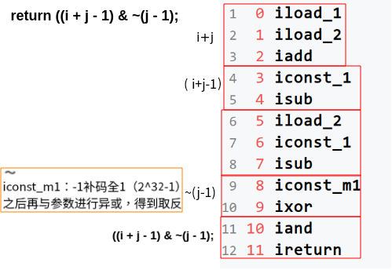 

#### 比较指令

| 比较指令         | 从栈中弹出两个操作数用于比较，将比较结果入栈（int）          |
| ---------------- | ------------------------------------------------------------ |
| fcmpg<br />fcmpl | 若a==b，则压入0；若a&gt;b，则压入1；若a&lt;b，则压入-1。（a先压入，b在栈顶）<br />遇到NaN时，fcmpg指令压入1，而fcmpl指令压入-1。 |
| dcmpg<br />dcmpl | dcmpg指令和dcmpl指令同理fcmpl指令、fcmpg指令。               |
| lcmp             | long类型整数没有NaN，故只需要lcmp指令。                      |

> 只有数值类型才能用于比较指令比较大小，boolean、引用数据类型不能用于比较指令比较大小。

### 类型转换指令

- 类型转换指令：将两种不同的数值类型进行相互转换。

1. 显示类型转换。
2. 处理字节码指令集中数据类型相关指令无法与数据类型一一对应问题。

#### 宽化类型转换

- 宽化类型转换（widening numeric conversion）：小范围类型至大范围类型的安全转换（不需要指令执行）。

| 转换类型         | 目标类型                    | 指令                  |
| ---------------- | --------------------------- | --------------------- |
| int、short、byte | long<br />float<br />double | i2l<br />i2f<br />i2d |
| long             | float<br />double           | l2f<br />l2d          |
| float            | double                      | f2d                   |

- int --> long --> float --> double。

- 精度损失问题：（JVM不抛出异常）
  
  - 宽化类型转换不会因为超过目标类型最大值而丢失信息。
  - int/long-->float、long-->double，可能会发生精度丢失（丢失几位最低位的数值），转换后的浮点数构建IEEE754最接近舍入模式所得到的正确整数值。

```java
float f = 123123123; //1.2312312E8：即123123120
double d = 123123123123123123L; //1.2312312312312312E17：即123123123123123120
```

- byte、char、short不存在到int的宽化类型转换：byte、short被JVM看作int处理。

 

#### 窄化类型转换

| 转换类型   | 目标类型                      | 指令                    |
| ------ | ------------------------- | --------------------- |
| int    | byte<br />short<br />char | i2b<br />i2s<br />i2c |
| long   | int                       | l2i                   |
| float  | int<br />long             | f2i<br />f2l          |
| double | int<br />long<br />float  | d2i<br />d2l<br />d2f |


- 精度损失问题：（JVM不抛出异常）可能导致转换结果具备不同的正负号、不同的数量级。
  - 上限溢出、下限溢出、精度丢失。

```java
short s = 128;
byte b = (byte)s;
System.out.println(b); //-128
```

- 浮点数（float/double）转换为整数（int/long）：
1. 如果浮点值为NaN：转换结果为int/long的0。
2. 如果浮点值不是无穷大：使用IEEE754的向零舍入模式取整，获得整数值。如果该整数值在目标类型（int/long）表示范围内，则转换结果为该整数值；否则，根据该整数值的符号，转换为目标类型（int/long）所能表示的最大/最小正数。
2. 如果是double/float的最大值/最小值则转换为int/long中的最大值/最小值。
- double窄化转换为float：向最接近舍入模式舍入一个可使用float表示的数字。
1. 如果转换结果的绝对值太小而无法用float表示：返回float的正负0。

2. 如果转换结果的绝对值太大而无法用float表示：返回float的正负无穷大。

3. double类型的NaN值：按规定转换为float类型的NaN值。

### 对象的创建与访问指令

#### 创建指令

- 创建指令：JVM对类实例、数组的创建与操作使用不同的字节码指令。

| 类型  | 创建指令                                        | 说明                                              |
| --- | ------------------------------------------- | ----------------------------------------------- |
| 类实例 | new                                         | 接收一个指向常量池索引的操作数，表示要创建的类型。<br />执行完毕后，将对象的引用压入栈。 |
| 数组  | newarray<br />anewarray<br />multianewarray | 基本类型数组<br />引用类型数组<br />多维数组                    |

 

#### 字段访问指令

| 字段类型        | 指令                       |
| ----------- | ------------------------ |
| 类字段（static） | getstatic<br />putstatic |
| 类实例字段       | getfield<br />putfield   |

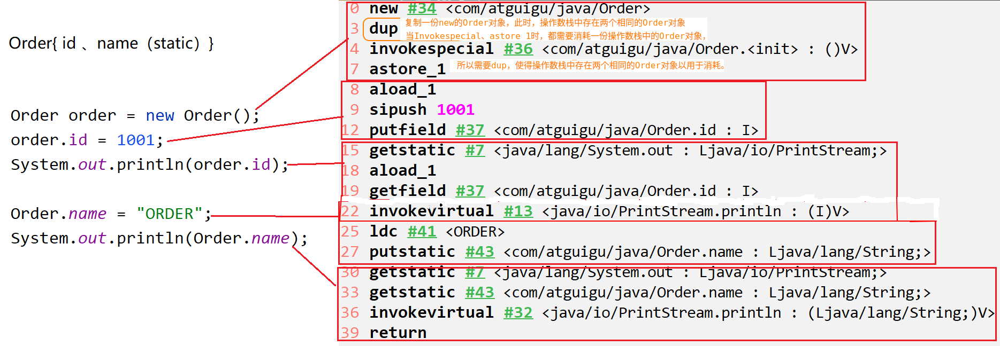

#### 数组操作指令

| 数组操作指令                        | 说明                                                         |
| ----------------------------------- | ------------------------------------------------------------ |
| xaload<br />（数组的加载指令）      | 将一个数组元素加载到操作数栈。<br />执行时，要求操作数中栈顶元素为数组索引i、栈顶顺位第2个元素为数组引用a，该指令会弹出栈顶的这两个元素，并将a\[i\]重新压入堆栈中。 |
| xastore<br />（数组的存储指令）     | 将一个操作数栈的值存储到数组元素中，给一个指定类型的数组的给定索引赋值。<br />在执行前，操作数栈需要准备3个元素：值、索引、数组引用，之后该指令会弹出这3个元素，并将值赋给数组中指定索引的位置。 |
| arraylength<br />（取数组长度指令） | 弹出栈顶的数组元素，获取数组的长度，将长度压入栈。（`aload_<n>，arraylength`） |

| 数组类型              | 加载指令   | 存储指令    |
| ----------------- | ------ | ------- |
| byte<br />boolean | baload | bastore |
| char              | caload | castore |
| short             | saload | sastore |
| int               | iaload | iastore |
| long              | laload | lastore |
| float             | faload | fastore |
| double            | daload | dastore |
| reference         | aaload | aastore |


#### 类型检查指令

| 指令         | 说明                                                          |
| ---------- | ----------------------------------------------------------- |
| instanceof | 判断给定的对象是否为某一个类的实例，将判断结果压入操作数栈。                              |
| checkcast  | 检查类型强转是否可以进行。<br />如果可以，该指令不会改变操作数栈，否则抛出ClassCastException。 |

 

### 方法调用与返回指令

#### 方法调用指令

| 方法调用指令    | 调用               | 说明                                                         |
| --------------- | ------------------ | ------------------------------------------------------------ |
| invokevirtual   | 对象的实例方法     | 根据对象的实际类型反派（虚方法分派）<br/>支持多态（可重写）。 |
| invokeinterface | 接口方法           | 运行时搜索实现的接口方法，找出合适的方法进行调用。<br />接口的default方法也算是invokeinterface。 |
| invokespecial   | 特殊处理的实例方法 | 静态类型绑定（非重写），不会在调用时进行动态派发。<br/>构造器（\<init\>）、私有方法（private）、父类方法（super）。 |
| invokestatic    | 类方法             | 静态绑定（非重写）。<br />通过类调用的方法，也算是invokestatic（即使满足invoke(special/interface)）。 |
| invokedynamic   | 动态绑定的方法     | 运行时动态解析出调用点限定符所引用的方法，并执行。<br/>该指令的分派逻辑由用户设定的引导方法决定。 |

 

#### 方法返回指令

- 方法返回指令：根据返回值的类型区分。

| 方法返回指令 | 以方法声明中的返回值类型为准      |
| ------------ | --------------------------------- |
| ireturn      | boolean、byte、char、short、int。 |
| lreturn      | long                              |
| freturn      | float                             |
| dreturn      | double                            |
| areturn      | reference                         |
| return       | void、\<init\>、\<clinit\>        |

1. 返回指令：将当前方法操作数栈的栈顶元素弹出，压入调用者方法的操作数栈；当前方法操作数栈的其他元素都被丢弃。

2. 如果当前返回的是synchronized方法，则执行一个隐含的monitorexit指令，退出临界区。

3. 最终，丢弃当前方法的整个帧，恢复调用者的帧，将控制权交给调用者。

### 操作数栈管理指令

| 操作数栈管理指令                                      | 通用型指令：对栈的压入、弹出无需指明数据类型。               |
| ----------------------------------------------------- | ------------------------------------------------------------ |
| pop<br/>pop2                                          | 将1、2个元素从栈顶弹出，并直接废弃。                         |
| dup、dup2<br/>dup\_x1、dup2\_x1<br/>dup\_x2、dup2\_x2 | 复制栈顶的1、2个数值，将复制值重新压入栈顶。<br/>\_x1、\_x2：插入栈的位置（dup和\_x的系数相加）。 |
| swap                                                  | 将栈顶的两个Slot数值位置交换。<br/>JVM不提供double、long的交换。 |
| nop                                                   | 字节码：0x00。<br/>无作用：调试、占位。                      |

> 插入位置：
> 
> - dup_x1：1+1，栈顶2个Slot下方。
> 
> - dup_x2：1+2，栈顶3个Slot下方。
> 
> - dup2_x1：2+1，栈顶3个Slot下方。
> 
> - dup2_x2：2+2，栈顶4个Slot下方。

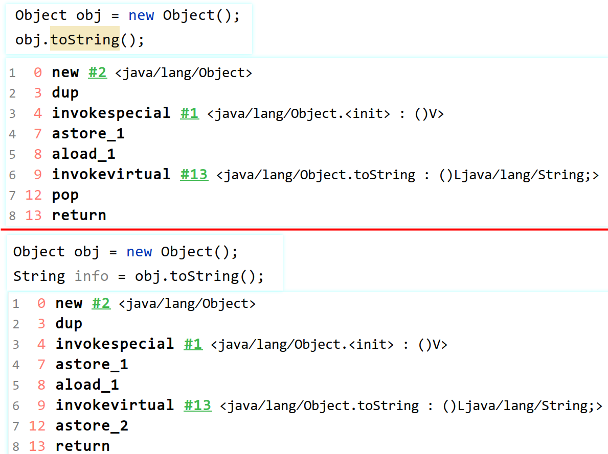 

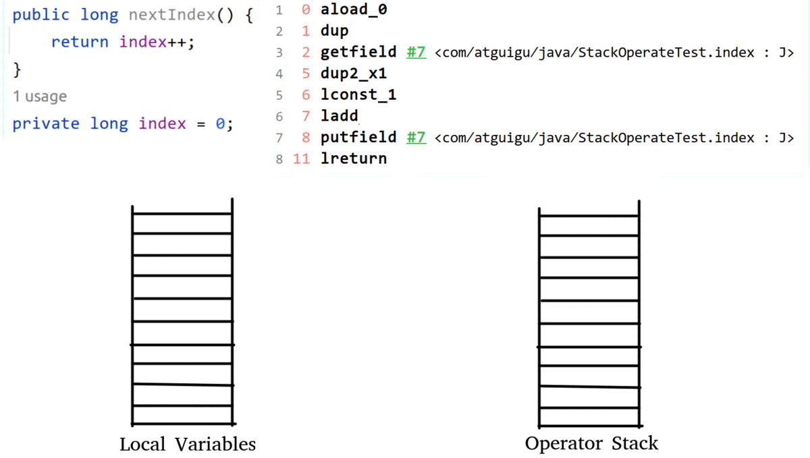 

### 控制转移指令

1. 条件跳转指令
2. 比较条件跳转指令
3. 多条件分支指令
4. 无条件指令

> 比较指令属于算术指令。

#### 条件跳转指令

- 条件跳转指令：弹出栈顶元素，测试是否满足条件，若满足，则跳转到指定位置。通常结合比较指令（准备栈顶元素）使用，接受2字节的操作数，用于计算跳转的位置（16位带符号整数作为当前位置的offset）。

> 若只是两个int、short、byte、ref类型的数据入栈，则不需要比较指令和条件跳转指令，而是直接通过比较条件跳转指令来计算跳转的位置。

| 条件跳转指令 | 满足条件：栈顶int类型数值 |
| ------------ | ------------------------- |
| ifeq         | =0                        |
| ifne         | &ne;0                     |
| iflt         | &lt;0                     |
| ifle         | &le;0                     |
| ifgt         | &gt;0                     |
| ifge         | &ge;0                     |
| ifnull       | null                      |
| ifnonull     | 不为null                  |

 

#### 比较条件跳转指令

- 比较条件跳转指令：将比较和跳转两个步骤结合。接收2字节的操作数作为参数，用于计算跳转的位置。在执行指令时，栈顶需要准备两个元素进行比较。指令执行完成后，栈顶的这两个元素被消耗，且没有数据入栈。若预设条件成立，则执行跳转。

| 比较条件跳转指令                  | int、byte、short、ref |
| --------------------------------- | --------------------- |
| **比较栈顶两个int类型数值的大小** | **跳转条件**          |
| if\_icmpeq                        | 前者=后者             |
| if\_icmpne                        | 前者&ne;后者          |
| if\_icmplt                        | 前者&lt;后者          |
| if\_icmple                        | 前者&le;后者          |
| if\_icmpgt                        | 前者&gt;后者          |
| if\_icmpge                        | 前者&ge;后者          |
| **比较栈顶两个引用类型数值**      | **跳转条件**          |
| if\_acmpeq                        | 前者=后者             |
| if\_acmpne                        | 前者&ne;后者          |

#### 多条件分支跳转指令

| 多条件分支跳转指令 | 用于switch的条件跳转的区别                                   |
| ------------------ | ------------------------------------------------------------ |
| tableswitch        | case值连续，内部只存放起始值、终值、若干个偏移量，由指定的操作数index，可立即定位到跳转偏移量位置，效率高。 |
| lookupswitch       | case值不连续，内部存放各个离散的case-offset对，每次执行都要搜索全部的case-offset对，找到匹配的case值，并根据对应的offset计算跳转位置，效率低。<br />将case-offset对按照case值的大小进行排序。 |

 

 

#### 无条件跳转指令

- 无条件跳转指令：goto指令接收2字节的操作数共同组成一个带符号整数，用于指定指令的偏移量，指令执行的目的是跳转到偏移量指定的位置。若偏移量过大（超过2字节带符号整数的范围），则使用指令goto\_w（接收4字节的操作数）。

> jsr、jsr\_w、ret也是无条件跳转，主要用于try-catch-finally语句，已经被JVM逐渐废弃。

### 异常处理指令

| 异常机制                                | 指令和处理 |
| --------------------------------------- | ---------- |
| 异常对象的生成：throw（手动、自动）     | athrow     |
| 异常处理：抓抛模型（try-catch-finally） | 异常表     |

#### 抛出异常指令 athrow

- 抛出异常指令（athrow）：Java中显式抛出异常（throw）都是由athrow指令实现的。JVM规范规定，大部分的运行时异常会在其他JVM指令检测到异常状况时自动抛出（而不会在字节码中写出）。在抛出异常时，JVM会清除操作数栈上的所有内容，之后将异常实例压入调用者操作数栈。

 

#### 异常处理与异常表

- 异常表：若一个方法定义了一个try-catch-fianally的异常处理，则创建一个异常表，包含每个异常处理、finally块的信息（起始位置、结束位置、程序计数器记录的代码处理的偏移位置、被捕获的异常类在常量池中的索引）。
- 当一个异常被抛出时，JVM会在当前方法中寻找匹配的处理。若没有找到，则强制结束该方法、弹出当前栈帧，并且异常重新抛给上层调用者（的栈帧）。若在所有栈帧弹出前仍然没有找到合适的异常处理，则该线程将终止。若该异常在最后一个非守护线程（比如main线程）抛出，则导致JVM自己终止。不管什么时候抛出异常，若异常最终匹配了所有异常类型，则代码继续执行，此时，若方法结束后没有再次抛出异常，在return之前，直接跳转到finally块继续执行。


 

### 同步控制指令

- JVM支持两种同步结构：方法级的同步、方法内部一段指令序列的同步，都是使用monitor支持的。

#### 方法级的同步

- 方法级的同步：隐式的，无须通过字节码指令控制，实现在方法调用和返回操作之间。JVM可以从常量池的方法表结构中的ACC\_SYNCHRONIZED访问标志得知一个方法是否声明为同步方法，若是，则JVM自动在方法调用前进行加锁。

> 调用方法时，调用指令会检查方法的ACC\_SYNCHRONIZED访问标志是否设置。若设置，则执行线程先持有同步锁，再执行方法，最后在方法完成（正常、非正常）时释放同步锁。在方法执行期间，执行线程拥有同步锁，而其他线程都无法再获得同一个锁。若一个同步方法在执行期间抛出异常，且方法内部无法处理此异常，则该同步方法所持有的锁将在异常抛出到同步方法之外时自动释放。

#### 方法内指定指令序列的同步

- 当线程进入同步代码块时，使用monitorenter指令请求进入。若当前对象的监视器计数器为0，则其被允许进入；若为1，则判断持有当前监视器的线程是否为该线程，若是，则进入，否则进行等待，直到对象的监视器计数器为0时，才被允许进入。
- 当线程退出同步代码块时，使用monitorexit声明退出。JVM中的任何对象都有一个监视器与之相关联，用于判断对象是否被锁定，当监视器被持有后，对象处于锁定状态。
- 指令monitorenter、指令monitorexit在执行时，都需要再操作数栈顶压入对象，之后指令monitorenter和指令monitorexit的锁定与释放都是针对该对象的监视器进行的。

 

## 类的加载过程

 

 

### 加载阶段 Loading

- Loading（加载）：将字节码文件加载到机器内存，并在内存中构建出类模板对象（Java类的原型、内存中的快照）。JVM把从字节码文件中解析出的常量池、类字段、类方法等信息存储到类模板中，以便JVM在运行期（反射）通过类模板获取Java类中的任意信息、对成员变量进行遍历、方法调用。

1. 由类的全名获取该类的二进制数据流。

> 加载.class文件的方式：从本地系统中获取、通过网络获取（Web Applet）、从zip压缩包中读取（jar、war格式）、动态代理技术、其他文件生成（JSP）、从专有数据库提取、从加密文件中获取（防止.class文件被反编译的保护措施）。

2. 解析类的二进制数据为方法区（JDK1.8之前是永久代，JDK1.8之后是元空间）内的数据结构（类模板）。

> 若输入数据不是JVM规范的class文件，则抛出ClassFormatError。

3. 在堆中创建java.lang.Class实例封装该类位于方法内的数据结构。

> java.lang.Class的构造方法是私有的，只有JVM能够构造。
>
> java.lang.Class的实例是访问类型元数据的入口、实现反射的关键数据，通过该类提供的接口来获得目标类所关联的class文件中具体的信息。

 

- 数组类：由JVM在运行时根据需要直接创建，没有对应的class文件、二进制数据流，无法通过类加载器创建数组类。（数组的元素类型仍然是依靠类加载器创建的）

| 数组的元素类型 | 说明                                                         |
| -------------- | ------------------------------------------------------------ |
| 引用类型       | 遵循定义的加载过程递归加载和创建数组的元素类型，JVM使用指定的元素类型和数组维度来创建新的数组类。<br />可访问性由元素类型的可访问性决定。 |
| 基本数据类型   | 基本数据类型由JVM预先定义（不需要类加载），只需要关注数组维度。<br />可访问性被缺省定义为public。 |

### 链接阶段 Linking

#### 验证 Verification

- 验证：确保class文件的字节流中包含信息符合当前虚拟机要求，保证被加载类的正确性，不会危害虚拟机自身安全。

> 文件格式验证、元数据验证、字节码验证、符号引用验证。

 

#### 准备 Preparation

- 准备（Preparation）：为类变量分配内存并设置默认初始值（零值）。

> 与初始化阶段不同，没有涉及初始化代码的执行。

1. 不包含 static final 修饰的：final在编译时就分配，准备阶段会显式初始化。

2. 不会为实例变量分配初始化：类变量会分配在方法区中，而实例变量随着对象分配到Java堆中。

| 数据类型  | 默认初始化值 |
| --------- | ------------ |
| byte      | (byte)0      |
| short     | (short)0     |
| int       | 0            |
| long      | 0L           |
| float     | 0\.0f        |
| double    | 0\.0         |
| char      | \\u0000      |
| boolean   | false        |
| reference | null         |

> java并不直接支持boolean类型，其boolean类型的内部实现是int。

```java
private static int a = 1; //准备环节，默认初始化为0。
private static final int b = 1; //准备环节，显式初始化为1。ConstantValue
//private fianl int b = 1; 也是显式初始化为1。ConstantValue

private static final String str1 = "Hello"; //准备环节，String以字面量的方式显式初始化。ConstantValue
private static final String str2 = new String("Hellp"); //在<clinit>中进行初始化。
```

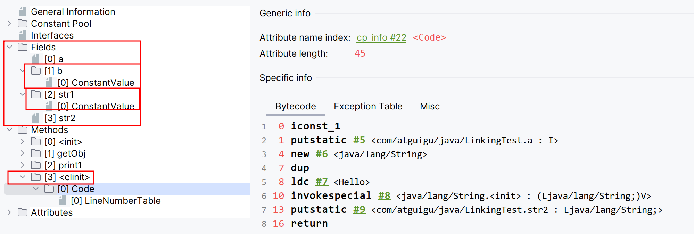 

> ConstantValue：显式初始化（常量）。

#### 解析 Resolution

- 解析：将常量池中的符号引用转化为直接引用。

> JVM规范中并没有要求解析阶段一定要按顺序执行，但解析往往伴随着JVM在执行完初始化之后再执行。

> 只要存在直接引用，则一定存在该类、方法、字段；而若只存在符号引用，则不确定。

| 引用类型 | 说明                                                         |
| -------- | ------------------------------------------------------------ |
| 符号引用 | 一组符号描述所引用的目标，与JVM的内部数据结构和内存布局无关。 |
| 直接引用 | 目标方法在类中方法表的位置，直接执行目标的指针、相对偏移量、一个间接定位到目标的句柄。 |

> 解析主要针对：类、接口、字段、类方法、接口方法、方法类型等。
>
> 对应常量池：CONSTANT\_Class\_info、CONSTANT\_Fieldref\_info、CONSTANT\_Methodref\_info等。

### 初始化阶段 Initialization

- 初始化（Initialization）：JVM真正执行类中定义的Java代码，执行类构造器方法\<clinit\>\(\)。

> \<clinit\>\(\)不同于类的构造器：构造器是虚拟机视角下的\<init\>\(\)。

- \<clinit\>\(\)方法只能由Java编译器自动收集类中的所有类变量的赋值动作和静态代码块中的语句生成（指令按语句在源文件中出现的顺序执行）。（无法自定义该同名方法，也不能由我们调用）
- 在加载一个类之前，JVM总会试图加载该类的父类，JVM保证父类的\<clinit\>\(\)方法先于子类的\<clinit\>\(\)方法执行。（父类的static块优先于子类）
- Java编译器并不会为所有的类都产生\<clinit\>()方法，在以下情况中，class文件将不包含\<clinit\>()方法：

1. 该类没有声明任何类变量，没有静态代码块。
2. 该类声明了类变量，但没有显式赋值（使用类变量的初始化语句和静态代码块来执行初始化操作）。
3. 该类中static final修饰的基本数据类型的字段（包括字面量赋值的String），也不会加入到\<clinit\>\(\)方法。（只要有final，就在链接阶段中的准备环节进行显式初始化）

> 引用数据类型（以及new的String），则在\<clinit\>()中进行初始化。

```java
private static final String str1 = "Hello"; //准备环节，String以字面量的方式显式初始化。ConstantValue
private static final String str2 = new String("Hellp"); //在<clinit>()中进行初始化。

private static final Integer INTERGE_CONS1 = Integer.valueOf(100); //在<clinit>()中进行初始化。
```

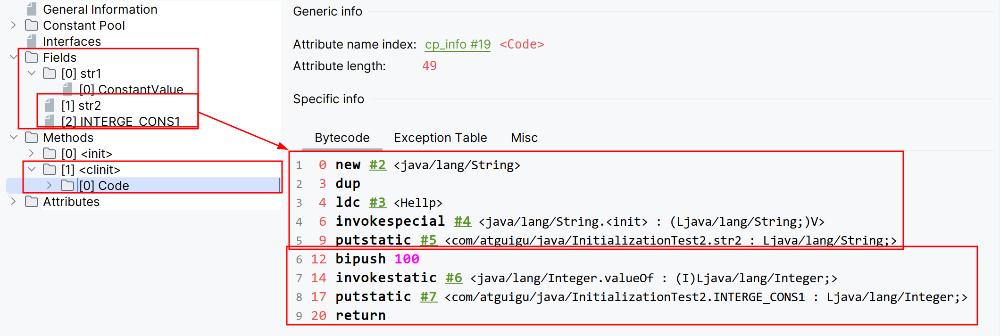

- JVM保证一个类的\<clinit\>\(\)方法在多线程下被同步加锁（隐式）。

> 若多个线程同时准备初始化一个类，则只有一个线程能够进入，其他线程只能等待，等该类初始化完成后，JVM会直接将准备好的信息返回给处于等待队列的线程。

#### 类的初始化时机：主动/被动使用

| 类的使用方式 | 说明                           |
| ------------ | ------------------------------ |
| 主动使用     | 触发类的初始化\<clinit\>\(\)   |
| 被动使用     | 不触发类的初始化\<clinit\>\(\) |

- 自动使用：
  1. 创建类的实例。
  2. 访问某个类/接口的静态变量、或 对该静态变量赋值。
  3. 调用类的静态方法。
  4. 反射。
  5. 初始化一个类的子类。
  6. JVM启动时被标明为启动类的类。
  7. 动态语言支持：java.lang.invoke.MethodHandle实例的解析结果REF\_getStatic、REF\_putStatic、REF\_invokeStatic句柄对应的类没有初始化，则初始化。
- 被动使用：其他使用Java类的方式，不会导致类的初始化。

## 类加载器 Class Loader

- ClassLoader只负责class文件的加载（`.class文件 --> JVM --> DNA元数据模板`），由Execution Engine决定是否可以运行。

### 类加载器类别

- 引导类加载器（Bootstrap ClassLoader）、自定义加载器（User-Defined ClassLoader） 
  - 自定义加载器：所有派生于抽象类ClassLoader的类加载器。

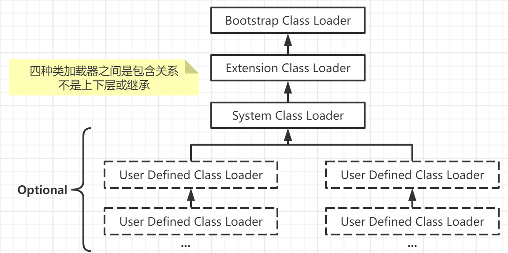  

```java
//系统类加载器
ClassLoader systemClassLoader = ClassLoader.getSystemClassLoader();
System.out.println(systemClassLoader); //jdk.internal.loader.ClassLoaders$AppClassLoader@78308db1
//扩展类加载器
ClassLoader extClassLoader = systemClassLoader.getParent();
System.out.println(extClassLoader); //jdk.internal.loader.ClassLoaders$PlatformClassLoader@16b98e56
//引导类加载器：获取不到 null
ClassLoader bootstrapClassLoader = extClassLoader.getParent();
System.out.println(bootstrapClassLoader); //null

//用户自定义类：默认使用 系统类加载器 加载
ClassLoader classLoader = StackStruTest.class.getClassLoader();
System.out.println(classLoader); //jdk.internal.loader.ClassLoaders$AppClassLoader@78308db1

//String类等Java核心类库：使用引导类加载器加载。
ClassLoader stringClassLoader = String.class.getClassLoader();
System.out.println(stringClassLoader); //null
```

#### 启动类加载器（引导类加载器） Bootstrap ClassLoader

- 启动类加载器：使用C/C++语言实现，嵌套于JVM内部，并不继承java.lang.ClassLoader，没有父加载器。
- 加载Java的核心库（JAVA_HOME/jre/lib/rt.jar、resources.jar、sun.boot.class.path），用于提供JVM自身需要的类。
- 加载扩展类、应用程序类加载器，并指定为他们的父加载器。
- 出于安全，Bootstrap启动类加载器只加载包名为java、javax、sun等开头的类。

#### 扩展类加载器 Extension ClassLoader

- Java语言编写：sun.misc.Launch\$ExtClassLoader实现、派生于ClassLoader类，父类加载器为启动类加载器。
- 从java.ext.dirs系统属性所指定的目录中加载类库、或从JDK的安装目录的jre/lib/ext扩展目录中加载类库。（如果用户创建的JAR放在此目录中，也会自动由扩展类加载器加载）

#### 应用程序加载器（系统类加载器） AppClassLoader

- Java语言编写：sun.misc.Launch\$AppClassLoader实现、派生于ClassLoader类，父类加载器为扩展类加载器。
- 负责加载环境变量classpath、或系统属性java.class.path 指定路径下的类库。
- 程序中默认的类加载器：一般的Java应用的类都是由系统类加载器完成加载。

```java
//获取系统类加载器
ClassLoader.getSystemClassLoader()
```

#### 用户自定义类加载器

- 隔离加载类、修改类加载的方式、扩展加载源、防止源码泄露。

1. 继承java.lang.ClassLoader。
2. 不建议重写loadClass()，而是将自定义的类加载逻辑重写findClass()。
3. 对于简单的需求：直接继承URLClassLoader类。

```java
public class CustomClassLoader extends ClassLoader {
    @Override
    protected Class<?> findClass(String name) throws ClassNotFoundException {

        try {
            byte[] result = getClassFromCustomPath(name);
            if(result == null){
                throw new FileNotFoundException();
            }else{
                return defineClass(name,result,0,result.length);
            }
        } catch (FileNotFoundException e) {
            e.printStackTrace();
        }

        throw new ClassNotFoundException(name);
    }

    private byte[] getClassFromCustomPath(String name){
        //从自定义路径中加载指定类:细节略
        //如果指定路径的字节码文件进行了加密，则需要在此方法中进行解密操作。
        return null;
    }

    public static void main(String[] args) {
        CustomClassLoader customClassLoader = new CustomClassLoader();
        try {
            Class<?> clazz = Class.forName("One",true,customClassLoader);
            Object obj = clazz.newInstance();
            System.out.println(obj.getClass().getClassLoader());
        } catch (Exception e) {
            e.printStackTrace();
        }
    }
}
```

### 类加载器引用

- JVM必须知道一个类型是由启动类加载器还是用户类加载器加载：如果一个类是由用户类加载器加载，则JVM将该类加载器的一个引用作为类型信息的一部分保存在方法区。当解析一个类到另一个类的引用时，JVM需要保证这两个类的类加载器相同。

- class对象是否为同一个类的条件：类的全限定名一致、类加载器相同。

### ClassLoader

- ClassLoader：抽象类，其后所有的类加载器都继承自ClassLoader（除了启动类加载器 Bootstrap ClassLoader）。

| 方法                                                 | 说明                                                         |
| ---------------------------------------------------- | ------------------------------------------------------------ |
| getParent()                                          | 返回该类加载器的父类加载器                                   |
| loaderClass(String name)                             | 加载名称为name的类<br />返回java.lang.Class实例              |
| findClass(String name)                               | 查找名称为name的类<br />返回java.lang.Class实例              |
| findLoadedClass(String name)                         | 查找名称为name的已经被加载过的类<br />返回java.lang.Class实例 |
| defineClass(String name, byte[] b, int off, int len) | 把字节数组b中的内容转化为一个Java类<br />返回java.lang.Class实例 |
| `resolveClass(Class<?> c)`                           | 连接指定的一个Java类                                         |

| 获取ClassLoader                                | 说明                        |
| ---------------------------------------------- | --------------------------- |
| clazz.getClassLoader()                         | 当前类的ClassLoader         |
| Thread.currentThread().getContextClassLoader() | 当前线程上下文的ClassLoader |
| ClassLoader.getSystemClassLoader()             | 系统ClassLoader             |
| DriverManager                                  | 调用者的ClassLoader         |

### 双亲委派机制

- 双亲委派机制：如果一个类加载器收到类加载的请求，则将这个请求委托给父类的加载器执行，如果父类加载器存在其父类加载器，则依次向上委托，请求最终到达顶层的启动类加载器。如果父类加载器可以完成类加载器，就成功返回；否则由子加载器尝试加载。

1. 避免类的重复加载。

2. 保护程序安全，防止核心API被篡改。 

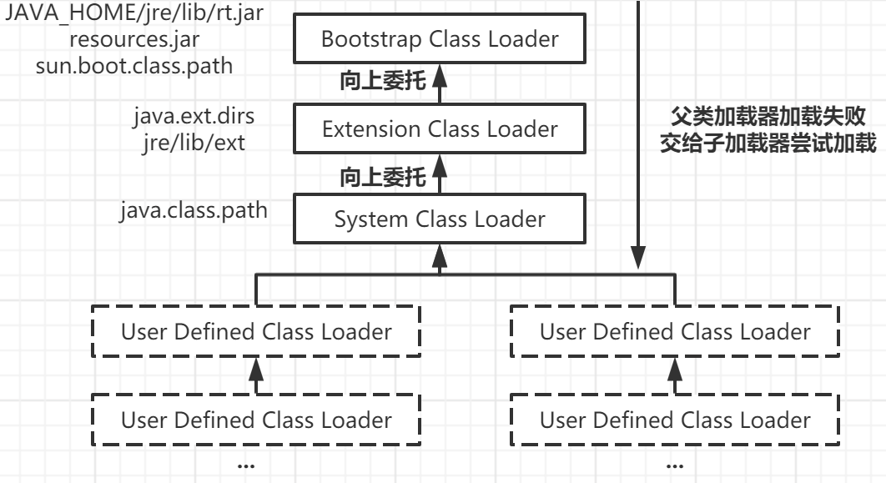  

### 沙箱安全机制

- 沙箱安全机制：引导类加载器在加载的过程会先加载jdk自带的文件（rt.jar包java.lang）。

# 性能监控与调优

## 调优工具

### JDK命令

| 命令  | 说明 |
| ----- | ---- |
| jinfo |      |
| jstat |      |
| javap |      |
| jmap  |      |

### Eclipse：Memory Analyzer Tool

### Jconsole

### VisualVM

### Jprofiler

### Java Flight Recorder

### GCViewer

### GC Easy