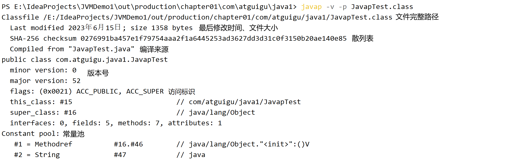
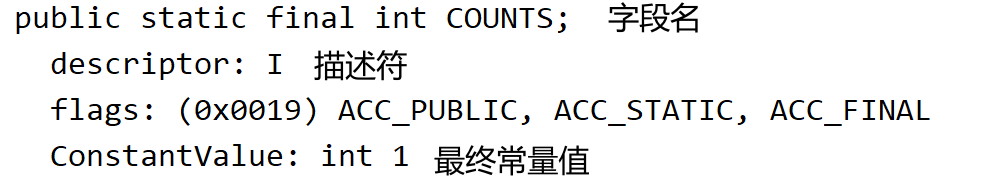
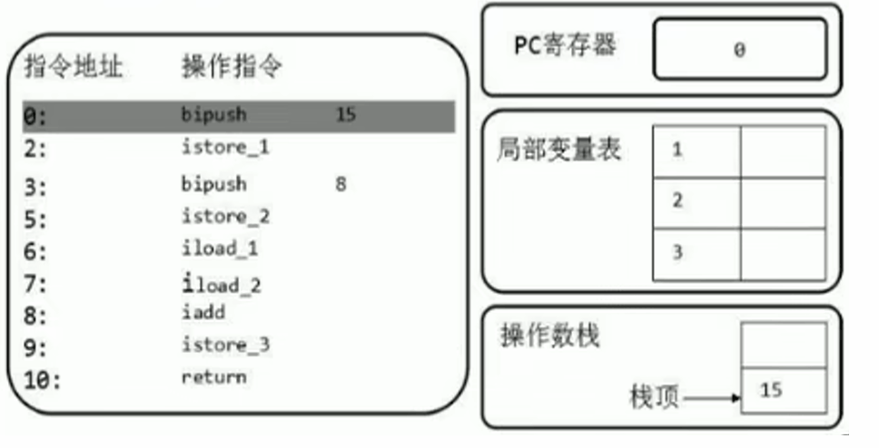

# Class文件

- JVM只与Class文件相关联，而不和任何语言绑定。（包括Java）

## 前端编译器

- 前端编译器（javac）：将java代码转换为符合JVM规范的字节码文件。不涉及代码编译优化。
  1. 词法解析。
  2. 语法解析。
  3. 语义解析。
  4. 生成字节码。

 

| 前端编译器                          | 说明      |
| ------------------------------ | ------- |
| javac                          | 默认，全量编译 |
| ECJ（Eclipse Compiler for Java） | 增量编译    |

## Class文件解读

- 字节码文件（.class）：二进制的类文件，内容为JVM指令。

- 字节码指令（byte code）：JVM的指令由一个字节长度的、代表某种特定操作含义的操作码（opcode）以及跟随其后的零至多个代表次操作所需参数的操作数（operand）所构成。
  
  ```java
  javap -v Test.class > E:/test.txt
  ```

```java
Fathor f = new Son();
System.out.println(f.x);
//Son:0 默认初始化值
//Son:30
//Fathor:20 多态性：属性没有多态
```


```java
class Fathor{

    private int x = 10;

    public Fathor(){
        this.print();
        x = 20;
    }

    public void print(){
        System.out.println("Fathor:" + x);
    }
}

class Son extends Fathor{

    private int x = 30;

    public Son(){
        this.print();
        x = 40;
    }

    public void print(){
        System.out.println("Son:" + x);
    }
}
```

## Class文件结构

### 概述

- Class文件：对应唯一一个类/接口的定义信息，是一组8字节的二进制流，不一定以磁盘文件格式存在。
- Class文件只有两种数据类型：无符号数、表。

| 数据类型 | 说明                                                                                                   |
| ---- | ---------------------------------------------------------------------------------------------------- |
| 无符号数 | 基本数据类型：u1、u2、u4、u8分布代表1B、2B、4B、8B的无符号数。<br />无符号数可以描述数字、索引引用、数量值、字符串值（UTF-8）。                        |
| 表    | 复合数据类型：多个无符号数、其他表构成。<br />表无固定长度：需要标识位说明表的长度<br />习惯：以“_info”结尾。<br />描述有层次关系的复合结构的数据：Class文件相当于一个表。 |


### magic 魔数

- magic：Class文件的标识符（而不是文件扩展名识别），固定为0xCAFEBABE。

### major_version minor_version 版本号

- Java版本号：major_version.minor_version，从45开始，JDK1.1之后每个JDK版本发布，其对应的主版本号+1.（46-1.2）
- 不同版本的Java编译器编译的Class文件对应的版本不同（向下兼容），高版本JVM可以执行低版本编译器生成的Class文件；但低版本JVM不能执行高版本编译器生成的Class文件：JDK1.k的JVM对应的class文件版本号范围：45.0`~`44+k.0。

### 常量池

#### 概述

- 常量池集合：一个前置的容量计数器（constant_pool_count）和若干个连续的数据项（constant_pool）。
- constant_pool_count 常量池计数器：常量池中常量的数量是不固定的，需要在常量池的入口放置一项u2类型的无符号数，代表常量池容量计数值（从1开始计数）。
  - constant_pool_count=1对应常量池中有0个常量项。从1开始计数，将第0项常量空置，以满足后续某些指向常量池的索引值的数据在特定情况下需要表达“不引用任何一个常量池项目”的含义（索引0）。
- constant_pool：常量池表项主要存放编译器生成的各种字面量（Literal）、符号引用（Symbolic References），在类加载后进入方法区的运行时常量池中存放。
  - 标记字节（tag byte）：常量池中的每一项的第一个字节都为类型标记，用于确定该项的格式。

| 主要存储常量 | 具体类型                                    |
| ------ | --------------------------------------- |
| 字面量    | 文本字符串<br />声明为final的常量值                 |
| 符号引用   | 类/接口的全限定名<br />字段的名称和描述符<br />方法的名称和描述符 |

```java
package com.atguigu.java1;

public class Demo {
    private int num = 1;

    public int add(){
        num = num + 2;
        return num;

    }
}
```

> Hexviewer查看十六进制文件：.class。

[详细常量类型和结构、Demo字节码的解析.xlsx](../../../attach/JVM/常量类型和结构.xlsx)

[Demo.class](../../../attach/JVM/Demo.class)

#### 符号引用、描述符

| 符号引用 | 说明                                               |
| ---- | ------------------------------------------------ |
| 全限定名 | 全类名：com.zjk.demo1<br />全限定名：com/zjk/demo1;（分号结尾） |
| 简单名称 | 没有类型、参数修饰的方法/字段名称：public void add() --> add      |
| 描述符  | 描述字段的数据类型、方法的参数列表（数量、类型、顺序）、返回值。                 |

| 描述符   | 说明                                                              |
| ----- | --------------------------------------------------------------- |
| B     | byte                                                            |
| C     | char                                                            |
| D     | double                                                          |
| F     | float                                                           |
| I     | int                                                             |
| **J** | **long**                                                        |
| S     | short                                                           |
| **Z** | **boolean**                                                     |
| V     | void                                                            |
| **L** | **对象类型，如：Ljava/lang/Object;**                                   |
| `[`   | 数组类型：<br />一维数组：`int[] --> [I`<br />二维数组：`int[][] --> [[I`，以此类推 |

```java
Object[] arr = new Object[10];
System.out.println(arr);//[Ljava.lang.Object;@1540e19d

String[] arr1 = new String[10];
System.out.println(arr1);//[Ljava.lang.String;@677327b6

long[][] arr2 = new long[10][];
System.out.println(arr2);//[[J@14ae5a5
```

- JVM在加载Class文件时才会进行动态链接：Class文件中不会保存各个方法和字段的最终内存布局信息，这些方法和字段的符号引用需要经过转换才能被JVM直接使用。当JVM运行时，需要从常量池中获得对应的符号引用，再在类加载过程中的解析阶段将其替换为直接引用，并翻译到具体的内存地址中。

| 类型   | 说明                                                                                                                       |
| ---- | ------------------------------------------------------------------------------------------------------------------------ |
| 符号引用 | 以一组符号来描述所引用的目标，符号可以是任何形式的字面量，只要使用时能无歧义地定位到目标即可。<br />符号引用与JVM实现的内存布局无关，引用的目标不一定已经加载到内存中。                                 |
| 直接引用 | 可以是直接指向目标的指针、相对偏移量，或是能间接定位到目标的句柄。<br />直接引用与JVM实现的内存布局相关，同一个符号引用在不同JVM实例上翻译出来的直接引用一般不相同。<br />如果存在直接引用，则引用的目标必定已经存在于内存中。 |


#### 存放类型

| tag（u1） | 常量池存放的类型                                         | 结构                                                                                                                                              |
| ------- | ------------------------------------------------ | ----------------------------------------------------------------------------------------------------------------------------------------------- |
| 01      | CONSTANT_utf8_info<br />UTF-8编码的字符串              | lenth（u2）：UTF-8编码字符串占用的字符数<br />bytes（u lenth）:长度为length的UTF-8编码的字符串                                                                            |
| 03      | CONSTANT_Integer_info<br />整型字面量                 | bytes（u4）：按照高位在前存储的int值                                                                                                                         |
| 04      | CONSTANT_Float_info<br />浮点型字面量                  | bytes（u4）：按照高位在前存储的float值                                                                                                                       |
| 05      | CONSTANT_Long_info<br />长整型字面量                   | bytes（u8）：按照高位在前存储的long值                                                                                                                        |
| 06      | CONSTANT_Double_info<br />双精度浮点型字面量              | bytes（u8）：按照高位在前存储的double值                                                                                                                      |
| 07      | CONSTANT_Class_info<br />类/接口的符号引用               | index（u2）：指向全限定名常量项的索引                                                                                                                          |
| 08      | CONSTANT_String_info<br />字符串类型字面量               | index（u2）：指向字符串字面量的索引                                                                                                                           |
| 09      | CONSTANT_Fieldref_info<br />字段的符号引用              | index（u2）：指向CONSTANT_Class_info的索引项<br />index（u2）：指向CONSTANT_NameAndType的索引项                                                                   |
| 10（0a）  | CONSTANT_Method_info<br />类中方法的符号引用              | index（u2）：指向CONSTANT_Class_Info的索引项<br />index（u2）：指向CONSTANT_NameAndType的索引项                                                                   |
| 11（0b）  | CONSTANT_InterfaceMethodref_info<br />接口中方法的符号引用 | index（u2）：指向CONSTANT_Class_Info的索引项<br />index（u2）：指向CONSTANT_NameAndType的索引项                                                                   |
| 12（0c）  | CONSTANT_NameAndType_info<br />字段/方法的符号引用        | index（u2）：指向该字段或方法名称常量项的索引<br />index（u2）：指向该字段或方法描述符常量项的索引                                                                                     |
| 15（0f）  | CONSTANT_MethodHandle_info<br />方法句柄             | reference_kind（u1）：值必须在1-9之间，决定了方法句柄的类型，表示方法句柄的字节码行为<br />reference_index（u2）：对常量池的有效索引                                                         |
| 16（10）  | CONSTANT_MethodType_info<br />标识方法类型             | descriptor_index（u2）：对常量池的有效索引，该索引项必须是CONSTANT_Utf8_info                                                                                        |
| 18（12）  | CONSTANT_InvokeDynamic_info<br />一个动态方法调用点       | bootstrap_method_attr（u2）：对当前Class文件中引导方法表的bootstrap_methods[]数组的有效索引<br />name_and_type_index（u2）：对当前常量池的有效索引，该索引项必须是CONSTANT_NameAndType_Info |

### 访问标识

| Flag Name      | Value  | Interpretation                                                                                       |
| -------------- | ------ | ---------------------------------------------------------------------------------------------------- |
| ACC_PUBLIC     | 0x0001 | 标识为public类型                                                                                          |
| ACC_FINAL      | 0x0010 | 标识声明为final，只有类可以设置<br />与 ACC_ABSTRACT冲突                                                             |
| ACC_SUPER      | 0x0020 | 标识允许使用invokespecial字节码指令的新语义<br />Jdk1.0.2之后默认为true，由于向后兼容                                           |
| ACC_INTERFACE  | 0x0200 | 标识为接口。没有该标识的则是类：可具有除ACC_ANNOTAION外所有标识<br />必须伴随ACC_ABSTRACT标识，<br />与ACC_FINAL、ACC_SUPER、ACC_ENUM冲突 |
| ACC_ABSTRACT   | 0x0400 | 是否为abstract类型对于接口/抽象类，此标识为true；其他类型为false                                                            |
| ACC_SYNTHETIC  | 0x1000 | 标识此类并非用户代码产生，而是由编译器产生的类，没有对应源码                                                                       |
| ACC_ANNOTATION | 0x2000 | 标识为注解<br />必须伴随ACC_INTERFACE                                                                         |
| ACC_ENUM       | 0x4000 | 标识该类/其父类为枚举                                                                                          |

### 类索引、父类索引、接口索引集合

- 访问标识后，会指定该类的类别、父类类别、实现的接口

| 长度  | 含义                           | 说明                                                                                                                                          |
| --- | ---------------------------- | ------------------------------------------------------------------------------------------------------------------------------------------- |
| u2  | this_class                   | 该类的全限定名                                                                                                                                     |
| u2  | super_class                  | 该类的父类的全限定名，只有java.lang.Object的父类索引为0<br />指向的不能是final类                                                                                      |
| u2  | interfaces_count             | 接口计数器，该类/接口的直接超接口数量                                                                                                                         |
| u2  | interfaces[interfaces_count] | 该类实现的接口索引数组，每一项都是CONSTANT_CLass_info<br />0 `<=` i `<` interfaces_count<br />interface各成员表示的接口顺序和对应源代码中给定的接口顺序相同（从左到右）：interface[0]对应最左边的接口 |

### 字段表集合

- 字段（field）：类变量、实例变量，不包括局部变量。通过引用常量池中的常量描述，指向常量池索引集合，描述每个字段的完整信息。
  
  - Java中的字段不可重载，不能重名；而字节码中允许重名字段，只要描述符不一致即可。
  - 字段的信息（布尔值修饰符）：
    - 作用域（public、private、protected）
    - 实例变量/类变量（static）
    - 可变性（final）
    - 并发可见性（volatitle）
    - 可否序列化（transient）
    - 字段数据类型（基本数据类型、对象、数组）
    - 字段名称

- 字段表计数器（fileds_count）u2：当前Class文件fields表的成员个数。

- 字段表集合（fields）：描述接口/类中声明的变量。
  
  - fields中的各个成员都是field_info，只表示该类/接口所声明的所有类字段、实例字段。不包括局部变量、父类/接口中继承而来的字段。
  - fields有可能会列出原本Java代码中不存在的字段（内部类为保持对外部类的访问性，会自动添加指向外部类实例的字段）。

| 类型             | 名称               | 含义    | 数量               |
| -------------- | ---------------- | ----- | ---------------- |
| u2             | acess_flags      | 访问标识  | 1                |
| u2             | name_index       | 字段名索引 | 1                |
| u2             | descripto_index  | 描述符索引 | 1                |
| u2             | attributes_count | 属性计数器 | 1                |
| attribute_info | attributes       | 属性集合  | attributes_count |

| acess_flags 字段表访问标识 | 标识值    | 含义        |
| ------------------- | ------ | --------- |
| ACC_PUBLIC          | 0x0001 | public    |
| ACC_PRIVATE         | 0x0002 | private   |
| ACC_PROTECTED       | 0x0004 | protected |
| ACC_STATIC          | 0x0008 | static    |
| ACC_FINAL           | 0x0010 | final     |
| ACC_VOLATILE        | 0x0040 | volatile  |
| ACC_TRANSIENT       | 0x0080 | transient |
| ACC_SYNCHETIC       | 0x1000 | 编译器自动产生   |
| ACC_ENUM            | 0x4000 | enum      |

### 方法表集合

- methods：指向常量池索引集合，完整描述每个方法的签名。字节码文件中，一个method对应一个类/接口中的方法信息。每个成员都是method_info。
  - 只描述当前类/接口中声明的方法，不包括从父类/父接口继承的方法。
  - 有可能会出现由编译器自动添加的方法（类/接口初始化方法`<clinit>()`、实例初始化方法`<init>()`）。

| 类型          | 名称              | 含义    | 数量            |
| ----------- | --------------- | ----- | ------------- |
| u2          | acess_flags     | 访问标识  | 1             |
| u2          | name_index      | 方法名索引 | 1             |
| u2          | descripto_index | 描述符索引 | 1             |
| u2          | methods_count   | 方法计数器 | 1             |
| method_info | attributes      | 方法集合  | methods_count |

| acess_flags 字段表访问标识 | 标识值    | 含义           |
| ------------------- | ------ | ------------ |
| ACC_PUBLIC          | 0x0001 | public       |
| ACC_PRIVATE         | 0x0002 | private      |
| ACC_PROTECTED       | 0x0004 | protected    |
| ACC_STATIC          | 0x0008 | static       |
| ACC_FINAL           | 0x0010 | final        |
| ACC_SYNCHRONIZED    | 0x0020 | synchronized |
| ACC_BRIDGE          | 0x0040 | bridge       |

- 方法计数器（methods_count）u2：当前class文件中methods表的成员个数。

- 方法重载(Overload)：
  
  - Java语言中，除了要与原方法具有相同的简单名称之外，还要求必须拥有一个与原方法不同的特征签名（方法中各个参数在常量池中的字段符号引用的集合），而返回值不会包含在特征签名之中，Java语义无法仅仅依靠返回值的不同来对一个已有方法进行重载。
  - c1ass文件格式中，特征签名的范围更大一些，只要描述符不是完全一致的两个方法就可以共存。允许存放多个方法签名相同的方法，但这些方法之间的返回值不能相同。

### 属性表集合

#### 概述

- 属性表集合（attributes）：class文件所携带的辅助信息、任何带有RetentionPolicy.CLASS/RetentionPolicy.RUNTIME的注解（用于JVM的验证和运行、Java程序的调试）。
  - 字段表、方法表中也有自己的属性表集合。
  - 属性表集合不要求具有严格的顺序，只要不与已有的属性名重复即可。任何实现的编译器都可以向属性表中写入自定义的属性信息，但JVM运行时会忽略其不认识的属性。

```java
ConstantValue_attribute{
    u2 attribute_name_index;
    u4 attribute_length; //常量该值恒为2
    u2 constantvalue_index;
}
```

- 属性表计数器（attributes_count）：当前class文件属性表的成员个数。每项都是attribute_info。

#### Code

| 类型                 | 名称                     | 含义           | 数量                   |
| ------------------ | ---------------------- | ------------ | -------------------- |
| u2                 | attribute_name_index   | 属性名索引        | 1                    |
| u4                 | attribute_length       | 属性长度         | 1                    |
| u2                 | max_stack              | 操作数栈深度最大值    | 1                    |
| u2                 | max_local              | 局部变量表所需的存续空间 | 1                    |
| u4                 | code_length            | 字节码指令长度      | 1                    |
| u1                 | code                   | 存储字节码指令      | code_length          |
| u2                 | exception_table_length | 异常表长度        | 1                    |
| exception_info     | exception_table        | 异常表          | exception_length     |
| **u2**             | **attributes_count**   | **属性表计数器**   | **1**                |
| **attribute_info** | **attributes**         | **属性表**      | **attributes_count** |

- LineNumberTable_attribute、LocalVariableTable_attribute：

- LineNumberTable：可选变长属性，位于Code结构的属性表。用来描述Java源码行号与字节码之间的对应关系，在调试时定位代码执行的行数。

```java
LineNumberTable_attribute {
    u2 attribute_name_index;
    u4 attribute_length;
    u2 line_number_table_length;
    {   u2 start_pc; //字节码行号
        u2 line_number;     //Java源代码行号
    } line_number_table[line_number_table_length];
}
```

```java
LocalVariableTable_attribute {
    u2 attribute_name_index;
    u4 attribute_length;
    u2 local_variable_table_length;
    {   u2 start_pc;
        u2 length;
        u2 name_index;
        u2 descriptor_index;
        u2 index;
    } local_variable_table[local_variable_table_length];
}
```

#### SourceFile

- 附加属性（SourceFile）：

```java
SourceFile_attribute {
    u2 attribute_name_index;
    u4 attribute_length;
    u2 sourcefile_index;
}
```

## javap

> javac -g Xxx.java 
> 
> （IDE默认）生成所有相关信息：局部变量表信息等。

```
javap <options> <classes>
```

| javap参数                                                | 说明                                                                   |
| ------------------------------------------------------ | -------------------------------------------------------------------- |
| --help -help -h -?                                     | 输出此帮助消息                                                              |
| -version                                               | 版本信息                                                                 |
| -v  -verbose                                           | 输出附加信息（不显示私有信息）                                                      |
| -l                                                     | 输出行号和本地变量表                                                           |
| -public<br />-protected<br />-package<br />-p -private | 仅显示公共类和成员<br />显示保护、公共的类和成员<br />（默认）显示程序包/受保护的/公共类和成员<br />显示所有类和成员 |
| -sysinfo                                               | 显示正在处理的类的系统信息（路径、大小、日期、SHA-256 散列）                                   |
| -constants                                             | 显示最终常量                                                               |
| `--module <模块>, -m <模块>`                               | 指定包含要反汇编的类的模块                                                        |
| -J `<vm-option>`                                       | 指定 VM 选项                                                             |
| `--module-path <路径>`                                   | 指定查找应用程序模块的位置                                                        |
| `--system <jdk> `                                      | 指定查找系统模块的位置                                                          |
| `--class-path <路径> `                                   | 指定查找用户类文件的位置                                                         |
| ` -classpath <路径>   `                                  | 指定查找用户类文件的位置                                                         |
| `-cp <路径>  `                                           | 指定查找用户类文件的位置                                                         |
| `-bootclasspath <路径> `                                 | 覆盖引导类文件的位置                                                           |
| `--multi-release <version>`                            | 指定要在多发行版 JAR 文件中使用的版本                                                |
| -s                                                     | 输出内部类型签名                                                             |
| -c                                                     | 对代码进行反编译                                                             |



 


# 字节码指令集与解析

- 字节码指令（byte code）：JVM的指令由一个字节长度的、代表某种特定操作含义的操作码（opcode）以及跟随其后的零至多个代表次操作所需参数的操作数（operand）所构成。
  - JVM基于栈（操作数栈）：大多数指令不包含操作数。
  - 操作码的长度为1Byte（0`~`255），指令集的操作码总数不得超过256 。
- 执行模型：

```java
do{
    自动计算PC寄存器的值+1;
    根据PC寄存器的指示位置，从字节码流中取出操作码;
    if(字节码存在操作数) 从字节码流中取出操作数;
    执行操作码所定义的操作;
}while(字节码长度 > 0)
```

- 操作码分类：
1. 与数据类型相关。
2. 没有明确指明操作类型的字母。
3. 与数据类型无关的。

| 操作码助记符<br />（数据类型相关） | 数据类型   |
| -------------------- | ------ |
| i                    | int    |
| l                    | long   |
| s                    | short  |
| b                    | byte   |
| c                    | char   |
| f                    | float  |
| d                    | double |

- 大多数对于boolean、byte、short、char类型数据的操作使用相应的int类型作为运算类型：大部分的指令没有支持整数类型 byte、char、short，甚至没有指令支持boolean类型。编译器在编译期/运行期将byte、short类型的数据带符号扩展为相应的int类型（Sign-Extend）。将boolean、char零位扩展为相应的int类型（Zero-Extend）。

- 字节码指令按用途分类：
1. 加载与存储指令。
2. 算术指令。
3. 类型转换指令。
4. 对象的创建与访问指令。
5. 方法调用与返回指令。
6. 操作数栈管理指令。
7. 比较控制指令。
8. 异常处理指令。
9. 同步控制指令。

## 加载和存储指令

### 概述

- 加载和存储指令：将数据从栈帧的局部变量表和操作数栈之间来回传递。

 

| 常用指令            | 说明                                                                                                                                                         |
| --------------- | ---------------------------------------------------------------------------------------------------------------------------------------------------------- |
| 局部变量压栈指令        | `xload`<br />`xload_<n>`：（x：i、l、f、d、a；n：0`~`3）                                                                                                             |
| 常量入栈指令          | bipush<br />sipush<br />ldc<br />ldc_w<br />ldc2_w<br />aconst_null<br />iconst_m1<br />`iconst_<i>`<br />`lconst_<l>`<br />`fconst_<f>`<br />`dconst_<d>` |
| 出栈装入局部变量表指令     | xstore<br />`xstore_<n>`：（x：i、l、f、d、a；n：0`~`3）<br />xastore：（x：i、l、f、d、a、b、c、s）                                                                            |
| 扩充局部变量表的访问索引的指令 | wide                                                                                                                                                       |

- 对于表面上没有出操作数的指令，不需要进行取操作数的动作，其操作数隐含在指令中。

> 将局部变量表中索引为0位置上的数据压入操作数栈：
> 
> iload_0：只有操作码，只要1B空间。
> iload 0：操作码+操作数，需要2B空间。

- 操作数栈（Operand Stacks）：执行每一条指令之前，JVM要求该指令的操作数已经被压入操作数栈中。在执行指令时，JVM会将该指令所需的操作数弹出，并且将该指令的结果重新压入栈中。

 

- 局部变量表（Local Variables）：字节码程序将计算的结果缓存在局部变量表中。JVM实际上将局部变量表当作数组，依次存放this指针（非静态方法）、所传入的参数、字节码中的局部变量。
  - long、double占用2个Slot，1个Slot占4Byte。

 

### 局部变量压栈指令

| 指令          | 说明                                         |
| ----------- | ------------------------------------------ |
| `xload_<n>` | 向操作数栈压入局部变量表中第n个索引位置的操作数<br />n一般预定义为0`~`3 |
| `xload`     | 向操作数栈压入局部变量表中第n个索引位置的操作数                   |

 

### 常量入栈指令

- 常量入栈指令：将常数压入操作数栈。根据数据类型、入栈内容不同，分为const系列、push系列、ldc系列指令。

#### const系列

- const：对特定常量入栈，入栈的常量隐含在指令本身。

| 指令           | n的取值范围 | 示例                                                                                   |
| ------------ | ------ | ------------------------------------------------------------------------------------ |
| `iconst_<n>` | `-1~5` | `iconst_m1`：将-1压入操作数栈。<br />`iconst_1`：将1压入操作数栈。                                     |
| `lconst_<n>` | `0~1`  | `lconst_0 `：将长整数0压入操作数栈。<br />`lconst_1 `：将长整数1压入操作数栈。                               |
| `fconst_<n>` | `0~2`  | `fconst_0 `：将浮点数0压入操作数栈。<br />`fconst_1 `：将浮点数1压入操作数栈。<br />`fconst_2 `：将浮点数2压入操作数栈。 |
| `dconst_<n>` | `0~1`  | `fconst_0 `：将双精度数0压入操作数栈。<br />`fconst_1 `：将双精度数1压入操作数栈。                             |
| aconst_null  |        | 将null压入操作数栈                                                                          |

> iconst 6：错误（超过范围），应该为：bipush 6

#### push系列

- push：将参数压入栈。

| 指令     | 接收数据类型 <br />int/short/byte |
| ------ | --------------------------- |
| bipush | 8位整数                        |
| sipush | 16位整数                       |

#### ldc系列

- ldc：该参数指向常量池中的int、float、String的索引，将指定的内容压入堆栈。

| 指令     | 说明             |
| ------ | -------------- |
| ldc    | 接收一个8位参数<br /> |
| ldc2_w | 接收两个8位参数。      |

### 出栈装入局部变量表指令

- store：将操作数栈中栈顶元素弹出后，装入局部变量表的指定位置，用于给局部变量表赋值。

| 指令           | 说明                                                                       |
| ------------ | ------------------------------------------------------------------------ |
| xstore       | 没有隐含参数信息，需要提供一个byte类型参数指定目标局部变量表中的位置。                                    |
| `xstore_<n>` | x：i、l、f、d、a<br />n：0`~`3<br />`istore_n`：从操作数栈中弹出一个整数，并将其赋值给局部变量表中索引n位置。 |
| xastore      | x：i、l、f、d、a、b、c、s                                                        |

 

## 算术指令

- 算术指令：对操作数栈上的两个值进行某种特定运算，并将结果重新压入操作数栈。

| 实际类型          | 运算类型          |
| ------------- | ------------- |
| boolean       | int           |
| byte          | int           |
| char          | int           |
| short         | int           |
| int           | int           |
| float         | float         |
| reference     | reference     |
| returnAddress | returnAddress |
| long          | long          |
| double        | double        |

- 运算时的溢出：AirthmeticException（除数为0）。

| 运算模式        | 说明                                                                                |
| ----------- | --------------------------------------------------------------------------------- |
| 向最接近数舍入     | 浮点数运算时，所有的运算结果必须舍入到适当的精度，非精度结果必须舍入为可被表示的最接近的精确值。如果有两种可表示的形式与该值一样接近，将优先选择最低有效位为0的。 |
| 向零舍入（floor） | 将浮点数转换为整数时，将在目标数值类型中选择一个最接近，且不大于原值的数字作为最精确的舍入结果。                                  |

- NaN：没有明确的数学定义的操作结果。

```java
double x = 10 / 0; //AirthmeticException
double y = 10 / 0.0; //Infinity
double z = 0.0 / 0.0; //NaN
```

| 类型   | 算术指令                               |
| ---- | ---------------------------------- |
| 加法指令 | iadd<br />ladd<br />fadd<br />dadd |
| 减法指令 | isub<br />lsub<br />fsub<br />dsub |
| 乘法指令 | imul<br />lmul<br />fmul<br />dmul |
| 除法指令 | idiv<br />ldiv<br />fdiv<br />ddiv |
| 求余指令 | irem<br />lrem<br />frem<br />drem |
| 取反指令 | ineg<br />lneg<br />fneg<br />dneg |
| 自增指令 | iinc：iinc 局部变量表索引 by 值             |

| 类型    | 位运算指令                                                    |
| ----- | -------------------------------------------------------- |
| 位移指令  | ishl<br />ishr<br />iushr<br />lshl<br />lshr<br />lushr |
| 位或指令  | ior<br />lor                                             |
| 位与指令  | iand<br />land                                           |
| 位异或指令 | ixor<br />lxor                                           |

| 类型   | 比较指令                                              |
| ---- | ------------------------------------------------- |
| 比较指令 | dcmpg<br />dcompl<br />fcmpg<br />fcmpl<br />lcmp |


## 类型转换指令

- 类型转换指令：将两种不同的数值类型进行相互转换。
  1. 显示类型转换。
  2. 处理字节码指令集中数据类型相关指令无法与数据类型一一对应问题。

### 宽化类型转换

- 宽化类型转换（widening numeric conversion）：小范围类型至大范围类型的安全转换（不需要指令执行）。

| 转换类型           | 目标类型                        | 指令                    |
| -------------- | --------------------------- | --------------------- |
| int/short/byte | long<br />float<br />double | i2l<br />i2f<br />i2d |
| long           | float<br />double           | l2f<br />l2d          |
| float          | double                      | f2d                   |

- int --> long --> float --> double。

- 精度损失问题：（JVM不抛出异常）
  
  - 宽化类型转换不会因为超过目标类型最大值而丢失信息。
  - int/long-->float、long-->double，可能会发生精度丢失（丢失几位最低位的数值），转换后的浮点数构建IEEE754最接近舍入模式所得到的正确整数值。

```java
float f = 123123123; //1.2312312E8：即123123120
double d = 123123123123123123L; //1.2312312312312312E17：即123123123123123120
```

- byte、char、short不存在到int的宽化类型转换：byte、short被JVM看作int处理。

 

### 窄化类型转换

| 转换类型   | 目标类型                      | 指令                    |
| ------ | ------------------------- | --------------------- |
| int    | byte<br />short<br />char | i2b<br />i2s<br />i2c |
| long   | int                       | l2i                   |
| float  | int<br />long             | f2i<br />f2l          |
| double | int<br />long<br />float  | d2i<br />d2l<br />d2f |


- 精度损失问题：（JVM不抛出异常）
  - 可能导致转换结果具备不同的正负号、不同的数量级。
  - 上限溢出、下限溢出、精度丢失。

```java
short s = 128;
byte b = (byte)s;
System.out.println(b); //-128
```

- 浮点数（float/double）转换为整数（int/long）：
1. 如果浮点值为NaN：转换结果为int/long的0。

2. 如果浮点值不是无穷大：使用IEEE754的向零舍入模式取整，获得整数值。如果该整数值在目标类型（int/long）表示范围内，则转换结果为该整数值；否则，根据该整数值的符号，转换为目标类型（int/long）所能表示的最大/最小正数。
- double窄化转换为float：向最接近舍入模式舍入一个可使用float表示的数字。
1. 如果转换结果的绝对值太小而无法用float表示：返回float的正负0。

2. 如果转换结果的绝对值太大而无法用float表示：返回float的正负无穷大。

3. double类型的NaN值：按规定转换为float类型的NaN值。
- double/float转换为int/long：如果是double/float的最大值/最小值则转换为int/long中的最大值/最小值。

# 类的加载过程

# 类加载器