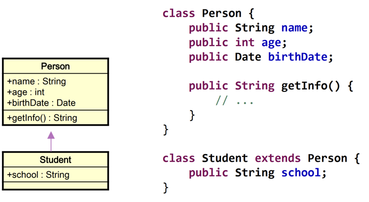
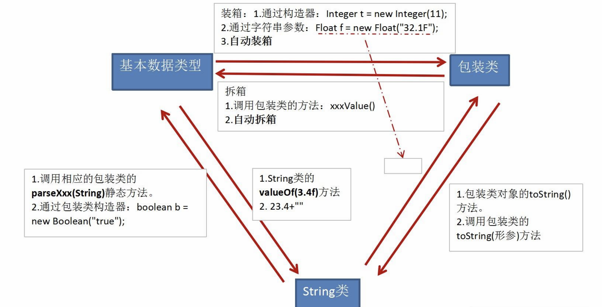

# Java基础

## 配置与介绍

### JDK配置

#### Windows

| 环境变量  | 配置                 |
| --------- | -------------------- |
| JAVA_HOME | D:\Java\jdk-18.0.1.1 |
| Path追加  | %JAVA_HOME%\bin      |

#### Linux

```shell
# 1.下载tar.gz后缀的
#把下载的文件 jdk-8u151-linux-x64.tar.gz 放在/usr/java/目录下。
# 2.在/usr/目录下创建java目录，
mkdir /usr/java
cd /usr/java
# 3.解压 JDK
tar -zxvf jdk-8u151-linux-x64.tar.gz
# 4.设置环境变量
#修改 /etc/profile
#在 profile 文件中添加如下内容并保存：
set java environment
JAVA_HOME=/usr/java/jdk1.8.0_151        
JRE_HOME=/usr/java/jdk1.8.0_151/jre     
CLASS_PATH=.:$JAVA_HOME/lib/dt.jar:$JAVA_HOME/lib/tools.jar:$JRE_HOME/lib
PATH=$PATH:$JAVA_HOME/bin:$JRE_HOME/bin
export JAVA_HOME JRE_HOME CLASS_PATH PATH
#注意：其中 JAVA_HOME， JRE_HOME 请根据自己的实际安装路径及 JDK 版本配置。
#让修改生效：
source /etc/profile
# 5.测试
java -version
#显示 java 版本信息，则说明 JDK 安装成功：
java version "1.8.0_151"
Java(TM) SE Runtime Environment (build 1.8.0_151-b12)
Java HotSpot(TM) 64-Bit Server VM (build 25.151-b12, mixed mode)
```

### Java介绍

| Java平台 | 说明       |
| -------- | ---------- |
| JavaSE   | 标准版     |
| JavaEE   | 企业版     |
| J2ME     | 嵌入式系统 |

| Java | 说明                                       |
| ---- | ------------------------------------------ |
| JDK  | Java Development Kit（Java开发工具包）。   |
| JRE  | Java Runtime Environment（Java运行环境）。 |

  

- Java是一种简单的、面向对象的、分布式的、强壮的、安全的、体系结构中立的、高性能的、多线程的和动态的语言。
- **Java是单继承的语言**， 其接口可以实现多继承。

## 基本语法

- Java语言是面向对象的程序设计语言，Java程序的基本组成单元就是类，类体中又可包括属性与方法两部分。
- 主类：包含main()方法的类。每一个Java本地应用程序都必须包含一个main()方法，main()方法为Java应用程序的入口。
- 一个完整的主类结构通常由定义包语句、定义类语句、定义主方法语句、定义变量语句和导入API类库5部分组成。

### 变量

**命名规则**

- 26个英文字母大小写，`0-9，_，$`。
- 数字不可以开头。
- 不能使用关键字和保留字。
- 严格区分大小写。
- 不能包含空格。

| 命名规范      | 说明                                                         | 示例    |
| ------------- | ------------------------------------------------------------ | ------- |
| 包名          | 多单词时都小写                                               | xxxyyy  |
| 类名/接口名   | 多单词时每个单词首字母大写                                   | XxxYy   |
| 变量名/方法名 | 多单词时第一个单词首字母小写，<br />第二个单词开始每个单词首字母大写 | xxxYyy  |
| 常量名        | 所有字母都大写，多单词用下划线连接                           | XXX_YYY |

| 变量     | 声明位置         | 具体类型                                   | 初始化值特点           |
| -------- | ---------------- | ------------------------------------------ | ---------------------- |
| 成员变量 | 方法体外且类体内 | 实例变量<br />类变量（static）             | 生命周期               |
| 局部变量 | 方法体内         | 形参<br />方法局部变量<br />代码块局部变量 | 除形参外，均要显式初始 |

- 变量：内存中的一个存储区域，该区域的数据可以在同一类型范围内不断变化。变量是程序中最基本的存储单元，包含变量类型、变量名、存储的值。  

- 定义变量：告诉编译器（compiler）这个变量是属于哪一种数据类型，这样编译器才知道需要配置多少空间给它，以及它能存放什么样的数据。

1. Java每个变量必须先声明，后使用。
2. 使用变量名来访问这块区域的数据。
3. 变量的作用域：其定义所在的一对`{}`（函数体）内，变量只有在其作用域内才有效。由于变量被定义出来后，只是暂存在内存中，等到程序执行到某一个点后，该变量会被释放掉，也就是说变量有它的生命周期。因此变量的有效范围是指程序代码能够访问该变量的区域，若超出该区域访问变量则编译时会出现错误。在程序中，一般会根据变量的有效范围，将变量分为“成员变量”和“局部变量”。
4. 同一个作用域内，不能定义重名的变量。

- 系统的内存可大略的分为3个区域：系统区（OS）、程序区（Program）、数据区（Data）。当程序执行时，程序代码会加载到内存中的程序区，数据暂时存储在数据区中。

 


### 基本数据类型


> String不是基本数据类型，属于引用数据类型。  

| 整型  | 存储空间 | 标识 |
| ----- | -------- | ---- |
| byte  | 1 Byte   |      |
| short | 2 Byte   |      |
| int   | 4 Byte   | 默认 |
| long  | 8 Byte   | l、L |

```java
byte b1 = -128;
byte b2 = 128; //错误，超出范围-128~127

//声明long型常量须后加‘l’或‘L’，否则默认int
long l2 = 123456789010; //错误，认为是int自动转long，大于2^31，超过int的范围。
```

| 浮点类型         | 标识       | 存储空间 | 表数范围                                      |
| ---------------- | ---------- | -------- | --------------------------------------------- |
| float（单精度）  | f、F       | 4 Byte   | -3.403E38~3.403E38<br />尾数精确到7位有效数字 |
| double（双精度） | d、D、缺省 | 8 Byte   | -1.798E308~-1.798E308<br />精度是float的两倍  |

```java
//声明float型常量，须后加‘f’或‘F’。否则默认double
float f2 = 12.3  //编译失败：被认为是自动类型转换，但不能自动大转小。
```

- char：字符（2 Byte），使用单引号。

> Java中的所有字符都使用Unicode编码。

```java
//1. 中文、数字、字母等Unicode码支持的
char c2 = '中';

//2. 换行符
char c3 = '\n'; //换行

//3. ASCII码
char c1 = 97; //'a'

//4. Unicode 值来表示字符型常量：‘\uXXXX’（XXXX代表一个十六进制整数）。
char c4 = '\u0043';
```

- boolean：取值只能是true、false。不可以使用0、非0的整数、null替代。

> Java虚拟机中没有任何供boolean值专用的字节码指令。
>
> Java语言表达所操作的boolean值，在编译之后都使用JVM中的int数据类型来代替：true用1表示，false用0表示。

- 默认初始化值：整数类型和char都是0、小数都是0.0、boolean是false。 （long、float需要带上标识符）

#### 类型转换

- boolean类型不可以转换为其它的数据类型，也不能与其它数据类型运算。
- byte、short、char之间不会相互转换：如果操作数的类型低于int类型，则自动转换为int类型（++、--除外）。（不兼容的错误，可能损坏数据，编译不予通过。）


| 转换方式 | 说明                                                         |
| -------- | ------------------------------------------------------------ |
| 自动提升 | 容量小的类型自动转换为容量大的数据类型。<br />多种类型的数据混合运算：自动将所有数据转换成容量最大的数据类型，再进行计算。 <br />当为变量赋值的数据类型与变量类型不一致，并且赋值的数据类型级别低于变量类型的级别时，自动数据类型转换会将赋值数据自动转换为变量的类型。 |
| 强制转换 | 强转符：`(数据类型)变量`<br />可能造成精度降低或溢出。       |

   

```java
//转为byte超过精度范围
int i2 = 128;
byte b1 = (byte)i2;   //-128

int i3 = 200;
byte b2 = (byte)i3; //-56
 
int i4 = 2000;
byte b3 = (byte)i4; //-48 
```

#### int 进制

```java
int num1 = 0b110;
int num2 = 110;
int num3 = 0127;
int num4 = 0x110A;
```

### 运算符

| 运算方向 | 优先级从高到低         |
| -------- | ---------------------- |
|          | `. () {} ; ,`          |
| R->L     | `++ -- ~ !(type)`      |
| L->R     | `* / %`                |
| L->R     | `+ -`                  |
| L->R     | `<< >> >>>`            |
| L->R     | `< > <= >= instanceof` |
| L->R     | `== !=`                |
| L->R     | `&`                    |
| L->R     | `^`                    |
| L->R     | `|`                    |
| L->R     | `&&`                   |
| L->R     | `||`                   |
| R->L     | `?:`                   |
| R->L     | `= *= /= %=`           |
| R->L     | `+= -= <<= >>=`        |
| R->L     | `>>>= &= ^= |=`        |

- % ：如果对负数取模，忽略模数负号，取正值计算。
- /：整数之间做除法时，只保留整数部分而舍弃小数部分。
- 只有单目运算符、三元运算符、赋值运算符是从右向左运算的。
- 赋值运算符支持连续赋值。

```java
int a,b;
a = b = 1;
```

- `==`比较基本数据类型的大小、引用类型的地址值。

#### + 加号与连接符

| +      | 说明                                                         |
| ------ | ------------------------------------------------------------ |
| 加号   | 除boolean外的任何基本数据类型之间的计算。<br />（char和数值进行计算时，相当于对char的ASCII码值进行加减） |
| 连接符 | 任何基本数据类型使用+和String连接时。<br />String和其他基本数据类型有且只能是连接运算（包括boolean）。 |

```java
//String的连接
System.out.println("" + 1 + 2); //12
System.out.println(1 + 2 + ""); //3
```

#### i++、++i

| 自增/自减 | 说明                                |
| --------- | ----------------------------------- |
| i++、i--  | 先返回值，再进行自增/自减。         |
| ++i、--i  | 先进行自增/自减，再返回计算后的值。 |

```java
//++、-- 不会改变数据类型
byte b1 = 127;
b1++; //-128
```

```java
(num++)++ //错误
```

#### `?:` 三元运算符

```java
条件表达式 ? 表达式1 ：表达式2；
```

- `?:`要求返回一个结果。 条件表达式为boolean类型，true则返回表达式1，false则返回表达式2。  表达式1和表达式2为要求是同种类型,或者可自动转换（自动将类型转换为最高的一个） 。

#### 逻辑运算

  

- `&` 左边无论真假，右边都进行运算。
- `&&`（短路）如果左边为真，右边参与运算，如果左边为假，那么右边不参与运算。

#### 位运算

   

| 运算符 | 说明                                           | 运算                          |
| :----- | :--------------------------------------------- | ----------------------------- |
| a & b  | 有0则0                                         | 若a=1100，b=1010；则a&b=1000  |
| a \| b | 有1则1                                         | 若a=1100，b=1010；则a\|b=1110 |
| a ! b  | 不同则1，同则0                                 | 若a=1100，b=1010；则a!b=0110  |
| a >> b | 将a的二进制右移b位；相当于a除以2^b（注意范围） | 若a=8,b=2；则a>>b=2           |
| a << b | 将a的二进制左移b位；相当于a乘以2^b（注意范围） | 若a=8,b=2；则a<<b=32          |

### 数组

- 数组（Array）：多个相同类型数据按一定顺序排列的集合，并使用一个名字命名，并通过编号的方式对这些数据进行统一管理。

- 数组本身是引用数据类型，而数组中的元素可以是任何数据类型。创建数组对象会在内存中开辟一整块连续的空间，而数组名中引用的是这块连续空间的首地址，故数组的长度一旦确定就不能修改。

- 数组从维度、数据类型来区别。

```java
int[] arr1;
//int 数据类型
//[] 维度
```

```java
//一维数组
int[] arr; //还未分配空间
//静态初始化
int[] arr = new int[]{1,2,3};
//动态初始化
int[] arr = new int[3]; //对数组默认初始化

//多维数组（以二维为例）相当于数组内保存对其他数组的引用。
int[][] arr; //还未分配空间
int[][] arr = new int[3][]; //3xn
int[][] arr = new int[3][3]; //3X3
int[][] arr = {
    {1,2},
    {1,2,3}
};
```

- 数组索引调用 0开始，-1结尾。ArrayIndexOutofBoundsExcetion、NullPointerException。

```java
arr[0];
arr[-1];
```

### 流程控制

> 顺序结构：程序从上到下逐行地执行，中间没有任何判断和跳转。

#### 分支结构

##### if...else

- 条件返回的必须是boolean类型。

```java
if(条件) //代码

if(条件1){
    //执行代码块;
} else if(条件2){
    //执行代码块;
} else{
    //执行代码块;
}
```

##### switch-case

> 凡是可以使用switch-case结构的都可以使用if-else。反之，不成立。

- `case:`：根据switch表达式中的值，一次匹配各个case中的常量，一旦匹配成功，则进入相应的case结构中，调用其执行语句。当调用完执行语句以后，则仍然继续向下执行其他case结构中的执行语句，直到遇到break关键字或者此swtich-case结构末尾结束为止。

1. case子句中的值必须是常量，不能是变量名或不确定的表达式值。
2. break语句用来在执行完一个case分支后使程序跳出switch语句块。如果没有break，程序会顺序执行到switch结尾。（控制流贯穿问题）
3. default子句是可任选的，位置也是灵活的（放哪都是最后执行的）。当没有匹配的case时，执行default。

```java
switch(表达式){
    case 常量1:
        语句1;
        break;
    case 常量2:
        语句2;
        break;
        … …
            case 常量N:
        语句N;
        break;
    default:
        语句;
        break;
}
```

> `case->`：case中任意一个匹配成功，箭头右侧的代码都被执行，且在这些代码结束之后，不会产生控制流贯穿问题。 
>
> ```java
> switch(值){
>         case 匹配值 -> 语句; 
> }
> ```

- yield：yield返回一个值作为switch语句的返回值。return 会直接跳出当前循环或者方法，而 yield 只会跳出当前switch块。

```java
int opt = switch(fruit){
    case "apple" -> 1;
    case "banana" -> 2;
    default -> {
        int code = fruit.hashCode();
        yield code;
    }
};
```

#### 循环结构

##### for

```
//执行过程：①-②-③-④-②-③-④-②-③-④-.....-②
for (①初始化部分; ②循环条件部分; ④迭代部分){
    ③循环体部分;
}
```

- 循环条件部分为boolean类型表达式，当值为false时，退出循环。在每次开始循环前执行检查（在循环失败时也执行了一次）。
- 初始化部分和循环条件部分可以声明/更新多个变量，但必须是同一个类型，用逗号分隔。初始化部分若声明变量，则该变量只在该循环中有效，且只在第一次循环开始前声明。循环条件部分声明的变量在每次循环开始前都会再次声明。

> for循环中的①-②-③-④均可以省略。
>
> ```java
> for(;;)
> ```

```java
//没有大括号时：
for (int i = 0; i < 10; i++)
    //循环内
    if (i == 2)
        break;
//循环外
//if(i == 1) //错误
```

##### forEach

```
for(类型 标识符: 可迭代类型的表达式) {
    语句;
} 
```

```java
int[] numbers = new int[] {1,2,3,4,5,6,7,8,9,10};

for(int element : numbers) {
    System.out.println(element);
}
```

##### while

```
//执行过程：①-②-③-④-②-③-④-②-③-④-...-②
①初始化部分
while(②循环条件部分)｛
    ③循环体部分;
    ④迭代部分;
}
```


1. for和while的初始化作用域范围不同：for 只在循环内部，而while在外部。
2. for和while的迭代最终值不同（若为i时）。

```java
int i = 1;
while (i <= 100){
       result += i;
       i++;
}
// i = 101; 满足条件 i <= 100 后仍然i++;i++之后才不满足条件则停止，会比范围多1
//其i++本质上是执行语句

for(int i = 1; i <= 100; i++){
    ...    
}
//i = 100; 执行到 i <= 100 就停止;不会超过范围
```

##### do...while

```
//执行过程：①-③-④-②-③-④-②-③-④-...②
①初始化部分;
do{
    ③循环体部分
    ④迭代部分
}while(②循环条件部分);
```

- do-while循环至少执行一次循环体（不满足条件的时候也会执行一次），但如果满足执行多次，do...while和while没有区别，并不会多出1次。

   

##### 嵌套循环

- 嵌套循环就是把内层循环当成外层循环的循环体。当只有内层循环的循环条件为false时，才会完全跳出内层循环，才可结束外层的当次循环，开始下一次的循环。设外层循环次数为m次，内层为n次，则内层循环体实际上需要执行`m*n`次。

#### 循环关键字

> return结束方法，也可结束循环

| 关键字         | 说明                                                         |
| -------------- | ------------------------------------------------------------ |
| break          | 终止某个语句块的执行，跳出最近的一个循环体。                 |
| 带label的break | 在多层嵌套的语句块中时，可以通过标签指明要终止的是哪一层语句块。 |
| continue       | 跳过其所在循环语句块的一次执行，继续下一次循环。             |
| continue       | 在多层嵌套的循环语句体中时，可以通过标签指明要跳过的是哪一层循环。 |

```java
label1: { ……
label2:     { ……
label3:         { ……
                break label2;
                ……
                }
            }
        }
```

## OOP 面向对象程序设计

- 面向对象：封装性、继承性、多态性、（抽象性）。

| 思想                          | 说明                                                         |
| ----------------------------- | ------------------------------------------------------------ |
| POP<br />（面向过程程序设计） | 强调功能行为。<br />以函数为最小单位，考虑怎么做。           |
| OOP<br />（面向对象程序设计） | 强调具备功能的对象。<br />以类/对象为最小单位，考虑谁来做 。 |

- 类：对一类事物的描述，是抽象的，概念上的定义。
- 对象（实例）：实际存在的该类事物的每个个体。如果创建了一个类的多个对象，则每个对象都独立的拥有一套类的实例属性（非static的）。
- 匿名对象：不定义对象的句柄（创建的变量没有显式的赋给一个变量名），而直接调用这个对象的方法，调用之后就等待垃圾回收。对一个对象只需要进行一次方法调用、将匿名对象作为实参传递给一个方法调用。

```java
new Person().say(); 
```

### OOP三大特性

#### 封装性（隐藏）

>  **高内聚低耦合**
>
> - 高内聚 ：类的内部数据操作细节自己完成，不允许外部干涉。
> - 低耦合 ：仅对外暴露少量的方法用于使用。

- 封装性：隐藏一个类中不需要对外提供的实现细节，只对外公开简单的接口，便于外界调用，从而提高系统的可扩展性、可维护性。属性是封装的最小单位。

> 通常将成员声明为私有的，再提供公共的方法：getXxx()、setXxx()。

**访问权限修饰符**

 

- 权限修饰类的内部结构：属性、方法、构造器、内部类。

- 对于class的权限修饰只可以用public和default（缺省）。
  - public类可以在任意地方被访问。
  - default类只可以被同一个包内部的类访问。   

#### 继承性

- Java只支持单继承和多层继承，不允许多重继承：一个子类只能有一个父类，一个父类可以派生出多个子类。

> 接口允许多重继承。  

- 继承使类与类之间产生关系，提供了多态的前提。
- 继承不改变类成员的访问权限 ：如果父类的成员是公有的、被保护的或默认的，子类仍具有相应的这些特性，并且子类不能获得父类的构造方法。
- 封装性：子类不能直接访问父类中私有的(private)的成员变量和方法 。
- final修饰的类表示最终类，不能被继承。

##### extends 继承

- 子类继承父类的方法和属性：获取了直接父类和所有间接父类中声明的属性和方法。

   

| 关系                 | 说明                                             |
| -------------------- | ------------------------------------------------ |
| 父类（基类）（超类） | 将多个类中相同的属性和方法抽象出来形成的一般类。 |
| 子类（派生类）       | 继承了父类，具有特殊的属性和方法。               |

```java
class Subclass extends SuperClass{ }  
```

##### @Override 重写

- 方法重写（重置、覆盖）：在程序执行时，子类重写的方法将覆盖父类原有的方法。

1. 子类重写的方法必须和父类被重写的方法具有相同的方法名称、参数列表。
2. 子类重写的方法的返回值类型不能大于父类被重写的方法的返回值类型。
   - 父类被重写的方法的返回值是void，则子类重写的方法的返回值类型只能是void
   - 父类被重写的方法的返回值是A类型，则子类重写的方法的返回值类型可以是A类或A类的子类
   - 父类被重写的方法的返回值是基本数据类型，则子类重写的方法的返回值类型必须是相同的基本数据类型(父类double则子类只能是double)。
3. 子类重写的方法使用的访问权限不能小于父类被重写的方法的访问权限。子类不能重写父类中声明为private权限的方法。
4. 子类重写的方法抛出的异常不能大于父类被重写方法抛出的异常。

> static：静态方法是属于类的，不能被重写。

> 重载：允许存在多个同名方法，而这些方法的参数不同。编译器根据方法不同的参数表，对同名方法的名称做修饰。对于编译器而言，这些同名方法就成了不同的方法。它们的调用地址在编译期就绑定了。
>
> - Java的重载是可以包括父类和子类的，即子类可以重载父类的同名不同参数的方法。
>

##### this 当前对象

| this位置   | 说明                     |
| ---------- | ------------------------ |
| 方法内部   | 该方法所属对象的引用     |
| 构造器内部 | 该构造器正在初始化的对象 |

1. 任意方法或构造器内，如果使用当前类的成员变量、成员方法可以在其前面添加this（默认存在）。
2. 区分成员变量和局部变量：当形参与成员变量同名时，如果在方法内或构造器内需要使用成员变量，必须添加this来表明该变量是类的成员变量。
3. this访问属性和方法时，如果在本类中未找到，会从父类中查找。
4. this可以调用类的属性、方法和构造器，可作为一个类中构造器相互调用的特殊格式。

##### super 父类对象

- super：调用父类中的指定操作、表明调用的是父类中的成员，追溯不仅限于直接父类。

| 使用            | 说明                                                     |
| :-------------- | :------------------------------------------------------- |
| super.属性      | 访问父类中定义的属性                                     |
| supere.方法     | 调用父类中定义的成员方法<br>在子类中调用父类被重写的方法 |
| super(形参列表) | 在子类构造器中调用父类的构造器                           |

- this代表本类对象的引用，super代表父类的内存空间的标识

| 比较       | this                                                       | super                                    |
| ---------- | ---------------------------------------------------------- | ---------------------------------------- |
| 访问属性   | 访问本类中的属性，如果本类中没有该属性，则从父类中继续查找 | 直接访问父类中的属性                     |
| 调用方法   | 访问本类中的方法，如果本类中没有该方法，则从父类中继续查找 | 直接访问父类中的方法                     |
| 调用构造器 | 调用本类构造器，必须放在本类构造器的首行                   | 调用父类构造器，必须放在子类构造器的首行 |

#### 多态性

##### 对象的多态性

- 对象的多态性：编译时类型和运行时类型不一致，父类的引用指向子类的对象。内存中实际加载了子类特有的属性和方法，但是由于变量声明为父类类型，导致编译时，只能调用父类中声明的属性和方法，子类特有成员不能被调用。若子类重写了父类方法，则系统不可以把父类被重写的方法转移到子类中，故编译时是父类方法，而运行时是子类重写的方法。
- 对象的多态性不适用于属性（属性的编译和运行都由引用决定）， 父类的属性不会被子类中相同的属性覆盖（编译和运行时都是根据引用的属性，而不是实例的属性）。

| 类型       | 说明                                                         |
| ---------- | ------------------------------------------------------------ |
| 编译时类型 | 由声明该变量时使用的类型（引用）决定<br />编译期，只能调用父类中声明的方法 |
| 运行时类型 | 由实际赋给该变量的对象（实例）决定<br />运行期，实际执行的是子类重写父类的方法 |

```java
Person p = new Student(); 
p.getSchool(); //非法：Person类没有getSchool()成员
```

##### 虚拟方法调用

- 虚拟方法：子类重写了父类的方法，则在对象的多态中，引用（父类）的方法被称为虚拟方法。

| 绑定                     | 说明                                                         |
| ------------------------ | ------------------------------------------------------------ |
| 早绑定<br />（静态绑定） | 对于重载而言，在方法调用之前，编译器就已经确定了所要调用的方法。 |
| 晚绑定<br />（动态绑定） | 父类根据赋给它的不同子类对象，动态调用属于子类的该方法，在运行时才确定方法的调用。 |

```java
//假设Student重写了Person的say()
Person p = new Student(); 
//虚拟方法调用
p.say(); //实际运行的是Student中重写后的say()。
```

##### 对象类型转换

- 造型：引用数据类型的强制转换，无继承关系的引用类型间的转换是非法的。

- instanceof（类型检验符）：（x instanceof A）检验x是否为类A的对象，如果类A是x对象所属类的父类/祖先，则返回true。

 

```java
Person p = new Student(); //向上转型
Stundent s = (Stundent) new Person(); //向下转型
```

### class 类结构

```java
package com.zjk; //包

//导入
import com.zjk.tools.MyTool;
import static com.zjk.tools.MyUse.staticSetName;

//类
public class Person{
    //属性（成员变量）
    private String name;
    private boolean isMarried;

    //代码块
    {

    }

    //构造器d
    public Person(){
        name = "Mac";
        isMarried = true;
    }

    public Person(String name, boolean isMarried){
        this.name = name;
        this.isMarried = isMarried;
    }

    //方法
    public void walk(){
        System.out.println("走路");
    }

    public String display(){
        return "名字：" + name;
    }

    //内部类
    class Pet{
        String name;
        double weight;
    }

} 
```


#### field 属性

 

```
修饰符 数据类型 属性名 = 初始化值 ;
```

- 属性权限修饰符：private、缺省、protected、public。

| 比较                 | 成员变量       | 局部变量                                     |
| -------------------- | -------------- | -------------------------------------------- |
| 声明位置<br />作用域 | 类内部         | 方法形参、方法内部<br />代码块内、构造器内等 |
| 修饰符               | 基本都能使用   | 不能使用权限修饰符，<br />可使用final修饰。  |
| 初始化值             | 有默认初始化值 | 没有默认初始化值                             |
| 内存加载             | 堆、静态域     | 栈                                           |

> 零值初始化：一个对象被创建时，会对其中各种类型的成员变量自动进行初始化赋值。

#### method 方法

```
权限修饰符 返回值类型 方法名(形参列表){
        方法体;    
}
```

> 不能在方法的内部再次声明方法、使用权限修饰符。

##### return 返回

- return：返回所需的值或void、并结束当前方法。

| 返回值   | 说明                                                         |
| -------- | ------------------------------------------------------------ |
| 有返回值 | 如果方法有返回值，则必须在方法声明时，指定返回值的类型。 <br />并使用return关键字来返回指定类型的变量或常量。 |
| 没返回值 | 方法声明时，使用void来表示 <br />不使用return 或 `return;`结束此方法。 |

##### 参数列表

- 方法的参数列表允许直接定义能和多个实参相匹配的形参（个数可变）。

1. 可变参数的参数个数是可变的（0、1、n）。
2. 方法的参数部分的可变形参需要放在形参声明的最后，且最多只能声明一个可变个数形参。

> - JDK 5.0以前：数组形参，传入多个同一类型变量。 （可变形参一定程度上相当于数组形参 ）
>
> ```java
> public static void test(int a, String[] books){};
> ```
>
> - JDK5.0之后：可变个数形参，传入多个同一类型变量。
>
> ```java
> public static void test(int a, String… books){};
> ```

##### 方法重载

- 重载：同一个类中允许存在一个以上的同名方法，只要参数列表不同（个数、类型）即可，与返回值类型无关。调用时，根据方法参数列表的不同来区别。
- 可变个数形参的方法与本类中同名的方法之间，彼此构成重载，但可变参数方法的使用与方法参数部分使用数组是一致的不能构成重载（不能共存）。

##### 值传递机制

> Java里方法的参数传递方式只有值传递。 

| 数据类型                         | 赋值   | 说明                                                         |
| -------------------------------- | ------ | ------------------------------------------------------------ |
| 基本数据类型                     | 数据值 | 内容的改变对实参没有任何影响。                               |
| 引用数据类型<br />（包括String） | 地址值 | 对象的内容可以在方法中改变，对象的引用不会改变。 <br />但String具有不可变性。 |

#### 构造器 new

- 构造器：创建对象、给对象进行初始化。每个类都至少有一个构造器，一个类可以创建多个重载的构造器，构造器具有与类相同的名称。

- 构造器不是类的方法。不能有return语句返回值、不声明返回值类型、不能被static、final、synchronized、abstract、native修饰、父类的构造器不可被子类继承。

```
权限修饰符 类名 (参数列表) {
    初始化语句；
} 
```

| 构造器                               | 说明                                                         |
| ------------------------------------ | ------------------------------------------------------------ |
| 隐式空参构造器<br />（系统默认提供） | 若没有显式的定义类的构造器的话，则系统默认提供一个空参的构造器。<br />默认构造器的修饰符与所属类的修饰符一致。 |
| 显式定义构造器<br />（无参、有参）   | 一旦显式定义了构造器，则系统不再提供默认构造器（空参）。     |

- 子类中所有的构造器默认都会访问父类中空参数的构造器（子类至少有一个构造器调用了父类的构造器 ）：this/super必须在类的构造器的首行，且一个构造器中最多只能存在一个this/super。构造器中使用this调用本类中重载的其他的构造器，但不能通过this调用自身。如果一个类中声明了n个构造器，则最多有 n - 1个构造器中使用了this。如果子类构造器没有在首行显式调用父类或本类的构造器，且父类中又没有无参的构造器，则编译出错。父类中没有空参数的构造器时，子类必须通过this(参数列表) 或 super(参数列表)在构造器的首行指定调用本类/父类中相应的构造器，且只能选择其中一种构造器。

```java
class Person{
    private String name;
    private int age;

    public Person() {
        //this(); //错误 构造器中不能通过this调用自身。
        this(age) //错误 与Person(int age)[有this()]形成一个死循环
    }

    public Person(String name) {
        this();  //调用Person()
        this.name = name;
    }
}
```

- 从过程上来看，当通过子类的构造器创建子类对象时，一定会直接/间接的调用其父类的构造器，继而调用其父类的父类的构造器，直到调用了java.lang.Obeject类中空参的构造器为止。无论哪个构造器创建子类对象，必须保证先初始化父类。子类继承父类中所有的属性和方法，因此子类有必要知道父类如何为对象进行初始化。正因为加载过所有父类的构造器，所以才可以看到内存中有父类中的结构，子类对象才可以考虑进行调用。虽然在创建子类对象时，调用了父类的构造器，但就只创建了一个对象，即为new的子类对象。


      

#### 代码块（初始化块）

- 代码块：对Java类或对象进行初始化。代码块有且只能使用static修饰（静态代码块） 用于初始化static的属性。

```java
class Person {
    public static int total;

    static {
        total = 100;//为total赋初值
    }
    …… //其它属性或方法声明
}
```


| 比较     | 非静态代码块                                                 | 静态代码块（static）                                         |
| -------- | ------------------------------------------------------------ | ------------------------------------------------------------ |
| 相同     | 可以有输出语句                                               | 可以有输出语句                                               |
| 初始化   | 可以对非静态的属性初始化。<br />                             | 可以对静态属性、类的声明进行初始化操作。<br />不可以对非静态的属性初始化。 |
| 调用     | 除了调用非静态的结构外，还可以调用静态的变量或方法。         | 不可以调用非静态的属性和方法。                               |
| 执行顺序 | 每次创建对象的时候，都会执行一次。且先于构造器执行。  <br />若有多个非静态的代码块，那么按照从上到下的顺序依次执行。 | 若有多个静态的代码块，那么按照从上到下的顺序依次执行。 <br />静态代码块的执行要先于非静态代码块<br />静态代码块随着类的加载而加载，且只执行一次。 |

#### package 包

- Java中包是相关类与接口的一个集合，它提供了类的命名空间的管理和访问保护。以包为单位的独立命名空间，位于不同包中的类即使同名也不会冲突，解决了命名冲突的问题。 
- 包具有特定的访问控制权限，同一个包中的类之间拥有特定的访问权限（缺省）。
- 包对应于文件系统的目录（路径），package语句中，用 “.” 来指明包(目录)的层次；通常用小写单词标识。通常使用所在公司域名的倒置：com.atguigu.xxx。

| 常见包    | 说明                                                         |
| --------- | ------------------------------------------------------------ |
| java.lang | Java语言的核心类，如String、Math、Integer、 System和Thread，提供常用功能。 |
| java.net  | 执行与网络相关的操作的类和接口                               |
| java.io   | 能提供多种输入/输出功能的类                                  |
| java.util | 一些实用工具类，如定义系统特性、接口的集合框架类、使用与日期日历相关的函数。 |
| java.text | 一些java格式化相关的类                                       |
| java.sql  | JDBC数据库编程的相关类/接口                                  |
| java.awt  | 构成抽象窗口工具集（abstract window toolkits）的多个类，这些类被用来构建和管理应用程序的图形用户界面(GUI) |

- package：指定一个源文件中的类属于一个特定的包。在每个Java源程序中只能有一条，且必须在程序的第一行，该行前可以有空格或注释行。一个类只能属于一个包。如果源文件中没有package语句，则指定为无名包。无名包没有路径，一般情况下，会把源文件中的类存储在当前目录（即存放Java源文件的目录）下。
- 包中的成员是指包中的类和接口：只有public类型的成员才能被包外的类访问。先引入包成员/整个包，之后使用短名(short name,类名或接口名)引用包成员。

```java
package pkg1[.pkg2[.pkg3...]];
```

```java
package graphics;
//Circle类成为graphics包中的一个public成员，并存放在classPath\graphics目录中。
public class Circle extends Graphic implements Draggable{
    ...
}
```

#### import 引入

```java
import [static] pkgl[.pkg2[.pkg3.].(classname|*)；
//pkgl[.pkg2[.pkg3…]表明包的层次，与package语句相同，它对应于文件目录，classname则指明所要引入的类。
```

> java.lang包：如果导入的类/接口是该包的，或者是当前包下的，则可以省略此import语句。

1. import必须在源程序所有类声明之前，在package语句之后，显式的导入指定包下的类或接口。已经导入的包，如果需要使用其子包的成员，则还需要导入该子包。
2. import static：调用指定类/接口下的静态的属性/方法。
3. 通配符(`*`)(`java.util.*`)，一次性导入util包下所有的类或接口。
4. 不同包下的同名的类：需要使用类的全限定名指明调用的是哪个类。

> java.util.Date、java.sql.Date。

### 内部类

- 在Java中，允许一个类的定义位于另一个类的内部，前者称为内部类，后者称为外部类。
- 内部类一般用在定义它的类或语句块之内，在外部引用它时必须给出完整的名称。内部类的名字不能与包含它的外部类类名相同。
- 成员内部类和局部内部类仍然是一个独立的类，在编译以后都会生成字节码文件。

| 内部类     | 字节码文件                    | 组成                                       |
| ---------- | ----------------------------- | ------------------------------------------ |
| 成员内部类 | `外部类$内部类名.class`       | static成员内部类<br />非static成员内部类   |
| 局部内部类 | `外部类$数字 内部类名.class ` | 方法内，代码块内，构造器内<br />匿名内部类 |

#### 成员内部类

- 成员内部类作为外部类的成员：

1. 权限修饰：private、protected、缺省、public。
2. 成员内部类可以直接使用外部类的所有成员，包括私有的数据。
3. 若被static修饰，则不能再使用外层类的非静态成员。非static的成员内部类中的成员不能声明为static的，只有在外部类或static的成员内部类中才可声明static成员。

- 成员内部类作为一个类：

1. 可在内部定义属性、方法、构造器等结构。外部类访问成员内部类的成员：需要“内部类.成员”、“内部类对象.成员”的方式。
2. 可被abstract、final修饰。

```java
class 外部类{
    
    class 成员内部类{
        
    }
}
```

#### 局部内部类

- 局部内部类：只能在声明它的方法或代码块中使用，而且是先声明后使用，除此之外的任何地方都不能使用该类。但是它的对象可以通过外部方法的返回值返回使用，返回值类型只能是局部内部类的父类或父接口类型。
- 局部内部类可以使用外部类的成员，包括私有的。
- 局部内部类可以使用外部方法的final局部变量（由局部内部类和局部变量的生命周期不同所致）。

> - JDK7之前，要求此变量显式声明为final
> - JDK8之后，可以省略final的声明(自动补上)

- 局部内部类和局部变量地位类似：不能使用权限修饰符、不能被static修饰、不能包含static成员。

```java
class 外部类{
    
    方法(){
        class 局部内部类{}
    }
    
    {
        class 局部内部类{}
    }
}
```

```java
public class InnerClassTest {

    public void method() {
        //局部变量
        final int num = 10;
        //局部内部类可以使用外部方法的局部变量，但是必须是final的。
        class AA {
            public void show() {
                System.out.println(num);
            }
        }
    }
}
```


#### 匿名内部类

- 匿名内部类不能定义任何静态成员、方法和类，只能创建匿名内部类的一个实例（在父类构造器隐含实现一个接口或实现一个类）。

```
new 父类构造器（实参列表）|实现接口(){
    //匿名内部类的类体部分
}
```

- 匿名内部类必须继承父类或实现接口、只能有一个对象、 只能使用多态形式引用。

### interface 接口

- 接口（interface）：规范、定义的是一组规则，体现了现实世界中“如果你是/要...则必须能...”的思想。

> 继承是一个"是不是"的关系，而接口实现则是 "能不能"的关系。
>
> 接口的本质是契约、标准、规范。

- 接口：抽象方法和常量值定义的集合、接口和类是并列关系、接口中没有构造器（不能实例化）。
- 实现类（实现接口的类）必须提供接口中所有方法的具体实现内容（重写接口中的所有抽象方法）， 才可实例化。否则，必须作为抽象类。
- 接口采用多继承机制：一个类可以实现（implements）多个接口，也可以继承（extends）多个接口（接口是多继承的，而类是单继承的）。

```java
interface SubInterface extends SuperClass1,SuperClass2 
    implements InterfaceA,InterfaceB{
    ...
}
```

| 接口成员          | 修饰                | 方法体 |
| ----------------- | ------------------- | ------ |
| 全局常量 （默认） | public static final |        |
| 抽象方法 （默认） | public abstract     | 无     |
| 静态方法          | static              | 有     |
| 默认方法          | deafult             | 有     |

- 默认方法：只能通过实现类对象来调用，如果实现类重写了接口中的默认方法，则调用重写后的方法。实现类可以不重写默认方法，而是使用接口中定义的默认方法。

> - JDK7之前：只能定义全局常量和抽象方法。
> - JDK8之后：除了定义JDK7之前的，还可以定义静态方法pulic static、默认方法。

- 接口冲突：若一个接口中定义了一个默认方法，而另一个接口中也定义了一个同名同参数的方法（与是否是默认方法无关），在实现类同时实现了这两个接口时。实现类必须重写接口中同名同参数的方法，来解决冲突。
- 类优先原则：若一个接口中定义了一个默认方法，而父类中也定义了一个同名同参数的非抽象方法，则不会出现冲突问题。子类在没有重写此方法的情况下，默认调用父类同名同参的方法，接口中具有相同名称和参数的默认方法会被忽略。

| 继承/实现 | 调用父类/接口方法 |
| --------- | ----------------- |
| 父类      | super.方法()      |
| 接口      | 接口.super.方法() |


### static 静态成员

- static修饰的属性、方法、代码块、内部类作为静态成员。
- 静态成员（类成员）：随着类的加载而加载、优先于对象存在、被该类的所有对象所共享、可直接被类调用。
- 由于类只加载一次，则静态变量在内存中也只会存在一份，存在方法区的静态域中。

| 对比   | 实例变量                                                     | 静态变量（静态属性）（类变量）                               |
| ------ | ------------------------------------------------------------ | ------------------------------------------------------------ |
| 所有权 | 归某个对象所有。<br />每个对象都独立的拥有一套类中的非静态属性。 | 归类所有。<br />类的多个对象共享同一个静态变量。             |
| 修改   | 修改其中一个对象中的非静态属性时，不会导致其他对象中同样的属性值的修改。 | 某一个对象修改静态变量时，其他对象也将使用修改后的静态变量。 |

- 静态方法中只能调用静态的方法或属性（生命周期：非静态成员比静态成员晚加载），非静态方法中既可以调用静态的也可以调用非静态的方法或属性。

- 静态方法内不能使用this或super关键字、不能被重写。

### final 终值

- final标记的类不能被继承、标记的方法不能被子类重写、标记的变量（成员变量、局部变量）名称大写且只能被赋值一次。
- final标记的成员变量必须要么在声明时赋值，要么在**每个**构造器/代码块显式赋值。

> 如果在构造器中为final赋值，则每个构造器中都应该要为final赋值。

```java
public void addOne(final Other o) {
    // o = new Other(); //o的地址值不能改变
    o.i++; //但是o的地址值中的内容可以改变 
}
```

### abstract 抽象

| 修饰     | 说明                                                         |
| -------- | ------------------------------------------------------------ |
| 抽象类   | 抽象类不能被实例化，可以被继承，可以使用多态。<br />抽象类中一定有构造器，便于子类实例化时调用。<br />提供抽象类的子类，让子类对象实例化，完成相关操作。 |
| 抽象方法 | 抽象方法只有方法的声明，没有方法的实现，以分号结束，没有代码块{}。<br />含有抽象方法的类必须被声明为抽象类，而抽象类中不一定拥有抽象方法，可以有普通的方法。<br />抽象类的子类必须重写父类以及祖先的抽象方法，并提供方法体，才可以进行实例化。<br />子类若没有重写全部的抽象方法，仍为抽象类，使用abstract修饰，不能进行实例化。 |

1. 不能用abstract修饰变量、代码块、构造器；
2. 不能用abstract修饰私有方法private、静态方法static、final方法、final类。

## 常用类

### Object 根父类

- java.lang.Object（根父类）：所有的java类(除java.lang.Object类之外)都直接或间接的继承于java.lang.Object类。  

> 数组也可以作为Object类的子类出现，可以调用Object类中声明的方法。

- 如果在类的声明中未使用extends关键字指明其父类，则默认父类为java.lang.Object类。

#### equals()

| ==                                                           | equals()                                                     |
| :----------------------------------------------------------- | :----------------------------------------------------------- |
| 基本类型比较值：只要两个变量的值相等，即为true。(不一定类型相等)<br>引用类型比较引用(是否指向同一个对象)：只有指向同一个对象时，==才返回true。 | 只能比较引用类型：比较两个对象的实体内容是否相同             |
| 符号两边的数据类型必须兼容(可自动转换的基本数据类型除外)，否则编译出错 | 将比较的字符串放在之前，避免可能出现的空指针异常：`"".equals(str)` |

```java
public boolean equals(Object obj){
    return (this == obj);
}
```

- File、String、Date及包装类（Wrapper Class）等：重写了Object类的equals()方法。

- String类中的equals()重写：

```java
public boolean equals(Object anObject) {
    if (this == anObject) {
        return true;
    }
    return (anObject instanceof String aString)
        && (!COMPACT_STRINGS || this.coder == aString.coder)
        && StringLatin1.equals(value, aString.value);
}
```

#### hashCode()

- 返回一个int类型的哈希值，由对象中一般不变的属性映射得到。
- 相同对象的哈希值必须相同，不同对象的哈希值有可能相同。
- 子类如果重写了equals()方法，也必须重写hashCode()方法：对两个对象，如果equals()返回true，则其hashCode也必须相同。
- 哈希值通常是质数：

**基本原则**

- 在程序运行时，同一个对象多次调用 hashCode() 方法应该返回相同的值。
- 当两个对象的 equals() 方法比较返回 true 时，这两个对象的 hashCode() 方法的返回值也应相等。
- 对象中用作 equals() 方法比较的 Field，都应该用来计算 hashCode 值。

**问题：为什么复写hashCode方法，有31这个数字？**

- 选择系数的时候要选择尽量大的系数。因为如果计算出来的hash地址越大，所谓的“冲突”就越少，查找起来效率也会提高。（减少冲突）
- 并且31只占用5bits,相乘造成数据溢出的概率较小。
- 31可以 由`i*31== (i<<5)-1`来表示,现在很多虚拟机里面都有做相关优化。（提高算法效率）
- 31是一个素数，素数作用就是如果我用一个数字来乘以这个素数，那么最终出来的结果只能被素数本身和被乘数还有1来整除！(减少冲突)

#### toString() 

- 输出一个对象的引用时，实际上就是调用当前对象的toString()
- toString()方法在Object类中定义，其返回值是String类型，返回类名和它的引用地址。

> Java中的地址值并不是真实的物理地址值，而是hashCode算出来的虚拟地址值

```java
public String toString(){  
    return getClass().getName + "@" + Integer.toHexStrign(hashCode());
}
```

- String、Date、File、包装类等都重写了Object类中的toString()，自定义类也可以重写toString()方法，当调用此方法时，返回对象的实体内容。
- String与其它类型数据的连接时，自动调用toString()方法。
- 基本类型数据转换为String类型时，调用对应包装类的toString()方法。

```java
System.out.println("now=" + 1); 
//System.out.println("now=" + Integer.valueOf(1).toString());
```

- char[]数组（String的底层存储）输出字符串，其他数组都是地址值。

```java
char[] arr = new char[] { 'a', 'b', 'c' };
System.out.println(arr); //abc

int[] arr1 = new int[] { 1, 2, 3 };
System.out.println(arr1); //[I@37d31475
```

### 包装类

| 基本类型 | 包装类    |
| :------- | :-------- |
| boolean  | Boolean   |
| byte     | Byte      |
| short    | Short     |
| int      | Integer   |
| long     | Long      |
| float    | Float     |
| double   | Double    |
| char     | Character |

- 自动装箱/拆箱：在包装类和基本数据类型之间自动调用以下两个方法进行转换。

| 方法                     | 说明 |
| :----------------------- | :--- |
| 包装类.valueOf(基本类型) | 装箱 |
| 包装类对象.xxxValue()    | 拆箱 |

```java
Integer a = 1; //自动装箱：Integer a = Integer.valueOf(1)
int b = a; //自动拆箱：int b = a.intValue();
```



> new获取包装类对象的方式已经过时。new每次都会创建新的对象，而包装类（除了Float和Double）都缓存了包装类对象，通过valueOf()的方式可以减少对象的创建。
>
> ```java
> Integer a = new Integer(1);
> ```

### String 字符串

- String（字符串）：Java 程序中的所有字符串字面值都作为此类的实例实现。
- String是一个final类，代表不可变的字符序列，实现Serializable接口、Comparable接口。
- 字符串（双引号）是常量，值在创建之后不能更改。String内部定义了final char[] value用于存储字符串数据。
- 字符串常量池中是不会存储相同内容（String#equals()==true）的字符串的。

#### 不可变性

1. 当字符串重新赋值时，需要重新指定内存区域赋值，不能使用原有的value进行赋值。
2. 当对现有的字符串进行连接操作时，也需要重新指定内存区域赋值，不能使用原有的value进行赋值。
3. 当调用String的replace()方法修改指定的字符或字符串时，也需要重新指定内存区域赋值，不能使用原有的value进行赋值。

    
    

    

```java
public class StringTest {
    String str = new String("good");
    char[] ch = {'t', 'e', 's', 't'};

    public void change(String str, char ch[]) {
        str = "test ok";
        ch[0] = 'b';
    }

    public static void main(String[] args) {
        StringTest ex = new StringTest();
        ex.change(ex.str, ex.ch);
        System.out.println(ex.str);//good
        //String的不可变性
        System.out.println(ex.ch);//best
    }
}
```

#### 实例化

**String s = new String("abc")；方式创建对象，在内存中创建了几个对象？**

- 两个：一个堆空间中的new结构，一个char[]对应的常量池中的数据"abc"。

    
    
    

```java
//通过字面量定义的方式：此时的s1和s2的数据javaEE声明在方法区中的字符串常量池中。
String s1 = "javaEE";
String s2 = "javaEE";
//通过new + 构造器的方式：此时的s3和s4保存的地址值，是数据在堆空间开辟空间以后对应的地址值。
String s3 = new String("javaEE");
String s4 = new String("javaEE");

System.out.println(s1 == s2);//true
System.out.println(s1 == s3);//false
System.out.println(s1 == s4);//false
System.out.println(s3 == s4);//false

Person p1 = new Person("Tom",12);
Person p2 = new Person("Tom",12);
System.out.println(p1.name == p2.name);//true
Person p3 = new Person(new String("Tom"),12);
Person p4 = new Person(new String("Tom"),12);
System.out.println(p1.name == p3.name);//false
System.out.println(p3.name == p4.name);//false
```

#### String常量池

`intern()方法`

```java
String s1 = "javaEE";
String s2 = "hadoop";

//字面量：s3,s4都在常量池内
String s3 = "javaEEhadoop";
String s4 = "javaEE" + "hadoop";
//变量：堆空间中开辟
String s5 = s1 + "hadoop";
String s6 = "javaEE" + s2;
String s7 = s1 + s2;

System.out.println(s3 == s4); //true
System.out.println(s3 == s5); //false
System.out.println(s3 == s6); //false
System.out.println(s3 == s7); //false

System.out.println(s4 == s5); //false
System.out.println(s4 == s6); //false
System.out.println(s4 == s7); //false

System.out.println(s5 == s6); //false
System.out.println(s5 == s7); //false

System.out.println(s6 == s7); //false

String s8 = s5.intern();
//返回值得到的s8是使用常量池中已经存在的"javaEEhadoop"
System.out.println(s3 == s8); //true
```

- `String s1 = "a"; `：在字符串常量池中创建了一个字面量为"a"的字符串。
- `s1 = s1 + "b"; `：实际上原来的“a”字符串对象已经丢弃了，现在在堆空间中产生了一个字符串s1+"b"（也就是"ab")。如果多次执行这些改变串内容的操作，会导致大量副本字符串对象存留在内存中，降低效率。如果这样的操作放到循环中，会极大影响程序的性能。
- `String s2 = "ab";`：直接在字符串常量池中创建一个字面量为"ab"的字符串。
- `String s3 = "a" + "b";`：s3指向字符串常量池中已经创建的"ab"的字符串。
- `String s4 = s1.intern();`：堆空间的s1对象在调用intern()之后，会将常量池中已经存在的"ab"字符串赋值给s4。

#### String类型转换

##### String、基本数据类型/包装类

```java
//parseXxx() String-->基本数据类型/包装类
基本数据类型/包装类 变量 = 包装类.parseXxx(String str);

//基本数据类型/包装类-->String 
String 变量 = String.valueOf(基本数据类型/包装类); //调用String类重载的valueOf()。
String 变量 = 基本数据类型/包装类 + ""; //+连接符 
```

##### String、char[]

```java
//String-->char[]

//String#getChars()：将指定索引范围内的字符串存放到char[]。
public void getChars(int srcBegin, int srcEnd, char[] dst, int dstBegin){...};
  
//String#toCharArray()
String str1 = "abc123";
char[] chars = str1.toCharArray();
for(int i =0; i < chars.length; i++){
    System.out.println(chars[i]);
}
```

```java
//char[]-->String new String(char[] chars)
char chars[] = new char[]{'h','e','l','l','o'};
String str = new String(chars);
```

##### String、byte[]

- 编码: 字符串-->字节（二进制数据）。
- 解码: 字节-->字符串（编码的逆过程）。 解码时使用的字符集必须与编码时使用的字符集相一致，否则乱码。

```java
//Sting-->byte[] 编码
//String#getBytes("指定编码集")：throws UnsupportedEncodingException。
byte[] bytes = "str".getBytes("utf-8");
```

```java
//byte[]-->String 解码
//String 字符串 = new String(字节数组,"指定编码集");
String str = new String(bytes,"utf-8");
```

```java
String str = "abc123中国";

//编码 使用默认的字符集UTF-8，进行转换，byte[]内为ASCII码。
byte[] utf8s = str.getBytes(); //[97, 98, 99, 49, 50, 51, -28, -72, -83, -27, -101, -67] 
//getBytes("gbk") 使用指定的gbk字符集编码
byte[] gbks = str.getBytes("gbk");
System.out.println(Arrays.toString(gbks));//[97, 98, 99, 49, 50, 51, -42, -48, -71, -6]

//默认的字符集utf-8解码
String str2 = new String(utf8s); //abc123中国
String str2 = new String(gbks);  //abc123�й� gbk和utf-8编码不一样，出现乱码
//指定解码的gbk字符集
String str4 = new String(gbks, "gbk"); //abc123中国
```

#### StringBuffer、StringBuilder

| 比较       | String   | StringBuffer                     | StringBuilder        |
| ---------- | -------- | -------------------------------- | -------------------- |
| 不可变性   | 不可变性 | 可变                             | 可变                 |
| 底层存储   | char[]   | char[]                           | char[]               |
| 安全、效率 | 效率最低 | 线程安全（sychronized)，效率较低 | 线程不安全，效率较高 |

```java
StringBuffer sb1 = new StringBuffer("abc");
sb1.setCharAt(0,'m');
System.out.println(sb1); //mbc StringBuffer可变性
```

  - `StringBuffer(int capacity) 或 StringBuilder(int capacity);`指定额外的数组长度（默认16）。
  - 底层数组扩容：默认情况下扩容为原来的2倍+2，同时将原有数组中的元素复制到新的数组中，如果还是不满足，则直接将该数组作为新的数组。

```java
String str = new String(); //new char[0];
String str1 = new String("abc"); //new char[3]{'a','b','c'};

StringBuffer sb1 = new StringBuffer(); //char[] value = new char[16];
System.out.println(sb1.length()); //0 而不是16
sb1.append('a'); //value[0] = 'a';
sb1.append('b'); //value[1] = 'b';

//此时，字符串常量池中已经存在"abc"
StringBuffer sb2 = new StringBuffer("abc"); // char[] value = new char["abc".length() + 16];
System.out.println(sb2.length()); //3 而不是19
```

### System 系统

- java.lang.System：代表系统，系统级的很多属性和控制方法都放置在该类的内部。

- System的构造器都是private的，而内部的成员变量和成员方法都是static的。

| System成员变量 | 说明           |
| -------------- | -------------- |
| in             | 标准输入流     |
| out            | 标准输出流     |
| err            | 标准错误输出流 |

| System成员方法                  | 说明                                                         |
| ------------------------------- | ------------------------------------------------------------ |
| native long currentTimeMillis() | 返回当前的计算机时间（时间戳）<br />当前计算机时间和GMT时间1970年1月1号0时0分0秒所差的毫秒数。 |
| void exit(int status)           | 退出程序<br />status的值为0代表正常退出，非零代表异常退出    |
| void gc()                       | 请求系统进行垃圾回收                                         |
| String getProperty(String key)  | 获得系统中属性名为key的属性对应的值                          |

    


```java
String javaVersion = System.getProperty("java.version");
System.out.println("java的version:" + javaVersion);

String javaHome = System.getProperty("java.home");
System.out.println("java的home:" + javaHome);

String osName = System.getProperty("os.name");
System.out.println("os的name:" + osName);

String osVersion = System.getProperty("os.version");
System.out.println("os的version:" + osVersion);

String userName = System.getProperty("user.name");
System.out.println("user的name:" + userName);

String userHome = System.getProperty("user.home");
System.out.println("user的home:" + userHome);

String userDir = System.getProperty("user.dir");
System.out.println("user的dir:" + userDir);
```

### 日期时间

> 1. jdk 1.0 Date类。
> 2. jdk 1.1 Calendar类，一定程度上替换Date类。
> 3. jdk 1.8 提出一套新的API：
>    - java.time – 包含值对象的基础包
>    - java.time.chrono – 提供对不同的日历系统的访问
>    - java.time.format – 格式化和解析时间和日期
>    - java.time.temporal – 包括底层框架和扩展特性
>    - java.time.zone – 包含时区支持的类
>
> **前两代的问题**
>
> - 可变性：像日期和时间这样的类应该是不可变的。
> - 偏移性：Date中的年份是从1900开始的，而月份都从0开始。
> - 格式化：格式化只对Date有用，Calendar则不行。
> - 线程不安全；不能处理闰秒等。

> **计算世界时间的主要标准有：**
>
> - UTC（Coordinated Universal Time）
> - GMT（Greenwich Mean Time）
> - CST（Central Standard Time）

#### java.lang.System

- System#currentTimeMillis()：时间戳，返回当前时间与1970年1月1日0时0分0秒之间以毫秒为单位的时间差。

````java
public static long currentTimeMillis(){..}
````

#### java.util.Date

- java.util.Date：表示特定的瞬间，精确到毫秒。

| 构造器          | 说明               |
| --------------- | ------------------ |
| Date()          | 获取本地当前时间   |
| Date(long date) | 通过时间戳获取时间 |

| 方法       | 说明                                                         |
| ---------- | ------------------------------------------------------------ |
| getTime()  | 返回自 1970 年 1 月 1 日 00:00:00 GMT 以来，此Date 对象表示的毫秒数 |
| toString() | 将此 Date 对象转换为以下形式的 String：<br /> |

```java
//空参构造器：创建当前时间的Date对象
Date date1 = new Date();
System.out.println(date1); //toString()
//Wed Oct 26 16:51:02 CST 2022
//星期 月 日  时间   时间标准 年

//时间戳
System.out.println(date1.getTime());
//1666774415833

//指定时间的构造器
Date date2 = new Date(1666774415833L);
System.out.println(date2);
//Wed Oct 26 16:53:35 CST 2022
```

#### java.sql.Date

- java.sql.Date：对应数据库中的日期类型的变量，继承自java.util.Date。

```java
//创建java.sql.Date的对象
java.sql.Date date = new java.sql.Date(174242344342L);
System.out.println(date); //1975-07-11
```

- java.util.Date、java.sql.Date转换：

```java
//import java.util.Date：因此java.sql.Date需要使用全限定名来区分

//java.sql.Date --> java.util.Date
Date date1 = new java.sql.Date(13819381293819L);
java.sql.Date date2 = (java.sql.Date)date1;

//java.util.Date --> java.sql.Date
Date date3 = new Date();
//java.sql.Date date4 = (java.sql.Date)date3; 报错
java.sql.Date date4 = new java.sql.Date(date.getTime());
```

#### java.text.SimpleDateFormat

- java.text.SimpleDateFormat：不与语言环境有关的方式来格式化和解析日期的具体类。

| 构造器                           | 说明                                                       |
| -------------------------------- | ---------------------------------------------------------- |
| new SimpleDateFormat()           | 默认格式                                                   |
| new SimpleDateFormat("具体格式") | 指定方式格式化和解析<br />如：yyyyy.MMMMM.dd GGG hh:mm aaa |

- format()：格式化，日期-->字符串。

```
SimpleDateFormat对象.format(Date对象);
```

- parse()：解析，字符串-->日期  (格式化的逆过程)。
  - throws ParseException。

```
SimpleDateFormat对象.parse("识别的格式");
```

```java
@Test
public void testSimpleDateFormat() throws ParseException {
    //实例化SimpleDateFormat 使用默认的构造器
    SimpleDateFormat sdf = new SimpleDateFormat();

    Date date = new Date();
    System.out.println(date);
    //Thu Oct 27 22:11:08 CST 2022

    //格式化：日期-->字符串
    String format = sdf.format(date);
    System.out.println(format);
    //2022/10/27 下午10:11

    //解析
    String str = "2022/10/23 上午10:10";
    //格式要求默认："yyyy/MM/dd aaa hh:mm:ss " 不同版本不一样
    Date date1 = sdf.parse(str);
    System.out.println(date1);
    //Sun Oct 23 10:10:00 CST 2022

    //指定方式格式化和解析 调用带参的构造器
    //SimpleDateFormat sdf1 = new SimpleDateFormat("yyyyy.MMMMM.dd GGG hh:mm aaa");
    SimpleDateFormat sdf1 = new SimpleDateFormat("yyyy-MM-dd hh:mm:ss");
    //格式化
    String format1 = sdf1.format(date);
    System.out.println(format1);
    //02022.十月.27 公元 10:20 下午
    //2022-23-27 10:23:55
    //解析: 要求字符串必须符合SimpleDateFormat识别的格式（通过构造器参数实现)
    //否则报错
    Date date2 = sdf1.parse("1999-12-31 23:59:59");
    System.out.println(date2);
    //Sun Jan 31 23:59:59 CST 1999
}
```

#### java.util.Calendar（日历）

- Calendar：抽象基类，主用用于完成日期字段之间相互操作的功能。

| 实例化                        | 说明 |
| ----------------------------- | ---- |
| Calendar.getInstance()        |      |
| 子类GregorianCalendar的构造器 |      |

- Calendar实例：系统时间的抽象表示，`get(int field)`取得想要的时间信息，如：YEAR、MONTH、DAY_OF_WEEK、HOUR_OF_DAY 、MINUTE、SECOND。

| 方法                                  | 说明                    |
| ------------------------------------- | ----------------------- |
| public int get(int field)             | 获取日历                |
| public void set(int field,int value)  | 设置时间                |
| public void add(int field,int amount) | 增加或减少时间 , 负数减 |
| public final Date getTime()           | 日历类-->Date类         |
| public final void setTime(Date date)  | Date类-->日历类         |

- 获取月份时：一月是0，二月是1，... ，12月是11
- 获取星期时：周日是1，周二是2 ... 周六是7

```java
//1.实例化
//方式一：创建子类GregorianCalendar的对象
//方式二：调用其静态方法getInstance()
Calendar calendar = Calendar.getInstance();
//System.out.println(calendar.getClass());
//class java.util.GregorianCalendar 仍然来自于其子类

//get()
int days = calendar.get(Calendar.DAY_OF_MONTH);
//get(Calendar.该类内部的静态属性)  具体查看API
System.out.println(days); //返回本个月的第几天
System.out.println(calendar.get(Calendar.DATE)); //返回-日

//set()
calendar.set(Calendar.DAY_OF_MONTH,22);
//修改calendar对象内的属性 //Calendar类的属性不变：不可变性
days = calendar.get(Calendar.DAY_OF_MONTH);
System.out.println(days); //22 返回修改后的日期

//add()
calendar.add(Calendar.DAY_OF_MONTH,3); //负数则减
//增加3天
days = calendar.get(Calendar.DAY_OF_MONTH);
System.out.println(days); //25 返回增加后的日期
calendar.add(Calendar.DAY_OF_MONTH,-1); //负数则减
//减1天
days = calendar.get(Calendar.DAY_OF_MONTH);
System.out.println(days); //24 返回减后的日期

//getTime() 日历类-->Date类
Date time = calendar.getTime();
System.out.println(time);
//Mon Oct 24 23:29:51 CST 2022

//setTime() Date类-->日历类
Date date = new Date();
calendar.setTime(date);
System.out.println(calendar.get(Calendar.DAY_OF_MONTH));//27
```

#### LocalDate、LocalTime、LocalDateTime

- LocalDate、LocalTime、LocalDateTime：不可变性，分别表示使用 ISO-8601日历系统的日期、时间、日期和时间，提供了简单的本地日期或时间，并不包含当前的时间信息，也不包含与时区相关的信息。

| 类            | 说明                        |
| ------------- | --------------------------- |
| LocalDate     | IOS格式（yyyy-MM-dd）的日期 |
| LocalTime     | 时间                        |
| LocalDateTime | 日期和时间                  |

| 方法                                                         | 说明                                                         |
| ------------------------------------------------------------ | ------------------------------------------------------------ |
| now() <br />now(ZoneId zone)                                 | 静态方法，根据当前时间创建对象/指定时区的对象                |
| of()                                                         | 静态方法，根据指定日期/时间创建对象                          |
| getDayOfMonth()<br />getDayOfYear()                          | 获得月份天数(1-31) <br />获得年份天数(1-366)                 |
| getDayOfWeek()                                               | 获得星期几，返回一个 DayOfWeek 枚举值                        |
| getMonth()                                                   | 获得月份，返回一个 Month 枚举值                              |
| getMonthValue() <br />getYear()                              | 获得月份(1-12) <br />获得年份                                |
| getHour()<br />getMinute()<br />getSecond()                  | 获得当前对象对应的小时、分钟、秒                             |
| withDayOfMonth()<br />withDayOfYear()<br />withMonth()<br />withYear() | 将月份天数、年份天数、月份、年份修改为指定的值并返回新的对象 |
| plusDays()<br />plusWeeks()<br />plusMonths()<br />plusYears()<br />plusHours() | 向当前对象添加几天、几周、几个月、几年、几小时               |
| minusMonths() <br />minusWeeks()<br />minusDays()<br />minusYears()<br />minusHours() | 从当前对象减去几月、几周、几天、几年、几小时                 |

```java
@Test
public void test1(){
    //now() 获取当前时间
    LocalDate localDate = LocalDate.now();
    LocalTime localTime = LocalTime.now();
    LocalDateTime localDateTime = LocalDateTime.now();

    System.out.println(localDate);
    System.out.println(localTime);
    System.out.println(localDateTime);
    //2022-10-28
    //15:54:10.480256600
    //2022-10-28T15:54:10.480256600

    //of() 设置指定的年月日时分秒时，没有偏移量
    LocalDateTime localDateTime1 = LocalDateTime.of(2020, 10, 6, 13, 23, 13);
    System.out.println(localDateTime1);
    //2020-10-06T13:23:13

    //getXxx() 获取日期属性
    System.out.println(localDateTime.getDayOfMonth());
    System.out.println(localDateTime.getDayOfWeek());
    System.out.println(localDateTime.getDayOfYear());
    System.out.println(localDateTime.getMinute());
    //28
    //FRIDAY
    //301
    //28

//体现不可变性
    //withXxx() 修改
    LocalDate localDate1 = localDate.withDayOfMonth(22);
    System.out.println(localDate);
    System.out.println(localDate1);
    //2022-10-28
    //2022-10-22

    LocalDateTime localDateTime2 = localDateTime.withHour(4);
    System.out.println(localDateTime);
    System.out.println(localDateTime2);
    //2022-10-28T16:34:05.769278400
    //2022-10-28T04:34:05.769278400

    //plusXxx() 添加
    LocalDateTime localDateTime3 = localDateTime.plusYears(3);
    System.out.println(localDateTime);
    System.out.println(localDateTime3);
    //2022-10-28T16:35:34.425305800
    //2025-10-28T16:35:34.425305800
}
```

#### java.time.Instant

- Instant：时间线上的一个瞬时点，可能被用来记录应用程序中的事件时间戳。

- java.time包通过值类型Instant提供机器视图。Instant表示时间线上的一点，而不需要任何上下文信息：
  - 例如，时区。概念上讲，它只是简单的表示自1970年1月1日0时0分0秒（UTC）开始的秒数。
- java.time包是基于纳秒计算的：Instant的精度可以达到纳秒级。 

> $$
> 1 ns = 10^{-9} s \\
> 
> 1s = 1000 ms = 10^6 us =10^9ns
> $$

| 方法                          | 说明                                                         |
| ----------------------------- | ------------------------------------------------------------ |
| now()                         | 静态方法，返回默认UTC时区的Instant类的对象                   |
| ofEpochMilli(long epochMilli) | 静态方法，返回在1970-01-01 00:00:00基础上加上指定毫秒数之后的Instant类的对象 |
| atOffset(ZoneOffset offset)   | 结合即时的偏移来创建一个 OffsetDateTime                      |
| toEpochMilli()                | 返回1970-01-01 00:00:00到当前时间的毫秒数，即为时间戳        |

```java
Instant instant = Instant.now();
System.out.println(instant);
//2022-10-28T08:40:37.774837200Z

//添加时间的偏移
OffsetDateTime offsetDateTime = instant.atOffset(ZoneOffset.ofHours(8));
System.out.println(offsetDateTime);
//2022-10-28T16:42:42.421531800+08:00

//toEpochMilli() 获取自1970年1月1日0时0分0秒（UTC）开始的毫秒数
long milli = instant.toEpochMilli();
System.out.println(milli);
//1666946757201

//ofEpochmilli() 通过给定的毫秒数
Instant instant1 = instant.ofEpochMilli(12312312312L);
System.out.println(instant1);
//1970-05-23T12:05:12.312Z
```

#### java.time.format.DateTimeFormatter

- java.time.format.DateTimeFormatter：格式化与解析日期或时间

1. 预定义的标准格式：
   - ISO_LOCAL_DATE_TIME
   - ISO_LOCAL_DATE
   - ISO_LOCAL_TIME
2. 本地化相关的格式：如 ofLocalizedDateTime(FormatStyle.LONG)。
3. 自定义的格式：如 ofPattern(“yyyy-MM-dd hh:mm:ss”)。

| 方法                                        | 说明                                     |
| ------------------------------------------- | ---------------------------------------- |
| ofPattern(String pattern)                   | 静态方法 ， 返回一个指定字符串格式的     |
| DateTimeFormatterformat(TemporalAccessor t) | 格式化一个日期、时间，返回字符串         |
| parse(CharSequence text)                    | 将指定格式的字符序列解析为一个日期、时间 |

```java
@Test
public void test3(){
//方式1预定义的标准格式。
    DateTimeFormatter dateTimeFormatter = DateTimeFormatter.ISO_LOCAL_DATE_TIME;
      //格式化 日期-->字符串
    LocalDateTime localDateTime = LocalDateTime.now();
    String str1 = dateTimeFormatter.format(localDateTime);
    dateTimeFormatter.format(localDateTime);
    System.out.println(str1);
    System.out.println(localDateTime);
      //2022-10-28T17:00:23.5674663
      //2022-10-28T17:00:23.567466300
      //解析 字符串-->日期
    TemporalAccessor parse = dateTimeFormatter.parse("2019-02-18T17:00:23.22222");
    System.out.println(parse);
       //{},ISO resolved to 2019-02-18T17:00:23.222220
//方式2本地化相关的格式。
    DateTimeFormatter dateTimeFormatter1 = DateTimeFormatter.ofLocalizedDateTime(FormatStyle.SHORT);
    //格式化
    String format = dateTimeFormatter1.format(localDateTime);
    System.out.println(format);
    //2022/10/28 下午5:04

    DateTimeFormatter formatter = DateTimeFormatter.ofLocalizedDate(FormatStyle.FULL);
    //格式化
    String format1 = formatter.format(LocalDate.now());
    System.out.println(format1);
    //2022年10月28日星期五

//方式3自定义的格式。
    DateTimeFormatter dateTimeFormatter2 = DateTimeFormatter.ofPattern("yyyy-MM-dd hh:mm:ss");
    //格式化
    String str = dateTimeFormatter2.format(LocalDateTime.now());
    System.out.println(str);
    //2022-10-28 05:10:10

    //解析
    TemporalAccessor parse1 = dateTimeFormatter2.parse("2019-10-23 12:12:23");
    System.out.println(parse1);
    //{MilliOfSecond=0, HourOfAmPm=0, NanoOfSecond=0, SecondOfMinute=23, MinuteOfHour=12, MicroOfSecond=0},ISO resolved to 2019-10-23
}
```

#### 其它API

| API               | 说明                                                         |
| ----------------- | ------------------------------------------------------------ |
| ZoneId            | 包含了所有的时区信息，一个时区的ID<br />如 Europe/Paris。    |
| ZonedDateTime     | 一个在ISO-8601日历系统时区的日期时间<br />如 2007-12-03T10:15:30+01:00 Europe/Paris。<br />其中每个时区都对应着ID，地区ID都为`“{区域}/{城市}”`的格式<br />例如：Asia/Shanghai等 |
| Clock             | 使用时区提供对当前即时、日期和时间的访问的时钟。<br />持续时间：Duration，用于计算两个“时间”间隔 <br />日期间隔：Period，用于计算两个“日期”间隔 |
| TemporalAdjuster  | 时间校正器                                                   |
| TemporalAdjusters | 静态方法（`firstDayOfXxx()/lastDayOfXxx()/nextXxx()`）提供了大量的常用TemporalAdjuster 的实现。 |

### Math

- java.lang.Math提供了一系列静态方法用于科学计算，其方法的参数和返回值类型一般为double型。

| 方法                                                | 说明                                  |
| --------------------------------------------------- | ------------------------------------- |
| abs                                                 | 绝对值                                |
| acos<br />asin<br />atan<br />cos<br />sin<br />tan | 三角函数                              |
| sqrt                                                | 平方根                                |
| pow(double a,doble b)                               | a的b次幂                              |
| log                                                 | 自然对数                              |
| exp                                                 | e为底指数                             |
| max(double a,double b)                              |                                       |
| min(double a,double b)                              |                                       |
| random()                                            | 返回0.0到1.0的随机数                  |
| long round(double a)                                | double型数据a转换为long型（四舍五入） |
| toDegrees(double angrad)                            | 弧度—>角度                            |
| toRadians(double angdeg)                            | 角度—>弧度                            |

### BigInteger、BigDecimal

- java.math.BigInteger：不可变的任意精度的整数，提供所有 Java 的基本整数操作符的对应物，并提供 java.lang.Math 的所有相关方法。BigInteger还提供以下运算：模算术、GCD 计算、质数测试、素数生成、位操作以及一些其他操作。

> Integer类作为int的包装类，能存储的最大整型值为2^31-1，Long类也是有限的，最大为2^63-1。如果要表示再大的整数，不管是基本数据类型还是他们的包装类都无能为力。

- BigDecimal：支持不可变的、任意精度的有符号十进制定点数。一般的Float类和Double类可以用来做科学计算或工程计算，但在商业计算中，要求数字精度比较高，故用到java.math.BigDecimal类。

```java
BigInteger bi = new BigInteger("2313123232323312223123122222222");
BigDecimal bd = new BigDecimal("1213123.12312312312");
BigDecimal bd2 = new BigDecimal("23");
System.out.println(bd.divide(bd2, BigDecimal.ROUND_HALF_DOWN));
//52744.48361404883
System.out.println(bd.divide(bd2, 15, BigDecimal.ROUND_HALF_UP));
//52744.483614048831304
```

## 比较器

- Java中的对象在正常情况下，只能使用`== 或  !=`比较，而不能使用` > 或 < `比较。

| 接口       | 比较器   | 说明                                 |
| ---------- | -------- | ------------------------------------ |
| Comparable | 自然排序 | 实现类的对象在任何位置都可以比较大小 |
| Comparator | 定制排序 | 临时性的比较，定制排序大于自然排序。 |

### Comparable 自然排序

> String、包装类等实现了Comparable接口，重写了compareTo()方法，给出了比较两个对象大小的方法。

- 自然排序：自定义类实现Comparable接口，重写comparaTo()指明如何排序。

- 重写compareTo()的规则：

1. 如果当前对象this大于形参对象obj，则返回正整数，
2. 如果当前对象this小于形参对象obj，则返回负整数，
3. 如果当前对象this等于形参对象obj，则返回零。

```java
Goods[] arr = new Goods[4];
arr[0] = new Goods("联想",199);
arr[1] = new Goods("华硕",100);
arr[2] = new Goods("星际",100);
arr[3] = new Goods("盛大",2321);

Arrays.sort(arr);

System.out.println(Arrays.toString(arr));//[Goods{name='星际', price=99.0}, Goods{name='华硕', price=100.0}, Goods{name='联想', price=199.0}, Goods{name='盛大', price=2321.0}]
```

```java
public class Goods implements Comparable {
    private String name;
    private double price;

    //指明Goods的排序，按价格从低到高排序，再按照产品名称从高到低排序
    @Override
    public int compareTo(Object o) {
        if (o instanceof Goods) {
            Goods goods = (Goods) o;
            //方式一
            if (this.price > goods.price) {
                return 1;
            } else if (this.price < goods.price) {
                return -1;

            } else {
                //return 0;
                //使用String类重写的compareTo()方法排序
                //注意负号 从高到低
                return -this.name.compareTo(goods.name);
            }
            //方式二
            //return  Double.compare(this.price,goods.price);
        }

        throw new RuntimeException("数据类型不一致");
    }
}
```

### Comparator 定制排序

- Comparator对象强行对多个对象进行整体排序的比较：没有实现java.lang.Comparable接口、 实现了java.lang.Comparable接口的排序规则不适合当前的操作。定制排序大于自然排序，如果存在自然排序，则被定制排序覆盖。

- 重写compare(Object o1,Object o2)规则：

1. 返回正整数，则表示o1大于o2；
2. 返回0，表示相等；
3. 返回负整数，表示o1小于o2。

```java
Goods[] arr = new Goods[5];
arr[0] = new Goods("联想", 199);
arr[1] = new Goods("华硕", 100);
arr[2] = new Goods("星际", 100);
arr[3] = new Goods("盛大", 2321);
arr[4] = new Goods("盛大", 221);

Arrays.sort(arr, new Comparator() {
    @Override
    public int compare(Object o1, Object o2) {
        if (o1 instanceof Goods && o2 instanceof Goods) {
            Goods g1 = (Goods)o1;
            Goods g2 = (Goods)o2;

            if(g1.getName().equals(g2.getName())){
                return -Double.compare(g1.getPrice(),g2.getPrice());
            }else{
                return g1.getName().compareTo(g2.getName());
            }
        }
        throw new RuntimeException("数据类型不一致");
    }
});

System.out.println(Arrays.toString(arr));//[Goods{name='星际', price=99.0}, Goods{name='华硕', price=100.0}, Goods{name='联想', price=199.0}, Goods{name='盛大', price=2321.0}]
```

## Exception 异常

- 异常又称为例外(Exception)，是一个在程序执行期间发生的事件，中断正在执行程序的正常指令流。

**异常产生主要有如下三种原因：**

1. Java 内部错误发生异常，Java 虚拟机产生的异常。
2. 编写的程序代码中的错误所产生的异常，例如空指针异常、数组越界异常等。
3. 通过 throw 语句手动生成的异常，一般用来告知该方法的调用者一些必要信息。

**Java程序在执行过程中所发生的异常事件可分为两类：**

- Error：定义了在通常环境下不希望被程序捕获的异常。Java虚拟机无法解决的严重问题。Error 错误是任何处理技术都无法恢复的情况，肯定会导致程序非正常终止。并且 Error 错误属于未检查类型，大多数发生在运行时。如：JVM系统内部错误、资源耗尽等严重情况。比如：栈溢出: java.lang.StackOverflowError和堆溢出: java.lang.OutOfMemoryError。
- Exception: 其它因编程错误或偶然的外在因素导致的一般性问题，可以使用针对性的代码进行处理。Exception 又分为可检查（checked）异常和不检查（unchecked）异常。
  - 可检查异常在源码里必须显示的进行捕获处理，这里是编译期检查的一部分
  - 不检查异常就是所谓的运行时异常，通常是可以编码避免的逻辑错误，具体根据需要来判断是否需要捕获，并不会在编译器强制要求。

- 程序员通常只能处理Exception，而**对Error无能为力**。

**异常体系结构**


- 所有异常类型都是内置类 **java.lang.Throwable** 类的子类，即 Throwable 位于异常类层次结构的顶层。Error（错误）和 Exception（异常）都是 java.lang.Throwable 类的子类，在 Java 代码中只有继承了 Throwable 类的实例才能被 throw 或者catch。

| Exception                                          | 说明                                                         |
| -------------------------------------------------- | ------------------------------------------------------------ |
| 运行时异常<br />（不检查异常 Unchecked Exception） | 编译器不要求强制处置的异常。一般是指编程时的逻辑错误，是程序员应该积极避免其出现的异常。对于这类异常，可以不作处理，因为这类异常很普遍，若全处理可能会对程序的可读性和运行效率产生影响。<br />java.lang.RuntimeException类及它的子类都是运行时异常。 |
| 编译时异常<br />（检查异常 Checked Exception）     | 编译器要求必须处置的异常。即程序在运行时由于外界因素造成的一般性异常。编译器要求Java程序必须捕获或声明所有编译时异常。如果程序不处理，可能会带来意想不到的结果。<br />java.io.IOExeption、java.lang.ClassNotFoundException、java.lang.InterruptedException、java.io.FileNotFoundException、java.sql.SQLException... |

**常见异常**

1. 运行时异常（RuntimeException）：

 

2. 编译时异常：


3. 错误（Error）：

- NoClassDefFoundError：找不到 class 定义异常
- StackOverflowError：深递归导致栈被耗尽而抛出的异常
- OutOfMemoryError：内存溢出异常

### 异常处理机制

> Java采用的异常处理机制是将异常处理的程序代码集中在一起，与正常的程序代码分开。

**异常处理的抓抛模型**

- Java通过面向对象的方法来处理异常。在一个方法的运行过程中，如果发生了异常，则这个方法会产生代表该异常的一个对象，并把它交给运行时的系统，运行时系统寻找相应的代码来处理这一异常。
- 拋出异常：生成异常对象并把它提交给运行时系统的过程。程序在正常执行的过程中，一旦出现异常，就会在异常代码处生成一个对应异常类的对象，并将此对象抛出。一旦抛出异常对象，其他的代码就不执行。
- 捕获异常：运行时系统在方法的调用栈中查找，直到找到能够处理该类型异常的对象。如果一个方法内抛出异常，该异常对象会被抛给调用者方法中处理。如果异常没有在调用者方法中处理，它继续被抛给这个调用方法的上层方法，这个过程将一直继续下去，直到异常被处理。如果一个异常回到main()方法，并且main()也不处理，则程序运行终止。

 

**异常对象的生成**

- 虚拟机自动生成：程序运行过程中，虚拟机检测到程序发生了问题，如果在当前代码中没有找到相应的处理程序，就会在后台自动创建一个对应的异常对象并抛出。

- 手动创建：Exception exception。

### try-catch-finally  

```java
try{
    //可能出现异常的代码
}catch(异常类型1 变量名1){
    //处理异常的方式1
}catch(异常类型2 变量名2){
    //处理异常的方式2
}finally{
    //一定会执行的代码
}
```

- catch 块和 finally 块都是可选的，但 catch 块和 finally 块至少出现其中之一，也可以同时出现。多个 catch 块必须位于 try 块之后，finally 块必须位于所有的 catch 块之后。 

1. try将可能出现异常的代码块包装起来，一旦出现异常，就会生成一个对应异常类的对象，根据此对象的类型去catch中进行匹配。
2. 如果try中的异常对象匹配到某一个catch时，就进入catch中进行异常处理。一旦处理完成，就跳出当前的try-catch结构（在没有finally的情况下），继续执行try-catch-finally 代码块之后的代码（跳出try包围的代码块，执行之外的代码）。
3. 如果 try 代码块中拋出的异常没有被任何 catch 子句捕捉到、或所有匹配的catch处理完成，那么将执行 finally 代码块中的语句，并把该异常传递给该方法的调用者。**finally不管有没有捕获异常都会执行。**

- catch中的异常类型如果满足子父类关系，则要求子类一定声明在父类的上面，否则报错。catch中的异常类型如果没有子父类关系，则谁先声明无所谓。
- try结构中声明定义的对象在出了try结构后，不能被调用（超过作用域），可以在try结构外面先对改变量进行声明初始化 。
- try-catch-finally结构可以相互嵌套。

| 异常对象处理方式  | 说明                                                 |
| ----------------- | ---------------------------------------------------- |
| getMessage()      | 获取异常信息，返回字符串。                           |
| printStackTrace() | 打印异常类名和异常信息，以及异常出现在程序中的位置。 |

```java
String str = "abc";
int num = 0;

try {
    //抛出异常,一旦处理完成，就跳出当前的try-catch结构，没有执行下面的语句。
    num = Integer.parseInt(str); //异常：NumberFormatException

    System.out.println("1");
    //异常类型如果满足子父类关系，则要求子类一定声明在父类的上面
} catch (NumberFormatException e) {
    System.out.println(e.getMessage());
    e.printStackTrace();
} catch (NullPointerException e) {
    System.out.println("出现空指针异常");
} catch (Exception e) {
    System.out.println("出现异常");
}
```


#### finally

- finally代码块（可选的）为异常处理提供一个统一的出口，使得在控制流转到程序的其它部分前，能够对程序的状态作统一的管理。通常在finally代码块中编写资源释放语句。
- finally中的代码一定会被执行。

> 即使catch中又出现异常了、try/catch中有return语句等情况也执行。
>
> 除非在 try 块、catch 块中调用了退出虚拟机的方法`System.exit(int status)`，否则不管在 try 块或者 catch 块中执行怎样的代码，出现怎样的情况，异常处理的 finally 块总会执行。

   

```java
File file;
FileInputStream fis;

try {
    file = new File("hello.txt");
    fis = new FileInputStream(file);

    int data = fis.read();
    while (data != -1) {
        System.out.println((char) data);
        data = fis.read();
    }
} catch (FileNotFoundException e) {
    e.printStackTrace();
} catch (IOException e) {
    e.printStackTrace();
}finally{
    try{
        //资源释放
        fis.close();
    }catch (IOException e) {
        e.printStackTrace();
    }
}
```

#### 带资源的 try 语句

- 自动资源管理（Automatic Resource Management）（带资源的 try 语句）：Java7之后，当 try 代码块结束时，自动释放资源，不再需要显式的调用 close() 方法。

```java
try (声明或初始化资源语句) {
    // 可能会生成异常语句
} catch(Throwable e1){
    // 处理异常e1
} catch(Throwable e2){
    // 处理异常e1
} catch(Throwable eN){
    // 处理异常eN
}
```

- try 语句中声明的资源被隐式声明为 final，资源的作用局限于带资源的 try 语句。可以在一条 try 语句中声明或初始化多个资源，每个资源以分号隔开即可。需要关闭的资源必须实现了AutoCloseable或Closeable接口。
- 带资源的try语句相当于自带finally代码块，因此可以不使用catch。

> Closeable 是 AutoCloseable 的子接口，Closeable 接口里的 close() 方法声明抛出了 IOException，因此它的实现类在实现 close() 方法时只能声明抛出 IOException 或其子类；AutoCloseable 接口里的 close() 方法声明抛出了 Exception，因此它的实现类在实现 close() 方法时可以声明抛出任何异常。
>
> Java 7 几乎把所有的“资源类”（包括文件 IO 的各种类、JDBC 编程的 Connection 和 Statement 等接口）进行了改写，改写后的资源类都实现了 AutoCloseable 或 Closeable 接口。

```java
try (
    BufferedReader br = new BufferedReader(new FileReader("AutoCloseTest.java"));
    PrintStream ps = new PrintStream(new FileOutputStream("a.txt"))
) {
    System.out.println(br.readLine());
    ps.println("C语言中文网");
}//带资源的try语句相当于自带finally代码块。
```

- Java 9 不要求在 try 后的圆括号内声明并创建资源，只需要自动关闭的资源有 final 修饰或者是有效的 final (effectively final)，允许将资源变量放在 try 后的圆括号内。

```java
//有final修饰的资源
final BufferedReader br = new BufferedReader(new FileReader("AutoCloseTest.java"));
// 没有显式使用final修饰，但只要不对该变量重新赋值，该变量就是有效的
PrintStream ps = new PrintStream(new FileOutputStream("a. txt"));
try (br; ps) { // 只要将两个资源放在try后的圆括号内即可
    System.out.println(br.readLine());
    ps.println("C语言中文网");
}
```

#### catch多异常捕获

> Java 7之后：catch可以多异常捕获。

- 捕获多种类型的异常时，多种异常类型之间用竖线`|`隔开，捕获的异常变量有隐式的 final 修饰，不能对异常变量重新赋值。（捕获一种类型的异常时，异常变量没有final修饰）

```java
try {
    int a = Integer.parseInt(args[0]);
    int b = Integer.parseInt(args[1]);
    int c = a / b;
    System.out.println("您输入的两个数相除的结果是：" + c);
} catch (IndexOutOfBoundsException | NumberFormatException | ArithmeticException e) {
    System.out.println("程序发生了数组越界、数字格式异常、算术异常之一");
    
    e = new ArithmeticException("test"); //错误 捕获多异常时，异常变量默认有final修饰
} catch (Exception e) {
    System.out.println("未知异常");

    e = new RuntimeException("test"); //正确 捕获一种类型的异常时，异常变量没有final修饰
}
```

### throws 声明抛出异常

- `throws 异常类型`（声明抛出异常）写在方法的声明处，声明一个方法可能抛出的所有异常信息，表示出现异常的一种可能性，但并不一定会发生这些异常。当方法体执行出现异常时，仍然会在异常代码处生成一个异常类的对象，若符合throws声明异常类型，则抛出，异常代码后续的代码就不再执行。
- throws并没有处理异常，而是将异常交给上一级的调用者处理。

   

```java
//满足throws后异常类型时，就会被抛出。异常代码后续的代码就不再执行。
public static void method1() throws FileNotFoundException, IOException {}
```

- 子类重写父类的方法，throws声明抛出的异常不能大于父类抛出的异常。如果父类没有抛出异常，子类也不能抛出。

### throw 抛出异常 

- throw语句执行时，抛出一个指定的异常对象（Throwable或其子类对象）。它后面的语句将不执行，此时程序转向调用者程序，寻找与之相匹配的 catch 语句，执行相应的异常处理程序。如果没有找到相匹配的 catch 语句，则再转向上一层的调用程序。这样逐层向上，直到最外层的异常处理程序终止程序并打印出调用栈情况。

```java
public void regist(int id) throws Exception {
    if (id > 0) {
        this.id = id;
    } else {
        throw new Exception("输入数据非法");
    }
}
```

### 用户自定义异常类

- 自定义异常类需要继承 Exception 类或其子类，如果自定义运行时异常类需继承 RuntimeException 类或其子类
- 自定义异常类通常需要编写几个重载的构造器、提供serialVersionUID、通过throw抛出、应当可以根据名字判断异常类型。一般将自定义异常类的类名命名为XXXException，其中 XXX 用来代表该异常的作用。

- 自定义异常类一般包含两个构造方法：无参的构造方法、以字符串的形式接收一个定制的异常消息并将该消息传递给超类的构造方法。

```java
public class MyException extends Exception {
    static final long serialVersionUID = 1L; 

    public IntegerRangeException() {
        super();
    }
    public IntegerRangeException(String message) {
        super(message);
    }
}
```

### assert 断言

- java中提供了专门的assert语句，为java程序提供了一种错误检查机制。
- 断言语句运行时，默认不执行，需要手动打开。

```shell
# 如果在-ea或-da选项后面无参数，则将对程序中除了系统类之外的所有其他类都打开/关闭断言检查。

#打开断言检查
java -ea 类/包
java -enableassertions 类/包

# 关闭断言检查
java -da 类/包
java -disableassertions 类/包
```

- 每个断言都包含了一个boolean表达式。如果程序没有错误，则运行assert语句时，该表达式的值应该为true；如果该表达式的值为false，则系统将抛出一个错误。

> 断言是发现程序错误最快最有效的方法之一，相当于程序内部处理的文档，增强了程序的可维护性。

```java
assert boolean表达式;
```

- 当系统运行时，将求出该boolean表达式的值。如果是false，说明系统处于不正确的状态，将抛出一个没有任何详细信息的AssertionError类型的错误，并且退出；如果是true，进行执行。

```java
assert boolean表达式1 : 表达式2;
```

- 表达式2可以是：boolean、char、double、float、int、long类型的值 或 引用类型对象（如：描述错误的字符串）。
- 当系统运行时，且boolean表达式1的值为false时，则系统计算出表达式2的值，然后以表达式2的值为参数调用AssertionError类的构造方法，创建一个包含详细描述信息的AssetError对象抛出并退出。

```java
public class AssertDemo {
    public static void main(String[] args) {
        AssertDemo assertDemo = new AssertDemo();
        assert (assertDemo.printX() >= 0) : "不能小于0";
    }

    public int printX() {
        Scanner scan = new Scanner(System.in);
        int x = scan.nextInt();

        return x;
    }
}
```

## Collection/Map 集合

### Collection

**数组的局限性**

- Java容器：集合和数组都是对多个数据进行内存层面的存储操作。

1. 数组一旦初始化以后，其 长度、元素的数据类型 不可改变。
2. 数组提供的方法非常有限，对于添加，删除，插入数据等操作，非常不便，同时效率不高。
3. 数组存储有序、可重复的数据。数组无法满足无序、不可重复的数据需求。

**集合体系**

| Collection接口                              | 单列数据，定义了存取一组对象(一个一个的对象)的方法的集合 |
| ------------------------------------------- | -------------------------------------------------------- |
| List接口<br>ArrayList / LinkedList / Vector | 元素有序，可重复的集合  -->“动态数组”                    |
| Set接口<br>HashSet / LinkedSet / TreeSet    | 元素无序，不可重复的集合 --> 类型于数学中的”集合“        |

  

| Map接口                                                    | 双列数据，保存具有映射关系"key-value"键值对(一对一对的数据)的集合 |
| ---------------------------------------------------------- | ------------------------------------------------------------ |
| HashMap / LinkedHashMap / TreeMap / Hashtable / Properties | 一个key只能对应一个value，而一个value可以对应多个key         |

    

| 动作                 | 方法                               | 说明                                                         |
| -------------------- | ---------------------------------- | ------------------------------------------------------------ |
| 添加                 | add(Object obj)                    | 将元素e添加到集合中                                          |
|                      | addAll(Collection coll)            | 将coll集合中的元素添加到当前的集合中                         |
| 获取有效元素的个数   | int size()                         |                                                              |
| 清空集合             | void clear()                       |                                                              |
| 是否是空集合         | boolean isEmpty()                  |                                                              |
| 是否包含某个元素     | boolean contains(Object obj)       | 通过元素的equals()方法来判断是否是同一个对象<br> 向Collection接口的实现类中添加数据obj时，要求obj所在类要重写equals()方法，用来判断 |
|                      | boolean containsAll(Collection c)  | 调用元素的equals()方法来比较的。拿两个集合的元素挨个比较     |
| 删除                 | boolean remove(Object obj)         | 通过元素的equals方法判断是否是要删除的那个元素。<br>只会删除找到的第一个元素 |
|                      | boolean removeAll(Collection coll) | 取当前集合的差集                                             |
| 交集                 | boolean retainAll(Collection c)    | 把交集的结果存在当前集合中，不影响c集合<br>从当前集合中返回coll中匹配的元素,并将当前集合改为交集 |
| 集合是否相等         | boolean equals(Object obj)         | 调用元素内的equals()方法一一进行比较<br>如果是ArrayList() 则还要求有序 |
| 转成对象数组         | Object[] toArray()                 | 集合-->数组<br>数组-->集合 调用Arrays类静态方法 aslist()     |
| 获取集合对象的哈希值 | hashCode()                         |                                                              |
| 遍历                 | iterator()                         | 返回迭代器对象，用于集合遍历 <br>返回Iterator接口的实例，用于遍历元素。 |

```java
public class CollectionTest {

    @Test
    public void test1() {
        Collection coll = new ArrayList();
        // add() 添加
        coll.add(123);
        coll.add("Jack");
        coll.add(false);
        coll.add(new String("Tom"));
        coll.add(new Person("Mac", 20));

        Collection coll1 = new ArrayList();
        // addAll(Collection coll) 添加coll集合中的所有元素
        coll1.addAll(coll);
        System.out.println(coll); // [123, Jack, false, Tom, com.zjk.Person@76ed1b7c]
        // 调用了String中的toString()方法
        // Person中为重写toString()方法

        coll1.clear();

        // isEmpty() 判断当前集合是否为空
        coll1.isEmpty();

        // contains(Object obj) 判断当前集合中是否包含obj
        // 在判断时，会调用obj对象所在类的equals()方法
        boolean contains = coll.contains(123);
        System.out.println(contains); // true
        System.out.println(coll.contains(new String("Tom"))); // true
        // 调用String重写的equals()方法
        System.out.println(coll.contains(new Person("Mac", 20))); // false
        // Person类中未重写equals()方法

        // containsAll(Collection coll) 判断形参coll中的所有元素是否都存在于当前集合中
        Collection coll2 = new ArrayList();
        coll2.add(123);

        System.out.println(coll.containsAll(coll2)); //true

        //remove(Object obj) 移除
        coll.remove(123);
        System.out.println(coll.remove(new String("Tom"))); //true
        //调用了equals()方法
        System.out.println(coll.remove(new Person("Mac", 20))); //false
        //Person类中未重写equals()方法，所以无法匹配来删除
        System.out.println(coll); //[Jack, false, com.zjk.java2.Person@75bd9247]

        //removeAll(Collection coll) 从当前集合中移除coll中的所有元素
        coll.removeAll(coll2);
        System.out.println(coll); //[Jack, false, com.zjk.java2.Person@75bd9247]

        coll1.add(new Person("Mac", 20));
        //retainAll(Collection coll) （交集）从当前集合中返回coll中匹配的元素,并将当前集合改为交集。
        //调用equals()方法来匹配
        System.out.println(coll); //[Jack, false, com.zjk.java2.Person@75bd9247]
        System.out.println(coll1); //[com.zjk.java2.Person@7d417077]
        coll.retainAll(coll1);
        System.out.println(coll); //[]

        Collection coll3 = new ArrayList();
        coll3.add(new String("Tom"));
        coll3.add(new Person("Mac", 20));
        Collection coll4 = new ArrayList();
        coll4.add(new String("Tom"));
        coll4.add(new Person("Mac", 20));

        //equals(Object obj)
        System.out.println(coll3.equals(coll4)); //false
        //调用元素内的equals()方法一一进行比较
        //且如果是ArrayList() 则还要求有序

        //hashCode()
        System.out.println(coll.hashCode()); //1

        //toArray() 集合-->数组
        Object[] arr = coll3.toArray();
        for (int i = 0; i < arr.length; i++) {
            System.out.println(arr[i]);
        }

        //数组-->集合 调用Arrays类静态方法 aslist()
        List<Object> list = Arrays.asList(arr);
        System.out.println(list);//[Tom, com.zjk.java2.Person@7dc36524]

        List<int[]> ints = Arrays.asList(new int[]{123, 456});
        System.out.println(ints);//[[I@35bbe5e8] 只有一个元素

        List ints1 = Arrays.asList(new Integer[]{123, 456});
        System.out.println(ints1);//[123, 456]  包装类

        List ints2 = Arrays.asList(123, 456);
        System.out.println(ints2); //[123, 456]

        //iterator() 返回Iterator接口的实例 用于遍历元素，放在Iterator.Test.java中
    }
}
```

#### Iterator 迭代器

- Iterator对象称为迭代器(设计模式)，主要用于遍历 Collection 集合中的元素。

> 迭代器模式：GOF给迭代器模式的定义为：提供一种方法访问一个容器(container)对象中各个元素，而又不需暴露该对象的内部细节。

- Collection接口继承`java.lang.Iterable`接口，所有实现了Collection接口的集合类都有iterator()方法，用以返回一个实现了Iterator接口的对象。（每次通过iterator()方法创建的Iterator对象都是新的对象）

```java
Iterator iterator = coll.iterator();
```

- Iterator 仅用于遍历集合，Iterator 本身并不提供承装对象的能力。如果需要创建Iterator 对象，则必须有一个被迭代的集合。
- 集合对象每次调用iterator()方法都得到一个全新的迭代器对象，默认游标都在集合的第一个元素之前。

| 方法      | 说明                                                         |
| --------- | ------------------------------------------------------------ |
| hasNext() | 如果迭代存在下一个元素，则返回true，否则false。<br />迭代器的其他方法执行需要该方法的判断（NoSuchElementException）。 |
| next()    | 返回迭代的下一个元素（游标移动）。                           |
| remove()  | 删除此迭代器返回的下一个元素。（对集合删除有效）<br />如果游标未移动，再次调用则IllegalStateException。 |

```java
//提通过Collection接口的iterator()方法创建Iterator对象
Iterator iterator = coll.iterator();
//hasNext():判断是否还有下一个元素
while(iterator.hasNext()){
    //next():①指针下移 ②将下移以后集合位置上的元素返回
    System.out.println(iterator.next());
}
```

```java
//错误1 it.next() 报错NoSuchElementException
Iterator iterator = coll.iterator();
Object obj;
while((obj = iterator.next()) != null){
    System.out.println(obj);
}

//错误2：每次通过coll.iterator()方法创建的Iterator对象都是新的对象
//跳不出循环
while((coll.iterator().next()).hasNext){
    System.out.println(obj);
}
```

#####  foreach

- foreach循环迭代访问Collection和数组：不需获取Collection或数组的长度，无需使用索引访问元素，底层调用Iterator完成操作。

```java
for(要遍历的集合/数组的元素的类型 在循环中使用的元素名称 : 要遍历的集合/数组){
    ...
}
```

##### Iterable

#### List

- List：存储有序的，可重复的数据，每个元素都有对应的顺序索引。

| List实现类 | 说明                                                         |
| ---------- | ------------------------------------------------------------ |
| ArrayList  | 主要实现类<br>线程不安全，效率高<br>底层存储Object[] elementData |
| LinkedList | 频繁的插入和删除操作 <br>底层存储双向链表                    |
| Vector     | 古老实现类<br />线程安全，效率低 <br />底层存储Object[] elementData |

- `List subList(int fromIndex, int toIndex)`:返回从fromIndex到toIndex(不包括toIndex)位置的子集合

| 方法                                                         | 作用                                               |
| ------------------------------------------------------------ | -------------------------------------------------- |
| add(int index, Object ele)<br />addAll(int index, Collection eles) | 插入                                               |
| remove(int index)<br />remove(Object obj)                    | 删<br />并返回此元素。                             |
| set(int index, Object obj)                                   | 改                                                 |
| Object get(int index)                                        | 查                                                 |
| size()                                                       | 长度                                               |
| int indexOf(Object obj)<br />int lastIndexOf(Object obj)     | 首次出现的位置，否则返回-1。<br />最后出现的位置。 |

##### ArrayList

###### add() 自动扩增

- ArrayList.add()超过长度时，对底层数组（elementData）的扩展。

```java
public void add(int index, E element) {
    rangeCheckForAdd(index);
    modCount++;
    final int s;
    Object[] elementData;
    if ((s = size) == (elementData = this.elementData).length)
        elementData = grow(); //增加ArrayList的长度：
    System.arraycopy(elementData, index,
                     elementData, index + 1,
                     s - index);
    elementData[index] = element;
    size = s + 1;
}

private Object[] grow(int minCapacity) {
    int oldCapacity = elementData.length;
    if (oldCapacity > 0 || elementData != DEFAULTCAPACITY_EMPTY_ELEMENTDATA) {
        int newCapacity = ArraysSupport.newLength(oldCapacity,
                                                  minCapacity - oldCapacity, 
                                                  oldCapacity >> 1 );
        return elementData = Arrays.copyOf(elementData, newCapacity);
    } else {
        return elementData = new Object[Math.max(DEFAULT_CAPACITY, minCapacity)];
    }
}
```

###### Arrays.asList()

- Arrays.asList() 返回的不是java.util下的ArrayList，而是Arrays的内部类（继承AbstractList，但没有重写add()方法）。

###### sublist()

- subList()返回的是ArrayList的内部类SubList（ArraysList的视图，不是ArrayList）。对于SubList子列表的所有操作最终会反映到原列表上。

| 修改   | 元素（set()） | 结构（add()、remove()）                                      |
| ------ | ------------- | ------------------------------------------------------------ |
| 子集合 | 影响原集合    | 对子集合调用的remove()，此时删除的是对应于该子集合的下标位置的元素， 且只能是子集合中包含的元素。 |
| 原集合 | 影响子集合    | 对父集合元素的增加/删除，均会导致子列表的遍历、增加、删除操作抛出ConcurrentModificationException。 |

###### remove() 

```java
list.remove(2);  //视为索引2 而不是数据2
list.remove(new Integer(2)); //删除数据2
```

##### LinkedList

- 对于频繁的插入/删除元素的操作，建议使用LinkedList类，效率较高。
- LinkedList：双向链表。`LinkedList list = new LinkedList(); `//内部声明了Node类型的first和last属性，默认值为null。同时，定义`内部类Node`，作为LinkedList中保存数据的基本结构。

```java
//Node：体现了LinkedList的双向链表
private static class Node<E> {
    E item;
    Node<E> next; //记录下一个元素的位置
    Node<E> prev; //记录前一个元素的位置

    Node(Node<E> prev, E element, Node<E> next) {
        this.item = element;
        this.next = next;
        this.prev = prev;
    }
}
```

```java
list.add(123); //将123封装到Node中，创建了Node对象。
```

##### Vector

- Vector()构造器创建对象时，底层创建长度为10的数组，add()扩容时默认2倍。

#### Set

- Set：存储无序，不可重复的数据。
  - 无序性：不等于随机性  遍历的顺序仍然是添加的顺序。存储的数组在底层数组并非按照数组索引的顺序添加，而是根据数据的Hash值决定的。
  - 不可重复性：保证添加的元素按照equals()方法判断时，相同的元素只能添加一次。
- Collection的子接口，Set没有提供额外的方法。
- Set 不允许存在相同的元素（ equals() 判断），相同时add()返回false。

> 向Set中添加的数据，其所在类一定要重写hashCode()和equals()。相等的对象必须具有相等的散列码 。

| Set实现类     | 说明                                                      |
| ------------- | --------------------------------------------------------- |
| HashSet       | 主要实现类<br />线程不安全<br />可存储null。              |
| LinkedHashSet | HashSet子类<br />遍历其内部数据时，可按照添加的顺序遍历。 |
| TreeSet       | 可按照添加对象的指定属性排序。                            |

**添加元素的过程**

- 向hashSet中添加元素a，首先调用元素a所在类的hashCode()方法，计算元素a的哈希值，此哈希值接着通过某种算法计算出在hashSet底层数组中的存放位置（索引），判断数组此位置上是否已经有元素。
- 如果此位置上没有其他元素，则元素a添加成功 --情况1。
- 如果此位置上有其他元素b（或以链表形式存在的多个元素），则比较元素a于元素b的hash值
  - 如果hash值不相同，则元素a添加成功 --情况2。
  - 如果hash值相同，进而需要调用元素a所在类的equals()方法。
    - equals()返回true，元素a添加失败。
    - equals()返回false，则元素a添加成功  --情况3。
- 对于添加成功的情况2和情况3而言，元素a，与已经存在指定索引位置上数据以链表的方式存储。

> HashSet底层：数组+链表
>
> - jdk 1.7 ：元素a放到数组中，指向原来的元素
> - jdk 1.8 ：原来的元素在数组中，指向元素a

   

   


```java
Set set = new HashSet();
set.add(456);
set.add(123);
set.add("AA");
set.add("BB");
set.add(new Person("Mac",21));
set.add(new String("CC"));
System.out.println(set); //[AA, BB, CC, 456, com.zjk.java2.Person@75bd9247, 123]

//不可重复性
set.add(123);
System.out.println(set); //[AA, BB, CC, 456, com.zjk.java2.Person@75bd9247, 123]
//调用equals()方法比较,需要用到hashCode()方法，Integer 123发现相同，所以不添加

//Person类中未重写hashCode()方法和equals()方法,比较的还是地址，所以认为不一样
set.add(new Person("Mac",21));
System.out.println(set);//[AA, BB, CC, com.zjk.java2.Person@7d417077, 456, com.zjk.java2.Person@75bd9247, 123]
```

 

```java
HashSet hashSet = new HashSet();

Person p1 = new Person("Mac", 21);
Person p2 = new Person("Tom", 21);
hashSet.add(p1);
hashSet.add(p2);

p1.setName("AA");
//对应集合中的元素也改变,但是此时存放的位置还是按照原先p1("Mac",21)计算的哈希值存放的。
hashSet.forEach(System.out::println);
//Person{name='AA', age=21}
//Person{name='Tom', age=21}

hashSet.remove(p1);
//此时remove()寻找的哈希值，是修改后的p1("AA",21)的哈希值，无法和集合中p1的哈希值匹配，
// 故找不到，无法成功remove()
hashSet.forEach(System.out::println);
//Person{name='AA', age=21}
//Person{name='Tom', age=21}

Person p3 = new Person("AA",21);
hashSet.add(p3);
//同理，此时在集合中，存放("AA",21)计算的哈希值的位置实际上是空的，所以可以添加
hashSet.forEach(System.out::println);
//Person{name='AA', age=21}
//Person{name='Tom', age=21}
//Person{name='AA', age=21}
```

##### HashSet

- HashSet 按 Hash 算法来存储集合中的元素。

1. 不能保证元素的排列顺序、HashSet 不是线程安全的、集合元素可以是 null。
2. HashSet 集合判断两个元素相等的标准：两个对象通过 hashCode() 方法比较相等，并且两个对象的 equals() 方法返回值也相等。
3. 对于存放在Set容器中的对象，对应的类一定要重写equals()和hashCode(Object obj)方法，以实现对象相等规则。即：“相等的对象必须具有相等的散列码”。

##### LinkedHashSet

- LinkedHashSet在添加数据的同时，每个数据还维护了两个引用，记录此数据前一个数据和后一个数据。
- 对于频繁的遍历操作，LinkedHashSet效率高于HashSet。

   

##### TreeSet

- TreeSet：红黑树结构。向TreeSet中添加的数据，要求是相同类的对象   

### Map

- Map：双列数据，存储键值对Entry（key-value）。

   

| 实现类     | 说明                                                         |
| ---------- | ------------------------------------------------------------ |
| HashMap    | 主要实现类<br />线程不安全，效率高<br />可存储null的key和value。 |
| LinkedMap  | 按照添加的顺序实现遍历（频繁遍历操作）。                     |
| TreeMap    | 按照添加的key排序。                                          |
| Hashtable  | 古老的实现类<br />线程安全，效率低<br />不能存储null的key和value。 |
| Properties | 处理配置文件<br />key和value都是String类型。                 |

- Map与Collection并列存在，保存具有映射关系的数据（key-value）。
- key 和 value 之间存在单向一对一关系（通过指定的 key 总能找到唯一的、确定的 value）。

| 单元  | 存储       | 数据          |
| ----- | ---------- | ------------- |
| key   | Set        | 任何引用类型  |
| value | Collection | 任何引用类型  |
| Entry | Set        | key-value构成 |

   

| 方法                                                         | 操作                        |
| ------------------------------------------------------------ | --------------------------- |
| Object put(Object key,Object value)<br />void putAll(Map map) | 添加                        |
| Object remove(Object key)<br />void clear()                  | 删除（返回value）<br />清空 |
| Object get(Object key)<br />boolean containsKey(Object key)<br />boolean containsValue(Object value)<br />int size()<br />boolean isEmpty()<br />boolean equals(Object obj) | 查                          |
| Set keySet()<br />Collection values()<br />Set entrySet()    | 视图                        |

#### HashMap

> HashMap的底层实现：
>
> - jdk1.7之前 : 数组+链表 
> - jdk1.8 : 数组+链表+红黑树   

| 属性                       | 说明                                                         |
| :------------------------- | :----------------------------------------------------------- |
| `DEFAULT_INITIAL_CAPACITY` | HashMap的默认容量，16                                        |
| `MAXIMUM_CAPACITY`         | HashMap的最大支持容量，2^30                                  |
| `DEFAULT_LOAD_FACTOR`      | HashMap的默认加载因子(0.75)                                  |
| `TREEIFY_THRESHOLD`        | Bucket中链表长度大于该默认值，转化为红黑树(8)                |
| `UNTREEIFY_THRESHOLD`      | Bucket中红黑树存储的Node小于该默认值，转化为链表             |
| `MIN_TREEIFY_CAPACITY`     | 桶中的Node被树化时最小的hash表容量。<br>当桶中Node的数量大到需要变红黑树时，若hash表容量小于MIN_TREEIFY_CAPACITY时，此时应执行resize扩容操作这MIN_TREEIFY_CAPACITY的值至少是TREEIFY_THRESHOLD的4倍。 |
| `table`                    | 存储元素的数组，总是2的n次幂                                 |
| `entrySet`                 | 存储具体元素的集                                             |
| `size`                     | HashMap中存储的键值对的数量                                  |
| `modCount`                 | HashMap扩容和结构改变的次数。                                |
| `threshold`                | 扩容的临界值，= 容量`*`填充因子 (`16*0.75`)<br>提前扩容，为了减少链表的长度。 |
| `loadFactor`               | 填充因子                                                     |

> **负载因子值的大小，对HashMap有什么影响？**
>
> - 负载因子的大小决定了HashMap的数据密度。负载因子越大密度越大，发生碰撞的几率越高，数组中的链表越容易长,造成查询或插入时的比较次数增多，性能会下降。负载因子越小，就越容易触发扩容，数据密度也越小，意味着发生碰撞的几率越小，数组中的链表也就越短，查询和插入时比较的次数也越小，性能会更高。但是会浪费一定的内容空间。而且经常扩容会影响性能，建议初始化预设大一点的空间。
> - 按照其他语言的参考及研究经验，会考虑将负载因子设置为0.7~0.75，此时平均检索长度接近于常数。

##### 底层实现

**HashMap的底层实现原理 以jdk1.7为例**

- `HashMap map = new HashMap()`;
  - 在实例化以后，底层创建了长度是16的一维数组Entry[] table。
- ...假设之前可能已经执行过多次put...
- `map.put(key1,value1)`;
  - 首先，调用key1所在类的hashCode()计算key1的哈希值，此哈希值经过某种算法计算之后，得到Entry数组中的存放位置。
  - 如果此位置上的数据为空，此时的key1-value1添加成功   **情况1**
  - 如果此位置上的数据不为空，（意味着此位置上存在一个或多个数据（以链表形式存在）），比较key1和已经存在的一个或多个数据的哈希值：
    - 如果key1的哈希值与已经存在的数据的哈希值都不相同，此时key1-value1添加成功  **情况2**
    - 如果key1的哈希值和已经存在的某一个数据(key2-value2)的哈希值相同，继续比较：调用key1所在类的equals()，比较：
      - 如果equals()返回false：此时key1-value1添加成功  **情况3**
      - 如果equals()返回true：使用value1替换相同key的value值(value2)。 
- 关于情况2和情况3：此时key1-value1和原来的数据以链表的方式存储
- 在不断的添加过程中会涉及到扩容问题：
  - 当超过临界值threadshould（12）时，且要存放的位置非空时，扩容。
  - 默认的扩容方式：扩容为原来容量的2倍，并将原来的数据复制过来。

   

**HashMap的底层实现原理 jdk1.8相较与jdk1.7的不同**

- `new HashMap()`底层没有创建一个长度为16 的数组
- jdk1.8 底层的数组是 Node[]  而非Entry[];
- 首次调用put()方法时，底层创建长度为16的数组 
- jdk1.7的底层结构只有数组+链表；jdk1.8的底层结构：数组+链表+红黑树
  - jdk1.7新的元素指向旧的元素，jdk1.8旧的元素指向新的元素. 
  - 当数组的某一个索引位置上的元素以链表形式存在的数据个数 > 8 且当前数组的长度 > 64，此时，此索引位置上的所有数据改为使用红黑树存储。 

   

#### LinkedHashMap

- LinkedMap中定义内部类Node替换了HashMap中的Entry，在原有的HashMap底层结构基础上，添加了一对指针，指向前一个和后一个元素。

```java
static class Entry<K,V> extends HashMap.Node<K,V> {
    Entry<K,V> before, after;
    Entry(int hash, K key, V value, Node<K,V> next) {
        super(hash, key, value, next);
    }
}
```

#### TreeMap

- TreeMap存储键值对时，需要根据键值对进行排序，保证所有的键值对处于有序状态。
- TreeMap底层使用红黑树结构存储数据，要求所有的 Key 应该是同一个类的对象，否则将会抛出 ClasssCastException。

| Key排序  | 说明                                                         |
| -------- | ------------------------------------------------------------ |
| 自然排序 | 所有的 Key 必须实现 Comparable 接口。                        |
| 定制排序 | 创建 TreeMap 时，传入一个Comparator对象负责对TreeMap 中的所有 key 进行排序。<br />此时不需要Key实现Comparable 接口。 |


- TreeMap判断两个key相等的标准：两个key通过compareTo()方法、compare()方法返回0。

```java
Person p1 = new Person("Tom", 21);
Person p2 = new Person("Jac", 23);
Person p3 = new Person("Mac", 19);

TreeMap map = new TreeMap();

map.put(p1, 99);
map.put(p2, 98);
map.put(p3, 100);

//自然排序
//Person类中重写了Comparable接口的compareTo()方法
Set entrySet = map.entrySet();
Iterator iterator = entrySet.iterator();
while (iterator.hasNext())
    System.out.println(iterator.next());

TreeMap treeMap = new TreeMap(new Comparator() {
    @Override
    public int compare(Object o1, Object o2) {
        if (o1 instanceof Person && o2 instanceof Person) {
            Person p1 = (Person) o1;
            Person p2 = (Person) o2;

            return p1.getAge() - p2.getAge();
        }
        throw new RuntimeException("数据类型不一致");
    }
});
treeMap.putAll(map);


Set entrySet1 = treeMap.entrySet();
Iterator iterator1 = entrySet1.iterator();
while (iterator1.hasNext())
    System.out.println(iterator1.next());
}
```

#### Properties

- Properties 类是 HashTable 的子类，该对象用于处理属性文件。由于属性文件里的 key、value 都是字符串类型，所以 Properties 里的 key 和 value 都是字符串类型。

| 方法                                 | 操作 |
| ------------------------------------ | ---- |
| setProperty(String key,String value) | 存   |
| getProperty(String key)              | 取   |

```java
Properties properties = new Properties();

FileInputStream fileIn = new FileInputStream("jdbc.properties");

properties.load(fileIn); //加载流对应的文件

String name = properties.getProperty("name");
String password = properties.getProperty("password");

System.out.println("name=" + name + "\n" + "passsword=" + password);
fileIn.close();
```

### Collections

- Collections 是一个操作 Set、List 和 Map 等集合的工具类。
- Collections 中提供了一系列静态的方法对集合元素进行排序、查询和修改等操作，还提供了对集合对象设置不可变、对集合对象实现同步控制等方法。

| 方法（static）                                               | 说明                                                         |
| ------------------------------------------------------------ | ------------------------------------------------------------ |
| reverse(List)                                                | 反转                                                         |
| shuffle(List)                                                | 随机排序                                                     |
| sort(List)<br />sort(List, Comparator)                       | 根据元素的自然顺序按升序排序<br />根据指定的Comparator排序   |
| swap(List, int, int)                                         | 指定i处元素和j处元素进行交换                                 |
| Object max(Collection)<br />Object max(Collection，Comparator)<br />Object min(Collection)<br />Object min(Collection，Comparator) | 查找                                                         |
| int frequency(Collection，Object)                            |                                                              |
| void copy(List dest,List src)                                | src中的内容复制到dest中<br />IndexOutOfBoundsException: Source does not fit in dest |
| boolean replaceAll(List list，Object oldVal，Object newVal)  | 替换                                                         |

- Collections的同步控制：提供多个 synchronizedXxx() 方法，将指定集合包装成线程同步的集合，从而解决多线程并发访问集合时的线程安全问题。

```java
List list = new ArrayList();
list.add(123);

//Collections.synchronizedXxx() 返回线程安全的
//返回线程安全的list
List safeList = Collections.synchronizedList(list);
```

## enum 枚举

> - JDK1.5之前需要自定义枚举类
> - JDK 1.5 新增的 enum 关键字用于定义枚举类
> - 若枚举只有一个对象, 则可以作为一种单例模式的实现方式。

- 枚举类的实例对象是有限个且确定的（已经在枚举类中定义）。

- 枚举类对象的属性不允许被改动, 使用 private final 修饰。
- 枚举类的构造器是私有的。若枚举类显式的定义了带参数的构造器, 则在列出枚举值时也必须对应的传入参数。

> 自定义枚举类
>
> 1. 私有化类的构造器，保证不能在类的外部创建其对象。
> 2. 在枚举类的内部创建枚举类的实例。声明为：public static final。
> 3. 对象如果有实例变量，应该声明为private final，并在构造器中初始化。
>
> ```java
> class Season {
>     //    1.声明Season对象的属性
>     private final String seasonName;
>     private final String seasonDesc;
> 
>     //    2.私有化类的构造器,并为对象属性赋值
>     private Season(String seasonName, String seasonDesc) {
>         this.seasonName = seasonName;
>         this.seasonDesc = seasonDesc;
>     }
> 
> //    3.提供当前枚举类的多个对象 public static final
>     public static final Season SPRING = new Season("春天","万物复苏");
>     public static final Season SUMMER = new Season("夏天","赤日炎炎");
>     public static final Season AUTUMN = new Season("秋天","硕果累累");
>     public static final Season WINTER = new Season("冬天","天寒地冻");
> 
> //    其他诉求：getter获取枚举类对象的属性
>     public String getSeasonName() {
>         return seasonName;
>     }
> 
>     public String getSeasonDesc() {
>         return seasonDesc;
>     }
> }
> ```

### enum

- enum关键字定义的枚举类默认继承了 java.lang.Enum类。

1. 构造器必须私有。
2. 所有实例必须在枚举类中显式列出（默认 public static final ）。多个对象之间用 `逗号,` 隔开，最后一个对象以`分号 ;`结束。
3. 必须在枚举类的第一行声明枚举类对象（枚举类的对象要移到最前面）。

```java
enum Season{

//    1.提供当前枚举类的对象,
    SPRING("春天","万物复苏"),
    SUMMER("夏天","赤日炎炎"),
    AUTUMN("秋天","硕果累累"),
    WINTER("冬天","天寒地冻");

//    2.声明Season对象的属性
    private final String seasonName;
    private final String seasonDesc;

//    3.私有化类的构造器,并为对象属性赋值
    private Season(String seasonName, String seasonDesc) {
        this.seasonName = seasonName;
        this.seasonDesc = seasonDesc;
    }
    
    //其他诉求：

    // getter获取枚举类对象的属性
    public String getSeasonName() {
        return seasonName;
    }

    public String getSeasonDesc() {
        return seasonDesc;
    }

    //toString() Enum类中已经重写，默认只打印当前对象名
    @Override
    public String toString() {
        return "Season{" +
                "seasonName='" + seasonName + '\'' +
                ", seasonDesc='" + seasonDesc + '\'' +
                '}';
    }
}
```

#### 选择实现其他接口

| 选择                           | 说明                                                         |
| ------------------------------ | ------------------------------------------------------------ |
| 枚举类中实现接口的方法         | 每个枚举值在调用实现的接口方法呈现相同的行为方式。           |
| 枚举类的实例分别实现接口的方法 | 每个枚举值在调用实现的接口方法呈现不同的行为方式。<br />哪怕只有一个枚举类对象实现也可实现该接口，不会报异常。 |

- 以上两种选择可同时存在。除非每个枚举值都实现了接口的方法，否则选择1必须存在，作为枚举值默认的实现。

```java
public class SeasonTest {
    public static void main(String[] args) {
        Season season = Season.SPRING;
        season.show();
    }
}

interface Info{
    void show();
}

enum Season implements Info{

//    情况二：枚举类的对象分别实现接口中的方法
    SPRING("春天","万物复苏"){
    },
    SUMMER("夏天","赤日炎炎"){
        @Override
        public void show() {
            System.out.println("夏天");
        }
    },
    AUTUMN("秋天","硕果累累"){
        @Override
        public void show() {
            System.out.println("秋天");
        }
    },
    WINTER("冬天","天寒地冻"){
        @Override
        public void show() {
            System.out.println("冬天");
        }
    };
    
    private final String seasonName;
    private final String seasonDesc;

    private Season(String seasonName, String seasonDesc) {
        this.seasonName = seasonName;
        this.seasonDesc = seasonDesc;
    }

    public String getSeasonName() {
        return seasonName;
    }

    public String getSeasonDesc() {
        return seasonDesc;
    }

    @Override
    public String toString() {
        return "Season{" +
                "seasonName='" + seasonName + '\'' +
                ", seasonDesc='" + seasonDesc + '\'' +
                '}';
    }

//    情况一：实现接口，在枚举类中实现抽象方法
    @Override
    public void show() {
        System.out.println("季节");
    }
}
```

### Enum

# 高级特性

## `<T>` 泛型

- 泛型：允许在定义类、接口时通过一个标识表示类中某个属性的类型或者是某个方法的返回值及参数类型。类型参数在使用时确定（即传入实际的类型参数，也称为类型实参）。
- 泛型中的类型必须是类。（基本数据类型则使用包装类）

> 1. 解决元素存储的安全性问题。
> 2. 解决获取数据元素时，需要类型强制转换的问题。
>
> - 泛型可以保证如果程序在编译时没有发出警告，运行时就不会产生`ClassCastException`异常。代码更加简洁、健壮。

### 自定义泛型

- 自定义泛型（结构中使用了泛型的）：泛型类、泛型接口、泛型方法。

1. 泛型的声明：`interface List<T> 和 class GenTest<K,V> ` 。其中，T、K、V不代表值，而是表示类型。（任意字母都可以，常用T（Type）表示）
2. 泛型的实例化（确定类型）：指明泛型中字母代表的类型。

```java
//以下的String就是对泛型的实例化。
List<String> strList = new ArrayList<String>();
```

> 泛型之间是可以嵌套使用的。

#### 泛型类/接口

| 泛型实例化         | 说明                                                         |
| ------------------ | ------------------------------------------------------------ |
| 没有指明泛型的类型 | 默认类型为java.lang.Object类型，且编译不检查类型（泛型擦除）。 |
| 指明泛型的类型     | 编译时检查类型，内部结构使用到泛型的位置，都指定为指明的泛型类型。 |

- 泛型使用时类似于Object，但不等同于Object。

```java
//泛型擦除，编译不会类型检查
ArrayList list = new ArrayList();
//一旦指定Object，编译会类型检查，必须按照Object处理
ArrayList<Object> list2 = new ArrayList<Object>();
```

- 类型推断：可以只写一部分的`<>`泛型指明。

```java
Map<String,Integer> map = new HashMap<>();
```

- 泛型类可能有多个参数，此时应将多个参数一起放在尖括号内：`<E1,E2,E3>`。
- 实例化后，操作原来泛型位置的结构必须与指定的泛型类型一致。
- 泛型不同的引用不能相互赋值。

```java
ArrayList<String> list1 = null;
ArrayList<Integer> list2 = null;
//ArrayList<String>、ArrayList<Integer>是不同的两种类型。
list1 = list2; //错误
```

| B extends A  | 关系                                                         |
| ------------ | ------------------------------------------------------------ |
| `G<A>、G<B>` | A、B是对G中的泛型的指明。<br />不具备子父类关系。<br />`G<?>`是`G<A>、G<B>`的公共父类。 |
| `A<G>、B<G>` | A、B是类，而G是对A、B中的泛型的指明。<br />具备子父类关系。  |

```java
public void show(List<Object> list){}
public void show1(List list){}

//此时的list1和list2不具备子父类关系，是并列的。
List<Object> list1 = null;
List<String> list2 = null;
list1 = list2; //错误 (泛型不同的引用不能相互赋值。)

test.show(list1);
//show(List<Object> list) 参数也不能是是list2
//test.show(list2);

test.show1(list1);
test.show1(list2);

//此时的list01和list02具备子父类关系
List<String> list01 = null;
ArrayList<String> list02 = null;
list01 = list02;
```

- 如果泛型结构是一个接口/抽象类，则不可创建泛型类的对象。
- 在类/接口上声明的泛型，在本类或本接口中即代表某种类型，可以作为非静态属性的类型、非静态方法的参数类型、非静态方法的返回值类型，但在静态方法中不能使用类的泛型。
- 异常类不能是泛型的。

```java
E[] arr = new E[10]; //错误
E[] arr = (E[])new Object[10]; //正确
```

```java
public class Order<T> {
    private String orderName;
    private int orderId;

    //类的内部结构就可以使用类的泛型
    T orderT;

    //泛型类的构造器不是：public GenericClass<E>(){}
    public Order() {}

    //静态方法中不能使用类的泛型
    //public static void show(T orderT){
    //    System.out.println(orderT);
    //}

    public T getOrderT() {return orderT;}

    public void setOrderT(T orderT) {this.orderT = orderT;}
}
```

#### 泛型方法

- 泛型方法：普通类/泛型类中的方法都可以被泛型化。
- 泛型方法中出现泛型结构（`<T>`，不是T）时，泛型的参数与类的泛型参数没有任何关系。
- 泛型方法可以被static修饰。（在方法调用时指明泛型，而非实例化时），但不能在静态方法中使用类的泛型（类的泛型是在实例化的时候指明的，而静态方法在类中实现）。

```java
//[访问权限] <泛型> 返回类型 方法名([泛型标识 参数名称]) 抛出的异常
public static <E> List<E> copyFormArrayToList(E[] arr) {
    ArrayList<E> list = new ArrayList<>();

    for (E e : arr) {
        list.add(e);
    }
    return list;
}
```

### 泛型继承

- 当父类有泛型时，子类除了指定或保留父类的泛型，还可以增加泛型。

```java
class Father<T1, T2> {
}

//1. 子类不保留父类的泛型

// 1)没有类型（擦除）等价于class Son1 extends Father<Object,Object>{}
class Son1 extends Father {}
// 2)指明具体类型。子类在继承带泛型的父类时：如果指明了泛型类型，则实例化子类对象时，不再需要指明泛型
class Son2 extends Father<Integer, String> {
}

//2. 子类保留父类的泛型（泛型子类）

// 1)全部保留
class Son3<T1, T2> extends Father<T1, T2> {}
// 2)部分保留
class Son4<T2> extends Father<Integer, T2> {}
```

### `<?>` 通配符

- `<?>`（通配符）允许所有泛型的引用调用。

| 上/下限限制条件 | 描述       | 说明                                          |
| --------------- | ---------- | --------------------------------------------- |
| `? extends 类`  | 上限（<=） | 指定的类型必须是(该类的子类)继承某个类/接口。 |
| `? super 类`    | 下限（>=） | 指定的类型（该类的父类）不能小于操作的类。    |

```java
//Person继承Object，Student继承Person：Object > Person > Student。

//<? extends Person> 需要小于等于Person
List<? extends Person> list = new ArrayList<Object>(); //错误
List<? extends Person> list = new ArrayList<Person>();
List<? extends Person> list = new ArrayList<Student>();

//<? super Person> 需要大于等于Person
List<? super Person> list = new ArrayList<Student>(); //错误
List<? super Person> list = new ArrayList<Person>();
List<? super Person> list = new ArrayList<Object>();
```

## reflect 反射

- 反射：动态语言的关键（Java是准动态语言） ，在运行时借助于Reflection API取得任何类的内部信息，并能直接操作任意对象的内部属性及方法。

    

- 运行时的反射：判断任意一个对象所属的类、构造任意一个类的对象、判断任意一个类所具有的成员变量和方法、获取泛型信息、调用任意一个对象的成员变量和方法、处理注解、动态代理。

| 反射相关API                   | 说明     |
| ----------------------------- | -------- |
| java.lang.Class               | 类       |
| java.lang.reflect.Method      | 方法     |
| java.lang.reflect.Field       | 成员变量 |
| java.lang.reflect.Constructor | 构造器   |

```java
//反射之后，对Person类的操作
Class<Person> personClass = Person.class;

//1.通过反射，创建Person类的对象
Constructor<Person> constructor = personClass.getConstructor(String.class, int.class);
Person tom = constructor.newInstance("Tom", 21);
System.out.println(tom);

//2.通过反射，调用对象指定的属性、方法
//调用属性
Field age = personClass.getDeclaredField("age");
age.set(tom,10);
System.out.println(tom);
//调用方法
Method show = personClass.getDeclaredMethod("show");
show.invoke(tom);

//3.通过反射可以调用Person类的私有结构
//调用私有构造器
Constructor<Person> constructor1 = personClass.getDeclaredConstructor(String.class);
constructor1.setAccessible(true);
Person jac = constructor1.newInstance("Jac");
System.out.println(jac);
//调用私有属性
Field name = personClass.getDeclaredField("name");
name.setAccessible(true);
name.set(jac,"Mac");
System.out.println(jac);
//调用私有方法
Method showNation = personClass.getDeclaredMethod("showNation", String.class);
showNation.setAccessible(true);
String china = (String) showNation.invoke(jac, "China");
//invoke() 相当于：p1.showNation("China")
System.out.println(china);
```

### ClassLoader 类加载器

> 类的加载过程：JVM部分。

```java
//获取对应的类加载器
class.getClassLoader();

//获取父级类加载器（不存在则返回null）
classLoader.getParent(); 
```

### Class 类对象

| 方法                | 说明                  |
| ------------------- | --------------------- |
| forName("全限定名") | 返回对应的Class对象。 |
| getClassLoader()    | 返回该类的类加载器。  |

- java.lang.Class是反射的根源，针对任何想动态加载、运行的类，唯有先获得相应的Class对象。加载到内存中的运行时类，会缓存一定的时间，在此时间之内，可以通过各种方式来获取此运行时类。
- Class 对象只能由系统建立对象，一个Class对象对应一个加载到JVM中的.class文件（一个加载的类在JVM中只会有一个Class实例）。对于每个类而言，JRE 都为其保留一个不变的 Class 类型的对象。（每个类的实例都会记得自己是由哪个 Class 实例所生成） 

```java
//1.已知具体的类，通过类的class属性获取，该方法最为安全可靠，程序性能最高
Class clazz = String.class;

//2.已知某个类的实例
Class clazz = "aaa".getClass(); //获取String对象的class

//3.已知一个类的全限定名，且该类在类路径下。不存在则ClassNotFoundException。
Class clazz = Class.forName("java.lang.String");

//4.类的加载器
Class clazz4 = this.getClass()
    .getClassLoader()
    .loadClass("类的全限定名");

//1.2.3.4.指向的都是同一个Class对象：一个加载的类在JVM中只会有一个Class实例。
```

- Class 对象包含了某个特定结构（`class、interface、enum、@interface、primitive、type、基本数据类型 、void、[]数组 `）的有关信息，通过Class可以完整地得到一个类中的所有被加载的结构：

1. class： 外部类、成员（成员内部类，静态内部类）、局部内部类、匿名内部类。 

2. 数组：只要数组的数据类型、维度一样（地址相同），则属于同一个Class。

```java
//数据类型int、维度一维
int[] a = new int[10];
int[] b = new int[1];
System.out.println(a.getClass() == b.getClass()); //true
```

3. 某个类的属性、方法和构造器、某个类到底实现了哪些接口。

```java
Class<Object> objectClass = Object.class;//class 类
Class<Comparable> comparableClass = Comparable.class; //interface 接口
Class<String[]> aClass = String[].class; //数组
Class<int[][]> aClass1 = int[][].class;  //数组
Class<ElementType> elementTypeClass = ElementType.class; //enum 枚举
Class<Override> overrideClass = Override.class; //annotion 注解
Class<Integer> integerClass = int.class; //基本数据类型
Class<Void> voidClass = void.class; //void
Class<Class> classClass = Class.class;//Class类
```

#### 运行时类

- 运行时类获取的对应结构：Field、Method、Constructor、Superclass、Interface、Annotation（@Interface）、GenericSuperclass（`<?>`）。

| Class                        | 获取当前运行时类的结构                             |
| ---------------------------- | -------------------------------------------------- |
| newInstance()                | 对象。                                             |
| Package getPackage()         | 所在的包。                                         |
| `Class<?>[] getInterfaces()` | 实现的所有接口<br />（不包括父类实现的）。         |
| getSuperclass()              | 父类。                                             |
| getAnnotations()             | 所有public注解<br />（包括所有父类的public属性）。 |
| `getDeclaredAnnotations() `  | 全部注解<br />（不包含父类中有而该类没有的）       |

- newInstance()要求运行时类必须提供空参构造器、空参构造器的访问权限，否则InstantiationException。

```java
//转换为对应的修饰符名称：private-2、public-1、缺省-0（缺省转为空）
Modifier.toString(int i);
//Method、Field、Constructor对象对于非public权限的属性需要启动和禁用访问安全检查的开关、保证当前是可访问的。
//指示反射的对象在使用时应该取消Java语言访问检查，使得原本无法访问的私有成员也可以访问。
m.setAccessible(true);
```

| Class                                              | 获取                                           |
| -------------------------------------------------- | ---------------------------------------------- |
| `Constructor<T>[] getConstructors()`               | 所有public构造器。                             |
| `Constructor<T>[] getDeclaredConstructors()`       | 所有构造器。                                   |
| `getDeclaredConstruct(Class<?> ... parameterType)` | 指定的构造器<br />（参数列表指定，空表示无参） |
| **Constructor**                                    | **操作**                                       |
| int getModifiers()                                 | 修饰符                                         |
| String getName()                                   | 名称                                           |
| `Class<?>[] getParameterTypes()`                   | 参数的类型                                     |

| Class                                               | 获取                                                         |
| --------------------------------------------------- | ------------------------------------------------------------ |
| Method[] getMethods()                               | 所有public方法<br />（包括所有父类的public方法）。           |
| Method[] getDeclaredMethods()                       | 全部方法<br />（不包含父类中有而该类没有的）                 |
| getDeclaredMethod(Sting methodName, Class ... args) | 指定的方法<br />（方法名+形参列表 指定）                     |
| **Method**                                          | **说明**                                                     |
| getAnnotations()                                    | 所有注解                                                     |
| int getModifiers()                                  | 修饰符                                                       |
| `Class<?> getReturnType()`                          | 返回值类型                                                   |
| getName()                                           | 方法名                                                       |
| `Class<?>[] getParameterTypes()`                    | 形参列表                                                     |
| `Class<?>[] getExceptionTypes()`                    | 异常信息                                                     |
| Object invoke(Object obj, Object ... args)          | 返回值对应原方法的返回值<br />若原方法无返回值，则返回null。<br />若原方法为静态方法，形参Object obj可为null或对应的class。<br />若原方法形参列表为空，则Object[] args为null。 |

> Method类中：
>
> ```
> @注解
> 权限修饰符 返回值类型 方法名(参数类型 参数名) throws XxxException{}
> ```

| Class                              | 获取                                               |
| ---------------------------------- | -------------------------------------------------- |
| Field[] getFields()                | 所有public属性<br />（包括所有父类的public属性）。 |
| Field[] getDeclaredFields()        | 全部属性<br />（不包含父类中有而该类没有的）       |
| getField(String fieldName)         | 指定的public属性                                   |
| getDeclaredFiled(String fieldName) | 指定的属性                                         |
| **Field**                          | **说明**                                           |
| int getModifiers()                 | 修饰符                                             |
| `Class<?> getType()`               | 数据类型                                           |
| String getName()                   | 属性名                                             |
| Object get(Object obj)             | 值                                                 |
| set(Object obj,Object value)       | 设置该属性值<br />（对象，属性值）                 |

> Field：权限修饰符 数据类型 属性名。

| Class                             | 获取               |
| --------------------------------- | ------------------ |
| `Type getGenericSuperclass()`     | 父类泛型类型       |
| **ParameterizedType（Type子类）** | **说明**           |
| `getActualTypeArguments()`        | 所有指明的泛型类型 |

### Proxy 动态代理

> 动态代理技术：在运行期间，对目标对象的方法进行增强，代理对象同名方法内可以执行原有逻辑的同时嵌入执行其他增强逻辑或其他对象的方法。使用一个代理将对象包装起来, 然后用该代理对象取代原始对象。任何对原始对象的调用都要通过代理。代理对象决定是否以及何时将方法调用转到原始对象上。抽象角色中（接口）声明的所有方法都被转移到调用处理器一个集中的方法中处理。
>
> - AOP思想。

- 动态代理机制：java.lang.reflect 包的InvocationHandler接口、Proxy类。

 

- Proxy 动态代理：提供用于创建动态代理类和动态代理对象的静态方法（在JVM内存中动态的构建Proxy对象）。当调用原对象的方法时，由增强的Proxy对象替代执行。

```java
//返回指定接口的代理类对象(Object)。
public static Object newProxyInstance(ClassLoader loader, 
                                      Class<?>[] interfaces, 
                                      InvocationHandler h)
```

| newProxyInstance参数  | 说明                                            |
| --------------------- | ----------------------------------------------- |
| ClassLoader loader    | 被代理类的类加载器                              |
| Class<?>[] interfaces | 被代理类实现的所有接口                          |
| InvocationHandler h   | 事件处理器<br />InvocationHandler实现类的实例。 |

- Proxy对象不需要实现接口。

```java
//原对象
Object bean = new Object();

//代理对象
Object beanProxy = Proxy.newProxyInstance(
        bean.getClass().getClassLoader(),
        bean.getClass().getInterfaces(),
        (proxy, method, args) -> {
            //增强方法
            
            //调用原方法
            Object result = method.invoke(bean, args);
            
            //增强方法
            
            //返回原方法的返回值（如果有，否则返回null）
            return result;
        }
);
```

> **静态代理**
>
> ```java
> interface ClothFactory {
>     void produceCloth();
> }
> 
> //代理类
> class ProxyClothFactory implements ClothFactory{
> 
>     private ClothFactory factory; //用被代理类对象进行实例化
> 
>     public ProxyClothFactory(ClothFactory factory){
>         this.factory = factory;
>     }
> 
>     @Override
>     public void produceCloth() {
>         System.out.println("代理工厂");
> 
>         factory.produceCloth();
> 
>         System.out.println("后续");
>     }
> }
> 
> //被代理类
> class NikeClothFactory implements ClothFactory{
>     @Override
>     public void produceCloth() {
>         System.out.println("Nike工厂生产");
>     }
> }
> 
> public class ProxyTest {
>     public static void main(String[] args) {
>         //创建被代理类的对象
>         NikeClothFactory nikeClothFactory = new NikeClothFactory();
>         //创建代理类的对象
>         ProxyClothFactory proxyClothFactory = new ProxyClothFactory(nikeClothFactory);
> 
>         proxyClothFactory.produceCloth();
>     }
> }
> ```

## Annotation 注解（@interface）

- Annotation（注解）：Java对元数据(MetaData) 的支持。可以在编译、类加载、 运行时被读取, 并执行相应的处理。在不改变原有逻辑的情况下, 在源文件中嵌入一些补充信息。注解必须配上注解的信息处理流程才有意义。
- `@interface` 可用于修饰包、类、 构造器、 方法、 成员变量、 参数、 局部变量的声明，这些信息被保存在Annotation的 “name-value” 键值对中。

> 一定程度上： 框架 = 注解 + 反射 + 设计模式。

| 生成文档相关注解 | 说明                                                         |
| :--------------- | :----------------------------------------------------------- |
| `@author`        | 标明开发该类模块的作者，多个作者之间使用`,`分割              |
| `@version`       | 标明该类模块的版本                                           |
| `@see`           | 参考转向，也就是相关主题                                     |
| `@since`         | 从哪个版本开始增加的                                         |
| `@param`         | 对方法中某参数的说明，如果没有参数就不能写<br />@param 形参名 形参类型 形参说明 |
| `@return`        | 对方法返回值的说明，如果方法的返回值类型是void就不能写<br />@return 返回值类型 返回值说明 |
| `@exception`     | 对方法可能抛出的异常进行说明 ，如果方法没有用throws显式抛出的异常就不能写<br />@exception 异常类型 异常说明 |

| 编译时格式检查注解  | 说明                                 |
| :------------------ | :----------------------------------- |
| `@Override`         | 限定重写父类方法, 该注解只能用于方法 |
| `@Deprecated`:      | 所修饰的元素(类, 方法等)已过时。     |
| `@SuppressWarnings` | 抑制编译器警告                       |

> 反射获取注解信息：JDK 5.0 在 java.lang.reflect 包下新增了 AnnotatedElement 接口, 该接口代表程序中可以接受注解的程序元素。当一个 Annotation 类型被定义为运行时注解（@Retention中声明的生命周期状态为RUNTIME）后, 该注解才是运行时可见，当 class 文件被载入时保存在 class 文件中的 Annotation 才会被虚拟机读取。

### 自定义注解

- 注解声明： `@interface` 、继承`java.lang.annotation.Annotation接口`。
- 如果定义的注解含有配置参数且无默认值，则使用时必须指定其参数值：`参数名 = 参数值`。
- 如果只有一个参数成员，建议使用参数名为value：使用时可以省略`value=`。

| 注解类型 | 说明         |
| :------- | :----------- |
| 标记     | 没有成员定义 |
| 元数据   | 包含成员变量 |

**成员变量：无参方法声明** 

- 返回值：变量类型（基本数据类型、String类型、Class类型、enum类型、Annotation类型、以上所有类型的数组）。
- 方法名：变量名称。
- 默认值 ：default 关键字。

```java
public @interface MyAnnocation {
    String value() default "hi";
}

@MyAnnocation(value = "hello")
class Person {}
```

### 元注解

- 元注解：对现有的注解进行解释说明的注解，用于修饰其他注解定义。（注解也可以修饰其他注解）

> JDK5.0提供了4个标准的meta-annotation类型： Retention 、 Target 、Documented、Inherited。

```java
@Inherited
@Retention(RetentionPolicy.RUNTIME)
@Target({TYPE, FIELD, METHOD, PARAMETER, CONSTRUCTOR, LOCAL_VARIABLE, MODULE})
public @interface MyAnnocation {
    String value() default "hi";
}

@Documented
@Retention(RetentionPolicy.RUNTIME)
@Target(value={CONSTRUCTOR, FIELD, LOCAL_VARIABLE, METHOD, PACKAGE, MODULE, PARAMETER, TYPE})
public @interface Deprecated {...}
```

#### @Retention 生命周期

| 参数                    | 说明                                                         |
| :---------------------- | :----------------------------------------------------------- |
| RetentionPolicy.SOURCE  | 源文件保留<br />在源文件中有效，编译器直接丢弃这种策略的注释 |
| RetentionPolicy.CLASS   | 默认，class保留<br />在class文件中有效，当运行 Java 程序时, JVM 不会保留注解 |
| RetentionPolicy.RUNTIME | 运行时保留<br />在运行时有效，当运行 Java 程序时, JVM 会保留注释。<br>只有说明为RUNTIME生命周期的注解，才可以通过反射获取该注释。 |

#### @Target 类型

- @Target指定被修饰的注解类型能用于修饰哪些元素。

```java
@Documented
@Retention(RetentionPolicy.RUNTIME)
@Target(ElementType.ANNOTATION_TYPE)
public @interface Target {
    ElementType[] value();
}
```

| ElementType枚举值 | 说明 注解使用位置                          |
| ----------------- | ------------------------------------------ |
| TYPE              | 类、接口（包括@interface）、枚举、记录声明 |
| FIELD             | 属性成员、Enum对象成员                     |
| METHOD            | 方法                                       |
| PARAMETER         | 形参                                       |
| CONSTRUCTOR       | 构造器                                     |
| LOCAL_VARIABLE    | 局部变量                                   |
| ANNOTATION_TYPE   | 注解接口                                   |
| PACKAGE           | 包                                         |
| TYPE_PARAMETER    | 类型变量的声明语句中（泛型声明等）         |
| TYPE_USE          | 使用类型的任何语句中                       |
| MODULE            | 模块                                       |
| RECORD_COMPONENT  | 记录组件                                   |

```java
@Inherited
@Repeatable(MyAnnotations.class)
@Retention(RetentionPolicy.RUNTIME)
@Target({TYPE, FIELD, METHOD, PARAMETER, CONSTRUCTOR, LOCAL_VARIABLE, MODULE,TYPE_PARAMETER,TYPE_USE})
public @interface MyAnnotation {
    String value() default "hi";
}

class Generic<@MyAnnotation T>{  //TYPE_PARAMETER
    //TYPE_USE
    public void show()throws @MyAnnotation RuntimeException{
        ArrayList<@MyAnnotation String> list = new ArrayList<>();

        int num = (@MyAnnotation int)10L;
    }
}
```

#### @Documented 文档

- @Documented指定被修饰的注解类将被javadoc 工具提取成文档。

- 默认情况下，javadoc是不包括注解的，使用`@Documented`时必须设置`@Retention`值为RUNTIME。

#### @Inherited 继承性

- 如果把标有`@Inherited`注解的自定义注解标注在类级别上，则子类继承父类类级别的注解。

#### @Repeatable 可重复

- `@Repeatable(存放该重复注解的注解.class)`：同时需要相同的`@Inherited，@Tartget和@Rentention`。

```java
@Inherited
@Repeatable(MyAnnotations.class)
@Retention(RetentionPolicy.RUNTIME)
@Target({TYPE, FIELD, METHOD, PARAMETER, CONSTRUCTOR, LOCAL_VARIABLE, MODULE})
public @interface MyAnnotation {
    String value() default "hi";
}

@Inherited
@Retention(RetentionPolicy.RUNTIME)
@Target({TYPE, FIELD, METHOD, PARAMETER, CONSTRUCTOR, LOCAL_VARIABLE, MODULE})
public @interface MyAnnotations {
    MyAnnotation[] value();
}

//重复注解
@MyAnnotation(value = "hello")
@MyAnnotation(value = "abc")
class Person {
  ...
}
```

> 重复注解 jdk8.0之前。
>
> ```java
> @Inherited
> @Retention(RetentionPolicy.RUNTIME)
> @Target({TYPE, FIELD, METHOD, PARAMETER, CONSTRUCTOR, LOCAL_VARIABLE, MODULE})
> public @interface MyAnnotation {
>     String value() default "hi";
> }
> 
> public @interface MyAnnotations {
>     MyAnnotation[] value();
> }
> 
> @MyAnnotations({@MyAnnotation(value = "hello"),@MyAnnotation(value = "hi")})
> class Person(){
>     ...
> }
> ```

## Lambda 对象表达式

> 从Java8开始支持Lambda。

- Lambda实质上是返回一个匿名对象。

```java
(lambda参数) -> {lambda体}
```

```java
//无参无返回值
Runnable r2 = () -> System.out.println("我是中国人");
//有参无返回值
Consumer<String> consumer1 = (String s) -> {
    System.out.println(s);
};
//类型推断，数据类型可以省略，可由编译器推断得出。
Consumer<String> consumer1 = (s) -> {
    System.out.println(s);
};
//Lambda如果只需要一个参数，参数的小括号可以省略。
Consumer<String> consumer = s -> {
    System.out.println(s);
};
//Lambda需要两个或以上的参数，多条执行语句，并且可以有返回值
Comparator<Integer> comparator1 = (o1, o2) -> {
    System.out.println(o1);
    System.out.println(o2);
    return o1.compareTo(o2);
};
//当Lambda体只有一条语句时，return与大括号可以省略。
Comparator<Integer> comparator = (o1, o2) -> Integer.compare(o1, o2);
```

### Lambda作用域

- 不继承父类的属性。

**变量遮蔽与捕获**

- 变量遮蔽：内层作用域中声明的变量会覆盖外层作用域中同名的变量。

  - 只能隐藏和其它作用域中的变量名相同的变量，而不能创建一个同名的新变量。

- 变量捕获：隐式的引用外部作用域变量，而不是使用同名局部变量。

  1. 捕获局部变量：值传递，捕获变量的值不能修改。

  - 局部变量应该声明为final 。
  - 局部变量和 Lambda 表达式中的参数不能同名。
  - 引用类型的局部变量（数组等）：lambda可以对其属性内容进行修改。

  2. 捕获实例变量和静态变量：引用

  - 线程安全问题：如果 Lambda 表达式中需要修改实例变量或静态变量，必须使用 `Atomic` 类或者 `synchronized` 方法来保证线程安全，或者将变量作为参数传递给 Lambda 表达式中进行修改。

- this、super：lambda体中的this指向的是lambda体外层环境的类对象、类对象的父类，而不是引用自身。

```java
//局部变量捕获
public void lambdaDemo01() {
    int t = 1;
    int[] arr = {1,2,4};
    
    Runnable r1 = () -> {
        //t = 2; 值传递：捕获变量的值不能修改。
        System.out.println(t);
        //引用类型的局部变量（数组等）：lambda可以对其属性内容进行修改
        arr[0] = 3;
    };
    
    //Runnable r2 = t -> System.out.println(t);
    //局部变量和 Lambda 表达式中的参数不能同名  
}
```

```java
//实例变量捕获
class Foo {
    int i,j;
    int[] arr = {1,2,3};
    
    IntUnaryOperator iuo = i -> {
        //不与lambda中参数同名：没有被变量遮蔽
        j = 2; //Foo成员变量
        arr[0] = 2; //Foo成员变量
        
        //this代表Foo对象，Foo的成员变量i
        this.i = 1;
        
        //变量遮蔽：以下的i，j不是Foo的成员变量
        i = 2;
        int j = 3; //lambda中的局部变量
        return i + j;
    };
}
```

### 函数式接口

> OOF：面向函数编程。

- 函数式接口`@FunctionalInterface`：只声明了一个抽象方法的接口。
- lambda前提：对函数式接口实例的引用有效（上下文提供了合适的目标类型）。

| 类型   | 函数式接口<br />java.util.function | 方法              |
| :----- | :--------------------------------- | :---------------- |
| 消费型 | `Consumer<T>`                      | void accept(T t)  |
| 供给型 | `Supplier<T>`                      | T get()           |
| 函数型 | `Function<T,R>`                    | R apply(T t)      |
| 断定型 | `Predicate<T>`                     | boolean test(T t) |


### 目标类型

- 目标类型：lambda会实现一个函数式接口，上下文需要提供足够多的信息才能推断出确切的类型。

**提供合适目标类型的上下文**

| 上下文           | 目标类型                                     |
| ---------------- | -------------------------------------------- |
| 方法或构造器参数 | 参数类型                                     |
| 变量声明与赋值   | 被赋值的类型                                 |
| 返回语句         | 方法的返回类型                               |
| lambda体         | lambda体所期望的类型<br />由外层目标类型推导 |
| 三元表达式       |                                              |
| 类型转换表达式   | 显式提供                                     |

```java
//变量声明与赋值
Comparator<String> comparator = (s1, s2) -> s1.compareToIgnoreCase(s2);
//返回语句
public Runnable getRunner(){
    return () -> System.out.println("run");
}
//lambdaa体
Callable<Runnable> callable = () -> () -> System.out.println("run");
//三元表达式
boolean flag = true;
Callable<Integer> callable1 = flag ? (() -> 1) : (() -> 2);
//类型转换表达式
Object o = (Supplier) () -> "sup";
```

### 原生特化

- 原生特化：使用原生类型替换类型参数。

| 函数式接口         | 方法                        |
| ------------------ | --------------------------- |
| `LongFunction<R>`  | R apply(long value)         |
| `ToIntFunction<T>` | int applyAsInt(T value);    |
| LongToIntFunction  | int applyAsInt(long value); |

### 方法引用

- 方法引用：使用已经实现的方法来完成特定操作。

- 实现接口的抽象方法的参数列表和返回值类型，必须与方法引用的方法的参数列表和返回值类型保持一致。

| 方法引用类型 | 格式                                                   |
| ------------ | :----------------------------------------------------- |
| 静态         | `类::静态方法名`                                       |
| 绑定实例     | `对象::实例方法名`                                     |
| 未绑定实例   | `类::实例方法名`<br />第一个参数作为第二个参数的调用者 |
| 构造器       | `类::new`                                              |

```java
//静态方法引用 引用Integer的compare方法
Integer[] arr = {1, 2, 3};
Arrays.sort(arr,Integer::compare);

Comparator<String> comparator1 = String::compareTo;

//实例方法引用 引用System.out PrintStream对象的print方法
List<String> list = Arrays.asList("a", "b", "c");
list.forEach(System.out::print); //abc

Consumer<String> consumer = ps::println;
consumer.accept("你好");

Comparator<Integer> comparator = Integer::compare;
System.out.println(comparator.compare(12, 23));

//未绑定实例方法引用 通过comparing创建Comparator
Comparator comparator = Comparator.comparing(Person::getName);

//构造器引用 创建文件对象a.txt、b.txt
Stream<File> fileStream = Stream.of("a.txt", "b.txt")
    .map(File::new);

//空参构造器引用：
Supplier<List<String>> supplier = ArrayList::new;
List<String> stringList = supplier.get();
//带一个参数的构造器
Function<Integer, Employee> function = Employee::new;
System.out.println(function.apply(1002));
//带两个参数的构造器
BiFunction<Integer, String, Employee> biFunction = Employee::new;
System.out.println(biFunction.apply(1003, "Jac"));
```

### 类型推断、重载解析

- 聚合表达式：类在一定程度上由上下文决定的lambda表达式。

```java
//Comparator部分代码
default <U> Comparator<T> thenComparing(
    Function<? super T, ? extends U> keyExtractor,
    Comparator<? super U> keyComparator)
{
    return thenComparing(comparing(keyExtractor, keyComparator));
}

default <U extends Comparable<? super U>> Comparator<T> thenComparing(
    Function<? super T, ? extends U> keyExtractor)
{
    return thenComparing(comparing(keyExtractor));
}

default Comparator<T> thenComparingInt(ToIntFunction<? super T> keyExtractor) {
    return thenComparing(comparingInt(keyExtractor));
}
```

#### 类型检查

- 类型检查：函数式接口的函数类型。
- 函数类型：函数式接口的唯一抽象方法的参数类型、返回类型、抛出异常类型。

| 条件     | 说明                                                         |
| -------- | ------------------------------------------------------------ |
| 参数数量 | lambd要与函数类型具有相同的参数数量                          |
| 参数类型 | 如果lambda的类型是显式声明的，则需要与函数类型的参数类型匹配 |
| 返回类型 | 函数类型返回void：lambda必须是语句表达式、没有返回值的块体<br />函数类型有返回值：lambda必须返回和该返回值兼容的值 |
| 抛出类型 | lambda检查抛出异常的前提：<br />函数类型声明抛出了该异常 或 该异常的父类 |

- 对于抛出类型：需要在函数式接口中的唯一抽象方法声明异常抛出，否则编译不通过。

#### 重载解析

- 选择和所需要的更接近的结果的方法。

```java
default Comparator<T> thenComparingInt(ToIntFunction<? super T> keyExtractor) {}
default Comparator<T> thenComparingLong(ToLongFunction<? super T> keyExtractor){}
```

- 对于方法引用的重载：

```java
//构造器
public Exception(){}
public Exception(String msg){} 

//重载方法
<T> void foo(Supplier<T> factory){}
<T,U> void foo(Function<T,U> transformer){}

//错误调用
foo(Excption::new);

//显式指定接收者
this.<Exception>foo(Exception::new);
this.<String,Exception>foo(Exception::new);
```

```java
//重载方法
void bar(IntFunction<String> f){}
void bar(DoubleFunction<String> f){}

//强制类型
bar((IntFunction<String>) String::valueOf());
bar((DoubleFunction<String>) String::valueOf());
```

## Stream 流

- Stream是数据渠道，用于操作数据源（集合、数组等）所生成的元素序列。

1. Stream 不持有值，不存储元素。
2. Stream 不会改变源对象，而是返回一个持有结果的新Stream。
3. 惰性执行：Stream只有进行了终止操作才会开始计算结果。


1. 数据源：创建Stream，获取一个流。
2. 管道：中间操作链，对数据源的数据进行处理。
3. 终止流：一旦执行终止操作，就执行中间操作链，并产生结果，之后流被耗尽，不能被再次使用。

```java
//流的惰性执行：只有执行终止操作时，流才对内部的元素处理。
List<Integer> il = new ArrayList<>();
Stream<Integer> is = il.stream();
il.add(1);
System.out.println(is.count());
```

### 流的创建

| 方法                                  | 返回的流                  |
| ------------------------------------- | ------------------------- |
| Collect#stream()<br />Arrays#stream() | StreamSupport构造的各种流 |
| Stream#of()                           | 元素为给定值的流          |
| Stream#empty()                        | 空的流                    |
| Files#lines()                         | 包含文件中所有行的流      |
| Pattern#splitAsStream()               | 界定分割字符串的流        |

```java
Files.lines(Path.of("/home/zjk/Desktop/temp01.md"), StandardCharsets.UTF_8)
    .toList()
```

```java
Pattern.compile("\\PL+").splitAsStream("t e s t")
    .toList()
```

#### 无限流

| 无限流                                | 说明                                              |
| ------------------------------------- | ------------------------------------------------- |
| `iterate(T seed, UnaryOperator<T> f)` | 迭代。<br />seed：种子（初始值）<br />f：增长函数 |
| `generate(Suppulier<T> s)`            | 生成。<br />反复调用函数s                         |

```java
Stream.iterate(1, f -> f * 2)
    .limit(10)
    .max(Integer::compareTo)
```

```java
Stream.generate(() -> "Echo")
    .limit(10)
    .toList()
```

#### 原生流（基本流）

- 原生流：避免基本数据类型和包装类之间频繁的自动装箱和自动拆箱。

| 基本流       | 对应类型                  | 流类型转换                       | 装箱（对象流） | 拆箱       |
| ------------ | ------------------------- | -------------------------------- | -------------- | ---------- |
| IntStream    | char<br />short<br />byte | asLongStream<br />asDoubleStream | boxed()        | mapToInt() |
| LongStream   | long                      | asDoubleStream                   | boxed()        |            |
| DoubleStream | float<br />double         |                                  | boxed()        |            |

#### 并行流

| 并行流                                             | 产生的流                   |
| -------------------------------------------------- | -------------------------- |
| Stream#parallel()<br />Collection#parallelStream() | 与当前流中元素相同的并行流 |
| Stream#unordered()                                 | 与当前流中元素相同的无序流 |

- 只要在终结方法执行时，流处于并行模式，则所有的中间流操作都将被并行化。并行流中的操作应当可以以任意顺序执行，且要确保能安全地执行。

> 并行流使用fork-join池来操作流的各个部分。

```java

```

### 管道（转换流）

- 流的转换会产生新的流，其元素派生自另一个流的元素。
- 转换流可以相互嵌套、不断转换。

| 过滤、映射 | 返回的流                                                     |
| ---------- | ------------------------------------------------------------ |
| filter()   | 满足过滤条件的流                                             |
| map()      | 将函数应用到所有元素后所产生结果的流                         |
| flatMap()  | 将函数应用到所有元素后所产生结果连接到一起的流<br />每个结果都是一个流 |

```java
Stream.of("t e s t".split("\\PL+"))
    .filter(v -> v.equals("t"))
    .toList()
```

```java
Stream.of("t e s t".split("\\PL+"))
    .map(String::toUpperCase)
    .toList()
```

| 抽取     | 返回的流          |
| -------- | ----------------- |
| limit()  | 包含前n个元素的流 |
| skip()   | 跳过前n个元素的流 |
| concat() |                   |

| 去重       | 返回的流                                             |
| ---------- | ---------------------------------------------------- |
| distinct() | 去重的流                                             |
| **排序**   | **返回的流**                                         |
| sorted()   | 排序的流<br />Comparator指定排序                     |
| **查看**   | **返回的流**                                         |
| peek()     | 每获取一个元素就传递给函数<br />该函数并不会改变元素 |

```java
Stream.iterate(1, f -> f * 2)
    .peek(System.out::println)
    .limit(10)
    .toList()
```

### 终结操作

#### 约简

- 约简：将流约简为可使用的非流值。 

| 约简                                        | 返回long                                                     |
| ------------------------------------------- | ------------------------------------------------------------ |
| count()                                     | 流中元素的数量                                               |
| **约简**                                    | **返回Optional**                                             |
| max()<br />min()                            | 最大值、最小值<br />Comparator指定比较规则                   |
| findFirst()<br />findAny()                  | 第一个元素<br />任意一个元素                                 |
| anyMatch()<br />allMatch()<br />noneMatch() | 任意元素匹配时，断言true。<br />所有元素匹配时，断言true。<br />没有元素匹配时，断言true。 |
| 迭代                                        | 返回Iterator                                                 |
| iterator()                                  | 当前流元素的迭代器                                           |

##### Optional

- `Optinal<T>`包装器对象，对于null有两种处理策略来避免空指针。

1. 值不存在时会产生一个可替代物，而不是null。
2. 只有在值存在的情况下才可以消费该值。

| 策略                         | 若Optinal为空（`"" != 空`）                                  |
| ---------------------------- | ------------------------------------------------------------ |
| orElse()                     | 产生指定的值                                                 |
| orElseGet()                  | 产生函数的结果                                               |
| orElseThrow()                | 抛出函数的异常                                               |
| isPresent()<br />isPresent() | 无操作<br />若Optinal不为空，则返回true                      |
| get()                        | 抛出NoSuchElementException                                   |
| map()                        | 若Optinal为空，产生空Optional<br />否则，产生该Optional的值传递给函数的结果 |
| flatMap()                    | 若Optinal为空，产生空Optional<br />否则，产生该Optional的值传递给函数的结果<br />每个结果都是一个Optional |

| Optional     | 产生的Optional                                               |
| ------------ | ------------------------------------------------------------ |
| of()         | 给定值的Optional<br />若值为null，则抛出NoSuchElementException |
| empty()      | 空的Optional                                                 |
| ofNullable() | 给定值的Optional<br /><br />若值为null，则产生空的Optional   |

##### reduce()

| reduce()                                  | 返回组合之后的值                                             |
| ----------------------------------------- | ------------------------------------------------------------ |
| `U identity`                              | 幺元值，若流为空，则返回该幺元值。<br />若不设置且流为空，则返回空Optional。 |
| `BiFunction<U, ? super T, U> accumulator` | 累积器，约简操作。<br />应当是可结合的（组合可不按顺序），提供并行的解决。 |
| `BinaryOperator<U> combiner`              | 组合器，将分别累积的部分汇总。                               |

```java
Stream.iterate(1,f->f*2)
    .limit(10)
    .reduce(0,Integer::sum,Integer::sum)
```

> Rcollect()

#### 收集

| 遍历      | 说明                                           |
| --------- | ---------------------------------------------- |
| forEach() | 流的每个元素都调用函数                         |
| **收集**  | **说明**                                       |
| collect() | 给定的收集器（Collectors）来收集流中的元素     |
| toArray() | 产生一个对象数组<br />引用构造器来指定数组类型 |

```java
Stream.iterate(1, f -> f * 2)
    .limit(10)
    .toArray(Integer[]::new);
```

##### Collectors

| Collectors                                                   | 生成的收集器                                                 |
| ------------------------------------------------------------ | ------------------------------------------------------------ |
| toCollection()<br />toList()、toSet()                        | 将元素收集到指定集合的收集器                                 |
| joining()                                                    | 连接字符串<br />指定字符串之间的分隔符<br />                 |
| summarizingInt()<br />summarizingLong()<br />summarizingDouble() | (Int/Long/Double)SummaryStatistics对象的收集器<br />需要指定数值的转换函数 |

```java
Stream.iterate(1, f -> f * 2)
    .limit(10)
    .collect(Collectors.toCollection(ArrayList<Integer>::new))
    .forEach(System.out::println); //ArrayList的forEach
```

```java
Stream.of(new String[]{"abc","def"})
    .collect(Collectors.joining(", ","pre-[","]-suf"))
```

###### SummaryStatistics

| XxxSummaryStatistics   | 产生的值                                                     |
| ---------------------- | ------------------------------------------------------------ |
| getCount()             | 汇总后的元素的个数                                           |
| getSum()               | 汇总后的元素的总和<br />没有元素时，返回0                    |
| getAverage()           | 汇总后的元素的平均值<br />没有元素时，返回0                  |
| getMax()<br />getMin() | 汇总后的元素的最大值、最小值<br />没有元素时，返回Xxx.MaxValue、Xxx.MinValue |

```java
Stream.iterate(1, f -> f * 2)
    .limit(10)
    .collect(Collectors.summarizingInt(Integer::valueOf))
    .getAverage()
```

###### toMap() 映射表

| toMap() 函数引元                               | 说明                                                         |
| ---------------------------------------------- | ------------------------------------------------------------ |
| `Function<? super T, ? extends K> keyMapper`   | key                                                          |
| `Function<? super T, ? extends U> valueMapper` | value                                                        |
| `BinaryOperator<U> mergeFunction`              | 若存入的键值对的key已经存在，采取的策略<br />否则IllegalStateException |
| `Supplier<M> mapFactory`                       | Map的具体类型                                                |

```java
Stream.of(Locale.getAvailableLocales())
        .collect(
                Collectors.toMap(
                        Locale::getDisplayLanguage,
                        Function.identity(),
                        (existingValue, newValue) -> existingValue,
                        TreeMap::new
                ))
        .forEach((k, v) -> System.out.println(k + ":" + v)); //Map的forEach
```

> toConcurrentMap()：并发映射表。

###### 群组、分区

| 群组             | 产生的映射表                                        |
| ---------------- | --------------------------------------------------- |
| groupingBy()     | 函数应用于每个元素的结果，相同key的value组成列表。  |
| **分区**         | **产生的映射表**                                    |
| partitioningBy() | key是true/false，由满足条件与否的元素分别组成列表。 |

```java
Stream.of(Locale.getAvailableLocales())
    .collect(Collectors.groupingBy(Locale::getCountry))
    .forEach((k, v) -> System.out.println(k + ":" + v));
```

```java
Stream.of(Locale.getAvailableLocales())
    .collect(Collectors.partitioningBy(l -> l.getLanguage().equals("en")))
    .forEach((k, v) -> System.out.println(k + ":" + v));
```

> groupingByConcurrent()：并行流组装的并行映射表。

###### 下流收集器

- 下流收集器应该搭配群组和分区一起使用，处理下流映射表中的值。

| Collectors                                           | 返回值                                                       |
| ---------------------------------------------------- | ------------------------------------------------------------ |
| summingInt()<br />summingLong()<br />summingDouble() | 函数应用于每个元素后计算总和。                               |
| maxBy()<br />minBy()                                 | 返回Optional：元素的最大值、最小值<br />Comparator指定排序。 |
| mapping()                                            | 函数应用于每个元素的结果作为key<br />指定收集器来收集相同key的元素。 |

```java
Stream.of(Locale.getAvailableLocales())
    .collect(Collectors.groupingBy(
        Locale::getCountry,
        Collectors.mapping(Locale::getDisplayLanguage,
                           Collectors.maxBy(String::compareTo))))
    .forEach((k, v) -> System.out.println(k + ":" + v.orElse("none")));
```

# IO

- java.io：流式IO是一种顺序存取方式，流中的字节依据先进先出的规则。


> Java中输入输出的相对路径为用户工作目录起始：`System.getProperty("user.dir");`。

## 输入/输出流


| 流类型   | 字节流                        | 字符流              |
| -------- | ----------------------------- | ------------------- |
| 读写单位 | 8位字节                       | 16位字符（Unicode） |
| 流接口   | InputStream<br />OutputStream | Reader<br />Writer  |

| 输入流          | InputStream                                                  | Reader         |
| --------------- | ------------------------------------------------------------ | -------------- |
| **读**          | **说明**                                                     | **字节改字符** |
| read()          | 返回所读的字节，若返回-1，文件结束。<br />空参：每次调用读取一个字节。<br />`byte[] b`：读取的数据存入并返回该字节数组。<br />off、len：指明读取的数据在数组中的存放位置。 | `char[] cbuf`  |
| available()     | 返回当前可读取的总字节数。                                   | -              |
| skip()          | 跳过指定字节数（n）。                                        | -              |
| **标记**        | **说明**                                                     | -              |
| mark()          | 标记当前流。<br />readlimit指定reset()方法能够重复读取的字节数（缓冲区大小）。<br />若已读取的字节数多于readlimit，则允许忽略该标记。 | -              |
| markSupported() | 判断该流是否支持标记。                                       | -              |
| reset()         | 若当前流被标记，则返回到最后一个标记位置，之后的read()操作从该位置开始。 | -              |

| 输出流  | OutputStream                                                 | Writer                          |
| ------- | ------------------------------------------------------------ | ------------------------------- |
| **写**  | **说明**                                                     | **字节改字符**                  |
| write() | `int c`：写一个字节<br />`byte[] b`：写一个字节数组。<br />off、len：写出的字节数组内数据的位置。 | `char cbuf[]`<br />`String str` |

```java
File readFile = new File("Hello.txt");
File writeFile = new File("HelloWriteFile.txt");

try (FileReader fileReader = new FileReader(readFile);
     FileWriter fileWriter = new FileWriter(writeFile)) {
    char[] cbuf = new char[5];
    int len;
    while ((len = fileReader.read(cbuf)) != -1) {
        fileWriter.write(cbuf, 0, len);
    }
} catch (IOException e) {
    throw new RuntimeException(e);
}
```

### Filter(In/Out)putStream 组合过滤器

- 套接流（流链）：过滤流将多个流套接在一起，利用各种流的特性共同处理数据。 在关闭外层流的同时，内层流也会自动进行关闭。

| FilterInputStream过滤器      | 说明                                                         |
| ---------------------------- | ------------------------------------------------------------ |
| PushbackInputStream          | （预览）回推缓冲区（size指定大小）。<br />unread()：回推一个字节。 |
| BufferedInputStream          | 缓冲区空时才读入一个数据块。                                 |
| **FilterOutputStream过滤器** | **说明**                                                     |
| BufferedOutputStream         | 缓冲区满、被冲刷时，写出。                                   |

## 文本输入/输出

| PrintWriter文本输出                                          | 说明                                                         |
| ------------------------------------------------------------ | ------------------------------------------------------------ |
| PrintWriter(Writer w)<br />PrintWriter(Writer w, boolean autoFlush) | 指定编码向写出器写出。<br />autoFlush：是否打开自动冲刷。    |
| PrintWriter(String filename, String encoding)<br />PrintWriter(File file, String encoding) | 指定编码向文件写出。                                         |
| print()                                                      | 打印， 不抛出异常。                                          |
| println()                                                    | 打印字符串，带有行终止符。<br />若打开自动冲刷，则冲刷该流。 |
| printf()                                                     | 格式打印。                                                   |
| checkError()                                                 | 返回true，则受到污染、输出错误、格式化错误。                 |

```java
try (PrintWriter pw = new PrintWriter(System.out,true)) {
    pw.println(System.getProperty("user.dir"));
    //System.out.println()
} catch (Exception ex) {
    ex.printStackTrace();
}
```

### InputStreamReader、OutputStreamWriter 转换流

| 转换流             | 参数                              | 返回         |
| ------------------ | --------------------------------- | ------------ |
| InputStreamReader  | InputStream<br />encoding：编码集 | Reader       |
| OutputStreamWriter | Writer<br />encoding：编码集      | OutputStream |

### CharSet 编码集

| 方式                       | 返回的编码集         |
| -------------------------- | -------------------- |
| `Charset.defaultCharset()` | 当前平台的编码方式。 |
| `Standard.UTF_8`           | utf-8编码方式。      |

## 二进制输入/输出

> Java中的所有数据都是高位在前（MSB）的模式写出。

| 二进制流 | DataInputStream                                              | DataOutputStream                                             |
| -------- | ------------------------------------------------------------ | ------------------------------------------------------------ |
| 方法     | readInt()<br />readShort()<br />readLong()<br />readFloat()<br />readDouble()<br />readChar()<br />readBoolean()<br />readUTF() | writeChars()<br />writeByte()<br />writeInt()<br />writeShort()<br />writeLong()<br />writeFloat()<br />writeDouble()<br />writeChar()<br />writeBoolean()<br />writeUTF() |
| 说明     | 以固定的字节读取                                             | 以固定的字节写出                                             |

```java
File file = new File(System.getProperty("user.dir") + "/test.txt");
try (DataInputStream din = new DataInputStream(new FileInputStream(file));
     DataOutputStream dout = new DataOutputStream(new FileOutputStream(file))) {
    dout.writeInt(10086);
    while (din.available() != 0) {
        System.out.println(din.readInt());
    }
} catch (Exception ex) {
}
```

### RandomAccessFile 随机访问

| RandomAccessFile          | 随机访问                                                     |
| ------------------------- | ------------------------------------------------------------ |
| 实现DataOutput、DataInput | 可以在文件的任意位置读/写数据。                              |
| 文件指针                  | 下一个将被读/写的字节所处位置。                              |
| **方法**                  | **说明**                                                     |
| RandomAccessFile()        | filename：文件。<br />"r"（只读）、"rw"（读写）<br />"rws"（每次更新，对数据和元数据的写进行同步的读/写模式）<br />"rws"（每次更新，对数据的写进行同步的读/写模式）。 |
| seek()                    | 设置文件指针距离文件开头（0）的位置（`0~n`）。               |
| getFilePointer()          | 返回文件指针当前位置。                                       |
| length()                  | 返回文件总字节长度。                                         |

### Zip

| 流     | ZipInputStream                                               | ZipOutputStream                                              |
| ------ | ------------------------------------------------------------ | ------------------------------------------------------------ |
| 构造器 | ZipInputStream(InputStream in)                               | ZipOutputStream(OutputStream out)                            |
| 方法   | getNextEntry()<br />返回下一项的ZipEntry                     | putNextEntry(ZipEntry ze)<br />指定ZipEntry写出，并定位输出流。 |
|        | closeEntry()<br />关闭当前打开的ZipEntry，<br />getNextEntry()获取下一项 | closeEntry()<br />关闭当前打开的ZipEntry<br />putNextEntry()设置下一项。 |
|        |                                                              | setLevel(int level)<br />设置默认压缩级别（`0~9`）。         |
|        |                                                              | setMethod(int method)<br />设置默认压缩方法（DEFALTED、STORED）。 |

| ZipEntry                  | 对应Zip文件的一项                                |
| ------------------------- | ------------------------------------------------ |
| ZipEntry(String filename) | 指定文件名创建。                                 |
| getCrc()                  | 返回该ZipEntry的CRC232校验和的值。               |
| getName()                 | 返回该项的名字。                                 |
| getSize()                 | 返回一项未压缩的尺寸。<br />若不可知，则返回-1。 |
| isDirectory()             | 判断是否为目录。                                 |
| setMethod(int method)     | 指定压缩方法（DEFALTED、STORED）。               |
| setSize(long size)        | 设置该项的尺寸（STORED必须）。                   |
| setSrc(long crc)          | 设置该项的CRC32校验和（CRC32类）（STORED必须）。 |

| ZipFile                                      | 压缩文件                                               |
| -------------------------------------------- | ------------------------------------------------------ |
| ZipFile(String name)<br />ZipFile(File file) | 从指定的字符串、File对象读取数据。                     |
| entries()                                    | 返回Enumeration对象，枚举该ZipFile中各个项的ZipEntry。 |
| getEntry(String name)                        | 返回指定文件名的项。<br />若该项不存在，则返回null。   |
| getInputStream(ZipEntry ze)                  | 返回用于指定项的InputStream。                          |
| getName()                                    | 返回该Zip文件的路径。                                  |

```java
try (ZipOutputStream zout = new ZipOutputStream(new FileOutputStream("test.zip"))) {
    ZipEntry ze = new ZipEntry("t1.txt");
    zout.putNextEntry(ze);
    zout.write(0x1111);
    zout.closeEntry();
} catch (Exception ex) {
}

try (ZipInputStream zin = new ZipInputStream(new FileInputStream("test.zip"));
     InputStream zein = new ZipFile("test.zip").getInputStream(zin.getNextEntry())) {
    int b;
    while ((b = zein.read()) != -1) {
        System.out.println(b);
    }
} catch (Exception ex) {
}
```

## Serializable 对象序列化

- 序列化：将Java程序（内存）中的对象、数据保存在外存中。

| 操作     | 说明                                                         |
| -------- | ------------------------------------------------------------ |
| 序列化   | ObjectOutputStream、DataInputStream<br />保存基本类型数据或对象的机制 |
| 反序列化 | ObjectInputStream、DataOutputStream<br />读取基本类型数据或对象的机制 |

- 对象序列化机制：允许把内存中的Java对象转换成平台无关的二进制流，从而允许把这种二进制流持久地保存在磁盘上或通过网络将这种二进制流传输到另一个网络节点。当其它程序获取了这种二进制流，就可以恢复成原来的Java对象。可将任何实现了Serializable接口的对象转化为字节数据，使其在保存和传输时可被还原。

> 序列化是 RMI过程（Remote Method Invoke 远程方法调用）的参数和返回值都必须实现的机制，而 RMI 是 JavaEE 的基础。

| 关键字    | 不能序列化static和transient修饰的成员变量 |
| --------- | ----------------------------------------- |
| static    | 类成员，反序列化时会被变成默认值          |
| transient | 瞬态，不允许序列化                        |

### transient 瞬态

1. 变量被transient修饰，变量将不会被序列化
2. transient关键字只能修饰变量，而不能修饰方法和类。
3. 被static关键字修饰的变量不参与序列化，一个静态static变量不管是否被transient修饰，均不能被序列化。
4. final变量值参与序列化。如果final transient同时修饰变量，final不会影响transient，一样不会参与序列化。

### 数据流

- 数据流：基本数据类型、String（底层存储）的串行化，读取或写出基本数据类型的变量/字符串。

| 数据流           | 套接目标             |
| ---------------- | -------------------- |
| DataInputStream  | InputStream子类的流  |
| DataOutputStream | OutputStream子类的流 |

| DataInputStream提供的读取数据               | DataOutputStream相对应的写方法                   |
| :------------------------------------------ | :----------------------------------------------- |
| byte readByte()                             | void writeByte(int v)                            |
| boolean readBoolean()                       | void writeBoolean(Boolean v)                     |
| char readChar()                             | void writeChar(int v)                            |
| double readDouble()                         | void writeDouble(double v)                       |
| float readFloat()                           | void writeFloat(float v)                         |
| int readInt()                               | void writeInt (int v)                            |
| long readLong()                             | void writeLong(long v)                           |
| short readshort()                           | void writeshort(int v)                           |
| String readUTF()  读取以UTF格式保存的字符串 | void writeUTF(String str)  将字符串以UTF格式写出 |
| -                                           | void writeBytes(String s)                        |
| -                                           | void writeChars(String s)                        |

- 读取不同类型数据的顺序需要与保存不同类型的数据的顺序相同：否则可能报错、数据顺序出错。

```java
public class DataStreamTest {
    //将内存的字符串\基本数据类型的变量写到文件中
    @Test
    public void test() {
        DataOutputStream dataOutputStream = null;
        try {
            dataOutputStream = new DataOutputStream(new FileOutputStream("data.txt"));
            dataOutputStream.writeUTF("小明");
            dataOutputStream.flush(); //刷新操作，将内存中的数据写入文件
            dataOutputStream.writeBoolean(true);
            dataOutputStream.flush();
            dataOutputStream.writeInt(23);
            dataOutputStream.flush();
        } catch (IOException e) {
            throw new RuntimeException(e);
        } finally {
            try {
                dataOutputStream.close();
            } catch (IOException e) {
                throw new RuntimeException(e);
            }
        }
    }

    //将文件中存储的基本数据类型变量和字符串读取到内存中，保存在变量中。
    @Test
    public void test2() {
        DataInputStream dataInputStream = null;
        try {
            dataInputStream = new DataInputStream(new FileInputStream("data.txt"));

            //读取不同类型数据的顺序需要与保存不同类型的数据的顺序相同
            String name = dataInputStream.readUTF();
            boolean sex = dataInputStream.readBoolean();
            int age = dataInputStream.readInt();

            System.out.println(name + ": " + age + ": " + sex);
        } catch (IOException e) {
            throw new RuntimeException(e);
        } finally {
            try {
                dataInputStream.close();
            } catch (IOException e) {
                throw new RuntimeException(e);
            }
        }

    }
}
```

```java
import java.io.*;

public class DataIOTest {

    public static void main(String[] args) throws IOException {

        // 创建数据输出流，前端套接文件流并以invoice1.txt为输出目的地。
        DataOutputStream out = new DataOutputStream(new FileOutputStream("invoice1.txt"));
//        数据流作为过滤流，可以实现基本数据类型读写数据

        //定义要保存的数据数组。
        double[] prices = {19.99, 9.99, 15.99, 3.99, 4.99};
        int[] units = {12, 8, 13, 29, 50};
        String[] descs = {"Java T-shirt", "Java Mug", "Duke Juggling Dolls", "Java Pin", "Java Key Chain"};

        //将prices,unites以及descs中的数据以Tab键为分割符保存在文件中。
        for (int i = 0; i < prices.length; i++) {
            out.writeDouble(prices[i]);
            out.writeChar('\t');
            out.writeInt(units[i]);
            out.writeChar('\t');
            out.writeUTF(descs[i]);
            out.writeChar('\t');
        }
        out.close();

        // 创建数据输入流，将上面保存的文件再次打开并读取。
        DataInputStream in = new DataInputStream(new FileInputStream("invoice1.txt"));

        double price;
        int unit;
        String desc;
        double total = 0.0;

        for (int i = 0; i < prices.length; i++) {
            price = in.readDouble();
            in.readChar();       // 扔掉tab键
            unit = in.readInt();
            in.readChar();       // 扔掉tab键
            desc = in.readUTF();
            in.readChar();   // 扔掉tab键

            System.out.println("You've ordered " + unit + " units of " + desc + " at $" + price);
            total = total + unit * price;
        }

        System.out.println("For a TOTAL of: $" + total);
        in.close();
    }
}
```

### 对象流 （Serializable 标识接口）

- 对象流：ObjectInputStream、ObjectOutputStream，存储和读取基本数据类型数据或对象的处理流。

- 可序列化：如果需要让某个对象支持序列化机制（Serializable、Externalizable接口），则必须让对象所属的类及其内部的成员属性是可序列化的，否则NotSerializableException。

```java
//实现Serializable接口
public class Person implements Serializable {
    public static final long serialVersionUID = 1054860443L;
}
```

- serialVersionUID（序列化版本标识符）：表明类的不同版本间的兼容性。对序列化对象进行版本控制，有关各版本反序列化时是否兼容。如果没有显示定义serialVersionUID ，则其值是Java运行时环境根据类的内部细节自动生成的，此时若类的实例变量做了修改，serialVersionUID 可能发生变化，在反序列化时很可能出错。

- 版本一致性：运行时判断类的serialVersionUID来验证版本一致性。在进行反序列化时，JVM会把传来的字节流中的serialVersionUID与本地相应实体类的serialVersionUID进行比较，如果相同就认为是一致的，可以进行反序列化，否则就会出现序列化版本不一致的异常(InvalidCastException)。

   

**序列化、反序列化**

- 序列化 ObjectOutputStream：若某个类实现了 Serializable 接口，该类的对象就是可序列化的。

```java
//1. 创建ObjectOutputStream对象。
//2. ObjectOutputStream#writeObject()：输出可序列化对象，搭配flush()。

ObjectOutputStream oos = null;
try {
    oos = new ObjectOutputStream(new FileOutputStream("Person01.person"));
    oos.writeObject(new Person("Jac", 20));
    oos.flush();
} catch (IOException e) {
    throw new RuntimeException(e);
} finally {
    try {
        oos.close();
    } catch (IOException e) {
        throw new RuntimeException(e);
    }
}
```

- 反序列化 ObjectInputStream：将磁盘文件中的对象还原为内存的一个对象 。

```java
//1. 创建一个 ObjectInputStream对象。
//2. readObject()：读取流中的对象。

ObjectInputStream ois = null;
try {
    ois = new ObjectInputStream(new FileInputStream("Person01.person"));
    Person p1 = (Person) ois.readObject();
    System.out.println(p1);
} catch (IOException e) {
    throw new RuntimeException(e);
} catch (ClassNotFoundException e) {
    throw new RuntimeException(e);
} finally {
    try {
        ois.close();
    } catch (IOException e) {
        throw new RuntimeException(e);
    }
}
```

## NIO （Non-Blocking IO）

- Java NIO (New IO、Non-Blocking IO)：支持面向缓冲区的、基于通道的IO操作。

> IO是面向流的。

| 对比 |       IO       |   NIO   |
| ---- | :------------: | :-----: |
| 数据 | byte[] /char[] | Buffer  |
| 面向 |     Stream     | Channel |

 

> java.nio.channels.Channel
>
> | 类型            | 类/接口                                                    |
> | --------------- | ---------------------------------------------------------- |
> | 标准输入输出NIO | FileChannel                                                |
> | 网络编程NIO     | SocketChannel<br />ServerSocketCannel<br />DatagramChannel |

### Path

- Path接口：代表一个平台无关的平台路径，描述了目录结构中文件的位置，实际引用的资源可以不存在。

### Files

- java.nio.file.Files：操作文件或目录的工具类。

# 多线程

| 名词          | 说明                                                         |
| ------------- | ------------------------------------------------------------ |
| 程序(program) | 为完成特定任务、用某种语言编写的一组指令的集合（静态的代码）。<br/>作为执行蓝本的同一段程序，可以被多次加载到系统的不同内存区域执行，形成不同进程。 |
| 进程(process) | 进程的生命周期：程序的一次动态执行过程，或是正在运行的一个程序。<br/>由代码、数据、内核状态和一组寄存器组成。<br/>内核级的实体：进程结构的所有成分都在内核空间中，用户程序不能直接访问这些数据。<br/>资源分配的单位：系统在运行时会为每个进程分配不同的内存区域。 |
| 线程(thread)  | 一个程序内部的一条执行路径（执行流）：一个进程在其执行的过程中，可以产生多个线程，形成多个执行流。每个线程也有其生命周期。<br/>由表示程序运行状态的寄存器（程序计数器，栈指针等）以及堆栈组成。<br/>用户级的实体：线程结构驻留在用户空间中，能被普通的用户级函数直接访问。<br/>调度和执行的单位：每个线程拥有独立的运行栈和程序计数器(pc)，线程切换的开销小。<br/>一个进程中的多个线程共享相同的内存单元/内存地址空间，线程包含进程地址空间中的代码和数据。（多个线程共享同一个进程中的方法区和堆，从同一堆中分配对象，可以访问相同的变量和对象。）<br/>线程被认为是以CPU为主体的行为：一个执行流是由CPU运行程序代码并操作程序的数据所形成的。 |

> 多线程：一个进程同一时间并行执行多个线程。
>
> - 提高应用程序的响应。对图形化界面更有意义，可增强用户体验。
> - 提高计算机系统CPU的利用率
> - 改善程序结构。将既长又复杂的进程分为多个线程，独立运行，利于理解和修改。
>
> 一个Java应用程序java.exe至少有三个线程：main()主线程，gc()垃圾回收线程，异常处理线程。

| 执行 | 说明                                |
| ---- | ----------------------------------- |
| 并行 | 多个CPU同时执行多个任务。           |
| 并发 | 一个CPU（时间片）同时执行多个任务。 |

- JVM允许程序运行多个线程：`java.lang.Thread类`。
1. 继承Thread类。

2. 实现Runnable接口。 
- Java中的线程分为两类：守护线程、用户线程。唯一区别是判断JVM何时离开。

- 守护线程：程序终止时，只剩下守护线程。服务用户线程、start()方法前调用。

```java
//把一个用户线程变成一个守护线程
Thread.setDaemon(true);
```

## 多线程基础

### 线程创建

#### Thread

- 每个线程都是通过某个特定Thread对象的run()方法来完成操作的，把run()方法的主体称为**线程体**。

| 构造器                                                | 说明                                               |
| :---------------------------------------------------- | :------------------------------------------------- |
| Thread()                                              | 创建新的Thread对象                                 |
| Thread(String threadname)                             | 创建线程并指定线程实例名                           |
| Thread(Runnable target)                               | 指定实现Runnable接口的线程体对象                   |
| Thread(Runnable target, String name)                  | 指定实现Runnable接口的线程体对象、线程名称         |
| Thread(ThreadGroup group,Runnable target,String name) | 指明该线程所属的线程组、提供线程体的对象、线程名称 |

1. 子类继承Thread类，重写run()方法（线程执行的操作声明在run()方法）。
2. 创建Thread子类对象，即创建了线程对象。
3. 调用线程对象start()方法：启动线程，调用run方法。

**注意点：**

1. 调用start()方法启动线程，线程体run()方法由JVM调用（OS的CPU调度决定）。如果直接调用run()方法则没有启动线程。
2. 一个线程对象只能调用一次start()方法启动，如果重复调用了，则将抛出异常“IllegalThreadStateException”。

```java
public class ThreadTest {
    public static void main(String[] args) { //主线程
      //3.创建Thread类的子类的对象 //主线程
        MyThread t1 = new MyThread();
      //4.通过此对象调用start()，启动t1线程 //主线程
        t1.start();
      //在主线程中创建t1对象，在当前线程中执行(与main线程一起执行)
      //4.1 启动当前线程
      //4.2 调用当前线程的run()

        //其余代码仍然是在main线程中执行的。
    }
}

//1.继承Thread
class MyThread extends Thread{
    //2.重写run()
    @Override
    public void run() {

    }
}
```

| 功能   | 方法               | 说明                                                         |
| ------ | :----------------- | :----------------------------------------------------------- |
| 启动   | start()            | 启动并调用当前线程的run()方法。                              |
| 线程体 | run()              | 线程在被调度时执行的操作，重写此方法。                       |
| 让步   | yield()            | 暂停当前正在执行的线程，把执行机会让给优先级相同或更高的线程。（释放当前CPU的执行权)（有可能立刻又被赋予执行权）<br> 若队列中没有同优先级的线程，忽略此方法。 |
| 阻塞   | join()             | 在某个线程中调用其他线程的 join() 方法时，该线程将被阻塞，直到 join() 方法加入的其他线程执行完，该线程才结束阻塞状态。 |
| 睡眠   | sleep(long millis) | 线程睡眠(毫秒)，进入阻塞状态；指定时间到后重排队。<br> 抛出InterruptedException异常。 |

> sleep()是Thread类的静态方法。

#### Runnable

- Runnable实现类的对象作为Thread类构造器的参数传入，以此创建线程对象。多个线程可以共享同一个Runnable接口实现类的对象。

> Thread实现Ruannable接口：
>
> ```java
> public class Thread extends Object implements Runnable
> ```

```java
@FunctionalInterface
public interface Runnable {
    public abstract void run();
}
```

```java
public class RunnableTest {
    public static void main(String[] args) {
      //3.Thread类构造器：new Thread(Ruannable target)
        Thread t = new Thread(new RunTest());
      //4.调用Thread类的start方法：开启线程，调用Runnable子类接口的run方法。
        t.start();
    }
}

//1.定义子类，实现Runnable接口
class RunTest implements Runnable {
   //2.子类中重写Runnable接口中的run方法
    @Override
    public void run() {
    }
}
```

#### ThreadGroup 线程组

- Java中每个线程都属于某个线程组（ThreadGroup）。线程组使一组线程可以作为一个对象进行统一处理/维护。

- 一个线程只能在创建时设置其所属的线程组，在线程创建后就不允许将线程从一个线程组移到另一个线程组。

```java
public Thread(ThreadGroup group,Runnable target);
public Thread(ThreadGroup group,String name);
public Thread(ThreadGroup group,Runnable target,String name);
```

- 若在线程创建时并没有显式指定线程组，则新创建的线程自动属于父线程所在的线程组。

> main线程组：Java应用程序启动时，为该应用程序创建了一个“main”线程组（最顶层线程组），如果以后创建的线程没有指定线程组，则这些线程都将属于main线程组。

- 一个线程组可以包含任意数目的线程；不仅可以包含线程，还可以包含其他线程组。

> 以main为根的线程与线程组的树状结构：在main中可以创建线程或线程组，并且可以在main的线程组中进一步创建线程组。

#### ThreadFactory

```java
ThreadFactory factory = Executors.defaultThreadFactory();
factory.newThread(new MyThread());
```

#### Callable

| 接口/实现类  | 说明                                                         |
| ------------ | ------------------------------------------------------------ |
| Callable接口 | 支持泛型的返回值（需要借助FutureTask类，比如获取返回结果）。<br/>call()方法可以抛出异常、返回值。 |
| Future接口   | 对具体Runnable、Callable任务的执行结果进行取消、查询是否完成、获取结果等。 |
| FutrueTask   | Futrue接口的唯一实现类。<br/>同时实现了Runnable, Future接口。既可以作为Runnable被线程执行，又可以作为Future得到Callable的返回值 |

1. Callable接口实现类，实现call()方法，将此线程需要执行的操作声明在call()方法中
2. 创建一个Callable接口实现类的对象，传递到FutureTask构造器中，创建FutureTask对象
3. 将FutureTask的对象作为参数传递到Thread类的构造器中，创建Thread对象，并调用start()方法启动线程。
4. （可选）获取callable中的call方法的返回值 

```java
public class ThreadNew {
    public static void main(String[] args) {
//      3. 创建一个Callable接口实现类的对象
        NuThreadd nThreadad = new Threadead();
//      4. 将Callable接口实现类的对象传递到FutureTask构造器中，创建FutureTask的对象
        FutureTask futureTask = new FutureTaskThreadread);
//        FutureTask<Integer> futureTask = new FutureTask<IntegerThreadThread); //支持泛型
//      5. 将FutureTask的对象作为参数传递到Thread类的构造器中，创建Thread对象，并调用start()方法启动线程
        new Thread(futureTask).start();

        try {
//            6. 获取callable中的call方法的返回值
            //get()的返回值即为FutureTask构造器参数Callable实现类重写的call()方法的返回值
            Object sum = futureTask.get();
//            Integer sum = futureTask.get();//支持泛型
            System.out.println(sum);
        } catch (InterruptedException e) {
            throw new RuntimeException(e);
        } catch (ExecutionException e) {
            throw new RuntimeException(e);
        }
    }
}

//1. 创建一个Callable接口的实现类
//claThreadThreadd implements Callable<Integer> { //支持泛型
//public Integer call() throws Exception {//支持泛型
clThreadThreadad implements Callable {

    //2. 实现call()方法，将此线程需要执行的操作声明在call()方法中
    @Override
    public Object call() throws Exception {
        return null;
    }
}
```

#### 线程池

1. 提高响应速度（减少了创建新线程的时间）

2. 降低资源消耗（重复利用线程池中线程，不需要每次都创建）

3. 便于线程管理

> corePoolSize：核心池的大小
>
> maximumPoolSize：最大线程数
>
> keepAliveTime：线程没有任务时最多保持多长时间后会终止

**Executors：工具类、线程池的工厂类，用于创建并返回不同类型的线程池**

| 方法                                | 说明                              |
| ----------------------------------- | --------------------------------- |
| Executors.newCachedThreadPool()     | 可根据需要创建新线程的线程池      |
| Executors.newFixedThreadPool(n);    | 可重用固定线程数的线程池          |
| Executors.newSingleThreadExecutor() | 只有一个线程的线程池              |
| Executors.newScheduledThreadPool(n) | 线程池，给定延迟后运行/定期执行。 |

**ExecutorService：真正的线程池接口。常见子类ThreadPoolExecutor**

| 方法                                     | 说明                      |
| ---------------------------------------- | ------------------------- |
| void execute(Runnable command)           | 执行任务/命令，没有返回值 |
| `<T> Future<T> submit(Callable<T> task)` | 执行任务，有返回值        |
| void shutdown()                          | 关闭连接池                |

```java
public class ThreadPool {
    public static void main(String[] args) {
//        1.提供指定线程数量的线程池
        ExecutorService service = Executors.newFixedThreadPool(10);

//        设置线程池的属性
        ThreadPoolExecutor service1 = (ThreadPoolExecutor) service;
//        System.out.println(service.getClass());
        service1.setCorePoolSize(15);
//        service1.setKeepAliveTime();

//        2.执行指定的线程的操作，需要提供实现Runnable接口或Callable接口实现类的对象
        service.execute(new NumberThread()); //适合使用于Runnable
        service.execute(new NumberThread1()); //适合使用于Runnable
//        service.submit(Callable接口的实现类对象); //适合使用于Callable
        service.shutdown();
    }
}

class NumberThread implements Runnable {
    @Override
    public void run() {
    }
}

class NumberThread1 implements Runnable {
    @Override
    public void run() {
    }
}
```

### 调度 优先级

- 线程的调度：在单个CPU上以某种顺序运行多个线程。

| 调度策略 | 说明                                                         |
| -------- | ------------------------------------------------------------ |
| 时间片   | 同优先级线程组成先进先出队列（先到先服务），使用时间片策略。<br/> |
| 抢占式   | 高优先级的线程抢占CPU（对高优先级，使用优先调度的抢占式策略）。 |

| 调度方法                     | 说明             |
| ---------------------------- | ---------------- |
| getPriority()                | 返回线程优先值   |
| setPriority(int newPriority) | 改变线程的优先级 |

| 优先级        | 数值 |
| :------------ | :--- |
| MAX_PRIORITY  | 10   |
| MIN_PRIORITY  | 1    |
| NORM_PRIORITY | 5    |

- 一般，主线程具有普通优先级NORM_PRIOPITY。
- 线程创建时继承父线程的优先级。

**基于优先级的抢先式调度**

- Java基于线程的优先级选择高优先级的线程运行。该线程（当前线程）将持续运行，直到它中止运行，或其他高优先级线程成为可运行的。
  - 当其他高优先级线程可运行时，低优先级线程被高优先级线程抢占运行。
  - 低优先级只是获得调度的概率低，并非一定是在高优先级线程之后才被调用。
- 在Java运行系统中可以按优先级设置多个线程等待池，JVM先运行高优先级池中的线程，高优先级等待池空后，才考虑低优先级。如果线程运行中有更高优先级的线程成为可运行的，则CPU将被高优先级线程抢占。
- 抢先式调度可能是分时的，即每个同等优先级池中的线程轮流运行，也可能不是，即线程逐个运行，由具体JVM而定。

> 线程一般通过使用sleep()等方法保证给其他线程运行时间。

### 生命周期


**JDK中用Thread.State类定义了线程的几种状态**

- 新建状态 new： 当一个Thread类或其子类的对象被声明并创建时，新生的线程对象处于新建状态。线程还未被分配有关的系统资源。 
- 就绪（可运行）状态 runnable：处于新建状态的线程被start()后，将进入线程队列等待CPU时间片，此时它已具备了运行的条件，只是没分配到CPU资源（此时线程仅仅是可以运行）。

> start()方法使系统为线程分配必要的资源，将线程中虚拟的CPU置为Runnable状态，并将线程交给系统调度。
>
> 在多线程程序设计中，系统中往往会有多个线程同时处于Runnable状态，竞争有限的CPU资源，运行系统根据线程调度策略进行调度。

- 运行状态：当就绪的线程被调度并获得CPU资源时,便进入运行状态（线程占有CPU并实际运行的状态）， run()方法定义了线程的操作和功能 。此时线程状态的变迁有以下三种：

| 运行状态切换 | 方式                                                         |
| ------------ | ------------------------------------------------------------ |
| 终止状态     | 线程正常执行结束<br/>应用程序停止运行                        |
| 可运行状态   | 当前线程执行了yield()<br/>当前线程因调度策略由系统控制进入可运行状态 |
| 阻塞状态     | 当前线程执行sleep()、wait()<br/>其他线程执行join()<br/>线程中使用synchronized来请求对象的锁未获得时<br/>线程中需要交互输入/输出操作时。待输入/输出操作结束后，线程进入可运行状态。<br/>在某种特殊情况下，被人为挂起或执行输入输出操作时，让出 CPU 并临时中止自己的执行 |

> 执行过程中，有一个更高优先级的线程进入可运行状态，这个线程立即被调度执行，当前线程占有的CPU被抢占；或在分时方式时，当前执行线程执行完当前时间片

- 阻塞状态：

| 阻塞       | 说明                                                         |
| ---------- | ------------------------------------------------------------ |
| 对象锁阻塞 | 如果线程中使用synchronized来请求对象的锁但未获得时，进人对象锁阻塞状态。<br/>当获得对象锁后，将进人可运行状态。 |
| 等待阻塞   | 线程调用wait()方法时，线程由运行状态进人等待阻塞状态。<br/>在等待阻塞状态下的线程若被notify()和notifyAll()唤醒，被interrupt()中断或者等待时间到，线程将进入对象锁阻塞状态。 |
| 其他阻塞   | sleep()方法而进人其他阻塞状态的线程，睡眠时间到时将进人可运行状态，<br/>join()方法而进人其他阻塞状态的线程，当其他线程结束或等待时间到时，进入可运行状态。 |

- 死亡（终止）状态：线程完成了它的全部工作或线程被提前强制性地中止或出现异常导致结束，没有任何方法可改变该状态。     

### 同步

#### synchronized 同步锁机制

- 对于并发工作，需要防止两个任务访问相同的资源（共享资源竞争）。 当资源被一个任务使用时，在其上加锁。第一个访问某项资源的任务必须锁定这项资源，使其他任务在其被解锁之前，无法访问它。而在其被解锁后，另一个任务就可以锁定并使用它了。

> 对多条操作共享数据（多个线程共同操作的变量，如static）的语句，只能让一个线程都执行完，在执行过程中，其他线程不可以参与执行。

**同步的范围**

1. 如何找问题，即代码是否存在线程安全？
   1. 明确哪些代码是多线程运行的代码。
   2. 明确多个线程是否有共享数据。
   3. 明确多线程运行代码中是否有多条语句操作共享数据。
2. 如何解决呢？
   - 对多条操作共享数据的语句，只能让一个线程都执行完，在执行过程中，其他线程不可以参与执行。即所有操作共享数据的这些语句都要放在同步范围中。
3. 切记：
   - 范围太小：没锁住所有有安全问题的代码。
   - 范围太大：没发挥多线程的功能。

> **死锁**
>
> - **不同的线程分别占用对方需要的同步资源不放弃** ，都在等待对方放弃自己需要的同步资源，就形成了线程的死锁
> - 出现死锁后， **不会出现异常，不会出现提示** ，只是所有的线程都处于阻塞状态，无法继续
> 1. 专门的算法、原则
> 2. 尽量减少同步资源的定义
> 3. 尽量避免嵌套同步

##### 临界区、对象锁

- 临界区（critical sections）：一个程序的多个并发线程中对同一个对象进行访问的代码段。临界区可以是一个语句块/方法，用synchronized关键字标识。

- 对象锁（monitor）：控制临界区。由`synchronized(obj){}`语句指定的对象obj设置一个锁，称为对象锁。

- 对象锁是一种独占的排他锁（exclusive locks）：一个线程获得了该对象锁（如：obj）后，便独占**所有**使用obj作为对象锁的临界区（即使该线程未使用其余临界区），其他想要进入使用obj对象锁的临界区的线程进入等待状态。

- 任意对象都可以作为同步锁：所有对象都自动含有单一的锁（监视器）。 
1. 对象锁的返还。对象的锁在如下几种情况下由持有线程返还。
   - 临界区执行完后。
   - 临界区抛出异常。
   - 持有锁的线程调用该对象的wait()方法。此时该线程将释放对象锁，该对象锁被放人对象的wait pool中，等待某种事件的发生。
2. 共享数据的所有访问都必须作为临界区，使用synchronized进行加锁控制。
3. synchronized保护的共享数据必须是私有的。将共享数据定义为私有的，使线程不能直接访问这些数据，必须通过对象的方法。而对象的方法中带有由synchronized标记的临界区，实现对并发操作多个线程的控制。
4. 同步方法：如果一个方法的整个方法体都包含在synchronized语句块中，则可以把该关键字放在方法的声明中。但控制对象锁的时间稍长，并发执行的效率会受到一定的影响。
5. 对象锁具有可重入性：一个线程在持有某个对象锁时，可以再次请求并获得该对象锁；避免单个线程因为自已已经持有的锁而产生死锁。

##### 对象锁的释放

**释放锁的操作**

- 当前线程的同步方法、同步代码块执行结束。
- 当前线程在同步代码块、同步方法中遇到break、return终止了该代码块、该方法的继续执行。
- 当前线程在同步代码块、同步方法中出现了未处理的Error或Exception，导致异常结束。
- 当前线程在同步代码块、同步方法中执行了线程对象的wait()方法，当前线程暂停，并释放锁。

**不会释放锁的操作**

- 线程执行同步代码块或同步方法时，程序调用`Thread.sleep()、Thread.yield()方法`暂停当前线程的执行
- 线程执行同步代码块时，其他线程调用了该线程的`suspend()方法`将该线程挂起，该线程不会释放锁（同步监视器）。

> 尽量避免使用suspend()、resume()来控制线程。

##### 不同临界区的对象锁

| 临界区     | 对象锁                                                       |
| ---------- | ------------------------------------------------------------ |
| 同步方法   | 一个线程类中的所有静态方法共用同一把锁（类名.class），所有非静态方法共用同一把锁（this）。 |
| 同步代码块 | 自己指定（指定需谨慎）<br/>this、类名.class                  |

- 必须确保使用同一个资源的多个线程共用一把锁，否则就无法保证共享资源的安全

##### 同步代码块

```java
synchronized (obj){  
    // 需要被同步的代码；(即操作共享数据的代码)
}
```

1. 操作共享数据（static修饰的等）的代码，即需要被同步的代码。
2. 同步监视器（对象锁）：多个线程必须要共用同一把锁。
3. 解决了线程的安全问题。操作同步代码时，只能有一个线程参与，其他线程等待。

| 线程             | 对象锁                                                       |
| ---------------- | ------------------------------------------------------------ |
| 实现Runnable接口 | 创建多个线程时是同一个Runnable对象内的方法体。<br/>this、类名.class、run()方法外的对象。 |
| 继承Thread类     | 创建多个线程时是不同的Thread对象内的方法体。<br/>慎用this、类名.class、run()方法外的静态对象（static）。 |

```java
class Window extends Thread {
    private static int tickets = 100;
    static Object obj = new Object(); //static 确保线程使用同一把锁

    @Override
    public void run() {
        while (true) {
//            Object obj = new Object(); 错误
            //synchronized (obj) { //要求线程必须共用同一把锁
            synchroniaed(Window.class){  //通过类作为锁，类也是对象。
                if (tickets > 0) {
                    try {
                        Thread.sleep(100);
                    } catch (InterruptedException e) {
                        throw new RuntimeException(e);
                    }

                    System.out.println(getName() + "卖票，票号为：" + tickets);
                    tickets--;
                } else {
                    break;
                }
            }
        }
    }
}
```

##### 同步方法

- synchronized放在方法声明中，表示整个方法为同步方法。

| 线程             | 同步监视器                                         |
| ---------------- | -------------------------------------------------- |
| 实现Runnable接口 | this                                               |
| 继承Thread类     | 如果此时的同步方法是静态的，则同步监视器为当前类。 |

```java
class Windows implements Runnable {
    private int ticket = 100;
    Object obj = new Object();

    @Override
    public void run() {
        while (true) {
//            Object obj = new Object(); 错误
            changeTicket();
        }

    }

    //static修饰，则使用当前类作为对象锁
    public synchronized void changeTicket() {//同步监视器：this
        if (ticket > 0) {
            try {
                Thread.sleep(100);
            } catch (InterruptedException e) {
                throw new RuntimeException(e);
            }

            System.out.println(Thread.currentThread().getName() + "卖票，票号为：" + ticket);
            ticket--;
        }
    }
}
```

#### Lock 同步锁对象

- java.util.concurrent.locks.Lock接口：显式定义的同步锁对象，每次只能有一个线程对Lock对象加锁，线程开始访问共享资源之前应先获得Lock对象。

- ReentrantLock 类实现了 Lock ，拥有与 synchronized 相同的并发性和内存语义，在实现线程安全的控制中，比较常用的是ReentrantLock，可以显式加锁、释放锁。

- 对于继承Thread类的方式，对ReentrantLock对象加static。

- 优先使用顺序：Lock --> 同步代码块（已经进入了方法体，分配了相应资源）--> 同步方法（在方法体之外）

| 对比 | synchronized                                                 | Lock                                   |
| ---- | ------------------------------------------------------------ | -------------------------------------- |
| 锁   | 隐式锁，离开作用域自动释放锁。                               | 显式锁：手动开启lock()、关闭锁unlock() |
| 同步 | 只有代码块锁                                                 | 有代码块锁和方法锁                     |
| 花费 | 将花费较少的时间来调度线程，性能更好。<br/>具有更好的扩展性（提供更多的子类）。 | -                                      |

```java
class Window implements Runnable {
    private int ticket = 100;
    //1.实例化
    private ReentrantLock lock = new ReentrantLock();
//    private ReentrantLock lock = new ReentrantLock(true);
//    true：公平 即不会一直都是一个线程抢占执行
//    默认false

    @Override
    public void run() {
        while (true) {
            try{
//                2.调用锁定lock()方法
                lock.lock();
                if (ticket > 0) {
                    try {
                        Thread.sleep(100);
                    } catch (InterruptedException e) {
                        throw new RuntimeException(e);
                    }

                    System.out.println(Thread.currentThread().getName() + ", 票号:" + ticket);
                    ticket--;
                } else {
                    break;
                }
            }finally {
//                3. 调用解锁unlock()的方法
                lock.unlock();
            }

        }
    }
}
```

### 通信

| 通信方法    | 说明                                                         |
| ----------- | ------------------------------------------------------------ |
| wait()      | 令当前线程挂起并放弃CPU、同步资源并等待，使别的线程可访问并修改共享资源，而当前线程排队等候其他线程调用`notify()或notifyAll()`方法唤醒，唤醒后等待重新获得对监视器的所有权后才能继续执行。 |
| notify()    | 唤醒正在排队等待同步资源的线程中优先级最高者结束等待。       |
| notifyAll() | 唤醒正在排队等待资源的所有线程结束等待。                     |

- 这三个方法**只有在`synchronized方法或synchronized代码块`中才能使用**，否则会报`java.lang.IllegalMonitorStateException`异常。

- 因为这三个方法**必须由锁对象(即必须是同步代码/同步方法的同步监视器)调用**，而任意对象都可以作为synchronized的同步锁，因此这三个方法只能在**Object类中声明**。

#### wait()

- 线程对象.wait()：使当前线程进入等待（某对象）状态 ，直到另一线程对该对象发出 notify (或notifyAll) 为止。
- 调用方法的必要条件：当前线程必须具有对该对象的监控权（加锁）。
- 调用此方法后，当前线程将释放对象监控权（释放锁，即打开了锁，其他线程得以进入），然后进入等待。当前线程被notify后，要重新获得监控权，然后从断点处继续代码的执行。

| 异同                                      | sleep()                    | wait()                           |
| ----------------------------------------- | -------------------------- | -------------------------------- |
| 相同                                      | 使得当前的线程进入阻塞状态 | 使得当前的线程进入阻塞状态       |
| 声明位置不同                              | 在Thread类中声明           | 在Object类中声明                 |
| 调用的要求不同                            | 可以在任何需要的场景下调用 | 必须使用在同步代码块和同步方法中 |
| 是否释放同步监视器（同步代码块/同步方法） | 不释放                     | 释放                             |

#### notify()、notifyAll()

- 在当前线程中调用方法： 线程对象.notify()。唤醒等待该对象监控权的一个/所有线程(被wait()的线程)。
- 调用方法的必要条件：当前线程必须具有对该对象的监控权（加锁）。

## 多线程设计模式

### Single Threaded Execution

- Single Threaded Execution：对应于synchronized。

```java
package com.zjk.test;

import java.util.Random;
import java.util.concurrent.Semaphore;

public class ThreadTest {
    public static void main(String[] args) {
        Resource resource = new Resource(3);
        for (int i = 0; i < 10; i++) {
            new MyThread(resource).start();
        }
    }
}

class Resource {
    private final int permits;
    private final Semaphore semaphore;

    public Resource(int permits) {
        this.permits = permits;
        this.semaphore = new Semaphore(permits);
    }

    public void use() throws InterruptedException {
        semaphore.acquire();
        try {
            System.out.println(Thread.currentThread().getName() + " 开始使用：" + (permits - semaphore.availablePermits()));
            Thread.sleep(new Random(314159).nextInt(500));
            System.out.println(Thread.currentThread().getName() + " 结束使用：" + (permits - semaphore.availablePermits()));
        } finally {
            semaphore.release();
        }
    }
}

class MyThread extends Thread {
    private final Resource resource;

    public MyThread(Resource resource) {
        this.resource = resource;
    }

    @Override
    public void run() {
        try {
            while (true) {
                resource.use();
                Thread.sleep(new Random(314159).nextInt(3000));
            }
        } catch (InterruptedException ex) {

        }
    }
}
```

### Immutable

- Immutable：不可变性（final）。

> UML 
>
> `{concurrent}`：不用声明为synchronized也线程安全。
>
> `{frozen}`：final。

> Copy-On-Write：写时复制。

### Guarded Suspension


```java
while(守护条件){
    //如果不满足守护条件，则一直等待。
    wait();
}
//需要执行的代码。
```

- Guarded Suspension模式需要注意守护条件的失效，避免线程一直陷入while循环。

> Busy wait：Thread.yield()并不会释放锁，而wait()会释放；且该模式中的守护条件必须是 volatile。
>
> ```java
> while(守护条件){
>  Thread.yield();
> }
> ```

### Balking

- Balking：守护条件不成立时，线程立即返回。

> interrupt()：通知线程中断。处于等待状态的线程会重新获取锁，并抛出InterruptedException。

> Guarded Timed：超时处理。
>
> 1. 异常通知。
>
> 2. 返回值通知。

### Producer-Consumer

# JDBC

- Java数据库连接：实质是一个Java API，可以为多种关系数据库提供统一访问，它由一组用Java语言编写的类和接口组成。
- JDBC是一套标准的操作数据的规则，即接口；而由数据库厂商来实现这套接口，即数据库驱动jar包。
- JDBC驱动管理器：JVM的一个组成部分，负责针对各种类型DBMS的JDBC驱动程序，也负责和用户的应用程序交互，为Java建立数据库连接。Java应用程序通过JBDC API向JDBC驱动管理器发出请求，指定要安装的JDBC驱动程序类型和数据源。驱动管理器根据这些要求装载合适的JDBC驱动程序并使该驱动连通相应的数据源。一旦连接成功，该JDBC驱动就负责Java应用与该数据源的一切交互。

 

```java
//1.注册驱动 在JDBC4.0之后可以省略
Class.forName("com.mysql.jdbc.Driver");
//2.获取连接
Connection conn = DriverManager.getConnnection(url,user,passwd);
//3.获取执行sql对象
Statement statement = conn.createStatement();
//4.SQL语句 需要空格来表示换行
String sql = "sql语句";
//5.执行sql
statement.executeXxx(sql);
//6.对结果集操作 如果是statement.executeQuery(sql)
ResultSet resultSet = statement.executeQuery(sql);
//7.释放资源
statement.close();
conn.close();
```

```java
try {
    //1.获取驱动
    Class.forName("oracle.jdbc.driver.OracleDriver");
} catch (ClassNotFoundException e) {
    throw new RuntimeException(e);
}

Connection connection = null;
Statement statement = null;
try {
    //2.建立连接
    //Oracle的url jdbc:oracle:thin:@localhost:1521:ORCL
    String url = "jdbc:oracle:thin:@localhost:1521:ORCL";
    connection = DriverManager.getConnection(url, "scott", "tiger");
    statement = connection.createStatement();

    //3.执行SQL语句
    //查询
    String selectSQL = "SELECT employee_id,department_id,last_name " +
        "FROM employees " +
        "WHERE department_id = 80";
    ResultSet resultSet = statement.executeQuery(selectSQL);
    //4.处理结果集
    int emp_id;
    int dep_id;
    String emp_name;
    while (resultSet.next()) {
        emp_id = resultSet.getInt(1);
        dep_id = resultSet.getInt(2);
        emp_name = resultSet.getString("last_name");
        System.out.println(emp_id + " : " + dep_id + " : " + emp_name);
    }
} catch (SQLException e) {
    throw new RuntimeException(e);
} finally {
    try {
        //5.关闭连接
        statement.close();
        connection.close();
    } catch (SQLException e) {
        throw new RuntimeException(e);
    }
}
```

## DriverManager JDBC驱动

### 驱动类型

#### Oracle

   

- Oracle驱动：`oracle.jdbc.driver.OracleDriver`。

#### MySql

### 加载驱动

- DriverManager：加载相应数据库驱动（DriverManager）的实例并注册到驱动管理器 。
- JDBC4.0之后可省略：DriverManager.getConnection()自动在程序的CLASSPATH中找到驱动。

```java
Class.forName("驱动");
```

## Connection接口

### 创建连接 

- Connection：数据库连接。

```java
Connection conn = DriverManager.getConnection(String url, String user, String passwd);
```

- url : 指定使用的数据库访问协议和数据源。

````
jdbc:数据库访问协议:数据源
````

```java
//oracle
jdbc:oracle:thin:@localhost:1521:ORCL
//mysql
jdbc:mysql://127.0.0.1:3306/db1
```

> jdbc:oracle:thin:@localhost:1521:ORCL
> 协议(jdbc):子协议(oracle:thin):数据源标识(@localhost:1521:ORCL)
>
> - oracle:thin 指出连接的是oracle数据库以及连接方式
>   - 瘦方式：thin，不需要客户端。
>   - 胖方式：cli，需要安装客户端。 
> - @localhost:1521:orcl
>   -  localhost：Oracle数据库的地址（IP地址）。
>   - 1521：Orcal数据库的监听端口。
>   - orcl：Orcal数据库的SID。

### 事务管理 

| 方法                     | 说明                 |
| ------------------------ | -------------------- |
| setAutoCommit(boolean b) | 默认打开，自动提交   |
| commit()                 | 显示调用提交COMMIT   |
| rollback()               | 显示调用回滚ROLLBACK |

```java
Connection connection = null;
Statement statement = null;
try {
    Class.forName("oracle.jdbc.driver.OracleDriver");
    connection = DriverManager.getConnection("jdbc:oracle:thin:@localhost:1521:ORCL", "scott", "tiger");

    connection.setAutoCommit(true);

    statement = connection.createStatement();

    ResultSet resultSet = statement.executeQuery("SELECT * FROM jdbc_table");

    while (resultSet.next()) {
        System.out.println(resultSet.getInt("id") + " : " + resultSet.getString("name") + " : " + resultSet.getString("sex"));
    }
} catch (ClassNotFoundException e) {
    throw new RuntimeException(e);
} catch (SQLException e) {
    throw new RuntimeException(e);
} finally {
    try {
        statement.close();
        connection.close();
    } catch (SQLException e) {
        throw new RuntimeException(e);
    }
}
```

## Statement 执行SQL语句

### 基本执行

- 创建Statement对象：

```java
Statement statement = conn.createStatement();
```

| 执行                               | 说明                                         |
| ---------------------------------- | -------------------------------------------- |
| ResultSet executeQuery(String sql) | 查询时<br />返回结果集                       |
| int executeUpdate(String sql)      | 插入、删除、更新操作时<br />返回受影响的行数 |
| boolean execute(String sql)        | 既有查询、又有更新时，<br />返回执行是否成功 |

- SQL语句的空格不能忽略：即使字符串换行了，也必须留有空格。
- SQL语句结尾不能有分号 `;`。
- SQL语句中的字符类、时间类等需要单引号`''`。

- 释放资源：
  1. 先关闭Statement对象：statement.close()。
  2. 再关闭连接：conn.close()。

```java
statement = connection.createStatement();
ResultSet resultSet = statement.executeQuery("SELECT * FROM jdbc_table");
```

### 批量更新

- JDBC4.0之后，Statement支持对数据库的批量操作。

| 方法                 | 说明                                                         |
| -------------------- | ------------------------------------------------------------ |
| addBatch(Stirng sql) | 向列表中添加SQL语句，将列表中的SQL语句作为一个单元发送到DBMS进行批量执行操作。 |
| executeBatch()       | 执行批量操作                                                 |

```java
Connection connection = null;
Statement statement = null;
try {
    Class.forName("oracle.jdbc.driver.OracleDriver");
    connection = DriverManager.getConnection("jdbc:oracle:thin:@localhost:1521:ORCL", "scott", "tiger");

    connection.setAutoCommit(true);

    statement = connection.createStatement();

    statement.addBatch("INSERT INTO jdbc_table VALUES(1001,'Jac','男')");
    statement.addBatch("INSERT INTO jdbc_table VALUES(1003,'Tom','男')");
    statement.addBatch("INSERT INTO jdbc_table VALUES(1004,'Ju','女')");

    statement.executeBatch();
} catch (ClassNotFoundException e) {
    throw new RuntimeException(e);
} catch (SQLException e) {
    throw new RuntimeException(e);
} finally {
    try {
        statement.close();
        connection.close();
    } catch (SQLException e) {
        throw new RuntimeException(e);
    }
}
```

## ResultSet 处理查询结果集

### 获取、处理

- ResultSet结果集：通过游标控制具体记录的访问，游标指向结果集中的当前记录。

| 游标   | 说明                                                         |
| ------ | ------------------------------------------------------------ |
| next() | 将游标移到下一行，并将该行作为用户操作的当前行，如果没有下一行，则返回false。<br />初始为空白，需要进行第一次next()将游标指向第一行，并将该行作为用户操作的当前行，然后再操作之后的。 |
| last() | 将游标定位到最后一行                                         |

| 获取                    | 获取值方式                                           |
| ----------------------- | ---------------------------------------------------- |
| getXxx(String  colName) | 列名，获取指定列的值                                 |
| getXxx(int columnIndex) | 结果集中列的序号（以1开始，而不是0），获取指定的值。 |

| getXxx    | 返回值类型 | 对应数据库中的数据类型 |
| :-------- | :--------- | :--------------------- |
| getInt    | int        | INT                    |
| getDouble | double     | DOUBLE                 |
| getString | String     | VARCHAR                |

- 在实体类中，基本数据类型尽量换成包装类；避免基本数据类型的初始值对空值的影响。

### 直接更新

- createStatement(ResultSet.TYPE_SCROILL_SENSITIVE, ResultSet.CONCUR_UPDATABLE)：设置返回的结果集X/ 
- updateXxx(String colName, Xxx x)：根据指定的列名colName来更新相应的数据（Xxx数据类型的x）。
  - 指定的列名必须是在JDBC的SQL语句中出现的(不包括`*`)，否则：java.sql.SQLException: 对只读结果集的无效操作
- updateRow()：使更新操作生效。

```java
Connection connection = null;
Statement statement = null;
try {
    Class.forName("oracle.jdbc.driver.OracleDriver");
    connection = DriverManager.getConnection("jdbc:oracle:thin:@localhost:1521:ORCL", "scott", "tiger");

    connection.setAutoCommit(true);

    statement = connection.createStatement(ResultSet.TYPE_SCROLL_SENSITIVE, ResultSet.CONCUR_UPDATABLE);

    ResultSet resultSet = statement.executeQuery("SELECT id,name,sex FROM jdbc_table");

    resultSet.last();
    resultSet.updateString("name", "小均");
    resultSet.updateRow();

} catch (ClassNotFoundException e) {
    throw new RuntimeException(e);
} catch (SQLException e) {
    throw new RuntimeException(e);
} finally {
    try {
        statement.close();
        connection.close();
    } catch (SQLException e) {
        throw new RuntimeException(e);
    }
}
```

## PraparedStatement 预编译语句 

- 防止SQL注入：即在输入SQL语句获取结果时，将一些语句当成SQL语句来执行。
- PraparedStatement接口继承了Statement接口。

**开启预编译功能useServerPrepStmts=true**

- 在使用预编译语句之前需要在url加上?useSSL=false&useServerPrepStmts=true

```java
Connection conn = DriverManager.getConnection("jdbc:mysql://127.0.0.1:3306/db1?useSSL=false&useServerPrepStmts=true?)
```

**对比**

- 在创建Statement对象时，并未指定和执行SQL语句，在执行SQL语句时，需要将SQL语句发送给DBMS，再由DBMS进行编译后执行。
- 在创建PreparedStatement对象时，就指定了SQL语句并立刻发送给DBMS进行编译，当该PraparedStatement对象执行SQL语句时，DBMS只需要执行已经编译好的语句即可。

**创建预编译语句**

- prepareStatement(String sql)
  - 创建PreparedStatement对象
  - 使用`参数表示符 ? `来表示SQL语句中的参数

**设置预编译语句中的SQL语句参数 (即?的内容)**

- setXxx(int paramIndex, Xxx x)
  - 通过在SQL语句中参数的序号paramIndex（从1开始），设置相应数据类型Xxx的参数值x。
  - 在设置的过程中，会对传入的参数内容中的**敏感字符转义操作**，避免SQL注入。会自动为相应数据类型的参数补上单引号。
  - 预编译语句中的SQL语句参数经过设置后，会一直保留，直到被设为新值或调用了clearParameters()方法
- clearParameters()
  - 清除预编译语句的SQL语句的所有参数设置。 

```java
public void prepareStatementSelect(int id, String name) throws Exception {
    Connection conn = DriverManager.getConnection("jdbc:mysql://127.0.0.1:3306/db1?useSSL=false&useServerPrepStms=true");
    String sql = "SELECT * FROM test WHERE id = ? AND name = ?";
    PreparedStatement preparedStatement = conn.prepareStatement(sql);
    preparedStatement.setInt(1,id);
    preparedStatement.setString(2,name);
    ResultSet resultSet = preparedStatement.executeQuery();
    while(resultSet.next()){
        System.out.println(resultSet.getInt("id") + ": " + resultSet.getString("name"));
    }
}
```

```java
import java.sql.*;

public class JDBCTest2 {
    public static void main(String[] args) {
        Connection connection = null;
        PreparedStatement preparedStatement = null;
        try {
            Class.forName("oracle.jdbc.driver.OracleDriver");

            String url = "jdbc:oracle:thin:@localhost:1521:ORCL";
            connection = DriverManager.getConnection(url, "scott", "tiger");

            //创建预编译语句
            String sql = "SELECT employee_id,department_id,last_name " +
                    "FROM employees " +
                    "WHERE department_id = ? " +
                    "  AND salary < ?";
            preparedStatement = connection.prepareStatement(sql);

            //设置预编译语句SQL语句的参数
            preparedStatement.setInt(1, 10);
            preparedStatement.setInt(2, 10000);

            ResultSet resultSet = preparedStatement.executeQuery();

            while (resultSet.next()) {
                System.out.println(resultSet.getInt("employee_id") + " : " + resultSet.getInt("department_id") + " : " + resultSet.getString("last_name"));
            }
        } catch (ClassNotFoundException e) {
            throw new RuntimeException(e);
        } catch (SQLException e) {
            throw new RuntimeException(e);
        } finally {
            try {
                if (preparedStatement != null)
                    preparedStatement.close();
            } catch (SQLException e) {
                throw new RuntimeException(e);
            }
            try {
                if (connection != null)
                    connection.close();
            } catch (SQLException e) {
                throw new RuntimeException(e);
            }
        }
    }
}
```

## CallableStatement 存储过程调用 

- CallableStatement继承自PreparedStatement接口。
- 创建CallableStatement对象：

```java
connection.prepareCall("{call 存储过程名}");
```

| 执行                               | 说明                                         |
| ---------------------------------- | -------------------------------------------- |
| ResultSet executeQuery(String sql) | 查询时<br />返回结果集                       |
| int executeUpdate(String sql)      | 插入、删除、更新操作时<br />返回受影响的行数 |
| boolean execute(String sql)        | 既有查询、又有更新时，<br />返回执行是否成功 |

```java
Connection connection = null;
CallableStatement callableStatement = null;
try {
    Class.forName("oracle.jdbc.driver.OracleDriver");

    connection = DriverManager.getConnection("jdbc:oracle:thin:@localhost:1521:ORCL","scott","tiger");
    String callSQL = "{call emp_id_sal(1002,'小红','女')}";
    callableStatement = connection.prepareCall(callSQL);
    connection.setAutoCommit(true);

    callableStatement.executeUpdate();
} catch (ClassNotFoundException e) {
    throw new RuntimeException(e);
} catch (SQLException e) {
    throw new RuntimeException(e);
} finally {
    try {
        callableStatement.close();
        connection.close();
    } catch (SQLException e) {
        throw new RuntimeException(e);
    }
}
```

## DataSource 数据库连接池

- 数据库连接池是个容器，负责分配、管理数据库连接。
- 允许应用程序重复使用一个现有的数据库连接，而不是重新建立一个。
- 释放空闲时间超过最大空闲时间的数据库连接来避免由于没有释放数据库连接而引起的数据库连接遗漏。

1. 资源重用。
2. 提升系统响应速度。
3. 避免数据库连接遗漏。

- 标准接口 DataSource接口，具体实现：DBCP、C3P0、Druid。


### Druid

1. 导入jar包
2. 定义配置文件druid.properties
3. 加载配置文件
4. 获取连接池对象

#### druid.properties

```properties
driverClassName=com.mysql.jdbc.Driver
url=jdbc:mysql://127.0.0.1:3306/db1?useSSL=false&useServerPrepStmts=true
username=root
password=tiger  
# 初始化连接数
initialSize=5
# 最大连接数
maxActive=10
# 最大等待时间
maxWait=3000
```

#### DruidDataSourceFactory

```java
//1.加载配置文件
Properties prop = new Properties();
//注意路径
prop.load(new FileInputStream("E:\\IdeaProjects\\MavenProject\\JavaWeb01\\src\\main\\resources\\druid.properties"));
//2.获取连接池对象
DataSource dataSource = DruidDataSourceFactory.createDataSource(prop);
//3.获取数据库连接
Connection conn = dataSource.getConnection();
System.out.println(conn);
```


# 网络

> Java提供的网络类库可以实现无痛的网络连接，联网的底层细节被隐藏在 Java 的本机安装系统里，由 JVM 进行控制。并且 Java 实现了一个跨平台的网络库，程序员面对的是一个统一的网络编程环境。

## InetAddress IP地址

- InetAddress对象含有一个网络主机地址的域名和IP地址。分为Inet4Address、Inet6Address。

| 方法                   | 获取           |
| ---------------------- | -------------- |
| getByName(String host) | 域名对应IP地址 |
| getLocalHost()         | 127.0.0.1      |
| getHostName()          | 域名           |
| getHostAddress()       | 本机IP地址     |

## Socket 套接字

### TCP

**1. 客户端发送数据到服务端**

```java
package com.zjk.java1;

import org.junit.Test;

import java.io.*;
import java.net.InetAddress;
import java.net.ServerSocket;
import java.net.Socket;
import java.net.UnknownHostException;

public class TCPTest {

    //客户端
    @Test
    public void client() {

        Socket socket = null;
        OutputStream outputStream = null;
        try {
            //1. 创建Socket对象,指明服务器的IP和端口号
            InetAddress inet = InetAddress.getByName("127.0.0.1");
            socket = new Socket(inet, 22112);
            //2. 获取一个输出流，输出数据
            outputStream = socket.getOutputStream();
            //3. 写出数据
            outputStream.write("客户端".getBytes());
        } catch (IOException e) {
            throw new RuntimeException(e);
        } finally {
            //4. 关闭资源
            try {
                if (outputStream != null)
                    outputStream.close();
            } catch (IOException e) {
                throw new RuntimeException(e);
            }
            try {
                if (socket != null)
                    socket.close();
            } catch (IOException e) {
                throw new RuntimeException(e);
            }
        }
    }

    //服务端
    @Test
    public void server(){
        ServerSocket serverSocket = null;
        Socket accept = null;
        InputStream inputStream = null;
        ByteArrayOutputStream byteArrayOutputStream = null;
        try {
            //1. 创建服务器端的ServerSocket，指明自己的端口号
            serverSocket = new ServerSocket(22112);
            //2. 调用accept()方法 表示接收来自客户端的Socket
            accept = serverSocket.accept();
            //3. 获取输入流
            inputStream = accept.getInputStream();

            //不建议，可能会有乱码
//        byte[] buffer = new byte[20];
//        int len;
//        while ((len = inputStream.read(buffer)) != -1) {
//            String str = new String(buffer, 0, len);
//            System.out.println(str);
//        }

            //4. 读取输入流中的数据
            byteArrayOutputStream = new ByteArrayOutputStream();
            byte[] buffer = new byte[20];
            int len;
            while ((len = inputStream.read(buffer)) != -1) {
                byteArrayOutputStream.write(buffer, 0, len);
            }

            System.out.println(byteArrayOutputStream);

            System.out.println(accept.getInetAddress().getHostAddress());
        } catch (IOException e) {
            throw new RuntimeException(e);
        } finally {
            //5. 关闭资源
            try {
                if(byteArrayOutputStream != null)
                    byteArrayOutputStream.close();
            } catch (IOException e) {
                throw new RuntimeException(e);
            }
            try {
                if(inputStream!=null)
                    inputStream.close();
            } catch (IOException e) {
                throw new RuntimeException(e);
            }
            try {
                if(accept!=null) {
                    accept.close();
                }
            } catch (IOException e) {
                throw new RuntimeException(e);
            }
            try {
                if(serverSocket!=null)
                    serverSocket.close();
            } catch (IOException e) {
                throw new RuntimeException(e);
            }
        }

    }
}
```

**2. 客户端发送文件到服务端，服务端将文件保存到本地**

```java
package com.zjk.java1;

import org.junit.Test;

import java.io.*;
import java.net.InetAddress;
import java.net.ServerSocket;
import java.net.Socket;

public class TCPTest2 {
    @Test
    public void client() {
        Socket socket = null;
        OutputStream outputStream = null;
        BufferedInputStream bufferedInputStream = null;
        try {
            socket = new Socket(InetAddress.getByName("127.0.0.1"), 22112);
            outputStream = socket.getOutputStream();
            bufferedInputStream = new BufferedInputStream(new FileInputStream("th.jpg"));

            byte[] buffer = new byte[1024];
            int len;
            while ((len = bufferedInputStream.read(buffer)) != -1) {
                outputStream.write(buffer, 0, len);
            }
        } catch (IOException e) {
            throw new RuntimeException(e);
        } finally {
            try {
                if (bufferedInputStream != null)
                    bufferedInputStream.close();
            } catch (IOException e) {
                throw new RuntimeException(e);
            }
            try {
                if (outputStream != null)
                    outputStream.close();
            } catch (IOException e) {
                throw new RuntimeException(e);
            }
            try {
                if (socket != null)
                    socket.close();
            } catch (IOException e) {
                throw new RuntimeException(e);
            }
        }
    }

    @Test
    public void server() {
        ServerSocket serverSocket = null;
        Socket accept = null;
        InputStream inputStream = null;
        FileOutputStream fileOutputStream = null;
        try {
            serverSocket = new ServerSocket(22112);
            accept = serverSocket.accept();
            inputStream = accept.getInputStream();
            fileOutputStream = new FileOutputStream(new File("thClient.jpg"));

            byte[] buffer = new byte[1024];
            int len;
            while ((len = inputStream.read(buffer)) != -1) {
                fileOutputStream.write(buffer, 0, len);
            }
        } catch (IOException e) {
            throw new RuntimeException(e);
        } finally {
            try {
                if (fileOutputStream != null)
                    fileOutputStream.close();
            } catch (IOException e) {
                throw new RuntimeException(e);
            }
            try {
                if (inputStream != null)
                    inputStream.close();
            } catch (IOException e) {
                throw new RuntimeException(e);
            }
            try {
                if (accept != null)
                    accept.close();
            } catch (IOException e) {
                throw new RuntimeException(e);
            }
            try {
                if (serverSocket != null)
                    serverSocket.close();
            } catch (IOException e) {
                throw new RuntimeException(e);
            }
        }

    }
}
```

**3.从客户端发送文件给服务端，服务端保存到本地。并返回“发送成功”给客户端。并关闭相应的连接。**

```java
package com.zjk.java1;

import org.junit.Test;

import java.io.*;
import java.net.InetAddress;
import java.net.ServerSocket;
import java.net.Socket;

public class TCPTest3 {
    @Test
    public void client() {
        Socket socket = null;
        OutputStream outputStream = null;
        BufferedInputStream bufferedInputStream = null;
        InputStream inputStream = null;
        ByteArrayOutputStream byteArrayOutputStream = null;
        try {
            socket = new Socket(InetAddress.getByName("127.0.0.1"), 22112);
            outputStream = socket.getOutputStream();
            bufferedInputStream = new BufferedInputStream(new FileInputStream("th.jpg"));

            byte[] buffer = new byte[1024];
            int len;
            while ((len = bufferedInputStream.read(buffer)) != -1) {
                outputStream.write(buffer, 0, len);
            }
            //关闭数据的输出
            socket.shutdownOutput();

            //接收服务端的反馈，并显示在控制台
            inputStream = socket.getInputStream();
            byteArrayOutputStream = new ByteArrayOutputStream();
            byte[] buffer2 = new byte[20];
            int len2;
            while ((len2 = inputStream.read(buffer2)) != -1) {
                byteArrayOutputStream.write(buffer2, 0, len2);
            }

            System.out.println(byteArrayOutputStream.toString());

        } catch (IOException e) {
            throw new RuntimeException(e);
        } finally {
            try {
                if (bufferedInputStream != null)
                    bufferedInputStream.close();
            } catch (IOException e) {
                throw new RuntimeException(e);
            }
            try {
                if (outputStream != null)
                    outputStream.close();
            } catch (IOException e) {
                throw new RuntimeException(e);
            }
            try {
                if (socket != null)
                    socket.close();
            } catch (IOException e) {
                throw new RuntimeException(e);
            }
            try {
                if (inputStream!=null)
                    inputStream.close();
            } catch (IOException e) {
                throw new RuntimeException(e);
            }
            try {
                if(byteArrayOutputStream!=null)
                    byteArrayOutputStream.close();
            } catch (IOException e) {
                throw new RuntimeException(e);
            }
        }
    }

    @Test
    public void server() {
        ServerSocket serverSocket = null;
        Socket accept = null;
        InputStream inputStream = null;
        FileOutputStream fileOutputStream = null;
        OutputStream outputStream = null;

        try {
            serverSocket = new ServerSocket(22112);
            accept = serverSocket.accept();
            inputStream = accept.getInputStream();
            fileOutputStream = new FileOutputStream(new File("thClient2.jpg"));

            byte[] buffer = new byte[1024];
            int len;
            while ((len = inputStream.read(buffer)) != -1) {
                fileOutputStream.write(buffer, 0, len);
            }

            //服务器端给予客户端反馈
            outputStream = accept.getOutputStream();
            outputStream.write("服务端：已接收客户端文件。".getBytes());

        } catch (IOException e) {
            throw new RuntimeException(e);
        } finally {
            try {
                if (fileOutputStream != null)
                    fileOutputStream.close();
            } catch (IOException e) {
                throw new RuntimeException(e);
            }
            try {
                if (inputStream != null)
                    inputStream.close();
            } catch (IOException e) {
                throw new RuntimeException(e);
            }
            try {
                if (accept != null)
                    accept.close();
            } catch (IOException e) {
                throw new RuntimeException(e);
            }
            try {
                if (serverSocket != null)
                    serverSocket.close();
            } catch (IOException e) {
                throw new RuntimeException(e);
            }

            try {
                if(outputStream!=null)
                    outputStream.close();
            } catch (IOException e) {
                throw new RuntimeException(e);
            }
        }

    }
}
```

### UDP

```java
package com.zjk.java1;


import org.junit.Test;

import java.io.IOException;
import java.net.DatagramPacket;
import java.net.DatagramSocket;
import java.net.InetAddress;

public class UDPTest {

    //发送端
    @Test
    public void sender() {
        DatagramSocket socket = null;
        try {
            socket = new DatagramSocket();

            String str = "UDP:发送端";
            byte[] date = str.getBytes();
            InetAddress inet = InetAddress.getLocalHost();
            DatagramPacket packet = new DatagramPacket(date, 0, date.length, inet, 21122);

            socket.send(packet);
        } catch (IOException e) {
            throw new RuntimeException(e);
        } finally {
            try {
                socket.close();
            } catch (Exception e) {
                throw new RuntimeException(e);
            }
        }

    }

    //接收端
    @Test
    public void receiver() {
        DatagramSocket socket = null;
        try {
            socket = new DatagramSocket(21122);

            byte[] buffer = new byte[100];
            DatagramPacket packet = new DatagramPacket(buffer, 0, buffer.length);

            socket.receive(packet);

            System.out.println(new String(packet.getData(), 0, packet.getLength()));
        } catch (IOException e) {
            throw new RuntimeException(e);
        } finally {
            try {
                socket.close();
            } catch (Exception e) {
                throw new RuntimeException(e);
            }
        }

    }
}
```

### URL

- URL对象一旦创建就不可修改。

| 构造器                                                       | 说明                                                      |
| ------------------------------------------------------------ | --------------------------------------------------------- |
| public URL (String spec)                                     | `new URL ("http://www. atguigu.com/") `                   |
| public URL(URL context, String spec)                         | `new URL(url, “download.html")`                           |
| public URL(String protocol, String host, String file)        | `new URL("http", "www.atguigu.com", “download. html")`    |
| public URL(String protocol, String host, int port, String file) | `new URL("http", "www.atguigu.com", 80, “download.html")` |

| 方法           | 获取                         |
| -------------- | ---------------------------- |
| getProtocol( ) | 协议名                       |
| getHost( )     | 主机名                       |
| getPort( )     | 端口号<br />如果没有则返回-1 |
| getPath( )     | 全路径                       |
| getRef()       | 相对路径                     |
| getFile( )     | 文件名                       |
| getQuery( )    | 查询名                       |

```java
//URL对象信息的获取

package com.zjk.java1;

import java.net.MalformedURLException;
import java.net.URL;

public class URLtest1 {
    public static void main(String[] args) {
        try {
            URL url = new URL("http:/java.sun.com:80/docs/books/tutorial/index.html#DOWNLOADING");

            //getProtocol() 获取协议名
            System.out.println(url.getProtocol());//http
            //getHost() 获取主机
            System.out.println(url.getHost());
            //getPort() 获取端口
            System.out.println(url.getPort());//-1
            //getRef() 获取相对路径
            System.out.println(url.getRef());//DOWNLOADING
            //getFile() 获取文件名
            System.out.println(url.getFile());// /java.sun.com:80/docs/books/tutorial/index.html
            //getQuery() 获取查询名
            System.out.println(url.getQuery());//null
        } catch (MalformedURLException e) {
            throw new RuntimeException(e);
        }
    }
}
```
