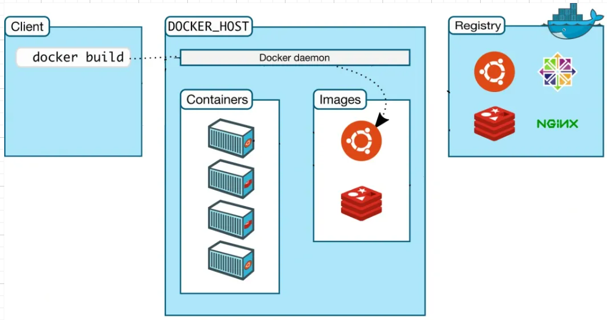
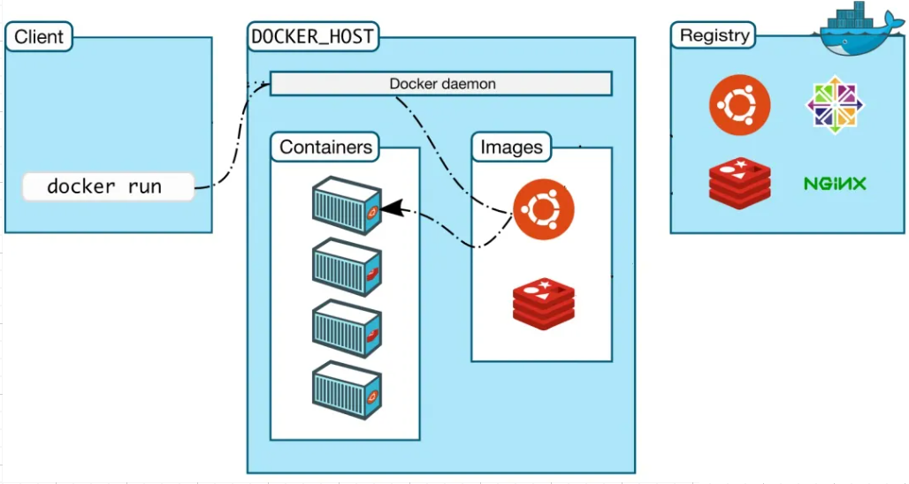
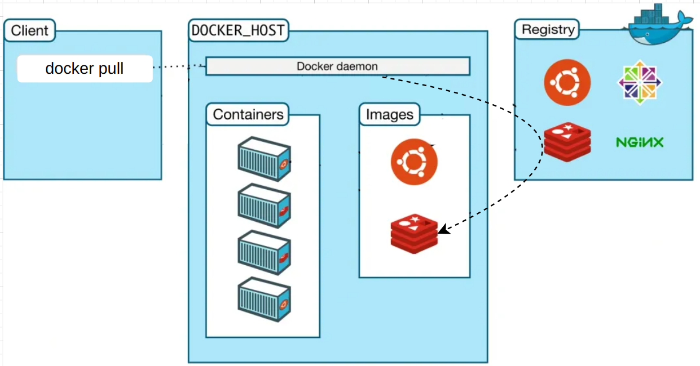
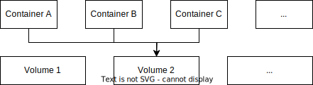

# Docker概述

- 容器技术只隔离应用程序的运行时环境但容器之间可以共享同一个操作系统（程序的运行只和容器有关，即屏蔽环境差异）。

- docker将程序以及程序所有的依赖都打包到docker container。

 

| 概念       | 说明                        |
| ---------- | --------------------------- |
| Dockerfile | 自动化脚本（创建Image）     |
| Image      | 镜像（创建Container的模板） |
| Container  |                             |

| docker | 说明                                                         |
| ------ | ------------------------------------------------------------ |
| build  |  |
| run    |  |
| pull   |  |

 

docker-compose.yml

# Image 镜像文件 docker image

| docker image                      | 说明                                                         |
| --------------------------------- | ------------------------------------------------------------ |
| ls                                | 列出本地的镜像文件。                                         |
| rm `{id}`                         | 删除镜像文件。 需要先删除对应的容器文件。               |
| pull `{组/镜像文件}`              | 抓取镜像文件 官方提供的镜像文件都放在library组（默认可省略）。 |
| build                             |                                                              |
| tag `[image] [user]/[repo]:[tag]` | 标注                                                         |
| push                              | 上传                                                         |

# Container 容器文件 docker container

- 一旦容器生成，就会同时存在镜像文件、容器文件。关闭容器只是停止容器运行，不会删除容器文件。

| docker container                 | 说明                                                         |
| -------------------------------- | ------------------------------------------------------------ |
| ls                               | 列出本地的容器文件。                                         |
| run `{镜像文件}`                 | 从image文件生成一个正在运行的容器实例。 若image文件不存在，则自动抓取。 每运行一次，就会新建一个容器 |
| start `{containID}`              | 启动容器。                                                   |
| kill `{containID}`               | 强制终止容器的运行。                                         |
| stop `{containID}`               | 终止容器的运行。                                             |
| rm `{containID}`                 | 删除容器文件。                                               |
| logs `{containID}`               | 查看容器的输出。                                             |
| exec `{containerID}`             | 进入正在运行的容器                                           |
| cp `[containID]:[/path/to/file]` | 从正在运行的容器中拷贝文件到本机                             |

# Dockerfile

### Docker

| docker | 说明           |
| ------ | -------------- |
| login  | 登录Docker账号 |
|        |                |
|        |                |

