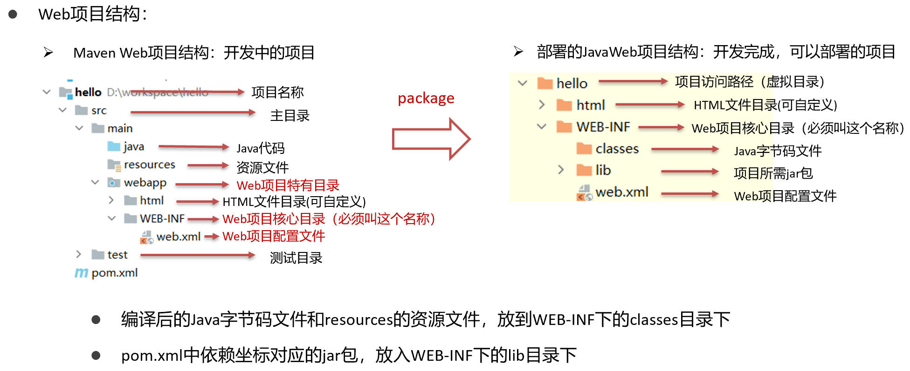

# 部署

## Web服务器

### Tomcat安装和配置

| 目录结构 | 说明           |
| -------- | -------------- |
| bin      | 可执行文件目录 |
| conf     | 配置文件目录   |
| lib      | 存放lib目录    |
| logs     | 日志文件目录   |
| temp     | 临时目录       |
| webapps  | 项目部署目录   |
| work     | 工作目录       |

> 其他文件：BUILDING.txt、CONTRIBUTING.md、LICENSE、NOTICE、README.md、RELEASE-NOTES、RUNNING.txt。

**配置环境变量**

1. 需要配置JAVA_HOME（安装JDK时配置的），否则Tomcat打开一闪而过，

> Tomcat是用C和Java编写的，需要JRE。 


2.  配置Tomcat环境变量
    1. 新建变量名：CATALINA_HOME，变量值：E:\Tomcat8
    2. 打开PATH，添加变量值：%CATALINA_HOME%\lib;%CATALINA_HOME%\bin
    3. 将命令行转入到Tomcat安装Bin目录，例如：E:\tomcat8\bin  ，cmd输入命令：`service.bat install`

**启动Tomcat，访问主页**

- 在Tomcat解压的bin目录中，打开startup.bat

  

- 浏览器打开`http://localhost:8080`

> **cmd控制台乱码**
>
> - 修改conf/logging.properties的
>
> ````
> java.util.logging.ConsoleHandler.encoding=GBK
> ````

> **部署项目**
>
> 将项目放入Tomcat的webapps目录下即可。到Tomcat解压目录的webapps目录中创建文件目录，并且在该目录下创建文件目录：`WEB-INFO`。 打包成war包再放入webapps目录

## IDEA Web部署

- 先新建一个项目Project，再新建一个Module，然后将Moudle设置为Web

  
  
   

## Maven Web部署

 

### 骨架创建

 

**pom.xml配置**

- 打包方式：web项目默认war

`<packaging>war</packaging>`

### 手工创建


## 配置IDEA的Tomcat设置

### 集成本地Tomcat

  
  
  
  

 

### Tomcat-Maven插件

**pom.xml 添加 Tomcat插件**

- `<path>`标签用于指定应用在Tomcat中的上下文路径，即访问应用时的URL路径。默认情况下，应用的上下文路径是应用的名称
  - 如：`<path>/mywebapp</path>`在Tomcat中部署该应用后，访问该应用的URL就是`http://localhost:8080/mywebapp`也就是webapp中的内容前加上这些 
  - 在Maven项目中，通常将web资源文件放置在src/main/webapp目录下

```xml
<build>
    <plugins>
        <plugin>
            <groupId>org.apache.tomcat.maven</groupId>
            <artifactId>tomcat7-maven-plugin</artifactId>
            <version>2.1</version>
            <configuration>
                <port>8080</port>
                <path>/</path>
                <url>http://localhost:8080/</url>
            </configuration>
        </plugin>
    </plugins>
</build>
```

**使用Maven Helper 插件快速启动项目，选中项目，右键 --> Run Maven --> tomcat7:run **

- 如果通过IDEA旁边的浏览器打开网页，启动了IDEA内置的Web服务器，而不是Tomcat服务器。IDEA内置的Web服务器端口号为63342，所以你访问的URL中会带有这个端口号。


## 常见问题

### 404和`$END$`

- 修改web.xml中的内容，添加`<welcome-file-list></welcome-file-list>`
    
    

### 405

- 当前请求的方法不支持，如POST必须对应doPost()。

### 空指针 NumberFormatException

- 获取的是null时，却进行了操作。

### 乱码问题

#### 控制台编码

- 修改IDEA中的配置setting
    
    
- 修改IDEA中的VM：
  - -Dfile.encoding=utf-8
  - -Dconsole.encoding=utf-8

  

- 修改IDEA中Tomcat的配置
    

- 以及修改Tomcat的"D:\Tomcat8\conf\ **logging.properties**"文件
    

- 重新启动IDEA即可

### Servlet 输出中文字符

- 设置一个环境变量
- 变量名JAVA_TOOL_OPTIONS
- 变量值-Dfile.encoding=UTF-8

### HTTP状态 500 - 内部服务器错误

