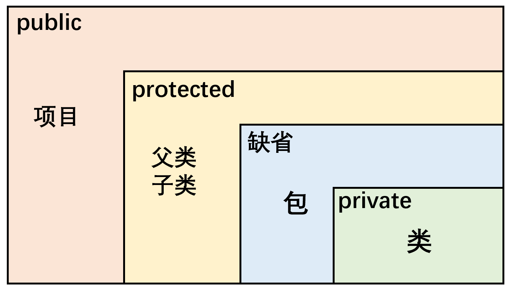

# Java与OOP

- Java语言是面向对象的程序设计语言（OOP），Java程序的基本组成单元就是类，类体中又可包括属性与方法两部分。

- 面向对象的三大特性：封装性、继承性、多态性、（抽象性）。

<table>
    <tr>
        <td width="10%">POP</td>
        <td width="20%">面向过程程序设计</td>
        <td width="60%">强调功能行为，以函数为最小单位，考虑怎么做</td>
        <td width="10%">Java</td>
    </tr>
    <tr>
        <td>OOP</td>
        <td>面向对象程序设计
        <td>强调具备功能的对象，以类/对象为最小单位，考虑谁来做</td>
        <td>C</td>
    </tr>
</table>
1. 类是对一类事物的描述，是抽象的、概念上的定义。

2. 对象（实例）是实际存在的该类事物的每个个体。如果创建了一个类的多个对象，则每个对象都独立的拥有一套类的实例属性（非static的）。

3.  匿名对象是不定义对象的句柄（创建的变量没有显式的赋给一个变量名），而直接调用这个对象的方法，调用之后就等待垃圾回收。对一个对象只需要进行一次方法调用、将匿名对象作为实参传递给一个方法调用。

```java
new Person().say(); 
```

# OOP三大特性


## 封装性（隐藏）

- 封装性：隐藏一个类中不需要对外提供的实现细节，只对外公开简单的接口，便于外界调用，从而提高系统的可扩展性、可维护性。属性是封装的最小单位。通常是将成员声明为私有的，再提供公共的方法（`getXxx()、setXxx()`）。

<table>
    <caption>高内聚低耦合</caption>
    <tr>
        <td width="10%">高内聚</td>
        <td width="90%">类的内部数据操作细节自己完成，不允许外部干涉</td>
    </tr>
    <tr>
        <td>低耦合</td>
        <td>仅对外暴露少量的方法用于使用</td>
    </tr>
</table>

### 权限修饰符

 

- 权限修饰类的内部结构：属性、方法、构造器、内部类。

- 对于class的权限修饰只可以用public和default（缺省）。

1. public类可以在任意地方被访问。
2. default类只可以被同一个包内部的类访问。   

## 继承性

- Java的类只支持单继承和多层继承，不允许多重继承。一个子类只能有一个父类，一个父类可以派生出多个子类。

> 接口允许多重继承。  

1. 继承使类与类之间产生关系，提供了多态的前提。
2. 继承不改变类成员的访问权限。如果父类的成员是公有的、被保护的或默认的，则子类仍具有相应的这些特性，并且子类不能获得父类的构造方法。

- 封装性：子类不能直接访问父类中私有的（private）的成员变量和方法 。
- final修饰的类表示最终类，不能被继承。

### extends 继承

- 子类继承父类的方法和属性：获取了直接父类和所有间接父类中声明的属性和方法。

   

| 关系                 | 说明                                             |
| -------------------- | ------------------------------------------------ |
| 父类（基类）（超类） | 将多个类中相同的属性和方法抽象出来形成的一般类。 |
| 子类（派生类）       | 继承了父类，具有特殊的属性和方法。               |

```java
class Subclass extends SuperClass{ }  
```

### @Override 重写

- <span name="方法重写">方法重写</span>（重置、覆盖）：在程序执行时，子类重写的方法将覆盖父类原有的方法。

1. 子类重写的方法必须和父类被重写的方法具有相同的方法名称、参数列表。
2. 子类重写的方法的返回值类型不能大于父类被重写的方法的返回值类型。

<table>
    <tr>
        <th width="40%">父类被重写的方法的返回值类型</th>
        <th width="60%">子类重写的方法的返回值类型</th>
    </tr>
    <tr>
        <td>void</td>
        <td>void</td>
    </tr>
    <tr>
        <td>基本数据类型</td>
        <td>相同的基本数据类型(父类double则子类只能是double)</td>
    </tr>
    <tr>
        <td>A类</td>
        <td>A类或A类的子类</td>
    </tr>
</table>

3. 子类重写的方法使用的访问权限不能小于父类被重写的方法的访问权限，子类不能重写父类中声明为private权限的方法（封装性）。
4. 子类重写的方法抛出的异常不能大于父类被重写方法抛出的异常。
5. 静态方法（static）是属于类的，不能被重写。

<b>与<a href="#方法重载">方法重载</a>的比较</b>

### <span name="this-super">this、super</span>

#### this  当前对象

<table>
	<thead>
		<tr>
			<th width="15%">使用this的位置</th>
			<th width="85%">引用的对象</th>
		</tr>
	</thead>
	<tbody>
		<tr>
			<td>方法内部</td>
			<td>该方法所属对象的引用</td>
		</tr>
		<tr>
			<td>构造器内部</td>
			<td>该构造器正在初始化的对象</td>
		</tr>
	</tbody>
</table>

1. 任意方法或构造器内，如果使用当前类的成员变量、成员方法可以在其前面添加this（默认存在）。
2. 区分成员变量和局部变量：当形参与成员变量同名时，如果在方法内或构造器内需要使用成员变量，必须添加this来表明该变量是类的成员变量。
3. this访问属性和方法时，如果在本类中未找到，会从父类中查找。
4. this可以调用类的属性、方法和构造器，可作为一个类中构造器相互调用的特殊格式。

#### super 父类对象

- super：调用父类中的指定操作、表明调用的是父类中的成员，追溯不仅限于直接父类。

<table>
	<thead>
		<tr>
			<th align="left" width="20%">super的使用</th>
			<th align="left" width="80%">说明</th>
		</tr>
	</thead>
	<tbody>
		<tr>
			<td align="left">super.属性</td>
			<td align="left">访问父类中定义的属性</td>
		</tr>
		<tr>
			<td align="left">supere.方法</td>
			<td align="left">调用父类中定义的成员方法
				<br>在子类中调用父类被重写的方法
				</td>
			</tr>
			<tr>
				<td align="left">super(形参列表)</td>
				<td align="left">在子类构造器中调用父类的构造器</td>
			</tr>
		</tbody>
	</table>

#### this与super比较

- this代表本类对象的引用，super代表父类的内存空间的标识

<table>
	<thead>
		<tr>
			<th width="12%">比较</th>
			<th width="44%">this</th>
			<th width="44%">super</th>
		</tr>
	</thead>
	<tbody>
		<tr>
			<td>访问属性</td>
			<td>访问本类中的属性，如果本类中没有该属性，则从父类中继续查找</td>
			<td>直接访问父类中的属性</td>
		</tr>
		<tr>
			<td>调用方法</td>
			<td>访问本类中的方法，如果本类中没有该方法，则从父类中继续查找</td>
			<td>直接访问父类中的方法</td>
		</tr>
		<tr>
			<td>调用构造器</td>
			<td>调用本类构造器，必须放在本类构造器的首行</td>
			<td>调用父类构造器，必须放在子类构造器的首行</td>
		</tr>
	</tbody>
</table>

### final 终值

- final标记的类不能被继承、标记的方法不能被子类重写、标记的变量（成员变量、局部变量）名称大写且只能被赋值一次。
- final标记的成员变量必须要么在声明时赋值，要么在<b>每个</b>构造器/代码块显式赋值。

> 如果在构造器中为final赋值，则每个构造器中都应该要为final赋值。

```java
public void addOne(final Other o) {
    // o = new Other(); //o的地址值不能改变
    o.i++; //但是o的地址值中的内容可以改变 
}
```

## 多态性

### 对象的多态性

- 对象的多态性：编译时类型和运行时类型不一致，父类的引用指向子类的对象。内存中实际加载了子类特有的属性和方法，但是由于变量声明为父类类型，导致编译时，只能调用父类中声明的属性和方法，子类特有成员不能被调用。若子类重写了父类方法，则系统不可以把父类被重写的方法转移到子类中，故编译时是父类方法，而运行时是子类重写的方法。

- 对象的多态性不适用于属性（属性的编译和运行都由引用决定）， 父类的属性不会被子类中相同的属性覆盖（编译和运行时都是根据引用的属性，而不是实例的属性）。

<table>
	<thead>
		<tr>
			<th width="15%">时期与类型</th>
			<th width="85%">说明</th>
		</tr>
	</thead>
	<tbody>
		<tr>
			<td rowspan="2">编译时类型</td>
			<td>由声明该变量时使用的类型（引用）决定</td>
		</tr>
		<tr>
			<td>编译期，只能调用父类中声明的方法</td>
		</tr>
		<tr>
			<td rowspan="2">运行时类型</td>
			<td>由实际赋给该变量的对象（实例）决定</td>
		</tr>
		<tr>
			<td>运行期，实际执行的是子类重写父类的方法</td>
		</tr>
	</tbody>
</table>

```java
Person p = new Student(); 
p.getSchool(); //编译不通过：Person类没有getSchool()
```

### 虚拟方法调用

- 虚拟方法：子类重写了父类的方法，则在对象的多态中，引用（父类）的方法被称为虚拟方法。（运行时类型）编译时显示的是父类的方法，而在运行时，实际执行的是子类重写父类的方法（即，子类方法）。

<table>
	<thead>
		<tr>
			<th width="20%">绑定</th>
			<th width="80%">意义</th>
		</tr>
	</thead>
	<tbody>
		<tr>
			<td>早绑定（静态绑定）</td>
			<td>对于重载而言，在方法调用之前，编译器就已经确定了所要调用的方法。</td>
		</tr>
		<tr>
			<td>晚绑定（动态绑定）</td>
			<td>父类根据赋给它的不同子类对象，动态调用属于子类的该方法，在运行时才确定方法的调用。</td>
		</tr>
	</tbody>
</table>

```java
//假设Student重写了Person的say()
Person p = new Student(); 
//虚拟方法调用
p.say(); //实际运行的是Student中重写后的say()。
```

### 对象类型转换

- 造型：引用数据类型的强制转换，无继承关系的引用类型间的转换是非法的。

- instanceof（类型检验符）：（<code>x instanceof A</code>）检验x是否为类A的对象，如果类A是x对象所属类的父类/祖先，则返回true。

 

```java
Person p = new Student(); //向上转型
Stundent s = (Stundent) new Person(); //向下转型
```

# class 类结构

- 主类：包含main()方法的类。每一个Java本地应用程序都必须包含一个main()方法，main()方法为Java应用程序的入口。
- 一个完整的主类结构通常由定义包语句、定义类语句、定义主方法语句、定义变量语句和导入API类库5部分组成。

```java
package com.zjk; //包

//导入
import com.zjk.tools.MyTool;
import static com.zjk.tools.MyUse.staticSetName;

//类
public class Person{
    //属性（成员变量）
    private String name;
    private boolean isMarried;

    //代码块
    {

    }

    //构造器d
    public Person(){
        name = "Mac";
        isMarried = true;
    }

    public Person(String name, boolean isMarried){
        this.name = name;
        this.isMarried = isMarried;
    }

    //方法
    public void walk(){
        System.out.println("走路");
    }

    public String display(){
        return "名字：" + name;
    }

    //内部类
    class Pet{
        String name;
        double weight;
    }

} 
```

## field 属性

 

```
修饰符 数据类型 属性名 = 初始化值 ;
```

- 属性权限修饰符：private、缺省、protected、public。

<table>
	<thead>
		<tr>
			<th width="10%"></th>
			<th width="45%">成员变量</th>
			<th width="45%">局部变量</th>
		</tr>
	</thead>
	<tbody>
		<tr>
			<td>声明位置</td>
			<td rowspan="2">类内部</td>
			<td>方法形参、方法内部</td>
		</tr>
        <tr>
            <td>作用域</td>
            <td>代码块内、构造器内等</td>
        </tr>
		<tr>
			<td>修饰符</td>
			<td>基本都能使用</td>
			<td>不能使用权限修饰符，
				<br />可使用final修饰。
			</td>
		</tr>
		<tr>
			<td>初始化值</td>
			<td>有默认初始化值</td>
			<td>没有默认初始化值</td>
		</tr>
		<tr>
			<td>内存加载</td>
			<td>堆、静态域</td>
			<td>栈</td>
		</tr>
	</tbody>
</table>


> <a href="../JVM/对象实例化.md#零值初始化">零值初始化</a>：一个对象被创建时，会对其中各种类型的成员变量自动进行初始化赋值。

## method 方法

```
权限修饰符 返回值类型 方法名(形参列表){
        方法体;    
}
```

> 不能在方法的内部再次声明方法、使用权限修饰符。

### return 返回

- return：返回所需的值或void、并结束当前方法。

<table>
	<tbody>
		<tr>
			<td width="10%">有返回值</td>
			<td width="90%">如果方法有返回值，则必须在方法声明时，指定返回值的类型；并使用return关键字来返回指定类型的变量或常量</td>
		</tr>
		<tr>
			<td>没返回值</td>
			<td>方法声明时，使用void来表示返回值类型；不使用return或使用<code>return;</code>结束此方法
			</td>
		</tr>
	</tbody>
</table>

### 参数列表

- 方法的参数列表允许直接定义能和多个实参相匹配的形参（个数可变）。

1. 可变参数的参数个数是可变的（0、1、n）。
2. 方法的参数部分的可变形参需要放在形参声明的最后，且最多只能声明一个可变个数形参。

<table>
    <tr>
        <th>JDK版本</th>
        <th>可变参数的表示方式</th>
    </tr>
    <tr>
        <td width="15%" rowspan="2">JDK 5.0以前</td>
        <td width="85%">数组形参，传入多个同一类型变量（可变形参一定程度上相当于数组形参 ）</td>
    </tr>
    <tr>
        <td><code>public static void test(int a, String[] books){};</code></td>
    </tr>
    <tr>
        <td rowspan="2">JDK5.0之后</td>
        <td>可变个数形参，传入多个同一类型变量</td>
    </tr>
    <tr>
        <td><code>public static void test(int a, String… books){};</code></td>
    </tr>
</table>

### 方法重载

- <span name="方法重载">重载</span>：<b>同一个类中允许存在一个以上的同名方法，只要参数列表不同（个数、类型）即可，与返回值类型无关</b>。调用时，根据方法参数列表的不同来区别。编译器根据方法不同的参数表，对同名方法的名称做修饰。对于编译器而言，这些同名方法就成了不同的方法。它们的调用地址在编译期就绑定了。
- 可变个数形参的方法与本类中同名的方法之间，彼此构成重载，但可变参数方法的使用与方法参数部分使用数组是一致的不能构成重载（不能共存）。
- Java的重载是可以包括父类和子类的，即子类可以重载父类的同名不同参数的方法。

<b>与<a href="#方法重写">方法重写</a>的比较</b>

### 值传递机制

- Java里方法的参数传递方式只有值传递。 

<table>
	<thead>
		<tr>
			<th width="15%">数据类型</th>
			<th width="10%">赋值方式</th>
			<th width="75%">说明</th>
		</tr>
	</thead>
	<tbody>
		<tr>
			<td>基本数据类型</td>
			<td>数据值</td>
			<td>内容的改变对实参没有任何影响。</td>
		</tr>
		<tr>
			<td>引用数据类型
				<br />（包括String）
			</td>
			<td>地址值</td>
			<td>对象的内容可以在方法中改变，对象的引用不会改变。 <br />但<a href="../JVM/StringTable.md">String具有不可变性</a>。</td>
		</tr>
	</tbody>
</table>


## 构造器 new

- 构造器：创建对象、给对象进行初始化。每个类都至少有一个构造器，一个类可以创建多个重载的构造器，构造器具有与类相同的名称。

- 构造器不是类的方法，不能有return语句返回值、不声明返回值类型、不能被static、final、synchronized、abstract、native修饰、<b>父类的构造器不可被子类继承</b>。

```
权限修饰符 类名 (参数列表) {
    初始化语句；
} 
```

<table>
	<thead>
		<tr>
			<th width="20%">构造器</th>
			<th width="80%">说明</th>
		</tr>
	</thead>
	<tbody>
		<tr>
			<td>隐式空参构造器<br />（系统默认提供）</td>
			<td>若没有显式的定义类的构造器的话，则系统默认提供一个空参的构造器。<br />默认构造器的修饰符与所属类的修饰符一致。</td>
		</tr>
		<tr>
			<td>显式定义构造器<br />（无参、有参）</td>
			<td>一旦显式定义了构造器，则系统不再提供默认构造器（空参）。</td>
		</tr>
	</tbody>
</table>

### <a href="#this-super">this()、super()</a>


- 子类中所有的构造器默认都会访问父类的空参构造器（<code>super()</code>），也就是说，子类至少有一个构造器调用了父类的构造器 。

1. 必须在类的构造器的首行，且一个构造器中最多只能存在一个<code>this()</code>或<code>super()</code>。
2. 构造器中使用<code>this()</code>调用本类中重载的其他的构造器，但不能通过<code>this()</code>调用自身。如果一个类中声明了n个构造器，则最多有 n - 1个构造器中使用了this来调用其本身的构造器。
3. 如果子类构造器没有在首行显式调用父类或本类的构造器（<code>this()</code>或<code>super()</code>），且父类中又没有无参的构造器（因为默认使用<code>super()</code>），则编译出错。
4. 父类中没有空参数的构造器时，子类必须通过<code>this(参数列表) </code>或<code> super(参数列表)</code>在构造器的首行指定调用本类/父类中相应的构造器，且只能选择其中一种构造器。

```java
class Person{
    private String name;
    private int age;

    public Person() {
        //this(); //错误 构造器中不能通过this调用自身。
        this(age) //错误 与Person(int age)[有this()]形成一个死循环
    }

    public Person(String name) {
        this();  //调用Person()
        this.name = name;
    }
}
```

### 构造器实例化的流程

- 从过程上来看，当通过子类的构造器创建子类对象时，一定会直接/间接的调用其父类的构造器，继而调用其父类的父类的构造器，直到调用了java.lang.Obeject类中空参的构造器为止。无论哪个构造器创建子类对象，必须保证先初始化父类。子类继承父类中所有的属性和方法，因此子类有必要知道父类如何为对象进行初始化。正因为加载过所有父类的构造器，所以才可以看到内存中有父类中的结构，子类对象才可以考虑进行调用。虽然在创建子类对象时，调用了父类的构造器，但就只创建了一个对象，即为new的子类对象。


      

## 代码块（初始化块）

- 代码块：对Java类或对象进行初始化。代码块有且只能使用static修饰（静态代码块） 用于初始化static的属性。

```java
class Person {
    public static int total;

    static {
        total = 100;//为total赋初值
    }
    …… //其它属性或方法声明
}
```


<table>
	<thead>
		<tr>
			<th width="10%"></th>
			<th width="45%">非静态代码块</th>
			<th width="45%">静态代码块（static）</th>
		</tr>
	</thead>
	<tbody>
		<tr>
			<td>相同</td>
			<td>可以有输出语句</td>
			<td>可以有输出语句</td>
		</tr>
		<tr>
			<td>初始化</td>
			<td>可以对非静态的属性初始化。
				<br />
			</td>
			<td>可以对静态属性、类的声明进行初始化操作。
				<br />不可以对非静态的属性初始化。
			</td>
		</tr>
		<tr>
			<td>调用</td>
			<td>除了调用非静态的结构外，还可以调用静态的变量或方法。</td>
			<td>不可以调用非静态的属性和方法。</td>
		</tr>
		<tr>
			<td>执行顺序</td>
			<td>每次创建对象的时候，都会执行一次。且先于构造器执行。  
				<br />若有多个非静态的代码块，那么按照从上到下的顺序依次执行。
			</td>
			<td>若有多个静态的代码块，那么按照从上到下的顺序依次执行。 
				<br />静态代码块的执行要先于非静态代码块
				<br />静态代码块随着类的加载而加载，且只执行一次。
			</td>
		</tr>
	</tbody>
</table>

## package 包

- Java中包（package）是相关类与接口的一个集合，它提供了类的命名空间的管理和访问保护。以包为单位的独立命名空间，位于不同包中的类即使同名也不会冲突，解决了命名冲突的问题。 
- 包具有特定的访问控制权限，同一个包中的类之间拥有特定的访问权限（缺省）。
- 包对应于文件系统的目录（路径），package语句中，用 “.” 来指明包(目录)的层次；通常用小写单词标识。通常使用所在公司域名的倒置，如`com.atguigu.xxx`。

<table>
	<thead>
		<tr>
			<th width="15%">常见包</th>
			<th width="85%">意义</th>
		</tr>
	</thead>
	<tbody>
		<tr>
			<td>java.lang</td>
			<td>Java语言的核心类，如String、Math、Integer、 System和Thread，提供常用功能。</td>
		</tr>
		<tr>
			<td>java.net</td>
			<td>执行与网络相关的操作的类和接口</td>
		</tr>
		<tr>
			<td>java.io</td>
			<td>能提供多种输入/输出功能的类</td>
		</tr>
		<tr>
			<td>java.util</td>
			<td>一些实用工具类，如定义系统特性、接口的集合框架类、使用与日期日历相关的函数。</td>
		</tr>
		<tr>
			<td>java.text</td>
			<td>一些java格式化相关的类</td>
		</tr>
		<tr>
			<td>java.sql</td>
			<td>JDBC数据库编程的相关类/接口</td>
		</tr>
		<tr>
			<td>java.awt</td>
			<td>构成抽象窗口工具集（abstract window toolkits）的多个类，这些类被用来构建和管理应用程序的图形用户界面(GUI)</td>
		</tr>
	</tbody>
</table>

- package：指定一个源文件中的类属于一个特定的包。在每个Java源程序中只能有一条，且必须在程序的第一行，该行前可以有空格或注释行。

1. 一个类只能属于一个包。
2. 如果源文件中没有package语句，则指定为无名包。无名包没有路径，一般情况下，会把源文件中的类存储在当前目录（即存放Java源文件的目录）下。


- 包中的成员是指包中的类和接口：只有public类型的成员才能被包外的类访问。先引入包成员/整个包，之后使用短名(short name,类名或接口名)引用包成员。

```java
package pkg1[.pkg2[.pkg3...]];
```

```java
package graphics;
//Circle类成为graphics包中的一个public成员，并存放在classPath\graphics目录中。
public class Circle extends Graphic implements Draggable{
    ...
}
```

## import 引入

```java
import [static] pkgl[.pkg2[.pkg3.].(classname|*)；
//pkgl[.pkg2[.pkg3…]表明包的层次，与package语句相同，它对应于文件目录，classname则指明所要引入的类。
```

> java.lang包：如果导入的类/接口是该包的，或者是当前包下的，则可以省略此import语句。

1. import必须在源程序所有类声明之前，在package语句之后，显式的导入指定包下的类或接口。已经导入的包，如果需要使用其子包的成员，则还需要导入该子包。
2. import static：调用指定类/接口下的静态的属性/方法。
3. 通配符(`*`)(`java.util.*`)，一次性导入util包下所有的类或接口。
4. 不同包下的同名的类，需要使用类的全限定名指明调用的是哪个类，如 `java.util.Date`、`java.sql.Date`。

## 内部类

- 在Java中，允许一个类的定义位于另一个类的内部，前者称为内部类，后者称为外部类。

1. 内部类一般用在定义它的类或语句块之内，在外部引用它时必须给出完整的名称。
2. 内部类的名字不能与包含它的外部类类名相同。
3. 成员内部类和局部内部类仍然是一个独立的类，在编译以后都会生成字节码文件。

<table>
	<thead>
		<tr>
			<th width="15%">内部类</th>
			<th width="25%">字节码文件</th>
			<th width="60%">组成</th>
		</tr>
	</thead>
	<tbody>
		<tr>
			<td rowspan="2">成员内部类</td>
			<td rowspan="2">
				<code>外部类$内部类名.class</code>
			</td>
			<td>static成员内部类
			</td>
		</tr>
        <tr>
            <td>非static成员内部类</td>
        </tr>
		<tr>
			<td rowspan="2">局部内部类</td>
			<td rowspan="2">
				<code>外部类$数字 内部类名.class </code>
			</td>
			<td>方法内，代码块内，构造器内
			</td>
		</tr>
        <tr>
            <td>匿名内部类</td>
        </tr>
	</tbody>
</table>


### 成员内部类

- 成员内部类作为其外部类的成员：

1. 可用的权限修饰符：private、protected、缺省、public。
2. 成员内部类可以直接使用外部类的所有成员，包括私有的（private）。
3. 若被static修饰，则不能再使用外层类的非静态成员。非static的成员内部类中的成员不能声明为static的，只有在外部类或static的成员内部类中才可声明static成员。

- 成员内部类作为一个类：

1. 可在内部定义属性、方法、构造器等结构。外部类访问成员内部类的成员时需要使用“内部类.成员”、“内部类对象.成员”的方式。
2. 可被abstract、final修饰。

```java
class 外部类{
    
    class 成员内部类{
        
    }
}
```

### 局部内部类

- 局部内部类：只能在声明它的方法或代码块中使用，而且是先声明后使用，除此之外的任何地方都不能使用该类。但是它的对象可以通过外部方法的返回值返回使用，返回值类型只能是局部内部类的父类或父接口类型。

1. 局部内部类可以使用外部类的成员，包括私有的。
2. 局部内部类可以使用外部方法的final局部变量（由局部内部类和局部变量的生命周期不同所致）。

> - JDK7之前，要求此变量显式声明为final
> - JDK8之后，可以省略final的声明(自动补上)

- 局部内部类和局部变量地位类似：不能使用权限修饰符、不能被static修饰、不能包含static成员。

```java
class 外部类{
    
    方法(){
        class 局部内部类{}
    }
    
    {
        class 局部内部类{}
    }
}
```

```java
public class InnerClassTest {

    public void method() {
        //局部变量
        final int num = 10;
        //局部内部类可以使用外部方法的局部变量，但是必须是final的。
        class AA {
            public void show() {
                System.out.println(num);
            }
        }
    }
}
```

### 匿名内部类

- 匿名内部类不能定义任何静态成员、方法和类，只能创建匿名内部类的一个实例（在父类构造器隐含实现一个接口或实现一个类）。

```
new 父类构造器（实参列表）|实现接口(){
    //匿名内部类的类体部分
}
```

- 匿名内部类必须继承父类或实现接口、只能有一个对象、 只能使用多态形式引用。

# interface 接口

- 接口（interface）：规范、定义的是一组规则，体现了现实世界中“如果你是/要...则必须能...”的思想。

> 继承是一个"是不是"的关系，而接口实现则是 "能不能"的关系。
>
> 接口的本质是契约、标准、规范。

- 接口：抽象方法和常量值定义的集合、接口和类是并列关系、接口中没有构造器（不能实例化）。
- 实现类（实现接口的类）必须提供接口中所有方法的具体实现内容（重写接口中的所有抽象方法）， 才可实例化。否则，必须作为抽象类。
- 接口采用多继承机制：一个类可以实现（implements）多个接口，也可以继承（extends）多个接口（接口是多继承的，而类是单继承的）。

```java
interface SubInterface extends SuperClass1,SuperClass2 
    implements InterfaceA,InterfaceB{
    ...
}
```

<table>
	<thead>
		<tr>
			<th width="20%">接口成员</th>
			<th width="25%">修饰</th>
			<th width="55%">方法体</th>
		</tr>
	</thead>
	<tbody>
		<tr>
			<td>全局常量 （默认）</td>
			<td>public static final</td>
			<td></td>
		</tr>
		<tr>
			<td>抽象方法 （默认）</td>
			<td>public abstract</td>
			<td>无</td>
		</tr>
		<tr>
			<td>静态方法</td>
			<td>static</td>
			<td>有</td>
		</tr>
		<tr>
			<td>默认方法</td>
			<td>deafult</td>
			<td>有</td>
		</tr>
	</tbody>
</table>

- 默认方法：只能通过实现类对象来调用，如果实现类重写了接口中的默认方法，则调用重写后的方法。实现类可以不重写默认方法，而是使用接口中定义的默认方法。

> - JDK7之前：只能定义全局常量和抽象方法。
> - JDK8之后：除了定义JDK7之前的，还可以定义静态方法pulic static、默认方法。

- 接口冲突：若一个接口中定义了一个默认方法，而另一个接口中也定义了一个同名同参数的方法（与是否是默认方法无关），在实现类同时实现了这两个接口时。实现类必须重写接口中同名同参数的方法，来解决冲突。
- 类优先原则：若一个接口中定义了一个默认方法，而父类中也定义了一个同名同参数的非抽象方法，则不会出现冲突问题。子类在没有重写此方法的情况下，默认调用父类同名同参的方法，接口中具有相同名称和参数的默认方法会被忽略。

| 继承/实现 | 调用父类/接口方法 |
| --------- | ----------------- |
| 父类      | super.方法()      |
| 接口      | 接口.super.方法() |


# static 静态成员

- static修饰的属性、方法、代码块、内部类作为静态成员。
- 静态成员（类成员）：随着类的加载而加载、优先于对象存在、被该类的所有对象所共享、可直接被类调用。
- 由于类只加载一次，则静态变量在内存中也只会存在一份，存在方法区的静态域中。

| 对比   | 实例变量                                                     | 静态变量（静态属性）（类变量）                               |
| ------ | ------------------------------------------------------------ | ------------------------------------------------------------ |
| 所有权 | 归某个对象所有。<br />每个对象都独立的拥有一套类中的非静态属性。 | 归类所有。<br />类的多个对象共享同一个静态变量。             |
| 修改   | 修改其中一个对象中的非静态属性时，不会导致其他对象中同样的属性值的修改。 | 某一个对象修改静态变量时，其他对象也将使用修改后的静态变量。 |

- 静态方法中只能调用静态的方法或属性（生命周期：非静态成员比静态成员晚加载），非静态方法中既可以调用静态的也可以调用非静态的方法或属性。

- 静态方法内不能使用this或super关键字、不能被重写。

# abstract 抽象

| 修饰     | 说明                                                         |
| -------- | ------------------------------------------------------------ |
| 抽象类   | 抽象类不能被实例化，可以被继承，可以使用多态。<br />抽象类中一定有构造器，便于子类实例化时调用。<br />提供抽象类的子类，让子类对象实例化，完成相关操作。 |
| 抽象方法 | 抽象方法只有方法的声明，没有方法的实现，以分号结束，没有代码块{}。<br />含有抽象方法的类必须被声明为抽象类，而抽象类中不一定拥有抽象方法，可以有普通的方法。<br />抽象类的子类必须重写父类以及祖先的抽象方法，并提供方法体，才可以进行实例化。<br />子类若没有重写全部的抽象方法，仍为抽象类，使用abstract修饰，不能进行实例化。 |

1. 不能用abstract修饰变量、代码块、构造器；
2. 不能用abstract修饰私有方法private、静态方法static、final方法、final类。 
