# Maven

## 概述

### POM

- 项目管理工具（项目对象模型）：POM。

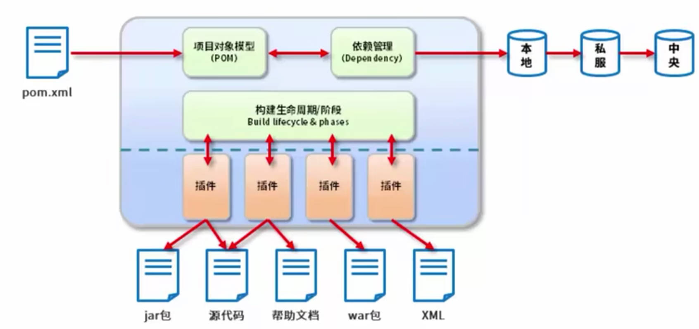  

1. 项目构建。
2. 依赖管理。
3. 统一开发结构。

### 环境配置

```shell
# JAVA_HOME已经配置
# set maven enviroment
export MAVEN_HOME=/opt/apache-maven-3.9.0
export PATH=$PATH:$MAVEN_HOME\bin
```

### 基础概念

#### 仓库

- 仓库：存储资源，包含各种jar包。

- Maven中央仓库：[mvn](https://mvnrepository.com/)。

- 获取jar包的方式：中央仓库、本地仓库、私服。

| 仓库     | 说明                               |
| -------- | ---------------------------------- |
| 本地仓库 |                                    |
| 远程仓库 | 中央仓库<br />私服：版权和访问速度 |

#### 坐标

- 坐标：描述仓库中资源的位置。

| 坐标的主要组成 | 说明                                                 |
| -------------- | ---------------------------------------------------- |
| groupid        | 当前Maven项目隶属组织名称：org.mybatis等（域名反写） |
| artifactid：   | 当前Maven项目名称：通常是模块名称：CRM、SMS等        |
| version        | 当前项目版本号                                       |
| packaging      | 该项目的打包方式                                     |

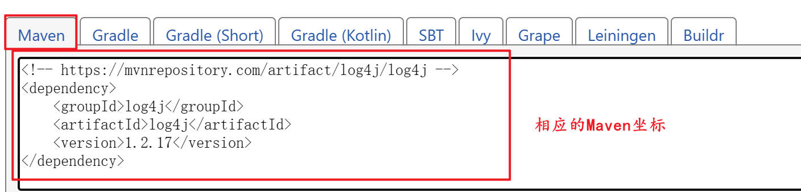  

## 仓库配置

- Maven配置文件：conf/settings.xml。

| setting     | 说明                                                         |
| ----------- | ------------------------------------------------------------ |
| 全局setting | 当前计算器中Maven的公共配置。<br />maven安装路径的conf/settings.xml |
| 用户setting | 当前用户的配置                                               |

### 本地仓库配置

```xml
<!-- localRepository 49行
   | The path to the local repository maven will use to store artifacts.
   | 默认的本地仓库位置
   | Default: ${user.home}/.m2/repository
   配置本地仓库的模板
  <localRepository>/path/to/local/repo</localRepository>
  -->
<!--
   对本地仓库的配置
  -->
<localRepository>D:\maven\repository</localRepository>
```

### 远程仓库配置

#### 中央仓库 central

- pom-4.0.0.xml文件：在lib目录下随便找一个jar包，用WinRAR打开，并在WinRAR回到上一级目录，搜索`pom*.*`找到不同的那个，并打开即可发现pom-4.0.0.xml。

```xml
<repositories>
    <repository>
        <id>central</id>
        <name>Central Repository</name>
        <url>https://repo.maven.apache.org/maven2</url>
        <layout>default</layout>
        <snapshots>
            <enabled>false</enabled>
        </snapshots>
    </repository>
</repositories>
```

#### 镜像仓库配置

- maven安装路径的conf/settings.xml

```xml
<mirrors> 配置镜像仓库 148行
    <mirror>
        <!--此镜像的唯一标识符：用来区分不同的mirror元素-->
        <id>aliyunmaven</id>
        <!--对哪种仓库进行镜像：即替代哪个库-->
        <mirrorOf>central</mirrorOf>
        <!--镜像名称：可以随便起-->
        <name>aliyunmaven</name>
        <!--镜像url-->
        <url>https://maven.aliyun.com/repository/public</url>
    </mirror>
</mirrors>
```

> 阿里云等镜像仓库的url可能会更新，需要去阿里云maven官网查看id和url并及时更改。

## 项目构建

### 标准Maven项目

1. 标准Maven项目的文件结构：
- 项目 --> src 
  
  - main 主目录
    
    - java Java文件
    - resources 静态资源
  
  - test  测试目录
    
    - java Java测试文件
    - resources 静态资源
2. src同级目录配置pom.xml：

```xml
<?xml version="1.0" encoding="UTF-8"?>
<project xmlns="http://maven.apache.org/POM/4.0.0" xmlns:xsi="http://www.w3.org/2001/XMLSchema-instance" xsi:schemaLocation="http://maven.apache.org/POM/4.0.0 https://maven.apache.org/xsd/maven-4.0.0.xsd">
  <modelVersion>4.0.0</modelVersion>

  <groupId>com.zjk</groupId>
  <artifactId>project-java</artifactId>
  <version>1.0</version>
  <packaging>jar</packaging>

  <dependencies>
    <dependency>
      <groupId>junit</groupId>
      <artifactId>junit</artifactId>
      <version>4.12</version>
    </dependency>
  </dependencies>

</project>
```

### 插件创建工程

- 插件创建工程：要求创建时，目录内部是空的，不能已经是Maven的项目文件。
- 在当前目录下自动创建工程：

```
mvn archetype:generate 使用模板生成
-DgroupId={project-packaging} 项目内的包
-DartifactId={project-name} 要创建的项目名称
-DarchetypeArtifactId=maven-archetype-quickstart 使用的模板
-DinteractiveMode=false
```

- 创建Java工程：

```xml
mvn archetype:generate -DgroupId=com.zjk -DartifactId=java-project -DarchetypeArtifactId=maven-archetype-quickstart -Dversion=0.0.1-snapshot -DinteractiveMode=false
```

- 创建Web工程：

```xml
mvn archetype:generate -DgroupId=com.zjk -DartifactId=web-project -DarchetypeArtifactId=maven-archetype-webapp -Dversion=0.0.1-snapshot -DinteractiveMode=false
```

### IDEA

#### 构建Maven项目

1. 创建、配置Maven项目：

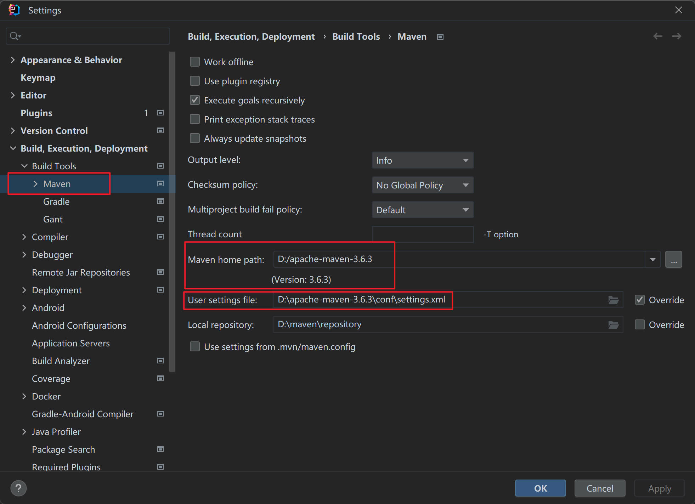 

2. 创建Maven的Module：

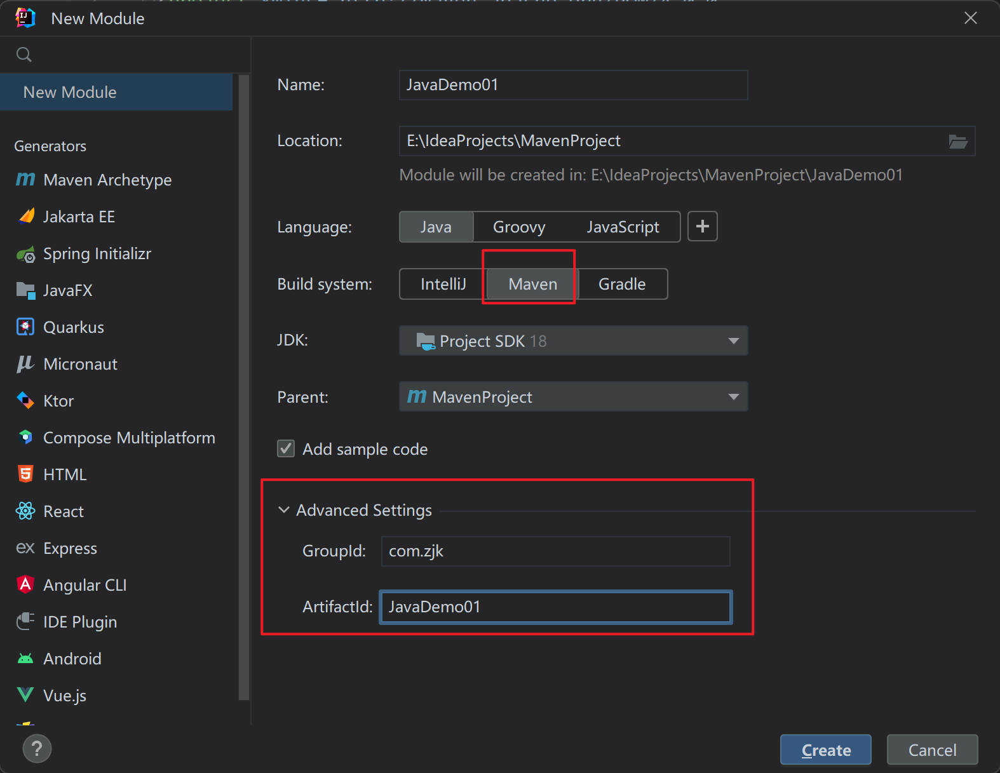 

3. 为相应的文件设置属性，通常已经设置好：

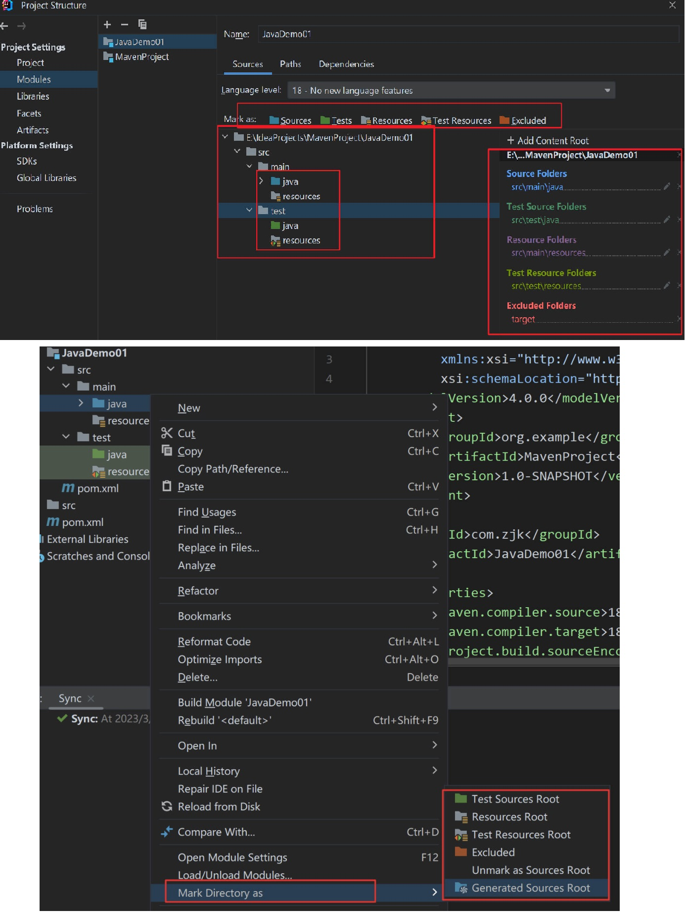  

#### 管理Maven

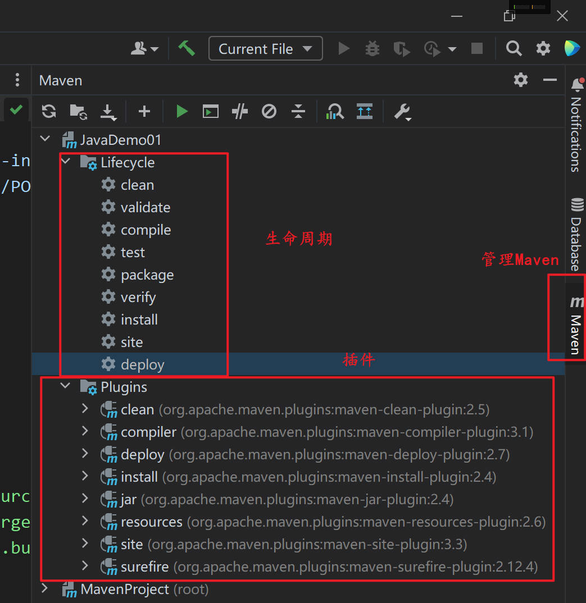  

- 配置快捷命令：

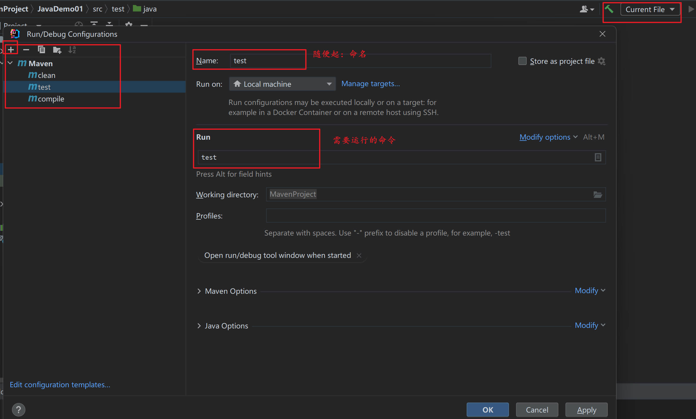  

```xml
<project xmlns="http://maven.apache.org/POM/4.0.0" xmlns:xsi="http://www.w3.org/2001/XMLSchema-instance"
         xsi:schemaLocation="http://maven.apache.org/POM/4.0.0 http://maven.apache.org/maven-v4_0_0.xsd">
    <modelVersion>4.0.0</modelVersion> 指定maven的POM的模型版本
    <parent>
        <groupId>org.example</groupId> 组织id
        <artifactId>MavenProject</artifactId> 项目id
        <version>1.0-SNAPSHOT</version> 版本号 release完成版，snapshot开发版
    </parent>
    <groupId>com.zjk</groupId> 
    <artifactId>JaveWebDemo02</artifactId> 
    <packaging>war</packaging> 打包方式：web工程打包为war；java工程打包为jar
    <name>JaveWebDemo02 Maven Webapp</name> 非必要
    <url>http://maven.apache.org</url>
    <dependencies> 设置当前工程的所有依赖
        <dependency> 具体的依赖
            <groupId>junit</groupId>
            <artifactId>junit</artifactId>
            <version>3.8.1</version>
            <scope>test</scope>
        </dependency>
    </dependencies>
    <build> 构建
        <finalName>JaveWebDemo02</finalName>
        <plugins> 插件
            <plugin> 插件
                <groupId>org.apache.tomcat.maven</groupId>
                <artifactId>tomcat7-maven-plugin</artifactId>
                <version>2.1</version>
                <configuration> 插件设置
                    <port>8080</port> 端口号
                    <path>/</path> 路径
                </configuration>
            </plugin>
        </plugins>
    </build>
</project>
```

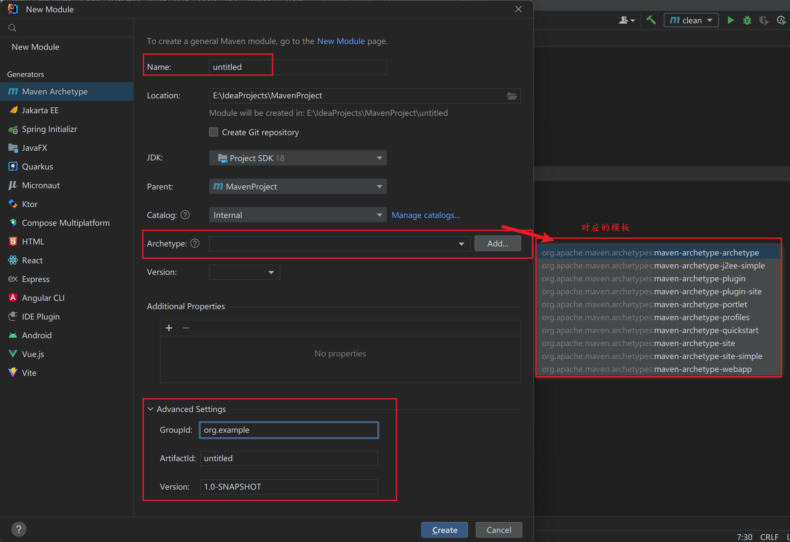    

#### 导入Maven项目

1. 已经创建Maven工程的，可以直接导入别的Maven工程：选择要导入的Maven工程的pom.xml文件。

2. View-->Apperance-->Tool Window Bars。

## 依赖管理 dependencies

### 导入依赖 dependency

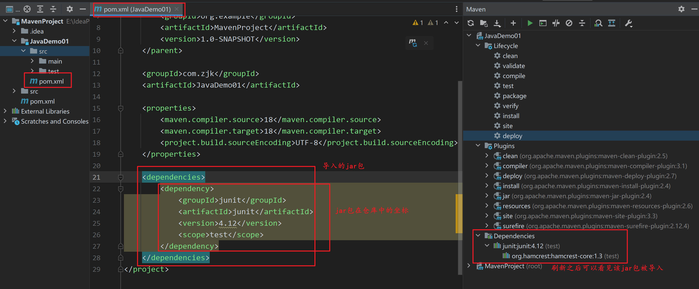

| 依赖分类             | 说明                                                         |
| -------------------- | ------------------------------------------------------------ |
| 直接依赖             | 导入仓库中的坐标。                                           |
| 依赖传递（间接依赖） | 将另一个项目的坐标复制到当前项目的dependencies中作为dependency；可以使用另一个项目中的依赖。 |

- 依赖冲突问题：

| 解决方式 | 说明                                 |
| -------- | ------------------------------------ |
| 路径优先 | 层级越深，优先级越低。               |
| 声明优先 | om.xml中配置的位置先后，在上的优先。 |

### 可选依赖 optional

```xml
<dependency>
    <groupId>log4j</groupId>
    <artifactId>log4j</artifactId>
    <version>1.2.12</version>
    <optional>true</optional> 表示依赖传递时，该依赖不会被传递
</dependency>
```

### 排除依赖 exclusion

```xml
<dependency>
    <groupId></groupId> 被传递依赖的项目
    <artifactId></artifactId>
    <version></version>
    <exclusions> 需要排除的依赖
        <exclusion>
            <groupId></groupId>
            <artifactId></artifactId>
            不需要版本号versionId
        </exclusion>
    </exclusions>
</dependency>
```

### 依赖范围 scope

- scope：设定依赖的作用范围。
  - 依赖jar包默认情况下可以在任何地方使用。

| 作用范围     | 说明                        |
| ------------ | --------------------------- |
| main         | 主程序范围有效 main目录下   |
| test         | 测试程序范围有效 test目录下 |
| 是否参与打包 | package指令范围             |

| scope           | 主代码 | 测试代码 | 打包 |
| :-------------- | :----: | :------: | :--: |
| compile（默认） |   √    |    √     |  √   |
| test            |        |    √     |      |
| provided        |   √    |    √     |      |
| runtime         |        |          |  √   |

```xml
<dependency>
    <groupId>junit</groupId>
    <artifactId>junit</artifactId>
    <version>4.12</version>
    <scope>test</scope> 依赖范围
</dependency>
```

- 依赖范围具有传递性：

| 间接依赖、直接依赖 | compile | test | provided | runtime |
| :----------------: | :-----: | :--: | :------: | :-----: |
|      compile       | compile | test | provided | runtime |
|        test        |         |      |          |         |
|      provided      |         |      |          |         |
|      runtime       | runtime | test | provided | runtime |

### 父级 parent

- 子级可以直接使用父级的Maven项目的所有依赖和插件。

```xml
<parent>  <!--父级项目的坐标-->
    <groupId>com.zjk</groupId>
    <artifactId>MavenProject</artifactId>
    <version>1.0-SNAPSHOT</version>
</parent>
```

## 生命周期

 

- 对于生命周期，如果要执行一个命令，则在其生命周期之前的命令也全部会被执行。

> 执行test：会先执行compile等命令。

| 命令        | 功能           | 说明                                                         |
| :---------- | :------------- | ------------------------------------------------------------ |
| mvn compile | 编译           | 在项目下创建新的内容：<br />`E:\project-java\target`         |
| mvn clean   | 清理           |                                                              |
| mvn test    | 测试           | 存放测试报告日志的内容：<br />`E:\project-java\target\surefire-reports` |
| mvn package | 打包           | 打包的jar包放在项目同级目录下                                |
| mvn install | 安装到本地仓库 | 由groupid和version来确定存放在仓库的位置                     |

## build

### 插件 plugins

- 插件与生命周期内的阶段绑定：在执行到对应生命周期时，执行对应的插件功能。
  
  - Maven默认在各个生命周期上绑定有预设的功能。

- 插件可以自定义其他功能。

```xml
<build>
    <plugins>
        <plugin>
            <groupId></groupId>
            <artifactId></artifactId>
            <version></version>
            <executions> 执行
                <execution>
                    <goals> 插件的输出
                        <goal></goal>
                    </goals>
                    <phase></phase> 对应的生命周期
                </execution>
            </executions>
        </plugin>
    </plugins>
</build>
```

```xml
<build> 构建
    <plugins>
        <plugin> 插件
            坐标
            <groupId>org.apache.tomcat.maven</groupId> 
            <artifactId>tomcat7-maven-plugin</artifactId>
            <version>2.1</version>
            <configuration> 插件信息
                <port>8080</port> 端口号设置
                <path>/</path> 路径设置
            </configuration>
        </plugin>
    </plugins>
</build>
```

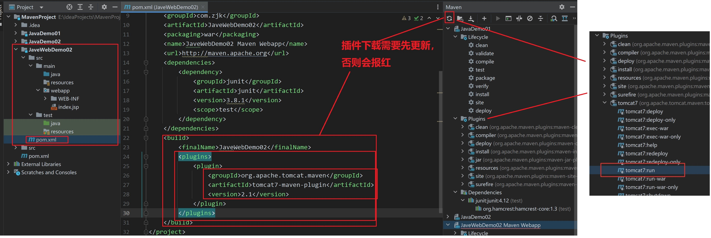  

## 分模块开发与设计

### 模块拆分思想

# Docker

## Docker概述

- 容器技术只隔离应用程序的运行时环境但容器之间可以共享同一个操作系统（程序的运行只和容器有关，即屏蔽环境差异）。

- docker将程序以及程序所有的依赖都打包到docker container。

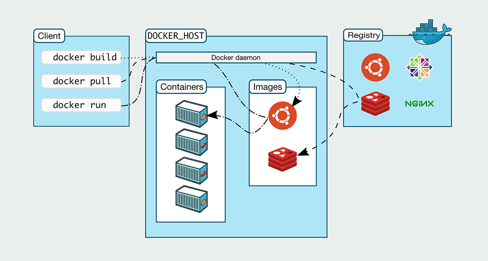 

| 概念       | 说明                        |
| ---------- | --------------------------- |
| Dockerfile | 自动化脚本（创建Image）     |
| Image      | 镜像（创建Container的模板） |
| Container  | 容器                        |
| **其他**   | **说明**                    |
| Repository | 仓库（存放镜像）            |

### [Docker命令](https://docs.docker.com/reference/)

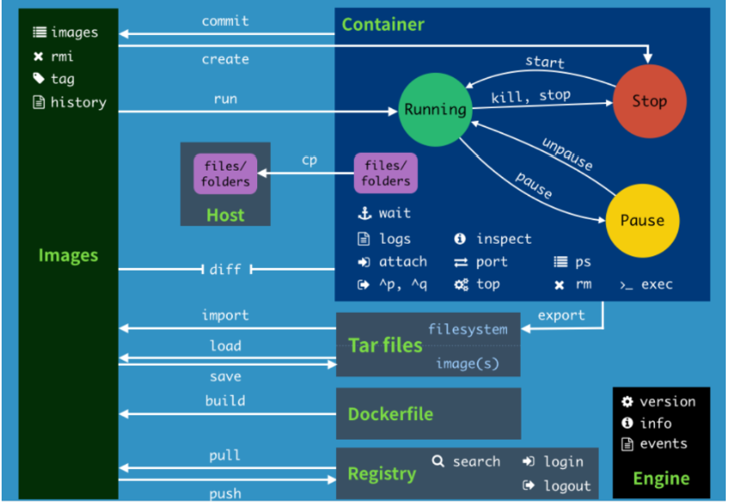

> portainer 界面工具。

### image Docker镜像

> UnionFS（联合文件系统）：分层、轻量级、高性能的文件系统，是Docker镜像的基础（所有镜像都基于其基础镜像）。

| 层次   | 说明                                               |
| ------ | -------------------------------------------------- |
| bootfs | Docker最底层，包含bootloader、kernel。<br />公用。 |
| rootfs | 底层直接使用Host的kernel，只需要基本的指令集。     |

- Docker镜像是只读的。当容器启动时，新的可写层（容器）被加载到镜像层顶部，用户的操作都基于容器层。

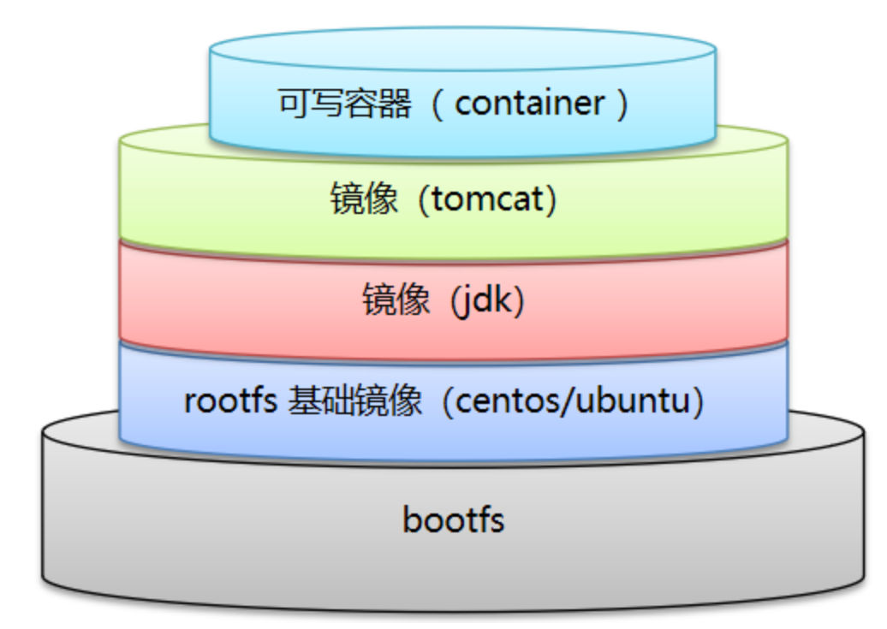

### volume 容器数据卷

- volume：容器之间数据共享（本地挂载目录）。

> 只要数据卷还存在，删除任何容器都不会导致其他容器在该数据卷中的数据被删除。

```shell
# 指定容器的数据卷
-v [卷名: | /主机目录:]{/容器目录}[:ro | :rw]
# 默认主机目录 /var/lib/docker/volumes，主机目录会覆盖容器目录的内容。
```

> docker inspect `{containerID}`的`"Mount":[{}]`查看挂载具体信息。

```shell
# 继承指定容器（数据卷容器）的数据卷（共用同一个）
--volumes-from {containerName}
```

### [Dockerfile](https://docs.docker.com/engine/reference/builder/)

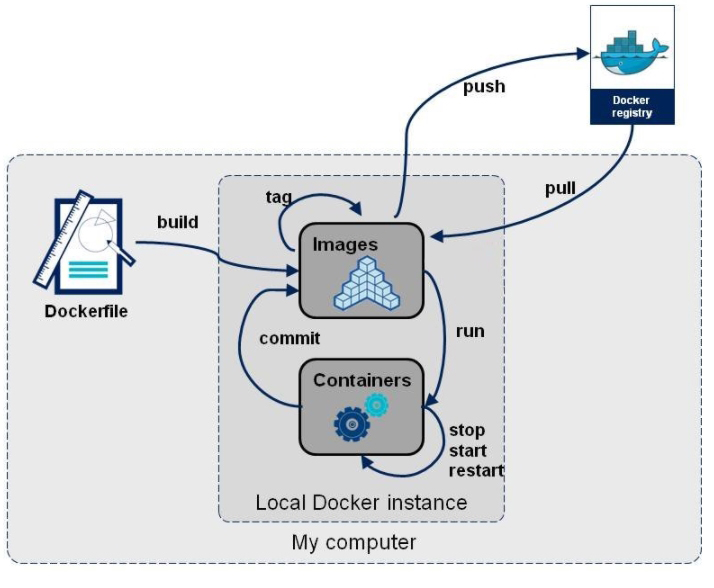

```shell
# 通过DockerFile构建镜像
docker build [-f {dockerFile}] -t {imageName[:tag]} .
# 如果当前目录下存在文件名为Dockerfile，Docker自动寻找该文件（不需要-f指定）
# 镜像名称必须小写
```

> ```shell
> # 查看镜像构建过程
> docker history {imageID}
> ```

| 执行时机 | DockerFile命令 | 说明 |
| -------------- | ---- | ---- |
|镜像构建                |FROM                | 基础镜像 |
|            |MAINTAINER            | `姓名<邮箱>` |
|                    |ENV                    | 环境变量 |
|                |WORKDIR                | 工作目录 |
|                    |RUN                    | 运行命令 |
|                    |ADD                    | 复制到镜像（自动解压）                             |
|                |COPY                | 复制到镜像 |
|                |VOLUME                | 数据卷 |
|                |EXPOSE                | 暴露端口 |
|                |ONBUILD                |  |
|容器启动                    |CMD                    | 运行命令，只有最后一个CMD会执行（替换之前的CMD）。 |
|            |ENTRYPOINT            | 运行命令，在之前ENTRYPOINT基础上追加命令。         |

```dockerfile
FROM ubuntu
MAINTAINER zjk<1054860443@163.com>

ENV MYPATH /usr/local

WORKDIR $MYPATH

RUN touch t1.txt

COPY ReadMe.md /usr/local

ADD apache-tomcat-9.0.80.tar.gz /usr/local

ENV CATALINA_HOME /usr/local/apache-tomcat-9.0.80
ENV CATALINA_BASH /usr/local/apache-tomcat-9.0.80
ENV PATH $PATH:CATALINA_HOME/lib:CATALINA_HOME/bin

EXPOSE 8080

CMD echo "---Tomcat OK---" && pwd
```

#### DockerHub国内源

[阿里云-镜像容器服务](https://cr.console.aliyun.com/cn-shenzhen/instances)

[阿里云-镜像仓库文档](https://cr.console.aliyun.com/repository/cn-shenzhen/zhengjk/zhengjk-repo/details)

## Docker网络 network

> docker run --link 在hosts中配置连接到的容器ip地址（单向的）。不建议使用。

Docker0

| 网络模式  | 说明             |
| --------- | ---------------- |
| bridge    | 默认，桥接       |
| none      | 不配置网络       |
| host      | 和宿主机共享网络 |
| container | 容器网络连通     |

```shell
# docker run 默认--net bridge
--net {bridge | networkName}
```


# Spring


| 基本思想 | 名词     | 说明                              |
| ---- | ------ | ------------------------------- |
| IoC  | 控制反转   | 将创造Bean的权利交给Spring进行管理          |
| DI   | 依赖注入   | 某个Bean的完整创建依赖于其他Bean（或普通参数）的注入。 |
| AOP  | 面向切面编程 | 横向抽取方法（属性、对象等）思想，组装成一个功能性切面。    |

## IoC、DI

### BeanFactory

- BeanFactory（Bean工厂）：Spring底层核心部分。

  

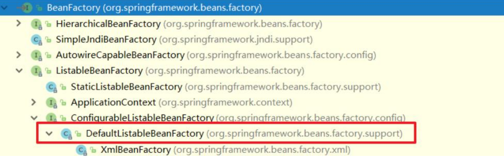 

#### IoC 控制反转

- IoC：工厂设计模式，BeanFactory根据配置文件/配置类来生产Bean实例。

 

1. beans.xml配置文件

```xml
<?xml version="1.0" encoding="UTF-8"?>
<beans xmlns="http://www.springframework.org/schema/beans"
       xmlns:xsi="http://www.w3.org/2001/XMLSchema-instance"
       xsi:schemaLocation="http://www.springframework.org/schema/beans http://www.springframework.org/schema/beans/spring-beans.xsd">

    <bean id="userService" class="com.zjk.service.impl.UserServiceImpl"></bean>

</beans>
```

2. BeanFactory获取Bean对象：创建BeanFactory，加载配置文件，获取UserService实例对象。

```java
//1. 创建BeanFactory 工厂对象
DefaultListableBeanFactory beanFactory = new DefaultListableBeanFactory();
//2. 创建一个读取器 xml文件
XmlBeanDefinitionReader reader = new XmlBeanDefinitionReader(beanFactory);
//3. 绑定读取器和工厂对象 读取配置文件给工厂对象
reader.loadBeanDefinitions("beans.xml");
//4. 由beans.xml内配置的id获取Bean实例
UserService userService = (UserService) beanFactory.getBean("userService");

System.out.println(userService);
```

#### DI 依赖注入

- DI：通过注入的方式反转Bean的创建权。

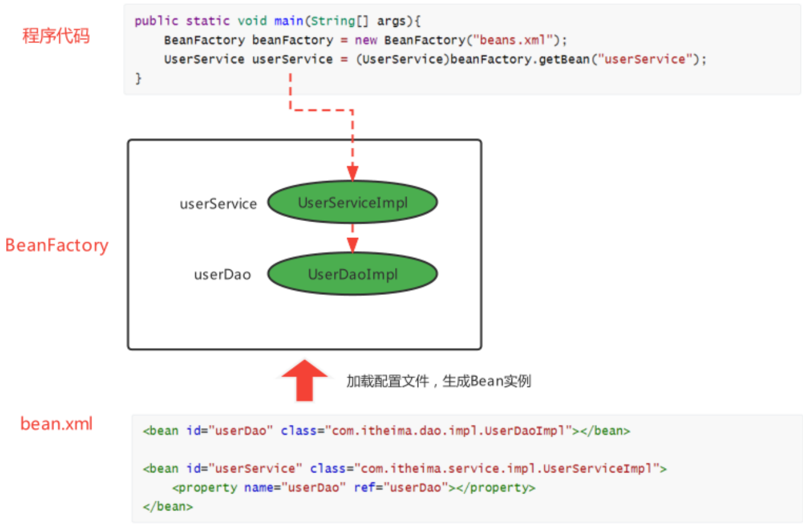 

1. 定义接口及其实现类，setXxx(Xxx xxx)注入方法。（只要存在setXxx()，即使没有相应的xxx属性，也会执行该setXxx()注入方法）

```java
//com.zjk.service.UserService
public interface UserService {}
//com.zjk.service.impl.UserServiceImpl
public class UserServiceImpl implements UserService {
    //通过BeanFactory调用该方法 从容器中获取userDao设置到此处
    //需要先在beans.xml中配置对应的<bean>的<property>
    public void setUserDao(UserDao userDao){
        System.out.println("" + userDao);
    }
}
//com.zjk.dao
public interface UserDao{}
//com.zjk.dao.impl
public class UserDaoImpl implements UserDao{}
```

2. 具体的UserServiceImpl实现类

```java
package com.zjk.service.impl;

import com.zjk.dao.UserDao;
import com.zjk.service.UserService;

public class UserServiceImpl implements UserService {
    private UserDao userDao;

    //通过BeanFactory调用该set方法 从容器中获取userDao设置到此处
    //在beans.xml中的<bean id="userService" name="com.zjk.service.impl.userServiceImpl">中的
    //<property id="setXxx方法的xxx(即setUserDao的userDao)" name="beans.xml中配置的<bean id="userDao name="com.zjk.dao.UserDao">"的id"></property>
    public void setUserDao(UserDao userDao) {
        this.userDao = userDao;
    }
}
```

3. beans.xml配置文件 `<property>注入`

```xml
<bean id="userService" class="com.zjk.service.impl.UserServiceImpl">
    <property name="userDao" ref="userDao"></property>
    <!-- 配置注入
        name：UserServiceImpl中的属性名称(userDao) 即：setUserDao中的setXxx中的xxx
        ref： 在当前的配置文件(beans.xml)(容器)中查找相应的id(userDao)
    -->
</bean>
```

4. beans.xml

```xml
<?xml version="1.0" encoding="UTF-8"?>
<beans xmlns="http://www.springframework.org/schema/beans"
       xmlns:xsi="http://www.w3.org/2001/XMLSchema-instance"
       xsi:schemaLocation="http://www.springframework.org/schema/beans http://www.springframework.org/schema/beans/spring-beans.xsd">

    <bean id="userService" class="com.zjk.service.impl.UserServiceImpl">
        <property name="userDao" ref="userDao"></property>
    </bean>
    <bean id="userDao" class="com.zjk.dao.impl.UserDaoImpl"></bean>
</beans>
```

5. BeanFactory获取Bean对象：创建BeanFactory，加载配置文件，获取UserService实例对象，并提前将其依赖的UserDao注入。

```java
//1. 创建BeanFactory 工厂对象
DefaultListableBeanFactory beanFactory = new DefaultListableBeanFactory();
//2. 创建一个读取器 xml文件
XmlBeanDefinitionReader reader = new XmlBeanDefinitionReader(beanFactory);
//3. 绑定读取器和工厂对象 读取配置文件给工厂对象
reader.loadBeanDefinitions("beans.xml");
//4. 由id获取Bean实例  在获取时会执行UserService中的注入方法(set方法)setUserDao(UserDao userDao)
UserService userService = (UserService) beanFactory.getBean("userService");

System.out.println(userService);
```

#### getBean()

| 方法                                     | 返回值和参数                                                                                   |
|:-------------------------------------- |:---------------------------------------------------------------------------------------- |
| Object getBean (String beanName)       | 根据beanName(`<bean>`的id或别名)从容器中获取Bean实例。<br/>要求容器中Bean(id)唯一。<br/>返回值为Object，需要强转。        |
| T getBean (Class type)                 | 根据Class类型(`<bean>`的class)从容器中获取Bean实例。<br/>要求容器中Bean类型(class)唯一。<br/>返回值为Class类型实例，无需强转。 |
| T getBean (String beanName，Class type) | 根据beanName从容器中获得Bean实例。<br/>返回值为Class类型实例，无需强转。                                          |

```java
//根据beanName获取容器中的Bean实例，需要手动强转
UserService userService = (UserService) applicationContext.getBean("userService");
//根据Bean类型去容器中匹配对应的Bean实例，如存在多个匹配Bean则报错
UserService userService2 = applicationContext.getBean(UserService.class);
//根据beanName获取容器中的Bean实例，指定Bean的Type类型
UserService userService3 = applicationContext.getBean("userService", UserService.class);
```

### ApplicationContext

- ApplicationContext（Spring容器）：内部封装BeanFactory。

#### BeanFactory、ApplicationContext

1. BeanFactory是Spring的早期接口：Bean工厂；ApplicationContext是后期更高级接口：Spring容器。

2. ApplicationContext在BeanFactory基础上对功能进行了扩展，监听功能、国际化功能等。BeanFactory的API更偏向底层，ApplicationContext的API大多数是对这些底层API的封装。
   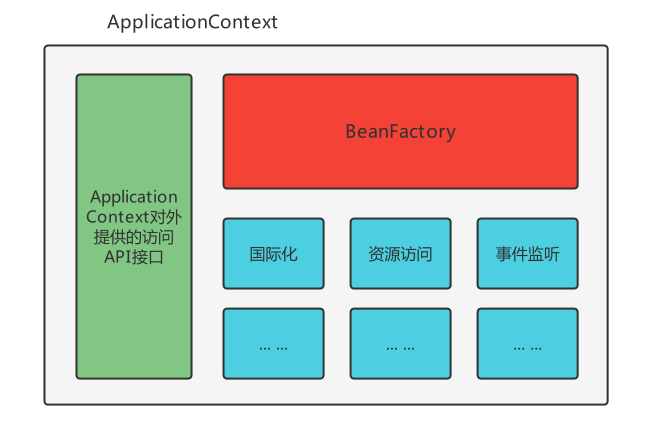  
   
   - ApplicationContext除了继承了BeanFactory外，还继承了ApplicationEventPublisher（事件发布器）、ResouresPatternResolver（资源解析器）、MessageSource（消息资源）等。但是ApplicationContext的核心功能还是BeanFactory。
     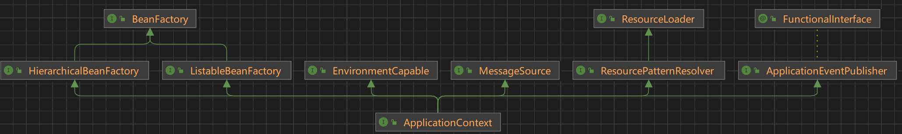  

3. ApplicationContext与BeanFactory既有继承关系，又有融合关系。Bean创建的主要逻辑和功能都被封装在BeanFactory中，ApplicationContext不仅继承了BeanFactory，而且ApplicationContext内部还维护着BeanFactory的引用。 

4. Bean的初始化时机不同，原始BeanFactory是在首次调用getBean("id")时才进行Bean的创建，而ApplicationContext是加载配置文件、容器创建时就将所有的Bean实例都创建好了，存储到一个单例池中，当调用getBean时直接从单例池中获取Bean实例返回。

```java
//1. 加载配置文件，实例化容器
ApplicationContext applicationContext = new ClassPathXmlApplicationContext("applicationContext.xml");
//2. 获取Bean实例对象
UserService userService = (UserService) applicationContext.getBean("userService");

System.out.println(userService);
```

#### ApplicationContext继承体系

- 只在Spring基础环境下，即只导入spring-context坐标时，此时ApplicationContext的继承体系:

  

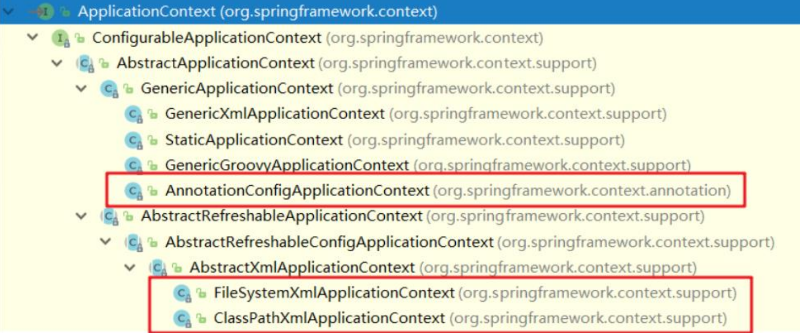  

- Spring基础环境下，常用的三个ApplicationContext作用如下：

| 实现类                                | 功能描述                             |
|:---------------------------------- |:-------------------------------- |
| ClassPathXmlApplicationContext     | 加载类路径下的xml配置的ApplicationContext  |
| FileSystemXmlApplicationContext    | 加载磁盘路径下的xml配置的ApplicationContext |
| AnnotationConfigApplicationContext | 加载注解配置类的ApplicationContext       |

- 在Spring的web环境下，常用的两个ApplicationContext作用如下：

| 实现类                                   | 功能描述                                    |
|:------------------------------------- |:--------------------------------------- |
| XmlWebApplicationContext              | web环境下，加载类路径下的xml配置的ApplicationContext  |
| AnnotationConfigWebApplicationContext | web环境下，加载磁盘路径下的xml配置的ApplicationContext |

## @Configuration 配置类

| 名称     | 配置类 SpringConfig.class          | 配置文件 beans.xml             |
| -------- | ---------------------------------- | ------------------------------ |
| 配置方式 | @Configuration                     | `<beans>`                      |
| 容器     | AnnotationConfigApplicationContext | ClassPathXmlApplicationContext |

```java
@Configuration
public class ApplicationContextConfig {}
```

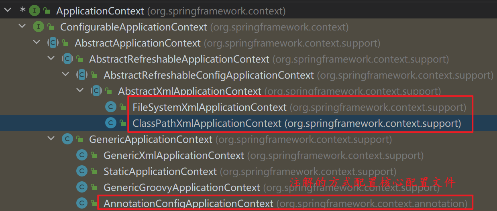  

```java
//注解方式加载配置文件
AnnotationConfigApplicationContext applicationContext =  new AnnotationConfigApplicationContext(ApplicationContextConfig.class);
```

### @Profile 环境切换

| 注解 | @Profile                                                     |
| ---- | ------------------------------------------------------------ |
| 位置 | 类、方法                                                     |
| 作用 | 标注当前产生的Bean从属于哪个环境。<br />没有被@Profile标注的，都是默认处于激活的环境中。 |

> 只有激活了当前环境，被标注的Bean才能被注册到Spring容器里。
> 不指定环境的Bean，任何环境下都能注册到Spring容器里。

```java
@Repository("userDao")
@Profile("test")
public class UserDaoImpl implements UserDao{}

@Component
public class OtherBean {
    @Bean("service")
    @Profile("test")
    public UserService userService(@Qualifier("userServiceImpl") UserService userService) {
        return userService;
    }
}
```

| 激活环境 | 语句                                                         |
| -------- | ------------------------------------------------------------ |
| JVM      | ` -Dspring.profiles.active=环境名`                           |
| 代码     | `System.setProperty("spring.profiles.active","环境名")`<br />必须在创建Spring容器前。 |

- 默认激活最外层的`<beans>`；如果激活了子级的`<beans>`，则其父级也被激活。即：如果激活了最内层的`<beans>`则依次向外激活直到最外层的`<beans>`也被激活。（向外扩散激活）
- 如果外层和内存的`<beans>`存在相同id或class的`<bean>`，在二者都被激活的情况下，如果是getBean(id)或getBean(class)会出错。

### @Import 导入配置类

> 第三方框架与Spring整合注解方式很多是靠@Import注解完成的。

| 注解     | @Import                                                      |
| -------- | ------------------------------------------------------------ |
| 位置     | 配置类                                                       |
| 作用     | 加载其他配置类                                               |
| 导入类型 | 普通的配置类<br />实现ImportSelector接口的类<br />实现ImportBeanDefinitionRegistrar接口的类 |

```java
@Configuration
@ComponentScan
@PropertySource("classpath:jdbc.properties")
@Import(OtherConfig.class)
public class ApplicationContextConfig {}
```

#### ImportSelect接口实现类

```java
public interface ImportSelector {
    //封装了需要被注册到Spring容器中的Bean的全限定名
    String[] selectImports(AnnotationMetadata importingClassMetadata);

    @Nullable
    default Predicate<String> getExclusionFilter() {
        return null;
    }
}
```

| 方法               | public String[] selectImports(AnnotationMetadata importingClassMetadata) |
| ------------------ | ------------------------------------------------------------ |
| AnnotationMetadata | 注解的媒体数据（当前@Import标注类上的其他注解(@Configuration等)的元信息）。 |
| String[]           | 封装需要被注册到Spring容器中的Bean的全限定名。<br />全限定名在该数组内的类即使没有被@Component标注，也会被注册到Spring容器中，以全限定名为beanName。而已经被@Component标注的，按@Component注解来注册。 |

```java
public class MyImportSelector implements ImportSelector {
    @Override
    public String[] selectImports(AnnotationMetadata importingClassMetadata) {
        Map<String, Object> annotationAttributes = importingClassMetadata.getAnnotationAttributes(ComponentScan.class.getName());
        //根据其他注解的属性名来获取信息：如@ComponenetScan的@AliasFor("basePackages")
        String[] basePackages = (String[]) annotationAttributes.get("basePackages");
        for (String page : basePackages) {
            System.out.println(page);
        }

        //返回的数组封装了需要被注册到Spring容器中的Bean的全限定名
        //全限定名在该数组内的类：即使没有被@Component标注解，也会被注册到Spring容器中，以全限定名为beanName
        //被@Component标注的，按@Component注解来注册
        return new String[]{OtherBean.class.getName()}; //com.zjk.beans.OtherBean
    }


    @Override
    public Predicate<String> getExclusionFilter() {
        return ImportSelector.super.getExclusionFilter();
    }
}
```

```java
@Configuration
@ComponentScan("com.zjk")
@Import(MyImportSelector.class)
@MapperScan("com.zjk.mapper")
@PropertySource("classpath:jdbc.properties")
public class ApplicationContextConfig {
    ...
}
```

```java
public class OtherBean {}
```

#### ImportBeanDefinitionRegistrar接口实现类

- @Import导入实现ImportBeanDefinitionRegistrar接口的类，其**registerBeanDefinitions()** 方法会被自动调用，在该方法内可以注册BeanDefinition。

```java
public interface ImportBeanDefinitionRegistrar {
    default void registerBeanDefinitions(AnnotationMetadata importingClassMetadata, BeanDefinitionRegistry registry, BeanNameGenerator importBeanNameGenerator) {
        this.registerBeanDefinitions(importingClassMetadata, registry);
    }

    default void registerBeanDefinitions(AnnotationMetadata importingClassMetadata, BeanDefinitionRegistry registry) {
    }
}
```

```java
public class MyImportBeanDefinitionRegistrar implements ImportBeanDefinitionRegistrar {
    @Override
    public void registerBeanDefinitions(AnnotationMetadata importingClassMetadata, BeanDefinitionRegistry registry) {
        //注册BeanDefinition
        //1.创建RootBeanDefinition
        BeanDefinition beanDefinition = new RootBeanDefinition();
        beanDefinition.setBeanClassName(OtherBean.class.getName());
        //2.注册到BeanDefinitionMapper
        registry.registerBeanDefinition("OtherBean",beanDefinition);
    }
}
```

```java
@Configuration
@ComponentScan("com.zjk")
@Import({MyImportSelector.class, MyImportBeanDefinitionRegistrar.class})
@MapperScan("com.zjk.mapper")
@PropertySource("classpath:jdbc.properties")
public class ApplicationContextConfig {...}
```

### @ComponentScan 组件扫描

| 注解 | @ComponentScan                                               |
| ---- | ------------------------------------------------------------ |
| 位置 | 配置类                                                       |
| 作用 | 指定一个或多个包名：扫描指定包及其子包下标记的类。<br />不配置包名：扫描当前@ComponentScan标注类所在包及其子包下的类。 |
| 扫描 | 精确范围。<br />过滤器：excludeFilters、includeFilgters。    |

```java
@Configuration
@ComponentScan("com.zjk")
public class ApplicationContextConfig {
}
```

```java
@Configuration
@ComponentScan({"com.zjk.service","com.zjk.dao"})
public class ApplicationContextConfig {
}
```

| 过滤器             | 说明                   |
| --------------- | -------------------- |
| excludeFilters  | 设置扫描加载bean时，排除的过滤规则。 |
| includeFilgters | 加载指定的bean。           |

| type属性        | 过滤                      |
| :-------------- | :------------------------ |
| ANNOTATION      | 注解                      |
| ASSIGNABLE_TYPE | 指定的类型                |
| ASPECTJ         | Aspectj表达式（基本不用） |
| REGEX           | 正则表达式                |
| CUSTOM          | 自定义规则                |

```java
@ComponentScan(value = "com.zjk",
        excludeFilters = @ComponentScan.Filter(
                type = FilterType.ANNOTATION, //指定注解类型的Bean
                classes = Controller.class //排除指定注解的Bean
        )
)
```

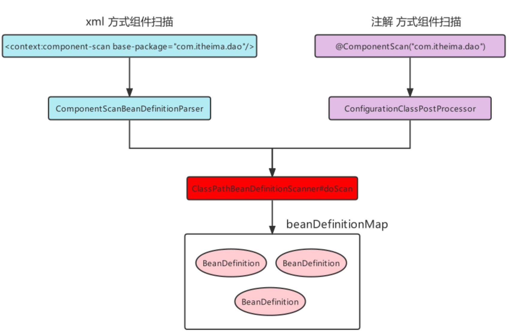  

- component-scan是一个context命名空间下的自定义标签，要找到对应的命名空间处理器（NamespaceHandler）和解析器，查看spring-context包下的spring.handlers文件。将标注的@Component的类生成的对应的BeanDefiition进行注册。

```xml
<context:conponent-scan base-package="com.zjk"></context>
```

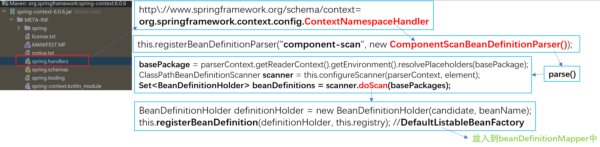

- AnnotationConfigApplicationContext在进行创建时，内部调用了如下代码，该工具注册了几个Bean后处理器。

```java
AnnotationConfigUtils.registerAnnotationConfigProcessors(this.registry)
```

- 其中，ConfigurationClassPostProcessor 是一个 BeanDefinitionRegistryPostProcessor，经过一系列源码调用，最终也被指定到了ClassPathBeanDefinitionScanner 的doScan 方法（与xml方式最终终点一致）。

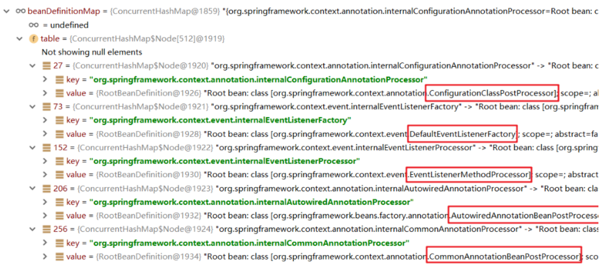  

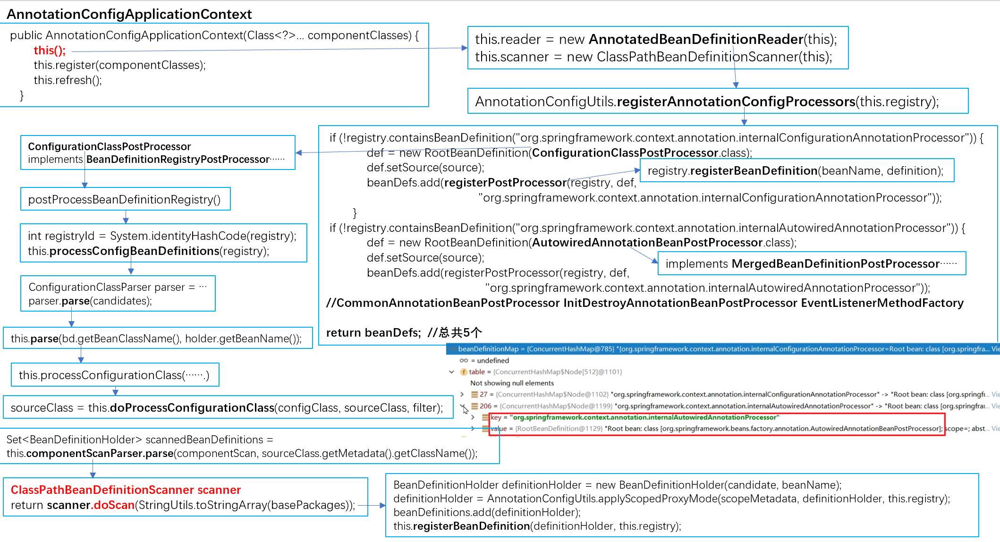      

### @PropertySource properties资源加载

| 注解 | @PropertySource            |
| ---- | -------------------------- |
| 位置 | 配置类                     |
| 作用 | 加载外部properties资源配置 |

```java
@Configuration
@ComponentScan
@PropertySource({"classpath:jdbc.properties","classpath:xxx.properties"})
public class ApplicationContextConfig {}
```

### @Primary 同类型注入优先

| 注解 | @Primary                                           |
| ---- | -------------------------------------------------- |
| 位置 | 类                                                 |
| 作用 | 标注相同类型的Bean优先被使用权。                   |
| 说明 | 搭配@Component/@Bean使用，标注该Bean的优先级更高。 |

> 通过类型获取Bean（getBean(class)）、@Autowired根据类型进行注入时，会选用优先级更高的Bean。
> 
> @Qualifier指定名称注入，而不是优先级。

```java
@Repository
@Primary
public class UserDaoImpl implements UserDao{}
```

```java
@Bean
@Primary
public UserDao getUserDao01(){return new UserDaoImpl();}
```

## Bean

| Annotation     | 功能描述                                                     |
| -------------- | :----------------------------------------------------------- |
| @Component     | Bean的id和全限定名配置；<br>在指定扫描范围内被Spring加载并实例化 |
| @Scope         | Bean的作用范围<br>BeanFactory作为容器时取值singleton和prototype |
| @Lazy          | Bean的实例化时机，是否延迟加载。BeanFactory作为容器时无效    |
| @PostConstruct | Bean实例化后自动执行的初始化方法，method指定方法名           |
| @PreDestroy    | Bean实例销毁前的方法<br />method指定方法名                   |
| @Bean          | 指定工厂Bean的方法完成Bean的创建                             |

### @Component 基础类

| 注解   | @Component("beanName") |
| ------ | ---------------------- |
| 默认id | 类名首字母小写         |

| 构造型      | 层次    |
| :---------- | :------ |
| @Repository | Dao     |
| @Service    | Service |
| @Controller | Web     |

- bean标签：

```xml
<bean id="userDao" class="com.zjk.dao.impl.UserDaoImpl"></bean>
<bean class="com.zjk.dao.impl.UserDaoImpl"></bean>
```

```java
applicationContext.getBean("com.zjk.dao.impl.UserDaoImpl")
```

- @Component：

```java
@Component
public class UserDaoImpl implements UserDao {
}
```

```java
ApplicationContext applicationContext = new ClassPathXmlApplicationContext("applicationContext.xml");
UserDaoImpl userDao = applicationContext.getBean("userDaoImpl", UserDaoImpl.class);
System.out.println(userDao);
```

#### @Scope 范围配置

>- Spring-Context环境Bean的作用范围有两个：Singleton、Prototype。
>- Spring-webmvc环境：request、session。

| 范围      | 说明                                                         |
| --------- | ------------------------------------------------------------ |
| singleton | 单例，默认值。<br/>Spring容器创建的时候，就会进行Bean的实例化，并存储到容器内部的单例池singletonObjects中。<br/>每次getBean()时都是从单例池中获取相同的Bean实例。 |
| prototype | 原型。<br/>pring容器初始化时不会创建Bean实例，当调用getBean()时才会实例化Bean。<br/>每次getBean()都会创建一个新的Bean实例。<br />信息存放在 beanDefinitionMap 。 |

```java
@Scope("singleton")
public class UserDaoImpl{}
```

#### @Lazy 延迟加载

- 延迟加载：Spring容器创建时，不会立即创建Bean实例，等到需要时再创建Bean实例并存储到单例池中，后续使用该Bean则从单例池获取，仍然是单例。

```java
@Lazy(true)
public class UserDaoImpl{}
```

#### @PostConstruct、@PreDestory 初始化、销毁

- Bean实例化后，可以执行指定的初始化方法完成一些初始化的操作；Bean销毁前也可以执行指定的销毁方法完成一些操作。

> ClassPathXmlApplicationContext类的close()方法关闭容器时会销毁其中的Bean。

> Bean的销毁不一定调用Bean的销毁方法：有可能在Spring容器关闭之后，还未来得及调用Bean的销毁方法，尽管如此Bean还是被销毁了。

| 注解 | @PostConstruct | @PreDestory |
| ---- | -------------- | ----------- |
| 位置 | 方法           | 方法        |
| 标注 | 初始化方法     | 销毁方法    |

> @PostConstruct和 @PreDestroy注解位于javax.annotation包，需要引入javax.annotation-api依赖。

```java
public class UserDaoImpl implements UserDao {
    @PostConstruct
    public void init(){ System.out.println("初始化方法..."); }
    @PreDestory
    public void destroy(){ System.out.println("销毁方法..."); }
}
```

### DI 依赖注入

**注入顺序（后面的覆盖前面的）**：字面量/声明 <-- 属性标注 <-- setXxx()标注。

#### @Value 普通数据

- 普通数据：基本数据类型、String。

| 注解 | @Value                                                       |
| ---- | ------------------------------------------------------------ |
| 位置 | 属性、形参、方法<br />参数列表内对单个参数注解，方法上对所有参数注解。 |
| 作用 | 对普通数据传值注入                                           |

```java
//最终username属性为tom。
@Component
public class UserDaoImpl implements UserDao {
 @Value("zjk")
 private String username;

 @Value("tom")
 public void setUsername(String username) {
     this.username = username;
 }
}
```

#### @Autowired 自动装配

| 注解 | @Autowired                                                   |
| ---- | ------------------------------------------------------------ |
| 位置 | 属性、形参、方法<br />参数列表内对单个参数注解，方法上对所有参数注解。 |
| 说明 | 优先根据类型自动装配。<br />从Spring容器中匹配 setXxx()、id注入。 |

> @Autowired用于属性注入：
>
> 隐式自动装配：只有一个构造器的，Spring会隐式地通过该构造器的参数应用依赖的自动装配。
> 若具有多个构造器，可在指定的构造器上标注@Autowired。

| 需要注入的Bean数量 | @Autowired说明                                               |
| :----------------- | :----------------------------------------------------------- |
| 1                  | 注入类型匹配的Bean。<br />若同一类型的Bean实例有多个，会尝试通过被注入属性的名称进行二次匹配；如果不存在匹配的beanName，则报错。 |
| n                  | 将通过类型匹配的Bean实例都注入到集合中。                     |

```java
@Service
public class UserServiceImpl implements UserService {
    @Autowired
    private UserDao userDaoImpl;
}
```

#### @Qualifier 指定名称注入

| 注解 | @Qualifier                                                   |
| ---- | ------------------------------------------------------------ |
| 位置 | 属性、形参、方法<br />参数列表内对单个参数注解，方法上对所有参数注解。 |
| 说明 | Bean类型匹配。<br />匹配setXxx(Yyy 参数)的数据类型Yyy，在容器中查找class的类型是Yyy的。<br />同一类型只能匹配一个Bean，匹配出多个相同Bean类型时（class相同包括继承、实现），报错。 |
| 搭配 | 搭配@Autowired根据名称注入Bean实例。                         |

```java
@Service
public class UserServiceImpl implements UserService {
    //@Autowired 默认使用
    @Qualifier("userDaoImpl")
    private UserDao userDao;

    public UserDao getUserDao() {
        return userDao;
    }

    //@Autowired 默认使用
    @Qualifier("userDaoImpl2")
    public void setUserDao(UserDao userDao) {
        this.userDao = userDao;
    }
}
```

#### @Resource

> @Resource注解存在于 javax.annotation 包中，Spring对其进行解析。

| 注解 | @Resource                                                    |
| ---- | ------------------------------------------------------------ |
| 位置 | 属性、形参、方法<br />参数列表内对单个参数注解，方法上对所有参数注解。 |
| 说明 | 不指定名称参数name-->根据类型注入。<br />指定名称参数name-->根据名称注入。 |
| 对比 | 当存在多个相同类型的Bean实例时，不会像@Autowired一样报错。   |

```java
@Service
public class UserServiceImpl implements UserService {
    @Resource
    private UserDao userDao;

    public UserDao getUserDao() {
        return userDao;
    }

    @Resource(name="userDaoImpl2")
    public void setUserDao(UserDao userDao) {
        this.userDao = userDao;
    }
}
```

#### @PropertySource 配置文件资源加载

| 注解 | @PropertySource                |
| ---- | ------------------------------ |
| 位置 | 配置类                         |
| 说明 | 加载properties文件到Spring容器 |

```java
@Configuration
@PropertySource("classpath:jdbc.properties")
public class SpringConfig{}
```

- @Value在载入properties文件后，SpEL表达式注入properties文件中的属性。

```java
@Component
public class UserDaoImpl implements UserDao {
    @Value("${jdbc.username}")
    private String username;

    public String getUsername() {
        return username;
    }
}
```

### 工厂实例化

| 实例化方式                       | 说明                                                         |
| -------------------------------- | ------------------------------------------------------------ |
| 静态工厂<br />（factory-method） | 配置一个工厂Bean，提供一个静态方法用于生产Bean实例。<br />而不需要配置被生产的Bean。 |
| 实例工厂<br />（@Bean）          | 工厂对象调用非静态方法。<br />先配置工厂Bean，再配置目标Bean。<br />实例化Bean对象时，先实例化工厂Bean对象，再通过工厂Bean对象调用getXxx()来获取Bean对象。 |
| FactoryBean规范                  | 延迟实例化Bean。                                             |

#### @Bean 实例工厂

| 注解 | @Bean                                                        |
| ---- | ------------------------------------------------------------ |
| 位置 | 工厂方法                                                     |
| 作用 | 将方法的返回值作为Bean实例注册到Spring容器中。               |
| 说明 | @Bean@Bean("beanName")指定当前返回的Bean实例的beanName。<br />如果不指定，则直接使用当前方法的名称作为当前Bean实例的beanName。 |

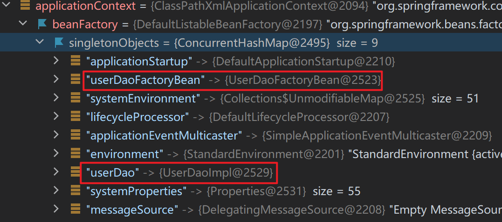

```java
@Component
public class OtherBean {
    @Bean
    public DruidDataSource dataSource(@Value("${jdbc.url}") String url,
                                         @Value("${jdbc.username}") String userName,
                                         @Value("1234") String password) {
        DruidDataSource dataSource = new DruidDataSource();
        dataSource.setUrl(url);
        dataSource.setUsername(userName);
        dataSource.setPassword(password);
        return dataSource;
    }

    @Bean
    public UserDao userDao(UserDaoImpl userDao){
        return userDao;
    }

    @Bean
    //@Autowired 可以省略@Autowired 
    public UserDao userService(@Qualifier("userDaoImpl2") UserDao dao) {
        //由于UserDao类型的Bean实例存在多个，需要使用@Qualifier指定注入的beanName
        return dao;
    }
}
```

#### FactoryBean接口

- 实现FactoryBean接口，再交给Spring管理即可。

```java
public interface FactoryBean<T> {
    String OBJECT_TYPE_ATTRIBUTE = "factoryBeanObjectType";
    T getObject() throws Exception; //获得实例对象方法
    Class<?> getObjectType(); //获得实例对象类型方法
    default boolean isSingleton() {
        return true;
    }
}
```

- Spring容器创建时，FactoryBean被实例化并存储到singletonObjects中，但getObject() 方法尚未被执行，UserDaoImpl也没被实例化，当首次用到UserDaoImpl时，才调用getObject() 。此工厂方式产生的Bean实例不会存储到singletonObjects中，而是存储到factoryBeanObjectCache中，之后每次使用到userDao都从该缓存池中获取同一个userDao实例。

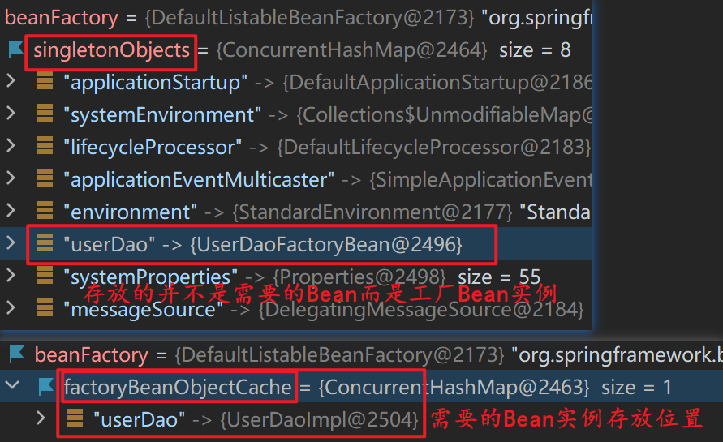   

```java
@Component
public class UserDaoFactoryBean implements FactoryBean<UserDao> {

    @Override
    public UserDao getObject() throws Exception {
        return new UserDaoImpl();
    }

    @Override
    public Class<?> getObjectType() {
        return UserDao.class;
    }

    @Override
    public boolean isSingleton() {
        return FactoryBean.super.isSingleton();
    }
}
```

### 后处理器

> Spring的后处理器是Spring对外开发的重要扩展点，允许我们介入到Bean的整个实例化流程中来，以达到动态注册BeanDefinition，动态修改BeanDefinition，以及动态修改Bean的作用。

| 后处理器                                           | 执行时机                                                     |
| -------------------------------------------------- | ------------------------------------------------------------ |
| BeanFactoryPostProcessor<br />（Bean工厂后处理器） | BeanDefinitionMap填充完毕，Bean实例化之前执行。              |
| BeanPostProcessor<br />（Bean后处理器）            | 一般在Bean实例化之后，填充到单例池singletonObjects之前执行。 |

#### Bean工厂后处理器

##### BeanFactoryPostProcessor

- BeanFactoryPostProcessor接口规范：该接口的实现类如果交由Spring容器管理，则Spring自动回调该接口的方法，对BeanDefinition注册、修改。
- 如果在postProcessBeanFactory()中修改了BeanDefinition的className，那么不能使用class来getBean()。

```java
public interface BeanFactoryPostProcessor {
    void postProcessBeanFactory(ConfigurableListableBeanFactory beanFactory);
}
```

- postProcessBeanFactory的参数ConfigurableListab：实质上是DefaultListableBeanFactory，可以对beanDefinitionMap中的BeanDefinition进行操作。

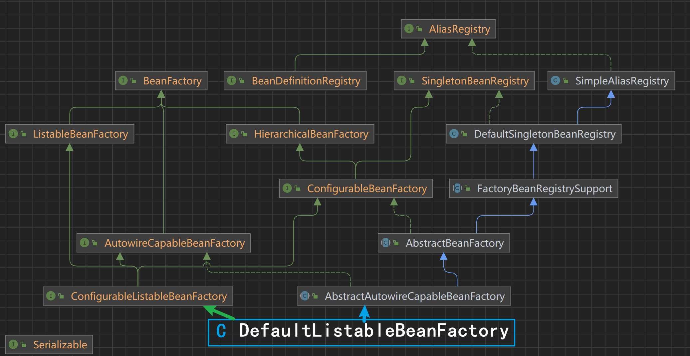   

```java
public class MyBeanFactoryProcessor implements BeanFactoryPostProcessor {

    @Override
    public void postProcessBeanFactory(ConfigurableListableBeanFactory configurableListableBeanFactory) throws BeansException {
        //修改BeanDefinition
        //1.获取指定BeanDefinition
        BeanDefinition userService = configurableListableBeanFactory.getBeanDefinition("userService");
        //2.将UserService修改为UserDao对象
        userService.setBeanClassName("com.zjk.dao.impl.UserDaoImpl");

        //注册BeanDefinition
        //1.新建RootBeanDefinition对象
        BeanDefinition personDao = new RootBeanDefinition();
        //2.设置RootBeanDefinition对象的class
        personDao.setBeanClassName("com.zjk.dao.impl.PersonDaoImpl");
        //3.强转为DefaultListableBeanFactory
        DefaultListableBeanFactory defaultListableBeanFactory = (DefaultListableBeanFactory) configurableListableBeanFactory;
        //4.注册到BeanDefinitionMap中 registerBeanDefinition("id",beanDefinition)
        defaultListableBeanFactory.registerBeanDefinition("personDao",personDao);

        //使用BeanDefinitionRegistryPostProcessor进行注册
    }
}
```

##### BeanDefinitionRegistryPostProcessor

- BeanDefinitionRegistryPostProcessor：专门用于注册BeanDefinition操作的接口，继承BeanFactoryPostProcessor。

```java
public interface BeanDefinitionRegistryPostProcessor extends BeanFactoryPostProcessor {
    void postProcessBeanDefinitionRegistry(BeanDefinitionRegistry var1) throws BeansException;
}
```

- postProcessBeanDefinitionRegistry(BeanDefinitionRegistry beanDefinitionRegistry) 
- postProcessBeanFactory(ConfigurableListableBeanFactory configurableListableBeanFactory) 

```java
public class MyBeanDefinitionRegistryPostProcessor implements BeanDefinitionRegistryPostProcessor {
    @Override
    public void postProcessBeanDefinitionRegistry(BeanDefinitionRegistry beanDefinitionRegistry) throws BeansException {
        //1.新建RootBeanDefinition对象
        //2.设置RootBeanDefinition对象的className
        //3.注册到BeanDefinitionMap中 registerBeanDefinition("id",beanDefinition)
    }

    @Override
    public void postProcessBeanFactory(ConfigurableListableBeanFactory configurableListableBeanFactory) throws BeansException {

    }
}
```

- 执行顺序：BeanDefinitionRegistryPostProcessor的(postProcessBeanDefinitionRegistry > postProcessBeanFactory) > BeanFactoryPostProcessor的postProcessBeanFactory。

```java
public class MyBeanDefinitionRegistryPostProcessor implements BeanDefinitionRegistryPostProcessor {
    @Override
    public void postProcessBeanDefinitionRegistry(BeanDefinitionRegistry beanDefinitionRegistry) throws BeansException {
        //注册
        //1.新建RootBeanDefinition对象
        BeanDefinition personDao = new RootBeanDefinition();
        //2.设置RootBeanDefinition对象的class
        personDao.setBeanClassName("com.zjk.dao.impl.PersonDaoImpl");
        //3.注册到BeanDefinitionMap中 registerBeanDefinition("id",beanDefinition)
        beanDefinitionRegistry.registerBeanDefinition("personDao",personDao);
    }

    @Override
    public void postProcessBeanFactory(ConfigurableListableBeanFactory configurableListableBeanFactory) throws BeansException {

    }
}
```

#### BeanPostProcessor Bean后处理器

- Bean后处理器：实现了该接口并被容器管理的BeanPostProcessor会在创建每个Bean的流程节点上被Spring自动调用。

> @Nullable 标识，方法可以不被实现。

| 方法参数            | 说明                           |
| --------------- | ---------------------------- |
| Object bean     | 当前被实例化的Bean                  |
| String beanName | 当前Bean在容器中的名称                |
| 返回值             | 加入到singletonObjects单例池中的bean |

```java
public interface BeanPostProcessor {
    //在属性注入完毕，init初始化方法执行之前被回调
    @Nullable
    default Object postProcessBeforeInitialization(Object bean, String beanName) throws BeansException {
        return bean;
    }
    //在init初始化方法执行之后，被添加到单例池singletonObjects之前被回调
    @Nullable
    default Object postProcessAfterInitialization(Object bean, String beanName) throws BeansException {
        return bean;
    }
}
```

> Proxy 动态代理在运行期间执行增强操作：
>
> - 代理设计模式和包装设计模式。
>
> - 使用动态代理 对目标bean进行增强，返回proxy对象，存储在singletonObjects单例池中。
>
> - 主要是在postProcessAfterInitialization(Object bean, String beanName)中，对已经init初始化的bean进行增强。

### Bean生命周期

- Spring Bean的生命周期：从 Bean 实例化之后（反射创建出对象之后），到Bean成为一个完整对象，最终存储到单例池。

| Bean所处阶段 | 说明                                                                                                                |
| -------- | ----------------------------------------------------------------------------------------------------------------- |
| 实例化      | 取出BeanDefinition的信息进行判断当前Bean的范围是否是singleton的，是否是延迟加载的，是否是FactoryBean等，最终将一个普通的singleton的Bean通过反射进行实例化。           |
| 初始化      | Bean创建之后仅是个"半成品"，需要对Bean实例的属性进行填充、执行一些Aware接口方法、执行BeanPostProcessor方法、执行InitializingBean接口的初始化方法、执行自定义初始化init方法等。 |
| 完成       | 完整的Spring Bean被存储到单例池singletonObjects。                                                                            |

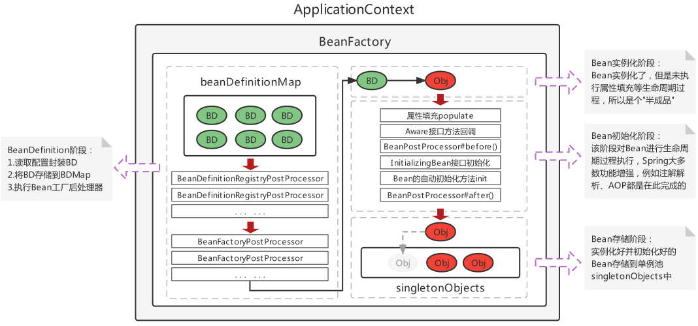 

#### 实例化阶段

1. 加载配置类，扫描每个Bean的信息，封装成一个个的BeanDefinition对象;
2. 将BeanDefinition存储在beanDefinitionMap（`Map<String,BeanDefinition>`）;
3. ApplicationContext底层遍历beanDefinitionMap，创建Bean实例对象;
4. 创建好的Bean实例对象被存储到singletonObjects（`Map<String,Object>`）;
5. 当执行applicationContext.getBean(beanName)时，从singletonObjects去匹配Bean实例返回。   

- Spring容器在进行初始化时，会将配置的Bean的信息封装成一个BeanDefinition对象，所有的BeanDefinition存储到beanDefinitionMap，Spring对该Map遍历、使用反射创建Bean实例对象。创建好的Bean对象存储在singletonObjects，当调用getBean()方法时则最终从singletonObjects中取出Bean实例对象返回。

##### beanDefinitionMap、DefaultListableBeanFactory

- Spring会取出beanDefinitionMap中的每个BeanDefinition信息，反射构造方法或调用指定的工厂方法生成Bean实例对象：只要将BeanDefinition注册到beanDefinitionMap这个Map中，Spring就会进行对应的Bean的实例化操作。

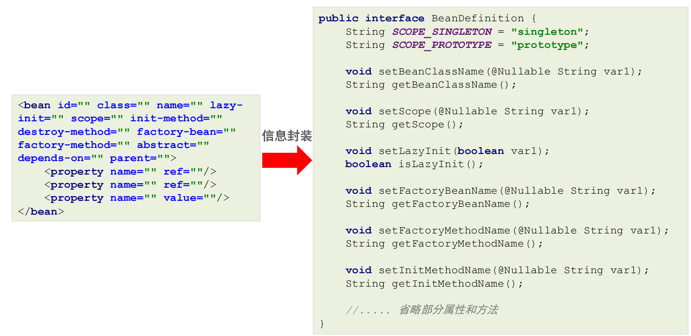   

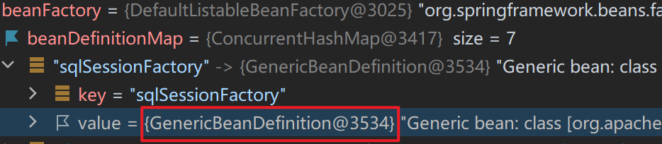   

> BeanDefinition接口：RootBeanDefinition。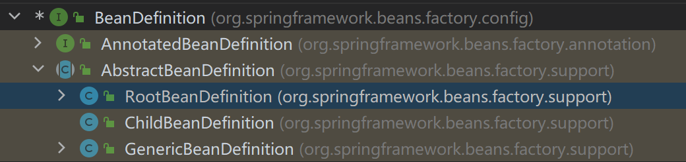   

- DefaultListableBeanFactory内部维护着beanDefinitionMap。

```java
public class DefaultListableBeanFactory extends ... implements ... {
    //存储<bean>标签对应的BeanDefinition对象
    //key:beanName，value:Bean定义对象BeanDefinition
    private final Map<String, BeanDefinition> beanDefinitionMap;
}
```

   

##### Bean实例、singletonObjects 单例池

- beanDefinitionMap中的BeanDefinition会被转化成对应的Bean实例对象，存储到单例池singletonObjects中去，在DefaultListableBeanFactory的上四级父类DefaultSingletonBeanRegistry中，维护着singletonObjects。

```java
public class DefaultSingletonBeanRegistry extends ... implements ... {
    //存储Bean实例的单例池
    //key:beanName，value:Bean的实例对象
    private final Map<String, Object> singletonObjects = new ConcurrentHashMap(256);
}
```

   

#### 初始化阶段

1. Bean实例的属性填充。
2. Aware接口属性注入。
3. BeanPostProcessor的Object postProcessBeforeInitialization(Object bean, String beanName)方法回调。
4. InitializingBean接口的afterPropertiesSet()初始化方法回调。
5. 自定义初始化方法init回调 init-method。
6. BeanPostProcessor的Object postProcessAfterInitialization(Object bean, String beanName)方法回调。

##### Bean实例属性填充、三级缓存

###### Bean实例属性填充

- BeanDefinition将当前Bean实体的注入信息存储在propertyValues属性。

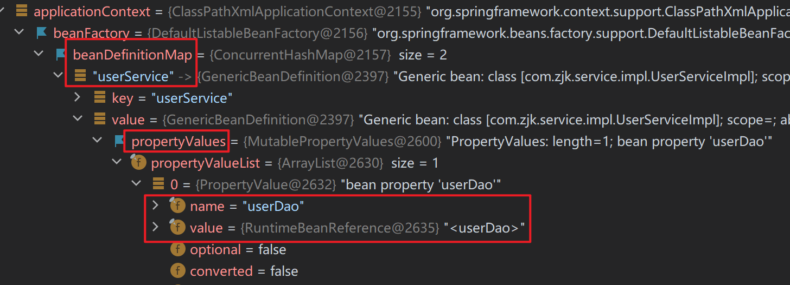   

| 属性注入     | 说明                                                         |
| ------------ | ------------------------------------------------------------ |
| 普通属性     | String、int、存储基本类型的集合时，直接通过set方法的反射设置 |
| 单向对象引用 | 从容器中getBean()获取后通过set方法反射设置进去。<br />如果容器中没有，等待被注入对象Bean实例完成整个生命周期后，再进行注入操作。 |
| 双向对象引用 | 循环引用（循环依赖）问题。                                   |

- 单项对象引用：Bean对象的创建是按照在配置文件xml中`<bean>`的位置来确定先后顺序的。因此，尽量将被注入Bean的`<bean>`放在上面。

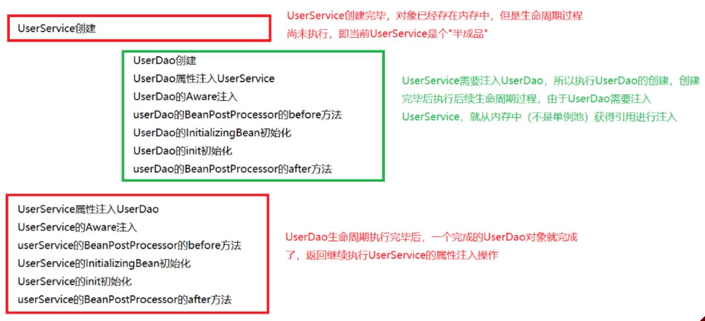   

- 循环依赖 三级缓存存储：多个实体之间相互依赖并形成闭环的情况

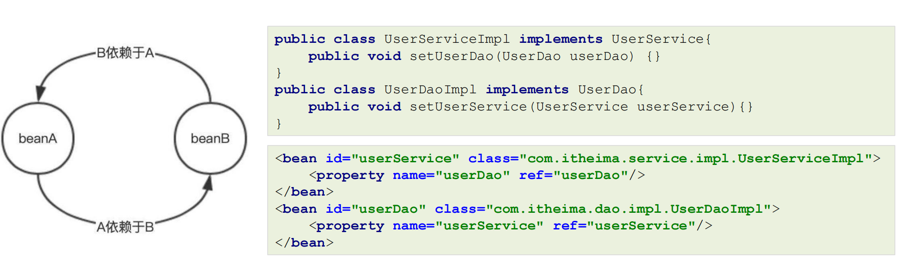   

   

###### 三级缓存存储

- Spring提供三级缓存存储完整Bean实例、半成品Bean实例：解决循环引用问题。
- 在DefaultListableBeanFactory的上四级父类**DefaultSingletonBeanRegistry**中提供如下三个Map：

```java
public class DefaultSingletonBeanRegistry ... {

    Map<String, Object> singletonObjects = new ConcurrentHashMap(256);

    Map<String, Object> earlySingletonObjects = new ConcurrentHashMap(16);

    Map<String, ObjectFactory<?>> singletonFactories = new HashMap(16);
}
```

| 缓存                                  | 说明                                                         |
| ------------------------------------- | ------------------------------------------------------------ |
| 三级缓存：<br />singletonFactories    | 对象Bean创建时就放入三级缓存，还未完成注入。<br />单例Bean的工厂池，缓存半成品对象，对象未被引用，使用时在通过工厂创建Bean。 |
| 二级缓存：<br />earlySingletonObjects | 对象Bean被注入到其他Bean中时，如果在三级缓存中，则移入到二级缓存。<br />早期Bean单例池，缓存半成品对象，且当前对象已经被其他对象引用了。 |
| 一级缓存：<br />singletoObjects       | 对象Bean完成实例化和初始化。<br />最终存储单例Bean成品（实例化和初始化都完成）的容器。 |

- 假设UserService和UserDao循环依赖：
1. UserService 实例化对象，但尚未初始化，将UserService存储到三级缓存；
2. UserService 属性注入，需要UserDao，从缓存中获取，没有UserDao；
3. UserDao实例化对象，但尚未初始化，将UserDao存储到到三级缓存；
4. UserDao属性注入，需要UserService，依次从一二三级缓存查找，在三级缓存中发现并获取UserService，UserService从三级缓存移入二级缓存；
5. UserDao执行其他生命周期过程，最终成为一个完成Bean，存储到一级缓存，删除二三级缓存；
6. UserService 注入UserDao；
7. UserService执行其他生命周期过程，最终成为一个完成Bean，存储到一级缓存，删除二三级缓存。

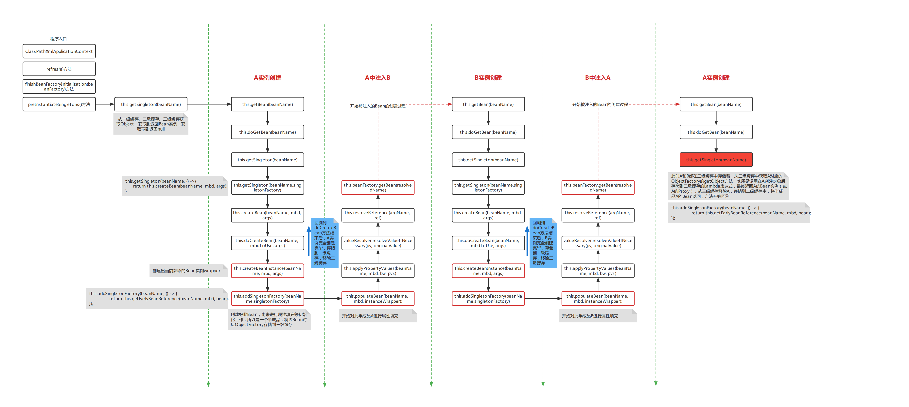   

##### Aware

- Aware接口：框架辅助属性注入。

| Aware接口               | 回调方法                                                     | 作用                                                         |
| :---------------------- | :----------------------------------------------------------- | :----------------------------------------------------------- |
| ServletContextAware     | setServletContext(ServletContext context)                    | Spring框架回调方法注入ServletContext对象。<br />web环境下才生效 |
| BeanFactoryAware        | setBeanFactory(BeanFactory factory)                          | Spring框架回调方法注入beanFactory对象                        |
| BeanNameAware           | setBeanName(String beanName)                                 | Spring框架回调方法注入当前Bean在容器中的beanName             |
| ApplicationContextAware | setApplicationContext(ApplicationContext applicationContext) | Spring框架回调方法注入applicationContext对象                 |

```java
public class UserServiceImpl implements UserService, ServletContextAware, ApplicationContextAware, BeanFactoryAware, BeanNameAware {
    private UserDao userDao;

    public UserServiceImpl() {
        System.out.println("userService创建");
    }

    public UserDao getUserDao() {
        return userDao;
    }

    public void setUserDao(UserDao userDao) {
        System.out.println("userDao setUserDao");
        this.userDao = userDao;
    }

    @Override
    public void setServletContext(ServletContext servletContext) {
        System.out.println(servletContext);
    }

    @Override
    public void setApplicationContext(ApplicationContext applicationContext) throws BeansException {
        System.out.println(applicationContext);
        //org.springframework.context.support.ClassPathXmlApplicationContext@366e2eef, started on Thu Apr 06 22:57:14 CST 2023

    }

    @Override
    public void setBeanFactory(BeanFactory beanFactory) throws BeansException {
        System.out.println(beanFactory);
        //org.springframework.beans.factory.support.DefaultListableBeanFactory@358ee631: defining beans [userService,userDao]; root of factory hierarchy
    }

    @Override
    public void setBeanName(String s) {
        System.out.println(s);
        //userService
    }
}
```

##### InitializingBean

- InitializingBean接口：重写afterPropertiesSet()，属性设置完成之后调用，执行时机早于init-method 内的方法。

```java
public class UserDaoImpl implements UserDao, InitializingBean {
    public UserDaoImpl() {System.out.println("UserDaoImpl创建了...");}
    public void init(){System.out.println("初始化方法...");}
    public void destroy(){System.out.println("销毁方法...");}
    //执行时机早于init-method配置的方法
    public void afterPropertiesSet() throws Exception {
        System.out.println("InitializingBean..."); 
    }
}
```

## 第三方框架 MyBatis

```java
@Configuration
@ComponentScan("com.zjk")
@Import(OtherConfig.class)
@MapperScan("com.zjk.mapper")
@PropertySource("classpath:jdbc.properties")
public class ApplicationContextConfig {
    @Bean("dataSource")
    public DataSource dataSource(@Value("${jdbc.url}") String url,
                                 @Value("${jdbc.username") String username,
                                 @Value("${jdbc.password}") String password) {
        DruidDataSource dataSource = new DruidDataSource();
        dataSource.setUrl(url);
        dataSource.setUsername(username);
        dataSource.setPassword(password);
        return dataSource;
    }

    @Bean("sqlSessionFactoryBean")
    public SqlSessionFactoryBean sqlSessionFactoryBean(DataSource dataSource){
        SqlSessionFactoryBean sqlSessionFactoryBean = new SqlSessionFactoryBean();
        sqlSessionFactoryBean.setDataSource(dataSource);
        return sqlSessionFactoryBean;
    }

}
```

- com.zjk.mapper.UserMapper接口
- sql映射文件：UserMapper.xml
- 直接使用userMapper

```java
AnnotationConfigApplicationContext applicationContext = new AnnotationConfigApplicationContext(ApplicationContextConfig.class);
UserMapper userMapper = applicationContext.getBean("userMapper", UserMapper.class);
userMapper.selectAll().forEach(user -> System.out.println(user));
```

### @MapperScan

| 注解 | @MapperScan                                                  |
| ---- | ------------------------------------------------------------ |
| 位置 | 配置类                                                       |
| 作用 | 指明需要扫描的Mapper在哪个包下。<br />（MapperScannerConfigurer） |
| 说明 | MyBatis整合包org.mybatis.spring.annotation提供。             |

```java
@Retention(RetentionPolicy.RUNTIME)
@Target({ElementType.TYPE})
@Documented
@Import({MapperScannerRegistrar.class})
@Repeatable(MapperScans.class)
public @interface MapperScan {
    String[] value() default {};
    String[] basePackages() default {};
    Class<?>[] basePackageClasses() default {};
    Class<? extends Annotation> annotationClass() default Annotation.class;
    // ... ...
}
```

- @MapperScan通过MapperScannerRegistrar来加载MapperScannerConfigurer（**@Import({MapperScannerRegistrar.class})**）：MapperScannerRegistrar实现了ImportBeanDefinitionRegistrar接口，Spring会自动调用registerBeanDefinitions方法，该方法中又注册MapperScannerConfigurer类。**MapperScannerConfigurer**类扫描Mapper、向容器中注册Mapper对应的MapperFactoryBean。

```java
public class MapperScannerRegistrar implements ImportBeanDefinitionRegistrar, 
ResourceLoaderAware {
    //默认执行registerBeanDefinitions方法
    void registerBeanDefinitions(AnnotationMetadata annoMeta, AnnotationAttributes annoAttrs, 
                                 BeanDefinitionRegistry registry, String beanName) {
        BeanDefinitionBuilder builder = 
            BeanDefinitionBuilder.genericBeanDefinition(MapperScannerConfigurer.class);
        //... 省略其他代码 ...
        //注册BeanDefinition
        registry.registerBeanDefinition(beanName, builder.getBeanDefinition());
    }
}
```

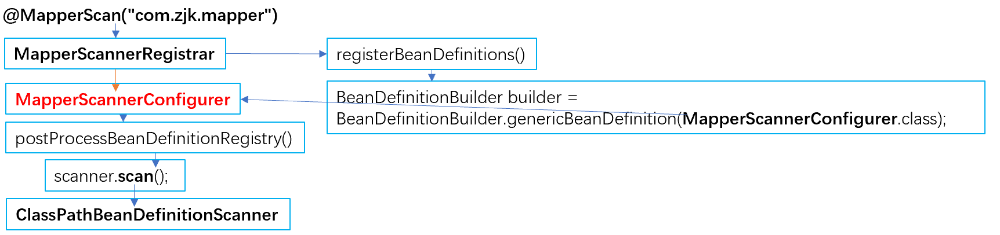   

## AOP

> aspectjweaver包。

| 面向  | 说明                                           |
| --- | -------------------------------------------- |
| OOP | 纵向对一个事物的抽象                                   |
| AOP | 横向的对不同事物的抽象<br />属性与属性、方法与方法、对象与对象都可以组成一个切面。 |

| 概念    | 名词        | 解释                         |
|:----- |:--------- |:-------------------------- |
| 目标对象  | Target    | 被增强方法                      |
| 代理对象  | Proxy     | 对目标对象进行增强后的对象，即：客户端实际调用的对象 |
| 连接点   | Joinpoint | 目标对象可以被增强的方法               |
| 切入点   | Pointcut  | 目标对象实际被增强的方法               |
| 通知/增强 | Advice    | 增强部分的代码逻辑                  |
| 切面    | Aspect    | 增强和切入点的组合                  |
| 织入    | Weaving   | 将通知和切入点组合动态组合的过程           |

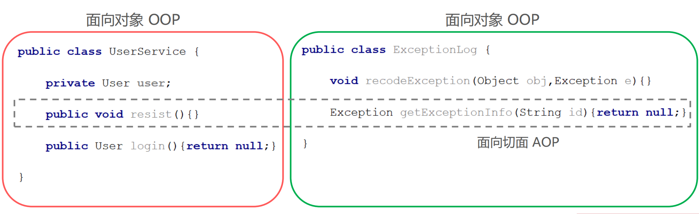

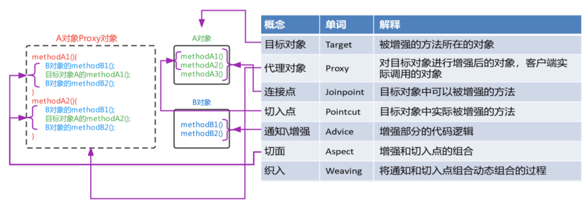 


### Advice 通知

#### @Pointcut 切点表达式抽取

| 注解 | @Pointcut("execution") |
| ---- | ---------------------- |
| 位置 | 通知类中定义的方法     |
| 作用 | 标注切点表达式         |

```java
//execution 切入表达式 被增强的目标
execution([访问修饰符] 返回值类型 包名.类名.方法名(参数))
```

- 访问修饰符可以省略不写；

- 返回值类型、某一级包名、类名、方法名 可以使用 * 表示任意；

- 包名与类名之间使用单点 . 表示该包下的类，使用双点 .. 表示该包及其子包下的类；

- 参数列表可以使用两个点 .. 表示任意参数。

```java
//表示访问修饰符为public、无返回值、在com.itheima.aop包下的TargetImpl类的无参方法show
execution(public void com.itheima.aop.TargetImpl.show())
    
//表述com.itheima.aop包下的TargetImpl类的任意方法
execution(* com.itheima.aop.TargetImpl.*(..))
    
//表示com.itheima.aop包下的任意类的任意方法
execution(* com.itheima.aop.*.*(..))
    
//表示com.itheima.aop包及其子包下的任意类的任意方法
execution(* com.itheima.aop..*.*(..))
    
//表示任意包中的任意类的任意方法
execution(* *..*.*(..))
```

- 通知中使用如：@Before("通知类.标记方法()") 的形式获取切入。

```java
@Component
public class UserServiceAdvice{
    @Pointcut("execution(* com.zjk.service.*.*(..))")
    public void userServiceAdvicePointcut(){};

    @Before("userServiceAdvicePointcut()")
    public void before(){
        System.out.println("before");
    }
}
```

#### @Aspect 织入

| 注解 | @Aspect |
| ---- | ------- |
| 位置 | 增强类  |
| 说明 |         |
| **注解** | **@EnableAspectJAutoProxy** |
| 位置 | 配置类                  |
| 说明 | 开启AOP自动代理 |

| 通知类型   | 注解                                       |
|:------ |:---------------------------------------- |
| 前置通知   | @Before("切点表达式")                         |
| 后置通知   | @AfterReturning("切点表达式")                 |
| 环绕通知   | @Around("切点表达式")                         |
| 异常抛出通知 | @Throwable(pointcut="切点表达式" throwing="") |
| 最终通知   | @Afters("切点表达式")                         |

```java
@Configuration
@ComponentScan("com.zjk")
@EnableAspectJAutoProxy
public class ApplicationContextConfig {}
```

```java
@Component
@Aspect
public class UserServiceAdvice{
    @Pointcut("execution(* com.zjk.service.impl.*.*(..))")
    public void userServicePointcut() {
    }

    @Before("userServicePointcut()")
    public void before() {
        System.out.println("前置增强");
    }

    @Around("userServicePointcut()")
    public void around(ProceedingJoinPoint joinPoint) throws Throwable {
        System.out.println("环绕前增强");
        joinPoint.proceed();
        System.out.println("环绕后增强");
    }

    @AfterThrowing(pointcut = "userServicePointcut()", throwing = "e")
    public void afterThrowable(Throwable e) {
        e.printStackTrace();
    }
}
```

#### 原理

##### 获取增强的Proxy对象

- xml配置：spring-aop jar包的META-INF下的spring.handlers和sprin.schemas

- AopNamespaceHandler：spring.handlers

```xml
http\://www.springframework.org/schema/aop=org.springframework.aop.config.AopNamespaceHandler
```

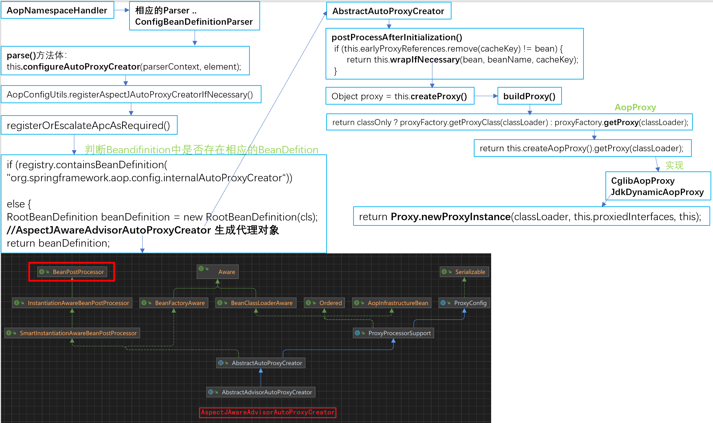 

- **wrapIfNecessary()** 方法最终返回的就是一个Proxy对象：`return this.wrapIfNecessary(bean, beanName, cacheKey);`

##### AOP自动代理

- `<aop:aspectj-autoproxy/>`

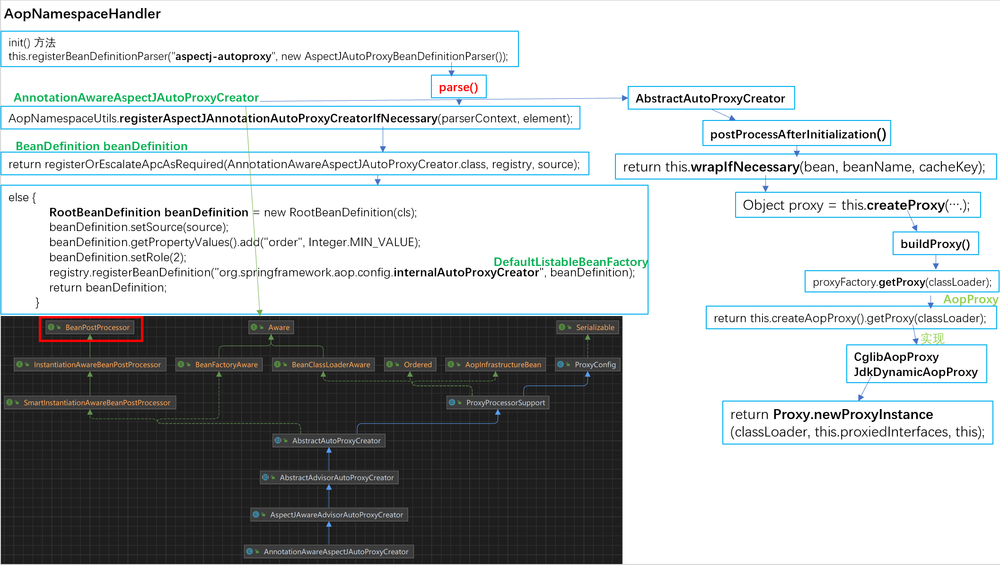 

- @EnableAspectJAutoProxy

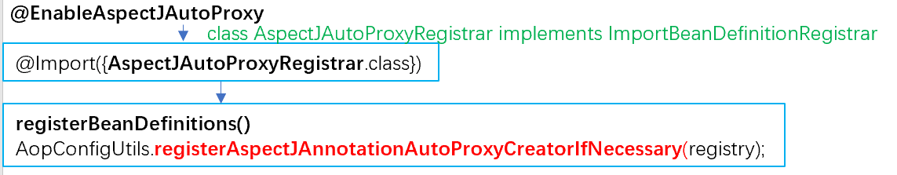 

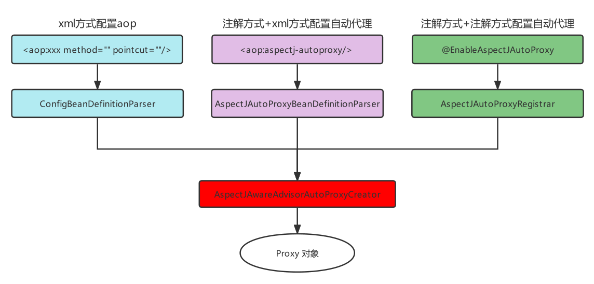 

### 声明式事务控制

> JDBC使用connection对事务进行控制；MyBatis使用SqlSession对事务进行控制。当切换数据库访问技术时，事务控制的方式总会变化，Spring提供了统一的控制事务的接口。

- 事物控制：保证事务的原子性。

| 事务控制方式   | 解释                                                         |
| :------------- | :----------------------------------------------------------- |
| 编程式事务控制 | Spring提供了事务控制的类和方法，使用编码的方式对业务代码进行事务控制，事务控制代码和业务操作代码耦合到了一起，开发中不使用。 |
| 声明式事务控制 | Spring将事务控制的代码封装，对外提供了xml和注解配置方式，通过配置的方式完成事务的控制，可以达到事务控制与业务操作代码解耦合，开发中使用。 |

> **编程式事务控制**
>
> **Spring事务编程相关的类**
>
> | 事务控制相关类                            | 解释                                                         |
> | :---------------------------------------- | :----------------------------------------------------------- |
> | 平台事务管理器 PlatformTransactionManager | 接口标准，实现类都具备事务提交、回滚和获得事务对象的功能，不同持久层框架可能会有不同实现方案 |
> | 事务定义 TransactionDefinition            | 封装事务的隔离级别、传播行为、过期时间等属性信息             |
> | 事务状态 TransactionStatus                | 存储当前事务的状态信息，如果事务是否提交、是否回滚、是否有回滚点等 |
>
> spring-jdbc坐标已经引入的spring-tx坐标。
>
> **平台事务管理器**
>
> - MyBatis作为持久层框架时，使用的平台事务管理器实现是DataSourceTransactionManager。
>
> - Hibernate作为持久层框架时，使用的平台事务管理器是HibernateTransactionManager。
>
> **Mybatis平台事务管理器**
>
> - MyBatis使用的平台事务管理器： **DataSourceTransactionManager**
>
> 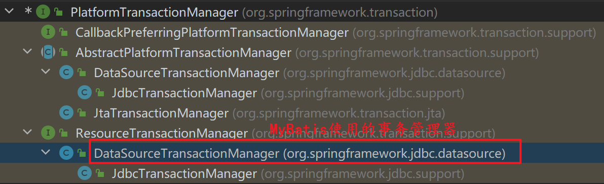 
>
> - 需要注入的属性：
>
> ```java
> private DataSource dataSource;
> ```
>

#### @Transactional 事务控制 

| 位置 | @Transactional                                               |
| ---- | ------------------------------------------------------------ |
| 类   | 该类下的所有方法都使用这注释的事务。                         |
| 方法 | 只对该方法使用该注释的事务。<br />优先级大于对类注释（就近原则）。 |

```java
@Transactional(isolation = Isolation.REPEATABLE_READ,propagation = Propagation.REQUIRED,readOnly = false,timeout = 5)
```

| 属性        | 说明                                                         |
| :---------- | :----------------------------------------------------------- |
| isolation   | 事务的隔离级别：解决事务并发问题                             |
| timeout     | 设置事务执行的超时时间，单位是秒。<br />如果超过该时间限制但事务还没有完成，则自动回滚事务，不再继续执行。<br />默认值是-1，即没有超时时间限制 |
| read-only   | 设置当前的只读状态。<br />如果是查询则设置为true，可以提高查询性能。<br />如果是DML（增删改）操作则设置为false。 |
| propagation | 设置事务的传播行为，主要解决是A方法调用B方法时，事务的传播方式问题的。<br />例如：使用单方的事务，还是A和B都使用自己的事务等 |

| isolation属性    | 指定事务的隔离级别，事务并发存在三大问题：脏读、不可重复读、幻读/虚读。<br />通过设置事务的隔离级别来保证并发问题的出现，常用的是READ_COMMITTED 和 REPEATABLE_READ。 |
| :--------------- | :----------------------------------------------------------- |
| DEFAULT          | 默认隔离级别，取决于当前数据库隔离级别。<br />例如MySQL默认隔离级别是REPEATABLE_READ |
| READ_UNCOMMITTED | A事务可以读取到B事务尚未提交的事务记录，不能解决任何并发问题。<br />安全性最低，性能最高。 |
| READ_COMMITTED   | A事务只能读取到其他事务已经提交的记录，不能读取到未提交的记录。<br />可以解决脏读问题，但是不能解决不可重复读和幻读。 |
| REPEATABLE_READ  | A事务多次从数据库读取某条记录结果一致。<br />可以解决不可重复读，不可以解决幻读。 |
| SERIALIZABLE     | 串行化，可以解决任何并发问题。<br />安全性最高，但是性能最低。 |

| propagation<br />事务传播行为 | 解释                                                         |
| :---------------------------- | :----------------------------------------------------------- |
| REQUIRED（默认值）            | A调用B，B需要事务。<br />如果A有事务，B就加入A的事务中，<br />如果A没有事务，B就自己创建一个事务。 |
| REQUIRED_NEW                  | A调用B，B需要新事务。<br />如果A有事务就挂起，B自己创建一个新的事务。 |
| SUPPORTS                      | A调用B，B有无事务无所谓。<br />A有事务就加入到A事务中，<br />A无事务B就以非事务方式执行。 |
| NOT_SUPPORTS                  | A调用B，B以无事务方式执行。<br />A如有事务则挂起。           |
| NEVER                         | A调用B，B以无事务方式执行。<br />A如有事务则抛出异常。       |
| MANDATORY                     | A调用B，B要加入A的事务中。<br />如果A无事务就抛出异常。      |
| NESTED                        | A调用B，B创建一个新事务。<br />A有事务就作为嵌套事务存在，<br />A没事务就以创建的新事务执行。 |

#### @EnableTransactionManagemen 事务的自动代理

| 注解 | @EnableTransactionManagemen                                  |
| ---- | ------------------------------------------------------------ |
| 位置 | 配置类                                                       |
| 说明 | 事务的自动代理。<br />默认查找 **transactionManager** 命名的Bean。 |

```java
@Configuration
@MapperScan("com.zjk.mapper")
@PropertySource("classpath:jdbc.properties")
@ComponentScan("com.zjk")
@EnableTransactionManagement
public class ApplicationContextConfig {
    @Bean
    public DataSource dataSource(@Value("${jdbc.url}") String url,
                                 @Value("${jdbc.username}") String username,
                                 @Value("${jdbc.password}") String password) {
        DruidDataSource dataSource = new DruidDataSource();
        dataSource.setUrl(url);
        dataSource.setUsername(username);
        dataSource.setPassword(password);
        return dataSource;
    }

    @Bean
    public SqlSessionFactoryBean sqlSessionFactoryBean(DataSource dataSource) {
        SqlSessionFactoryBean sqlSessionFactoryBean = new SqlSessionFactoryBean();
        sqlSessionFactoryBean.setDataSource(dataSource);
        return sqlSessionFactoryBean;
    }

    //平台事务管理器
    @Bean
    public DataSourceTransactionManager transactionManager(DataSource dataSource){
        DataSourceTransactionManager transactionManager = new DataSourceTransactionManager();
        transactionManager.setDataSource(dataSource);
        return transactionManager;
    }
}
```

```java
@Service
public class AccountServiceImpl implements AccountService {

    @Autowired
    private AccountMapper accountMapper;

    public AccountMapper getAccountMapper() {
        return accountMapper;
    }

    public void setAccountMapper(AccountMapper accountMapper) {
        this.accountMapper = accountMapper;
    }

    //被事务控制的方法
    @Transactional
    public void trancate(Integer money, String fromAccountName,String toAccountName) {
        accountMapper.decrMoney(money, fromAccountName);
        accountMapper.incrMoney(money, toAccountName);
    }
}
```

# Spring MVC

## JavaWeb（Servlet）

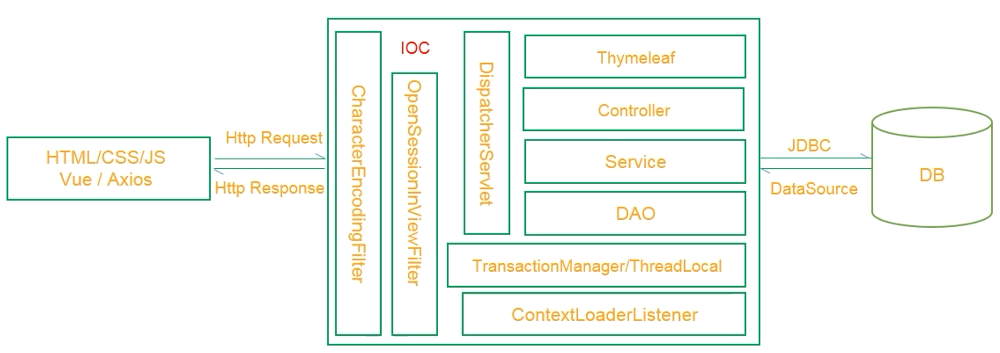

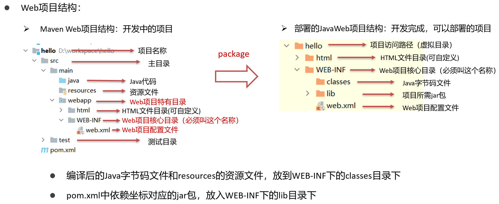

### Web基础

#### C/S、B/S

| 体系结构                    | 说明                                                         |
| --------------------------- | ------------------------------------------------------------ |
| C/S <br />客户端/服务器结构 | 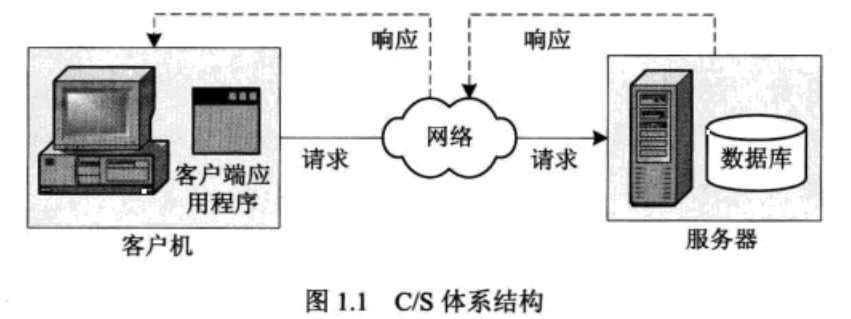 |
| B/S <br />浏览器/服务器结构 | 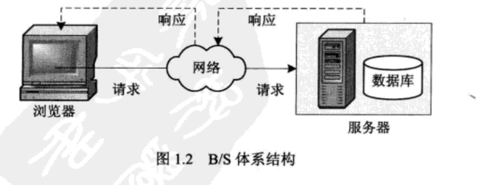 |

| 比较           | C/S                                                          | B/S                                                          |
| -------------- | ------------------------------------------------------------ | ------------------------------------------------------------ |
| 开发和维护成本 | 不同的客户端要开发不同的应用程序而且软件的安装、调试和升级均需要在所有的客户机上进行。 | 不必在客户端进行安装和维护，只需要对服务器进行升级维护即可。 |
| 客户端负载     | 减轻服务器的压力<br />减轻网络负荷                           | 服务器的负荷较重<br />网络负荷较重                           |
| 安全性         | 高于B/S                                                      |                                                              |

#### MVC三层架构

| 层级                     | 说明                                             |
| :----------------------- | :----------------------------------------------- |
| Model（数据访问层）      | 对数据库的CRUD基本操作。                         |
| Controller（业务逻辑层） | 对业务逻辑进行封装，组合数据访问层中的基本功能。 |
| View（表现层）           | 接受请求，封装数据，调用业务逻辑层，响应数据。   |


#### HTTP 超文本传输协议

- Http是无状态的，需要HttpSession来表示会话。

##### 请求

**请求： 请求行、请求消息头、请求主体。**

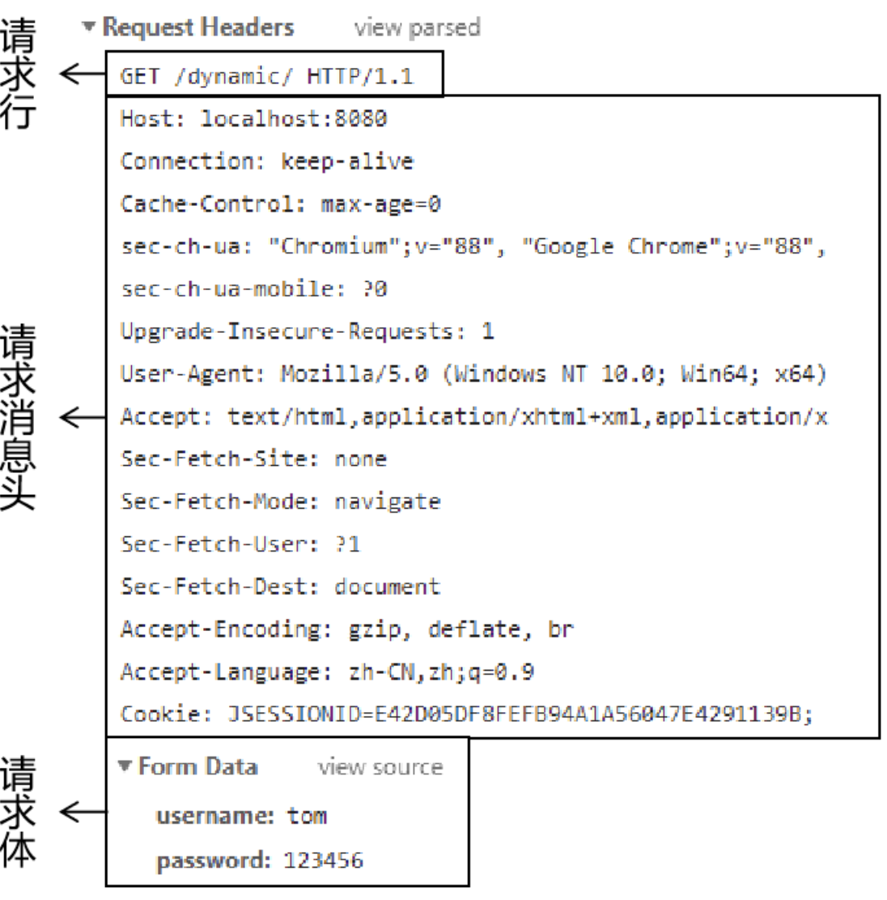

| 请求部分   | 说明                                                         |
| ---------- | ------------------------------------------------------------ |
| 请求行     | 请求的方式<br />请求的URL<br />请求的协议（一般都是HTTP1.1） |
| 请求消息头 | 客户端需要告诉服务器的信息                                   |
| 请求体     |                                                              |

| 请求方式 | 说明                                                         |
| -------- | ------------------------------------------------------------ |
| GET      | 从服务器端获取数据。<br />没有请求体、  请求参数附着在URL地址后面。 |
| POST     | 将数据保存到服务器端<br />有请求体、请求参数放在请求体中。   |
| PUT      | 命令服务器对数据执行更新。                                   |
| DELETE   | 命令服务器删除数据。                                         |
| 其他     | HEAD、CONNECT、OPTIONS、TRACE。                              |

| 请求消息头部分 | 功能                                                   |
| -------------- | ------------------------------------------------------ |
| Host           | 服务器的主机地址。                                     |
| Accept         | 声明当前请求能够接受的媒体类型。                       |
| Referer        | 当前请求来源页面的地址。                               |
| Content-Length | 请求体内容的长度。                                     |
| Content-Type   | 请求体的内容类型，这一项的具体值是媒体类型中的某一种。 |
| Cookie         | 浏览器访问服务器时携带的Cookie数据。                   |

##### 响应

| 响应   | 说明                                                         |
| ------ | ------------------------------------------------------------ |
| 响应行 | 协议、响应状态码(200) 、响应状态(ok)。                       |
| 响应头 | 服务器的信息、服务器发送给浏览器的信息<br />响应体的说明书、服务器端对浏览器端设置数据。 |
| 响应体 | 服务器返回的数据主体，有可能是各种数据类型。                 |

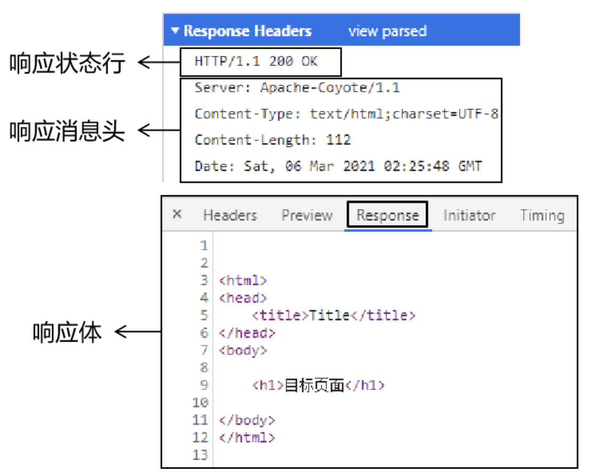

| [响应状态码 ](https://config.net.cn/tools/HttpStatusCode.html) | 原因短语                         | 说明                       |
| :----------------------------------------------------------- | :------------------------------- | -------------------------- |
| 1XX                                                          | Informational（信息性状态码）    | 接收的请求正在处理         |
| 2XX                                                          | Success（成功状态码）            | 请求正常处理完毕           |
| 3XX                                                          | Redirection（重定向）            | 需要进行附加操作以完成请求 |
| 4XX                                                          | Client Error（客户端错误状态码） | 服务器无法处理请求         |
| 5XX                                                          | Server Error（服务器错误状态码） | 服务器处理请求出错         |

| 响应头部分       | 功能                                          |
| ---------------- | --------------------------------------------- |
| Content-Type     | 响应体的内容类型（text/html、image/jpeg等）。 |
| Content-Length   | 响应体的内容长度（字节数）。                  |
| Content-Encoding | 表示该响应压缩算法（gzip等）。                |
| Set-Cookie       | 服务器返回新的Cookie信息给浏览器。            |
| location         | 重定向时，告诉浏览器访问下一个资源的地址。    |

### Tomcat

| 目录结构 | 说明           |
| -------- | -------------- |
| bin      | 可执行文件目录 |
| conf     | 配置文件目录   |
| lib      | 存放lib目录    |
| logs     | 日志文件目录   |
| temp     | 临时目录       |
| webapps  | 项目部署目录   |
| work     | 工作目录       |

> 其他文件：BUILDING.txt、CONTRIBUTING.md、LICENSE、NOTICE、README.md、RELEASE-NOTES、RUNNING.txt。

```shell
# JAVA_HOME 也需要配置
# set Tomcat enviroment
export CATALINA_HOME=/opt/Tomcat9
export PATH=$PATH:$CATALINA_HOME\lib:$CATALINA_HOME\bin
```

> Tomcat是用C和Java编写的。 

- Tomcat默认的地址为`http://localhost:8080`。

### Servlet

```xml
<dependency>
    <groupId>javax.servlet</groupId>
    <artifactId>javax.servlet-api</artifactId>
    <version>3.1.0</version>
    <scope>provided</scope>  
    <!--provided是为了之后打包成war包后在Tomcat中运行不会报错-->
</dependency>
```

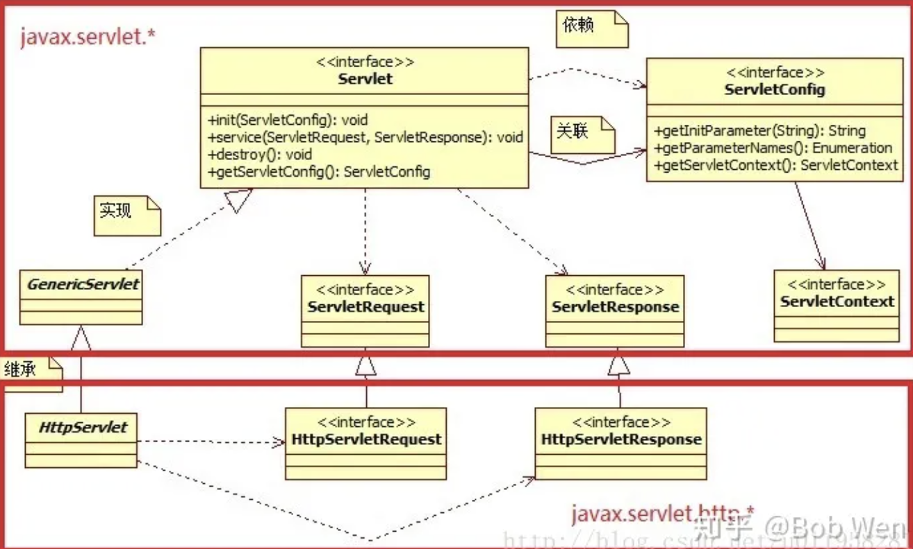

#### HttpServlet

 

  

- HTTP的请求方式包括DELETE,GET,OPTIONS,POST,PUT和TRACE：doDelete()、doGet()、doOptions()、doPost()、doPut()、doTrace()。

- HttpServlet依据请求方式的不同而采用不同的处理方法：请求方式由form表单的method属性确定。

```java
@WebServlet("/httpTest")
public class HttpServletTest extends HttpServlet {
    @Override
    protected void doGet(HttpServletRequest req, HttpServletResponse resp) throws ServletException, IOException {
        System.out.println("get...");
    }

    @Override
    protected void doPost(HttpServletRequest req, HttpServletResponse resp) throws ServletException, IOException {
        System.out.println("post...");
    }
}
```

#### 生命周期

| Servlet生命周期 | 说明                                                         |
| --------------- | ------------------------------------------------------------ |
| 加载和实例化    | 默认当Servlet第一次被访问时，由容器创建Servlet对象。         |
| 初始化          | Servlet实例化之后，容器调用Servlet的**init()**方法初始化该对象。<br />**（init()方法只调用一次）** |
| 请求处理        | **每次请求Servlet时**，Servlet容器都会调用Servlet的**service()**方法对请求进行处理。 |
| 服务终止        | **释放内存/容器关闭时**，容器调用Servlet实例的**destroy()**方法。<br />destroy()方法调用之后，容器释放该Servlet实例（随后会被gc）。 |

**Servlet的初始化时机：**

- 默认情况下，第一次请求时，tomcat才会去实例化、初始化，耗时较长。
- `<servlet>`中的`<load-on-startup>`设置servlet启动的先后顺序，数字越小，启动越靠前，最小值0。

**Servlet在容器中是单例的、线程不安全的。**

| Servlet方法                                                  | 说明   |
| :----------------------------------------------------------- | :----- |
| void init(ServletConfig servletConfig)                       | 初始化 |
| void destory()                                               | 摧毁   |
| void service(ServletRequest servletRequest, ServletResponse servletResponse) | 服务   |
| String getServletInfo()                                      |        |
| ServletConfig getServletConfig()                             |        |

#### 配置Servlet

##### web.xml

| `<servlet>`                              | Servlet内部名映射到一个Servlet类名（全限定名） |
| ---------------------------------------- | ---------------------------------------------- |
| `<servlet-name>类名</servlet-name>`      |                                                |
| `<servlet-class>全限定名<servlet-class>` |                                                |

| `<servlet-mapping>`             | 将用户访问的URL映射到Servlet内部名            |
| ------------------------------- | --------------------------------------------- |
| `<servlet-name></servlet-name>` | 必须与`<servlet>`元素中的`<servlet-name>`一致 |
| `<url-pattern></url-pattern>`   | 容器无法识别同时拥有两种匹配规则的pattern     |

- 一个 `<servlet>`可以对应多个`<servlet-mapping>`，即：可以将同一个Servlet程序应用于多个不同的页面(urlPatterns)。

```xml
<?xml version="1.0" encoding="UTF-8"?>
<web-app xmlns="http://xmlns.jcp.org/xml/ns/javaee"
         xmlns:xsi="http://www.w3.org/2001/XMLSchema-instance"
         xsi:schemaLocation="http://xmlns.jcp.org/xml/ns/javaee http://xmlns.jcp.org/xml/ns/javaee/web-app_4_0.xsd"
         version="4.0">
    <servlet>
        <servlet-name>MyServlet</servlet-name> <!--用来映射的名字，可以随便起-->
        <servlet-class>com.zjk.JSP.MyServlet</servlet-class> <!--指向该类的地址 包名+类名-->
    </servlet>
    <servlet-mapping>
        <servlet-name>MyServlet</servlet-name> <!--映射中的servlet-name要与servlet中的一致-->
        <url-pattern>/MyServlet</url-pattern> <!--指向的网页的URL（地址）-->
    </servlet-mapping>
</web-app>
```

##### @WebServlet

| @WebServlet()参数 | 说明                                    |
| :---------------- | :-------------------------------------- |
| urlPatterns       | 请求映射路径。<br />相当于url-pattern。 |
| loadOnStartup     | 初始化Servlet对象（默认-1）。           |

```java
@WebServlet("urlPatterns")
@WebServlet(urlPatterns = {"/demo1","/demo2"}) 
```

#### 请求映射路径

- Servlet中请求映射路径的起点（DefaultServlet：`/`）。

- 当一个页面满足多个Servlet的url-pattern匹配规则时，采用更精确匹配的Servlet。

| 匹配规则    | 说明（`/html/demo1.html` 、 `/html/demo2.html`） |
| ----------- | ------------------------------------------------ |
| 精确        | `/html/demo1`、`/html/demo2`                     |
| 通配符/目录 | `/html/*`                                        |
| 扩展名      | `*.html，*.jpg ，*.do ，*.action`                |
| 默认        | 以上匹配都不成功时：`/*`                         |

> `/` 会覆盖Tomcat中的DefaultServlet，会导致静态资源（html文件等）无法访问。

### 请求、响应

```java
protected void doGet(HttpServletRequest req, HttpServletResponse resp) throws ServletException, IOException {}
```

#### Request

| ServletRequest方法                            | 说明                           |
| :-------------------------------------------- | :----------------------------- |
| Object getAttribute(String name)              | 获取名称为name的属性值         |
| void setAttribute(String name, Object object) | 在请求中保存名称为name的属性值 |
| void removeAttibute(String name)              | 清除请求中名称为name的属性值   |
| String getParameter()                         | 获取表单中传递的参数           |
| **HttpServletRequest 增加的方法** | **说明**                                |
| String getContextPath()       | 返回请求URL中表示请求上下文的路径（URL开始部分）             |
| Cookie[] getCookies()         | 返回客户端在此次请求中发送的所有Cookie对象                   |
| HttpSession getSession()      | 返回和此次请求相关联的Session<br />如果没有给客户端分配Session，则创建一个新的Session |
| String getMethod()            | 返回此次请求使用的Http方法的名称（GET、POST等）              |

- post请求参数中文乱码：

```java
//获取参数之前设置
req.setCharacterEncoding("utf-8")
```

> URL编码：
>
> ```java
> URLDecoder.decode(String,"utf-8"); //按utf-8编码为二进制字符串
> URLEncoder.encode(String,"utf-8"); //按utf-8解码为字符串
> 
> String username = new String(req.getParameter("username").getBytes("IOS-8859-1"),"utf-8");
> ```

> get请求：Tomcat8之前需要设置如下。
>
> ```java
> String fname = new String(req.getParameter("fname").getBytes("ISO-8859-1"),"UTF-8");
> ```

##### 请求参数传递

| req对象的方法                              | 获取参数                     |
| ------------------------------------------ | ---------------------------- |
| `Map<String,String[]> getParameterMap()`   | 所有参数Map集合              |
| `String[] getParameterValues(String name)` | 根据名称获取参数值（数组）   |
| `String getParameter(String name)`         | 根据名称获取参数值（单个值） |

```java
import javax.servlet.ServletException;
import javax.servlet.annotation.WebServlet;
import javax.servlet.http.HttpServlet;
import javax.servlet.http.HttpServletRequest;
import javax.servlet.http.HttpServletResponse;
import java.io.IOException;
import java.util.Map;

@WebServlet("/test.html")
public class RequestTest extends HttpServlet {
    @Override
    protected void doGet(HttpServletRequest req, HttpServletResponse resp) throws ServletException, IOException {
        System.out.println("get....");
    }

    @Override
    protected void doPost(HttpServletRequest req, HttpServletResponse resp) throws ServletException, IOException {
        System.out.println("post...");
        req.setCharacterEncoding("utf-8");
        //getParameterMap()
//        System.out.println("getParameterMap()");
//        Map<String, String[]> parameterMap = req.getParameterMap();
//        for (String key : parameterMap.keySet()
//        ) {
//            System.out.println(parameterMap.get(key));
//        }
        
        //getParameterValues()
//        System.out.println("getParameterValues()");
//        for (String value:req.getParameterValues("username")
//             ) {
//            System.out.println(value);
//        }

        //getParameter()
        System.out.println(req.getParameter("username"));
        this.doGet(req, resp);
    }
}
```

#### Response

| ServletResponse方法              | 说明                                                         |
| :------------------------------- | :----------------------------------------------------------- |
| PrintWriter getWriter()          | 返回PrintWriter对象，用于向客户端发送文本                    |
| String getCharacterEncoding()    | 返回在响应中发送的正文所使用的字符编码                       |
| void setCharacterEncoding()      | 设置发送到客户端的响应的字符集编码                           |
| void setContentType(String type) | 设置发送到客户端的响应的内容类型<br />此时响应的状态尚未提交 |
| **HttpServletResponse增加的方法**         | **说明**                     |
| void addCookie(Cookie cookie)             | 增加一个Cookie到响应<br />此方法可以多次调用，设置多个Cookie |
| void addHeader(String name, String value) | 将响应报头（name,value）添加到响应                           |
| void sendRedirect(String location)        | 发送临时的重定向响应到客户端<br />抛出IOException            |
| void encodeURL(String url)                | SessionID对用于重定向的URL进行编码                           |

##### 字符/字节流

```java
resp.setContentType("text\html;charset=utf-8"); //设置字符集
//该流不需要close()释放资源；随着响应结束，resonse对象销毁，由服务器关闭。
PrintWriter writer = resp.getWriter(); 
writer.write("");
```

```java
protected void doGet(HttpServletRequest req, HttpServletResponse resp) throws ServletException, IOException {
    //1.读取文件
    FileInputStream fis = new FileInputStream("E:/HTML/images/th.jpg");
    //2.获取字节输出流
    ServletOutputStream os = resp.getOutputStream();
    //3.操作
    byte[] buffer = new byte[1024];
    int len = 0;
    while ((len = fis.read(buffer)) != -1) {
        os.write(buffer, 0, len);
    }
    //IOUtils.copy(fis, os); //apache提供的工具类：依赖commons-io
    fis.close();
}
```

#### 服务器内部转发、重定向

| 服务器内部转发                                               | 客户端重定向                                                 |
| :----------------------------------------------------------- | :----------------------------------------------------------- |
| `req.getRequestDispatcher("网页路径")`<br />`.forward(req,resp);` | `resp.sendRedirect("网页路径");`                             |
| 一次请求响应的过程<br />客户端不知道服务器内部的转发         | 两次请求响应的过程                                           |
| 地址栏不变                                                   | 地址栏改变                                                   |
| 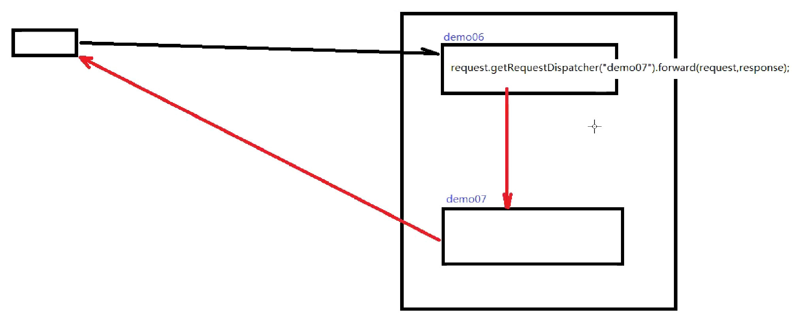 | 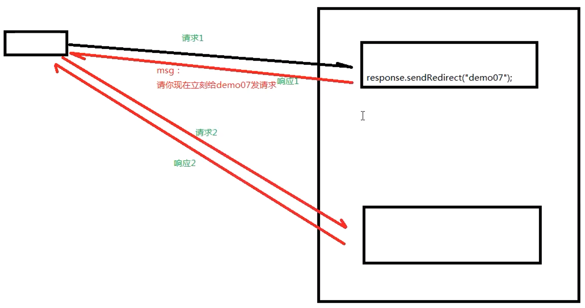 |

### 会话跟踪

#### Session 服务端会话跟踪技术

- Session（数据保存在服务端）：客户端第一次发请求给服务器时，服务器获取其session（如果获取不到，则创建新的session并响应给客户端[sessionID]）。客户端再次给服务器发请求（带有sessionID）带给服务器，服务器根据sessionID判断是同一个客户端。

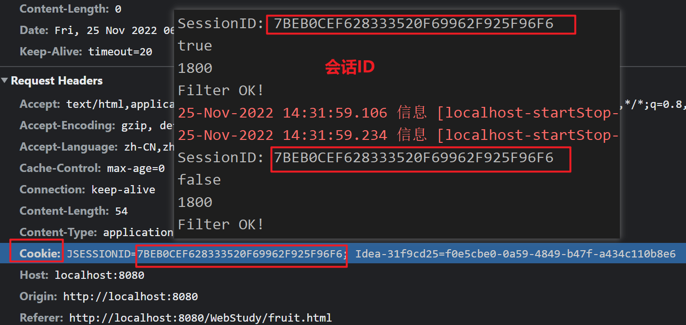

> sessionID解决HTTP无状态的问题（识别会话）。

- Session默认在无操作的30分钟后销毁（或调用 `session.invalidate()`）。

```xml
<!--修改Session销毁时间（单位分钟）-->
<session-config>
    <session-timeout>100</session-timeout> 
</session-config>
```

- Session数据存储在服务端，服务器重启后，Session数据会被保存。但浏览器被关闭启动后，重新建立的连接是一个新的会话（SessionID不同），获取的Session数据也是一个新的对象。

| Tomcat      | 说明                                                         |
| ----------- | ------------------------------------------------------------ |
| Session钝化 | 服务器正常关闭后，Tomcat会自动将Session数据写入硬盘的文件中。 |
| Session活化 | 启动服务器时，从文件中加载数据到Session中。                  |

> Tomcat钝化的数据路径为:`项目目录\target\tomcat\work\Tomcat\localhost\项目名称\SESSIONS.ser`。
>
> 活化后，数据加载到Session中，路径中的`SESSIONS.ser`文件会被删除掉。

##### HttpSession

- HttpSession接口：实现一次会话的多次请求之间数据共享功能。

| 方法                             | 说明                                                         |
| :------------------------------- | :----------------------------------------------------------- |
| req.getSession(boolean)          | 通过Request对象获取当前会话<br />true：没有则创建一个新的会话。<br />false：没有则返回null，不会创建新的会话。 |
| session.getId()                  | 获取sessionID。                                              |
| session.isNew()                  | 判断当前session是否是新的。                                  |
| session.getMaxInactiveInterval() | session的非激活间隔时长，默认1800秒。                        |
| session.invalidate()             | 强制性让会话立即失效（销毁Session）。                        |

##### 保存作用域（会话数据传递）

| 保存作用域                          | 范围                                                         |
| ----------------------------------- | ------------------------------------------------------------ |
| page                                | 页面级别（几乎不用）                                         |
| request                             | 一次请求响应<br />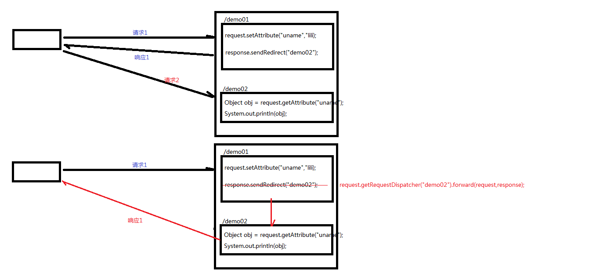 |
| session                             | 一次会话（和具体的某一个session对应的，切换其他session时，保存域不同）<br />同一个客户端（浏览器）<br />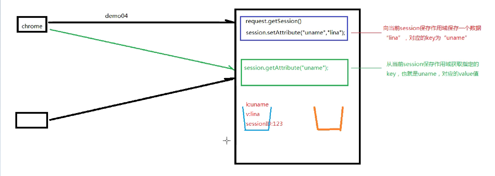 |
| application<br />（ServletContext） | 整个Web应用程序<br />不同客户端（浏览器）也可以访问同一个Servlet上下文保存作用域。 |

| 方法                                  | 说明                     |
| :------------------------------------ | :----------------------- |
| 保存作用域对象.setAttribute(k,v)      | 向某个保存作用域保存数据 |
| Object 保存作用域对象.getAttribute(k) | 从某个保存作用域获取数据 |
| void removeAttribute(k)               | 从保存作用域移除数据     |

**ServletContext**

```java
ServletContext application = req.getServletContext();
application.setAttribute("uname","Tom");
```

#### Cookie 客户端会话跟踪技术

- Cookie：将数据保存到客户端，以后每次请求都携带Cookie数据进行访问。

> Cookie的实现原理基于HTTP协议，涉及到两个请求头信息：响应头（set-cookie）、请求头（cookie）。

| 区别       | Cookie                                                    | Session（基于Cookie实现）                            |
| ---------- | --------------------------------------------------------- | ---------------------------------------------------- |
| 数据存储   | 客户端                                                    | 服务端                                               |
| 安全性     | 不安全                                                    | 安全                                                 |
| 数据大小   | 最大3KB                                                   | 无大小限制                                           |
| 存储时间   | setMaxAge()长期存储                                       | 默认30分钟                                           |
| 服务器资源 | 不占                                                      | 占用                                                 |
| 应用       | 保证用户在未登录情况下的身份识别<br />购物车、remeber功能 | 保存用户登录后的数据<br />登录用户的名称展示、验证码 |

```java
//创建Cookie对象，并设置数据
Cookie cookie = new Cookie("key","value");
//发送Cookie到客户端：
resp.addCookie(cookie);
```

```java
//获取客户端携带的所有Cookie：
Cookie[] cookies = req.getCookies();
//遍历获取每个Cookie对象 for
//使用Cookie对象获取数据
cookie.getName();
cookie.getValue();
```

- Cookie存活时间：默认情况下，Cookie存储在浏览器内存中，当浏览器关闭，内存释放，则Cookie被销毁。

```java
cookie.setMaxAge(int seconds);//设置Cookie最大存活时间
//1. 正数：将Cookie写入浏览器所在电脑的硬盘，持久化存储；到时间自动删除。
//2. 负数：默认值，Cookie在当前浏览器内存中，当浏览器关闭，则Cookie被销毁。
//3. 零：删除对应Cookie。
```

- Cookie不能直接存储中文：`java.lang.IllegalArgumentException: Control character in cookie value or attribute.`。

### Filter接口 过滤器

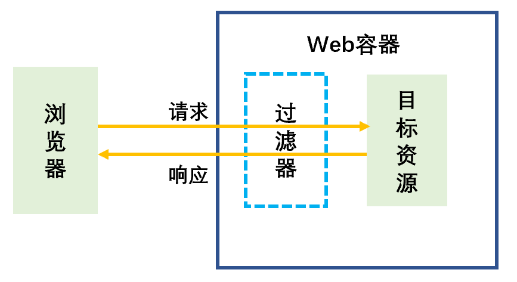

#### Filter配置

| 配置方式   | 多个Filter的执行顺序                 |
| ---------- | ------------------------------------ |
| web.xml    | 按web.xml配置文件中的顺序执行。      |
| @WebFilter | 按过滤器的名字（字符串排序）升序排列 |

```xml
<filter>
    <display-name>FilterTest</display-name>
    <filter-name>FilterTest</filter-name> <!--用来映射的名字，可以随便起-->
    <filter-class>com.zjk.filters.FilterTest</filter-class> <!--指向该类的地址 包名+类名-->
</filter>
<filter-mapping>
    <filter-name>FilterTest</filter-name> <!--映射中的filter-name要与filter中的一致-->
    <url-pattern>/fruit</url-pattern> <!--拦截的路径-->
</filter-mapping>
```

```java
@WebFilter(urlPatterns="/*", filterName=“loginFilter”)
```

```java
package com.zjk.filters;

import javax.servlet.*;
import java.io.IOException;

public class FilterTest implements Filter {

    @Override
    public void init(FilterConfig filterConfig) throws ServletException {

    }

    @Override
    public void doFilter(ServletRequest servletRequest, ServletResponse servletResponse, FilterChain filterChain) throws IOException, ServletException {
        servletRequest.setCharacterEncoding("utf-8");
        servletResponse.setCharacterEncoding("utf-8");
        //如果没有 filterChain.doFilter(servletRequest, servletResponse)
        //则无法使用其他的应用程序：如其他的Filter、Servlet等
        filterChain.doFilter(servletRequest, servletResponse);
        System.out.println("Filter OK!");
    }

    @Override
    public void destroy() {
        System.out.println("filter is destoried");
    }
}
```

#### Filter生命周期

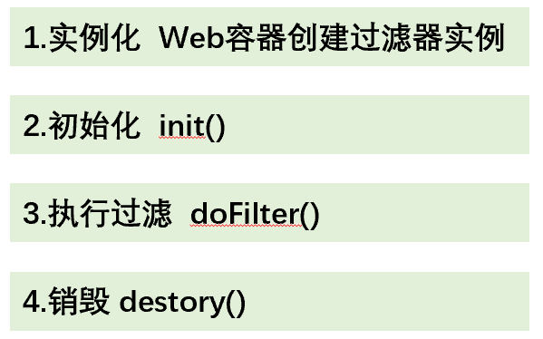

**init(FilterConfig filterConfig)**

1. 在web应用程序启动时，web服务器将根据 web.xml文件中的配置信息来创建每个注册的Filter实例对象，并将其保存在服务器的内存中。
2. Web容器创建Filter对象实例后，将立即调用（仅执行一次）该Filter对象的init()方法，传递一个包含Filter的配置和运行环境的FilterConfig对象。
3. 利用FilterConfig对象可以得到ServletContext对象，以及部署描述符中配置的过滤器的初始化参数。

<mark>**doFilter(ServletRequest request, ServletResponse response, FilterChain chain)**</mark>

1. 当客户端请求目标资源的时候，容器就会调用与这个目标资源相关联的过滤器的 doFilter()方法。
2. 参数 request, response 为 web 容器或 Filter 链(即：<mark>chain参数的doFilter()</mark>使用的参数)的上一个 Filter 传递过来的请求和相应对象；参数 chain 为代表当前 Filter 链的对象，
3. 可以在当前 Filter 对象的 doFilter() 方法的内部调用 `FilterChain对象参数的 chain.doFilter(request,response)方法`把请求交付给 Filter 链中的下一个 Filter 或者目标 Servlet 程序去处理。<mark>否则无法使用其他的程序：其他的Fliter或Servlet等</mark>
   - 过滤器链中的任何一个 Filter 没有调用 `FilterChain.doFilter()` 方法，请求都不会到达目标资源。

**public void destroy()**：释放过滤器使用的资源。

### Listener 监听器

| 监听对象       | 监听器名称                      | 监听                   |
| :------------- | :------------------------------ | :--------------------- |
| ServletContext | ServletContextListener          | 创建、销毁             |
|                | ServletContextAttributeListener | 属性（增删改）         |
| Session        | HttpSessionListener             | 整体动态（创建、销毁） |
|                | HttpSessionAtrributeListener    | 属性（增删改）         |
|                | HttpSessionActivitionListener   | 数据的钝化和活化       |
| Request        | ServletRequestListener          | 创建、销毁             |
|                | ServletRequestAttributeListener | 属性（增删改）         |

```java
package com.zjk.web.listener;

import javax.servlet.*;
import javax.servlet.http.*;
import javax.servlet.annotation.*;

@WebListener
public class ContextLoaderListener implements ServletContextListener {

    public ContextLoaderListener() {
    }

    @Override
    public void contextInitialized(ServletContextEvent sce) {
        /* This method is called when the servlet context is initialized(when the Web application is deployed). */
        //加载资源
        System.out.println("ContextLoaderListener..");
    }

    @Override
    public void contextDestroyed(ServletContextEvent sce) {
        /* This method is called when the servlet Context is undeployed or Application Server shuts down. */
        //释放资源
    }
}
```

## MVC基础

### 工作流程

> 如果是Spring5在使用之前一定要修改为JRE8（jdk1.8）： [解决:javac: 无效的目标发行版: 1.8](https://blog.csdn.net/qq_37107280/article/details/73246274)

1. 控制器 @Controller（@Component的衍生注解）配置映射信息。

2. SpringMVC配置

3. 前端控制器DispatcherServlet

**启动服务器初始化过程和单次请求过程**

- 服务器初始化：
1. 服务器启动，执行ServletContainersInitConfig类，初始化web容器（web.xml）。

2. 执行createServletApplicationContext()方法，创建WebApplicationContext对象。（加载配置类ApplicationContextConfig来初始化Spring容器。）

3. 执行getServletMappings()方法，设定SpringMVC拦截请求的路径规则。
- 单次请求过程：
1. 发送请求`http://localhost/save`。
2. web容器发现该请求满足SpringMVC拦截规则，将请求交给SpringMVC处理。
3. 解析请求路径/save。@RequestMapping("/save")
4. 由/save匹配执行对应的方法save()。
5. 检测到有@ResponseBody直接将save()方法的返回值作为响应体返回给请求方。

> - @EnableWebMvc：开启SpringMVC注解驱动。
>
> ```java
> @Configuration
> @ComponentScan("com.zjk.controller")
> @EnableWebMvc
> public class SpringMvcConfig {}
> ```
>
> | 名称 | @EnableWebMvc             |
> | ---- | ------------------------- |
> | 类型 | 配置类注解                |
> | 位置 | SpringMVC配置类定义上方   |
> | 作用 | 开启SpringMVC多项辅助功能 |
>

### @Controller 控制器

| 名称  | @Controller           |
| --- | --------------------- |
| 类型  | 类注解                   |
| 位置  | SpringMVC控制器类定义上方     |
| 作用  | 设定SpringMVC的核心控制器bean |

### ServletInitializer 前端控制器

#### AbstractAnnotationConfigDispatcherServletInitializer

- Spring和SpringMVC环境整合。

```java
public class ServletContainersInitConfig extends AbstractAnnotationConfigDispatcherServletInitializer {

    @Override
    protected Class<?>[] getRootConfigClasses() {
        return new Class[]{SpringConfig.class}; //Spring环境
    }

    @Override
    protected Class<?>[] getServletConfigClasses() {
        return new Class[]{SpringMvcConfig.class}; //SpringMVC环境
    }

    @Override
    protected String[] getServletMappings() {
        return new String[]{"/"}; //拦截路径
    }
}
```

- SpringMVC环境可以访问Spring环境，而Spring环境访问不了SpringMVC环境。

#### AbstractDispatcherServletInitializer

```java
public class ServletContainersInitConfig extends AbstractDispatcherServletInitializer {

    @Override
    protected WebApplicationContext createServletApplicationContext() {
        //将Spring容器添加到Web容器中
        AnnotationConfigWebApplicationContext applicationContext = new AnnotationConfigWebApplicationContext();
        applicationContext.register(SpringMvcConfig.class);
        return applicationContext;
    }

    @Override
    protected String[] getServletMappings() {
        return new String[]{"/"}; //设置被拦截的路径
    }

    @Override
    protected WebApplicationContext createRootApplicationContext() {
        return null;
    }
}
```

### WebMvcConfigurer 配置MVC

- WebMvcConfigurer接口：定义了多个Spring MVC的配置方法（默认实现，需要时覆盖）。所有配置类都可以实现该接口并覆盖其方法。

```java
//视图控制器
public void addViewControllers(ViewControllerRegistry registry) {
    registry.addViewController("/").setViewName("home");
}
```

## 请求和响应

> **PostMan**
>
> - PostMan是一款功能强大的网页调试与发送网页HTTP请求的Chrome插件。常用于进行接口测试。
>
> 1. 创建WorkSpace工作空间。
>
> 2. 发送请求。
>
> 3. 保存当前请求。第一次请求需要创建一个新的目录，后面就不需要创建新目录，直接保存到已经创建好的目录即可。

### @RequestMapping 请求映射

| 名称 | @RequestMapping                              |
| ---- | -------------------------------------------- |
| 类型 | 类/方法注解                                  |
| 位置 | SpringMVC控制器类/方法定义上方               |
| 作用 | 设置当前控制器方法请求访问路径               |
| 参数 | value（默认）：请求映射路径（默认根路径"/"） |

- @RequestMapping注解控制器类时，作为请求路径的前置。
- @RequestMapping注解value属性前面加不加`/`都可以

| 返回值         | 说明                                                         |
| -------------- | ------------------------------------------------------------ |
| ModelAndView   | Model：Map类型对象，存储需要返回的数据。<br />View：视图。   |
| String         | 视图名称。<br />viewResolver将该字符串解析为具体的视图。     |
| ResponseEntity | ResponseEntity对象包含了HTTP响应的状态码、头部信息和响应体等内容。可以直接控制HTTP响应（包括重定向、返回Json数据等操作）。 |
| void           | 不需要返回任何数据。<br />可以通过HttpServletResponse对象来手动控制HTTP响应（不推荐）。 |

**String，进行页面跳转**

```java
return "/user";
return "redirect:/user"; //重定向
```

> @RequestMapping("/home")搭配@XxxMapping("/design")：请求映射为/home/design。

### 请求：参数传递

| 传递方式 | 说明                                                   |
| -------- | ------------------------------------------------------ |
| GET      | http://localhost:8080/user/commonParam?name=zjk&age=19 |
| POST     |                                                        |

> **过滤器 Post编码集乱码处理**
>
> - getServletFilters()：使用Spring内准备的过滤器。
>
> ```java
> public class ServletContainersInitConfig extends AbstractAnnotationConfigDispatcherServletInitializer {
>     //部分方法省略
> 
>     protected Filter[] getServletFilters() {
>         //org.springframework.web.filter.CharacterEncodingFilter;
>         CharacterEncodingFilter filter = new CharacterEncodingFilter();
>         filter.setEncoding("utf-8");
>         return new Filter[]{filter};
>     }
> 
> }
> ```

### 请求：参数接收

#### 参数类型

| 参数类型 | 传递方式                                                     |
| -------- | ------------------------------------------------------------ |
| 值       | url地址传参，地址参数名与形参变量名相同时，自动接收参数。    |
| POJO     | 请求参数名与形参对象属性名相同时，自动接收参数。             |
| 嵌套POJO | 请求参数名与形参对象属性名相同时，按照对象层次结构关系接收嵌套POJO属性参数。 |
| 数组     | 请求参数名与形参对象属性名相同且请求参数为多个，定义数组类型即可接收参数 |
| 集合     | 同名请求参数可以使用@RequestParam注解映射到对应名称的集合对象中作为数据 |

##### POJO参数

- 对POJO的属性名注入。

> GET请求：将地址参数注入到对应的POJO属性中。
>
> ```http
> http://localhost:8080/user/userParam?id=9&name=zjk&age=18
> ```

```java
@RequestMapping("/userParam")
@ResponseBody
public String commonParam(User user){ //id、name、age
    return "{'info':'userParam'}";
}
```

##### 嵌套POJO参数

- 按照对象层次结构关系：作为属性的POJO.属性。

```java
@RequestMapping("/userParam")
@ResponseBody
public String commonParam(User user){ //User:id,name,age,address(Address:province,city)
    return "{'info':'userParam'}";
}
```

##### 数组参数

- 数组名必须一致才能封装到一个数组中。

```java
@RequestMapping("/arrParam")
@ResponseBody
public String arrParam(String[] infos) {
    return "{'info':'arrParam'}";
}
```

##### 日期参数 @DateTimeFormat

| 名称     | @DateTimeFormat                 |
| -------- | ------------------------------- |
| 类型     | 形参注解                        |
| 位置     | SpringMVC控制器方法形参前面     |
| 作用     | 设定日期时间型数据格式          |
| 相关属性 | pattern：指定日期时间格式字符串 |

```java
@RequestMapping("/dateParam")
@ResponseBody
public String dateParam(@DateTimeFormat(pattern = "yyyy-mm-dd") Date date1,
                        @DateTimeFormat(pattern = "yyyy-mm-dd HH:mm:ss") Date date2){
    return "{'info':'date'}";
}
```

> 默认格式 yyyy/mm/dd
>
> ```java
> @RequestMapping("/dateParam")
> @ResponseBody
> public String dateParam(Date date){
>     return "{'info':'date'}";
> }
> ```

#### @RequestParam 指定地址参数

- @RequestParam：指定当前形参接收到的地址参数。（形参与地址参数名不一致时，需要该注解指定）

> 默认将当前参数名作为地址参数名。

| 名称     | @RequestParam                                         |
| -------- | ----------------------------------------------------- |
| 类型     | 形参注解                                              |
| 位置     | SpringMVC控制器方法形参定义前面                       |
| 作用     | 绑定请求参数与处理器方法形参间的关系                  |
| 相关参数 | required：是否为必传参数 <br>defaultValue：参数默认值 |

```http
http://localhost:8080/user/userParam?id=9&name=zjk&age=18
```

```java
@RequestMapping("/commonParam")
@ResponseBody
public String commonParam(@RequestParam("name") String userName,
                          @RequestParam("age") Integer age){
    System.out.println(userName);
    System.out.println(age);
    return "{'info':'commonParam'}";
}
```

>  如果按数组注入： **SpringMVC将List看做是一个POJO来处理** ，将其创建一个对象并准备把前端的数据封装到对象中，但是List是一个接口无法创建对象，所以报错。

- 请求参数名与形参名（集合对象）相同且请求参数为多个时，@RequestParam绑定参数关系。

```java
@RequestMapping("/listParam")
@ResponseBody
public String listParam(@RequestParam List<String> list) {
    return "{'info':'arrParam'}";
}
```

#### @RequestBody

| 名称 | @RequestBody                                                 |
| ---- | ------------------------------------------------------------ |
| 类型 | 形参注解                                                     |
| 位置 | SpringMVC控制器方法形参定义前面                              |
| 作用 | 将请求中请求体所包含的数据传递给请求参数<br />此注解一个处理器方法只能使用一次 |

| 注解          | 区别：接收                                                   | 应用   |
| ------------- | ------------------------------------------------------------ | ------ |
| @RequestBody  | json数据【application/json】                                 | json   |
| @RequestParam | url地址传参<br/>表单传参【application/x-www-form-urlencoded】 | 非json |

>  JSON对象数组：
>
> ```xml
> <dependency>
>     <groupId>com.fasterxml.jackson.core</groupId>
>     <artifactId>jackson-databind</artifactId>
>     <version>2.9.0</version>
> </dependency>
> ```
>

```java
@RequestMapping("/userParamForJson")
@ResponseBody
public String userParamForJson(@RequestBody User user) {
    return "{'info':'userParamForJson'}";
}
```

```java
@RequestMapping("/listParamForJson")
@ResponseBody
public String listParamForJson(@RequestBody List<String> list) {
    return "{'info':'listParamForJson'}";
}
```

```java
@RequestMapping("/userListParamForJson")
@ResponseBody
public String userListParamForJson(@RequestBody List<User> list) {
    return "{'info':'userListParamForJson'}";
}
```

### @ResponseBody  响应体

| 名称     | @ResponseBody                                                |
| -------- | ------------------------------------------------------------ |
| 类型     | 方法\类注解                                                  |
| 位置     | SpringMVC控制器方法定义上方和控制类上。                      |
| 作用     | 设置当前控制器返回值作为响应体。（注解类==该类所有方法被注解） |
| 相关属性 | pattern：指定日期时间格式字符串。                            |

| 返回值 | 说明                                            |
| ------ | ----------------------------------------------- |
| String | 文本内容响应给前端（而不是Mapping的页面跳转）。 |
| 对象   | 对象转换成JSON响应给前端。                      |

### 类型转换

#### Converter接口 类型转换器

- Converter接口：由SpringMVC对传递参数进行类型转换。

> Converter所属的包为org.springframework.core.convert.converter。

```java
@FunctionalInterface
public interface Converter<S, T> {
    @Nullable
    T convert(S var1);

    default <U> Converter<S, U> andThen(Converter<? super T, ? extends U> after) {
        Assert.notNull(after, "After Converter must not be null");
        return (s) -> {
            T initialResult = this.convert(s);
            return initialResult != null ? after.convert(initialResult) : null;
        };
    }
}
```

#### HttpMessageConvert接口

- HttpMessageConvert接口：内部通过 Converter接口（HttpMessageConvert接口）的实现类完成类型转换。
  - 对象转Json数据（POJO -> json）
  - 集合转Json数据（Collection -> json）


```java
@Controller
public class UserController {

    @RequestMapping("/toJsonPOJO")
    @ResponseBody
    public User toJsonPOJO(){
        System.out.println("返回json对象数据");
        User user = new User();
        user.setName("itcast");
        user.setAge(15);
        return user;
    }

}
```

### REST

#### REST风格

- REST（Representational State Transfer）：表现形式状态转换，一种软件架构**风格**（不是规范）。

1. 表现网络资源。
2. 区分请求。

| 资源描述形式 | 说明                                                         | 例                                                           |
| ------------ | ------------------------------------------------------------ | ------------------------------------------------------------ |
| 传统风格     | 一个请求url对应一种操作。                                    | `http://localhost/user/getById?id=1` 查询id为1的用户信息<br />`http://localhost/user/saveUser` 保存用户信息 |
| REST风格     | 隐藏资源的访问行为，无法通过地址得知对资源是何种操作。<br />书写简化。 | `http://localhost/users/1`<br />`http://localhost/users`     |

- 按照REST风格访问资源时使用**行为动作**区分对资源进行了何种操作。
- REST提供了对应的架构方式，按照这种架构设计项目可以降低开发的复杂性，提高系统的可伸缩性。
- 描述模块的名称通常使用复数（加s的格式描述）表示此类资源，而非单个资源。例如:users、books、accounts...

**按照不同的请求方式代表不同的操作类型**

| 请求   | 对应操作  |
| ------ | --------- |
| GET    | 查询      |
| POST   | 增加/保存 |
| PUT    | 修改/更新 |
| DELETE | 删除      |

#### RESTful

- RESTful：根据REST风格对资源进行访问。

##### @PathVariable

| 名称 | @PathVariable                                                |
| ---- | ------------------------------------------------------------ |
| 类型 | 形参注解                                                     |
| 位置 | SpringMVC控制器方法形参定义前面                              |
| 作用 | 绑定路径参数与处理器方法形参间的关系，要求路径参数名与形参名一一对应 |

```java
@RequestMapping(value = "/users/{id}",method = RequestMethod.GET)
@ResponseBody
public String getById(@PathVariable Integer id){
    return "{'module':'user getById'}";
}
```

| 注解            | 区别：接收参数                     | 应用                                                         |
| --------------- | ---------------------------------- | ------------------------------------------------------------ |
| `@RequestBody`  | url地址/表单传参                   | 发送请求参数超过1个时，以json格式为主                        |
| `@RequestParam` | json数据                           | 发送非json格式数据，接收请求参数。                           |
| `@PathVariable` | 路径参数，`{参数名称}`描述路径参数 | RESTful进行开发，当参数数量较少时，接收请求路径变量，通常用于传递id值。 |

##### @RestController

| 名称 | @RestController                                              |
| ---- | ------------------------------------------------------------ |
| 类型 | 类注解                                                       |
| 位置 | 基于SpringMVC的RESTful开发控制器类定义上方                   |
| 作用 | 设置当前控制器类为RESTful风格，<br>等同于@Controller与@ResponseBody两个注解组合功能 |

##### @XxxMapping

| 名称 | @GetMapping、@PostMapping、@PutMapping、@DeleteMapping       |
| ---- | ------------------------------------------------------------ |
| 类型 | 方法注解                                                     |
| 位置 | 基于SpringMVC的RESTful开发控制器方法定义上方                 |
| 作用 | 设置当前控制器方法请求访问路径与请求动作，每种对应一个请求动作，<br>例如@GetMapping对应GET请求 |
| 参数 | value：请求映射路径（默认根路径"/"）                         |

| 返回值                           | 说明                                   |
| -------------------------------- | -------------------------------------- |
| String                           | 响应的视图名称、重定向到的URL。        |
| void                             | 不需要返回任何响应。                   |
| ModelAndView                     | 响应的视图和模型数据的容器。           |
| ResponseEntity                   | 带有自定义HTTP头和状态代码的HTTP响应。 |
| 其他类型<br />（例如自定义对象） | 响应的序列化数据类型。                 |

```java
@RestController
@RequestMapping("/users")
public class UserController {

//    @RequestMapping(value = "/users", method = RequestMethod.POST)
//    @ResponseBody
    @PostMapping
    public String save() {
        System.out.println("user save...");
        return "{'module':'user save'}";
    }

//    @RequestMapping(value = "/users/{id}", method = RequestMethod.DELETE)
//    @ResponseBody
    @DeleteMapping("/{id}")
    public String delete(@PathVariable Integer id) {
        System.out.println("user delete..." + id);
        return "{'module':'user delete'}";
    }

//    @RequestMapping(value = "/users", method = RequestMethod.PUT)
//    @ResponseBody
    @PutMapping
    public String update(@RequestBody User user) {
        System.out.println("user update..." + user);
        return "{'module':'user update'}";
    }

//    @RequestMapping(value = "/users/{id}", method = RequestMethod.GET)
//    @ResponseBody
    @GetMapping("/{id}")
    public String getById(@PathVariable Integer id) {
        System.out.println("user getById..." + id);
        return "{'module':'user getById'}";
    }

//    @RequestMapping(value = "/users", method = RequestMethod.GET)
//    @ResponseBody
    @GetMapping
    public String getAll() {
        System.out.println("user getAll...");
        return "{'module':'user getAll'}";
    }
}
```

## 会话

### Model

- Model对象负责控制器和视图之间的数据传递：Model属性中的数据被复制到Servlet Request属性中。

> Controller 将数据存储在 Model（或者 Map）对象中，再将视图名称和 Model 对象返回给 DispatcherServlet，DispatcherServlet 根据视图名称找到对应的视图（View），并将 Model 对象传递给它。（在方法的参数中声明一个 Model（或者 Map）类型的变量，然后在方法中通过该变量来存储数据）

```java
public interface Model {
    Model addAttribute(String attributeName, @Nullable Object attributeValue);

    Model addAttribute(Object attributeValue);

    Model addAllAttributes(Collection<?> attributeValues);

    Model addAllAttributes(Map<String, ?> attributes);

    Model mergeAttributes(Map<String, ?> attributes);

    boolean containsAttribute(String attributeName);

    @Nullable
    Object getAttribute(String attributeName);

    Map<String, Object> asMap();
}
```

- Model 接口的实现类：Spring MVC默认使用ExtendedModelMap（继承 LinkedHashMap），可用于存储和检索数据。

```java
@GetMapping("/thymeleafHello")
public String hello(Model model){
    model.addAttribute("name","张三");
    model.addAttribute("age",18);
    return "thymeleafHello";
}
```

#### @ModelAttribute

| 注解 | @ModelAttribute |
| ---- | --------------- |
| 位置 | 方法、形参      |
| 方法     | 返回值存入Model的属性。<br />（如果同时被@XxxMapping注解，则返回值不再是视图名，而是Model的一个属性） |
| 形参     | 数据绑定，该形参的值将由model中取得。<br />如果model中找不到，那么该参数会先被实例化，然后被添加到model中。<br />（在model中存在以后，请求中所有名称匹配的参数都会填充到该参数中） |
| 属性 | name：添加/匹配到model的属性名称（默认为当前标注的参数名称）。 |

> 同个控制器内的@ModelAttribute方法先于@RequestMapping方法被调用。

```java
//默认将方法的返回值存入Model
@ModelAttribute
public Account addAccount(@RequestParam String number) {
    return accountManager.findAccount(number);
}

//通过addAttribute()，向Model中存入多个数据。
@ModelAttribute
public void populateModel(@RequestParam String number, Model model) {
    model.addAttribute(accountManager.findAccount(number));
    // add more ...
}
```

#### @SessionAttributes

| 注解 | @SessionAttributes                                           |
| ---- | ------------------------------------------------------------ |
| 位置 | 控制器类                                                     |
| 作用 | 注解类中存放到Model中的属性在会话中会一直保持。<br />搭配@ModelAttribute使用。 |

> SessionStatus 接口会话状态
>
> ```java
> //将当前处理程序的会话处理标记为完成，允许清理会话属性。
> sessionStatus.setComplete();
> ```

## 拦截器

- 拦截器（Interceptor）：动态拦截方法调用的机制，在SpringMVC中动态拦截控制器（Controller）方法的执行。
  - 在指定的方法调用前后执行预先设定的代码。
  - 阻止原始方法的执行。

| 区别   | 拦截器（Interceptor）    | 过滤器（Filter） |
| ---- | ------------------- | ----------- |
| 归属   | SpringMVC           | Servlet     |
| 拦截内容 | 仅针对SpringMVC的访问进行增强 | 对所有访问进行增强   |

> **拦截器链**
>
> - 拦截器链的运行顺序按照拦截器的添加顺序先后执行。
> - 当拦截器中出现对原始处理器的拦截，后面的拦截器均终止运行。

### HandlerInterceptor 拦截器接口

```java
//com.zjk.controller.interceptor
@Component
public class ProjectInterceptor implements HandlerInterceptor {
    @Override
    public boolean preHandle(HttpServletRequest request, HttpServletResponse response, Object handler) throws Exception { //在方法执行之前进行校验
        
        return true;//返回false则终止原始操作
    }

    @Override
    public void postHandle(HttpServletRequest request, HttpServletResponse response, Object handler, ModelAndView modelAndView) throws Exception {
    }

    @Override
    public void afterCompletion(HttpServletRequest request, HttpServletResponse response, Object handler, Exception ex) throws Exception {
    }
}
```

| 参数                      | 说明                                               |
| ------------------------- | -------------------------------------------------- |
| Object handler            | class org.springframework.web.method.HandlerMethod |
| ModelAndView modelAndView | 页面跳转                                           |
| Exception ex              | 抛出的异常对象                                     |

```java
public boolean preHandle(HttpServletRequest request, HttpServletResponse response, Object handler) throws Exception {
    HandlerMethod handlerMethod = (HandlerMethod) handler;
    Method method = handlerMethod.getMethod(); //获得原始执行方法
    return true;
}
```

### SpringMvcSuport

#### WebMvcConfigurationSupport

```java
public class SpringMvcSupport extends WebMvcConfigurationSupport {
    @Autowired
    private ProjextInterceptor projextInterceptor;
    @Override
    protected void addInterceptors(InterceptorRegistry registry) {
        //当调用/book请求时，使用拦截器
        registry.addInterceptor(projextInterceptor).addPathPatterns("/books","/books/**");
    }
}
```

```java
@Configuration
public class SpringMvcSupport extends WebMvcConfigurationSupport {
    @Override
    protected void addResourceHandlers(ResourceHandlerRegistry registry) {
        //当访问/pages/*时，走/pages目录下的内容
        registry.addResourceHandler("/pages/**").addResourceLocations("/pages/");
        registry.addResourceHandler("/js/**").addResourceLocations("/js/");
        registry.addResourceHandler("/css/**").addResourceLocations("/css/");
        registry.addResourceHandler("/plugins/**").addResourceLocations("/plugins/");
    }
}
```

```java
public class ServletContainersInitConfig extends AbstractAnnotationConfigDispatcherServletInitializer {
    //部分方法

    protected String[] getServletMappings() {
        return new String[]{"/"}; //拦截路径
    }
}
```

#### WebMvcConfigurer

```java
@Configuration
@ComponentScan("com.zjk.controller")
@EnableWebMvc
public class SpringMvcConfig implements WebMvcConfigurer {
    @Override
    public void addResourceHandlers(ResourceHandlerRegistry registry) {

    }

    @Autowired
    private ProjextInterceptor projextInterceptor;
    @Override
    public void addInterceptors(InterceptorRegistry registry) {
        registry.addInterceptor(projextInterceptor).addPathPatterns("/books","/books/**");
    }
}
```

## 异常处理机制

| 抛出异常的常见位置 | 诱因                                                 |
| ------------------ | ---------------------------------------------------- |
| 框架内部           | 使用不合规                                           |
| 数据层             | 外部服务器故障（服务器访问超时）                     |
| 业务层             | 业务逻辑书写错误（遍历业务书写操作，导致索引异常）   |
| 表现层             | 数据收集、校验等规则（不匹配的数据类型间导致异常）   |
| 工具类             | 工具类书写不严谨不够健壮（必要释放的连接长期未释放） |

- 所有的异常均抛出到表现层进行处理。
- AOP思想进行处理异常。

### @RestControllerAdvice 异常处理器、@ExceptionHandler

| 名称 | @RestControllerAdvice |
| ---- | --------------------- |
| 类型 | 类注解                |
| 位置 | 异常处理器类          |
| 作用 | 标注异常处理器        |

| 名称 | @ExceptionHandler                                            |
| ---- | ------------------------------------------------------------ |
| 类型 | 方法注解                                                     |
| 位置 | 专用于异常处理的控制器方法上方                               |
| 作用 | 设置指定异常的处理方案，功能等同于控制器方法，出现异常后终止原始控制器执行，并转入当前方法执行。 |

```java
@RestControllerAdvice
public class ProjectExceptionAdvice {
    @ExceptionHandler(SystemException.class)
    public Result doSystemException(SystemException ex) {
        //记录日志
        //发送消息给运维
        //发送消息给开发人员
        return new Result(ex.getCode(), null, ex.getMessage());
    }

    @ExceptionHandler(BusinessException.class)
    public Result doBusinessException(BusinessException ex) {
        return new Result(ex.getCode(), null, ex.getMessage());
    }

    @ExceptionHandler(Exception.class)
    public Result doException(Exception ex) {
        return new Result(Code.SYSTEM_UNKNOW, null, "安抚客户");
    }
}
```

### 项目异常分类

| 异常                          | 说明                                                       | 处理方案                                                     |
| ----------------------------- | ---------------------------------------------------------- | ------------------------------------------------------------ |
| 业务异常（BusinessException） | 规范的用户行为产生的异常<br>不规范的用户行为操作产生的异常 | 发送对应消息传递给用户，提醒规范操作                         |
| 系统异常（SytemException）    | 项目运行过程中可预计且无法避免的异常                       | 发送固定消息给用户，安抚用户<br>发送特点消息给运维人员，提醒维护<br>记录日志 |
| 其他异常（Exception）         | 编程人员未预期到的异常                                     | 发送固定消息传递给用户，安抚用户<br>发送特定消息给编程人员，提醒维护（纳入预期范围内）<br>记录日志 |

```java
public class SystemException extends RuntimeException {
    private Integer code;

    public void setCode(Integer code) {
        this.code = code;
    }

    public Integer getCode() {
        return code;
    }

    public SystemException(Integer code, String message) {
        super(message);
        this.code = code;
    }

    public SystemException(Integer code, String message, Throwable cause) {
        super(message, cause);
        this.code = code;
    }

}
```

```java
if(id == 1){
    throw new BusinessException(Code.BUSINESS_ERR,"业务异常");
}
//将可能出现的异常进行包装，转换成自定义异常
try {
    int i = 1 / 0;
} catch (ArithmeticException e) {
    throw new SystemException(Code.SYSTEM_TIMEOUT_ERR, "服务器访问超时。。。", e);
}
```

# Spring Boot

## Spring Boot 基础

> Tomcat作为Spring Boot的一部分运行。

### Initializr

| Initializr结构                              | 说明                                           |
| ------------------------------------------- | ---------------------------------------------- |
| `@SpringBootApplication`                    | SpringBoot启动类。<br />默认所在包为扫描路径。 |
| `/static`                                   | 静态资源                                       |
| `/templates`                                | 模板文件                                       |
| application.properties<br />application.yml | 配置文件                                       |

- Starter依赖管理：Spring对依赖包的集中描述。本身不包含库代码，而是传递性地拉取其他库。

```xml
spring-boot-starter
```

### @SpringBootApplication

- `@SpringBootApplication` SpringBoot启动类。

```java
@SpringBootApplication
public class BootStudyApplication {

    public static void main(String[] args) {
        //启动相应的SpringBoot容器之前可以对容器进行一系列的设置
        //创建Spring应用上下文：配置类、命令行参数。
        SpringApplication.run(BootStudyApplication.class, args);
    }
}
```

| 内含注解                     | 说明            |
| ------------------------ | ------------- |
| @EnableAutoConfiguration | 自动配置          |
| @SpringBootConfiguration | SpringBoot配置类 |
| @ComponentScan           | 组件扫描          |

**自动配置**

- @EnableAutoConfiguration 、@SpringBootApplication

```java
CONDITIONS EVALUATION REPORT  //debug
Positive matches:  //生效的自动配置
Negative matches:  //不生效的自动配置
Exclusions:        //指定不生效的自动配置
Unconditional classes: //无条件生效的自动配置
```

**指定不生效的自动配置**

```java
@SpringBootApplication(exclude = MultipartAutoConfiguration.class)
public class BootStudyApplication {}

Exclusions:
-----------
    org.springframework.boot.autoconfigure.web.servlet.MultipartAutoConfiguration
```

### Spring Boot DevTools

> 应用部署后DevTools禁用自身。

| DevTools特性   | 说明                                                         |
| -------------- | ------------------------------------------------------------ |
| 应用自动重启   | DevTools启动时：应用程序加载到JVM的两个独立类加载器中（base、restart）。 |
| 浏览器自动刷新 |                                                              |
| 禁用模板缓存   |                                                              |
| 内置h2控制台   | http://localhost:8080/h2-console                             |

> LiveReload浏览器插件。

| 类加载器 | 属性            | 作用                                                         |
| -------- | --------------- | ------------------------------------------------------------ |
| base     | restart.exclude | 加载依赖的库的类加载器，代码变更时原封不动。                 |
| restart  | restart.include | 加载Java代码、属性文件、main路径<br>代码变更时触发重启：restart类加载器实例及其加载的内容都会被丢弃，并重新创建一个restart类加载器实例。 |

> 默认情况下：IDEA中打开的开发项目中所有的代码都会被restart类加载加载。

>  默认配置 DevToolsPropertyDefaultsPostProcessor。

```java
spring.devtools.addproperties=false //关闭默认配置
```

- `/resources/application.properties`：SpringBoot启动类默认读取该配置文件。
- 直接在文件修改 或者 `System.setProperty();`。

| 参数                                                        | 说明                                                         |
| ----------------------------------------------------------- | ------------------------------------------------------------ |
| spring.devtools.restart.log-condition-evaluationdelta=false | 禁用condition evaluation日志                                 |
| spring.devtools.restart.additional-paths=目录               | 指定触发自动重启的目录<br>默认监控classpath除静态目录之外的文件的变化 |
| spring.devtools.restart.exclude=剔除的目录                  | 修改默认不触发重启目录配置                                   |
| spring.devtools.restart.enabled=false                       | 禁用自动重启                                                 |
| spring.devtools.restart.trigger-file=类路径文件             | 指定触发器文件<br>当设置了触发器文件后：只有该触发器文件被修改才会导致重启。 |

### CommandLineRunner、ApplicationRunner 预加载

- CommandLineRunner、ApplicationRunner：函数式接口。应用启动时，应用上下文中实现了这两个接口的bean都会执行其run()方法（应用上下文和所有bean装配完毕之后、所有其他功能执行之前）。

| 接口              | 区别：传递给run()的参数                                      |
| ----------------- | ------------------------------------------------------------ |
| CommandLineRunner | String类型的可变长度参数                                     |
| ApplicationRunner | ApplicationArguments参数<br />（提供访问已解析命令行参数的方法） |

```java
//通常在配置类中定义
@Bean
public CommandLineRunner testMethod() {
    return args -> {};
}
```

## 配置属性

 

### 配置日志

- Spring Boot默认使用Logback配置日志，日志以INFO级别写入控制台。

| 配置方式        | 说明                                 |
| --------------- | ------------------------------------ |
| logback.xml     | src/main/resources路径下创建该文件。 |
| application.yml | loggin属性。                         |

### 自定义配置属性 @ConfigurationProperties

| 注解 | @ConfigurationProperties                                     |
| ---- | ------------------------------------------------------------ |
| 位置 | 类（通常设置一个类专门持有配置属性）                         |
| 属性 | prefix：配置属性的前缀。                                     |
| 作用 | 从Spring环境中找到对应前缀的属性注入到持有者类中同名的属性。 |

- 配置属性的元数据（可选）：src/main/resources/META-INFO/additional-spring-configuration-metadata.json，为配置属性提供一个最小化的文档。

> Spring Boot的命名机制十分灵活，允许属性名出现不同的变种，如page-size等价于pageSize。

## Lombok

- Lombok：编译期自动生成类的方法（@Data）。（生成jar、war时自动剔除Lombok）

> IDE中需要安装相应的Lombok插件。

```xml
<groupId>org.projectlombok</groupId>
<artifactId>lombok</artifactId>
```

```xml
<build>
    <plugins>
        <plugin>
            <groupId>org.springframework.boot</groupId>
            <artifactId>spring-boot-maven-plugin</artifactId>
            <configuration>
                <excludes>
                    <exclude>
                        <groupId>org.projectlombok</groupId>
                        <artifactId>lombok</artifactId>
                    </exclude>
                </excludes>
            </configuration>
        </plugin>
    </plugins>
</build>
```

| 注解                              | 说明                                                         |
| --------------------------------- | ------------------------------------------------------------ |
| @Data                             | 自动为需要构造器、初始化方法...的创建对应方法。              |
| @Slf4j                            | 自动生成SLF4J Logger静态属性。                               |
| @AllArgsConstructor               | 所有属性的构造器                                             |
| @NoArgsConstructor(access, force) | 空参构造器<br /><br />access：权限修饰<br />force：设置默认值（final属性需要） |

## 视图模板库

- pom.xml中存在对应模板库依赖（Thymeleaf等）时，Spring Boot会探测到对应视图模板库并配置相应的Bean（Thymeleaf Bean等）。在`/classpath:/templates（src/main/resources/tempaltes）`编写模板即可。
- 控制器不能带有`@ResponseBody、@RestController`，由Controller方法的String返回值（视图名）进行页面跳转。

> @ResponseBody、@RestController（@Controller+@ResponseBody）返回值作为响应内容，而不是视图名。

- 模板默认只有第一次使用时解析，防止每次请求时多余的模板解析（对生产友好、不利于开发）。

> Spring Boot Devtools默认禁用模板缓存（应用部署后DevTools禁用自身）。

| 模板             | 启用/禁用缓存属性（默认ture）<br />application.properties |
| ---------------- | --------------------------------------------------------- |
| FreeMarker       | spring.freemarker.cache                                   |
| Groovy Templates | spring.groovy.template.cache                              |
| Mustache         | spring.mustache.cache                                     |
| Thymeleaf        | spring.thymeleaf.cache                                    |

### Thymeleaf

```html>
<!--html头部声明和使用Thymeleaf-->
<html xmlns:th="http://www.thymeleaf.org">
```

#### EL表达式

| EL表达式 | 表达式                                                       |
| -------- | ------------------------------------------------------------ |
| `@{}`    | 链接资源<br />默认根目录为static                             |
| `${}`    | （Model中的）变量                                            |
| `*{}`    | 选定对象（th:object）而不是整个上下文评估表达式<br />若没有选定对象，则等同于`${}`。 |
| `#{}`    | 消息表达（文本外部化）：读取配置文件                         |

```html
<!--${}变量表达式-->

<!--普通字符串-->
<p th:text="${name}"></p>
<!--POJO类型 person(name,age)-->
<p th:text="${person.name}"></p>
<p th:text="${person['name']}"></p>
<p th:text="${person.getName()}"></p>

<!--List-->
<tr th:each="item:${userlist}">
    <td th:text="${item}"></td>
</tr>

<!--Map取值-->
<td th:text="${map.place}"></td>
<td th:text="${map.['place']}"></td>
<td th:text="${map.get('place')}"></td>

<!--Map遍历-->
<tr th:each="item:${map}">
    <td th:text="${item.key}"></td>
    <td th:text="${item.value}"></td>
</tr>
```

```html
<!--*{}选择变量表达式-->
<div th:object="${user}">
    <p>Name: <span th:text="*{name}">赛</span>.</p>
    <p>Age: <span th:text="*{age}">18</span>.</p>
    <p>Detail: <span th:text="*{detail}">好好学习</span>.</p>
</div>
```

```html
<!--#{}消息表达-->
<!--配置文件：/resources/test.properties-->
<!--application.properties中加入：test，直接使用配置文件中的键值对-->
<span th:text="#{tom.name}"></span>
```

#### th标签

| 替换               | -                         |
| ------------------ | ------------------------- |
| th:id              | id                        |
| th:text            | 文本                      |
| th:utext           | html文本                  |
| th:src             | 资源                      |
| th:href            | 超链接                    |
| th:object          | 选定对象（搭配`*{}`使用） |
| th:value           | 值                        |
| **流程控制**       | **-**                     |
| th:if<br>th:unless | 判断                      |
| th:each            | 循环                      |
| **检验**           | **-**                     |
| th:errors          | 异常（搭配validation）    |
| **取值**           | **-**                     |
| th:field           | 输入域<br />#fields       |

```html
<!--List循环-->
<td th:each="user:${userList}" th:text="${user}"></td>

<!--Map循环-->
<table>
    <tr th:each="person:${personMapper}">
        <td th:text="${person.key}"></td>
        <td th:text="${person.value}"></td>
    </tr>
</table>
```

## validation 校验（JSR-303）

```xml
<groupId>org.springframwork.boot</groupId>
<artifactId>spring-boot-starter-validation</artifactId>
```

| 注解              | 位置 | 检验                                                         |
| ----------------- | ---- | ------------------------------------------------------------ |
| @Valid            | 形参 | 执行该对象（属性已存在以下检验）的检验。<br />如果检验错误，返回Errors对象到该方法的Errors参数<br />（errors# `Boolean hasErrors()`）。 |
| @NotNull          | 属性 | 非null                                                       |
| @NotBlank         | 属性 | 非空""                                                       |
| @Size             | 属性 | min、max：长度限制<br />message：提示信息                    |
| @CreditCardNumber | 属性 | 合法的信用卡号                                               |
| @Pattern          | 属性 | 正则<br />regexp                                             |
| @Digits           | 属性 | integer：整数位数上限<br />fraction：小数位数上限            |

```html
<!--Thymeleaf渲染检验信息-->
<label for="ccNumber">Create Card #: </label>
<input type="text" th:field="*{ccNumber}"/>
<span class = "validationError" 
      th:if="${#fields.hasErrors('ccNumber')}"
      th:errors="*{ccNumber}">CC Num Error</span>
<!--显示的错误信息：检验注解的message-->
```

## Spring Boot测试

### SpringBootTest 单元测试

```java
@SpringBootTest
class TacoCloudApplicationTests {

    @Test
    void contextLoads() {
    }

}
```

```java
@RunWith(SpringJUnit4ClassRunner.class)
@ContextConfiguration(classes = SpringConfig.class)
public class BookServiceTest {
    @Test
    public void testGetById(){}
}
```

### @WebMvcTest 测试

- @WebMvcTest：测试注解，在SpringMVC应用的上下文中执行。

```java
mockMvc.perform(MockHttpServletRequestBuilder).andExpect(MockHttpServletRequestBuilder);
```

| 类                            | 说明           |
| ----------------------------- | -------------- |
| MockMvc                       | 模拟MVC。      |
| MockHttpServletRequestBuilder | 模拟请求信息。 |
| MockMvcResultMatchers         |                |

# Spring Data

> H2 DB
>
> ```xml
> <groupId>com.h2database</groupId>
> <artifactId>h2</artifactId>
> <scope>runtime</scope>
> ```

## JdbcTemplate

```xml
<groupId>org.springframework.boot</groupId>
<artifactId>spring-boot-starter-jdbc</artifactId>
```

| 自动脚本文件 | 说明                                                         |
| ------------ | ------------------------------------------------------------ |
| schema\.sql  | src/main/resources/schema\.sql。<br />模式定义，若应用的根路径下存在该文件，则应用启动时会基于数据库执行该文件。 |
| data\.sql    | src/main/resources/data.sql。<br />预加载数据，同上，在数据源bean初始化时执行，适用于任何关系型数据库。 |

| 角色                                        | 类/接口           |
| ------------------------------------------- | ----------------- |
| pojo                                        | Xxx               |
| 存储库接口                                  | XxxRepository     |
| 存储库实现<br />（@Reposity、JdbcTemplate） | JdbcXxxRepository |

| 方法   | 说明       |
| ------ | ---------- |
| query  | 查询       |
| update | 写入、更新 |

- GeneratedKeyHolder

### JdbcOperations

## Repository 存储库

- 基于存储库规范接口自动创建存储库，而不需要编写其实现类。

```java
Xxx extends Repository<持久化对象类型,持久化对象ID类型>{}
```

- CrudRepository：为存储库规范接口提供一些常用的操作。

> 持久化对象对应的类（领域类）。

> 数据预加载：CommandLineRunner、ApplicationRunner接口，对关系型、非关系型数据库均有效。

### 自定义查询

- Spring Data在生成存储库实现时，检查存储库接口的所有方法，解析方法的名称，并基于被持久化的对象来试图推测方法的目的（DSL 领域特定语言）。持久化的细节都是通过存储库方法的签名实现的。

> Spring Data会忽略大多数的主题单词。

```java
public Interface TacoOrder extends CrudRepository{
    //动词+[主题]+关键词By+断言
    findByDeliveryZip(String deliveryZip);//动词find、主题暗含TacoOrder、关键词By、断言DeliveryZip。
}
```

| 方法签名的操作符 | 说明 |
| ---------------- | ---- |
|                  |      |

| 注解 | @Query                                         |
| ---- | ---------------------------------------------- |
| 位置 | 查询方法                                       |
| 作用 | 指明方法调用时执行的查询，而不是根据方法签名。 |
| 参数 | SQL查询语句<br />（JPA中可以使用JPA查询）      |

## JDBC

```xml
<groupId>org.springframework.boot</groupId>
<artifactId>spring-boot-starter-data-jdbc</artifactId>
```

| 领域类注解 | 说明                                                         |
| ---------- | ------------------------------------------------------------ |
| @Id        | 对象的唯一标识属性。<br />若没有唯一标识字段则不用设置。     |
| @Table     | 可选，默认基于领域类的名称映射到数据库的表（TacoOrder--Taco_Order）。<br />可显式指定表名（类）。 |
| @Column    | 可选，默认根据属性名自动映射到数据库的列（ccCVV--cc_cvv）。<br />可显式指定字段名。 |

### Persistable

## JPA

```xml
<groupId>org.springframework.boot</groupId>
<artifactId>spring-boot-starter-data-jpa</artifactId>
```

| 领域类注解                | 说明                                                         |
| ------------------------- | ------------------------------------------------------------ |
| @Entity                   | 声明JPA实体（类）。<br />（JPA需要实体带有空参构造器）       |
| @Id                       | 对象的唯一标识属性。<br />（javax.persistence，而不是org.springframwork.data.annotation） |
| @GeneratedValue(strategy) | 生成ID值。<br />strategy：生成策略。                         |
| @ManyToMany()             | 该属性（对应的类型）和类是多对多的关系。                     |
| @OneToMany(cascade)       | 所有的该属性（对应的类型）都属于该类（一对多）。<br />cascade：级联范围。 |

## Cassandra

- Cassandra：分布式、高性能、始终可用、最终一致、列分区存储的NoSQL数据库。Cassandra处理写入表中的数据行，这些数据被分区到一对多的分布式节点。

```xml
<!--非反应式-->
<groupId>org.springframework.boot</groupId>
<artifactId>spring-boot-starter-data-cassandra</artifactId>
```

| spring.data.cassandra设置 | 选项                                                         |
| ------------------------- | ------------------------------------------------------------ |
| schema-action             | none：默认，不采取任何措施。<br />recreate：应用启动时，所有表和用户定义类型都被废弃并重建。 |
| local-datacenter          | 本地数据中心名称，以设置负载均衡策略。<br />单节点：datacenter1。 |
| contact-points            | 默认设置为localhost。<br />设置主机列表，则尝试每个联系点，直到有一个连接成功。 |
| port                      | 默认监听9042端口。                                           |
| username<br />password    | 用户名<br />密码                                             |

| 注解             | 说明                                                         |
| ---------------- | ------------------------------------------------------------ |
| @Table           | 表映射                                                       |
| @Column          | 列映射                                                       |
| @PrimaryKey      | 分区键、默认排序的集群键                                     |
| @PrimaryColumn   | PrimaryKeyType.PARTITION：分区键<br />PrimaryKeyType.CLUSTERED：集群键（搭配ordering） |
| @UserDefinedType | 用户自定义类型                                               |

## MongoDB

[SQL to MongoDB Mapping Chart](https://www.mongodb.com/docs/manual/reference/sql-comparison/)

[MongoDB概述](../../../../attach/Docs/了解 MongoDB 看这一篇就够了 - 美码师 - 博客园.html)

```xml
<!--非反应式-->
<groupId>org.springframework.boot</groupId>
<artifactId>spring-boot-starter-data-mongodb</artifactId>

<!--嵌入式-->
<groupId>de.flapdoodle.embed</groupId>
<artifactId>de.flapdoodle.embed.mongo</artifactId>
```

> 默认，MongoDB监听27017端口。

```shell
docker run -p 27017:27017 -d mongo:latest
```

| spring.data.mongodb    | 说明               |
| ---------------------- | ------------------ |
| host                   | 默认localhost      |
| port                   | 默认27017          |
| username<br />password | 用户名<br />密码   |
| database               | 数据库名，默认test |

| 注解       | 说明                                                         |
| ---------- | ------------------------------------------------------------ |
| @Id        | 指定某个属性为文档的ID<br />注解任何Serializable类型的属性（String、Long ...） |
| @Document  | 将领域类声明为持久化的文档（默认类名第一个字母小写）<br />collect：指定集合名 |
| @Field     | 声明持久化文档中的该属性的字段名<br />可选择性的配置顺序     |
| @Transient | 声明该属性是否持久化                                         |

- 聚合根需要@Document、@Id标注；聚合成员（子文档）则不需要。

## [Mybatis-Plus](https://baomidou.com)

```xml
<groupId>com.baomidou</groupId>
<artifactId>mybatis-plus</artifactId>
<version>3.5.3.2</version>
```

> 任何能使用MyBatis进行 CRUD, 并且支持标准 SQL 的数据库。

 

### [Mybatis](https://mybatis.net.cn)

- MyBatis是持久层（DAO）框架、ORM框架。

>**持久层：负责将数据保持到数据库。**
>
>JavaEE三层架构：表现层、业务层、持久层。

```java
String resource = "mybatis-config.xml";
InputStream inputStream = Resources.getResourceAsStream(resource);
SqlSessionFactory sqlSessionFactory = new SqlSessionFactoryBuild().build(inputStream);
SqlSesison sqlSession = sqlSessionFactory.openSession();

UserMapper userMapper = sqlSession.getMapper(UserMapper.class);
List<User> userList = userMapper.selectAllUser();

sqlSession.close();
```

1. 读取主配置文件mybatis-config.xml，获得运行环境和数据库连接。
2. 加载SQL映射文件Mapper.xml。
3. 根据主配置文件，SqlSessionFactoryBuild对象创建SqlSessionFactory对象。
4. 由SqlSessionFactory对象创建SqlSession对象，通过SqlSession对象进行CRUD操作（或者通过代理开发sqlSession.getMapper()进行CRUP操作的调用）。
5. Executor接口操作数据库。
6. 对输入参数进行映射，在执行SQL语句前，将输入的Java对象映射到SQL语句中。
7. 将输出结果映射为Java对象

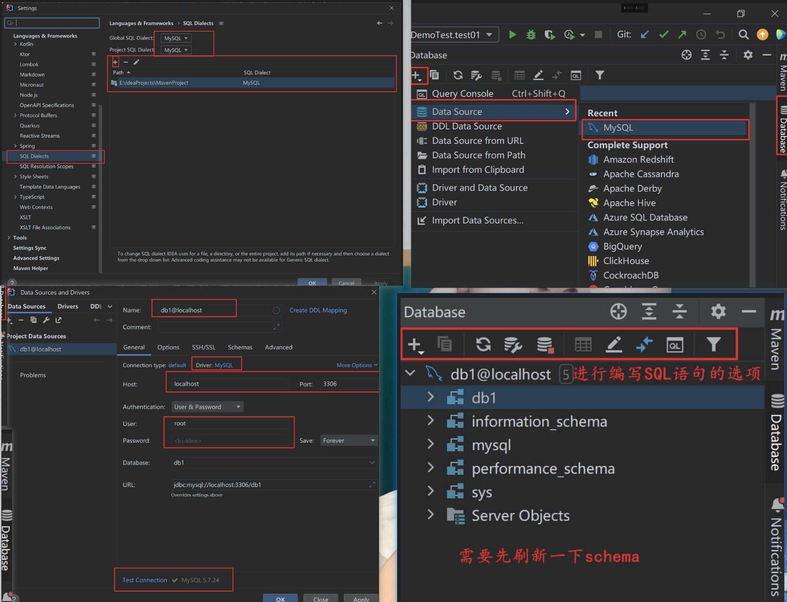 

#### 核心配置文件 mybatis-config.xml

- configuration（配置）
  - properties（属性）
  - settings（设置）
  - typeAliases（类型别名）
  - typeHandlers（类型处理器）
  - objectFactory（对象工厂）
  - plugins（插件）
  - environments（环境配置）
    - environment（环境变量）
      - transactionManager（事务管理器）
      - dataSource（数据源）
  - databaseIdProvider（数据库厂商标识）
  - mappers（映射器）

#### SQL映射文件 Mapper.xml

##### Mapper接口 代理开发 

1. 定义与SQL映射文件同名的Mapper接口，并将Mapper接口和SQL映射文件分别放置在java和resources中对应的mapper目录（`classpath*:/mapper/**/*.xml`）。
2. 设置SQL映射文件的nameSpace属性为Mapper接口全限定名。
3. 在Mapper接口中定义方法，方法名就是SQL映射文件中sql语句的id ，并保持参数类型和返回值类型一致。
4. 通过SqlSession对象的getMapper(UserMapper.class)方法来获取Mapper接口的对象，进行查询操作。

```java
UserMapper userMapper = sqlSession.getMapper(UserMapper.class);
List<User> list = userMapper.selectAll(); 
```

```xml
<!--SQL映射文件：UserMapper.xml-->
<mapper namespace="com.zjk.mapper.UserMapper">  
    <select id="selectAllUser" resultType="com.zjk.pojo.User">
        SELECT *
        FROM tb_user;
    </select>
</mapper>   
```

```java
package com.zjk.mapper;
/**/
public interface UserMapper {
    public List<User> selectAllUser(); //该方法名为SQL映射文件中对应的id
}
```

##### resultMap 属性名称不一致 

> 若数据库表的字段名称和实体类的属性名称不一样，则不能自动封装数据。

```xml
<mapper namespace="com.zjk.mapper.BrandMapper">
    <!--<resultMap id="resultMap的ID" type="对应类型">-->
    <resultMap id="brandResultMap" type="brand">
        <!--<result column="表中的列名" property="对应类型的相应属性名"/>-->
        <result column="brand_name" property="brandName"></result>
        <result column="company_name" property="companyName"></result>
    </resultMap>
    <!--<select id="selectAll" resultMap="resultMap的ID">-->
    <select id="selectAll" resultMap="brandResultMap">
        SELECT *
        FROM tb_brand;
    </select>
</mapper>
```

##### 参数传递

- MyBatis提供了ParamNameResolver类来进行参数封装。MyBatis接口方法中可以接收各种各样的参数，MyBatis底层对这些参数进行不同的封装处理方式。

| 参数占位符 | 说明                                               |
| ---------- | -------------------------------------------------- |
| `#{}`      | 相当于预编译语句的?，参数传递时使用。（如`#{id}`） |
| `${}`      | 拼sql，存在SQL注入问题，表名或列名不固定时使用。   |

> 参数类型 parameterType 可以忽略。

| 特殊字符 | 说明                   |
| -------- | ---------------------- |
| 转义字符 | `&lt;`、=、`<`等       |
| CDATA区  | `<![CDATA[特殊字符]]>` |

```xml
<select id="selectByIdIn" resultMap="brandResultMap">
    SELECT *
    FROM tb_brand
    WHERE id <![CDATA[ <= ]]> #{id};
</select>
```

| 单参数接收                      | 说明                                                         |
| ------------------------------- | ------------------------------------------------------------ |
| POJO类型                        | 直接使用，属性名和sql参数占位符名称相一致即可。              |
| Map集合                         | 直接使用，键名和sql参数占位符名称相一致即可。                |
| Collection<br />List<br />Array | 封装为Map集合（相当于多参数方式接收单个参数）。<br />map.put("arg0", collection/list/数组); <br />map.put("collection", collection/list);<br />map.put("list", list);<br />map.put("array", 数组); |
| 其他类型                        | 直接使用                                                     |

| 多参数接收               | 说明                                                         |
| ------------------------ | ------------------------------------------------------------ |
| @Param<br />（散装参数） | 方法中有多个参数时需要使用`@Param("sql参数占位符名称")`指定。 |
| 对象参数                 | 传入设置好相应属性的对象，对象属性的名称必须和sql参数占位符内的名称相一致（resultMap）。 |
| map集合参数              | 传入一个Map（存有相应的参数和属性值），可使用@Param替换Map集合中默认的arg键名。<br />`返回值类型 方法名(@Param("id") 参数类型 参数1,@Param("name") 参数类型 参数2)`<br />key：sql参数占位符的参数名，默认arg0、praram1作为key分别开始存放值。<br />value：传入的属性值。 |

```java
//散装参数 @Param("")
List<Brand> selectByCondition(@Param("status") int status, @Param("brandName") String brandName, @Param("companyName") String companyName);

//对象参数
List<Brand> selectByCondition(Brand brand);

//map集合参数
List<Brand> selectByCondition(Map map);
```

```java
//此时修改后的键名为：param1\~n、id、name（arg<n>被替换）
map.put("id",值1);
map.put("name",值2);
map.put("param1",值1);
map.put("param2",值2);
```

##### [动态 SQL](https://mybatis.net.cn/dynamic-sql.html)

### [Mybatis-Plus注解](https://baomidou.com/pages/223848/)

### 核心功能

#### 代码生成器

- Mybatis-Plus代码生成器：默认使用元数据查询方式（DefaultQuery ）来生成代码，依赖数据库厂商驱动（通用接口）来读取元数据的方式。

```xml
<groupId>com.baomidou</groupId>
<artifactId>mybatis-plus-generator</artifactId>
```

#### CRUD接口

| CRUD接口   | 说明                                                         |
| ---------- | ------------------------------------------------------------ |
| BaseMapper | 通用CRUD接口，定义了大部分的SQL语句。                        |
| IService   | 自定义CRUD接口。<br />public interface UserService extends IService<br />public class UserServiceImpl extends ServiceImpl\<UserMapper, User\> implements UserService |

| CURD表达式条件参数                                        | 说明                                   |
| --------------------------------------------------------- | -------------------------------------- |
| \<T\> entity                                              | 对应的pojo类型。                       |
| Map\<String, Object\>  columnMap                          | key：字段<br />value：值               |
| Serializable id                                           | 主键 ID                                |
| Collection<? extends Serializable> idList                 | 主键 ID 列表。                         |
| Wrapper\<T\> queryWrapper<br />Wrapper\<T\> updateWrapper | 查询条件构造器。<br />更新条件构造器。 |
| IPage\<T\> page                                           | 分页查询条件。                         |

# Spring Security

```xml
<groupId>org.springframework.boot</groupId>
<artifactId>spring-boot-starter-security</artifactId>
```

> Spring Security提供的默认登陆页（user：日志 Using generated security password）。

## PasswordEncoder 密码转码器

| PasswordEncoder         | 加密                                |
| ----------------------- | ----------------------------------- |
| BCryptPasswordEncoder   | bcrypt强哈希                        |
| NoOpPasswordEncoder     | 不使用任何转码<br />（开发中使用）  |
| Pbkdf2PasswordEncoder   | PBKDF2                              |
| SCryptPasswordEncoder   | Scrypt哈希                          |
| StandardPasswordEncoder | SHA-256哈希<br />（不安全，已废弃） |

- `PasswordEncoder#matches()`：将用户登录时输入的密码转码，并与数据库中的密码对比。

> 数据库中的（已编码的）密码永远不会被解码，需要使用转码器。

## UserDetailsService 用户详情服务

| UserDetailsService         | 基于Xxx的用户详情服务 |
| -------------------------- | --------------------- |
| InMemoryUserDetailsManager | 内存                  |
|                            | JDBC                  |
|                            | LDAP                  |

## UserDetails 用户实体

```java
List<UserDetails> usersList = new ArrayList<>();
usersList.add(new User(
    "buzz", encoder.encode("password"),
    Arrays.asList(new SimpleGrantedAuthority("ROLE_USER"))));
```

| UserDetails方法           | 说明                             |
| ------------------------- | -------------------------------- |
| getAuthorities()          | 返回集合，表明用户被授予的权限。 |
| isAccountNonExpired()     |                                  |
| isAccountNonLocked()      | 用户账户是否锁定。               |
| isCredentialsNonExpired() |                                  |
| isEnabled()               | 用户账户是否可用。               |

## SecurityFilterChain Web请求保护

```java
@Bean
public SecurityFilterChain filterChain(HttpSecurity http) throws Exception {
    return http.authorizeRequests()
        .antMatchers("/design", "/orders").hasRole("USER")
        .antMatchers("/", "/**").permitAll()
        .and()
        .formLogin().loginPage("/login")
        .and()
        .build();
}
```

## 第三方登录

### OAuth2

```xml
<groupId>org.springframework.boot</groupId>
<artifactId>spring-boot-starter-oauth2-client</artifactId>
```

```yaml
spring:
  security:
    oauth2:
      client:
        registration:
          <oauth2 or openid provider name>:
            clientId: <client id>
            clientSecret: <client secret>
            scope: <comma-separated list of requested scopes>
```

## @PreAuthorize、@PostAuthorzie 方法保护

| 注解 | @PreAuthorize                                                |
| ---- | ------------------------------------------------------------ |
| 位置 | 方法                                                         |
| 参数 | SpEL表达式                                                   |
| 时机 | 调用方法之前                                                 |
| 说明 | 若SpEl表达式返回true，则方法允许调用。<br />否则，阻止方法调用，并返回AccessDeniedException。 |

| 注解 | @PreAuthorize                                                |
| ---- | ------------------------------------------------------------ |
| 位置 | 方法                                                         |
| 参数 | SpEL表达式                                                   |
| 时机 | 方法调用完成并返回                                           |
| 说明 | 将方法的返回值在SpEl表达式中比较，若返回true，则方法允许调用。<br />否则，抛出AccessDeniedException。 |

## Principal 用户识别
