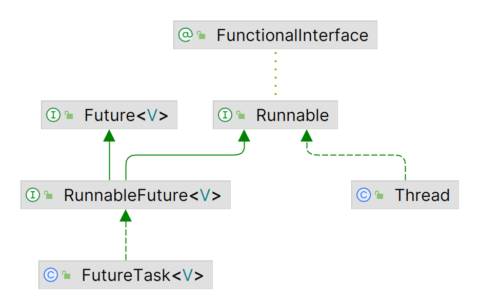

# Thread 线程

- 一个进程中有多个线程，多个线程共享进程的堆和方法区，每个线程独立拥有程序计数器和栈。
- 线程是占用CPU执行的基本单位，CPU使用时间片轮转的方式让线程轮询占用，而线程的程序计数器记录当前线程让出CPU时的执行地址。只有执行Java代码时，程序计数器才记录下一条指令的地址，否则记录undefined地址（如native方法）。



## 线程创建与运行

- 每个线程都是通过某个特定Thread对象的run()方法来完成操作的，把run()方法的主体称为线程体。

- 调用start()方法启动线程，线程体run()方法由JVM调用（OS的CPU调度决定），如果直接调用run()方法则没有启动线程。一个线程对象只能调用一次start()方法启动，如果重复调用了，则将抛出“IllegalThreadStateException”。

### Thread

```java
MyThread myThread = new MyThread();
myThread.start();
```

```java
public class MyThread extends Thread{
    @Override
    public void run() {
        System.out.println(getName() + " is Running ...");
    }
}
```

### Runnable

```java
Thread runnableTask = new Thread(new RunnableTask());
runnableTask.start();
```

```java
public class RunnableTask implements Runnable{

    @Override
    public void run() {
        System.out.println(Thread.currentThread().getName() + " is Running...");
    }
}
```

### FutureTask

```java
FutureTask<String> futureTask = new FutureTask<>(new CallableTask());
Thread futureTaskThread = new Thread(futureTask);
futureTaskThread.start();
try {
    String result = futureTask.get();
    System.out.println(result);
} catch (InterruptedException e) {
    throw new RuntimeException(e);
} catch (ExecutionException e) {
    throw new RuntimeException(e);
}
```

```java
public class CallableTask implements Callable<String> {
    @Override
    public String call() throws Exception {
        return "Call ...";
    }
}
```

## 线程等待与通知

- java.lang.Object中编写了wait()、notify()、notifyAll()方法。



### wait(..) 线程等待

- 线程调用共享资源/监视器锁的wait()方法时，该线程会进入阻塞状态，并释放当前持有的监视器锁，直到以下事件发生：

1. notified：其他线程调用了该共享变量的notify()/notifyAll()方法；
2. interrupted：其他线程调用了该线程的interrupt()方法，该线程抛出InterruptedException后返回；
3. timing out：若wait(..)方法的参数不为0，则超时后自动唤醒；
4. spurious wakeup：虚假唤醒（应该避免）。

- 若线程调用监视器锁的wait()方法时，还没有获得该监视器锁，则抛出IllegalMonitorStateException。
- 线程调用共享资源的wait()方法后，只会释放该共享资源的锁，若该线程还持有其他共享资源的锁，则不会释放其他共享资源的锁。

```java
sychronized(obj){
    while(conditions){ //避免虚假唤醒
        obj.wait();
    }
}
```

### notify()/notifyAll() 唤醒线程

- 线程调用共享资源的notify()方法后，随机唤醒一个在该共享变量上调用wait(..)方法而挂起的线程。而notifyAll()会唤醒所有在该共享资源上由于调用wait(..)而挂起的线程集，此时，其他没有竞争到监视器锁的线程会等待唤醒的线程释放监视器锁，之后再次竞争监视器锁，而不需要再次notify()/notifyAll()来唤醒。
- 被唤醒的线程必须还要获取了共享资源的监视器锁后，才可以从wait(..)方法返回并继续执行。

## 等待线程终止 join(..)

- 当A线程在main线程内使用join(..)时，main线程要先等待A线程终止或超过等待时间之后，才能继续执行，且main线程仍然持有监视器锁。

```java
public final synchronized void join(long millis) throws InterruptedException { ... }
//join()执行时，main线程获取监视器锁（A线程本身）（join()由synchronized修饰）
while (isAlive()) {
    wait(0); //此时，main线程释放这一个监视器锁（A线程本身）并阻塞。
}
//JVM内ensure_join(this);中的lock.notify_all(thread);来唤醒main线程
```

```java
public void static main(String[] args){ 
    Thread A = new MyThread();

    A.start();

    System.out.println("wait util MyThread is Ok");

    try {
        A.join(); //由main线程执行A.join()
    }catch (Exception ex){
        ex.printStackTrace();
    }

    System.out.println("end when MyThread is Ok");
}
```

