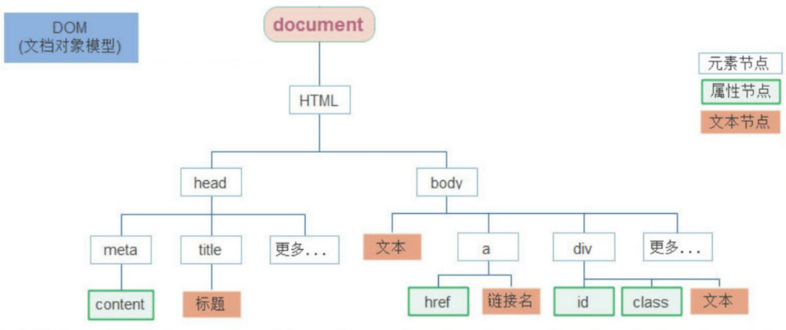

# HTML

- HTML（超文本标记语言）是解释型的标记语言，标签不区分大小写，且浏览器是容错的。后缀.html、.htm。

> **W3C标准** 网页主要由以下三个部分：
>
> 1. 结构：HTML
> 2. 表现：CSS
> 3. 行为：Javascript

| HTML的基本元素    | 说明                                                         |
| ----------------- | ------------------------------------------------------------ |
| `<!DOCTYPE html>` | 文档类型                                                     |
| `<html></html>`   | 根元素                                                       |
| `<head>`          | 信息容器  <br>包含所有想包含在 HTML 页面中但不在 HTML 页面中显示的内容 |
| `<body>`          | 页面内容                                                     |

```html
<!DOCTYPE html>
<html lang="en">
    <head>
        <meta charset="UTF-8">
        <title>Title</title>
    </head>
    <body>

    </body>
</html>
```

| 原义字符  | 等价字符引用 |
| :-------- | :----------- |
| `<`       | `&lt;`       |
| `>`       | `&gt;`       |
| `"`       | `&gt;`       |
| `'`       | `&apos;`     |
| `&`       | `&amp;`      |
| `>=`      | `&ge;`       |
| `<=`      | `&le;`       |
| 注册商标® | `&reg;`      |
| 版权符号© | `&copy;`     |
| 空格      | `&nbsp;`     |

## 普通元素

| 普通元素                                   | 作用                                 |
| :----------------------------------------- | :----------------------------------- |
| `<br>`                                     | 换行                                 |
| `<p></p>`                                  | 段落<br />段前和段后各添加一个空行。 |
| `<h1></h1>`                                | 标题<br />`<h1>~<h6>`                |
| `<span></span>`                            | 无语义                               |
| `<b></b>`  <br/>`<i></i>`  <br/>`<u></u> ` | 字体加粗<br />字体倾斜<br />下划线   |
| `<center></center>`                        | 居中显示                             |
| `<sub></sub>` <br/> `<sup></sup> `         | 下标<br />上标                       |
| `<hr>`                                     | 水平分割线                           |
| `<button>`                                 | 按钮                                 |

### `<li></li>` 列表

| 列表        | 说明     |
| ----------- | -------- |
| `<li></li>` | 列表选项 |
| `<ol></ol>` | 有序列表 |
| `<ul></ul>` | 无序列表 |

```html
<ul>
  <li>豆浆</li>
  <li>油条</li>
</ul>
```

### `<a></a>` 超链接

| `<a></a>` | 锚点（超链接）                                               |
| :-------- | :----------------------------------------------------------- |
| href      | 链接url                                                      |
| title     | 链接提示信息                                                 |
| target    | 窗口打开方式<br />`_self` 默认在本窗口打开<br/>`_blank` 打开一个新的标签页<br/>`_parent` 在父窗口打开<br/>`_top` 在顶层窗口打开 |

- 块级链接：任何内容（包括块级内容）都可以是链接资源。

```html
<a href="https://developer.mozilla.org/zh-CN/">
  
</a>
```

| 多媒体嵌入        | 说明                                                         |
| ----------------- | ------------------------------------------------------------ |
| ``          | 图片<br />src：url<br>alt：提示<br>title：标题               |
| `<audio></audio>` | 音频支持MP3、WAV、OGG<br>src：url<br>controls：播放控件<br>标签内容：提示 |
| `<video></video>` | 视频支持MP4、WebM、OGG<br>src：url<br/>controls：播放控件<br/>标签内容：提示 |

### `<div></div>` 盒子

### `<table></table>` 表格

| 表格                | 名称                                            |
| --------------------- | ----------------------------------------------- |
| `<table></table>`     | 表格（可嵌套）                                  |
| `<caption></caption>` | 标题                                            |
| `<th></th>`           | 表头<br />scope表头类型：col 、row              |
| `<tr></tr>`           | 行                                              |
| `<td></td>`           | 列<br />rowspan：跨行合并<br/>colspan：跨列合并 |

````html
<table>
    <th>
    	<td></td>
    </th>
	<tr>
		<td></td>
	</tr>
</table>
````

## 网站布局

| 典型布局            | 名称                                                         |
| ------------------- | ------------------------------------------------------------ |
| `<header></header>` | 页眉：简介形式的内容。<br>作为`<body>`子元素：网站的全局页眉<br>作为`<section>`、`<article>`子元素：部分的页眉 |
| `<nav></nav>`       | 导航栏                                                       |
| `<main></main>`     | 主内容，存放每个页面独有的内容。每个页面上只能用一次。       |
| `<aside></aside>`   | 侧边栏：间接信息（术语条目、作者简介、相关链接，等等）       |
| `<footer></footer>` | 页脚                                                         |

## `<form></form>`  表单

| form属性 | 说明                                             |
| -------- | ------------------------------------------------ |
| action   | 服务器响应url。                                  |
| name     | 表单名称<br />name指定后服务器才能收到表单内容。 |
| value    | 发送给服务器的值。                               |
| method   | 请求类型。<br />get、post...                     |

### `<input/>` 输入

| type属性 | 类型                                                         |
| :------- | :----------------------------------------------------------- |
| text     | 文本框                                                       |
| password | 密码域                                                       |
| file     | 文件域                                                       |
| radio    | 单选按钮<br />单选组的name必须一致                           |
| checkbox | 复选框                                                       |
| submit   | 提交按钮                                                     |
| reset    | 重置按钮<br />恢复到默认状态（不等于清空）                   |
| button   | 普通按钮                                                     |
| hidden   | 隐藏域<br />隐藏域不会在页面显示，但提交表单时会一起被提交。 |
| image    | 图像域                                                       |

```html
<form action="demo04.html">
    昵称：<input type="text" name="nicName"/><br/><br/>
    密码：<input type="password" name="pwd"/><br><br/>
    性别：<input type="radio" name="gender" value="male"/> 男
         <input type="radio" name="gender" value="female" checked/> 女<br/><br/>
    爱好：<input type="checkbox" name="hobby" value="basketball"/> 篮球
         <input type="checkbox" name="hobby" value="football"/> 足球
          <input type="checkbox" name="hobby" value="ping-pong"/> 乒乓球 <br/><br/>
    星座：<select name="start">
              <option value="1">据星</option>
              <option value="2" selected>明星</option>
              <option value="3">后星</option>
              </select><br/><br/>
    备注：<textarea name="remark" rows="4" cols="50"></textarea><br/><br/>
    <input type="submit" value="注册"/>
    <input type="reset" value="重置"/>
    <input type="button" value="普通按钮"/>
</form>
```

<form action="demo04.html">
    昵称：<input type="text" name="nicName"/><br/><br/>
    密码：<input type="password" name="pwd"/><br><br/>
    性别：<input type="radio" name="gender" value="male"/> 男
         <input type="radio" name="gender" value="female" checked/> 女<br/><br/>
    爱好：<input type="checkbox" name="hobby" value="basketball"/> 篮球
         <input type="checkbox" name="hobby" value="football"/> 足球
          <input type="checkbox" name="hobby" value="ping-pong"/> 乒乓球 <br/><br/>
    星座：<select name="start">
              <option value="1">据星</option>
              <option value="2" selected>明星</option>
              <option value="3">后星</option>
              </select><br/><br/>
    备注：<textarea name="remark" rows="4" cols="50"></textarea><br/><br/>
    <input type="submit" value="注册"/>
    <input type="reset" value="重置"/>
    <input type="button" value="普通按钮"/>
</form>

### `<textarea></textarea>` 多行文本框

### `<label></label>` 标签

# CSS

 

| 类型       | 网页导入                                                     |
| ---------- | ------------------------------------------------------------ |
| 外部样式表 | `<link rel="stylesheet" href="css文件路径">`                 |
| 内部样式表 | `<style>css代码</style>`                                     |
| 内联样式表 | HTML元素的style属性：`<span style="font-size:60px";>HELLO</span>` |

## 样式表

- 浏览器解析CSS规则时，若遇到无法解析的属性/值，则忽略并继续解析之后的CSS规则。当遇到无法解析的选择器的时候，会直接忽略整个选择器规则并解析下一个CSS选择器。

| 专一性   | 说明                                               |
| -------- | -------------------------------------------------- |
| 级联规则 | 相同的选择器，后面的样式会覆盖之前相同属性的样式。 |
| 专用规则 | id选择器 &gt; 类选择器 &gt; 类型选择器。           |

- CSS由声明和选择器组成。声明放在声明块`{}`内，并且声明可以是多条，区分大小写。每条声明由一对属性和值组成，属性和值之间用冒号`:`分开，每条声明以分号`;`结尾。

```css
body h1 + p .special {
  color: yellow;
  background-color: black;
  padding: 5px;
}
```

### 选择器

| 选择器       | 说明                                    |
| :----------- | :-------------------------------------- |
| HTML元素     | 标签选择器                              |
| `.class属性` | 类选择器                                |
| `#id属性`    | ID选择器                                |
| `*`          | 全局选择器<br />文档/父元素中的所有内容 |

#### 属性选择器

| 存否和值选择器 | 元素匹配                                                     |
| :------------- | :----------------------------------------------------------- |
| `[属性]`       | 带有某属性的元素<br />`a[title]`                             |
| `[属性=值]`    | 带有某属性和值的元素<br />`a[href="https://example.com"]`    |
| `[属性~=值]`   | 带有某属性和值的元素，该属性的值至少有1个和该值匹配。<br>在一列中的好几个值，是用空格隔开的。<br />`p[class~="special"]` |
| `[属性|=值]`   | 带有某属性和值的元素、或其中的值开头为该值。<br />`div[lang|="zh"]` |

| 子字符串匹配选择器 | 匹配的元素                                      |
| :----------------- | :---------------------------------------------- |
| `[attr^=value]`    | `li[class^="a"]`：任何值开头为`a`的。           |
| `[attr$=value]`    | `li[class$="a"]`：任何值结尾为`a`的。           |
| `[attr*=value]`    | `li[class*="a"]`：任何值中出现`a`的。           |
| i                  | `li[class^="a" i] `：以大小写不敏感的方式匹配。 |

#### 关系选择器

| 选择器 | 关系选择器                                                   | 示例 |
| ------ | :----------------------------------------------------------- | ---- |
| ` `    | 后代选择器<br />`ul li`                                      |      |
| `>`    | 子代关系选择器<br />`ul > li`                                |      |
| `+`    | 邻接兄弟选择器<br />`p + img`                                |      |
| `~`    | 通用兄弟关系选择器<br />`p ~ img`：选中所有的`p元素后任何地方的img元素 |      |

#### 伪类、伪元素

| 选择器 | 说明                                   |
| ------ | -------------------------------------- |
| 伪类   | 选择处于特定状态的元素。<br />`:focus` |
| 伪元素 | `::after`                              |

## 盒子模型

## 定位

# JavaScript

| JS                 | 说明                                                         |
| ------------------ | ------------------------------------------------------------ |
| 解释型的脚本语言   | 不会产生编译出来的字节码文件，而是在程序的运行过程中对源文件逐行进行解释。 |
| 基于对象           | 基于对象的脚本语，能够实现封装，可以模拟继承，不支持多态。   |
| 弱类型语言         | 变量的数据类型由所赋的值决定<br />有明确的数据类型，但声明一个变量后它可以接收任何类型的数据，并且会在程序执行过程中根据上下文自动转换类型。 |
| 事件驱动的脚本语言 | 不需要经过Web服务器就可以对用户的输入做出响应。              |
| 跨平台             | 不依赖于操作系统，仅需要浏览器的支持。                       |

| JavaScript                                                   | Java                                                         |
| :----------------------------------------------------------- | :----------------------------------------------------------- |
| 面向对象。不区分对象类型。通过原型机制继承，任何对象的属性和方法均可以被动态添加。 | 基于类系统。分为类和实例，通过类层级的定义实现继承。不能动态增加对象或类的属性或方法。 |
| 变量类型不需要提前声明 (动态类型)。                          | 变量类型必须提前声明 (静态类型)。                            |
| 不能直接自动写入硬盘。                                       | 可以直接自动写入硬盘。                                       |

> ECMAScript 规范

```html
<!--向页面添加JavaScript-->
<script src="/js/demo01.js" async></script>
```

| 属性  | 脚本调用策略                                     |
| ----- | ------------------------------------------------ |
| async | 异步，js和html一同加载；但无法控制脚本的运行次序 |
| defer | 按上下顺序控制脚本的运行次序                     |

## Js

### 基础语法

#### 变量

- JavaScript区分大小写，并使用Unicode字符集。

| 变量  | 说明                                                         |
| :---- | :----------------------------------------------------------- |
| var   | 声明一个变量，可选初始化一个值。                             |
| let   | 声明一个块作用域的局部变量，可选初始化一个值。               |
| const | 声明一个块作用域的只读常量，不允许重新赋值 ，声明的时候必须赋值（初始化） |

- 如果访问一个未声明的变量会导致抛出一个引用错误（ReferenceError）异常。
- 只声明而没有初始化的变量值为：undefined。

| 变量     | 作用域                                                     |
| -------- | ---------------------------------------------------------- |
| 全局变量 | 在函数之外声明的变量，可被当前文档中的任何其他代码所访问。 |
| 局部变量 | 在函数内部声明的变量，只能在当前函数的内部访问。           |

- 函数内部，如果变量没有声明而直接赋值（var)，相当于对同名的全局变量操作。

```js
let number = 1;
(function (){
    number = 33;
})();
alert(number); //33 全局变量number被更改
```

##### var 变量提升

| 变量      | 说明                                                         |
| --------- | ------------------------------------------------------------ |
| var       | 提升变量到代码块的顶部，初始值为undefined ，直到变量的声明代码处，才被赋予应有的赋值。 |
| let const | 提升变量到代码块的顶部但是不会被赋予初始值。在变量声明之前引用这个变量，将抛出引用错误（ReferenceError）：直到变量的声明代码处，才被赋予初始值。 |

```javascript
console.log(x === undefined); // true
var x = 3;

console.log(y); // ReferenceError
let y = 3;
```

- 一个函数中所有的var语句应尽可能地放在接近函数顶部的地方，避免变量提升。

##### 解构赋值

| 解构赋值目标             | 说明                                                         |
| ------------------------ | ------------------------------------------------------------ |
| 可迭代对象<br />（数组） | 等号左边的参数少于右边：右边多出的会被忽略。<br />等号左边的参数多于右边：左边多出的参数值为undifind。 |
| 对象属性                 | 只有名称相对应的参数会被赋值，不匹配的参数值为undifind。     |

```javascript
//x,y分别被赋值1,2
let [x,y] = [1,2]
```

##### 基本数据类型

| 类型      | 名称   | 说明                                                         |
| :-------- | :----- | :----------------------------------------------------------- |
| number    | 数值型 | Infinity 无穷<br>NaN 非数值                                  |
| string    | 字符串 | JavaScript不区分字符、字符串；<br>单引号、双引号作用相同。   |
| boolean   | 布尔型 | true：非零的数值，非空字符串，非空对象<br>false：零 NaN，空字符串，null，undefined |
| null      | 空     | number: 0 <br>boolean：false<br>typeof()返回object类型       |
| undefined | 未定义 | 变量未初始化时的默认为undefined                              |

```js
//返回变量数据类型
typeof(变量)
```

| 自动转换      | 值              | boolean | String              | number |
| :------------ | :-------------- | :------ | :------------------ | :----- |
| **number**    | 0<br>NaN        | false   | "0"<br>"NaN"        |        |
|               | Infinity<br>123 | true    | "Infinity"<br>"123" |        |
| **string**    | "" 空字符串     | false   |                     | 0      |
|               | "abc" 非数值    | true    |                     | NaN    |
|               | "123" 数值      | true    |                     | 123    |
| **null**      |                 | false   | "null"              | NaN    |
| **undefined** |                 | false   | "undefined          | 0      |

| 强制转换目标 | 方法                       |
| :----------- | :------------------------- |
| **String**   | String()                   |
|              | toString()                 |
| **number**   | Number()                   |
|              | parseInt()<br>parseFloat() |
| **boolean**  | Boolean()                  |

```js
//string 按照字符串的字面值，转为数字；不是数字则转为NaN
var number = +"123"; //+转为数字
parseInt(str);

//boolean  true转为1，false转为0
var number = +true;
```

##### 运算符、操作符 

| 运算符 | 说明                                     | 示例              |
| :----- | :--------------------------------------- | ----------------- |
| `==`   | 等于，只根据表面值判断，不考虑数据类型   | "17"==17 //true   |
| `!=`   | 不等于，只根据表面值判断，不考虑数据类型 | "17"!=17 //false  |
| `===`  | 绝对等于，根据表面值和数据类型考虑       | "17"===17 //false |
| `!==`  | 绝对不等于，根据表面值和数据类型考虑     | "17"!==17 //true  |

| 操作符      | 说明                                                         | 示例                                                         |
| ----------- | ------------------------------------------------------------ | ------------------------------------------------------------ |
| in          | 是否为对象的属性名                                           | `let person = {name:"tom"};`<br>`"name" in person;`//true    |
| instanceof  | 是否为对象类的实例                                           | `let d = new Date();`<br>`d instanceof Date;`//true          |
| eval() 函数 | 传入非字符串：返回该值<br>传入字符串：作为JavaScript代码解析 | 返回最后一句表达式/语句的值；没有值则undefined<br>eval()内使用const/let声明的变量只在eval内作用<br>eval()内使用var变量作用域和eval()所在相同 |
| `?:`        | 三元操作符                                                   |                                                              |
| `??`        | 先定义：如果左侧为null/undefined，则返回右侧的值             | `null ?? 1`//返回1                                           |
| typeof      | 显示类型<br>null --> object<br>符号--> symbol                | `typeof 123`//"number"                                       |
| delete      | 删除对象的某个属性。<br />删除的元素仍然占用内存空间。<br /> | `delete person.name;`//删除person对象的name属性<br>`delete arr[0];`//删除arr数组的第1个元素 |

> delete不会改变数组的元素个数， 数组中删除的元素的位置会被设置为 undefined，并且它的位置不会被重新分配。

#### 流程控制

##### 条件语句

###### if..else

- 

```javascript
//如果需要在条件表达式中使用赋值，通常在赋值语句前后额外添加一对括号
if ((x = y)) {
}
```

###### switch

```javascript
switch (expression) {
   case label_1:
      statements_1
      [break;]
   case label_2:
      statements_2
      [break;]
   default:
      statements_def
      [break;]
}
```

##### 循环

###### for、for..in、for..of

```javascript
for ([initialExpression]; [condition]; [incrementExpression]){
  statement
}
```

| 循环     | 遍历的结果     | 方式                                                         |
| :------- | -------------- | ------------------------------------------------------------ |
| for...in | 数组元素的下标 | 循环一个指定的变量来循环一个对象所有可枚举的属性 。          |
| for...of | 元素的值       | 循环可迭代对象，对值的每一个独特属性调用一次迭代。<br />Map类型：for..of每次循环输出一个数组`[key,value]`。 |

- 数组迭代是实时的，如果在迭代中修改数组中下一个元素的值，则迭代出的下个元素的值是修改后的。

```javascript
let arr = [3, 5, 7];
arr.foo = "hello"; 
//这里的foo严格意义上来说是数组的属性，而不是数组中的元素
//所以for..of不会输出foo属性对应的值，而是输出数组中的元素

for (let i in arr) {
    console.log(i); // 输出 "0", "1", "2", "foo"
}

for (let i of arr) {
    console.log(i); // 输出 "3", "5", "7"
    //注意 for...of 的输出没有出现 "hello"
}
```

###### while、do..while

- do..while：statement在检查条件之前会执行一次。

```javascript
do{
    statement
}while (condition);
```

```javascript
while (condition){
    statement
}
```

###### continue、break

| 关键字   | 说明                                                         |
| -------- | ------------------------------------------------------------ |
| continue | 不带label：终止当前 `while`、`do-while`、for这次的循环并且继续执行下一次循环。<br />带label：应用被 label 标识的循环语句。 |
| break    | 不带label：立即终止当前所在的 `while`、`do-while`、`for`、 `switch` 并把控制权交回这些结构后面的语句。<br />带label：终止指定的带标记（label）的语句。 |

```javascript
var num = 0;
outPoint:
for (var i = 0 ; i < 10 ; i++){
  for (var j = 0 ; j < 10 ; j++){
    if( i == 5 && j == 5 ){
      break outPoint; // 在 i = 5，j = 5 时，跳出所有循环，
                      // 返回到整个 outPoint 下方，继续执行
    }
    num++;
  }
}

alert(num); // 输出 55
```

#### 异常处理

##### throw

```javascript
throw new UserException("Value too high");
```

##### try-catch-finally

```javascript
openMyFile();
try {
    writeMyFile(theData); //This may throw a error
}catch(e){
    handleError(e); // If we got a error we handle it
    console.log(e.name);
    console.log(e.message);
}finally {
    closeMyFile(); // always close the resource
}
```

##### Error对象

| Error属性 | 说明                                               |
| :-------- | :------------------------------------------------- |
| name      | 提供了常规的错误类（如 'DOMException' 或 'Error'） |
| message   | 通常提供了一条从错误对象转换成字符串的简明信息。   |

```javascript
throw (new Error('The message'));
```

#### 函数

- 定义函数：形参不需要数据类型，返回值也不需要定义类型，如果需要返回值，直接return相应的数据即可。

```javascript
function 函数名(参数1, 参数2,...) {
    ...语句;
  return 返回值;
}

var 变量 =  function (参数列表) {
   //执行语句
}
```

- 函数提升：只有函数声明会被提升到顶部，而函数表达式不会被提升。

```javascript
/* 函数声明 */

foo(); // "bar"

function foo() {
  console.log("bar");
}


/* 函数表达式 */

baz(); // 类型错误：baz 不是一个函数

var baz = function() {
  console.log("bar2");
};
```

| 调用函数         | 函数调用可以传递任意个数的参数（没有参数`~`超过列表的参数）。 |
| ---------------- | ------------------------------------------------------------ |
| 参数少于参数列表 | 其没有接收到传递值的参数会转为undifined。                    |
| 参数超过参数列表 | 多余的参数被传递，但不接收。                                 |

```javascript
//绑定函数变量
var 变量 = 函数名(参数列表);
//事件绑定
事件名 = "函数名()"
//直接调用
函数名(参数列表);
```

```javascript
var add = function (a,b){
    return a + b;
}

alert(add);  //返回函数体
alert(add(1,2,3)); //3 多余的参数不接收
alert(add(1)); //NaN
```

##### 匿名函数

- 声明一个函数，相当于创建了一个函数对象，将这个对象的引用赋值给变量。

```javascript
var 变量 = function(参数1, 参数2) {
    ...语句;
  return 返回值;
};
```

##### 立即函数

- 立即函数：立刻调用执行。

```js
(function (a, b) {
    console.log(a + b);
})(1, 2);
```

##### 事件绑定

| 事件绑定方式                                      | 说明                         |
| ------------------------------------------------- | ---------------------------- |
| `<标签 事件="函数()">`                            | HTML标签中的事件属性进行绑定 |
| `document.getElementById("id属性").事件 = 函数()` | DOM的Element属性进行绑定     |

```javascript
document.getElementById("H1").onclick = function (){
    alert("点击成功");
}
```

#### 对象

##### 自定义对象

- 自定义对象：属性/方法会被之后的同名属性/方法覆盖。

```javascript
//new构造对象
obj = new Object();

//声明对象
let person = {
    name: "Tom",
    age: 18,
    eat: function () {
        alert("eat food");
    },
    show : function () {
        alert(`hello ${this.age}岁的${this.name} !`);
    }
}

//动态添加属性
person.sex = "man";
person["father"] = "Mac";
//动态添加方法
person.say = function (word){
    console.log(`${word}`);
}

let students = [
    //匿名对象
    {name:'小明',age:"18",gender:"男",hometown:"河北省"},
    {name:'小红',age:"19",gender:"女",hometown:"福建省"},
    {name:'小刚',age:"17",gender:"男",hometown:"山东省"}
]
```

 ```javascript
//属性/方法访问
person.name;
person["name"];
 ```

```javascript
//?. 条件访问/调用

//当属性（右侧）为null或undefined时，不访问该属性，直接返回undefined
person?.name;
person?.[name];
//当调用者（左侧）为null或undefined时，不调用该函数，直接返回undefined
person?.(eat("apple"));
```

| this位置   | 指向                         |
| ---------- | ---------------------------- |
| 在函数外面 | window对象（当前浏览器窗口） |
| 在函数里面 | 调用函数的对象               |

##### 系统对象

| 对象   | 说明         |
| :----- | :----------- |
| Date   | 日期时间处理 |
| Array  | 数组处理     |
| String | 字符串处理   |
| Math   | 数学处理     |
| Number | number       |

###### Array 数组

- Array数组是变长变类型的，下标从0开始。

> 数组的长度不固定。
> 数组存放的各元素的数据类型可以不一样。

```javascript
var 数组名 = new Array(元素列表);
var 数组名 = [元素列表];
```

| 方法                       | 说明                                             |
| :------------------------- | :----------------------------------------------- |
| push(value)                | 向数组中压入value值                              |
| splice(index,count,item..) | 删除元素并返回被删除元素。                       |
| reverse()                  | 数组元素反序                                     |
| join("分隔符")             | 数组元素拼接成字符串，每个元素之间以分隔符连接   |
| split("分隔符")            | 以分隔符将字符串拆分为数组                       |
| pop()                      | 弹出（删除）数组中的最后一个元素，同时返回该元素 |

```javascript
// 1.创建数组对象
var arr01 = new Array(1,2,3);
alert(arr01); //1,2,3

var arr = ["cat","dog","tiger"];
alert(arr); //cat,dog,tiger
alert(arr[0]); //cat

//数组的长度不固定
alert(arr.length); //3

//数组存放的各元素的数据类型可以不一样。
alert(arr[10] = "ten"); //ten
alert(arr.length); //11
alert(arr[9]); //undefined
```

###### String 字符串

```javascript
var 变量 = new String(""); 
var 变量 = ""
```

| 方法      | 说明                                             |
| :-------- | :----------------------------------------------- |
| charAt()  | 返回指定位置的字符，超过字符串长度的返回空格     |
| indexOf() | 检索字符串，返回第一个找到的下标，找不到则返回-1 |
| trim()    | 去除字符串前后两端的空白字符                     |

- 模板字符串：字符串使用反引号\`\`， \$\{\}内为引用的变量。

```js
let name = "Tom";
let str = `hello ${name}`; //hello Tom
```

###### RegExp 正则表达式 

```javascript
//正则表达式对象
var reg = /正则/
var reg = new RegExp("正则")
```

| RegExp | 说明               |
| ------ | ------------------ |
| test() | 判断是否匹配模式。 |

```javascript
/^\d{6,12}$/.test(passwdInput.value)
```


### BOM 浏览器对象模型

- Browser Object Model：JavaScript将浏览器的各个组成部分封装为对象。

   

| 对象      | 说明           |
| :-------- | :------------- |
| Window    | 浏览器窗口对象 |
| History   | 历史记录对象   |
| Location  | 地址栏对象     |
| Navigator | 浏览器对象     |
| Screen    | 屏幕对象       |

#### Window 浏览器窗口对象

- 直接使用window对象，`window.`可以省略

| 常用属性  | 说明                            |
| :-------- | :------------------------------ |
| history   | 对 History 对象的只读引用。     |
| Navigator | 对 Navigator 对象的只读引用。   |
| Screen    | 对 Screen 对象的只读引用。      |
| location  | 用于窗口/框架的 Location 对象。 |

| 方法                               | 说明                                                         |
| :--------------------------------- | :----------------------------------------------------------- |
| alert()                            | 显示带有一段消息和一个确认按钮的警告框。                     |
| confirm()                          | 显示带有一段消息以及确认按钮和取消按钮的对话框。返回boolean  |
| setTimeout()<br />clearTimeout()   | 在指定的毫秒数后调用函数或计算表达式。<br />清除定时设置。   |
| setInterval()<br />clearInterval() | 按照指定的周期（以毫秒计）来调用函数或计算表达式。<br />清除定时设置。 |

```js
window.alert("Hello"); //window可以省略

//confirm 返回boolean，确定：true 取消：false。
if(confirm("是否确认删除"))
    alert("删除成功");
else
    alert("已取消");

//setTimeout(函数,毫秒) 执行一次
setTimeout(function (){
    alert("setTimeout 执行")
},1000);
var count = 0;

//setInterval(函数,毫秒) 循环执行
setInterval(function (){
    alert("setInterval 执行" + ++count);
},1000);
```

#### history 历史记录对象

| window.history()<br />history | 获取历史记录对象<br />加载history列表的内容 |
| :---------------------------- | :------------------------------------------ |
| **方法**                      | **说明**                                    |
| back()                        | 前一个 URL。                                |
| forward()                     | 下一个 URL。                                |
| go()                          | 某个具体页面。                              |

#### location 地址栏对象

| window.location()<br />location | 获取地址栏对象           |
| :------------------------------ | :----------------------- |
| **属性**                        | **设置/返回**            |
| href                            | 完整的URL。              |
| host<br />hostname、port        | 主机名、当前URL的端口号  |
| pathname                        | 当前URL的路径部分。      |
| protocol                        | 当前URL的协议。          |
| **方法**                        | **说明**                 |
| assign()                        | 加载新的文档。           |
| reload()                        | 重新加载当前文档。       |
| replace()                       | 用新的文档替换当前文档。 |

```javascript
//直接跳转到百度
location.href = "https://www.baidu.com";
```


### DOM 文档对象模型

- DOM定义了访问HTML和xml文档的标准：W3C（万维网联盟）标准。

**标准分为3个不同部分：**

| W3C DOM部分 | 说明                                                         |
| ----------- | ------------------------------------------------------------ |
| 核心DOM     | 针对任何结构化文档的标准模型。<br />Document（整个文档对象）、Element（元素对象）<br />Attribute（属性对象）、Text（文本对象）、Comment（注释对象） |
| XML DOM     | 针对xml文档的标准模型。                                      |
| HTML DOM    | 找到HTML文档的标准模型。                                     |

 

| 对象     | 节点 | 组成部分         |
| -------- | ---- | ---------------- |
| Document | 文档 | 整个文档         |
| Element  | 元素 | HTML标签         |
| Text     | 文本 | HTML标签内的文本 |
| Attr     | 属性 | HTML标签内的属性 |
| Comment  | 注释 | 注释             |

#### Element 元素对象

| 获取Element对象                          | 说明                                     |
| :--------------------------------------- | :--------------------------------------- |
| document.getElementById("id")            | 根据id属性值获取，返回一个Element对象    |
| document.getElementsByName("name")       | 根据name属性值获取，返回Element对象数组  |
| document.getElementsByTagName("h1")      | 返回带有指定标签名的对象的集合           |
| document.getElementsByClassName("class") | 根据class属性值获取，返回Element对象数组 |
| document.querySelector("css选择器")      | 根据CSS选择器获取，返回第一个Element对象 |
| document.querySelectorAll("css选择器")   | 根据CSS选择器获取，返回Element对象集合   |

| 常用用途  | 属性      | 操作Element对象                                              |
| --------- | :-------- | :----------------------------------------------------------- |
| 文档      | referrer  | 设置或返回载入当前文档的URL                                  |
|           | URL       | 设置或返回当前文档的URL                                      |
| 样式      | style     | 设置或返回元素的style属性：CSS样式                           |
| 表单      | value     | 设置和返回元素的value值                                      |
|           | checked   | 设置和返回元素是否被选中                                     |
|           | type      | 设置和返回元素的类型：如表单中的password                     |
| HTML内容  | innerHTML | 设置（覆盖）或返回元素的内容，文本中包含的标签会被解析       |
|           | innerText | 设置（覆盖）或返回元素的内容，文本中包含的标签不会被解析     |
| class属性 | classList | 返回节点的class属性列表<br>add("class") 增加类<br>remove("class") 删除类<br>toggle("class") 切换类：如果元素中已经存在该类名，toggle方法会将其移除；如果不存在该类名，toggle方法会将其添加。<br>当参数为true时，toggle方法会强制添加类名；当参数为false时，toggle方法会强制删除类名。 |
|           | className | 设置或返回节点的class属性（通常使用classList）               |

| 方法    | 说明                                     |
| :------ | :--------------------------------------- |
| write() | 向文档写文本、HTML表达式、JavaScript代码 |

##### 自定义属性

- html5：data-自定义属性，在标签上一律以data-开头，在DOM对象上一律以dataset对象方式获取。

```js
// 1. 获取元素
let div = document.querySelector('div')
// 2. 获取自定义属性值
console.log(div.dataset.id)
```

#### Core DOM操作节点

| 访问节点              | 说明                               |
| :-------------------- | :--------------------------------- |
| getElementById()      | 返回对拥有指定id的第一个对象的引用 |
| getElementByName()    | 返回带有指定名称的对象的集合       |
| getElementByTagName() | 返回带有指定标签名的对象的集合     |

| 属性       | 说明                                                         |
| :--------- | :----------------------------------------------------------- |
| parentNode | 该节点的父节点                                               |
| firstChild | 首个子节点，（如果某有，文本和属性节点返回空数组，元素节点返回null） |
| lasstChild | 最后一个字节点                                               |

| 操作节点属性值         | 说明       |
| :--------------------- | :--------- |
| getAttribute("属性名") | 获取属性值 |
| setAttribute("属性名") | 设置属性值 |

| 创建和增加属性                | 说明                                                         |
| :---------------------------- | :----------------------------------------------------------- |
| createElement(tagName)        | 按照给定的标签名创建一个新的元素节点                         |
| appendChild(nodeName)         | 向已存在节点列表的末尾添加新的节点                           |
| insertBefore(newNode,oldNode) | 向指定的节点之前插入一个新的节点                             |
| cloneNode(boolean)            | 复制某个指定的节点（true复制该节点及其字节点，false只复制当前节点） |

| 删除和替换节点                | 说明                       |
| :---------------------------- | :------------------------- |
| removeChild(node)             | 删除指定的节点             |
| replaceChild(newNode,oldNode) | 用其他的节点替换指定的节点 |

#### HTML DOM

| table对象   | 说明                           |
| ----------- | ------------------------------ |
| **属性**    | **说明**                       |
| `rows[]`    | 返回该表格中所有行的一个数组。 |
| **方法**    | **说明**                       |
| insertRow() | 向表格中插入一行               |
| deleteRow() | 从表格中删除一行               |

| tableRow对象 | 说明                                     |
| ------------ | ---------------------------------------- |
| **属性**     | **说明**                                 |
| `cells[]`    | 返回包含行中所有单元格的一个数组         |
| rowIndex     | 返回该行在表中的位置                     |
| **方法**     | **说明**                                 |
| insertCell() | 在一行中的指定位置插入一个空的`<td>`标签 |
| deleteCell() | 删除行中指定的单元格                     |

| tableCell对象 | **说明**                               |
| :------------ | :------------------------------------- |
| **属性**      | **说明**                               |
| cellIndex     | 返回单元格在某行单元格集合中的位置     |
| innerHTML     | 设置或返回单元格                       |
| align         | 设置或返回单元格内部数据的水平排列方式 |
| className     | 设置或返回元素的class属性              |

## AJAX

- AJAX（Asynchronous JavaScript And XML）：异步的JavaScript和XML。

| AJAX作用             | 说明                                                         |
| -------------------- | ------------------------------------------------------------ |
| 与服务器进行数据交换 | 给服务器发送请求，服务器将数据直接响应回给浏览器。<br />AJAX和服务器进行通信，以达到使用 HTML+AJAX来替换JSP页面。 |
| 异步交互             | 不重新加载整个页面的情况下，与服务器交换数据并更新部分网页的技术 |

  

### XMLHttpRequest（xhr）

- XMLHttpRequest：Ajax的本质核心。


```javascript
//1.创建核心对象
var xhttp;
if (window.XMLHttpRequest) {
    xhttp = new XMLHttpRequest();
} else {
    xmlhttp = new ActiveXObject("Microsoft.XMLHTTP");
}
//2.发送请求 url使用全路径
xmlhttp.open("GET", "http://localhost:8080/ajaxServlet");
xmlhttp.send();
//3.获取响应
xmlhttp.onreadystatechange = function () {
    if (this.readyState == 4 && this.status == 200) {
        alert(this.responseText);
        // document.getElementById("demo").innerHTML = this.responseText;
    }
}
```

| 请求方法                   | 描述                                                         |
| :----------------------- | :----------------------------------------------------------- |
| open() | method：请求类型（GET、POST）<br>url：服务器（文件）位置 <br>async：true（异步）、 false（同步） |
| send()                   | 向服务器发送GET、POST请求                                   |
| setRequestHeader() | 向请求添加 HTTP 头部<br>header：头部名称<br>value：头部值 |

| 响应属性               | 描述                                                         |
| :--------------------- | :----------------------------------------------------------- |
| onreadystatechange     | 定义readyState属性发生改变时所调用的函数。                   |
| readyState             | 保存XMLHttpRequest的状态。 <br>0: 请求未初始化 <br>1: 服务器连接已建立  <br>2: 请求已接收  <br>3: 正在处理请求   <br>4: 请求已完成且响应已就绪 |
| status<br />statusText | 请求状态码（200、404..）<br />返回状态文本（ "OK"、"Not Found"） |

### jQuery `$`

| 参数    | 说明                     |
| ------- | ------------------------ |
| url     | 待载入页面的URL。        |
| data    | 待发送的数据（键值对）。 |
| success | 回调函数。               |

```js
function home() {
    $.post({
        url: "/",
        data: {"name": $("#userName").val()},
        success: function (data, status) {
            console.log(data);
            console.log(status);
        }
    });

    $("textName").val();
}
```

```js
$(function () {
    $("#btnData").click(function () {
        $.post("/", function (data) {
            var html = "";
            for (var i = 0; i < data.length; i++) {
                html += "<tr>" +
                    "<td>" + data[i].name + "</td>" +
                    "<td>" + data[i].age + "</td>"
                    + "</tr>";

            }
            $("#content").html(html);
        })
    })
})
```

## axios

- axios异步框架：对原生的AJAX进行封装，简化书写。

### axios()

| axios()             | 发送异步请求，使用js对象传递请求相关的参数。                 |
| ------------------- | ------------------------------------------------------------ |
| **属性**            | **说明**                                                     |
| method              | 请求方式（get、post）。                                      |
| url                 | 资源路径。<br> `get` ： `url?参数名=参数值&参数名2=参数值2`。 |
| data                | 请求体发送的数据。<br>`post` ：数据需要作为 `data` 属性的值。 |
| **方法**            | **说明**                                                     |
| **then(回调函数) ** | 回调函数在发送请求时不会被调用，而是在成功响应后调用的函数。<br />resp：对响应的数据进行封装的对象， `resp.data` 获取到响应的数据。 |

```js
axios({
    method:"post",
    url="http://localhost:8080/aJAXDemo1",
    data:"username=zjk"
}).then(function(resp){
    alert(resp.data);
})
```

### axios实例

- axios.create([config])

```js
const instance = axios.create({
  baseURL: 'https://some-domain.com/api/',
  timeout: 1000,
  headers: {'X-Custom-Header': 'foobar'}
});
```

### 请求别名

| 请求    | 别名                            |
| :------ | :------------------------------ |
| get     | axios.get(url[,config])         |
| delete  | axios.delete(url[,config])      |
| head    | axios.head(url[,config])        |
| options | axios.option(url[,config])      |
| post    | axios.post(url[,data[,config])  |
| put     | axios.put(url[,data[,config])   |
| patch   | axios.patch(url[,data[,config]) |

```javascript
axios.post('/user', {
    firstName: 'Fred',
    lastName: 'Flintstone'
  })
  .then(response => {
    console.log(response);
  })
  .catch(function (error) {
    console.log(error);
  });
```

