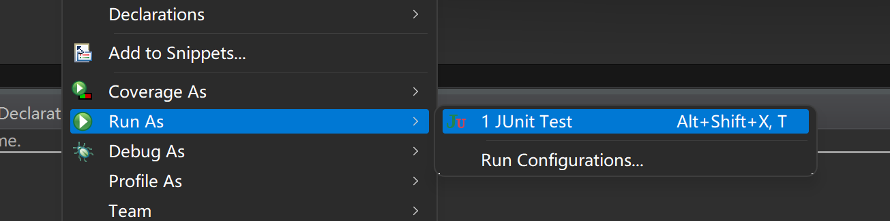

# 基础概念

**双稳态定律** 

**偶发复杂性** 

**TDD 测试驱动开发**

**BDD 行为驱动开发**

## 有效的测试

|注意|说明|
|:--|:--|
|切块分解测试||
|代码坏味道|隔离、独立|
|在测试类中不要依赖可测试的顺序|Junit并不保证按指定的顺序执行测试|
|不可靠的测试（无用)|try-catch-finally几乎不报错<br>伪随机数<br>时间API<br>异步逻辑|

## 自动化测试工具

|工具|说明|
|:--|:--|
|测试替身|stub、fake、spy、mock|
|测试框架|Junit|
|构建工具||

### 测试替身

#### 作用

1. 隔离被测代码
2. 加速执行测试
3. 使执行变得确定
4. 模拟特殊情况
5. 访问隐藏信息

#### 类型

|类型|特点|
|:--|:--|
|测试桩 stub|简短、硬编码|
|伪造对象 fake|对持久对象伪造|
|测试间谍 spy|获取情报信息|
|模拟对象 mock|特定情景下可配置行为对象|

##### spy

```java
/**
* 需要获取隐藏信息的目标类
*/
public class DLog implements DLogTarget{
	private final DLogTarget[] targets; //隐藏信息
	
	public DLog(DLogTarget... targets) {
		this.targets = targets;
	}
	
	@Override
	public void write(Level level,String message) {
		for(DLogTarget target : targets) {
			target.write(level, message);
		}
	}
}
/**
* 目标信息：由spy作为替身模拟测试
*/
public interface DLogTarget {
	void write(Level level,String message);
}
```

```java
public class DLogTest {

	@Test
	public void testEachWriteTarget(){
		//间谍潜入
		SpyDLogTarget spy1 = new SpyDLogTarget();
		SpyDLogTarget spy2 = new SpyDLogTarget();
		DLog log = new DLog(spy1,spy2);
		log.write(Level.INFO,"message");
		//间谍汇报
		assertTrue(spy1.recevied(Level.INFO, "message"));
		assertTrue(spy1.recevied(Level.INFO, "message"));
	}
	
	/**
	* 间谍替身 spy
	*/
	class SpyDLogTarget implements DLogTarget{
	    private List<String> log = new ArrayList<>();//获取write()的踪迹

		@Override
		public void write(Level level, String message) {
			log.add(concatenated(level,message));
		} 
		
		//问话
		public boolean recevied(Level level,String message) {
			return log.contains(concatenated(level,message));
		}
		
		public String concatenated(Level level,String message) {
			return level.getName() + ": " + message;
		}
	    
	}
}
```

##### mock

- JMock
- Mockito
- EasyMock

#### 选择

**stub用查询、mock用操作** 

# Junit

1. 创建一个java类，进行单元测试

- 此时的Java类要求：
  - 此类是public的
  - 此类提供公共的无参的构造器 

2. 此类中声明单元测试方法
   - 此时的单元测试方法：方法的权限是public，没有返回值，没有形参
3. 此单元测试方法上需要声明注释：`@Test`，并在单元测试类中导入: `import org.junit.Test`
4. 声明号单元测试方法以后，就可以在方法体内测试相关的代码
5. 写完代码以后：左键双击方法，右键 Run as - JUnit Test

```java
@Test
public void testMehod(){
    ...
}
```

  

- 一次只执行一个选中的单元测试方法

- 如果执行结果没有任何异常：

```java
package com.zjk2;

import java.util.Date;

import org.junit.Test;

public class JUnitTest {

    @Test
    public void testEquals() {
        String s1 = "EE";
        String s2 = "EE";
        System.out.println(s1.equals(s2));
    }
}  
```

- 如果执行结果出现异常:

```java
package com.zjk2;

import java.util.Date;

import org.junit.Test;

public class JUnitTest {

    @Test
    public void testEquals() {
        String s1 = "EE";
        String s2 = "EE";
        System.out.println(s1.equals(s2));
        
        Object obj = new String("GG");
        Date date = (Date)obj; //类型转换异常
    }
}
```
