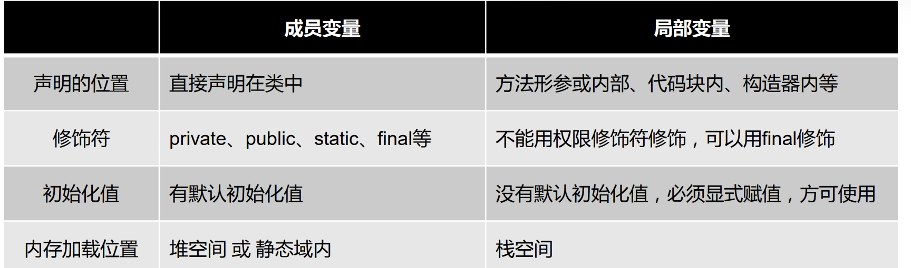
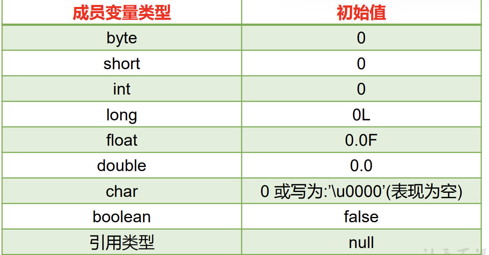
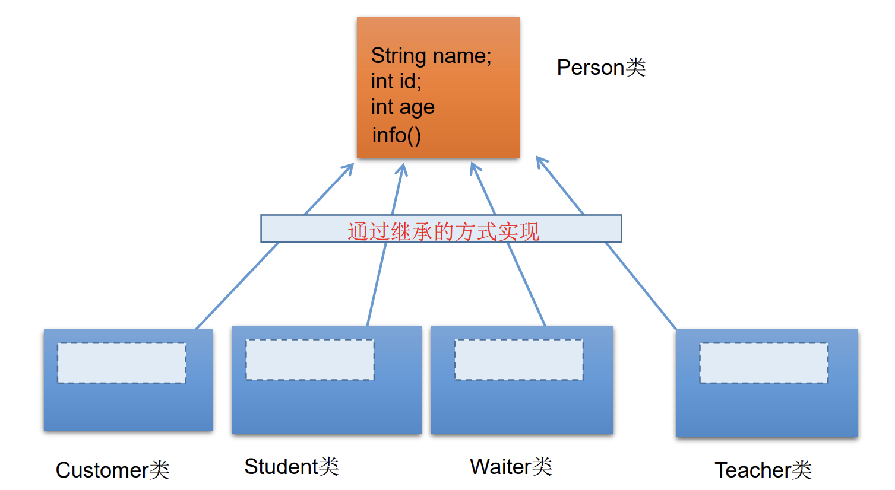
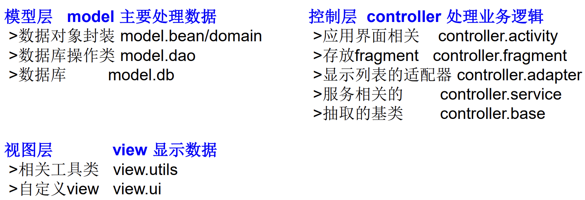

# OOP简介

## Java类结构

- 类：对一类事物的描述，是抽象的，概念上的定义。
- 对象（实例）：实际存在的该类事物的每个个体。
1. 面向对象程序设计的重点是类的设计。
2. 设计类，就是设计类的成员。

```java
public class Person{
    //属性（成员变量）
    private String name;
    private boolean isMarried;

    //代码块
    {

    }

    //构造器d
    public Person(){
        name = "Mac";
        isMarried = true;
    }

    public Person(String name, boolean isMarried){
        this.name = name;
        this.isMarried = isMarried;
    }

    //方法
    public void walk(){
        System.out.println("走路");
    }

    public String display(){
        return "名字：" + name;
    }

    //内部类
    class Pet{
        String name;
        double weight;
    }

} 
```

- 面向对象的三大特征：
  1. 封装性
  2. 继承性
  3. 多态性
  4. （抽象性）
- Java类及类的成员：属性，方法，构造器，代码块，内部类。 
- 关键字：this、super、static、final、abstract、interface、package、import、...  

## POP、OOP

| 面向       | 说明                           |
| -------- | ---------------------------- |
| 面向过程 POP | 强调的是功能行为，以函数为最小单位，考虑怎么做。     |
| 面向对象 OOP | 强调具备功能的对象，以类/对象为最小单位，考虑谁来做 。 |

## 类、对象的使用

1. 创建类，设计类的成员。

2. 创建类的对象。
- 调用对象的结构：`对象.属性、对象.方法`。

- 如果创建了一个类的多个对象，则每个对象都独立的拥有一套类的实例属性（非static的）。

```java
package StudyTest;

//  测试类
public class Test010 {
    public static void main(String args[]) {
//      创建Person类的对象 = 类的实例化 = 实例化类
        Person p1 = new Person();

//      调用对象的结构：属性，方法
//      调用属性：对象.属性
        p1.name = "Tom";
        p1.isMale = true;
        System.out.println(p1.name);

//      调用方法：对象.方法
        p1.eat();
        p1.sleep();
        p1.talk("Chinese");

        Person p2 = new Person();
        System.out.println(p2.name);
//      输出 null 默认初始化值
        System.out.println(p2.isMale);
//      输出 false 默认初始值

//      将p1变量保存的对象地址值赋给p3，导致p1和p3指向了维空间的同一个对象实体
//      因而改变p3的属性的同时也改变了p1的属性
        Person p3 = p1;
        System.out.println(p3.name); //Tom

        p3.age = 10;
        System.out.println(p1.age);  //10
    }
}

class Person{

//  属性
    String name;
    int age = 1;
    boolean isMale;

//  方法
    public void eat() {
        System.out.println("人可以吃饭");
    }

    public void sleep() {
        System.out.println("人可以睡觉");
    }

    public void talk(String language) {
        System.out.println("人可以说话,语言为: " + language);
    }
}
```

## 匿名对象

- 匿名对象：不定义对象的句柄（创建的变量没有显式的赋给一个变量名），而直接调用这个对象的方法，调用之后就等待垃圾回收。

```java
new Person().shout(); 
```

- 对一个对象只需要进行一次方法调用。
- 将匿名对象作为实参传递给一个方法调用。

## 属性

### 属性声明

- 修饰符 数据类型 属性名 = 初始化值 ;
- 修饰符：
  - 权限修饰符：private、缺省、protected、public。
  - 其他修饰符：static、final 等。

### 成员变量、局部变量

   

   

- 局部变量没有默认初始化值，形参在调用时赋值即可。
- 零值初始化：一个对象被创建时，会对其中各种类型的成员变量自动进行初始化赋值。

   

## 方法 method

### 方法声明

- 不能在方法的内部再次声明方法，或使用权限修饰符。

```java
权限修饰符 返回值类型 方法名(形参列表){
        方法体;    
}
```

```java
class Customer{
    String name;
    int age;
    boolean isMale;

    public void eat() {
        System.out.println("客户吃饭");
    }

    public void sleep(int hour) {
        System.out.println("休息了" + hour + "小时");
    }

    public String getName() {
        return name;
    }

    public String getNation(String nation) {
        String info = "我的国籍是：" + nation;
        return info;
    }

}
```

### 方法结构

#### return 返回值类型

- return：返回所需的值或void、并结束当前方法。

| 返回值  | 说明                                                                  |
| ---- | ------------------------------------------------------------------- |
| 有返回值 | 如果方法有返回值，则必须在方法声明时，指定返回值的类型。 <br />同时方法中需要使用return关键字来返回指定类型的变量或常量。 |
| 没返回值 | 方法声明时，使用void来表示 <br />不使用return 或 `return;`结束此方法。                   |

```java
public String getName() {
    if(age > 18) {
        return name;
    }
}
//报错，必须要有返回值，if可能没有返回值
```

```java
public void eat() {
    System.out.println("客户吃饭");
    return;  //表示结束
    //return后不可以声明表达式
    System.out.println("你好"); //无法到达 Unreachable code
}
```

#### 形参、可变形参

- Varargs(variable number of arguments)：允许直接定义能和多个实参相匹配的形参（个数可变）。

> - JDK 5.0以前：数组形参，传入多个同一类型变量
> 
> ```java
> public static void test(int a, String[] books){};
> ```
> 
> - JDK5.0：可变个数形参，传入多个同一类型变量
> 
> ```java
> public static void test(int a, String… books){};
> ```

1. 可变参数：方法参数部分指定类型的参数个数是可变多个：0个，1个或多个。
2. 可变个数形参的方法与本类中同名的方法之间，彼此构成重载。
3. 可变参数方法的使用与方法参数部分使用数组是一致的 不能构成重载，即不能共存。
4. 方法的参数部分有可变形参，需要放在形参声明的最后。
5. 在一个方法的形参位置，最多只能声明一个可变个数形参。

```java
public class Test026 {
    public static void main(String args[]) {
        Test026 test = new Test026();
        test.show(12);
        test.show();
        test.show("Hello");
        test.show("Hello","world");
    }

    public void show(int i) {

    }

    public void show(String i) {
        System.out.println(i + " show(String i)");
    }

//  可变形参
    public void show(String ... strs) {
//      输出的strs为地址值
        System.out.println(strs + " show(String .. strs)");

//      可变形参的输出和数组类似
        for(int i = 0; i < strs.length; i++) {
            System.out.println(strs[i]);
        }
    }   

//  编译器认为数组和可变形参的定义相同，不能构成重载
//  public void show(String[] strs) {
//      
//  }

//  可变形参必须放在形参位置的末尾
//  public void test(int ... i; i) {
//      
//  }
}
```

### 方法重载

- 重载：同一个类中，允许存在一个以上的同名方法，只要参数个数 或 参数类型不同即可。
- 与返回值类型无关，而参数列表必须不同。调用时，根据方法参数列表的不同来区别。

```java
public class Test023 {
    public static void main(String args[]) {
        Test023 test = new Test023();
        test.getSum(2,3);
    }

    public void getSum(int i, int j) {
        System.out.println(i + j + "  1 ");
    }

//  重载与返回类型/形参变量名/方法体无关
//  public int getSum(int m, int n) {
//      System.out.println(i + j);
//  }

    public void getSum(double i, double j) {
        System.out.println(i + j + "  2 ");
    }

    public void getSum(String i, int j) {
        System.out.println(i + j + "  3 ");
    }

    public void getSum(int i, String j) {
        System.out.println(i + j + "  4 ");
    }
}
```

## 值传递

- 值传递：将实参的值传入方法内，而参数本身不受影响。

> Java里方法的参数传递方式只有值传递。 

| 数据类型             | 赋值  | 说明                                                                                          |
| ---------------- | --- | ------------------------------------------------------------------------------------------- |
| 基本数据类型           | 数据值 | 内容的改变对实参没有任何影响。                                                                             |
| 引用数据类型（包括String） | 地址值 | 对象的内容可以在方法中改变，对象的引用不会改变。 <br />String不可变：其内容不会改变。<br />String的内容存储在StringTable内，其引用是根据其内容的。 |

| 参数类型 | 说明              |
| ---- | --------------- |
| 形参   | 方法声明时的参数        |
| 实参   | 方法调用时实际传给形参的参数值 |

```java
public class Test027 {
    public static void main(String args[]) {

        int m = 10;
        int n = 20;
        System.out.println("m=" + m + "," + "n=" + n);
//      交换两个变量的值的操作
//      int temp = m;
//      m = n;
//      n = temp;
//      System.out.println("m=" + m + "," + "n=" + n);

//      实参的值未发生交换
//      仅形参发生交换，未改变实参
//      形参是基本数据类型：将实参基本数据类型变量的“数据值”传递给形参
        Test027 test = new Test027();
        test.swap(m,n);
        System.out.println("m=" + m + "," + "n=" + n);
    }

    public void swap(int i, int j) {
        int temp = i;
        i = j;
        j= temp;
    }
}
```

```java
public class Test029 {
    public static void main(String args[]) {
        Data data = new Data();

        data.m = 10;
        data.n = 20;

        System.out.println("m=" + data.m + " , n=" + data.n);

//      交换m和n的值
//      int temp = data.m;
//      data.m = data.n;
//      data.n = temp;

        Test029 test = new Test029();
        test.swap(data);
        System.out.println("m=" + data.m + " , n=" + data.n);
    }

//  形参是引用数据类型：将实参引用数据类型变量的“地址值”传递给形参
    public void swap(Data data) {
        int temp = data.m;
        data.m = data.n;
        data.n = temp;
    }
}

class Data{
    int m;
    int n;
}
```

```java
public class Test028 {
    public static void main(String args[]) {
        int[] arr = new int[] {1,2,3,4,2,3};

        for(int i = 0; i < arr.length; i++) {
            System.out.print(arr[i]);
        }
        System.out.println();

        Test028 test = new Test028();
//      错误.实际上并未改变实参，arr[i]传递的仍然只是数据值
        test.swap(arr[1],arr[0]);

        for(int i = 0; i < arr.length; i++) {
            System.out.print(arr[i]);
        }
        System.out.println();

//      正确的，交换数组中指定俩个位置元素的值
        test.swap(arr, 1,0);

        for(int i = 0; i < arr.length; i++) {
            System.out.print(arr[i]);
        }
        System.out.println();
    }

//  错误.实际上并未改变实参，arr[i]传递的仍然只是数据值   
    public void swap(int i , int j) {
        int temp = i;
        i = j;
        j = temp;
    }

//  正确的，交换数组中指定俩个位置元素的值
    public void swap(int[] arr, int i,int j) {
        int temp = arr[i];
        arr[i] = arr[j];
        arr[j] = temp;
    }
}
```

```java
public class Test30 {
    public static void main(String args[]) {
        Test30 test = new Test30();
        test.first();
    }

    public void first() {
        int i = 5;

        Value v = new Value(); //设为0x5566
        v.i = 25;

        second(v, i);  //15 0
        //second()方法结束
        //0x8899地址值被丢弃
        //v 指向地址值0x5566 v.i ==20

        System.out.println(v.i);  //20
    }

    public void second(Value v, int i) {
        i = 0;  //实参i==5 形参i==0
        v.i = 20; //地址值0x5566的实参v.i==20

        Value val = new Value();
        v = val; 
        //此时v的地址值0x5566变为val的地址值0x8899
        //v.i 指向 val.i == 15

        System.out.println(v.i + " " + i);
        // v.i == 15 ; 形参i == 0 ;但是实参i仍然为i == 5 
    }
}
class Value {
    int i = 15;
}

输出
15 0
20
```

### String不可变性

```java
public class Test043 {
    public static void main(String args[]) {
        String s1 = "hello";

        Test043 test = new Test043();

        test.change(s1);

        System.out.println(s1); //hello
    }

    public void change(String s) {
        s = "hi";
        //虽然传入s1地址值，但s新建指向hi，s1仍然指向hello
    }
}
```

### 值传递机制

```
public class Test031 {
    public static void main(String args[]) {
        int a = 10;
        int b = 10;
        method(a,b);
//      需要在method方法被调用之后，仅打印出a=100,b=200,请携程method方法的代码
        System.out.println("a=" + a);
        System.out.println("b=" + b);
    }

//  代码编写处
}
```

1. System.exit(status)

> | System                  | 说明                                                                             |
> | ----------------------- | ------------------------------------------------------------------------------ |
> | System.exit(int status) | 结束当前正在运行中的JVM，退出程序<br />System.exit(0)：正常退出程序<br />System.exit(1)：非0表示非正常退出程序。 |
> 
> - return：回到上一层。
> - System.exit(status)：回到最上层。

```java
public static void method(int a, int b) {
    a = a * 10;
    b = b * 20;
    System.out.println("a=" + a);
    System.out.println("b=" + b);
    System.exit(0); //终止JVM的执行，程序退出
    //使之后的语句无法执行
}
```

2.PrintStream 打印流

```java
public static void method(int a,int b) {
    PrintStream ps = new PrintStream(System.out) {
        @Override
        public void println(String x) {

            if("a=10".equals(x)) {
                x = "a=100";
            }
            else if("b=10".equals(x)) {
                x = "b=200";
            }
            super.println(x);
        }
    };

    System.setOut(ps);
}
```

### char[] 打印String

- char[]：打印字符串，PrintStream中重写了相关的println()。
- 其他引用数据类型：打印地址值，没有重写相关的println()、toString()。

```java
public class Test035 {
    public static void main(String args[]) {
        int[] arr = new int[] {1,2,3};
        System.out.println(arr); //地址值
//      void java.io.PrintStream.println(Object x)

        char[] arr1 = new char[] {'a','b','c'};
        System.out.println(arr1); //abc
//      void java.io.PrintStream.println(char[] x)
    }
}
```

# OOP特征

## 封装、隐藏

### 封装性

- 高内聚低耦合：
  
  - 高内聚 ：类的内部数据操作细节自己完成，不允许外部干涉。
  - 低耦合 ：仅对外暴露少量的方法用于使用。

- 封装性：隐藏对象内部的复杂性，只对外公开简单的接口。便于外界调用，从而提高系统的可扩展性、可维护性。
  
  - 属性是封装的最小单位。

- 通常将成员声明为私有的，再提供公共的方法：getXxx()、setXxx()：
1. 隐藏一个类中不需要对外提供的实现细节。
2. 使用者只能通过事先定制好的方法来访问数据，可以方便地加入控制逻辑，限制对属性的不合理操作。
3. 便于修改，增强代码的可维护性。

### 访问权限修饰符

- Java权限修饰符public、protected、(缺省)、private置于类的成员定义前，用来限定对象对该类成员的访问权限。

**权限修饰符的使用**

- 修饰类的内部结构：属性，方法，构造器，内部类

 

- 对于class的权限修饰只可以用public和default(缺省)。
  - public类可以在任意地方被访问。
  - default类只可以被同一个包内部的类访问。     

## 继承性

### 继承 extend

    

   

| 关系         | 说明                       |
| ---------- | ------------------------ |
| 父类（基类）（超类） | 将多个类中相同的属性和方法抽象出来形成的一般类。 |
| 子类（派生类）    | 继承了父类，具有特殊的属性和方法。        |

```java
class Subclass extends SuperClass{ }  
```

- 子类继承父类的方法和属性：获取了直接父类和所有间接父类中声明的属性和方法。
1. 减少了代码冗余，提高了代码的复用性。

2. 类与类之间产生关系，提供了多态的前提。
- Java的类只支持单继承和多层继承，不允许多重继承：一个子类只能有一个父类，一个父类可以派生出多个子类。

> 接口允许多重继承。  

- 继承不改变类成员的访问权限 ：如果父类的成员是公有的、被保护的或默认的，子类仍具有相应的这些特性，并且子类不能获得父类的构造方法。
  - 封装性：子类不能直接访问父类中私有的(private)的成员变量和方法 。
- final修饰的类表示终止，不能被继承。

### 方法重写

- 方法重写（方法的重置、覆盖）：在程序执行时，子类的方法将覆盖父类的方法。
1. 子类重写的方法必须和父类被重写的方法具有相同的方法名称、参数列表。
2. 子类重写的方法的返回值类型不能大于父类被重写的方法的返回值类型。
   - 父类被重写的方法的返回值是void，则子类重写的方法的返回值类型只能是void
   - 父类被重写的方法的返回值是A类型，则子类重写的方法的返回值类型可以是A类或A类的子类
   - 父类被重写的方法的返回值是基本数据类型，则子类重写的方法的返回值类型必须是相同的基本数据类型(父类double则子类只能是double)。
3. 子类重写的方法使用的访问权限不能小于父类被重写的方法的访问权限。
   - 子类不能重写父类中声明为private权限的方法。
4. 子类重写的方法抛出的异常不能大于父类被重写方法抛出的异常。

> static：静态方法是属于类的，不能被重写。

> 重载：允许存在多个同名方法，而这些方法的参数不同。编译器根据方法不同的参数表，对同名方法的名称做修饰。对于编译器而言，这些同名方法就成了不同的方法。它们的调用地址在编译期就绑定了。
> 
> - Java的重载是可以包括父类和子类的，即子类可以重载父类的同名不同参数的方法。

| 绑定        | 说明                                    |
| --------- | ------------------------------------- |
| 早绑定（静态绑定） | 对于重载而言，在方法调用之前，编译器就已经确定了所要调用的方法。      |
| 晚绑定（动态绑定） | 对于多态，只有等到方法调用的那一刻，解释运行器才会确定所要调用的具体方法。 |

### this 当前对象

| this位置 | 说明           |
| ------ | ------------ |
| 方法内部   | 该方法所属对象的引用   |
| 构造器内部  | 该构造器正在初始化的对象 |

- this可以调用类的属性、方法和构造器。
1. 需要用到调用该方法的对象时：在任意方法或构造器内，如果使用当前类的成员变量、成员方法可以在其前面添加this，增强程序的阅读性。通常省略this。
2. 区分属性和局部变量：当形参与成员变量同名时，如果在方法内或构造器内需要使用成员变量，必须添加this来表明该变量是类的成员变量。
3. 使用this访问属性和方法时，如果在本类中未找到，会从父类中查找。
4. this可以作为一个类中构造器相互调用的特殊格式。

### super

- super：调用父类中的指定操作、表明调用的是父类中的成员，追溯不仅限于直接父类。

| 使用          | 说明                             |
|:----------- |:------------------------------ |
| super.属性    | 访问父类中定义的属性                     |
| supere.方法   | 调用父类中定义的成员方法<br>在子类中调用父类被重写的方法 |
| super(形参列表) | 在子类构造器中调用父类的构造器                |

- this代表本类对象的引用，super代表父类的内存空间的标识：

| 比较    | this                          | super                |
| ----- | ----------------------------- | -------------------- |
| 访问属性  | 访问本类中的属性，如果本类中没有该属性，则从父类中继续查找 | 直接访问父类中的属性           |
| 调用方法  | 访问本类中的方法，如果本类中没有该方法，则从父类中继续查找 | 直接访问父类中的方法           |
| 调用构造器 | 调用本类构造器，必须放在本类构造器的首行          | 调用父类构造器，必须放在子类构造器的首行 |

- 子类中所有的构造器默认都会访问父类中空参数的构造器：子类至少有一个构造器调用了父类的构造器 super(形参列表)。

- 如果子类构造器没有在首行显式调用父类或本类的构造器，且父类中又没有无参的构造器，则编译出错：
  
  - 父类中没有空参数的构造器时，子类必须通过this(参数列表) 或 super(参数列表)在构造器的首行指定调用本类/父类中相应的构造器，且只能选择其中一种构造器。

- 从过程上来看，当通过子类的构造器创建子类对象时，一定会直接/间接的调用其父类的构造器，继而调用其父类的父类的构造器，直到调用了java.lang.Obeject类中空参的构造器为止。
  
  - 正因为加载过所有父类的结构，所以才可以看到内存中有父类中的结构，子类对象才可以考虑进行调用。虽然创建子类对象时，调用了父类的构造器，但就只创建了一个对象，即为new的子类对象。

- 无论哪个构造器创建子类对象，必须保证先初始化父类：子类继承父类中所有的属性和方法，因此子类有必要知道父类如何为对象进行初始化。

      

## 多态性

### 对象的多态性

- 对象的多态性：编译时类型和运行时类型不一致，父类的引用指向子类的对象。
  
  - 类的继承关系、方法重写：若子类重写了父类方法，则系统不可以把父类被重写的方法转移到子类中，故编译时是父类方法，而运行时是子类重写的方法。

- 对象的多态性不适用于属性：属性的编译和运行都由引用决定。
  
  - 父类的属性不会被子类中相同的属性覆盖：编译和运行时都是根据引用的属性，而不是实例的属性。

- 有了对象的多态性以后，内存中实际加载了子类特有的属性和方法，但是由于变量声明为父类类型，导致编译时，只能调用父类中声明的属性和方法，子类特有成员不能被调用。

| 类型    | 说明                                         |
| ----- | ------------------------------------------ |
| 编译时类型 | 由声明该变量时使用的类型（引用）决定<br />编译期，只能调用父类中声明的方法   |
| 运行时类型 | 由实际赋给该变量的对象（实例）决定<br />运行期，实际执行的是子类重写父类的方法 |

```java
Person p = new Student(); 
p.getSchool(); //非法：Person类没有getSchool()成员
```

### 虚拟方法调用

- 虚拟方法：子类重写了父类的方法，则在对象的多态中，引用（父类）的方法被称为虚拟方法。
- 动态绑定：父类根据赋给它的不同子类对象，动态调用属于子类的该方法，在运行时才确定方法的调用。

```java
Person p = new Student();
p.getInfo(); //Student重写了Person的getInfo()、且引用指向的是Student
//实际调用的是Student的getInfo()，而Person的getInfo()就是虚拟方法
```

### instanceof操作符

- x instanceof A：检验x是否为类A的对象，如果类A是x对象所属类的父类/祖先，则返回true。

### 对象类型转换

- 造型：引用数据类型的强制转换，无继承关系的引用类型间的转换是非法的。

   

```java
Person p = new Student(); //向上转型
Stundent s = (Stundent) new Person(); //向下转型
```

# 构造器 new

## 概述

- Java语言中，每个类都至少有一个构造器，一个类可以创建多个重载的构造器。构造器具有与类相同的名称。
  - 构造器：创建对象；给对象进行初始化。
1. 构造器不是类的方法。
2. 构造器不能有return语句返回值，不声明返回值类型。（与声明为void不同）。
3. 构造器不能被static、final、synchronized、abstract、native修饰。
4. 父类的构造器不可被子类继承。

```
修饰符 类名 (参数列表) {
    初始化语句；
} 
```

| 构造器                 | 说明                                                       |
| ------------------- | -------------------------------------------------------- |
| 隐式无参构造器（系统默认提供）     | 果没有显式的定义类的构造器的话，则系统默认提供一个空参的构造器<br />默认构造器的修饰符与所属类的修饰符一致 |
| 显式定义一个或多个构造器（无参、有参） | 一旦显式定义了构造器，则系统不再提供默认构造器（空参），此时空参构造器需要自己构造                |

```java
class Person{
    String name;
    int age;

    public Person() {
    }

    public Person(String n,int a) {
        name = n;
        age = a;
    }
}
```

## 构造器重载

- 构造器重载：参数列表必须不同。使得对象的创建更加灵活，方便创建各种不同的对象。

```java
public class Person{
    public Person(String name, int age, Date d) {
        this(name,age);
        …
    }
    public Person(String name, int age) {…}
    public Person(String name, Date d) {…}
    public Person(){…}
}
```

## 声明、引用

- Person p; 只是对Person类的引用，而不是Person类的实例。

**注意：**

- 可以在类的构造器中使用"this(形参列表)"的方式，调用本类中重载的其他的构造器，但不能通过"this(形参列表)"的方式调用自身构造器

- 如果一个类中声明了n个构造器，则最多有 n - 1个构造器中使用了"this(形参列表)"

- "this(形参列表)"必须声明在类的构造器的首行！

- 在类的一个构造器中，最多只能声明一个"this(形参列表)"

```java
public class PersonTest {
    public static void main(String args[]) {
        Person p1 = new Person();

        p1.setAge(1);
        System.out.println(p1.getAge());
        p1.eat();

        Person p2 = new Person("Jerry",20);
    }
}

class Person{
    private String name;
    private int age;

    public Person() {
//      this() //构造器中不能通过"this(形参列表)"的方式调用自身构造器     

//      this(age) //与Person(int age)[有this()]形成一个死循环
//Cannot refer to an instance field age while explicitly invoking a constructor
        eat();

        String info = "hello----------";
        System.out.println(info);
    }

    public Person(String name) {
        this();  //调用Person()
        this.name = name;
    }

    public Person(int age) {
        this();
        this.age = age;
    }

    public Person(String name, int age) {
//      this()  //在类的一个构造器中，最多只能声明一个"this(形参列表)"
        this(age);
        this.name = name;
        this.age = age;
    }

    public void setName(String name) {
        this.name = name;
    }

    public String getName() {
        return name;
    }

    public void setAge(int age) {
        this.age = age;
    }

    public int getAge() {
        return age;
    }
}
```

# 代码块（初始化块）

- 代码块：对Java类或对象进行初始化。
- 代码块有且只能使用static修饰（静态代码块）：用于初始化static的属性。

| 静态代码块                                                                                                                                                                      | 非静态代码块                                                                                                                                                                |
| -------------------------------------------------------------------------------------------------------------------------------------------------------------------------- | --------------------------------------------------------------------------------------------------------------------------------------------------------------------- |
| 1. 可以有输出语句。 <br />2. 可以对类的属性、类的声明进行初始化操作。 <br />3. 不可以对非静态的属性初始化。即：不可以调用非静态的属性和方法。 <br />4. 若有多个静态的代码块，那么按照从上到下的顺序依次执行。 静态代码块的执行要先于非静态代码块。 <br />5. 静态代码块随着类的加载而加载，且只执行一次。 | 1. 可以有输出语句。 <br />2. 可以在创建对象时，对类（对象）的属性、类（对象）的声明进行初始化操作。 <br />3. 除了调用非静态的结构外，还可以调用静态的变量或方法。 <br />4. 若有多个非静态的代码块，那么按照从上到下的顺序依次执行。<br />5. 每次创建对象的时候，都会执行一次。且先于构造器执行。 |

```java
class Person {
    public static int total;

    static {
        total = 100;//为total赋初值
    }
    …… //其它属性或方法声明
}
```

   

# package 包

## package 定义包

- Java中包是相关类与接口的一个集合，它提供了类的命名空间的管理和访问保护。
  
  - 以包为单位的独立命名空间，位于不同包中的类即使同名也不会冲突，解决了命名冲突的问题。 
  
  - 包具有特定的访问控制权限，同一个包中的类之间拥有特定的访问权限（缺省）。

- Java编译器把包对应于文件系统的目录和文件管理，还可以使用ZIP或JAR压缩文件的形式保存。
- 包对应于文件系统的目录（路径），package语句中，用 “.” 来指明包(目录)的层次；通常用小写单词标识。通常使用所在公司域名的倒置：com.atguigu.xxx。

> MVC：
> 
> 

| 常见包       | 说明                                                                  |
| --------- | ------------------------------------------------------------------- |
| java.lang | Java语言的核心类，如String、Math、Integer、 System和Thread，提供常用功能               |
| java.net  | 执行与网络相关的操作的类和接口                                                     |
| java.io   | 能提供多种输入/输出功能的类                                                      |
| java.util | 一些实用工具类，如定义系统特性、接口的集合框架类、使用与日期日历相关的函数。                              |
| java.text | 一些java格式化相关的类                                                       |
| java.sql  | JDBC数据库编程的相关类/接口                                                    |
| java.awt  | 构成抽象窗口工具集（abstract window toolkits）的多个类，这些类被用来构建和管理应用程序的图形用户界面(GUI) |

- package：指定一个源文件中的类属于一个特定的包。

```java
package pkg1[.pkg2[.pkg3...]];
```

```java
package graphics;
//Circle类成为graphics包中的一个public成员，并存放在classPath\graphics目录中。
public class Circle extends Graphic implements Draggable{
    ...
}
```

- package语句在每个Java源程序中只能有一条。且必须在程序的第一行，该行前可以有空格或注释行。一个类只能属于一个包。

- 如果源文件中没有package语句，则指定为无名包。无名包没有路径，一般情况下，会把源文件中的类存储在当前目录（即存放Java源文件的目录）下。

- 包中的成员是指包中的类和接口：只有public类型的成员才能被包外的类访问，
  
  - 写引入包成员/整个包，之后使用短名(short name,类名或接口名)引用包成员。

## import 引入包成员

- 为使用定义在不同包中的Java类，需用import语句来引入指定包层次下所需要的类/全部类`(.*)`：import语句告诉编译器到哪里去寻找类。

```java
import 包名. 类名;
```

```
import [static] pkgl[.pkg2[.pkg3.].(classname|*)；
//pkgl[.pkg2[.pkg3…]表明包的层次，与package语句相同，它对应于文件目录，classname则指明所要引入的类。
```

1. 在源文件中使用import显式的导入指定包下的类或接口。

2. import语句必须在源程序所有类声明之前，在package语句之后。

3. 导入多个类或接口：并列显式多个import语句。

4. 从一个包中引人所有类：通配符(`*`)(`java.util.*`)，一次性导入util包下所有的类或接口。

5. java.lang包：如果导入的类/接口是该包的，或者是当前包下的，则可以省略此import语句。

6. 不同包下的同名的类：需要使用类的全限定名指明调用的是哪个类。
   
   - java.util.Date、java.sql.Date。

7. 已经导入的包，如果需要使用其子包的成员，则还需要导入该子包。

8. import static：调用指定类或接口下的静态的属性或方法。
- java包程序的一般结构如下：

```
[package语句] //默认是package.;(属于当前目录)
[import语句] //默认是import java.lang.*;
[类声明]
```

# static 静态成员

- 静态成员：在Java类中，可用static修饰属性、方法、代码块、内部类。
1. 随着类的加载而加载。
2. 优先于对象存在。
3. 修饰的成员，被该类的所有对象所共享。
4. 访问权限允许时，可不创建对象，直接被类调用。

## 类变量（静态变量）

| 实例变量                                   | 静态变量（静态属性）（类变量）                        |
| -------------------------------------- | -------------------------------------- |
| 创建了类的多个对象，每个对象都独立的拥有一套类中的非静态属性，归某个对象所有 | 创建了类的多个对象，多个对象共享同一个静态变量                |
| 当修改其中一个对象中的非静态属性时，不会导致其他对象中同样的属性值的修改   | 当通过某一个对象修改静态变量时，会导致其他对象调用此静态变量时，是修改过的值 |

- 静态变量随着类的加载而加载 ，优先于对象存在：通过`类.静态变量`的方法进行调用 ，而实例变量不可以。
- 由于类只加载一次，则静态变量在内存中也只会存在一份，存在方法区的静态域中。

## 类方法（静态方法）

1. 随着类的加载而加载，可以通过`类.静态方法`的方式进行调用，

2. 静态方法中只能调用静态的方法或属性。非静态方法中既可以调用静态的也可以调用非静态的方法或属性.(生命周期)。
- 静态方法内不能使用this或super关键字、不能被重写。

# final 终结

- final修饰：类、变量、方法。
1. final标记的类不能被继承。提高安全性，提高程序的可读性。

> String、System、StringBuffer。

2. final标记的方法不能被子类重写。
3. 常量：final标记的变量（成员变量、局部变量），名称大写，且只能被赋值一次。
   - final标记的成员变量必须在声明时或在每个构造器中或代码块中显式赋值，然后才能使用。
- 修饰局部变量（常量形参）：final修饰形参，当调用此方法时，给常量形参赋一个实参，一旦赋值以后，就只能在方法中使用此形参，但不能进行重新赋值。
- 全局常量：static final  修饰属性 ： 

```java
public class FinalTest{

    //final int WIDTH; //报错：final不适用于默认初始化,必须显式初始化

    public final void show(final int NUM) {

    }

    final int RIGHT;

    public FinalTest() {
        //如果在构造器中为final赋值，则每个构造器中都应该要为final赋值。
        RIGHT = 2;
    }
}
```

```java
public class Something {
    public int addOne(final int x) {
        return ++x;  //编译出错。X的值不能改变
     // return x + 1; //编译通过
    }
}
```

```java
public class Something {
    public static void main(String[] args) {
        Other o = new Other();
        new Something().addOne(o);
    }

    public void addOne(final Other o) {
     // o = new Other(); //o的地址值不能改变
        o.i++; //但是o的地址值中的内容可以改变 
    }
}

class Other {
    public int i;
}
```

# abstract 抽象

## 抽象类、抽象方法

- 抽象类：abstract修饰的类。
  
  - 抽象类不能被实例化。抽象类是用来被继承的，抽象类可以使用多态。
    - new  抽象类()；是非法的。
  - 抽象类中一定有构造器，便于子类实例化时调用。（涉及子类对象实例化的全过程）
    - 提供抽象类的子类，让子类对象实例化，完成相关操作。

- 抽象方法：abstract修饰方法
  
  - 抽象方法只有方法的声明，没有方法的实现，以分号结束，没有代码块{}。
  - 含有抽象方法的类必须被声明为抽象类，而抽象类中不一定拥有抽象方法，可以有普通的方法。
  - 抽象类的子类必须重写父类以及祖先的抽象方法，并提供方法体，才可以进行实例化。
    - 若没有重写全部的抽象方法，仍为抽象类，使用abstract修饰，不能进行实例化。
1. 不能用abstract修饰变量、代码块、构造器；

2. 不能用abstract修饰私有方法private、静态方法static、final方法、final类。
   
   - 父类中private的结构对子类不可见，不是重写。
   
   - static修饰的方法不能被重写。
   
   - final修饰的方法不能重写 。
   
   - final修饰的类不能被继承。

```java
package com.zjk;

public class AbstractTest {
    public static void main(String[] args) {

//      Person p1 = new Person();
//      abstract修饰的类，抽象类不可实例化

//      Person.name;
//      就算给抽象类的属性static修饰，也不能直接通过类.属性的方式调用
    }
}

abstract class Creature{
    public abstract void breath();
}

abstract class Person extends Creature {
    String name;
    //static String name;
    int age;

    public Person() {

    }

    public Person(String name, int age) {
        this.name = name;
        this.age = age;
    }

//  不是抽象方法
//  public void eat() {
//      
//  }

//  抽象方法
    public abstract void eat();

//  若类是抽象类则无需重写继承自抽象父类的抽象方法

    public void walk() {
        System.out.println("walk");
    }
}

class Student extends Person {

    public Student(String name,int age) {
        super(name,age);
    }

    @Override
    public void eat() {
        System.out.println("eat more");
    }

//  Person类中还有继承自Creature类的抽象方法breath()，需要重写
    @Override
    public void breath() {
        System.out.println("breath");
    }
}
```

## 抽象类的匿名子类

```java
public class PersonTest {

    public static void main(String[] args) {
        method(new Student());// 匿名对象

        Worker worker = new Worker();
        method1(worker); // 非匿名的类，非匿名的对象

        method1(new Worker()); // 非匿名的类，匿名的对象

        System.out.println();

//      抽象类的匿名子类
//      相当于创建了匿名子类的对象p
        Person p = new Person() {

            @Override
            public void eat() {
                // TODO Auto-generated method stub
                System.out.println("eat food");
            }

            @Override
            public void breath() {
                // TODO Auto-generated method stub
                System.out.println("breath too");
            }

        };

        method1(p); // 此时调用的是匿名子类的对象

        System.out.println();

//      创建匿名子类的匿名对象
        method1(new Person() {
            @Override
            public void eat() {
                // TODO Auto-generated method stub
                System.out.println("eat food 2");
            }

            @Override
            public void breath() {
                // TODO Auto-generated method stub
                System.out.println("breath too 2");
            }
        });
    }

    public static void method1(Person p) {
        p.eat();
        p.walk();
    }

    public static void method(Student s) {

    }
}

class Worker extends Person {
    @Override
    public void eat() {
        // TODO Auto-generated method stub

    }

    @Override
    public void breath() {
        // TODO Auto-generated method stub

    }
}
```

# interface 接口

## 概述

- 接口（interface）：规范、定义的是一组规则，体现了现实世界中“如果你是/要...则必须能...”的思想。
  
  - 继承是一个"是不是"的关系，而接口实现则是 "能不能"的关系。
  - 接口的本质是契约、标准、规范。

- 接口和类是并列关系，或者可以理解为一种特殊的类。

- 接口（interface）：抽象方法和常量值定义的集合。

- 接口中没有构造器。不能实例化：
  
  - 接口的主要用途就是被实现类实现。（面向接口编程）
  - 实现接口的类中必须提供接口中所有方法的具体实现内容（重写接口中的所有抽象方法），方可实例化。否则，仍为抽象类。

- 接口采用多继承机制：一个类可以实现(implements)多个接口，接口也可以继承(extends)其它接口（接口可以多继承）。

```java
interface 接口1 extends 接口2,接口3{ //不是implements
   ...
}
```

```java
class SubClass extends SuperClass implements InterfaceA{ 
   ...
}
```

## 成员

| 接口成员      | 修饰                  | 方法体 |
| --------- | ------------------- | --- |
| 全局常量 （默认） | public static final |     |
| 抽象方法 （默认） | public abstract     | 无   |
| 静态方法      | static              | 有   |
| 默认方法      | deafult             | 有   |

- 默认方法：只能通过实现类对象来调用，如果实现类重写了接口中的默认方法，则调用重写后的方法

> - JDK7以之前：只能定义全局常量和抽象方法。
> - JDK8：除了定义JDK7之前的，还可以定义：静态方法pulic static、默认方法。

```java
interface Flyable {
    //全局常量
    public static final int MAX_SPEED = 7900;
    //默认 public static final
    int MIN_SPEED = 1; // 

    //抽象方法
    public abstract void fly();
    //默认 public abstract
    void stop();
}

interface Attackable {
    void attack();
}

class Plane implements Flyable {

    @Override
    public void fly() {}

    @Override
    public void stop() {}
}

//实现接口的类必须覆盖接口的所有方法，否则仍然为抽象类
abstract class Kite implements Flyable {}
```

- 接口冲突：若一个接口中定义了一个默认方法，而另一个接口中也定义了一个同名同参数的方法（与是否是默认方法无关），在实现类同时实现了这两个接口时。实现类必须重写接口中同名同参数的方法，来解决冲突。
- 类优先原则：若一个接口中定义了一个默认方法，而父类中也定义了一个同名同参数的非抽象方法，则不会出现冲突问题。子类在没有重写此方法的情况下，默认调用父类同名同参的方法，接口中具有相同名称和参数的默认方法会被忽略。

| 继承/实现 | 调用父类/接口方法     |
| ----- | ------------- |
| 父类    | super.方法()    |
| 接口    | 接口.super.方法() |

## 接口、抽象类

   

# 内部类

- 内部类：一个事物的内部，还有一个部分需要一个完整的结构进行描述，而这个内部的完整的结构又只为外部事物提供服务。

- 内部类、外部类：在Java中，允许一个类的定义位于另一个类的内部，前者称为内部类，后者称为外部类。
  
  - 允许一个类A声明在另一个类B中，则类A是内部类，类B是外部类。

- 内部类一般用在定义它的类或语句块之内，在外部引用它时必须给出完整的名称。

- 内部类的名字不能与包含它的外部类类名相同。

| 内部类   | 成员内部类和局部内部类，在编译以后，都会生成字节码文件 | 组成                            |
| ----- | --------------------------- | ----------------------------- |
| 成员内部类 | `外部类$内部类名.class`            | static成员内部类<br />非static成员内部类 |
| 局部内部类 | `外部类$数字 内部类名.class `        | 方法内，代码块内，构造器内<br />匿名内部类      |

## 成员内部类

- 成员内部类作为外部类的成员：
  
  - 权限修饰：private、protected、缺省、public。
  
  - 可以调用外部类的结构。
  
  - 可以被static修饰，则不能再使用外层类的非static的成员变量。

- 成员内部类作为一个类：
  
  - 可以在内部定义属性、方法、构造器等结构。
  
  - 可以被abstract修饰。
  
  - 可以被final修饰,表示此类不能被继承；没有被final修饰则可以被继承。
  
  - 编译生成OuterClass$InnerClass.class字节码文件（也适用于局部内部类）。

> 1. 如何实例化成员内部类的对象？
> 2. 如何在成员内部类中区分调用外部类的结构？
> 3. 开发中局部内部类的使用？

1. 非static的成员内部类中的成员不能声明为static的，只有在外部类或static的成员内部类中才可声明static成员。
2. 外部类访问成员内部类的成员：需要“内部类.成员”、“内部类对象.成员”的方式。
3. 成员内部类可以直接使用外部类的所有成员，包括私有的数据。

```java
package com.zjk;

public class InnerClassTest {
    public static void main(String[] args) {

//      创建Dog实例（静态的成员内部类）
        Person.Dog dog = new Person.Dog();
        dog.show();
//      创建Bird实例（非静态的成员内部类）
        Person p = new Person();
        Person.Bird bird = p.new Bird();
        bird.sing();
        bird.display("夜莺");
    }
}

class Person {
    String name = "小米";
    int age;

    public void eat() {
        System.out.println("eat-Person");
    }

//  成员内部类(静态)
//  abstract static class Dog {
    static class Dog {
        String name;
        int age;

        public void show() {
            System.out.println("Dog");
//          eat(); 
//          静态成员内部类不能调用外部类中非静态的结构
        }
    }

//  成员内部类(非静态)
    class Bird {
        String name = "鸟";

        public Bird() {

        }

        public void sing() {
            System.out.println("Bird-sing");
            eat();
//          即Person.this.eat();
//          调用外部类的非静态结构
        }

        public void display(String name) {
            System.out.println(name); // 方法的形参
            System.out.println(this.name); // 内部类的属性
            System.out.println(Person.this.name); // 外部类的属性
        }
    }
}
```

## 局部内部类

- 局部内部类：只能在声明它的方法或代码块中使用，而且是先声明后使用，除此之外的任何地方都不能使用该类。但是它的对象可以通过外部方法的返回值返回使用，返回值类型只能是局部内部类的父类或父接口类型。

```java
class 外部类{
    方法(){
        class 局部内部类{}
    }
    {
        class 局部内部类{}
    }
}
```

- 内部类仍然是一个独立的类，在编译之后内部类会被编译成独立的.class文件：`外部类$数字 内部类名.class `。
- 局部内部类可以使用外部类的成员，包括私有的。
- 局部内部类可以使用外部方法的局部变量，但是必须是final的：由局部内部类和局部变量的生命周期不同所致。

> - JDK7之前，要求此变量显式声明为final
> - JDK8之后，可以省略final的声明(自动补上)

- 局部内部类和局部变量地位类似：不能使用权限修饰符、不能被static修饰、不能包含static成员。

```java
package com.zjk;

public class InnerClassTest {

    public void method() {

//      局部变量
        final int num = 10;
//      局部内部类可以使用外部方法的局部变量，但是必须是final的。
        class AA {
            public void show() {
//              num =20;
                System.out.println(num);
            }
        }
    }
}
```

## 匿名内部类

- 匿名内部类不能定义任何静态成员、方法和类，只能创建匿名内部类的一个实例。
- 一个匿名内部类一定是在new的后面，用其隐含实现一个接口或实现一个类。

```java
new 父类构造器（实参列表）|实现接口(){
    //匿名内部类的类体部分
}
```

- 匿名内部类必须继承父类或实现接口。
- 匿名内部类只能有一个对象。
- 匿名内部类对象只能使用多态形式引用。

# main() 主线程

- String[] args：将控制台获取的数据传给形参 String[] args

```java
运行时：java 类名 "Tom" "123" "true"

System.out.println(args[0]) //"Tom"
System.out.println(args[2]) //"true" --> Boolean.parseBoolean(args[2])
System.out.println(args[3]) //报异常  
```

```java
public class MainDemo {
    public static void main(String[] args) {
        for (int i = 0; i < args.length; i++) {
            System.out.println("*****" + args[i]);

            int num = Integer.parseInt(args[i]);
            System.out.println("#######" + num);
        }

    }
}
```

```shell
G:\vim_test>javac MainDemo.java 
G:\vim_test>java MainDemo.java "87" 89 "66"
```
