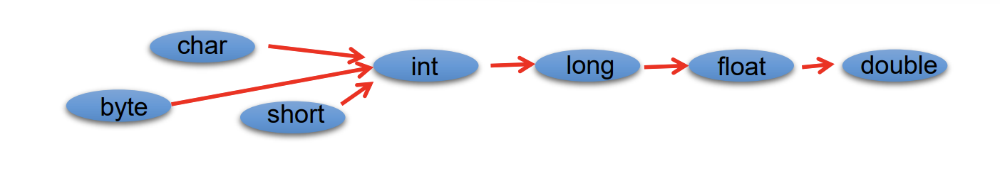
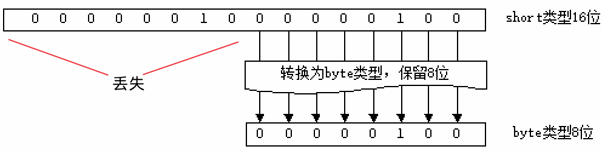
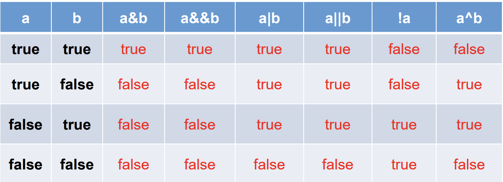

# 主类

- Java语言是面向对象的程序设计语言，Java程序的基本组成单元就是类，类体中又可包括属性与方法两部分
- 主类：包含main()方法的类。每一个Java本地应用程序都必须包含一个main()方法，main()方法为Java应用程序的入口。
- 一个完整的主类结构通常由定义包语句、定义类语句、定义主方法语句、定义变量语句和导入API类库5部分组成，

# 变量

## 标识符

### 命名规则

- 26个英文字母大小写，0-9，_，$
- 数字不可以开头
- 不能使用关键字和保留字
- 严格区分大小写
- 不能包含空格

### 命名规范

- 包名：多单词时都小写 xxxyyy
- 类名/接口名：多单词时每个单词首字母大写 XxxYyy
- 变量名/方法名：多单词时第一个单词首字母小写，第二个单词开始每个单词首字母大写xxxYyy
- 常量名：所有字母都大写，多单词用下划线连接 XXX_YYY

### 关键字和保留字

- goto
- const

## 变量概述

- 变量：内存中的一个存储区域，该区域的数据可以在同一类型范围内不断变化。是程序中最基本的存储单元，包含变量类型，变量名和存储的值。  

- 定义变量：告诉编译器（compiler）这个变量是属于哪一种数据类型，这样编译器才知道需要配置多少空间给它，以及它能存放什么样的数据。

1. Java每个变量必须先声明，后使用。
2. 使用变量名来访问这块区域的数据。
3. 变量的作用域：其定义所在的一对{}内，即函数体内，变量只有在其作用域内才有效。
4. 同一个作用域内，不能定义重名的变量。

- 系统的内存可大略的分为3个区域：系统区（OS）、程序区（Program）、数据区（Data）。
  - 当程序执行时，程序代码会加载到内存中的程序区，数据暂时存储在数据区中。
  - 假设上述两个变量定义在方法体中，则程序加载到程序区中。当执行此行程序代码时，会在数据区配置空间给这两个变量。

  

## 成员变量、局部变量

| 变量     | 声明位置         | 具体类型                                   | 初始化值特点           |
| -------- | ---------------- | ------------------------------------------ | ---------------------- |
| 成员变量 | 方法体外且类体内 | 实例变量<br />类变量（static）             | 生命周期               |
| 局部变量 | 方法体内         | 形参<br />方法局部变量<br />代码块局部变量 | 除形参外，均要显式初始 |

# 数据类型

   

## 基本数据类型

### 整数类型：byte、short、int、long

| 类型  | 标识 | 存储空间 | 表数范围           |
| ----- | ---- | -------- | ------------------ |
| byte  |      | 1 Byte   | -128~127           |
| short |      | 2 Byte   | $-2^{15}~2^{15}-1$ |
| int   | 默认 | 4 Byte   | $-2^{31}~2^{31}-1$ |
| long  | l、L | 8 Byte   | $-2^{63}~2^{63}-1$ |

> | 单位         | 说明                   |
> | ------------ | ---------------------- |
> | bit（位）    | 计算机中的最小存储单位 |
> | byte（字节） | 计算机中基本存储单元   |
>
> - 1 MB = 1024 KB 
>
> - 1 KB= 1024 B （Byte）
>
> - 1 B = 8 bit

```java
byte b1 = -128;
//byte b2 = 128; 超出范围-128~127 编译错误
System.out.println(b1);

short s1 = 128;
System.out.println(s1);

int i1 = 1234;
System.out.println(i1);

long l1 = 12334578L; //声明long型常量须后加‘l’或‘L’，否则默认int
System.out.println(l1);
//long l2 = 123456789010;  
//认为是int自动转long，大于2^31，超过int的范围，编译失败:过大的整数
```

### 浮点类型：float、double  

| 类型             | 标识       | 存储空间 | 表数范围                                      |
| ---------------- | ---------- | -------- | --------------------------------------------- |
| float（单精度）  | f、F       | 4 Byte   | -3.403E38~3.403E38<br />尾数精确到7位有效数字 |
| double（双精度） | d、D、缺省 | 8 Byte   | -1.798E308~-1.798E308<br />精度是float的两倍  |

```java
double d1 = 123.3;
System.out.println(d1);

float f1 = 12.3F;   //声明float型常量，须后加‘f’或‘F’。否则默认double
System.out.println(f1);
//float f2 = 12.3  //编译失败;被认为是自动类型转换，但不能自动大转小

long l2 = 123456789010;  
//认为是int自动转long，大于2^31，超过int的范围，编译失败:过大的整数

float f2 = 12.3 
 //编译失败;被认为是自动类型转换，但不能自动大转小
```

### 字符类型：char

- char：字符（2字节）。Java中的所有字符都使用Unicode编码，故一个字符可以存储一个字母，一个汉字，或其他书面语的一个字符。  

1. 单引号：只能写一个字符，且不能为空(可以是空格):

```java
char c1 = 'a';
char c2 = '中';
char c3 = '9';
```

2. 直接使用ASCII码，char可以对其Unicode码进行运算。

```java
char c2 = 97; //'a'
System.out.println(c2);  //a
```

3. 转义字符\\

    

```java
char c5 = '\n';
System.out.print("NNN" + c5);
```

4. 直接使用 Unicode 值来表示字符型常量：‘\uXXXX’（XXXX代表一个十六进制整数）。
   - `\u000a --> \n`

```java
char c6 = '\u0043';
System.out.println(c6);
```

### 布尔类型：boolean

- boolean 判断逻辑条件，一般用于程序流程控制：

  - if条件控制语句；

  - while循环控制语句；

  - do-while循环控制语句；

  - for循环控制语句；


- boolean取值：true、false。

  - 无null。

  - 不可以使用0、非0的整数替代。


> Java虚拟机中没有任何供boolean值专用的字节码指令。
>
> Java语言表达所操作的boolean值，在编译之后都使用JVM中的int数据类型来代替：true用1表示，false用0表示。

## 类型转换方式

### 自动类型提升

- 容量(数的范围)小的类型自动转换为容量大的数据类型。数据类型按容量大小排序为：  
     

- 多种类型的数据混合运算：自动将所有数据转换成容量最大的数据类型，再进行计算。

- byte、short、char之间不会相互转换：如果操作数的类型低于int类型（byte、short、char类型），则操作数会自动转换为int类型（++、--除外）。
  - 不兼容的错误，可能损坏数据，编译不予通过。
- boolean类型不能与其它数据类型运算。

1. 变量赋值：当为变量赋值的数据类型与变量类型不一致，并且赋值的数据类型级别低于变量类型的级别时，自动数据类型转换会将赋值数据自动转换为变量的类型。

```java
byte byteNum = 23;// 声明byte类型变量
int intNum = byteNum;// 把byte型数据赋值给int型变量
```

2. 方法调用

```java
public static void main(String[] args) {
   byte byteNum=23;
   say(byteNum); // 把byte数值传递给方法的int参数
}

public static void say(int num){
   System.out.println("这是int类型数值："+num);
}
```

### 强制类型转换

- 强制类型转换：自动类型转换的逆过程，可能造成精度降低或溢出。
- boolean类型不可以转换为其它的数据类型。

```
(数据类型)变量
强转符()   
```

   

```java
double d1 = 12.3;
int i1 = (int)d1;
System.out.println(i1);

//转为byte较特殊 超过精度范围的:
int i2 = 128;
byte b1 = (byte)i2;   //-128
System.out.println(b1);
int i3 = 200;
byte b2 = (byte)i3;
System.out.println(b2);  //-56
int i4 = 2000;
byte b3 = (byte)i4;
System.out.println(b3);  //-48
```

## 基本数据->String

### 字符串类型：String

String不是基本数据类型，属于引用数据类型

- 使用方式与基本数据类型一致。例如：
  - String str = “abcd”;
- 一个字符串可以串接另一个字符串，也可以直接串接其他类型的数据。例如：
  - str = str + “xyz” ;
  - int n = 100;
  - str = str + n;

```
public class StringTest{
        public static void main(String[] args){
                String s1 = "Hellp World !";
                System.out.println(s1);
                String s2 = "a";
                String s3 = "";  //string可以为空

                //char c = '';  //char型不能为空
        }
}
```

- String 可以和其他8种基本数据类型做运算，且运算只能是连接运算 +

```
public class StringTest{
        public static void main(String[] args){
                String idstr = "编号：";
                int id = 19;
                String info = idstr + id;
                System.out.println(info);

                //Stirng test01 = idstr - id;    //编译不通过
                //String test02 = idstr - info;   //编译不通过
        }
}
```

### + 加号与连接符的判断

- char型与int/float等从左到右更近，则+为加法
- char型与String从左到右更近，则+为连接符
  - 连锁反应：于String相连接后变String

```
public class StringTest{
        public static void main(String[] args){
                char c = 'a';
                int num = 10;
                String str = "Hello";

                System.out.println(c + num + str); //107Hello
                System.out.println(c + str + num); //aHello10
                System.out.println(c + (num + str)); //a10Hello
                System.out.println((c + num) + str); //107Hello
                System.out.println(str + num + c); //Hello10a
        }
}
```

```
public class StringTest{
        public static void main(String[] args){
                System.out.println("*   *"); //*       *
                System.out.println('*' + '\t' + '*');  //93
                System.out.println('*' + '\t' + "*");  //51*
                System.out.println('*' + "\t" + '*');   //*     *
                System.out.println('*' +( '\t' + "*")); //*     *
        }
}
```

```
String str1 = 4; //判断对错：no
String str2 = 3.5f + ""; //判断str2对错：yes 
System.out.println(str2); //输出："3.5"//3.5
System.out .println(3+4+"Hello!"); //输出：7Hello!
System.out.println("Hello!"+3+4); //输出：Hello!34
System.out.println('a'+1+"Hello!"); //输出：98Hello!
System.out.println("Hello"+'a'+1); //输出：Helloa1

判断是否能通过编译
1）
      short s = 5;
      s = s - 2; //判断：no  //2 默认int 自动转换不能大转小
2） 
      byte b = 3;
      b = b + 4; //判断：no  //4 默认int
      b = (byte)(b + 4); //判断：yes
3）
      char c = ‘a’;
      int i = 5;
      float d = .314F;
      double result = c + i + d; //判断：yes
4） 
      byte b = 5;
      short s = 3;
      short t = s + b; //判断：no  // short/byte/char之间不能转换
```

### String字符串不能直接转换为基本类型，但通过基本类型对应的包装类则可以实现把字符串转换成基本类型

如：

```
String a = "43"; 
int i = Integer.parseInt(a);
```

***

## 进制与进制间转换

### 进制

所有数字在计算机底层都以二进制形式存在。  
对于整数，有四种表示方式：  

- 二进制(binary)：0,1 ，满2进1.
  - 以0b或0B开头。
- 十进制(decimal)：0-9 ，满10进1。
- 八进制(octal)：0-7 ，满8进1.
  - 以数字0开头表示。
- 十六进制(hex)：0-9及A-F，满16进1.
  - 以0x或0X开头表示。此处的A-F不区分大小写。
  - 如：0x21AF +1= 0X21B0

   
   

```
 public class BinaryTest{
        public static void main(String[] args){
                int num1 = 0b110;
                int num2 = 110;
                int num3 = 0127;
                int num4 = 0x110A;
                
                System.out.println(num1); //6  //1 * 2^2 + 1 * 2^1 + 1 * 2^0
                System.out.println(num2); //110
                System.out.println(num3); //87 //1 * 8^2 + 2 * 8^1 + 7 * 8^0
                System.out.println(num3); //4362 //1 * 16^3 + 1 * 16^2 +  0 * 16^1 + 10 * 16^0 
        }
}
```

***

### 二进制

Java整数常量默认是int类型，

- 当用二进制定义整数时,int，其第32位是符号位；  
- 当是long类型时，二进制默认占64位，第64位是符号位

二进制的整数有如下三种形式：

- 原码：直接将一个数值换成二进制数。最高位是符号位
- 负数的反码：是对原码按位取反，只是最高位（符号位）确定为1。
- 负数的补码：其反码加1。

计算机以二进制补码的形式保存所有的整数。

- 正数的原码、反码、补码都相同
- 负数的补码是其反码+1

为什么要使用原码、反码、补码表示形式呢？  
计算机辨别“符号位”显然会让计算机的基础电路设计变得十分复杂! 于是人们想出了将符号位也参与运算的方法. 我们知道, 根据运算法则减去一个正数等于加上一个负数, 即: 1-1 = 1 + (-1) = 0 , 所以机器可以只有加法而没有减法, 这样计算机运算的设计就更简单了。

   

### 二级制转十进制

   
   

   

### 十进制转二进制

   

   

   

   

   

   

   

   

### 进制间转化

- 十进制 二进制互转
   - 二进制转成十进制 乘以2的幂数
   - 十进制转成二进制 除以2取余数
- 二进制 八进制互转
- 二进制 十六进制互转
- 十进制 八进制互转
- 十进制 十六进制互转

   

   

   

***

## 声明常量 final

在程序运行过程中一直不会改变的量称为常量（constant），通常也被称为“final变量”。常量在整个程序中只能被赋值一次。在为所有对象共享值时，常量是非常有用的。

在Java语言中声明一个常量，除了要指定数据类型外，还需要通过final关键字进行限定。声明常量的标准语法为：

```
final 数据类型 常量名称[=值]
```

常量名通常使用大写字母，这也符合Java编码规范，但这并不是必须的，声明常量时，完全可以和变量名一样使用小写字母。但是，那样容易造成混淆，降低代码可读性，所以才有规范要求常量名全部大写，并使用“_”下划线字符分割多个单词

- 当定义的final变量属于“成员变量”，则必须在定义的时候就设定它的初值。否则将会有编译错误。

```
public class Part{
        static final double PI = 3.14;
        static int age = 23;
        public static void main(String[] args){
                final int number;
                number = 1235;
                age = 22;
                //number = 1111;    //number final变量只能赋值一次
                System.out.println(PI);   //3.14
                System.out.println(number);  //1235
                System.out.println(age);   //22
        }
}
```

***

## 变量的有效范围

由于变量被定义出来后，只是暂存在内存中，等到程序执行到某一个点后，该变量会被释放掉，也就是说变量有它的生命周期。因此变量的有效范围是指程序代码能够访问该变量的区域，若超出该区域访问变量则编译时会出现错误。在程序中，一般会根据变量的有效范围，将变量分为“成员变量”和“局部变量”。

### 成员变量

在类体中所定义的变量被称为成员变量。成员变量在整个类中都有效，所以成员变量也称作全局变量。

成员变量的有效范围是整个类的代码段，也就是在类体中的任何位置都可以使用该变量。

声明成员变量，并在不同方法中为成员变量赋值

```
public class Temp{
        int num = 0;
        float price = 3.50f;
        public void method01(){
                num = 1;
                price = 12.55f;
        }
        public void method02(){
                num = num * 10;
                price = price * 0.5f;
        }
}
```

- 类的成员变量又可分为静态变量和实例变量两种。

#### 静态变量 static

- 静态变量的有效范围是整个类，并且可以被类的所有实例共享。可通过“类名.静态变量名”的方式来访问静态变量。
- 静态变量的生命周期取决于类的生命周期，当类被加载时，为类中的静态变量分配内存空间，当卸载类时，释放静态变量占用的空间，静态变量被销毁。
- 类加载时，就为静态变量分配内存空间，之后无论创建了多少类的实例，都不会再为静态变量分配内存空间，这些实例会使用同一个静态变量。

```
 static int y = 90;   //定义静态变量
```

#### 实例变量

- 实例变量与类的实例对应，它的有效范围是整个实例。
- 每创建一个类的实例，都会为当前实例分配实例变量的内存空间。
- 所以实例变量的生命周期取决于实例的生命周期，实例被创建时，为实例变量分配内存空间，当销毁实例时，释放实例变量占用的内存空间。

```
int x = 45;          //定义实例变量
```

### 局部变量

- 在方法体中定义的变量就是一种局部变量，局部变量只在当前代码块（即花括号之内）中有效。
- 局部变量的生命周期取决于声明位置的代码块，超出这个代码块的范围就不能在使用代码块内的局部变量。

就拿方法类说，方法内声明的变量、包括参数变量都属于局部变量，当方法被调用时，Java虚拟机为方法中的局部变量分配内存空间，当该方法的调用结束后，则会释放方法中局部变量占用的内存空间，局部变量也将会销毁，然后Java的垃圾回收机制会在某一时刻清理该内存空间。


#### 局部变量可与全局变量的名字相同，此时全局变量将被隐藏，但是可以使用“this.”做前缀来访问全局变量

```
public class ValClass{
        static String words = "成员变量";
        public static void main(String[] args){
                String words = "局部变量";
                System.out.println("words变量现在是:" + words); //局部变量
        }
}
```

***

# 运算符

## 算术运算符

   

### 算术运算符的注意问题

#### 如果对负数取模，可以把模数负号忽略不记

- 如：5%-2=1。
- 但被模数是负数则不可忽略。
- 此外，取模运算的结果不一定总是整数。

#### 对于除号“/”，它的整数除和小数除是有区别的：整数之间做除法时，只保留整数部分而舍弃小数部分

- 例如：
- int x = 3510;
- x=x / 1000 * 1000;  
- x的结果是3

#### “+”除字符串相加功能外，还能把非字符串转换成字符串.例如

- System.out.println(“5+5=”+ 5 + 5); //打印结果是 5+5=55  //字符串

#### 自增1/自减1不会改变本身变量的数据类型

```
short s1

s1 = s1 +1 //编译失败
应该是
s1 = (short)(s1 +1);

整数默认是int
```

#### 超过范围的++

```
byte b1 = 127;
b1++;
System.out.println(b1);  //-128  
```

#### 自增2 (num++)++ //编译失败

```
num += 2;
```

### 练习1：除 转换

```
public class SignTest{
        public static void main(String[] args){
                int num01 = 12;
                int num02 = 5;

                int result01 = num01 / num02;
                System.out.println(result01);   //2

                int result02 = num01 / num02 * num02;
                System.out.println(result02);   //10

                double result03 = num01 / num02;
                System.out.println(result03);  //2.0

                double result04 = num01 / num02 + 0.0;
                System.out.println(result04);   //2.0

                double result05 = num01 / (num02 + 0.0);
                System.out.println(result05);   //2.4

                double result06 = (double)num01 / num02;
                System.out.println(result06);   //2.4

                double result07 = (double)(num01 / num02);
                System.out.println(result07);   //2.0
        }
}
```

### 练习2：随意给出一个整数，打印显示它的个位数，十位数，百位数的值

```
格式如下：
数字xxx的情况如下：
个位数：
十位数：
百位数：
例如：
数字153的情况如下：
个位数：3
十位数：5
百位数：1
```

```
public class NumberPrint{
        public static void main(String[] args){
                int num = 123;
                int a = num / 100;
                int b = (num % 100 ) / 10;
                int c = num % 10;
                System.out.println("数字" + num + "的情况如下:");
                System.out.println("百位数:" + a );
                System.out.println("十位数:" + b );
                System.out.println("个位数:" + c );
        }
}
```

### 练习3：算术运算符：自加、自减

```
public class SignTest{
        public static void main(String[] args){
                int i = 1;
                System.out.println("i\t" + i);
                System.out.println("i++\t" + (i++));
                i = 1;
                System.out.println("++i\t" + (++i));
                i = 1;
                System.out.println("i--\t" + (i--));
                i = 1;
                System.out.println("--i\t" + (--i));
        }
}

i       1
i++     1                                                                                                               ++i     2
i--     1
--i     0  
```

```
public class SignTest{
        public static void main(String[] args){
                int i1 = 10;
                int i2 = 20;
                int i = i1++;
                System.out.println("i=" + i); 
                System.out.println("i1=" + i1);
                i = ++i1;
                System.out.println("i=" + i);
                System.out.println("i1=" + i1);
                i = i2--;
                System.out.println("i=" + i);
                System.out.println("i2=" + i2);
                i = --i2;
                System.out.println("i=" + i);
                System.out.println("i2=" + i2);
        }
}

i=10
i1=11
i=12
i1=12
i=20
i2=19
i=18
i2=18;   
```

### 为抵抗洪水，战士连续作战89小时，编程计算共多少天零多少小时？

```
public class TimeCount{
        public static void main(String[] args){
                int workTime = 89;
                int day = workTime / 24;
                int hour = workTime % 24;

                System.out.println("共" + day + "天" + hour + "小时");
        }
}
```

### 今天是周二，100天以后是周几？

```
public class TimeCount{
        public static void main(String[] args){
                int days = 100;
                int weekday = days % 7 + 2;
                System.out.println("周" + weekday);
        }
}
```

### 总结

```
class SuanShu{
 public static void main(String[] args){
  int a = 23;
  int b = 12;
  System.out.println(a + "+" + b + "=" + (a+b));
  int sum = a + b;
  System.out.println(a + "+" + b + "=" + sum);
  
  int sub = a - b;
  //System.out.println(a + "-" + b + "=" + a-b);
  //错误，原因是a + "-" + b + "=" + a的结果是字符串，字符串不能进行减法
  System.out.println(a + "-" + b + "=" + (a-b));
  System.out.println(a + "-" + b + "=" + sub);
  
  int mul = a * b;
  System.out.println(a + "*" + b + "=" + a*b);
  System.out.println(a + "*" + b + "=" + mul);
  
  //整数相除，只保留整数部分
  int div = a / b;
  System.out.println(a + "/" + b + "=" + a/b);
  System.out.println(a + "/" + b + "=" + div);
  
  double d = (double)a/b;//先把a的类型进行转换，转换成double类型，然后再和b相除
  System.out.println(a + "/" + b + "=" + d);
  
  int yu = a % b;
  System.out.println(a + "%" + b + "=" + yu);
  
  System.out.println("------------------特殊的取模----------------------");
  System.out.println(5%2);//1
  System.out.println(-5%-2);//-1
  System.out.println(-5%2);//-1
  System.out.println(5%-2);//1
  
  System.out.println("------------------负号----------------------");
  int num1 = 12;
  int num2 = -num1;
  System.out.println("num2=" + num2);
  
  System.out.println("------------------自增----------------------");
  int i = 0;
  System.out.println("自增之前i=" + i);
  i++;
  System.out.println("自增第一次之后i=" + i);
  ++i;
  System.out.println("自增第二次之后i=" + i);
  int j = ++i;//把i自增1，然后结果赋值给j，或者说，先算++i，然后再赋值
  System.out.println("自增第三次之后i=" + i);
  System.out.println("j=" + j);
  int k = i++;//先算赋值，把i的值赋值给k，i原来是3，把3赋值给k，然后i在自增1，i变成4
  System.out.println("自增第四次之后i=" + i);
  System.out.println("k=" + k);
  
  //面试题：陷阱题
  i = i++;//先赋值，把i原来的值重新赋值给i，不变，然后i自增，但是这个自增后的值没有在放回变量i的位置
  System.out.println("自增第五次之后i=" + i);
 }
}

```

### 小明要到美国旅游，可是那里的温度是以华氏度为单位记录的。它需要一个程序将华氏温度（80度）转换为摄氏度，并以华氏度和摄氏度为单位分别显示该温度

   

```
public class ChangeCF{
        public static void main(String[] args){
                double celsius;
                int fahrenheit = 80;

                celsius = (fahrenheit - 32) / 1.8;
                System.out.println("华氏度：" + fahrenheit);
                System.out.println("摄氏度：" + celsius);
        }
}
```

## 赋值运算符

符号：=
当“=”两侧数据类型不一致时，可以使用自动类型转换或使用强制类型转换原则进行处理。
支持连续赋值。

```
public class SetValueTest{
        public static void main(String[] args){
                int i,j;
                i = j = 1;
                System.out.println("i=" + i + "|" + "j=" + j);
        }
}

i=1|j=1
```

### 扩展赋值运算符： +=, -=, *=, /=, %=

#### 不会改变本身数据类型

而`s1 = s1 + 10` 改变//整数默认int

```
public class SetValueTest{
        public static void main(String[] args){
                int num;
                num = 10;
                num += 2;
                System.out.println(num);

                num = 10;
                num = num + 2;
                System.out.println(num);

                short s1 = 10;
                //s1 = s1 + 2; 编译失败
                s1 += 2;
                System.out.println(s1);
        }
}
```

### 思考1

```
short s = 3; 
s = s + 2; ① //编译失败
s += 2; ②
①和②有什么区别？
```

### 思考2

```
int i = 1;
i *= 0.1;
System.out.println(i); //0
i++;
System.out.println(i); //1
```

### 思考3

```
int m = 2;
int n = 3;
n *= m++;  //2 * 3 == 6
System.out.println("m=" + m); //3
System.out.println("n=" + n); //6
```

### 思考4：自增/自减的运算在同一行，运算不是全部按照原来的数一个个运算，而是按顺序在前面运算后的基础上运算

```
int n = 10;
n += (n++) + (++n);  //10 + 12 + 10 == 32
System.out.println(n);  //32
```

## 比较运算符（关系运算符）

- 比较运算符的结果都是boolean型，也就是要么是true，要么是false。
  - 不是0，1
- 比较运算符“==”不能误写成“=” 。
- ==  != 不仅能使用在数值类型之间，还可以使用在其他引用类型变量之间

```
Account acct1 = new Account(1000)

Account acct2 = new Account(1000)

boolean b1 = (acct1 == actt2) //比较两个Account是否是同一个账户 而不是有多少钱
//false
```

- `> < >= <=` 只能使用在数值类型的数据中之间

   

### 思考1

```
boolean b1 = false;
//区分好==和=的区别。
if(b1==true){
    System.out.println("结果为真");
}
else{
    System.out.println("结果为假");
}
//结果为假

if(b1=true){    //有误，但编译通过
    System.out.println("结果为真");
}
else{
    System.out.println("结果为假");
}
//结果为假
```

***

## 逻辑运算符

- & —逻辑与
- | —逻辑或
- ！—逻辑非
- && —短路与
- || —短路或
- ^ —逻辑异或

   

逻辑运算符用于连接布尔型表达式，在Java中不可以写成`3<x<6`，应该写成`x>3 & x<6`。

- "&”和“&&”的区别：
  - 单&时，左边无论真假，右边都进行运算；
  - 双&时，如果左边为真，右边参与运算，如果左边为假，那么右边不参与运算。
- "|”和“||”的区别同理，
  - ||表示：当左边为真，右边不参与运算。
- 异或( ^ )与或( | )的不同之处是：
  - 当左右都为true时，结果为false。
  - 理解：异或，追求的是“异”!

```
public class LogicTest{
        public static void main(String[] args){
                boolean b1 = true;
                int num1 = 10;
                if(b1 & (num1++ > 0)){
                        System.out.println("北京");
                }
                else{
                        System.out.println("南京");
                }
                System.out.println("num1=" + num1);

                boolean b2 = true;
                int num2 = 10;
                if(b2 && (num2++ > 0)){
                        System.out.println("北京");
                }
                else{
                        System.out.println("南京");
                }
                System.out.println("num2=" + num2);

                boolean b3 = false;
                int num3 = 10;
                if(b3 & (num3++ > 0)){
                        System.out.println("北京");
                }
                else{
                        System.out.println("南京");
                }
                System.out.println("num3=" + num3);

                boolean b4 = false;
                int num4 = 10;
                if(b4 && (num4++ > 0)){
                        System.out.println("北京");
                }
                else{
                        System.out.println("南京");
                }
                System.out.println("num4=" + num4);
        }
}

北京
num1=11
北京
num2=11
南京
num3=11
南京
num4=10 
```

### 练习：请写出每题的输出结果

#### 1

```
int x = 1;
int y = 1;
if(x++ == 2 & ++y == 2){
    x = 7;
}
System.out.println("x=" + x + ",y=" + y);  
//x=2,y=2
```

#### 2

```
int x = 1,y = 1;
if(x++ == 2 && ++y == 2){
    x = 7;
}
System.out.println("x=" + x + ",y=" + y);
//x=2,y=1
```

#### 3

```
int x = 1,y = 1;
if(x++ == 1 | ++y == 1){
    x = 7;
}
System.out.println("x=" + x + ",y=" + y);
//x=7,y=2
```

#### 4

```
int x = 1,y = 1;
if(x++ == 1 || ++y == 1){
    x = 7;
}
System.out.println("x=" + x + ",y=" + y);
//x=7,y=1
```

### 【面试题】程序输出

```
class Test {
    public static void main (String[] args) {
        boolean x = true;
        boolean y = false;
        short z = 42;
        //if(y == true)
        if((z++ == 42)&&(y = true)) z++; //z == 44;y == true
        if((x = false) || (++z == 45)) z++;  //x == false;z == 46
        
        System. out.println(“z=”+z);  
    }
}

结果为：z=46

```

***

## 位运算符

### 位运算是直接对整数的二进制进行的运算

- 位运算符操作的都是整型的数据
- 注意数据类型的长度
     

   

```
public class BitTest{
        public static void main(String[] args){
                byte num = 2;
                System.out.println("num << 8 = " + (num << 8));
        }
}

num << 8 = 512 ???
```

### <<  乘2的n次方

- 在范围内，`<< n`即`乘2的n次方`
- 超过范围，负数...

```
public class BitTest{
        public static void main(String[] args){
                int i = 21;

                System.out.println("i << 2 :" + (i << 2));
                System.out.println("i << 27 :" + (i << 27));
        }
}

i << 2 :84
i << 27 :-1476395008
```

#### 最高效计算2*8

- 注：乘数中要有一个是2的倍数

```
public class BitTest{
        public static void main(String[] args){
                int num = 2;
                System.out.println("2 * 8 = "+ (num << 3));
        }
}

public class BitTest{
    public static void main(String[] args){
        System.out.println("2 * 8 = " + (8 << 1));
    }
}
```

### >> 除以2的n次方

- 在范围内，`>>n`即`除以2的n次方`

### >>>

### & 有0则0，都1则1

```
public class BitTest{
        public static void main(String[] args){
                System.out.println(2 & 5);
        }
}
//0

//2  ...010
//5  ...101
//...000
```

### | 有1则1，都0则0

```
public class BitTest{
        public static void main(String[] args){
                System.out.println(2 | 5);
        }
}
//7

//2  ...010
//5  ...101
//..111
```

### ^ 不同则1，同则0

```
public class BitTest{
        public static void main(String[] args){
                System.out.println(2 ^ 5);
        }
}
//7
//2  ...010
//5  ...101
//...111
```

```
public class BitTest{
        public static void main(String[] args){
                System.out.println(1 ^ 5);
                System.out.println(1 | 5);
        }
}
// ^ ...100 //4
// | ...101 //5

//1  ...001
//5  ...101

```

### ~ 取反

```
public class BitTest{
        public static void main(String[] args){
                System.out.println(~6);
        }
}
//-7
```

   

### 如何求一个0~255范围内的整数的十六进制值，例如60的十六进制表示形式3C

```
//方式一：自动实现
public class BitTest{
        public static void main(String[] args){
                String str1 = Integer.toBinaryString(60);
                String str2 = Integer.toHexString(60);

                System.out.println(str1);
                System.out.println(str2);
        }
}

//方式二：手动实现
public class BitTest{
        public static void main(String[] args){
            int i1 = 60;      //0111100
            int i2 = i1 & 15; //0001111
            String j = (i2 > 9)? (char)(i2-10 + 'A')+"" : i2+"";
            int temp = i1 >>> 4;
            i2 = temp & 15;
            String k = (i2 > 9)? (char)(i2-10 + 'A')+"" : i2+"";
            System.out.println(k+""+j);
        }
}

```

### 练习 交换两个变量的值

```
public class ExchangeNum{
        public static void main(String[] args){
                int num01 = 10;
                int num02 = 20;

                //方法1  定义临时变量
                int temp;
                temp = num01;
                num01 = num02;
                num02 = temp;
                System.out.println("num01=" + num01);
                System.out.println("num02=" + num02);
                
                //方法2  不用定义临时变量;但是可能超过数据范围;有局限性,只能是数值型
                num01 = num01 + num02;
                num02 = num01 - num02;
                num01 = num01 - num02;
                System.out.println("num01=" + num01);
                System.out.println("num02=" + num02);
                
                //方法3 ^ 不用定义临时变量;但是可能超过数据范围;有局限性,只能是数值型
                num01 = (num01 ^ num02);
                num02 = (num01 ^ num02);
                num01 = (num01 ^ num02);
                System.out.println("num01=" + num01);
                System.out.println("num02=" + num02);

        }
}
```

### 错误 实现加法 sum = (num01 ^ num02) | num01 | num02 错误

```
public class AddNum{
        public static void main(String[] args){
                int num01 = 12;
                int num02 = 20;
                int sum;

                sum = (num01 ^ num02) | num01 | num02;
                System.out.println("sum=" + sum);
        }
}

//32
/*
num01 ^ num02
...01100 ^ 
...10100  == ...11000

(num01 ^ num02) | num01 | num02
...11000 |
...01100 == 
...11100 |
...10100 == ...11100
*/
```

### 实现减法

```
/*
num01 ^ num02
...01100 ^ 
...10100  == ...11000

*/
```

### 实现乘法

```

```

### 实现除法

```

```

## 三元运算符

```
条件表达式 ? 表达式1 ：表达式2；
```

- 条件表达式的结果为boolean类型
- 条件表达式为true，运算后的结果是表达式1；
- 条件表达式为false，运算后的结果是表达式2；  
- 表达式1和表达式2为要求是同种类型, 或者可以自动转换的， **会自动将类型转换为最高的一个** 。

```java
public class SanYuan{
        public static void main(String[] args){
                int m = 12;
                int n = 5;

                int max = (m > n)? m : n;
                System.out.println(max);
                
                double num = (m > n)? 1 : 1.0;
                System.out.println(num);
                
                //(m > n)? 1:"你好"; //无法自动转换，类型不统一//编译错误
                
                String maxStr = (m > n)? "m大":"n大";
                System.out.println(maxStr);
                
                int max = (((m > n)? m : n) == m)? m : n;
                System.out.println(maxNum);
        }
}
```

### 三元运算符与if-else的联系与区别

1. 三元运算符可简化if-else语句,优先三元运算符
2. 三元运算符要求必须返回一个结果。
3. if后的代码块可有多个语句

## 运算符的优先级

运算符有不同的优先级，所谓优先级就是表达式运算中的运算顺序。如表，上一行运算符总优先于下一行。

   

只有单目运算符、三元运算符、赋值运算符是从右向左运算的。

# 流程控制

## 键盘输入 Scanner

1. 导包 `import java.util.Scanner;`
2. Scanner的实例化 `Scanner scan = new Scanner(System.in);`
3. 调用Scanner类的相关方法，来获取指定类型的数据

- 需要根据相应的方法，来输入指定类型的数据，如果输入的数据类型与要求不匹配，报异常：.InputMismatchException，导致程序终止.
- 通过Scanner类的`next()`和`nextline()`方法获取输入的字符串，在读取前一般需要使用`hasNext()`和`hasNextLine()`判断是否还有输入的数据

```java
import java.util.Scanner;

public class ScannerTest{
        public static void main(String[] args){
                Scanner scan = new Scanner(System.in);

                int num = scan.nextInt();
                System.out.println(num);
        }
}
```

- scan.next() 字符串
- scan.nextInt() 整型
- scan.nextDouble() 浮点double
- scan.nextBoolean() 布尔  //true/false //而不是0/1
- 没有nextChar()

```
import java.util.Scanner;

public class ScannerTest{
        public static void main(String[] args){
                Scanner scan = new Scanner(System.in);

                System.out.println("请输入姓名：");
                String name = scan.next();
                System.out.println(name);

                System.out.println("请输入年龄：");
                int age = scan.nextInt();
                System.out.println(age);

                System.out.println("请输入体重：");
                double weight = scan.nextDouble();
                System.out.println(weight);

                System.out.println("是否单身？");
                boolean isLove = scan.nextBoolean();
                System.out.println(isLove);

                //对于char型的获取。Scanner没有提供方法，只能获取一个字符串
                System.out.println("请输入性别 男/女");
                String gender = scan.next();
                char genderChar = gender.charAt(0); //获取索引位置上的字符
                System.out.println(genderChar);
        }
}
```

```
Exception in thread "main" java.util.InputMismatchException
        at java.base/java.util.Scanner.throwFor(Scanner.java:943)
        at java.base/java.util.Scanner.next(Scanner.java:1598)
        at java.base/java.util.Scanner.nextBoolean(Scanner.java:1898)
        at ScannerTest.main(ScannerTest.java:20)
```

### next的用法

```
package com.cdoudou.scanner;

import java.util.Scanner;

public class Demo01 {
    public static void main(String[] args) {

        //创建一个扫描器对象，用于接收键盘数据
        Scanner scanner = new Scanner(System.in);
        System.out.println("用next的方式接受");

        //判断用户有没有输入字符串
        if(scanner.hasNext()){
            //使用next接收
            String str = scanner.next();
            System.out.println("输出内容为："+str);
        }

        //注意使用完要注意关掉  凡是从属于IO流的类，如果使用完不关闭会一直占用资源
        scanner.close();
    }
} 
```

### nextLine()用法

```
package com.cdoudou.scanner;

import java.util.Scanner;

public class Demo02 {
    public static void main(String[] args) {

        Scanner scanner = new Scanner(System.in);
        System.out.println("使用nextLine接收字符串:");

        if(scanner.hasNextLine()){
            String str = scanner.nextLine();
            System.out.println("接受的内容为："+str);
        }
        scanner.close();


//        int sum = 0;
//        for (int i = 0; i < 10; i++) {
//            sum += i;
//            if(i % 3 == 0){
//                break;
//            }
//        }
//        System.out.println(sum);
    }
}
```

### next() nextLine()

- next()

1. 一定要读取到有效字符后才可以结束输入
2. 对输入有效字符之前遇到的空白，next()方法会自动将其去掉
3. 只有输入有效字符后才将其后面输入的空白作为分隔符或者结束符
4. next()不能得到带有空格的字符串

- nextLine()

1. 以Enter为结束符，也就是说nextLine()方法返回的是输入回车之前的所有字符
2. 可以获得空白

#### 也可以输入中文

```
package com.cdoudou.scanner;

import java.util.Scanner;

public class Demo03 {
    public static void main(String[] args) {

        Scanner scanner = new Scanner(System.in);
        System.out.println("使用nextLine接收字符串:");

        String str = scanner.nextLine();
        System.out.println("接受的内容为："+str);
        scanner.close();
        /*
        *   使用nextLine接收字符串:
            可以输入中文的
            接受的内容为：可以输入中文的
        * */
    }
}
```

## 顺序结构

程序从上到下逐行地执行，中间没有任何判断和跳转。
Java中定义成员变量时采用合法的前向引用

```
public class Test{
    int num1 = 12;
    int num2 = num1 + 2;
}
错误形式：
public class Test{
    int num2 = num1 + 2；
    int num1 = 12;
}

```

## 分支结构

根据条件，选择性地执行某段代码。
有if…else和switch-case两种分支语句。

### if...else

```
if(条件表达式){
    执行代码块;
}
```

```
if(条件表达式){
    执行代码块;
}
else{
    执行代码块;
}
```

```
if(条件表达式1){
    执行代码块;
}
else if(条件表达式2){
    执行代码块;
}
else{   //可以不要
    执行代码块;
}
```

- 条件表达式必须是布尔表达式（关系表达式或逻辑表达式）、布尔变量
- 语句块只有一条执行语句时，一对{}可以省略，但建议保留
- if-else语句结构，根据需要可以嵌套使用
- 当if-else结构是“多选一”时，最后的else是可选的，根据需要可以省略
- 当多个条件是“互斥”关系时，条件判断语句及执行语句间顺序无所谓
- 当多个条件是“包含”("例题1(2)")关系时，“小上大下 / 子上父下”
- 注意变量的赋值 在if外的变量应该要先赋值，再使用，如果不满足条件，则未赋值，编译不通过

```
public class Iftest{
        public static void main(String[] args){
                //例1
                int heartBeats = 79;
                if(heartBeats < 60 || heartBeats > 100){
                        System.out.println("需要进一步检查");
                }
                System.out.println("检查结束");

                //例2
                int age = 23;
                if(age < 18){
                        System.out.println("你只能看动画片");
                }
                else{
                        System.out.println("你还是不可以色色的哦！");
                }

                //例3
                if(age < 0){
                        System.out.println("输入数据不合法");
                }
                else if(age < 18){
                        System.out.println("小孩你好呀！");
                }
                else if(age < 30){
                        System.out.println("青壮年时期");
                }
                else if(age < 60){
                        System.out.println("人到中年");
                }
                else if(age < 120){
                        System.out.println("老年");
                }
                else{
                        System.out.println("你不对劲");
                }
        }
}
```

#### 例0

```
public class Iftest{
        public static void main(String[] args){
                int age = 75;
                if(age < 0){
                        System.out.println("不可能！还没出生！");
                }
                else if(age > 250){
                        System.out.println("老妖怪！！！");
                }
                else{
                        System.out.println("芳龄：" + age);
                }
        }
}
```

#### 例题1 成绩

```
岳小鹏参加Java考试，他和父亲岳不群达成承诺：
如果：
成绩为100分时，奖励一辆BMW；
成绩为(80，99]时，奖励一台iphone xs max；
当成绩为[60,80]时，奖励一个 iPad；
其它时，什么奖励也没有。
请从键盘输入岳小鹏的期末成绩，并加以判断
```

```
1)
import java.util.Scanner;

public class IfTest{
        public static void main(String[] args){
                Scanner scan = new Scanner(System.in);

                int score = scan.nextInt();

                if(score > 80 && score <= 99){
                        System.out.println("iphone xs max");
                }
                else if(score >= 60 && score <=80){
                        System.out.println("iPad");
                }
                else{
                        System.out.println("Null");
                }
        }
}

2)
import java.util.Scanner;

public class IfTest{
        public static void main(String[] args){
                Scanner scan = new Scanner(System.in);

                System.out.print("成绩为：");
                int score = scan.nextInt();

                System.out.println("奖励为：");
                if(score > 100){
                        System.out.println("作弊");
                }
                else if(score > 80){
                        System.out.println("iphone");
                }
                else if(score >= 60){
                        System.out.println("ipad");
                }
                else{
                        System.out.println("null");
                }
        }
}
```

#### 例题2 排序

```
编写程序：由键盘输入三个整数分别存入变量num1、num2、num3，
对它们进行排序(使用 if-else if-else),并且从大到小输出。
```

```
import java.util.Scanner;

public class IfTest{
        public static void main(String[] args){
                Scanner scan = new Scanner(System.in);

                System.out.println("请输入数字1");
                int num1 = scan.nextInt();
                System.out.println("请输入数字2");
                int num2 = scan.nextInt();
                System.out.println("请输入数字3");
                int num3 = scan.nextInt();

                System.out.println("输出:");

                if(num1 >= num2 && num1 >= num3){
                        System.out.println("first:" + num1);

                        if(num2 >= num3){
                                System.out.println("seconde:" + num2);
                                System.out.println("third:" + num3);
                        }
                        else{
                                System.out.println("seconde:" + num3);
                                System.out.println("third:" + num2);
                        }
                }
                else if (num2 >= num1 && num2 >= num3){
                        System.out.println("first:" + num2);

                        if(num1 >= num3){
                                System.out.println("seconde:" + num1);
                                System.out.println("third:" + num3);
                        }
                        else{
                                System.out.println("seconde:" + num3);
                                System.out.println("third:" + num1);
                        }
                }
                else if(num3 >= num1 && num3 >= num2){
                        System.out.println("first:" + num3);

                        if(num1 >= num2){
                               System.out.println("seconde:" + num1);
                               System.out.println("third:" + num2);
                        }
                        else{
                                System.out.println("seconde:" + num2);
                                System.out.println("third:" + num1);
                        }
                }
                else{
                        System.out.println("有误！！！");
                }
        }
}

2)
import java.util.Scanner;

public class IfTest{
        public static void main(String[] args){
                Scanner scan = new Scanner(System.in);

                System.out.print("第一个整数：");
                int num1 = scan.nextInt();
                System.out.print("第二个整数：");
                int num2 = scan.nextInt();
                System.out.print("第三个整数：");
                int num3 = scan.nextInt();

                if(num1 >= num2){
                        if(num3 >= num1){
                                System.out.println(num3 + "\t" + num1 + "\t" + num2);
                        }
                        else if(num3 <= num2){
                                System.out.println(num1 + "\t" + num2 + "\t" + num3);
                        }
                        else{
                                System.out.println(num1 + "\t" + num3 + "\t" + num2);
                        }
                }
                else{
                        if(num3 >= num2){
                                System.out.println(num3 + "\t" + num2 + "\t" + num1 );
                        }
                        else if(num3 <= num1){
                                System.out.println(num2 + "\t" + num1 + "\t" + num3);
                        }
                        else{
                                System.out.println(num2 + "\t" + num3 + "\t" + num1);
                        }
                }
        }
}
```

#### if语句练习1

```
1)对下列代码，若有输出，指出输出结果。
int x = 4;
int y = 1;
if (x > 2) {
    if (y > 2) 
    System.out.println(x + y);
System.out.println("atguigu");
} 
else
    System.out.println("x is " + x);

atguigu
x is 4
//大括号的省略，有缩进要求

2) 
boolean b = true;
//如果写成if(b=false)能编译通过吗？如果能，结果是？
if(b == false) 
    System.out.println("a");
else if(b)
    System.out.println("b");
else if(!b)
    System.out.println("c");
else
    System.out.println("d");
```

#### if语句练习2

```
1) 编写程序，声明2个int型变量并赋值。判断两数之和，如果大于等于50，打印“hello world!”
2) 编写程序，声明2个double型变量并赋值。判断第一个数大于10.0，且第2个数小于20.0，打印两数之和。否则，打印两数的乘积。
3) 我家的狗5岁了，5岁的狗相当于人类多大呢？其实，狗的前两年每一年相当于人类的10.5岁，之后每增加一年就增加四岁。那么5岁的狗相当于人类多少年龄呢？应该是：10.5 + 10.5 + 4 + 4 + 4 = 33岁。
编写一个程序，获取用户输入的狗的年龄，通过程序显示其相当于人类的年龄。如果用户输入负数，请显示一个提示信息。
```

```
1)
import java.util.Scanner;

public class IfTest{
        public static void main(String[] args){
                Scanner scan = new Scanner(System.in);

                System.out.println("请输入数字1:");
                int num1 = scan.nextInt();
                System.out.println("请输入数字2:");
                int num2 = scan.nextInt();

                if((num1 + num2) >= 50){
                        System.out.println("Hello wirld!");
                }
                else{
                        System.out.println("not in");
                }
        }
}

2)
import java.util.Scanner;

public class IfTest{
        public static void main(String[] args){
                Scanner scan = new Scanner(System.in);

                System.out.println("请输入数字1");
                double num1 = scan.nextDouble();
                System.out.println("请输入数字2");
                double num2 = scan.nextDouble();

                System.out.println("结果是：");
                if(num1 > 10.0 && num2 <20.0){
                        System.out.println("两数相加：" + (num1 + num2));
                }
                else{
                        System.out.println("两数相乘：" + (num1 * num2));
                }
        }
}

3)
import java.util.Scanner;

public class IfTest{
        public static void main(String[] args){
                Scanner scan = new Scanner(System.in);

                System.out.println("请输入狗的年龄:");
                double dogAge = scan.nextDouble();
                double humanAge;

                if(dogAge >= 0){
                        if(dogAge <= 2){
                                humanAge = (dogAge * 10.5);
                                System.out.println("人类年龄为：" + humanAge);
                        }
                        else{
                                humanAge = ((dogAge - 2) * 4 +2 * 10.5);
                                System.out.println("人类年龄为：" + humanAge);
                        }
                }
                else{
                        System.out.println("有误!!!");
                }
        }
}
```

#### if语句练习3 彩票 使用(int)(Math.random() * 90 + 10)产生随机数

```
假设你想开发一个玩彩票的游戏，程序随机地产生一个两位数的彩票，提示用户输入一个两位数，然后按照下面的规则判定用户是否能赢。
1)如果用户输入的数匹配彩票的实际顺序，奖金10 000美元。
2)如果用户输入的所有数字匹配彩票的所有数字，但顺序不一致，奖金 3 000美元。
3)如果用户输入的一个数字仅满足顺序情况下匹配彩票的一个数字，奖金1 000美元。
4)如果用户输入的一个数字仅满足非顺序情况下匹配彩票的一个数字，奖金500美元。
5)如果用户输入的数字没有匹配任何一个数字，则彩票作废。
提示：使用(int)(Math.random() * 90 + 10)产生随机数。
Math.random() : [0,1) * 90 [0,90) + 10 [10,100)  [10,99]
```

```
import java.util.Scanner;

public class IfTest{
        public static void main(String[] args){
                Scanner scan = new Scanner(System.in);

                System.out.println("请输入你的数字(必须是两位数)");
                int num = scan.nextInt();
                int firstNum = num / 10;
                int secondeNum = num % 10;

                int reword = (int)(Math.random() * 90 + 10);
                //第一位中奖号码
                int firstReword = reword / 10;
                //第二位中奖号码
                int secondeReword = reword % 10;
                //逆序的中奖号码
                int rReword = ((reword / 10) + (reword % 10) * 10);

                if(num >= 10 && num <=99){
                        if(num == reword){
                                System.out.println("大奖10,000美金");
                        }
                        else if(num == rReword){
                                System.out.println("3,000美金");
                        }
                        else if((firstNum == firstReword && secondeNum != secondeReword) || ((firstNum != firstReword) && (secondeNum == secondeReword))){
                                System.out.println("1,000美金");
                        }
                        else{
                                System.out.println("很遗憾！！!");
                        }
                }
                else{
                        System.out.println("有误！！！超过范围");
                }
        }
}
```

#### if语句练习4

```
大家都知道，男大当婚，女大当嫁。那么女方家长要嫁女儿，当然要提出一定的条件：
高：180cm以上；
富：财富1千万以上；
帅：是。
 如果这三个条件同时满足，则：“我一定要嫁给他!!!”
 如果三个条件有为真的情况，则：“嫁吧，比上不足，比下有余。”
 如果三个条件都不满足，则：“不嫁！”
Sysout(“身高: (cm))
scanner.nextInt();
Sysout(“财富: (千万))
scanner.nextDouble();
Sysout(“帅否: (true/false)) (是/否)
scanner.nextBoolean(); scanner.next(); “是”.equals(str) 
```

```
import java.util.Scanner;

public class IfTest{
        public static void main(String[] args){
                Scanner scan = new Scanner(System.in);

                System.out.println("请输入你的条件:");
                System.out.println("请输入身高：(cm)");
                int hight = scan.nextInt();
                System.out.println("请输入财富(千万)");
                double wealth = scan.nextDouble();
                System.out.println("请输入帅否？(false/true)");
                boolean handsome = scan.nextBoolean();

                if(hight >= 180 && wealth >= 1 && handsome == true){
                        System.out.println("我一定要嫁给他");
                }
                else if(hight <180 && wealth <1 && handsome == false){
                        System.out.println("不嫁");
                }
                else{
                        System.out.println("嫁吧。");
                }
        }
}
```

#### 求ax2+bx+c=0方程的根

```
求ax2+bx+c=0方程的根。a,b,c分别为函数的参数，
如果a≠0，那么：
（1）当b2-4ac>0，则有两个解； 
（2）当b2-4ac=0，则有一个解； 
（3）当b2-4ac<0，则无解；
如果a=0,b≠0，那么， 

提示1：Math.sqrt(num);  sqrt指平方根
例如：
求x2-4x+1=0方程的根
求x2-2x+1=0方程的根
```

```
import java.util.Scanner;

class Exer5{
 public static void main(String[] args){
  Scanner input = new Scanner(System.in);
  
  System.out.println("一元二次方程：ax^2+bx+c=0");
  System.out.print("请输入参数a：");
  double a = input.nextDouble();
  
  System.out.print("请输入参数b：");
  double b = input.nextDouble();
   
  System.out.print("请输入参数c：");
  double c = input.nextDouble();

  if(a!=0){
   double temp = b*b - 4*a*c;
   if(temp==0){
    double x = -b/(2*a);
    System.out.println("该方程是一元二次方法，有两个相同解：" + x);
   }else if(temp>0){
    double sqrt = Math.sqrt(temp);
    double x1 = (-b+ sqrt)/(2*a);
    double x2 = (-b- sqrt)/(2*a);
    System.out.println("该方程是一元二次方法，两个不同解：" + x1 +"," + x2);
   }else{
    System.out.println("该方程是一元二次方法，在实数范围内无解！");
   }
  }else{
   if(b!=0){
    double x = -c/b;
    System.out.println("该方程是一元一次方程，有一个解：" + x);
   }else{
    System.out.println("不是方程，是一个等式");
                if(c == 0){
                    System.out.println("等式成立");
}else{
    System.out.println("等式不成立");
}
   }
  }
 }
}
```

### switch-case

#### 冒号case:

1. 根据switch表达式中的值，一次匹配各个case中的常量，一旦匹配成功，则进入相应的case结构中，调用其执行语句。当调用完执行语句以后，则仍然继续向下执行其他case结构中的执行语句，直到遇到break关键字或者此swtich-case结构末尾结束为止。
2. break;可以使用在switch-case结构中，表示一旦执行到此关键字就跳出switch-case结构
3. switch结构的表达式只能是以下6种之一： 不能是boolean(不能是布尔表达式)
   - byte
   - short
   - char
   - int
   - 枚举类型
   - String类型
4. case子句中的值必须是常量，不能是变量名或不确定的表达式值；
5. 同一个switch语句，所有case子句中的常量值互不相同；
6. break语句用来在执行完一个case分支后使程序跳出switch语句块；如果没有break，程序会顺序执行到switch结尾
7. default子句是可任选的。同时，位置也是灵活的(都是最后执行的)。当没有匹配的case时，执行default
8. case:可以合并 case 1: case 2: ....

- 凡是可以使用switch-case结构的都可以使用if-else，分之，不成立
- 两者均可时，且switch中表达式取值情况不多时，优先选择switch-case效率稍高

```
switch(表达式){
case 常量1:
    语句1;
    // break;
case 常量2:
    语句2;
    // break;
… …
case 常量N:
    语句N;
    // break;
default:
    语句;
    // break;
}
```

##### break 防止控制流贯穿

- 无break; 时在第一个满足条件之后的执行语句都执行

```java
public class SwitchTest{
        public static void main(String[] args){
                int num = 2;
                switch(num){
                        case 0:
                                System.out.println("zero");
                                break;
                        case 1:
                                System.out.println("one");
                                break;
                        case 2:
                                System.out.println("two");
                                break;
                        default:
                                System.out.println("three");
                                break;

                }
        }
}

//two

public class SwitchTest{
        public static void main(String[] args){
                int num = 2;
                switch(num){
                        case 0:
                                System.out.println("zero");
                        case 1:
                                System.out.println("one");
                        case 2:
                                System.out.println("two");
                        default:
                                System.out.println("three");

                }
        }
}

//two
//three
```

##### 例1 把小写类型的 char型转为大写

```
1.使用 switch 把小写类型的 char型转为大写。只转换 a, b, c, d, e. 其它的输出 “other”。
提示：String word = scan.next(); char c = word.charAt(0); switch(c){}
```

```java
import java.util.Scanner;

public class SwitchTest{
        public static void main(String[] args){
                Scanner scan = new Scanner(System.in);

                String word = scan.next();
                char c = word.charAt(0);
                switch(c){
                        case 'a':
                                System.out.println('A');
                                break;
                        case 'b':
                                System.out.println('B');
                                break;
                        case 'c':
                                System.out.println('C');
                                break;
                        default:
                                System.out.println("other");
                                break;
                }
        }
}
```

```
import java.util.Scanner;

public class SwitchTest{
        public static void main(String[] args){
                Scanner scan = new Scanner(System.in);

                System.out.print("请输入:");
                String str = scan.next();
                switch(str){
                        case "a":
                                str = "A";
                                break;
                        case "b":
                                str = "B";
                                break;
                        case "c":
                                str = "C";
                                break;
                        case "d":
                                str = "D";
                                break;
                        case "e":
                                str = "E";
                                break;
                        default:
                                str = "other";
                                break;
                }
                System.out.print("结果是: " + str);
        }
}
```

##### 例2 成绩大于60分

```
2.对学生成绩大于60分的，输出“合格”。低于60分的，输出“不合格”。
```

```
import java.util.Scanner;

public class SwitchTest{
        public static void main(String[] args){
                Scanner scan = new Scanner(System.in);

                System.out.print("请输入成绩：");
                int score = scan.nextInt();

                switch(score / 60){
                        case 1:
                               System.out.println("合格");
                               break;
                        case 0:
                               System.out.println("不合格");
                               break;
                        default:
                               System.out.println("成绩有误");
                }
        }
}
```

##### 例3 该月份所属的季节

```
3.根据用于指定月份，打印该月份所属的季节。
3,4,5 春季 6,7,8 夏季 9,10,11 秋季 12, 1, 2 冬季
```

```
import java.util.Scanner;

public class SwitchTest{
        public static void main(String[] args){
                Scanner scan = new Scanner(System.in);

                System.out.print("请输入月份：");
                int month = scan.nextInt();

                switch(month){
                        case 3: case 4: case 5:
                                System.out.println("春季");
                                break;
                        case 6: case 7: case 8:
                                System.out.println("夏季");
                                break;
                        case 9: case 10: case 11:
                                System.out.println("秋季");
                                break;
                        case 1: case 2: case 12:
                                System.out.println("冬季");
                                break;
                        default:
                                System.out.println("有误");
                }
        }
}
```

##### 例4 2019年的第几天

```
4. 编写程序：从键盘上输入2019年的“month”和“day”，要求通过程序输出输入的日期为2019年的第几天。
```

```
import java.util.Scanner;

public class SwitchTest{
        public static void main(String[] args){
                Scanner scan = new Scanner(System.in);

                System.out.print("month = ");
                int month = scan.nextInt();
                System.out.print("day = ");
                int day = scan.nextInt();
                int days;
                int temp = month;

                switch(month){
                        case 12:
                                month += 30;
                        case 11:
                                month += 31;
                        case 10:
                                month += 30;
                        case 9:
                                month += 31;
                        case 8:
                                month += 31;
                        case 7:
                                month += 30;
                        case 6:
                                month += 31;
                        case 5:
                                month += 30;
                        case 4:
                                month += 31;
                        case 3:
                                month += 28;
                        case 2:
                                month += 31;
                        case 1:
                                month += 0;
                                break;
                }
                days = month + day - temp;
                System.out.println("2019年的第" + days + "天");
        }
}
```

##### switch语句练习1 判断这一天是当年的第几天

```
从键盘分别输入年、月、日，判断这一天是当年的第几天
注：判断一年是否是闰年的标准：
1）可以被4整除，但不可被100整除
或
2）可以被400整除
```

```
import java.util.Scanner;

class Test{
        public static void main(String[] args){
                Scanner scan = new Scanner(System.in);

                System.out.println("请依次输入年月日:");
                int year = scan.nextInt();
                int month = scan.nextInt();
                int day = scan.nextInt();
                int days = 0;
                int temp = 0;
                
                if (((year % 4 == 0) && ((year % 100) != 0)) || (year % 400 == 0)){
                    temp = 0;
                }
                else{
                    temp = 1;
                }
                switch(temp){
                        case 0:
                                switch(month){
                                        case 12:
                                                days += 30;
                                        case 11:
                                                days += 31;
                                        case 10:
                                                days += 30;
                                        case 9:
                                                days += 31;
                                        case 8:
                                                days += 31;
                                        case 7:
                                                days += 30;
                                        case 6:
                                                days += 31;
                                        case 5:
                                                days += 30;
                                        case 4:
                                                days += 31;
                                        case 3:
                                                days += 29;
                                        case 2:
                                                days += 31;
                                        case 1:
                                                days += day;
                                                break;
                                }
                                break;
                        default:
                                switch(month){
                                        case 12:
                                                days += 30;
                                        case 11:
                                                days += 31;
                                        case 10:
                                                days += 30;
                                        case 9:
                                                days += 31;
                                        case 8:
                                                days += 31;
                                        case 7:
                                                days += 30;
                                        case 6:
                                                days += 31;
                                        case 5:
                                                days += 30;
                                        case 4:
                                                days += 31;
                                        case 3:
                                                days += 28;
                                        case 2:
                                                days += 31;
                                        case 1:
                                                days += day;
                                                break;
                                }
                                break;
                }
                System.out.println(year + "年" + month + "月" + day + "日" + "是第" + days + "天");
        }
}
```

##### switch语句练习2 改写下列if

```
使用switch语句改写下列if语句：
int a = 3;
int x = 100;
if(a == 1)
    x += 5;
else if(a == 2)
    x += 10;
else if(a == 3)
    x += 16;
else
    x += 34;
```

```
public class Test{
        public static void main(String[] args){
                int a = 3;
                int x = 100;

                switch(a){
                        case 1:
                                x += 5;
                                break;
                        case 2:
                                x += 3;
                                break;
                        case 3:
                                x += 16;
                                break;
                        default:
                                x += 34;
                                break;
                }
                System.out.println(x);
        }
}
```

##### switch语句练习3

```
编写程序：从键盘上读入一个学生成绩，存放在变量score中，根据score的
值输出其对应的成绩等级：

score>=90 等级: A
70<=score<90 等级: B 
60<=score<70 等级: C
score<60 等级: D

方式一：使用if-else
方式二：使用switch-case: score / 10: 0 - 10
```

```
1.
import java.util.Scanner;

public class Test{
        public static void main(String[] args){
                Scanner scan = new Scanner(System.in);

                System.out.print("成绩:");
                int score = scan.nextInt();

                if(score >= 90){
                        System.out.println("等级:A");
                }
                else if(score >= 70){
                        System.out.println("等级:B");
                }
                else if(score >= 60){
                        System.out.println("等级:C");
                }
                else{
                        System.out.println("等级:D");
                }
        }
}
2.
import java.util.Scanner;

public class Test{
        public static void main(String[] args){
                Scanner scan = new Scanner(System.in);

                System.out.print("成绩:");
                int score = scan.nextInt();

                switch(score / 10){
                        case 9:
                                System.out.println("等级:A");
                                break;
                        case 8: case 7:
                                System.out.println("等级:B");
                                break;
                        case 6:
                                System.out.println("等级:C");
                                break;
                        default:
                                System.out.println("等级:D");
                                break;
                }
        }
}
```

##### switch语句练习4

```
编写一个程序，为一个给定的年份找出其对应的中国生肖。中国的生肖基于12年一个周期，每年用一个动物代表：rat、ox/tiger、rabbit、dragon、snake、horse、sheep、monkey、rooster、dog、pig。
```

```
import java.util.Scanner;

public class Test{
        public static void main(String[] args){
                Scanner scan = new Scanner(System.in);

                System.out.println("year:");
                int year = scan.nextInt();

                switch(year % 12){
                        case 1:
                                System.out.println("鼠");
                                break;
                        case 2:
                                System.out.println("牛");
                                break;
                        case 3:
                                System.out.println("虎");
                                break;
                        case 4:
                                System.out.println("兔");
                                break;
                        case 5:
                                System.out.println("龙");
                                break;
                        case 6:
                                System.out.println("蛇");
                                break;
                        case 7:
                                System.out.println("马");
                                break;
                        case 8:
                                System.out.println("羊");
                                break;
                        case 9:
                                System.out.println("猴");
                                break;
                        case 10:
                                System.out.println("鸡");
                                break;
                        case 11:
                                System.out.println("狗");
                                break;
                        case 0:
                                System.out.println("猪");
                                break;
                }
        }
}
```

#### 箭头case->

```java
case label_1,label_2,...,label_n -> expression;|throw - statement;|block
```

- label中任意一个匹配成功，箭头右侧的代码都被执行，且在这些代码结束之后，不会产生控制流贯穿问题
- throw语句
- block 代码块

##### yield

- 大多数时候，在switch表达式内部，我们会返回简单的值。但是，如果需要复杂的语句，我们也可以写很多语句，放到{…}里，然后，用yield返回一个值作为switch语句的返回值：
- yield 和 return 的区别在于：return 会直接跳出当前循环或者方法，而 yield 只会跳出当前 switch 块；

```java
public class Test004 {
    public static void main(String args[]) {
        String fruit = "orange";
        
        int opt = switch(fruit){
        case "apple" -> 1;
        case "banana" -> 2;
        default ->{
            int code = fruit.hashCode();
            yield code;
            }
        };
        
        System.out.println(opt);
    }
}
```

##### throw

- 除了可以通过throws关键字抛出异常外,还可以使用throw关键字抛出异常。
- 与throws有所不同的是,
  - throw用于方法体内,并且抛出的是一个异常类对象,
  - 而throws关键字用在方法声明中,用来指明方法可能抛出的多个异常。
- 通过throw关键字抛出异常后，还需要使用throws关键字或try…catch对异常进行处理。
- 要注意的是，如果throw抛出的是Error、RuntimeException或它们的子类异常现象无需使用throws关键字或try…catch对异常进行处理。

```
public class Example34 {
    // 定义printAge()输出年龄
    public static void printAge(int age) throws Exception {
        if (age < 0) {
            // 对业务逻辑进行判断，当输入年龄为负数的时候抛出异常
            throw new Exception("输入的年龄有误，必须是正整数!");
        } else {
            System.out.println("此人年龄为：" + age);
        }
    }

    public static void main(String[] args) {
        // 下面的代码定义了一个try...catch语句用于捕获异常
        int age = -1;
        try {
            printAge(age);
        } catch (Exception e) {
            System.out.println("捕获的异常信息为：" + e.getMessage());
        }
    }
}
```

##### 例1

```
public class Test001 {
    public static void main(String args[]) {
        int numLetters = 0;

        Day day = Day.wednesday;
        
        switch(day) {
        case monday,friday,sunday -> numLetters = 6;
        case tuesday -> numLetters = 7;
        case thursday -> numLetters = 8;
        case wednesday -> numLetters = 9;
//      default -> throw new IllegaStateException("Invalid day: " + day);
        default -> numLetters = 0;
        }
        
        System.out.println(numLetters);
    }
}

enum Day{monday,tuesday,wednesday,thursday,friday,satarday,sunday;}
```

##### 例2

```
public class Test003 {
    public static void main(String args[]) {
        Day1 day = Day1.wednesday;
        
        int j = switch(day) {
        case monday -> 0;
        case tuesday -> 1;
        default -> {
            int k = day.toString().length();
            int result = k;
            yield result;
            }
        };
    }
}

enum Day1{monday,tuesday,wednesday,thursday,friday,satarday,sunday;}
```


***

## 循环结构

根据循环条件，重复性的执行某段代码。
有while、do…while、for三种循环语句。
注：JDK1.5提供了foreach循环，方便的遍历集合、数组元素。

### for

```
for (①初始化部分; ②循环条件部分; ④迭代部分)｛
③循环体部分;
｝
```

- 执行过程：
  ①-②-③-④-②-③-④-②-③-④-.....-②
  - 则循环条件在循环失败时也执行了一次

- 循环条件部分为boolean类型表达式，当值为false时，退出循环
- 初始化部分可以声明多个变量，但必须是同一个类型，用逗号分隔
- 可以有多个变量更新，用逗号分隔

```java
package test;

public class Test01 {
    public static void main(String[] args) {
    //注：没有大括号时：
        for (int i = 0; i < 10; i++)
        //循环内
            if (i == 2)
                break;
        //循环外
        //if(i == 1) //错误
    }
}
```

```java
public class ForTest{
        public static void main(String[] args){
                int result = 0;
                for(int i = 1; i <= 100; i++){
                        result += i;
                        System.out.println("result=" + result);
                }
        }
}
```

```java
public class Fortest{
        public static void main(String[] args){
                int num = 1;
                for(System.out.println('a');num <= 5;System.out.println('c')){
                        System.out.println('b');
                        num++;
                }
        }
}
```

#### for语句例题1 每个3的倍数行上打印出“foo”,在每个5的倍数行上打印“biz”,在每个7的倍数行上打印输出“baz”

```
编写程序从1循环到150，并在每行打印一个值，另外在每个3的倍数行上打印出“foo”,在每个5的倍数行上打印“biz”,在每个7的倍数行上打印输出“baz”。
```

```java
public class ForTest{
        public static void main(String[] args){
                for(int i = 1;i <= 150;i++){
                        System.out.print(i);
                        if(i % 3 == 0){
                                System.out.print("\t" + "foo");
                        }
                        if(i % 5 == 0){
                                System.out.print("\t" + "biz");
                        }
                        if(i % 7 == 0){
                                System.out.print("\t" + "baz");
                        }
                        System.out.println();
                }
        }
}
```

#### for语句例题2 输入两个正整数m和n，求其最大公约数和最小公倍数

```
题目：输入两个正整数m和n，求其最大公约数和最小公倍数。
比如：12和20的最大公约数是4，最小公倍数是60。
说明：break关键字的使用
```

```
import java.util.Scanner;

public class Fortest{
        public  static void main(String[] args){
                Scanner scan = new Scanner(System.in);

                System.out.print("请输入第一个正整数：");
                int n = scan.nextInt();
                System.out.print("请输入第二个正整数：");
                int m = scan.nextInt();

                int min = (n > m)? m : n;
                for(int i = min; i >= 1;i--){
                        if(m % i == 0 && n % i == 0){
                                System.out.println("最大公约数为: " + i);
                                break;
                        }
                }

                int max = (n > m)? n: m;
                for(int i = max; i <= m * n; i++){
                        if(i % m == 0 && i % n == 0){
                                System.out.println("最下公倍数为：" + i);
                                break;
                        }
                }
        }
}
```

```
public class ForTest{
        public static void main(String[]  args){
                Scanner scan = new Scanner(System.in);

                System.out.print("请输入正整数n:");
                int n = scan.nextInt();
                System.out.println();
                System.out.print("请输入正整数m:");
                int m = scan.nextInt();
                int t1 = 0;
                int t2 = n * m;

                for(int i = 1;i <= (n * m);i++){
                        if((n % i == 0) && (m % i == 0)){
                                if(t1 <= i){
                                        t1 = i;
                                }
                        }
                        if((i % n == 0) && (i % m == 0)){
                                if(t2 >= i){
                                        t2 = i;
                                }
                        }
                }
                System.out.println("最大公约数: " + t1);
                System.out.println("最小公倍数: " + t2);
        }
}
```

#### for语句练习1.打印1~100之间所有奇数的和

```
public class ForTest{
        public static void main(String[] args){
                int sum = 0;

                for(int i = 1;i <= 100;i++){
                        if( i % 2 == 1){
                                sum += i;
                        }
                }
                System.out.println(sum);
        }
}
```

#### for语句练习2.打印1~100之间所有是7的倍数的整数的个数及总和（体会设置计数器的思想）

```
public class ForTest{
        public static void main(String[] args){
                int count = 0;
                int sum = 0;

                for(int i = 1; i <= 100; i++){
                        if(i % 7 == 0){
                                count += 1;
                                sum += i;
                        }
                }
                System.out.println("count: " + count);
                System.out.println("sum " + sum);
        }
}
```

#### for语句练习3.输出所有的水仙花数，所谓水仙花数是指一个3位数，其各个位上数字立方和等于其本身

`例如： 153 = 1*1*1 + 3*3*3 + 5*5*5`

```
public class ForTest{
        public static void main(String[] args){
                int num1,num2,num3;
                for(int i = 100; i <= 999; i++){
                        num1 = i / 100;
                        num2 = (i % 100) / 10;
                        num3 = i % 10;

                        if(i == num1 * num1 * num1 + num2 * num2 * num2 + num3 * num3 * num3){
                                System.out.println(i);
                        }
                }
        }
}
```

#### 找出1000以内的所有完数

```
 一个数如果恰好等于它的因子之和，这个数就称为"完数"。（因子：除去这个数本身的约数）
例如6=1＋2＋3.编程 找出1000以内的所有完数
```

```
class ForTest{
 public static void main(String[] args){
  int factor = 0;
 
  for(int i = 1; i <= 1000; i++){
   
   for(int j = 1; j < i; j++){
   
    if(i % j == 0){
     factor += j;
    }
   }

   if(i == factor){
    System.out.println(i);
   }

   factor = 0;
  }
 }
}
```

优化

```
class ForTest{
 public static void main(String[] args){
  int factor = 0;
 
  for(int i = 1; i <= 1000; i++){
   
   for(int j = 1; j < i/2; j++){
   
    if(i % j == 0){
     factor += j;
    }
   }

   if(i == factor){
    System.out.println(i);
   }

   factor = 0;
  }
 }
}
```

### 增强的for循环

```
for(类型 标识符: 可迭代类型的表达式) {
    语句;
} 
```

- 可迭代的数据类型按一般是数组或集合

```
public class Test008 {
    public static void main(String args[]) {
        int[] numbers = new int[] {1,2,3,4,5,6,7,8,9,10};
        
        for(int element : numbers) {
            System.out.println(element);
        }
    }
}
```

```
public class Test009 {
    public static void main(String args[]) {
        String[] strs = new String[] {"One","Two","There"};
        
        for(String str : strs) {
            System.out.println(str.toLowerCase());
        }
    }
}
```

- string.toLowCase()
  - 使用默认地区的规则将此String中的所有字符转换为小写字符。
  - 这相当于调用toLowerCase(Locale.getDefault())

### while

```
①初始化部分
while(②循环条件部分)｛
    ③循环体部分;
    ④迭代部分;
}
```

- 执行过程：  
  ①-②-③-④-②-③-④-②-③-④-...-②
  -
- 注意不要忘记声明④迭代部分。否则，循环将不能结束，变成死循环。
- for循环和while循环可以相互转换

```
public class WhileTest{
        public static void main(String[] args){
                int result = 0;
                int i = 1;
                while (i <= 100){
                        result += i;
                        i++;
                }
                System.out.println("result=" + result);
                //注 结果i为101
        }
}
```

   

#### 字符串复制

```
public class Test002 {
    public static void main(String args[]) {
        
        String copyFromMe = "Copy this string until you encounter the";
        String copyToMe = "";

         int i = 0;
         char c= copyFromMe.charAt(i);
         
         while(c != 'g') {
             copyToMe = copyToMe + c;
             c = copyFromMe.charAt(++i);
         }
         
         System.out.println(copyToMe);
    }
}
```

##### charAt()方法

- charAt() 方法用于返回指定索引处的字符。索引范围为从 0 到 length() - 1。

```
public class Test {
    public static void main(String args[]) {
        String s = "www.runoob.com";
        
        char result = s.charAt(6);
        
        System.out.println(result); //n
    }
}
```


### for和while区别

#### for循环和while循环的初始化作用域范围不同

- for 只在循环内部
- while 在外部

#### i++ 的值不一样

```
int i = 1;
while (i <= 100){
       result += i;
       i++;
}
// i = 101; 满足条件 i <= 100 后仍然i++;i++之后才不满足条件则停止，会比范围多1
//其i++本质上是执行语句

for(int i = 1; i <= 100; i++){
    ...    
}
//i = 100; 执行到 i <= 100 就停止;不会超过范围
```

### do...while

```
①初始化部分;
do{
    ③循环体部分
    ④迭代部分
}while(②循环条件部分);
```

- 执行过程：
  ①-③-④-②-③-④-②-③-④-...②
- do-while循环至少执行一次循环体。
  - 即在不满足条件的时候也会执行一次
- 但如果满足执行多次，do...while和while没有区别，并不会多出1次

```
public class DoWhileTest{
        public static void main(String[] args){
                int result = 0,i = 1;
                do{
                        result += i;
                        i++;
                }while(i <= 100);
                System.out.println("result=" + result);
        }
}
```

   

#### 遍历100以内的偶数，并计算所有偶数的和及偶数的个数

```
public class DoWhiletest{
        public static void main(String[] args){
                int i = 1;
                int count = 0;
                int sum = 0;

                do{
                        if(i % 2 == 0){
                                count += 1;
                                sum += i;
                        }
                        i++;
                }while(i <= 100);
                System.out.println("个数：" + count);
                System.out.println("和: " + sum);
                System.out.println(i);
        }
}
```

#### 猜数字游戏

```
随机生成一个100以内的数，猜数字游戏：
从键盘输入数，如果大了提示，大了，如果小了，提示小了，如果对了，就不再猜了，并统计一共猜了多少次？
提示：随机数
import java.util.Random;
Random rand = new Random();
int num= rand.nextInt(100);
```

```
import java.util.Random;
import java.util.Scanner;

public class TestDoWhileLoop{
 public static void main(String[] args){
  //1、随机产生一个100以内的整数
  Random rand = new Random();
  //int num = rand.nextInt();//产生的是任意大小的整数
  int num = rand.nextInt(100);//产生[0,100)的整数
  System.out.println(num);
  
  //2、键盘输入
  Scanner input = new Scanner(System.in);
  
  //声明变量
  int guess;
  int count = 0;
  do{
   //循环体至少执行一次
   System.out.print("请输入一个整数：");
   guess = input.nextInt();//为变量赋值
   
   count++;//输入一次，计数一次
   
   if(guess>num){
    System.out.println("大了");
   }else if(guess < num){
    System.out.println("小了");
   }else{
    System.out.println("猜对了");
   }
  }while(guess != num);
  
  System.out.println("一共猜了：" + count + "次");
 }
 
}

public static void main(String[] args) {
  Random rand = new Random();
  int num= rand.nextInt(100);
  Scanner input = new Scanner(System.in);
  int count =0 ;
  do{
   count++;
   System.out.println("请猜：");
   int temp = input.nextInt();
   if(temp<num){
    System.out.println("小了");
    continue;
   }
   if(temp>num){
    System.out.println("大了");
    continue;
   }
   if(temp == num){
    break;
   }
  }while(true);
  System.out.println("总共猜了"+count+"次");
 }

```

### 循环语句综合例题 无限循环

最简单“无限” 循环格式：

- `while(true)`
- `for(;;)`
- 无限循环存在的原因是并不知道循环多少次，需要根据循环体内部某些条件，来控制循环的结束。

#### 从键盘读入个数不确定的整数，并判断读入的正数和负数的个数，输入为0时结束程序

```
题目：
从键盘读入个数不确定的整数，并判断读入的正数和负数的个数，输入为0时结束程序。
```

```
1.while(true){}
import java.util.Scanner;

public class WhileTest{
        public static void main(String[] args){
                Scanner scan = new Scanner(System.in);
                int countPositive = 0;
                int countNegative = 0;

                int i = 1;
                while(true){
                        System.out.print("请输入数字" + i + ":");
                        int num = scan.nextInt();
                        System.out.println();

                        if(num > 0){
                                countPositive += 1;
                        }
                        if(num < 0){
                                countNegative += 1;
                        }
                        if(num == 0){
                                break;
                        }
                        i++;
                }
                System.out.println("负数的个数为：" + countNegative);
                System.out.println("正数的个数为：" + countPositive);
        }
}

2.for(;;){}
import java.util.Scanner;

public class ForTest{
        public static void main(String[] args){
                Scanner scan = new Scanner(System.in);

                int countPositive = 0;
                int countNegative = 0;

                for(;;){
                        System.out.print("请输入数字" + i + ": ");
                        int num = scan.nextInt();

                        if(num > 0 ){
                                countPositive += 1;
                        }
                        if(num < 0 ){
                                countNegative += 1;
                        }
                        if(num == 0){
                                break;
                        }
                }
                System.out.println("正数的个数为：" + countPositive);
                System.out.println("负数的个数为：" + countNegative);
        }
}
```

### 嵌套循环(多重循环)

- 将一个循环放在另一个循环体内，就形成了嵌套循环。其中，for ,while ,do…while均可以作为外层循环或内层循环。
- 实质上，嵌套循环就是把内层循环当成外层循环的循环体。当只有内层循环的循环条件为false时，才会完全跳出内层循环，才可结束外层的当次循环，开始下一次的循环。
- 设外层循环次数为m次，内层为n次，则内层循环体实际上需要执行m*n次。

#### 0) 练习图形

- 内层控制行数
- 外层控制列数

##### 矩形

```
*****
***** 
***** 
***** 
*****
```

```
public class RForTest{
        public static void main(String[] args){
                for(int i = 1; i <= 5; i++){
                        System.out.println();
                        for (int j = 1; j <= 5; j++){
                                System.out.print("*");
                        }
                }
        }
}
```

##### 直角三角形

```
*
**
***
****
*****
```

```
public class RForTest{
        public static void main(String[] args){
                for(int i = 1; i <= 5; i++){
                        System.out.println();
                        for (int j = 1; j <= i; j++){
                                System.out.print("*");
                        }
                }
        }
}
```

##### 倒直角三角形

```
*****
****
***
**
*
```

```
public class RForTest{
        public static void main(String[] args){
                for(int i = 1; i <= 5; i++){
                        System.out.println();
                        for (int j = 1; j <= (5 - i + 1); j++){
                                System.out.print("*");
                        }
                }
        }
}
```

##### 半菱形

```
*
**
***
****
*****
****
***
**
*
```

```
public class RForTest{
        public static void main(String[] args){
                for(int i = 1; i <= 9; i++){
                        System.out.println();
                        if (i <= 5){
                                for (int j = 1; j <= i; j++){
                                        System.out.print("*");
                                }
                        }
                        else{
                                for (int j = 1; j <= (9 - i + 1); j++){
                                        System.out.print("*");
                                }
                        }
                }
        }
}
```

##### 菱形

```
   *
  ***
 *****
  ***
   *
```

```
public class RForTest{
        public static void main(String[] args){
                for(int i = 1; i <= 5; i++){
                        System.out.println();
                        if(i <= 3){
                               for(int j = 1; j <= (6 - i); j++){
                                       System.out.print(" ");
                               }
                               for(int k = 1; k <= (i * 2 - 1); k++){
                                       System.out.print("*");
                               }
                        }
                        else{
                                for(int j = 1; j <= i; j++){
                                        System.out.print(" ");
                                }
                                for(int k = 1; k <= ((5 - i) * 2 + 1); k++){
                                       System.out.print("*");
                                }
                        }
                }
        }
}
```

##### 菱形2

```
**********        
****  ****        
***    ***        
**      **        
*        *        
**      **
***    ***
****  ****
**********
```

```
public class RForTest{
        public static void main(String[] args){
                for(int i = 1; i <= 9; i++){
                        System.out.println();
                        if(i <= 5){
                               for(int j = 1; j <= (6 - i); j++){
                                       System.out.print("*");
                               }
                               for(int k = 1; k <= (i * 2 - 1); k++){
                                       System.out.print(" ");
                               }
                               for(int h = 1; h <= (6 - i); h++){
                                       System.out.print("*");
                               }
                        }
                        else{
                                for(int j = 1; j <= (i - 4); j++){
                                        System.out.print("*");
                                }
                                for(int k = 1; k <= ((9 - i) * 2 + 1); k++){
                                       System.out.print(" ");
                                }
                                for(int h = 1; h <= (i - 4); h++){
                                       System.out.print("*");
                                }
                        }
                }
        }
}
```

##### 心形

```
      ******       ******          
    **********   **********         
  ************* *************  
 *****************************     
 *****************************     
 *****************************    
  ***************************       
    ***********************         
      *******************          
        ***************             
          ***********             
            *******                
              ***                  
               *    
```

```
public class RForTest{
        public static void main(String[] args){
                for(int i = 1; i <= 18; i++){
                        System.out.println();
                        if(i <= 3){
                                for(int j = 1; j <=(10 - i) ; j++){
                                        System.out.print(" ");
                                }
                                for(int k = 1; k <= (4 + 2 * i); k++){
                                        System.out.print("*");
                                }
                                for(int h = 1; h <= (5 - ( i - 1) * 2); h++){
                                        System.out.print(" ");
                                }
                                for(int m = 1; m <= (4 + 2 * i); m++){
                                        System.out.print("*");
                                }
                        }
                        else if( i <= 6 && i >= 3){
                                //int num = 15 + 2 * i;
                                int num = 23;
                                for(int j = 1; j <= 6; j++){
                                        System.out.print(" ");
                                }
                                for(int k = 1; k <= num; k++){
                                        System.out.print("*");
                                }
                        }
                        else{
                                for(int j = 1;j <= (6 + i - 6); j++){
                                        System.out.print(" ");
                                }
                                for(int k = 1;k <= (23 - 2 * (i - 6)); k++){
                                        System.out.print("*");
                                }
                        }

                }
        }
}
```

#### 1）九九乘法表

```
public class RForTest{
        public static void main(String[] args){
                for (int i = 1; i <= 9; i++){
                        for (int j = 1; j <= i; j++){
                                System.out.print( i + "*" + j + "=" + (i * j) + "\t");
                                if(i == j){
                                        System.out.println();
                                }
                        }
                }
        }
}
```

```
public class RForTest{
        public static void main(String[] args){
                for (int i = 1; i <= 9; i++){
                        System.out.println();
                        for (int j = 1; j <= 9; j++){
                                System.out.print( j + "*" + i + "=" + (i * j) + "\t");
                                if(i == j){
                                        break;
                                }
                        }
                }
        }
}
```

#### 2）100以内的所有质数

```
public class RForTest{
        public static void main(String[] args){
                for(int i = 1; i <= 100; i++){
                        int count = 0;
                        for(int j = 1; j <= i; j++){
                                if(i % j == 0){
                                        count++;
                                }
                        }
                        if(count == 2){
                                System.out.println(i);
                        }
                }
        }
}
```

```
class RForTest{
        public static void main(String[] args){                       
 lable:               for(int i = 2; i <= 100; i++){
      //优化2：只对本身是质数的自然数有效
                        for(int j = 2; j <= Math.sqrt(i); j++){
                                if(i % j == 0){
                                    continue lable;
                                }
                        }
                        System.out.println(i);
                }
        }
}
```

```
public class RForTest{
        public static void main(String[] args){
                for(int i = 2; i <= 100; i++){
                        boolean isFlag = true;
                        for(int j = 2; j < i; j++){
                                if(i % j == 0){
                                        isFlag = false;
                                }
                        }
                        if(isFlag){
                                System.out.println(i);
                        }
                }
        }
}
```

##### 优化 100000 以内

```
class RForTest{
        public static void main(String[] args){
                boolean isFlag = true; //标识i是否被j除尽               
    int count = 0; //记录质数的个数
                //获取当前时间距离1970-01-01 00:00:00 的毫秒数
                long start = System.currentTimeMillis();
                
                for(int i = 2; i <= 100000; i++){
      //优化2：只对本身是质数的自然数有效
                        for(int j = 2; j <= Math.sqrt(i); j++){

                                if(i % j == 0){
                                        isFlag = false;
                                        break;  //优化1：只对本身非质数的自然数有效
                                }
                        }

                        if(isFlag){
                                //System.out.println(i);
        count++;   //优化3：
                        }
      //重置isflag
                        isFlag = true;
                }
                //获取当前时间距离1970-01-01 00:00:00 的毫秒数
                long end = System.currentTimeMillis();
                System.out.println("质数的个数: " + count);
                System.out.println("所花费的时间是：" + (start - end));
        }
}
```

### 特殊关键字的使用

- break
- continue

#### break 语句

- break语句用于终止某个语句块的执行,跳出最近的一个循环体

```
{   ……
    break;
    ……
}
```

##### 带label的break

```
int students[][] = {{10, 12, 11}, {8, 9, 1}, {9, 15, 7}};
jumpOutHere:
for (int i = 0; i < 3; i++) {
    System.out.println(String.format("start outer for loop index %d", i));
    int j = 0;
    while (j < 3) {
        System.out.println(String.format("current retrieve value %d", students[i][j]));
        if (students[i][j] == 9) {
            break jumpOutHere;
        } else {
            j++;
        }
    }
    System.out.println(String.format("end outer for loop index %d", i));
}
```

- break语句出现在多层嵌套的语句块中时，可以通过标签指明要终止的是哪一层语句块

```
label1: { ……
label2:     { ……
label3:         { ……
                break label2;
                ……
                }
            }
        }
```

##### 输入密码的次数

```
import java.util.Scanner;

class WhileTest{
        public static void main(String[] args){
                Scanner scan = new Scanner(System.in);
label1:
    while (true)
    {
     System.out.println("请输入账号: 输入0退出");
     int id = scan.nextInt();

     if (id == 1001)
     {
      System.out.println("当前账号为: " + id);
      for(int i = 1; i <= 3; i++){
       System.out.println("请输入密码:");
       int code = scan.nextInt();
       if(code == 1234){
         System.out.println("登录成功");
         break label1;
          }
       else{
         System.out.println("登录失败");
         i++;
         System.out.println("还有" + ( 3 - i) + "次机会");
       }
      }
     }
     else if (id == 1002)
     {
      System.out.println("当前账号为: " + id);
      for(int i = 1; i <= 3; i++){
       System.out.println("请输入密码:");
       int code = scan.nextInt();
       if(code == 1234){
         System.out.println("登录成功");
         break label1;
          }
       else{
         System.out.println("登录失败");
         i++;
         System.out.println("还有" + ( 3 - i) + "次机会");
       }
      }
     }
     else if (id == 0)
     {
      System.out.println("已推出!");
      break label1;
     }
     else{
      System.out.println("无此账号");
     }
    }

        }
}
```

#### continue 语句

- continue只能使用在循环结构中
- continue语句用于跳过其所在循环语句块的一次执行，继续下一次循环
- continue语句出现在多层嵌套的循环语句体中时，可以通过标签指明要跳过的是哪一层循环

#### 带标签的continue

##### 在一个字符串中搜索另一个字符串

```
public class Test005 {
    public static void main(String args[]) {
        StringBuffer searchMe = new StringBuffer(
                "peter piper picked a peck of pickled peppers"
                );
        String subString = "pick";
        boolean foundIt = false;
        int max = searchMe.length() - subString.length();
        
        test:
            for(int i = 0; i <= max; i++) {
                int n = subString.length();
                int j = i;
                int k = 0;
                
                while(n-- != 0) {
                    if(searchMe.charAt(j++) != subString.charAt(k++)) {
                        continue test;
                    }
                }
                foundIt = true;
            }
        System.out.println(foundIt?"found":"no");
    }
}

```

##### 打印1-100之间非13的倍数，使用continue语句

```  
public class ForTest {
    public static void main(String[] args) {
        for(int i = 1; i < 100; i++) {
            if(i % 13 != 0 || i == 13) {
                continue;
            }
            System.out.println(i);
        }
    }
}
```

##### 在字符串缓冲区中寻找指定字符并进行处理

```
对一个字符串缓冲区中的字符逐一检查。
如果当前字符不是字母p，则continue语句跳过循环的其余语句并开始处理下一个字符；
如果是字母p，则程序将计数器加1并把p转换为大写
```

```
public class Test007 {
    public static void main(String args[]) {
        StringBuffer search = new StringBuffer(
                "peter piper picked this"
                );
        
        Test007 test = new Test007();
        test.checkString(search);  //引用类型 地址值传递
        System.out.println(search);
    }
    
    public void checkString(StringBuffer str) {
        int times = 0;
        
        for(int i = 0; i < str.length(); i++) {
            
            if(str.charAt(i) == 'p') {
                times++;
                str.setCharAt(i,'P');
            }
        }
    }
}
```


#### return 特殊流程控制语句3

- return：并非专门用于结束循环的，它的功能是结束一个方法。
- 当一个方法执行到一个return语句时，这个方法将被结束。
- 与break和continue不同的是，return直接结束整个方法，不管这个return处于多少层循环之内

#### 特殊流程控制语句说明

- break只能用于switch语句和循环语句中。
- continue 只能用于循环语句中。
  - 二者功能类似，但continue是终止本次循环，break是终止本层循环。
- break、continue之后不能有其他的语句，因为程序永远不会执行其后的语句。
- 标号语句必须紧接在循环的头部。标号语句不能用在非循环语句的前面。
- 很多语言都有goto语句，goto语句可以随意将控制转移到程序中的任意一条语句上，然后执行它。但使程序容易出错。Java的break和continue是不同于goto的。  

# 