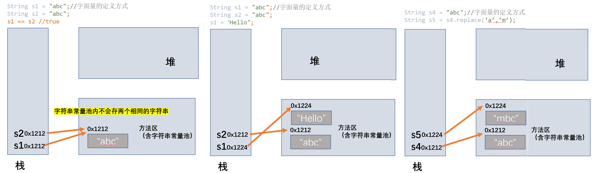

#  String

## String概述

- String（字符串）：Java 程序中的所有字符串字面值（"abc" ）都作为此类的实例实现。
- String是一个final类，代表不可变的字符序列。字符串是常量，用双引号引起来表示。它们的值在创建之后不能更改。
- String实现Serializable接口、Comparable接口。
- String内部定义了final char[] value用于存储字符串数据。
- 字符串常量池中是不会存储相同内容（String#equals()==true）的字符串的。

## 不可变性

1. 当字符串重新赋值时，需要重新指定内存区域赋值，不能使用原有的value进行赋值
       
       
2. 当对现有的字符串进行连接操作时，也需要重新指定内存区域赋值，不能使用原有的value进行赋值。
3. 当调用String的replace()方法修改指定的字符或字符串时，也需要重新指定内存区域赋值，不能使用原有的value进行赋值。
       

```java
@Test
public void test(){
    String s1 = "abc";//字面量的定义方式
    String s2 = "abc";

    System.out.println(s1 == s2); //s1和s2指向同一个对象
    //true

    s1 = "hello";

    System.out.println(s1 == s2); //false

    System.out.println(s1);
    System.out.println(s2);

    String s3 = "abc";
    s3 += "def";
    System.out.println(s3);
    System.out.println(s3 == s2);//true

    String s4 = "abc";
    String s5 = s4.replace('a','m');
    System.out.println(s4);
    System.out.println(s5);
}
```


- String str = "hello";
- String s1 = new String();    
  - //本质上this.value = new char[0];
- String s2 = new String(String original); 
  - //this.value = original.value;
- String s3 = new String(char[] a); 
  - //this.value = Arrays.copyOf(value, value.length);
- String s4 = new String(char[] a,int startIndex,int count);

## String实例化

1. 方式1：通过字面量定义的方式
2. 方式2：通过new + 构造器的方式

**String s = new String("abc")；方式创建对象，在内存中创建了几个对象？**

- 两个：一个堆空间中的new结构，一个char[]对应的常量池中的数据"abc".

    
    
    

```java
@Test
public void test2() {
//      通过字面量定义的方式：此时的s1和s2的数据javaEE声明在方法区中的字符串常量池中。
    String s1 = "javaEE";
    String s2 = "javaEE";
//      通过new + 构造器的方式：此时的s3和s4保存的地址值，是数据在堆空间开辟空间以后对应的地址值。
    String s3 = new String("javaEE");
    String s4 = new String("javaEE");

    System.out.println(s1 == s2);//true
    System.out.println(s1 == s3);//false
    System.out.println(s1 == s4);//false
    System.out.println(s3 == s4);//false

    Person p1 = new Person("Tom",12);
    Person p2 = new Person("Tom",12);
    System.out.println(p1.name == p2.name);//true
    Person p3 = new Person(new String("Tom"),12);
    Person p4 = new Person(new String("Tom"),12);
    System.out.println(p1.name == p3.name);//false
    System.out.println(p3.name == p4.name);//false
}
```

## String常量池

- 常量与常量的拼接结果在常量池。且常量池中不会存在相同内容的常量。
- 只要其中有一个是变量，结果就在堆中
- 如果拼接的结果调用`intern()方法`，返回值就在常量池中

```java
@Test
public void test3(){
    String s1 = "javaEE";
    String s2 = "hadoop";

    //字面量：s3,s4都在常量池内
    String s3 = "javaEEhadoop";
    String s4 = "javaEE" + "hadoop";
    //变量：堆空间中开辟
    String s5 = s1 + "hadoop";
    String s6 = "javaEE" + s2;
    String s7 = s1 + s2;

    System.out.println(s3 == s4); //true
    System.out.println(s3 == s5); //false
    System.out.println(s3 == s6); //false
    System.out.println(s3 == s7); //false

    System.out.println(s4 == s5); //false
    System.out.println(s4 == s6); //false
    System.out.println(s4 == s7); //false

    System.out.println(s5 == s6); //false
    System.out.println(s5 == s7); //false

    System.out.println(s6 == s7); //false

    String s8 = s5.intern();
    //返回值得到的s8是使用常量池中已经存在的"javaEEhadoop"
    System.out.println(s3 == s8); //true
}
```

```java
@Test
public void test1() {
    String s1 = "javaEEhadoop";
    final String s2 = "javaEE";
    String s3 = s2 + "hadoop";
    System.out.println(s1 == s3); //true
// 常量与常量的拼接结果在常量池。
}
```

- String s1 = "a"; 
  - 说明：在字符串常量池中创建了一个字面量为"a"的字符串。
- s1 = s1 + "b"; 
  - 说明：实际上原来的“a”字符串对象已经丢弃了，现在在堆空间中产生了一个字符串s1+"b"（也就是"ab")。如果多次执行这些改变串内容的操作，会导致大量副本字符串对象存留在内存中，降低效率。如果这样的操作放到循环中，会极大影响程序的性能。
- String s2 = "ab";
  - 说明：直接在字符串常量池中创建一个字面量为"ab"的字符串。
- String s3 = "a" + "b";
  - 说明：s3指向字符串常量池中已经创建的"ab"的字符串。
- String s4 = s1.intern();
  - 说明：堆空间的s1对象在调用intern()之后，会将常量池中已经存在的"ab"字符串赋值给s4。

```java
public class StringTest {
    String str = new String("good");
    char[] ch = {'t', 'e', 's', 't'};

    public void change(String str, char ch[]) {
        str = "test ok";
        ch[0] = 'b';
    }

    public static void main(String[] args) {
        StringTest ex = new StringTest();
        ex.change(ex.str, ex.ch);
        System.out.println(ex.str);//good
        //String的不可变性
        System.out.println(ex.ch);//best
    }
}
```

## 常用方法

### 基本

- int length()：返回字符串的长度： return value.length
- char charAt(int index)： 返回某索引处的字符return value[index]
- boolean isEmpty()：判断是否是空字符串：return value.length == 0
- String toLowerCase()：使用默认语言环境，将 String 中的所有字符转换为小写
- String toUpperCase()：使用默认语言环境，将 String 中的所有字符转换为大写
- String trim()：返回字符串的副本，忽略前导空白和尾部空白
- boolean equals(Object obj)：比较字符串的内容是否相同
- boolean equalsIgnoreCase(String anotherString)：与equals方法类似，忽略大小写
- String concat(String str)：将指定字符串连接到此字符串的结尾。 等价于用“+”
- int compareTo(String anotherString)：比较两个字符串的大小
- String substring(int beginIndex)：返回一个新的字符串，它是此字符串的从beginIndex开始截取到最后的一个子字符串。
- String substring(int beginIndex, int endIndex) ：返回一个新字符串，它是此字符串从beginIndex开始截取到endIndex(不包含)的一个子字符串。

```java
String s1 = "hellpworld";
System.out.println(s1.length()); //10
System.out.println(s1.charAt(0)); // h
System.out.println(s1.charAt(9)); //d
//s1 = "";
//System.out.println(s1.isEmpty()); //true

//s1.toLowerCase(); s1.toUpperCase() s1不可变，仍然为原来的字符串。
System.out.println(s1.toLowerCase());
String s2 = s1.toUpperCase();
System.out.println(s1);  // s1不可变，仍然为原来的字符串
System.out.println(s2);

System.out.println(s2.equals(s1)); //false
//忽略大小写的equals()
System.out.println(s2.equalsIgnoreCase(s1)); //true

String s3 = "  he llo   w o rld   ";
String s4 = s3.trim();//去除首尾的空格
System.out.println("-" + s3 + "-"); //-  he llo   w o rld   -
System.out.println("-" + s4 + "-"); //-he llo   w o rld-

String s5 = "abc";
//连接字符串
String s6 = s5.concat("def");
System.out.println(s6); //abcdef

String s7 = "abc";
String s8 = new String("bda");
//compareTo()字符串做加减法 //涉及到字符串的排序
//依照ASCII码的加减：a=97,b=98,c=99,d=100;
//"abc".compareTo("bda"); (97+98+99) - (98+100+97) == -1;
System.out.println(s7.compareTo(s8)); //-1

String s9 = "天下第一，举世无二";
//substring(n) 截取从下标n(包括n)开始一直到所有的字符
System.out.println(s9.substring(2));
//substring(n,m) 截取从下标n(包括n)开始一直到下标m(不包括m)的字符
System.out.println(s9.substring(2,3));
```

### 前缀后缀

- boolean endsWith(String suffix)：测试此字符串是否以指定的后缀结束
- boolean startsWith(String prefix)：测试此字符串是否以指定的前缀开始
- boolean startsWith(String prefix, int toffset)：测试此字符串从指定索引开始的子字符串是否以指定前缀开始

```java
String str1 = "helloworld";

boolean b1 = str1.endsWith("ld");
System.out.println(b1); //true

boolean b2 = str1.startsWith("He");
System.out.println(b2); //false

boolean b3 = str1.startsWith("ll",2);
//从下标2开始的对应字符串是否匹配
System.out.println(b3); //true
```

### 索引（下标）位置

- boolean contains(CharSequence s)：当且仅当此字符串包含指定的 char 值序列时，返回 true
- int indexOf(String str)：返回指定子字符串在此字符串中第一次出现处的索引
- int indexOf(String str, int fromIndex)：返回指定子字符串在此字符串中第一次出现处的索引，从指定的索引开始
- int lastIndexOf(String str)：返回指定子字符串在此字符串中最右边出现处的索引
- int lastIndexOf(String str, int fromIndex)：返回指定子字符串在此字符串中最后一次出现处的索引，从指定的索引开始反向搜索
  - 注：indexOf和lastIndexOf方法如果未找到都是返回-1
  - indexOf(str)和lastIndexOf(str)返回值相同的情况:
    - 存在唯一的一个str
    - 不存在str

```java
String str1 = "helloworld";
String str2 = "wo";
//s1.contains(s2) s1是否包含s2
System.out.println(str1.contains(str2)); //true

//s1.indexOf(s2) s2在s1中第一次出现的下标位置;没有则返回-1
System.out.println(str1.indexOf("lo")); //3
System.out.println(str1.indexOf("HHH")); //-1
//s1.indexOf(s2,n) 从指定的下标n（包含该下标n)开始查找,返回的仍然是整个字符串的下标
System.out.println(str1.indexOf("lo", 3)); //3
//s1.lastIndexOf(s1) 从字符串后面开始查找(最后一次)出现的下标
System.out.println(str1.lastIndexOf("l")); //8
//s1.lastIndexOf(s1,n) 从指定的下标n（包含该下标n)(仍然是正向的下标)开始反向查找，最后一次出现的下标位置,返回的仍然是整个字符串的下标
System.out.println(str1.lastIndexOf("l",8)); //8
```

### 正则

- String replace(char oldChar, char newChar)：返回一个新的字符串，它是通过用 newChar 替换此字符串中出现的所有 oldChar 得到的。
- String replace(CharSequence target, CharSequence replacement)：使用指定的字面值替换序列替换此字符串所有匹配字面值目标序列的子字符串。
- String replaceAll(String regex, String replacement) ： 使用给定的replacement 替换此字符串所有匹配给定的正则表达式的子字符串。
- String replaceFirst(String regex, String replacement) ： 使用给定的replacement 替换此字符串匹配给定的正则表达式的第一个子字符串。
- boolean matches(String regex)：告知此字符串是否匹配给定的正则表达式。
- String[] split(String regex)：根据给定正则表达式的匹配拆分此字符串。
- String[] split(String regex, int limit)：根据匹配给定的正则表达式来拆分此字符串，最多不超过limit个，如果超过了，剩下的全部都放到最后一个元素中。

```java
String str1 = "天下第一，下，举世无二";
//替换字符串中所有匹配的 一个字符''或字符串""
String str2 = str1.replace('下','世');

System.out.println(str1); //天下第一，下，举世无二
System.out.println(str2); //天世第一，世，举世无二
System.out.println(str1.replace("天下", "世上")); //世上第一，下，举世无二

String str01 = "12bhbad2sada3ifb73nn2j9";
//把字符串中的数字替换成'，'如果结果中开头和结尾有'，'的话去掉，
//d-数字; +-数量; ^-开头; $-结尾
String string = str01.replaceAll("\\d+",",").replaceAll("^,|,$","");
System.out.println(string); //bhbad,sada,ifb,nn,j

String str02 = "12345";
//判断字符串中是否全部由数字组成，即由1-n个数字组成
boolean matches = str02.matches("\\d+");
System.out.println(matches); //true

String tel = "1885-0035771";
// \\d{7,8} 是否是7-8位的数字
boolean result = tel.matches("1885-\\d{7,8}");
System.out.println(result);//true

String str03 = "hello|world|java";
//切片
String[] strs = str03.split("\\|");
for(int i =0;i<strs.length;i++){
    System.out.println(strs[i]);
}

System.out.println();

String str04 = "hellp.world.java";
//切片
String[] strs2 = str04.split("\\.");
for(int i = 0;i<strs2.length;i++){
    System.out.println(strs2[i]);
}
```

## String类型转换

### String、基本数据类型/包装类转换

#### parseXxx() String-->基本数据类型/包装类

```
基本数据类型/包装类 变量 = 包装类.parseXxx(String str);
```

#### valueOf() 基本数据类型/包装类-->String

- 调用String类重载的valueOf()。

```java
public String valueOf(int n){...};
```

```
String 变量 = String.valueOf(基本数据类型/包装类)
String 变量 = 基本数据类型/包装类 + "";
```

### String、char[]转换

#### String-->char[]

- String#toCharArray()。
- String#getChars()：将指定索引范围内的字符串存放到char[]。

```java
public void getChars(int srcBegin, int srcEnd, char[] dst, int dstBegin)
```

```java
String str1 = "abc123";
char[] chars = str1.toCharArray();
for(int i =0; i < chars.length; i++){
    System.out.println(chars[i]);
}
```

#### char[]-->String

- String的构造器`new String(char[] chars)`：

```java
char chars[] = new char[]{'h','e','l','l','o'};
String str = new String(chars);
System.out.println(str); //hello
```

### String、byte[]转换

- 编码: 字符串-->字节(二级制数据)。
- 解码: 字节-->字符串。（编码的逆过程）

#### Sting-->byte[] 编码

- String#getBytes("指定编码集")：throws UnsupportedEncodingException。

```java
byte[] bytes = "str".getBytes("utf-8");
```

#### byte[]-->String 解码

- String 字符串 = new String(字节数组,"指定编码集");

```java
String str = new String(bytes,"utf-8");
```

- 解码时使用的字符集必须与编码时使用的字符集相一致，否则乱码。

```java
String str1 = "abc123";

//      ----编码
byte[] bytes = str1.getBytes(); //使用默认的字符集UTF-8，进行转换
//        ASCII码
System.out.println(Arrays.toString(bytes));
//        [97, 98, 99, 49, 50, 51]

String str2 = "abc123中国";
//        String str1 = "abc123中国"; 需要指定字符集
byte[] bytes2 = str2.getBytes();
//        [97, 98, 99, 49, 50, 51, -28, -72, -83, -27, -101, -67] UTF-8中一个中文三个字节
//使用指定的字符集，进行转换
//        需要throws UnsupportedEncodingException;
byte[] gbks = str2.getBytes("gbk");
//使用gbk字符集进行编码
//          编码: 字符串-->字节(二级制数据)
//          解码: 字节-->字符串 编码的逆过程
System.out.println(Arrays.toString(gbks));
//        [97, 98, 99, 49, 50, 51, -42, -48, -71, -6]

//        ----解码
String string = new String(bytes2); //使用默认的字符集解码
System.out.println(string); //abc123中国

String str3 = new String(gbks);
//        编码解码使用的字符集不一致 乱码
System.out.println(str3); //abc123�й�
//        指定解码的字符集
String str4 = new String(gbks, "gbk");
System.out.println(str4); //abc123中国
```

# StringBuffer、StringBuilder

## String、StringBuffer、StringBuilder

### 转换

- String --> StringBuffer/StringBuilder
  - 调用StringBuffer/StringBuilder构造器
- StringBuffer/StringBuilder --> String
  - 调用String构造器
  - 对应的toString()方法   

### 比较

| 比较       | String   | StringBuffer                     | StringBuilder        |
| ---------- | -------- | -------------------------------- | -------------------- |
| 不可变性   | 不可变性 | 可变                             | 可变                 |
| 底层存储   | char[]   | char[]                           | char[]               |
| 安全、效率 | 效率最低 | 线程安全（sychronized)，效率较低 | 线程不安全，效率较高 |

```java
StringBuffer sb1 = new StringBuffer("abc");
sb1.setCharAt(0,'m');
System.out.println(sb1); //mbc StringBuffer可变性
```

## 底层数组扩容

1. StringBuffer的长度问题
2. 扩容问题: 如果要添加的数据，底层数组存不下，那么需要扩容底层的数组。

  - 开发中，建议使用StringBuffer(int capacity) 或StringBuilder(int capacity);指定额外的数组长度(默认16)   
    - 默认情况下扩容为原来的2倍+2，同时将原有数组中的元素复制到新的数组中
    - 如果还是不满足，则直接将该数组作为新的数组。

```java
String str = new String(); //new char[0];
String str1 = new String("abc"); //new char[3]{'a','b','c'};

StringBuffer sb1 = new StringBuffer(); //char[] value = new char[16]; 相当于底层创建了一个长度是16的数组
System.out.println(sb1.length()); //0 而不是16
sb1.append('a'); //value[0] = 'a';
sb1.append('b'); //value[1] = 'b';

StringBuffer sb2 = new StringBuffer("abc"); // char[] value = new char["abc".length() + 16];
System.out.println(sb2.length()); //3 而不是19
```

## StringBuffer常用方法

- StringBuffer append(xxx)：提供了很多的append()方法，用于进行字符串拼接
- StringBuffer delete(int start,int end)：删除指定位置的内容,包括end位置的内容
- StringBuffer replace(int start, int end, String str)：把[start,end)位置替换为str
- StringBuffer insert(int offset, xxx)：在指定位置插入xxx
- StringBuffer reverse() ：把当前字符序列逆转
- public int indexOf(String str)
- public String substring(int start,int end) : 返回[start,end)的字符串
- public int length()
- public char charAt(int n )
- public void setCharAt(int n ,char ch)

```java
@Test
public void test3() {
    StringBuffer s1 = new StringBuffer("abc");

    s1.append(1); //追加
    s1.append('d'); //追加
    System.out.println(s1); //abc1d

    s1.delete(2, 4); //只删除包括起始下标到（不包括）结束下标
    System.out.println(s1); //abd

    s1.replace(1, 2, "hello"); //替换[1,2)的内容
    System.out.println(s1); //ahellod

    s1.insert(2, false); //在指定位置插入内容
    System.out.println(s1); //ahfalseellod
    System.out.println(s1.length()); //12 false也视为字符串

    s1.reverse();
    System.out.println(s1); //dolleeslafha

    String s2 = s1.substring(1, 3);
    System.out.println(s1); //dolleeslafha
    System.out.println(s2); //ol
}
```
