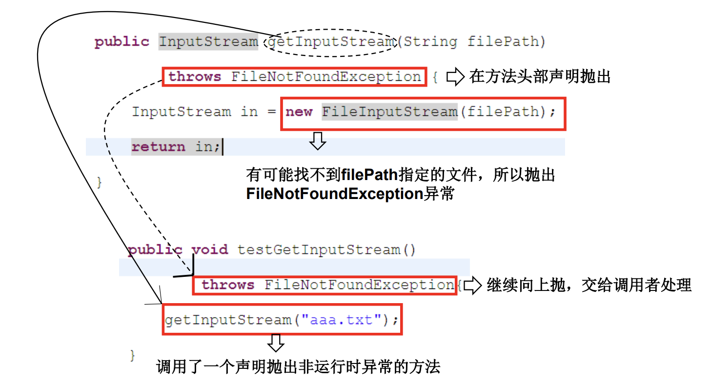

# 异常概述

- 异常又称为例外(Exception)，是一个在程序执行期间发生的事件，中断正在执行程序的正常指令流。

**异常产生主要有如下三种原因：**

1. Java 内部错误发生异常，Java 虚拟机产生的异常。
2. 编写的程序代码中的错误所产生的异常，例如空指针异常、数组越界异常等。
3. 通过 throw 语句手动生成的异常，一般用来告知该方法的调用者一些必要信息。

**Java程序在执行过程中所发生的异常事件可分为两类：**

- Error：定义了在通常环境下不希望被程序捕获的异常。Java虚拟机无法解决的严重问题。
  - Error 错误是任何处理技术都无法恢复的情况，肯定会导致程序非正常终止。并且 Error 错误属于未检查类型，大多数发生在运行时。如：JVM系统内部错误、资源耗尽等严重情况。比如：栈溢出: java.lang.StackOverflowError和堆溢出: java.lang.OutOfMemoryError。

- Exception: 其它因编程错误或偶然的外在因素导致的一般性问题，可以使用针对性的代码进行处理。Exception 又分为可检查（checked）异常和不检查（unchecked）异常，
  - 可检查异常在源码里必须显示的进行捕获处理，这里是编译期检查的一部分
  - 不检查异常就是所谓的运行时异常，通常是可以编码避免的逻辑错误，具体根据需要来判断是否需要捕获，并不会在编译器强制要求。

# 异常体系结构  


- 所有异常类型都是内置类 **java.lang.Throwable** 类的子类，即 Throwable 位于异常类层次结构的顶层。Error（错误）和 Exception（异常）都是 java.lang.Throwable 类的子类，在 Java 代码中只有继承了 Throwable 类的实例才能被 throw 或者catch。

**Exception**  

- 运行时异常 (不检查异常（Unchecked Exception）)。
  -  是指编译器不要求强制处置的异常。一般是指编程时的逻辑错误，是程序员应该积极避免其出现的异常。
  -  java.lang.RuntimeException类及它的子类都是运行时异常。
  -  对于这类异常，可以不作处理，因为这类异常很普遍，若全处理可能会对程序的可读性和运行效率产生影响。
- 编译时异常 (检查异常（Checked Exception）)
  - 是指编译器要求必须处置的异常。即程序在运行时由于外界因素造成的一般性异常。编译器要求Java程序必须捕获或声明所有编译时异常。
  - 对于这类异常，如果程序不处理，可能会带来意想不到的结果。

# 常见异常Exception

## 运行时异常

- java.lang.RuntimeException

   

## 编译时异常

- java.io.IOExeption
- java.lang.ClassNotFoundException
- java.lang.InterruptedException
- java.io.FileNotFoundException
- java.sql.SQLException

   

1. 运行时异常（RuntimeException）：

- NullPropagation：空指针异常；
- ClassCastException：类型强制转换异常
- IllegalArgumentException：传递非法参数异常
- IndexOutOfBoundsException：下标越界异常
- NumberFormatException：数字格式异常

2. 非运行时异常：

- ClassNotFoundException：找不到指定 class 的异常
- IOException：IO 操作异常

3. 错误（Error）：

- NoClassDefFoundError：找不到 class 定义异常
- StackOverflowError：深递归导致栈被耗尽而抛出的异常
- OutOfMemoryError：内存溢出异常

# 异常处理机制

- Java采用的异常处理机制，是将异常处理的程序代码集中在一起，与正常的程序代码分开，使得程序简洁、优雅，并易于维护。

**Java提供的是异常处理的抓抛模型。**

**对异常的处理**

- Java 通过面向对象的方法来处理异常。在一个方法的运行过程中，如果发生了异常，则这个方法会**产生代表该异常的一个对象**，并把它交给运行时的系统，运行时系统寻找相应的代码来处理这一异常。

- 生成异常对象，并把它提交给运行时系统的过程称为拋出（throw）异常。
- 运行时系统在方法的调用栈中查找，直到找到能够处理该类型异常的对象，称为捕获（catch）异常

- 过程一：抛出
  - 程序在正常执行的过程中，一旦出现异常，就会在异常代码处**生成一个对应异常类的对象**，并将此对象抛出。
  - **一旦抛出对象之后，其他的代码就不执行**。
- 过程二：捕获 （异常的处理方式）
  1. try-catch-finally
  2. thr+ows

 

**异常对象的生成**

- 由虚拟机自动生成：程序运行过程中，虚拟机检测到程序发生了问题，如果在当前代码中没有找到相应的处理程序，就会在后台自动创建一个对应常类的实例对象并抛出——自动抛出

- 由开发人员手动创建：Exception exception;

如果一个方法内抛出异常，该异常对象会被抛给调用者方法中处理。如果异常没有在调用者方法中处理，它继续被抛给这个调用方法的上层方法。这个过程将一直继续下去，直到异常被处理。这一过程称为捕获(catch)异常。

如果一个异常回到main()方法，并且main()也不处理，则程序运行终止。

程序员通常只能处理Exception，而**对Error无能为力**。

## try-catch-finally  

```java
try{
    //可能出现异常的代码
}catch(异常类型1 变量名1){
    //处理异常的方式1
}catch(异常类型2 变量名2){
    //处理异常的方式2
}finally{
    //一定会执行的代码
}
```

- catch 块和 finally 块都是可选的，但 catch 块和 finally 块至少出现其中之一，也可以同时出现；
  - 多个 catch 块必须位于 try 块之后，finally 块必须位于所有的 catch 块之后。 
- 使用try将可能出现异常的代码块包装起来，一旦出现异常，就会生成一个对应异常类的对象，根据此对象的类型，去catch中进行匹配
- 一旦try中的异常对象匹配到某一个catch时，就进入catch中进行异常处理。一旦处理完成，就跳出当前的try-catch结构（在没有finally的情况下）。进行执行其后的代码。**如果 try 代码块中拋出的异常没有被任何 catch 子句捕捉到，那么将直接执行 finally 代码块中的语句，并把该异常传递给该方法的调用者。finally不管有没有捕获异常都会执行**。
- catch中的异常类型如果满足子父类关系，则要求子类一定声明在父类的上面，否则报错
  - catch中的异常类型如果没有子父类关系，则谁声明在上无所谓

- 在try结构中声明定义的对象，在出了try结构以后，不能被调用
  - 可以在try结构外面先对改变量进行声明初始化 
- try-catch-finally结构可以相互嵌套

**总结**

- 体会1： 使用try-catch-finally处理编译时异常，使得程序在编译时就不再报错，但是运行时仍可能报错，相当于我们使用try-catch-finally将第一个编译时可能出现的异常，延迟到运行时出现(相当于把一个编译时异常变为运行时异常)
- 体会2：开发中，由于运行时异常比较常见，所以我们不针对运行时异常编写try-catch-finally。
  - 针对编译时异常，我们一定要考虑异常的处理。

**常用的异常对象处理方式：**

1. `getMessage()`获取异常信息，返回字符串
2. `printStackTrace()` 获取异常类名和异常信息，以及异常出现在程序中的位置。返回值void。

```java
public class ExceptionTest1 {
    @Test
    public void test1() {

        String str = "abc";

        int num = 0;
        try {
            num = Integer.parseInt(str);
//          int num = Integer.parseInt(str);

//          抛出异常,一旦处理完成，就跳出当前的try-catch结构
//          没有执行下面的语句
            System.out.println("1");
        } catch (NumberFormatException e) {
            System.out.println("出现数值转换异常");
//          String getMessage()
            System.out.println(e.getMessage());
//          printStackTrace
            e.printStackTrace();
        } catch (NullPointerException e) {
            System.out.println("出现空指针异常");
        } catch (Exception e) {
            System.out.println("出现异常");
        }
//      } catch (Exception e) {
//          System.out.println("出现异常");
//      //Unreachable catch block
//      catch中的异常类型如果满足子父类关系，则要求子类一定声明在父类的上面，否则报错
//      } catch (NumberFormatException e) {
//          System.out.println("出现数值转换异常");
//      }
//      执行
        System.out.println("2");

//      System.out.println(num);
    }

    @Test
    public void test2() {
        try {
            File file = new File("hello.txt");
            FileInputStream fis = new FileInputStream(file);

            int data = fis.read();
            while (data != -1) {
                System.out.println((char) data);
                data = fis.read();
            }

            fis.close();
        } catch (FileNotFoundException e) {
            e.printStackTrace();
        } catch (IOException e) {
            e.printStackTrace();
        }
    }
}
```

### finally

- finally语句为异常处理提供一个统一的出口，使得在控制流转到程序的其它部分以前，能够对程序的状态作统一的管理。

- finally是可选的
- **finally中声明的是一定会被执行的代码**。
  - 即使catch中又出现异常了，try或catch中有return语句等情况。
  - 除非在 try 块、catch 块中调用了退出虚拟机的方法`System.exit(int status)`，否则不管在 try 块或者 catch 块中执行怎样的代码，出现怎样的情况，异常处理的 finally 块总会执行。
- 像数据库连接，输入输出流（IO），网络编程Socket等资源，JVM是不能自动回收的，我们需要自己手动的进行资源的释放。此时的**资源释放**，就需要声明在finally中。(注：Java 9增强的自动资源管理)

   

```java
package com.zjk;

import java.io.File;
import java.io.FileInputStream;
import java.io.FileNotFoundException;
import java.io.IOException;

import org.junit.Test;

public class ExceptionTest1 {
    @Test
    public void test1() {

        String str = "abc";

        int num = 0;
        try {
            num = Integer.parseInt(str);
//          int num = Integer.parseInt(str);

//          抛出异常,一旦处理完成，就跳出当前的try-catch结构
//          没有执行下面的语句
            System.out.println("1");
        } catch (NumberFormatException e) {
            System.out.println("出现数值转换异常");
//          String getMessage()
            System.out.println(e.getMessage());
//          printStackTrace
            e.printStackTrace();
        } catch (NullPointerException e) {
            System.out.println("出现空指针异常");
        } catch (Exception e) {
            System.out.println("出现异常");
        }
//      } catch (Exception e) {
//          System.out.println("出现异常");
//      //Unreachable catch block
//      catch中的异常类型如果满足子父类关系，则要求子类一定声明在父类的上面，否则报错
//      } catch (NumberFormatException e) {
//          System.out.println("出现数值转换异常");
//      }
//      执行
        System.out.println("2");

//      System.out.println(num);
    }

    @Test
    public void test2() {
        try {
            File file = new File("hello.txt");
            FileInputStream fis = new FileInputStream(file);

            int data = fis.read();
            while (data != -1) {
                System.out.println((char) data);
                data = fis.read();
            }

            fis.close();
        } catch (FileNotFoundException e) {
            e.printStackTrace();
        } catch (IOException e) {
            e.printStackTrace();
        }
    }
}
```

#### 增强的自动资源管理

##### Java7

**当 try 代码块结束时，自动释放资源。不再需要显式的调用 close() 方法，该形式也称为“带资源的 try 语句”。**

- 当程序使用 finally 块关闭资源时，程序会显得异常臃肿
  - 为了解决这种问题，Java 7 增加了一个新特性，该特性提供了另外一种管理资源的方式，这种方式能自动关闭文件，被称为自动资源管理（Automatic Resource Management）。该特性是在 try 语句上的扩展，主要释放不再需要的文件或其他资源。

- 自动资源管理替代了 finally 代码块，并优化了代码结构和提高程序可读性。
- 语法

```java
try (声明或初始化资源语句) {
    // 可能会生成异常语句
} catch(Throwable e1){
    // 处理异常e1
} catch(Throwable e2){
    // 处理异常e1
} catch(Throwable eN){
    // 处理异常eN
}
```

**注意：**

- try 语句中声明的资源被隐式声明为 final，资源的作用局限于带资源的 try 语句。
- 可以在一条 try 语句中声明或初始化多个资源，每个资源以;隔开即可。
- 需要关闭的资源必须实现了 AutoCloseable 或 Closeable 接口。
  - Closeable 是 AutoCloseable 的子接口，Closeable 接口里的 close() 方法声明抛出了 IOException，因此它的实现类在实现 close() 方法时只能声明抛出 IOException 或其子类；AutoCloseable 接口里的 close() 方法声明抛出了 Exception，因此它的实现类在实现 close() 方法时可以声明抛出任何异常。

Java 7 几乎把所有的“资源类”（包括文件 IO 的各种类、JDBC 编程的 Connection 和 Statement 等接口）进行了改写，改写后的资源类都实现了 AutoCloseable 或 Closeable 接口。

```java
public class AutoCloseTest {
    public static void main(String[] args) throws IOException {
        try (
                // 声明、初始化两个可关闭的资源
                // try语句会自动关闭这两个资源
                BufferedReader br = new BufferedReader(new FileReader("AutoCloseTest.java"));
                PrintStream ps = new PrintStream(new FileOutputStream("a.txt"))) {
            // 使用两个资源
            System.out.println(br.readLine());
            ps.println("C语言中文网");
        }
    }
}
```

##### Java9

Java 9 再次增强了这种 try 语句。Java 9 不要求在 try 后的圆括号内声明并创建资源，只需要自动关闭的资源有 final 修饰或者是有效的 final (effectively final)，Java 9 允许将资源变量放在 try 后的圆括号内。上面程序在 Java 9 中可改写为如下形式。

```java
public class AutoCloseTest {
    public static void main(String[] args) throws IOException {
        // 有final修饰的资源
        final BufferedReader br = new BufferedReader(new FileReader("AutoCloseTest.java"));
        // 没有显式使用final修饰，但只要不对该变量重新赋值，该变量就是有效的
        final PrintStream ps = new PrintStream(new FileOutputStream("a. txt"));
        // 只要将两个资源放在try后的圆括号内即可
        try (br; ps) {
            // 使用两个资源
            System.out.println(br.readLine());
            ps.println("C语言中文网");
        }
    }
}
```


## throws 异常类型

- `throws 异常类型`(声明抛出异常)写在方法的声明处，指明此方法执行时，可能会抛出的异常类型
  - 一旦当方法体执行时，出现异常仍然会在异常代码处生成一个异常类的对象，此对象满足throws后异常类型时，就会被抛出。异常代码后续的代码就不再执行。
  - 使用 throws 声明抛出异常的思路是，当前方法不知道如何处理这种类型的异常，该异常应该**由向上一级的调用者处理**；如果 main 方法也不知道如何处理这种类型的异常，也可以使用 throws 声明抛出异常，该异常将交给 JVM 处理。JVM 对异常的处理方法是，打印异常的跟踪栈信息，并中止程序运行，这就是前面程序在遇到异常后自动结束的原因。
- 体会：
  - try-catch-finally：真正地将异常给处理了
  - throws地方式只是将异常抛给了方法的调用者，并没有真正将异常处理掉 。

   

### 例

```java
package com.zjk;

import java.io.File;
import java.io.FileInputStream;
import java.io.FileNotFoundException;
import java.io.IOException;

public class ExceptionTest2 {

    public static void main(String[] args) {
        try {
            method2();
//      method2()的异常抛给main()方法
        } catch (IOException e) {
            e.printStackTrace();
        }
        
        method3();
//      在method3()中解决异常，不再往上抛

    }

    public static void method3() {
        try {
            method2();
        } catch (IOException e) {
            e.printStackTrace();
        }
    }
    
    public static void method2() throws IOException {
        method1();
//      method1()的异常抛给method2()
    }

    public static void method1() throws FileNotFoundException, IOException {
        File file = new File("hello1.txt");
        FileInputStream fis = new FileInputStream(file);

        int data = fis.read();
        while (data != -1) {
            System.out.println((char) data);
            data = fis.read();
        }

        fis.close();
        
        System.out.println("method1");//不执行
//      满足throws后异常类型时，就会被抛出。异常代码后续的代码就不再执行。
    }
}
```

### 重写方法异常抛出的规则

- 子类重写的方法抛出的异常类型不大于父类被重写的方法抛出的异常类型

```java
package com.zjk;

import java.io.FileNotFoundException;
import java.io.IOException;

public class OverrideTest {
    
    public static void main(String[] args) {
        OverrideTest test = new OverrideTest();
        test.display(new SubClass());
    }

    public void display(SuperClass s) {
        try {
            s.method();
        } catch (IOException e) {
//          只处理了父类抛出的异常，如果子类重写的方法抛出的异常大于父类的异常
//          则子类在调用时出现异常的无法被处理，
            e.printStackTrace();
        }
    }
}

class SuperClass{
    
    public void method() throws IOException{
        
    }
}


class SubClass extends SuperClass{
    @Override
    public void method() throws FileNotFoundException {
//  public void method() throws Exception {
//      子类重写父类的方法，抛出的异常不能大于父类抛出的异常
//      如果父类没有抛出异常，子类也不能抛出
        
    }
}
```

## 开发中选择使用哪一个处理

- 如果父类中被重写的方法没有被throws方式处理异常，则子类重写的方法也不能使用throws，意味着如果子类重写的方法中有异常，必须使用try-catch-finally方式处理。
- 执行的方法中，先后又调用了另外的几个方法，这几个方法是递进关系执行的（A调用B，B调用C...），我们建议这几个方法使用throws的方式进行处理，而执行的方法A可以考虑使用try-catch-finally的方式进行处理。
  - 如果在C方法中使用了try-catch-finally，则C方法中有的代码可能没有执行，传递给B方法的数据可能有误（或没有数据），但B方法仍然执行，但无意义。所以在B,C方法中使用throws，而在A中处理。如果B,C方法中出现异常，则立刻终止执行，将异常抛给A方法解决。 

## 手动抛出异常 throw

- Java异常类对象除在程序执行过程中出现异常时由系统自动生成并抛出，也可根据需要使用人工创建并抛出。
- 首先要生成异常类对象，然后通过throw语句实现抛出操作(提交给Java运行环境)。

- 当 throw 语句执行时，它后面的语句将不执行，此时程序转向调用者程序，寻找与之相匹配的 catch 语句，执行相应的异常处理程序。如果没有找到相匹配的 catch 语句，则再转向上一层的调用程序。这样逐层向上，直到最外层的异常处理程序终止程序并打印出调用栈情况。

- throw 关键字不会单独使用，它的使用完全符合异常的处理机制，但是，一般来讲用户都在避免异常的产生，所以不会手工抛出一个新的异常类的实例，而往往会抛出程序中已经产生的异常类的实例。

```java
IOException e = new IOException();
throw e;
```

- 可以抛出的异常必须是Throwable或其子类的实例.

```java
package com.zjk;

public class StudentTest {

    public static void main(String[] args) {
        Student s = new Student();

        try {
            s.regist(-1);
            System.out.println(s);
        } catch (Exception e) {
            // TODO Auto-generated catch block
            System.out.println(e.getMessage());
        }
    }
}

class Student {

    private int id;

    public void regist(int id) throws Exception {
        if (id > 0) {
            this.id = id;
        } else {
//          手动抛出异常对象
//          throw new RuntimeException("数据输入非法");
            throw new Exception("输入数据非法");
        }
    }

    @Override
    public String toString() {
        return "Student [id=" + id + "]";
    }

}
```

### 例 

在某仓库管理系统中，要求管理员的用户名需要由 8 位以上的字母或者数字组成，不能含有其他的字符。当长度在 8 位以下时拋出异常，并显示异常信息；当字符含有非字母或者数字时，同样拋出异常，显示异常信息。代码如下：

```java
import java.util.Scanner;

public class Test05 {
    public boolean validateUserName(String username) {
        boolean con = false;
        if (username.length() > 8) {
            // 判断用户名长度是否大于8位
            for (int i = 0; i < username.length(); i++) {
                char ch = username.charAt(i); // 获取每一位字符
                if ((ch >= '0' && ch <= '9') || (ch >= 'a' && ch <= 'z') || (ch >= 'A' && ch <= 'Z')) {
                    con = true;
                } else {
                    con = false;
                    throw new IllegalArgumentException("用户名只能由字母和数字组成！");
                }
            }
        } else {
            throw new IllegalArgumentException("用户名长度必须大于 8 位！");
        }
        return con;
    }

    public static void main(String[] args) {
        Test05 te = new Test05();
        Scanner input = new Scanner(System.in);
        System.out.println("请输入用户名：");
        String username = input.next();
        try {
            boolean con = te.validateUserName(username);
            if (con) {
                System.out.println("用户名输入正确！");
            }
        } catch (IllegalArgumentException e) {
            System.out.println(e);
        }
    }
}
```

### throws 关键字和 throw 关键字在使用上的几点区别如下：

**throws**

- throws 处理异常的方式。使用在方法声明处的末尾。
  - 用来声明一个方法可能抛出的所有异常信息，表示出现异常的一种可能性，但并不一定会发生这些异常；
- 通常在一个方法（类）的声明处通过 throws 声明方法（类）可能拋出的异常信息，
- throws 通常不用显示地捕获异常，可由系统自动将所有捕获的异常信息抛给上级方法； <-> try-catch-finally

**throw**

- throw 抛出一个异常对象，并抛出。使用在方法内部<->自动抛出
- throw 则是指拋出的一个具体的异常类型，执行 throw 一定抛出了某种异常对象。 
- 在方法（类）内部通过 throw 声明一个具体的异常信息。
- throw 则需要用户自己捕获相关的异常，而后再对其进行相关包装，最后将包装后的异常信息抛出。

## Java 7新特性：多异常捕获

使用一个 catch 块捕获多种类型的异常时需要注意如下两个地方。

- 捕获多种类型的异常时，多种异常类型之间用竖线|隔开。
- 捕获多种类型的异常时，异常变量有隐式的 final 修饰，因此程序不能对异常变量重新赋值。

```java
public class ExceptionTest {
    public static void main(String[] args) {
        try {
            int a = Integer.parseInt(args[0]);
            int b = Integer.parseInt(args[1]);
            int c = a / b;
            System.out.println("您输入的两个数相除的结果是：" + c);
        } catch (IndexOutOfBoundsException | NumberFormatException | ArithmeticException e) {
            System.out.println("程序发生了数组越界、数字格式异常、算术异常之一");
            // 捕获多异常时，异常变量默认有final修饰
            // 所以下面代码有错
            e = new ArithmeticException("test");
        } catch (Exception e) {
            System.out.println("未知异常");
            // 捕获一种类型的异常时，异常变量没有final修饰
            // 所以下面代码完全正确
            e = new RuntimeException("test");
        }
    }
}
```

## 用户自定义异常类

- 一般地，用户自定义异常类都是RuntimeException的子类。
- 自定义异常类通常需要**编写几个重载的构造器**。
- 自定义异常需要提供**serialVersionUID**
- 自定义的异常通过throw抛出。
- 自定义异常最重要的是异常类的名字，当异常出现时，可以根据名字判断异常类型

如果 Java 提供的内置异常类型不能满足程序设计的需求，这时我们可以自己设计 Java 类库或框架，其中包括异常类型。实现**自定义异常类需要继承 Exception 类或其子类，如果自定义运行时异常类需继承 RuntimeException 类或其子类**。

**自定义异常的语法**形式为：

`<class><自定义异常名><extends><Exception>`

- 在编码规范上，一般将自定义异常类的类名命名为**XXXException**，其中 XXX 用来代表该异常的作用。
- 自定义异常类一般包含两个构造方法：
  - 一个是无参的默认构造方法，
  - 另一个构造方法以字符串的形式接收一个定制的异常消息，并将该消息传递给超类的构造方法。

```java
class IntegerRangeException extends Exception {
    public IntegerRangeException() {
        super();
    }
    public IntegerRangeException(String s) {
        super(s);
    }
}
```

```java
package com.zjk;

public class MyException extends RuntimeException{
    
    static final long serialVersionUID = 1L; 
//  对该类的唯一标识
    
    public MyException(){
        
    }
    
    public MyException(String msg) {
        super(msg);
    }
}


package com.zjk;

public class StudentTest {

    public static void main(String[] args) {
        Student s = new Student();

        try {
            s.regist(-1);
            System.out.println(s);
        } catch (Exception e) {
            // TODO Auto-generated catch block
            System.out.println(e.getMessage());
        }
    }
}

class Student {

    private int id;

//  public void regist(int id) throws Exception {
//  非运行时异常需要throws语句声明
    public void regist(int id) {
        if (id > 0) {
            this.id = id;
        } else {
//          手动抛出异常对象
//          throw new RuntimeException("数据输入非法");
            throw new MyException("输入数据非法");
//          throw的只能是Exception或其（间接或直接）子类的异常
        }
    }

    @Override
    public String toString() {
        return "Student [id=" + id + "]";
    }

}
```

###  例

```java
例 1
编写一个程序，对会员注册时的年龄进行验证，即检测是否在 0~100 岁。

1）这里创建了一个异常类 MyException，并提供两个构造方法。MyException 类的实现代码如下：
public class MyException extends Exception {
    public MyException() {
        super();
    }
    public MyException(String str) {
        super(str);
    }
}

2）接着创建测试类，调用自定义异常类。代码实现如下：
import java.util.InputMismatchException;
import java.util.Scanner;
public class Test07 {
    public static void main(String[] args) {
        int age;
        Scanner input = new Scanner(System.in);
        System.out.println("请输入您的年龄：");
        try {
            age = input.nextInt();    // 获取年龄
            if(age < 0) {
                throw new MyException("您输入的年龄为负数！输入有误！");
            } else if(age > 100) {
                throw new MyException("您输入的年龄大于100！输入有误！");
            } else {
                System.out.println("您的年龄为："+age);
            }
        } catch(InputMismatchException e1) {
            System.out.println("输入的年龄不是数字！");
        } catch(MyException e2) {
            System.out.println(e2.getMessage());
        }
    }
}
3）运行该程序，当用户输入的年龄为负数时，则拋出 MyException 自定义异常，执行第二个 catch 语句块中的代码，打印出异常信息。程序的运行结果如下所示。
请输入您的年龄：
-2
您输入的年龄为负数！输入有误！

当用户输入的年龄大于 100 时，也会拋出 MyException 自定义异常，同样会执行第二个 catch 语句块中的代码，打印出异常信息，如下所示。
请输入您的年龄：
110
您输入的年龄大于100！输入有误！

在该程序的主方法中，使用了 if…else if…else 语句结构判断用户输入的年龄是否为负数和大于 100 的数，如果是，则拋出自定义异常 MyException，调用自定义异常类 MyException 中的含有一个 String 类型的构造方法。在 catch 语句块中捕获该异常，并调用 getMessage() 方法输出异常信息。

提示：因为自定义异常继承自 Exception 类，因此自定义异常类中包含父类所有的属性和方法。
```

### 练习4

```java
编写应用程序EcmDef.java，接收命令行的两个参数，要求不能输入负数，计算两数相除。
对 数 据 类 型 不 一 致 (NumberFormatException) 、 
缺 少 命 令 行 参 数(ArrayIndexOutOfBoundsException、
除0(ArithmeticException)
及输入负数(EcDef 自定义的异常)
进行异常处理。

提示：
(1)在主类(EcmDef)中定义异常方法(ecm)完成两数相除功能。
(2)在main()方法中使用异常处理语句进行异常处理。
(3)在程序中，自定义对应输入负数的异常类(EcDef)。
(4)运行时接受参数 java EcmDef 20 10 //args[0]=“20” args[1]=“10”
(5)Interger类的static方法parseInt(String s)将s转换成对应的int值。
如：int a=Interger.parseInt(“314”); //a=314;
```

```java
package com.zjk1;

public class EcmDef {

    public static void main(String[] args) {

        try {
            int a = Integer.parseInt(args[0]);
            int b = Integer.parseInt(args[1]);

            int result = ecm(a, b);
            System.out.println(result);
        } catch (NumberFormatException e) {
            System.out.println("数据类型不一致");
        } catch (ArrayIndexOutOfBoundsException e) {
            System.out.println("缺少命令行参数");
        } catch (ArithmeticException e) {
            System.out.println("除0");
        }catch(EcDef e) {
            System.out.println(e.getMessage());
        }

    }

    public static int ecm(int a, int b) throws EcDef {

        if (a < 0 || b < 0) {
            throw new EcDef("分子或分母为负数");
        }
        return a / b;
    }
}

class EcDef extends Exception {
    public final long serverVesionUID = 1L;

    public EcDef() {
        super();
    }

    public EcDef(String msg) {
        super(msg);
    }
}
```

# assert 断言

- java中提供了专门的assert语句，为java程序提供了一种错误检查机制。
- **每个断言都包含了一个boolean表达式**。
  - 如果程序没有错误，则运行assert语句时，该表达式的值应该为true
  - 如果该表达式的值为false，则系统将抛出一个错误。
- **断言是发现程序错误最快最有效的方法之一**。
  - 相当程序内部处理的文档，增强了程序的可维护性 

## 语法定义

1.

```java
assert boolean表达式;
```

- 当系统运行时，将求出该boolean表达式的值，
  - 如果是false，说明系统处于不正确的状态，将抛出一个没有任何详细信息的AssertionError类型的错误，并且退出
  - 如果是true，进行执行。

2.

```java
assert boolean表达式1 : 表达式2;
```

- 表达式2可以是：boolean/char/double/float/int/long基本类型的值或者一个Object类型的对象。
  - 比较常见的是一个描述错误的字符串。
- 当系统运行时，且boolean表达式1的值为false时，
  - 则系统计算出表达式2的值，然后以该boolean表达式2的值为参数调用AssertionError类的构造方法，创建一个包含详细描述信息的**AssetError对象抛出并退出**。

## 执行

- 断言语句运行时，默认不执行

**打开断言检查：**

```java
java -ea 类/包
或
java -enableassertions 类/包
```

**关闭断言检查: **

```java
java -da 类/包
或
java -disableassertions 类/包
```

- 如果在`-ea或-da`选项后面无参数，则将对程序中除了系统类之外的所有其他类都打开/关闭断言检查。

## 使用

**1.保证控制流的正确性**

- 在if else语句和switch语句中，可以在不应该执行的控制流下，使用assert false语句，使得如果控制流异常，则报AssertionError异常。

```java
public class AssertDemo {
    public static void main(String[] args) {
        int number = 3;
        switch (number) {
            case 1:
                System.out.println(1);
                break;
            case 2:
                System.out.println(2);
                break;
            default:
                assert false : "该数字为其他数字，不是1 or 2";
                break;
        }
    }
}

****************************************
G:\vim_test>javac AssertionDemo.java

G:\vim_test>java -ea AssertionDemo.java
Exception in thread "main" java.lang.AssertionError: 该数字为其他数字，不是1 or 2
        at AssertionDemo.main(AssertionDemo.java:10)
```

**2.检查私有方法输入参数的有效性**

- 在私有方法调用时，会直接使用传入的参数。如果私有方法对参数有特定要求，可在方法开始处使用断言进行参数检查。

```java
public class AssertDemo {
    public static void main(String[] args) {
        AssertDemo assertDemo = new AssertDemo();
        assertDemo.printX(null);
    }

    public int printX(String num) {
        assert num != null;
        return 1;
    }
}
```

**3.检查方法的返回结果是否有效**

- 对于一些计算型方法，可以通过断言语句在方法返回前，检查返回值是否满足必要的性质。

```java
public class AssertDemo {
    public static void main(String[] args) {
        AssertDemo assertDemo = new AssertDemo();
        assert (assertDemo.printX() >= 0) : "不能小于0";
    }

    public int printX() {
        Scanner scan = new Scanner(System.in);
        int x = scan.nextInt();

        return x;
    }
}
```

**4.检查程序不变量**

- 程序不变量(invariant))是在程序某个特定点或某些特定点都保持为真的一种特性。
- 不变量反映程序的特性，通过分析程序关键点上的不变量，可以监测到程序运行中的异常。

```java
public class AssertDemo {
    public static void main(String[] args) {
        Scanner scan = new Scanner(System.in);
        int x = scan.nextInt();

        if(x > 0){
            System.out.println("ok");
        }
        else{
            assert  (x <= 0) : "x<=0";
        }
    }
}
```