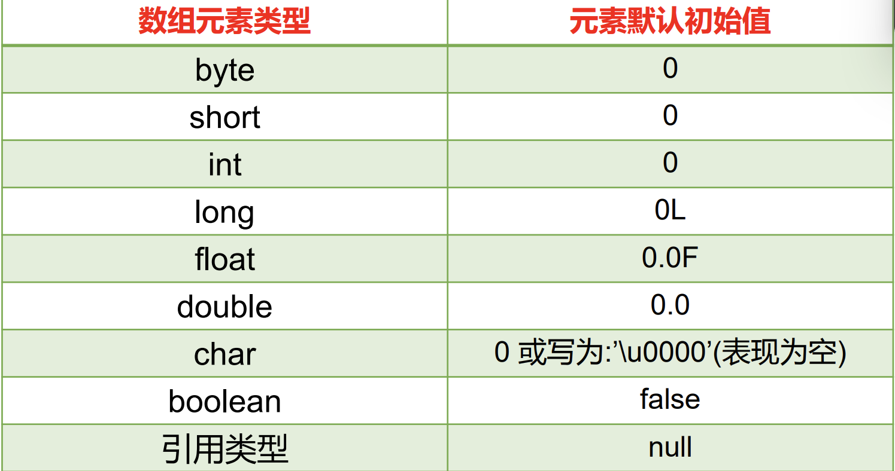
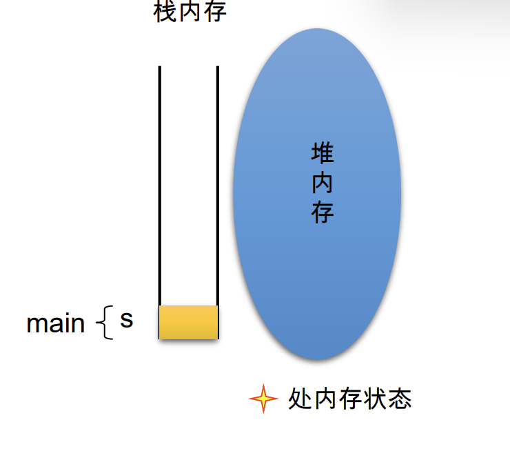
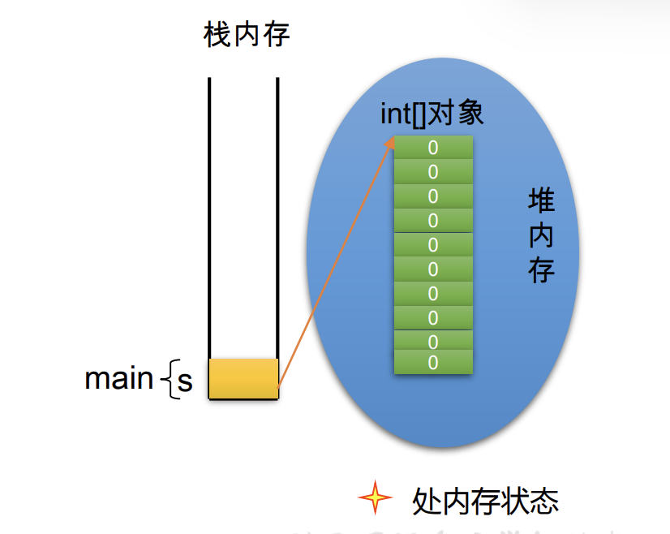
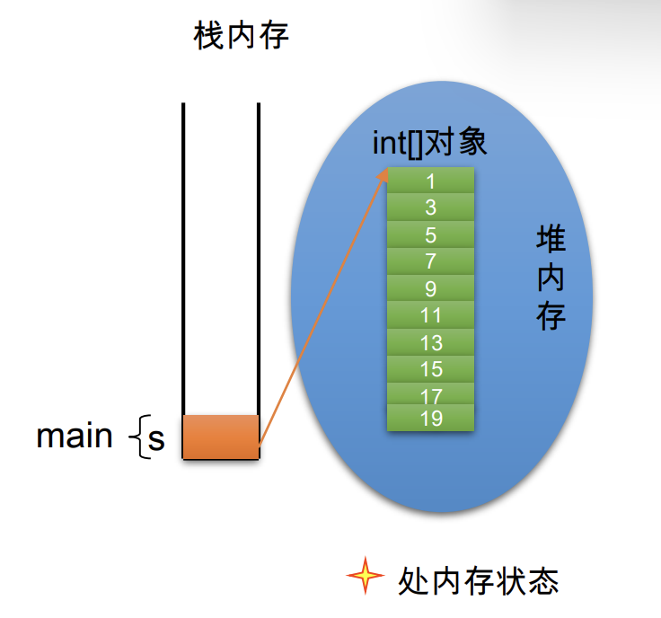
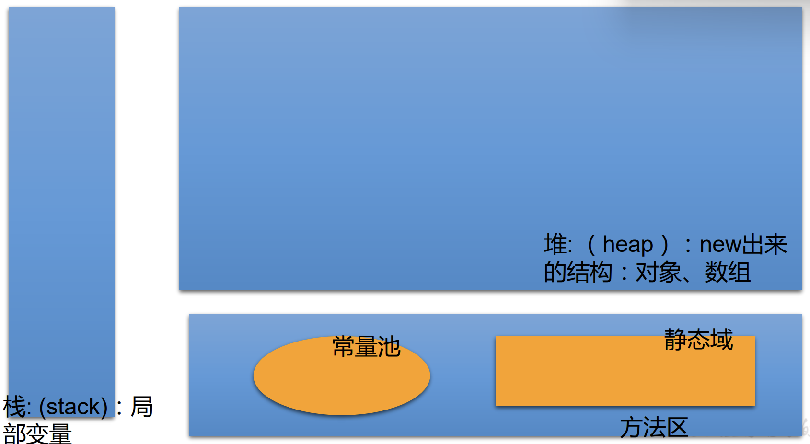
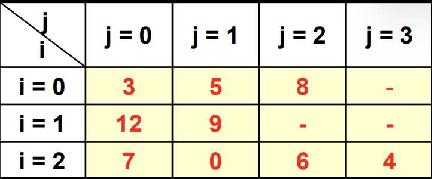

# 数组概述

- 数组(Array)：多个相同类型数据按一定顺序排列的集合，并使用一个名字命名，并通过编号的方式对这些数据进行统一管理。

数组的常见概念

- 数组名
- 下标(或索引)
- 元素
- 数组的长度
  -
- 数组本身是引用数据类型，而数组中的元素可以是任何数据类型，包括基本数据类型和引用数据类型。
- 创建数组对象会在内存中开辟一整块连续的空间，而数组名中引用的是这块连续空间的首地址。
- 数组的长度一旦确定，就不能修改。
- 我们可以直接通过下标(或索引)的方式调用指定位置的元素，速度很快。
  -
- 数组的分类：
- 按照维度：
  - 一维数组、
  - 二维数组、
  - 三维数组、
  - …
- 按照元素的数据类型分：
  - 基本数据类型元素的数组、
  - 引用数据类型元素的数组(即对象数组)

# 一维数组

## 一维数组的声明方式

```
type var[] 或 type[] var；
例如：
int a[];
int[] a1;
double b[];
String[] c; //引用类型变量数组
```

Java语言中声明数组时不能指定其长度(数组中元素的数)， 例如： `int a[5];`//非法

## 初始化

```
public class ArrayTest2 {
    
    public static void main(String[] args) {
        
        //一维数组
        //1.1 静态初始化
        int[] ids;
        ids = new int[] {1001,1002,1003,1004};
        //1.2动态初始化
        String[] names = new String[5];
        
        //调用
        //数组索引调用 0开始，-1结尾
        names[0] = "test0";
        names[1] = "test1";
        names[2] = "test2";
        names[3] = "test3";
        names[4] = "test4";
        
        //names[5] = "周扬"; 
        //超过范围
        
        //获取数组长度  .length
        System.out.println(names.length);
        System.out.println(ids.length);
        
        //遍历数组
        for(int i = 0; i < names.length; i++) {
            System.out.println(names[i]);
        }
    }
}

```

### 动态初始化：数组声明且为数组元素分配空间与赋值的操作分开进行

```
int[] arr = new int[3];
arr[0] = 3;
arr[1] = 9;
arr[2] = 8;
```

```
String names[];
names = new String[3];
names[0] = “钱学森”;
names[1] = “邓稼先”;
names[2] = “袁隆平”;
```

### 静态初始化：在定义数组的同时就为数组元素分配空间并赋值

```
int arr[] = new int[]{ 3, 9, 8};
或
int[] arr = {3,9,8};
```

```
String names[] = {
“李四光”,“茅以升”,“华罗庚”
}
```

### 数组元素的引用

- 定义并用运算符new为之分配空间后，才可以引用数组中的每个元素；
- 数组元素的引用方式：数组名[数组元素下标]
- 数组元素下标可以是整型常量或整型表达式。如`a[3] , b[i] , c[6*i];`
- 数组元素下标从0开始；长度为n的数组合法下标取值范围: `0 —>n-1`；
  - 如`int a[]=new int[3];` 可引用的数组元素为a[0]、a[1]、a[2]
- 每个数组都有一个属性length指明它的长度，例如：a.length 指明数组a的长度(元素个数)
- 数组一旦初始化，其长度是不可变的

### 数组元素的默认初始化值

数组是引用类型，它的元素相当于类的成员变量，因此数组一经分配空间，其中的每个元素也被按照成员变量同样的方式被隐式初始化。例如：

- 对于基本数据类型而言，默认初始化值各有不同
- 对于引用数据类型而言，默认初始化值为null(注意与0不同！)

   

```
public class Test {
    public static void main(String args[]){
        int a[]= new int[5];
        System.out.println(a[3]); //a[3]的默认值为0
    }
}
```

```
public class ArrayTest2 {
    
    public static void main(String[] args) {
        
        int[] arr = new int[4];
        
        for(int i = 0; i < arr.length; i++) {
                System.out.println(arr[i]);
        }
        System.out.println("**********");
        
        short[] arr1 = new short[4];
        for(int i =0; i < arr1.length; i++) {
            System.out.println(arr1[i]);
        }
        System.out.println("**********");
        
        float[] arr2 = new float[4];
        for(int i = 0; i < arr2.length; i++) {
            System.out.println(arr2[i]);
        }
        System.out.println("**********");
        
        char[] arr3 = new char[4];
        for(int i = 0; i < arr3.length; i++) {
            System.out.println(arr3[i]);
        }
        if(arr3[0] == 0) {
            System.out.println("== 0");
        }
        System.out.println("**********");
        
        boolean[] arr4 = new boolean[4];
        for(int i = 0; i < arr4.length; i++) {
            System.out.println(arr4[i]);
        }
        System.out.println("**********");
        
        String[] arr5 = new String[4];
        for(int i = 0; i < arr5.length; i++) {
            System.out.println(arr[i]);
        }
        if(arr5[0] == null) {
            System.out.println("null");
        }
        System.out.println("**********");
    }
}
```

### 创建基本数据类型数组

#### 创建基本数据类型数组 (1)

Java中使用关键字new来创建数组
如下是创建基本数据类型元素的一维数组

```
public class Test{
    public static void main(String args[]){
        int[] s;
        s = new int[10];
        for ( int i=0; i<10; i++ ) {
            s[i] =2*i+1;
            System.out.println(s[i]);
        }
    }
}
```

   

#### 创建基本数据类型数组 (2)

```
public class Test{
    public static void main(String args[]){
        int[] s;
        s = new int[10];
        //int[] s=new int[10];
        //基本数据类型数组在显式赋值之前，
        //Java会自动给他们赋默认值。
        for ( int i=0; i<10; i++ ) {
            s[i] =2*i+1;
            System.out.println(s[i]);
        }
    }
}
```

   

#### 创建基本数据类型数组 (3)

```
public class Test{
    public static void main(String args[]){
        int[] s;
        s = new int[10];
        for ( int i=0; i<10; i++ ) {
            s[i] =2*i+1;
            System.out.println(s[i]);
        }
    }
}
```

   


### 一维数组的内存解析

   

```
int[] arr = new int[4]
arr[1] = 10;

arr = new int[3]
//新的内存空间
arr[1] == 0
```

### 练习1用索引读数组

```        
升景坊单间短期出租4个月，550元/月（水电煤公摊，网费35元/月），空调、卫生间、厨房齐全。
屋内均是IT行业人士，喜欢安静。所以要求来租者最好是同行或者刚毕业的年轻人，爱干净、安静。
```

```
package com.atguigu.java;

public class ArrayTest3 {
    public static void main(String[] args) {
        int[] arr = new int[] {8,2,1,0,3};
        int[] index = new int[] {2,0,3,2,4,0,1,3,2,3,3};
        String tel = "";
        for(int i = 0; i < index.length; i++) {
            tel += arr[index[i]];
        }
        System.out.println("connection:" + tel);
    }
}

//18013820100
```

### 练习2从键盘读入学生成绩，找出最高分，并输出学生成绩等级。

```
2. 从键盘读入学生成绩，找出最高分，并输出学生成绩等级。
成绩>=最高分-10 等级为’A’ 
成绩>=最高分-20 等级为’B’
成绩>=最高分-30 等级为’C’ 
其余 等级为’D’
提示：先读入学生人数，根据人数创建int数组，存放学生成绩。
```

```
import java.util.Scanner;

public class ArrayStudentTest {
    public static void main(String[] args) {
        Scanner scan = new Scanner(System.in);
        
        System.out.println("student number:")
        int students = scan.nextInt();
        int[] arr = new int[students];
        int max = 0;
        
        for(int i = 0; i < students;i++) {
            System.out.print("student" + i + "\'s " + "score: ");
            int num = scan.nextInt();
            System.out.print(num);
            arr[i] = num;
            if(num < 0) {
                break;
            }
            if(i == 0) {
                max = arr[i];
            }
            else {
                if(arr[i - 1] < arr[i]) {
                    max = arr[i];
                }
            }
            System.out.println();
        }
        System.out.println("max score is :" + max);
        for(int i = 0; i < arr.length; i++) {
            if(arr[i] >= (max - 10)) {
                System.out.println("student" + i + "is " + arr[i] + " grade" + ":A");
            }
            else if(arr[i] >= (max - 20)) {
                System.out.println("student" + i + "is " + arr[i] + " grade" + ":B");
            }
            else if(arr[i] >= (max - 30)) {
                System.out.println("student" + i + "is " + arr[i] + " grade" + ":C");
            }
            else {
                System.out.println("student" + i + "is " + arr[i] + " grade" + ":D");
            }
        }
    }
}
```

```
import java.util.Scanner;

public class ArrayStudentTest {
    public static void main(String[] args) {
        Scanner scan = new Scanner(System.in);
        
        //学生数量
        System.out.print("student number is: ");
        int stuNum = scan.nextInt();
        System.out.println();
        
        //每个学生的成绩录入
        int[] scores = new int[stuNum];
        for(int i = 0; i < stuNum; i++) {
            System.out.print("student" + i + "\'s" + "score is");
            scores[i] = scan.nextInt();
            System.out.println(scores[i]);
        }
        
        //最大值
        int max = 0;
        for(int i = 0; i < scores.length - 1; i++) {
            if(scores[i] > scores[i + 1]) {
                max = scores[i];
            }
        }
        System.out.println("max scores is " + max);
        
        //成绩评价
        for(int i = 0; i < scores.length; i++) {
            System.out.print("student" + i + "\'s grade is ");
            char level = ' ';
            if(scores[i] >= (max - 10)) {
                level = 'A';
            }
            else if(scores[i] >= (max -20)) {
                level = 'B';
            }
            else if(scores[i] >= (max -30)) {
                level = 'C';
            }
            else {
                level = 'D';
            }
            System.out.println(level);
        }   
    }
}
```

# 二维数组[][]：数组中的数组

 二维数组就相当于是一个表格

```
public class ArrayTest02 {
    public static void main(String[] args) {
        int[][] arr1 = new int[][] {{1,2,3},{4,5},{6,7,8}};
        
        String[][] arr2 = new String[3][2];
        
        String[][] arr3 = new String[3][];
    }
}
```

```
public class ArrayTest03 {
    public static void main(String[] args) {
        int[][] arr = new int[4][3];
        
        System.out.println(arr[0]);  //[I@36baf30c  [ 一维数组  地址值
        System.out.println(arr[0][0]);  //0 默认值
        
        System.out.println(arr);  //[[I@7a81197d  [[ 二维数组  地址值
        
        String[][] arr2 = new String[4][3];
        System.out.println(arr2);  //[[Ljava.lang.String;@5ca881b5 二维数组地址 包括String包的地址
        System.out.println(arr[0]);  //[I@36baf30c 一维数组地址
        System.out.println(arr[0][0]); //null 空
        }
}
```

## 格式1（动态初始化）：int[][] arr = new int[3][2];

- 定义了名称为arr的二维数组 
- 二维数组中有3个一维数组
- 每一个一维数组中有2个元素
- 一维数组的名称分别为arr[0], arr[1], arr[2]
- 给第一个一维数组1脚标位赋值为78写法是：arr[0][1] = 78;

其中

- 外层元素的初始化值为：地址值
- 内层元素的初始化值为：与一维数组的初始化情况相同

## 格式2（动态初始化）：int[][] arr = new int[3][];

- 二维数组中有3个一维数组。
- 每个一维数组都是默认初始化值null (注意：区别于格式1）
- 可以对这个三个一维数组分别进行初始化
- arr[0] = new int[3]; arr[1] = new int[1]; arr[2] = new int[2];
- 注：
  - int[][]arr = new int[][3]; //非法

其中

- 外层元素的初始化值为：null
- 内层元素的初始化值为：不能调用，否则出错

## 格式3（静态初始化）：int[][] arr = new int[][]{{3,8,2},{2,7},{9,0,1,6}};

- 定义一个名称为arr的二维数组，二维数组中有三个一维数组
- 每一个一维数组中具体元素也都已初始化
  - 第一个一维数组 arr[0] = {3,8,2};
  - 第二个一维数组 arr[1] = {2,7};
  - 第三个一维数组 arr[2] = {9,0,1,6};
  - 第三个一维数组的长度表示方式：arr[2].length;
- 注意特殊写法情况：int[] x,y[]; x是一维数组，y是二维数组。
- Java中多维数组不必都是规则矩阵形式

## 获取数组的长度 行数

```
int[][] numTable = new int[][] {{3,5,8},{12,9},{7,0,6,4}};
numTable.length == 3
```

## 遍历二维数组

初始化方式为：`int[][] arr = new arr[][]{{},{}}`

若遍历的位置`arr[i][j]`无相应的数值，则报错

```
public class ArrayTest02 {
    public static void main(String[] args) {

        int[][] numTable = new int[][] {{1,2,3},{4,5,9,10},{6,7,8}};
        
        for(int i = 0; i < numTable.length; i++) {
        
            for(int j = 0; j < numTable[i].length; j++) {
                System.out.print(numTable[i][j]);
            }
            
            System.out.println();
        }
    }
}
```

## 练习 2 获取arr数组中所有元素的和。

   

```
public class ArrayTest02 {
    public static void main(String[] args) {
        int[][] numTable = new int[][] {{3,5,8},{12,9},{7,0,6,4}};

        for(int i = 0; i < numTable.length; i++) {
            
            for(int j = 0; j < numTable[i].length; j++) {
                System.out.print(numTable[i][j]);
            }
            
            System.out.println();
        }
    }
}
```

## 练习3

```
声明：int[] x,y[]; 在给x,y变量赋值以后，以下选项允许通过编译的是：
a ) x[0] = y; no
b) y[0] = x; yes
c) y[0][0] = x; no
d) x[0][0] = y; no
e) y[0][0] = x[0]; yes
f) x = y; no
提示：
一维数组：int[] x 或者int x[] 
二维数组：int[][] y 或者 int[] y[] 或者 int y[][]
```

## 练习4 使用二维数组打印一个 10 行杨辉三角。

```
【提示】
1. 第一行有 1 个元素, 第 n 行有 n 个元素
2. 每一行的第一个元素和最后一个元素都是 1
3. 从第三行开始, 对于非第一个元素和最后一个元素的元素。即：
yanghui[i][j] = yanghui[i-1][j-1] + yanghui[i-1][j]
```

```
public class ArrayTest{
        public static void main(String[] args){

                int[][] yangHui = new int[10][10];

                for(int i = 0; i < yangHui.length; i++){
                        for(int j = 0; j <= i; j++){
                                yangHui[i][0] = 1;
                                yangHui[i][i] = 1;
                                if(i >= 2 && j > 0 && j < i){
                                        yangHui[i][j] = yangHui[i - 1][j - 1] + yangHui[i - 1][j];
                                }
                        }
                }

                for(int i = 0; i < yangHui.length; i++){
                        for(int j = 0; j <= i; j++){
                                System.out.print(yangHui[i][j] + " , ");
                        }
                        System.out.println();
                }
        }
}
```

```
public class test002 {
    public static void main(String[] args) {
        int[][] yanghui = new int[10][];
        
        for(int i = 0; i < yanghui.length; i++) {
            yanghui[i]= new int [i + 1];
            yanghui[i][0] = yanghui[i][i] = 1;
            if(i > 1) {
                for(int j = 1; j < yanghui[i].length - 1; j ++) {
                    yanghui[i][j] = yanghui[i-1][j-1] + yanghui[i-1][j];
                }
            }
        }
        
        for(int i = 0; i < yanghui.length; i++) {
            System.out.println();
            for(int j = 0; j < yanghui[i].length; j++) {
                System.out.print(yanghui[i][j] + "\t");
            }
        }
    }
}
```

## 【拓展之笔试题】创建一个长度为6的int型数组，要求数组元素的值都在1-30之间，且是随机赋值。同时，要求元素的值各不相同。

```

```

***

# 数组中涉及到的常见算法

1. 数组元素的赋值(杨辉三角、回形数等)
2. 求数值型数组中元素的最大值、最小值、平均数、总和等
3. 数组的复制、反转、查找(线性查找、二分法查找)
4. 数组元素的排序算法

## 练习5 随机数

```
定义一个int型的一维数组，包含10个元素，分别赋一些随机整数，
然后求出所有元素的最大值，最小值，和值，平均值，并输出出来。
要求：所有随机数都是两位数。
提示；
[0,1) * 90 [0,90) + 10  [10,100) [10,99]
(int)(Math.random() * 90 + 10)
```

```
public class Test002 {
    public static void main(String args[]) {
        int[] arr = new int[10];
        
        for(int i = 0; i < arr.length; i++) {
            arr[i] = (int)(Math.random() * (99 - 10 + 1) + 10);
        }
        
        //最大值
        int maxValue = arr[0];
        for(int i = 0; i < arr.length; i++) {
            if(maxValue < arr[i]) {
                maxValue = arr[i];
            }
        }
        System.out.println("最大值: " + maxValue);
        
        //最小值
        int minValue = arr[0];
        for(int i = 0; i < arr.length; i++) {
            if(minValue > arr[i]) {
                minValue = arr[i];
            }
        }
        System.out.println("最大值: " + minValue);
        
        //和值
        int sumValue = 0;
        for(int i = 0; i < arr.length; i++) {
            sumValue += arr[i];
        }
        System.out.println("和值: " + sumValue);
        
        //均值
        float avgValue = sumValue / (float)(arr.length);
        System.out.println("均值: " + avgValue);
    }
}
```

***

## 练习 6 数组复制 System.arraycopy()

```
使用简单数组
(1)创建一个名为ArrayTest的类，在main()方法中声明array1和array2两个变量，
他们是int[]类型的数组。
(2)使用大括号{}，把array1初始化为8个素数：2,3,5,7,11,13,17,19。
(3)显示array1的内容。
(4)赋值array2变量等于array1，修改array2中的偶索引元素，使其等于索引值
(如array[0]=0,array[2]=2)。打印出array1。
思考：array1和array2是什么关系？
拓展：修改题目，实现array2对array1数组的复制
```

```
public class Test003 {
    public static void main(String args[]) {
        int[] array1 = {2,3,5,7,11,13,17,19};
        
        for(int i = 0; i < array1.length; i++) {
            System.out.println(array1[i]);
        }  
        
        int[] array2 = new int[array1.length];
        System.arraycopy(array1, 0, array2, 0, array1.length);
        
////        不是数组的复制 类似于快捷方式的创建
//      int[] array2;
//      array2 = array1;
        
//      for(int i = 0; i < array1.length; i++) {
//          array2[i] = array1[i];
//      }
        
        for(int i = 0; i < array2.length; i++) {
            if(i % 2 == 0) {
                array2[i] = i;
            }
            
            System.out.println(array2[i]);
        }
    }
}}
}
```

***

## 数组的复制，反转，查找(线性查找，二分法查找)

```
public class Test004 {
    
    public static void main(String args[]) {
        
        String[] arr = new String[] {"JJ", "DD", "MM" , "BB","AA" }; 
        
        System.out.print("原值" + "\t");
        for(int i = 0; i < arr.length; i++) {
            System.out.print(arr[i] + "\t");
        }
        System.out.println();
        
//      数组的复制
        String[] arr1 = new String[arr.length];
        for(int i = 0; i < arr.length; i++) {
            arr1[i] = arr[i];
        }
        
//      数组的反转
//      1.
        String[] arr2 = new String[arr.length];
        for(int i = 0; i < arr.length; i++) {
            arr2[arr.length - i - 1] = arr[i];
        }
//      2.
        for(int i = 0; i < arr.length / 2; i++) {
            String temp = arr[i];
            arr[i] = arr[arr.length - i - 1];
            arr[arr.length - i - 1] = temp;
        }
//      3.
        for(int i = 0, j = arr1.length - 1; i < j; i++, j--) {
            String temp = arr1[i];
            arr1[i] = arr1[j];
            arr1[j] = temp;
        }
        
        System.out.print("复制" + "\t");
        for(int i = 0; i < arr.length; i++) {
            System.out.print(arr1[i] + "\t");
        }
        System.out.println();
        
        System.out.print("反转1" + "\t");
        for(int i = 0; i < arr.length; i++) {
            System.out.print(arr2[i] + "\t");
        }
        System.out.println();
        
        System.out.print("反转2" + "\t");
        for(int i = 0; i < arr.length; i++) {
            System.out.print(arr[i] + "\t");
        }
        System.out.println();
        
        System.out.print("反转3" + "\t");
        for(int i = 0; i < arr1.length; i++) {
            System.out.print(arr1[i] + "\t");
        }
        System.out.println();
        
//      数组的查找
//      1.1线性查找
        String dest = "BB";
        boolean isFlag = true;
        
        for(int i = 0; i < arr.length; i++) {
            if(dest.equals(arr[i])) {
                System.out.println("找到指定元素的位置为：" + i);
                isFlag = false;
                break;
            }
        }
        
        if(isFlag) {
            System.out.println("查询不到");
        }
        
//      1.2
        
        for(int i = 0; i < arr.length; i++) {
            if(dest == arr[i]) {
                System.out.println("已找到：" + i);
                break;
            }
            if( i == arr.length - 1) {
                System.out.println("未找到");
            }
        }
        

//      2.二分法查找 
//      前提：所要查找的数组必须有序
        int[] arr02 = new int[] {-98,-34,2,34,54,66,79,105,210,333};
        
        int dest1 = 2;
        int head = 0; 
        int end = arr02.length - 1;
        boolean isFlag02 = true;
        
        while(head <= end) {
            
            int middle = (head + end) / 2;
            
            if(dest1 == arr02[middle]) {
                System.out.println("找到指定元素的位置为：" + middle);
                isFlag02 = false;
                break;
            }
            else if(arr02[middle] > dest1) {
                end = middle - 1;
            }
            else {
                head = middle + 1;
            }
        }
        
        if(isFlag02) {
            System.out.println("没有找到");
        }
    }
}
```

***

## 排序(十大内部排序)

### 选择排序（直接选择排序，堆排序）

### 交换排序（冒泡排序，快速排序）  

#### 冒泡排序

```
public class Test005 {
    public static void main(String args[]) {
        int[] arr = new int[] {1,2,3,4,6,7,8,90,4,3,2,5,8};
        
        System.out.print("原值：\t");
        for(int i = 0; i < arr.length; i++) {
            System.out.print(arr[i] + "\t");
        }
        System.out.println();
        
        System.out.print("排序：\t");
        
        //冒泡排序
        for(int i = 0; i < arr.length - 1; i++) {
            
            for (int j = 0; j < arr.length - 1 - i; j++) {
                
                if(arr[j] > arr[j + 1]) {
                    int temp = arr[j];
                    arr[j] = arr[j + 1];
                    arr[j + 1] = temp;
                }
            }
        }
        
        for(int i = 0; i < arr.length; i++) {
            System.out.print(arr[i] + "\t");
        }
    }
}
```

#### 快速排序

### 插入排序（直接插入排序，拆半插入排序，Shell排序）

### 归并排序

### 桶式排序

### 基数排序

***

# java.util.Arrays Arrays工具类

- Arrays.equals(arr1,arr2)  返回boolean类型
- arr.toString() 返回String类型
- fill(arr,value) 往arr中填充value
- sort(arr) 排序
- binarySearch(arr,value) 二分法查找，在arr中查找value 

***

# 数组中常见异常

## 数组角标越界的异常 ArrayIndexOutofBoundsExcetion --下标超过数组范围

## 空指针异常  NullPointerException 

```
public class Test008 {
    public static void main(String args[]) {
//      情况一：
        int[] arr1 = new int[]{12,3,4};
        arr1 = null;
        System.out.println(arr1[0]);  //报空指针错
        
//      情况二
        int[][] arr2 = new int[4][];
        System.out.println(arr2[0]); //返回null
        System.out.println(arr2[0][0]); //报空指针错

//      情况三
        String[] arr3 = new String[] {"AA","BB","CC"};
        arr3[0] = null;
        System.out.println(arr3[0].toString());
    }
}
```

# 对象数组

# 