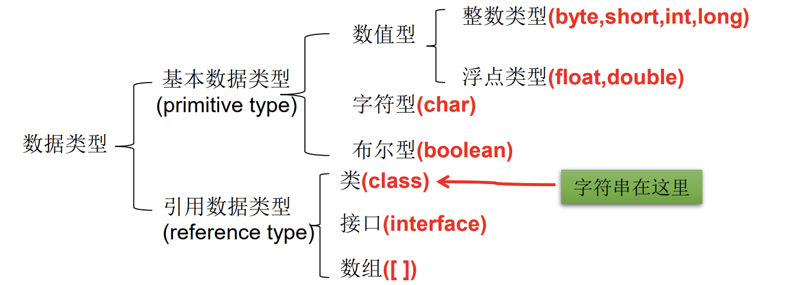

# Java介绍

## Java API

<table>
    <tr>
        <th width="30%">Java API</th>
        <th width="70%">Description</th>
    </tr>
    <tr>
        <td>Java SE</td>
        <td>Java Platform, Standard Edition（Java标准版）</td>
    </tr>
    <tr>
        <td>JDK</td>
        <td>Java Platform, Standard Edition Development Kit（Java标准开发套件）</td>
    </tr>
</table>
## Java流行词


- The Java programming language platform provides a portable, interpreted, high-performance, simple, object-oriented programming language and supporting run-time environment. （Java 编程语言平台提供了可移植的、可解释的、高性能的、简单的、面向对象的编程语言和支持运行时环境）

<table>
    <tbody>
        <tr>
            <th colspan="2">Java buzzwords</th>
            <th>Description</th>
        </tr>
        <tr>
            <td width="10%">Simple</td>
            <td width="10%">简单性</td>
            <td width="80%"></td>
        </tr>
        <tr>
            <td>Object oriented</td>
            <td>面向对象</td>
            <td></td>
        </tr>
        <tr>
            <td>Distributed</td>
            <td>分布式</td>
            <td></td>
        </tr>
        <tr>
            <td>Multithreaded</td>
            <td>多线程</td>
            <td></td>
        </tr>
        <tr>
            <td>Dynamic</td>
            <td>动态性</td>
            <td></td>
        </tr>
        <tr>
            <td>Architecture neutral</td>
            <td>架构中立（跨平台）</td>
            <td>Write your applications once, and you never need to port them. 一次编译，处处运行<br/>The Java interpreter can execute <b>Java bytecodes（Java字节码）</b> directly on any machine to which the interpreter and run-time system have been ported.</td>
        </tr>
        <tr>
            <td>Portable</td>
            <td>便携式</td>
            <td></td>
        </tr>
        <tr>
            <td>High performance</td>
            <td>高性能</td>
            <td>the <b>Java runtime environment（Java运行时环境）</b> manages memory for you.<br/>Java technology has <u>no pointers</u>. Instead, all references to allocated storage, which in practice means all references to an object, are through symbolic "<b>handles</b>（句柄）". The Java technology memory manager keeps track of references to objects. When an object has no more references, the object is a candidate for garbage collection.
</td>
        </tr>
        <tr>
            <td>Robust</td>
            <td>健壮性</td>
            <td></td>
        </tr>
        <tr>
            <td>Secure</td>
            <td>安全性</td>
            <td></td>
        </tr>
    </tbody>
</table>
## JDK配置

### Windows

<table>
    <tr>
        <th>环境变量</th>
        <th>配置</th>
    </tr>
    <tr>
        <td>JAVA_HOME</td>
        <td>D:\Java\jdk-18.0.1.1</td>
    </tr>
    <tr>
        <td>Path</td>
        <td>%JAVA_HOME%\bin</td>
    </tr>
</table>

### Linux

```shell
# 1.找到Java目录
# 方式1 下载并安装Java，记住解压的目录位置
# 方式2 查找已经安装的Java位置
whereis java

# 2.配置Java（全局）环境变量，例如当前的JDK位置在 /opt/jdk-21
sudo echo '# JAVA_HOME' >> /etc/profile
sudo echo 'export JAVA_HOME=/opt/jdk-21' >> /etc/profile
sudo echo 'export PATH=$JAVA_HOME:$PATH' >> /etc/profile

# 3.测试Java
java --version
```

# 变量

- 变量的命名规则：

1. 26个英文字母大小写，`0-9，_，$`。
2. 数字不可以开头。
3. 不能使用关键字和保留字。
4. 严格区分大小写。
5. 不能包含空格。

<table>
    <thead>
        <tr>
            <th colspan="2">命名规范</th>
            <th>描述</th>
        </tr>
    </thead>
    <tbody>
        <tr>
            <td width="10%">包名</td>
            <td width="10%">xxxyyy</td>
            <td width="80%">多单词时都小写</td>
        </tr>
        <tr>
            <td>类名/接口名</td>
            <td>XxxYy</td>
            <td>多单词时每个单词首字母大写</td>
        </tr>
        <tr>
            <td>变量名/方法名</td>
            <td>xxxYyy</td>
            <td>多单词时第一个单词首字母小写，第二个单词开始每个单词首字母大写</td>
        </tr>
        <tr>
            <td>常量名</td>
            <td>XXX_YYY</td>
            <td>所有字母都大写，多单词用下划线连接</td>
        </tr>
    </tbody>
</table>


| 变量     | 声明位置         | 具体类型                                   | 初始化值特点           |
| -------- | ---------------- | ------------------------------------------ | ---------------------- |
| 成员变量 | 方法体外且类体内 | 实例变量<br />类变量（static）             | 生命周期               |
| 局部变量 | 方法体内         | 形参<br />方法局部变量<br />代码块局部变量 | 除形参外，均要显式初始 |

- 变量：内存中的一个存储区域，该区域的数据可以在同一类型范围内不断变化。变量是程序中最基本的存储单元，包含变量类型、变量名、存储的值。  

- 定义变量：告诉编译器（compiler）这个变量是属于哪一种数据类型，这样编译器才知道需要配置多少空间给它，以及它能存放什么样的数据。

1. Java每个变量必须先声明，后使用。
2. 使用变量名来访问这块区域的数据。
3. 变量的作用域：其定义所在的一对`{}`（函数体）内，变量只有在其作用域内才有效。由于变量被定义出来后，只是暂存在内存中，等到程序执行到某一个点后，该变量会被释放掉，也就是说变量有它的生命周期。因此变量的有效范围是指程序代码能够访问该变量的区域，若超出该区域访问变量则编译时会出现错误。在程序中，一般会根据变量的有效范围，将变量分为“成员变量”和“局部变量”。
4. 同一个作用域内，不能定义重名的变量。

- 系统的内存可大略的分为3个区域：系统区（OS）、程序区（Program）、数据区（Data）。当程序执行时，程序代码会加载到内存中的程序区，数据暂时存储在数据区中。

 


# 基本数据类型

 

- String不是基本数据类型，属于引用数据类型。  

## 数值

### 整数 int、long

<table>
	<thead>
		<tr>
			<th width="20%">整型</th>
			<th width="20%">存储空间</th>
			<th width="60%">标识</th>
		</tr>
	</thead>
	<tbody>
		<tr>
			<td>byte</td>
			<td>1 Byte</td>
			<td></td>
		</tr>
		<tr>
			<td>short</td>
			<td>2 Byte</td>
			<td></td>
		</tr>
		<tr>
			<td>int</td>
			<td>4 Byte</td>
			<td>默认</td>
		</tr>
		<tr>
			<td>long</td>
			<td>8 Byte</td>
			<td>l、L</td>
		</tr>
	</tbody>
</table>

```java
byte b1 = -128;
byte b2 = 128; //错误，超出范围-128~127

//声明long型常量须后加‘l’或‘L’，否则默认int
long l2 = 123456789010; //错误，认为是int自动转long，大于2^31，超过int的范围。
```

#### int 进制

```java
int num1 = 0b110;
int num2 = 110;
int num3 = 0127;
int num4 = 0x110A;
```

### 浮点数 float、double

<table>
	<thead>
		<tr>
			<th colspan="2">浮点类型</th>
			<th>标识</th>
			<th>存储空间</th>
			<th>表数范围</th>
		</tr>
	</thead>
	<tbody>
		<tr>
			<td width="10%">float</td>
            <td width="10%">单精度</td>
			<td width="15%">f、F</td>
			<td width="10%">4 Byte</td>
			<td width="55%"><code>-3.403E38~3.403E38</code>尾数精确到7位有效数字</td>
		</tr>
		<tr>
			<td>double</td>
            <td>双精度</td>
			<td>d、D、缺省</td>
			<td>8 Byte</td>
			<td><code>-1.798E308~-1.798E308</code>精度是float的两倍</td>
		</tr>
	</tbody>
</table>

```java
// 声明float型常量，须后加‘f’或‘F’。否则默认double
float f2 = 12.3  // 编译失败：被认为是自动类型转换，但不能自动大转小（double -> float）。
```

## 字符 char

- char：字符（2 Byte），使用单引号。Java中的所有字符都使用Unicode编码。

```java
//1. 中文、数字、字母等Unicode码支持的
char c2 = '中';

//2. 换行符
char c3 = '\n'; //换行

//3. ASCII码
char c1 = 97; //'a'

//4. Unicode 值来表示字符型常量：‘\uXXXX’（XXXX代表一个十六进制整数）。
char c4 = '\u0043';
```

## 布尔 boolean

- boolean：取值只能是true、false；不可以使用0、非0的整数、null替代。

> JVM中没有任何供boolean值专用的字节码指令。Java语言表达所操作的boolean值，在编译之后都使用JVM中的int数据类型来代替，true用1表示，false用0表示。

## 默认初始化值

- 默认初始化值：整数类型和char都是0、小数都是0.0、boolean是false。 （long、float需要带上标识符）

## 类型转换

1. boolean类型不可以转换为其它的数据类型，也不能与其它数据类型运算。
2. byte、short、char之间不会相互转换。如果操作数的类型低于int类型，则自动转换为int类型（++、--除外）。（不兼容的错误，可能损坏数据，编译不予通过）


### 自动提升

- 自动提升通常是容量小的类型自动转换为容量大的数据类型。

1. 多种类型的数据混合运算时，自动将所有数据转换成容量最大的数据类型，再进行计算。 （例如，三元运算符）
2. 当为变量赋值的数据类型与变量类型不一致，并且赋值的数据类型级别低于变量类型的级别时，会将赋值数据自动转换为变量的类型。

### 强制转换

- 强制类型转换（<code>(数据类型)变量</code>）可能会造成精度降低或溢出。

    

```java
// 转为byte超过精度范围
int i2 = 128;
byte b1 = (byte)i2;   // -128

int i3 = 200;
byte b2 = (byte)i3; // -56
 
int i4 = 2000;
byte b3 = (byte)i4; // -48 
```

# 运算符

## 运算符与优先级

<table>
	<thead>
		<tr>
			<th width="10%">运算方向</th>
			<th width="90%">优先级从高到低</th>
		</tr>
	</thead>
	<tbody>
		<tr>
			<td></td>
			<td>
				<code>. () {} ; ,</code>
			</td>
		</tr>
		<tr>
			<td>R-&gt;L</td>
			<td>
				<code>++ -- ~ !(type)</code>
			</td>
		</tr>
		<tr>
			<td>L-&gt;R</td>
			<td>
				<code>* / %</code>
			</td>
		</tr>
		<tr>
			<td>L-&gt;R</td>
			<td>
				<code>+ -</code>
			</td>
		</tr>
		<tr>
			<td>L-&gt;R</td>
			<td>
				<code>&lt;&lt; &gt;&gt; &gt;&gt;&gt;</code>
			</td>
		</tr>
		<tr>
			<td>L-&gt;R</td>
			<td>
				<code>&lt; &gt; &lt;= &gt;= instanceof</code>
			</td>
		</tr>
		<tr>
			<td>L-&gt;R</td>
			<td>
				<code>== !=</code>
			</td>
		</tr>
		<tr>
			<td>L-&gt;R</td>
			<td>
				<code>&amp;</code>
			</td>
		</tr>
		<tr>
			<td>L-&gt;R</td>
			<td>
				<code>^</code>
			</td>
		</tr>
		<tr>
			<td>L-&gt;R</td>
			<td><code>|</code></td>
		</tr>
		<tr>
			<td>L-&gt;R</td>
			<td>
				<code>&amp;&amp;</code>
			</td>
		</tr>
		<tr>
			<td>L-&gt;R</td>
			<td><code>||</code></td>
		</tr>
		<tr>
			<td>R-&gt;L</td>
			<td>
				<code>?:</code>
			</td>
		</tr>
		<tr>
			<td>R-&gt;L</td>
			<td>
				<code>= *= /= %=</code>
			</td>
		</tr>
		<tr>
			<td>R-&gt;L</td>
			<td>
				<code>+= -= &lt;&lt;= &gt;&gt;=</code>
			</td>
		</tr>
		<tr>
			<td>R-&gt;L</td>
			<td><code>&gt;&gt;&gt;= &amp;= ^= |=</code></td>
		</tr>
	</tbody>
</table>

1. <code>%</code> ：如果对负数取模，忽略模数负号，取正值计算。
2. <code>/</code>：整数之间做除法时，只保留整数部分而舍弃小数部分。
3. 只有单目运算符、三元运算符、赋值运算符是从右向左运算的。
4. 赋值运算符支持连续赋值。
5. `==`比较基本数据类型的大小、引用类型的<code>地址值</code>。

```java
// 连续赋值
int a,b;
a = b = 1;
```

## + 加号与连接符

<table>
	<thead>
		<tr>
			<th width="10%"><code>+</code>的意义</th>
			<th width="90%">描述</th>
		</tr>
	</thead>
	<tbody>
		<tr>
			<td>加号</td>
			<td>除boolean外的任何基本数据类型之间的计算（char和数值进行计算时，相当于对char的ASCII码值进行加减）
			</td>
		</tr>
		<tr>
			<td>连接符</td>
			<td>任何基本数据类型使用+和String连接时，String和其他基本数据类型有且只能是连接运算（包括boolean）
			</td>
		</tr>
	</tbody>
</table>

```java
//String的连接
System.out.println("" + 1 + 2); //12
System.out.println(1 + 2 + ""); //3
```

## i++、++i

<table>
    <tbody>
        <tr>
            <td width="10%">i++</td>
            <td>后增</td>
            <td rowspan="2">先返回值，再进行自增/自减</td>
        </tr>
        <tr>
            <td>i--</td>
            <td>后减</td>
        </tr>
        <tr>
            <td>++i</td>
            <td>先增</td>
            <td rowspan="2">先进行自增/自减，再返回计算后的值</td>
        </tr>
        <tr>
            <td>--i</td>
            <td>先减</td>
        </tr>
    </tbody>
</table>

```java
// ++、-- 不会改变数据类型
byte b1 = 127;
b1++; //-128

// 错误的使用方式
(num++)++ // 错误
```

## `?:` 三元运算符

```java
条件表达式 ? 表达式1 ：表达式2；
```

- `?:`要求返回一个结果。 

1. 条件表达式为boolean类型，true则返回表达式1，false则返回表达式2。  
2. 表达式1和表达式2为要求是同种类型，或者可自动转换（自动将类型转换为最高的一个） 。

## 逻辑运算

  

<table>
    <tr>
        <td><code>&amp;</code></td>
        <td>逻辑与</td>
        <td>左边无论真假，右边都进行运算</td>
    </tr>
    <tr>
        <td><code>&amp;&amp;</code></td>
        <td>短路与</td>
        <td>如果左边为真，右边参与运算，如果左边为假，那么右边不参与运算</td>
    </tr>
</table>

## 位运算（二机制运算）

<table>
	<thead>
		<tr>
			<th align="left" width="15%">运算符</th>
			<th align="left" width="50%">二进制运算</th>
			<th width="35%">运算</th>
		</tr>
	</thead>
	<tbody>
		<tr>
			<td align="left">a &amp; b</td>
			<td align="left">与，有0则0</td>
			<td>若a=1100，b=1010；则a&amp;b=1000</td>
		</tr>
		<tr>
			<td align="left">a | b</td>
			<td align="left">或，有1则1</td>
			<td>若a=1100，b=1010；则a|b=1110</td>
		</tr>
        <tr>
            <td>a ^ b</td>
            <td>异或，异位取1</td>
            <td></td>
        </tr>
        <tr>
            <td>a ~ b</td>
            <td>取反，补码取反</td>
            <td></td>
        </tr>
		<tr>
			<td align="left">a ! b</td>
			<td align="left">不同则1，同则0</td>
			<td>若a=1100，b=1010；则a!b=0110</td>
		</tr>
		<tr>
			<td align="left" rowspan="2">a &lt;&lt; b</td>
			<td align="left">将a的二进制左移b位；相当于a乘以2^b（注意范围）</td>
			<td rowspan="2">若a=8,b=2；则a&lt;&lt;b=32</td>
		</tr>
        <tr>
            <td>空位补0：若高位被移出，则丢弃高位，并在末尾补0</td>
        </tr>
		<tr>
			<td align="left" rowspan="2">a &gt;&gt; b</td>
			<td align="left">将a的二进制右移b位；相当于a除以2^b（注意范围）</td>
			<td rowspan="2">若a=8,b=2；则a&gt;&gt;b=2</td>
		</tr>
        <tr>
            <td>若最高位是1,则右移后补1；若最高位是0,则右移后补0</td>
        </tr>
        <tr>
            <td> a >>> b</td>
            <td>强制右移补0</td>
            <td></td>
        </tr>
	</tbody>
</table>

# 数组

- 数组（Array）是多个相同类型数据按一定顺序排列的集合，并使用一个名字命名，并通过编号的方式对这些数据进行统一管理。


1. 数组本身是引用数据类型，而数组中的元素可以是任何数据类型。
2. 创建数组对象会在内存中开辟一整块连续的空间，而数组名中引用的是这块连续空间的首地址，故数组的长度一旦确定就不能修改。
3. 数组根据维度、数据类型来区别。

```java
int[] arr1;
// int 数据类型
// [] 维度
```

- 数组的静态初始化和动态初始化：

```java
// 一维数组
int[] arr; // 还未分配空间

// 静态初始化
int[] arr = new int[]{1,2,3};

// 动态初始化
int[] arr = new int[3]; // 对数组默认初始化

// 多维数组（以二维为例）相当于数组内保存对其他数组的引用。
int[][] arr; // 还未分配空间
int[][] arr = new int[3][]; //3xn
int[][] arr = new int[3][3]; //3X3
int[][] arr = {
    {1,2},
    {1,2,3}
};
```

- 数组索引（下标）从<code>0</code>开始，<code>-1</code>表示结尾（最后一位）。关于数组下标常见的错误：ArrayIndexOutofBoundsExcetion（下标越界）、NullPointerException（空指针）。

```java
arr[0];
arr[-1];
```

# 结构化语言

- 顺序结构是程序从上到下逐行地执行，中间没有任何判断和跳转；而结构化语言是为了使程序可以不按照顺序执行。

## 分支结构

### if

- 条件返回的必须是boolean类型。

```java
if(条件) //代码

if(条件1){
    //执行代码块;
} else if(条件2){
    //执行代码块;
} else{
    //执行代码块;
}
```

### switch-case

> 凡是可以使用switch-case结构的都可以使用if-else。反之，不成立。

- `case:`：根据switch表达式中的值，一次匹配各个case中的常量，一旦匹配成功，则进入相应的case结构中，调用其执行语句。当调用完执行语句以后，则仍然继续向下执行其他case结构中的执行语句，直到遇到break关键字或者此swtich-case结构末尾结束为止。

1. case子句中的值必须是常量，不能是变量名或不确定的表达式值。
2. break语句用来在执行完一个case分支后使程序跳出switch语句块。如果没有break，程序会顺序执行到switch结尾。（控制流贯穿问题）
3. default子句是可任选的，位置也是灵活的（放哪都是最后执行的）。当没有匹配的case时，执行default。

```java
switch(表达式){
    case 常量1:
        语句1;
        break;
    case 常量2:
        语句2;
        break;
        … …
            case 常量N:
        语句N;
        break;
    default:
        语句;
        break;
}
```

> `case->`：case中任意一个匹配成功，箭头右侧的代码都被执行，且在这些代码结束之后，不会产生控制流贯穿问题。 
>
> ```java
> switch(值){
>      case 匹配值 -> 语句; 
> }
> ```

- yield：yield返回一个值作为switch语句的返回值。return 会直接跳出当前循环或者方法，而 yield 只会跳出当前switch块。

```java
int opt = switch(fruit){
    case "apple" -> 1;
    case "banana" -> 2;
    default -> {
        int code = fruit.hashCode();
        yield code;
    }
};
```

## 循环结构

### for

#### 标准for

```
//执行过程：①-②-③-④-②-③-④-②-③-④-.....-②
for (①初始化部分; ②循环条件部分; ④迭代部分){
    ③循环体部分;
}
```

- 循环条件部分为boolean类型表达式，当值为false时，退出循环。在每次开始循环前执行检查（在循环失败时也执行了一次）。
- 初始化部分和循环条件部分可以声明/更新多个变量，但必须是同一个类型，用逗号分隔。初始化部分若声明变量，则该变量只在该循环中有效，且只在第一次循环开始前声明。循环条件部分声明的变量在每次循环开始前都会再次声明。

> for循环中的①-②-③-④均可以省略。
>
> ```java
> for(;;)
> ```

```java
//没有大括号时：
for (int i = 0; i < 10; i++)
    //循环内
    if (i == 2)
        break;
//循环外
//if(i == 1) //错误
```

#### forEach

```
for(类型 标识符: 可迭代类型的表达式) {
    语句;
} 
```

```java
int[] numbers = new int[] {1,2,3,4,5,6,7,8,9,10};

for(int element : numbers) {
    System.out.println(element);
}
```

### while

#### while

```
//执行过程：①-②-③-④-②-③-④-②-③-④-...-②
①初始化部分
while(②循环条件部分)｛
    ③循环体部分;
    ④迭代部分;
}
```

1. for和while的初始化作用域范围不同，for 只在循环内部，而while在外部。
2. for和while的迭代最终值不同（若为i时）。

```java
int i = 1;
while (i <= 100){
       result += i;
       i++;
}
// i = 101; 满足条件 i <= 100 后仍然i++;i++之后才不满足条件则停止，会比范围多1
//其i++本质上是执行语句

for(int i = 1; i <= 100; i++){
    ...    
}
//i = 100; 执行到 i <= 100 就停止;不会超过范围
```

#### do...while

```
// 执行过程：①-③-④-②-③-④-②-③-④-...②
①初始化部分;
do{
    ③循环体部分
    ④迭代部分
}while(②循环条件部分);
```

- do-while循环至少执行一次循环体（不满足条件的时候也会执行一次），但如果满足执行多次，do...while和while没有区别，并不会多出1次。

### 嵌套循环

- 嵌套循环就是把内层循环当成外层循环的循环体。当只有内层循环的循环条件为false时，才会完全跳出内层循环，才可结束外层的当次循环，开始下一次的循环。设外层循环次数为m次，内层为n次，则内层循环体实际上需要执行`m*n`次。

### 循环控制

> return结束方法，也可结束循环

<table>
	<tbody>
		<tr>
			<td width="20%">break</td>
			<td width="80%">终止某个语句块的执行，跳出最近的一个循环体。</td>
		</tr>
		<tr>
			<td>带label的break</td>
			<td>在多层嵌套的语句块中时，可以通过标签指明要终止的是哪一层语句块。</td>
		</tr>
		<tr>
			<td>continue</td>
			<td>跳过其所在循环语句块的一次执行，继续下一次循环。</td>
		</tr>
		<tr>
			<td>带label的continue</td>
			<td>在多层嵌套的循环语句体中时，可以通过标签指明要跳过的是哪一层循环。</td>
		</tr>
	</tbody>
</table>


```java
label1: { ……
label2:     { ……
label3:         { ……
                break label2;
                ……
                }
            }
        }
```

