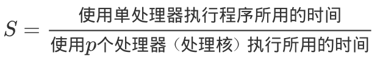
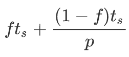
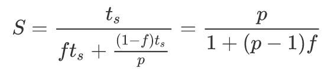
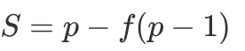

# 并发与并行

## 并发与并行的概念

<table>
    <tr>
        <td width="20%">并发 concurrence</td>
        <td width="80%">在某一时间段内，从宏观上看多个程序同时运行，但从微观上看，多个程序之间是串行执行的</td>
    </tr>
    <tr>
        <td rowspan="2">并行 parallel</td>
        <td>两个或两个以上的任务同时运行，无论宏观或微观</td>
    </tr>
    <tr>
        <td>当只有一个CPU时，CPU可以将处理任务的时间分成若干片，并在每个时间片中调用一个任务使之运行，以此达到逻辑上的并行</td>
    </tr>
</table>

 

## 加速比

### Amdahl定律

- 阿姆达尔定律（Amdahl）是计算加速比的著名定律： 

- 一个程序通常是有串行执行部分和并行执行部分构成。假定程序中某些部分只能串行执行，如果串行执行部分占整个程序的比率是<code>f</code>，则并行部分占用的比率为<code>1-f</code>。假定并行执行部分无任何其他开销，则用<code>p</code>个处理器执行程序所需的时间为：，其中，ts是使用单处理器执行程序所需的时间。

 

1. 当串行执行部分所占比率<code>f=0</code>时，<code>S=p</code>，即在并行部分没有任何其他开销的情况下，加速比与处理机数目相同。
2. 但实际上<code>f&ne;0</code>，因此，在<code>p</code>个处理器上执行程序获得的加速比<code>S</code>总会小于<code>p</code>。
3. 偶尔会出现超线性加速比（Superliner Speedup）<code>S&gt;p</code>，通常是由于使用的是优化的并行算法或某一有利于并行程序运行的独特体系结构特性等。

### Gaustafson定律

- Gaustafson定律是基于Amdahl定律提出的一个计算加速比的定律：
- Amdahl定律着眼于在固定问题规模情况下可以获得最高加速比；而Gaustafson定律则主张问题的规模应该和可获得的计算机资源相匹配。

## 并发与并行的设计方法

1. 分治方法
2. 流水线
3. 消息传递接口（Message Passing Interface，MPI）

# JMM Java内存模型

## Java内存模型与线程读写

 

- Java内存模型（JMM，Java Memory Model）（抽象概念）定义了JVM在计算机内存中的工作方式。
- Java线程之间采用的是共享内存模型，且JMM规定所有的变量都存放在主内存中。

1. 当线程需要使用变量时，会把主内存中的变量复制到自己的工作空间（工作内存）。
2. 线程读写变量时操作的是自己工作内存中的变量。
3. 线程在处理完后，将变量值更新到主内存中。

## 共享变量内存可见性问题

- 假设线程A和线程B同时处理一个共享变量，各自使用不同的CPU，并且L1 Cache和L2 Cache都为空，且假定共享变量X的值为0：

1. 线程A对共享变量X进行处理：
   1. 首先获取共享变量X的值，由于两级Cache都没有命中，所以加载主内存中X的值(0)。
   2. 在自己的工作内存中修改变量X的值(1)，然后将其写入到两级Cache，并刷新到主内存中。
   3. 此时，L1 Cache (A)中X=1，L2 Cache 中X=1，主内存中X=1。
2. 线程B对共享变量X进行处理：
   1. 首先获取共享变量X的值，L1 Cache(B) 未命中，而L2 Cache命中，于是读取L2 Cache中X的值(1)。
   2. 在自己的工作内存中修改变量X的值(2)，然后将其写入到两级Cache，并刷新到主内存中。
   3. 此时，L1 Cache (B)中X=2，L2 Cache 中X=2，主内存中X=2。
3. 线程A再次对共享变量X进行处理：
   1. 首先获取共享变量X的值，L1 Cache(A) 命中，于是读取 L1 Cache(A) 中X的值(1)。
   2. 此时，线程A读取到的X值(1)和L2 Cache、主内存中的X值(2)都不一致，出现了共享变量的内存不可见问题。

## happens-before

- JSR-133提出的happens-before概念：

1. 程序顺序规则：一个线程中的每个操作 happens-before 于该线程中的任意后续操作。
2. 监视器规则（synchronized）：对一个监视器锁的解锁，happens-before 于随后对这个监视器锁的加锁。
3. volatile变量规则：对一个volatile域的写，happens-before 于任意后续对这个volatile域的读。
4. 传递性：如果 A happens-before B，且 B happens-before C，则 A happens-before C。

# 同步的概念

## 数据竞争问题

- 数据竞争问题是有多个或多个同时执行的线程访问同一个内存位置并且至少有一个线程尝试写入数据而引起的问题，由于JMM的构造，在没有同步控制的情况下，会造成数据不一致的问题。

1. 同步机制。
2. 将全局共享数据变为线程私有的数据。
3. 改变变量的可视范围。

## 临界区

- 线程中访问共享数据的那段代码被称为<b>临界区（Critical Section）</b>，因此，线程在进入临界区时，应该遵守一定的原则（同步机制）：

1. 多个线程可以同时请求进入临界区，但同一时刻只允许一个线程进入。
2. 当临界区被一个线程拥有时，其他线程需要等待，不允许进入该临界区。
3. 临界区中的操作应该在有限的时间内完成，以便给其他线程运行的机会。
4. 一个线程执行完临界区后，操作系统随机地选取一个线程进入，其他未被选取的线程继续等待。

## 监视器

- 监视器（Monitor）具有如下特性：

1. 一个监视器是只有一个私有属性的类。
2. 每个监视器类的对象实例都有一个相关联的的锁，这个锁会把对象的所有方法加锁。
3. Java中每个对象都有一个隐式的锁。

## [volatile](./volatile.md)

# 锁

## [同步锁 synchronized](./synchronized.md)

## 乐观锁与悲观锁

- <b>悲观锁</b>对数据被外界修改持保守态度，认为数据很容易就会被其他线程修改。

1. 在数据被处理前，先对数据进行加锁，并在整个数据处理过程中，使数据处于锁定状态。
2. 悲观锁的实现往往依靠数据库提供的锁机制。也就是，在数据库中，对数据记录操作前，给记录加排他锁。例如，<code>select ... for update</code>。
   1. 如果获取锁失败，则说明数据正在被其他线程修改，当前线程则等待或抛出异常。
   2. 如果获取锁成功，则对记录进行操作，然后提交事务后释放排他锁。

- <b>乐观锁</b>是相对悲观锁的，认为数据在一般情况下不会造成冲突。

1. 乐观锁在访问记录前不会加排他锁，而是在进行数据提交更新时，才会正式对数据冲突与否进行检测。
2. 乐观锁并不会使用数据库提供的锁机制，一般在表中添加 version字段或使用业务状态来实现。
3. 乐观锁直到提交时才锁定，不会产生任何死锁。

## 公平锁与非公平锁

- 根据线程获取锁的抢占机制，锁可以分为公平锁和非公平锁。

1. <b>公平锁</b>表示线程获取锁的顺序是按照线程请求锁的时间早晚来决定的，也就是最早请求锁的线程将最早获取到锁。
2. <b>非公平锁</b>则在运行时闯入，也就是先来并不一定先得。

- ReentranLock提供了公平锁和非公平锁的实现，默认使用非公平锁，因为公平锁会带来额外的性能开销。

1. 公平锁：<code>ReentrantLock pairLock = new ReentrantLock(true)</code>
2. 非公平锁：<code>ReentrantLock pairLock = new ReentrantLock(false)</code> 

## 独占锁与共享锁

- 根据锁只能被单个线程持有还是能被多个线程共同持有，锁可以分为独占锁和共享锁。

1. <b>独占锁</b>保证任何时候都只有一个线程能得到锁，ReentrantLock就是以独占方式实现的。
   1. 独占锁是一种悲观锁，由于每次访问资源都先加上互斥锁，限制了并发性（读操作实际上不会影响书记的一致性，但是也被限制了）。
   2. 独占锁只允许同一时间由一个线程读取数据，其他线程必须等待当前线程是否锁才能进行读取。
2. <b>共享锁</b>则可以同时有多个线程持有，允许一个资源可以被多线程同时进行读操作。例如，ReadWriteLock 读写锁。
   1. 共享锁是一种乐观锁，放宽了加锁的条件，允许多个线程同时进行读操作。

## 可重入锁

- 当一个线程要获取一个被其他线程持有的独占锁时，该线程会被阻塞。而当一个线程再次获取其以及持有的锁时，如果不会被阻塞，则称该锁是<b>可重入的</b>。也就是，只要该线程获取了该锁，那么就可以在有限次数地进入被该锁锁住的代码中。

1. sychronized内部锁是可重入锁。
2. 可重入锁的原理是在锁内部维护一个线程标示，用来标示该锁目前被哪个线程占用，然后关联一个计数器。
   1. 一开始计数器的值为0，说明该锁没有被任何线程占用。
   2. 当一个线程获取该锁时，计数器的值会变成1。
   3. 此时，其他线程再来获取该锁时，会发现锁的所有者不是自己而被阻塞。
   4. 而当获取了该锁的线程再次获取锁时，发现锁的拥有者是自己，就会把计数器值+1。
   5. 当释放锁后，计数器值-1。
   6. 当计数器值为0时，锁里面的线程标示被重置为null。
   7. 此时，被阻塞的线程会被唤醒来竞争获取该锁。

## 自旋锁

- <b>自旋锁</b>是使用CPU时间获取线程阻塞与调度的开销。

1. 当前线程获取锁时，如果发现锁已经被其他线程占有，则其不会立即阻塞自己，会在不放弃CPU使用权的情况下，多次尝试获取（默认次数是10，可通过<code>-XX:PreBlockSpinsh</code>参数来设置），很可能在之后的几次尝试中，其他线程已经释放了锁。
2. 如果尝试指定次数后，仍然没有获取到锁，则当前线程才会被阻塞挂起。

- 因为Java的线程和操作系统中的原生线程是一一对应的，所以当一个线程在获取锁失败时（阻塞），会被切换到内核状态而被挂起。而当该线程获取到锁时，又需要将其切换到内核状态而唤醒该线程。而从用户状态切换到内核状态的开销是较大的，因此，需要自旋锁。

## 线程死锁

 

- 死锁的发生需要满足以下4个必要条件：

1. 互斥：线程对持有的资源的使用是排他的。
2. 请求并持有：线程已经持有资源，但提出了新的资源请求。
3. 不可剥夺：线程持有的资源只能由线程自己释放。
4. 环路等待：发生死锁时，必然存在线程\-\-资源的环形链。

- 死锁发生的条件中，只有"请求并持有"、"环路等待"可以被破坏。保持资源申请的有序性原则，即可避免死锁。

# CAS

## CAS概述

- CAS（Compare and Swap）是JDK提供的非阻塞原子性操作，通过硬件保证了“比较-更新”操作的原子性。

## ABA问题

- 假如线程I使用CAS修改初始值为A的变量X：

1. 线程I首先会去获取当前变量X的值(A)，之后使用CAS操作尝试修改X的值(B)。此时，如果CAS操作成功了，程序运行也不一定正确。
2. 有可能线程I获取变量X的值(A)后，在执行CAS之前，线程II使用CAS修改了变量X的值(B)，然后又使用CAS修改变量X的值(A)。
3. 此时，虽然线程I执行CAS时，X的值(A)，但这个A已经不是线程I获取的A了，而是线程II修改之后的A。

- ABA问题产生的原因是变量的状态值发生了环形转换（A&rarr;B&rarr;A） ，而如果变量的值只能朝着一个方向转换就不会存在ABA问题，例如AtomicStampedReference类给每个变量的状态值都配置了时间戳。

# [Unsafe](./Unsafe.md)

- JDK的rt.jar包中的Unsafe类提供了硬件级别的原子性操作，该类中的所有方法都是native的，使用JNI的方式访问本地C++实现库。

# Java指令重排序

- Java内存模型允许编译器和处理器对指令重排序以提高运行性能，并且只会对不存在数据依赖性的指令重排序。

1. 尽管重排序在单线程下没有问题，但在多线程环境下，可能会导致非预期的程序执行结果。
2. volatile关键字修饰的变量可以避免重排序，编译器和处理器不会对volatile变量的读写操作进行指令重排序。也就是，可以确保volatile写之前的操作不会被编译器重排到其写之后，以及volatile读之后的操作也不会被编译器重排到其读之前。

# 伪共享

## 伪共享与Cache行

- 伪共享的产生是由于多个变量被放入了同一个Cache行中，并且多个线程同时去写入Cache行中不同的变量。且Cache与内存之间交换数据的单位是Cache行（局部性原理，当缓存中做不到变量时，会将变量所在内存中大小为Cache行的内存放入Cache行）。

1. 当CPU访问某个变量时，首先会去看CPU Cache内是否有该变量。如果有，则直接从中获取；否则就去主内存里面获取该变量，然后把该变量所在内存区域的一个Cache行大小的内存复制到Cache中。
2. 由于存放到Cache行的是内存块而不是单个变量，所以<u>可能会把多个变量存放到一个Cache行</u>中。
3. 当多个线程同时修改一个Cache行里面的多个变量时（<b>伪共享</b>），由于同时只能有一个线程操作Cache行，所以相比将每个变量放到Cache行中，性能会下降。

 

- 多个线程不可能同时去修改自己所使用的CPU中（与其他进程所使用的CPU）相同Cache行的变量。如上图，假定变量x和y同时被放到了CPU的一级缓存和二级缓存：

1. 当线程1使用CPU1对变量x进行更新时，首先会修改CPU1的一级缓存中的变量x所在的Cache行。
2. 此时，在缓存一致性协议下，CPU2中的变量x对应的Cache行失效。
3. 之后，线程2使用CPU2在写入变量x时，就只能去二级缓存中查找，破坏了一级缓存。

## 伪共享的避免

### 字节填充

- 在JDK8之前，一般是通过<b>字节填充</b>来避免伪共享。也就是，创建一个变量时，使用填充字段填充该变量所在的Cache行，避免将多个变量存放在同一个Cache行。

### @Contented

- JDK8提供<code>@sun.misc.Contented</code>注解来解决伪共享的问题，可以修饰变量或类。

1. 在默认情况下，<code>@Contened</code>注解只用于Java核心类（例如rt包下的类等）。
2. 如果用户类路径下的类需要用这个注解，则需要添加 JVM参数<code>-XX:-RestrictContended</code>。
3. 填充的默认宽度为128，可以通过<code>-XX:ContendedPaddingWidth</code>参数来自定义宽度。

