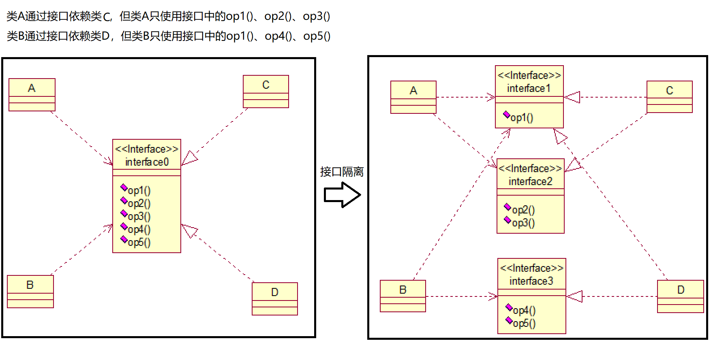
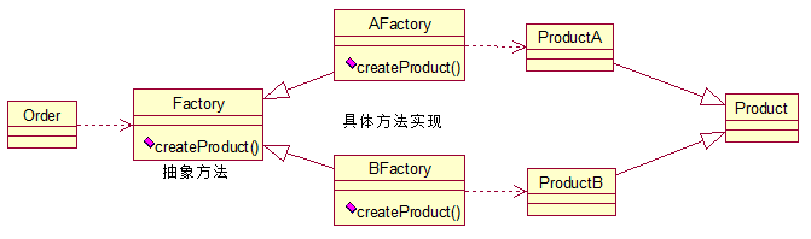
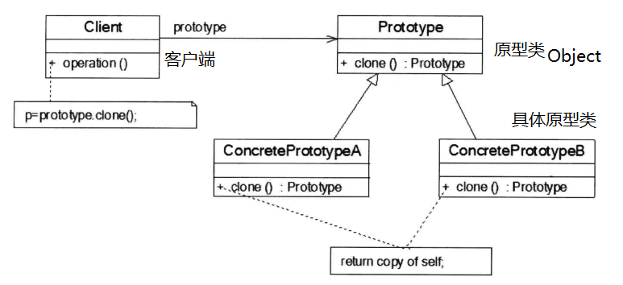

# 概述

## 设计原则

1. 单一职责原则（Single Responsibility）：一个类应该只负责一项职责。如果类的逻辑简单，则方法级别的单一职责原则是被允许的。
2. 开闭原则（Open Close Principle OCP）：对扩展开放，对修改关闭。


3. 里氏代换原则（Liskov Substitution Principle LSP）：任何基类可以出现的地方，子类一定可以出现。 继承复用，只有当衍生类可以替换掉基类，软件单位的功能不受到影响时，基类才能真正被复用，而衍生类也能够在基类的基础上增加新的行为。
   - 子类应避免改变较大的重写，否则子类和父类继承一个更加基础的类（此时关系应为组合、聚合、依赖）。
4. 依赖倒转原则（Dependence Inversion Principle）：高层模块不应该依赖低层模块，依赖于抽象而不依赖于具体。面向接口编程。
   1. 接口依赖传递：方法参数使用接口类型。
   2. 构造器依赖传递：成员变量使用接口类型。
   3. setter()依赖传递：成员变量使用接口类型。
5. 接口隔离原则（Interface Segregation Principle）：一个类对另一个类的依赖应该建立在最小接口上。



6. 迪米特法则（最少知道原则）（Demeter Principle）：对于被依赖的类，尽量将逻辑封装在类的内部，对外除提供public成员外，不泄漏任何信息。只与直接朋友通信、避免非直接朋友。减少不必要的依赖。

> 朋友关系：存在耦合关系的两个对象。
> 
> - 直接朋友：成员变量、方法参数、方法返回值中的类。
> 
> - 非直接朋友：局部变量中的类。

7. 合成复用原则（Composite Reuse Principle）：尽量使用组合、聚合，而不是继承。

 

## 设计模型类型

| 类别  | 模式                                                              |
| --- | --------------------------------------------------------------- |
| 创建型 | 工厂方法模式、抽象工厂模式、单例模式、建造者模式、原型模式                                   |
| 结构型 | 适配器模式、装饰器模式、代理模式、外观模式、桥接模式、组合模式、享元模式                            |
| 行为型 | 策略模式、模板方法模式、观察者模式、迭代子模式、责任链模式、命令模式、备忘录模式、状态模式、访问者模式、中介者模式、解释器模式 |

# 创建型

## 工厂模式 Factory

1. 编码时不能预见需要创建哪种类的实例。
2. 系统不应依赖于产品类型实例如何被创建、组合和表达的细节。

### 简单工厂模式（静态工厂模式）

 

```java
class Order{

    private Factory factory = new Factory();

    public Product getProduct(){
        return factory.createProduct();
    }
}

class Factory{
    public Product createProduct(){
        return true? new ProductB(): new ProductA();
    }
}

class Product{}
```

### 工厂方法模式

- 抽象对抽象，具体对具体：定义创建对象的抽象方法，由子类决定要实例化的类。对象的实例化推迟到其子类。

 

```java
public interface FruitFactory {
    public Fruit makeFruit();
}

class AppleFactory implements FruitFactory {

    @Override
    public Fruit makeFruit() {
        return new Apple();
    }
}

class BananaFactory implements FruitFactory {

    @Override
    public Fruit makeFruit() {
        return new Banana();
    }
}

interface Fruit {}
class Apple implements Fruit {}
class Banana implements Fruit {}
```

### 抽象工厂模式

- 抽象工厂模式：interface，创建相关/依赖的对象簇，而无需指明具体的类。
- 将工厂抽象成两层；抽象工厂、具体实现的工厂子类。每个具体工厂生产一个产品簇（相关/依赖的一系列产品），产品族内包含不同等级的产品。

> Intel、Amd分别为一个产品簇，而CPU、主板、硬盘等分别属于不同等级的产品。
> 
> - 产品有多个产品簇，而只消费其中某一簇的产品。
> - 同属于同一簇的产品必须一起使用。
> - 系统提供一个产品类的库，所有的产品以相同的接口出现。

 

- 工厂

```java
public interface ComputerFactory {

    CPU createCPU();

    MainBoard createMainBoard();
}

class IntelFactory implements ComputerFactory {

    @Override
    public CPU createCPU() {
        return new IntelCPU();
    }

    @Override
    public MainBoard createMainBoard() {
        return new IntelMainBoard();
    }
}

class AmdFactory implements ComputerFactory {

    @Override
    public CPU createCPU() {
        return new AmdCPU();
    }

    @Override
    public MainBoard createMainBoard() {
        return new AmdMainBoard();
    }
}
```

- 产品CPU

```java
public class CPU {}

class IntelCPU extends CPU {
    public static final int PORT = 1001;
}

class AmdCPU extends CPU {
    public static final int PORT = 1002;
}
```

- 产品MainBoard

```java
public interface MainBoard {}

class IntelMainBoard extends MainBoard {
    public static final int PORT = 1001;
}

class AmdMainBoard extends MainBoard {
    public static final int PORT = 1002;
}
```

- 客服端

```java
public class Client {
    public static void main(String[] args) {
        IntelFactory intelFactory = new IntelFactory();
        makeComputer(intelFactory);
    }

    public static void makeComputer(ComputerFactory factory) {
        if (factory instanceof IntelFactory) {
            IntelCPU cpu = (IntelCPU) factory.createCPU();
            IntelMainBoard mainBoard = (IntelMainBoard) factory.createMainBoard();
        }
        if (factory instanceof AmdFactory) {
            AmdCPU cpu = (AmdCPU) factory.createCPU();
            AmdMainBoard mainBoard = (AmdMainBoard) factory.createMainBoard();
        }
    }
}
```

## 单例模式 SingleTon

### 概述

- 该类只能存在一个对象实例，且只提供一个获取其对象实例的方法。

| 单例方式  | 说明                                         |
| ----- | ------------------------------------------ |
| 饿汉式   | 静态常量、静态代码块                                 |
| 懒汉式   | 线程不安全<br />线程安全、同步方法<br />线程安全、同步代码块（双重检查） |
| 静态内部类 |                                            |
| 枚举    |                                            |

### 饿汉式

1. 构造器私有化：private。

2. 类的内部创建对象：private static。

3. 向外暴露一个静态的公共方法：getInstance()。
- 类装载时完成实例化，避免线程同步问题；但没有实现Lazy Loading，可能造成内存浪费。

```java
public class Singleton {

    private static Singleton instance = new Singleton();

    private Singleton() {}

    public static Singleton getInstance() {
        return instance;
    }
}
```

```java
public class Singleton {

    private static Singleton instance;

    static{
        instance = new Singleton();
    }

    private Singleton() {}

    public static Singleton getInstance() {
        return instance;
    }
}
```

### 懒汉式

- Lazy Loading
1. 线程不安全：

```java
public class LazySingleton {

    private static LazySingleton instance = null;

    private LazySingleton() {}

    public synchronized static LazySingleton getInstance() {
        if (instance == null) {
            instance = new LazySingleton();
        }
        return instance;
    }
}
```

2. 线程安全：同步方法，效率低

```java
public class LazySingleton {
    private static LazySingleton instance = null;

    private LazySingleton() {
    }

    public synchronized static LazySingleton getInstance() {
        if (instance == null) {
            instance = new LazySingleton();
        }
        return instance;
    }
}
```

3. 线程安全：同步代码块（双重检查）

```java
public class LazySingleton {
    private static LazySingleton instance = null;

    private LazySingleton() {
    }

    public static LazySingleton getInstance() {
        if (instance == null) {
            synchronized (LazySingleton.class) {
                if (instance == null) {
                    instance = new LazySingleton();
                }
            }
        }
        return instance;
    }
}
```

> 错误写法：可能有多个线程已经经过了判断，等待进入同步代码块，此时仍然会创建多个实例。
> 
> ```java
> if (instance == null) {
>     synchronized (LazySingleton.class) {
>         instance = new LazySingleton();
>     }
> }
> ```

### 静态内部类

- Lazy loading：类装载机制：静态内部类在外部类被装载时不会被装载，而是在需要实例时才会装载。
- 由JVM保证线程安全：类的静态属性只会在第一次加载类时初始化。

```java
public class LazySingleton {
    private static class SingletonHolder{
        private static StaticSingleton instance = new StaticSingleton();
    }

    private LazySingleton(){}

    public static LazySingleton getInstance(){
        return SingletonHolder.instance;
    }
}
```

### 枚举

- 避免线程安全问题，防止反序列化重新创建新的对象。

```java
enum Singleton{
    INSTANCE;
}
```

## 建造者模式 Builder

- 建造者模式（生成器模式）：将复杂对象的建造过程抽象化，通过对该建造过程的不同实现构造不同的对象。

| 角色                    | 说明                                                                             |
| --------------------- | ------------------------------------------------------------------------------ |
| Product 产品            | 具体的产品                                                                          |
| Builder 抽象建造者         | 为产品对象的各个部件指定抽象接口。                                                              |
| ConcreteBuilder 具体建造者 | 实现各个部件的具体构造装配。                                                                 |
| Director 指导者          | 与客户端联系，并告诉建造者应该建造的产品，调用具体建造者中的方法。<br />1. 隔离客户与对象的生成过程。<br />2. 负责控制产品对象的生成过程。 |


| 建造者模式 | 说明                                                                                                                                                       |
| ----- | -------------------------------------------------------------------------------------------------------------------------------------------------------- |
| 优势    | 1. 客户不必知道产品内存组成的细节，将产品本身和产品的创建过程解耦，使得相同的创建过程可以产生不同的产品对象。<br/>2. 每个具体建造者都相对独立，用户使用不同的具体建造者可以得到不同的产品对象。<br/>3. 精细化控制产品的创建过程。<br/>4. OCP：增加新的具体建造者无需修改原有代码。 |
| 缺陷    | 1. 建造者模式产生的产品应该是组成成分相似的，不适用与产品之间差异性大的。<br/>2. 如果产品的内部变化复杂，需要定义较多具体建造者实现其变化。                                                                              |


```java
ProductABuilder productABuilder = new ProductABuilder();
Director director = new Director();
director.makeProduct(productABuilder);
Product productA = productABuilder.getProduct();
```

```java
public class Director {
    public void construct(Builder builder){ //传入建造者的具体实现
        builder.buildPartA();
        builder.buildPartB();
        builder.buildPartC();
    }
}

interface Builder {
    void buildPartA();
    void buildPartB();
    void buildPartC();
    Product getProduct();
}

class ProductABuilder implements Builder{
    Product productA = new Product();

    @Override
    public void buildPartA() {
        productA.setPartA("productA-partA");
    }

    @Override
    public void buildPartB() {
        productA.setPartB("productA-partB");
    }

    @Override
    public void buildPartC() {
        productA.setPartC("productA-partC");
    }

    @Override
    public Product getProduct() {
        return productA;
    }
}

public class Product {
    private String partA;
    private String partB;
    private String partC;
}
```

> StringBuilder#append()：
> 
> | 类/接口                  | 角色说明                                                                             |
> | --------------------- | -------------------------------------------------------------------------------- |
> | Appendable            | 抽象建造者                                                                            |
> | AbstractStringBuilder | 建造者                                                                              |
> | StringBuilder         | 指导者<br />具体建造者：建造方法由AbstractStringBuilder实现，StringBuilder继承AbstractStringBuilder |
> 
>  

| 比较     | 产品                           |
| ------ | ---------------------------- |
| 抽象工厂模式 | 产品簇<br />不关心构建过程，只关心是什么工厂生产的 |
| 建造者模式  | 指定蓝图建造产品<br />组装配零配件而产生新产品   |

## 原型模式 Prototype

- 原型模式：复制原型对象来创建更多同类型的对象，动态获取对象运行时的状态。
  
  - java.lang.Object提供clone()，需要实现Cloneable接口，使该类能够复制且具有复制的能力。
  - clone()减少资源的占用：对象拷贝时，不是使用构造器方法，而是从堆内存中以二进流的方式进行拷贝，重新分配一个内存块。

- 相似但不相同：通过复制方法创建的对象是新的对象，在内存中拥有新的地址，每个复制的对象相互独立。在对复制的对象修改时，不会影响原型对象。

 

- clone()：重写java.lang.Object#clone()，实现Cloneable接口（CloneNotSupportException ）。

- 对于任意对象obj：

```java
obj.clone() != obj;
obj.clone().getClass() == obj.getClass();
obj.clone().equals(obj) == true; 
```

| 拷贝方式 | 说明                                                  |
| ---- | --------------------------------------------------- |
| 浅拷贝  | 被拷贝对象的所有属性都和原型对象相同<br />其引用数据类型成员的地址仍是原来的地址：即没有被复制。 |
| 深拷贝  | 被拷贝对象的所有属性都和原型对象相同<br />其引用数据类型成员被赋予新的地址：即被复制。      |

> String：尽管没有实现Cloneable接口的clone()方法，但是可以看作基本数据类型一般被拷贝，而StringBuffer不行。

- 浅拷贝：

```java
Person person = new Person(1001, "Jac", new Pet("King"));
Person person1 = person.clone();

System.out.println(person.equals(person1)); //true
System.out.println(person == person1); //false
System.out.println(person.pet.equals(person1.pet)); //true
System.out.println(person.pet == person1.pet); //true  浅拷贝
```

```java
class Person implements Cloneable {
    private int id;
    private String name;
    public Pet pet;

    @Override
    protected Person clone() throws CloneNotSupportedException {
        return (Person) super.clone();
    }
}

class Pet {}
```

- 深拷贝：引用数据类型成员所属的类也重写clone()且实现Cloneable接口，当克隆对象调用其clone()时，其clone()内部也调用了该引用数据类型成员的clone()，对该成员进行克隆。

```java
Person person = new Person(1001, "Jac", new Pet("King"));
Person person1 = person.clone();

System.out.println(person.equals(person1)); //true
System.out.println(person == person1); //false
System.out.println(person.pet.equals(person1.pet)); //true
System.out.println(person.pet == person1.pet); //false  深拷贝
```

```java
class Person implements Cloneable {
    private int id;
    private String name;
    public Pet pet;

    @Override
    protected Person clone() throws CloneNotSupportedException {
        Person person = (Person) super.clone();
        person.pet = pet.clone();
        return person;
    }
}

class Pet implements Cloneable{
    @Override
    protected Pet clone() throws CloneNotSupportedException {
        return (Pet) super.clone();
    }
}
```

- 序列化深拷贝：

```java
public Person deepClone() {
    ByteArrayOutputStream bos = null;
    ObjectOutputStream oos = null;
    ByteArrayInputStream bis = null;
    ObjectInputStream ois = null;
    try {
        bos = new ByteArrayOutputStream();
        oos = new ObjectOutputStream(bos);
        oos.writeObject(this);
        bis = new ByteArrayInputStream(bos.toByteArray());
        ois = new ObjectInputStream(bis);
        return (Person) ois.readObject();
    } catch (Exception ex) {
        ex.printStackTrace();
        return null;
    } finally {
        try {
            bos.close();
            oos.close();
            bis.close();
            ois.close();
        }catch (IOException ex) {
            ex.printStackTrace();
        }
    }
}
```

# 结构型

## 适配器模式 Adapter

### 概述

- 适配器模式（包装器 Wrapper）：（兼容性）当使用一个已经存在的类，其接口不符合要求时；创建一个可复用的类，与其他不相关的/不可预见的类协同工作，用来适配它们的父类接口。

 

| 类型                     | 关系  | Source | 说明                                          |
|:---------------------- |:--- |:------ | ------------------------------------------- |
| 类适配器模式                 | 继承  | 类      | 单一源适配，清晰                                    |
| 对象适配器模式                | 关联  | 对象     | 多源适配，但不太清晰                                  |
| 接口适配器模式<br />（默认适配器模式） | 实现  | 接口     | 只需实现一部分目标接口的方法。<br />抽象类实现接口，继承该抽象类，实现部分方法。 |


### 类适配器模式

 

 

```jav
Phone phone = new Phone();
phone.charging(new VoltageAdapter());
```

```java
class Phone{
    public void charging(IVoltage5V iVoltage5V) {
        if(iVoltage5V.output5V() == 5) {
            System.out.println("正在充电...");
        } else if (iVoltage5V.output5V() > 5) {
            System.out.println("无法充电!!!");
        }
    }
}

interface IVoltage5V {
    int output5V();
}

class Voltage220V {
    public int output220V() {
        int src = 220;
        System.out.println("src");
        return src;
    }
}

class VoltageAdapter extends Voltage220V implements IVoltage5V {

    @Override
    public int output5V() {
        int srcV = output220V();
        int dstV = srcV / 44;
        return dstV;
    }
}
```

### 对象适配器模式


```java
Phone phone = new Phone();
phone.charging(new VoltageAdapter(new Voltage220V()));
```

```java
class Phone{
    public void charging(IVoltage5V iVoltage5V) {
        if(iVoltage5V.output5V() == 5) {
            System.out.println("正在充电...");
        } else if (iVoltage5V.output5V() > 5) {
            System.out.println("无法充电!!!");
        }
    }
}

interface IVoltage5V {
    int output5V();
}

class Voltage220V {
    public int output220V() {
        int src = 220;
        System.out.println("src");
        return src;
    }
}

class VoltageAdapter extends Voltage220V implements IVoltage5V {

    private Voltage220V voltage220V;

    public VoltageAdapter(Voltage220V voltage220V){
        this.voltage220V = voltage220V;
    }

    @Override
    public int output5V() {
        int dstV = 0;
        if(null != voltage220V){
            int srcV = output220V();
            dstV = srcV / 44; 
        }
        return dstV;
    }
}
```

### 接口适配器模式

 

```java
//Swing的事件监听器
new MouseListener() {
    ...
}
```

## 桥接模式 Bridge

- 桥接模式（柄体/接口模式）：抽象化与实现脱耦。多层继承的替代实现。

 

| 角色                             | 等级  |                                                       |
|:------------------------------ |:--- |:----------------------------------------------------- |
| 抽象化<br />Abstraction           | 抽象  | 抽象化给出的定义，并保存一个对实现化角色的引用<br />只给出基于底层操作的更高一层操作。        |
| 修正抽象化<br />RefinedAbstraction  | 抽象  | 扩展抽象化角色，改变和修正父类对抽象化的定义                                |
| 实现化<br />Implementor           | 实现  | 实现化角色的接口，不是具体的实现。<br />不一定与抽象化角色的接口定义相同。<br />只给出底层操作 |
| 具体实现化<br />ConcreteImplementor | 实现  | 对实现化角色的具体实现                                           |

- 抽象化等级结构中的方法通过向对应的实现化对象委派实现自己的功能。即抽象化角色可以通过向不同的实现化对象委派，而动态的转换自己的功能。


```java
//以SMS发送普通消息
AbstartMessage message = new CommonMessage(new MessageSMS());
message.sendMessage("信件内容", "Tom");
//以Email发送加急消息
message = new UrgentMessage(new MessageEmail());
message.sendMessage("信件内容", "Tom");
```

```java
abstract class AbstartMessage {

    MessageImplementor impl;

    public AbstartMessage(MessageImplementor impl) {
        this.impl = impl;
    }

    public void sendMessage(String message, String toUser) {
        this.impl.send(message, toUser);
    }
}

class CommonMessage extends AbstartMessage {

    public CommonMessage(MessageImplementor impl) {
        super(impl);
    }

    @Override
    public void sendMessage(String message, String toUser) {
        super.sendMessage(message, toUser);
    }
}

class UrgentMessage extends AbstartMessage {

    public UrgentMessage(MessageImplementor impl) {
        super(impl);
    }

    @Override
    public void sendMessage(String message, String toUser) {
        message = "加急!：" + message;
        super.sendMessage(message, toUser);
    }

    public void other() {//扩展新的功能}
}

interface MessageImplementor {
    public void send(String message, String toUser);
}

class MessageSMS implements MessageImplementor {
    @Override
    public void send(String message, String toUser) {
        System.out.println("SMS-[" + message + "]-TO-" + toUser);
    }
}

class MessageEmail implements MessageImplementor {
    @Override
    public void send(String message, String toUser) {
        System.out.println("Email-[" + message + "]-TO-" + toUser);
    }
}
```

## 装饰者模式 Decorator

- 装饰者模式：动态地将新功能附加到对象。

 

> IO流中的套接：
> 
>  
> 
> 


```java
Drink drink = new Chocolate(new Latte());
System.out.println(drink.cost());
System.out.println(drink.getDescription());
```

```java
abstract class Drink{
    private double price;
    private String description;

    public abstract double cost();

    public void setPrice(double price){
        this.price = price;
    }

    public double getPrice(){
        return price;
    }

    public void setDescription(String description) {
        this.description = description;
    }

    public String getDescription(){
        return description;
    }
}

class Coffee  extends Drink {
    @Override
    public double cost() {
        return super.getPrice();
    }

}


class Latte extends Coffee{
    public Latte(){
        setPrice(100);
        setDescription("Latte Coffee");
    }
}

class Decorator extends Drink{
    private Drink drink;

    public Decorator(Drink drink){
        this.drink = drink;
    }

    public String getDescription() {
        return drink.getDescription() + "&&" + cost();
    }

    @Override
    public double cost() {
        return super.getPrice() + drink.cost();
    }
}

class Chocolate extends Decorator{

    public Chocolate(Drink drink){
        super(drink);
        setPrice(10);
        setDescription("Chocolate");
    }
}
```

## 组合模式 Composite

### 概述

- 组合模式（合成模型模式）：将对象组合成树形结构以表示“整体-部分”的结构层次，对单个对象和组合对象的访问具有一致性。

 

| 类/接口      | 构件角色 | 说明                       |
| --------- | ---- | ------------------------ |
| Component | 抽象   | 共有的行为                    |
| Leaf      | 树叶   | 参加组合的原始对象的行为<br>没有下级的子对象 |
| Composite | 树枝   | 参加组合的有子对象的对象             |

1. 遍历组织机构、处理的对象具有树形结构时。
2. 要求较高的抽象性，节点和叶子相似。

### 透明方式

- 不安全：此时的Leaf和Composite对象没有被区分。

| 角色   | 说明                                             |
| ---- | ---------------------------------------------- |
| 抽象构件 | 声明所有管理子类对象的方法：包括Leaf和Composite内的所有方法。          |
| 树叶构件 | 参加组合的原始对象的行为<br>没有下级的子对象<br>**具有管理子对象一般行为的方法** |
| 树枝构件 | 参加组合的有子对象的对象                                   |

### 安全方式

- 只在Composite内声明管理子类对象的方法。

| 角色   | 说明                                    |
| ---- | ------------------------------------- |
| 抽象构件 | 声明所有管理子类对象的方法：包括Leaf和Composite内的所有方法。 |
| 树叶构件 | 参加组合的原始对象的行为<br>没有下级的子对象              |
| 树枝构件 | 参加组合的有子对象的对象<br>**具有管理子对象一般行为的方法**    |

```java
public interface Component{
    //返回自身实例
    Composite getComposite();
    //业务方法
    void sampleOperation();
}
```

```java
public class Composite implements Component {

    private Vector componentVector = new Vector();

    @Override
    public Composite getComposite() {
        return this;
    }

    @Override
    public void sampleOperation() {
        Enumeration enumeration = getChild();
        while (enumeration.hasMoreElements()) {
            ((Component) enumeration.nextElement()).sampleOperation();
        }
    }

    public void add(Component component) {
        componentVector.addElement(component);
    }

    public void remove(Component component) {
        componentVector.remove(component);
    }

    public Enumeration getChild() {
        return componentVector.elements();
    }
}
```

```java
public class Leaf implements Component{

    @Override
    public Composite getComposite() {
        return null;
    }

    @Override
    public void sampleOperation() {}
}
```

## 外观模式 Facade

- 外观模式（过程模式）：定义一个一致的接口，用以屏蔽内部子系统的细节，调用端只需要和该接口发生调用，而无需关心子系统的内部细节。
- 维护一个遗留的大型系统时，如果该系统难以维护和扩展，则考虑为新系统开发一个Facade类，提供遗留系统的比较清晰简单的接口，新系统和Facade类交互，提供复用性。 

   

 

```java
HomeTheaterFacade home = new HomeTheaterFacade();
home.ready();
home.play();
home.exit();
```

```java
public class  HomeTheaterFacade{
    private DVDPlayer dvdPlayer;
    private Popcorn popcorn;

    public HomeTheaterFacade(){
        dvdPlayer = DVDPlayer.getInstance();
        popcorn = Popcorn.getInstance();
    }

    public void ready(){
        dvdPlayer.on();
        popcorn.on();
        popcorn.work();
    }

    public void play(){
        dvdPlayer.play();
    }

    public void exit(){
        dvdPlayer.off();
        popcorn.off();
    }
}

class DVDPlayer{
    private static DVDPlayer instance = new DVDPlayer();

    public static DVDPlayer getInstance(){return instance;}

    public void on(){System.out.println("DVD on");}
    public void off(){System.out.println("DVD off");}
    public void play(){System.out.println("DVD play");}
}

class Popcorn{
    private static Popcorn instance = new Popcorn();

    public static Popcorn getInstance(){return instance;}

    public void on(){System.out.println("Popcorn on");}
    public void off(){System.out.println("Popcorn off");}
    public void work(){System.out.println("Popcorn work");} 
}
```

## 享元模式 Flyweight

- 享元模式（蝇量模式）：运用共享技术有效地支持大量细粒度的对象。
1. 解决重复对象的内存浪费问题：对象的状态大部分可以外部化时，将大量对象的创建改为从池中获取。
2. 池技术：StringTable、数据库连接池、缓冲池、SingletonObject。

 

| 对象的信息 | 说明                           | 示例：围棋      |
| ----- | ---------------------------- | ---------- |
| 内部状态  | 对象共享的信息，存储在享元对象内部且不随环境改变而关闭。 | 棋子的颜色（黑/白） |
| 外部状态  | 对象得以依赖的标记，随环境改变而改变、不可共享。     | 棋子在棋盘上的位置  |

- Integer#valueOf()的缓存技术（`-128~127`）：

```java
@IntrinsicCandidate
public static Integer valueOf(int i) {
    if (i >= IntegerCache.low && i <= IntegerCache.high)
        return IntegerCache.cache[i + (-IntegerCache.low)];
    return new Integer(i);
}

cache = archivedCache;
// range [-128, 127] must be interned (JLS7 5.1.7)
assert IntegerCache.high >= 127;
```

```java
Integer i1 = Integer.valueOf(127);
Integer i2 = Integer.valueOf(127);
System.put.println(i1 == i2); //true;

Integer j1 = new Integer(127);
Integer j2 = new Integer(127);
System.put.println(j1 == j2); //false;
System.put.println(i1 == j1); //false;
```

## 代理模式 Proxy

- 代理模式：通过代理对象访问目标对象，可扩展目标对象的功能。
  - 被代理对象：远程对象、创建开销大的对象、需要安全控制的对象。
1. 静态代理。
2. 动态代理
   1. JDK代理、接口代理。
   2. Cglib代理、子类代理。

 

### 静态代理

- 静态代理：目标对象和代理对象一起实现相同的接口 或 继承相同的父类，代理对象通过调用相同的方法来调用目标对象的方法。
1. 在不改变目标对象的功能前提下，通过代理对象对目标功能扩展。
2. 代理对象需要和目标对象实现一样的接口，会产生多个代理类。
3. 一旦接口增加方法，目标对象和代理对象都需要维护。

 

```java
TeacherDaoProxy proxy = new TeacherDaoProxy(new TeacherDao());
proxy.teach();
```

```java
public interface TeacherDaoInterface{
    void teach();
}

class TeacherProxy implements TeacherDao{

    private TeacherDaoInterface target;

    public TeacherProxy(TeacherDaoInterface target){
        this.target = target;
    }

    public void teach(){
        System.out.println("代理开始...");
        target.teach();
        System.out.println("提交...");
    }
}

class TeacherDao implements TeacherDaoInterface{
    public void teach(){
        System.out.println("teach");
    }
}
```

### JDK代理

- JDK代理：代理对象不需要实现接口，而目标对象需要实现接口。代理对象通过java.lang.reflect.Proxy生成，动态地在内存中构建代理对象。
1. 代理的类不能是final修饰的：javal.ang.IllegaArgumentException。
2. 目标对象的方法如果为final/static，则不会被拦截，不执行额外的扩展功能。 

```java
public static Object newProxyInstance(ClassLoader loader,
                                      Class<?>[] interfaces,
                                      InvocationHandler h)
```

| 参数                      | 说明                                       |
| ----------------------- | ---------------------------------------- |
| ClassLoader loader      | 指定当前目标对象的类加载器，获取加载器的方法固定。                |
| `Class<?>[] interfaces` | 目标对象实现的接口类型。                             |
| InvocationHandler h     | 事件处理：执行目标对象方法时，触发事件处理器方法。<br />传入目标对象方法。 |

```java
TeacherDaoInterface proxy = (TeacherDaoInterface)new ProxyFactory(new TeacherDao()).getProxy();
proxy.say();
proxy.teach();
System.out.println(proxy.getClass());//class $Proxy0
```

```java
public class ProxyFactory {

    private Object target;

    public ProxyFactory(TeacherDao target) {
        this.target = target;
    }

    public Object getProxy() {
        return Proxy.newProxyInstance(target.getClass().getClassLoader(),
                target.getClass().getInterfaces(),
                new InvocationHandler() {
                    @Override
                    public Object invoke(Object proxy, Method method, Object[] args) throws Throwable {
                        System.out.println("代理开始...");
                        Object returnVal = method.invoke(target, args);
                        System.out.println("提交...");
                        return returnVal;
                    }
                });
    }
}

interface TeacherDaoInterface {
    void teach();

    void say();
}

class TeacherDao implements TeacherDaoInterface {
    public void teach() {
        System.out.println("teach");
    }

    public void say() {
        System.out.println("say");
    }
}
```

### Cglib代理

- Cglib代理（子类代理）：目标子类对象实现代理，在内存中创建子类对象来实现对目标对象功能扩展。不需要实现任何接口。
  
  - 代理的类不能是final修饰的。

- AOP编程选择代理模式：
1. 目标对象需要实现接口，用JDK代理。

2. 目标对象不需要实现接口，用Cglib代理。
- Cglib底层：字节码处理框架ASM转换字节码并生成新的类。

```java
class ProxyFactory implements MethodInterceptor{
    private Object target;

    public ProxyFactory(Object target){
        this.target = target;
    }

    public Object getProxy(){
        Enhancer enhancer = new Enhance();
        enhancer.setSuperclass(target.getClass());
        enhancer.setCallback(this);
        return enhancer.create();
    }

    @Override
    public Object intercept(Object o, Method method, Object[] objects, MethodProxy methodProxy) throws Throwable {
        System.out.println("cglib-代理开始...");
        Object re = method.invoke(target, objects);
        System.out.println("cglib-代理提交...");
        return re;
    }
}

class TeacherDao{
    public void teach() {
        System.out.println("teach");
    }

    public void say() {
        System.out.println("say");
    }
}
```

### 变体

1. 防火墙代理：内网通过代理穿透防火墙，实现对公网的访问。
2. 缓存代理：请求资源时，先从缓存代理中获取，如果缓存代理中取不到，再去公网、数据库中获取。
3. 远程代理：将远程对象当作本地对象来调用。
4. 同步代理：多线程间同步工作。

# 行为型

## 模板方法模式 Template

- 模板方法模式：抽象类公开定义执行其方法的模板，子类按需重写方法实现，调用时仍然按抽象类中定义的模板执行。
1. 统一算法：父类的模板方法保证算法的结构不变，子类提供部分步骤的实现。某个过程需要执行一系列步骤，个别步骤的实现可能不同。
2. 模板方法通常使用final修饰，防止被子类重写。
3. 代码复用。

```java
Employee acc = new Account();
acc.exec();
```

```java
publlic abstract class Employee{

    //模板方法
    public final void exec(){
        prepare();
        work();
        complete();
    } 

    public void prepare(){
        System.out.println("准备...");
    }

    public abstract void work();

    public void complete(){
        System.out.println("完成...");
    }
}

class Account extends Employee{
    public void work(){
        System.out.println("会计计帐...");
    }
}
```

- 钩子方法：默认不执行任何行为的方法，子类按需选择覆盖。

```java
publlic abstract class Employee{

    //模板方法
    public final void exec(){
        prepare();
        if(leisure()) work();
        complete();
    }

    //钩子方法
    public boolean leisure(){
        return true;
    }

    public void prepare(){
        System.out.println("准备...");
    }

    public abstract void work();

    public void complete(){
        System.out.println("完成...");
    }
}

class Account extends Employee{
    public void work(){
        System.out.println("会计计帐...");
    }
}
```

> Spring IOC：AbstractApplicationContext#refresh()模板方法，部分代码
> 
> ```java
> this.postProcessBeanFactory(beanFactory);
> StartupStep beanPostProcess = this.applicationStartup.start("spring.context.beans.post-process");
> this.invokeBeanFactoryPostProcessors(beanFactory);
> this.registerBeanPostProcessors(beanFactory);
> beanPostProcess.end();
> this.initMessageSource();
> this.initApplicationEventMulticaster();
> this.onRefresh(); //钩子方法
> this.registerListeners();
> this.finishBeanFactoryInitialization(beanFactory);
> this.finishRefresh();
> ```
> 
>  

## 命令模式 Command

- 命令模式：将请求封装为对象，使用不同的参数表示不同的请求，且支持可撤销的操作。消除请求发送者和请求接收者之间的耦合。
1. 命令队列：可将命令对象存入队列，多线程执行。
2. 尽量避免系统中存在过多的具体命令类。

 


```java
LightReceiver lightReceiver = new LightReceiver();
RemoteController remoteController = new RemoteController();
remoteController.setCommands(0,new LightOnCommand(lightReceiver),new LightOffCommand(lightReceiver));
remoteController.onButtonWasPushed(0);
remoteController.offButtonWasPushed(0);
remoteController.undoButtonWasPushed();
```

```java
class RemoteController {
    Command[] onCommands;
    Command[] offCommands;
    Command undoCommand; //记录上一次操作，用于撤销

    public RemoteController() {
        onCommands = new Command[5];
        offCommands = new Command[5];

        for (int i = 0; i < 5; i++) {
            onCommands[i] = new NoCommand();
            offCommands[i] = new NoCommand();
        }
    }

    public void setCommands(int no, Command onCommand, Command offCommand) {
        onCommands[no] = onCommand;
        offCommands[no] = offCommand;
    }

    public void onButtonWasPushed(int no) {
        onCommands[no].execute();
        undoCommand = onCommands[no];
    }

    public void offButtonWasPushed(int no) {
        offCommands[no].execute();
        undoCommand = offCommands[no];
    }

    public void undoButtonWasPushed() {
        undoCommand.undo();
    }
}

interface Command {

    void execute();

    void undo();
}

class LightOnCommand implements Command {

    LightReceiver light;

    public LightOnCommand(LightReceiver light) {
        this.light = light;
    }

    @Override
    public void execute() {
        light.on();
    }

    @Override
    public void undo() {
        light.off();
    }
}

class LightOffCommand implements Command {

    LightReceiver light;

    public LightOffCommand(LightReceiver light) {
        this.light = light;
    }

    @Override
    public void execute() {
        light.off();
    }

    @Override
    public void undo() {
        light.on();
    }
}

class NoCommand implements Command {

    @Override
    public void execute() {
    }

    @Override
    public void undo() {
    }
}

class LightReceiver {

    public void on() {
        System.out.println("打开电灯");
    }

    public void off() {
        System.out.println("关闭电灯");
    }
}
```

## 访问者模式 Visitor

- 访问者模式：在被访问的类中加入一个对外提供接待访问者的接口。封装一些作用于某种数据结构的各元素的操作，可以在不改变数据结构的前提下，定义作用于这些元素的新操作。将数据结构和操作分离，解决数据结构和操作耦合性问题。
  - 较稳定的数据结构、经常变化的功能需求的系统。


| 访问者模式 | 说明                                                             |
| ----- | -------------------------------------------------------------- |
| 优势    | 1. 符合单一职责原则。<br />2. 统一功能，适用于数据结构相对稳定的系统。                      |
| 缺陷    | 1. 具体元素的细节向访问者公布，违背迪米特拉法制。<br />2. 违背依赖倒转原则，访问者依赖具体元素，而不是抽象元素。 |

- 双分派：得到执行的操作取决于请求的类型、两个接收者的类型。
  
  

```java
ObjectStructure objectStructure = new ObjectStructure();
objectStructure.attach(new AJudge());
objectStructure.attach(new Bjudge());
objectStructure.display(new Success());
```

```java
public class ObjectStructure {

    private List<Judge> judges = new LinkedList<>();

    public void attach(Judge j) {
        persons.add(j);
    }

    public void detach(Judge j) {
        persons.remove(j);
    }

    public void display(Evaluate evaluate) {
        for(Judge j: judgs) {
            j.accept(evaluate);
        }
    }
}

abstract class Judge{
    public abstract void accept(Evaluate evaluate);
}

class AJudge extends Judge{
    public void accept(Evaluate evaluate){
        evaluate.getAResult();
    }
}

abstract class Evaluate{
    public abstract void getAResult();
    public abstract void getBResult();
}

class Success extends Evaluate{
    public void getAResult(){
        System.out.println("A评委：评价为成功");
    }
    public void getBResult(){
        System.out.println("B评委：评价为成功");
    }
}
```

## 迭代器模式 Iterator

- 迭代器模式：遍历集合元素。
1. 提供统一的方法遍历对象，客户不必考虑集合的类型。
2. 隐藏集合的内部信息，客户遍历时只能获取遍历器。
3. 单一职责。
4. 每个集合对象都需要一个迭代器。

```java
public interface Iterator<E> {

    boolean hasNext();

    E next();

    default void remove() {
        throw new UnsupportedOperationException("remove");
    }

    default void forEachRemaining(Consumer<? super E> action) {
        Objects.requireNonNull(action);
        while (hasNext())
            action.accept(next());
    }
}
```

- Arrays内部类：ArrayItr

```java
public Iterator<E> iterator() {
    return new ArrayItr<>(a);
}
```

```java
private static class ArrayItr<E> implements Iterator<E> {
    private int cursor;
    private final E[] a;

    ArrayItr(E[] a) {
        this.a = a;
    }

    @Override
    public boolean hasNext() {
        return cursor < a.length;
    }

    @Override
    public E next() {
        int i = cursor;
        if (i >= a.length) {
            throw new NoSuchElementException();
        }
        cursor = i + 1;
        return a[i];
    }
}
```

## 观察者模式 Observer

- 观察者模式：以集合的方式管理用户（Observer），避免对核心类（Data）的修改。 


- java.util.Observable（相当于Subject）：已经实现核心方法，通过继承来实现观察者模式。

```java
@Deprecated(since="9")
public class Observable {
    private boolean changed = false;
    private Vector<Observer> obs;

    public Observable() {
        obs = new Vector<>();
    }

    public synchronized void addObserver(Observer o) {
        if (o == null)
            throw new NullPointerException();
        if (!obs.contains(o)) {
            obs.addElement(o);
        }
    }

    public synchronized void deleteObserver(Observer o) {
        obs.removeElement(o);
    }

    public void notifyObservers() {
        notifyObservers(null);
    }

    public void notifyObservers(Object arg) {
        Object[] arrLocal;

        synchronized (this) {
            if (!changed)
                return;
            arrLocal = obs.toArray();
            clearChanged();
        }
        for (int i = arrLocal.length-1; i>=0; i--)
            ((Observer)arrLocal[i]).update(this, arg);
    }

    public synchronized void deleteObservers() {
        obs.removeAllElements();
    }

    protected synchronized void setChanged() {
        changed = true;
    }

    protected synchronized void clearChanged() {
        changed = false;
    }

    public synchronized boolean hasChanged() {
        return changed;
    }

    public synchronized int countObservers() {
        return obs.size();
    }
}
```

 

```java
WeatherData data = new WeatherDate();
data.registryObserver(new CurrentConditions());
```

```java
interface Subject{

    void registryObserver(Observer observer);

    void removeObserver(Observer observer);

    void notifyObserver();
}

class WeatherData implements Subject{

    //现实中的数据
    private float temperature;
    private float pressure;
    private float humidity;

    private List<Observer> observers;

    public WeatherData(){
        observers = new ArrayList<Observer>();
    }

    public void registryObserver(Observer observer){
        observers.add(observer);
    }

    void remove(Observer observer){
        if(observers.contains(observer)) observers.remove(observer);
    }

    void notifyObserver(){
        for(int i = 0; i < observers.size(); i++){
            observers.get(i).update(temperature,pressure,humidity);
        }
    }
}

interface Observer{
    void update(float temperature, float pressure, float humidity);
}

class CurrentConditions implements Observer{

    //观察到的数据
    private float temperature;
    private float pressure;
    private float humidity;

    public void update(float temperature, float pressure, float humidity){
        this.temperature = temperature;
        this.pressure = pressure;
        this.humidity = humidity;
        display();
    }

    public void display(){
        System.out.println("CurrentConditions[" + temperature + "," + pressure + "," + humidity + "]");
    }
}
```

## 中介者模式 Mediator

- 中介者模式：使用一个中介对象来封装一系列的对象交互，使各个对象不需要显示地相互引用（松耦合），且可以独立地改变对象之间的交互。

 

1. 将网状结构分离为星型结构：避免多个类相互耦合而形成网状结构。
2. 减少类间依赖，降低耦合，符合迪米特原则。
3. 中介者承担主要责任。

## 备忘录模式 Memento

- 备忘录模式：在不破坏封装性的前提下，捕获一个对象的内部状态，并在该对象之外保存这个状态，之后可以将该对象恢复到原先保存的状态。


1. 可恢复状态的机制，回退至某个历史状态。
2. 信息封装，用户不需要关心状态的保存细节。
3. 需要保存状态的类的成员变量不应该过多，每次保存消耗一定的内存。 

## 解释器模式 Interpreter

- 解释器模式：给定一个语言（表达式），定义其文法的表示，并定义解释器，通过解释器来解释语句中的表达式。

- 可能会导致类膨胀、采用递归调用。


## 状态模式 State

- 状态模式：状态和行为一一对应，状态之间可相互转换。当一个对象的内在状态改变，允许改变其行为。（状态机）


## 策略模式 Strategy

- 策略模式：定义封装算法簇，使算法的变化独立于算法使用者。
1. 将变化的代码从不变中取出：行为类。每增加一个策略就要增加一个行为类。

2. 针对接口编程。

3. 使用组合/聚合替换继承。


> Comparator比较器接口相当于策略模式中的Strategy。

## 职责链模式 Chain of Responsibility

- 职责链模式（责任链模式）：请求的每个接收者都包含对下一个接收者的引用，如果当前接收者不能处理该请求，则将相同的请求传递给下一个接收者，直到该请求被处理。
1. 使用者不需要知道链的结构：职责链减少了其本身与处理逻辑之间的耦合，规范处理过程。
2. 设置阈值控制链的最大节点数量，减少对性能的影响。
3. 将请求和处理分离，解耦。

> JVM类加载器Classloader的双亲委派机制。


```java
PurchaseRequest request = new PurchaseRequest();

DepartmentApprover department = new DepartmentApprover();
CollegeApprover collegue = new CollegueApprover();
SchoolMasterApprover schoolMaster = new SchoolMasterApprover();
department.setNextApprover(collegue);
collegue.setNextApprover(schoolMaster);

department.processRequest(request);
```

```java
abstract class Approver{

    protected approver Approver;

    public void setNextApprover(Approver approver){
    this.approver = approver;
    }

    public abstract void processRequest(PurchaseRequest request);

}


class DepartmentApprover extends Approver{

    public void processRequest(PurchaseRequest request){
        if(request.num < 1000) System.out.println("处理完毕");
        else approver.processRequest(request);
    }

}

class PurchaseRequest{

    public int num;

}
```
