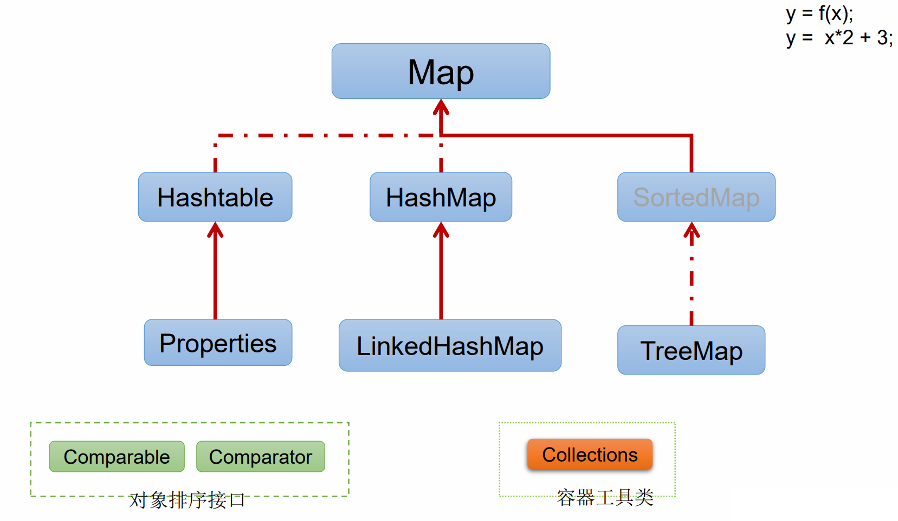
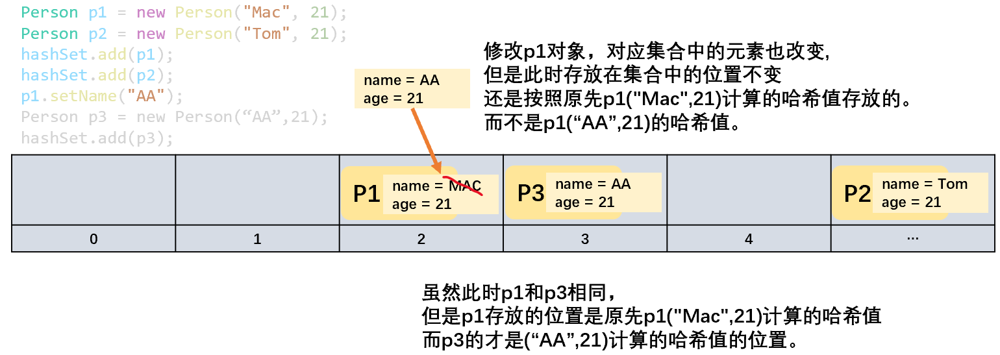

# Collection

**数组的局限性**

- Java容器：集合和数组都是对多个数据进行内存层面的存储操作。

1. 数组一旦初始化以后，其 长度、元素的数据类型 不可改变。
2. 数组提供的方法非常有限，对于添加，删除，插入数据等操作，非常不便，同时效率不高。
3. 数组存储有序、可重复的数据。数组无法满足无序、不可重复的数据需求。

**集合体系**

| Collection接口                              | 单列数据，定义了存取一组对象(一个一个的对象)的方法的集合 |
| ------------------------------------------- | -------------------------------------------------------- |
| List接口<br>ArrayList / LinkedList / Vector | 元素有序，可重复的集合  -->“动态数组”                    |
| Set接口<br>HashSet / LinkedSet / TreeSet    | 元素无序，不可重复的集合 --> 类型于数学中的”集合“        |

  

| Map接口                                                    | 双列数据，保存具有映射关系"key-value"键值对(一对一对的数据)的集合 |
| ---------------------------------------------------------- | ------------------------------------------------------------ |
| HashMap / LinkedHashMap / TreeMap / Hashtable / Properties | 一个key只能对应一个value，而一个value可以对应多个key         |

    

| 动作                 | 方法                               | 说明                                                         |
| -------------------- | ---------------------------------- | ------------------------------------------------------------ |
| 添加                 | add(Object obj)                    | 将元素e添加到集合中                                          |
|                      | addAll(Collection coll)            | 将coll集合中的元素添加到当前的集合中                         |
| 获取有效元素的个数   | int size()                         |                                                              |
| 清空集合             | void clear()                       |                                                              |
| 是否是空集合         | boolean isEmpty()                  |                                                              |
| 是否包含某个元素     | boolean contains(Object obj)       | 通过元素的equals()方法来判断是否是同一个对象<br> 向Collection接口的实现类中添加数据obj时，要求obj所在类要重写equals()方法，用来判断 |
|                      | boolean containsAll(Collection c)  | 调用元素的equals()方法来比较的。拿两个集合的元素挨个比较     |
| 删除                 | boolean remove(Object obj)         | 通过元素的equals方法判断是否是要删除的那个元素。<br>只会删除找到的第一个元素 |
|                      | boolean removeAll(Collection coll) | 取当前集合的差集                                             |
| 交集                 | boolean retainAll(Collection c)    | 把交集的结果存在当前集合中，不影响c集合<br>从当前集合中返回coll中匹配的元素,并将当前集合改为交集 |
| 集合是否相等         | boolean equals(Object obj)         | 调用元素内的equals()方法一一进行比较<br>如果是ArrayList() 则还要求有序 |
| 转成对象数组         | Object[] toArray()                 | 集合-->数组<br>数组-->集合 调用Arrays类静态方法 aslist()     |
| 获取集合对象的哈希值 | hashCode()                         |                                                              |
| 遍历                 | iterator()                         | 返回迭代器对象，用于集合遍历 <br>返回Iterator接口的实例，用于遍历元素。 |

```java
public class CollectionTest {

    @Test
    public void test1() {
        Collection coll = new ArrayList();
        // add() 添加
        coll.add(123);
        coll.add("Jack");
        coll.add(false);
        coll.add(new String("Tom"));
        coll.add(new Person("Mac", 20));

        Collection coll1 = new ArrayList();
        // addAll(Collection coll) 添加coll集合中的所有元素
        coll1.addAll(coll);
        System.out.println(coll); // [123, Jack, false, Tom, com.zjk.Person@76ed1b7c]
        // 调用了String中的toString()方法
        // Person中为重写toString()方法

        coll1.clear();

        // isEmpty() 判断当前集合是否为空
        coll1.isEmpty();

        // contains(Object obj) 判断当前集合中是否包含obj
        // 在判断时，会调用obj对象所在类的equals()方法
        boolean contains = coll.contains(123);
        System.out.println(contains); // true
        System.out.println(coll.contains(new String("Tom"))); // true
        // 调用String重写的equals()方法
        System.out.println(coll.contains(new Person("Mac", 20))); // false
        // Person类中未重写equals()方法

        // containsAll(Collection coll) 判断形参coll中的所有元素是否都存在于当前集合中
        Collection coll2 = new ArrayList();
        coll2.add(123);

        System.out.println(coll.containsAll(coll2)); //true

        //remove(Object obj) 移除
        coll.remove(123);
        System.out.println(coll.remove(new String("Tom"))); //true
        //调用了equals()方法
        System.out.println(coll.remove(new Person("Mac", 20))); //false
        //Person类中未重写equals()方法，所以无法匹配来删除
        System.out.println(coll); //[Jack, false, com.zjk.java2.Person@75bd9247]

        //removeAll(Collection coll) 从当前集合中移除coll中的所有元素
        coll.removeAll(coll2);
        System.out.println(coll); //[Jack, false, com.zjk.java2.Person@75bd9247]

        coll1.add(new Person("Mac", 20));
        //retainAll(Collection coll) （交集）从当前集合中返回coll中匹配的元素,并将当前集合改为交集。
        //调用equals()方法来匹配
        System.out.println(coll); //[Jack, false, com.zjk.java2.Person@75bd9247]
        System.out.println(coll1); //[com.zjk.java2.Person@7d417077]
        coll.retainAll(coll1);
        System.out.println(coll); //[]

        Collection coll3 = new ArrayList();
        coll3.add(new String("Tom"));
        coll3.add(new Person("Mac", 20));
        Collection coll4 = new ArrayList();
        coll4.add(new String("Tom"));
        coll4.add(new Person("Mac", 20));

        //equals(Object obj)
        System.out.println(coll3.equals(coll4)); //false
        //调用元素内的equals()方法一一进行比较
        //且如果是ArrayList() 则还要求有序

        //hashCode()
        System.out.println(coll.hashCode()); //1

        //toArray() 集合-->数组
        Object[] arr = coll3.toArray();
        for (int i = 0; i < arr.length; i++) {
            System.out.println(arr[i]);
        }

        //数组-->集合 调用Arrays类静态方法 aslist()
        List<Object> list = Arrays.asList(arr);
        System.out.println(list);//[Tom, com.zjk.java2.Person@7dc36524]

        List<int[]> ints = Arrays.asList(new int[]{123, 456});
        System.out.println(ints);//[[I@35bbe5e8] 只有一个元素

        List ints1 = Arrays.asList(new Integer[]{123, 456});
        System.out.println(ints1);//[123, 456]  包装类

        List ints2 = Arrays.asList(123, 456);
        System.out.println(ints2); //[123, 456]

        //iterator() 返回Iterator接口的实例 用于遍历元素，放在Iterator.Test.java中
    }
}
```

## Iterator 迭代器

- Iterator对象称为迭代器(设计模式)，主要用于遍历 Collection 集合中的元素。

> 迭代器模式：GOF给迭代器模式的定义为：提供一种方法访问一个容器(container)对象中各个元素，而又不需暴露该对象的内部细节。

- Collection接口继承`java.lang.Iterable`接口，所有实现了Collection接口的集合类都有iterator()方法，用以返回一个实现了Iterator接口的对象。（每次通过iterator()方法创建的Iterator对象都是新的对象）

```java
Iterator iterator = coll.iterator();
```

- Iterator 仅用于遍历集合，Iterator 本身并不提供承装对象的能力。如果需要创建Iterator 对象，则必须有一个被迭代的集合。
- 集合对象每次调用iterator()方法都得到一个全新的迭代器对象，默认游标都在集合的第一个元素之前。

| 方法      | 说明                                                         |
| --------- | ------------------------------------------------------------ |
| hasNext() | 如果迭代存在下一个元素，则返回true，否则false。<br />迭代器的其他方法执行需要该方法的判断（NoSuchElementException）。 |
| next()    | 返回迭代的下一个元素（游标移动）。                           |
| remove()  | 删除此迭代器返回的下一个元素。（对集合删除有效）<br />如果游标未移动，再次调用则IllegalStateException。 |

```java
//提通过Collection接口的iterator()方法创建Iterator对象
Iterator iterator = coll.iterator();
//hasNext():判断是否还有下一个元素
while(iterator.hasNext()){
    //next():①指针下移 ②将下移以后集合位置上的元素返回
    System.out.println(iterator.next());
}
```

```java
//错误1 it.next() 报错NoSuchElementException
Iterator iterator = coll.iterator();
Object obj;
while((obj = iterator.next()) != null){
    System.out.println(obj);
}

//错误2：每次通过coll.iterator()方法创建的Iterator对象都是新的对象
//跳不出循环
while((coll.iterator().next()).hasNext){
    System.out.println(obj);
}
```

###  foreach

- foreach循环迭代访问Collection和数组：不需获取Collection或数组的长度，无需使用索引访问元素，底层调用Iterator完成操作。

```java
for(要遍历的集合/数组的元素的类型 在循环中使用的元素名称 : 要遍历的集合/数组){
    ...
}
```

### Iterable

## List

- List：存储有序的，可重复的数据，每个元素都有对应的顺序索引。

| List实现类 | 说明                                                         |
| ---------- | ------------------------------------------------------------ |
| ArrayList  | 主要实现类<br>线程不安全，效率高<br>底层存储Object[] elementData |
| LinkedList | 频繁的插入和删除操作 <br>底层存储双向链表                    |
| Vector     | 古老实现类<br />线程安全，效率低 <br />底层存储Object[] elementData |

- `List subList(int fromIndex, int toIndex)`:返回从fromIndex到toIndex(不包括toIndex)位置的子集合

| 方法                                                         | 作用                                               |
| ------------------------------------------------------------ | -------------------------------------------------- |
| add(int index, Object ele)<br />addAll(int index, Collection eles) | 插入                                               |
| remove(int index)<br />remove(Object obj)                    | 删<br />并返回此元素。                             |
| set(int index, Object obj)                                   | 改                                                 |
| Object get(int index)                                        | 查                                                 |
| size()                                                       | 长度                                               |
| int indexOf(Object obj)<br />int lastIndexOf(Object obj)     | 首次出现的位置，否则返回-1。<br />最后出现的位置。 |

### ArrayList

#### add() 自动扩增

- ArrayList.add()超过长度时，对底层数组（elementData）的扩展。

```java
public void add(int index, E element) {
    rangeCheckForAdd(index);
    modCount++;
    final int s;
    Object[] elementData;
    if ((s = size) == (elementData = this.elementData).length)
        elementData = grow(); //增加ArrayList的长度：
    System.arraycopy(elementData, index,
                     elementData, index + 1,
                     s - index);
    elementData[index] = element;
    size = s + 1;
}

private Object[] grow(int minCapacity) {
    int oldCapacity = elementData.length;
    if (oldCapacity > 0 || elementData != DEFAULTCAPACITY_EMPTY_ELEMENTDATA) {
        int newCapacity = ArraysSupport.newLength(oldCapacity,
                                                  minCapacity - oldCapacity, 
                                                  oldCapacity >> 1 );
        return elementData = Arrays.copyOf(elementData, newCapacity);
    } else {
        return elementData = new Object[Math.max(DEFAULT_CAPACITY, minCapacity)];
    }
}
```

#### Arrays.asList()

- Arrays.asList() 返回的不是java.util下的ArrayList，而是Arrays的内部类（继承AbstractList，但没有重写add()方法）。

#### sublist()

- subList()返回的是ArrayList的内部类SubList（ArraysList的视图，不是ArrayList）。对于SubList子列表的所有操作最终会反映到原列表上。

| 修改   | 元素（set()） | 结构（add()、remove()）                                      |
| ------ | ------------- | ------------------------------------------------------------ |
| 子集合 | 影响原集合    | 对子集合调用的remove()，此时删除的是对应于该子集合的下标位置的元素， 且只能是子集合中包含的元素。 |
| 原集合 | 影响子集合    | 对父集合元素的增加/删除，均会导致子列表的遍历、增加、删除操作抛出ConcurrentModificationException。 |

#### remove() 

```java
list.remove(2);  //视为索引2 而不是数据2
list.remove(new Integer(2)); //删除数据2
```

### LinkedList

- 对于频繁的插入/删除元素的操作，建议使用LinkedList类，效率较高。
- LinkedList：双向链表。`LinkedList list = new LinkedList(); `//内部声明了Node类型的first和last属性，默认值为null。同时，定义`内部类Node`，作为LinkedList中保存数据的基本结构。

```java
//Node：体现了LinkedList的双向链表
private static class Node<E> {
    E item;
    Node<E> next; //记录下一个元素的位置
    Node<E> prev; //记录前一个元素的位置

    Node(Node<E> prev, E element, Node<E> next) {
        this.item = element;
        this.next = next;
        this.prev = prev;
    }
}
```

```java
list.add(123); //将123封装到Node中，创建了Node对象。
```

### Vector

- Vector()构造器创建对象时，底层创建长度为10的数组，add()扩容时默认2倍。

## Set

- Set：存储无序，不可重复的数据。
  - 无序性：不等于随机性  遍历的顺序仍然是添加的顺序。存储的数组在底层数组并非按照数组索引的顺序添加，而是根据数据的Hash值决定的。
  - 不可重复性：保证添加的元素按照equals()方法判断时，相同的元素只能添加一次。
- Collection的子接口，Set没有提供额外的方法。
- Set 不允许存在相同的元素（ equals() 判断），相同时add()返回false。

> 向Set中添加的数据，其所在类一定要重写hashCode()和equals()。相等的对象必须具有相等的散列码 。

| Set实现类     | 说明                                                      |
| ------------- | --------------------------------------------------------- |
| HashSet       | 主要实现类<br />线程不安全<br />可存储null。              |
| LinkedHashSet | HashSet子类<br />遍历其内部数据时，可按照添加的顺序遍历。 |
| TreeSet       | 可按照添加对象的指定属性排序。                            |

**添加元素的过程**

- 向hashSet中添加元素a，首先调用元素a所在类的hashCode()方法，计算元素a的哈希值，此哈希值接着通过某种算法计算出在hashSet底层数组中的存放位置（索引），判断数组此位置上是否已经有元素。
- 如果此位置上没有其他元素，则元素a添加成功 --情况1。
- 如果此位置上有其他元素b（或以链表形式存在的多个元素），则比较元素a于元素b的hash值
  - 如果hash值不相同，则元素a添加成功 --情况2。
  - 如果hash值相同，进而需要调用元素a所在类的equals()方法。
    - equals()返回true，元素a添加失败。
    - equals()返回false，则元素a添加成功  --情况3。
- 对于添加成功的情况2和情况3而言，元素a，与已经存在指定索引位置上数据以链表的方式存储。

> HashSet底层：数组+链表
>
> - jdk 1.7 ：元素a放到数组中，指向原来的元素
> - jdk 1.8 ：原来的元素在数组中，指向元素a

   

   


```java
Set set = new HashSet();
set.add(456);
set.add(123);
set.add("AA");
set.add("BB");
set.add(new Person("Mac",21));
set.add(new String("CC"));
System.out.println(set); //[AA, BB, CC, 456, com.zjk.java2.Person@75bd9247, 123]

//不可重复性
set.add(123);
System.out.println(set); //[AA, BB, CC, 456, com.zjk.java2.Person@75bd9247, 123]
//调用equals()方法比较,需要用到hashCode()方法，Integer 123发现相同，所以不添加

//Person类中未重写hashCode()方法和equals()方法,比较的还是地址，所以认为不一样
set.add(new Person("Mac",21));
System.out.println(set);//[AA, BB, CC, com.zjk.java2.Person@7d417077, 456, com.zjk.java2.Person@75bd9247, 123]
```

 

```java
HashSet hashSet = new HashSet();

Person p1 = new Person("Mac", 21);
Person p2 = new Person("Tom", 21);
hashSet.add(p1);
hashSet.add(p2);

p1.setName("AA");
//对应集合中的元素也改变,但是此时存放的位置还是按照原先p1("Mac",21)计算的哈希值存放的。
hashSet.forEach(System.out::println);
//Person{name='AA', age=21}
//Person{name='Tom', age=21}

hashSet.remove(p1);
//此时remove()寻找的哈希值，是修改后的p1("AA",21)的哈希值，无法和集合中p1的哈希值匹配，
// 故找不到，无法成功remove()
hashSet.forEach(System.out::println);
//Person{name='AA', age=21}
//Person{name='Tom', age=21}

Person p3 = new Person("AA",21);
hashSet.add(p3);
//同理，此时在集合中，存放("AA",21)计算的哈希值的位置实际上是空的，所以可以添加
hashSet.forEach(System.out::println);
//Person{name='AA', age=21}
//Person{name='Tom', age=21}
//Person{name='AA', age=21}
```

### HashSet

- HashSet 按 Hash 算法来存储集合中的元素。

1. 不能保证元素的排列顺序、HashSet 不是线程安全的、集合元素可以是 null。
2. HashSet 集合判断两个元素相等的标准：两个对象通过 hashCode() 方法比较相等，并且两个对象的 equals() 方法返回值也相等。
3. 对于存放在Set容器中的对象，对应的类一定要重写equals()和hashCode(Object obj)方法，以实现对象相等规则。即：“相等的对象必须具有相等的散列码”。

### LinkedHashSet

- LinkedHashSet在添加数据的同时，每个数据还维护了两个引用，记录此数据前一个数据和后一个数据。
- 对于频繁的遍历操作，LinkedHashSet效率高于HashSet。

   

### TreeSet

- TreeSet：红黑树结构。向TreeSet中添加的数据，要求是相同类的对象   

# Map

- Map：双列数据，存储键值对Entry（key-value）。

   

| 实现类     | 说明                                                         |
| ---------- | ------------------------------------------------------------ |
| HashMap    | 主要实现类<br />线程不安全，效率高<br />可存储null的key和value。 |
| LinkedMap  | 按照添加的顺序实现遍历（频繁遍历操作）。                     |
| TreeMap    | 按照添加的key排序。                                          |
| Hashtable  | 古老的实现类<br />线程安全，效率低<br />不能存储null的key和value。 |
| Properties | 处理配置文件<br />key和value都是String类型。                 |

- Map与Collection并列存在，保存具有映射关系的数据（key-value）。
- key 和 value 之间存在单向一对一关系（通过指定的 key 总能找到唯一的、确定的 value）。

| 单元  | 存储       | 数据          |
| ----- | ---------- | ------------- |
| key   | Set        | 任何引用类型  |
| value | Collection | 任何引用类型  |
| Entry | Set        | key-value构成 |

   

| 方法                                                         | 操作                        |
| ------------------------------------------------------------ | --------------------------- |
| Object put(Object key,Object value)<br />void putAll(Map map) | 添加                        |
| Object remove(Object key)<br />void clear()                  | 删除（返回value）<br />清空 |
| Object get(Object key)<br />boolean containsKey(Object key)<br />boolean containsValue(Object value)<br />int size()<br />boolean isEmpty()<br />boolean equals(Object obj) | 查                          |
| Set keySet()<br />Collection values()<br />Set entrySet()    | 视图                        |

## HashMap

> HashMap的底层实现：
>
> - jdk1.7之前 : 数组+链表 
> - jdk1.8 : 数组+链表+红黑树   

| 属性                       | 说明                                                         |
| :------------------------- | :----------------------------------------------------------- |
| `DEFAULT_INITIAL_CAPACITY` | HashMap的默认容量，16                                        |
| `MAXIMUM_CAPACITY`         | HashMap的最大支持容量，2^30                                  |
| `DEFAULT_LOAD_FACTOR`      | HashMap的默认加载因子(0.75)                                  |
| `TREEIFY_THRESHOLD`        | Bucket中链表长度大于该默认值，转化为红黑树(8)                |
| `UNTREEIFY_THRESHOLD`      | Bucket中红黑树存储的Node小于该默认值，转化为链表             |
| `MIN_TREEIFY_CAPACITY`     | 桶中的Node被树化时最小的hash表容量。<br>当桶中Node的数量大到需要变红黑树时，若hash表容量小于MIN_TREEIFY_CAPACITY时，此时应执行resize扩容操作这MIN_TREEIFY_CAPACITY的值至少是TREEIFY_THRESHOLD的4倍。 |
| `table`                    | 存储元素的数组，总是2的n次幂                                 |
| `entrySet`                 | 存储具体元素的集                                             |
| `size`                     | HashMap中存储的键值对的数量                                  |
| `modCount`                 | HashMap扩容和结构改变的次数。                                |
| `threshold`                | 扩容的临界值，= 容量`*`填充因子 (`16*0.75`)<br>提前扩容，为了减少链表的长度。 |
| `loadFactor`               | 填充因子                                                     |

> **负载因子值的大小，对HashMap有什么影响？**
>
> - 负载因子的大小决定了HashMap的数据密度。负载因子越大密度越大，发生碰撞的几率越高，数组中的链表越容易长,造成查询或插入时的比较次数增多，性能会下降。负载因子越小，就越容易触发扩容，数据密度也越小，意味着发生碰撞的几率越小，数组中的链表也就越短，查询和插入时比较的次数也越小，性能会更高。但是会浪费一定的内容空间。而且经常扩容会影响性能，建议初始化预设大一点的空间。
> - 按照其他语言的参考及研究经验，会考虑将负载因子设置为0.7~0.75，此时平均检索长度接近于常数。

### 底层实现

**HashMap的底层实现原理 以jdk1.7为例**

- `HashMap map = new HashMap()`;
  - 在实例化以后，底层创建了长度是16的一维数组Entry[] table。
- ...假设之前可能已经执行过多次put...
- `map.put(key1,value1)`;
  - 首先，调用key1所在类的hashCode()计算key1的哈希值，此哈希值经过某种算法计算之后，得到Entry数组中的存放位置。
  - 如果此位置上的数据为空，此时的key1-value1添加成功   **情况1**
  - 如果此位置上的数据不为空，（意味着此位置上存在一个或多个数据（以链表形式存在）），比较key1和已经存在的一个或多个数据的哈希值：
    - 如果key1的哈希值与已经存在的数据的哈希值都不相同，此时key1-value1添加成功  **情况2**
    - 如果key1的哈希值和已经存在的某一个数据(key2-value2)的哈希值相同，继续比较：调用key1所在类的equals()，比较：
      - 如果equals()返回false：此时key1-value1添加成功  **情况3**
      - 如果equals()返回true：使用value1替换相同key的value值(value2)。 
- 关于情况2和情况3：此时key1-value1和原来的数据以链表的方式存储
- 在不断的添加过程中会涉及到扩容问题：
  - 当超过临界值threadshould（12）时，且要存放的位置非空时，扩容。
  - 默认的扩容方式：扩容为原来容量的2倍，并将原来的数据复制过来。

   

**HashMap的底层实现原理 jdk1.8相较与jdk1.7的不同**

- `new HashMap()`底层没有创建一个长度为16 的数组
- jdk1.8 底层的数组是 Node[]  而非Entry[];
- 首次调用put()方法时，底层创建长度为16的数组 
- jdk1.7的底层结构只有数组+链表；jdk1.8的底层结构：数组+链表+红黑树
  - jdk1.7新的元素指向旧的元素，jdk1.8旧的元素指向新的元素. 
  - 当数组的某一个索引位置上的元素以链表形式存在的数据个数 > 8 且当前数组的长度 > 64，此时，此索引位置上的所有数据改为使用红黑树存储。 

   

## LinkedHashMap

- LinkedMap中定义内部类Node替换了HashMap中的Entry，在原有的HashMap底层结构基础上，添加了一对指针，指向前一个和后一个元素。

```java
static class Entry<K,V> extends HashMap.Node<K,V> {
    Entry<K,V> before, after;
    Entry(int hash, K key, V value, Node<K,V> next) {
        super(hash, key, value, next);
    }
}
```

## TreeMap

- TreeMap存储键值对时，需要根据键值对进行排序，保证所有的键值对处于有序状态。
- TreeMap底层使用红黑树结构存储数据，要求所有的 Key 应该是同一个类的对象，否则将会抛出 ClasssCastException。

| Key排序  | 说明                                                         |
| -------- | ------------------------------------------------------------ |
| 自然排序 | 所有的 Key 必须实现 Comparable 接口。                        |
| 定制排序 | 创建 TreeMap 时，传入一个Comparator对象负责对TreeMap 中的所有 key 进行排序。<br />此时不需要Key实现Comparable 接口。 |


- TreeMap判断两个key相等的标准：两个key通过compareTo()方法、compare()方法返回0。

```java
Person p1 = new Person("Tom", 21);
Person p2 = new Person("Jac", 23);
Person p3 = new Person("Mac", 19);

TreeMap map = new TreeMap();

map.put(p1, 99);
map.put(p2, 98);
map.put(p3, 100);

//自然排序
//Person类中重写了Comparable接口的compareTo()方法
Set entrySet = map.entrySet();
Iterator iterator = entrySet.iterator();
while (iterator.hasNext())
    System.out.println(iterator.next());

TreeMap treeMap = new TreeMap(new Comparator() {
    @Override
    public int compare(Object o1, Object o2) {
        if (o1 instanceof Person && o2 instanceof Person) {
            Person p1 = (Person) o1;
            Person p2 = (Person) o2;

            return p1.getAge() - p2.getAge();
        }
        throw new RuntimeException("数据类型不一致");
    }
});
treeMap.putAll(map);


Set entrySet1 = treeMap.entrySet();
Iterator iterator1 = entrySet1.iterator();
while (iterator1.hasNext())
    System.out.println(iterator1.next());
}
```

## Properties

- Properties 类是 HashTable 的子类，该对象用于处理属性文件。由于属性文件里的 key、value 都是字符串类型，所以 Properties 里的 key 和 value 都是字符串类型。

| 方法                                 | 操作 |
| ------------------------------------ | ---- |
| setProperty(String key,String value) | 存   |
| getProperty(String key)              | 取   |

```java
Properties properties = new Properties();

FileInputStream fileIn = new FileInputStream("jdbc.properties");

properties.load(fileIn); //加载流对应的文件

String name = properties.getProperty("name");
String password = properties.getProperty("password");

System.out.println("name=" + name + "\n" + "passsword=" + password);
fileIn.close();
```

# Collections

- Collections 是一个操作 Set、List 和 Map 等集合的工具类。
- Collections 中提供了一系列静态的方法对集合元素进行排序、查询和修改等操作，还提供了对集合对象设置不可变、对集合对象实现同步控制等方法。

| 方法（static）                                               | 说明                                                         |
| ------------------------------------------------------------ | ------------------------------------------------------------ |
| reverse(List)                                                | 反转                                                         |
| shuffle(List)                                                | 随机排序                                                     |
| sort(List)<br />sort(List, Comparator)                       | 根据元素的自然顺序按升序排序<br />根据指定的Comparator排序   |
| swap(List, int, int)                                         | 指定i处元素和j处元素进行交换                                 |
| Object max(Collection)<br />Object max(Collection，Comparator)<br />Object min(Collection)<br />Object min(Collection，Comparator) | 查找                                                         |
| int frequency(Collection，Object)                            |                                                              |
| void copy(List dest,List src)                                | src中的内容复制到dest中<br />IndexOutOfBoundsException: Source does not fit in dest |
| boolean replaceAll(List list，Object oldVal，Object newVal)  | 替换                                                         |

- Collections的同步控制：提供多个 synchronizedXxx() 方法，将指定集合包装成线程同步的集合，从而解决多线程并发访问集合时的线程安全问题。

```java
List list = new ArrayList();
list.add(123);

//Collections.synchronizedXxx() 返回线程安全的
//返回线程安全的list
List safeList = Collections.synchronizedList(list);
```
