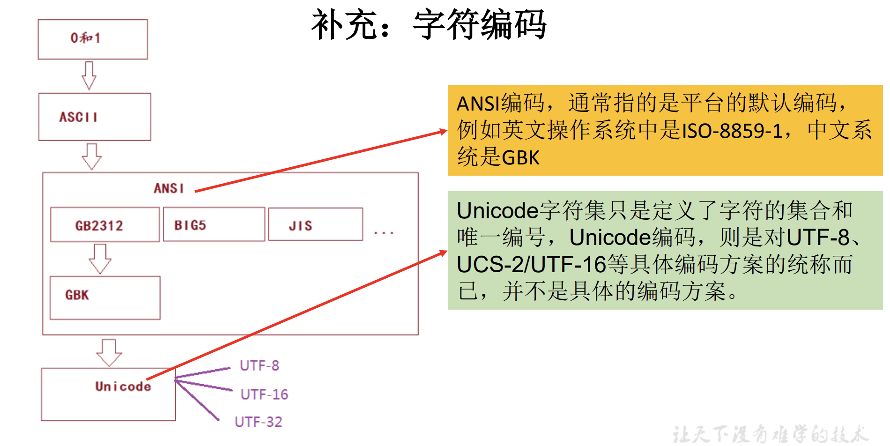
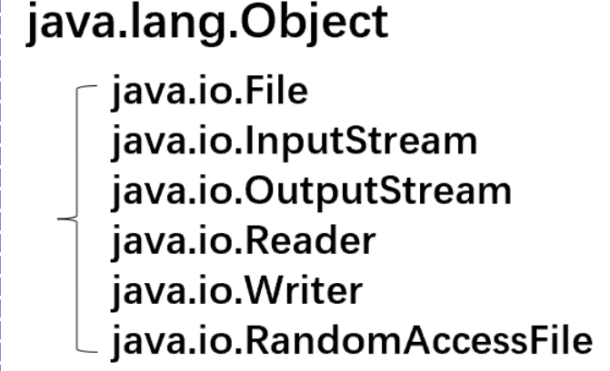
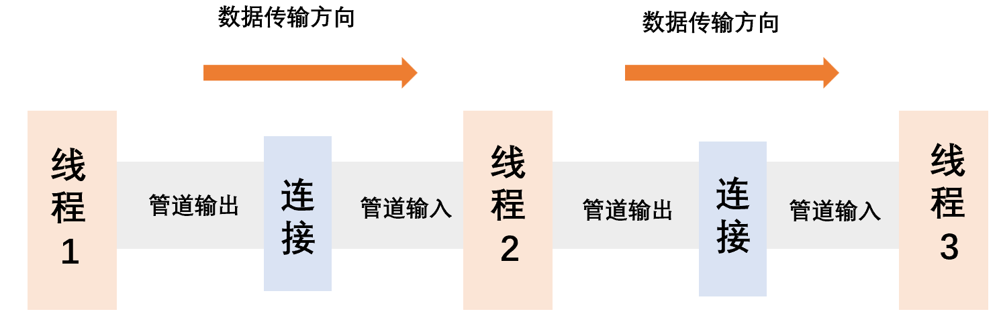

# 字节流

- 字节流一般用于读写二进制数据，如图像和声音数据。

## 输入字节流 InputStream

- InputStream是输入字节流类的抽象顶层父类，它包含了所有输入流类都继承并实现的基本数据读取方法。

| 基本读                               | 说明                                                         |
| ------------------------------------ | ------------------------------------------------------------ |
| int read()                           | 读一个字节作为方法的返回值。如果返回值是一1，则表示文件结束。 |
| int read(byte[] b)                   | 将读入的数据放在一个字节数组中，并返回所读的字节数。         |
| int read(byte[] b, int off, int len) | 将读入的数据放在一个字节数组中，并返回所读的字节数。<br>两个整型参数表示所读入数据在数组b中的存放位置。 |
| void close()                         | 当输入流中的数据读取完毕后，使用该方法关闭流。<br>对于过滤流，则把最顶层的流关闭，会自动自顶向下关闭所有流。 |
| int available()                      | 返同输人流中还有多少可读的字节<br>在读取大块数据前，常使用该方法测试。 |
| long skip(long n)                    | 跳过（扔掉）流中指定字节数量的数据                           |
| **回读**                             | **"书签"功能，在支持回读的流上实现已读取数据的重复读。**     |
| boolean markSupported()              | 测试打开的流是否支持回读                                     |
| void mark(int readlimt)              | 标记当前流，并创建大小由readlimt指示的缓冲区<br />参数指定了将来通过reset()方法能够重复读取的字节数 |
| void reset()                         | 如果用mark()方法对流做了标记，则在继续从流中读取一定数量的字节后调用reset()方法，将使后续的读操作从标记处开始读数据。<br />如果在做标记后所读取的字节数大于mark()方法所创建的缓冲区的大小，则reset()方法将不起任何作用 |

## 输出字节流 OutputStream

- OutputStream是输出字节流类的抽象顶层父类。

| 方法                                   | 说明                                                         |
| -------------------------------------- | ------------------------------------------------------------ |
| write()                                | 基本的写方法                                                 |
| void write(int c)                      | 向输出流中写一个字节                                         |
| void write(byte[] b)                   | 向输出流中写一个字节数组                                     |
| void write(byte[] b, int off, int len) | 将字节数组中由off和len指示的数据块写入输出流                 |
| void close()                           | 当完成输出流的写操作后关闭流。<br>如使用过滤流，则把最顶层的流关闭，会自动自顶向下关闭所有流。 |
| void flush()                           | 强制将缓存的输出数据写出去<br>有的输出流会把几次写操作的数据缓存，然后一起提交，而该方法将把这些数据立即写到目的地。<br>一般在调用close()方法关闭流前，可以先调用flush()方法。 |


# 字符流

- Reader、Writer：java.io包中字符流类的顶层抽象父类。
- 读写文本类数据：字符流能够处理Unicode字符集中的所有字符，而字节流仅限于处理ISO-Latin-1的8位字节。

## 输入字符流 Reader

| 方法                                          | 说明                                                   |
| --------------------------------------------- | ------------------------------------------------------ |
| read()                                        | 基本的读方法                                           |
| int read()                                    | 读一个字符作为返回值<br>如果返回值是-1，则表示文件结束 |
| int read(char[] cbuf)                         | 读字符放入数组中，返回所读的字符数                     |
| int read(char[] cbuf, int offset, int length) | 读字符放入数组的指定位置，返回所读的字符数             |
| void close()                                  | 关闭流                                                 |
| long skip(long n)                             | 跳过n个字符                                            |
| boolean markSupported()                       | 测试打开的流是否支持书签                               |
| void mark(int buf)                            | 标记当前的流，并建立由参数buf指示大小的缓冲区          |
| void reset()                                  | 返回标签处                                             |
| boolean ready()                               | 测试当前流是否准备好进行读                             |

```java
FileReader fr = null;

try {
    //1.实例化File类的对象，指明要操作的文件
    File file = new File("Hello.txt"); //相对路径，相较于当前Module
    //System.out.println(file.getAbsolutePath());
    //G:\ideaProjects\JavaSerrior\JavaStudy009\Hello.txt

    //2.提供具体的流
    fr = new FileReader(file);

    //3.数据的读入
    int data;
    while ((data = fr.read()) != -1) {
        System.out.print((char) data);
    }
} catch (IOException e) {
    e.printStackTrace();
} finally {
    try {
        //4.流的关闭操作
        if (fr != null)
            fr.close();
    } catch (IOException e) {
        e.printStackTrace();
    }
}
```

```java
FileReader fileReader = null;

try {
    //1.File类的实例化
    File file = new File("Hello.txt");
   
    //2.FileReader流的实例化
    fileReader = new FileReader(file);
    
    //3.读入的操作
    //read(char[] cbuf) 返回每次读入cbuf数组中的字符的个数，如果达到文件末尾，返回-1.
    char[] cbuffer = new char[6];
    int len;
    while ((len = fileReader.read(cbuffer)) != -1) {
        String str = new String(cbuffer,0,len);
        System.out.print(str);
    }
} catch (IOException e) {
    e.printStackTrace();
} finally {
    //4.资源的关闭
    try {
        if (fileReader != null) {
            fileReader.close();
        }
    } catch (Exception e) {
        e.printStackTrace();
    }
}
```

## 输出字符流 Writer

| 方法                                           | 说明                   |
| ---------------------------------------------- | ---------------------- |
| int write()                                    | 基本的写方法           |
| int write(int c)                               | 写单个字符。           |
| int write(char cbuf[])                         | 写字符数组。           |
| int write(char cbuf[], int offset, int length) | 写字符数组中的部分数据 |
| int write(String str)                          | 写一个字符串。         |
| int write(String str, int offset, int length)  | 写字符串的一部分       |
| void close()                                   | 关闭流                 |
| void flush()                                   | 强行写                 |

**从内存中写出数据到硬盘的文件里**

- File对应的硬盘中的文件如果不存在，则在输出的过程中，会自动创建此文件。
- File对应的硬盘中的文件如果存在：

| 构造器                                            | 说明                   |
| ------------------------------------------------- | ---------------------- |
| `FileWriter(file, false)`<br />`FileWriter(file)` | 对原有文件执行覆盖     |
| `FileWriter(file, true)`                          | 对原有文件执行追加操作 |

```java
FileWriter fileWriter = null;

try {
    //1.提供File类的对象，指明写出到的文件
    File file = new File("HelloWrite.txt");

    //2.操作FileWriter的对象，用于数据的写出
    fileWriter = new FileWriter(file);

    //3.写出的操作
    fileWriter.write("I have a dream.");
    fileWriter.write("\nyou need to have a dream, too.");
} catch (IOException e) {
    throw new RuntimeException(e);
} finally {
    try {
        //4.流资源的关闭
        fileWriter.close();
    } catch (IOException e) {
        throw new RuntimeException(e);
    }
}
```

```java
FileReader fileReader = null;
FileWriter fileWriter = null;

try {
    //1.创建File类的对象，指明读入和写入的文件
    File readFile = new File("Hello.txt");
    File writeFile = new File("HelloWriteFile.txt");
    
    //2.创建输入流和输出流
    fileReader = new FileReader(readFile);
    fileWriter = new FileWriter(writeFile);
    
    //3.数据的读入和写出操作
    char[] cbuf = new char[5];
    int len;
    while ((len = fileReader.read(cbuf)) != -1) {
        fileWriter.write(cbuf, 0, len);
    }
} catch (IOException e) {
    throw new RuntimeException(e);
} finally {
    //4.流资源的关闭
    try {
        if (fileReader != null)
            fileReader.close();
    } catch (IOException e) {
        throw new RuntimeException(e);
    }

    try {
        fileWriter.close();
    } catch (IOException e) {
        throw new RuntimeException(e);
    }
}
```

# 转换流

- 转换流：字符流的一种，提供字节流和字符流之间的转换。
- 处理文件乱码

| 字符集    | 描述                                           | 说明                                                         |
| --------- | ---------------------------------------------- | ------------------------------------------------------------ |
| ASCII     | 美国标准信息交换码                             | 用一个字节的7位可以表示<br />字符集基本都兼容ASCII           |
| ISO8859-1 | 拉丁码表。欧洲码表                             | 用一个字节的8位表示                                          |
| GB2312    | 中国的中文编码表                               | 最多两个字节编码所有字符                                     |
| GBK       | 中国的中文编码表升级，融合了更多的中文文字符号 | 最多两个字节编码                                             |
| Unicode   | 国际标准码，融合了目前人类使用的所有字符。     | 为每个字符分配唯一的字符码。<br />所有的文字都用两个字节来表示。 |
| UTF-8     | 变长的编码方式                                 | 可用1-4个字节来表示一个字符。                                |

  

```java
package com.zjk.java;

import org.junit.Test;

import java.io.*;

public class IOTest {
    @Test
    public void test1() {
        InputStreamReader isr = null;
        try {
            FileInputStream fis = new FileInputStream(new File("Hello.txt"));
            //new InputStreamReader(fis); 使用系统默认的字符集
//        InputStreamReader isr = new InputStreamReader(fis);
            //new InputStreamReader(fis,"UTF-8"); 使用指定的字符集
            //参数2指明了字符集：具体使用哪个字符集，取决于该文件保存时使用的字符集
            isr = new InputStreamReader(fis, "UTF-8");

            char[] cbuf = new char[20];
            int len;
            while ((len = isr.read(cbuf)) != -1) {
                for (int i = 0; i < len; i++) {
                    System.out.print(cbuf[i]);
                }
            }
        } catch (IOException e) {
            throw new RuntimeException(e);
        } finally {
            try {
                if (isr != null)
                    isr.close();
            } catch (IOException e) {
                throw new RuntimeException(e);
            }
        }
    }

    @Test
    public void test2(){
        InputStreamReader isr = null;
        OutputStreamWriter osw = null;
        try {
            File file1 = new File("Hello.txt");
            File file2 = new File("HelloIOTest.txt");

            FileInputStream fis = new FileInputStream(file1);
            FileOutputStream fos = new FileOutputStream(file2);

            isr = new InputStreamReader(fis, "utf-8");
            osw = new OutputStreamWriter(fos, "gbk");

            char[] cbuf = new char[20];
            int len;
            while ((len = isr.read(cbuf)) != -1) {
                osw.write(cbuf, 0, len);
            }
        } catch (IOException e) {
            throw new RuntimeException(e);
        } finally {
            try {
                if (isr != null)
                    isr.close();
            } catch (IOException e) {
                throw new RuntimeException(e);
            }
            try {
                if (osw != null)
                    osw.close();
            } catch (IOException e) {
                throw new RuntimeException(e);
            }
        }
    }
}
```

## InputStreamReader

- InputStream转换为Reader：解码：字节/字节数组 --> 字符/字符数组。

- `InputStreamReader(FileInputStream fis)`
- `InputStreamReader(FileInputStream fis, String charsetName)` 
  - charsetName：具体使用哪个字符集，取决于该文件保存时使用的字符集。

## OutputStreamWriter

- Writer转换为OutputStream：编码：字符/字符数组 --> 字节/字节数组

- `OutputStreamWriter(FileOutputStream fos)` 
- `OutputStreamWriter(FileOutputStream fos, String charsetName)`  

# 文件流

>  路径：
>
> - 路径分隔符：
>
> | 系统         | 分隔符        |
> | ------------ | ------------- |
> | Windows、DOS | `\`  --> `\\` |
> | Unix、URL    | `/`  --> `/`  |
>
> - 路径：
>
> | 路径     | 说明                                 |
> | -------- | ------------------------------------ |
> | 相对路径 | 相较于某个路径下，指明的路径         |
> | 绝对路径 | 包含盘符在内的文件或文件的目录的路径 |
>
> - IDEA：
>   - main：相对路径在当前工程下。
>   - JUnit：相对路径在当前Module下（即与src文件同级目录，而不是包内的）。
> - Eclipse：相对路径都在当前工程下 。

## File 文件

- File：外存文件和目录的抽象表示，用来操作文件和获得文件的信息，由文件流提供对文件数据读取的方法。

| 构造器                                  | 说明                                                         |
| --------------------------------------- | ------------------------------------------------------------ |
| public File(String pathname)            | pathname：指定新创建的File对象对应的磁盘文件/目录名及其路径名。<br />绝对路径：`d:\works\source\myfile..txt`<br />相对路径：`source\myfile.txt`当前目录的source目录下的myfile.txt。 |
| public File(String parent,String child) | parent：文件/目录的父目录的绝对或相对路径<br />child：文件/目录名<br />将路径与名称分开的好处是相同路径的文件或目录可共享同一个路径字符串，便于管理和修改。 |
| public File(File parent,String child)   | parent：已经存在的代表文件/父目录的File类对象<br />child：文件或目录名。 |

```java
//new File(pathname)
File file1 = new File("Hello.txt");
File file2 = new File("G:\\ideaProjects\\JavaSerrior\\JavaStudy009\\src\\com\\zjk\\java\\Hello.txt");

//new File(parentPath, childPath);
File file3 = new File("G:\\ideaProjects","JavaSerrior");

//new File(parentPath, childFile)
File file4 = new File(file3,"f.txt");        
```

| 操作         | 方法                                                         | 说明                                                         |
| ------------ | ------------------------------------------------------------ | ------------------------------------------------------------ |
| 文件名       | `public String getName()`                                    | 获取文件名                                                   |
|              | `public String getParent()`                                  | 返回此抽象路径名的父目录的路径名字符串<br />如果此路径名未命名为父目录，则返回null。 |
|              | `public String getPath()`                                    | 将此抽象路径名转换为路径名字符串                             |
|              | `public String getAbsolutePath()`                            | 获取文件的绝对路径                                           |
|              | `public boolean renameTo(File dest)`                         | 将文件重命名为dest所对应的文件名<br />需要file在硬盘中是存在的，且dest不能在硬盘中存在(即不能存在同名的文件) |
| 文件信息测试 | `public boolean isAbsolute()`                                | 抽象路径名是否是绝对的                                       |
|              | `public boolean canRead()`                                   | 可读                                                         |
|              | `public boolean canWrite()`                                  | 可写                                                         |
|              | `public boolean exists()`                                    | 存在                                                         |
|              | `public boolean isDirectory()`                               | 是否是目录                                                   |
|              | `public boolean isFile()`                                    | 是否是文件                                                   |
|              | `public boolean isHidden()`                                  | 文件是否隐藏                                                 |
| 文件一般信息 | `public long length()`                                       | 返回由此抽象路径名表示的文件的长度                           |
|              | `public long lastModified()`                                 | 返回此抽象路径名表示的文件上次修改的时间（时间戳）。         |
| 目录操作     | 需要对应的File对象是文件目录；否则空指针                     |                                                              |
|              | `public String[] list()`                                     | 将目录中所有文件名保存在字符数组中返回                       |
|              | `public File[] listFiles()`                                  | 获取指定目录下的所有文件/目录的File数组                      |
| 创建         | 如果在创建文件或文件目录时，没有写盘符路径，那么默认在项目路径下。 |                                                              |
|              | `public boolean mkdir()`                                     | 创建由此抽象路径名命名的目录。<br />如果此文件目录已经存在，则不创建<br />如果此文件目录的上层目录不存在，也不创建。 |
|              | `public boolean mkdirs()`                                    | 如果上层文件目录不存在，一并创建                             |
|              | `public boolean createNewFile()`                             | 创建文件<br />若文件存在，则不创建，返回false                |
| 删除         | `public boolean delete()`                                    | 删除文件或目录，不经过回收站<br />要删除一个文件目录，则文件目录内不能包含文件或文件目录。 |

```java
@Test
public void test1() {
    File file1 = new File("Hello.txt");
    File file2 = new File("G:\\ideaProjects\\JavaSerrior\\JavaStudy009\\src\\com\\zjk\\java\\Hello.txt");

    System.out.println(file1.getAbsolutePath()); //G:\ideaProjects\JavaSerrior\JavaStudy009\Hello.txt
    System.out.println(file1.getPath()); //Hello.txt
    System.out.println(file1.getName()); //Hello.txt
    //找不到该文件，文件不存在 返回默认值
    System.out.println(file1.getParent()); //null
    System.out.println(file1.length()); //0
    System.out.println(file1.lastModified()); //0

    System.out.println(file2.getAbsolutePath()); //G:\ideaProjects\JavaSerrior\JavaStudy009\Hello.txt
    System.out.println(file2.getPath()); //G:\ideaProjects\JavaSerrior\JavaStudy009\src\com\zjk\java\Hello.txt
    System.out.println(file2.getName()); //Hello.txt
    System.out.println(file2.getParent()); //G:\ideaProjects\JavaSerrior\JavaStudy009\src\com\zjk\java
    System.out.println(file2.length()); //19
    System.out.println(file2.lastModified()); //1667742367361
}

@Test
public void test2() {
    File file = new File("G:\\javaIOTest");
    //list()和listFiles() 需要相应的File对象是文件目录
    //否则:java.lang.NullPointerException

    //list() 返回文件的相对路径名 如：outFile2.txt
    String[] list = file.list();
    for (String str : list) {
        System.out.println(str);
    }

    //listFiles() 返回文件的绝对路径名 如：G:\javaIOTest\date.ser
    File[] files = file.listFiles();
    for (File f : files) {
        System.out.println(f);
    }
}

@Test
public void test3(){
    File file = new File("G:\\javaIOTest\\f.txt");
    File refile = new File("G:\\javaIOTest\\t.txt");
    //renameTo()
    //如果要改名的位置上有同名的文件，则重命名失败
    System.out.println(file.renameTo(refile));
}

@Test
public void test4(){
    File file = new File("G:\\javaIOTest\\f.txt");

    System.out.println(file.isFile()); //true
    System.out.println(file.isDirectory()); //false
    System.out.println(file.exists()); //true
    System.out.println(file.canRead()); //true
    System.out.println(file.canWrite()); //true
    System.out.println(file.isHidden()); //false

    File dir = new File("G:\\javaIOTest");

    System.out.println(dir.isFile()); //false
    System.out.println(dir.isDirectory()); //true
    System.out.println(dir.exists()); //true
    System.out.println(dir.canRead()); //true
    System.out.println(dir.canWrite()); //true
    System.out.println(dir.isHidden()); //false
}

@Test
public void test6() throws IOException {
    //文件的创建和删除
    File file = new File("G:\\javaIOTest\\f.txt");
    if(!file.exists()){
        //创建文件
        file.createNewFile();
        System.out.println("创建成功");
    }else{
        //删除文件
        file.delete();
        System.out.println("删除成功");
    }

    //文件目录的创建和删除
    File dir = new File("G:\\javaIOTest\\javaIODir");
    if(!dir.exists()){
        //创建文件目录
        dir.mkdirs();
        System.out.println(dir.getAbsolutePath());
    }else{
        //删除文件目录
        dir.delete();
        System.out.println("删除成功");
    }
}
```

```java
public class RenameFile {

    //显示文件基本信息。
    //File f = new File("G:/javaIOTest/f.txt");
    private static void fileData(File f) {
        System.out.println(
                "Absolute path: " + f.getAbsolutePath() + //文件绝对路径 G:\javaIOTest\f.txt
                        "\n Can read: " + f.canRead() + //是否可写 true
                        "\n Can write: " + f.canWrite() + //是否可读 true
                        "\n getName: " + f.getName() + //获取文件名（没有路径）f.txt
                        "\n getParent: " + f.getParent() + //获取文件的父目录 G:\javaIOTest
                        "\n getPath: " + f.getPath() + //获取文件完整路径 G:\java\IOTest\f.txt
                        "\n length: " + f.length() + //文件内容的长度
                        "\n lastModified: " + new Date(f.lastModified()));
        if (f.isFile())
            System.out.println("It's a file");
        else if (f.isDirectory())
            System.out.println("It's a directory");
    }

    //将命令行第一个参数是原来的文件名，第二个参数是新文件名。
    public static void main(String[] args) {
        args = new String[3];
        args[0] = "G:/javaIOTest/f.txt";
        args[1] = "G:/javaIOTest/new.txt";

        File old = new File(args[0]);
        File rname = new File(args[1]);

        System.out.println("The original file's information:");
        fileData(old);
        old.renameTo(rname); //文件重命名。
        System.out.println("\n The file information after rename:");
        fileData(rname);
        if (!old.exists()) {  //文件是否存在
            System.out.println("\n The original file never exists.");
        }
    }
}
```

## 文件字符流 FileReader、FileWriter

**通过文件字符流实现文件的复制**

1. 创建文件字符输入/输出流

  - `new FileReader("读文件路径")`;
  - `new FileWriter("写文件路径")`; 

2. 读写数据

  - `FileReader对象.read()`
  - `FileWriter对象.write()`; 

3. 关闭流

  - `FileReader对象.close()`
  - `FileWriter对象.close()`

```java
//1.创建文件字符输入/输出流。
//输入文件
FileReader in = new FileReader("G:\\javaIOtest\\f.txt");
//输出文件
FileWriter out = new FileWriter("G:\\javaIOtest\\o.txt");

//2.读、写数据。
int c;
while ((c = in.read()) != -1)
    out.write(c);

//3.关闭流。
in.close();
out.close();
```

## 文件字节流 FileInputStream、FileOutputStream

- 字符流只能操作文本文件：.txt、.java、.c、.cpp

- 字节流既可以操作文本文件（可能出现乱码），也可以操作非文本文件：.jpg、.mp3、.mp4、.avi、.doc、.ppt…

```java
package com.zjk.java;

import org.junit.Test;

import java.io.*;

public class FileInputStreamTest {
    @Test
    public void test1() throws FileNotFoundException {
        FileInputStream fileInputStream = null;

        try {
            //1.文件
            File file = new File("th.jpg");
            //2.流
            fileInputStream = new FileInputStream(file);
            //3.读数据
            byte[] buffer = new byte[5];
            int len; //记录每次读取的字节个数
            while ((len = fileInputStream.read(buffer)) != -1) {
                String str = new String(buffer, 0, len);
                System.out.print(str);
            }
        } catch (IOException e) {
            throw new RuntimeException(e);
        } finally {
            try {
                //4.流资源的关闭
                if (fileInputStream != null)
                    fileInputStream.close();
            } catch (IOException e) {
                throw new RuntimeException(e);
            }
        }
    }

    /*实现对文件的复制操作*/
    @Test
    public void test2() {
        FileInputStream fileInputStream = null;
        FileOutputStream fileOutputStream = null;

        try {
            File inputFile = new File("th.jpg");
            File outputFile = new File("copyTh.jpg");

            fileInputStream = new FileInputStream(inputFile);
            fileOutputStream = new FileOutputStream(outputFile);

            byte[] buff = new byte[5];
            int len;

            while ((len = fileInputStream.read(buff)) != -1) {
                fileOutputStream.write(buff, 0, len);
            }
        } catch (Exception e) {
            throw new RuntimeException(e);
        } finally {
            try {
                if (fileInputStream != null) {
                    fileInputStream.close();
                }
            } catch (IOException e) {
                throw new RuntimeException(e);
            }

            try {
                if (fileOutputStream != null) {
                    fileOutputStream.close();
                }
            } catch (IOException e) {
                throw new RuntimeException(e);
            }
        }
    }

    /*指定路径下文件的复制*/
    public void copyFile(String srcPath, String destPath) {
        FileInputStream fileInputStream = null;
        FileOutputStream fileOutputStream = null;

        try {
            File inputFile = new File(srcPath);
            File outputFile = new File(destPath);

            fileInputStream = new FileInputStream(inputFile);
            fileOutputStream = new FileOutputStream(outputFile);

            byte[] buff = new byte[1024];
            int len;

            while ((len = fileInputStream.read(buff)) != -1) {
                fileOutputStream.write(buff, 0, len);
            }
        } catch (Exception e) {
            throw new RuntimeException(e);
        } finally {
            try {
                if (fileInputStream != null) {
                    fileInputStream.close();
                }
            } catch (IOException e) {
                throw new RuntimeException(e);
            }

            try {
                if (fileOutputStream != null) {
                    fileOutputStream.close();
                }
            } catch (IOException e) {
                throw new RuntimeException(e);
            }
        }
    }

    @Test
    public void test4() {
        long start = System.currentTimeMillis();

        String src = "th.jpg";
        String dest = "copyTh2.jpg";
        copyFile(src, dest);

        long end = System.currentTimeMillis();

        System.out.println("花费的时间：" + (end - start));
    }
}
```

**通过文件字节流实现文件的复制**

1. 创建File对象
   - `new File("文件路径")`; 
2. 创建文件输入/输出字节流
   - `new FileInputStream(作为输入(读)文件的File对象)`;
   - `new FileOutputStream(作为输出(写)文件的File对象)`;
3. 读写文件流中的数据
   - `FileInputStream对象.read()` 
   - `FileOutputStream对象.write()`
4. 关闭字节流
   - `FileInputStream对象.close()` 
   - `FileOutputStream对象.close()`

```java
import java.io.*;

/**
* 通过文件字节流实现文件的复制
*/
public class CopyBytes {
    public static void main(String[] args) throws IOException {

        //1.创建两个File类对象。
//        输入文件 
        File inputFile = new File("G:\\javaIOtest\\f.txt");
//        输出文件 自动创建
        File outputFile = new File("G:\\javaIOtest\\o.txt"); 

        //2.创建文件输入/输出字节流。
        FileInputStream in = new FileInputStream(inputFile);
        FileOutputStream out = new FileOutputStream(outputFile);

        int c;
        //3.读写文件流中的数据。
        while ((c = in.read()) != -1){
            //c=in.read() 从输入流in读取一个整数赋给c
            //该赋值表达式的值就是c被赋的值
            out.write(c);
        }

        //4.关闭流。
        in.close();
        out.close();
    }
}
```

```java
import java.io.*;

/**
* 通过文件字节流实现文件的复制,
* 并将大写转为小写
*/
public class CopyBytes {
    public static void main(String[] args) throws IOException {

        //1.创建两个File类对象。
        //输入文件
        File inputFile = new File("G:\\javaIOtest\\f.txt");
        //输出文件 自动创建
        File outputFile = new File("G:\\javaIOtest\\o.txt");

        //2.创建文件输入/输出字节流。
        FileInputStream in = new FileInputStream(inputFile);
        FileOutputStream out = new FileOutputStream(outputFile);

        int c;
        //3.读写文件流中的数据。
        while ((c = in.read()) != -1){
            //c=in.read() 从输入流in读取一个整数(ASCII码)赋给c
            //该赋值表达式的值就是c被赋的值

            //将读取的转为小写
            char[] c1 = new char[1];
            c1[0] =(char)c;
            String s = new String(c1);
            char[] c2 = s.toLowerCase().toCharArray();
            c = c2[0];

            out.write(c);
        }

        //4.关闭流。
        in.close();
        out.close();
    }
}
```

## RandomAccessFile 随机存取文件

### 概述

- 随机存取文件类RandomAccessFile：对文件的随机读写操作。

- RandomAccessFile类不是从InputStream类或OutputStream类派生的，而是继承Object类，既可以作为输入流也可以作为输出流。
  - 一个RandomAccessFile对象就可以同时进行读写两种操作。


   

- RandomAccessFile类实现了DataInput和DataOutput接口，支持这两个接口的过滤器将适用RandomAccessFile。

```java
public class RandomAccessFile implements DataOutput, DataInput, Closeable {}
```

### 创建随机存取流

```java
public RandomAccessFile(String name,String mode) throws FileNotFoundException{...}
public RandomAccessFile(File file,String mode) throws FileNotFoundException{...}
```

| mode参数 | 说明                                                         | 注意                                                         |
| -------- | ------------------------------------------------------------ | ------------------------------------------------------------ |
| r        | 以只读方式打开文件                                           | 不会创建文件，而是会去读取一个已经存在的文件，如果读取的文件不存在则会出现异常。 |
| rw       | 以读写方式打开文件                                           | 如果文件不存在则会去创建文件，如果存在则不会创建             |
| rwd      | 以读写方式打开文件，<br />要求对文件内容的更新要同步地写到底层存储设备； | 可用于减少执行的I / O操作数，只需要更新要写入存储的文件内容  |
| rws      | 与rwd基本相同，<br />更新文件的元数据(MetaData)              | "需要更新要写入的文件的内容及其元数据，通常需要至少一个低级I / O操作。 |

### 读写

- 作为输入流 RandomAccessFile类的读方法：
  - read()、readBoolean()、readChar()、readInt()、readLong()、readFloat()、readDouble()、readUTF()


| 方法                                       | 说明                                                         |
| ------------------------------------------ | ------------------------------------------------------------ |
| readLine()                                 | 从当前位置开始，到第一个`\n`为止，读取一行文本，它将返回一个String对象。 |
| readFully(byte[] b)                        | 从此文件读取 b.length字节到字节数组，从当前文件指针开始。    |
| void readFully(byte[] b, int off, int len) | 从此文件中读取 len个字节到字节数组，从当前文件指针开始。     |

- 作为输出流 RandomAccessFile类包含的写方法：
  - write()、writeBoolean()、writeChar()、writeUTF()、writeInt()、writeLong()、writeFloat()、writeDouble()


| 方法         | 说明                                    |
| ------------ | --------------------------------------- |
| getChannel() | 返回与此文件关联的唯一的FileChannel对象 |
| getFD()      | 返回与此流关联的不透明文件描述符对象    |

### 文件指针

- 文件指针：以字节为单位的相对于文件开头的偏移量，是下次读写的起点。

- 运行规律：RandomAceessFile对象的文件指针位于文件的开头处；操作后，文件位置指针都相应后移读写的字节数。

| 方法                  | 说明                                                         |
| --------------------- | ------------------------------------------------------------ |
| long getFilePointer() | 返回当前文件指针，即从文件开头算起的绝对位置。               |
| void seek(long pos)   | 将文件指针定位到指定位置。<br />pos：相对于文件开头的绝对偏移量。 |
| long length()         | 返回文件长度。                                               |
| int skipBytes(int n)  | 从当前位置开始跳过n个字节，<br />返回值表示实际跳过的字节数。 |

```java
RandomAccessFile randomAccessFile1 = null;
RandomAccessFile randomAccessFile2 = null;
try {
    randomAccessFile1 = new RandomAccessFile(new File("Hello.txt"), "r");
    randomAccessFile2 = new RandomAccessFile(new File("HelloRandomAccessFileTest.txt"), "rw");

    byte[] buf = new byte[20];
    int len;
    while ((len = randomAccessFile1.read(buf)) != -1) {
        randomAccessFile2.write(buf, 0, len);
    }
} catch (IOException e) {
    throw new RuntimeException(e);
} finally {
    try {
        if (randomAccessFile1 != null)
            randomAccessFile1.close();
    } catch (IOException e) {
        throw new RuntimeException(e);
    }
    try {
        if (randomAccessFile2 != null)
            randomAccessFile2.close();
    } catch (IOException e) {
        throw new RuntimeException(e);
    }
}
```

```java
RandomAccessFile randomAccessFile = null;
try {
    randomAccessFile = new RandomAccessFile(new File("Hello.txt"), "rw");

    //将指针调到下标为3的位置。
    randomAccessFile.seek(3);

    randomAccessFile.write("take a test".getBytes());
} catch (IOException e) {
    throw new RuntimeException(e);
} finally {
    try {
        randomAccessFile.close();
    } catch (IOException e) {
        throw new RuntimeException(e);
    }
}
```


```java
RandomAccessFile randomAccessFile = null;
try {
    randomAccessFile = new RandomAccessFile("Hello.txt", "rw");

    //将指针调到下标3的位置
    randomAccessFile.seek(3);

    //保存指针下标3以后的所有数据到StringBuilder中
    StringBuilder stringBuilder = new StringBuilder((int) new File("Hello.txt").length());
    byte[] buffer = new byte[20];
    int len;
    while ((len = randomAccessFile.read(buffer)) != -1) {
        stringBuilder.append(new String(buffer, 0, len));
    }

    //调回指针到下标3，并写入数据
    randomAccessFile.seek(3);
    randomAccessFile.write("juts for a test".getBytes());

    //将StringBuilder中的数据从当前指针的位置插入
    randomAccessFile.write(stringBuilder.toString().getBytes());
} catch (IOException e) {
    throw new RuntimeException(e);
} finally {
    try {
        randomAccessFile.close();
    } catch (IOException e) {
        throw new RuntimeException(e);
    }
}
```

```java
long filePoint = 0;
String s;

RandomAccessFile file = new RandomAccessFile("G:\\ideaProjects\\JavaSerrior\\JavaStudy007\\src\\com\\zjk\\java2\\RandomAccessTest.java", "r");
long fileLength = file.length();

while (filePoint < fileLength) {
    s = file.readLine();
    //作为文本文件，每一行的行末有（看不见的）回车符\n和换行符\a
    System.out.println(s);
    filePoint = file.getFilePointer();
}

file.seek(7); //移动文件指针，实现随机存取
System.out.println(file.readLine());

file.close();
```

# 缓存流

- 缓存流：处理流的一种，提高流的读取和写入速度：内部提供了一个缓冲区，并可以指明缓冲区的大小。
  - 把数据从原始流成块读入或把数据累积到一个大数据块后再成批写出，通过减少系统资源的读写操作来加快程序的执行。


| 缓存流     | 类                                            |
| ---------- | --------------------------------------------- |
| 缓存字节流 | BufferedInputStream<br />BufferedOutputStream |
| 缓存字符流 | BufferedReader<br />BufferedWriter            |

- flush()：刷新缓冲区。BufferedOutputStream、BufferedWriter仅仅在缓冲区满或调用flush()方法时，才将数据写到目的地。 

```java
public BufferedInputStream(InputStream in){..}
public BufferedInputStream(InputStream in, int size){..}
```

| 流             | 方法       | 说明                         |
| -------------- | ---------- | ---------------------------- |
| BufferedReader | readLine() | 读取一行的数据，不包括换行符 |
| BufferedWriter | newLine()  | 提供换行的操作               |

```java
BufferedReader bufferedReader = null;
BufferedWriter bufferedWriter = null;

try {
    //流
    bufferedReader = new BufferedReader(new FileReader(new File("Hello.txt")));
    bufferedWriter = new BufferedWriter(new FileWriter(new File("HelloCopy.txt")));

    //读写操作
    String data;
    while ((data = bufferedReader.readLine()) != null) {
        bufferedWriter.write(data); //readLine()返回的，不包括换行符
        bufferedWriter.newLine(); //提供换行的操作

        //此时data中不包含换行符 \n
        bufferedWriter.write(data);
    }
    //char[] cbuf = new char[1024];
    //int len;
    //while ((len = bufferedReader.read(cbuf)) != -1) {
    //    bufferedWriter.write(cbuf, 0, len);
    //}
} catch (IOException e) {
    throw new RuntimeException(e);
} finally {
    //流资源的关闭
    try {
        if (bufferedReader != null)
            bufferedReader.close();
    } catch (IOException e) {
        throw new RuntimeException(e);
    }

    try {
        if (bufferedWriter != null)
            bufferedWriter.close();
    } catch (IOException e) {
        throw new RuntimeException(e);
    }
}
```

# 管道流

- 管道流：实现线程间数据的直接传输。
- 线程A可以通过它的输出管道发送数据，线程B把它的输人管道接到A的输出管道上即可接收A发送的数据。

   

- 一个管道由管道输出端（管道输出流）与管道输入端（管道输入流）连接而成。
- 管道的连接实际上是使管道的输入流指向管道的输出流，或管道的输出流也指向管道输入流，这样从管道的输入流可以读取写入管道输出流的数据。

| 管道         | 类                                 |
| ------------ | ---------------------------------- |
| 管道的输入流 | PipedReader<br />PipedInputStream  |
| 管道的输出流 | PipedWriter<br />PipedOutputStream |

- 管道流有时会使依赖于管道通信的程序造成**死锁** ： Java使用管道进行线程连接时不用考虑线程的同步问题。

**管道流的创建**

- 管道流的创建是将管道输出流和管道输入流进行挂接：管道流创建后，需要把它的输出流连接到一个线程的输出流，并且把它的输入流连接到另一个线程的输入流，才能利用该管道流实现这两个线程之间的数据交流。

```java
PipedInputStream pin = new PipedInputStream();
//在管道输出流创建时挂接
PipedOutputStream pout = new PipedOutputStream(pin);
```

```java
PipedInputStream pin = new PipedInputstream();
PipedOutputStream pout = new PipedOutputStrea();
//在管道输出流和输入流创建后挂接
pin.connect(out); //或者 pout.connect(in);
```

