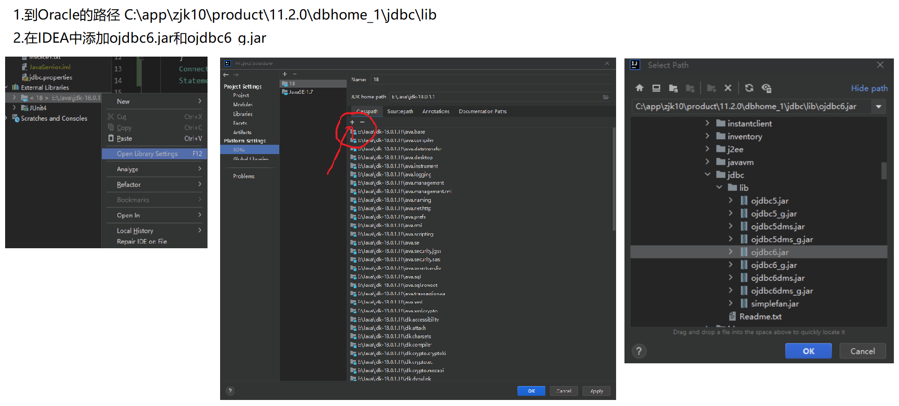

# JDBC简介

- Java数据库连接：实质是一个Java API，可以为多种关系数据库提供统一访问，它由一组用Java语言编写的类和接口组成。
- JDBC是一套标准的操作数据的规则，即接口；而由数据库厂商来实现这套接口，即数据库驱动jar包。
- JDBC驱动管理器：JVM的一个组成部分，负责针对各种类型DBMS的JDBC驱动程序，也负责和用户的应用程序交互，为Java建立数据库连接。Java应用程序通过JBDC API向JDBC驱动管理器发出请求，指定要安装的JDBC驱动程序类型和数据源。驱动管理器根据这些要求装载合适的JDBC驱动程序并使该驱动连通相应的数据源。一旦连接成功，该JDBC驱动就负责Java应用与该数据源的一切交互。

 

```java
//1.注册驱动 在JDBC4.0之后可以省略
Class.forName("com.mysql.jdbc.Driver");
//2.获取连接
Connection conn = DriverManager.getConnnection(url,user,passwd);
//3.获取执行sql对象
Statement statement = conn.createStatement();
//4.SQL语句 需要空格来表示换行
String sql = "sql语句";
//5.执行sql
statement.executeXxx(sql);
//6.对结果集操作 如果是statement.executeQuery(sql)
ResultSet resultSet = statement.executeQuery(sql);
//7.释放资源
statement.close();
conn.close();
```

```java
try {
    //1.获取驱动
    Class.forName("oracle.jdbc.driver.OracleDriver");
} catch (ClassNotFoundException e) {
    throw new RuntimeException(e);
}

Connection connection = null;
Statement statement = null;
try {
    //2.建立连接
    //Oracle的url jdbc:oracle:thin:@localhost:1521:ORCL
    String url = "jdbc:oracle:thin:@localhost:1521:ORCL";
    connection = DriverManager.getConnection(url, "scott", "tiger");
    statement = connection.createStatement();

    //3.执行SQL语句
    //查询
    String selectSQL = "SELECT employee_id,department_id,last_name " +
        "FROM employees " +
        "WHERE department_id = 80";
    ResultSet resultSet = statement.executeQuery(selectSQL);
    //4.处理结果集
    int emp_id;
    int dep_id;
    String emp_name;
    while (resultSet.next()) {
        emp_id = resultSet.getInt(1);
        dep_id = resultSet.getInt(2);
        emp_name = resultSet.getString("last_name");
        System.out.println(emp_id + " : " + dep_id + " : " + emp_name);
    }
} catch (SQLException e) {
    throw new RuntimeException(e);
} finally {
    try {
        //5.关闭连接
        statement.close();
        connection.close();
    } catch (SQLException e) {
        throw new RuntimeException(e);
    }
}
```

# DriverManager JDBC驱动

## 驱动类型

### Oracle

   

- Oracle驱动：`oracle.jdbc.driver.OracleDriver`。

### MySql

## 加载驱动

- DriverManager：加载相应数据库驱动（DriverManager）的实例并注册到驱动管理器 。
- JDBC4.0之后可省略：DriverManager.getConnection()自动在程序的CLASSPATH中找到驱动。

```java
Class.forName("驱动");
```

# Connection接口

## 创建连接 

- Connection：数据库连接。

```java
Connection conn = DriverManager.getConnection(String url, String user, String passwd);
```

- url : 指定使用的数据库访问协议和数据源。

````
jdbc:数据库访问协议:数据源
````

```java
//oracle
jdbc:oracle:thin:@localhost:1521:ORCL
//mysql
jdbc:mysql://127.0.0.1:3306/db1
```

> jdbc:oracle:thin:@localhost:1521:ORCL
> 协议(jdbc):子协议(oracle:thin):数据源标识(@localhost:1521:ORCL)
>
> - oracle:thin 指出连接的是oracle数据库以及连接方式
>   - 瘦方式：thin，不需要客户端。
>   - 胖方式：cli，需要安装客户端。 
> - @localhost:1521:orcl
>   -  localhost：Oracle数据库的地址（IP地址）。
>   - 1521：Orcal数据库的监听端口。
>   - orcl：Orcal数据库的SID。

## 事务管理 

| 方法                     | 说明                 |
| ------------------------ | -------------------- |
| setAutoCommit(boolean b) | 默认打开，自动提交   |
| commit()                 | 显示调用提交COMMIT   |
| rollback()               | 显示调用回滚ROLLBACK |

```java
Connection connection = null;
Statement statement = null;
try {
    Class.forName("oracle.jdbc.driver.OracleDriver");
    connection = DriverManager.getConnection("jdbc:oracle:thin:@localhost:1521:ORCL", "scott", "tiger");

    connection.setAutoCommit(true);

    statement = connection.createStatement();

    ResultSet resultSet = statement.executeQuery("SELECT * FROM jdbc_table");

    while (resultSet.next()) {
        System.out.println(resultSet.getInt("id") + " : " + resultSet.getString("name") + " : " + resultSet.getString("sex"));
    }
} catch (ClassNotFoundException e) {
    throw new RuntimeException(e);
} catch (SQLException e) {
    throw new RuntimeException(e);
} finally {
    try {
        statement.close();
        connection.close();
    } catch (SQLException e) {
        throw new RuntimeException(e);
    }
}
```

# Statement 执行SQL语句

## 基本执行

- 创建Statement对象：

```java
Statement statement = conn.createStatement();
```

| 执行                               | 说明                                         |
| ---------------------------------- | -------------------------------------------- |
| ResultSet executeQuery(String sql) | 查询时<br />返回结果集                       |
| int executeUpdate(String sql)      | 插入、删除、更新操作时<br />返回受影响的行数 |
| boolean execute(String sql)        | 既有查询、又有更新时，<br />返回执行是否成功 |

- SQL语句的空格不能忽略：即使字符串换行了，也必须留有空格。
- SQL语句结尾不能有分号 `;`。
- SQL语句中的字符类、时间类等需要单引号`''`。

- 释放资源：
  1. 先关闭Statement对象：statement.close()。
  2. 再关闭连接：conn.close()。

```java
statement = connection.createStatement();
ResultSet resultSet = statement.executeQuery("SELECT * FROM jdbc_table");
```

## 批量更新

- JDBC4.0之后，Statement支持对数据库的批量操作。

| 方法                 | 说明                                                         |
| -------------------- | ------------------------------------------------------------ |
| addBatch(Stirng sql) | 向列表中添加SQL语句，将列表中的SQL语句作为一个单元发送到DBMS进行批量执行操作。 |
| executeBatch()       | 执行批量操作                                                 |

```java
Connection connection = null;
Statement statement = null;
try {
    Class.forName("oracle.jdbc.driver.OracleDriver");
    connection = DriverManager.getConnection("jdbc:oracle:thin:@localhost:1521:ORCL", "scott", "tiger");

    connection.setAutoCommit(true);

    statement = connection.createStatement();

    statement.addBatch("INSERT INTO jdbc_table VALUES(1001,'Jac','男')");
    statement.addBatch("INSERT INTO jdbc_table VALUES(1003,'Tom','男')");
    statement.addBatch("INSERT INTO jdbc_table VALUES(1004,'Ju','女')");

    statement.executeBatch();
} catch (ClassNotFoundException e) {
    throw new RuntimeException(e);
} catch (SQLException e) {
    throw new RuntimeException(e);
} finally {
    try {
        statement.close();
        connection.close();
    } catch (SQLException e) {
        throw new RuntimeException(e);
    }
}
```

# ResultSet 处理查询结果集

## 获取、处理

- ResultSet结果集：通过游标控制具体记录的访问，游标指向结果集中的当前记录。

| 游标   | 说明                                                         |
| ------ | ------------------------------------------------------------ |
| next() | 将游标移到下一行，并将该行作为用户操作的当前行，如果没有下一行，则返回false。<br />初始为空白，需要进行第一次next()将游标指向第一行，并将该行作为用户操作的当前行，然后再操作之后的。 |
| last() | 将游标定位到最后一行                                         |

| 获取                    | 获取值方式                                           |
| ----------------------- | ---------------------------------------------------- |
| getXxx(String  colName) | 列名，获取指定列的值                                 |
| getXxx(int columnIndex) | 结果集中列的序号（以1开始，而不是0），获取指定的值。 |

| getXxx    | 返回值类型 | 对应数据库中的数据类型 |
| :-------- | :--------- | :--------------------- |
| getInt    | int        | INT                    |
| getDouble | double     | DOUBLE                 |
| getString | String     | VARCHAR                |

- 在实体类中，基本数据类型尽量换成包装类；避免基本数据类型的初始值对空值的影响。

## 直接更新

- createStatement(ResultSet.TYPE_SCROILL_SENSITIVE, ResultSet.CONCUR_UPDATABLE)：设置返回的结果集X/ 
- updateXxx(String colName, Xxx x)：根据指定的列名colName来更新相应的数据（Xxx数据类型的x）。
  - 指定的列名必须是在JDBC的SQL语句中出现的(不包括`*`)，否则：java.sql.SQLException: 对只读结果集的无效操作
- updateRow()：使更新操作生效。

```java
Connection connection = null;
Statement statement = null;
try {
    Class.forName("oracle.jdbc.driver.OracleDriver");
    connection = DriverManager.getConnection("jdbc:oracle:thin:@localhost:1521:ORCL", "scott", "tiger");

    connection.setAutoCommit(true);

    statement = connection.createStatement(ResultSet.TYPE_SCROLL_SENSITIVE, ResultSet.CONCUR_UPDATABLE);

    ResultSet resultSet = statement.executeQuery("SELECT id,name,sex FROM jdbc_table");

    resultSet.last();
    resultSet.updateString("name", "小均");
    resultSet.updateRow();

} catch (ClassNotFoundException e) {
    throw new RuntimeException(e);
} catch (SQLException e) {
    throw new RuntimeException(e);
} finally {
    try {
        statement.close();
        connection.close();
    } catch (SQLException e) {
        throw new RuntimeException(e);
    }
}
```

# PraparedStatement 预编译语句 

- 防止SQL注入：即在输入SQL语句获取结果时，将一些语句当成SQL语句来执行。
- PraparedStatement接口继承了Statement接口。

**开启预编译功能useServerPrepStmts=true**

- 在使用预编译语句之前需要在url加上?useSSL=false&useServerPrepStmts=true

```java
Connection conn = DriverManager.getConnection("jdbc:mysql://127.0.0.1:3306/db1?useSSL=false&useServerPrepStmts=true?)
```

**对比**

- 在创建Statement对象时，并未指定和执行SQL语句，在执行SQL语句时，需要将SQL语句发送给DBMS，再由DBMS进行编译后执行。
- 在创建PreparedStatement对象时，就指定了SQL语句并立刻发送给DBMS进行编译，当该PraparedStatement对象执行SQL语句时，DBMS只需要执行已经编译好的语句即可。

**创建预编译语句**

- prepareStatement(String sql)
  - 创建PreparedStatement对象
  - 使用`参数表示符 ? `来表示SQL语句中的参数

**设置预编译语句中的SQL语句参数 (即?的内容)**

- setXxx(int paramIndex, Xxx x)
  - 通过在SQL语句中参数的序号paramIndex（从1开始），设置相应数据类型Xxx的参数值x。
  - 在设置的过程中，会对传入的参数内容中的**敏感字符转义操作**，避免SQL注入。会自动为相应数据类型的参数补上单引号。
  - 预编译语句中的SQL语句参数经过设置后，会一直保留，直到被设为新值或调用了clearParameters()方法
- clearParameters()
  - 清除预编译语句的SQL语句的所有参数设置。 

```java
public void prepareStatementSelect(int id, String name) throws Exception {
    Connection conn = DriverManager.getConnection("jdbc:mysql://127.0.0.1:3306/db1?useSSL=false&useServerPrepStms=true");
    String sql = "SELECT * FROM test WHERE id = ? AND name = ?";
    PreparedStatement preparedStatement = conn.prepareStatement(sql);
    preparedStatement.setInt(1,id);
    preparedStatement.setString(2,name);
    ResultSet resultSet = preparedStatement.executeQuery();
    while(resultSet.next()){
        System.out.println(resultSet.getInt("id") + ": " + resultSet.getString("name"));
    }
}
```

```java
import java.sql.*;

public class JDBCTest2 {
    public static void main(String[] args) {
        Connection connection = null;
        PreparedStatement preparedStatement = null;
        try {
            Class.forName("oracle.jdbc.driver.OracleDriver");

            String url = "jdbc:oracle:thin:@localhost:1521:ORCL";
            connection = DriverManager.getConnection(url, "scott", "tiger");

            //创建预编译语句
            String sql = "SELECT employee_id,department_id,last_name " +
                    "FROM employees " +
                    "WHERE department_id = ? " +
                    "  AND salary < ?";
            preparedStatement = connection.prepareStatement(sql);

            //设置预编译语句SQL语句的参数
            preparedStatement.setInt(1, 10);
            preparedStatement.setInt(2, 10000);

            ResultSet resultSet = preparedStatement.executeQuery();

            while (resultSet.next()) {
                System.out.println(resultSet.getInt("employee_id") + " : " + resultSet.getInt("department_id") + " : " + resultSet.getString("last_name"));
            }
        } catch (ClassNotFoundException e) {
            throw new RuntimeException(e);
        } catch (SQLException e) {
            throw new RuntimeException(e);
        } finally {
            try {
                if (preparedStatement != null)
                    preparedStatement.close();
            } catch (SQLException e) {
                throw new RuntimeException(e);
            }
            try {
                if (connection != null)
                    connection.close();
            } catch (SQLException e) {
                throw new RuntimeException(e);
            }
        }
    }
}
```

# CallableStatement 存储过程调用 

- CallableStatement继承自PreparedStatement接口。
- 创建CallableStatement对象：

```java
connection.prepareCall("{call 存储过程名}");
```

| 执行                               | 说明                                         |
| ---------------------------------- | -------------------------------------------- |
| ResultSet executeQuery(String sql) | 查询时<br />返回结果集                       |
| int executeUpdate(String sql)      | 插入、删除、更新操作时<br />返回受影响的行数 |
| boolean execute(String sql)        | 既有查询、又有更新时，<br />返回执行是否成功 |

```java
Connection connection = null;
CallableStatement callableStatement = null;
try {
    Class.forName("oracle.jdbc.driver.OracleDriver");

    connection = DriverManager.getConnection("jdbc:oracle:thin:@localhost:1521:ORCL","scott","tiger");
    String callSQL = "{call emp_id_sal(1002,'小红','女')}";
    callableStatement = connection.prepareCall(callSQL);
    connection.setAutoCommit(true);

    callableStatement.executeUpdate();
} catch (ClassNotFoundException e) {
    throw new RuntimeException(e);
} catch (SQLException e) {
    throw new RuntimeException(e);
} finally {
    try {
        callableStatement.close();
        connection.close();
    } catch (SQLException e) {
        throw new RuntimeException(e);
    }
}
```

# DataSource 数据库连接池

## DataSource概述

- 数据库连接池是个容器，负责分配、管理数据库连接。
- 允许应用程序重复使用一个现有的数据库连接，而不是重新建立一个。
- 释放空闲时间超过最大空闲时间的数据库连接来避免由于没有释放数据库连接而引起的数据库连接遗漏。

1. 资源重用。
2. 提升系统响应速度。
3. 避免数据库连接遗漏。

- 标准接口 DataSource接口，具体实现：

  - DBCP

  - C3P0

  - Druid


## Druid

1. 导入jar包
2. 定义配置文件druid.properties
3. 加载配置文件
4. 获取连接池对象

### druid.properties

```properties
driverClassName=com.mysql.jdbc.Driver
url=jdbc:mysql://127.0.0.1:3306/db1?useSSL=false&useServerPrepStmts=true
username=root
password=tiger  
# 初始化连接数
initialSize=5
# 最大连接数
maxActive=10
# 最大等待时间
maxWait=3000
```

### DruidDataSourceFactory

```java
//1.加载配置文件
Properties prop = new Properties();
//注意路径
prop.load(new FileInputStream("E:\\IdeaProjects\\MavenProject\\JavaWeb01\\src\\main\\resources\\druid.properties"));
//2.获取连接池对象
DataSource dataSource = DruidDataSourceFactory.createDataSource(prop);
//3.获取数据库连接
Connection conn = dataSource.getConnection();
System.out.println(conn);
```

# 其他

## 连锁异常处理的获取 forEach

- JDBC4.0之后，可通过forEach获取一系列的SQL异常抛出对象。

```java
try{
    ...
}catch(SQLException sx){
    for(Throwable e: sx){
        System.err.println(e)
    }
}
```
