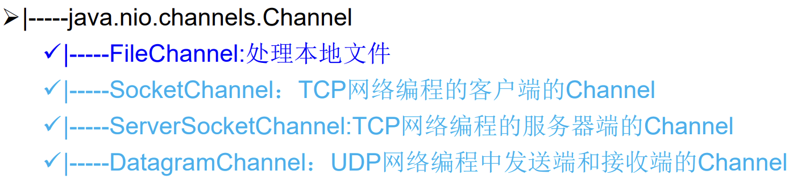

# NIO概述

- Java NIO (New IO，Non-Blocking IO)：支持面向缓冲区的、基于通道的IO操作。

> IO是面向流的。

|       IO       |   NIO   |
| :------------: | :-----: |
| byte[] /char[] | Buffer  |
|     Stream     | Channel |

 

**Java API中提供了两套NIO**

- 标准输入输出NIO
- 网络编程NIO。

   

# Path

- Path接口：代表一个平台无关的平台路径，描述了目录结构中文件的位置，实际引用的资源可以不存在。

| 获取方法                                     | 说明                       |
| -------------------------------------------- | -------------------------- |
| static Path get(String first, String … more) | 用于将多个字符串串连成路径 |
| static Path get(URI uri)                     | 返回指定uri对应的Path路径  |

| 方法                            | 说明                                                     |
| ------------------------------- | -------------------------------------------------------- |
| String toString()               | 返回调用 Path 对象的字符串表示形式                       |
| boolean startsWith(String path) | 判断是否以 path 路径开始                                 |
| boolean endsWith(String path) : | 判断是否以 path 路径结束                                 |
| boolean isAbsolute()            | 判断是否是绝对路径                                       |
| Path getParent()                | 返回Path对象包含整个路径，不包含 Path 对象指定的文件路径 |
| Path getRoot()                  | 返回调用 Path 对象的根路径                               |
| Path getFileName()              | 返回与调用 Path 对象关联的文件名                         |
| int getNameCount()              | 返回Path 根目录后面元素的数量                            |
| Path getName(int idx)           | 返回指定索引位置 idx 的路径名称                          |
| Path toAbsolutePath()           | 作为绝对路径返回调用 Path 对象                           |
| Path resolve(Path p)            | 合并两个路径，返回合并后的路径对应的Path对象             |
| File toFile()                   | 将Path转化为File类的对象                                 |

# Files

- java.nio.file.Files 操作文件或目录的工具类。

| 操作     | 方法                                                         | 说明                                        |
| -------- | ------------------------------------------------------------ | ------------------------------------------- |
|          | Path copy(Path src, Path dest, CopyOption … how)             | 文件的复制                                  |
|          | `Path createDirectory(Path path, FileAttribute<?> … attr)`   | 创建一个目录                                |
|          | `Path createFile(Path path, FileAttribute<?> … arr)`         | 创建一个文件                                |
|          | void delete(Path path)                                       | 删除一个文件/目录 如果不存在，执行报错 |
|          | `void deleteIfExists(Path path)`                             | Path对应的文件/目录如果存在，执行删除       |
|          | Path move(Path src, Path dest, CopyOption…how)               | 将 src 移动到 dest 位置                     |
|          | `long size(Path path)`                                       | 返回 path 指定文件的大小                    |
| 判断     | boolean exists(Path path, LinkOption … opts)                 | 文件是否存在                                |
|          | boolean isDirectory(Path path, LinkOption … opts)            | 是否是目录                                  |
|          | boolean isRegularFile(Path path, LinkOption … opts)          | 是否是文件                                  |
|          | boolean isHidden(Path path)                                  | 是否隐藏                                    |
|          | boolean isReadable(Path path)                                | 可读                                        |
|          | boolean isWritable(Path path)                                | 可写                                        |
|          | boolean notExists(Path path, LinkOption … opts)              | 是否不存在                                  |
| 操作内容 | SeekableByteChannel newByteChannel(Path path, OpenOption…how) | 获取与指定文件的连接 how 指定打开方式  |
|          | `DirectoryStream<Path> newDirectoryStream(Path path)`        | 打开 path 指定的目录                        |
|          | InputStream newInputStream(Path path, OpenOption…how)        | 获取 InputStream 对象                       |
|          | OutputStream newOutputStream(Path path, OpenOption…how)      | 获取 OutputStream 对象                      |