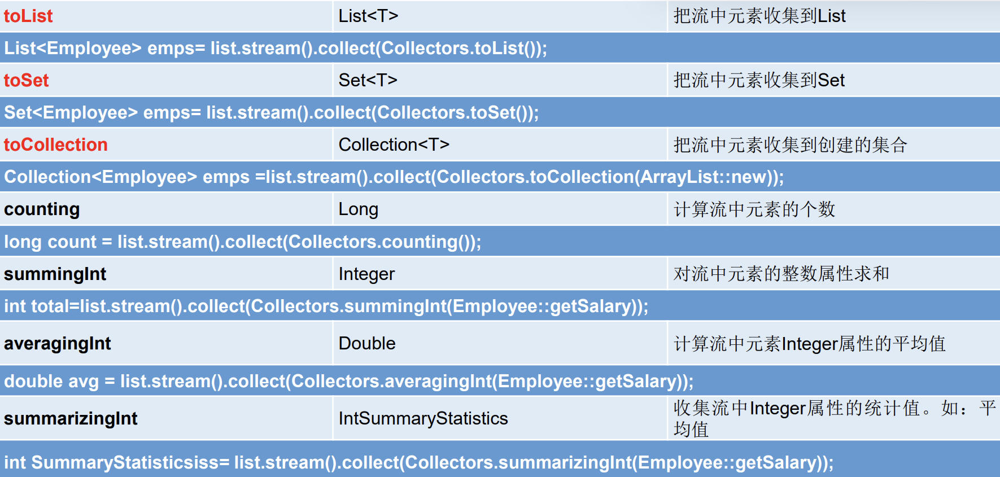
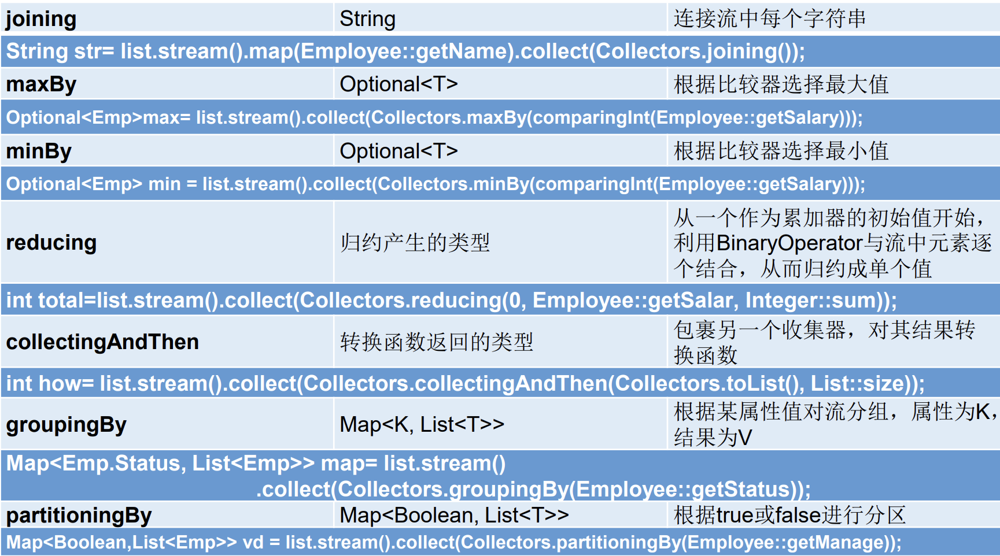

# Stream简述

- Stream是数据渠道，用于操作数据源（集合、数组等）所生成的元素序列。

1. Stream 不持有值，不存储元素。
2. Stream 不会改变源对象。相反，会返回一个持有结果的新Stream。
3. 延迟计算：Stream只有进行了终止操作才会开始计算结果。
4. 串行处理、并行处理。

| 类型       | 说明                                           |
| ---------- | ---------------------------------------------- |
| Collection | 静态的内存数据结构，主要面向内存，存储在内存中 |
| Stream     | 有关计算的，主要面向 CPU，通过 CPU 实现计算    |

| 对比               | Stream                         | Iterator                   |
| ------------------ | ------------------------------ | -------------------------- |
| 处理值             | 无序                           | 有序                       |
|                    | 中间操作                       |                            |
| 保留值             | 保留值本身、关于源的属性的信息 | 只保留值本身               |
| null（无元素处理） | 友好的处理                     | hasNext()返回false，易出错 |


# 操作流程

1. 数据源：创建Stream，获取一个流。
2. 管道：中间操作链，对数据源的数据进行处理。
3. 终止流：一旦执行终止操作，就执行中间操作链，并产生结果，之后流被耗尽，不能被再次使用。

 

## Stream 流

### 数据源

| 数据源              | 方法                                                         | 说明           |
| ------------------- | ------------------------------------------------------------ | -------------- |
| 集合 Collection接口 | `default Stream<E> stream()`                                 | 返回一个顺序流 |
|                     | `default Stream<E> parallelStream()`                         | 返回一个并行流 |
| 数组                | `static <T> Stream<T> stream(T[] array)`                     | 返回一个流     |
|                     | `public static IntStream stream(int[] array)`                |                |
|                     | `public static LongStream stream(long[] array)`              |                |
|                     | `public static DoubleStream stream(double[] array)`          |                |
| Stream：of()        | `public static<T> Stream<T> of(T... values)`                 | 返回一个流     |
| 无限流              | `public static<T> Stream<T> iterate(final T seed,final UnaryOperator<T> f)` | 迭代           |
|                     | `public static<T> Stream<T> generate(Supplier<T> s)`         | 生成           |

```java
//通过集合获取Stream实例
@Test
public void test1() {
    List<Employee> employees = EmployeeData.getEmployees();
    //stream() 返回顺序流
    Stream<Employee> stream = employees.stream();
    //parallelStream 返回并行流
    Stream<Employee> employeeStream = employees.parallelStream();
}

//2. 通过数组获取Stream实例
@Test
public void test2() {
    //调用Arrays类中的stream(arr)
    int[] arr = {1, 2, 3};
    IntStream stream = Arrays.stream(arr);
    Employee[] employees = {new Employee(), new Employee()};
    Stream<Employee> stream1 = Arrays.stream(employees);
}

//3. 通过Stream的of()
@Test
public void test3() {
    Stream<Integer> integerStream = Stream.of(1, 2, 3, 4);
}

//4. 创建无限流
@Test
public void test4() {
    //iterate() 迭代
    Stream.iterate(0, t -> t + 2).forEach(System.out::println);
    //generate() 生成
    Stream.generate(Math::random).limit(10).forEach(System.out::println);
}
```

### 原生流

- 避免 基本数据类型和包装类 之间频繁的 自动装箱和自动拆箱。

**原生流**

| 原生流       | 对应类型          | 流类型转换                   | 装箱    | 拆箱       |
| ------------ | ----------------- | ---------------------------- | ------- | ---------- |
| IntStream    | char、short、byte | asLongStream、asDoubleStream | boxed() | mapToInt() |
| LongStream   | long              | asDoubleStream               | boxed() |            |
| DoubleStream | float、double     |                              | boxed() |            |

```java
//流类型转换
DoubleStream ds = IntStream.rangeClosed(1,10).asDoubleStream();
//装箱
Stream<Integer> is = IntStream.rangeClosed(1,10).boxed();
//拆箱
IntStream intStream = is.mapToInt(Integer::intValue);
```

## 管道

- 惰性求值：多个中间操作可以连接起来形成一个流水线，除非流水线上触发终止操作，否则中间操作不会执行任何的处理。而在终止操作时一次性全部处理。

| 操作       | 方法                           | 说明                                                         |
| ---------- | ------------------------------ | ------------------------------------------------------------ |
| 筛选与切片 | filter(Predicate p)            | 接受Lambda，从流中排除某些元素                               |
|            | distinct()                     | 筛选，通过流所生成元素的hashCode()和equals()去除重复元素     |
|            | limit(long maxSize)            | 截断流，使其元素不超过给定数量                               |
|            | skip(long n)                   | 跳过元素，返回一个丢弃了前n个元素的流<br />若流中元素不足n个，则返回一个空流。<br />与limit(n)互补 |
| 映射       | map(Function f)                | 接收一个函数作为参数，该函数应用到每个元素上<br />并将其映射为一个新的元素。 |
|            | mapToDouble(ToDoubleFuntion f) | 接收一个函数作为参数，该函数应用到每个元素上<br />产生一个新的DoubleStream |
|            | mapToInt(ToIntFuntion f)       | 接收一个函数作为参数，该函数应用到每个元素上<br />产生一个新的IntStream |
|            | mapToLong(ToLongFuntion f)     | 接收一个函数作为参数，该函数应用到每个元素上<br />产生一个新的LongStream |
|            | flatMap(Function f)            | 接收一个函数作为参数，将流中的每个只都换成另一个流，然后把所有的流连接成一个流。 |
| 排序       | sorted()                       | 产生一个新流，其中按自然顺序排序                             |
|            | sorted(Conparator com)         | 产生一个新流，其中按比较器顺序排序                           |

```java
package com.zjk.java2;

import org.junit.jupiter.api.Test;

import javax.print.DocFlavor;
import java.util.*;
import java.util.stream.Stream;

public class StreamAPITest1 {
    //1-筛选与切片
    @Test
    public void test1() {
        List<Employee> employees = EmployeeData.getEmployees();
        //filter(Predicate p) 接收 Lambda ， 从流中排除某些元素
        Stream<Employee> stream = employees.stream();
        stream.filter(e -> e.getSalary() > 7000).forEach(System.out::println);
        //limit(long maxSize) 截断流，使其元素不超过给定数量
        employees.stream().limit(3).forEach(System.out::println);
        //skip(long n) 跳过元素，返回一个扔掉了前 n 个元素的流。若流中元素不足 n 个，则返回一个空流。与 limit(n) 互补
        employees.stream().skip(3).forEach(System.out::println);
        //distinct() 筛选，通过流所生成元素的 hashCode() 和 equals() 去除重复元素
        employees.stream().distinct().forEach(System.out::println);
    }

    //2-映射
    @Test
    public void test2() {
        List<String> list = Arrays.asList("aa", "bb", "cc");
        //map(Function f) 接收一个函数作为参数，该函数会被应用到每个元素上，并将其映射成一个新的元素。
        list.stream().map(str -> str.toUpperCase()).forEach(System.out::println);
//        获取员工姓名长度大于3的
        Stream<String> stringStream = EmployeeData.getEmployees().stream().map(Employee::getName);
        stringStream.filter(name -> name.length() > 3).forEach(System.out::println);
        //mapToDouble(ToDoubleFunction f) 接收一个函数作为参数，该函数会被应用到每个元素上，产生一个新的 DoubleStream。
        //mapToInt(ToIntFunction f)接收一个函数作为参数，该函数会被应用到每个元素上，产生一个新的 IntStream。
        //mapToLong(ToLongFunction f) 接收一个函数作为参数，该函数会被应用到每个元素上，产生一个新的 LongStream。
//
        Stream<Stream<Character>> streamStream = list.stream().map(StreamAPITest1::fromStringToStream);
        streamStream.forEach(s -> {
            s.forEach(System.out::println);
        });
        //flatMap(Function f) 接收一个函数作为参数，将流中的每个值都换成另一个流，然后把所有流连接成一个流
        Stream<Character> characterStream = list.stream().flatMap(StreamAPITest1::fromStringToStream);
        characterStream.forEach(System.out::println);

    }

    public static Stream<Character> fromStringToStream(String str) {
        ArrayList<Character> list = new ArrayList<>();
        for (Character c : str.toCharArray()) {
            list.add(c);
        }
        return list.stream();
    }

    //3-排序
    @Test
    public void test3() {
        //sorted() 自然排序
        List<Integer> integers = Arrays.asList(12, 43, 23, 344, 32);
        integers.stream().sorted().forEach(System.out::println);

        //sorted(Comparator comparator) 定制排序
//        Comparator comparator = new Comparator() {
//            @Override
//            public int compare(Object o1, Object o2) {
//                if (o1 instanceof Employee && o2 instanceof Employee) {
//                    Employee e1 = (Employee) o1;
//                    Employee e2 = (Employee) o2;
//                    return e1.getAge() - e2.getAge();
//                } else {
//                    throw new RuntimeException("数据类型不一致");
//                }
//            }
//        };
        List<Employee> employees = EmployeeData.getEmployees();
//        employees.stream().sorted(comparator).forEach(System.out::println);
        employees.stream().sorted((e1, e2) -> Integer.compare(e1.getAge(), e2.getAge())).forEach(System.out::println);

        employees.stream().sorted((e1, e2) -> {
            int num;
            if ((num = Integer.compare(e1.getAge(), e2.getAge())) != 0) {
                return num;
            } else {
                return Double.compare(e1.getSalary(), e2.getSalary());
            }
        }).forEach(System.out::println);
    }
}
```

## 终止流

- 终端操作会从流的流水线生成结果。其结果可以是任何不是流的值，例如：List、Integer，甚至是 void 。
- 流进行了终止操作后，不能再次使用。

| 操作       | 方法                             | 说明                                                         |
| ---------- | -------------------------------- | ------------------------------------------------------------ |
| 匹配与查找 | allMatch(Predicate p)            | 检查是否匹配所有元素                                         |
|            | anyMatch(Predicate p)            | 检查是否至少匹配一个元素                                     |
|            | noneMatch(Predicate p)           | 检查是否没有匹配所有元素                                     |
|            | findeFirst()                     | 返回第一个元素                                               |
|            | findAny()                        | 返回当前流中的任意元素                                       |
|            | count()                          | 返回流中元素总数                                             |
|            | max(Comparator c)                | 返回流中最大值                                               |
|            | min(Comparator c)                | 返回流中最小值                                               |
|            | forEach(Consumer c)              | 内部迭代：Stream<br />外部迭代：Collection接口               |
| 归约       | reduce(T iden,BinaryOperrator b) | 将流中元素反复结合，得到新的值，返回T                        |
|            | reduce(BinaryOperrator b)        | 将流中元素反复结合，得到新的值，返回`Optional<T>`            |
| 收集       | collect(Collector c)             | 将流转换韦其他形式。<br />接收一个Collector接口的实现，用于给Stream中元素做汇总的方法。<br />Collector 接口中方法的实现决定了如何对流执行收集的操作(如收集到 List、Set、Map) |

```java
package com.zjk.java2;

import org.junit.jupiter.api.Test;

import java.util.Arrays;
import java.util.Comparator;
import java.util.List;
import java.util.stream.Collectors;
import java.util.stream.Stream;

public class StreamAPITest2 {
    //1-匹配与查找
    @Test
    public void test1() {
        List<Employee> employeeList = EmployeeData.getEmployees();
        //allMatch(Predicate p) 检查是否匹配所有元素
//        判断是否所有的员工的年龄大于18
        System.out.println(employeeList.stream().allMatch(e -> e.getAge() > 18)); //false
        //anyMatch(Predicate p) 检查是否至少匹配一个元素
        System.out.println(employeeList.stream().anyMatch(e -> e.getName().equals("马云"))); //true
        //noneMatch(Predicate p) 检查是否没有匹配所有元素
        System.out.println(employeeList.stream().noneMatch(e -> e.getSalary() > 0)); //false
        //findFirst() 返回第一个元素
        System.out.println(employeeList.stream().sorted((e1, e2) -> Integer.compare(e1.getAge(), e2.getAge())).findFirst());
//        Optional[Employee{id=1002, name='马云', age=12, salary=9876.12}]
        //findAny() 返回当前流中的任意元素
        System.out.println(employeeList.parallelStream().findAny());
        //count() 返回流中元素总数
        System.out.println(employeeList.stream().count()); //8
//        工资大于5000的人个数
        System.out.println(employeeList.stream().filter(e -> e.getSalary() > 5000).count()); //5
        //max(Comparator c) 返回流中最大值
//        返回最大年龄的
        System.out.println(employeeList.stream().max((e1, e2) -> Integer.compare(e1.getAge(), e2.getAge())));
//        Optional[Employee{id=1005, name='李彦宏', age=65, salary=5555.32}]
        Stream<Integer> integerStream = employeeList.stream().map(Employee::getAge);
        System.out.println(integerStream.max(Integer::compare)); //Optional[65]
        //min(Comparator c) 返回流中最小值
//        返回工资最低的
        System.out.println(employeeList.stream().min((e1, e2) -> Double.compare(e1.getSalary(), e2.getSalary())));
//        Optional[Employee{id=1008, name='扎克伯格', age=35, salary=2500.32}]
        System.out.println(employeeList.stream().map(Employee::getSalary).min(Double::compare));
//        Optional[2500.32]
        //forEach(Consumer c) 内部迭代(使用 Collection 接口需要用户去做迭代，称为外部迭代。
        // 相反，Stream API 使用内部迭代——它帮你把迭代做了)
    }

    //2-归约
    @Test
    public void test2() {
        //reduce(T iden, BinaryOperator b) 可以将流中元素反复结合起来，得到一个值。返回 T
//        计算1~10的和
        List<Integer> integers = Arrays.asList(1, 2, 3, 4, 5, 6, 7, 8, 9, 10);
        System.out.println(integers.stream().reduce(0, Integer::sum)); //55
//        0 --设置的初始值
        //reduce(BinaryOperator b) 可以将流中元素反复结合起来，得到一个值。返回 Optional<T>
        System.out.println(integers.stream().reduce(Integer::sum)); //Optional[55]

//        计算员工工资的和
        System.out.println(EmployeeData.getEmployees().stream().map(Employee::getSalary).reduce(Double::sum));
//        Optional[48424.08]
        System.out.println(EmployeeData.getEmployees().stream().map(Employee::getSalary).reduce((e1, e2) -> e1 + e2));
    }

    //3-收集
    @Test
    public void test3() {
        //collect(Collector c) 将流转换为其他形式。接收一个 Collector接口的实现，用于给Stream中元素做汇总的方法
//        返回工资大于6000 的集合
        List<Employee> collect = EmployeeData.getEmployees().stream().filter(e -> e.getSalary() > 6000).collect(Collectors.toList());
        collect.stream().forEach(System.out::println);
    }
}
```

# Collectors 收集器

   
   

# Optional

- `Optional<T> `：java.util.Optional，容器类。
  - 保存类型T的值，代表这个值存在：`isPresent()`返回true，调用`get()`方法会返回该对象。
  - 保存null，表示这个值不存在，可以避免空指针异常。


| 操作                   | 方法                                                     | 说明                                                         |
| ---------------------- | -------------------------------------------------------- | ------------------------------------------------------------ |
| 创建Optional实例       | Optional.of(T t)                                         | 创建一个Optional实例<br />t必须非null                        |
|                        | Optional.empty()                                         | 创建一个空的Optional实例                                     |
|                        | Optional.ofNullable(T t)                                 | 创建一个Optional实例<br />t可以为null                        |
| 判断容器是否包含对象   | boolean isPresent()                                      | 是否包含对象                                                 |
|                        | `void ifPresent(Consumer<? super T> consumer)`           | 如果有值，执行Consumer接口的实现代码，并且该值作为参数传递给它 |
| 获取Optional容器的对象 | T get()                                                  | 如果调用对象包含值，返回该值，<br />否则抛出NoSuchElementException，不安全。 |
|                        | T orElse(T other)                                        | 如果有值，则将其返回<br />否则返回指定的other对象            |
|                        | `T orElseGet(Supplier<? extends T> other)`               | 如果有值，将其返回<br />否则返回由Supplier接口实现提供的对象 |
|                        | `T orElseThrow(Supplier<? extends X> exceptionSupplier)` | 如果有值，将其返回<br />否则抛出Supplier接口实现提供的异常   |

```java
@Test
//of(T t) t==null
public void test1(){
    Girl girl = null;
    Optional<Girl> optionalGirl = Optional.of(girl);
}
```
