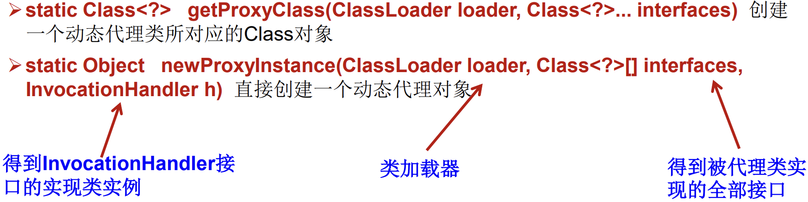
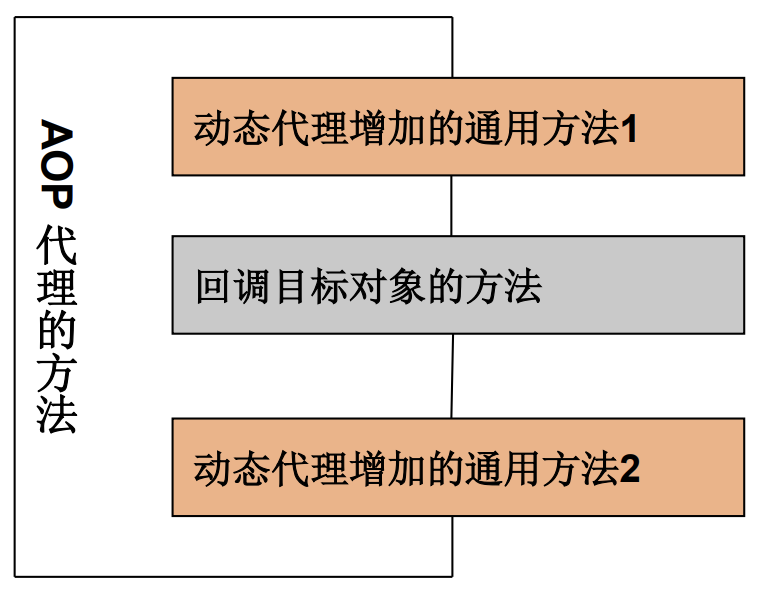

# 反射简述

## 动态语言

- Java：准动态语言。
- 反射：动态语言的关键，在运行时借助于Reflection API取得任何类的内部信息，并能直接操作任意对象的内部属性及方法。

    

## 运行时的反射

1. 判断任意一个对象所属的类
2. 构造任意一个类的对象
3. 判断任意一个类所具有的成员变量和方法
4. 获取泛型信息
5. 调用任意一个对象的成员变量和方法
6. 处理注解
7. 动态代理

**反射相关的API**

| API                           | 说明     |
| ----------------------------- | -------- |
| java.lang.Class               | 类       |
| java.lang.reflect.Method      | 方法     |
| java.lang.reflect.Field       | 成员变量 |
| java.lang.reflect.Constructor | 构造器   |

- 反射与封装

```java
public class ReflectionTest {
    //反射之后，对Person类的操作
    @Test
    public void test1() throws Exception {
        Class<Person> personClass = Person.class;
        //1.通过反射，创建Person类的对象
        Constructor<Person> constructor = personClass.getConstructor(String.class, int.class);
        Person tom = constructor.newInstance("Tom", 21);
        System.out.println(tom);

        //2.通过反射，调用对象指定的属性、方法
        //调用属性
        Field age = personClass.getDeclaredField("age");
        age.set(tom,10);
        System.out.println(tom);
        //调用方法
        Method show = personClass.getDeclaredMethod("show");
        show.invoke(tom);
        //通过反射可以调用Person类的私有结构
        //调用私有构造器
        Constructor<Person> constructor1 = personClass.getDeclaredConstructor(String.class);
        constructor1.setAccessible(true);
        Person jac = constructor1.newInstance("Jac");
        System.out.println(jac);
        //调用私有属性
        Field name = personClass.getDeclaredField("name");
        name.setAccessible(true);
        name.set(jac,"Mac");
        System.out.println(jac);
        //调用私有方法
        Method showNation = personClass.getDeclaredMethod("showNation", String.class);
        showNation.setAccessible(true);
        String china = (String) showNation.invoke(jac, "China");
        //invoke() 相当于：p1.showNation("China")
        System.out.println(china);
    }
}
```

# Class

- java.lang.Class是反射的根源，针对任何想动态加载、运行的类，唯有先获得相应的Class对象

- Class 对象只能由系统建立对象，一个Class对象对应一个加载到JVM中的.class文件：一个加载的类在 JVM 中只会有一个Class实例。

- 对于每个类而言，JRE 都为其保留一个不变的 Class 类型的对象。即：每个类的实例都会记得自己是由哪个 Class 实例所生成。

- Class 对象包含了某个特定结构(`class / interface / enum / annotation / primitive type 基本数据类型 / void / [] 数组 `)的有关信息，通过Class可以完整地得到一个类中的所有被加载的结构：
  - class： 外部类、成员(成员内部类，静态内部类)、局部内部类、匿名内部类。 
  - 数组：只要数组的数据类型和维度一样，则属于同一个Class，即：地址相同。

  - 某个类的属性、方法和构造器、某个类到底实现了哪些接口。

- 加载到内存中的运行时类，会缓存一定的时间，在此时间之内，可以通过各种方式来获取此运行时类。

```java
//1.已知具体的类，通过类的class属性获取，该方法最为安全可靠，程序性能最高
Class clazz = String.class;

//2.已知某个类的实例
Class clazz = "www.atguigu.com".getClass(); //获取String对象的class

//3.已知一个类的全类名，且该类在类路径下：可能抛出ClassNotFoundException
Class clazz = Class.forName("java.lang.String");

//4.类的加载器
ClassLoader cl = this.getClass().getClassLoader();
Class clazz4 = cl.loadClass("类的全类名");
```

```java
@Test
public void test2() throws ClassNotFoundException {
    //获取Class实例
    //1. 调用运行时类的属性，.class
    Class<Person> personClass = Person.class;
    System.out.println(personClass); //class com.zjk.java2.Person
    //2. 通过运行时类的对象，调用getClass()
    Person p1 = new Person();
    Class<? extends Person> personClass2 = p1.getClass();
    System.out.println(personClass2); //class com.zjk.java2.Person
    //3. 调用Class的静态方法，forName(String class)
    Class<?> personClass3 = Class.forName("com.zjk.java2.Person");
    System.out.println(personClass3); //class com.
    // zjk.java2.Person

    //指向的都是同一个对象
    System.out.println(personClass == personClass2); //true
    System.out.println(personClass == personClass3); //true
    System.out.println(personClass2 == personClass3); //true

    //Class实例可以是哪些结构
    Class<Object> objectClass = Object.class;//class 类
    Class<Comparable> comparableClass = Comparable.class; //interface 接口
    Class<String[]> aClass = String[].class; //数组
    Class<int[][]> aClass1 = int[][].class;  //数组
    Class<ElementType> elementTypeClass = ElementType.class; //enum 枚举
    Class<Override> overrideClass = Override.class; //annotion 注解
    Class<Integer> integerClass = int.class; //基本数据类型
    Class<Void> voidClass = void.class; //void
    Class<Class> classClass = Class.class;//Class类

    //对于数组而言 只要数组的元素类型和维度相同，则就是同一个Class
    int[] a = new int[10];
    int[] b = new int[1];
    System.out.println(a.getClass() == b.getClass()); //true


    System.out.println(personClass.getName()); //com.zjk.java2.Person
    System.out.println(personClass.getSuperclass()); //class java.lang.Object
    System.out.println(personClass.getClassLoader()); //jdk.internal.loader.ClassLoaders$AppClassLoader@78308db1
    Constructor<?>[] constructors = personClass.getConstructors();
    for (Constructor<?> con : constructors) {
        System.out.println(con);
        //public com.zjk.java2.Person(java.lang.String,int)
        //public com.zjk.java2.Person()
    }
}
```

# ClassLoader 类加载器

## 类的加载过程

1. 程序经过javac.exe命令以后，会生成一个或多个字节码文件（.class文件）。
2. 类的加载：将某个字节码文件加载到内存中，使用java.exe命令对某个字节码文件进行解释运行。
3. 运行时类：加载到内存中的类，是一个Class实例。

   

1. 加载：将class文件字节码内容加载到内存中，并将这些静态数据转换成方法区的运行时数据结构，然后生成一个代表这个类的java.lang.Class对象，作为方法区中类数据的访问入口（即引用地址）。所有需要访问和使用类数据只能通过这个Class对象。这个加载的过程需要类加载器参与。
2. 链接：将Java类的二进制代码合并到JVM的运行状态之中的过程。
   - 验证：确保加载的类信息符合JVM规范，例如：以cafe开头，没有安全方面的问题
   - 准备：正式为类变量（static）分配内存并设置类变量默认初始值的阶段，这些内存都将在方法区中进行分配。
   - 解析：虚拟机常量池内的符号引用（常量名）替换为直接引用（地址）的过程。
3. 初始化：
   - 执行类构造器`<clinit>()`方法的过程。类构造器`<clinit>()`方法是由编译期自动收集类中所有类变量的赋值动作和静态代码块中的语句合并产生的。（类构造器是构造类信息的，不是构造该类对象的构造器）。
   - 当初始化一个类的时候，如果发现其父类还没有进行初始化，则需要先触发其父类
     的初始化。
   - 虚拟机会保证一个类的`<clinit>()`方法在多线程环境中被正确加锁和同步。

## ClassLoader

- 对于自定义类，使用系统类加载器进行加载。
- 引导类加载器主要负责加载Java的核心类库，无法加载自定义类。

```java
public void test1(){
    //系统类加载器
    ClassLoader classLoader = ClassLoaderTest.class.getClassLoader();
    System.out.println(classLoader); //jdk.internal.loader.ClassLoaders$AppClassLoader@78308db1

    //扩展类加载器 调用系统类加载器的getParent() 获取上一级加载器（扩展类加载器）
    ClassLoader parent = classLoader.getParent();
    System.out.println(parent); //jdk.internal.loader.ClassLoaders$PlatformClassLoader@35bbe5e8

    //引导类加载器  调用扩展类加载器的getParent() 获取不到引导类加载器 null
    //引导类加载器主要负责加载Java的核心类库，无法加载自定义类。
    ClassLoader parent1 = parent.getParent();
    System.out.println(parent1); //null

    //引导类加载器 无法获取到null
    //String是引导类加载器加载的，核心类库。
    ClassLoader classLoader1 = String.class.getClassLoader();
    System.out.println(classLoader1); //null
}
```

```java
public void test2() throws IOException {
    //Properties 用于读取配置文件
    Properties pros = new Properties();
    //方式1 此时默认在Module下
    //            FileInputStream fis = new FileInputStream("jdbcTest.properties");
    //            pros.load(fis);

    //方式2 此时默认在Module的src下
    ClassLoader classLoader = ClassLoaderTest.class.getClassLoader();
    InputStream resourceAsStream = classLoader.getResourceAsStream("jdbcTest.properties");
    pros.load(resourceAsStream);

    String user = pros.getProperty("user");
    String passwd = pros.getProperty("passwd");
    System.out.println("user = " + user + " , passwd = " + passwd);
}
```

# 运行时类

## newInstance() 创建运行时类的对象

- 创建对应的运行时类的对象，内部调用了运行时类的空参构造器。

1. 运行时类必须提供空参构造器。
2. 空参构造器的访问权限。

- 在JavaBean中要求提供一个空参构造器

1. 便于通过反射，创建运行时类得对象
2. 便于子类继承此运行时类时，默认调用super()时，保证父类有此构造器。

```java
@Test
public void test1() throws InstantiationException, IllegalAccessException {
    Class<Person> personClass = Person.class;
    //newInstance() 创建对应的运行时类的对象。内部调用了运行时类的空参构造器
    //如果没有空参构造器，则报错 找不到合适的构造器 java.lang.InstantiationException
    Person person = personClass.newInstance();
    System.out.println(person);
}
```

## 运行时类的结构

- Field、Method、Constructor、Superclass、Interface、Annotation

### 接口

- `public Class<?>[] getInterfaces()` 
  - 确定此对象所表示的类或接口实现的接口。
  - 获取当前运行时类（不包括父类）实现的接口

```java
@Test
public void test(){
    Class<Person> personClass = Person.class;
    //getInterfaces() 获取当前运行时类（不包括父类）实现的接口
    Class<?>[] interfaces = personClass.getInterfaces();
    for(Class<?> inter:interfaces){
        System.out.println(inter);
        //interface java.lang.Comparable
        //interface com.zjk.java1.MyInterface
    }
    //可以通过getSuperClass()的方法获取父类实现的接口
    Class<? super Person> superclass = personClass.getSuperclass();
    Class<?>[] interfaces1 = superclass.getInterfaces();
    for(Class<?> inter:interfaces1){
        System.out.println(inter);
        //interface java.io.Serializable
    }
}
```

### 父类

- `public Class<? Super T> getSuperclass()`
  - 返回表示此 Class 所表示的实体（类、接口、基本类型）的父类的Class。

### 构造器

- `public Constructor<T>[] getConstructors()`
  - 返回此 Class 对象所表示的类的所有public构造方法。
  - 获取当前运行时类声明为public的构造器
- `public Constructor<T>[] getDeclaredConstructors()`
  - 返回此 Class 对象表示的类声明的所有构造方法。
  - 获取当前运行时类中所有的构造器

- Constructor类中：
  - 取得修饰符: `public int getModifiers()`;
  - 取得方法名称: `public String getName()`
  - 取得参数的类型：`public Class<?>[] getParameterTypes()`;

```java
package com.zjk.java1;

import oracle.sql.OPAQUE;
import org.junit.jupiter.api.Test;

import java.lang.reflect.Constructor;

public class ConstuctorTest {
    @Test
    public void test1(){
        Class<Person> personClass = Person.class;
        //gerConstructors() 获取当前运行时类声明为public的构造器
        Constructor<?>[] constructors = personClass.getConstructors();
        for(Constructor<?> constructor : constructors){
            System.out.println(constructor);
            //public com.zjk.java1.Person(java.lang.String,int,int)
            //public com.zjk.java1.Person()
        }

        //getDeclaredConstructors() 获取当前运行时类中所有的构造器
        Constructor<?>[] declaredConstructors = personClass.getDeclaredConstructors();
        for(Constructor<?> constructor : declaredConstructors){
            System.out.println(constructor);
            //private com.zjk.java1.Person(java.lang.String)
            //public com.zjk.java1.Person(java.lang.String,int,int)
            //com.zjk.java1.Person(java.lang.String,int)
            //public com.zjk.java1.Person()
        }
    }
}
```

### 方法

- `public Method[] getDeclaredMethods()`
  - 返回此Class对象所表示的类或接口的全部方法
  - 获取当前运行时类中声明的所有方法，不包含父类
- `public Method[] getMethods() `
  - 返回此Class对象所表示的类或接口的public的方法
  - 获取当前运行时类及其所有父类（包括Object类）中声明为public的所有方法
- Method类中：@注解 权限修饰符 返回值类型 方法名(形参列表) throws XxxException{}
  - `getAnnotations()`
    - 获取方法的注解  
  - `public Class<?> getReturnType()` 
    - 取得全部的返回值
  - `public Class<?>[] getParameterTypes()`
    - 取得全部的参数
  - `getParameterTypes()`
    - 获取形参类型
  - `public int getModifiers()`
    - 取得修饰符
  - `public Class<?>[] getExceptionTypes()`
    - 取得异常信息

```java
package com.zjk.java1;

import org.junit.jupiter.api.Test;

import java.lang.annotation.Annotation;
import java.lang.reflect.Method;
import java.lang.reflect.Modifier;

public class MethodTest {
    @Test
    public void test1() {
        Class<Person> personClass = Person.class;

        //getMethods() 获取当前运行时类及其父类中声明为public的所有方法
        Method[] methods = personClass.getMethods();
        for (Method method : methods) {
            System.out.println(method);
        }

        System.out.println();

        //getDeclaredMethods() 获取当前运行时类中声明的所有方法，不包含父类
        Method[] declaredMethods = personClass.getDeclaredMethods();
        for (Method method : declaredMethods) {
            System.out.println(method);
        }
    }

    /*
     * @注解
     * 权限修饰符 返回值类型 方法名(参数类型 参数名) throws XxxException{}
     */

    @Test
    public void test2() {
        Class<Person> personClass = Person.class;
        Method[] declaredMethods = personClass.getDeclaredMethods();
        for (Method method : declaredMethods) {
            //1. 获取方法的注解
            Annotation[] annotations = method.getAnnotations();
            for (Annotation annotation : annotations) {
                System.out.println(annotation);
                //@com.zjk.java1.MyAnnnotation("Hello")
            }

            //2. 获取方法的修饰符
            System.out.println(Modifier.toString(method.getModifiers()));

            //3. 获取方法的返回值类型
            System.out.println(method.getReturnType());

            //4. 获取方法的方法名
            System.out.println(method.getName());

            //5. 获取方法的形参列表
            //获取形参类型  //获取形参名：。。。
            Class<?>[] parameterTypes = method.getParameterTypes();
            if (!(parameterTypes == null && parameterTypes.length == 0)) {
                for (Class parameterType : parameterTypes) {
                    System.out.print(parameterType.getName());
                }
            }

            //6. 抛出的异常
            Class<?>[] exceptionTypes = method.getExceptionTypes();
            if (!(exceptionTypes == null && exceptionTypes.length == 0)) {
                for (Class exceptionType : exceptionTypes) {
                    System.out.println(exceptionType.getName());
                }
            }
        }
    }
}
```

### Field

- `public Field[] getFields() `
  - 返回此Class对象所表示的类或接口的public的Field。
  - 获取当前运行时类及其父类中声明为public的所有属性
- `public Field[] getDeclaredFields() `
  - 返回此Class对象所表示的类或接口的全部Field。
  - 获取当前运行时类的所有属性，不包含父类
- Field方法中：权限修饰符 数据类型 属性名 
  - `public int getModifiers()` 
    - 以整数形式返回此Field的修饰符
    - private-2，public-1，缺省-0 
      - `Modifier.toString(field.getModifiers())` 转为修饰符
  - `public Class<?> getType()`
    -  得到Field的属性类型
  - `public String getName()` 
    - 返回Field的名称。

```java
package com.zjk.java1;

import org.junit.jupiter.api.Test;

import java.lang.reflect.Field;
import java.lang.reflect.Modifier;

public class FiledTest {
    @Test
    public void test1() {
        Class<Person> personClass = Person.class;

        //获取属性结构
        //getFileds() 获取当前运行时类及其父类中声明为public的所有属性
        Field[] fields = personClass.getFields();
        for (Field field : fields) {
            System.out.println(field);
            //public int com.zjk.java1.Person.id
            //public double com.zjk.java1.Creature.weight
        }
        //getDeclaredFileds() 获取当前运行时类的所有属性,不包含父类
        Field[] declaredFields = personClass.getDeclaredFields();
        for (Field field : declaredFields) {
            System.out.println(field);
            //private java.lang.String com.zjk.java1.Person.name
            //int com.zjk.java1.Person.age
            //public int com.zjk.java1.Person.id
        }
    }

    @Test
    public void test2() {
        Class<Person> personClass = Person.class;
        Field[] declaredFields = personClass.getDeclaredFields();
        for (Field field : declaredFields) {
            //1. 权限修饰符
            int modifiers = field.getModifiers();
              //2 = private ，1 = public ，0 = 缺省
            System.out.println(modifiers);
              //从数字转为对应的权限修饰符 缺省--空
            System.out.println(Modifier.toString(modifiers));

            //2. 数据类型
            Class<?> type = field.getType();
            System.out.println(type);
            //class java.lang.String
            //int

            //3. 变量名
            String name = field.getName();
            System.out.println(name);

            System.out.println("----");
        }
    }
}
```

### Annotation

- `get Annotation(Class<T> annotationClass) `
  - 获取运行时类声明的注解，（不包括父类）
- `getDeclaredAnnotations() `

```java
    @Test
    public void test4(){
        Class<Person> personClass = Person.class;
        for (Annotation annotation : personClass.getAnnotations()) {
            System.out.println(annotation);
            //@com.zjk.java1.MyAnnnotation("Hi")
        }
    }
```

### 泛型

- `Type getGenericSuperclass()`
  - 获取父类泛型类型
- 泛型类型：`ParameterizedType`
  - `getActualTypeArguments()`
  - 获取实际的泛型类型参数数组

```java
@Test
public void test2() {
    Class<Person> personClass = Person.class;
    System.out.println(personClass.getSuperclass());
    //class com.zjk.java1.Creature

    //获取运行时类带泛型的父类
    Type genericSuperclass = personClass.getGenericSuperclass();
    System.out.println(genericSuperclass);
    //com.zjk.java1.Creature<java.lang.String>

    ParameterizedType parameterizedType = (ParameterizedType) genericSuperclass;
    //获取泛型类型
    Type[] actualTypeArguments = parameterizedType.getActualTypeArguments();
    for (Type type : actualTypeArguments) {
        System.out.println(((Class) type).getTypeName());
        //java.lang.String
    }
}
```

### 包 

- `Package getPackage()`

```java
@Test
public void test3(){
    Class<Person> personClass = Person.class;
    Package aPackage = personClass.getPackage();
    System.out.println(aPackage);
    //package com.zjk.java1
}
```

## 调用运行时类的指定结构

**获取指定的方法属性**

- `getField(String fieldName) `
  - 获取指定的某个属性,要求运行时类获取的属性是public的
- `getDeclaredFiled(String fieldName)`  
  - 获取指定的属性
- `getDeclaredMethod(Sting methodName, Class ... args)` 
  - 获取指定的某个方法，指定方法名和形参列表
- `getDeclaredConstruct(Class<?> ... parameterType)` 
  - 获取指定的构造器，指定参数列表，空：则空参构造器

**调用指定方法**

- `Object invoke(Object obj, Object ... args)`

1. invoke()方法的返回值对应原方法的返回值，若原方法无返回值，此时返回null
2. 若原方法若为静态方法，此时形参Object obj可为null
   - 调用静态方法 `invoke(Class class, Object ... args)`
3. 若原方法形参列表为空，则Object[] args为null
4. 若原方法声明为private,则需要在调用此invoke()方法前，显式调用方法对象的`setAccessible(true)`方法，将可访问private的方法。

**调用指定属性**

- `public Object get(Object obj)`
  -  取得指定对象obj上此Field的属性内容
- `public void set(Object obj,Object value)` 
  - 设置指定对象obj上此Field的属性内容

**关于setAccessible方法的使用**

- Method和Field、Constructor对象都有setAccessible()方法。
- setAccessible启动和禁用访问安全检查的开关。
- 参数值为true则指示反射的对象在使用时应该取消Java语言访问检查。
- 提高反射的效率。如果代码中必须用反射，而该句代码需要频繁的被调用，那么请设置为true。
- 使得原本无法访问的私有成员也可以访问
- 参数值为false则指示反射的对象应该实施Java语言访问检查。

```java
package com.zjk.java1;

import org.junit.jupiter.api.Test;

import java.io.PipedOutputStream;
import java.lang.reflect.Constructor;
import java.lang.reflect.Field;
import java.lang.reflect.InvocationTargetException;
import java.lang.reflect.Method;

public class ReflectionTest {
    //调用指定的属性1
    @Test
    public void test() throws NoSuchFieldException, IllegalAccessException, InstantiationException {
        Class<Person> personClass = Person.class;

        //创建运行时类的对象
        Person person = personClass.newInstance();

        //getField(String fieldName) 获取指定的某个属性,要求运行时类获取的属性是public的
        Field id = personClass.getField("id");

        //set(Object obj, Object value) 设置当前属性的值
        id.set(person,1001);

        //get(Object obj)
        System.out.println(id.get(person)); //1001
    }

    //调用指定的属性2
    @Test
    public void test2() throws InstantiationException, IllegalAccessException, NoSuchFieldException {
        Class<Person> personClass = Person.class;
        Person person = personClass.newInstance();

        //getDeclaredFiled(String fieldName) 获取指定的属性
        Field name = personClass.getDeclaredField("name");

        //对于非public权限的属性：需要启动和禁用访问安全检查的开关
        //保证当前属性是可访问的
        name.setAccessible(true);

        name.set(person,"西山");

        System.out.println(name.get(person));
    }

    //调用指定的方法
    @Test
    public void test3() throws Exception{
        Class<Person> personClass = Person.class;

        Person person = personClass.newInstance();

        //getDeclaredMethod(Sting methodName, Class ... args) 获取指定的某个方法，指定方法名和形参列表
        Method showNation = personClass.getDeclaredMethod("showNation", String.class);

        showNation.setAccessible(true);
        //invoke(Object obj, Object ... args) 调用相关的方法
        showNation.invoke(person,"China");

        //invoke(Class class, Object ... args) 调用静态方法
        Method display = personClass.getDeclaredMethod("display", String.class);
        display.setAccessible(true);

        String interest = (String)display.invoke(personClass, "Java");
        System.out.println(interest);
    }

    //调用指定的构造器
    @Test
    public void test4() throws NoSuchMethodException, InvocationTargetException, InstantiationException, IllegalAccessException {
        Class<Person> personClass = Person.class;
        //getDeclaredConstruct(Class<?> ... parameterType) 获取指定的构造器
        //空：则空参构造器
        Constructor<Person> declaredConstructor = personClass.getDeclaredConstructor(String.class,int.class);
        declaredConstructor.setAccessible(true);

        Person person = declaredConstructor.newInstance("Tom", 21);
        System.out.println(person);
        //Person{name='Tom', age=21, id= 0}
    }
}
```

# 动态代理

## 概述

- 动态代理技术：在运行期间，对目标对象的方法进行增强，代理对象同名方法内可以执行原有逻辑的同时嵌入执行其他增强逻辑或其他对象的方法。
  - 使用一个代理将对象包装起来, 然后用该代理对象取代原始对象。任何对原始对象的调用都要通过代理。代理对象决定是否以及何时将方法调用转到原始对象上。
  - 抽象角色中（接口）声明的所有方法都被转移到调用处理器一个集中的方法中处理。

- 动态代理机制：java.lang.reflect 包的InvocationHandler接口、Proxy类。

 

- 动态代理使用场合：调试、远程方法调用。

- 静态代理：

```java
package com.zjk.java1;

interface ClothFactory {
    void produceCloth();
}

//代理类
class ProxyClothFactory implements ClothFactory{

    private ClothFactory factory; //用被代理类对象进行实例化

    public ProxyClothFactory(ClothFactory factory){
        this.factory = factory;
    }

    @Override
    public void produceCloth() {
        System.out.println("代理工厂");

        factory.produceCloth();

        System.out.println("后续");
    }
}

//被代理类
class NikeClothFactory implements ClothFactory{
    @Override
    public void produceCloth() {
        System.out.println("Nike工厂生产");
    }
}

public class ProxyTest {
    public static void main(String[] args) {
        //创建被代理类的对象
        NikeClothFactory nikeClothFactory = new NikeClothFactory();
        //创建代理类的对象
        ProxyClothFactory proxyClothFactory = new ProxyClothFactory(nikeClothFactory);

        proxyClothFactory.produceCloth();
    }
}
```

## Proxy

- Proxy 动态代理：提供用于创建动态代理类和动态代理对象的静态方法。
- newProxyInstance(ClassLoader, Class<?>[], InvocationHandler) ：返回指定接口的代理类对象(Object)。

```java
public static Object newProxyInstance(ClassLoader loader, 
                                      Class<?>[] interfaces, 
                                      InvocationHandler h)
```

   

1. Proxy对象不需要implements接口；
2. Proxy对象的生成利用JDK的Api，在JVM内存中动态的构建Proxy对象。需要使用java.lang.reflect.Proxy类的static Object newProxyInstance(ClassLoader loader, Class<?>[] interfaces,InvocationHandler invocationHandler )方法 。
   - ClassLoader loader：指定当前target对象使用类加载器，获取加载器的方法是固定的；
   - Class<?>[] interfaces：target对象实现的接口的类型，使用泛型方式确认类型
   - InvocationHandler invocationHandler:事件处理,执行target对象的方法时，会触发事件处理器的方法，会把当前执行target对象的方法作为参数传入

```java
@CallerSensitive
public static Object newProxyInstance(ClassLoader loader,
                                        Class<?>[] interfaces,
                                        InvocationHandler h) {
    Objects.requireNonNull(h);

    @SuppressWarnings("removal")
    final Class<?> caller = System.getSecurityManager() == null
                                ? null
                                : Reflection.getCallerClass();

    /*
        * Look up or generate the designated proxy class and its constructor.
        */
    Constructor<?> cons = getProxyConstructor(caller, loader, interfaces);

    return newProxyInstance(caller, cons, h);
}
```

```java
Object beanProxy = Proxy.newProxyInstance(
        bean.getClass().getClassLoader(),
        bean.getClass().getInterfaces(),
        //new InvocationHandler()
        (proxy, method, args) -> {
            //1.输出开始时间
            System.out.println(method.getName() + "开始：" + new Date().getTime());
            //2.输出目标方法
            Object result = method.invoke(bean, args);
            //3.输出结束时间
            System.out.println(method.getName() + "结束：" + new Date().getTime());
            return result;
        }
);
```

```java
package com.zjk.java1;

import java.lang.reflect.InvocationHandler;
import java.lang.reflect.Method;
import java.lang.reflect.Proxy;

interface Human {

    String getBelief();

    void eat(String food);
}

//被代理类
class SuperMan implements Human {

    @Override
    public String getBelief() {
        return "no belief";
    }

    @Override
    public void eat(String food) {
        System.out.println("i like eat " + food);
    }
}

/*
 * 实现动态代理要解决的问题：
 * 1. 如何根据加载到内存中的被代理类，动态的创建一个代理类及其对象。
 * 2. 当通过代理对象调用方法时，如何动态的调用被代理类的同名方法。
 * */

class ProxyFactory {
    //返回一个代理类的对象，解决问题1
    public static Object getProxyInstance(Object obj) {
        //obj 被代理类的对象
        MyInvocationHandler myInvocationHandler = new MyInvocationHandler(obj);
        return Proxy.newProxyInstance(obj.getClass().getClassLoader(), obj.getClass().getInterfaces(), myInvocationHandler);
    }
}

class MyInvocationHandler implements InvocationHandler {
    private Object obj; //需要使用被代理类的对象赋值

    public MyInvocationHandler(Object obj) {
        this.obj = obj;
    }

    //当我们通过代理类的对象，调用方法a时，就会自动的调用如下的方法：invoke()
    //将被代理类要执行的方法a的功能就声明在invoke()中
    @Override
    public Object invoke(Object proxy, Method method, Object[] args) throws Throwable {
        //method 即为代理类对象调用的方法，此方法也就作为了被代理类对象要调用的方法
        return method.invoke(obj, args);
    }
}

public class ProxyTest1 {
    public static void main(String[] args) {
        SuperMan superMan = new SuperMan();
        //proxyInstance 代理类的对象
        Human proxyInstance = (Human) ProxyFactory.getProxyInstance(superMan);
        //当通过代理类对象调用方法时，自动调用被代理类中同名的方法
        System.out.println(proxyInstance.getBelief());
        proxyInstance.eat("❄");

        NikeClothFactory nikeClothFactory = new NikeClothFactory();
        ClothFactory proxyInstance1 = (ClothFactory) ProxyFactory.getProxyInstance(nikeClothFactory);
        proxyInstance1.produceCloth();
    }
}
```

## InvocationHandler 调用处理器

-  InvocationHandler接口是proxy代理实例的 **调用处理器** 实现的一个接口，每一个proxy代理实例都有一个关联的调用处理器；在代理实例调用方法时，方法调用被编码分派到调用处理器的 **invoke()** 方法，同时由调用处理器执行增强方法。
-  在使用中一般是作为 **newProxyInstance(ClassLoader, Class<?>[], InvocationHandler)** 中的参数，而不是去实现具体的类。
-  在调用目标对象方法时， **实际调用的是代理对象Proxy的同名方法** ，起到了目标方法前后都进行增强的功能

**invoke(Object proxy, Method method, Object[] args)** ：返回调用处理器的处理结果

```java
public Object invoke(Object proxy, Method method, Object[] args)throws Throwable;{}
```

- proxy：接口空实现的代理类。

- method：method实例对应于在代理实例上调用的接口方法。

- args：包含在代理实例的方法调用中传递的参数值（自动转换为包装类），如果接口方法没有参数，则为null。

```java
package com.zjk;

import static java.lang.reflect.Proxy.newProxyInstance;

public class TestDemo {

    public static void main(String[] args) {
        ManProxy manProxy = new ManProxy();
        Person man = manProxy.getProxy();
        man.live();
        man.work();
    }
}

/**
 * 代理
 */
class ManProxy{
    ///设计一个类变量记住代理类要代理的目标对象
    private Person man = new Man();

    public Person getProxy() {
        //对Person进行动态代理，返回代理对象Object proxyObj
        return (Person) newProxyInstance(
                man.getClass().getClassLoader(),
                man.getClass().getInterfaces(),
                //调用处理器InvocationHandler 对相应的方法进行增强
                (proxy, method, params) -> {
                    System.out.println("代理");
                    if("live".equals(method.getName())) {
                        System.out.println("生活增强");
                    }
                    return method.invoke(man, params);
                }
        );
    }
}

/**
 * 被代理对象
 */
class Man implements Person {

    @Override
    public void live() {
        System.out.println("生活");
    }

    @Override
    public void work() {
        System.out.println("工作");
    }
}

/**
 * 目标对象的行为接口
 */
interface Person {
    void live();
    void work();
}
```

## 模拟实现AOP

  

- 在BeanPostProcessor的after方法中使用动态代理对Bean进行了增强，实际存储到单例池singleObjects中的不是当前目标对象本身，而是当前目标对象的代理对象Proxy，在调用目标对象方法时，实际调用的是代理对象Proxy的同名方法，起到了目标方法前后都进行增强的功能。

- 增强类

```java
package com.zjk.advice;

//增强类，内部提供增强方法
public class UserServiceAdvice {
    public void beforeAdvice() {
        System.out.println("前置增强");
    }

    public void afterAdvice() {
        System.out.println("后置增强");
    }
}
```

- 目标类

```java
package com.zjk.service.impl;

import com.zjk.service.UserService;

public class UserServiceImpl implements UserService {

    @Override
    public void show1() {
        System.out.println("show1");
    }

    @Override
    public void show2() {
        System.out.println("show2");
    }
}
```

- 目标类接口

```java
package com.zjk.service;

public interface UserService {
    void show1();
    void show2();
}
```

- 模拟AOP代理

```java
package com.zjk.processor;

import com.zjk.advice.UserServiceAdvice;
import org.springframework.beans.BeansException;
import org.springframework.beans.factory.config.BeanPostProcessor;
import org.springframework.context.ApplicationContext;
import org.springframework.context.ApplicationContextAware;

import java.lang.reflect.Method;
import java.lang.reflect.Proxy;

public class MockAopBeanPostProcessor implements BeanPostProcessor, ApplicationContextAware {
    private ApplicationContext applicationContext;

    @Override
    public Object postProcessAfterInitialization(Object bean, String beanName) throws BeansException {
        //对UserServieImpl中的show1和show2就行增强：MyAdvice
        //1. 筛选对应的方法进行增强
        //1.1 筛选对应的Bean进行增强 筛选com.zjk.service.impl包内的：
        //1.2 筛选Bean中对应的方法进行增强 method.getName()
        //2. 获取MyAdvice applcatioContext.getBean()获取 因此需要：ApplicationContextAware

        //筛选com.zjk.service.impl包内的Bean
        if ("com.zjk.service.impl".equals(bean.getClass().getPackage().getName())) {
            Object proxyBean = Proxy.newProxyInstance(
                    bean.getClass().getClassLoader(),
                    bean.getClass().getInterfaces(),
                    (Object proxy, Method mothod, Object[] params) -> {
                        UserServiceAdvice userServiceAdvice = applicationContext.getBean( UserServiceAdvice.class);
                        userServiceAdvice.beforeAdvice();
                        Object result = mothod.invoke(bean, params); //调用真实bean对象的方法和参数
                        userServiceAdvice.afterAdvice();
                        return result;
                    });
            return proxyBean;
        }
        return bean;
    }

    @Override
    public void setApplicationContext(ApplicationContext applicationContext) throws BeansException {
        this.applicationContext = applicationContext;
    }

}
```

- applicationContex.xml

```xml
<bean id="userService" class="com.zjk.service.impl.UserServiceImpl"></bean>
<bean class="com.zjk.advice.UserServiceAdvice"></bean>
<bean class="com.zjk.processor.MockAopBeanPostProcessor"></bean>
```

- 测试

```java
ApplicationContext applicationContext = new ClassPathXmlApplicationContext("applicationContext.xml");
//调用时：应该使用实现类的接口类型来调用：UserService.class：
//因为userService的类型变为$Proxy0：userService -> {$Proxy7@2567} "com.zjk.service.impl.UserServiceImpl@6a78afa0"
UserService userService = applicationContext.getBean( UserService.class);
userService.show1();
```
