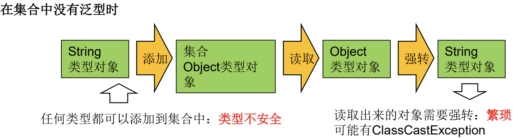
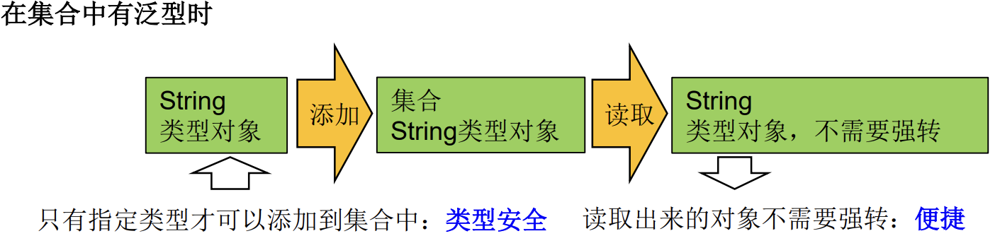

# 泛型简述

- 泛型：允许在定义类、接口时通过一个标识表示类中某个属性的类型或者是某个方法的返回值及参数类型。类型参数在使用时确定（即传入实际的类型参数，也称为类型实参）。

**泛型作用**

1. 解决元素存储的安全性问题
2. 解决获取数据元素时，需要类型强制转换的问题

- 泛型可以保证如果程序在编译时没有发出警告，运行时就不会产生`ClassCastException`异常。代码更加简洁、健壮。

   

   

```java
Collection<Employee> treeSet = new TreeSet<Employee>(new Comparator<Employee>() {
    @Override
    public int compare(Employee e1, Employee e2) {
        return e1.getBirthday().getYear() - e2.getBirthday().getYear();
    }
});
```

# 自定义泛型

- 泛型类、泛型接口、泛型方法

1. 泛型的声明
   - `interface List<T> 和 class GenTest<K,V> ` 
     - 其中，T,K,V不代表值，而是表示类型。任意字母都可以。常用T表示，是Type的缩写。
2. 泛型的实例化：
   - 一定要在类名后面指定类型参数的值（类型）。如：
   - `List<String> strList = new ArrayList<String>();`
   - `Iterator<Customer> iterator = customers.iterator();`

## 泛型类/接口

1. 泛型中的类型必须是类。需要基本数据类型时：使用其包装类。
2. 实例化时：
   - 没有指明泛型的类型：则默认类型为java.lang.Object类型，且编译不检查类型。
   - 指明泛型的类型：编译时检查类型，内部结构使用到泛型的位置，都指定为指明的泛型类型。

- 类型推断：可以只写一部分的`<>`泛型指明：`Map<String,Integer> map = new HashMap<>();`

1. 泛型类可能有多个参数，此时应将多个参数一起放在尖括号内：`<E1,E2,E3>`。
2. 实例化后，操作原来泛型位置的结构必须与指定的泛型类型一致。
3. 泛型不同的引用不能相互赋值。尽管在编译时`ArrayList<String>和ArrayList<Integer>`是两种类型，但是，在运行时只有一个ArrayList被加载到JVM中。
4. 如果泛型结构是一个接口或抽象类，则不可创建泛型类的对象。
5. 在类/接口上声明的泛型，在本类或本接口中即代表某种类型，可以作为非静态属性的类型、非静态方法的参数类型、非静态方法的返回值类型，但在静态方法中不能使用类的泛型。
6. 异常类不能是泛型的。
7. 不能使用`E[] arr = new E[]`，可以：`E[] arr = (E[])new Object[10];`
   - ArrayList源码中声明：`Object[] elementData`，而非泛型参数类型数组。

```java
public class Order<T> {
    private String orderName;
    private int orderId;

    //类的内部结构就可以使用类的泛型
    T orderT;

    //泛型类的构造器不是：public GenericClass<E>(){}
    public Order() {

    }

    public Order(String orderName, int orderId, T orderT) {
        this.orderName = orderName;
        this.orderId = orderId;
        this.orderT = orderT;
    }

    public T getOrderT() {
        return orderT;
    }

    public void setOrderT(T orderT) {
        this.orderT = orderT;
    }
}
```


```java
public void test3(){
    ArrayList<String> list1 = null;
    ArrayList<Integer> list2 = null;

    //泛型不同的引用不能相赋值
    //list1 = list2;
}
```

```java
class GenericTest {
    public static void main(String[] args) {
    // 1、使用时：类似于Object，不等同于Object
        ArrayList list = new ArrayList();
    // list.add(new Date());//有风险
        list.add("hello");
        test(list);// 泛型擦除，编译不会类型检查
    // ArrayList<Object> list2 = new ArrayList<Object>();
    // test(list2);//一旦指定Object，编译会类型检查，必须按照Object处理
    }
    public static void test(ArrayList<String> list) {
        String str = "";
        for (String s : list) {
            str += s + ",";
        }
        System.out.println("元素:" + str);
    }
}
```

## 泛型方法

- 泛型方法：普通类/泛型类中的方法都可以被泛型化。在方法中出现泛型结构，泛型的参数与类的泛型参数没有任何关系。
- 泛型方法可以被static修饰：此时，在方法调用时指明泛型，并非实例化时。
- 不能在静态方法中使用类的泛型：类的泛型是在实例化的时候指明的，而静态方法在类中实现。

```java
[访问权限] <泛型> 返回类型 方法名([泛型标识 参数名称]) 抛出的异常
```

```java
public class Order{
    public static <E> List<E> copyFormArrayToList(E[] arr) {
        ArrayList<E> list = new ArrayList<>();

        for (E e : arr) {
            list.add(e);
        }
        return list;
    }
    //List<Integer> list = order.copyFormArrayToList(arr);
    
    //静态方法中不能使用类的泛型
    //public static void show(T orderT){
    //    System.out.println(orderT);
    //}
}
```

# 泛型继承

- 当父类有泛型时，子类除了指定或保留父类的泛型，还可以增加泛型。

| 是否保留                     | 方式                                                        |
| ---------------------------- | ----------------------------------------------------------- |
| 子类不保留父类的泛型         | 按需实现，继承时指明父类的泛型<br>没有类型（擦除）-->Object |
| 子类保留父类的泛型：泛型子类 | 全部保留<br />部分保留                                      |

```java
class Father<T1, T2> {
}

//子类不保留父类的泛型

// 1)没有类型 擦除
//  等价于class Son extends Father<Object,Object>{
class Son1 extends Father {
}
// 2)指明具体类型
//  子类在继承带泛型的父类时：如果指明了泛型类型，则实例化子类对象时，不再需要指明泛型
class Son2 extends Father<Integer, String> {
}

//子类保留父类的泛型

// 1)全部保留
class Son3<T1, T2> extends Father<T1, T2> {
}
// 2)部分保留
class Son4<T2> extends Father<Integer, T2> {
}
```

# `<?>` 通配符

## ? 指定上/下限

| 限制条件       | 描述        | 说明                                                         |
| -------------- | ----------- | ------------------------------------------------------------ |
| `? extends 类` | 上限extends | 指定的类型必须是(该类的子类)继承某个类，或者实现某个接口<br /><= |
| `? super 类`   | 下限super   | 指定的类型（该类的父类）不能小于操作的类<br />>=             |

| 操作 | 对于带有`<?>`的说明                                     |
| ---- | ------------------------------------------------------- |
| 添加 | 除了添加null之外，对于`List<?>`就不能向其内部添加数据。 |
| 读取 | 允许读取数据，读取的数据类型为Object                    |

```java
@Test
public void test7() {
    List<? extends Person> list1 = null;
    List<? super Person> list2 = null;

    List<Student> list3 = new ArrayList<Student>();
    List<Person> list4 = new ArrayList<Person>();
    List<Object> list5 = new ArrayList<Object>();

    list1 = list3;
    list1= list4;
    //list1 = list5; ? extends Person 需要小于等于Person

    //list2 = list3; ? super Person 需要大于等于Person
    list2 = list4;
    list2 = list5;

    //读取数据
    Person p1 = list1.get(0);
    //Student s1 = list1.get(0); //编译不通过
    Object o2 = list2.get(0);
    //Person p2 = list2.get(0); //编译不通过

    //写入数据
    //list1.add(new Person()); 编译不通过
    //list1.add(new Student()); 编译不通过
    list2.add(new Person());
    list2.add(new Student());
}
```

## `<?>`和继承的比较

- `<?>`允许所有泛型的引用调用。

- 如果类A是类B的父类：

  - `G<A>和G<B>`：不具备子父类关系，编译不通过。`G<?>`是`G<A>`和`G<B>`的公共父类。
    - 这里的A、B是对G中的泛型的指明。

  - `A<G>和B<G>`：具备子父类关系。
    - 这里的A、B是类，而G是对A、B中的泛型的指明。

```java
public void test5() {
    Object obj = null;
    String str = null;
    obj = str;

    Object[] objects = null;
    String[] strings = null;;
    objects = strings;

    //此时的list1和list2不具备子父类关系，是并列的。
    List<Object> list1 = null;
    List<String> list2 = null;
    //list1 = list2;

    GenericTest1 test = new GenericTest1();
    test.show(list1);
    //show(List<Object> list) 参数也不能是是list2
    //test.show(list2);
    test.show1(list2);

    //此时的list01和list02具备子父类关系
    List<String> list01 = null;
    ArrayList<String> list02 = null;
    list01 = list02;
}

public void show(List<Object> list){}
public void show1(List list){}
```

# 泛型嵌套

- 泛型之间是可以嵌套使用的。
