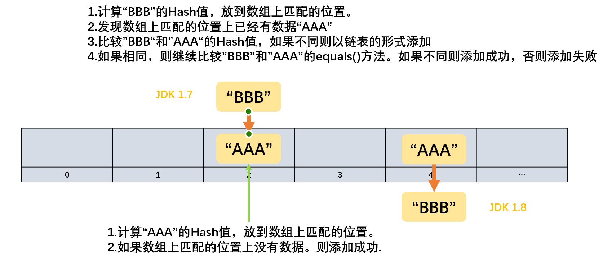
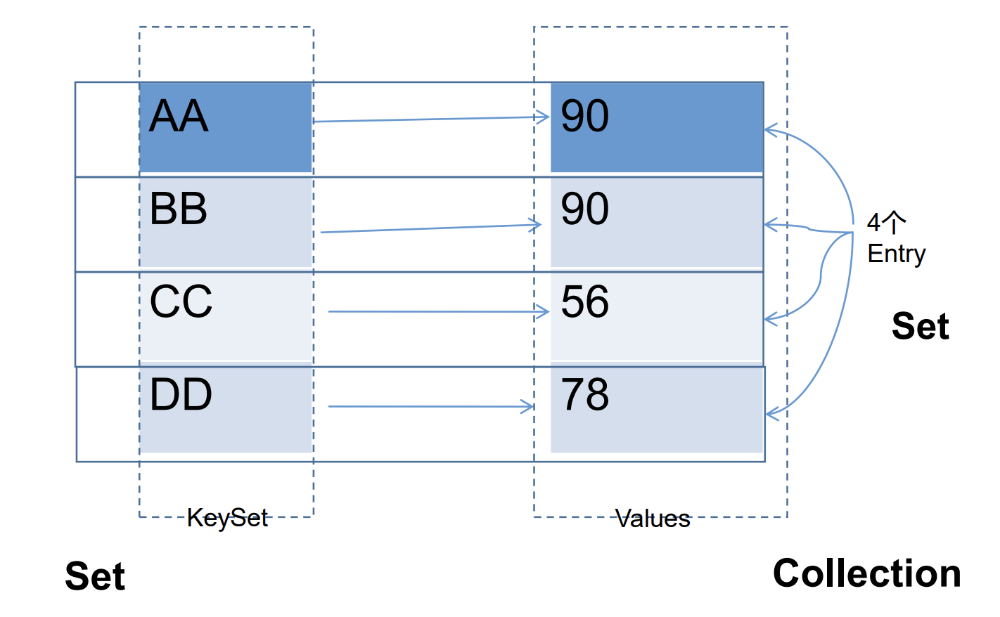
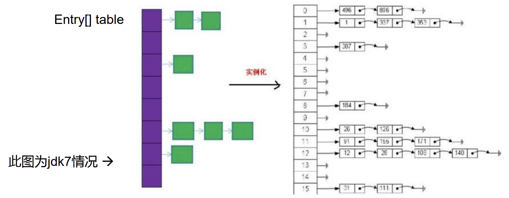

# 集合简述

## 数组的局限性

- Java容器：集合和数组都是对多个数据进行内存层面的存储操作。

**数组存储特点**

1. 数组一旦初始化以后，其 长度、元素的数据类型 不可改变。
2. 数组提供的方法非常有限，对于添加，删除，插入数据等操作，非常不便，同时效率不高。
3. 数组存储 有序、可重复 的数据。数组无法满足 无序、不可重复 的数据需求。

## 集合体系

| Collection接口                              | 单列数据，定义了存取一组对象(一个一个的对象)的方法的集合 |
| ------------------------------------------- | -------------------------------------------------------- |
| List接口<br>ArrayList / LinkedList / Vector | 元素有序，可重复的集合  -->“动态数组”                    |
| Set接口<br>HashSet / LinkedSet / TreeSet    | 元素无序，不可重复的集合 --> 类型于数学中的”集合“        |

  

| Map接口                                                    | 双列数据，保存具有映射关系"key-value"键值对(一对一对的数据)的集合 |
| ---------------------------------------------------------- | ------------------------------------------------------------ |
| HashMap / LinkedHashMap / TreeMap / Hashtable / Properties | 一个key只能对应一个value，而一个value可以对应多个key         |

    

# Collection接口

| 动作                 | 方法                               | 说明                                                         |
| -------------------- | ---------------------------------- | ------------------------------------------------------------ |
| 添加                 | add(Object obj)                    | 将元素e添加到集合中                                          |
|                      | addAll(Collection coll)            | 将coll集合中的元素添加到当前的集合中                         |
| 获取有效元素的个数   | int size()                         |                                                              |
| 清空集合             | void clear()                       |                                                              |
| 是否是空集合         | boolean isEmpty()                  |                                                              |
| 是否包含某个元素     | boolean contains(Object obj)       | 通过元素的equals()方法来判断是否是同一个对象<br> 向Collection接口的实现类中添加数据obj时，要求obj所在类要重写equals()方法，用来判断 |
|                      | boolean containsAll(Collection c)  | 调用元素的equals()方法来比较的。拿两个集合的元素挨个比较     |
| 删除                 | boolean remove(Object obj)         | 通过元素的equals方法判断是否是要删除的那个元素。<br>只会删除找到的第一个元素 |
|                      | boolean removeAll(Collection coll) | 取当前集合的差集                                             |
| 交集                 | boolean retainAll(Collection c)    | 把交集的结果存在当前集合中，不影响c集合<br>从当前集合中返回coll中匹配的元素,并将当前集合改为交集 |
| 集合是否相等         | boolean equals(Object obj)         | 调用元素内的equals()方法一一进行比较<br>如果是ArrayList() 则还要求有序 |
| 转成对象数组         | Object[] toArray()                 | 集合-->数组<br>数组-->集合 调用Arrays类静态方法 aslist()     |
| 获取集合对象的哈希值 | hashCode()                         |                                                              |
| 遍历                 | iterator()                         | 返回迭代器对象，用于集合遍历 <br>返回Iterator接口的实例 用于遍历元素，放在Iterator.Test.java中 |

```java
public class CollectionTest {

    @Test
    public void test1() {
        Collection coll = new ArrayList();
        // add() 添加
        coll.add(123);
        coll.add("Jack");
        coll.add(false);
        coll.add(new String("Tom"));
        coll.add(new Person("Mac", 20));

        Collection coll1 = new ArrayList();
        // addAll(Collection coll) 添加coll集合中的所有元素
        coll1.addAll(coll);
        System.out.println(coll); // [123, Jack, false, Tom, com.zjk.Person@76ed1b7c]
        // 调用了String中的toString()方法
        // Person中为重写toString()方法

        coll1.clear();

        // isEmpty() 判断当前集合是否为空
        coll1.isEmpty();

        // contains(Object obj) 判断当前集合中是否包含obj
        // 在判断时，会调用obj对象所在类的equals()方法
        boolean contains = coll.contains(123);
        System.out.println(contains); // true
        System.out.println(coll.contains(new String("Tom"))); // true
        // 调用String重写的equals()方法
        System.out.println(coll.contains(new Person("Mac", 20))); // false
        // Person类中未重写equals()方法

        // containsAll(Collection coll) 判断形参coll中的所有元素是否都存在于当前集合中
        Collection coll2 = new ArrayList();
        coll2.add(123);

        System.out.println(coll.containsAll(coll2)); //true

        //remove(Object obj) 移除
        coll.remove(123);
        System.out.println(coll.remove(new String("Tom"))); //true
        //调用了equals()方法
        System.out.println(coll.remove(new Person("Mac", 20))); //false
        //Person类中未重写equals()方法，所以无法匹配来删除
        System.out.println(coll); //[Jack, false, com.zjk.java2.Person@75bd9247]

        //removeAll(Collection coll) 从当前集合中移除coll中的所有元素
        coll.removeAll(coll2);
        System.out.println(coll); //[Jack, false, com.zjk.java2.Person@75bd9247]

        coll1.add(new Person("Mac", 20));
        //retainAll(Collection coll) （交集）从当前集合中返回coll中匹配的元素,并将当前集合改为交集。
        //调用equals()方法来匹配
        System.out.println(coll); //[Jack, false, com.zjk.java2.Person@75bd9247]
        System.out.println(coll1); //[com.zjk.java2.Person@7d417077]
        coll.retainAll(coll1);
        System.out.println(coll); //[]

        Collection coll3 = new ArrayList();
        coll3.add(new String("Tom"));
        coll3.add(new Person("Mac", 20));
        Collection coll4 = new ArrayList();
        coll4.add(new String("Tom"));
        coll4.add(new Person("Mac", 20));

        //equals(Object obj)
        System.out.println(coll3.equals(coll4)); //false
        //调用元素内的equals()方法一一进行比较
        //且如果是ArrayList() 则还要求有序

        //hashCode()
        System.out.println(coll.hashCode()); //1

        //toArray() 集合-->数组
        Object[] arr = coll3.toArray();
        for (int i = 0; i < arr.length; i++) {
            System.out.println(arr[i]);
        }

        //数组-->集合 调用Arrays类静态方法 aslist()
        List<Object> list = Arrays.asList(arr);
        System.out.println(list);//[Tom, com.zjk.java2.Person@7dc36524]

        List<int[]> ints = Arrays.asList(new int[]{123, 456});
        System.out.println(ints);//[[I@35bbe5e8] 只有一个元素

        List ints1 = Arrays.asList(new Integer[]{123, 456});
        System.out.println(ints1);//[123, 456]  包装类

        List ints2 = Arrays.asList(123, 456);
        System.out.println(ints2); //[123, 456]

        //iterator() 返回Iterator接口的实例 用于遍历元素，放在Iterator.Test.java中
    }
}
```

## Iterator迭代器接口

- Iterator对象称为迭代器(设计模式)，主要用于遍历 Collection 集合中的元素。
- 迭代器模式：GOF给迭代器模式的定义为：提供一种方法访问一个容器(container)对象中各个元素，而又不需暴露该对象的内部细节。
- Collection接口继承了`java.lang.Iterable`接口，该接口有一个iterator()方法，
  - 所有实现了Collection接口的集合类都有一个iterator()方法，用以返回一个实现了Iterator接口的对象。
- Iterator 仅用于遍历集合，Iterator 本身并不提供承装对象的能力。
  - 如果需要创建Iterator 对象，则必须有一个被迭代的集合。
- 集合对象每次调用iterator()方法都得到一个全新的迭代器对象，
  - 默认游标都在集合的第一个元素之前。

**Iterator方法**

   

   

### 遍历集合

- hasNext()和next()搭配使用
- 在调用it.next()方法之前必须要调用it.hasNext()进行检测。
  - 若不调用，且下一条记录无效，直接调用it.next()会抛出NoSuchElementException异常。

```java
public void test1() {
    Collection coll = new ArrayList();
    coll.add(123);
    coll.add("Jack");
    coll.add(false);
    coll.add(new String("Tom"));
    coll.add(new Person("Mac", 20));
    
    //iterator
    Iterator iterator = coll.iterator();
    while(iterator.hasNext()){
        System.out.println(iterator.next());
    }
    
    //forEach()
    coll.forEach(System.out::println);
}
```

**执行原理**

```java
//提通过Collection接口的iterator()方法创建Iterator对象
Iterator iterator = coll.iterator();
//hasNext():判断是否还有下一个元素
while(iterator.hasNext()){
    //next():①指针下移 ②将下移以后集合位置上的元素返回
    System.out.println(iterator.next());
}
```

```java
//错误1 it.next() 报错NoSuchElementException
Iterator iterator = coll.iterator();
Object obj;
while((obj = iterator.next()) != null){
    System.out.println(obj);
}

//错误2：每次通过coll.iterator()方法创建的Iterator对象都是新的对象
//跳不出循环
while((coll.iterator().next()).hasNext){
    System.out.println(obj);
}
```

### remove()

- Iterator可以删除集合的元素，但是是遍历过程中通过 迭代器对象 的remove方法，不是集合对象的remove方法。
- 在没有使用next()切换时，不能连续remove()同一个位置的 ：如果还未调用next()或在上一次调用 next 方法之后已经调用了 remove 方法，再调用remove都会报IllegalStateException。

```java
@Test
public void test2(){
    Collection coll = new ArrayList();
    coll.add(123);
    coll.add("Yo");

    Iterator iterator = coll.iterator();
    while(iterator.hasNext()){
        Object obj = iterator.next();
        if("Yo".equals(obj)){
            iterator.remove();
            //iterator.remove(); //报错 在没有使用next()切换时，不能连续remove()同一个位置的 
        }
    }

    //错误；使用同一个Iterator对象，此时游标还在上次调用.next()的位置
    //while(iterator.hasNext()){
    //    System.out.println(iterator.next());
    //}

    Iterator iterator1 = coll.iterator();
    while(iterator1.hasNext()){
        System.out.println(iterator1.next());
    }

}
```

###  foreach 循环遍历集合元素

- foreach 循环迭代访问 Collection和数组。
- 遍历操作不需获取Collection或数组的长度，无需使用索引访问元素，底层调用Iterator完成操作。

```java
for(要遍历的集合/数组的元素的类型 在循环中使用的元素名称 : 要遍历的集合/数组){
    ...
}
```

## List接口

- List集合类中存储有序的，可重复的数据，集合中的每个元素都有其对应的顺序索引。
- ArrayList / LinkedList / Vector：都实现了List接口。

| List实现类 | 说明                                                         |
| ---------- | ------------------------------------------------------------ |
| ArrayList  | 作为List接口的主要实现类<br>线程不安全，效率高<br>底层使用Object[] elementData存储 |
| LinkedList | 对于频繁的插入和删除操作，使用此类比ArrayList效率高 <br>底层使用双向链表存储 |
| Vector     | 作为List接口的古老实现类<br />线程安全，效率低 <br />底层使用Object[] elementData存储 |

- `void add(int index, Object ele)`:在index位置插入ele元素
- `boolean addAll(int index, Collection eles)`:从index位置开始将eles中的所有元素添加进来
- `Object get(int index)`:获取指定index位置的元素
- `int indexOf(Object obj)`:返回obj在集合中首次出现的位置，没有则返回-1
- `int lastIndexOf(Object obj)`:返回obj在当前集合中末次出现的位置
- `Object remove(int index)`:移除指定index位置的元素，并返回此元素
- `Object set(int index, Object ele)`:设置指定index位置的元素为ele，并返回此(原先的)元素
- `List subList(int fromIndex, int toIndex)`:返回从fromIndex到toIndex(不包括toIndex)位置的子集合

**常用方法**

- 增 add(int index, Object obj)
- 插 add(int index Object obj)
- 删 remove(int index) /remove(Object obj) Collection接口内的
- 改 set(int index, Object obj)
- 查 get(int index)
- 长度 size()
- 遍历 
  1. Iterator迭代器
  2. foreach
  3. for


```java
package com.zjk.java2;

import org.junit.Test;

import java.util.ArrayList;
import java.util.Arrays;
import java.util.Iterator;
import java.util.List;

public class ListTest {
    @Test
    public void test1() {
        ArrayList list = new ArrayList();
        list.add(123);
        list.add(456);
        list.add("Tom");
        list.add(new Person("Mac", 20));

        System.out.println(list); //[123, 456, Tom, com.zjk.java2.Person@75bd9247]

        //void add(int index Object ele) 在index位置插入ele元素
        list.add(1, "BB");
        System.out.println(list); //[123, BB, 456, Tom, com.zjk.java2.Person@75bd9247]

        //boolean addAll(int index,Collection eles) 从index位置开始将eles中的所有元素依序添加到当前的list
        System.out.println(list.size()); //5
        List list1 = Arrays.asList(1, 2, 3);
        list.addAll(list1);
        System.out.println(list.size()); //8

        //Object get(int index) 从index位置获取元素
        System.out.println(list.get(2)); //456

        //int indexOf(Object obj) 返回obj在集合中首次出现的位置, 没有则返回-1
        int index = list.indexOf(456);
        System.out.println(index); //2

        //int lastIndexOf(Object obj) 返回obj在集合中最后出现的位置，没有则返回-1
        int lastIndex = list.lastIndexOf(456);
        System.out.println(lastIndex); //2

        //Object remove(int index) 移除指定index位置的元素，并返回此元素
        Object obj = list.remove(2);
        System.out.println(obj); //456

        //Object set(int index,Object obj) 设置指定index位置的元素为ele,并返回此(原先的)元素
        System.out.println(list.set(2, "Test"));

        //List subList(int fromIndex, int toIndex) 返回从fromIndex到toIndex(不包括toIndex)位置的子集合
        List list2 = list.subList(1, 3);
        System.out.println(list2); //[BB, Test]
    }

    @Test
    public void test2() {
        ArrayList list = new ArrayList();
        list.add(123);
        list.add(456);
        list.add("Tom");

        //方式1 Iterator迭代器
        Iterator iterator = list.iterator();
        while (iterator.hasNext()) {
            System.out.println(iterator.next());
        }

        //方式2 foreach
        for (Object obj : list) {
            System.out.println(obj);
        }

        //方式3 for
        for (int i = 0; i < list.size(); i++) {
            System.out.println(list.get(i));
        }
       
        //方式4 forEach()
        list.forEach(System.out::println);
    }
}
```

### ArrayList

```java
public class ArrayList<E> extends AbstractList<E>
    implements List<E>, RandomAccess, Cloneable, java.io.Serializable
{
    
    private static final int DEFAULT_CAPACITY = 10;//ArrayList数组的初始长度
    private static final Object[] EMPTY_ELEMENTDATA = {};
    private static final Object[] DEFAULTCAPACITY_EMPTY_ELEMENTDATA = {};
    transient Object[] elementData;
    
    public ArrayList(int initialCapacity) {
        if (initialCapacity > 0) {
            this.elementData = new Object[initialCapacity];
        } else if (initialCapacity == 0) {
            this.elementData = EMPTY_ELEMENTDATA;
        } else {
            throw new IllegalArgumentException("Illegal Capacity: "+
                                               initialCapacity);
        }
    }

    public ArrayList() {
        this.elementData = DEFAULTCAPACITY_EMPTY_ELEMENTDATA;
    }

    public ArrayList(Collection<? extends E> c) {
        Object[] a = c.toArray();
        if ((size = a.length) != 0) {
            if (c.getClass() == ArrayList.class) {
                elementData = a;
            } else {
                elementData = Arrays.copyOf(a, size, Object[].class);
            }
        } else {
            // replace with empty array.
            elementData = EMPTY_ELEMENTDATA;
        }
    }
}
```

- 当ArrayList.add()超过长度时：

```java
public void add(int index, E element) {
    rangeCheckForAdd(index);
    modCount++;
    final int s;
    Object[] elementData;
    if ((s = size) == (elementData = this.elementData).length)
        elementData = grow(); //增加ArrayList的长度：
    System.arraycopy(elementData, index,
                     elementData, index + 1,
                     s - index);
    elementData[index] = element;
    size = s + 1;
}

private Object[] grow(int minCapacity) {
    int oldCapacity = elementData.length;
    if (oldCapacity > 0 || elementData != DEFAULTCAPACITY_EMPTY_ELEMENTDATA) {
        int newCapacity = ArraysSupport.newLength(oldCapacity,
                                                  minCapacity - oldCapacity, 
                                                  oldCapacity >> 1 );
        return elementData = Arrays.copyOf(elementData, newCapacity);
    } else {
        return elementData = new Object[Math.max(DEFAULT_CAPACITY, minCapacity)];
    }
}
```

#### Arrays.asList()

- Arrays.asList() 返回的不是java.util下的ArrayList，而是Arrays的内部类，继承AbstractList类（List），但没有重写add()方法
- 因此，通过Arrays.asList()方法构造的List集合，尽量不要用add()等方法修改。

```java
public void test1(){
    List<Integer> list = Arrays.asList(1,2,3);
    //     list.add(new Integer(4));
    //抛出异常：Arrays.asList() 
    // 返回的不是java.util下的ArrayList，
    // 而是Arrays的内部类，继承AbstractList类（List），但没有重写add()方法
    //     System.out.println(list.contains(new Integer(4)));
}
```

#### sublist() 

1. 修改原集合元素的值，会影响子集合
2. 修改原集合的结构，会引起异常：ConcurrentModificationException
3. 修改子集合元素的值，会影响原集合
4. 修子集合的结构，会影响原集合

- subList()返回的是ArrayList的内部类SubList（是ArraysList的一个视图），而不是ArrayList。对于SubList子列表的所有操作最终会反映到原列表上。
- 在subList()中，对父集合元素的增加或删除，均会导致子列表的遍历、增加、删除产生ConcurrentModificationException异常。
  - 对子集合调用的remove()，此时删除的是对应于该子集合的下标位置的元素。且只能是子集合中包含的元素。

```java
@Test
public void test2() {
    List<String> list = new ArrayList<String>();
    list.add("一号");
    list.add("二号");
    list.add("三号");

    //subList() 获取子列表
    List<String> subList = list.subList(1, 3); //["二号","三号"]

    //对原集合元素的修改
    list.set(2, "三号-修改");
    //对原集合的修改影响子集合
    System.out.println(subList); //[二号, 三号-修改]

    //修改原集合的结构
    //list.add("四号");
    //在原集合结构修改后，子集合的遍历、增加、删除出现异常.
    //遍历子集合时，出现异常java.util.ConcurrentModificationException
    //System.out.println(subList);
    //subList.add("五号");
    //subList.remove(3);

    //子集合元素的修改、结构的改变（增加、删除），影响父集合。
    subList.set(1, "二号-sub修改");
    System.out.println(list); //[一号, 二号, 二号-sub修改]
    subList.add("五号");
    System.out.println(list); //[一号, 二号, 二号-sub修改, 五号]
    //此时删除的是对应于该子集合的下标位置的元素。
    subList.remove(1); 
    System.out.println(list); //[一号, 二号, 五号]
}
```

#### remove() ， Collection接口和ArrayList接口

```java
@Test
public void testListRemove() {
    List list = new ArrayList();
    list.add(1);
    list.add(2);
    list.add(3);
    updateList(list);
    System.out.println(list);//[1,2]
}

private static void updateList(List list) {
    list.remove(2);  //视为索引2 而不是数据2
    //list.remove(new Integer(2)); //删除数据2
}
```

### LinkedList

- 对于频繁的插入或删除元素的操作，建议使用LinkedList类，效率较高
- LinkedList：双向链表，内部没有声明数组，
  - 而是定义了`Node类型的first和last`，用于记录首末元素。
    - `LinkedList list = new LinkedList(); `//内部声明了Node类型的first和last属性，默认值为null
  - 同时，定义`内部类Node`，作为LinkedList中保存数据的基本结构。
    - `list.add(123);` //将123封装带Node中，创建了Node对象。

```java
//Node：体现了LinkedList的双向链表
private static class Node<E> {
    E item;
    Node<E> next; //记录下一个元素的位置
    Node<E> prev; //记录前一个元素的位置

    Node(Node<E> prev, E element, Node<E> next) {
        this.item = element;
        this.next = next;
        this.prev = prev;
    }
}
```

### Vector

- 通过Vector()构造器创建对象时，底层创建长度为10的数组.
- 扩容默认2倍

## Set接口

- 存储无序，不可重复的数据。
- Set接口是Collection的子接口，Set接口没有提供额外的方法，使用的都是Collect接口中的方法。
- Set 集合不允许包含相同的元素，如果试把两个相同的元素加入同一个Set 集合中，则添加操作失败。
- Set 判断两个对象是否相同不是使用 == 运算符，而是根据 equals() 方法。

| Set实现类 | 说明                                                         |
| --------- | ------------------------------------------------------------ |
| HashSet   | 作为Set接口的主要实现类，线程不安全的，可以存储null值<br>LinkedHashSet：作为HashSet的子类；遍历其内部数据时，可以安装添加的顺序遍历 |
| TreeSet   | 可以按照添加对象的指定属性，进行排序                         |

**Set存储无序，不可重复的数据**

以HashSet为例：

- 无序性
  - 不等于随机性  遍历的顺序仍然是添加的顺序
  - 存储的数组在底层数组并非按照数组索引的顺序添加。
  - 而是根据数据的Hash值决定的。
- 不可重复性
  - 保证添加的元素按照equals()方法判断时，返回的不是true。相同的元素只能添加一次。

**添加元素的过程**

以HashSet为例

- 像hashSet中添加元素a，首先调用元素a所在类的hashCode()方法，计算元素a的哈希值，此哈希值接着通过某种算法计算出在hashSet底层数组中的存放位置（即为：索引位置），判断数组此位置上是否已经有元素。
- 如果此位置上没有其他元素，则元素a添加成功 --情况1
- 如果此位置上有其他元素b（或以链表形式存在的多个元素），则比较元素a于元素b的hash值
  - 如果hash值不相同，则元素a添加成功 --情况2
  - 如果hash值相同，进而需要调用元素a所在类的equals()方法
    - equals()返回true，元素a添加失败
    - equals()返回false，则元素a添加成功  --情况3
- 对于添加成功的情况2和情况3而言，元素a，与已经存在指定索引位置上数据以链表的方式存储。
- HashSet底层：数组+链表
  - jdk 1.7 ：元素a放到数组中，指向原来的元素
  - jdk 1.8 ：原来的元素在数组中，指向元素a
       
       


```java
public class SetTest {
    @Test
    public void test1(){
        Set set = new HashSet();
        set.add(456);
        set.add(123);
        set.add("AA");
        set.add("BB");
        set.add(new Person("Mac",21));
        set.add(new String("CC"));
        System.out.println(set); //[AA, BB, CC, 456, com.zjk.java2.Person@75bd9247, 123]

        //不可重复性
        set.add(123);
        System.out.println(set); //[AA, BB, CC, 456, com.zjk.java2.Person@75bd9247, 123]
        //调用equals()方法比较,需要用到hashCode()方法，Integer 123发现相同，所以不添加
        set.add(new Person("Mac",21));
        System.out.println(set);//[AA, BB, CC, com.zjk.java2.Person@7d417077, 456, com.zjk.java2.Person@75bd9247, 123]
        //Person类中未重写hashCode()方法和equals()方法,比较的还是地址，所以认为不一样

        Iterator iterator = set.iterator();
        while(iterator.hasNext()){
            System.out.println(iterator.next());
        } //遍历的顺序仍然是添加的顺序
    }
}
```

 

```java
//关于添加的数据被修改
public class SetTest {
    @Test
    public void test1() {
        HashSet hashSet = new HashSet();

        Person p1 = new Person("Mac", 21);
        Person p2 = new Person("Tom", 21);
        hashSet.add(p1);
        hashSet.add(p2);

        p1.setName("AA");
        //对应集合中的元素也改变,但是此时存放的位置还是按照原先p1("Mac",21)计算的哈希值存放的。
        hashSet.forEach(System.out::println);
        //Person{name='AA', age=21}
        //Person{name='Tom', age=21}

        hashSet.remove(p1);
        //此时remove()寻找的哈希值，是修改后的p1("AA",21)的哈希值，无法和集合中p1的哈希值匹配，
        // 故找不到，无法成功remove()
        hashSet.forEach(System.out::println);
        //Person{name='AA', age=21}
        //Person{name='Tom', age=21}

        Person p3 = new Person("AA",21);
        hashSet.add(p3);
        //同理，此时在集合中，存放("AA",21)计算的哈希值的位置实际上是空的，所以可以添加
        hashSet.forEach(System.out::println);
        //Person{name='AA', age=21}
        //Person{name='Tom', age=21}
        //Person{name='AA', age=21}
    }
}  
```

### hashCode()

- 向Set中添加的数据，其所在类一定要重写hashCode()和equals()
- 重写的hashCode()方法和equals()方法尽可能保持一致性。
  - 相等的对象必须具有相等的散列码 

**基本原则**

- 在程序运行时，同一个对象多次调用 hashCode() 方法应该返回相同的值。
- 当两个对象的 equals() 方法比较返回 true 时，这两个对象的 hashCode() 方法的返回值也应相等。
- 对象中用作 equals() 方法比较的 Field，都应该用来计算 hashCode 值。

**问题：为什么复写hashCode方法，有31这个数字？**

- 选择系数的时候要选择尽量大的系数。因为如果计算出来的hash地址越大，所谓的“冲突”就越少，查找起来效率也会提高。（减少冲突）
- 并且31只占用5bits,相乘造成数据溢出的概率较小。
- 31可以 由`i*31== (i<<5)-1`来表示,现在很多虚拟机里面都有做相关优化。（提高算法效率）
- 31是一个素数，素数作用就是如果我用一个数字来乘以这个素数，那么最终出来的结果只能被素数本身和被乘数还有1来整除！(减少冲突)

### HashSet

- HashSet 是 Set 接口的典型实现，大多数时候使用 Set 集合时都使用这个实现类。
- HashSet 按 Hash 算法来存储集合中的元素，因此具有很好的存取、查找、删除性能。

**HashSet 具有以下特点：**

- 不能保证元素的排列顺序
- HashSet 不是线程安全的
- 集合元素可以是 null
- HashSet 集合判断两个元素相等的标准：两个对象通过 hashCode() 方法比较相等，并且两个对象的 equals() 方法返回值也相等。
- 对于存放在Set容器中的对象，对应的类一定要重写equals()和hashCode(Object obj)方法，以实现对象相等规则。即：“相等的对象必须具有相等的散列码”。

### LinkedHashSet类

- LinkedHashSet作为HashSet的子类，在添加数据的同时，每个数据还维护了两个引用，记录此数据前一个数据和后一个数据。
- 对于频繁的遍历操作，LinkedHashSet效率高于HashSet

   

### TreeSet类

- 向TreeSet中添加的数据，要求是相同类的对象

   

**两种排序方式：自然排序 和 定制排序**

- 自然排序(实现Comparable接口)中，比较两个对象是否相同的标准为：compareTo()返回0，不再是equals()
  - 默认情况下，TreeSet 采用自然排序。
- 定制排序(实现Comparator接口)中，比较两个对象是否相同的标准为：compare()返回0，不再是equals()

```java
public class Test{
    @Test
    public void test2() {
        TreeSet set = new TreeSet();
        //TreeSet不能添加不同类的对象
        set.add(456);
        set.add(123);
        set.add(-12);
        set.add(789);

        //按照集合中对象的大小遍历。 使用Comparable接口的compareTo()
        Iterator iterator = set.iterator();
        while (iterator.hasNext()) {
            System.out.println(iterator.next());
        }

        TreeSet set1 = new TreeSet();
        set1.add(new Person("Tom", 22));
        set1.add(new Person("Jck", 23));
        set1.add(new Person("Mac", 21));
//        set1.add(new Person("Mac",22)); //Person中只写了name的比较
//        TreeSet中判断是否相同使用的是compareTo()，而不是equals()

        Iterator iterator1 = set1.iterator();
        while (iterator1.hasNext()) {
            System.out.println(iterator1.next());
        }
    }

    @Test
    public void test3() {
        Comparator comparator = new Comparator() {
            @Override
            public int compare(Object o1, Object o2) {
                if (o1 instanceof Person && o2 instanceof Person) {
                    Person p1 = (Person) o1;
                    Person p2 = (Person) o2;

                    if (p1.getName().compareTo(p2.getName()) == 0) {
                        return Integer.compare(p1.getAge(), p2.getAge());
                    }

                    return p1.getName().compareTo(p2.getName());
                } else {
                    throw new RuntimeException("数据类型不一致");
                }
            }
        }; 

        //使用定制排序
        TreeSet set = new TreeSet(comparator); 
        //此时使用的是comparator对象中的compare()方法来比较是否相同，而不是Person类中的实现Comparable接口的compareTo();
        set.add(new Person("Tom", 22));
        set.add(new Person("Jck", 23));
        set.add(new Person("Mac", 21));
        set.add(new Person("Mac", 24));

        Iterator iterator = set.iterator();
        while(iterator.hasNext()){
            System.out.println(iterator.next());
        }
    }
}
```

# Map接口

## Map简述

### Map体系

   

-  Map接口的常用实现类：HashMap、TreeMap、LinkedHashMap和Properties。

### Map结构

#### Map实现类

**Map ： 双列数据，存储key-value对的数据**

- HashMap 作为Map的主要实现类 线程不安全，效率高 可以存储null的key和value
  - HashMap的底层实现：
    - jdk1.7之前 : 数组+链表 
    - jdk1.8 : 数组+链表+红黑树   
  - LinkedMap 保证在遍历map元素时，可以按照添加的顺序实现遍历，对于频繁的遍历操作 ，此类执行效率高于HashMap
    - 在原有的HashMap底层结构基础上，添加了一对指针，指向前一个和后一个元素。
- TreeMap 保证按照添加的key-value进行排序，实现排序遍历。此时考虑key的自然排序或定制排序。
  - 底层使用红黑树。 
- Hashtable 作为古老的实现类 线程安全，效率低 不能存储null的key和value
  - Properties 常用来处理配置文件，key和value都是String类型。

#### k,v 键值对Entry

- Map与Collection并列存在。用于保存具有映射关系的数据:key-value
  - Map 中的 key 和 value 都可以是任何引用类型的数据
  - Map 中的 key 用Set来存放，不允许重复，即同一个 Map 对象所对应的类，须重写hashCode()和equals()方法
  - 常用String类作为Map的“键”
- key 和 value 之间存在单向一对一关系，即通过指定的 key 总能找到唯一的、确定的 value

   

- Map中的key：无序的，不可重复的，使用Set存储所有的key 
  - key所在的类要重写equals()和hashCode()
- Map中的value：无序的，可重复的，使用Collection存储所有的value
  - value所在的类要重写equals()
- 一个键值对：key-value构成了一个Entry对象。
- Map中的entry：无序的，不可重复的，使用Set存储所有的entry

### Map方法

**添加、删除、修改操作：**

- `Object put(Object key,Object value)`：将指定key-value添加到(或修改)当前map对象中
- `void putAll(Map m)`:将m中的所有key-value对存放到当前map中
- `Object remove(Object key)`：移除指定key的key-value对，并返回value
- `void clear()`：清空当前map中的所有数据

**元素查询的操作：**

- `Object get(Object key)`：获取指定key对应的value
- `boolean containsKey(Object key)`：是否包含指定的key
- `boolean containsValue(Object value)`：是否包含指定的value
- `int size()`：返回map中key-value对的个数
- `boolean isEmpty()`：判断当前map是否为空
- `boolean equals(Object obj)`：判断当前map和参数对象obj是否相等

**元视图操作的方法：**

- `Set keySet()`：返回所有key构成的Set集合
- `Collection values()`：返回所有value构成的Collection集合
- `Set entrySet()`：返回所有key-value对构成的Set集合

```java
public class LinkedHashMapTest {
    @Test
    public void test1() {
        Map map = new HashMap();

        //put() 添加
        map.put("AA", 123);
        map.put("BB", 456);
        map.put("CC", 789);
        //修改 使用key替换原有的value
        map.put("AA", 999);

        System.out.println(map);//{123=AA, 456=BB, 789=CC}

        Map map1 = new HashMap();
        //putAll()
        map1.putAll(map);
        System.out.println(map);

        //remove() 按照指定的key来移除 返回移除的value值
        System.out.println(map1.remove("AA"));//999
        System.out.println(map1.remove("EE"));//null
        System.out.println(map1);//{BB=456, CC=789}

        //clear() 清空
        map1.clear(); //不等于：map = null
        System.out.println(map1);//{}
        System.out.println(map1.size());//0
    }

    @Test
    public void test2(){
        Map map = new HashMap();
        map.put("AA", 123);
        map.put("BB", 456);
        map.put("CC", 789);
        map.put(12,711);

        //get() 根据key来获取value
        System.out.println(map.get(12)); //711

        //containsKey() 是否包含指定的key
        boolean isExit = map.containsKey("AA");
        System.out.println(isExit);//true

        //containsValue() 是否包含指定的value
        boolean isExit1 = map.containsValue(456);
        System.out.println(isExit1);//true

        //size() 获取Map中键值对的个数
        System.out.println(map.size()); //4

        //isEmpty() 是否为空
        System.out.println(map.isEmpty()); //false

        //equals() 判断map和某个对象是否相等
    }

    @Test
    public void test3(){
        Map map = new HashMap();
        map.put("AA", 123);
        map.put("BB", 456);
        map.put("CC", 789);

        //keySet() 获取所有的key类
        Set set = map.keySet();
        Iterator iterator = set.iterator();
        while(iterator.hasNext()){
            System.out.println(iterator.next());
        }

        //values() 获取所有的value类
        Collection collection = map.values();
        Iterator iterator1 = collection.iterator();
        while(iterator1.hasNext()){
            System.out.println(iterator1.next());
        }

        //entrySet() 遍历所有的key-value
        //方式1
        Set entrySet = map.entrySet();
        Iterator iterator2 = entrySet.iterator();
        while(iterator2.hasNext()){
            Object obj;
            System.out.println(obj = iterator2.next()); //key=value

            //entrySet集合中的元素都是Entry
            Map.Entry entry = (Map.Entry) obj;
            System.out.println(entry.getKey() + "=" + entry.getValue());
        }

        //方式2
        Set keySet = map.keySet();
        Iterator iterator3 = keySet.iterator();
        while(iterator3.hasNext()){
            Object key = iterator3.next();
            Object value = map.get(key);

            System.out.println(key + "=" + value);
        }
    }
}
```

## HashMap

### HashMap的属性

| 属性                       | 说明                                                         |
| :------------------------- | :----------------------------------------------------------- |
| `DEFAULT_INITIAL_CAPACITY` | HashMap的默认容量，16                                        |
| `MAXIMUM_CAPACITY`         | HashMap的最大支持容量，2^30                                  |
| `DEFAULT_LOAD_FACTOR`      | HashMap的默认加载因子(0.75)                                  |
| `TREEIFY_THRESHOLD`        | Bucket中链表长度大于该默认值，转化为红黑树(8)                |
| `UNTREEIFY_THRESHOLD`      | Bucket中红黑树存储的Node小于该默认值，转化为链表             |
| `MIN_TREEIFY_CAPACITY`     | 桶中的Node被树化时最小的hash表容量。<br>当桶中Node的数量大到需要变红黑树时，若hash表容量小于MIN_TREEIFY_CAPACITY时，此时应执行resize扩容操作这MIN_TREEIFY_CAPACITY的值至少是TREEIFY_THRESHOLD的4倍。 |
| `table`                    | 存储元素的数组，总是2的n次幂                                 |
| `entrySet`                 | 存储具体元素的集                                             |
| `size`                     | HashMap中存储的键值对的数量                                  |
| `modCount`                 | HashMap扩容和结构改变的次数。                                |
| `threshold`                | 扩容的临界值，= 容量`*`填充因子 (`16*0.75`)<br>提前扩容，为了减少链表的长度。 |
| `loadFactor`               | 填充因子                                                     |

**负载因子值的大小，对HashMap有什么影响**

- 负载因子的大小决定了HashMap的数据密度。
- 负载因子越大密度越大，发生碰撞的几率越高，数组中的链表越容易长,造成查询或插入时的比较次数增多，性能会下降。
- 负载因子越小，就越容易触发扩容，数据密度也越小，意味着发生碰撞的几率越小，数组中的链表也就越短，查询和插入时比较的次数也越小，性能会更高。但是会浪费一定的内容空间。而且经常扩容会影响性能，建议初始化预设大一点的空间。
- 按照其他语言的参考及研究经验，会考虑将负载因子设置为0.7~0.75，此时平均检索长度接近于常数

### HashMap的底层实现

**HashMap的底层实现原理 以jdk1.7为例**

- `HashMap map = new HashMap()`;
  - 在实例化以后，底层创建了长度是16的一维数组Entry[] table。
- ...假设之前可能已经执行过多次put...
- `map.put(key1,value1)`;
  - 首先，调用key1所在类的hashCode()计算key1的哈希值，此哈希值经过某种算法计算之后，得到Entry数组中的存放位置。
  - 如果此位置上的数据为空，此时的key1-value1添加成功   **情况1**
  - 如果此位置上的数据不为空，（意味着此位置上存在一个或多个数据（以链表形式存在）），比较key1和已经存在的一个或多个数据的哈希值：
    - 如果key1的哈希值与已经存在的数据的哈希值都不相同，此时key1-value1添加成功  **情况2**
    - 如果key1的哈希值和已经存在的某一个数据(key2-value2)的哈希值相同，继续比较：调用key1所在类的equals()，比较：
      - 如果equals()返回false：此时key1-value1添加成功  **情况3**
      - 如果equals()返回true：使用value1替换相同key的value值(value2)。 
- 关于情况2和情况3：此时key1-value1和原来的数据以链表的方式存储
- 在不断的添加过程中会涉及到扩容问题：
  - 当超过临界值threadshould（12）时，且要存放的位置非空时，扩容。
  - 默认的扩容方式：扩容为原来容量的2倍，并将原来的数据复制过来。

   

**HashMap的底层实现原理 jdk1.8相较与jdk1.7的不同**

- `new HashMap()`底层没有创建一个长度为16 的数组
- jdk1.8 底层的数组是 Node[]  而非Entry[];
- 首次调用put()方法时，底层创建长度为16的数组 
- jdk1.7的底层结构只有数组+链表；jdk1.8的底层结构：数组+链表+红黑树
  - jdk1.7新的元素指向旧的元素，jdk1.8旧的元素指向新的元素. 
  - 当数组的某一个索引位置上的元素以链表形式存在的数据个数 > 8 且当前数组的长度 > 64，此时，此索引位置上的所有数据改为使用红黑树存储。 

   

## LinkedHashMap

- 继承自HashMap，底层基本相同

- LinkedMap中定义内部类 Entry替换了HashMap中的Node

```java
static class Entry<K,V> extends HashMap.Node<K,V> {
    Entry<K,V> before, after;
    Entry(int hash, K key, V value, Node<K,V> next) {
        super(hash, key, value, next);
    }
}
```

## TreeMap

- TreeMap存储 Key-Value 对时，需要根据 key-value 对进行排序，保证所有的 Key-Value 对处于有序状态。
- TreeMap底层使用红黑树结构存储数据
- TreeMap要求所有的 Key 应该是同一个类的对象，否则将会抛出 ClasssCastException。

**TreeMap 的 Key 的排序：**


- 自然排序：TreeMap 的所有的 Key 必须实现 Comparable 接口
- 定制排序：创建 TreeMap 时，传入一个 Comparator 对象，该对象负责对TreeMap 中的所有 key 进行排序。
  - 此时不需要 Map 的 Key 实现Comparable 接口
- TreeMap判断两个key相等的标准：两个key通过compareTo()方法或者compare()方法返回0。

```java
public class TreeMapTest {
    @Test
    public void test1() {
        Person p1 = new Person("Tom", 21);
        Person p2 = new Person("Jac", 23);
        Person p3 = new Person("Mac", 19);

        TreeMap map = new TreeMap();

        map.put(p1, 99);
        map.put(p2, 98);
        map.put(p3, 100);

        //自然排序
        //Person类中重写了Comparable接口的compareTo()方法
        Set entrySet = map.entrySet();
        Iterator iterator = entrySet.iterator();
        while (iterator.hasNext())
            System.out.println(iterator.next());

        TreeMap treeMap = new TreeMap(new Comparator() {
            @Override
            public int compare(Object o1, Object o2) {
                if (o1 instanceof Person && o2 instanceof Person) {
                    Person p1 = (Person) o1;
                    Person p2 = (Person) o2;

                    return p1.getAge() - p2.getAge();
                }
                throw new RuntimeException("数据类型不一致");
            }
        });
        treeMap.putAll(map);


        Set entrySet1 = treeMap.entrySet();
        Iterator iterator1 = entrySet1.iterator();
        while (iterator1.hasNext())
            System.out.println(iterator1.next());
    }
}
```

## Properties

- Properties 类是 Hashtable 的子类，该对象用于处理属性文件
  - 由于属性文件里的 key、value 都是字符串类型，所以 Properties 里的 key 和 value 都是字符串类型
- 存取数据时，建议使用`setProperty(String key,String value)`方法和`getProperty(String key)`方法  

```java
//建立jdbc.properties

name=Tom\u73A9\u5BB6
password=abc123
```

```java
public class PropertiesTest {
    public static void main(String[] args) throws IOException {
        Properties properties = new Properties();

        FileInputStream fileIn = new FileInputStream("jdbc.properties");

        properties.load(fileIn); //加载流对应的文件

        String name = properties.getProperty("name");
        String password = properties.getProperty("password");

        System.out.println("name=" + name + "\n" + "passsword=" + password);
        fileIn.close();
    }
}
```

# Collections工具类

- Collections 是一个操作 Set、List 和 Map 等集合的工具类
- Collections 中提供了一系列静态的方法对集合元素进行排序、查询和修改等操作，还提供了对集合对象设置不可变、对集合对象实现同步控制等方法

**排序操作：（均为static方法）**

- `reverse(List)`：反转 List 中元素的顺序
- `shuffle(List)`：对 List 集合元素进行随机排序
- `sort(List)`：根据元素的自然顺序对指定 List 集合元素按升序排序
- `sort(List, Comparator)`：根据指定的 Comparator 产生的顺序对 List 集合元素进行排序
- `swap(List, int, int)`：将指定 list 集合中的 i 处元素和 j 处元素进行交换

**查找、替换**

- `Object max(Collection)`：根据元素的自然顺序，返回给定集合中的最大元素
- `Object max(Collection，Comparator)`：根据 Comparator 指定的顺序，返回给定集合中的最大元素
- `Object min(Collection)`
- `Object min(Collection，Comparator)`
- `int frequency(Collection，Object)`：返回指定集合中指定元素的出现次数
- `void copy(List dest,List src)`：将src中的内容复制到dest中
  - 注意dest的长度问题，报错 
- `boolean replaceAll(List list，Object oldVal，Object newVal)`：使用新值替换List 对象的所有旧值

```java
public class CollectionsTest {
    @Test
    public void test1() {
        List list = new ArrayList();
        list.add(123);
        list.add(456);
        list.add(11);
        list.add(789);

        System.out.println(list); //[123, 456, 11, 789]

        //Collections.reverse(list); 反转
        Collections.reverse(list);
        System.out.println(list); //[789, 11, 456, 123]

        //Collections.shuffle(list); 随机排序
        Collections.shuffle(list);

        //Collections.sort(list) 自然排序
        Collections.sort(list);

        //Collections.sort(list,Comparator) 定制排序
        Comparator comparator = new Comparator() {
            @Override
            public int compare(Object o1, Object o2) {
                if (o1 instanceof Integer && o2 instanceof Integer) {
                    Integer i1 = (Integer) o1;
                    Integer i2 = (Integer) o2;

                    return i1 - i2;
                }
                throw new RuntimeException("数据类型不一致");
            }
        };
        Collections.sort(list,comparator);
        System.out.println(list); //[11, 123, 456, 789]

        //Collections.swap(list, int x, int y) 交换list集合中的x和y位置的元素
        Collections.swap(list,1,2);
        System.out.println(list);

        //Collections.frequency(Collection, Object)  出现的频率
        System.out.println(Collections.frequency(list, 11)); //1
    }

    @Test
    public void test2(){
        List list = new ArrayList();
        list.add(123);
        list.add(456);
        list.add(11);
        list.add(789);

        //Collections.copy(toList,fromList) 复制

        //报异常: IndexOutOfBoundsException: Source does not fit in dest
        //List copyToList = new ArrayList();
        //Collections.copy(list,copyToList);

        List toList = Arrays.asList(new Object[list.size()]);
        //System.out.println(toList); //[null, null, null, null]
        Collections.copy(toList,list);
        System.out.println(toList);
    }
}
```

## 同步控制

- Collections 类中提供了多个 synchronizedXxx() 方法，该方法可使将指定集合包装成线程同步的集合，从而可以解决多线程并发访问集合时的线程安全问题

```java
@Test
public void test3() {
    List list = new ArrayList();
    list.add(123);
    list.add(456);
    list.add(11);
    list.add(789);

    //Collections.synchronizedXxx() 返回线程安全的
    //返回线程安全的list
    List list1 = Collections.synchronizedList(list);
}
```

# 