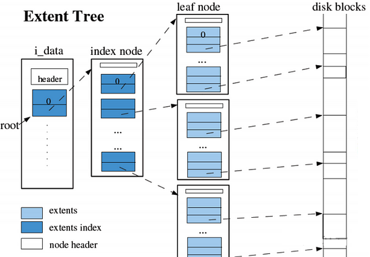
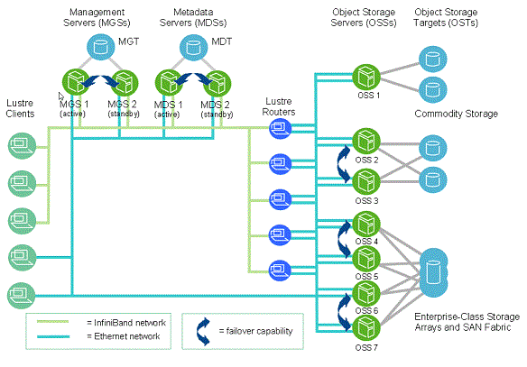
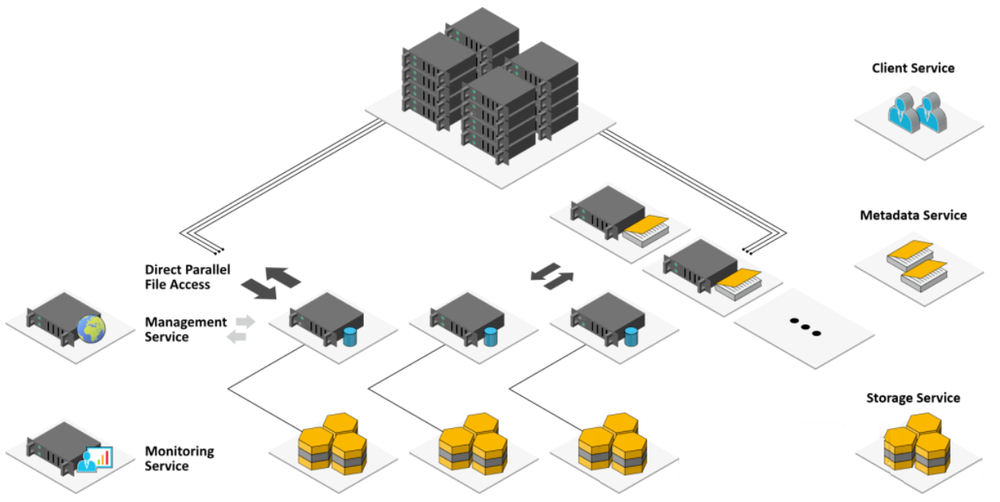
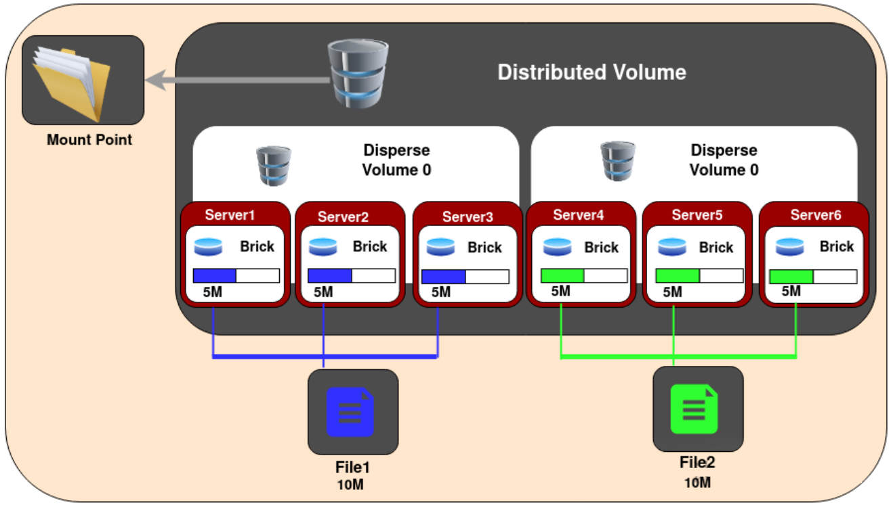
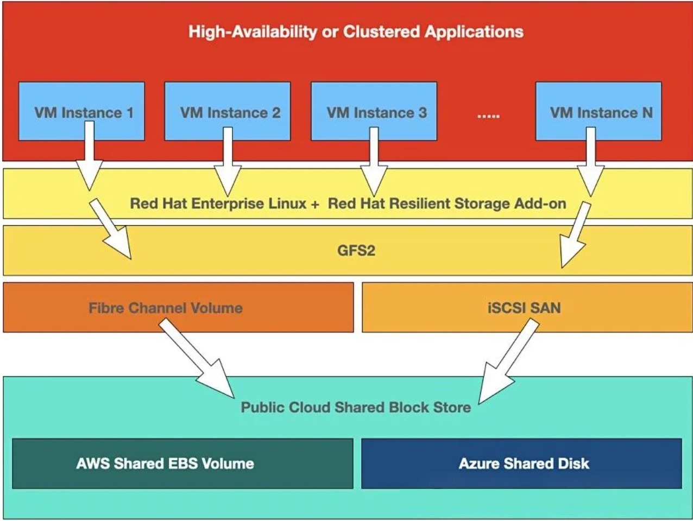

# Linux文件系统的类型

- Linux支持多种文件系统，每种文件系统都在存储设备上实现了虚拟目录结构，只是特性略有不同。

## 早期的ext文件系统

### ext

- ext（extended filesystem，扩展文件系统）：为Linux提供了一个基本的类Unix文件系统，使用虚拟目录处理物理设备并在其中以固定大小的磁盘块（fixed-length block）形式保存数据。

#### inode

- inode（i节点）：ext使用inode跟踪存储在虚拟目录中文件的相关信息。i节点系统在每个物理存储设备中创建一个单独的表（i节点表）来保存文件信息。虚拟目录中的每个文件在i节点表中有对应的条目。
- ext跟踪的每个文件的额外数据包括以下内容：文件名、文件大小、文件属主、文件属组、文件访问权限、指向存有文件数据的每个块的指针。
- i节点号：Linux通过唯一的数值（i节点号）来引用i节点表中的i节点，这个值是创建文件时由文件系统分配的。文件系统是通过i节点号而非文件名和路径来标识文件的。

### ext2

- ext2在保持与ext相同的文件系统结构的同时，在功能上做了扩展：

1. 在i节点表中加入了文件的创建时间、修改时间、最后一次访问时间。
2. 允许的最大文件大小增至2TB，后期又增大到32TB。
3. 保存文件时按组分配磁盘块。

- ext2的限制：如果系统在存储文件和更新i节点表之间发生了某些事件，则两者内容可能无法同步，潜在的结果就是丢失文件在磁盘上的数据位置。（容易在系统崩溃或断电时损坏）

## 日志文件系统

- 日志文件系统放弃了之前将数据直接写入存储设备更更新i节点表的做法，而是先将文件变更写入临时文件（日志）。在数据被成功写到存储设备之后，再删除对应的日志条目。如果系统在数据写入之前崩溃或断电，则日志文件系统会读取日志文件，处理尚未提交的数据。

<table>
    <tr>
        <th width="10%">写入方法</th>
        <th width="90%">描述</th>
    </tr>
    <tr>
        <td rowspan="2">数据模式</td>
        <td>i节点和文件数据都会被写入日志。所有写入存储设备的数据都必须写两次，一次写入日志，一次写入实际的存储设备</td>
    </tr>
    <tr>
        <td>最安全的数据保护方法，速度也最慢</td>
    </tr>
    <tr>
        <td rowspan="2">有序模式</td>
        <td>只有i节点数据会被写入日志，直到文件数据被成功写入后才会将其删除</td>
    </tr>
    <tr>
        <td>性能和安全得到折中</td>
    </tr>
    <tr>
        <td rowspan="2">回写模式</td>
        <td>只有i节点数据会被写入日志，但不控制文件数据何时写入</td>
    </tr>
    <tr>
        <td>数据丢失风险高，但安全性优于无日志</td>
    </tr>
</table>

### ext3

- ext3是ext2的后续版本。

1. 支持最大2TB的文件，能够管理32TB的分区。
2. 在默认情况下，ext3采用有序模式的日志方法，可以通过命令行选项改用其他模式。
3. ext3文件系统无法恢复误删的文件，也没有提供数据压缩功能。

### ext4

- ext4属于日志文件系统，大部分Linux发行版的默认文件系统；数据变更写入磁盘之前，Ext4会通过日志记录所有变更。

 

1. 大容量支持：ext4支持的单个文件最大可达16TB，而文件系统的最大容量可以达到1EB（1EB = 1024PB = 1,048,576TB），这对于处理大规模数据存储需求提供了很好的支持。
2. 延迟分配（Delayed Allocation）：这是一种性能优化技术，可以减少磁盘碎片，提高文件系统的写入性能。延迟决定文件数据在磁盘上的具体位置，直到数据真正写入磁盘之前。
3. 块预分配（Preallocation）：允许应用程序预先分配一定数量的连续磁盘空间给文件，即使文件实际尚未增长到那么大。对于需要高性能写操作的应用（如数据库和多媒体应用）特别有用。
4. 可扩展的属性（Extended Attributes）：支持为文件和目录附加元数据，如安全性信息、描述信息等。
5. 日志（Journaling）：ext4默认采用有序模式的日志方法，可以通过命令行选项改用其他模式。
6. 目录索引（Directory Indexing）：使用哈希表来加速对大目录的访问速度，提高了在包含大量文件的目录中搜索文件的效率。
7. 碎片整理（Defragmentation）：支持在线碎片整理，可以在不卸载文件系统的情况下整理磁盘碎片，改善长时间运行系统的性能。

### JFS（JFS2）

- JFS（journaled filesystem，日志化文件系统）采用有序模式的日志方法，只在日志中保存i节点数据，直到文件数据被写入进存储设备后才将其删除。

### ReiserFS

### XFS

- XFS（x file system）属于日志文件系统，高性能的UNIX 64位文件系统。XFS专为高吞吐量和大容量存储而设计，支持大量的并发I/O操作，因此非常适合大型文件的存储和处理。

1. 高性能：XFS使用先进的索引技术和延迟写入策略，优化了大文件的存储和访问速度，特别适合大型数据库和视频编辑等对性能要求极高的应用。
2. 大容量支持：XFS支持的文件和文件系统大小远超过大多数其他文件系统，最大文件系统容量可达到数百TB，单个文件大小可达到数十TB。
3. 动态inode分配：XFS在文件系统创建时不固定inode数量，而是根据需要动态分配，提高了存储效率。
4. 日志（Journaling）：XFS采用回写模式的日志方法。
5. 在线操作：XFS支持在线扩展和缩减文件系统，以及在线检查和修复文件系统，这些操作可以在不中断文件系统服务的情况下进行。
6. 延迟分配和预取：XFS具有延迟分配（Delayed Allocation）和预取（Prefetching）技术，这有助于减少碎片和优化磁盘I/O性能。
7. 配额管理：XFS提供了强大的磁盘配额管理功能，支持基于用户和组的配额限制。

## 卷管理文件系统

- COW（copy-on-write，写入时复制）：通过快照（snapshot）兼顾安全性和性能。在修改数据时，使用的是克隆或可写快照。修改过的数据并不会直接覆盖当前数据，而是被放入文件系统中的另一个位置，仅在数据修改完成之后才会改动旧数据。

> ROW（redirect-on-write，写时重定向）：如果COW从不覆盖旧数据，则为ROW。

- 从一个或多个磁盘（或磁盘分区）创建的存储池提供了生成虚拟磁盘（卷）的能力。通过存储池，可以根据需要增加卷，在提供灵活性的同时大大减少停机时间。

### ZFS

- ZFS（Zettabyte File System）是一个高级文件系统和逻辑卷管理器，目标是解决数据损坏、提供高存储容量以及管理简便性等问题。

 

1. 数据完整性：ZFS通过校验和（checksums）来确保数据的完整性。每个文件块在写入时都会计算校验和，并在后续读取时验证，确保数据未被损坏或更改。
2. 存储池：ZFS使用存储池（pools）的概念来管理物理存储，可以将多个硬盘组合成一个逻辑存储池，而不是传统的单个卷或分区。提供了高度的灵活性和容易扩展的存储解决方案。
3. 快照和克隆：ZFS支持快照（snapshots）和克隆（clones），对于数据备份、恢复和测试环境非常有用。快照允许用户在特定时间点创建文件系统的只读副本；而克隆则是基于这些快照的可写副本。
4. 动态条带大小（Dynamic Striping）：ZFS可以根据需要动态调整条带的大小，以优化存储利用率和性能。
5. 内置压缩和去重：ZFS支持数据的实时压缩和去重，这可以显著提高存储效率，尤其是在存储大量重复数据的环境中。
6. RAID-Z：ZFS的RAID-Z是传统RAID的改进版本，提供了更高的数据保护和修复能力，特别是在处理大型磁盘阵列时。
7. 自动修复：ZFS可以自动检测并修复数据损坏，尤其是在配备了冗余存储（如RAID-Z）的情况下。
8. 大容量存储：ZFS设计之初就考虑到了扩展性，理论上可以支持高达Zettabyte（10<sup>21</sup>字节）的存储容量。
9. 高效的IO调度：ZFS采用了先进的IO调度算法，可以优化不同类型负载的性能，包括随机读写和顺序读写。
10. 透明加密：ZFS支持基于数据集的透明加密，确保存储在ZFS上的数据安全性。

### Btrfs

- Btrfs（B-tree File System）属于COW文件系统（Copy-on-write，写入时复制），Btrfs是一个开源的、现代的文件系统，针对管理大容量数据而设计。已被Red Hat弃用。

 

1. 快照和克隆：Btrfs支持创建文件系统的快照（只读副本）。快照可以用于备份和恢复数据，或用于测试中的数据回滚。Btrfs还支持克隆（快照的可写副本）。
2. 子卷：Btrfs允许在单个文件系统内创建多个子卷，这些子卷共享同一存储池的空间。子卷可以用于隔离不同用户的数据或不同类型的数据。
3. 数据和元数据校验：Btrfs通过对数据和元数据进行校验，提供对数据完整性的保护，有助于检测和修复损坏的数据。
4. 动态inode分配：与传统文件系统固定inode数量不同，Btrfs动态分配inode，这意味着理论上inode的数量是无限的，提高了文件系统的灵活性和扩展性。
5. 透明压缩：Btrfs支持数据的透明压缩，可以减少磁盘空间的使用，提高存储效率。
6. 在线卷扩展和缩减：Btrfs文件系统可以在不中断服务的情况下动态调整大小，这对于云计算和虚拟化环境非常有用。
7. RAID支持：Btrfs原生支持RAID 0、RAID 1、RAID 10、RAID 5和RAID 6，无需额外的硬件或软件RAID解决方案。

### Stratis

- Stratis并不符合文件系统的标准定义，而是提供了更多的管理视角。Stratis维护的存储池由一个或多个XFS文件组成，同时还提供与传统的卷管理文件系统相似的COW功能。

## 分布式（并行）文件系统

### [Lustre](https://www.lustre.org/)

- Lustre是一种高性能的分布式文件系统，广泛用于大规模并行计算环境。Lustre设计用来处理大量的数据，并支持数以万计的客户端同时访问存储系统，存储容量可以达到数PB（Petabyte）甚至更高。
- Lustre文件系统的关键组件包括Metadata Server（MDS，元数据服务器）、Object Storage Server（OSS，对象存储服务器）、Lustre clients（Lustre 客户端）。The Metadata Servers (MDS) provide metadata services for a file system and manages a Metadata Target (MDT) that stores the file metadata. The Object Storage Servers (OSS) manage the Object Storage Targets (OST) that store the file data objects.

 

1. 高度可扩展性：Lustre可以轻松扩展至数千个节点，支持PB级数据存储，非常适合需要处理大量数据的环境。
2. 高性能：通过有效的数据分布和并行访问，Lustre提供了出色的I/O吞吐量和低延迟，特别适合高性能计算（HPC）应用。
3. 数据和元数据分离：Lustre将数据和元数据分开存储，这意味着文件的元数据（如文件名、权限等）可以独立于文件内容被快速访问和更新，从而提高了文件系统的性能和灵活性。
4. 容错和恢复：Lustre支持多种容错机制，包括数据副本和RAID，以及快速恢复功能，确保数据的持久性和可靠性。
5. POSIX兼容：Lustre在内核空间运行，大部分功能已经以内核模块的形式实现，提供了与POSIX标准相兼容的接口，这意味着许多现有的应用程序可以在不需要修改的情况下直接在Lustre上运行。

### [BeeGFS](https://www.beegfs.io)

- BeeGFS（之前称为FhGFS）是一个开源的并行文件系统，专为性能、可扩展性和简易性而设计。架构采用客户端-服务器设计，由三个关键组件组成：客户端、元数据服务器和存储服务器。通过增加特定用户所需的服务器和磁盘数量，可以简单地实现BeeGFS的可扩展性和灵活性。所有数据透明地分布在多个服务器上，使用分层（根据给定大小的块）进行分块。支持各种大小的安装，从小型集群到多站点安装，无需特殊硬件支持。

 

1. 易于安装和管理：BeeGFS以其易于安装和管理而著称，可以在不中断服务的情况下轻松添加更多节点来扩展系统。
2. 高性能：它针对各种工作负载进行了优化，无论是处理大量小文件还是大文件，都能提供出色的性能。BeeGFS通过自动分布数据和元数据到不同的服务器上来实现负载均衡。
3. 透明的文件系统扩展：BeeGFS允许用户在不修改应用程序的情况下扩展文件系统容量和性能，因为它为系统上的所有节点提供了一个统一的命名空间。
4. 灵活的存储池：可以将不同类型或性能级别的存储分配给不同的存储池（例如，SSD vs. HDD），以满足不同类型的工作负载需求。
5. 动态扩展：BeeGFS支持无需停机即可动态添加或删除存储和服务节点，使得系统可以根据需要灵活扩展。

### [GlusterFS](https://www.gluster.org/)

- GlusterFS是一种开源的分布式文件系统，能够在用户空间中运行并提供可扩展的网络文件系统服务。它是为了解决大数据存储问题而设计的，特别适合云计算环境和大规模存储解决方案。GlusterFS的设计目标是提供高可用性、弹性扩展和高性能的存储解决方案，而无需依赖昂贵的硬件支持。

- GlusterFS使用客户端-服务器模型，但不需要专用的元数据服务器。所有数据和元数据存储在多个设备上（称为卷），这些设备专门为不同的服务器提供服务。GlusterFS使用弹性哈希算法来算法性地定位文件。这种无元数据服务器架构确保了更好的性能、线性可扩展性和可靠性。同时，GlusterFS是一个提供基于文件的存储的网络文件系统；块和对象接口必须在其之上构建。

 

1. 可扩展性：GlusterFS可以轻松扩展到数PB的存储容量和处理数百万文件的能力，同时支持数千个客户端。
2. 灵活的存储体系结构：它支持多种数据布局，如副本、条带（分布）和分布式副本，这些可以根据需要混合使用，以提供数据冗余、负载均衡和高可用性。
3. 简单的管理：GlusterFS通过简化存储配置和管理来降低运营成本，可以通过命令行工具和图形界面进行管理。
4. 兼容性：它提供了与POSIX兼容的文件系统接口，可以通过标准的NFS或SMB协议访问，使得GlusterFS能够无缝地集成到现有的应用和服务中。
5. 用户空间运行：GlusterFS在用户空间运行，而不是内核空间，这使得它更加灵活和易于管理，同时避免了内核空间的复杂性和潜在风险。

### [OrangeFS](https://www.orangefs.org/)

- OrangeFS 是一个开源的并行文件系统，专为高性能计算（HPC）和大数据应用设计。它旨在提供高吞吐量和低延迟的数据访问，同时支持大规模并行数据处理。被设计来优化分布式环境中的数据存储和访问，特别是在需要处理大量数据的科学计算和研究领域。
- OrangeFS 的核心是一个客户端-服务器架构，其大部分组件运行在用户空间。所有的代码都可以根据 LGPL 许可证获取。客户端系统有多种方式可以使用 PVFS 协议来访问服务器上的数据。包括用于低级访问的libpvfs2、MPI-IO、用户空间文件系统（FUSE）、与网络相关的机制（例如 WebDAV、REST）以及用于像在 Linux 中挂载任何其他文件系统一样挂载OrangeFS。

1. 高性能：OrangeFS 专为并行数据访问优化，能够提供高吞吐量和低延迟的性能，这对于高性能计算和大数据分析至关重要。
2. 可扩展性：它支持动态扩展，允许系统管理员根据需要轻松增加更多的存储容量和处理能力，而无需中断服务。
3. 灵活的数据管理：OrangeFS 提供了多种数据管理策略，包括数据副本、条带化（将数据分布在多个服务器上）和容错机制，以确保数据的可靠性和可用性。
4. 易于使用和集成：OrangeFS 支持多种接口和协议，包括 POSIX，使其可以无缝集成到现有的应用和工具中。此外，它还提供了一套简单的管理工具，使得部署和管理变得更加容易。
5. 适用于多种环境：OrangeFS 可以在多种硬件和操作系统平台上运行，包括 Linux 和大多数 UNIX 系统，这使得它能够适应不同的部署环境。

## 集群文件系统

### GFS2

- GFS2（Global File System 2）旨在支持多个节点对同一块存储设备的直接并发访问。作为GFS（Global File System）的继任者，GFS2引入了多项改进和新特性，以提高性能和可靠性。GFS2是为高性能计算（HPC）环境、企业级应用和需要共享数据的场景设计的，它通过分布式锁管理器（DLM）来确保在多节点间访问数据时的一致性和完整性。

 

1. 并发访问：GFS2允许多个节点同时对文件系统进行读写操作，这对于需要共享数据的集群环境特别有用。
2. 数据一致性：GFS2使用分布式锁管理器（DLM）来保持多节点间数据的一致性。这意味着无论何时何地访问数据，文件系统都能保证数据的正确性和完整性。
3. 高可用性：GFS2适用于需要高可用性解决方案的场景，通过数据的冗余存储和故障转移机制，确保关键应用的持续运行。
4. 直接存储访问：GFS2支持对SAN（Storage Area Network）环境中的共享存储设备的直接访问，这有助于提高数据访问速度和效率。
5. 动态扩展：GFS2文件系统支持在线扩展，允许管理员在不中断服务的情况下增加存储容量。
6. 配额管理：通过配额管理，管理员可以控制用户和组使用的存储量，防止资源的滥用。

### OCFS2

- OCFS2（Oracle Cluster File System 2）是一个开源的集群文件系统，由Oracle公司开发。设计用于在Linux环境下支持多个节点对同一块存储设备的并发访问。OCFS2是OCFS（Oracle Cluster File System）的后续版本，引入了许多改进和新特性，以提高性能、可靠性和灵活性。OCFS2不仅支持Oracle数据库的需求，但也适用于任何需要共享存储资源的场景。它提供了对POSIX接口的支持，使得各种应用能够无缝地在OCFS2上运行。

1. 并发访问：OCFS2允许多个节点同时对文件系统进行读写操作，这对于集群环境中的数据共享至关重要。
2. POSIX兼容性：OCFS2完全兼容POSIX标准，这意味着大多数基于Linux的应用都可以在OCFS2上无缝运行。
3. 在线文件系统调整：OCFS2支持在线增加或减少文件系统的大小，这为动态存储需求提供了极大的灵活性。
4. 集群感知锁定：OCFS2使用集群感知的锁定机制来保持多节点间数据的一致性和完整性。
5. 自动文件系统检查和修复：OCFS2能够在文件系统挂载时自动检查和修复潜在的问题，减少了手动干预的需要。
6. 高可用性：通过与集群管理软件（如Pacemaker）的集成，OCFS2能够提供高可用性解决方案。

## 轻量文件系统

### FAT16/32

- FAT32是最通用的文件系统，通常用于便携式媒体，但文件大小限制在4GB以内

### exFAT

- exFAT是FAT32的升级版，64位，轻量级的文件系统，适用于U盘和SD媒体；没有日志或COW

### F2FS

- F2FS（Flash-Friendly File System）是一种专为基于NAND闪存的存储设备（如固态硬盘SSD、eMMC和SD卡）设计的文件系统。F2FS旨在克服传统文件系统在闪存设备上的性能瓶颈和寿命限制，通过一系列优化措施来充分利用NAND闪存的特性。

 

1. 日志结构文件系统（LFS）：F2FS采用日志结构文件系统的设计，将所有的写入操作顺序地组织成日志形式，这有助于减少随机写入，提高写入性能，并减少对闪存的磨损。
2. 写入放大（Write Amplification）的优化：通过减少不必要的数据擦写和移动，F2FS能够降低写入放大效应，延长闪存设备的使用寿命。
3. 多层块管理：F2FS将存储空间分为多个区域（如热数据区、温数据区和冷数据区），根据数据的访问频率将数据智能地分配到不同区域，以优化读写性能和提高存储效率。
4. 垃圾回收（GC）策略：F2FS实现了一种有效的垃圾回收机制，以回收无用数据占用的空间，确保持续的高性能写入操作。
5. 支持TRIM/Discard命令：F2FS支持TRIM命令，可以通知底层存储设备哪些数据块不再使用，从而允许存储设备进行内部优化，提高性能和寿命。
6. 检查点（Checkpoint）机制：F2FS利用检查点机制来减少文件系统一致性检查（fsck）的时间，通过记录文件系统的状态来快速恢复文件系统。

## /proc/filesystems

- nodev：虚拟文件系统，只存在于内存，由Systemd管理

```shell
# 查看已安装的文件系统
cat /proc/filesystems
```

# 文件系统的信息查看

## du

- `du`：显示某个指定目录下的磁盘使用情况

## df

- df（report file system disk space usage）：显示的磁盘使用量情况含可用、已用及使用率等信息，默认单位为KB。

<table><tbody><tr><td>-a<strong></strong></td><td>显示所有文件系统</td><td rowspan="5"><strong>&nbsp;</strong></td><td>-l<strong></strong></td><td>只显示本地文件系统 </td></tr><tr><td>-h<strong></strong></td><td>以更易读的方式显示<strong></strong></td><td>-t</td><td>只显示指定类型文件系统 <strong></strong></td></tr><tr><td>-H<strong></strong></td><td>以1KB=1000B为换算单位</td><td>-T<strong></strong></td><td>显示文件系统的类型<strong></strong></td></tr><tr><td>-i</td><td>显示索引字节信息<strong></strong></td><td>--sync <strong></strong></td><td>在获取磁盘使用信息前先执行sync同步命令</td></tr><tr><td>-k<strong></strong></td><td>设置显示时的块大小<strong></strong></td><td>&nbsp;</td><td><strong>&nbsp;</strong></td></tr></tbody></table>

```shell
# 显示系统全部磁盘的使用量情况（带容量单位）
df -h
```

## lsblk

- `lsblk`（list block devices）：查看系统的磁盘使用情况

<table><tbody><tr><td width="5%">-a</td><td width="42.5%">显示所有设备信息</td><td rowspan="7" width="5%">&nbsp;</td><td width="5%">-m</td><td width="42.5%">显示权限信息</td></tr><tr><td>-b</td><td>显示以字节为单位的设备大小</td><td>-n</td><td>不显示标题</td></tr><tr><td>-e</td><td>排除指定设备</td><td>-o</td><td>输出列信息</td></tr><tr><td>-f</td><td>显示文件系统信息</td><td>-P</td><td>使用key=value格式显示信息</td></tr><tr><td>-h</td><td>显示帮助信息</td><td>-r</td><td>使用原始格式显示信息</td></tr><tr><td>-i</td><td>仅使用字符</td><td>-t</td><td>显示拓扑结构信息</td></tr><tr><td>-l</td><td>使用列表格式显示</td><td>-V</td><td>显示版本信息</td></tr></tbody></table>

```shell
# 仅查看设备名和文件系统类型
lsblk -o NAME,FSTYPE
```

# 分区

## Linux分区

- Linux的所有文件和目录都存在于根分区/中，Linux系统中的每一个硬件设备都映射到系统的一个文件；且Linux上的磁盘总是以`/dev`（device）为根目录
- 硬盘分区类型主要有：主分区、扩展分区、逻辑分区。每一个硬盘设备最多只能由4个主分区构成，任何一个扩展分区都要占用一个主分区号码（主分区和扩展分区数量最多为4），占用分区号1~4。当分区数量大于4时，要用到扩展分区和逻辑分区。先划分扩展分区，再在扩展分区的基础上建立逻辑分区。在进行系统分区时，主分区一般设置为激活状态，用于在系统启动时引导系统。分区时，每个分区的大小可以由用户指定。
- 每个分区可以有不同的文件系统

### [分区方案](./文件管理.md)

<table>
    <tr>
        <th width="20%">目录</th>
        <th width="80%">建立单独分区的优势</th>
    </tr>
    <tr>
        <td>/boot</td>
        <td>更轻松的管理多重启动系统；引导文件不依赖于安装或删除的操作系统</td>
    </tr>
    <tr>
        <td>/home</td>
        <td>与根文件系统隔离，重装时可不影响/home，甚至可以在单独的驱动器</td>
    </tr>
    <tr>
        <td>/var、/tmp</td>
        <td>防止进程失控时占用大量空间而影响到其他文件系统</td>
    </tr>
    <tr>
        <td>swap</td>
        <td>可启用挂起到磁盘的功能</td>
    </tr>
</table>

### 分区表

#### MSDOS

- MSDOS

#### GPT

- GPT（Globally Unique Identifier Partition Table，GUID分区表）：UEFI（Unified Extensible Firmware Interface，统一可扩展固件接口）规范的一部分，UEFI替代老旧的BIOS（Basic Input Output System）

1. 分区最多可达128个，编号为`1~128`，不需要区分主分区和扩展分区
2. 容错性，多个位置都保存了分区表的副本
3. 磁盘和分区拥有唯一的ID
4. 支持传统的BIOS/MBR引导模式
5. 可验证自身的完整性和分区表
6. 支持安全引导

## 分区工具

### fdisk

- `fdisk`：固定磁盘（fixed disk）或格式化磁盘（format disk），可以在任何存储设备上创建和管理分区，`fdisk`只能处理最大2TB的硬盘。

<table><tbody><tr><td>-b</td><td>设置每个分区的大小</td><td rowspan="5">&nbsp;</td><td>-l</td><td>显示指定的外围设备分区表状态</td></tr><tr><td>-c</td><td>关闭DOS兼容模式</td><td>-s</td><td>显示指定的分区大小</td></tr><tr><td>-C</td><td>设置硬盘的柱面数量</td><td>-S</td><td>设置每个磁道的扇区数</td></tr><tr><td>-h</td><td>显示帮助信息</td><td>-u</td><td>以分区数目代替柱面数目</td></tr><tr><td>-H</td><td>设置硬盘的磁头数</td><td>-v</td><td>显示版本信息</td></tr></tbody></table>

```shell
# fdisk进入指定的磁盘分区，以进行交互式操作
sudo fdisk /dev/nvme0n1p10
```

- `fdisk`是一个交互式程序，其使用自己的命令行，允许用户输入命令来逐步完成硬盘分区操作。
- `fdisk`不允许调整现有分区的大小，只能通过删除再重新创建来调整现有分区大小。

####   DOS (MBR)

<table>
        <tr>
            <td width="5%">a</td>
            <td width="47.5%">toggle a bootable flag</td>
            <td width="47.5%">设置活动分区标志</td>
        </tr>
        <tr>
            <td>b</td>
            <td>edit nested BSD disklabel</td>
            <td>编辑BSD Unix系统使用的标签</td>
        </tr>
        <tr>
            <td>c</td>
            <td>toggle the dos compatibility flag</td>
            <td>设置DOS兼容标志</td>
        </tr>
</table>

####   Generic

<table>
    <tr>
        <td width="5%">d</td>
        <td width="47.5%">delete a partition</td>
        <td width="47.5%">删除分区</td>
    </tr>
    <tr>
        <td>F</td>
        <td>list free unpartitioned space</td>
        <td>列出未分配空间</td>
    </tr>
    <tr>
        <td>l</td>
        <td>list known partition types</td>
        <td>列出已知分区类型</td>
    </tr>
    <tr>
        <td>n</td>
        <td>add a new partition</td>
        <td>添加新分区</td>
    </tr>
    <tr>
        <td>p</td>
        <td>print the partition table</td>
        <td>打印分区表</td>
    </tr>
    <tr>
        <td>t</td>
        <td>change a partition type</td>
        <td>更改分区类型</td>
    </tr>
    <tr>
        <td>v</td>
        <td>verify the partition table</td>
        <td>验证分区表</td>
    </tr>
    <tr>
        <td>i</td>
        <td>print information about a partition</td>
        <td>打印分区信息</td>
    </tr>
</table>

####   Misc

<table>
    <tr>
        <td width="5%">m</td>
        <td width="47.5%">print this menu</td>
        <td width="47.5%">打印当前菜单</td>
    </tr>
    <tr>
        <td>u</td>
        <td>change display/entry units</td>
        <td>更改显示/输入单位</td>
    </tr>
    <tr>
        <td>x</td>
        <td>extra functionality (experts only)</td>
        <td>额外功能（仅限专家使用）</td>
    </tr>
</table>

####   Script

<table>
    <tr>
        <td width="5%">I</td>
        <td width="47.5%">load disk layout from sfdisk script file</td>
        <td width="47.5%">从sfdisk脚本文件加载磁盘布局</td>
    </tr>
    <tr>
        <td>O</td>
        <td>dump disk layout to sfdisk script file</td>
        <td>将磁盘布局导出至sfdisk脚本文件</td>
    </tr>
</table>

####   Save &amp; Exit

<table>
    <tr>
        <td width="5%">w</td>
        <td width="47.5%">write table to disk and exit</td>
        <td width="47.5%">将分区表写入磁盘并退出</td>
    </tr>
    <tr>
        <td>q</td>
        <td>quit without saving changes</td>
        <td>不保存更改直接退出</td>
    </tr>
</table>

####   Create a new label

<table>
    <tr>
        <td width="5%">g</td>
        <td width="47.5%">create a new empty GPT partition table</td>
        <td width="47.5%">创建一个新的空GPT分区表</td>
    </tr>
    <tr>
        <td>G</td>
        <td>create a new empty SGI (IRIX) partition table</td>
        <td>创建一个新的空SGI (IRIX) 分区表</td>
    </tr>
    <tr>
        <td>o</td>
        <td>create a new empty DOS partition table</td>
        <td>创建一个新的空DOS分区表</td>
    </tr>
    <tr>
        <td>s</td>
        <td>create a new empty Sun partition table</td>
        <td>创建一个新的空Sun分区表</td>
    </tr>
</table>
### gdisk

- `gdisk`：当存储设备要采用GUID分区表（GUID partition table，GPT）时，使用`gdisk`命令。
- `gdisk`会识别存储设备所采用的分区类型。如果当前未使用GPT方法，则`gdisk`会提供相应的选项，将其转换为GPT。在转换存储设备分区类型时，所选择的类型必须与系统固件（BIOS或UEFI）兼容，否则 ，将无法发引导设备。
- `gdisk`提供了命令行提示符，允许输入命令来进行分区操作。

<table>
    <tr>
        <td width="5%">b</td>
        <td width="47.5%">back up GPT data to a file</td>
        <td width="47.5%">将GPT数据备份到文件</td>
    </tr>
    <tr>
        <td>c</td>
        <td>change a partition's name</td>
        <td>更改分区名称</td>
    </tr>
    <tr>
        <td>d</td>
        <td>delete a partition</td>
        <td>删除分区</td>
    </tr>
    <tr>
        <td>i</td>
        <td>show detailed information on a partition</td>
        <td>显示分区详细信息</td>
    </tr>
    <tr>
        <td>l</td>
        <td>list known partition types</td>
        <td>列出已知分区类型</td>
    </tr>
    <tr>
        <td>n</td>
        <td>add a new partition</td>
        <td>添加新分区</td>
    </tr>
    <tr>
        <td>o</td>
        <td>create a new empty GUID partition table (GPT)</td>
        <td>创建一个新的空白GUID分区表(GPT)</td>
    </tr>
    <tr>
        <td>p</td>
        <td>print the partition table</td>
        <td>打印分区表</td>
    </tr>
    <tr>
        <td>q</td>
        <td>quit without saving changes</td>
        <td>退出而不保存更改</td>
    </tr>
    <tr>
        <td>r</td>
        <td>recovery and transformation options (experts only)</td>
        <td>恢复与转换选项（仅限专家）</td>
    </tr>
    <tr>
        <td>s</td>
        <td>sort partitions</td>
        <td>排序分区</td>
    </tr>
    <tr>
        <td>t</td>
        <td>change a partition's type code</td>
        <td>更改分区类型代码</td>
    </tr>
    <tr>
        <td>v</td>
        <td>verify disk</td>
        <td>验证磁盘</td>
    </tr>
    <tr>
        <td>w</td>
        <td>write table to disk and exit</td>
        <td>将分区表写入磁盘并退出</td>
    </tr>
    <tr>
        <td>x</td>
        <td>extra functionality (experts only)</td>
        <td>额外功能（仅限专家）</td>
    </tr>
    <tr>
        <td>?</td>
        <td>print this menu</td>
        <td>打印此菜单</td>
    </tr>
</table>

### parted

- <code>parted</code>：GNU `parted`提供了另一种命令来处理分区。

1. `parted`的命令管理分区，会立即应用更改。
2. `pared`允许调整现有的分区大小。

```shell
# 进入交互模式
parted

# 对指定的磁盘设备/dev/sda操作
parted /dev/sda

# 执行命令而不是进入交互
parted parted命令
```

#### print

- `print`：打印磁盘设备的信息

```shell
# 查看所有磁盘设备的所有信息
print all

# 查看空闲空间
print free
```

```shell
GNU Parted 3.3
Using /dev/mmcblk0
Welcome to GNU Parted! Type 'help' to view a list of commands.
(parted) print all                                                        
Model: SD SD32G (sd/mmc) # 设备制造商的名称
Disk /dev/mmcblk0: 30.9GB # 设备名称和大小
Sector size (logical/physical): 512B/512B # 逻辑块和物理块大小
Partition Table: msdos # 分区类型 msdos/gpt
Disk Flags:  # 标志

Number  Start   End     Size    Type     File system  Flags
 1      1049kB  269MB   268MB   primary  fat32        boot, lba
 2      269MB   30.9GB  30.7GB  primary  ext4
```

#### mkpart

- `mkpart`：创建分区

1. 创建新分区的起点不能从0开始，因为前33个扇区是为EFI标签保留的
2. 两个分区的起点和终点不应该离太近
3. 新分区必须在建立文件系统后使用

```shell
# 卸载设备
sudo unmount /dev/sdc

# 新建分区表 gpt/msdos，同时会擦除磁盘上的所有数据
sudo parted /dev/sdc
mklabel gpt

# 创建分区 mkpart name fs-type start end ；该步骤并没有创建文件系统，其中的fs-type只是标记
mkpart "images" ext4 1MB 2004MB
mkpart "audio files" xfs 2005MB 100%
```

#### rm

- `rm`：删除分区以及文件系统，删除分区时，如果分区内的文件正在使用，且无视警告继续删除，则这些文件会被保存在内存

```shell
# 序号删除（number）
rm 2
```

#### rescue

- `rescue`：恢复分区，指定分区近似的起点和终点位置来恢复

```shell
rescue 1MB 2004MB
```

#### resizepart

- `resizepart`：调整分区大小，允许调整现有的分区大小。

```shell
# 按序号调整至指定终点，并没有同步扩展文件系统
resizepart 2 4010MB
```

# 创建文件系统

- 将数据存储到分区之前，必须使用某种文件系统对其进行格式化，以便Linux能够使用分区。每种文件系统都有自己专门的格式化工具。Linux可能没有安装所有的文件系统工具。

<table>
    <tr>
        <td width="15%">mkefs</td>
        <td width="85%">创建ext文件系统</td>
    </tr>
    <tr>
        <td>mke2fs</td>
        <td>创建ext2文件系统</td>
    </tr>
    <tr>
        <td>mkfs.ext3</td>
        <td>创建ext3文件系统</td>
    </tr>
    <tr>
        <td>mkfs.ext4</td>
        <td>创建ext4文件系统</td>
    </tr>
    <tr>
        <td>mkreiserfs</td>
        <td>创建ReiserFS文件系统</td>
    </tr>
    <tr>
        <td>jfs_mkfs</td>
        <td>创建JFS文件系统</td>
    </tr>
    <tr>
        <td>mkfs.xfs</td>
        <td>创建XFS文件系统</td>
    </tr>
    <tr>
        <td>mkfs.zfs</td>
        <td>创建ZFS文件系统</td>
    </tr>
    <tr>
        <td>mkfs.btrfs</td>
        <td>创建Btrfs文件系统</td>
    </tr>
</table>

- 所有文件系统命令都允许通过不带选项的简单形式来创建默认的文件系统，需要超级用户权限。为分区创建文件系统后，下一步就是将其挂载到虚拟目录中的某个挂载点。

## mkfs

- mkfs（make file system）：对设备进行格式化文件系统操作

<table><tbody><tr><td>-c</td><td>检查指定设备是否损坏</td></tr><tr><td>-t</td><td>设置档案系统的模式</td></tr><tr><td>-V </td><td>显示执行过程详细信息</td></tr><tr><td>--help</td><td>显示帮助信息</td></tr><tr><td>--version</td><td>显示版本信息</td></tr></tbody></table>

```shell
# 查看当前系统中支持mkfs的文件系统格式
ls -l /usr/sbin/mkfs.*

# 对指定的硬盘进行格式化文件系统操作，并输出详细过程信息
sudo mkfs -V -t xfs /dev/sdb
```

- 将磁盘格式化为ext4文件系统：

```shell
# 1. 查看需要被格式化的磁盘
lsblk
sda            8:0    0 465.8G  0 disk 
├─sda1         8:1    0    50G  0 part /media/zjk/1A34C40E34C3EB39
├─sda2         8:2    0     1K  0 part 
├─sda5         8:5    0   139G  0 part /media/zjk/软件
├─sda6         8:6    0   139G  0 part /media/zjk/文档
└─sda7         8:7    0 137.8G  0 part /media/zjk/娱乐

# 2. 卸载对应的文件系统
sudo umount /dev/sda*

# 3. fdisk进行格式化
sudo fdisk /dev/sda
d # 删除之前的文件分区
w # 保存修改后退出

# 4. 创建文件系统
sudo mkfs.ext4 /dev/sda
```

# 挂载和卸载文件系统

- 文件系统必须先挂载到正在运行的文件系统，然后才能访问，且需要一个挂载点
- <span name="挂载点">挂载点</span>：

1. 每个挂载点只能挂载一个文件系统，若挂载了多个，则被最后挂载的文件系统覆盖。
2. 挂载点的目录通常是[/mnt和/media](./文件管理.md)，只是惯例；`/mnt`通常用于静态挂载（[/etc/fstab](#/etc/fstab)），而`/media`通常用于自动挂载可移动媒体

## mount

- <span name="mount"><code>mount</code></span>：虚拟目录[挂载点](#挂载点)通常是在/mnt中新建一个目录来挂载。

```
mount [-lhV]
mount -a [options]
mount [options] [--source] <source> | [--target] <directory>
mount [options] <source> <directory>
mount <operation> <mountpoint> [<target>]
```

## umount

- <code>umount</code>（unmount）：与mount挂载命令需要同时提供设备名与挂载目录不同，umount卸载命令只需要提供设备名或挂载目录之一即可完成卸载。
- 根文件系统含有Linux所有的核心命令和日志文件，所以无法在处于运行状态的系统中卸载它。但可以借助Linux Live CD、DVD、USB等工具来通过媒介启动系统，然后对根文件系统使用`fsck`命令。

```
umount [参数] 设备或目录名
```

<table><tbody><tr><td>-a</td><td data-immersive-translate-effect="1" data-immersive_translate_walked="7c05567e-e5ff-4670-b322-b61cd71b9233">卸载“/etc/mtab”文件中记录的所有设备</td></tr><tr><td>-F</td><td>强制卸载设备而不询问</td></tr><tr><td>-h</td><td>显示帮助信息</td></tr><tr><td>-n</td><td>卸载时不要将信息写入“/etc/mtab”文件中</td></tr><tr><td>-r</td><td>使用只读方式重新挂载文件系统</td></tr><tr><td>-t</td><td>仅卸载指定的文件系统</td></tr><tr><td>-v</td><td>显示执行过程详细信息</td></tr><tr><td>-V</td><td>显示版本信息</td></tr></tbody></table>

```shell
# 卸载指定的文件系统并显示过程
umount -v /dev/sdb
```

## mountpoint

- <span name="mountpoint"><code>mountpoint</code></span>：查看指定目录是否为挂载点

```shell
mountpoint /
```

## <span name="/etc/fstab">/etc/fstab</span>

- <code><span name="/etc/fstab">/etc/fstab</span></code>：自动挂载文件，在该文件内设置的挂载点和设备会在系统启动时自动挂载 

```shell
# 测试/etc/fstab配置
sudo findmnt --verbose --verify

# 挂载/etc/fstab内的新配置
sudo mount -a
```

 

<table>
    <tr>
        <td width="20%" rowspan="2">device</td>
        <td width="80%" colspan="2">UUID或文件系统标签；不要使用/dev名称，该类名称不唯一且会改变</td>
    </tr>
    <tr><td colspan="2"><code>lsblk -o UUID,LABEL</code></td></tr>
    <tr>
        <td>mountpoint</td>
        <td colspan="2">挂载点</td>
    </tr>
    <tr>
        <td>type</td>
        <td colspan="2">文件系统类型，设置为<code>auto</code>可自动检测文件系统类型</td>
    </tr>
    <tr>
        <td rowspan="15">options</td>
        <td colspan="2">挂载选项列表，定义权限，逗号分割</td>
    </tr>
    <tr><td>defaults</td><td>默认选项，包括<code>rw、suid、dev、exec、auto、nouser、async</code>，在之后追加其他选项会覆盖默认值；或者去除default仅设置部分权限</td></tr>
    <tr><td>rw</td><td>读写</td></tr>
    <tr><td>ro</td><td>只读</td></tr>
    <tr><td>suid</td><td>允许setuid、setgid 位操作</td></tr>
    <tr><td>dev</td><td>块设备和字符设备</td></tr>
    <tr><td>exec</td><td>允许二进制文件运行</td></tr>
    <tr><td>auto</td><td>指定哪些文件系统应在引导时启动</td></tr>
    <tr><td>nouser</td><td>非root用户不能挂载或卸载文件系统</td></tr>
    <tr><td>async</td><td>异步I/O，Linux的标准模式</td></tr>
    <tr><td>user</td><td>非root用户可以挂载或卸载自己的设备</td></tr>
    <tr><td>users</td><td>任何用户都可以挂载或卸载设备</td></tr>
    <tr><td>noauto</td><td>禁止在启动时自动挂载</td></tr>
    <tr><td>noatime</td><td>不更新文件的“time accessed”属性，以提供性能（只提高一点点）</td></tr>
    <tr><td>gid</td><td>仅限指定的组可以访问</td></tr>
    <tr>
        <td rowspan="2">dump</td>
        <td colspan="2">备份设置</td>
    </tr>
    <tr>
        <td colspan="2"><code>0</code>：不进行备份；<code>1</code>：每天备份一次；<code>2</code>每两天备份一次；以此类推</td>
    </tr>
    <tr>
        <td rowspan="3">pass</td>
        <td colspan="2">文件系统检查器<code>fsck</code>在启动时首先检查哪个文件系统</td>
    </tr>
    <tr><td colspan="2"><code>0</code>：不运行检查；<code>1</code>：每次都运行检查；<code>2</code>：仅在非正常关机、达到最大加载次数、一定天数后运行检查</td></tr>
    <tr><td colspan="2">推荐设置：根文件系统 1，任何其他Linux文件系统 2，非Linux文件系统 0</td></tr>
</table>

# 调整文件系统大小

- 扩展文件系统：

1. 文件系统Ext4、XFS、Btrfs，允许在离线或在线时扩展；而文件系统FAT16/32只能离线且必须卸载之后再调整大小
2. 必须确保分区末尾有可用空间

```shell
# Ext4
sudo resize2fs /dev/sdc

# XFS
sudo xfs_growfs -d /dev/sdc

# Btrfs
sudo btrfs filesystem resize max /dev/sdc

# FAT16/32，必须先卸载
sudo fatresize -i /dev/sdc
```

- 缩小文件系统：

1. XFS文件系统只能扩展而不能缩小；Ext4、FAT16/32缩小前必须先卸载；Btrfs可以在线缩小
2. 必须确保文件系统已使用的空间小于收缩后的大小；为保存元数据、浪费的块空间以及以防万一，需要留出大约40%的空间，即 `已使用空间 * 1.4`
3. 若分区位于外部设备，则先卸载；若分区属于正在运行的系统，则必须从可引导的救援磁盘上运行`parted`，或通过另一个启动的Linux来执行

# fsck 检查和修复文件系统

- 每种文件系统各自都有相应的恢复命令，而通用的前端程序可以判断存储设备使用的文件系统并根据要恢复的文件系统调用适合的恢复命令。

- `fsck`命令可以检查和修复大部分的文件系统。文件系统可以通过多种方法指定（如设备名、设备在虚拟目录中的挂载点等），但在对其使用`fdisk`命令前，必须先卸载设备。

> 尽管日志文件系统的用户确实也要使用fsck命令，但使用COW的文件系统是否真的需要该命令，还存在争议。

- `fsck`命令会使用[/etc/fstab](#/etc/fstab)文件自动决定系统中已挂载的存储设备的文件系统。如果存在设备尚未挂载，则需要使用`-t`命令行选项来指定文件系统类型。

```shell
# 使用fsck的自动修复和检查
sudo fsck -p /dev/sda
#fsck from util-linux 2.34
#/dev/sda: clean, 11/30531584 files, 2197341/122096646 blocks
```

# 逻辑卷管理 LVM

- 逻辑卷管理（logical volume manager，LVM）允许用户在无须重建文件系统的情况下，管理磁盘空间。

## LVM布局

- LVM允许将多个分区组合在一起，作为单个分区（逻辑卷）进行格式化、在Linux虚拟目录结构上挂载、存储数据等。还可以继续向逻辑卷中添加分区。
- LVM由三个主要部分组成：物理卷、卷组、逻辑卷。

<table>
    <tr>
        <td width="25%">物理卷<br />（phsical volume，PV）</td>
        <td width="10%"><Code>pvcreate</Code></td>
        <td width="65%">物理卷通过LVM的<code>pvcreate</code>命令创建。该命令指定了一个未使用的磁盘分区（或整个驱动器）由LVM使用。在这个过程中，LVM结构、卷标和元数据都会被添加到该分区。</td>
    </tr>
    <tr>
        <td rowspan="3">卷组<br />（volume group，VG）</td>
        <td rowspan="3"><code>vgcreate</code></td>
        <td>卷组通过LVM的<code>vgcreate</code>命令创建。该命令会将PV加入存储池，存储池随后用于构建各种逻辑卷。多个PV集中在一起回形成VG，由此形成了一个存储池，从中为LV分配存储空间</td>
    </tr>
    <tr>
        <td>可以存在多个卷组。当用户使用<code>vgcreate</code>将一个或多个PV加入VG时，也会同时添加卷组的元数据</td>
    </tr>
    <tr>
        <td>被指定为PV的分区只能属于单个VG。但是，被指定为PV的其他分区可以属于其他VG</td>
    </tr>
    <tr>
        <td rowspan="2">逻辑卷<br />（logical volume，LV）</td>
        <td rowspan="2"><code>lvcreate</code></td>
        <td>逻辑卷通过LVM的<code>lvcreate</code>命令创建。这是逻辑卷创建过程的最终产物。LV由VG的存储空间块（PE）组成。可以使用文件系统格式化LV，然后将其挂载</td>
    </tr>
    <tr>
        <td>尽管可以有多个VG，但LV只能从一个指定的VG中创建，而多个LV可以共享单个VG。可以使用相应的LVM命令调整（增加或减少）LV的容量</td>
    </tr>
</table>

## lvm Linux的LVM

- <code>lvm</code>是用于创建和管理LV的交互式实用工具。如果尚未安装，可以使用lvm2软件包安装。各种LVM工具直接在CLI中就可以使用，无须进入<code>lvm</code>。
- 首次设置逻辑卷的步骤：创建物理卷&rarr;创建卷组&rarr;创建逻辑卷&rarr;格式化逻辑卷&rarr;挂载逻辑卷。也就是：`pgcreate`&rarr;`vgcreate`&rarr;`lvcreate`&rarr;`mkfs`&rarr;`mount`。

# tune2fs

- `tune2fs`：调整/查看磁盘的文件系统参数

# e2label ntfs格式、ext2/3/4格式
