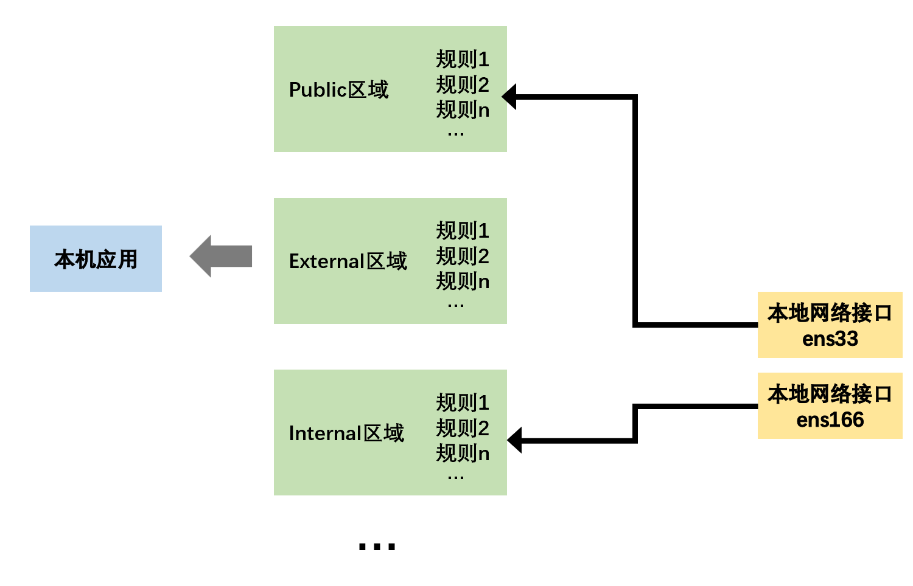

# Vim

| Vim模式    | 说明          |
| :--------- | :------------ |
| 命令行模式 | `:`进入命令行 |
| 插入模式   | 编辑          |
| 底行模式   | `Esc`进入底行 |

 

# Linux命令

## 安装配置

- 挂载点：指定该分区对应Linux文件系统的哪个目录。Linux允许将不同的物理磁盘上的分区映射到不同的目录，可以实现将不同的服务框架放在不同的物理磁盘上（当一个物理磁盘损坏时，不会影响其他物理磁盘上的数据）。

| 分区  | 说明           |
| ----- | -------------- |
| SWAP  | 虚拟内存交换区 |
| /     | 根分区         |
| /boot | 引导分区       |

- SWAP：硬盘模拟的虚拟内存。当系统内存使用率比较高时，内核会自动使用SWAP分区来存取数据。

| 生产环境          | SWAP大小设置   |
| ----------------- | -------------- |
| 物理内存 &lt; 4G  | 物理内存的2倍  |
| 物理内存  4\~16G  | 与物理内存相等 |
| 物理内存 &gt; 16G | 物理内存的一半 |

| 文件系统 | 说明                                                         |
| -------- | ------------------------------------------------------------ |
| XFS      | 高度可扩高性能文件系统。<br />支持的最大的文件系统为：500TB，最大文件：16TB。<br />支持元数据日志，可以加快崩溃时的恢复速度<br />当挂载使用时，仍可以进行清理碎片和控制文件系统。 |
| ext      |                                                              |
| LVM      | 缓存。<br />允许用户创建逻辑卷(LV)，以小型快速设备作为更大、速度更慢的设备的缓存。 |

> KDUMP：开启后，将会使用一部分内存空间，当系统崩溃时KDUMP会捕获系统的关键信息，以便分析查找出系统崩溃的原因。此功能主要是系统相关的程序员使用，对普通用户而言意义不大，建议关闭。

 

**Linux系统结构**

 

- `Ctrl + Windows + Alt + F3` 切换到终端3 （命令行界面)
- `Ctrl + Windows + Alt + F1` 切换到终端1 （图形化界面)

## 基本命令

### alias 命令别名

- alias：设置指令的别名。只局限于该次登入的操作（直接在shell里设定的命令别名，在终端关闭或系统重新启动后都会失效）；将别名写入bash的初始化文件/etc/bashrc，每次启动系统都会初始化（持久化）。

- 使用alias时，用户必须使用单引号将原来的命令引起来，防止特殊字符导致错误。

| 命令                     | 说明                                                        |
| ------------------------ | ----------------------------------------------------------- |
| alias<br />alias -p      | 查看已经设置的别名                                          |
| type 别名                | 检查别名是否已被使用                                        |
| alias 别名='命令1;命令2' | 设置别名，多条命令之间使用分号分隔                          |
| unalias 别名             | 撤销别名<br />只是删除本次操作中的别名（/etc/bashrc未更改） |

### history 历史命令

- history默认最大保存1000条历史命令（\$HISTSIZE），保存在\~/\.bash\_history（历史命令文件）。bash命令的历史记录先放在内存中，当shell退出时才被写入到历史文件中。

| 命令                      | 说明                                                         |
| ------------------------- | ------------------------------------------------------------ |
| history [n]<br />上下光标 | 查看历史命令记录                                             |
| history -c                | 清空当前缓冲区中的历史命令（并未对历史命令文件修改）         |
| history -r                | 将历史命令文件中的命令读入当前历史命令缓冲区<br />（否则只有在第一个终端被打开时才会读取历史命令文件）<br />（若同时打开多个终端，history -a 时其他终端的历史记录不会自动更新。） |
| history -a                | 将历史命令缓冲区中的命令写入历史命令文件                     |
| history -w                | 将**当前**历史命令缓冲区中的命令写入历史命令文件             |

#### \!\! 执行上次命令

| 命令      | 说明                         |
| --------- | ---------------------------- |
| \!\!      | 执行上次命令                 |
| \!\{n\}   | 执行指定序号的历史命令       |
| \!\{str\} | 执行以指定字符开头的历史命令 |

### \| 管道符

- \|（管道符）：连接两个命令，将一个程序/命令的输出作为另一个程序/命令的参数输入。一般为输入和输出的结合，一个进程向管道的一端发送数据，而另一个进程从该管道的另一端读取数据。

### 文本操作

| 命令   | 说明                                                         |
| ------ | ------------------------------------------------------------ |
| echo   | 输出指定的字符串/变量                                        |
| printf | 格式化并输出结果                                             |
| cat    | 一次性显示文本文件的所有内容<br />不适用于内容大的文件，一旦运行就无法控制后面的操作 |
| more   | 分页显示文本内容<br />使用空格或回车来逐行查看文件内容，只支持文本文件中的基本查看 |
| less   | 在more的基础上，能够使用上下和翻页键                         |
| tail   | 显示文件的最后几行<br />默认显示文件的最后10行               |
| head   | 显示文件的头几行                                             |

#### echo 格式化输出

```shell
echo -e "\e[编码1;编码2;编码3m内容"
# 文字色：
#颜色码：重置=0，黑色=30，红色=31，绿色=32，黄色=33，蓝色=34，洋红=35，青色=36，白色=37
echo -e "\e[1;31m内容\e[0m"
#\e[1;31m 将颜色设置为红色
#\e[0m 将颜色重新置回
# 背景色 ：
#颜色码：重置=0，黑色=40，红色=41，绿色=42，黄色=43，蓝色=44，洋红=45，青色=46，白色=47
echo -e "\e[1;42m内容\e[0m"
# 文字闪动：
# 0 关闭所有属性、1 设置高亮度（加粗）、4 下划线、5 闪烁、7 反显、8 消隐
echo -e "\033[37;31;5mMySQL Server Stop...\033[39;49;0m"
```

#### sed 流编辑器

- sed流编辑器处理时，把当前处理的行存储在临时缓冲区（模式空间 pattern space），接着用sed命令处理缓冲区中的内容，处理完成后，把缓冲区的内容送往屏幕。接着处理下一行，这样不断重复，直到文件末尾。文件内容并没有改变，除非使用重定向存储输出。

```shell
sed [options] 'command' file(s)
sed [options] -f scriptfile file(s)
```

```shell
[root@localhost ~]# head -3 /etc/passwd |sed -n 2p
bin:x:1:1:bin:/bin:/sbin/nologin
[root@localhost ~]# head -3 /etc/passwd |sed -n 2,3p
bin:x:1:1:bin:/bin:/sbin/nologin
daemon:x:2:2:daemon:/sbin:/sbin/nologin
```

| 命令 | sed替换标记                                              |
| :--- | :------------------------------------------------------- |
| g    | 行内全面替换。                                           |
| p    | 打印行。                                                 |
| w    | 把行写入一个文件。                                       |
| x    | 互换模板块中的文本和缓冲区中的文本。                     |
| y    | 把一个字符翻译为另外的字符<br />（但是不用于正则表达式） |
| \\1  | 子串匹配标记                                             |
| \&   | 已匹配字符串标记                                         |

| 元字符集 | 说明                                                         |
| :------- | :----------------------------------------------------------- |
| ^        | 匹配行开始，如：/^sed/匹配所有以sed开头的行。                |
| $        | 匹配行结束，如：/sed$/匹配所有以sed结尾的行。                |
| .        | 匹配一个非换行符的任意字符，如：/s.d/匹配s后接一个任意字符，最后是d。 |
| *        | 匹配0个或多个字符，如：/*sed/匹配所有模板是一个或多个空格后紧跟sed的行。 |
| []       | 匹配一个指定范围内的字符，如/[ss]ed/匹配sed和Sed。           |
| [^]      | 匹配一个不在指定范围内的字符，如：/[^A-RT-Z]ed/匹配不包含A-R和T-Z的一个字母开头，紧跟ed的行。 |
| \(..\)   | 匹配子串，保存匹配的字符，如s/\(love\)able/\1rs，loveable被替换成lovers。 |
| &        | 保存搜索字符用来替换其他字符，如s/love/ **&** /，love这成 **love** 。 |
| \<       | 匹配单词的开始，如:/\<love/匹配包含以love开头的单词的行。    |
| \>       | 匹配单词的结束，如/love\>/匹配包含以love结尾的单词的行。     |
| x\{m\}   | 重复字符x，m次，如：/0\{5\}/匹配包含5个0的行。               |
| x\{m,\}  | 重复字符x，至少m次，如：/0\{5,\}/匹配至少有5个0的行。        |
| x\{m,n\} | 重复字符x，至少m次，不多于n次，如：/0\{5,10\}/匹配5~10个0的行。 |

#### sort 文件数据排序

- sort命令默认会将文本中的数据当成字符来排序按照会话指定的默认语言的升序排序顺序输出，包括数字和时间日期等，而不是按照相应的规则来排序。

| 命令                                       | 说明                                                         |
| ------------------------------------------ | ------------------------------------------------------------ |
| sort -n                                    | 将文本识别为数字来排序                                       |
| sort -M                                    | 将文本识别为Mar形式的月份来排序                              |
| sort -t '分隔字符' -k 指定排序的字符段位置 | -t对每行的字符段进行分隔，然后-k选择每行分隔的其中一段字符进行排序 |
| sort -r                                    | 将排序结果降序输出                                           |

```shell
# sort -t '字符' -k  文件
# 将/etc/passwd按uid来排序
[root@bogon ~]# sort -t ':' -k 3  /etc/passwd | head -n 5
root:x:0:0:root:/root:/bin/bash
operator:x:11:0:operator:/root:/sbin/nologin
bin:x:1:1:bin:/bin:/sbin/nologin
games:x:12:100:games:/usr/games:/sbin/nologin
ftp:x:14:50:FTP User:/var/ftp:/sbin/nologin
```

#### grep 文本过滤

- grep：默认区分大小写、支持正则。若不指定任何文件名称/给予的文件名为"-"，则grep命令从标准输入设备读取数据。

```shell
grep [选项] {"查找目标文本" | 查找目标文本} {被过滤文本}
```

| 选项 |                    |
| ---- | ------------------ |
| -v   | 反向搜索           |
| -n   | 匹配的同时输出行号 |
| -c   | 统计含有匹配的行数 |

##### 正则

| 正则参数       | 说明                                                |
| :------------- | :-------------------------------------------------- |
| \              | 转义符                                              |
| ^              | 指定匹配字符串的行首 ；指定行的开始                 |
| $              | 指定匹配字符串的结尾  ； 指定行的结束               |
| *              | 表示0个以上的字符 ；匹配0个或多个先前的字符         |
| +              | 表示1个以上的字符 ；匹配1个或多个先前的字符         |
| ?              | 匹配0个或多个先前的字符                             |
| .              | 匹配一个非换行符的字符                              |
| []             | 匹配一个指定范围内的字符                            |
| [^]            | 匹配一个非指定范围内的字符                          |
| `\(..\)`       | 标记匹配字符                                        |
| <              | 指定单词的开始                                      |
| >              | 指定单词的结束                                      |
| x{m}           | 重复字符x，m次                                      |
| x{m,}          | 重复字符x，至少m次                                  |
| x{m,n}         | 重复字符x，至少m次，至多n次                         |
| w              | 匹配单词和数字 即：[A-Z] [a-z] [0-9]                |
| W              | w的反置形式，匹配一个或多个非单词字符，如点号句号等 |
| b              | 单词锁定符                                          |
| `          | ` |                                                     |
| ()             | 分组符                                              |
| [:alnum:]      | 文字数字字符                                        |
| [:alpha:]      | 文字字符                                            |
| [:digit:]      | 数字字符                                            |
| [:graph:]      | 非空格、控制字符                                    |
| [:lower:]      | 小写字符                                            |
| [:upper:]      | 大写字符                                            |
| [:cntrl:]      | 控制字符                                            |
| [:print:]      | 非空字符（包括空格）                                |
| [:punct:]      | 标点符号                                            |
| [:space:]      | 所有空白字符（换行、空格、制表符）                  |
| [:xdigit:]     | 十六进制数字 0-9 a-f A-F                            |

#### awk

```shell
awk [options] 'script' var=value file(s)
awk [options] -f scriptfile var=value file(s)
```

| 选项         | 说明                                                         |
| :----------- | :----------------------------------------------------------- |
| -F fs        | fs指定输入分隔符，fs可以是字符串或正则表达式                 |
| -v var=value | 赋值一个用户定义变量，将外部变量传递给awk                    |
| -f scripfile | 从脚本文件中读取awk命令                                      |
| -m[fr] val   | 对val值设置内在限制<br />-mf选项限制分配给val的最大块数目。<br />-mr选项限制记录的最大数目。 |

#### 标准输入与输出

- 执行一个Shell命令通常会自动打开3个标准文件：标准输入文件stdin（对应终端的键盘）、标准输出文件stout、标准错误输出文件stderr（对应终端的屏幕）。
- 进程从标准输入文件得到输入数据，将正常输出数据输出到标准输出文件，而错误信息则打印到标准错误文件。

 

- 如果给定的文件不止一个，则在显示的每个文件前面加一个文件名标题。如果没有指定文件或者文件名为“-”，则读取标准输入。 

**cat命令 不带参数时**

- 从标准输入中读取数据并显示到标准输出文件中。此时，每一行键盘（标准输入文件）输入的数据，都会立刻被输出在屏幕上（标准输出文件）。

##### 重定向

- 重定向操作符：把命令/可执行程序的标准输入/输出重定向到指定的文件。

| 操作符 | 说明                                                         |
| ------ | ------------------------------------------------------------ |
| `<`    | 输入重定向                                                   |
| `<<`   | 文档的重定向                                                 |
| `>`    | 输出重定向<br />若`>`后面的文件不存在，则创建该文件。若存在，则将内容覆盖到该文件。 |
| `>>`   | 追加输出重定向<br />若`>>`后面的文件不存在，则创建该文件。若存在，则将内容追加到该文件。 |
| 2>     | 错误输出重定向<br />若`2>`后面的文件不存在，则创建该文件。若存在，则将内容覆盖到该文件。<br />如果有错误信息，则不会在屏幕（标准输出文件）输出，而会保存在指定的文件中。即使没有错误信息也会创建/覆盖。 |
| 2>>    | 追加错误输出重定向<br />若`2>>`后面的文件不存在，则创建该文件。若存在，则将内容追加到该文件。<br />如果有错误信息，则不会在屏幕（标准输出文件）输出，而会保存在指定的文件中。即使没有错误信息也会创建/追加。 |

- 重定向操作符可以混合使用。

```shell
命令 >输出 2>&1 #将标准输出和标准错误输出重定向到同一个文件
ls >myOutAndErr.txt 2>&
```

## 文件管理

| 命令       | 说明                                                         |
| ---------- | ------------------------------------------------------------ |
| cd         | 切换文件目录。<br />`.`：当前目录<br />`..`：当前目录的父目录<br />`~`：/home |
| pwd        | 显示当前的绝对路径                                           |
| ls<br />ll | （按行）列出当前目录下的文件和目录。<br /> 显示长列表。      |
| file       | 查看文件类型。                                               |

### FHS 目录结构

- 基于文件系统层级标准（FHS）：Linux将文件存储在单个目录结构中（虚拟目录），虚拟目录将安装在PC上的所有存储设备的文件路劲纳入单个目录结构中。Linux虚拟目录结构只包含一个根目录 / 的基础目录。根目录下的目录和文件会按照访问的目录路径一一列出。
- 根驱动器：在Linux PC上安装的第一个硬盘，包含了虚拟目录的核心，从此开始构造其他目录。
- 挂载点：在根驱动器上创建的目录，是虚拟目录中用于分配额外存储设备的目录。虚拟目录会让（该额外存储设备上的）文件和目录出现在这些挂载点的目录上。

| 目录        | 说明                                                         |
| :---------- | :----------------------------------------------------------- |
| /           | 根目录，文件的最顶端。<br />/ect、/bin、/dev、/lib、/sbin应该和根目录放置在同一个分区。 |
| /bin        | 二进制目录，存放系统所需要的重要命令。（命令对应的文件都是可执行的）<br />/usr/bin也存放一些系统命令，普通用户可以使用大部分的命令。 |
| /boot       | Linux启动时，内核及引导系统程序所需要的核心文件。<br />内核文件、gub系统引导管理器（引导装载程序）都位于此目录。 |
| /dev        | 设备文件（光驱、磁盘等）。<br />访问该目录下某个文件相当于访问某个硬件设备，常用的是挂载光驱。 |
| /etc        | 系统的配置文件                                               |
| /home       | 默认的用户主目录。<br />如果添加用户时不指定用户的主目录，默认在/home下创建与用户名同名的文件夹。 |
| /lib        | 动态链接库。<br />/lib64（64位系统）、/usr/1ib、/usr/local/lib等。 |
| /lost+found | 系统意外崩溃、机器意外关机时产生的文件碎片。                 |
| /mnt        | 挂载储存设备的挂载目录。                                     |
| /proc       | 进程目录，存放操作系统运行时的信息<br />此目录的内容存在于内存中，实际不占用磁盘空间。 |
| /root       | root用户的主目录                                             |
| /sbin       | 系统二进制目录，存放一些系统管理的命令，一般只能由root执行。 |
| /tmp        | 临时文件目录，任何人都可以访问。<br />系统软件/用户运行程序时产生的临时文件存放到这里，空间不易过小。<br />此目录数据需要定期清除，重要数据不可放置在此目录下。 |
| /usr        | 用户二进制目录，应用程序存放目录（命令、帮助文件等）。<br />安装Linux软件包时默认安装到/usr/local目录下。 |
| /var        | 此目录的内容经常变动的。                                     |
| /sys        | 系统目录，主要记录与系统核心相关的信息。<br />此目录的内容存在于内存中，实际不占用磁盘空间。 |
| /srv        | 服务目录，存放本地服务的相关文件。                           |
| /run        | 运行目录，存放系统运行时的运行数据。                         |
| /opt        | 可选目录，存放第三方软件包、数据文件。                       |
| /media      | 媒体目录，可移动媒体设备的常用挂载点。                       |

### 文件信息/权限

- 对root用户而言，rw权限是可以无视的，而可执行文件则必须要有x权限（包括root用户）。

| 权限命令 | 说明                |
| -------- | ------------------- |
| chown    | 改变文件所有者      |
| chgrp    | 改变文件所属组      |
| chmod    | 变更文件/目录的权限 |

 

| 参数 | 文件类型                           |
| :--- | :--------------------------------- |
| -    | 普通文件                           |
| d    | 目录文件                           |
| l    | 符号链接文件                       |
| b/c  | b：块设备文件<br />c：字符设备文件 |
| p    | 管道文件                           |

| 权限 | 说明     |
| :--- | :------- |
| r    | 读权限   |
| w    | 写权限   |
| x    | 执行权限 |

> 777 ：绝对权限（rwxrwxrwx）。

### 文件操作

| 压缩命令                    | ln                                                   |
| --------------------------- | ---------------------------------------------------- |
| tar                         | 打包/解包、归档<br />`.tar、.tar.gz、.tgz、.tar.bz2` |
| zip<br />unzip              | 压缩 `.zip`<br />解压缩                              |
| gzip<br />gunzip<br />gzcat | 压缩`.gz`<br />解压<br />查看压缩文件的内容          |
| **文件命令**                | **说明**                                             |
| touch                       | 创建/更新文件                                        |
| mv                          | 移动、重命名                                         |
| cp                          | 复制                                                 |
| mkdir<br />rmdir            | 新建目录<br />删除目录                               |

#### ln 链接

| 链接   | 命令                      | 说明                                                         |
| ------ | ------------------------- | ------------------------------------------------------------ |
| 硬链接 | ln 源路径 目标路径        | 如果源文件被删除，硬链接仍然可以正常使用、读写数据。<br />不可以跨区/磁盘创建硬链接。<br />硬链接与源文件使用的是相同的设备、inode编号、文件属性和源文件相同。 |
| 软链接 | ln -s 完整源路径 目标路径 | 如果源文件被删除，则无法继续使用软链接。<br />可以跨分区/磁盘创建软链接。<br />软链接的文件属性被标记为l，同时有指针-\>指向源文件。 |

## 应用管理

### Linux函数库

- 函数库是一个文件，包含已经编译好的代码和数据，供程序使用。

| 函数库         | 说明                                                         |
| -------------- | ------------------------------------------------------------ |
| 静态函数库     | 在编译程序时，如果指定静态函数库文件，则编译时将这些静态函数库一起加载到最终的可执行文件中，在程序执行前加入目标程序。<br />文件后缀 .a、所在目录 /usr/lib、通常只有一个程序使用。 |
| 共享函数库     | 在程序启动时加载到程序，可以被不同的程序共享。<br />当一个可执行程序启动时被加载、所在目录 /lib 和 /usr/lib、被多个程序使用。 |
| 动态加载函数库 | 可以在程序运行的任何时候动态的加载。<br />文件后缀 .so 、一般都是共享函数库 。 |

- 缓存文件（/etc/ld.so.cache）：可以找到相关的库文件信息。

```shell
# 修改 /etc/ld.so.conf 文件，将该库的文件路径添加到文件
echo "/usr/local/ssl/lid/" >> /etc/ld.so.conf

# 让系统升级ld.so.cache文件
ldconfig
```

- LD_LIBRARY_PATH环境变量

```shell
export LD_LIBRARY_PATH=/usr/local/ssl/lib:$LD_LIBRARY_PATH:.
```

- ldd 查看程序使用了哪些动态库文件

### 软件安装格式

#### rpm

| 组合                            | 说明                                                         |
| :------------------------------ | :----------------------------------------------------------- |
| rpm -ivh RPM包                  | 安装时显示信息                                               |
| rpm -ivh --force RPM包          | 强制安装                                                     |
| rpm -ivh --nodeps --force RPM包 | 无视依赖，强制安装                                           |
| rpm -qpl RPM包                  | 查看软件包的详细信息                                         |
| rpm -Uvh RPM包                  | 更新已安装的软件包                                           |
| rpm -qa                         | 查看已安装的软件包                                           |
| rpm -e                          | 卸载软件包<br />如果存在依赖关系，需要先卸载需要其依赖的软件包 |
| rpm -qf                         | 查看文件所属软件包                                           |
| rpm -qip                        | 获取说明信息                                                 |

#### yum

#### deb

##### apt

```shell
# 由Linux查找相应的软件包，并自动安装（包括依赖）。
sudo apt install <软件名>
```

```shell
# Ubutun apt源
sudo vim /etc/apt/sources.list
```

[清华大学镜像](https://mirrors.tuna.tsinghua.edu.cn/help/ubuntu/?spm=a2c6h.12873639.article-detail.7.4d0a3d66Nzz2jp)

##### dpkg

```shell
sudo dpkg -i *.deb
# 如果需要安装依赖，则在之后输入：
sudo apt-get -f -y install
```

#### Flatpak

#### Snap

```shell
sudo snap install <app>
```

## 用户管理

| 用户类型 | 说明                                                         |
| :------- | :----------------------------------------------------------- |
| 超级用户 | root<br />UID: 0                                             |
| 系统用户 | 正常运行时，系统使用的用户，每个进程在系统中都有一个相应的属主。<br />系统用户不能用来登录（bin、daemon、mail等） |
| 普通用户 | user                                                         |

### 用户管理文件

#### /etc/passswd   用户账号文件

> 普通用户的UID默认1000之后。


#### /etc/shadow  用户密码文件


#### /etc/group 用户组文件

- 用户登录时默认的组放在/etc/passwd中。

 

### 用户管理命令

| 用户管理命令 | 作用     | 说明                                                         |
| ------------ | -------- | ------------------------------------------------------------ |
| useradd      | 添加用户 |                                                              |
| usermod      | 修改用户 | 不允许改变正在线上的使用者帐号名称。<br />改变user id时必须确认该用户没在电脑上执行任何程序。 |
| userdel      | 删除用户 | -r：同时删除该用户的相关任务和文件。                         |
| passwd       | 用户密码 | 设置用户的认证信息，包括用户密码、密码过期时间等。<br />只有管理者可以指定用户名称，一般用户只能变更自己的密码。 |
| id           | 用户信息 | 显示真实有效的用户ID（UID）、组ID（GID）。                   |

| su指令          | 切换用户（不指定用户则默认root）                             |
| :-------------- | :----------------------------------------------------------- |
| su 用户         | 不改变环境变量                                               |
| su - 用户       | 改变环境变量                                                 |
| su -c 命令 用户 | 切换用户执行命令之后，返回原用户                             |
| **sudo指令**    | **普通用户获取超级权限**、以其他身份来执行命令，预设的身份为root。 |
| /etc/sudoers    | 设置可执行sudo指令的用户                                     |

### 用户组命令

- 每个用户都有一个用户组，一个用户可以属于多个用户组，一个用户组可以有多个用户。系统对一个用户组的用户集中管理，赋予用户组的权限可以被该用户获取。用户的权限为所在的所有用户组的权限之和。

| 用户组文件  | 说明                                 |
| ----------- | ------------------------------------ |
| /etc/passwd | 定义的用户组为基本组，其他的为附加组 |
| /etc/group  | 用户组的操作基于对该文件的更新       |

| 用户组命令 | 作用                                                         |
| ---------- | ------------------------------------------------------------ |
| groupadd   | 添加用户组                                                   |
| groupdel   | 删除用户组（修改的系统文件包括/ect/group和/ect/shadow）<br />若该群组中仍包括某些用户，则必须先删除这些用户后，方能删除群组。 |
| groupmod   | 修改用户组                                                   |
| groups     | 查看用户所在用户组                                           |

## 系统服务管理

### 性能检测

#### CPU

| 命令   | 说明                                                         |
| ------ | ------------------------------------------------------------ |
| uptime | 查看Linux系统负载信息<br /> |
| vmstat | 显示虚拟内存状态                                             |
| free   | 显示系统内存状态<br /><br /> |
| top    | 动态显示系统内存状态                                         |

##### vmstat

```shell
# vmstat
procs -----------memory---------- ---swap-- -----io---- -system-- ------cpu-----
 r  b   swpd   free   buff  cache   si   so    bi    bo   in   cs us sy id wa st
 1  0      0 4128428   2116 428040   0    0     3     0   14   11  0  0 100 0  0
```

| vmstat参数 | 参数值 | 说明                                                         |
| ---------- | ------ | ------------------------------------------------------------ |
| **Procs**  | r      | 运行队列中进程数量，可判断是否需要增加CPU。（长期大于1）     |
|            | b      | 等待IO的进程数量。                                           |
| **Memory** | swpd   | 当前使用虚拟内存大小。<br />若swpd不为0，而si、si长期为0，并不会影响系统性能。 |
|            | free   | 空闲物理内存大小。                                           |
|            | buff   | 缓冲的内存大小。                                             |
|            | cache  | 缓存的内存大小。<br />若频繁访问到的文件都能被cache处理，则磁盘的读IO bi会非常小。 |
| **Swap**   | si     | 每秒从交换区写到内存的大小，由磁盘调入内存。                 |
|            | so     | 每秒写入交换区的内存大小，由内存调入磁盘。                   |
|            |        | 内存够用的时候，这2个值都是0。<br />若si、so长期大于0，影响系统性能，磁盘IO和CPU资源都会被消耗。 |
| **IO**     | bi     | 每秒读取的块数。                                             |
|            | bo     | 每秒写入的块数。                                             |
|            |        | 随机磁盘读写时，bi、bo越大，能看到CPU在IO等待的值也会越大。  |
| **system** | in     | 每秒中断数，包括时钟中断。                                   |
|            | cs     | 每秒上下文切换数。                                           |
|            |        | in、cs值越大，由内核消耗的CPU时间会越大。                    |
| **CPU**    | us     | 用户进程执行时间百分比（user time）。<br />值高时，说明用户进程消耗的CPU时间多。<br />若长期超50%的使用，就该考虑优化程序算法、进行加速。 |
|            | sy     | 内核系统进程执行时间百分比（system time）。<br />值高时，说明系统内核消耗的CPU资源多，非良性。 |
|            | wa     | IO等待时间百分比。<br />值高时，说明IO等待比较严重，这可能由于磁盘大量作随机访问造成，也有可能磁盘出现瓶颈（块操作）。 |
|            | id     | 空闲时间百分比                                               |

#### IO

| 命令   | 说明                                |
| ------ | ----------------------------------- |
| iostat | 汇报磁盘活动统计情况、CPU使用情况。 |

```shell
# iostat -x /dev/sda1
Linux 3.10.0-693.el7.x86_64 (bogon)     12/12/2022      _x86_64_        (12 CPU)

avg-cpu:  %user   %nice %system %iowait  %steal   %idle
           0.01    0.00    0.03    0.00    0.00   99.96

Device:         rrqm/s   wrqm/s     r/s     w/s    rkB/s    wkB/s avgrq-sz avgqu-sz   await r_await w_await  svctm  %util
sda1              0.00     0.00    0.18    0.00     0.56     0.20     8.34     0.00    0.13    0.12    3.00   0.12   0.00
```

### 运行级别

 

 

 

#### 运行级别命令

| 命令     | 说明                                                         |
| -------- | ------------------------------------------------------------ |
| runlevel | 查看当前用户运行级别<br /> |
| init     | 改变系统运行级别<br />init进程是所有Linux进程的父进程，它的进程号为1。 |

#### /etc/inittab init配置文件

### systemctl、systemd 服务单元控制

 

#### 服务单元控制命令

| **运行级别**                                               | **说明**                                                     |
| ---------------------------------------------------------- | ------------------------------------------------------------ |
| systemctl set-default                                      | 更改默认运行级别，重启后生效<br />（/etc/systemd/ssytem/default.target 的指向） |
| systemctl rescue                                           | 紧急模式                                                     |
| **服务单元**                                               | **说明**                                                     |
| systemctl start<br />systemctl restart<br />systemctl stop | 启动服务<br />重新启动服务<br />停止服务                     |
| systemctl enable<br />systemctl disable                    | 设置开机自启动<br />禁止开机自启动                           |
| systemctl status                                           | 查看服务当前状态                                             |
| **电源控制**                                               | **说明**                                                     |
| systemctl poweroff                                         | 关机                                                         |
| systemctl reboot                                           | 重启                                                         |
| systemctl suspend                                          | 待机                                                         |

> | systemctl set-default参数 | 指向                                      | 运行级别 |
> | :------------------------ | :---------------------------------------- | :------- |
> | default.target            | /etc/systemd/system/default.target        | -        |
> | multi-user.target         | /usr/lib/systemd/system/multi-user.target | 3        |
> | graphical.target          | /usr/lib/systemd/system/graphical.target  | 5        |


#### /etc/systemd/system 单元配置文件

| 存放位置                | 说明                             |
| ----------------------- | -------------------------------- |
| /usr/lib/systemd/system | 软件包安装的单元                 |
| /etc/systemd/system     | 系统管理员安装的与系统密切的单元 |

| 小节    | 说明                                                         |
| :------ | :----------------------------------------------------------- |
| Unit    | 主要是单元的描述和依赖。                                     |
| Service | 单元的最主要内容。<br />主要定义了服务的类型、启动、停止的命令、杀死服务的信号等。 |
| Install | 安装单元                                                     |

 

### 进程管理

| 进程       | 说明                                                         |
| :--------- | :----------------------------------------------------------- |
| 交互进程   |                                                              |
| 批处理进程 |                                                              |
| 守护进程   | 系统开机时通过脚本自动激活启动或root用户启动。<br />后台运行，一直运行。<br />等待请求处理任务。 |

| 进程属性 | 说明                                               |
| :------- | :------------------------------------------------- |
| PID      | 进程ID，唯一值，区分进程                           |
| PPID     | 父进程和父进程的PID                                |
| UID、GID | 启动进程的用户ID和所归属的组ID                     |
| 进程状态 | R（运行）、S（休眠）、Z（僵尸）                    |
| 其他     | 进程执行的优先级、进程所连接的终端名、进程资源占用 |

| 参数 | 进程状态                             |
| ---- | ------------------------------------ |
| D    | 不能被中断                           |
| R    | 运行中、在队列中可过行的             |
| S    | 休眠                                 |
| T    | 停止、或被跟踪                       |
| W    | 进入内存交换（内核2.6之后失效）      |
| X    | 死亡                                 |
| Z    | 僵尸（进程完成了，但父进程没有响应） |
| &lt; | 优先级较高                           |
| N    | 优先级较低                           |
| L    | 部分页被锁进内存                     |
| S    | 进程的领导者（拥有子进程）           |
| L    | 多个进程的宿主                       |
| \+   | 后台                                 |

#### 进程管理命令

##### ps 静态进程监视

- ps：进程监视，报告当前系统的进程状态（非动态）


##### top 实时状态监视

- top：系统实时状态监视，动态交互命令，默认每5秒刷新一次。


- 应用程序实际占用的内存：MemTotal - MemFree - Buffer - Cached (KB)而不是MemUsed。

##### sleep 睡眠

- 进程没有置入后台时，在当前的CLI睡眠，直到该进程睡眠结束才可以在该DLI上输入下一个命令。睡眠结束时，若进程在后台，则直接恢复到前台。

##### coproc 协程

- coproc（协程）：同时处理两件事情，后台生成一个子shell并在该子shell中执行命令。

```shell
coproc 进程名 { 命令; 命令; }
```

#### 前台进程、后台进程

| 进程     | 前台     | 后台            |
| -------- | -------- | --------------- |
| 终端窗口 | 占用     | 不占用          |
| 启动     | 正常启动 | 启动命令加上`$` |

| 命令 | 说明                       |
| ---- | -------------------------- |
| jobs | 获取当前存在的进程的作业号 |
| bg   | 从前台进程切换到后台       |
| fg   | 从后台进程切换到前台       |

- Ctrl + Z 让正在执行的前台进程暂停。

#### kill、killall 终止进程

- 当父进程被终止时，子进程也被终止；而子进程的终止不会导致父进程的终止。只有进程的属主、root用户可以杀死该进程。

| 命令    | 说明                         |
| ------- | ---------------------------- |
| kill    | 按PID杀死单个进程。          |
| killall | 按进程名杀死同名的所有进程。 |

- kill/killall命令预设终止程序的信号为SIGTERM(15)；SIGKILL(9)强制删除程序（尽量避免使用）。

 

#### nice、renice 进程优先级

- 优先级的数值为-20\~19（负值、0是高优先级）。启动进程时，其默认优先级是0。
- 进程的优先级是父进程shell优先级的值与（nice命令）所指定优先级的值相加和。

| 命令 | 说明                                                         |
| ---- | ------------------------------------------------------------ |
| nice | 创建进程时指定进程的优先级。<br />指定的并不就是该进程的优先级，而是一个增量。 |

- 指定优先级时：`nice -19 进程`表示优先级是19而不是-19，如果要-19则：`nice --19 进程`；也可以使用`nice -n -19 进程`表示-19。

### 日志系统

#### /var/log 日志文件

- Linux日志一般放在/var/log下，需要root用户权限。

| 日志类型     | 说明                                                         |
| :----------- | :----------------------------------------------------------- |
| 系统连接日志 | 记录系统的登录记录和用户名，写录到/var/log/wtmp和/var/log/utmp |
| 进程统计     | 系统内核执行，当一个进程终止时为每个进程往进程统计文件中写一个记录 |
| 错误日志     | 各种系统守护进程、用户程序和内核，通过syslog向/var/log/messages写录 |

| 常用日志文件 | 说明                                       | 文件类型 |
| :----------- | :----------------------------------------- | :------- |
| access-log   | 记录Web服务访问日志，错误信息存于error-log |          |
| acct/pacct   | 记录用户命令                               |          |
| btmp         | 记录失败的记录                             |          |
| messages     | 服务器的系统日志                           | 文本     |
| sudolog      | 记录使用sudo发出的命令                     |          |
| sulog        | 记录su命令的使用                           |          |
| syslog       | 从syslog中记录信息                         |          |
| secure       | 记录系统登录行为                           | 文本     |
| utmp         | 记录当前登录的每个用户                     | 二进制   |
| wtmp         | 一个用户每次登录和退出时间的永久记录       | 二进制   |
| lastlog      | 记录最后一次失败的登录和最近几次成功的登录 |          |

 

#### 日志命令

| 命令       | 说明                                                         |
| ---------- | ------------------------------------------------------------ |
| who<br />w | 显示目前登录系统的用户信息（/var/log/wtmp）                  |
| users      | 显示当前登录系统的所有用户<br />（如果一个用户有不止一个登录会话，那他的用户名将显示相同的次数） |
| last       | 列出目前与过去登入系统的用户相关信息（/var/log/wtmp）        |
| dmesg      | 显示Linux系统启动信息，检查和控制内核的环形缓冲区<br />开机信息保存在/var/log/dmesg文件。 |

#### /etc/rsyslog.conf 日志系统

 

 

| 优先级限定符 | 说明                                                         |
| :----------- | :----------------------------------------------------------- |
| \*           | 服务生成的所有日志消息都发送到操作动作指定的地点。           |
| =            | 服务生成的本优先级的日志消息都发送到操作动作指定的地点。     |
| \!           | 服务生成的所有日志消息都发送到操作动作指定的地点，但本优先级的消息不包括在内。 |

**操作动作**：每条消息都会经过所有的规则，并非唯一匹配的。


#### /etc/logrotate.conf 日志轮转

- /etc/logrotate.conf：对系统日志进行轮转、压缩、删除、发送到指定邮箱。每个记录文件都可被设置成每日/周/月处理、或文件太大时处理。用户自定义日志配置文件（/etc/logrotate.d）。

```shell
# rotate log files weekly 每周轮转
weekly

# keep 4 weeks worth of backlogs 保存过去四周的文件
rotate 4

# create new (empty) log files after rotating old ones 轮转以后创建新的空白日志文件
create

# use date as a suffix of the rotated file 轮转的文件以日期结尾
dateext

# uncomment this if you want your log files compressed 如果需要对轮转后的日志压缩，去掉此行注释
# compress

# RPM packages drop log rotation information into this directory 其他配置存放的文件目录;即用户自定义的配置
include /etc/logrotate.d

# no packages own wtmp and btmp -- we'll rotate them here 一些系统日志的轮转规则
/var/log/wtmp {
    monthly
    create 0664 root utmp
        minsize 1M
    rotate 1
}

/var/log/btmp {
    missingok
    monthly
    create 0600 root utmp
    rotate 1
}

# system-specific logs may be also be configured here.
```

##### /etc/logrotate.d 自定义配置轮转

 

```shell
# 测试轮转：无error日志，则正常生成轮转配置文件。
/user/sbin/logrotate -vf /etc/logrotate.conf
```

### 自动任务

#### at 定时任务

- at：在指定时间执行任务，只执行一次。

```
at [选项] [时间]
```

| 选项 | 说明                           |
| ---- | ------------------------------ |
| -f   | 指定包含具体指令的任务文件     |
| -q   | 指定新任务的队列名称           |
| -l   | 显示待执行任务的列表           |
| -d   | 删除指定的待执行任务           |
| -m   | 任务执行完成后向用户发送E-mail |

| 指定时间的格式 | 说明                                                         |
| -------------- | ------------------------------------------------------------ |
| 绝对计时法     | 当天的hh:mm。若该时间已过去，那么就放在第二天执行。<br />midnight（深夜），noon（中午），teatime（一般是下午4点）等比较模糊的词语来指定时间。<br />12小时计时制，时间后面加上AM（上午）、PM（下午）。<br />具体日期，指定格式为month day、mm/dd/yy、dd.mm.yy。指定的日期必须跟在指定时间的后面。 |
| 相对计时法     | now + count time-units：now当前时间、time-units是时间单位 minutes（分钟）、hours（小时）、days（天）、weeks（星期）、count是时间的数量，究竟是几天，还是几小时，等等。<br />直接使用today（今天）、tomorrow（明天）。 |

```shell
[root@localhost ~]# at 23:43 today
at> date >/root/today.log            
at> <EOT>
job 3 at Sun Nov 27 23:43:00 2022
```

##### atq 显示当前所有定时任务

```shell
[root@localhost ~]# atq
4       Wed Nov 30 08:40:00 2022 a root
```

##### atrm 删除指定序号的定时任务

```shell
atrm 任务序号
```

 

#### crontab 周期任务

- crontab：提交和管理用户需要周期性执行的任务。当安装完成操作系统后，默认会安装此服务工具，并且会自动启动crond进程，crond进程每分钟会定期检查是否有要执行的任务，如果有要执行的任务，则自动执行该任务。

```shell
crontab [选项] [crontab 的任务列表文件]
```

| 选项           | 说明                       |
| -------------- | -------------------------- |
| -e             | 编辑该用户的计时器设置     |
| -l             | 列出该用户的计时器设置     |
| -r             | 删除该用户的计时器设置     |
| `-u<用户名称>` | 指定要设置定时器的用户名称 |

##### 系统任务调度、用户任务调度

**系统任务调度**

- 系统周期性所要执行的工作，比如写缓存数据到硬盘、日志清理等。
- 系统任务调度的配置文件`/etc/crontab`

 

```shell
[root@localhost etc]# ll | grep cron
-rw-------.  1 root root      541 Mar 30  2017 anacrontab
drwxr-xr-x.  2 root root       54 Nov 13 21:16 cron.d
drwxr-xr-x.  2 root root       70 Nov 13 21:16 cron.daily
-rw-------.  1 root root        0 Mar 30  2017 cron.deny
drwxr-xr-x.  2 root root       41 Nov 13 21:16 cron.hourly
drwxr-xr-x.  2 root root        6 Dec 28  2013 cron.monthly
-rw-r--r--.  1 root root      451 Dec 28  2013 crontab
drwxr-xr-x.  2 root root        6 Dec 28  2013 cron.weekly
```

**用户任务调度**

- 用户定期要执行的工作，比如用户数据备份、定时邮件提醒等。
- 所有用户定义的crontab文件都被保存在`/var/spool/cron`目录中。其文件名与用户名一致，
- 使用者权限文件如下：
  - `/etc/cron.deny `     该文件中所列用户不允许使用crontab命令
  - `/var/spool/cron/`   所有用户crontab文件存放的目录,以用户名命名 

 

```shell
# 每1分钟执行一次command
* * * * * command

# 每小时的第3和第15分钟执行
3,15 * * * * command

# 在上午8点到11点的第3和第15分钟执行
3,15 8-11 * * * command

# 每隔两天的上午8点到11点的第3和第15分钟执行
3,15 8-11 */2 * * command
# 每个星期一的上午8点到11点的第3和第15分钟执行
3,15 8-11 * * 1 command

# 每晚的21:30重启smb 
30 21 * * * /etc/init.d/smb restart

# 每月1、10、22日的4 : 45重启smb 
45 4 1,10,22 * * /etc/init.d/smb restart

# 每周六、周日的1:10重启smb
10 1 * * 6,0 /etc/init.d/smb restart

# 每天18 : 00至23 : 00之间每隔30分钟重启smb 
0,30 18-23 * * * /etc/init.d/smb restart

# 每星期六的晚上11:00 pm重启smb 
0 23 * * 6 /etc/init.d/smb restart

# 每一小时重启smb 
* */1 * * * /etc/init.d/smb restart

# 晚上11点到早上7点之间，每隔一小时重启smb
* 23-7/1 * * * /etc/init.d/smb restart

# 每月的4号与每周一到周三的11点重启smb 
0 11 4 * mon-wed /etc/init.d/smb restart

# 一月一号的4点重启smb
0 4 1 jan * /etc/init.d/smb restart

# 每小时执行/etc/cron.hourly目录内的脚本
01 * * * * root run-parts /etc/cron.hourly
```

##### crond服务

```shell
service crond status # 查看crond服务状态
/sbin/service crond start    # 启动服务
/sbin/service crond stop     # 关闭服务
/sbin/service crond restart  # 重启服务
/sbin/service crond reload   # 重新载入配置
ntsysv # 查看crond服务是否已经设置为开机启动
chkconfig –level 35 crond on # 加入开机自动启动
```

## 防火墙管理

- Linux内核的防火墙由netfiter框架实现。

### netfiter框架

- netfiter的通用框架不依赖于具体的协议，而是为每种网络协议定义一套**钩子函数**。在数据包经过协议栈的几个关键点时，调用这些钩子函数，同时协议栈将数据包和钩子函数作为参数传递给netfiter框架。对于每种网络协议定义的钩子函数，任何内核模块可以对每种协议的一/多个钩子函数进行注册，实现**挂接**。

> 当某个数据包被传递给netfiter框架时，内核能检测到是否有相关模块对该协议和钩子函数进行了注册，若发现注册信息，则调用该模块注册时使用的回调函数，然后对应模块去检查、修改、丢弃该数据包并指示netfiter将该数据包传入用户空间的队列。


| 钩子函数           | 说明                                                         |
| ------------------ | ------------------------------------------------------------ |
| NF_IP_PRE_ROUTING  | 所有进入该系统的数据报都要由该函数处理。<br />是否替换IP包的目的地址（DNAT）。 |
| NF_IP_LOCAL_IN     | 所有发送给本机的数据报都要由该函数处理。                     |
| NF_IP_FORWARD      | 所有不是发给本机的数据报都要由该函数处理。                   |
| NF_IP_LOCAL_OUT    | 所有从本地进程发出的数据报都要由该函数处理。                 |
| NF_IP_POST_ROUTING | 所有发送给其他主机的数据报都要由该函数处理。<br />是否替换IP包的源地址（SNAT）。 |

#### 包过滤

- 每个函数都可以对数据包进行处理，最基本的操作就是对数据包进行过滤。root用户可以通过iptables工具向内核模块注册多个过滤规则，并且指明过滤规则的优先权，每个钩子函数按照规则进行匹配，如果匹配则执行过滤操作。

| 过滤操作  | 说明                   |
| :-------- | :--------------------- |
| NF_ACCEPT | 继续正常地传送包       |
| NF_DROP   | 丢弃包，停止传送       |
| NF_STOLEN | 已经接管包，不继续传送 |
| NF_REPEAT | 再次使用该钩子函数     |

#### 包选择

- 在netfiter框架上已经创建了一个包选择系统，这个包选择工具默认注册了3个表：过滤filter表、网络地址转换NAT表：mangle表。

 

- 在调用钩子函数时，按照如上的顺序来调用需要的表。
- 包过滤表只是过滤包，而不改变包，实际中由网络过滤框架来通过NF\_IP\_FORWARD钩子的输入和输出接口。NF\_IP\_LOCAL\_IN和NF\_IP\_LOCAL\_OUT也可以过滤，但只对本机。
- NAT表分别服务于两套不同的网络过滤挂钩的包，对于非本地包，NF\_IP\_PRE\_ROUTING和NF\_IP\_POST\_ROUTING挂钩可以很好地解决源地址和目标地址的变更问题。
- NAT表与Filter表的区别在于NAT表只有新建连接的第一个包会在表中传送，结果将被用于以后所有来自这一连接的包。如：某一连接的第一个数据包在这个表中被替换了源地址，则接下来的这条连接的所有包都将被替换源地址。
- Mangle表用于真正改变包的信息，Mangle表和所有的5个网络过滤的钩子都有关。

### firewalld

#### Zone 防火墙区域/网络区域

- Zone：防火墙区域/网络区域，是一系列可以被快速执行到网络接口的预设置。一个网络接口只能与一个网络区域对应。当数据包进入区域后，防火墙会依据区域内的规则进行逐一过滤，只有符合规则的数据包才能通过区域到达本机应用。

 

| 区域（从信任到不信任）  | 说明                                                         |
| :---------------------- | :----------------------------------------------------------- |
| trusted （信任）        | 信任所有的网络连接                                           |
| internal （内部网络）   | 企业等的内部网络<br />基本信任内部网络中的计算机不会威胁计算机安全 |
| home （家庭网络）       | 基本信任家庭网络中的计算机不会危害计算机安全                 |
| work （工作网络）       | 基本信任工作网络中的计算机不会危害计算机的安全               |
| dmz （非军事区/隔离区） | 此区域内的电脑可以公开访问，可以有限的进入内部网络           |
| external  （外部网络）  | 通常是使用了伪装的外部网络<br />该区域内的计算机可能会危害计算机安全 |
| public （公共区域）     | 在公共区域使用，<br />该区域内的计算机可能会危害计算机安全   |
| block （阻塞/拒绝）     | 任何进入的网络连接都会被拒绝，并返回IPv4/IPv6的拒绝报文      |
| drop （丢弃）           | 任何进入的网络连接都会被丢弃，没有任何回复                   |

- 无论处于哪个区域，防火墙都不会拒绝由本机主动发起的网络连接，即：本地发起的数据包（包含对方响应或返回的数据包）将通过该区域。虽然这些区域已经有所描述，但实际通行规则由区域内的规则决定，最终决定连接是否被放行的是规则而不是区域的描述。

#### firewalld（firewall-cmd、firewall-config）

- firewall-cmd是firewalld的字符界面管理工具，firewalld支持动态更新，不用重启服务。

- firewalld可以动态修改单条规则。
- firewalld自身并不具备防火墙的功能，需要通过内核的netfilter来实现。

## 磁盘管理

- Linux的所有文件和目录都存在于根分区/中，Linux系统中的每一个硬件设备都映射到系统的一个文件。

> **硬盘分区类型主要有：主分区、扩展分区、逻辑分区。**
>
> - 每一个硬盘设备最多只能由4个主分区构成，任何一个扩展分区都要占用一个主分区号码（主分区和扩展分区数量最多为4），占用分区号1~4。当分区数量大于4时，要用到扩展分区和逻辑分区。先划分扩展分区，再在扩展分区的基础上建立逻辑分区。在进行系统分区时，主分区一般设置为激活状态，用于在系统启动时引导系统。分区时，每个分区的大小可以由用户指定。

| 命令                   | 说明                                                         |
| ---------------------- | ------------------------------------------------------------ |
| df                     | 显示每个有数据的已挂载文件系统（当前值）。                   |
| du                     | 显示某个指定目录下的磁盘使用情况。                           |
| tune2fs                | 调整/查看磁盘的文件系统参数                                  |
| fdisk                  | 磁盘管理                                                     |
| parted                 | 磁盘管理                                                     |
| lsblk                  | 磁盘管理                                                     |
| mkfs                   | 格式化文件系统。<br />查看当前系统中支持mkfs的文件系统格式：`ls -l /usr/sbin/mkfs.* ` |
| mount                  | 挂载/卸载文件系统                                            |
| umount                 | 卸载                                                         |
| lsof                   | 获取使用指定文件的进程                                       |
| ntfslabel<br />e2label | 磁盘分区改名<br />ntfs格式、ext2/3/4格式                     |

### 挂载/卸载文件系统

#### mount 挂载/卸载文件系统

- 虚拟目录挂载点通常是在/mnt中新建一个目录来挂载。

 

#### /etc/fstab 挂载文件

### 磁盘分区管理

#### fdisk

## 网络管理

### 网络信息

| 命令    | 说明                                       |
| ------- | ------------------------------------------ |
| ping    | 测试主机之间网络的连通性（ICMP传输协议）。 |
| netstat | 查看网络系统状态信息                       |

### IP 网卡配置

| 配置工具 | 说明                                |
| -------- | ----------------------------------- |
| ifconfig | 配置和显示Linux系统网卡的网络参数。 |
| ifdown   | 禁用指定的网络接口。                |

#### ifconfig 网络参数


#### 网络配置文件


| 网络配置文件                             | 说明                                                         |
| :--------------------------------------- | :----------------------------------------------------------- |
| `/etc/sysconfig/network-scripts/ifcfg-*` | 网络接口文件，设置网卡参数，`*`为网卡编号/回环网卡。<br />配置IP地址，修改之后需要重启网络服务才开始生效。 |
| `/etc/resolv.conf`                       | 设置DNS的相关信息，用于将域名解析到IP                        |
| `/etc/hostname`                          | 修改主机名称（hostname指令）<br />修改完主机名后，还需要修改相应的/etc/hosts文件，使主机能够顺利地解析该主机名。 |
| `/etc/hosts`                             | 计算机IP对应的主机名称或域名对应的IP                         |
| `/etc/nsswitch.conf`                     | 名字服务切换配置（设置DNS解析优先还是本地设置优先等）        |
| /etc/sysconfig/network                   | 默认网关（route指令）                                        |

```shell
# 重启network服务后生效
systemctl restart network
```

### route 路由

| 命令       | 说明                                                         |
| ---------- | ------------------------------------------------------------ |
| route      | 显示/添加/修改路由器（主要是静态路由）                       |
| traceroute | 追踪数据包在网络上的传输时的全部路径，默认发送的数据包大小是40字节。 |

#### route 路由器配置

 

#### ip rule 策略路由 

- Linux系统负责维护4个路由表（0、253、254、255）。RHEL系统中最多可以同时存在256个路由表（0\~255），每个路由表都各自独立，数据包传输时根据路由策略数据库中的策略决定数据包应该由哪个路由表传输。

| 路由表             | 说明                                                         |
| ------------------ | ------------------------------------------------------------ |
| 0号表（unspec）    | 系统保留表。                                                 |
| 253号表（default） | 默认路由表，一般，默认的路由都存放在253号表。                |
| 254号表（main）    | 主路由表，若没有指明路由所属的表，则所有的路由都默认放在这个表。 |
| 255号表（local）   | 本地路由表，由系统自动维护，管理员不能直接修改。<br />存放本地接口地址、广播地址、NAT地址。 |

- ip rule命令：设置路由策略。

##### /etc/iproute2/rt_tables 路由表文件

```shell
cat /etc/iproute2/rt_tables
255     local
254     main
253     default
0       unspec
```

### 端口

#### /etc/ssh/sshd_config 端口管理

```shell
##Port 22 取消注释改为 #Port 10222
## 先临时关闭SELinux，SELinux会阻止端口的修改而导致sshd服务重启失败
[root@bogon ~]# setenforce 0
setenforce: SELinux is disabled
## 重启sshd服务
[root@bogon ~]# systemctl restart ssh
## 查看端口
[root@bogon ~]# netstat -plnt | grep 10222
tcp        0      0 0.0.0.0:10222           0.0.0.0:*               LISTEN      8553/sshd           
tcp6       0      0 :::10222                :::*                    LISTEN      8553/sshd
## 此时远程连接的软件ssh端口号需要改为10222
## 如果有问题，对SELinux和firewalld操作
[root@bogon ~]# systemctl stop firewalld
[root@bogon ~]# systemctl disable firewalld
Removed symlink /etc/systemd/system/multi-user.target.wants/firewalld.service.
Removed symlink /etc/systemd/system/dbus-org.fedoraproject.FirewallD1.service.
```

### 远程传输

| 命令   | 说明                                                         |
| ------ | ------------------------------------------------------------ |
| scp    | 加密的方式在本地主机和远程主机之间复制文件                   |
| rsync  | 远程数据同步工具、只传送两个文件的不同部分                   |
| telnet | 登录远程主机和管理（测试ip端口是否连通）<br />明文传送报文，安全性不好 |
| wget   | 支持FTP和HTTP下载                                            |

## 服务器配置

### NAT

- NAT网络地址转换，将IP数据包头中的IP地址转换为另外一个IP地址，以实现私有IP地址访问公有网络。
- NAT会自动修改IP报文的源IP地址和目的IP地址，IP地址校验在NAT处理过程中自动完成。

 

| NAT的实现    | 说明                                                         |
| ------------ | ------------------------------------------------------------ |
| 静态转换     | 某个私有IP地址只能转换为某个指定的公有IP地址。               |
| 动态转换     | IP地址是随机的，系统会自动随机选择一个没有被使用的公有IP地址进行转换。 |
| 端口多路复用 | 修改数据包的源端口并进行端口转换，使内部网络的多台主机可以共享一个公有IP地址。 |

- 配置NAT服务。

```shell
# 开启转发功能
echo 1 > /proc/sys/net/ipv4/ip_forward

# 将网络接口加入到外部区域
# 查看网络接口ens33所属区域
firewall-cmd --get-zone-of-interface=ens33
# 改变区域为external
firewall-cmd --permanent --zone=external --change-interface=ens33
# 查看外部区域配置
firwall-cmd --zone=external --list-all
# 打开外部区域的伪装
firewall-cmd --permanent --zone=external --add-masquerade

# 配置内部接口
firewall-cmd --get-zone-of-interface=ens101
firewall-cmd --permanent --zone=internal --change-interface=ens101
```

> **配置上网**
>
> 将所有主机的网关设置为RHEL主机的网络接口ens101（内部接口）的IP地址，内部网络的主机的DNS服务器设置为运营商提供的DNS服务器的地址。

# Shell

- Linux中的Shell通常默认是bash（Bourne Again Shell），命令本身是一个函数。提供用户与操作系统进行交互操作的接口，方便用户使用系统中的软硬件资源。提供脚本语言编程环境，方便用户完成简单到复杂的任务调度。

- Linux启动时，最先进入内存的是内核，并常驻内存。然后进行系统引导，引导过程中启动所有进程的父进程在后台运行，直到相关的系统资源初始化完毕后，等待用户登录。用户登录时，通过登录进程验证用户的合法性。用户验证通过后根据用户的设置启动相关的Shell，以便接收用户输入的命令并返回执行结果。


## shell

| shell     | 说明                                                         |
| --------- | ------------------------------------------------------------ |
| /bin/bash | 用户默认shell，用户登录某个虚拟控制台终端或在GUI中运行终端仿真器时启动。 |
| /bin/sh   | 系统默认shell，启动时需要使用的系统shell脚本。               |

- shell也是进程，可以使用ps、kill等指令操作。

### shell的父子关系

- 在用户默认shell中，输入/bin/bash、其他的bash命令时，会创建一个新的子shell。此时该用户默认shell就是这个子shell的父进程。
- 创建子shell的代价较高，需要为该子shell创建新的环境。

```shell
# 查看当前shell的子shell数量
echo $BASH_SUBSHELL
```

- `( ; ; ) `生成一个子shell将按括号内的命令依次执行，执行完成之后，该子shell自动被杀死。

> `;` 命令列表
>
> `{;}` coproc协程

### 内建命令、外部命令

| 命令形式 | 说明                                                         |
| -------- | ------------------------------------------------------------ |
| 内建命令 | 不需要子进程执行，已和shell编译成一体。<br />不需要借助外部程序文件来执行。 |
| 外部命令 | 存在于bash shell之外的程序，并不是shell程序的一部分。<br />执行时会创建一个子shell（衍生）。<br />外部命令通常位于/bin、/usr/bin、/usr/sbin中。 |

| 命令  | 说明                 |
| ----- | -------------------- |
| type  | 查看是否为内建命令。 |
| which | 显示外部命令的文件。 |

- 对于有多种方式实现的命令，如果需要指定为外部命令的方式实现，可以通过which找到相应的文件，直接执行该文件即可。

### shell脚本规范

```shell
#!/bin/bash
# 解释器

# 注释 <<关键字
<<END
 注释
END

# 执行的命令
echo "Hello World"
```

| 执行方式      | 说明                                                         |
| ------------- | ------------------------------------------------------------ |
| 直接执行      | 需要可执行权限（x）。<br />在当前shell内开启一个子shell执行脚本，脚本结束时关闭子shell并回到父shell。<br />`./test.sh` |
| 解释器        | 不需要执行权限<br />在当前shell中开启一个子shell执行脚本，脚本结束时关闭子shell并回到父shell。<br />`bash test.sh`、`sh test.sh` |
| .<br />source | 使脚本内容在当前shell里执行，而无需打开子shell。<br />`. test.sh`、`source test.sh` |

- 子shell中设置的当前变量，父 shell 是不可见的。

#### 引号

| 引号      | 说明                       |
| --------- | -------------------------- |
| 单引号 '  | 将特殊符号变成普通符号     |
| 双引号 "  | 保持特殊符号的特殊使用     |
| 反引号 \` | 使用命令的输出结果替换命令 |

```shell
echo "current position is `pwd`"
# current position is /root/Test

echo 'current position is `pwd`'
# current position is `pwd`
```

## 环境变量

- 环境变量存储有关shell会话和工作环境的信息，允许用户在内存中存储数据。

| 比较   |             全局变量             |                           局部变量                           |
| ------ | :------------------------------: | :----------------------------------------------------------: |
| 可见性 | shell会话<br />所有生成的子shell | 创建该局部变量的shell<br />父shell创建的局部变量，子shell不可见。<br />子shell创建的局部变量，父shell也不可见。 |
| 名称   |               大写               |                             小写                             |
| 查看   |        env<br />printenv         |                           printenv                           |

| 命令 | 说明                                                         |
| ---- | ------------------------------------------------------------ |
| read | 从键盘读取变量值。<br />该命令可以一次读取多个变量的值，变量和输入的值都需要使用空格隔开。<br />如果没有指定变量名，读取的数据将被自动赋值给特定的变量REPLY。 |
| env  | 显示系统中已存在的环境变量。<br />如果使用env命令在新环境中执行指令时，会因为没有定义环境变量“PATH”而提示错误信息。此时，用户可以重新定义一个新的“PATH”或者使用绝对路径。 |

```shell
#!/bin/bash

read -t 10 -p "请在10秒内输入: " value1
echo "输出：$value1"
```

| 命令     | 比较                                                         |
| -------- | ------------------------------------------------------------ |
| set      | 显示为某个特定进程设置的所有环境变量，包括局部变量、全局变量、用户定义变量。<br />对输出的结果按照字母顺序来排序。 |
| env      | 不对输出结果排序，不输出局部变量和用户定义变量。<br />查看全局变量时，使用env、printenv。 |
| printenv | 不对输出结果排序，不输出局部变量和用户定义变量。<br />查看个别环境变量时，使用printenv而不是env。 |

### 用户定义变量

| 命令     | 说明                                                         |
| -------- | ------------------------------------------------------------ |
| declare  | 声明和显示已存在的shell变量。<br />`变量名=变量值`、`declare 变量名=变量值` |
| set      | 显示系统中已经存在的shell变量、设置shell变量的新变量值。<br />不能定义新的shell变量。 |
| unset    | 删除已定义的shell变量（包括环境变量）、shell函数。<br />不能删除具有只读属性的shell变量和环境变量。 |
| readonly | 定义只读shell变量和shell函数。                               |
| export   | 将shell变量、函数输出为环境变量。<br />修改子shell中全局变量的值，不会影响到父shell中该全局变量的值，只会影响该子shell创建的子shell的全局变量的值。<br />一个变量创建时，它不会自动地为在它之后创建的shell进程所知。而export命令可以向后面的shell传递变量的值。当一个shell脚本调用并执行时，它不会自动得到原为脚本（调用者）里定义的变量的访问权，除非这些变量已经被显式地设置为可用。 |

**变量定义规则**

1. 变量名称可以由字母、数字和下划线组成，但是不能以数字开头，环境变量名建议大写。
2. 等号两侧不能有空格。
3. 在 bash 中，变量默认类型都是字符串类型，无法直接进行数值运算。
4. 变量的值如果有空格，需要使用双引号或单引号括起来。

### \$ 变量符号

- 如果涉及到变量的使用，使用`$`。如果是操作变量，不使用`$`，printenv也不使用`$`。

| 特殊变量        | 说明                                                         |
| :-------------- | :----------------------------------------------------------- |
| \$n             | n 为数字、\$0 代表该脚本名称。<br />\$1\~\$9 代表第1\~9个参数。<br />10以上的参数用大括号包含，如\$\{10\}。 |
| \$\#            | 获取所有输入参数个数（常用于循环）<br />判断参数的个数是否正确以及加强脚本的健壮性。 |
| \$\* <br /> \$@ | 命令行中所有的参数。<br />`$*`把所有的参数看成一个整体。被双引号“”包含时，`$*`会将所有的参数作为一个整体，以`“$1 $2 …$n”`的形式输出所有参数。<br />`$@`把每个参数区分对待。被双引号“”包含时，`$@`会将各个参数分开，以`“$1” “$2”…“$n”`的形式输出所有参数。 |
| \$?             | 最后一次执行的命令的返回状态。<br />若该变量的值为0，则上一个命令执行正确。<br />若该变量的值非0，则上一个命令执行错误。 |

```shell
#!/bin/bash

for i in $*
do
    echo "\$*  $i"
done

for i in $@
do
    echo "\$@  $i"
done    

for i in "$*"
do
    echo "\$*  $i"
done

for i in "$@"
do
    echo "\$@  $i"
done 
```

```shell
[zjk@www ShellTest]$ . forTest02.sh 1 2 3
$*  1
$*  2
$*  3
$@  1
$@  2
$@  3
$*  1 2 3
$@  1
$@  2
$@  3
```

### 语系变量 locale命令

| 命令      | 比较                                 |
| --------- | ------------------------------------ |
| locale    | 当前软件的语系。<br />不修改配置文件 |
| localectl | 当前系统的语系。<br />修改配置文件   |

```shell
# 设置当前系统语系 同时修改配置文件
localectl set-locale LANG=en_US.UTF-8 
```

- 设置语系变量时，一般建议更改LANG与LC\_ALL这两个变量，因为设置这两个变量，其他语系变量都会替换成LANG与LC\_ALL这两个变量的值。LANG直接用=号赋值即可。LC\_ALL需要使用export设置。

> 设置LANG=zh\_CN\.UTF\-8，发现其他的变量都变成zh\_CN\.UTF\-8

```shell
LANG=en_US.UTF-8
export LC_ALL=en_US.UTF-8
```


###  系统环境变量

| 系统变量                     | 说明                                                         |
| :--------------------------- | :----------------------------------------------------------- |
| \$PATH<br />（/etc/profile） | 执行文件查找的路径。<br />文件查找的顺序与PATH的变量的顺序有关。<br />目录与目录中间以:冒号隔开。 |
| \$HOME                       | 当前用户主目录                                               |
| \$HISTSIZE                   | 代表可以容纳多少条历史命令                                   |
| \$LOGNAME                    | 当前用户的登录名                                             |
| \$HOSTNAME                   | 指主机的名称                                                 |
| \$SHELL                      | 当前用户Shell类型                                            |
| \$LANG                       | 当前的语系类型                                               |
| \$MAIL                       | 当前用户的邮件存放目录                                       |
| \$PS1                        | 基本提示符                                                   |
| \$RANDOM                     | 随机数的变量                                                 |

## 运算符

### 算术运算式

```shell
$((运算式)) 

$[运算式]
```

```shell
s=(1+2)
s1=$((1+2))
s2=$[1+2]
echo -e "$s\n$s1\n$s2" 
# 1+2
# 3
# 3
```

| 命令 | 说明                                 |
| ---- | ------------------------------------ |
| let  |                                      |
| bc   | 支持任意精度的交互执行的计算器语言。 |

> bash内置对整数四则运算的支持，但并不支持浮点运算。

```shell
echo $[ 9.9 * 9 ]
#-bash: 9.9 * 9 : syntax error: invalid arithmetic operator (error token is ".9 * 9 ")

# 算术操作高级运算bc命令它可以执行浮点运算和一些高级函数：
echo "1.212*3" | bc 
3.636
# 设定小数精度（数值范围）
echo "scale=2;3/8" | bc # 参数scale=2是将bc输出结果的小数位设置为2位。
0.37

# 进制转换
abc=192
echo "obase=2;$abc" | bc
#执行结果为：11000000，这是用bc将十进制转换成二进制。
abc=11000000
echo "obase=10;ibase=2;$abc" | bc
#执行结果为：192，这是用bc将二进制转换为十进制。

# 计算平方和平方根：
echo "10^10" | bc
echo "sqrt(100)" | bc
```

### 条件判断

```shell
test 条件表达式

[条件表达式]
# [非空] true
# [] false
```

| 整数比较 | 说明 | 整数比较 | 说明     |
| -------- | ---- | -------- | -------- |
| -eq      | 等于 | -ne      | 不等于   |
| -lt      | 小于 | -le      | 小于等于 |
| -gt      | 大于 | -ge      | 大于等于 |

| 文件权限 | 说明           | 文件类型 | 说明                 |
| -------- | -------------- | -------- | -------------------- |
| -r       | 可读           | -e       | 文件存在             |
| -w       | 可写           | -f       | 文件存在且是常规文件 |
| -x       | 可执行         | -d       | 文件存在且是目录     |
| 以上     | 也判断文件存在 | -s       | 文件存在且非空       |

| 逻辑 | 说明 |
| ---- | ---- |
| !    | 取反 |
| -a   | \&\& |
| -o   | \|\| |

- -z 、-n 判断字符串是否为空。最好使用"$变量"的方式判断（空格也被看作不为空）。

#### \[\[\]\]

| 判断符         | \[\[\]\]                               | \[\]               |
| -------------- | -------------------------------------- | ------------------ |
| \&\&<br />\|\| | 支持                                   | 不支持             |
| ==             | 模式匹配<br />通配符`*、?、[..]`       | 匹配字符串是否相同 |
| 正则           | 支持=\~                                | 不支持             |
| 运算           | 允许使用\(\)                           | 仅支持部分         |
| \<<br />\>     | 排序操作<br />（本地的locale语言顺序） |                    |

## 流程控制

### 判断

#### if

 

```shell
#!/bin/bash

if [ $1 -eq $2 ]
then
        echo "$1等于$2"
elif [ $1 -lt $2 ]
then
        echo "$1小于$2"
else
        echo "$1大于$2"
fi
```

#### case

 

```shell
#!/bin/bash

case $1 in
"1")
    echo "选项1"
;;
"2")
    echo "选项2"
;;
*)
    echo "其他选项"
;;
esac
```

### 循环

#### for

 
 

```shell
#!/bin/bash

for ((i=0;i<10;i++))
do
    echo $i
done

for i in 第一名 第二名 第三名
do 
   echo $i 
done 
```

#### while

 

```shell
#!/bin/bash

i=0

while [ $i -lt 3 ]
do
    i=$[ $i+1 ]
    echo $i
done
```

## 函数

### 系统函数（shell命令）

| 函数     | 说明                                                         |
| -------- | ------------------------------------------------------------ |
| basename | 删掉所有的前缀包括最后一个（/）字符，然后将字符串显示出来。  |
| dirname  | 从给定的包含绝对路径的文件名中去除文件名（非目录的部分），然后返回剩下的路径（目录的部分）。 |

### 自定义函数

```shell
[ function ] 函数名[()]
{
    执行语句;
    [return int;]
}
```

1. 必须在调用函数地方之前，先声明函数，shell 脚本是逐行运行。
2. 函数返回值只能通过`$?`系统变量获得。return语句设置返回值，return关键字后跟数值n（0\~255）；若没有return语句，则以最后一条命令运行结果，作为返回值。

```shell
#!/bin/bash

function sum()
{
    sumValue=$[ $1 + $2 ]
    echo "sum=$sumValue"
}

avg()
{
    echo "avg=$[ ($1 + $2) / 2 ]"
}

function minus
{
    echo "minus=$[ $1 - $2 ]"
}

read -t 10 -p "请输入值1: " num1;
read -t 10 -p "请输入值2：" num2;

sum $num1 $num2;
avg $num1 $num2;
minus $num1 $num2;
```
# 内核 Kernel

 