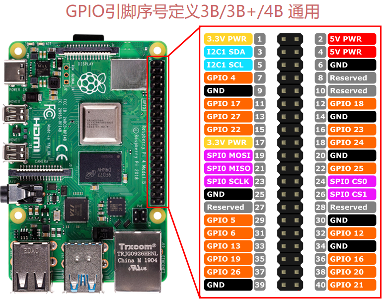
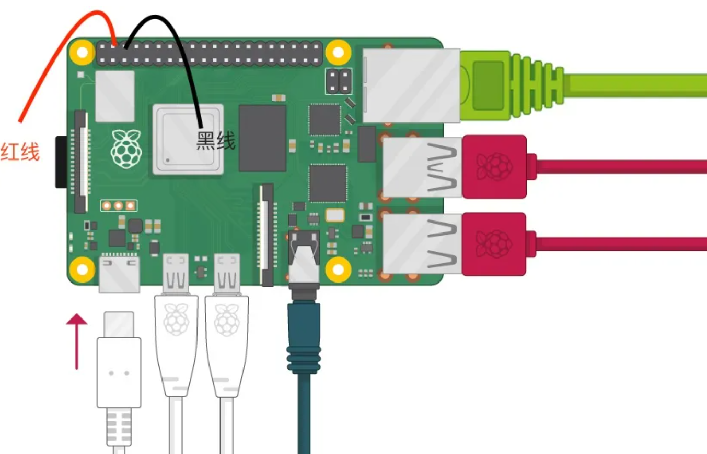
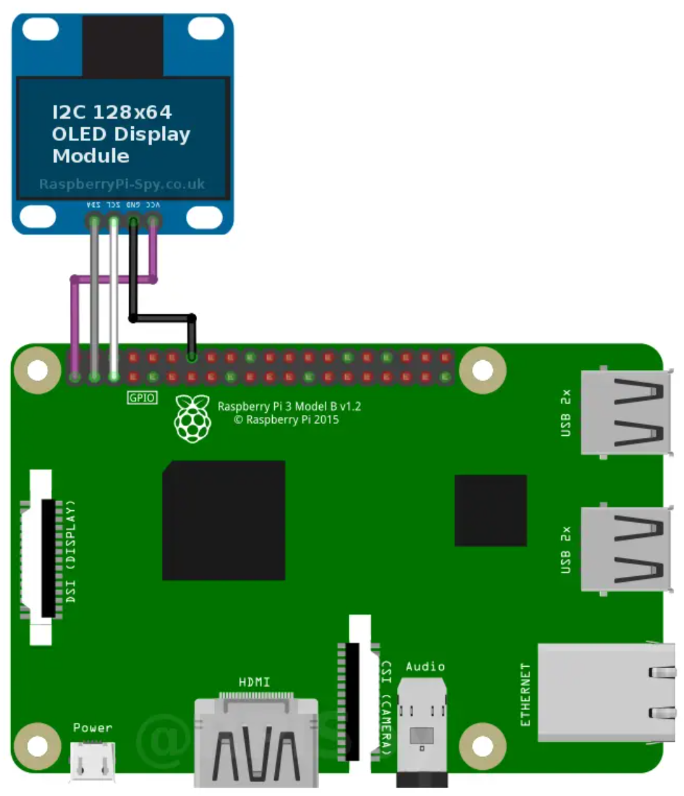

# Rasberry Pi 基础

## Rasberry Pi 版本

<table>
    <tr>
        <td>Rasberry Pi Zero</td>
        <td>最小的树莓派设备</td>
        <td></td>
    </tr>
    <tr>
        <td>Rasberry Pi Zero W</td>
        <td>包含WiFi的Zero版本</td>
        <td></td>
    </tr>
</table>

### Rasberry Pi 4B

Rasberry Pi 4B的配置：

- 2个USB2端口、2个USB3端口
- 2个微型HDMI端口，支持2个4K显示器
- 1个专用千兆以太网端口
- 支持2~8GB的内存（树莓派的内存是难以更替的，在购买时需要谨慎选择）
- 博通BCM2711，1.5GHz四核Cortex-A72（ARM v8）64位片上系统
- 2.4GHz与5.0GHz IEEE802.11ac WiFi
- 蓝牙
- 40针GPIO接口（`pinout`命令可查看）

 

## 基本安装

- 将需要的系统通过镜像工具刷入SD卡即可

### 散热

- Rasberry Pi运行期间的温度不应超过70&#8451;，保持在40&#8451;\~60&#8451;

 

- 风扇的红黑线接反，则风扇不会转；分别插入到GPIO接口的4、6号引脚
- 风扇的吹风方向：封闭式则抽风（向外）；开放式则吹风（向内）

### OLED （I2C）

1. 使用杜邦线连接引脚

GND --- GND
VCC --- 接树莓派 5V
SDA --- I2C 数据
SCL --- I2C 时钟

 

2. 下载安装i2c工具，并打开I2C接口

```shell
# 安装i2c工具
sudo apt install -y python3-smbus
sudo apt install -y i2c-tools

# 树莓派打开I2C接口的方式 sudo raspi-config

# 检测i2c数量
i2cdetect -l

# 检测i2c总线上挂的设备，以及其物理地址
i2cdetect -r -y 1
#      0  1  2  3  4  5  6  7  8  9  a  b  c  d  e  f
# 00:          -- -- -- -- -- -- -- -- -- -- -- -- -- 
# 10: -- -- -- -- -- -- -- -- -- -- -- -- -- -- -- -- 
# 20: -- -- -- -- -- -- -- -- -- -- -- -- -- -- -- -- 
# 30: -- -- -- -- -- -- -- -- -- -- -- -- 3c -- -- -- 
# 40: -- -- -- -- -- -- -- -- -- -- -- -- -- -- -- -- 
# 50: -- -- -- -- -- -- -- -- -- -- -- -- -- -- -- -- 
# 60: -- -- -- -- -- -- -- -- -- -- -- -- -- -- -- -- 
# 70: -- -- -- -- -- -- -- --  
```

3. 下载Adafruit的Python库，这个库支持所有的 SSD1306 相关的显示屏，包括 128×32 和 128×64 屏幕

```shell
# 克隆需要的Adafruit的Python 库
git clone https://github.com/adafruit/Adafruit_Python_SSD1306.git

# 进行安装
cd Adafruit_Python_SSD1306
sudo python3 setup.py install

sudo apt install python3-pil
# python运行屏幕显示脚本
cd examples
python3 shapes.py
```

#### 屏幕显示脚本

- 参考`Adafruit_Python_SSD1306/examples`目录下的文件，尤其是`Adafruit_Python_SSD1306/examples/stats.py`
- 可以在UbuntuServer等的[开机启动脚本](./Shell.md)中设置自动启动`python3 /home/zjk/Documents/Adafruit_Python_SSD1306/examples/stats.py`命令（开机自启动sh）

```python
# Copyright (c) 2017 Adafruit Industries
# Author: Tony DiCola & James DeVito
#
# Permission is hereby granted, free of charge, to any person obtaining a copy
# of this software and associated documentation files (the "Software"), to deal
# in the Software without restriction, including without limitation the rights
# to use, copy, modify, merge, publish, distribute, sublicense, and/or sell
# copies of the Software, and to permit persons to whom the Software is
# furnished to do so, subject to the following conditions:
#
# The above copyright notice and this permission notice shall be included in
# all copies or substantial portions of the Software.
#
# THE SOFTWARE IS PROVIDED "AS IS", WITHOUT WARRANTY OF ANY KIND, EXPRESS OR
# IMPLIED, INCLUDING BUT NOT LIMITED TO THE WARRANTIES OF MERCHANTABILITY,
# FITNESS FOR A PARTICULAR PURPOSE AND NONINFRINGEMENT. IN NO EVENT SHALL THE
# AUTHORS OR COPYRIGHT HOLDERS BE LIABLE FOR ANY CLAIM, DAMAGES OR OTHER
# LIABILITY, WHETHER IN AN ACTION OF CONTRACT, TORT OR OTHERWISE, ARISING FROM,
# OUT OF OR IN CONNECTION WITH THE SOFTWARE OR THE USE OR OTHER DEALINGS IN
# THE SOFTWARE.
import time

import Adafruit_GPIO.SPI as SPI
import Adafruit_SSD1306

from PIL import Image
from PIL import ImageDraw
from PIL import ImageFont

import subprocess

# Raspberry Pi pin configuration:
RST = None     # on the PiOLED this pin isnt used
# Note the following are only used with SPI:
DC = 23
SPI_PORT = 0
SPI_DEVICE = 0

# Beaglebone Black pin configuration:
# RST = 'P9_12'
# Note the following are only used with SPI:
# DC = 'P9_15'
# SPI_PORT = 1
# SPI_DEVICE = 0

# 128x32 display with hardware I2C:
# disp = Adafruit_SSD1306.SSD1306_128_32(rst=RST)

# 128x64 display with hardware I2C:
disp = Adafruit_SSD1306.SSD1306_128_64(rst=RST)

# Note you can change the I2C address by passing an i2c_address parameter like:
# disp = Adafruit_SSD1306.SSD1306_128_64(rst=RST, i2c_address=0x3C)

# Alternatively you can specify an explicit I2C bus number, for example
# with the 128x32 display you would use:
# disp = Adafruit_SSD1306.SSD1306_128_32(rst=RST, i2c_bus=2)

# 128x32 display with hardware SPI:
# disp = Adafruit_SSD1306.SSD1306_128_32(rst=RST, dc=DC, spi=SPI.SpiDev(SPI_PORT, SPI_DEVICE, max_speed_hz=8000000))

# 128x64 display with hardware SPI:
# disp = Adafruit_SSD1306.SSD1306_128_64(rst=RST, dc=DC, spi=SPI.SpiDev(SPI_PORT, SPI_DEVICE, max_speed_hz=8000000))

# Alternatively you can specify a software SPI implementation by providing
# digital GPIO pin numbers for all the required display pins.  For example
# on a Raspberry Pi with the 128x32 display you might use:
# disp = Adafruit_SSD1306.SSD1306_128_32(rst=RST, dc=DC, sclk=18, din=25, cs=22)

# Initialize library.
disp.begin()

# Clear display.
disp.clear()
disp.display()

# Create blank image for drawing.
# Make sure to create image with mode '1' for 1-bit color.
width = disp.width
height = disp.height
image = Image.new('1', (width, height))

# Get drawing object to draw on image.
draw = ImageDraw.Draw(image)

# Draw a black filled box to clear the image.
draw.rectangle((0,0,width,height), outline=0, fill=0)

# Draw some shapes.
# First define some constants to allow easy resizing of shapes.
padding = -2
top = padding
bottom = height-padding
# Move left to right keeping track of the current x position for drawing shapes.
x = 0


# Load default font.
font = ImageFont.load_default()

# Alternatively load a TTF font.  Make sure the .ttf font file is in the same directory as the python script!
# Some other nice fonts to try: http://www.dafont.com/bitmap.php
# font = ImageFont.truetype('Minecraftia.ttf', 8)

while True:

    # Draw a black filled box to clear the image.
    draw.rectangle((0,0,width,height), outline=0, fill=0)

    # Shell scripts for system monitoring from here : https://unix.stackexchange.com/questions/119126/command-to-display-memory-usage-disk-usage-and-cpu-load
    cmd = "hostname -I | cut -d\' \' -f1"
    IP = subprocess.check_output(cmd, shell = True )
    cmd = "top -bn1 | grep load | awk '{printf \"CPU Load: %.2f\", $(NF-2)}'"
    CPU = subprocess.check_output(cmd, shell = True )
    cmd = "free -m | awk 'NR==2{printf \"Mem: %s/%sMB %.2f%%\", $3,$2,$3*100/$2 }'"
    MemUsage = subprocess.check_output(cmd, shell = True )
    cmd = "df -h | awk '$NF==\"/\"{printf \"Disk: %d/%dGB %s\", $3,$2,$5}'"
    Disk = subprocess.check_output(cmd, shell = True )

    # Write two lines of text.

    draw.text((x, top),       "IP: " + str(IP),  font=font, fill=255)
    draw.text((x, top+8),     str(CPU), font=font, fill=255)
    draw.text((x, top+16),    str(MemUsage),  font=font, fill=255)
    draw.text((x, top+25),    str(Disk),  font=font, fill=255)

    # Display image.
    disp.image(image)
    disp.display()
    time.sleep(.1)
```

# 软路由