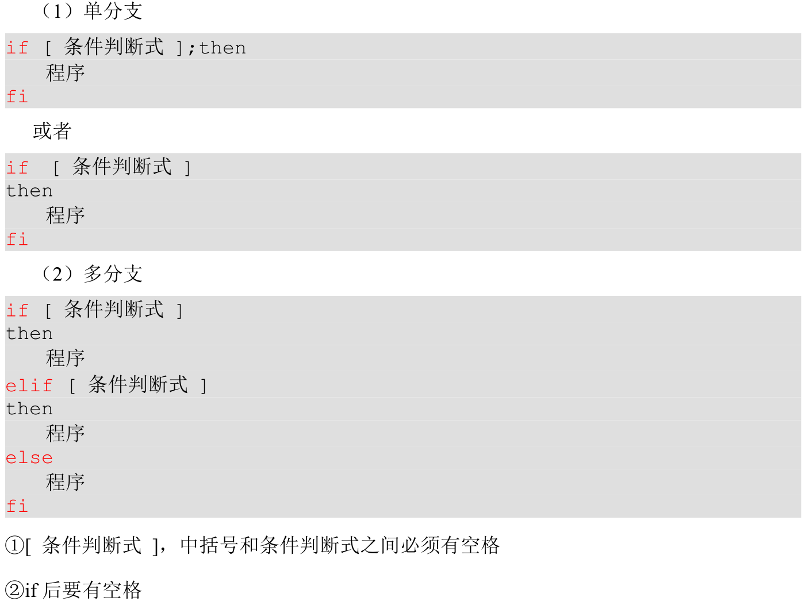
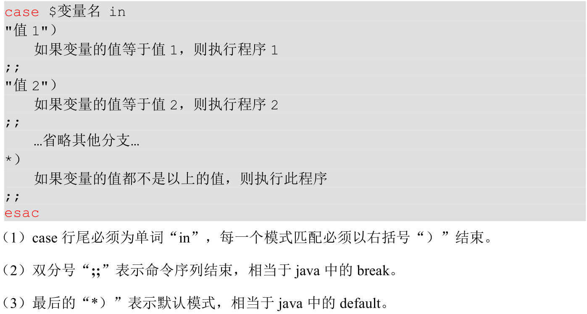

# Shell基础

## shell

- Linux中的Shell通常默认是bash（Bourne Again Shell），命令本身是一个函数，而shell也是进程，可以使用ps、kill等指令操作。提供用户与操作系统进行交互操作的接口，方便用户使用系统中的软硬件资源。提供脚本语言编程环境，方便用户完成简单到复杂的任务调度。

| shell     | 说明                                                         |
| --------- | ------------------------------------------------------------ |
| /bin/bash | 用户默认shell，用户登录某个虚拟控制台终端或在GUI中运行终端仿真器时启动。 |
| /bin/sh   | 系统默认shell，启动时需要使用的系统shell脚本。               |

- Linux启动时，最先进入内存的是内核，并常驻内存。然后进行系统引导，引导过程中启动所有进程的父进程在后台运行，直到相关的系统资源初始化完毕后，等待用户登录。用户登录时，通过登录进程验证用户的合法性。用户验证通过后根据用户的设置启动相关的Shell，以便接收用户输入的命令并返回执行结果。

 

### shell的父子关系

- 在用户默认shell中，输入/bin/bash、其他的bash命令时，会创建一个新的子shell。此时该用户默认shell就是这个子shell的父进程。
- 创建子shell的代价较高，需要为该子shell创建新的环境。

```shell
# 查看当前shell的子shell数量
echo $BASH_SUBSHELL
```

- `( ; ; ) `生成一个子shell将按括号内的命令依次执行，执行完成之后，该子shell自动被杀死。

> `;` 命令列表
>
> `{;}` coproc协程

### 内建命令、外部命令

| 命令形式 | 说明                                                         |
| -------- | ------------------------------------------------------------ |
| 内建命令 | 不需要子进程执行，已和shell编译成一体；不需要借助外部程序文件来执行。 |
| 外部命令 | 存在于bash shell之外的程序，并不是shell程序的一部分；执行时会创建一个子shell（衍生）。<br />外部命令通常位于/bin、/usr/bin、/usr/sbin中。 |

| 命令  | 说明               |
| ----- | ------------------ |
| type  | 查看是否为内建命令 |
| which | 显示外部命令的文件 |

- 对于有多种方式实现的命令，如果需要指定为外部命令的方式实现，可以通过which找到相应的文件，直接执行该文件即可。

### shell脚本规范

```shell
#!/bin/bash
# 解释器

# 注释 <<关键字
<<END
 注释
END

# 执行的命令
echo "Hello World"
```

| 执行方式      | 说明                                                         |
| ------------- | ------------------------------------------------------------ |
| 直接执行      | 需要可执行权限（x）。<br />在当前shell内开启一个子shell执行脚本，脚本结束时关闭子shell并回到父shell。<br />`./test.sh` |
| 解释器        | 不需要执行权限<br />在当前shell中开启一个子shell执行脚本，脚本结束时关闭子shell并回到父shell。<br />`bash test.sh`、`sh test.sh` |
| .<br />source | 使脚本内容在当前shell里执行，而无需打开子shell。<br />`. test.sh`、`source test.sh` |

- 子shell中设置的当前变量，父 shell 是不可见的。

#### 引号

| 引号      | 说明                       |
| --------- | -------------------------- |
| 单引号 '  | 将特殊符号变成普通符号     |
| 双引号 "  | 保持特殊符号的特殊使用     |
| 反引号 \` | 使用命令的输出结果替换命令 |

```shell
echo "current position is `pwd`"
# current position is /root/Test

echo 'current position is `pwd`'
# current position is `pwd`
```

## 环境变量

- 环境变量存储有关shell会话和工作环境的信息，允许用户在内存中存储数据。

| 比较   |             全局变量             |                           局部变量                           |
| ------ | :------------------------------: | :----------------------------------------------------------: |
| 可见性 | shell会话<br />所有生成的子shell | 创建该局部变量的shell<br />父shell创建的局部变量，子shell不可见。<br />子shell创建的局部变量，父shell也不可见。 |
| 名称   |               大写               |                             小写                             |
| 查看   |        env<br />printenv         |                           printenv                           |

| 命令 | 说明                                                         |
| ---- | ------------------------------------------------------------ |
| read | 从键盘读取变量值。<br />该命令可以一次读取多个变量的值，变量和输入的值都需要使用空格隔开。<br />如果没有指定变量名，读取的数据将被自动赋值给特定的变量REPLY。 |
| env  | 显示系统中已存在的环境变量。<br />如果使用env命令在新环境中执行指令时，会因为没有定义环境变量“PATH”而提示错误信息。此时，用户可以重新定义一个新的“PATH”或者使用绝对路径。 |

```shell
#!/bin/bash

read -t 10 -p "请在10秒内输入: " value1
echo "输出：$value1"
```

| 命令     | 比较                                                         |
| -------- | ------------------------------------------------------------ |
| set      | 显示为某个特定进程设置的所有环境变量，包括局部变量、全局变量、用户定义变量。<br />对输出的结果按照字母顺序来排序。 |
| env      | 不对输出结果排序，不输出局部变量和用户定义变量。<br />查看全局变量时，使用env、printenv。 |
| printenv | 不对输出结果排序，不输出局部变量和用户定义变量。<br />查看个别环境变量时，使用printenv而不是env。 |

### 用户定义变量

| 命令     | 说明                                                         |
| -------- | ------------------------------------------------------------ |
| declare  | 声明和显示已存在的shell变量。<br />`变量名=变量值`、`declare 变量名=变量值` |
| set      | 显示系统中已经存在的shell变量、设置shell变量的新变量值。<br />不能定义新的shell变量。 |
| unset    | 删除已定义的shell变量（包括环境变量）、shell函数。<br />不能删除具有只读属性的shell变量和环境变量。 |
| readonly | 定义只读shell变量和shell函数。                               |
| export   | 将shell变量、函数输出为环境变量。<br />修改子shell中全局变量的值，不会影响到父shell中该全局变量的值，只会影响该子shell创建的子shell的全局变量的值。<br />一个变量创建时，它不会自动地为在它之后创建的shell进程所知。而export命令可以向后面的shell传递变量的值。当一个shell脚本调用并执行时，它不会自动得到原为脚本（调用者）里定义的变量的访问权，除非这些变量已经被显式地设置为可用。 |

**变量定义规则**

1. 变量名称可以由字母、数字和下划线组成，但是不能以数字开头，环境变量名建议大写。
2. 等号两侧不能有空格。
3. 在 bash 中，变量默认类型都是字符串类型，无法直接进行数值运算。
4. 变量的值如果有空格，需要使用双引号或单引号括起来。

### \$ 变量符号

- 如果涉及到变量的使用，使用`$`。如果是操作变量，不使用`$`，printenv也不使用`$`。

| 特殊变量        | 说明                                                         |
| :-------------- | :----------------------------------------------------------- |
| \$n             | n 为数字、\$0 代表该脚本名称。<br />\$1\~\$9 代表第1\~9个参数。<br />10以上的参数用大括号包含，如\$\{10\}。 |
| \$\#            | 获取所有输入参数个数（常用于循环）<br />判断参数的个数是否正确以及加强脚本的健壮性。 |
| \$\* <br /> \$@ | 命令行中所有的参数。<br />`$*`把所有的参数看成一个整体。被双引号“”包含时，`$*`会将所有的参数作为一个整体，以`“$1 $2 …$n”`的形式输出所有参数。<br />`$@`把每个参数区分对待。被双引号“”包含时，`$@`会将各个参数分开，以`“$1” “$2”…“$n”`的形式输出所有参数。 |
| \$?             | 最后一次执行的命令的返回状态。<br />若该变量的值为0，则上一个命令执行正确。<br />若该变量的值非0，则上一个命令执行错误。 |

```shell
#!/bin/bash

for i in $*
do
    echo "\$*  $i"
done

for i in $@
do
    echo "\$@  $i"
done    

for i in "$*"
do
    echo "\$*  $i"
done

for i in "$@"
do
    echo "\$@  $i"
done 
```

```shell
[zjk@www ShellTest]$ . forTest02.sh 1 2 3
$*  1
$*  2
$*  3
$@  1
$@  2
$@  3
$*  1 2 3
$@  1
$@  2
$@  3
```

### 语系变量 locale命令

| 命令      | 比较                                 |
| --------- | ------------------------------------ |
| locale    | 当前软件的语系。<br />不修改配置文件 |
| localectl | 当前系统的语系。<br />修改配置文件   |

```shell
# 设置当前系统语系 同时修改配置文件
localectl set-locale LANG=en_US.UTF-8 
```

- 设置语系变量时，一般建议更改LANG与LC\_ALL这两个变量，因为设置这两个变量，其他语系变量都会替换成LANG与LC\_ALL这两个变量的值。LANG直接用=号赋值即可。LC\_ALL需要使用export设置。

> 设置LANG=zh\_CN\.UTF\-8，发现其他的变量都变成zh\_CN\.UTF\-8

```shell
LANG=en_US.UTF-8
export LC_ALL=en_US.UTF-8
```


###  系统环境变量

| 系统变量                     | 说明                                                         |
| :--------------------------- | :----------------------------------------------------------- |
| \$PATH<br />（/etc/profile） | 执行文件查找的路径。<br />文件查找的顺序与PATH的变量的顺序有关。<br />目录与目录中间以:冒号隔开。 |
| \$HOME                       | 当前用户主目录                                               |
| \$HISTSIZE                   | 代表可以容纳多少条历史命令                                   |
| \$LOGNAME                    | 当前用户的登录名                                             |
| \$HOSTNAME                   | 指主机的名称                                                 |
| \$SHELL                      | 当前用户Shell类型                                            |
| \$LANG                       | 当前的语系类型                                               |
| \$MAIL                       | 当前用户的邮件存放目录                                       |
| \$PS1                        | 基本提示符                                                   |
| \$RANDOM                     | 随机数的变量                                                 |

## 运算符

### 算术运算式

```shell
$((运算式)) 

$[运算式]
```

```shell
s=(1+2)
s1=$((1+2))
s2=$[1+2]
echo -e "$s\n$s1\n$s2" 
# 1+2
# 3
# 3
```

| 命令 | 说明                                 |
| ---- | ------------------------------------ |
| let  |                                      |
| bc   | 支持任意精度的交互执行的计算器语言。 |

> bash内置对整数四则运算的支持，但并不支持浮点运算。

```shell
echo $[ 9.9 * 9 ]
#-bash: 9.9 * 9 : syntax error: invalid arithmetic operator (error token is ".9 * 9 ")

# 算术操作高级运算bc命令它可以执行浮点运算和一些高级函数：
echo "1.212*3" | bc 
3.636
# 设定小数精度（数值范围）
echo "scale=2;3/8" | bc # 参数scale=2是将bc输出结果的小数位设置为2位。
0.37

# 进制转换
abc=192
echo "obase=2;$abc" | bc
#执行结果为：11000000，这是用bc将十进制转换成二进制。
abc=11000000
echo "obase=10;ibase=2;$abc" | bc
#执行结果为：192，这是用bc将二进制转换为十进制。

# 计算平方和平方根：
echo "10^10" | bc
echo "sqrt(100)" | bc
```

### 条件判断

```shell
test 条件表达式

[条件表达式]
# [非空] true
# [] false
```

| 整数比较 | 说明 | 整数比较 | 说明     |
| -------- | ---- | -------- | -------- |
| -eq      | 等于 | -ne      | 不等于   |
| -lt      | 小于 | -le      | 小于等于 |
| -gt      | 大于 | -ge      | 大于等于 |

| 文件权限 | 说明           | 文件类型 | 说明                 |
| -------- | -------------- | -------- | -------------------- |
| -r       | 可读           | -e       | 文件存在             |
| -w       | 可写           | -f       | 文件存在且是常规文件 |
| -x       | 可执行         | -d       | 文件存在且是目录     |
| 以上     | 也判断文件存在 | -s       | 文件存在且非空       |

| 逻辑 | 说明 |
| ---- | ---- |
| !    | 取反 |
| -a   | \&\& |
| -o   | \|\| |

- -z 、-n 判断字符串是否为空。最好使用"$变量"的方式判断（空格也被看作不为空）。

#### \[\[\]\]

| 判断符         | \[\[\]\]                               | \[\]               |
| -------------- | -------------------------------------- | ------------------ |
| \&\&<br />\|\| | 支持                                   | 不支持             |
| ==             | 模式匹配<br />通配符`*、?、[..]`       | 匹配字符串是否相同 |
| 正则           | 支持=\~                                | 不支持             |
| 运算           | 允许使用\(\)                           | 仅支持部分         |
| \<<br />\>     | 排序操作<br />（本地的locale语言顺序） |                    |

## 流程控制

### 判断

#### if

 

```shell
#!/bin/bash

if [ $1 -eq $2 ]
then
        echo "$1等于$2"
elif [ $1 -lt $2 ]
then
        echo "$1小于$2"
else
        echo "$1大于$2"
fi
```

#### case

 

```shell
#!/bin/bash

case $1 in
"1")
    echo "选项1"
;;
"2")
    echo "选项2"
;;
*)
    echo "其他选项"
;;
esac
```

### 循环

#### for

 
 

```shell
#!/bin/bash

for ((i=0;i<10;i++))
do
    echo $i
done

for i in 第一名 第二名 第三名
do 
   echo $i 
done 
```

#### while

 

```shell
#!/bin/bash

i=0

while [ $i -lt 3 ]
do
    i=$[ $i+1 ]
    echo $i
done
```

## 函数

### 系统函数（shell命令）

| 函数     | 说明                                                         |
| -------- | ------------------------------------------------------------ |
| basename | 删掉所有的前缀包括最后一个（/）字符，然后将字符串显示出来。  |
| dirname  | 从给定的包含绝对路径的文件名中去除文件名（非目录的部分），然后返回剩下的路径（目录的部分）。 |

### 自定义函数

```shell
[ function ] 函数名[()]
{
    执行语句;
    [return int;]
}
```

1. 必须在调用函数地方之前，先声明函数，shell 脚本是逐行运行。
2. 函数返回值只能通过`$?`系统变量获得。return语句设置返回值，return关键字后跟数值n（0\~255）；若没有return语句，则以最后一条命令运行结果，作为返回值。

```shell
#!/bin/bash

function sum()
{
    sumValue=$[ $1 + $2 ]
    echo "sum=$sumValue"
}

avg()
{
    echo "avg=$[ ($1 + $2) / 2 ]"
}

function minus
{
    echo "minus=$[ $1 - $2 ]"
}

read -t 10 -p "请输入值1: " num1;
read -t 10 -p "请输入值2：" num2;

sum $num1 $num2;
avg $num1 $num2;
minus $num1 $num2;
```

 
