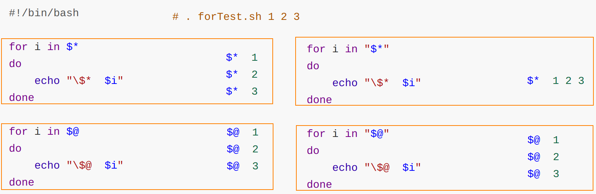

# shell概述

## bash

- bash（Bourne Again Shell，/bin/bash）：Linux中的默认shell，提供用户与操作系统进行交互操作的接口，提供脚本语言编程环境。

| shell     | 说明                                                         |
| --------- | ------------------------------------------------------------ |
| /bin/bash | 用户默认shell，用户登录某个虚拟控制台终端或在GUI中运行终端仿真器时启动 |
| /bin/sh   | 系统默认shell，启动时需要使用的系统shell脚本                 |

- Linux启动时，最先进入内存的是内核，并常驻内存。然后进行系统引导，引导过程中启动所有进程的父进程在后台运行，直到相关的系统资源初始化完毕后，等待用户登录。用户登录时，通过登录进程验证用户的合法性。用户验证通过后根据用户的设置启动相关的Shell，以便接收用户输入的命令并返回执行结果。

 

## shell的父子关系

- 用户在默认shell中输入/bin/bash或其他的bash命令时，会创建一个新的子shell，此时该shell就是这个子shell的父进程；创建子shell的代价较高，需要为该子shell创建新的环境。

```shell
# 查看当前shell的子shell数量
echo $BASH_SUBSHELL
```

| 操作符                | 说明                                                         |
| --------------------- | ------------------------------------------------------------ |
| `(命令; 命令; 命令) ` | 生成一个子shell，并由其按括号内的命令依次执行，执行完成之后，该子shell自动被杀死 |
| `命令; 命令`          | 命令列表                                                     |
| `{命令; 命令}`        | coproc协程                                                   |

## bashrc

### /etc/bashrc 

- <span name="bashrc">/etc/bashrc</span>（Ubuntu：/etc/bash.bashrc）：为每一个运行bash shell的用户执行此文件；bash shell被打开时，该文件被读取。

### \~/.bashrc 

- \~/.bashrc：专属于个人bash shell的信息；用户登录以及每次打开一个新的shell时，执行这个文件；在这个文件里可以自定义用户专属的个人信息。

# shell相关命令

##  命令别名

### alias 别名

- alias：设置指令的别名，只在当前shell起作用，未更改[/etc/bashrc](#bashrc)；对于个人专用的命令别名，应该在[\~/.bashrc](#bashrc)设置。

```shell
# 查看已经设置的别名
alias
alias -p

# 检查别名是否已被使用
type 别名

# 设置/更改别名，多条命令之间使用分号分隔
alias 别名='命令1;命令2'

# 撤销别名，只在当前shell起作用，未更改/etc/bashrc
unalias 别名
```

## 内建命令、外部命令

| 命令形式 | 说明                                                         |
| -------- | ------------------------------------------------------------ |
| 内建命令 | 不需要子进程执行，已和shell编译成一体；不需要借助外部程序文件来执行 |
| 外部命令 | 存在于bash shell之外的程序，并不是shell程序的一部分；执行时会创建一个子shell（衍生）<br />外部命令通常位于/bin、/usr/bin、/usr/sbin |

### type 查看命令类型

<table><tbody><tr><th>常用类型</th><th>信息说明</th></tr><tr><td>builtin</td><td>内部指令</td></tr><tr><td>file</td><td>文件</td></tr><tr><td>function</td><td>函数</td></tr><tr><td>keyword</td><td>关键字</td></tr><tr><td>alias</td><td>别名</td></tr><tr><td>unfound</td><td>没有找到</td></tr></tbody></table>

```shell
type ls
# ls is aliased to `ls --color=auto'

type mv
# mv is /usr/bin/mv

type source
# source is a shell builtin
```

### which 查找命令文件

- which：查找命令文件，能够快速搜索二进制程序所对应的位置。
- 如果我们既不关心同名文件（find与locate），也不关心命令所对应的源代码和帮助文件（whereis），仅仅是想找到命令本身所在的路径，那么这个which命令就太合适了。
- 对于有多种方式实现的命令，如果需要指定为外部命令的方式实现，可以通过which找到相应的文件，直接执行该文件即可。

<table><tbody><tr><td>-a</td><td>显示PATH变量中所有匹配的可执行文件</td></tr><tr><td>-n</td><td>设置文件名长度（不含路径）</td></tr><tr><td>-p</td><td>设置文件名长度（含路径）</td></tr><tr><td>-V</td><td>显示版本信息</td></tr><tr><td>-w&nbsp;</td><td>设置输出时栏位的宽度</td></tr><tr><td>--help</td><td>显示帮助信息</td></tr><tr><td>--read-functions</td><td>从标准输入中读取Shell函数定义</td></tr><tr><td>--show-tilde</td><td>使用波浪线代替路径中的家目录</td></tr><tr><td>--skip-dot</td><td>跳过PATH变量中以点号开头的目录</td></tr></tbody></table>

```shell
# 查找多个指定命令文件的位置
which ls who
#/usr/bin/ls
#/usr/bin/who  
```

## history 历史命令

- history：查看历史命令记录
- `$HISTSIZE`：最大保存的历史命令条数（默认1000条）
- \~/\.bash\_history：历史命令文件；bash命令的历史记录先放在内存中，bash退出时才被写入到历史文件

<table><tbody><tr><td>-a</td><td>保存命令记录</td></tr><tr><td>-c</td><td>清空命令记录</td></tr><tr><td>-d</td><td>删除指定序号的命令记录</td></tr><tr><td>-n</td><td>读取命令记录</td></tr><tr><td>-r</td><td>读取命令记录到缓冲区</td></tr><tr><td>-s</td><td>添加命令记录到缓冲区</td></tr><tr><td>-w</td><td>将缓冲区信息写入到历史文件</td></tr></tbody></table>

```shell
# 查看指定的历史命令记录
history [n]
上下光标

# 清空当前缓冲区中的历史命令（并未对历史命令文件修改）
history -c

# 将历史命令文件中的命令读入当前历史命令缓冲区，否则只有在第一个终端被打开时才会读取历史命令文件
history -r

# 将历史命令缓冲区中的命令写入历史命令文件，同时打开多个终端时，其他终端的历史记录不会自动更新
history -a

# 将当前历史命令缓冲区中的命令写入历史命令文件，同时打开多个终端时，其他终端的历史记录也会自动更新
history -w
```

### \!\! 执行上次命令

```shell
# 执行上次命令
!!

# 执行指定序号的历史命令
!{n}

# 执行以指定字符开头的历史命令
!{prex}
```

## 限时任务 timeout

- timeout：运行指定命令，若在指定时间后，该命令仍然在运行，则结束该命令的执行，并返回退出状态码`124`（\$? 获取）（未超时则正常返回）；以执行下一条命令（如果存在）。

<table><tbody><tr><td>-s&lt;信号&gt;</td><td>指定在超时时发送的信号，信号可以是类似“HUP”的信号名或是信号数</td></tr><tr><td>-k&lt;时间&gt;</td><td>达到给定的时间限制后会强制结束</td></tr><tr><td>-- -foreground</td><td>在前台运行</td></tr></tbody></table>

```shell
# 5秒钟后发送SIGKILL信号给ping命令以终止该命令
timeout -s SIGKILL 5s top

# 运行命令一分钟，如果命令没有结束，将在10秒后终止该命令
timeout -k 10s 1m top
```

## \| 管道符

- \|（管道符）：连接两个命令，将一个程序/命令的输出作为另一个程序/命令的参数输入。一般为输入和输出的结合，一个进程向管道的一端发送数据，而另一个进程从该管道的另一端读取数据。

```shell
ll /etc | grep "*.config"
```

## 标准输入与输出、重定向操作符

- 执行一个Shell命令通常会自动打开3个标准文件：标准输入文件stdin、标准输出文件stout、标准错误输出文件stderr；进程从标准输入文件得到输入数据，将正常输出数据输出到标准输出文件，而错误信息则打印到标准错误文件。

 

1. 如果给定的文件不止一个，则在显示的每个文件前面加一个文件名标题。
2. 若不指定任何文件名称/给予的文件名为"\-"，则命令从标准输入设备读取数据。

- 重定向操作符：把命令/可执行程序的标准输入/输出重定向到指定的文件。

| 操作符 | 说明                                                         |
| ------ | ------------------------------------------------------------ |
| \<     | 输入重定向                                                   |
| \<\<   | 文档的重定向                                                 |
| \>     | 输出重定向；若\>后面的文件不存在，则创建该文件；若存在，则将内容覆盖到该文件。 |
| \>\>   | 追加输出重定向；若\>\>后面的文件不存在，则创建该文件；若存在，则将内容追加到该文件。 |
| 2\>    | 错误输出重定向<br />若`2>`后面的文件不存在，则创建该文件；若存在，则将内容覆盖到该文件。<br />如果有错误信息，则不会在屏幕（标准输出文件）输出，而会保存在指定的文件；即使没有错误信息也会创建/覆盖。 |
| 2\>\>  | 追加错误输出重定向<br />若`2>>`后面的文件不存在，则创建该文件；若存在，则将内容追加到该文件。<br />如果有错误信息，则不会在屏幕（标准输出文件）输出，而会保存在指定的文件中；即使没有错误信息也会创建/追加。 |

```shell
# 重定向操作符可以混合使用，如将标准输出和标准错误输出重定向到同一个文件
ls >myOutAndErr.txt 2>&
```

## 脚本执行

### 直接执行

- 需要可执行权限（x），在当前shell内开启一个子shell执行脚本，脚本结束时关闭子shell并回到父shell

```shell
./test.sh
```

### bash/sh shell命令语言解释器

- sh（shell）：sh是bash的别名命令，不需要执行权限，在当前shell中开启一个子shell执行脚本，脚本结束时关闭子shell并回到父shell

```shell
bash test.sh

sh test.sh
```

<table><tbody><tr><td>-c</td><td>从字符串中读取命令</td></tr><tr><td>-i </td><td>实现脚本交互 </td></tr><tr><td>-n </td><td>进行语法检查 </td></tr><tr><td>-v</td><td>显示执行过程详细信息</td></tr><tr><td>-x </td><td>实现逐条语句的跟踪 </td></tr><tr><td>--help</td><td>显示帮助信息</td></tr><tr><td>--version</td><td>显示版本信息</td></tr></tbody></table>

### . source 从指定文件中读取和执行命令

- source（. 点命令）：用于从指定文件（不需要执行权限）中读取和执行命令，通常用于被修改过的文件，使之新参数能够立即生效，而不必重启整台服务器。使脚本内容在当前shell里执行，而无需打开子shell

```shell
. test.sh

source test.sh
```

## date 日期时间

```shell
date "+%Y-%m-%d %H:%M:%S"
# 2023-12-31 10:24:53
```

# shell script语法规范

## 基础规范

### 脚本规范

```shell
#!/bin/bash
# 解释器

# 注释 <<关键字
<<END
 注释
END

# 执行的命令
echo "Hello World"
```

### 单引号、双引号与反引号

| 引号      | 说明                       |
| --------- | -------------------------- |
| 单引号 '  | 将特殊符号变成普通符号     |
| 双引号 "  | 保持特殊符号的特殊使用     |
| 反引号 \` | 使用命令的输出结果替换命令 |

```shell
echo "current position is `pwd`"
# current position is /root/Test

echo 'current position is `pwd`'
# current position is `pwd`
```

## 变量

### 全局变量与局部变量

<table>
    <tr>
        <td>变量类型</td>
        <td>命名规范</td>
        <td>可见性</td>
        <td>声明与定义</td>
    </tr>
    <tr>
        <td>全局变量</td>
        <td>大写</td>
        <td>创建该全部变量shell，及其子shell</td>
        <td>export</td>
    </tr>
    <tr>
        <td>局部变量</td>
        <td>小写</td>
        <td>仅创建该局部变量的shell</td>
        <td>大部分方式</td>
    </tr>
</table>

### \$ 变量符

<table>
    <tr>
        <th>特殊变量</th>
        <th>说明</th>
    </tr>
    <tr>
        <td>$n</td>
        <td>$0代表该脚本文件名；$1~$9代表该命令输入的第1~9个参数<br/>序号为10以上的参数用大括号包含，如${10}</td>
    </tr>
    <tr>
        <td>$#</td>
        <td>获取所有输入参数个数（常用于循环），判断参数的个数是否正确以及加强脚本的健壮性</td>
    </tr>
    <tr>
        <td>$*</td>
        <td>命令行中所有的参数，把所有的参数看成一个整体；被双引号“”包含时，$*以“$1 $2 …$n”的形式输出所有参数</td>
    </tr>
    <tr>
        <td>$@</td>
        <td>命令行中所有的参数，把每个参数区分对待；被双引号“”包含时，$@以“$1” “$2”...“$n”的形式输出所有参数</td>
    </tr>
    <tr>
        <td>$?</td>
        <td>最后一次执行的命令的返回状态<br />若该变量的值为0，则上一个命令执行正确；若该变量的值非0，则上一个命令执行错误</td>
    </tr>
</table>
### 查看与读取变量

| 命令     | 比较                                                         |
| -------- | ------------------------------------------------------------ |
| set      | 显示为某个特定进程设置的所有环境变量，包括局部变量、全局变量、用户定义变量。<br />对输出的结果按照字母顺序来排序。 |
| env      | 不对输出结果排序，不输出局部变量和用户定义变量。<br />查看全局变量时，使用env、printenv。 |
| printenv | 不对输出结果排序，不输出局部变量和用户定义变量。<br />查看个别环境变量时，使用printenv而不是env。 |

#### read 读取变量值

- read：该命令可以一次读取多个变量的值，变量和输入的值都需要使用空格隔开；如果没有指定变量名，读取的数据将被自动赋值给特定的变量`REPLY`

```shell
#!/bin/bash

read -t 10 -p "请在10秒内输入: " x
echo "输出：$x"
```

#### env 系统中已存在的环境变量

- env：显示系统中已存在的环境变量；如果使用env命令在新环境中执行指令时，会因为没有定义环境变量“PATH”而提示错误信息，此时，用户可以重新定义一个新的“PATH”或者使用绝对路径。

#### printenv

### 定义变量

1. 变量名称可以由字母、数字和下划线组成；但是不能以数字开头，环境变量名建议大写
2. 等号两侧不能有空格
3. 在 bash 中，变量默认类型都是字符串类型，无法直接进行数值运算
4. 变量的值如果有空格，需要使用双引号或单引号括起来

#### declare 声明与显示

- declare：声明和显示已存在的shell变量

```shell
变量名 = 变量值

declare 变量名 = 变量值
```

#### set 赋值与显示

- set：显示系统中已经存在的shell变量、设置shell变量的新变量值；不能定义新的shell变量。

#### unset 删除

- unset：删除已定义的shell变量（包括环境变量）、shell函数；不能删除具有只读属性的shell变量和环境变量

#### readonly 只读变量

- readonly：定义只读shell变量和shell函数

#### export 全局变量

- export：将shell变量、函数输出为环境变量

1. 修改子shell中全局变量的值，不会影响到父shell中该全局变量的值，只会影响该子shell创建的子shell的全局变量的值
2. 一个变量创建时，它不会自动地为在它之后创建的shell进程所知；而export命令可以向后面的shell传递变量的值。即一个shell脚本被调用并执行时，它不会自动得到原为脚本（调用者）定义的变量的访问权，除非这些变量已经被显式地设置为可用

### 语系变量 locale/localectl

| 命令      | 说明                           |
| --------- | ------------------------------ |
| locale    | 当前软件的语系，不修改配置文件 |
| localectl | 当前系统的语系，修改配置文件   |

```shell
# 设置当前系统语系 同时修改配置文件
localectl set-locale LANG=en_US.UTF-8 
```

- `LANG`与`LC_ALL`：设置语系变量时，一般建议更改这两个变量，其他语系变量都会替换成`LANG`与`LC_ALL`这两个变量的值。`LANG`直接用=号赋值即可；而`LC_ALL`需要使用export设置。

```shell
LANG=en_US.UTF-8
export LC_ALL=en_US.UTF-8
```

###  系统环境变量

- 环境变量：存储有关shell会话和工作环境的信息，允许用户在内存中存储数据

| 系统变量                     | 说明                                                         |
| :--------------------------- | :----------------------------------------------------------- |
| \$PATH<br />（/etc/profile） | 执行文件查找的路径；文件查找的顺序与PATH的变量的顺序有关<br />目录与目录中间以:冒号隔开 |
| \$HOME                       | 当前用户主目录                                               |
| \$HISTSIZE                   | 代表可以容纳多少条历史命令                                   |
| \$LOGNAME                    | 当前用户的登录名                                             |
| \$HOSTNAME                   | 指主机的名称                                                 |
| \$SHELL                      | 当前用户Shell类型                                            |
| \$LANG                       | 当前的语系类型                                               |
| \$MAIL                       | 当前用户的邮件存放目录                                       |
| \$PS1                        | 基本提示符                                                   |
| \$RANDOM                     | 随机数的变量                                                 |



## 运算符

### 算术运算式

```shell
$((运算式)) 

$[运算式]
```

```shell
s=(1+2)     # 1+2
s1=$((1+2)) # 3
s2=$[1+2]   # 3
```

#### bc 任意精度运算

- bash内置对整数四则运算的支持，但并不支持浮点运算，需要借助bc命令。

```shell
echo $[ 9.9 * 9 ]
#-bash: 9.9 * 9 : syntax error: invalid arithmetic operator (error token is ".9 * 9 ")

# 算术操作高级运算bc命令它可以执行浮点运算和一些高级函数：
echo "1.212*3" | bc 
3.636
# 设定小数精度（数值范围）
echo "scale=2;3/8" | bc # 参数scale=2是将bc输出结果的小数位设置为2位。
0.37

# 进制转换
abc=192
echo "obase=2;$abc" | bc
#执行结果为：11000000，这是用bc将十进制转换成二进制。
abc=11000000
echo "obase=10;ibase=2;$abc" | bc
#执行结果为：192，这是用bc将二进制转换为十进制。

# 计算平方和平方根：
echo "10^10" | bc
echo "sqrt(100)" | bc
```

### 条件判断

#### \[\]

```shell
test 条件表达式

[条件表达式]
# [非空] true
# [] false
```

| 整数比较 | 说明 | 整数比较 | 说明     |
| -------- | ---- | -------- | -------- |
| -eq      | 等于 | -ne      | 不等于   |
| -lt      | 小于 | -le      | 小于等于 |
| -gt      | 大于 | -ge      | 大于等于 |

| 文件权限 | 说明           | 文件类型 | 说明                 |
| -------- | -------------- | -------- | -------------------- |
| -r       | 可读           | -e       | 文件存在             |
| -w       | 可写           | -f       | 文件存在且是常规文件 |
| -x       | 可执行         | -d       | 文件存在且是目录     |
| 以上     | 也判断文件存在 | -s       | 文件存在且非空       |

| 逻辑 | 说明 |
| ---- | ---- |
| !    | 取反 |
| -a   | \&\& |
| -o   | \|\| |

- -z 、-n 判断字符串是否为空：最好使用"$变量"的方式判断（空格也被看作不为空）；也可以通过`[ $1 ]`的方式判断空，若非空则true

#### \[\[\]\]

| 判断符         | \[\[\]\]                               | \[\]               |
| -------------- | -------------------------------------- | ------------------ |
| \&\&<br />\|\| | 支持                                   | 不支持             |
| ==             | 模式匹配<br />通配符`*、?、[..]`       | 匹配字符串是否相同 |
| 正则           | 支持=\~                                | 不支持             |
| 运算           | 允许使用\(\)                           | 仅支持部分         |
| \<<br />\>     | 排序操作<br />（本地的locale语言顺序） |                    |

#### test

- test：检查条件是否成立，能够对数值、字符和文件进行条件测试

## 流程控制

### 判断

#### if

```shell
if [ 条件判断式 ]; then
	程序
fi

if [ 条件判断式 ] # if的条件判断式与[]之间必须留有空格
then
	程序
fi
```

```shell
if [ 条件判断式 ]
then
	程序
elif[ 条件判断式 ]
then
	程序
else
	程序
fi
```

```shell
#!/bin/bash

if [ $1 -eq $2 ]
then
        echo "$1等于$2"
elif [ $1 -lt $2 ]
then
        echo "$1小于$2"
else
        echo "$1大于$2"
fi
```

#### case

```shell
case $变量名 in
"值1") # 相当于case
	若变量的值等于值1，则执行该程序
;; # 相当于break
"值2")
	若变量的值等于值2，则执行该程序
;;
	..其他分支..
*) # 相当于default
	若变量的值都不是以上的值，则执行该程序，相当于default
;;
esac
```

```shell
#!/bin/bash

case $1 in
"1")
    echo "选项1"
;;
"2")
    echo "选项2"
;;
*)
    echo "其他选项"
;;
esac
```

### 循环

#### for

```shell
for (( 初始值; 循环控制条件; 变量变化 ))
do
	程序
done
```

```shell
for 变量 in 值1 值2 值3...
do
	程序
done
```

```shell
#!/bin/bash

for ((i=0;i<10;i++))
do
    echo $i
done

for i in 第一名 第二名 第三名
do 
   echo $i 
done 
```

#### while

```shell
while [ 条件判断式 ]
do
	程序
done
```

```shell
#!/bin/bash

i=0

while [ $i -lt 3 ]
do
    i=$[ $i+1 ]
    echo $i
done
```

#### until

```shell
until [ condition ]
do
    程序段落
done
```


## 自定义函数

| 函数类型   | 说明                    |
| ---------- | ----------------------- |
| 系统函数   | Linux的命令，如ls、mv等 |
| 自定义函数 | 由用户自定义编程        |

```shell
[ function ] 函数名[()]
{
    执行语句;
    [return int;]
}
```

1. 必须在调用函数地方之前，先声明函数，shell 脚本是逐行运行。
2. 函数返回值只能通过`$?`系统变量获得。return语句设置返回值，return关键字后跟数值n（0\~255）；若没有return语句，则以最后一条命令运行结果，作为返回值。

```shell
#!/bin/bash

function sum()
{
    sumValue=$[ $1 + $2 ]
    echo "sum=$sumValue"
}

avg()
{
    echo "avg=$[ ($1 + $2) / 2 ]"
}

function minus
{
    echo "minus=$[ $1 - $2 ]"
}

read -t 10 -p "请输入值1: " num1;
read -t 10 -p "请输入值2：" num2;

sum $num1 $num2;
avg $num1 $num2;
minus $num1 $num2;
```
