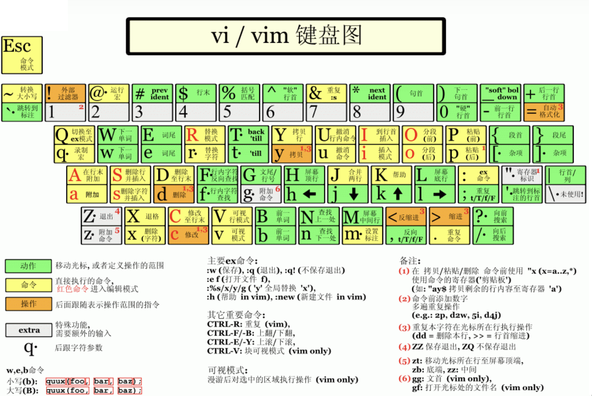

# 基本功能

| Vim模式    | 说明          |
| :--------- | :------------ |
| 命令行模式 | `:`进入命令行 |
| 插入模式   | 编辑          |
| 底行模式   | `Esc`进入底行 |

 

## 光标移动

| 位移                | 说明                                  |
| ------------------- | ------------------------------------- |
| h、j、k、l          | 上、下、左、右                        |
| **翻页**            | **说明**                              |
| ctrl\-e             | 移动页面                              |
| ctrl\-b             | 上翻一页                              |
| ctrl\-f             | 下翻一页                              |
| ctrl\-u             | 上翻半页                              |
| ctrl\-d             | 下翻半页                              |
| **字移**            | **跳转到**（按标点或单词分割）        |
| w                   | 下一个字首                            |
| W                   | 下一个字首，长跳                      |
| e                   | 下一个字尾                            |
| E                   | 下一个字尾，长跳                      |
| b                   | 上一个字                              |
| B                   | 上一个字，长跳                        |
| **首尾**            | **跳转**                              |
| 0                   | 行首，不管有无缩进，就是跳到第0个字符 |
| ^                   | 行首的第一个字符                      |
| \$                  | 行尾                                  |
| gg                  | 文首                                  |
| G                   | 文尾                                  |
| \{n\}gg<br />\{n\}G | 跳转到第n行                           |

## 文件编辑

### 插入模式

| 按键 | 进入插入模式                   |
| ---- | ------------------------------ |
| i    | 从当前光标处                   |
| I    | 置光标于行首                   |
| a    | 追加模式，置光标于当前光标之后 |
| A    | 追加模式，置光标于行末         |
| o    | 在当前行之下新加一行           |
| O    | 在当前行之上新加一行           |

### 编辑模式

| 编辑    | 说明                                       |
| ------- | ------------------------------------------ |
| J       | 将下一行和当前行连接为一行                 |
| cc      | 删除当前行并进入编辑模式                   |
| cw      | 删除当前字，并进入编辑模式                 |
| c\$     | 擦除从当前位置至行末的内容，并进入编辑模式 |
| s       | 删除当前字符并进入编辑模式                 |
| S       | 删除光标所在行并进入编辑模式               |
| xp      | 交换当前字符和下一个字符                   |
| u       | 撤销                                       |
| ctrl\+r | 重做                                       |
| \~      | 切换大小写，当前字符                       |
| \>\>    | 将当前行右移一个单位                       |
| \<\<    | 将当前行左移一个单位(一个tab符)            |
| ==      | 自动缩进当前行                             |

### 删除复制

| 命令 | 说明 |
| ---- | ---- |
|      |      |

### 查找替换

| 光标查找       | 说明                                                         |
| -------------- | ------------------------------------------------------------ |
| gd             | 跳至当前光标所在的变量的声明处                               |
| f\{x\}         | 在当前行中找x字符，找到了就跳转至                            |
| ;              | 重复上一个f命令                                              |
| \*             | 查找光标所在处的单词，向下查找                               |
| \#             | 查找光标所在处的单词，向上查找                               |
| **查找**       | **说明**                                                     |
| /pattern       | 向后搜索字符串pattern                                        |
| ?pattern       | 向前搜索字符串pattern                                        |
| "\\c"          | 忽略大小写                                                   |
| "\\C"          | 大小写敏感                                                   |
| n              | 下一个匹配(如果是/搜索，则是向下的下一个，?搜索则是向上的下一个) |
| N              | 上一个匹配(同上)                                             |
| **替换**       | **说明**                                                     |
| :%s/old/new/g  | 搜索整个文件，将所有的old替换为new                           |
| :%s/old/new/gc | 搜索整个文件，将所有的old替换为new，每次都要确认是否替换     |

### 多文件编辑

| 多文件打开                  | 说明                               |
| --------------------------- | ---------------------------------- |
| vim file1\.\.               | 同时打开多个文件                   |
| **文件切换**                | **说明**                           |
| :args                       | 显示当前编辑文件                   |
| :next                       | 切换到下个文件                     |
| :prev                       | 切换到前个文件                     |
| :next\!                     | 不保存当前编辑文件并切换到下个文件 |
| :prev\!                     | 不保存当前编辑文件并切换到上个文件 |
| :wnext                      | 保存当前编辑文件并切换到下个文件   |
| :wprev                      | 保存当前编辑文件并切换到上个文件   |
| :first                      | 定位首文件                         |
| :last                       | 定位尾文件                         |
| ctrl\+^                     | 快速在最近打开的两个文件间切换     |
| **窗口切割**                | **说明**                           |
| :split<br />:sp             | 把当前文件水平分割                 |
| :split file                 | 把当前窗口水平分割, file           |
| :vsplit file<br />:vsp file | 把当前窗口垂直分割, file           |
| :new file                   | 同split file                       |
| **窗口操作**                | **说明**                           |
| :close                      | 关闭当前窗口                       |
| :only                       | 只显示当前窗口, 关闭所有其他的窗口 |
| :all                        | 打开所有的窗口                     |
| :vertical all               | 垂直打开所有的窗口                 |
| :qall                       | 对所有窗口执行q操作                |
| :qall\!                     | 对所有窗口执行q\!操作              |
| :wall                       | 对所有窗口执行w操作                |
| :wqall                      | 对所有窗口执行wq操作               |
| ctrl\-w h                   | 跳转到左边的窗口                   |
| ctrl\-w j                   | 跳转到下面的窗口                   |
| ctrl\-w k                   | 跳转到上面的窗口                   |
| ctrl\-w l                   | 跳转到右边的窗口                   |
| ctrl\-w t                   | 跳转到最顶上的窗口                 |
| ctrl\-w b                   | 跳转到最底下的窗口                 |

```shell
# 水平分割方式同时打开多个文件
vim -o file1 file2
# 垂直分割方式同时打开多个文件
vim -O file1 file2
```

### 多标签编辑

| 命令            | 说明                                  |
| --------------- | ------------------------------------- |
| :tabedit file   | 在新标签中打开文件file                |
| :tab split file | 在新标签中打开文件file                |
| :tabp           | 切换到前一个标签                      |
| :tabn           | 切换到后一个标签                      |
| :tabc           | 关闭当前标签                          |
| :tabo           | 关闭其他标签                          |
| gt              | 到下一个tab                           |
| gT              | 到上一个tab                           |
| \{n\}gt         | 跳到第五个tab<br />0gt：跳到第一个tab |

## 退出命令

| 退出 | 说明                                   |
| ---- | -------------------------------------- |
| :w   | 将缓冲区写入文件，即保存修改           |
| :wq  | 保存修改并退出                         |
| :x   | 保存修改并退出                         |
| :q   | 退出，如果对缓冲区进行过修改，则会提示 |
| :q\! | 强制退出，放弃修改                     |

## 目录操作

| 命令                    | 说明                                   |
| ----------------------- | -------------------------------------- |
| vim \.<br/>vim a\-path/ | 打开目录                               |
| c                       | 使当前打开的目录成为当前目录           |
| d                       | 创建目录                               |
| %                       | 创建文件                               |
| D                       | 删除文件/目录                          |
| \-                      | 转到上层目录                           |
| gb                      | 转到上一个 标记的目录                  |
| i                       | 改变目录文件列表方式                   |
| ^l                      | 刷新当前打开的目录                     |
| **标记**                | **说明**                               |
| mf                      | 标记文件                               |
| mu                      | 清除所有的标记                         |
| mz                      | 压缩/解压标记的文件                    |
| **显示**                | **说明**                               |
| gh                      | 显示/不显示隐藏文件（dot-files）       |
| ^h                      | 编辑隐藏文件列表                       |
| a                       | 转换显示模式（ all \- hide \- unhide） |
| **文件信息**            | **说明**                               |
| qf                      | 显示文件信息                           |
| qb                      | 列出所有标记的目录和目录浏览记录       |
| gi                      | 在文件中显示信息                       |
| **移动复制**            | **说明**                               |
| mt                      | 移动到的目录                           |
| mf                      | 标记要移动的文件                       |
| mc                      | 移动/复制                              |

- 以下操作在操作目录时生效：p、P、t、u、U、x、v、o、r、s。

# Shell交互

# 插件管理
