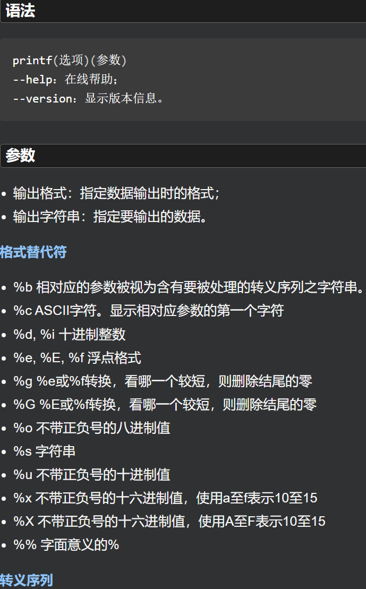
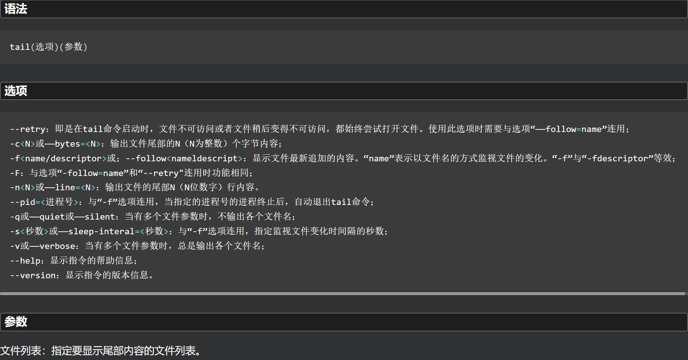
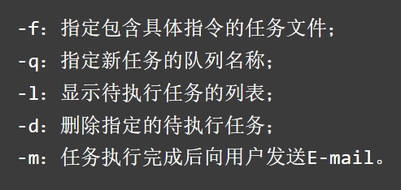
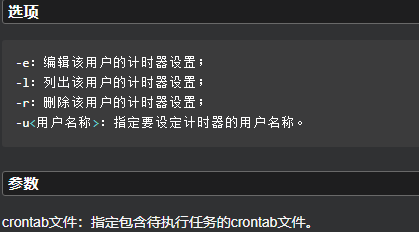

# 基本命令

- 默认通常是bash(Bourne Again Shell)
- 命令本身是一个函数

**功能**

- 提供用户与操作系统进行交互操作的接口，方便用户使用系统中的软硬件资源。
- 提供脚本语言编程环境，方便用户完成简单到复杂的任务调度。

**过程**

1. Linux启动时，最先进入内存的是内核，并常驻内存，
2. 然后进行系统引导，引导过程中启动所有进程的父进程在后台运行，直到相关的系统资源初始化完毕后，等待用户登录。
3. 用户登录时，通过登录进程验证用户的合法性。
4. 用户验证通过后根据用户的设置启动相关的Shell，以便接收用户输入的命令并返回执行结果。

 

# 常用快捷键和通配符

| 快捷键          | 说明                                                   |
|:------------ |:---------------------------------------------------- |
| history      | 显示命令历史列表                                             |
| ↓            | 显示上一条命令                                              |
| ↑            | 显示下一条命令                                              |
| !num         | 执行命令历史列表的第num条命令                                     |
| !!           | 执行上一条命令                                              |
| Ctrl + r     | 按键后输入若干字符，会向上搜索包含该字符的命令，继续按此键搜索上一条匹配的命令 ;相当于`history |
| ls !$        | 执行命令ls,并以上一条命令的参数为其参数                                |
| Ctrl + a     | 移动到当前行的开头                                            |
| Ctrl + e     | 移动到当前行的结尾                                            |
| Esc + b      | 移动到当前单词的开头                                           |
| Esc + f      | 移动到当前单词的结尾                                           |
| Ctrl + l     | 清除屏幕内容                                               |
| Ctrl +u      | 删除命令行中光标所在处之前的所有字符，不包括自身                             |
| Ctrl + k     | 删除命令行中光标所在处之后的所有字符，包括自身                              |
| Ctrl + d     | 删除光标所在处字符                                            |
| Ctrl + h     | 删除光标所在处前一个字符                                         |
| Ctrl + y     | 粘贴刚才所删除的字符                                           |
| Ctrl + w     | 删除光标所在处之前的字符至其单词头，以空格、标点等为分隔符                        |
| Ctrl + t     | 颠倒光标所在处及其之前的字符位置，并将光标移动到下一个字符                        |
| Esc + t      | 颠倒光标所在处及其相邻单词的位置                                     |
| Ctrl + x + u | 撤销刚才的操作                                              |
| Ctrl + s     | 挂起当前Shell，不接收任何输入                                    |
| Ctrl + q     | 重新启用挂起的Shell，接收用户输入                                  |

## 通配符

| 通配符 | 说明                        |
|:--- |:------------------------- |
| ?   | 匹配任意一个字符                  |
| *   | 匹配任意多个字符                  |
| []  | 或，如[123]表示123中的任意一个       |
| -   | 代表一个范围：如a-z表示26个小写字母中任意一个 |

## Tab制表符 自动补全

# alias命令 别名(自定义命令)

```shell
alias
```

- 用来设置指令的别名。使用该命令可以将一些较长的命令进行简化。
- 使用alias时，用户必须使用单引号''将原来的命令引起来，防止特殊字符导致错误。
- 一般的命令别名只能在当前的shell中使用，或者在当前shell的脚本中使用。一个别名仅在他所被定义的shell进程中才有效，除非被设置为永久的。

## 查看系统已经设置的自定义命令(别名)

```shell
alias
或
alias -p
```

```shell
[root@localhost ~]# alias
alias cp='cp -i'
alias egrep='egrep --color=auto'
alias fgrep='fgrep --color=auto'
alias grep='grep --color=auto'
alias l.='ls -d .* --color=auto'
alias ll='ls -l --color=auto'
alias ls='ls --color=auto'
alias mv='mv -i'
alias rm='rm -i'
alias which='alias | /usr/bin/which --tty-only --read-alias --show-dot --show-tilde'
```

## type命令 检查自定义命令（别名）是否已被使用

```shell
type 自定义命令
```

```shell
[root@bogon ~]# type ls
ls is aliased to `ls --color=auto'
# 已被使用
[root@bogon ~]# type myls
-bash: type: myls: not found
# 未被使用
```

## 设置自定义命令(别名)

- alias命令的作用只局限于该次登入的操作。

```shell
alias 自定义别名='命令'
# 可以是多条命令，之间使用分号;分隔
```

```shell
[root@bogon ~]# alias myls='ls -l;ls -d'
[root@bogon ~]# myls
total 8
-rw-------. 1 root root 1823 Nov  5 13:04 anaconda-ks.cfg
drwxr-xr-x. 2 root root    6 Nov  5 13:31 Desktop
drwxr-xr-x. 2 root root    6 Nov  5 13:31 Documents
drwxr-xr-x. 2 root root    6 Nov  5 13:31 Downloads
-rw-r--r--. 1 root root 1899 Nov  5 13:30 initial-setup-ks.cfg
drwxr-xr-x. 2 root root    6 Nov  5 13:31 Music
drwxr-xr-x. 2 root root    6 Nov  5 13:31 Pictures
drwxr-xr-x. 2 root root    6 Nov  5 13:31 Public
drwxr-xr-x. 2 root root    6 Nov  5 13:31 Templates
drwxr-xr-x. 2 root root    6 Nov  5 13:31 Videos
```

## 撤销自定义命令(别名)

```shell
unalias 自定义命令
```

```shell
[root@bogon ~]# unalias myls
```

## 命令别名永久生效

- alias命令的作用只局限于该次登入的操作（直接在shell里设定的命令别名，在终端关闭或者系统重新启动后都会失效）
- 若要每次登入都能够使用这些命令别名，则可将相应的alias命令存放到bash的初始化文件`/etc/bashrc`中
- 通过`unalias`命令删除的只是本次操作中的（实际上，bashrc文件中未被删除）

```shell
vim ~/.bashrc
# 在打开的文件最后面加入别名设置，保存后重新载入：
# 添加的格式：alias 自定义命令= '命令'
source ~/.bashrc
```

```shell
[root@localhost ~]# vim ~/.bashrc

##以下是文件内容---------

# .bashrc

# User specific aliases and functions

alias rm='rm -i'
alias cp='cp -i'
alias mv='mv -i'
# 在这里添加要加入的别名设置，格式如上

# Source global definitions
if [ -f /etc/bashrc ]; then
        . /etc/bashrc
fi
# 这段if代码的作用是:
# 即：加载.bash_aliases文件，所以也可以在用户根目录下新建一个文件.bash_aliases存放命令别名设置。

##以上是文件内容-------

[root@localhost ~]# source ~/.bashrc
```

```shell
[root@bogon ~]# vim ~/.bashrc
[root@bogon ~]# source ~/.bashrc
[root@bogon ~]# myls
total 8
-rw-------. 1 root root 1823 Nov  5 13:04 anaconda-ks.cfg
drwxr-xr-x. 2 root root    6 Nov  5 13:31 Desktop
drwxr-xr-x. 2 root root    6 Nov  5 13:31 Documents
drwxr-xr-x. 2 root root    6 Nov  5 13:31 Downloads
-rw-r--r--. 1 root root 1899 Nov  5 13:30 initial-setup-ks.cfg
drwxr-xr-x. 2 root root    6 Nov  5 13:31 Music
drwxr-xr-x. 2 root root    6 Nov  5 13:31 Pictures
drwxr-xr-x. 2 root root    6 Nov  5 13:31 Public
drwxr-xr-x. 2 root root    6 Nov  5 13:31 Templates
drwxr-xr-x. 2 root root    6 Nov  5 13:31 Videos

# 以下是修改的文件内容:
# .bashrc

# User specific aliases and functions

alias rm='rm -i'
alias cp='cp -i'
alias mv='mv -i'
alias myls='ls -l'

# Source global definitions
if [ -f /etc/bashrc ]; then
        . /etc/bashrc
fi
```

# history命令 历史命令的使用

- 默认最大保存1000条历史命令
- 命令历史记录被保存在隐藏文件.bash_history中，位于用户的主目录中。bash命令的历史记录先放在内存中，当shell退出时才被写入到历史文件中。
  - history -a 可以提前将历史命令缓冲区中命令写入历史命令文件（.bash_history）中
  - 当打开多个终端时，使用**history -a**将命令历史记录写入.bash_history中后，其他终端的历史记录不会自动更新，需要使用使用**history -n**来强制重新读取.bash_history文件。因为 **.bash_history文件只有在第一个终端被打开时才会被读取** 。

**或者上下光标**

```shell
history
```

**选项**

| 参数  | 作用                     |
|:--- |:---------------------- |
| -c  | 清空当前历史命令               |
| -a  | 将历史命令缓冲区中命令写入历史命令文件中   |
| -r  | 将历史命令文件中的命令读入当前历史命令缓冲区 |
| -w  | 将当前历史命令缓冲区命令写入历史命令文件中  |

- n：打印最近的n条历史命令

## 查看最近n条历史命令

```shell
history n
```

```shell
[root@bogon ~]# history 10
   20  myls
   21  unalias myls
   22  vim ~/.bashrc
   23  source ~/.bashrc
   24  ls
   25  ls -l
   26  history | grep start
   27  history | grep ls
   28  ls
   29  history 10
```

## 查找包含特定字符串的历史命令

```shell
history | grep 特点字符串
```

```shell
[root@bogon ~]# history | grep start
    1  startx
   26  history | grep start
[root@bogon ~]# history | grep ls
    5  type ls
    6  type myls
    7  alias myls='ls -l'
    8  mls
    9  alias myls='ls -l'
   10  myls
   11  unalias myls
   12  unalias mylsss
   15  myls
   17  unalias myls
   18  myls
   19  alias myls='ls -l;ls -d'
   20  myls
   21  unalias myls
   24  ls
   25  ls -l
   27  history | grep ls

# 历史命令序号 历史命令（执行过的命令）
```

## !!命令

### !!命令 执行上一次执行的命令**

```shell
[root@bogon ~]# ls -l
[root@bogon ~]# !!
ls -l
total 8
-rw-------. 1 root root 1823 Nov  5 13:04 anaconda-ks.cfg
drwxr-xr-x. 2 root root    6 Nov  5 13:31 Desktop
drwxr-xr-x. 2 root root    6 Nov  5 13:31 Documents
drwxr-xr-x. 2 root root    6 Nov  5 13:31 Downloads
-rw-r--r--. 1 root root 1899 Nov  5 13:30 initial-setup-ks.cfg
drwxr-xr-x. 2 root root    6 Nov  5 13:31 Music
drwxr-xr-x. 2 root root    6 Nov  5 13:31 Pictures
drwxr-xr-x. 2 root root    6 Nov  5 13:31 Public
drwxr-xr-x. 2 root root    6 Nov  5 13:31 Templates
drwxr-xr-x. 2 root root    6 Nov  5 13:31 Videos
```

#### !num命令 执行指定序号的历史命令**

```shell
!历史命令序号
```

```shell
[root@bogon ~]# !24
ls
anaconda-ks.cfg  Desktop  Documents  Downloads  initial-setup-ks.cfg  Music  Pictures  Public  Templates  Videos
```

### !字符命令 执行以指定字符开头的历史命令

```shell
!字符
```

```shell
[root@bogon ~]# !l
ls
anaconda-ks.cfg  Desktop  Documents  Downloads  initial-setup-ks.cfg  Music  Pictures  Public  Templates  Videos
```

## $HISTSIZE  设置最大历史记录数

- 默认最大1000条

# 管道与重定向

**文件描述符**

- 大多数Linux进程运行时需要3个文件描述符：

| 文件描述符 | 说明     |
|:-----:|:------ |
| 0     | 标准输入   |
| 1     | 标准输出   |
| 2     | 标准错误输出 |

**管道符 |**

**管道和重定向的目的：**

- 重定向这些描述符。
- 管道一般为输入和输出的结合，一个进程向管道的一端发送数据，而另一个进程从该管道的另一端读取数据。

# 标准输入与输出

**执行一个Shell命令通常会自动打开3个标准文件**

- 标准输入文件stdin 对应终端的键盘
- 标准输出文件stout和标准错误输出文件stderr 对应终端的屏幕

进程从标准输入文件得到输入数据，将正常输出数据输出到标准输出文件，而错误信息则打印到标准错误文件。

 

## echo 输出指定的字符串或者变量

- 用于在shell中打印shell变量的值，或者直接输出指定的字符串。linux的echo命令，在shell编程中极为常用, 在终端下打印变量value的时候也是常常用到的，因此有必要了解下echo的用法echo命令的功能是在显示器上显示一段文字，一般起到一个提示的作用。

**选项 -e 激活转义符**

| 转义符          | 说明      |
|:------------ |:------- |
| `\e`或 `\033` | 设置终端的颜色 |

### `\e` 设置终端颜色

```shell
echo -e "\e[编码1;编码2;编码3m内容"
# 文字色：
#颜色码：重置=0，黑色=30，红色=31，绿色=32，黄色=33，蓝色=34，洋红=35，青色=36，白色=37
echo -e "\e[1;31m内容\e[0m"
#\e[1;31m 将颜色设置为红色
#\e[0m 将颜色重新置回
# 背景色 ：
#颜色码：重置=0，黑色=40，红色=41，绿色=42，黄色=43，蓝色=44，洋红=45，青色=46，白色=47
echo -e "\e[1;42m内容\e[0m"
# 文字闪动：
# 0 关闭所有属性、1 设置高亮度（加粗）、4 下划线、5 闪烁、7 反显、8 消隐
echo -e "\033[37;31;5mMySQL Server Stop...\033[39;49;0m"
```

## printf 格式化并输出结果

 

```shell

```

## cat 连接文件并打印到标准输出设备上

- 从命令行给出的文件中读取数据，并将这些数据直接送到标准输出文件。
- cat经常用来显示文件的内容
- 当文件较大时，文本在屏幕上迅速闪过（滚屏），用户往往看不清所显示的内容。因此，一般用more等命令分屏显示。
  - 为了控制滚屏，可以按`Ctrl+S键`，停止滚屏；
  - 按`Ctrl+Q键`可以恢复滚屏。
  - 按`Ctrl+C（中断）键`可以终止该命令的执行，并且返回Shell提示符状态。

| 选项                   | 说明                        |
|:-------------------- |:------------------------- |
| -n或--number          | 从1开始对所有输出的行数编号            |
| -b或--number-nonblank | 和-n相似，只不过对于空白行不编号         |
| -s或--squeeze-blank   | 当遇到有连续两行以上的空白行，就代换为一行的空白行 |
| -A                   | 显示不可打印字符，行尾显示“$”          |
| -e                   | 等价于"-vE"选项                |
| -t                   | 等价于"-vT"选项                |

**语法**

```shell
cat 文件
```

```shell
cat m1 （在屏幕上显示文件m1的内容）
cat m1 m2 （同时显示文件m1和m2的内容）
cat m1 m2 > file （将文件m1和m2合并后放入文件file中）
```

```shell
[root@bogon ~]# cat initial-setup-ks.cfg anaconda-ks.cfg
```

**cat命令 不带参数时**

- 从标准输入中读取数据并显示到标准输出文件中
- 此时，每一行键盘（标准输入文件）输入的数据，都会立刻被输出在屏幕上（标准输出文件）。
- 直到`Ctrl + d键`终止

```shell
[root@bogon ~]# cat
test
test
```

## tail 在屏幕上显示指定文件的末尾若干行

- 用于输入文件中的尾部内容。tail命令默认在屏幕上显示指定文件的末尾10行。
  - 如果给定的文件不止一个，则在显示的每个文件前面加一个文件名标题。
  - 如果没有指定文件或者文件名为“-”，则读取标准输入。
- 注意：如果表示字节或行数的N值之前有一个”+”号，则从文件开头的第N项开始显示，而不是显示文件的最后N项。N值后面可以有后缀：b表示512，k表示1024，m表示1048576(1M)。

 

## head

## more

## less

## 输入重定向

**主要用于改变一个命令的输入源**

- 把命令或可执行程序的标准输入重定向到指定的文件中
- 即：将输入从键盘（标准输入文件）改为一个指定的文件。

### < 输入重定向符

**语法**

```shell
命令 < 文件
```

```shell
[root@bogon ~]# cat < initial-setup-ks.cfg
```

### << 文档的重定向操作符

```shell
命令 <<标识符

> 标识符
# 以此结束输入的操作，并使标准输出文件输出。
```

```shell
[root@bogon ~]# cat <<END
> test
> END
test
```

## 输出重定向

- 把命令或可执行程序的标准输出或标准错误输出重新定向到指定文件中。
- 可以将命令的输出从标准输出文件（屏幕）改为指定的文件中。
- 可以将一个命令的输出当作另一个命令的输入

### > 输出重定向符

**语法**

```shell
命令 > 文件
```

- 如果> 后面的文件不存在，则创建该文件。
- 如果> 后面的文件已经存在，则会被覆盖。

```shell
[root@localhost ~]# ls -l >lsdir.txt

# 或

[root@localhost ~]# ls -l >lsdir.txt
```

### >> 输出重定向的追加方法

**语法**

```shell
命令 >>文件
```

- 如果> 后面的文件不存在，则创建该文件。
- 如果> 后面的文件已经存在，则将内容追加到该文件。

```shell
[root@localhost ~]# ls -l >>lsdir.txt
```

### 2> 错误输出重定向

**语法**

```shell
命令 2>文件
```

- 如果有错误信息：（错误信息不会在屏幕（标准输出文件）输出，而会保存在指定的文件中。
  - 如果> 后面的文件不存在，则创建该文件。
  - 如果> 后面的文件已经存在，则会被覆盖。
- 如果没有错误信息，仍然会创建/覆盖。

```shell
[root@localhost ~]# ls -l ./不存在的路径 2>myerr.txt
# 该文件不存在，在myerr.txt中会记录此次错误信息
```

### 2>> 错误输出重定向的追加方法

```shell
命令 2>>文件
```

- 是`2>`的追加模式
- 如果有错误信息：（错误信息不会在屏幕（标准输出文件）输出，而会保存在指定的文件中。
  - 如果> 后面的文件不存在，则创建该文件。
  - 如果> 后面的文件已经存在，则将内容追加到该文件。
- 如果没有错误信息，仍然会创建/覆盖。

```shell
[root@localhost ~]# ls ./不存在的路径 2>>myerr.txt
```

## 混合使用

```shell
命令 >输出 2> 错误 
命令 >输出 2>>错误
命令 >>输出 2>错误
命令 >>输出 2>>错误

命令 <输入 >输出
命令 <<标识符 >输出
```

```
[root@localhost ~]# ls >myout.txt 2>myerr.txt
[root@localhost ~]# ls <<over >myout.txt
```

### 将标准输出和标准错误输出重定向到同一个文件

```shell
命令 >输出 2>&1
```

```shell
[root@localhost ~]# ls >myOutAndErr.txt 2>&
```

# | 管道

- 将一个程序或命令的输出作为另一个程序或命令的输入；
  - 管道符 | 连接两个命令。
  - 或通过临时文件将两个命令或程序结合在一起。

```shell
命令1 | 命令2
```

```shell
[root@localhost ~]# ls -l | grep Downloads
drwxr-xr-x. 2 root root    6 Nov  5 13:31 Downloads
```

# grep 过滤文本

- 支持正则。
- 若不指定任何文件名称/给予的文件名为"-"，则grep命令从标准输入设备读取数据。

## 正则

| 参数         | 说明                          |
|:---------- |:--------------------------- |
| \          | 转义符                         |
| ^          | 指定匹配字符串的行首 ；指定行的开始          |
| $          | 指定匹配字符串的结尾  ； 指定行的结束        |
| *          | 表示0个以上的字符 ；匹配0个或多个先前的字符     |
| +          | 表示1个以上的字符 ；匹配1个或多个先前的字符     |
| ?          | 匹配0个或多个先前的字符                |
| .          | 匹配一个非换行符的字符                 |
| []         | 匹配一个指定范围内的字符                |
| [^]        | 匹配一个非指定范围内的字符               |
| `\(..\)`   | 标记匹配字符                      |
| <          | 指定单词的开始                     |
| >          | 指定单词的结束                     |
| x{m}       | 重复字符x，m次                    |
| x{m,}      | 重复字符x，至少m次                  |
| x{m,n}     | 重复字符x，至少m次，至多n次             |
| w          | 匹配单词和数字 即：[A-Z] [a-z] [0-9] |
| W          | w的反置形式，匹配一个或多个非单词字符，如点号句号等  |
| b          | 单词锁定符                       |
| `          | `                           |
| ()         | 分组符                         |
| [:alnum:]  | 文字数字字符                      |
| [:alpha:]  | 文字字符                        |
| [:digit:]  | 数字字符                        |
| [:graph:]  | 非空格、控制字符                    |
| [:lower:]  | 小写字符                        |
| [:upper:]  | 大写字符                        |
| [:cntrl:]  | 控制字符                        |
| [:print:]  | 非空字符（包括空格）                  |
| [:punct:]  | 标点符号                        |
| [:space:]  | 所有空白字符（换行、空格、制表符）           |
| [:xdigit:] | 十六进制数字 0-9 a-f A-F          |

## 使用

**语法**

```shell
grep 选项 指定字符串 文件路径
```

```shell
# 反向搜索
grep -v 字符串 
# 匹配的同时输出行号
grep -n 字符串
# 统计含有匹配的行数
grep -c 字符串
# 指定多个匹配模式
grep -e 模式1 -e 模式2 ...
```

**查找指定字符串在文件中的匹配内容**

```shell
grep [选项] 指定字符串 文件路径

# 等同于

grep [选项] "指定字符串" 文件路径
```

- 默认区分大小写
- 指定字符串可以使用正则表达式

```shell
[root@bogon ~]# grep root /etc/passwd
root:x:0:0:root:/root:/bin/bash
operator:x:11:0:operator:/root:/sbin/nologin
[root@bogon ~]# grep "root" /etc/passwd
root:x:0:0:root:/root:/bin/bash
operator:x:11:0:operator:/root:/sbin/nologin
```

**结合管道的使用**

```shell
命令 | grep 指定字符串
```

- 管道前的命令返回的数据作为grep的参数使用，即作为要被查找的内容

```shell
[root@bogon ~]# ifconfig | grep inet
        inet 192.168.186.144  netmask 255.255.255.0  broadcast 192.168.186.255
        inet6 fe80::17f1:ef1c:aad4:3bff  prefixlen 64  scopeid 0x20<link>
        inet 127.0.0.1  netmask 255.0.0.0
        inet6 ::1  prefixlen 128  scopeid 0x10<host>
        inet 192.168.122.1  netmask 255.255.255.0  broadcast 192.168.122.255
```

**递归查询的使用**

## egrep

- 支持POSIX扩展正则表达式。

## fgrep

- 支持将匹配模式指定为用换行符分隔的一列固定长度的字符串

# awk

**格式**

```shell
awk [options] 'script' var=value file(s)
awk [options] -f scriptfile var=value file(s)
```

**选项**

| 选项           | 说明                                              |
|:------------ |:----------------------------------------------- |
| -F fs        | fs指定输入分隔符，fs可以是字符串或正则表达式                        |
| -v var=value | 赋值一个用户定义变量，将外部变量传递给awk                          |
| -f scripfile | 从脚本文件中读取awk命令                                   |
| -m[fr] val   | 对val值设置内在限制，-mf选项限制分配给val的最大块数目；-mr选项限制记录的最大数目。 |

```shell
[root@localhost ~]# awk '{print $0}' /etc/passwd | head
root:x:0:0:root:/root:/bin/bash
bin:x:1:1:bin:/bin:/sbin/nologin
daemon:x:2:2:daemon:/sbin:/sbin/nologin
adm:x:3:4:adm:/var/adm:/sbin/nologin
lp:x:4:7:lp:/var/spool/lpd:/sbin/nologin
sync:x:5:0:sync:/sbin:/bin/sync
shutdown:x:6:0:shutdown:/sbin:/sbin/shutdown
halt:x:7:0:halt:/sbin:/sbin/halt
mail:x:8:12:mail:/var/spool/mail:/sbin/nologin
operator:x:11:0:operator:/root:/sbin/nologin
```

# 自动任务

## at 定时任务

- 在指定时间执行任务，只执行一次。

 

**格式**

```shell
at [选项] [时间]
```

- 使用`Ctrl + D`结束任务的指定，等待时间执行

**指定时间的格式**

- 绝对计时法
1. 当天的hh:mm，假如该时间已过去，那么就放在第二天执行。
2. midnight（深夜），noon（中午），teatime（一般是下午4点）等比较模糊的词语来指定时间。
3. 12小时计时制，时间后面加上AM（上午）或PM（下午）。
4. 具体日期，指定格式为month day或mm/dd/yy或dd.mm.yy。指定的日期必须跟在指定时间的后面。
- 相对计时法
1. now + count time-units
   - now就是当前时间
   - time-units是时间单位 minutes（分钟）、hours（小时）、days（天）、weeks（星期）
   - count是时间的数量，究竟是几天，还是几小时，等等。 
2. 直接使用today（今天）、tomorrow（明天）。

```shell
[root@localhost ~]# at 23:43 today
at> date >/root/today.log            
at> <EOT>
job 3 at Sun Nov 27 23:43:00 2022
```

 

### atq 显示当前所有定时任务

```shell
[root@localhost ~]# atq
4       Wed Nov 30 08:40:00 2022 a root
```

### atrm 删除指定行号的定时任务

**格式**

```shell
atrm 任务序号
```

 

## crontab 周期任务

- 用来提交和管理用户的需要周期性执行的任务。
- 当安装完成操作系统后，默认会安装此服务工具，并且会自动启动crond进程，crond进程每分钟会定期检查是否有要执行的任务，如果有要执行的任务，则自动执行该任务。

**格式**

```shell
crontab [选项] [参数]
```

 

### 系统任务调度 和 用户任务调度 。

**系统任务调度**

- 系统周期性所要执行的工作，比如写缓存数据到硬盘、日志清理等。
- 系统任务调度的配置文件`/etc/crontab`

 

```shell
[root@localhost etc]# ll | grep cron
-rw-------.  1 root root      541 Mar 30  2017 anacrontab
drwxr-xr-x.  2 root root       54 Nov 13 21:16 cron.d
drwxr-xr-x.  2 root root       70 Nov 13 21:16 cron.daily
-rw-------.  1 root root        0 Mar 30  2017 cron.deny
drwxr-xr-x.  2 root root       41 Nov 13 21:16 cron.hourly
drwxr-xr-x.  2 root root        6 Dec 28  2013 cron.monthly
-rw-r--r--.  1 root root      451 Dec 28  2013 crontab
drwxr-xr-x.  2 root root        6 Dec 28  2013 cron.weekly
```

**用户任务调度**

- 用户定期要执行的工作，比如用户数据备份、定时邮件提醒等。
- 所有用户定义的crontab文件都被保存在`/var/spool/cron`目录中。其文件名与用户名一致，
- 使用者权限文件如下：
  - `/etc/cron.deny `     该文件中所列用户不允许使用crontab命令
  - `/var/spool/cron/`   所有用户crontab文件存放的目录,以用户名命名 

### 使用crontab

**格式**

```shell
crontab [选项] [crontab 的任务列表文件]
```

 

 

**常用`crontab -e`进行设置和删除**

```shell
# 设置新的周期任务
[root@localhost etc]# crontab -e
no crontab for root - using an empty one
crontab: installing new crontab
# 在vim内编辑：
#* * * * * date >> /root/Test/myDays.log


[root@localhost Test]# cat myDays.log
Mon Nov 28 00:39:01 CST 2022
Mon Nov 28 00:40:01 CST 2022

# 删除周期任务
[root@localhost Test]# crontab -e
crontab: installing new crontab
# 在vim中编辑
#删除周期任务
```

#### 实例

```shell
# 每1分钟执行一次command
* * * * * command

# 每小时的第3和第15分钟执行
3,15 * * * * command

# 在上午8点到11点的第3和第15分钟执行
3,15 8-11 * * * command

# 每隔两天的上午8点到11点的第3和第15分钟执行
3,15 8-11 */2 * * command
# 每个星期一的上午8点到11点的第3和第15分钟执行
3,15 8-11 * * 1 command

# 每晚的21:30重启smb 
30 21 * * * /etc/init.d/smb restart

# 每月1、10、22日的4 : 45重启smb 
45 4 1,10,22 * * /etc/init.d/smb restart

# 每周六、周日的1:10重启smb
10 1 * * 6,0 /etc/init.d/smb restart

# 每天18 : 00至23 : 00之间每隔30分钟重启smb 
0,30 18-23 * * * /etc/init.d/smb restart

# 每星期六的晚上11:00 pm重启smb 
0 23 * * 6 /etc/init.d/smb restart

# 每一小时重启smb 
* */1 * * * /etc/init.d/smb restart

# 晚上11点到早上7点之间，每隔一小时重启smb
* 23-7/1 * * * /etc/init.d/smb restart

# 每月的4号与每周一到周三的11点重启smb 
0 11 4 * mon-wed /etc/init.d/smb restart

# 一月一号的4点重启smb
0 4 1 jan * /etc/init.d/smb restart

# 每小时执行/etc/cron.hourly目录内的脚本
01 * * * * root run-parts /etc/cron.hourly
```

### crond服务

```shell
service crond status # 查看crond服务状态
/sbin/service crond start    # 启动服务
/sbin/service crond stop     # 关闭服务
/sbin/service crond restart  # 重启服务
/sbin/service crond reload   # 重新载入配置
ntsysv # 查看crond服务是否已经设置为开机启动
chkconfig –level 35 crond on # 加入开机自动启动
```
