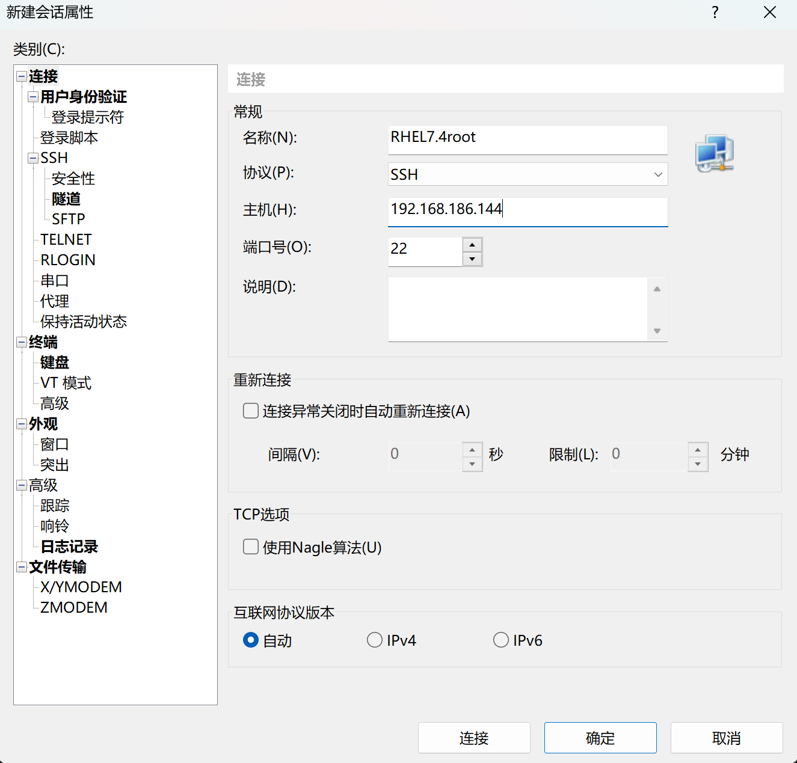
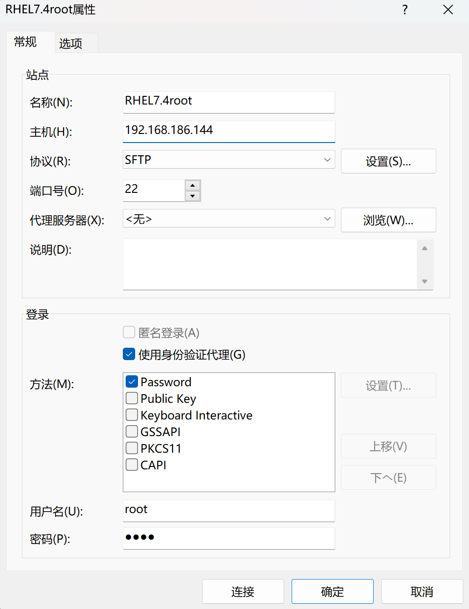
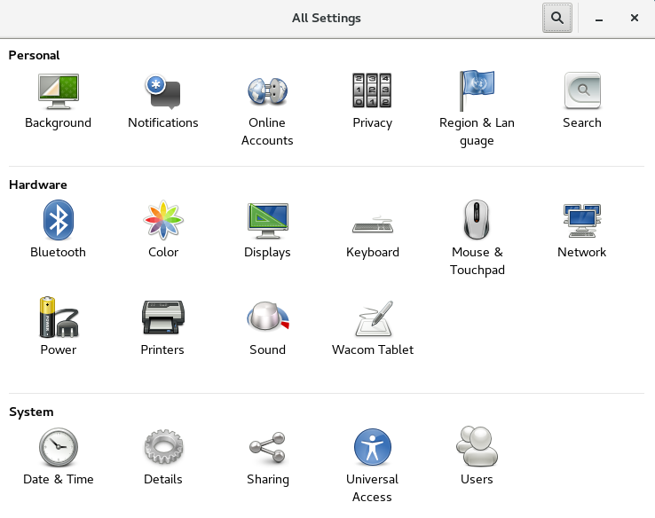
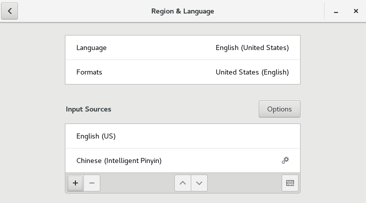
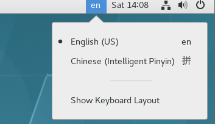
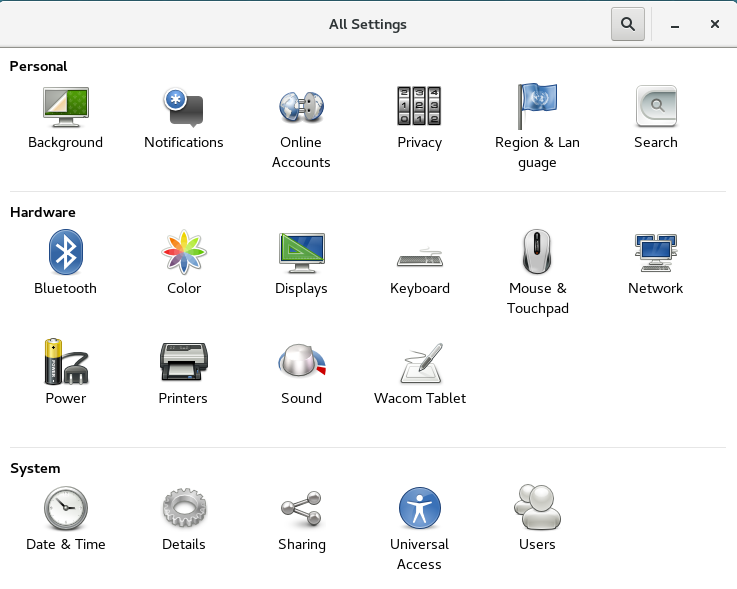
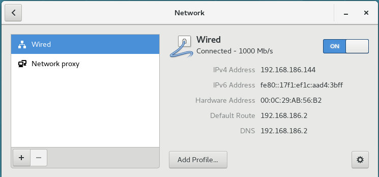

# 安装

## 分区

### 挂载点

- 挂载点：指定该分区对应Linux文件系统的哪个目录。
- Linux允许将不同的物理磁盘上的分区映射到不同的目录，可以实现将不同的服务框架放在不同的物理磁盘上，当一个物理磁盘损坏时，不会影响其他物理磁盘上的数据。

### SWAP 虚拟内存交换区

- SWAP原理：用硬盘模拟的虚拟内存，当系统内存使用率比较高时，内核会自动使用SWAP分区来存取数据。

| 生产环境          | SWAP大小设置   |
| ----------------- | -------------- |
| 物理内存 < 4G     | 物理内存的2倍  |
| 物理内存  4`~`16G | 与物理内存相等 |
| 物理内存 > 16G    | 物理内存的一半 |

### / 根分区

### /boot 引导分区

## 文件系统类型

### XFS

- 高度可扩高性能文件系统
- 支持的最大的文件系统为：500TB，最大文件：16TB
- 支持元数据日志，可以加快崩溃时的恢复速度
- 当挂载使用时，仍可以进行清理碎片和控制文件系统。

### ext

### LVM 缓存

- 允许用户创建逻辑卷(LV)，以小型快速设备作为更大、速度更慢的设备的缓存

## KDUMP 

- KDUMP开启后，将会使用一部分内存空间，当系统崩溃时KDUMP会捕获系统的关键信息，以便分析查找出系统崩溃的原因。
- 此功能主要是系统相关的程序员使用，对普通用户而言意义不大，建议关闭。

## NETWORK 网络设置

- 默认关闭，需要打开

## 登录

### 运行级别

| 参数 | 说明                                                    |
| :--- | :------------------------------------------------------ |
| 0    | 停机                                                    |
| 1    | 单用户模式                                              |
| 2    | 多用户模式                                              |
| 3    | 完全多用户模式，服务器一般运行载此级别                  |
| 4    | 一般不用，在一些特殊情况使用                            |
| 5    | X11模式。一般发行版默认的运行级别，可以启动图形桌面系统 |
| 6    | 重新启动                                                |

**修改运行级别**

```shell
init 运行级别参数
```

**重启**

```shell
reboot
```

**关机**

```shell
poweroff
```

### 远程登录

#### 查看网络

```shell
ifconfig
```

```
[root@bogon ~]# ifconfig
ens33: flags=4163<UP,BROADCAST,RUNNING,MULTICAST>  mtu 1500
        inet 192.168.186.144  netmask 255.255.255.0  broadcast 192.168.186.255
# inet 192.168.186.144  这个是Xshell等软件需要的主机地址
        inet6 fe80::17f1:ef1c:aad4:3bff  prefixlen 64  scopeid 0x20<link>
        ether 00:0c:29:ab:56:b2  txqueuelen 1000  (Ethernet)
        RX packets 49  bytes 9077 (8.8 KiB)
        RX errors 0  dropped 0  overruns 0  frame 0
        TX packets 68  bytes 8388 (8.1 KiB)
        TX errors 0  dropped 0 overruns 0  carrier 0  collisions 0

lo: flags=73<UP,LOOPBACK,RUNNING>  mtu 65536
        inet 127.0.0.1  netmask 255.0.0.0
        inet6 ::1  prefixlen 128  scopeid 0x10<host>
        loop  txqueuelen 1  (Local Loopback)
        RX packets 12  bytes 1404 (1.3 KiB)
        RX errors 0  dropped 0  overruns 0  frame 0
        TX packets 12  bytes 1404 (1.3 KiB)
        TX errors 0  dropped 0 overruns 0  carrier 0  collisions 0

virbr0: flags=4099<UP,BROADCAST,MULTICAST>  mtu 1500
        inet 192.168.122.1  netmask 255.255.255.0  broadcast 192.168.122.255
        ether 52:54:00:19:78:d6  txqueuelen 1000  (Ethernet)
        RX packets 0  bytes 0 (0.0 B)
        RX errors 0  dropped 0  overruns 0  frame 0
        TX packets 0  bytes 0 (0.0 B)
        TX errors 0  dropped 0 overruns 0  carrier 0  collisions 0
```

#### sshd服务

- 检查sshd服务是否开启

```shell
ps -ef | grep sshd
```

```
[root@bogon ~]# ps -ef | grep sshd
root       1433      1  0 13:30 ?        00:00:00 /usr/sbin/sshd -D
root       2952   2828  0 13:36 pts/0    00:00:00 grep --color=auto sshd
```

-检查sshd服务开启的端口

```shell
netstat -plnt | grep sshd
```

```
[root@bogon ~]# netstat -plnt | grep sshd
tcp        0      0 0.0.0.0:22              0.0.0.0:*               LISTEN      1433/sshd           
tcp6       0      0 :::22                   :::*                    LISTEN  
```

#### 软件

- Xshell 终端

 

 

- Xftp 文件传输

 

# 图形化界面

### X Window系统

- 以位图方式显示的软件窗口系统
- 用来创建图形化界面，在X Window基础上开发出GNOME、KDE、CDE

 

- 进入X Window环境：

```shell
startx
```

### KDE桌面环境和GNOME桌面环境

- 默认安装GNOME桌面环境

- 两者都采用GPL公约发行，
  - 不同之处在于KDE基于双重授权的Qt，
  - 而GNOME采用遵循GPL的GTK库开发，拥有更广泛的支持。
- KDE包含大量的应用软件、项目规模庞大，自带软件众多，操作习惯接近Windows。
  - KDE不足之处在于其运行速度相对较慢，且部分程序容易崩溃
- GNOME项目由于专注于桌面环境本身，软件较少、运行速度快，并具有出色的稳定性，GNOM受到了大多数公司的青睐，成为多个企业发行版的默认桌面。

#### GNOME

##### 输入法设置

- setting -> Region&Language

 
 

**切换输入法**

 

#### 配置网卡和有线

 
 

##### U盘、光盘和移动硬盘

- 在Linux中，U盘、光盘和移动硬盘等可移动的存储介质都会以文件系统的方式挂载到本地目录上进行访问。
- 图形化界面自动识别
- 命令行界面 会提示，但不会自动挂载，需要mount命令

# 命令行界面

**Linux系统结构**

 

**切换至命令行**

- 图形化：终端
- `Ctrl + Windows + Alt + F3` 切换到终端3 （命令行界面)
- `Ctrl + Windows + Alt + F1` 切换到终端1 （图形化界面)