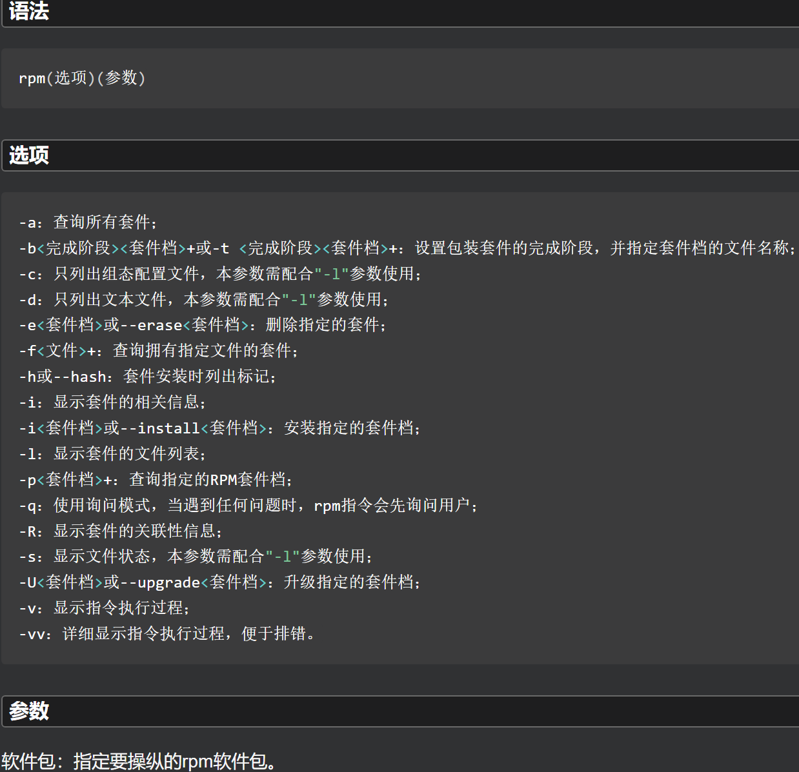

# rpm

 

**常用**

| 组合                             | 说明                            |
|:------------------------------ |:----------------------------- |
| rpm -ivh RPM包                  | 安装时显示信息                       |
| rpm -ivh --force RPM包          | 强制安装                          |
| rpm -ivh --nodeps --force RPM包 | 无视依赖，强制安装                     |
| rpm -qpl RPM包                  | 查看软件包的详细信息                    |
| rpm -Uvh RPM包                  | 更新已安装的软件包                     |
| rpm -qa                        | 查看已安装的软件包                     |
| rpm -e                         | 卸载软件包，如果存在依赖关系，需要先卸载需要其依赖的软件包 |
| rpm -qf                        | 查看文件所属软件包                     |
| rpm -qip                       | 获取说明信息                        |

```shell
# 1.挂载光盘
[root@bogon Packages]# mkdir -p /cdrom
[root@bogon Packages]# mount -t iso9660 /dev/cdrom /cdrom

# 2.安装 需要依赖关系时
[root@bogon Packages]# rpm -ivh glibc-devel-2.17-196.el7.x86_64.rpm
warning: glibc-devel-2.17-196.el7.x86_64.rpm: Header V3 RSA/SHA256 Signature, key ID fd431d51: NOKEY
error: Failed dependencies:
        glibc-headers is needed by glibc-devel-2.17-196.el7.x86_64
        glibc-headers = 2.17-196.el7 is needed by glibc-devel-2.17-196.el7.x86_64
[root@bogon Packages]# rpm -ivh glibc-devel-2.17-196.el7.x86_64.rpm glibc-headers-2.17-196.e17.x86_64.rpm

# 3.先安装依赖关系
[root@bogon Packages]# rpm -ivh glibc-headers-2.17-196.el7.x86_64.rpm
warning: glibc-headers-2.17-196.el7.x86_64.rpm: Header V3 RSA/SHA256 Signature, key ID fd431d51: NOKEY
error: Failed dependencies:
        kernel-headers is needed by glibc-headers-2.17-196.el7.x86_64
        kernel-headers >= 2.2.1 is needed by glibc-headers-2.17-196.el7.x86_64
[root@bogon Packages]# rpm -ivh kernel-headers-3.10.0-693.el7.x86_64.rpm
warning: kernel-headers-3.10.0-693.el7.x86_64.rpm: Header V3 RSA/SHA256 Signature, key ID fd431d51: NOKEY
Preparing...                          ################################# [100%]
Updating / installing...
   1:kernel-headers-3.10.0-693.el7    ################################# [100%]
[root@bogon Packages]# rpm -ivh kernel-headers-3.10.0-693.el7.x86_64.rpm
warning: kernel-headers-3.10.0-693.el7.x86_64.rpm: Header V3 RSA/SHA256 Signature, key ID fd431d51: NOKEY
Preparing...                          ################################# [100%]
Updating / installing...
   1:kernel-headers-3.10.0-693.el7    ################################# [100%]
[root@bogon Packages]# rpm -ivh glibc-headers-2.17-196.el7.x86_64.rpm
warning: glibc-headers-2.17-196.el7.x86_64.rpm: Header V3 RSA/SHA256 Signature, key ID fd431d51: NOKEY
Preparing...                          ################################# [100%]
Updating / installing...
   1:glibc-headers-2.17-196.el7       ################################# [100%]
[root@bogon Packages]# rpm -ivh glibc-devel-2.17-196.el7.x86_64.rpm
warning: glibc-devel-2.17-196.el7.x86_64.rpm: Header V3 RSA/SHA256 Signature, key ID fd431d51: NOKEY
Preparing...                          ################################# [100%]
Updating / installing...
   1:glibc-devel-2.17-196.el7         ################################# [100%]
# 4.检查
```

```shell
[root@bogon Packages]# rpm -ivh ftp-0.17-67.el7.x86_64.rpm
warning: ftp-0.17-67.el7.x86_64.rpm: Header V3 RSA/SHA256 Signature, key ID fd431d51: NOKEY
Preparing...                          ################################# [100%]
Updating / installing...
   1:ftp-0.17-67.el7                  ################################# [100%]
[root@bogon Packages]# rpm -ivh --force ftp-0.17-67.el7.x86_64.rpm
warning: ftp-0.17-67.el7.x86_64.rpm: Header V3 RSA/SHA256 Signature, key ID fd431d51: NOKEY
Preparing...                          ################################# [100%]
Updating / installing...
   1:ftp-0.17-67.el7                  ################################# [100%]
[root@bogon Packages]# rpm -ivh --nodeps --force ftp-0.17-67.el7.x86_64.rpm
warning: ftp-0.17-67.el7.x86_64.rpm: Header V3 RSA/SHA256 Signature, key ID fd431d51: NOKEY
Preparing...                          ################################# [100%]
Updating / installing...
   1:ftp-0.17-67.el7                  ################################# [100%]
[root@bogon Packages]# rpm -Uvh ftp-0.17-67.el7.x86_64.rpm
warning: ftp-0.17-67.el7.x86_64.rpm: Header V3 RSA/SHA256 Signature, key ID fd431d51: NOKEY
```

```shell
[root@bogon Packages]# rpm -e glibc-headers
error: Failed dependencies:
        glibc-headers = 2.17-196.el7 is needed by (installed) glibc-devel-2.17-196.el7.x86_64
```

```shell
[root@bogon Packages]# rpm -qip glibc-devel-2.17-196.el7.x86_64.rpm
warning: glibc-devel-2.17-196.el7.x86_64.rpm: Header V3 RSA/SHA256 Signature, key ID fd431d51: NOKEY
Name        : glibc-devel
Version     : 2.17
Release     : 196.el7
Architecture: x86_64
Install Date: (not installed)
Group       : Development/Libraries
Size        : 1066324
License     : LGPLv2+ and LGPLv2+ with exceptions and GPLv2+
Signature   : RSA/SHA256, Sat 17 Jun 2017 03:48:44 AM CST, Key ID 199e2f91fd431d51
Source RPM  : glibc-2.17-196.el7.src.rpm
Build Date  : Sat 17 Jun 2017 12:59:25 AM CST
Build Host  : x86-017.build.eng.bos.redhat.com
Relocations : (not relocatable)
Packager    : Red Hat, Inc. <http://bugzilla.redhat.com/bugzilla>
Vendor      : Red Hat, Inc.
URL         : http://www.gnu.org/software/glibc/
Summary     : Object files for development using standard C libraries.
Description :
The glibc-devel package contains the object files necessary
for developing programs which use the standard C libraries (which are
used by nearly all programs).  If you are developing programs which
will use the standard C libraries, your system needs to have these
standard object files available in order to create the
executables.

Install glibc-devel if you are going to develop programs which will
use the standard C libraries.
```

## 需要的依赖问题

```shell
[root@localhost Packages]# rpm -ivh unbound-1.4.20-34.el7.x86_64.rpm
warning: unbound-1.4.20-34.el7.x86_64.rpm: Header V3 RSA/SHA256 Signature, key ID fd431d51: NOKEY
error: Failed dependencies:
        libunbound.so.2()(64bit) is needed by unbound-1.4.20-34.el7.x86_64
        # 需要unbound库的2个64位的rpm包
        # lib库名.so.需要的包的数量()(位数x86_64或.i686)
        unbound-libs(x86-64) = 1.4.20-34.el7 is needed by unbound-1.4.20-34.el7.x86_64
        # 需要unbound-libs(x86-64)包
```

# tar.gz 源码包

- 源码包的安装具体需要参考提供者的规范。

> RedHat7.4的Linux系统：保存源代码的位置主要有 /usr/src、/usr/local/src。
> 
> - /usr/src：保存内核源代码。
> 
> - /usr/local/src：保存用户下载的源代码。

## 安装

1. 下载源码包
2. tar 解压缩 
3. cd 进入解压目录
4. ./configure 软件配置与检查 
5. make 编译
6. make install 正式开始安装软件
7. PATH 添加到环境变量

> nginx安装：下载路径 `https://nginx.org/en/download.html`
> 
> ```shell
> mkdir /root/soft
> cd /root/soft
> wget https://nginx.org/download/nginx-1.22.1.tar.gz
> tar -xvf nginx-1.22.1.tar.gz
> cd /root/soft/nginx-1.22.1
> 
> # gcc配置 在vim安装时已经配置
> 
> # pcre模块 
> cd /room/Packages
> rpm -ivh pcre-devel-8.32-17.el7.x86_64.rpm
> rpm -ivh pcre-8.32-17.el7.x86_64.rpm
> 
> # zlib开发包
> cd /room/Packages
> rpm -ivh zlib-devel-1.2.7-17.el7.x86_64.rpm
> rpm -ivh zlib-1.2.7-17.el7.x86_64.rpm
> yy
> cd /root/soft/nginx-1.22.1
> ./configure
> make
> make install
> ```
> 
> ```shell
> [root@bogon ~]# cd /usr/local/nginx/sbin
> [root@bogon sbin]# ./nginx
> [root@bogon sbin]# netstat -plnt | grep 80
> tcp        0      0 0.0.0.0:80              0.0.0.0:*               LISTEN      50771/nginx: master 
> [root@bogon sbin]# echo "welcome" > /usr/local/nginx/html/index.html
> [root@bogon sbin]# curl http://127.0.0.1
> welcome
> ```

- configure：源码包软件自带的一个脚本程序，必须采用`./configure`方式执行。通过系统环境的检测结果和定义好的功能选项生成编译规则文件 Makefile ，后续的编译和安装需要依赖这个文件的内容。

| 命令                        | 说明        |
|:------------------------- |:--------- |
| ./configure --prefix=安装路径 | 指定安装路径。   |
| ./configure --help        | 查询其支持的功能。 |

## 卸载

- 源码包的卸载：找到软件的安装位置，直接删除所在目录即可，不会遗留任何垃圾文件。

- - 在删除软件之前，应先将软件停止服务。

> RedHat7.4：源码包方式安装的各个软件，其安装文件独自保存在 /usr/local/ 目录下的各子目录中。

# Linux函数库

- 函数库是一个文件，包含已经编译好的代码和数据，供程序使用。

**静态函数库** 

- 在编译程序时，如果指定静态函数库文件，则编译时将这些静态函数库一起加载到最终的可执行文件中，在程序执行前加入目标程序。
- 文件后缀 .a
- 所在目录 /usr/lib  
- 通常只有一个程序使用 

**共享函数库**

- 在程序启动时加载到程序，可以被不同的程序共享
- 当一个可执行程序启动时被加载
- 所在目录 /lib 和 /usr/lib 
- 被多个程序使用

**动态加载函数库**

- 可以在程序运行的任何时候动态的加载
- 文件后缀 .so
- 一般都是共享函数库 

## 寻找函数库

### 1. 缓存文件 /etc/ld.so.cache**

- 从缓存文件 /etc/ld.so.cache中可以找到相关的库文件信息

```shell
# 修改 /etc/ld.so.conf 文件，将该库的文件路径添加到文件
echo "/usr/local/ssl/lid/" >> /etc/ld.so.conf

# 让系统升级ld.so.cache文件
ldconfig
```

### LD_LIBRARY_PATH 环境变量

```shell
export LD_LIBRARY_PATH=/usr/local/ssl/lib:$LD_LIBRARY_PATH:.
```

## ldd 查看程序使用了哪些动态库文件

# yum

# deb

## apt

- 由Linux查找相应的软件包，并自动安装（包括依赖）。

```shell
sudo apt install <软件名>
```

- 查询相关的软件包。

```shell
sudo apt search <keyword>
```

## dpkg

```shell
sudo dpkg -i *.deb
```

- 如果需要安装依赖，则在之后输入：

```shell
sudo apt-get -f -y install
```

# Flatpak

# Snap

```shell
sudo snap install <app>
```
