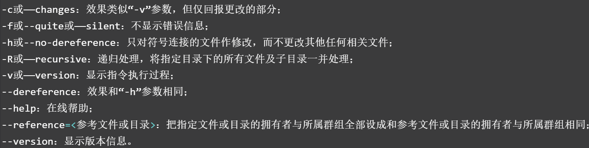
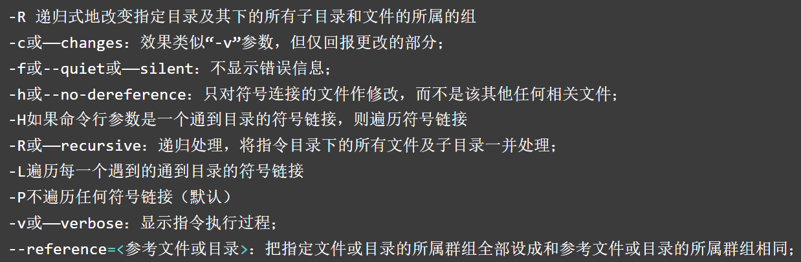
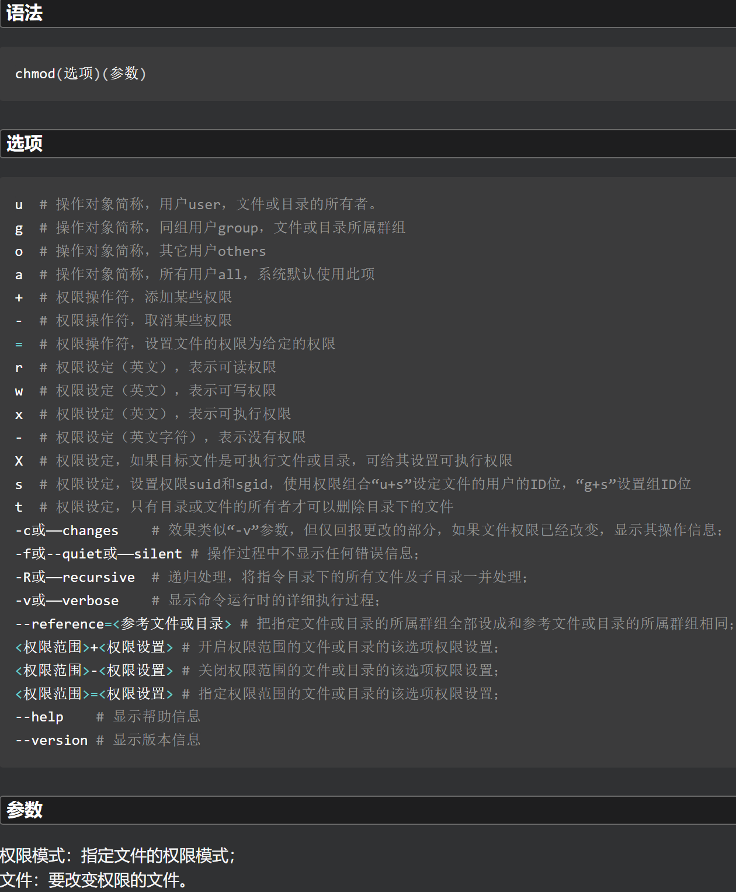
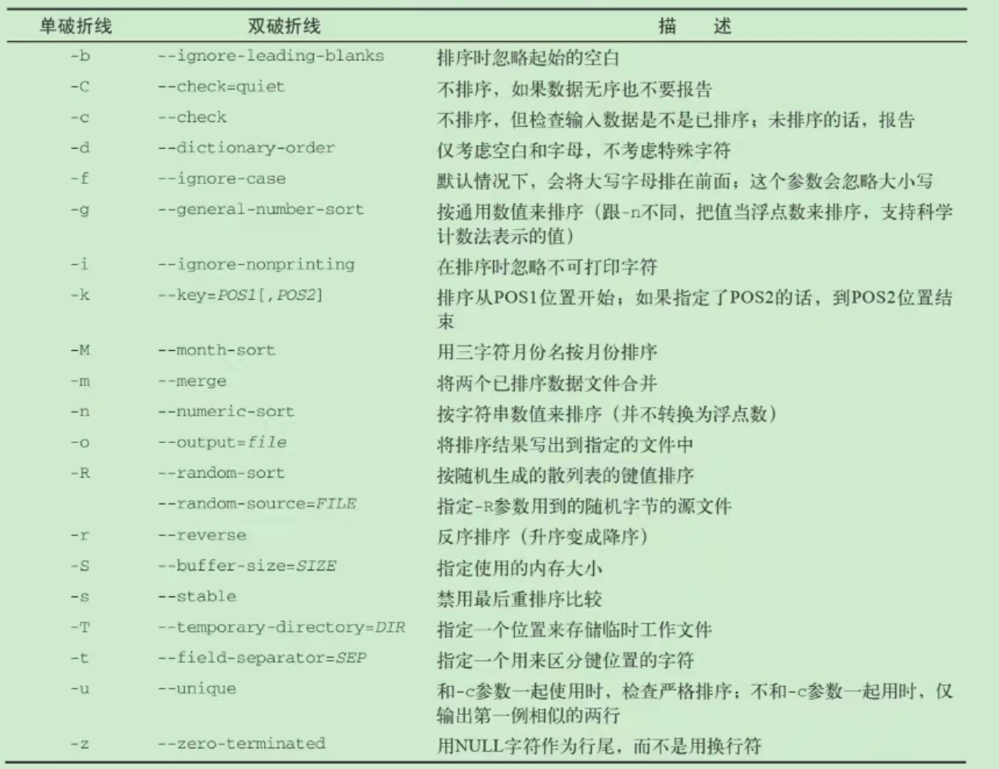
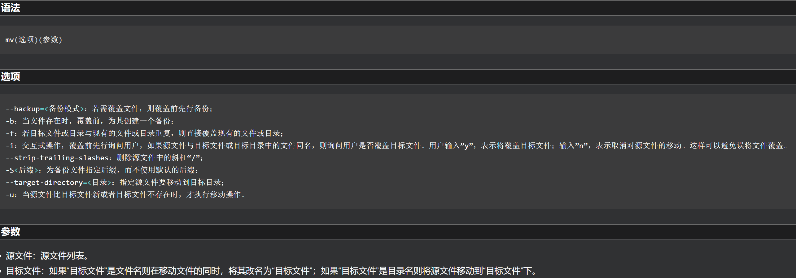

# Linux目录结构

- Linux将文件存储在单个目录结构中（虚拟目录），虚拟目录将安装在PC上的所有存储设备的文件路劲纳入单个目录结构中。
- Linux虚拟目录结构只包含一个根目录 / 的基础目录。根目录下的目录和文件会按照访问的目录路径一一列出。
- **根驱动器**：在Linux PC上安装的第一个硬盘，包含了虚拟目录的核心，从此开始构造其他目录。
- **挂载点**：在根驱动器上创建的目录，是虚拟目录中用于分配额外存储设备的目录。虚拟目录会让（该额外存储设备上的）文件和目录出现在这些挂载点的目录上。

**基于文件系统层级标准FHS**

| 目录          | 名称       | 说明                                                                                                                                                |
|:----------- |:-------- |:------------------------------------------------------------------------------------------------------------------------------------------------- |
| /           | 根目录      | 文件的最顶端，/ect、/bin、/dev、/lib、/sbin应该和根目录放置在一个分区中，而类似/usr/local可以单独位于另一个分区                                                                           |
| /bin        | 二进制目录    | 存放系统所需要的重要命令，比如文件或目录操作的命令ls、cp、mkdir等。另外/usr/bin也存放了一些系统命令，这些命令对应的文件都是可执行的，普通用户可以使用大部分的命令                                                         |
| /boot       | 启动目录     | 这是存放Linux启动时内核及引导系统程序所需要的核心文件，内核文件和gub系统引导管理器（或称引导装载程序）都位于此目录                                                                                     |
| /dev        | 设备目录     | 存放Linux系统下的设备文件，如光驱、磁盘等。访问该目录下某个文件相当于访问某个硬件设备，常用的是挂载光驱                                                                                            |
| /etc        | 系统配置文件目录 | 一般存放系统的配置文件，作为一些软件启动时默认配置文件读取的目录，如/etc/fstab存放系统分区信息                                                                                              |
| /home       | 主目录      | 系统默认的用户主目录。如果添加用户时不指定用户的主目录，默认在/home下创建与用户名同名的文件夹。代码中可以用HOME环境变量表示当前用户的主目录                                                                        |
| /lib        | 库目录      | 64位系统有/lib64文件夹，主要存放动态链接库。类似的目录有/usr/1ib、/usr/local/lib等                                                                                          |
| /lost+found | 媒体目录     | 存放一些当系统意外崩溃或机器意外关机时产生的文件碎片                                                                                                                        |
| /mnt        | 挂载目录     | 用于存放挂载储存设备的挂载目录，如光驱等                                                                                                                              |
| /proc       | 进程目录     | 存放操作系统运行时的信息，如进程信息、内核信息、网络信息等。此目录的内容存在于内存中，实际不占用磁盘空间，如/etc/cpuinfo存放CPU的相关信息                                                                      |
| /root       | -        | Linux超级权限用户root的主目录                                                                                                                               |
| /sbin       | 系统二进制目录  | 存放一些系统管理的命令，一般只能由超级权限用户root执行。大多数命令普通用户一般无权限执行，类似/sbin/ifconfig，普通用户使用绝对路径也可执行，用于查看当前系统的网络配置。类似的目录有usr/sbin、usr/local/sbin                        |
| /tmp        | 临时目录     | 临时文件目录，任何人都可以访问。系统软件或用户运行程序（如MySQL)时产生的临时文件存放到这里。此目录数据需要定期清除。重要数据不可放置在此目录下，此目录空间不易过小                                                              |
| /usr        | 用户二进制目录  | 应用程序存放目录，如命令、帮助文件等。安装Linux软件包时默认安装到/usr/local目录下。比如/usr/share/fonts存放系统字体，/usr/share/man存放帮助文档，/usr/include存放软件的头文件等。/usr/local目录建议单独分区并设置较大的磁盘空间 |
| /var        | 可变目录     | 这个目录的内容是经常变动的，如/var/log用于存放系统日志、/var/lib用于存放系统库文件等                                                                                                |
| /sys        | 系统目录     | 目录与/proc类似，是一个虚拟的文件系统，主要记录与系统核心相关的信息，如系统当前已经载入的模块信息等。这个目录实际不占硬盘容量                                                                                 |
| /srv        | 服务目录     | 存放本地服务的相关文件                                                                                                                                       |
| /sbin       | 系统二进制目录  | 存放许多GNU管理员级工具                                                                                                                                     |
| /run        | 运行目录     | 存放系统运行时的运行数据                                                                                                                                      |
| /opt        | 可选目录     | 常用于存放第三方软件包和数据文件                                                                                                                                  |
| /media      | 媒体目录     | 可移动媒体设备的常用挂载点                                                                                                                                     |

## cd 切换文件目录

```shell
# 到达指定目录
cd 绝对路径/相对路径
# 当前目录
.
# 切换到当前目录的父目录
cd .. 
# 返回到/home
cd ~
# 
```

## pwd 显示当前的绝对路径

```shell
pwd
```

## ls （按行）列出当前目录下的文件和目录

```shell
# 列出当前的文件和目录
ls
# 列出所有，包括隐藏的内容
ls -a 
# 递归输出当前目录的所有子目录中的文件
ls -R
# ll 显示长列表
ls -l
# 搭配通配符使用
ls -l 字符串通配符匹配
# 显示文件大小
ls -i
```

## ll 显示长列表

```shell
ll 
# 等于 ls -l
```

## file 查看文件类型

```shell
file 文件    
```

```shell
# 对普通目录
[root@bogon /]# file boot
boot: directory  
# 对软连接文件
[root@bogon /]# file bin
bin: symbolic link to usr/bin
# 对脚本文件，而且可以确定文件的字符集
[root@bogon shellTest]# file if_demo01.sh
if_demo01.sh: Bourne-Again shell script, UTF-8 Unicode text executable
# 对二进制文件 可以确定该程序编译时所面向的平台以及需要何种类型的库
[root@bogon shellTest]# file /bin/ls
/bin/ls: ELF 64-bit LSB shared object, x86-64, version 1 (SYSV), dynamically linked, interpreter /lib64/ld-linux-x86-64.so.2, for GNU/Linux 3.2.0, BuildID[sha1]=bccb4c17516c6a9ad59c3ec19b347c83236c04c2, stripped
```

# 文件信息

 

**文件类型**

| 参数  | 说明                    |
|:--- |:--------------------- |
| -   | 普通文件                  |
| d   | 目录文件                  |
| l   | 符号链接文件                |
| b/c | 设备文件；b-块设备文件；c-字符设备文件 |
| p   | 管道文件                  |

**文件权限**

| 权限  | 说明   |
|:--- |:---- |
| r   | 读权限  |
| w   | 写权限  |
| x   | 执行权限 |

- 数字对应的权限

| 权限  | 说明             |
|:--- |:-------------- |
| 777 | 绝对权限 rwxrwxrwx |
|     |                |

# 文件权限

- 对root用户而言，rw权限是可以无视的，而执行文件则必须要有x权限（包括root用户）。

## chown 改变文件所有者

 

**常用**

| 命令                  | 说明                         |
|:------------------- |:-------------------------- |
| chown -R 用户 文件/目录文件 | 将目录及其下面的所有文件、子目录的文件主改成指定用户 |

```shell
[root@bogon Test]# ll
total 8
-rw-r--r--. 1 root root  116 Nov 28 00:42 myDays.log
[root@bogon Test]# chown zjk myDays.log
[root@bogon Test]# ll
total 8
-rw-r--r--. 1 zjk  root  116 Nov 28 00:42 myDays.log

[root@bogon Test]# ll
total 8
-rw-r--r--. 1 zjk  root  116 Nov 28 00:42 myDays.log
drwxr-xr-x. 3 root root   78 Nov 27 20:35 zipTest
-rw-r--r--. 1 root root 1588 Nov 27 20:29 zipTest1.zip
[root@bogon Test]# chown -R zjk zipTest
[root@bogon Test]# ll
total 8
-rw-r--r--. 1 zjk  root  116 Nov 28 00:42 myDays.log
drwxr-xr-x. 3 zjk  root   78 Nov 27 20:35 zipTest
-rw-r--r--. 1 root root 1588 Nov 27 20:29 zipTest1.zip
[root@bogon Test]# cd zipTest
[root@bogon zipTest]# ll
total 12
-rw-r--r--. 1 zjk root 424 Nov 27 20:27 test1.zip
-rw-r--r--. 1 zjk root 323 Nov 27 20:25 testZip1.txt
-rw-r--r--. 1 zjk root 323 Nov 27 20:26 testZip2.txt
drwxr-xr-x. 2 zjk root  63 Nov 27 20:27 zipTest
```

## chgrp 改变文件所属组

- 组名可以是用户组的id，也可以是用户组的组名

**格式**

```shell
chgrp [选项][组群][文件|目录]
```

 

```shell
[root@bogon zipTest]# chgrp -R root /root/Test/zipTest
```

## chmod 变更文件或目录的权限

 

**权限**

# 文件操作

## touch 创建新的空文件

- 一是用于把已存在文件的时间标签更新为系统当前的时间（默认方式），它们的数据将原封不动地保留下来；二是用来创建新的空文件。

 

## sed 流编辑器

- 流编辑器，
- 处理时，把当前处理的行存储在临时缓冲区中，称为“模式空间”（pattern space），接着用sed命令处理缓冲区中的内容，处理完成后，把缓冲区的内容送往屏幕。接着处理下一行，这样不断重复，直到文件末尾。文件内容并没有 改变，除非使用重定向存储输出。

**命令格式**

```shell
sed [options] 'command' file(s)
sed [options] -f scriptfile file(s)
```

```shell
[root@localhost ~]# head -3 /etc/passwd |sed -n 2p
bin:x:1:1:bin:/bin:/sbin/nologin
[root@localhost ~]# head -3 /etc/passwd |sed -n 2,3p
bin:x:1:1:bin:/bin:/sbin/nologin
daemon:x:2:2:daemon:/sbin:/sbin/nologin
```

**选项**

| options                            | 说明                        |
|:---------------------------------- |:------------------------- |
| `-e<script>或--expression=<script>` | 以选项中的指定的script来处理输入的文本文件  |
| `-f<script文件>或--file=<script文件>`   | 以选项中指定的script文件来处理输入的文本文件 |
| -h或--help                          | 显示帮助                      |
| -n或--quiet或--silent                | 仅显示script处理后的结果           |
| -V或--version                       | 显示版本信息                    |

**sed替换标记**

| 命令  | 说明                          |
|:--- |:--------------------------- |
| g   | 表示行内全面替换。                   |
| p   | 表示打印行。                      |
| w   | 表示把行写入一个文件。                 |
| x   | 表示互换模板块中的文本和缓冲区中的文本。        |
| y   | 表示把一个字符翻译为另外的字符（但是不用于正则表达式） |
| \1  | 子串匹配标记                      |
| &   | 已匹配字符串标记                    |

**sed元字符集**

| 命令       | 说明                                                        |
|:-------- |:--------------------------------------------------------- |
| ^        | 匹配行开始，如：/^sed/匹配所有以sed开头的行。                               |
| $        | 匹配行结束，如：/sed$/匹配所有以sed结尾的行。                               |
| .        | 匹配一个非换行符的任意字符，如：/s.d/匹配s后接一个任意字符，最后是d。                    |
| *        | 匹配0个或多个字符，如：/*sed/匹配所有模板是一个或多个空格后紧跟sed的行。                 |
| []       | 匹配一个指定范围内的字符，如/[ss]ed/匹配sed和Sed。                          |
| [^]      | 匹配一个不在指定范围内的字符，如：/[^A-RT-Z]ed/匹配不包含A-R和T-Z的一个字母开头，紧跟ed的行。 |
| \(..\)   | 匹配子串，保存匹配的字符，如s/\(love\)able/\1rs，loveable被替换成lovers。     |
| &        | 保存搜索字符用来替换其他字符，如s/love/ **&** /，love这成 **love** 。         |
| \<       | 匹配单词的开始，如:/\<love/匹配包含以love开头的单词的行。                       |
| \>       | 匹配单词的结束，如/love\>/匹配包含以love结尾的单词的行。                        |
| x\{m\}   | 重复字符x，m次，如：/0\{5\}/匹配包含5个0的行。                             |
| x\{m,\}  | 重复字符x，至少m次，如：/0\{5,\}/匹配至少有5个0的行。                         |
| x\{m,n\} | 重复字符x，至少m次，不多于n次，如：/0\{5,10\}/匹配5~10个0的行。                 |

## tar 打包/解包 归档

```shell
tar 选项 参数
```

**扩展名**

- `.tar`
- `.tar.gz`：.tgz：gzip压缩的tar包
- `.tar.bz2`

**选项**

```shell
-c # 创建空的归档文件
-f # 将指定的文件覆盖到归档文件中
-r # 将指定的文件追加到归档文件中
```

**归档**：

- 是指使用-c创建一个空的归档文件（不是文件的压缩）
- 再通过-f 文件 的方式覆盖新的内容到该归档文件
- 或使用-r 文件 的方式追加新的文件到该归档文件中


**常用组合**

| 组合                                          | 作用           |
|:------------------------------------------- |:------------ |
| tar -cvf 归档文件 目标文件                          | 仅打包          |
| tar -zcvf 输出文件 目标文件                         | 打包，gzip压缩    |
| tar -jcvf 输出文件 目标文件                         | 打包，bzip2压缩   |
| tar -ztvf 目标文件                              | 查看压缩包文件列表    |
| tar -zxvf 目标文件                              | 解压压缩包到当前路径   |
| tar -zxvf 目标文件 指定文件                         | 只压缩指定文件      |
| tar -zxvpf 输出文件 目标文件                        | 建立压缩包时保留文件属性 |
| tar --exclude 排除的文件1 排除的文件2 ... 执行的选项/组合 参数 | 排除某些文件       |

```shell
tar -cvf /tmp/etc.tar /etc
tar -zcvf /tmp/etc.tar.gz /etc
tar -zcvf /tmp/etc.tar.bz2 /etc
tar -ztvf /tmp/etc.tar.bz2
tar -zxvf /tmp/etc.tar.gz etc/passwd
tar --exclude /home/*log -zcvf /tmp/etc2.tar.gz etc/passwd
```

## zip / unzip 压缩/解压缩 .zip

**格式**

```shell
zip [参数] [打包后的文件名] [打包的目录路径]
```

**压缩常用组合**

| 组合                  | 作用    |
|:------------------- |:----- |
| zip 压缩文件名.zip 文件名   | 压缩文件  |
| zip -r 压缩包名.zip 文件夹 | 压缩文件夹 |

**解压缩常用组合**

| 组合                         | 作用           |
|:-------------------------- |:------------ |
| unzip 压缩文件名.zip            | 解压文件         |
| unzip 压缩文件名.zip -d 目标文件夹路径 | 解压到目标文件夹     |
| unzip -v 压缩包名.zip          | 查看压缩包内容，而不解压 |

```shell
# zip 压缩包.zip 文件
[root@bogon zipTest]# zip test1.zip testZip1.txt
updating: testZip1.txt (deflated 23%)
[root@bogon zipTest]# ll
total 12
-rw-r--r--. 1 root root 424 Nov 27 20:27 test1.zip
-rw-r--r--. 1 root root 323 Nov 27 20:25 testZip1.txt
-rw-r--r--. 1 root root 323 Nov 27 20:26 testZip2.txt

# zip -r 压缩包.zip 文件夹
[root@bogon Test]# zip -r zipTest1.zip zipTest
  adding: zipTest/ (stored 0%)
  adding: zipTest/testZip1.txt (deflated 23%)
  adding: zipTest/testZip2.txt (deflated 23%)
  adding: zipTest/test1.zip (stored 0%)
[root@bogon Test]# ll
total 4
drwxr-xr-x. 2 root root   63 Nov 27 20:27 zipTest
-rw-r--r--. 1 root root 1588 Nov 27 20:29 zipTest1.zip

# unzip 压缩包.zip
[root@bogon Test]# unzip zipTest1.zip
Archive:  zipTest1.zip
replace zipTest/testZip1.txt? [y]es, [n]o, [A]ll, [N]one, [r]ename: y
  inflating: zipTest/testZip1.txt    
replace zipTest/testZip2.txt? [y]es, [n]o, [A]ll, [N]one, [r]ename: y
  inflating: zipTest/testZip2.txt    
replace zipTest/test1.zip? [y]es, [n]o, [A]ll, [N]one, [r]ename: y
 extracting: zipTest/test1.zip       
[root@bogon Test]# ll
total 4
drwxr-xr-x. 2 root root   63 Nov 27 20:32 zipTest
-rw-r--r--. 1 root root 1588 Nov 27 20:29 zipTest1.zip

# unzip 压缩包.zip -d ./Test
[root@bogon Test]# unzip zipTest1.zip -d /root/Test/zipTest
Archive:  zipTest1.zip
   creating: /root/Test/zipTest/zipTest/
  inflating: /root/Test/zipTest/zipTest/testZip1.txt  
  inflating: /root/Test/zipTest/zipTest/testZip2.txt  
 extracting: /root/Test/zipTest/zipTest/test1.zip  
[root@bogon Test]# ll
total 4
drwxr-xr-x. 3 root root   78 Nov 27 20:35 zipTest
-rw-r--r--. 1 root root 1588 Nov 27 20:29 zipTest1.zip
[root@bogon Test]# cd zipTest
[root@bogon zipTest]# ll
total 12
-rw-r--r--. 1 root root 424 Nov 27 20:27 test1.zip
-rw-r--r--. 1 root root 323 Nov 27 20:25 testZip1.txt
-rw-r--r--. 1 root root 323 Nov 27 20:26 testZip2.txt
drwxr-xr-x. 2 root root  63 Nov 27 20:27 zipTest

# unzip -v 压缩包.zip
[root@bogon Test]# unzip -v zipTest1.zip
Archive:  zipTest1.zip
 Length   Method    Size  Cmpr    Date    Time   CRC-32   Name
--------  ------  ------- ---- ---------- ----- --------  ----
       0  Stored        0   0% 11-27-2022 20:27 00000000  zipTest/
     323  Defl:N      250  23% 11-27-2022 20:25 eb905491  zipTest/testZip1.txt
     323  Defl:N      250  23% 11-27-2022 20:26 eb905491  zipTest/testZip2.txt
     424  Stored      424   0% 11-27-2022 20:27 a68b676d  zipTest/test1.zip
--------          -------  ---                            -------
    1070              924  14%                            4 files
```

## gzip 压缩 .gz

### gzcat 查看压缩文件的内容

### gunzip 解压

## sort 对文件数据排序

- sort命令**默认会将文本中的数据当成字符来排序按照会话指定的默认语言的排序顺序输出，<mark>包括数字和时间日期等</mark>**，而不是按照相应的规则来排序。
- **默认是升序排序**

| 命令                           | 说明                                  |
| ---------------------------- | ----------------------------------- |
| sort -n                      | 将文本识别为数字来排序                         |
| sort -M                      | 将文本识别为Mar形式的月份来排序                   |
| sort -t '分隔字符' -k 指定排序的字符段位置 | -t对每行的字符段进行分隔，然后-k选择每行分隔的其中一段字符进行排序 |
| sort -r                      | 将排序结果降序输出                           |

 

```shell
# sort -t '字符' -k  文件
# 将/etc/passwd按uid来排序
[root@bogon ~]# sort -t ':' -k 3  /etc/passwd | head -n 5
root:x:0:0:root:/root:/bin/bash
operator:x:11:0:operator:/root:/sbin/nologin
bin:x:1:1:bin:/bin:/sbin/nologin
games:x:12:100:games:/usr/games:/sbin/nologin
ftp:x:14:50:FTP User:/var/ftp:/sbin/nologin
```

## mv 移动/重命名

- 用来对文件或目录重新命名，或者将文件从一个目录移到另一个目录中。
- 如果将一个文件移到一个已经存在的目标文件中，则目标文件的内容将被覆盖。

**源文件被移至目标文件有两种不同的结果：**

1. 如果目标文件是到某一目录文件的路径，源文件会被移到此目录下，且文件名不变。
2. 如果目标文件不是目录文件，则源文件名（只能有一个）会变为此目标文件名，并覆盖己存在的同名文件。

 

**常用**

| 组合        | 说明         |
|:--------- |:---------- |
| mv 源文件 目标 | 将源文件移到目标位置 |

## rm 删除

## cp 复制

**常用**

```shell
cp 复制的文件路径 目标
```

## mkdir 新建文件夹

 

```shell
# 在当前路径下创建目录
mkdir 目录
# 创建目录及其上层目录
mkdir /目录1/目录2
# 创建目录的同时指定权限
mkdir -m 777 目录
```

## ln 文件链接

**硬链接**

- 如果源文件被删除，硬链接仍然可以正常使用、读写数据
- 不可以跨区/磁盘创建硬链接
- 硬链接与源文件使用的是相同的设备、inode编号，文件属性和源文件相同

```shell
ln 源路径 目标路径
```

**软链接**

- 如果源文件被删除，则无法继续使用软链接
- 可以跨分区/磁盘创建软链接
- 软链接的文件属性被标记为`l`;同时有指针`->`指向源文件

```shell
ln -s 源路径 目标路径
```

```shell
[root@bogon testDir01]# ln /root/Test/test01.test test01ln.test
[root@bogon testDir01]# ln -s /root/Test/test01.test test01lns.test
[root@bogon testDir01]# ll
total 0
-rw-r--r--. 2 root root  0 Feb 19 14:23 test01ln.test
lrwxrwxrwx. 1 root root 22 Feb 19 14:24 testlns.test -> /root/Test/test01.test
```

# 查看文件

## cat 一次性显示文本文件的所有内容

- 不适用于内容大的文件
- 一旦运行就无法控制后面的操作

```shell
# 一次性显示文本文件的所有内容
cat 文件
# 为每一行加上行号
cat -n 文件
# 只给有文本的行加上行号
cat -b 文件
# 替换制表符为^I字符
cat -T 文件
```

## more 分页显示文本内容

- 分页的形式查看，使用空格或回车来逐行查看文件内容，只支持文本文件中的基本查看。
- 使用q来退出查看

```shell
# 分页显示
more 文件
```

## less more的加强

- 在more的基础上，能够使用上下和翻页键。

```shell
less 文件
```

## tail 显示文件的最后几行

- 默认显示文件的最后10行

```shell
# 指定显示的末尾n行
tail -n 行数 文件
# 保持活动状态，不断显示文件中更改的内容
tail -f 文件
```

## head 显示文件的头几行

- 默认显示文件的前10行。

```shell
# 指定显示前n行
head -n 行数 文件
```
