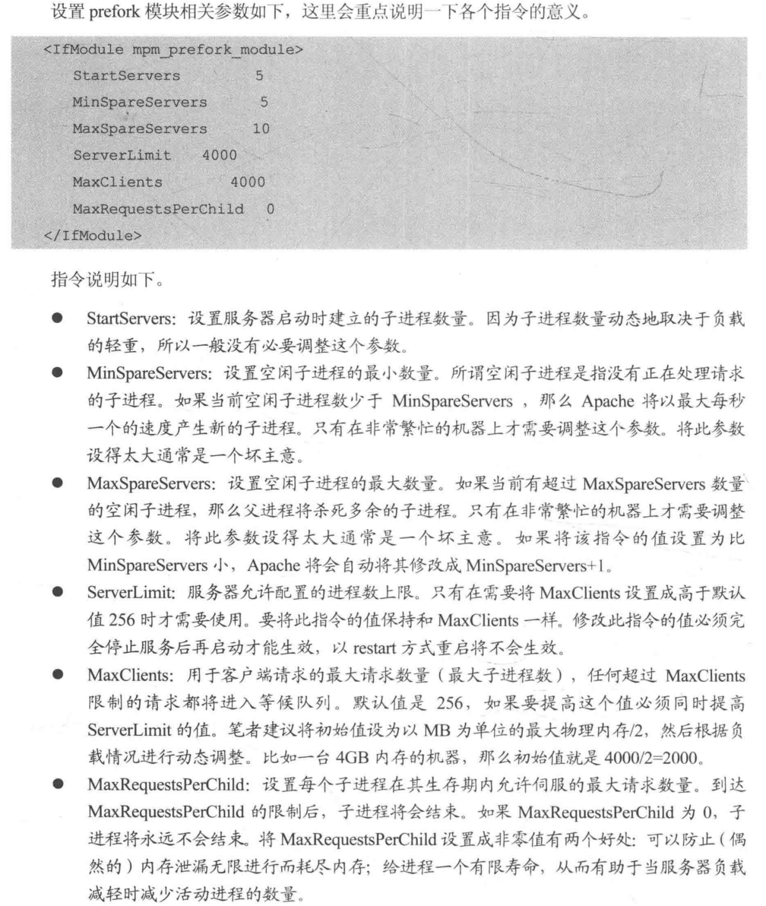

# MySQL

## 安装 mariadb

```shell
cd /mnt/Packages
rpm -ivh perl-Compress-Raw-Bzip2-2.061-3.el7.x86_64.rpm
rpm -ivh perl-Compress-Raw-Zlib-2.061-4.el7.x86_64.rpm
rpm -ivh perl-DBD-MySQL-4.023-5.el7.x86_64.rpm
rpm -ivh perl-Data-Dumper-2.145-3.el7.x86_64.rpm
rpm -ivh perl-IO-Compress-2.061-2.el7.noarch.rpm
rpm -ivh perl-Net-Daemon-0.48-5.el7.noarch.rpm
rpm -ivh perl-PlRPC-0.2020-14.el7.noarch.rpm
rpm -ivh mariadb-server-5.5.56-2.el7.x86_64.rpm mariadb-5.5.56-2.el7.x86_64.rpm
```

### 配置文件

```shell
/etc/my.cnf
```

# Apache服务和LAMP

- 镜像下载地址[apache](https://mirrors.tuna.tsinghua.edu.cn/apache/)

## Apache服务的安装配置

### 安装OpenSSL

```shell
cd /root/install
wget --no-check-certificate https://www.openssl.org/source/old/1.0.1/openssl-1.0.1s.tar.gz
tar -xvf openssl-1.0.1s.tar.gz
cd openssl-1.0.1s
./config --prefix=/usr/local/ssl --shared
make
make install
echo /usr/local/ssl/lib/ >> /etc/ld.so.conf
ldconfig
```

### 安装Apache

```shell
# 安装apr
cd /root/install
wget https://archive.apache.org/dist/apr/apr-1.5.2.tar.gz
tar -xvf apr-1.5.2.tar.gz
cd apr-1.5.2
./configure --prefix=/usr/local/apr
make
make install
# 安装apr-util
cd /root/install
wget https://archive.apache.org/dist/apr/apr-util-1.5.4.tar.gz
tar -xvf apr-util-1.5.4.tar.gz
cd apr-util-1.5.4
./configure --prefix=/usr/local/apr-util --with-apr=/usr/local/apr
make
make install
# 安装 pcre
cd /root/install
wget --no-check-certificate  https://sourceforge.net/projects/pcre/files/pcre/8.38/pcre-8.38.tar.gz
tar -xvf pcre-8.38.tar.gz
cd pcre-8.38
./configure --prefix=/usr/local/pcre
make
make install
# 安装源码包
cd /root/install
wget http://archive.apache.org/dist/httpd/httpd-2.4.18.tar.gz
tar -xvf
cd httpd-2.4.18
./configure --prefix=/usr/local/apache2 \
--enable-so \
--enable-rewrite \
--enable-ssl \
--with-ssl=/usr/local/ssl \
--with-apr=/usr/local/apr \
--with-apr-util=/usr/local/apr-util \
--with-pcre=/usr/local/pcre
make
make install
```

**Apache是模块化的服务器，服务器中只包含常用的模块，扩展功能需要由其他模块提供**

**使用模块的方式**

- 方法1：静态编译二进制文件，
- 方法2：启用SSL加密和mod_rewrite，并且采用动态编译模式，需要启用mod_so。可以动态的添加模块，而不用重新编译。

### 配置httpd.conf

[httpd](https://www.cnblogs.com/hgzero/p/14136149.html#1.%20httpd)

 

```shell
vim /usr/local/apache2/conf/httpd.conf
# 打开以下开关
LoadModule authn_anon_module modules/mod_authn_anon.so
EnableMMAP on
EnableSendfile on
# 添加如下
<IfModule mpm_prefork_module>
        StartServers    5
        MinSpareServers 5
        MaxSpareServers 10
        ServerLimit     4000
        MaxClients      4000
        MaxRequestsPerChild     0
</IfModule>

<IfModule mpm_worker_module>
        StartServers    5
        ServerLimit     20
        ThreadLimit     200
        MaxClients      4000
        MinSpareThreads 25
        MaxSpareThreads 250
        ThreadsPerChild 200
        MaxRequestsPerChild     0
</IfModule>
```

 
 

### 虚拟主机配置

**基于IP、基于端口、基于域名3种方式**

- 基于IP的需要拥有多个IP
- 基于端口的只需要1个IP，或需要不同端口访问不同虚拟主机时使用
- 基于域名的可以在同一个IP上配置多个域名，并通过80端口访问

**切换虚拟主机配置方式**

- 将/usr/local/apache2/conf/httpd.conf中其他配置的Listen删除。

#### 基于IP

**有多个IP**

1. 绑定IP

```shell
ifconfig ens33:1 192.168.186.101
ifconfig ens33:2 192.168.186.102
ifconfig ens33:3 192.168.186.103
```

2. 修改主机/etc/hosts文件

```shell
vim /etc/hosts
echo -e "192.168.186.101 www.zjk01.com\n192.168.186.102 www.zjk02.com\n192.168.186.103 www.zjk03.com" >> /etc/hosts
```

3. 建立虚拟主机存放网页的根目录，并创建首页文件

```shell
mkdir /data/www
cd /data/www
mkdir 101
mkdir 102
mkdir 103
echo "192.168.186.101" > 101/index.html
echo "192.168.186.102" > 102/index.html
echo "192.168.186.103" > 103/index.html
```

4. 修改httpd.conf，添加

```shell
echo -e "Listen 192.168.186.101:80\nListen 192.168.186.102:80\nListen 192.168.186.103:80\nInclude conf/vhost/*.conf" >> /usr/local/apache2/conf/httpd.conf
```

5. 编辑每个IP的配置文件

```shell
mkdir /usr/local/apache2/conf/vhost
vim /usr/local/apache2/conf/vhost/www.zjk01.conf
# 编辑101
<VirtualHost 192.168.186.101>
    ServerName    www.zjk01.com
    DocumentRoot    /data/www/101
    <Directory "/data/www/101">
        Options Indexes FollowSymLinks
        AllowOverride None
        Require all granted
    </Directory>
</VirtualHost>

vim /usr/local/apache2/conf/vhost/www.zjk02.conf
# 编辑102
<VirtualHost 192.168.186.102>
    ServerName    www.zjk02.com
    DocumentRoot    /data/www/102
    <Directory "/data/www/102">
        Options Indexes FollowSymLinks
        AllowOverride None
        Require all granted
    </Directory>
</VirtualHost>

# 编辑103
vim /usr/local/apache2/conf/vhost/www.zjk03.conf
# 编辑103
<VirtualHost 192.168.186.103>
    ServerName    www.zjk03.com
    DocumentRoot    /data/www/103
    <Directory "/data/www/103">
        Options Indexes FollowSymLinks
        AllowOverride None
        Require all granted
    </Directory>
</VirtualHost>
```

#### 基于端口 

**只有1个IP或需要不同端口访问不同的虚拟主机**

1. 绑定IP

```shell
ifconfig ens33:4 192.168.186.157
```

2. 修改主机/etc/hosts文件

```shell
vim /etc/hosts
echo -e "192.168.186.157 www.test.com" >> /etc/hosts
```

3. 建立虚拟主机存放网页的根目录，并创建首页文件

```shell
mkdir /data/port
cd /data/port
mkdir 7081
mkdir 8081
mkdir 9081
echo "port 7081" > 7081/index.html
echo "port 8081" > 8081/index.html
echo "port 9081" > 9081/index.html
```

4. 修改httpd.conf，添加

```shell
echo -e "Listen 192.168.186.157:7081\nListen 192.168.186.157:8081\nListen 192.168.186.157:9081" >> /usr/local/apache2/conf/httpd.conf
```

5. 编辑每个IP的配置文件

```shell
mkdir /usr/local/apache2/conf/vhost
vim /usr/local/apache2/conf/vhost/www.test.7081.conf
# 编辑7081
<VirtualHost 192.168.186.157:7081>
    ServerName    www.test.com
    DocumentRoot    /data/port/7081
    <Directory "/data/port/7081/">
        Options Indexes FollowSymLinks
        AllowOverride None
        Require all granted
    </Directory>
</VirtualHost>

vim /usr/local/apache2/conf/vhost/www.zjk04.8081.conf
# 编辑8081
<VirtualHost 192.168.186.157:8081>
    ServerName    www.test.com
    DocumentRoot    /data/port/8081
    <Directory "/data/port/8081/">
        Options Indexes FollowSymLinks
        AllowOverride None
        Require all granted
    </Directory>
</VirtualHost>

# 编辑9081
vim /usr/local/apache2/conf/vhost/www.zjk04.9081.conf
# 编辑9081
<VirtualHost 192.168.186.157:9081>
    ServerName    www.test.com
    DocumentRoot    /data/port/9081
    <Directory "/data/port/9081/">
        Options Indexes FollowSymLinks
        AllowOverride None
        Require all granted
    </Directory>
</VirtualHost>
```

#### 基于域名

1. 绑定IP

```shell
ifconfig ens33:5 192.168.186.105
```

2. 修改主机/etc/hosts文件

```shell
vim /etc/hosts
echo -e "192.168.186.105 www.oa.com\n192.168.186.105 www.bbs.com\n192.168.186.105 www.test.com" >> /etc/hosts
```

3. 建立虚拟主机存放网页的根目录，并创建首页文件

```shell
mkdir /data/www
cd /data/www
mkdir www.oa.com
mkdir www.bbs.com
mkdir www.test.com
echo "www.oa.com" > www.oa.com/index.html
echo "www.bbs.com" > www.bbs.com/index.html
echo "www.test.com" > www.test.com/index.html
```

4. 修改httpd.conf，添加

```shell
echo -e "Listen 192.168.186.105:80" >> /usr/local/apache2/conf/httpd.conf
```

5. 编辑每个IP的配置文件

```shell
mkdir /usr/local/apache2/conf/vhost
vim /usr/local/apache2/conf/vhost/www.oa.com.conf
# 编辑www.oa.com
<VirtualHost 192.168.186.105:80>
    ServerName    www.oa.com
    DocumentRoot    /data/www/www.oa.com
    <Directory "/data/www/www.oa.com">
        Options Indexes FollowSymLinks
        AllowOverride None
        Require all granted
    </Directory>
</VirtualHost>

# 编辑www.bbs.com
vim /usr/local/apache2/conf/vhost/www.bbs.com.conf
# 编辑www.bbs.com
<VirtualHost 192.168.186.105:80>
    ServerName    www.bbs.com
    DocumentRoot    /data/www/www.bbs.com
    <Directory "/data/www/www.bbs.com">
        Options Indexes FollowSymLinks
        AllowOverride None
        Require all granted
    </Directory>
</VirtualHost>

# 编辑test.com
vim /usr/local/apache2/conf/vhost/www.test.com.conf
# 编辑www.test.com
<VirtualHost 192.168.186.105:80>
    ServerName    www.bbs.com
    DocumentRoot    /data/www/www.test.com
    <Directory "/data/www/www.test.com">
        Options Indexes FollowSymLinks
        AllowOverride None
        Require all granted
    </Directory>
</VirtualHost>
```

#### 在现有的Web服务器上增加虚拟主机

**为现存主机建造一个`<VirtualHost>`定义块**

### 启动Apache服务

```shell
/usr/local/apache2/bin/apachectl start
# 测试
curl http://www.zjk01.com
curl http://www.zjk02.com
curl http://www.zjk03.com
```

```shell
[root@localhost port]# curl http://www.test.com
<html><body><h1>It works!</h1></body></html>
```

## Apache安全控制与认证

### `<Diretory>`定义块 虚拟目录

```shell
<Diretory "目录路径">
    目录相关配置和命令
</Diretory>
```

- （虚拟主机配置文件）每个`<Diretory>`段作用于`<Directory>`中指定的目录及其里面所有文件和子目录。在段中可以设置与该指定目录相关的参数和指令，包括访问控制和认证。
- 控制命令：Require。
- 控制方法：基于IP地址、域名、http方法、用户等。

| 指令                           | 说明             |
| :----------------------------- | :--------------- |
| Require all granted            | 允许所有主机访问 |
| Require all denied             | 拒绝所有主机访问 |
| Require ip 192.168.186.156     | 允许指定主机访问 |
| Require ip 192.168.186.0/24    | 允许指定网络访问 |
| Require not ip 192.168.186.156 | 拒绝指定主机访问 |
| Require host www.test.com      | 允许指定域名访问 |
| Require not host www.test.com  | 拒绝指定域名访问 |

- 访问没有权限的的地址时：Forbidden ....

#### Apache认证

**基本认证和摘要认证**


##### 基本认证 (用户认证) 

##### /usr/local/apache2/bin/htpasswd 

**创建用户**

```shell
cd /usr/local/apache2/bin
# 创建口令文件，同时设置admin密码
./htpasswd -c /usr/local/apache2/conf/users.list admin
# 添加用户，同时设置密码 显示的是加密的密码
./htpasswd /usr/local/apache2/conf/users.list user1
```

**删除用户**

- 直接进入/usr/local/apache2/conf/users.list文件内删除相应内容

##### 修改虚拟主机配置文件

**指令**

```shell 
# AuthName指定使用认证的域名，该域会出现在用户的密码提问对话中。
AuthName 域名
# AuthType用于选择一个目录的用户认证类型：Basic基本认证/Digest摘要认证
AuthType Basic/Digest
# AuthUserFile用于设定一个纯文本，包含用于认证的用户名和密码的列表
AuthUserFile 文件名
# Require用于设置哪些认证用户允许访问指定的资源
Require user 用户名 [用户名2...] # 授权给指定用户
Require valid-user # 授权给所有用户
```

```shell
vim /usr/local/apache2/conf/vhost/www.zjk01.conf
# 修改：
<VirtualHost 192.168.186.101>
    ServerName    www.zjk01.com
    DocumentRoot    /data/www/101
    <Directory "/data/www/101">
        Options Indexes FollowSymLinks
        AllowOverride None
        AuthType Basic
        AuthName "auth"
        AuthFile /usr/local/apache2/conf/users.list
        Require user admin
    </Directory>
</VirtualHost>
```

##### .htaccess 分布式配置文件

**需要在虚拟主机配置文件中开启选项**

- AllowOverride All

1. 删除原有关于访问控制和用户认证的参数和指令，否则这些指令会被写入.htacess文件
2. 添加AllowOverride All选项，允许.htaccess文件覆盖httpd.conf文件中关于bm目录的配置，否则.htacess文件配置不能生效。

```shell
vim /usr/local/apache2/conf/vhost/www.zjk01.conf
# 修改：
<VirtualHost 192.168.186.101>
    ServerName    www.zjk01.com
    DocumentRoot    /data/www/101
    <Directory "/data/www/101">
        Options Indexes FollowSymLinks
        AllowOverride All
    </Directory>
</VirtualHost>
```

**重启Apache服务,在/data/www/www.zjk01.com**

```shell
AuthType Basic
    AuthName "auth"
    AuthFile /usr/local/apache2/conf/users.list
    Require user admin
```

# LVS 集群负载均衡

 

# 集群技术与双机热备


# KVM虚拟化

# OpenStack

# Hadoop

# Spark