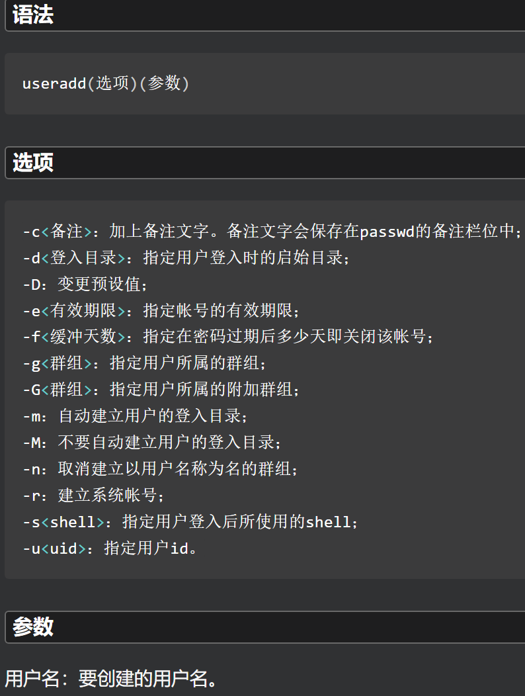
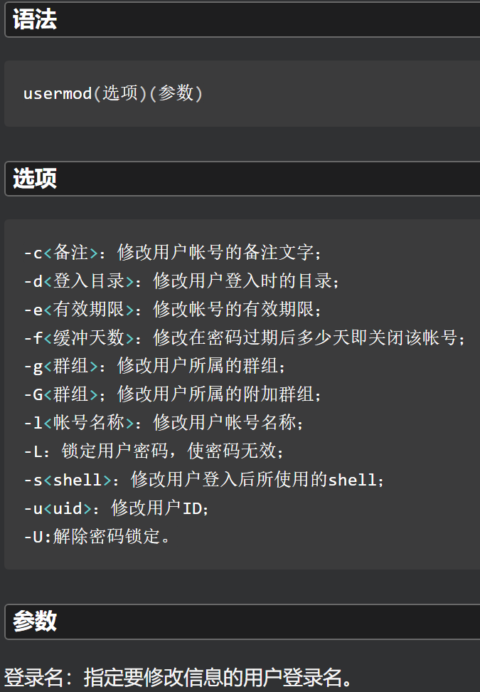
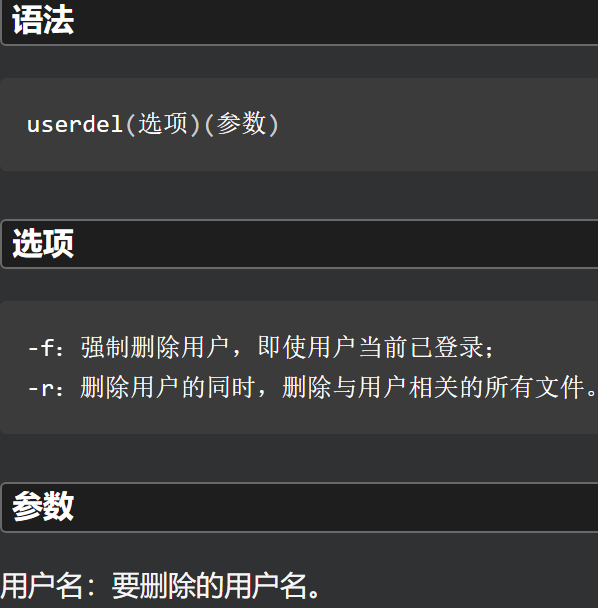
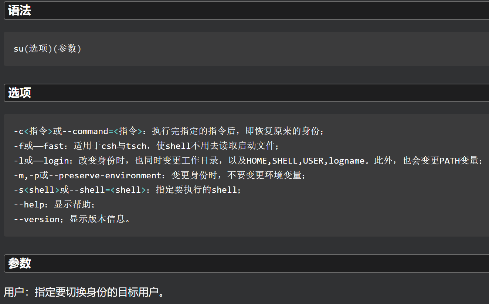
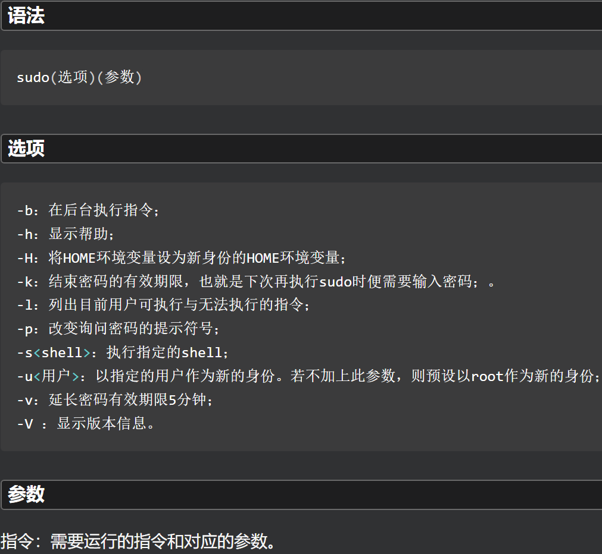
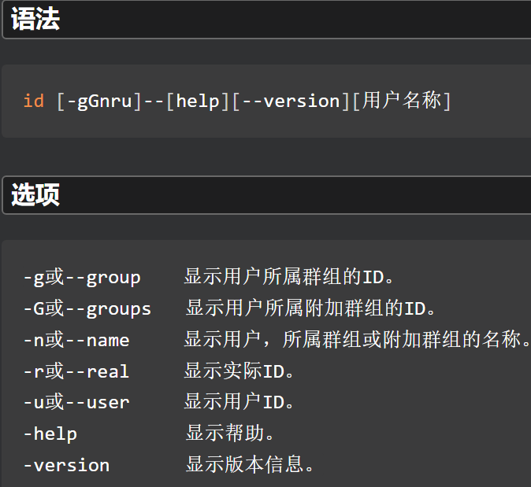
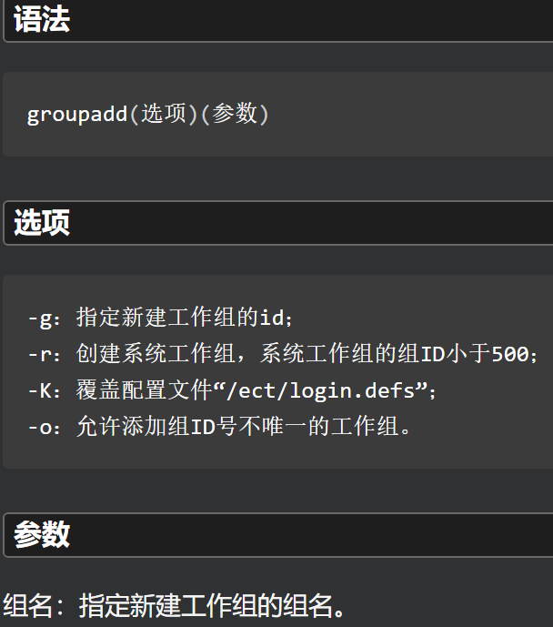
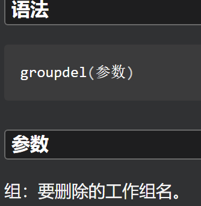
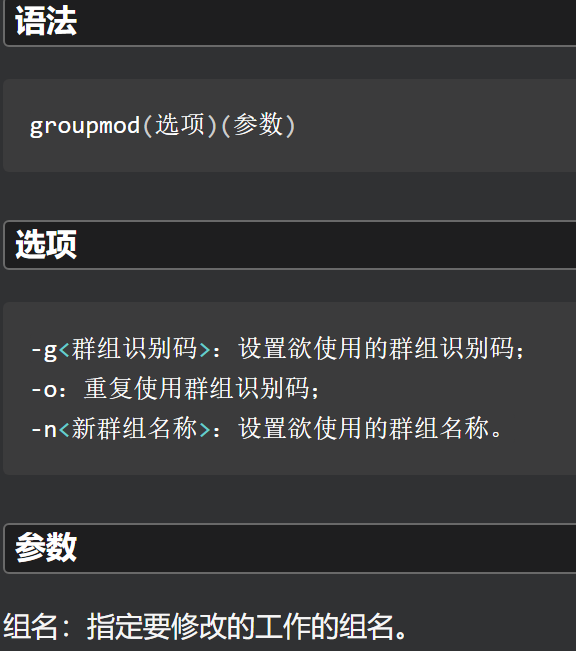

# 用户

| 类型     | 说明                                                         |
| :------- | :----------------------------------------------------------- |
| 超级用户 | root 或 UID为0 的用户                                        |
| 系统用户 | 正常运行时系统使用的用户，每个进程在系统中都有一个相应的属主。系统用户不能用来登录（bin、daemon、mail等） |
| 普通用户 | user                                                         |

## 用户管理机制

| 文件         | 说明         |
| :----------- | :----------- |
| /etc/passswd | 用户账号文件 |
| /etc/shadow  | 用户密码文件 |
| /etc/group   | 用户组文件   |

### /etc/passwd

 

 

- 普通用户的UID默认1000以上的数字

### /etc/shadow

 

 

### /etc/group

- 用户登录时默认的组放在/etc/passwd中

 

 

## 用户管理命令

### useradd 添加用户

 

```shell
[root@bogon ~]# useradd user1
[root@bogon ~]# cat /etc/passwd | grep user1
user1:x:1001:1001::/home/user1:/bin/bash
[root@bogon ~]# cat /etc/shadow | grep user1
user1:!!:19326:0:99999:7:::
[root@bogon ~]# cat /etc/group | grep user1
user1:x:1001:
```

### usermod 修改用户

- usermod 命令不允许你改变正在线上的使用者帐号名称。当 usermod 命令用来改变user id，必须确认这名user没在电脑上执行任何程序。你需手动更改使用者的 crontab 档。也需手动更改使用者的 at 工作档。采用 NIS server 须在server上更动相关的NIS设定。

 

```shell
[root@bogon ~]# usermod -l newuser user1 
[root@bogon ~]# cat /etc/passwd | grep newuser
newuser:x:1001:1001::/home/user1:/bin/bash
[root@bogon ~]# cat /etc/passwd | grep user1
newuser:x:1001:1001::/home/user1:/bin/bash
```

### userdel 删除用户

 

- 不加`-r`选项的userdel只是对用户删除，而不包含该用户的相关任务和文件。

```shell
[root@bogon ~]# userdel -r newuser
```

### passwd 用户密码

- 用于设置用户的认证信息，包括用户密码、密码过期时间等。
- 系统管理者则能用它管理系统用户的密码。只有管理者可以指定用户名称，一般用户只能变更自己的密码。


```shell
[root@bogon ~]# passwd
Changing password for user root.
New password: 
BAD PASSWORD: The password is shorter than 8 characters
Retype new password: 
passwd: all authentication tokens updated successfully.
[root@bogon ~]# passwd zjk
Changing password for user zjk.
New password: 
BAD PASSWORD: The password is shorter than 8 characters
Retype new password: 
passwd: all authentication tokens updated successfully.
```

### su 切换用户

 

**常用**

| 组合            | 说明                                             |
| :-------------- | :----------------------------------------------- |
| su 用户         | 切换用户，不改变环境变量（不指定用户则默认root） |
| su - 用户       | 切换用户，改变环境变量（不指定用户则默认root）   |
| su -c 命令 用户 | 切换用户执行命令之后，回原来用户                 |

```shell
[root@bogon ~]# su
[root@bogon ~]# su zjk
[zjk@bogon root]$ pwd
/root
[root@bogon ~]# su - zjk
Last login: Wed Nov 30 19:16:03 CST 2022 on pts/0
[zjk@bogon ~]$ pwd
/home/zjk
[zjk@bogon ~]$ su -c ls root
Password: 
Desktop  Documents  Downloads  Music  Pictures  Public  Templates  Videos
```

### sudo 普通用户获取超级权限

- 用来以其他身份来执行命令，预设的身份为root。
- 在**/etc/sudoers**中设置了可执行sudo指令的用户。若其未经授权的用户企图使用sudo，则会发出警告的邮件给管理员。
- 用户使用sudo时，必须先输入密码，之后有5分钟的有效期限，超过期限则必须重新输入密码。

 

```shell
[zjk@bogon ~]$ fdisk -l
fdisk: cannot open /dev/sda: Permission denied
fdisk: cannot open /dev/sr0: Permission denied
fdisk: cannot open /dev/mapper/rhel-root: Permission denied
fdisk: cannot open /dev/mapper/rhel-swap: Permission denied
[zjk@bogon ~]$ sudo fdisk -l

Disk /dev/sda: 53.7 GB, 53687091200 bytes, 104857600 sectors
Units = sectors of 1 * 512 = 512 bytes
Sector size (logical/physical): 512 bytes / 512 bytes
I/O size (minimum/optimal): 512 bytes / 512 bytes
Disk label type: dos
Disk identifier: 0x0009ca0e

   Device Boot      Start         End      Blocks   Id  System
/dev/sda1   *        2048     2099199     1048576   83  Linux
/dev/sda2         2099200   104857599    51379200   8e  Linux LVM

Disk /dev/mapper/rhel-root: 47.2 GB, 47240445952 bytes, 92266496 sectors
Units = sectors of 1 * 512 = 512 bytes
Sector size (logical/physical): 512 bytes / 512 bytes
I/O size (minimum/optimal): 512 bytes / 512 bytes


Disk /dev/mapper/rhel-swap: 5368 MB, 5368709120 bytes, 10485760 sectors
Units = sectors of 1 * 512 = 512 bytes
Sector size (logical/physical): 512 bytes / 512 bytes
I/O size (minimum/optimal): 512 bytes / 512 bytes
```

### id 查看用户信息

- 可以显示真实有效的用户ID(UID)和组ID(GID)。
- id命令已经默认预装在大多数Linux系统中。

 

```shell
[root@bogon ~]# id
uid=0(root) gid=0(root) groups=0(root) context=unconfined_u:unconfined_r:unconfined_t:s0-s0:c0.c1023
[root@bogon ~]# id root
uid=0(root) gid=0(root) groups=0(root)
```

# 用户组

- 每个用户都有一个用户组，一个用户可以属于多个用户组，一个用户组可以有多个用户。
- 系统对一个用户组的用户集中管理，赋予用户组的权限可以被该用户获取。用户的权限为所在的所有用户组的权限之和。
- /etc/passwd内定义的用户组为基本组，其他的为附加组。
- /etc/group文件的更新实现对用户组的操作

## 用户组管理命令

### groupadd 添加用户组

 

```shell
[root@bogon ~]# groupadd group1 -p tiger
[root@bogon ~]# cat /etc/group | grep group1
group1:x:1002:
```

### groupdel 删除用户组

- 命令要修改的系统文件包括/ect/group和/ect/shadow。
- 若该群组中仍包括某些用户，则必须先删除这些用户后，方能删除群组。

 

```shell
[root@bogon ~]# groupadd group1 -p tiger
[root@bogon ~]# useradd user1 -g group1
[root@bogon ~]# groupdel group1
groupdel: cannot remove the primary group of user 'user1'
[root@bogon ~]# userdel -r user1
[root@bogon ~]# groupdel group1
```

### groupmod 修改用户组

 

```shell
[root@bogon ~]# groupadd group0
[root@bogon ~]# groupmod -g 1033 group0
[root@bogon ~]# groupmod -n group2 group0
[root@bogon ~]# cat /etc/group | grep group2
group2:x:1033:
[root@bogon ~]# cat /etc/group | grep group0
[root@bogon ~]# groupdel group2
```

### groups 查看用户所在用户组

```shell
[root@bogon ~]# groups zjk
zjk : zjk wheel
[root@bogon ~]# groups root
root : root
```
