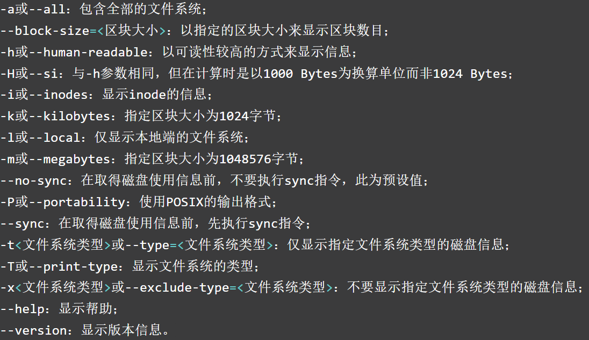
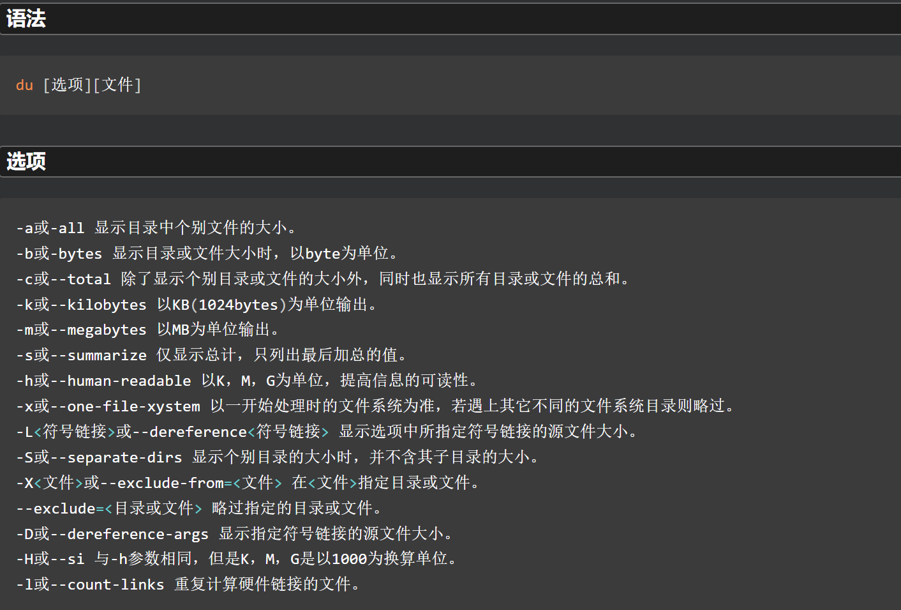
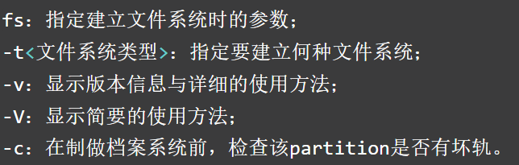
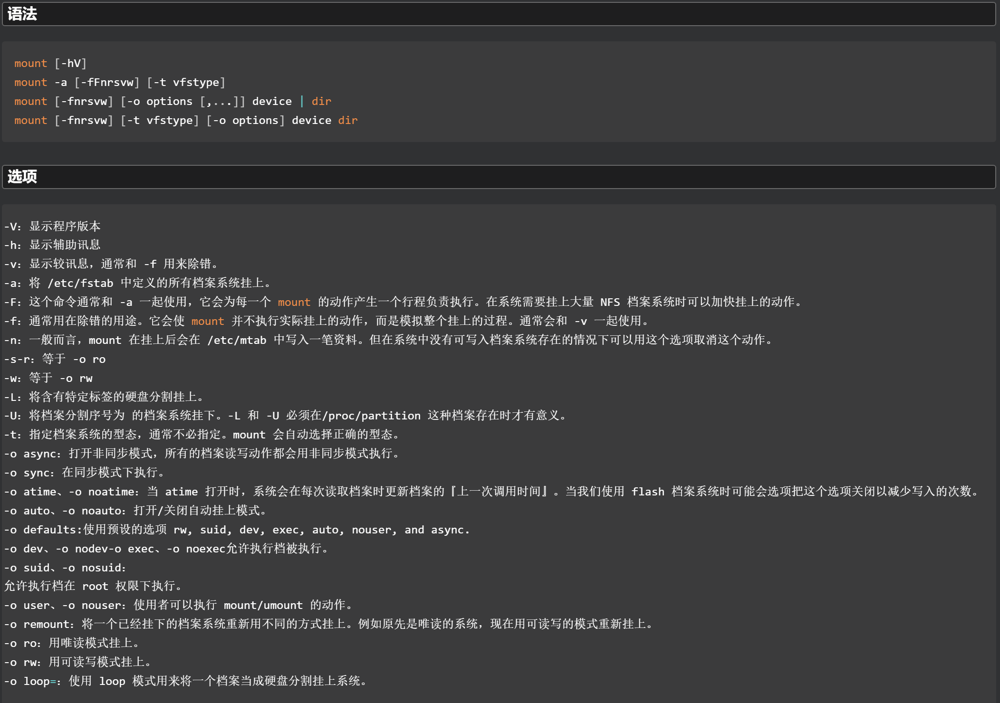
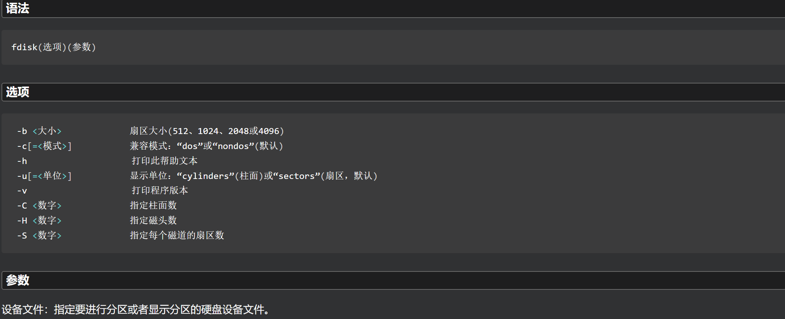

# 磁盘管理

- Linux的所有文件和目录都存在于根分区/中
- Linux系统中的每一个硬件设备都映射到系统的一个文件

**硬盘分区类型主要有：主分区、扩展分区、逻辑分区。**

- 每一个硬盘设备最多只能由4个主分区构成，任何一个扩展分区都要占用一个主分区号码（即：主分区和扩展分区数量最多为4），占用分区号1~4。当分区数量大于4时，要用到扩展分区和逻辑分区，先划分扩展分区，再在扩展分区的基础上建立逻辑分区。
- 在进行系统分区时，主分区一般设置为激活状态，用于在系统启动时引导系统。
- 分区时，每个分区的大小可以由用户指定。

# df 查看磁盘占用情况

 

- df命令会显示每个有数据的**已挂载文件系统**，内容如下：
  - 设备文件位置
  - 以KB显示最大容量的块
  - 以KB显示已用的块
  - 以KB显示剩余的块
  - 已用空间所占的比例
  - 设备的挂载点
- Linux后台一直有进程在处理和使用文件。**df命令显示的是Linux系统认为的当前值**。如果有进程已经创建或删除某个文件，但并未释放文件，则不会计算该文件的值。

**常用组合**

| 组合      | 说明                           |
| :-------- | :----------------------------- |
| df -h     | 使输出的内容易读，M和G         |
| df -ah    | 查看当前系统所有分区使用情况   |
| df -i     | 查看各个分区inode节点占用情况  |
| df -T     | 显示分区类型                   |
| df -t xfs | 显示指定文件类型的磁盘使用情况 |

```shell
# 仅展示部分

# df
[root@bogon zipTest]# df
Filesystem            1K-blocks    Used Available Use% Mounted on
/dev/mapper/rhel-root  46110724 3259840  42850884   8% /
devtmpfs                2515252       0   2515252   0% /dev

# df -ah
[root@bogon zipTest]# df -ah
Filesystem             Size  Used Avail Use% Mounted on
rootfs                    -     -     -    - /
sysfs                     0     0     0    - /sys
tmpfs                  495M   12K  495M   1% /run/user/42
tmpfs                  495M     0  495M   0% /run/user/0

# df -i
[root@bogon zipTest]# df -i
Filesystem              Inodes  IUsed    IFree IUse% Mounted on
/dev/mapper/rhel-root 23066624 119968 22946656    1% /
devtmpfs                628813    447   628366    1% /dev

# df -T
[root@bogon zipTest]# df -T
Filesystem            Type     1K-blocks    Used Available Use% Mounted on
/dev/mapper/rhel-root xfs       46110724 3259844  42850880   8% /
devtmpfs              devtmpfs   2515252       0   2515252   0% /dev

# df -t xfs 
[root@bogon zipTest]# df -t xfs
Filesystem            1K-blocks    Used Available Use% Mounted on
/dev/mapper/rhel-root  46110724 3259844  42850880   8% /
/dev/sda1               1038336  163996    874340  16% /boot
```

# du 查看文件/目录占用空间

 

- du命令可以显示某个指定目录下的磁盘使用情况，默认显示当前目录下的所有文件、目录和子目录的磁盘使用情况，以磁盘块单位（KB）来显示。
- 每行输出的左边为每个文件或目录占用的磁盘块。该列表从当前目录层级的最底部开始，然后按文件、子目录、目录逐级向上显示。

**常用**

| 组合                  | 说明                               |
| :-------------------- | :--------------------------------- |
| du -sh                | 统计当前文件大小，默认不统计软链接 |
| du --max-depth=1-- -h | 按层级统计文件夹大小               |
| du -c                 | 显示所有已列出文件总的大小         |

```shell
# du -sh
[root@bogon ~]# du -sh /root/Test
32K     /root/Test

# du --max-depth=1-- -h
[root@bogon ~]# du --max-depth=1-- -h /root/Test
24K     /root/Test/zipTest
32K     /root/Test
```

```shell
[root@bogon ~]# du -h
4.0K    ./.pip
4.0K    ./.cache/pip/http/f/e/d/0/e
4.0K    ./.cache/pip/http/f/e/d/0
4.0K    ./.cache/pip/http/f/e/d
4.0K    ./.cache/pip/http/f/e
4.0K    ./.cache/pip/http/f
36K     ./.cache/pip/http/b/b/8/7/6
36K     ./.cache/pip/http/b/b/8/7
36K     ./.cache/pip/http/b/b/8
36K     ./.cache/pip/http/b/b
36K     ./.cache/pip/http/b
40K     ./.cache/pip/http
44K     ./.cache/pip
44K     ./.cache
0       ./.ssh
8.0K    ./download
0       ./shellTest/test_dir
28K     ./shellTest
0       ./.config/procps
0       ./.config
124K    .
```

# tune2fs 调整查看文件系统参数

- tune2fs允许系统管理员在Linux ext2、ext3或ext4文件系统上调整各种可调的文件系统参数。

**常用**

| 组合                       | 说明                           |
| :------------------------- | :----------------------------- |
| tune2fs -l 磁盘            | 查看分区信息                   |
| tune2fs -i 时间 磁盘       | 设置多久之后自检               |
| tune2fs -e remount-ro 磁盘 | 设置当磁盘出错时重新挂载为只读 |
| tune2fs -c -l -i 磁盘      | 设置磁盘永久不自检             |

# mkfs 格式化文件系统

**查看当前系统中支持mkfs的文件系统格式**

```shell
ls -l /usr/sbin/mkfs.*

[root@localhost ~]# ll /usr/sbin/mkfs.*
-rwxr-xr-x. 1 root root 375240 Mar  8  2017 /usr/sbin/mkfs.btrfs
-rwxr-xr-x. 1 root root  36984 Jun  1  2017 /usr/sbin/mkfs.cramfs
-rwxr-xr-x. 4 root root  96304 Mar 16  2017 /usr/sbin/mkfs.ext2
-rwxr-xr-x. 4 root root  96304 Mar 16  2017 /usr/sbin/mkfs.ext3
-rwxr-xr-x. 4 root root  96304 Mar 16  2017 /usr/sbin/mkfs.ext4
-rwxr-xr-x. 1 root root  28624 Mar  5  2014 /usr/sbin/mkfs.fat
-rwxr-xr-x. 1 root root  37096 Jun  1  2017 /usr/sbin/mkfs.minix
lrwxrwxrwx. 1 root root      8 Nov 13 21:14 /usr/sbin/mkfs.msdos -> mkfs.fat
lrwxrwxrwx. 1 root root      8 Nov 13 21:14 /usr/sbin/mkfs.vfat -> mkfs.fat
-rwxr-xr-x. 1 root root 368464 May 10  2017 /usr/sbin/mkfs.xfs
```

 

**常用**

| 组合                          | 说明                                 |
| :---------------------------- | :----------------------------------- |
| mkfs -t 文件系统格式 磁盘分区 | 将指定分区格式化为指定的文件系统格式 |

```shell
mkfs -t ext4 /dev/sdb1
```

# mount 挂载/卸载文件系统

- 挂载点必须是一个目录，如果挂载点原本有内容，则在挂载时看不到，卸载后才能重新看到。

 

**常用**

| 组合                                  | 说明                                                      |
| :------------------------------------ | :-------------------------------------------------------- |
| mount                                 | 查看系统的挂载以及媒体设备文件目录等信息                  |
| mount -a                              | 挂载/ect/fstab里的所有分区                                |
| mount 磁盘分区 目录                   | 挂载指定分区到指定目录                                    |
| mount -o re 磁盘分区 目录             | 以只读的方式挂载                                          |
| mount -t iso9660 磁盘分区 目录        | 挂载光驱，使用ISO文件避免将文件解压，可以在挂载后直接访问 |
| mount -t nfs 磁盘分区 目录            | NFS挂载                                                   |
| mount -t ntfs 磁盘分区 目录           | 挂载Windows下分区格式的分区                               |
| mount -t vfat 设备文件 虚拟目录挂载点 | 大多数U盘和软盘会被格式化为vfat文件系统,Windows长文件系统 |

- 虚拟目录挂载点通常是在/mnt中新建一个目录来挂载。
- 媒体设备挂载到虚拟目录后，root用户就有了对该设备的所有访问权限，而其他用户的访问会被限制。

```shell
# 提供信息：设备文件 虚拟目录挂载点 文件系统类型 访问状态
mount 
# 新建文件目录
mkdir -p /mnt/room
# 光盘挂载磁盘分区一般是 /dev/cdrom (设备文件) /mnt/room (虚拟目录挂载点)
mount -t iso9660 设备文件 虚拟目录挂载点
```

## /etc/fstab文件 自动挂载

 

# umount 卸载

- 从Linux上移除一个媒体设备时，需要先使用umount将其从虚拟目录挂载点中卸载，再弹出。
- umount可以提供设备文件或挂载点来卸载指定的设备。
- 如果有任何程序正在使用该设备上的文件，则不能成功卸载。需要先停止使用。可以使用lsof来查看，再搭配kill来处理。

```shell
# 卸载指定挂载点/设备文件目录的设备
umount /mnt/cdrom
```

## lsof 获取使用指定文件的进程

```shell
lsof 设备文件或挂载点
```

# fdisk 基本磁盘管理

 

**常用**

```
[root@bogon ~]# fdisk /dev/sda
Welcome to fdisk (util-linux 2.23.2).

Changes will remain in memory only, until you decide to write them.
Be careful before using the write command.

Command (m for help): m
Command action
   a   toggle a bootable flag
   b   edit bsd disklabel 
   c   toggle the dos compatibility flag
   d   delete a partition # 删除一个磁盘分区
   g   create a new empty GPT partition table
   G   create an IRIX (SGI) partition table
   l   list known partition types
   m   print this menu
   n   add a new partition # 添加分区
   o   create a new empty DOS partition table
   p   print the partition table # 查看分区信息
   q   quit without saving changes # 不保存退出
   s   create a new empty Sun disklabel
   t   change a partition's system id
   u   change display/entry units
   v   verify the partition table
   w   write table to disk and exit # 保存变更信息
   x   extra functionality (experts only)
```

# SWAP空间管理

# RAID 磁盘冗余阵列
